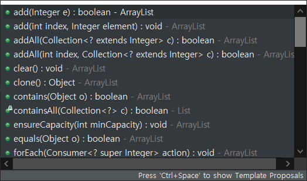
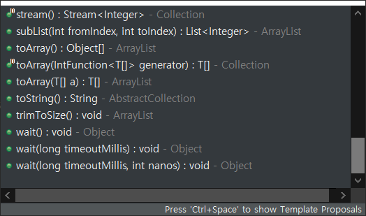

# 출력

---

`"이것을 프린트합니다.\n"` 혹은 `(n + "입니다.\n")`

- `.repeat(n)` 따옴표나 괄호를 반복

`"역슬래쉬 출력 \\"` 출력 : 역슬래쉬 출력 \

## Scanner

`s`

- `.next()` 문자열 입력

- `.charAt(index)` 인덱스 반환

## Buffered

```java
public static void main(String[] args) throws IOException {
	BufferedReader br = new BufferedReader(new InputStreamReader(System.in));
	BufferedWriter bw = new BufferedWriter(new OutputStreamWriter(System.out));
	int n = Integer.parseInt(br.readLine());
	String str = br.readLine();
		
	bw.write(n + "\n");
	bw.write(str);
	bw.flush();
}
```

장점 : 빠르다.

단점

1. IOException 을 throws 해야한다.
2. 숫자형은 변환해야 한다 : String 으로만 입력되기 때문
3. write 후에 flush 를 해야 출력된다.
4. 공백을 입력받지 못한다.

## 공백

`StringTokenizer`

`str.split(' ')`

# String

---

`str`

- `.toUpperCase()` 대문자 변환

- `.toLowerCase()` 소문자 변환

- `.toCharArray()` 문자열을 배열에 넣음 : for-each 구문을 위해

`String`

- `.valueOf(Object)`

```java
String.valueOf(charArray)  // 문자열 출력
```

# Character

---

`Character`

- `.toUpperCase(char)` 대문자 변환
- `.isLowerCase(char)` 소문자이면 true 반환
- `.isAlphabetic(char)` 알파벳이면 true

# 숫자

---

`/` 왼쪽 값 출력 : 0 의 갯수만큼 오른쪽 값 제거

`%` 오른쪽 값 출력 : 0 의 갯수만큼 오른쪽 값 출력

- 값의 왼쪽과 오른쪽 값 세 개씩 출력하는 코드

```java
int n = 123456789;
System.out.println(n / 1000000);  // 123
System.out.println(n % 1000);	 // 789
```

## Integer

`Integer`

- `parseInt(String)` 정수형으로 변환

# if

---

- Main

```java
public class Main {
	public static void main(String[] args) {
        boolean bool = true;
		String str = Class.doReturn(bool);
		System.out.println(str);
	}
}
```

- 비 효율적인 코드

```java
public class Class {
	static String doReturn(boolean bool) {
		if (bool) {
			return "YES";
		} else {
			return "NO";
		}
	}
}
```


- 효율적인 코드

```java
public class Class {
	static String doReturn(boolean bool) {
		return bool? "YES" : "NO";
	}
}
```


## Array

`Object[] arr = new Object[n]` 선언

`Object[] arr = {element1, element2, element3, element4}` 선언

`Array`

- `array[index] = element` add(), set()
- `array[index]` get()
- `.length` size()
- `.clone()` Array List 동일
- `.equals(Object)` Array List 동일
- `.toString()` 재정의가 필요하다.
- `.getClass()`
- `.hashCode()`
- `.notify()`
- `.notifyAll()`
- `.wait()`

## Array List

`ArrayList<Object> arr = new ArrayList<>()` 선언

`name = [element1, element2, element3, element4]` 선언

    

    

    

    

    

`ArrayList` Array 제외 함수

- `.add(element) or .add(index, element)` 값 추가
- `.addAll`
- `.set(index, element)` 값 변경
- `.get(index)` 값 반환
- `.remove(index)` 값 제거
- `.clear()` 모든 값 제거
- `.size()` 리스트 크기 반환
- `.indexOf(element)` 인덱스 반환
- `.lastIndexOf()` 
- `.isEmpty()` 비어있는지 boolean 반환
- `.contains(Object)` 
- `.containsAll()`
- `.ensureCapacity()`
- `.forEach()`
- `.iterator()`
- `.listIterator()`
- `.paralleleStream()`
- `.removeAll()`
- `.removeIf()`
- `.replaceAll()`
- `.sort()`
- `.spliterator()`
- `.stream()`
- `.subList()`
- `.toArray()`
- `.trimToSize()`

## Linked List

`LinkedList` Doubly Linked List : Array List 제외 함수

- `.addFirst(element)`
- `.addLast(element)` 
- `.getFirst()`
- `.getLast()`
- `.removeFirst()`
- `.removeLast()`
- `.removeFirstOccurrence()`
- `.removeLastOccurrence()`
- `.retainAll()`
- `.offerFirst()`
- `.offerLast()`
- `.peekFirst()`
- `.peekLast()`
- `.pollFirst()`
- `.pollLast()`
- `.pop()`
- `.push()`
- `.descendingIterator()`
- `.element()`

Array List 에 있는 `ensureCapacity` 와 `trimToSize` 가 없다.

## Hash Map

`HashMap<Object, Object> hashMap = new HashMap<>()` 선언

`HashMap` 

- `.clear()`
- `.clone()`
- `.equals()` HashMap 값 비교
- `.forEach()`
- `.get()` value 값 반환
- `.getClass()`
- `.getOrDefault(Key, default)` value 값 반환 및 값 없는 경우 default 값 반환
- `.hashCode()`
- `.isEmpty()`
- `.notify()`
- `.notifyAll()`
- `.remove()` 제거
- `.replace()`
- `.replaceAll()`
- `.size()` Key 갯수 반환
- `.toString()`
- `.values()`
- `.wait()`
- `.compute()`
- `.computeIfAbsent()`
- `.computeIfPresent()`
- `.containsKey()`
- `.containsValue()`
- `.entrySet()`
- `.KeySet()` for-each 구문 사용
- `.merge()`
- `.put()` add 기능으로 사용
- `.putAll()`
- `.putIfAbsent()`

add, set, `indexOf`, iterator, stream, sort, `subList`, `tremToSize` 함수가 없습니다.

## Iterator

`Iterator<Object> iterator = arrList.iterator()`

`iterator`

- `.hasNext()` 
- `.next()`
- `.remove()`