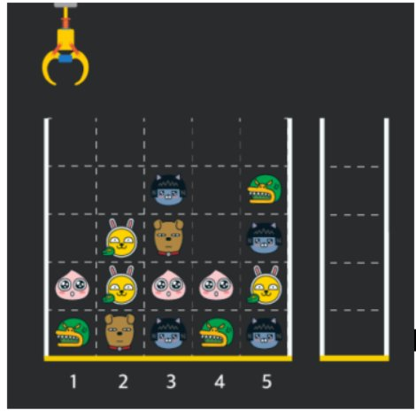
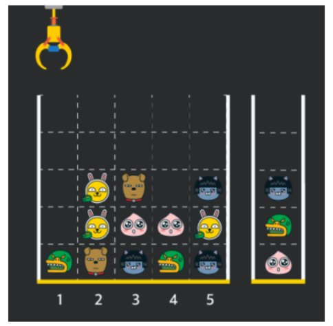
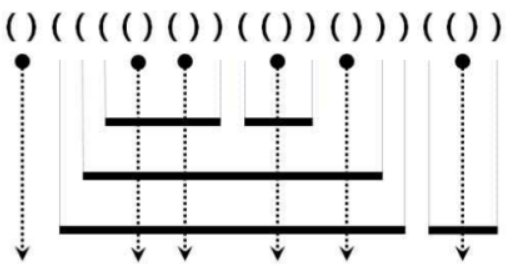

## 1. 올바른 괄호

Stack 은 구덩이, Queue 는 원통의 통로

LIFO 구조

`stack` 

- `push()` 넣기
- `pop()` 꺼내기
- `isEmpty()` 비어있으면 true 반환

```java
import java.util.Scanner;
import java.util.Stack;

public class Main {
	public static void main(String[] args) {
		Scanner sc = new Scanner(System.in);
		String str = sc.next();
		Stack<Character> stack = new Stack<>();
		String answer = "YES";
		
		for (char c : str.toCharArray()) {
			if (c == '(') {
				stack.push(c);
			} else if (stack.isEmpty()) {
				answer = "NO";
				break;
			} else {
				stack.pop();
			}
		}
		
		if (!stack.isEmpty()) {
			answer = "NO";
		}
		System.out.println(answer);
	}
}
```

## 2. 괄호문자제거

```java
import java.util.Scanner;
import java.util.Stack;

public class Main {
	public static void main(String[] args) {
		Scanner sc = new Scanner(System.in);
		String str = sc.next();
		Stack<Character> stack = new Stack<>();
		
		for (char c : str.toCharArray()) {
			if (c == '(') {
				stack.push(c);
			} else if (c == ')') {
				stack.pop();
			}
			
			if (stack.isEmpty() & Character.isAlphabetic(c)) {
				System.out.print(c);
			}
		}
	}
}
```

## 3. 크레인 인형뽑기 (카카오)

크레인에서 [1, 5, 3] 의 순서로 인형을 뽑은 예시





**입력**

첫 줄에 자연수 N 이 주어집니다.

두 번째 줄부터 N*N board 배열이 주어집니다.

0은 빈 칸을 나타냅니다.

board 의 각 숫자는 각기 다른 인형의 모양을 의미하며 같은 숫자는 같은 모양의 인형을 나타냅니다.

board배열이 끝난 다음줄에 moves 배열의 길이 M이 주어집니다.

마지막 줄에는 moves 배열이 주어집니다.

moves 배열 각 원소들의 값은 1 이상이며 board 배열의 가로 크기 이하인 자연수입니다.

```
5
0 0 0 0 0
0 0 1 0 3
0 2 5 0 1
4 2 4 4 2
3 5 1 3 1
8
1 5 3 5 1 2 1 4
```

**출력**

첫 줄에 터트려져 사라진 인형의 개수를 출력합니다.

```
4
```

**코드**

```java
import java.util.Scanner;
import java.util.Stack;

public class Main {
	public static void main(String[] args) {
		Scanner sc = new Scanner(System.in);
		Stack<Integer> stack = new Stack<>();
		int n = sc.nextInt();
		int[][] board = new int[n][n];
		int count = 0;
		
		for (int i = 0; i < n; i++) {
			for (int j = 0; j < n; j++) {
				board[i][j] = sc.nextInt();
			}
		}
		int m = sc.nextInt();
		int[] moves = new int[m];
		
		// 입력
		for (int i = 0; i < m; i++) {
			moves[i] = sc.nextInt();
		}
		stack.push(0);

		loop:
		for (int i = 0; i < m; i++) {
			int height = 0;
			
			while (board[height][moves[i] - 1] == 0) {
				height++;
				if (height == n) {
					continue loop;
				}
			}
			int pick = board[height][moves[i] - 1];
			
			if (stack.lastElement() == pick) {
				stack.pop();
				count += 2;
			} else {
				stack.push(pick);
			}
			board[height][moves[i] - 1] = 0;
		}
		System.out.println(count);
	}
}
```

## 4. 후위식 연산 (postfix)

**입력** 

```
352+*9-
```


**출력** 

```
12
```

**코드** 

```java
import java.util.Scanner;
import java.util.Stack;

public class Main {
	public static void main(String[] args) {
		Scanner sc = new Scanner(System.in);
		Stack<Integer> stack = new Stack<>();
		String str = sc.next();
		
		for (char c : str.toCharArray()) {
			int first;
			int second;
			int answer = 0;
			
			if (Character.isDigit(c)) {
				stack.push(c - 48);
			} else {
				second = stack.pop();
				first = stack.pop();
				
				switch (c) {
				case '+':
					answer = first + second;
					break;
				case '-':
					answer = first - second;
					break;
				case '*':
					answer = first * second;
					break;
				case '/':
					answer = first / second;
					break;
				default:
					break;
				}
				stack.push(answer);
			}
		}
		System.out.println(stack.pop());
	}
}
```

## 5. 쇠막대기



**조건** 

- 쇠막대기는 자신보다 긴 쇠막대기 위에만 놓일 수 있다. - 쇠막대기를 다른 쇠막대기 위에 놓는 경우 완전히 포함되도록 놓되,
  끝점은 겹치지 않도록 놓는다.
- 각 쇠막대기를 자르는 레이저는 적어도 하나 존재한다.
- 수직으로 그려진 점선 화살표는 레이저의 발사 방향이다.

**설명** 

1. 모든 ‘( ) ’는 반 드시 레이저를 표현한다.
2. 쇠막대기의 왼쪽 끝은 여는 괄호 ‘ ( ’ 로, 오른쪽 끝은 닫힌 괄호 ‘) ’ 로 표현된다.
3. 이와 같은 방식으로 주어진 쇠막대기들은 총 17 개의 조각으로 잘려진다.

**입력** 

```
()(((()())(())()))(())
```

**출력** 

```
17
```

**코드** 

```java
import java.util.Scanner;
import java.util.Stack;

public class Main {
	public static void main(String[] args) {
		Scanner sc = new Scanner(System.in);
		Stack<Character> stack = new Stack<>();
		String str = sc.next();
		int answer = 0;

		for (int i = 0; i < str.length(); i++) {
			if (str.charAt(i) == '(') {
				stack.push('(');
			} else {
				stack.pop();
				if (str.charAt(i - 1) == '(') {
					answer += stack.size();
				} else {
					answer++;
				}
			}
		}
		System.out.println(answer);
	}
}
```

