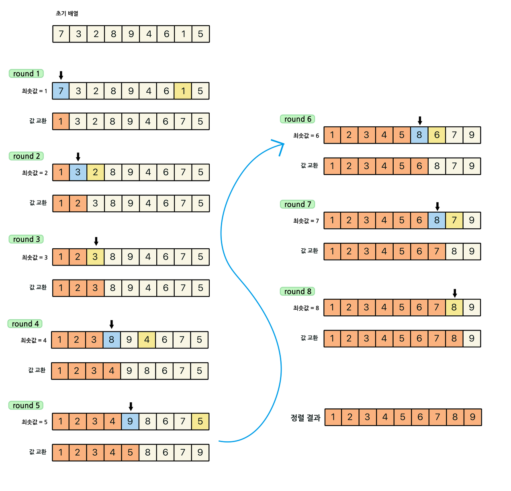
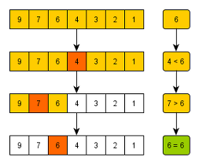
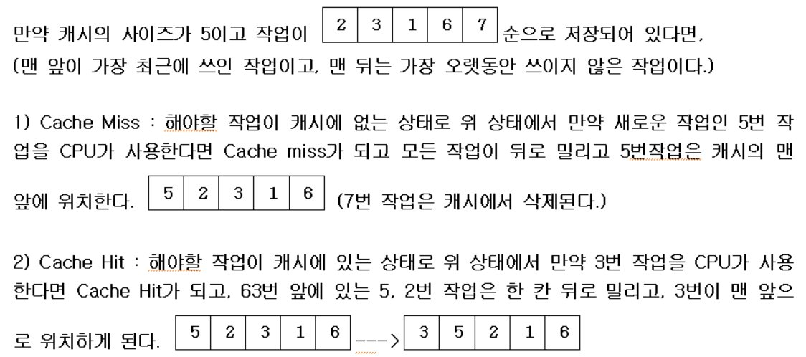

# 정렬

정렬알고리즘 애니메이션

<https://www.toptal.com/developers/sorting-algorithms>{:target="blank"}

## 1. 선택정렬



가장 작은 수를 찾아 앞에서부터 정렬한다.

비교정렬이자 제자리정렬

시간복잡도는 $$O(N^2)$$ 이다.

항상 비슷한 시간이 걸린다.

**입력**

```
6
13 5 11 7 23 15
```

**출력**

```
13과 5을 바꿉니다.
[5, 13, 11, 7, 23, 15]
13과 7을 바꿉니다.
[5, 7, 11, 13, 23, 15]
11과 11을 바꿉니다.
[5, 7, 11, 13, 23, 15]
13과 13을 바꿉니다.
[5, 7, 11, 13, 23, 15]
23과 15을 바꿉니다.
[5, 7, 11, 13, 15, 23]
```

**swap 메서드사용 코드** 

```java
public class Main {
	public static void main(String[] args) {
		Scanner sc = new Scanner(System.in);
		int n = sc.nextInt();
		int[] arr = new int[n];

		for (int i = 0; i < n; i++) {
			arr[i] = sc.nextInt();
		}

		for (int i = 0; i < n - 1; i++) {
			int index = i;
			for (int j = i + 1; j < n; j++) {
				if (arr[index] > arr[j]) {
					index = j;
				}
			}
			swap(arr, i, index);
		}
		System.out.println(Arrays.toString(arr));
	}

	static void swap(int[] arr, int i, int j) {
		int temp = arr[i];
		arr[i] = arr[j];
		arr[j] = temp;
	}
}
```

**메소드없는 코드**

```java
public class Main {
	public static void main(String[] args) {
		Scanner sc = new Scanner(System.in);
		int n = sc.nextInt();
		int[] arr = new int[n];

		for (int i = 0; i < n; i++) {
			arr[i] = sc.nextInt();
		}

		for (int i = 0; i < n - 1; i++) {
			int index = i;
			for (int j = i + 1; j < n; j++) {
				if (arr[index] > arr[j]) {
					index = j;
				}
			}
			int temp = arr[i];
			arr[i] = arr[index];
			arr[index] = temp;
		}
		System.out.println(Arrays.toString(arr));
	}
}
```

**설명포함 코드**

```java
public class Main {
	public static void main(String[] args) {
		Scanner sc = new Scanner(System.in);
		int n = sc.nextInt();
		int[] arr = new int[n];

		for (int i = 0; i < n; i++) {
			arr[i] = sc.nextInt();
		}

		for (int i = 0; i < n - 1; i++) {
			int index = i;
			for (int j = i + 1; j < n; j++) {
				if (arr[index] > arr[j]) {
					index = j;
				}
			}
			int temp = arr[i];
			arr[i] = arr[index];
			arr[index] = temp;
			System.out.println(temp + "과 " + arr[i] + "을 바꿉니다.");
			System.out.println(Arrays.toString(arr));
		}
	}
}
```

## 2. 버블정렬




이웃한 것 끼리 비교하여 정렬

이미 거의 정렬된 상태에서 빠르다.

```java
public class Main {
	public static void main(String[] args) {
		Scanner sc = new Scanner(System.in);
		int n = sc.nextInt();
		int[] arr = new int[n];
		
		for (int i = 0; i < n; i++) {
			arr[i] = sc.nextInt();
		}
		
		for (int i = 1; i < n; i++) {
			for (int j = 0; j < n - i; j++) {
				if (arr[j] > arr[j + 1]) {
					int temp = arr[j];
					arr[j] = arr[j + 1];
					arr[j + 1] = temp;
				}
			}
		}
		System.out.println(Arrays.toString(arr));
	}
}
```

## 3. 삽입정렬

    

이미 거의 정렬된 상태에서 빠르다.

i 는 1부터 증가, j 는 감소하며 i 값을 끼워넣는다.

```java
public class Main {
	public static void main(String[] args) {
		Scanner sc = new Scanner(System.in);
		int n = sc.nextInt();
		int[] arr = new int[n];

		for (int i = 0; i < n; i++) {
			arr[i] = sc.nextInt();
		}

		for (int i = 1; i < n; i++) {
			int target = arr[i];
			int j = i - 1;
			while (j >= 0 && arr[j] > target) {
				arr[j + 1] = arr[j];
				j--;
			}
			arr[j + 1] = target;
		}
		System.out.println(Arrays.toString(arr));
	}
}
```

| 정렬     | 초기값 | 최종값 | 초기값 | 최종값      |
| -------- | ------ | ------ | ------ | ----------- |
| 선택정렬 | 0      | n-1    | i+1    | n           |
| 버블정렬 | 1      | n      | 0      | n-i         |
| 삽입정렬 | 1      | n      | i-1    | 0 보다 크다 |

## 4. LRU: Least Recently Used



캐시, 카카오 변형

**입력**

```
5 9
1 2 3 2 6 2 3 5 7
```

**출력** 

```
Cache Miss
[1, 0, 0, 0, 0]: 1
Cache Miss
[1, 1, 0, 0, 0]: 1을 밀었습니다.
[2, 1, 0, 0, 0]: 2
Cache Miss
[2, 1, 1, 0, 0]: 1을 밀었습니다.
[2, 2, 1, 0, 0]: 2을 밀었습니다.
[3, 2, 1, 0, 0]: 3
Cache Hit
2가 1위치에 있습니다.
Cache Miss
[3, 3, 1, 0, 0]: 3을 밀었습니다.
[2, 3, 1, 0, 0]: 2
Cache Miss
[2, 3, 1, 1, 0]: 1을 밀었습니다.
[2, 3, 3, 1, 0]: 3을 밀었습니다.
[2, 2, 3, 1, 0]: 2을 밀었습니다.
[6, 2, 3, 1, 0]: 6
Cache Hit
2가 1위치에 있습니다.
Cache Miss
[6, 6, 3, 1, 0]: 6을 밀었습니다.
[2, 6, 3, 1, 0]: 2
Cache Hit
3가 2위치에 있습니다.
Cache Miss
[2, 6, 6, 1, 0]: 6을 밀었습니다.
[2, 2, 6, 1, 0]: 2을 밀었습니다.
[3, 2, 6, 1, 0]: 3
Cache Miss
[3, 2, 6, 1, 1]: 1을 밀었습니다.
[3, 2, 6, 6, 1]: 6을 밀었습니다.
[3, 2, 2, 6, 1]: 2을 밀었습니다.
[3, 3, 2, 6, 1]: 3을 밀었습니다.
[5, 3, 2, 6, 1]: 5
Cache Miss
[5, 3, 2, 6, 6]: 6을 밀었습니다.
[5, 3, 2, 2, 6]: 2을 밀었습니다.
[5, 3, 3, 2, 6]: 3을 밀었습니다.
[5, 5, 3, 2, 6]: 5을 밀었습니다.
[7, 5, 3, 2, 6]: 7
```

**설명없는 코드**

```java
public class Main {
	public static void main(String[] args) {
		Scanner sc = new Scanner(System.in);
		int c = sc.nextInt();
		int w = sc.nextInt();
		int[] cash = new int[c];
		int[] work = new int[w];
		
		for (int i = 0; i < w; i++) {
			work[i] = sc.nextInt();
		}
		
		for (int i = 0; i < w; i++) {
			int index = c - 1;
			for (int j = 0; j < c; j++) {
				if (work[i] == cash[j]) {
					index = j;
					break;
				}
			}
			for (int j = index; j > 0; j--) {
				if (cash[j] != cash[j - 1]) {
					cash[j] = cash[j - 1];
				}
			}
			cash[0] = work[i];
		}
		System.out.println(Arrays.toString(cash));
	}
}
```

**설명있는 코드**

```java
public class Main {
	public static void main(String[] args) {
		Scanner sc = new Scanner(System.in);
		int c = sc.nextInt();
		int w = sc.nextInt();
		int[] cash = new int[c];
		int[] work = new int[w];

		for (int i = 0; i < w; i++) {
			work[i] = sc.nextInt();
		}

		for (int i = 0; i < w; i++) {
			int index = c - 1;
			boolean miss = false;
			for (int j = 0; j < c; j++) {
				if (work[i] == cash[j]) {
					System.out.println("Cache Hit");
					System.out.println(work[i] + "가 " + j + "위치에 있습니다.");
					index = j;
					break;
				} else {
					miss = true;
				}
			}
			if (miss) {
				System.out.println("Cache Miss");
			}
			for (int j = index; j > 0; j--) {
				if (cash[j] != cash[j - 1]) {
					cash[j] = cash[j - 1];
					System.out.println(Arrays.toString(cash) + ": " + cash[j - 1] + "을 밀었습니다.");
				}
			}
			cash[0] = work[i];
			System.out.println(Arrays.toString(cash) + ": " + cash[0]);
		}
	}
}
```

## 5. 중복확인

이 문제는 HashMap 으로도 풀 수 있을 것 같다.

```java
public class Main {
	public static void main(String[] args) {
		Scanner sc = new Scanner(System.in);
		int n = sc.nextInt();
		int[] numbers = new int[n];
		char answer = 'U';

		for (int i = 0; i < n; i++) {
			numbers[i] = sc.nextInt();
		}
		
		loop:
		for (int i = 0; i < n - 1; i++) {
			for (int j = i + 1; j < n; j++) {
				if (numbers[i] == numbers[j]) {
					answer = 'D';
					break loop;
				}
			}
		}
		System.out.println(answer);
	}
}
```

## 6. 장난꾸러기

**입력**

```
9
120 125 152 130 135 135 143 127 160
```

**출력** 

```
3 8 
```

**코드 ** 

```java
public class Main {
	public static void main(String[] args) {
		Scanner sc = new Scanner(System.in);
		int n = sc.nextInt();
		int[] arr = new int[n];
		int[] sorted = new int[n];
		int number = 1;

		for (int i = 0; i < n; i++) {
			arr[i] = sc.nextInt();
		}
		sorted = arr.clone();
		
		for (int i = 1; i < n; i++) {
			int target = sorted[i];
			int j = i - 1;
			while (j >= 0 && sorted[j] > target) {
				sorted[j + 1] = sorted[j];
				j--;
			}
			sorted[j + 1] = target;
		}
		
		for (int i = 0; i < n; i++) {
			if (arr[i] != sorted[i]) {
				System.out.print(number + " ");
			}
			number++;
		}
	}
}
```

## 7. 좌표정렬

**입력**

```
5
2 7
1 3
1 2
2 5
3 6
```

**출력**

```
[2 7, 2 7, 1 2, 2 5, 3 6]: 2 7를 밉니다.
[1 3, 2 7, 1 2, 2 5, 3 6]
[1 3, 2 7, 2 7, 2 5, 3 6]: 2 7를 밉니다.
[1 3, 1 3, 2 7, 2 5, 3 6]: 1 3를 밉니다.
[1 2, 1 3, 2 7, 2 5, 3 6]
[1 2, 1 3, 2 7, 2 7, 3 6]: 2 7를 밉니다.
[1 2, 1 3, 2 5, 2 7, 3 6]
[1 2, 1 3, 2 5, 2 7, 3 6]
```

**코드**

```java
class Coordinate implements Cloneable {
	int x;
	int y;

	Coordinate(int x, int y) {
		this.x = x;
		this.y = y;
	}

	@Override
	public String toString() {
		return x + " " + y;
	}
	
	@Override
	protected Coordinate clone() throws CloneNotSupportedException {
		return (Coordinate) super.clone();
	}
}

public class Main {
	public static void main(String[] args) throws CloneNotSupportedException {
		Scanner sc = new Scanner(System.in);
		int n = sc.nextInt();
		Coordinate[] coordinates = new Coordinate[n];

		for (int i = 0; i < n; i++) {
			int x = sc.nextInt();
			int y = sc.nextInt();
			coordinates[i] = new Coordinate(x, y);
		}

		for (int i = 1; i < n; i++) {
			Coordinate target = coordinates[i];
			int j = i - 1;
			while (j >= 0 && coordinates[j].x >= target.x) {
				if (coordinates[j].x > target.x) {
					coordinates[j + 1] = coordinates[j].clone();
					System.out.println(Arrays.toString(coordinates) + ": " + coordinates[j].x + ", " + coordinates[j].y + "를 밉니다.");
					j--;
				} else if (coordinates[j].y > target.y) {
					coordinates[j + 1] = coordinates[j].clone();
					System.out.println(Arrays.toString(coordinates) + ": " + coordinates[j].x + ", " + coordinates[j].y + "를 밉니다.");
					j--;
				}
			}
			coordinates[j + 1] = target.clone();
			System.out.println(Arrays.toString(coordinates));
		}
	}
}
```

## 8. 이분검색

