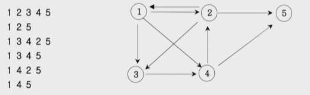

## 1. 재귀함수: 스택프레임

재귀함수는 스택을 사용합니다.

```java
public class Main {
	public static void main(String[] args) {
		recursive(3);
	}
}
```

**재귀함수 전에 선언**

```java
static void recursive(int n) {
    if (n != 0) {
        System.out.print(n + " ");
        recursive(n - 1);
    }
}
```
**출력**

```
3 2 1 
```
**재귀함수 후에 선언** 

```java
static void recursive(int n) {
	if (n != 0) {
		recursive(n - 1);
		System.out.print(n + " ");
	}
}
```
**출력**

```
1 2 3 
```

## 2. 이진수 출력 (재귀)

이진수는 나머지를 역으로 출력하면 됩니다.

```java
public class Main {
	static void r(int n) {
		if (n != 0) {
			r(n / 2);
			System.out.print(n % 2);
		}
	}

	public static void main(String[] args) {
		Scanner sc = new Scanner(System.in);
		r(sc.nextInt());
	}
}
```

## 3. 팩토리얼

```java
public class Main {
	static int r(int n) {
		if (n == 1) {
			return 1;
		} else {
			return r(n - 1) * n;
		}
	}

	public static void main(String[] args) {
		Scanner sc = new Scanner(System.in);
		System.out.println(r(sc.nextInt()));
	}
}
```

## 4. 피보나치 재귀 (메모이제이션)

대부분은 재귀함수보다 for 문과 배열로 짜는 것이 메모리 등이 더 가볍고 유리합니다.

**기본코드** 

```java
public class Main {
	static int r(int n) {
		if (n == 1 || n == 2) {
			return 1;
		} else {
			return r(n - 1) + r(n - 2);
		}
	}

	public static void main(String[] args) {
		Scanner sc = new Scanner(System.in);
		int n = sc.nextInt();
		System.out.println(r(n));
	}
}
```

**입력** 

```
10
```

**출력**

```
1 1 2 3 5 8 13 21 34 55 
```

**배열저장 코드**

```java
public class Main {
	static int[] arr;
	
	static int r(int n) {
		if (n == 1 || n == 2) {
			return arr[n - 1] = 1;
		} else {
			return arr[n - 1] = r(n - 1) + r(n - 2);
		}
	}

	public static void main(String[] args) {
		Scanner sc = new Scanner(System.in);
		int n = sc.nextInt();
		arr = new int[n];
		r(n);
		
		for (int num : arr) {
			System.out.print(num + " ");
		}
	}
}
```

**메모이제이션의 중요성**

n = 45 일 때,

메모이제이션을 사용한 코드는 0.1초만에 출력되는 반면

사용하지 않은 코드는 4.45초가 걸렸다.

n = 46 일 때,

메모이제이션을 사용한 코드는 0.1초만에 출력되는 반면

사용하지 않은 코드는 6.89초가 걸렸다.

```java
if (arr[n] > 0) {
    return arr[n];
```

단 두 줄의 코드를 추가함으로써 엄청난 시간을 아낄 수 있는 것이다.

**코드** 

```java
public class Main {
	static int[] arr;

	static int r(int n) {
		if (arr[n] > 0) {
			return arr[n];
		} else if (n == 1 || n == 2) {
			return arr[n] = 1;
		} else {
			return arr[n] = r(n - 1) + r(n - 2);
		}
	}

	public static void main(String[] args) {
		Scanner sc = new Scanner(System.in);
		int n = sc.nextInt();
		arr = new int[n + 1];
		r(n);

		for (int num : arr) {
			System.out.print(num + " ");
		}
	}
}
```

## 5. 이진트리순회 (DFS: Depth-First Search)

전위순회

중위순회: 부모를 중간에 출력

후위순회: 부모를 마지막에 출력. 병합정렬과 같습니다.

```java
class Node {
	int data;
	Node left, right;

	Node(int data) {
		this.data = data;
	}
}

public class Main {
	public static void main(String[] args) {
		Node root = new Node(1);
		root.left = new Node(2);
		root.right = new Node(3);
		root.left.left = new Node(4);
		root.left.right = new Node(5);
		root.right.left = new Node(6);
		root.right.right = new Node(7);
		
		dfs(root);
	}
}
```

**전위순회**

```java
static void dfs(Node node) {
	if (node != null) {
		System.out.print(node.data + " ");
		dfs(node.left);
		dfs(node.right);
	}
}
```

**출력**

```
1 2 4 5 3 6 7 
```

**중위순회**

```java
static void dfs(Node node) {
	if (node != null) {
		dfs(node.left);
		System.out.print(node.data + " ");
		dfs(node.right);
	}
}
```

**출력**

```
4 2 5 1 6 3 7 
```

**후위순회**

```java
static void dfs(Node node) {
	if (node != null) {
		dfs(node.left);
		dfs(node.right);
		System.out.print(node.data + " ");
	}
}
```

**출력**

```
4 5 2 6 7 3 1 
```

## 6. 부분집합 구하기 (DFS)

date: 07.13

```java
public class Main {
	static int input = 3;
	static int[] arr = new int[input + 1];
	
	public static void main(String[] args) {
		dfs(1);
	}
	
	static void dfs(int n) {
		if (n != input + 1) {
			arr[n] = 1;
			dfs(n + 1);
			arr[n] = 0;
			dfs(n + 1);
		} else {
			for (int i = 1; i <= input; i++) {
				if (arr[i] == 1) {
					System.out.print(i);
				}
			}
			System.out.println();
		}
	}
}
```

## 7. 이진트리 레벨탐색 (BFS: Breadth-First Search)

너비우선탐색

Queue 에서 빼면서 자식들을 저장한다.

```java
class Node {
	int data;
	Node left, right;

	Node(int data) {
		this.data = data;
	}
}

public class Main {
	public static void main(String[] args) {
		Node root = new Node(1);
		root.left = new Node(2);
		root.right = new Node(3);
		root.left.left = new Node(4);
		root.left.right = new Node(5);
		root.right.left = new Node(6);
		root.right.right = new Node(7);
		
		bfs(root);
	}
	
	static void bfs(Node node) {
		Queue<Node> q = new LinkedList<>();
		q.add(node);
		int level = 0;
		while (!q.isEmpty()) {
			int len = q.size();
			System.out.print(level + ": ");
			for (int i = 0; i < len; i++) {
				Node current = q.poll();
				System.out.print(current.data + " ");
				if (current.left != null) {
					q.add(current.left);
				}
				if (current.right != null) {
					q.add(current.right);
				}
			}
			level++;
			System.out.println();
		}
	}
}
```

## 8. 송아지찾기1 (BFS)

**입력**

```
5 14
```

**출력**

```
5를 꺼냈습니다. []
6를 넣었습니다.
4를 넣었습니다.
10를 넣었습니다.
level: 1
6를 꺼냈습니다. [4, 10]
7를 넣었습니다.
11를 넣었습니다.
4를 꺼냈습니다. [10, 7, 11]
3를 넣었습니다.
9를 넣었습니다.
10를 꺼냈습니다. [7, 11, 3, 9]
15를 넣었습니다.
level: 2
7를 꺼냈습니다. [11, 3, 9, 15]
8를 넣었습니다.
12를 넣었습니다.
11를 꺼냈습니다. [3, 9, 15, 8, 12]
16를 넣었습니다.
3를 꺼냈습니다. [9, 15, 8, 12, 16]
2를 넣었습니다.
9를 꺼냈습니다. [15, 8, 12, 16, 2]
3
```

**설명있는 코드**

```java
public class Main {
	static int answer = 0;
	static int[] move = {1, -1, 5};
	static int[] point = new int[10001];
	static Queue<Integer> q = new LinkedList<>();
	private static int next;
	private static int level = 0;
	
	public static void main(String[] args) {
		Scanner sc = new Scanner(System.in);
		int su = sc.nextInt();
		int cow = sc.nextInt();
		int answer = bfs(su, cow);
		System.out.println(answer);
	}

	static int bfs(int su, int cow) {
		q.add(su);
		point[su] = 1;
		
		while (!q.isEmpty()) {
			int len = q.size();
			for (int i = 0; i < len; i++) {
				int poll = q.poll();
				System.out.println(poll + "를 꺼냈습니다. " + q);
				
				for (int j = 0; j < move.length; j++) {
					next = poll + move[j];
					if (next == cow) {
						return level + 1;
					}
					if (point[next] == 1) {
						continue;
					}
					
					if (next >= 1 && next <= 10000) {
						q.add(next);
						point[next] = 1;
						System.out.println(next + "를 넣었습니다.");
					}
				}
			}
			level++;
			System.out.println("level: " + level);
		}
		return 0;
	}
}
```

## 9. Tree 말단노드까지의 가장 잛은 경로 (DFS)

## 10. 그래프와 인접행렬

1. 무방향 그래프
2. 방향 그래프
3. 가중치방향 그래프

## 11. 경로탐색 (DFS)

방향그래프가 주어지면 1번 정점에서 point 정점으로 가는 모든 경로의 가지수를 출력하는 프로그램을 작성하세요.

아래 그래프에서 1번 정점에서 5번 정점으로 가는 가지 수는 총 6가지 입니다.



**입력** 

```
5 9
1 2
1 3
1 4
2 1
2 3
2 5
3 4
4 2
4 5
```

**출력**

```
1에서 2로 이동
2에서 3로 이동
3에서 4로 이동
4에서 5로 이동
도착!
2에서 5로 이동
도착!
1에서 3로 이동
3에서 4로 이동
4에서 2로 이동
2에서 5로 이동
도착!
4에서 5로 이동
도착!
1에서 4로 이동
4에서 2로 이동
2에서 3로 이동
2에서 5로 이동
도착!
4에서 5로 이동
도착!
6
```

**설명없는 코드**

```java
static void solve(int start) {
	check[start] = 1;

	if (start == point) {
		count++;
	}
	for (int end = 1; end <= point; end++) {
		if (arr[start][end] == 1 && check[end] == 0) {
			solve(end);
			check[start] = 0;
		}
	}
}
```

```java
public class Main {
	static int count = 0;
	static int point;
	static int arrow;
	static int[][] arr;
	static int[] check;

	public static void main(String[] args) {
		Scanner sc = new Scanner(System.in);
		point = sc.nextInt();
		arrow = sc.nextInt();
		arr = new int[point + 1][point + 1];
		check = new int[point + 1];
		
		for (int i = 0; i < arrow; i++) {
			int n = sc.nextInt();
			int m = sc.nextInt();
			arr[n][m] = 1;
		}

		solve(1);
		System.out.println(count);
	}	
}
```

**설명있는 코드**

```java
public class Main {
	static int count = 0;
	static int point;
	static int arrow;
	static int[][] arr;
	static int[] check;

	public static void main(String[] args) {
		Scanner sc = new Scanner(System.in);
		point = sc.nextInt();
		arrow = sc.nextInt();
		arr = new int[point + 1][point + 1];
		check = new int[point + 1];

		for (int i = 0; i < arrow; i++) {
			int n = sc.nextInt();
			int m = sc.nextInt();
			arr[n][m] = 1;
		}

		solve(1);
		System.out.println(count);
	}

	static void solve(int start) {
		check[start] = 1;

		if (start == point) {
			count++;
			System.out.println("도착!");
		}
		for (int end = 1; end <= point; end++) {
			if (arr[start][end] == 1 && check[end] == 0) {
				System.out.println(start + "에서 " + end + "로 이동");
				solve(end);
				check[start] = 0;
			}
		}
	}
}
```

