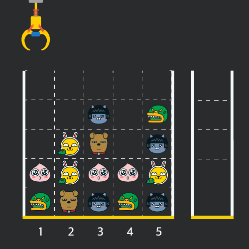
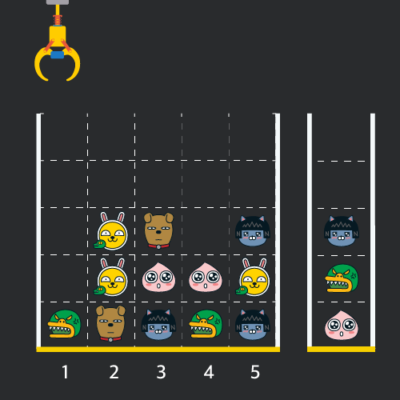
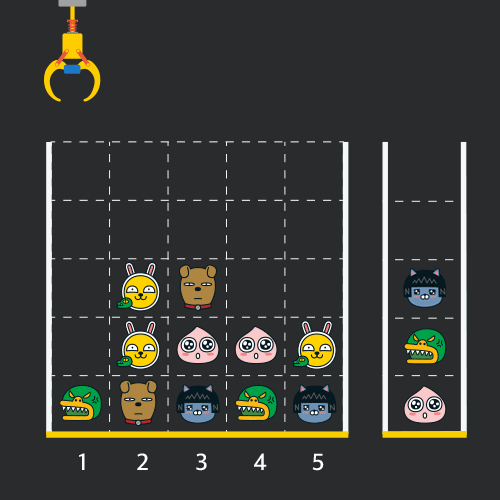
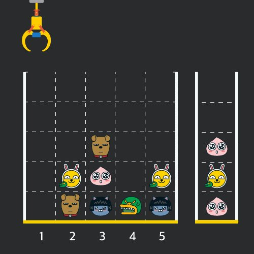

---

title: 프로그래머스
category: java
---

## 1. 로또의 최고 순위와 최저 순위

**이중 for문 풀이**

```java
class Solution {
    public int[] solution(int[] lottos, int[] win_nums) {
        int count = 0;
        int zero = 0;
        
        for (int l : lottos) {
            for (int w : win_nums) {
                if (l == w) count++;
            }
            if (l == 0) zero++;
        }

        int bottomRank = count == 0 ? 6 : 7 - count;
        int topRank = count + zero == 0 ? 6 : 7 - (count + zero);
        return new int[] {topRank, bottomRank};
    }
}
```

**Map 풀이**

```java
import java.util.HashMap;

class Solution {
    public int[] solution(int[] lottos, int[] win_nums) {
        HashMap<Integer, Boolean> map = new HashMap<>();
        int zeroCount = 0;

        for(int lotto : lottos) {
            if (lotto == 0) zeroCount++;
            else map.put(lotto, true);
        }

        int sameCount = 0;
        for(int winNum : win_nums) {
            if (map.containsKey(winNum)) sameCount++;
        }

        int minRank = sameCount == 0 ? 6 : 7 - sameCount;
        int maxRank = (sameCount + zeroCount) == 0 ? 6 : 7 - (sameCount + zeroCount);
        return new int[] {maxRank, minRank};
    }
}
```

## 2. 없는 숫자 더하기

1점

**문제 설명**

0부터 9까지의 숫자 중 일부가 들어있는 배열 `numbers`가 매개변수로 주어집니다. `numbers`에서 찾을 수 없는 0부터 9까지의 숫자를 모두 찾아 더한 수를 return 하도록 solution 함수를 완성해주세요.

```java
class Solution {
    public int solution(int[] numbers) {
        int answer = 45;
        for (int i : numbers) {
			answer -= i;
		}
        return answer;
    }
}
```

## 3. 음양 더하기

1점

**문제 설명**

어떤 정수들이 있습니다. 이 정수들의 절댓값을 차례대로 담은 정수 배열 absolutes와 이 정수들의 부호를 차례대로 담은 불리언 배열 signs가 매개변수로 주어집니다. 실제 정수들의 합을 구하여 return 하도록 solution 함수를 완성해주세요.

```java
class Solution {
    public int solution(int[] absolutes, boolean[] signs) {
        int answer = 0;
        
        for (int i = 0; i < absolutes.length; i++) {
            answer += absolutes[i] * (signs[i] ? 1 : -1);
        }
        return answer;
    }
}
```

## 4. 내적

1점

**문제 설명**

길이가 같은 두 1차원 정수 배열 a, b가 매개변수로 주어집니다. a와 b의 [내적](https://en.wikipedia.org/wiki/Dot_product)을 return 하도록 solution 함수를 완성해주세요.

이때, a와 b의 내적은 `a[0]*b[0] + a[1]*b[1] + ... + a[n-1]*b[n-1]` 입니다. (n은 a, b의 길이)

```java
class Solution {
    public int solution(int[] a, int[] b) {
        int answer = 0;
        
        for (int i = 0; i < a.length; i++) {
            answer += a[i] * b[i];
        }
        return answer;
    }
}
```

## 5. 소수 만들기

date 9.19

**문제 설명**

주어진 숫자 중 3개의 수를 더했을 때 소수가 되는 경우의 개수를 구하려고 합니다. 숫자들이 들어있는 배열 nums가 매개변수로 주어질 때, nums에 있는 숫자들 중 서로 다른 3개를 골라 더했을 때 소수가 되는 경우의 개수를 return 하도록 solution 함수를 완성해주세요.

**제한사항**

- nums에 들어있는 숫자의 개수는 3개 이상 50개 이하입니다.
- nums의 각 원소는 1 이상 1,000 이하의 자연수이며, 중복된 숫자가 들어있지 않습니다.

---

**입출력 예**

| nums        | result |
| ----------- | ------ |
| [1,2,3,4]   | 1      |
| [1,2,7,6,4] | 4      |

**입출력 예 설명**

입출력 예 #1
[1,2,4]를 이용해서 7을 만들 수 있습니다.

입출력 예 #2
[1,2,4]를 이용해서 7을 만들 수 있습니다.
[1,4,6]을 이용해서 11을 만들 수 있습니다.
[2,4,7]을 이용해서 13을 만들 수 있습니다.
[4,6,7]을 이용해서 17을 만들 수 있습니다.

**숏코딩**

```java
class Solution {
	public int solution(int[] nums) {
		int count = 0;

		for (int i = 0; i < nums.length - 2; i++) {
			for (int j = i + 1; j < nums.length - 1; j++) {
				for (int k = j + 1; k < nums.length; k++) {
					int sum = nums[i] + nums[j] + nums[k];
					if (isPrime(sum)) count++;
				}
			}
		}
		return count;
	}

	private boolean isPrime(int num) {
		for (int i = 2; i <= Math.sqrt(num); i++) {
			if (num % i == 0) return false;
		}
		return true;
	}
}
```

**메모이제이션**

```java
class Solution {
	public int solution(int[] nums) {
		HashMap<Integer, Boolean> primes = new HashMap<>();
		int count = 0;

		for (int i = 0; i < nums.length - 2; i++) {
			for (int j = i + 1; j < nums.length - 1; j++) {
				for (int k = j + 1; k < nums.length; k++) {
					int sum = nums[i] + nums[j] + nums[k];
					
					if (primes.containsKey(sum)) count += primes.get(sum) ? 1 : 0;
					else if (isPrime(sum)) {
						count++;
						primes.put(sum, true);
					} else primes.put(sum, false);
				}
			}
		}
		return count;
	}

	private boolean isPrime(int num) {
		for (int i = 2; i <= Math.sqrt(num); i++) {
			if (num % i == 0) return false;
		}
		return true;
	}
}
```

**설명출력 전체코드**

```java
public class Main {
	public static void main(String[] args) {
		Solution s = new Solution();
		int[] nums = {1, 2, 7, 6, 4, 5};

		System.out.println(s.solution(nums));
	}
}

class Solution {
	public int solution(int[] nums) {
		ArrayList primes = new ArrayList();
		ArrayList nonPrimes = new ArrayList();
		System.out.println(Arrays.toString(nums));
		int count = 0;

		for (int i = 0; i < nums.length - 2; i++) {
			for (int j = i + 1; j < nums.length - 1; j++) {
				for (int k = j + 1; k < nums.length; k++) {
					System.out.printf("%d+%d+%d=%d\n", nums[i], nums[j], nums[k], nums[i] + nums[j] + nums[k]);
					int sum = nums[i] + nums[j] + nums[k];
		
					if (primes.contains(sum)) {
						count++;
						System.out.println("소수배열: " + primes);
						System.out.printf("%d 이 이미 있습니다. count = %d\n", sum, count);
					} else if (nonPrimes.contains(sum)) {
						System.out.println("소수가 아닌 배열: " + nonPrimes);
						System.out.printf("%d 이 이미 있습니다.\n", sum);
						continue;
					}
					else if (isPrime(sum)) {
						count++;
						primes.add(sum);
						System.out.printf("count = %d\n", count);
					} else {
						nonPrimes.add(sum);
					}
				}
			}
		}
		System.out.println();
		return count;
	}

	private boolean isPrime(int number) {
		System.out.println("isPrime 실행");
		for (int i = 2; i <= Math.sqrt(number); i++) {
			if (number % i == 0) return false;
		}
		return true;
	}
}
```

## **6. 크레인 인형뽑기 게임**

8점

**문제 설명**

게임개발자인 "죠르디"는 크레인 인형뽑기 기계를 모바일 게임으로 만들려고 합니다.
"죠르디"는 게임의 재미를 높이기 위해 화면 구성과 규칙을 다음과 같이 게임 로직에 반영하려고 합니다.



게임 화면은 **"1 x 1"** 크기의 칸들로 이루어진 **"N x N"** 크기의 정사각 격자이며 위쪽에는 크레인이 있고 오른쪽에는 바구니가 있습니다. (위 그림은 "5 x 5" 크기의 예시입니다). 각 격자 칸에는 다양한 인형이 들어 있으며 인형이 없는 칸은 빈칸입니다. 모든 인형은 "1 x 1" 크기의 격자 한 칸을 차지하며 **격자의 가장 아래 칸부터 차곡차곡 쌓여 있습니다.** 게임 사용자는 크레인을 좌우로 움직여서 멈춘 위치에서 가장 위에 있는 인형을 집어 올릴 수 있습니다. 집어 올린 인형은 바구니에 쌓이게 되는 데, 이때 바구니의 가장 아래 칸부터 인형이 순서대로 쌓이게 됩니다. 다음 그림은 [1번, 5번, 3번] 위치에서 순서대로 인형을 집어 올려 바구니에 담은 모습입니다.



만약 같은 모양의 인형 두 개가 바구니에 연속해서 쌓이게 되면 두 인형은 터뜨려지면서 바구니에서 사라지게 됩니다. 위 상태에서 이어서 [5번] 위치에서 인형을 집어 바구니에 쌓으면 같은 모양 인형 **두 개**가 없어집니다.



크레인 작동 시 인형이 집어지지 않는 경우는 없으나 만약 인형이 없는 곳에서 크레인을 작동시키는 경우에는 아무런 일도 일어나지 않습니다. 또한 바구니는 모든 인형이 들어갈 수 있을 만큼 충분히 크다고 가정합니다. (그림에서는 화면표시 제약으로 5칸만으로 표현하였음)

게임 화면의 격자의 상태가 담긴 2차원 배열 board와 인형을 집기 위해 크레인을 작동시킨 위치가 담긴 배열 moves가 매개변수로 주어질 때, 크레인을 모두 작동시킨 후 터트려져 사라진 인형의 개수를 return 하도록 solution 함수를 완성해주세요.

**[제한사항]**

- board 배열은 2차원 배열로 크기는 "5 x 5" 이상 "30 x 30" 이하입니다.
- board의 각 칸에는 0 이상 100 이하인 정수가 담겨있습니다.
  - 0은 빈 칸을 나타냅니다.
  - 1 ~ 100의 각 숫자는 각기 다른 인형의 모양을 의미하며 같은 숫자는 같은 모양의 인형을 나타냅니다.
- moves 배열의 크기는 1 이상 1,000 이하입니다.
- moves 배열 각 원소들의 값은 1 이상이며 board 배열의 가로 크기 이하인 자연수입니다.

**입출력 예**

| board                                                        | moves             | result |
| ------------------------------------------------------------ | ----------------- | ------ |
| [[0,0,0,0,0],[0,0,1,0,3],[0,2,5,0,1],[4,2,4,4,2],[3,5,1,3,1]] | [1,5,3,5,1,2,1,4] | 4      |

**입출력 예에 대한 설명**

**입출력 예 #1**

인형의 처음 상태는 문제에 주어진 예시와 같습니다. 크레인이 [1, 5, 3, 5, 1, 2, 1, 4] 번 위치에서 차례대로 인형을 집어서 바구니에 옮겨 담은 후, 상태는 아래 그림과 같으며 바구니에 담는 과정에서 터트려져 사라진 인형은 4개 입니다.



**코드**

```java
class Solution {
	public int solution(int[][] board, int[] moves) {
		Stack<Integer> stack = new Stack<>();
		stack.push(0);
		int count = 0;

		pick: for (int move : moves) {
			int col = 0;
			int row = move - 1;

			while (board[col][row] == 0) {
				col++;
				if (col == board.length) continue pick;
			}

			int pick = board[col][row];
			if (stack.lastElement() == pick) {
				stack.pop();
				count += 2;
			} else stack.push(pick);

			board[col][row] = 0;
		}
		return count;
	}
}
```

## 7. 체육복 (그리디)

15점

**문제 설명**

점심시간에 도둑이 들어, 일부 학생이 체육복을 도난당했습니다. 다행히 여벌 체육복이 있는 학생이 이들에게 체육복을 빌려주려 합니다. 학생들의 번호는 체격 순으로 매겨져 있어, 바로 앞번호의 학생이나 바로 뒷번호의 학생에게만 체육복을 빌려줄 수 있습니다. 예를 들어, 4번 학생은 3번 학생이나 5번 학생에게만 체육복을 빌려줄 수 있습니다. 체육복이 없으면 수업을 들을 수 없기 때문에 체육복을 적절히 빌려 최대한 많은 학생이 체육수업을 들어야 합니다.

전체 학생의 수 n, 체육복을 도난당한 학생들의 번호가 담긴 배열 lost, 여벌의 체육복을 가져온 학생들의 번호가 담긴 배열 reserve가 매개변수로 주어질 때, 체육수업을 들을 수 있는 학생의 최댓값을 return 하도록 solution 함수를 작성해주세요.

**제한사항**

- 전체 학생의 수는 2명 이상 30명 이하입니다.
- 체육복을 도난당한 학생의 수는 1명 이상 n명 이하이고 중복되는 번호는 없습니다.
- 여벌의 체육복을 가져온 학생의 수는 1명 이상 n명 이하이고 중복되는 번호는 없습니다.
- 여벌 체육복이 있는 학생만 다른 학생에게 체육복을 빌려줄 수 있습니다.
- 여벌 체육복을 가져온 학생이 체육복을 도난당했을 수 있습니다. 이때 이 학생은 체육복을 하나만 도난당했다고 가정하며, 남은 체육복이 하나이기에 다른 학생에게는 체육복을 빌려줄 수 없습니다.

**입출력 예**

| n    | lost   | reserve   | return |
| ---- | ------ | --------- | ------ |
| 5    | [2, 4] | [1, 3, 5] | 5      |
| 5    | [2, 4] | [3]       | 4      |
| 3    | [3]    | [1]       | 2      |

**입출력 예 설명**

예제 #1
1번 학생이 2번 학생에게 체육복을 빌려주고, 3번 학생이나 5번 학생이 4번 학생에게 체육복을 빌려주면 학생 5명이 체육수업을 들을 수 있습니다.

예제 #2
3번 학생이 2번 학생이나 4번 학생에게 체육복을 빌려주면 학생 4명이 체육수업을 들을 수 있습니다.

**배열저장 코드**  

25줄

```java
class Solution {
    public int solution(int n, int[] lost, int[] reserve) {
        int[] students = new int[n];
        int answer = n;

        for (int l : lost) 
            students[l-1]--;
        for (int r : reserve) 
            students[r-1]++;

        for (int i = 0; i < students.length; i++) {
            if(students[i] == -1) {
                if(i-1 >= 0 && students[i-1] == 1) {
                    students[i]++;
                    students[i-1]--;
                }else if(i+1 < students.length && students[i+1] == 1) {
                    students[i]++;
                    students[i+1]--;
                }else 
                    answer--;
            }
        }
        return answer;
    }
}
```

**여분을 도둑맞은학생 저장 코드** 

32줄

```java
class Solution {
    public int solution(int n, int[] lost, int[] reserve) {
        int lostCount = lost.length;
        int loIdx = 0;
        int reIdx = 0;
        Arrays.sort(lost);
        Arrays.sort(reserve);

        while (loIdx < lost.length && reIdx < reserve.length) {
        	if (lost[loIdx] > reserve[reIdx]) reIdx++;
        	else if (lost[loIdx] < reserve[reIdx]) loIdx++;
        	else {
        		lost[loIdx] = reserve[reIdx] = -1;
        		loIdx++;
        		reIdx++;
        		lostCount--;
        	}
        }
        
        loIdx = 0;
        reIdx = 0;
        while (loIdx < lost.length && reIdx < reserve.length) {
        	if (Math.abs(lost[loIdx] - reserve[reIdx]) == 1) {
        		lostCount--;
        		loIdx++;
        		reIdx++;
        	} else if (lost[loIdx] > reserve[reIdx]) reIdx++;
        	else loIdx++;
        }
        return n - lostCount;
    }
}
```

**while 문 한개로 작성한 코드** 

31줄

```java
class Solution {
	public int solution(int n, int[] lost, int[] reserve) {
		int lostCount = lost.length;
		int loIdx = 0;
		int reIdx = 0;
		Arrays.sort(lost);
		Arrays.sort(reserve);

		while (loIdx < lost.length && reIdx < reserve.length) {
			if (loIdx + 1 < lost.length && lost[loIdx + 1] == reserve[reIdx]) {
				lostCount--;
				loIdx += 2;
				reIdx++;
			} else if (reIdx + 1 < reserve.length && lost[loIdx] == reserve[reIdx + 1]) {
				lostCount--;
				loIdx++;
				reIdx += 2;
			} else if (lost[loIdx] == reserve[reIdx]) {
				lostCount--;
				loIdx++;
				reIdx++;
			} else if (Math.abs(lost[loIdx] - reserve[reIdx]) == 1) {
				lostCount--;
				loIdx++;
				reIdx++;
			} else if (lost[loIdx] > reserve[reIdx]) reIdx++;
			else loIdx++;
		}
		return n - lostCount;
	}
}
```

**HashSet 코드**

## 8. 두 개 뽑아서 더하기

6점

배열 -> ArrayList: Arrays.asList()

ArraysList -> 배열: arr.toArray()

`sumArr.stream().mapToInt(i->i).toArray()` 혹은

`Integer[] intArr = top.stream().toArray(Integer[]::new)` 혹은

`Integer[] intArr = list.toArray(new Integer[3])` 

**코드**

```java
class Solution {
    public int[] solution(int[] numbers) {
    	ArrayList<Integer> sumArr = new ArrayList<>();
    	
    	for (int i = 0; i < numbers.length - 1; i++) {
    		for (int j = i + 1; j < numbers.length; j++) {
    			int sum = numbers[i] + numbers[j];
    			if (!sumArr.contains(sum)) sumArr.add(sum);
			}
		}
    	sumArr.sort(null);
    	return sumArr.stream().mapToInt(i->i).toArray();
    }
}
```

Q. stream() 이란?

A. 

**HashSet vs TreeSet**

Q. TreeSet 은 HashSet 과 다르게 정렬된다?

A. 

## 9. 폰켓몬

date 9.20

**문제 설명**

당신은 폰켓몬을 잡기 위한 오랜 여행 끝에, 홍 박사님의 연구실에 도착했습니다. 홍 박사님은 당신에게 자신의 연구실에 있는 총 N 마리의 폰켓몬 중에서 N/2마리를 가져가도 좋다고 했습니다.
홍 박사님 연구실의 폰켓몬은 종류에 따라 번호를 붙여 구분합니다. 따라서 같은 종류의 폰켓몬은 같은 번호를 가지고 있습니다. 예를 들어 연구실에 총 4마리의 폰켓몬이 있고, 각 폰켓몬의 종류 번호가 [3번, 1번, 2번, 3번]이라면 이는 3번 폰켓몬 두 마리, 1번 폰켓몬 한 마리, 2번 폰켓몬 한 마리가 있음을 나타냅니다. 이때, 4마리의 폰켓몬 중 2마리를 고르는 방법은 다음과 같이 6가지가 있습니다.

1. 첫 번째(3번), 두 번째(1번) 폰켓몬을 선택
2. 첫 번째(3번), 세 번째(2번) 폰켓몬을 선택
3. 첫 번째(3번), 네 번째(3번) 폰켓몬을 선택
4. 두 번째(1번), 세 번째(2번) 폰켓몬을 선택
5. 두 번째(1번), 네 번째(3번) 폰켓몬을 선택
6. 세 번째(2번), 네 번째(3번) 폰켓몬을 선택

이때, 첫 번째(3번) 폰켓몬과 네 번째(3번) 폰켓몬을 선택하는 방법은 한 종류(3번 폰켓몬 두 마리)의 폰켓몬만 가질 수 있지만, 다른 방법들은 모두 두 종류의 폰켓몬을 가질 수 있습니다. 따라서 위 예시에서 가질 수 있는 폰켓몬 종류 수의 최댓값은 2가 됩니다.
당신은 최대한 다양한 종류의 폰켓몬을 가지길 원하기 때문에, 최대한 많은 종류의 폰켓몬을 포함해서 N/2마리를 선택하려 합니다. N마리 폰켓몬의 종류 번호가 담긴 배열 nums가 매개변수로 주어질 때, N/2마리의 폰켓몬을 선택하는 방법 중, 가장 많은 종류의 폰켓몬을 선택하는 방법을 찾아, 그때의 폰켓몬 종류 번호의 개수를 return 하도록 solution 함수를 완성해주세요.

**입출력 예**

| nums          | result |
| ------------- | ------ |
| [3,1,2,3]     | 2      |
| [3,3,3,2,2,4] | 3      |
| [3,3,3,2,2,2] | 2      |

**코드**

```java
class Solution {
    public int solution(int[] nums) {
    	HashSet<Integer> set = new HashSet<>();
    	
    	for (int i : nums) {
    		set.add(i);
    		if (set.size() == nums.length / 2) break;
		}
        return set.size();
    }
}
```

## 10. 완주하지 못한 선수

**문제 설명**

수많은 마라톤 선수들이 마라톤에 참여하였습니다. 단 한 명의 선수를 제외하고는 모든 선수가 마라톤을 완주하였습니다.

마라톤에 참여한 선수들의 이름이 담긴 배열 participant와 완주한 선수들의 이름이 담긴 배열 completion이 주어질 때, 완주하지 못한 선수의 이름을 return 하도록 solution 함수를 작성해주세요.

**입출력 예**

| participant                                       | completion                               | return   |
| ------------------------------------------------- | ---------------------------------------- | -------- |
| ["leo", "kiki", "eden"]                           | ["eden", "kiki"]                         | "leo"    |
| ["marina", "josipa", "nikola", "vinko", "filipa"] | ["josipa", "filipa", "marina", "nikola"] | "vinko"  |
| ["mislav", "stanko", "mislav", "ana"]             | ["stanko", "ana", "mislav"]              | "mislav" |

**코드**

```java
class Solution {
    public String solution(String[] participant, String[] completion) {
    	Arrays.sort(participant);
    	Arrays.sort(completion);
    	int i;
    	
    	for (i = 0; i < completion.length; i++) {
			if (!participant[i].equals(completion[i])) return participant[i]; 
		}
        return participant[i];
    }
}
```

**Map 풀이**

```java
class Solution {
    public String solution(String[] participant, String[] completion) {
        String answer = "";
        HashMap<String, Integer> hm = new HashMap<>();
        for (String player : participant) hm.put(player, hm.getOrDefault(player, 0) + 1);
        for (String player : completion) hm.put(player, hm.get(player) - 1);

        for (String key : hm.keySet()) {
            if (hm.get(key) != 0){
                answer = key;
            }
        }
        return answer;
    }
}
```

## 11. K번째수

2점

**문제 설명**

배열 array의 i번째 숫자부터 j번째 숫자까지 자르고 정렬했을 때, k번째에 있는 수를 구하려 합니다.

예를 들어 array가 [1, 5, 2, 6, 3, 7, 4], i = 2, j = 5, k = 3이라면

1. array의 2번째부터 5번째까지 자르면 [5, 2, 6, 3]입니다.
2. 1에서 나온 배열을 정렬하면 [2, 3, 5, 6]입니다.
3. 2에서 나온 배열의 3번째 숫자는 5입니다.

배열 array, [i, j, k]를 원소로 가진 2차원 배열 commands가 매개변수로 주어질 때, commands의 모든 원소에 대해 앞서 설명한 연산을 적용했을 때 나온 결과를 배열에 담아 return 하도록 solution 함수를 작성해주세요.

**입출력 예**

| array                 | commands                          | return    |
| --------------------- | --------------------------------- | --------- |
| [1, 5, 2, 6, 3, 7, 4] | [[2, 5, 3], [4, 4, 1], [1, 7, 3]] | [5, 6, 3] |

**copyOfRange 함수 코드**

```java
public class Solution {
	public int[] solution(int[] array, int[][] commands) {
		int[] answer = new int[commands.length];
		int idx = 0;

		for (int[] c : commands) {
			int st = c[0] - 1;
			int end = c[1];
			int k = c[2] - 1;
			int[] slice = Arrays.copyOfRange(array, st, end);
			Arrays.sort(slice);
			answer[idx++] = slice[k];
		}
		return answer;
	}
}
```

**배열복제 구현 코드** 

```java
public class Solution {
	public int[] solution(int[] array, int[][] commands) {
		int[] answer = new int[commands.length];
		
		for (int i = 0; i < answer.length; i++) {
			int st = commands[i][0];
			int end = commands[i][1];
			int k = commands[i][2];
			int[] slice = new int[end - st + 1];
			
			for (int j = 0; j < slice.length; j++) {
				slice[j] = array[st - 1 + j];
			}
			Arrays.sort(slice);
			answer[i] = slice[k - 1];
		}
		return answer;
	}
}
```

## 12. 예산

작성일자 9.21

8점

**문제 설명**

S사에서는 각 부서에 필요한 물품을 지원해 주기 위해 부서별로 물품을 구매하는데 필요한 금액을 조사했습니다. 그러나, 전체 예산이 정해져 있기 때문에 모든 부서의 물품을 구매해 줄 수는 없습니다. 그래서 최대한 많은 부서의 물품을 구매해 줄 수 있도록 하려고 합니다.

물품을 구매해 줄 때는 각 부서가 신청한 금액만큼을 모두 지원해 줘야 합니다. 예를 들어 1,000원을 신청한 부서에는 정확히 1,000원을 지원해야 하며, 1,000원보다 적은 금액을 지원해 줄 수는 없습니다.

부서별로 신청한 금액이 들어있는 배열 d와 예산 budget이 매개변수로 주어질 때, 최대 몇 개의 부서에 물품을 지원할 수 있는지 return 하도록 solution 함수를 완성해주세요.

**입출력 예**

| d           | budget | result |
| ----------- | ------ | ------ |
| [1,3,2,5,4] | 9      | 3      |
| [2,2,3,3]   | 10     | 4      |

> 예산이 남아도 된다.

**개선된 코드** 

```java
class Solution {
    public int solution(int[] d, int budget) {
    	Arrays.sort(d);
        int i;
        
        for (i = 0; i < d.length && budget - d[i] >= 0; i++) {
			budget -= d[i];
		}
        return i;
    }
}
```

**sum 코드**

```java
class Solution {
    public int solution(int[] d, int budget) {
    	Arrays.sort(d);
        int sum = 0;
        int i;
        
        for (i = 0; i < d.length && sum + d[i] <= budget; i++) {
			sum += d[i];
		}
        return i;
    }
}
```

## 13. 숫자 문자열과 영단어

**문제 설명**

네오와 프로도가 숫자놀이를 하고 있습니다. 네오가 프로도에게 숫자를 건넬 때 일부 자릿수를 영단어로 바꾼 카드를 건네주면 프로도는 원래 숫자를 찾는 게임입니다.

다음은 숫자의 일부 자릿수를 영단어로 바꾸는 예시입니다.

- 1478 → "one4seveneight"
- 234567 → "23four5six7"
- 10203 → "1zerotwozero3"

이렇게 숫자의 일부 자릿수가 영단어로 바뀌어졌거나, 혹은 바뀌지 않고 그대로인 문자열 `s`가 매개변수로 주어집니다. `s`가 의미하는 원래 숫자를 return 하도록 solution 함수를 완성해주세요.

참고로 각 숫자에 대응되는 영단어는 다음 표와 같습니다.

| 숫자 | 영단어 |
| ---- | ------ |
| 0    | zero   |
| 1    | one    |
| 2    | two    |
| 3    | three  |
| 4    | four   |
| 5    | five   |
| 6    | six    |
| 7    | seven  |
| 8    | eight  |
| 9    | nine   |

**입출력 예**

| s                    | result |
| -------------------- | ------ |
| `"one4seveneight"`   | 1478   |
| `"23four5six7"`      | 234567 |
| `"2three45sixseven"` | 234567 |
| `"123"`              | 123    |

6점

```java
class 숫자문자열과영단어 {
    public int solution(String s) {
        String[] nums = {"zero", "one", "two", "three", "four", "five", "six", "seven", "eight", "nine"};
        
        for (int i = 0; i < nums.length; i++) {
        	s = s.replaceAll(nums[i], String.valueOf(i));
		}
        return Integer.valueOf(s);
    }
}
```

Q. `Integer.valueOf` 와 `Integer.parseInt` 의 차이점?

A. 

## 14. 모의고사

7점

**문제 설명**

수포자는 수학을 포기한 사람의 준말입니다. 수포자 삼인방은 모의고사에 수학 문제를 전부 찍으려 합니다. 수포자는 1번 문제부터 마지막 문제까지 다음과 같이 찍습니다.

1번 수포자가 찍는 방식: 1, 2, 3, 4, 5, 1, 2, 3, 4, 5, ...
2번 수포자가 찍는 방식: 2, 1, 2, 3, 2, 4, 2, 5, 2, 1, 2, 3, 2, 4, 2, 5, ...
3번 수포자가 찍는 방식: 3, 3, 1, 1, 2, 2, 4, 4, 5, 5, 3, 3, 1, 1, 2, 2, 4, 4, 5, 5, ...

1번 문제부터 마지막 문제까지의 정답이 순서대로 들은 배열 answers가 주어졌을 때, 가장 많은 문제를 맞힌 사람이 누구인지 배열에 담아 return 하도록 solution 함수를 작성해주세요.

**입출력 예**

| answers     | return  |
| ----------- | ------- |
| [1,2,3,4,5] | [1]     |
| [1,3,2,4,2] | [1,2,3] |

**Arrays.copyOf 코드**

```java
class Solution {
    public int[] solution(int[] answers) {
    	int[] answer = new int[3];
        int[] counts = new int[3];
        int[][] randoms = {
        		{1, 2, 3, 4, 5},
        		{2, 1, 2, 3, 2, 4, 2, 5},
        		{3, 3, 1, 1, 2, 2, 4, 4, 5, 5}
        };
        int max = -1;
        int idx = 1;
        
        for (int student = 0; student < counts.length; student++) {
        	for (int quiz = 0; quiz < answers.length; quiz++) {
				if (answers[quiz] == randoms[student][quiz % randoms[student].length]) counts[student]++;
			}
        	if (max < counts[student]) {
        		max = counts[student];
        		answer[0] = student + 1;
        	} else if (max == counts[student]) answer[idx++] = student + 1; 
		}
        return Arrays.copyOf(answer, idx);
    }
}
```

**stream 코드**

```java
class Solution {
    public int[] solution(int[] answers) {
        ArrayList<Integer> topArr = new ArrayList<>();
        int[] counts = new int[3];
        int[][] randoms = {
        		{1, 2, 3, 4, 5},
        		{2, 1, 2, 3, 2, 4, 2, 5},
        		{3, 3, 1, 1, 2, 2, 4, 4, 5, 5}
        };
        int max = -1;
        
        for (int student = 0; student < counts.length; student++) {
        	for (int quiz = 0; quiz < answers.length; quiz++) {
				if (answers[quiz] == randoms[student][quiz % randoms[student].length]) counts[student]++;
			}
        	if (max < counts[student]) {
        		max = counts[student];
        		topArr.clear();
        		topArr.add(student + 1);
        	} else if (max == counts[student]) topArr.add(student + 1); 
		}
        return topArr.stream().mapToInt(i->i).toArray();
    }
}
```

>  stream 을 사용한 코드보다 사용하지 않은 위의 코드가 훨씬 빠릅니다.

## 15. 약수의 개수와 덧셈

2점

**문제 설명**

두 정수 `left`와 `right`가 매개변수로 주어집니다. `left`부터 `right`까지의 모든 수들 중에서, 약수의 개수가 짝수인 수는 더하고, 약수의 개수가 홀수인 수는 뺀 수를 return 하도록 solution 함수를 완성해주세요.

**입출력 예**

| left | right | result |
| ---- | ----- | ------ |
| 13   | 17    | 43     |
| 24   | 27    | 52     |

**코드**

```java
public class Solution {
    public int solution(int left, int right) {
        int sum = 0;
        
        for (int i = left; i <= right; i++) {
			sum += evenDivisor(i) ? i : -i;
		}
        return sum;
    }

	private boolean evenDivisor(int num) {
		return Math.sqrt(num) != (int) Math.sqrt(num);
	}
}
```

## 16. 1주차_부족한 금액 계산하기

**문제 설명**

새로 생긴 놀이기구는 인기가 매우 많아 줄이 끊이질 않습니다. 이 놀이기구의 원래 이용료는 price원 인데, 놀이기구를 N 번 째 이용한다면 원래 이용료의 N배를 받기로 하였습니다. 즉, 처음 이용료가 100이었다면 2번째에는 200, 3번째에는 300으로 요금이 인상됩니다.
놀이기구를 count번 타게 되면 현재 자신이 가지고 있는 금액에서 얼마가 모자라는지를 return 하도록 solution 함수를 완성하세요.
단, 금액이 부족하지 않으면 0을 return 하세요.

**입출력 예**

| price | money | count | result |
| ----- | ----- | ----- | ------ |
| 3     | 20    | 4     | 10     |

**코드**

```java
public class Solution {
    public long solution(int price, int money, int count) {
        long sum = 0;
        
        for (int i = 1; i <= count; i++) {
			sum += i * price;
		}
        return sum > money ? sum - money : 0;
    }
}
```

> 해설: 1* 2500 + 2* 2500 + 3* 2500 + ... +2499* 2500 + 2500* 2500 > 21억이므로 sum 을 long 형으로 선언해야한다.

**등차수열의 합 공식**


## 17. 2주차_상호평가

10점

**문제 설명**

대학 교수인 당신은, 상호평가를 통하여 학생들이 제출한 과제물에 학점을 부여하려고 합니다. 아래는 0번부터 4번까지 번호가 매겨진 5명의 학생들이 자신과 다른 학생의 과제를 평가한 점수표입니다.

|          |             |            |        |        |        |
| -------- | ----------- | ---------- | ------ | ------ | ------ |
| No.      | **0**       | **1**      | **2**  | **3**  | **4**  |
| **0**    | ~~**100**~~ | 90         | 98     | 88     | 65     |
| **1**    | 50          | ~~**45**~~ | 99     | 85     | 77     |
| **2**    | 47          | 88         | **95** | 80     | 67     |
| **3**    | 61          | 57         | 100    | **80** | 65     |
| **4**    | 24          | 90         | 94     | 75     | **65** |
| **평균** | 45.5        | 81.25      | 97.2   | 81.6   | 67.8   |
| **학점** | F           | B          | A      | B      | D      |

위의 점수표에서, i행 j열의 값은 i번 학생이 평가한 j번 학생의 과제 점수입니다.

- 0번 학생이 평가한 점수는 0번 `행` 에담긴 [100, 90, 98, 88, 65]입니다.
  - 0번 학생은 자기 자신에게 100점, 1번 학생에게 90점, 2번 학생에게 98점, 3번 학생에게 88점, 4번 학생에게 65점을 부여했습니다.
- 2번 학생이 평가한 점수는 2번 `행` 에담긴 [47, 88, 95, 80, 67]입니다.
  - 2번 학생은 0번 학생에게 47점, 1번 학생에게 88점, 자기 자신에게 95점, 3번 학생에게 80점, 4번 학생에게 67점을 부여했습니다.

당신은 각 학생들이 받은 점수의 평균을 구하여, 기준에 따라 학점을 부여하려고 합니다.
만약, 학생들이 자기 자신을 평가한 점수가 **유일한 최고점** 또는 **유일한 최저점**이라면 그 점수는 제외하고 평균을 구합니다.

- 0번 학생이 받은 점수는 0번`열` 에 담긴 [100, 50, 47, 61, 24]입니다. 자기 자신을 평가한 100점은 자신이 받은 점수 중에서 유일한 최고점이므로, 평균을 구할 때 제외합니다.
  - 0번 학생의 평균 점수는 (50+47+61+24) / 4 = 45.5입니다.
- 4번 학생이 받은 점수는 4번`열` 에 담긴 [65, 77, 67, 65,65]입니다. 자기 자신을 평가한 65점은 자신이 받은 점수 중에서 최저점이지만 같은 점수가 2개 더 있으므로, 유일한 최저점이 아닙니다. 따라서, 평균을 구할 때 제외하지 않습니다.
  - 4번 학생의 평균 점수는 (65+77+67+65+65) / 5 = 67.8입니다.

제외할 점수는 제외하고 평균을 구한 후, 아래 기준에 따라 학점을 부여합니다.

| 평균                | 학점 |
| ------------------- | ---- |
| 90점 이상           | A    |
| 80점 이상 90점 미만 | B    |
| 70점 이상 80점 미만 | C    |
| 50점 이상 70점 미만 | D    |
| 50점 미만           | F    |

학생들의 점수가 담긴 정수형 2차원 배열 scores가 매개변수로 주어집니다. 이때, 학생들의 학점을 구하여 하나의 문자열로 만들어서 return 하도록 solution 함수를 완성해주세요.

**개선된 코드**

```java
public class Solution {
    public String solution(int[][] scores) {
        String answer = "";
        double avg;
        
        for (int i = 0; i < scores.length; i++) {
        	int sum = 0;
        	int max = 0;
        	int min = 100;
        	
        	for (int j = 0; j < scores.length; j++) {
        		int score = scores[j][i];
        		
        		sum += score;
        		if (i != j) {
        			if (min > score) min = score;
        			if (max < score) max = score;
        		}
			}
        	avg = selfRating(scores[i][i], max, min) ? (double) sum / scores.length :
        		(double) (sum - scores[i][i]) / (scores.length - 1);
        	answer += getGrade(avg);
		}
        return answer;
    }

	private boolean selfRating(int mine, int max, int min) {
		return mine > max || mine < min ? false : true;
	}

	public String getGrade(double avg) {
		return avg >= 90 ? "A" : avg >= 80 ? "B" : avg >= 70 ? "C" : avg >= 50 ? "D" : "F";
	}
}
```

**StringBuilder 코드**

```java
class Solution {
    public String solution(int[][] scores) {
        StringBuilder builder = new StringBuilder();
        for(int i=0; i<scores.length; i++) {
            int max = 0;
            int min = 101;
            int sum = 0;
            int divide = scores.length;
            for(int j=0; j<scores.length; j++) {
                int score = scores[j][i];
                if(i != j) {
                    if(score < min) {
                        min = score;
                    }
                    if(score > max) {
                        max = score;
                    }
                }
                sum += score;
            }
            if(scores[i][i] < min || scores[i][i] > max) {
                sum -= scores[i][i];
                divide--;
            }
            double score = (double) sum / divide;
            builder.append(score >= 90 ? "A" : score >= 80 ? "B" : score >= 70 ? "C" : score >= 50 ? "D" : "F" );
        }
        return builder.toString();
    }
}
```

## 18. 가운데 글자 가져오기

1점

**문제 설명**

단어 s의 가운데 글자를 반환하는 함수, solution을 만들어 보세요. 단어의 길이가 짝수라면 가운데 두글자를 반환하면 됩니다.

**재한사항**

- s는 길이가 1 이상, 100이하인 스트링입니다.

**입출력 예** 

| s       | return |
| ------- | ------ |
| "abcde" | "c"    |
| "qwer"  | "we"   |

**개선된 코드**

```java
public class Solution {
    public String solution(String s) {
        return s.substring((s.length()-1) / 2, (s.length()+2) / 2);
    }
}
```

**코드** 

```java
class Solution {
    public String solution(String s) {
        int half = s.length() / 2;
        
        return s.length() % 2 == 0 ? s.substring(half - 1, half + 1) :
        s.charAt(half) + "";
    }
}
```

## 19. 수박수박수박수박수박수?

작성날짜: 9.23

**문제 설명**

길이가 n이고, "수박수박수박수...."와 같은 패턴을 유지하는 문자열을 리턴하는 함수, solution을 완성하세요. 예를들어 n이 4이면 "수박수박"을 리턴하고 3이라면 "수박수"를 리턴하면 됩니다.

**제한 조건**

- n은 길이 10,000이하인 자연수입니다.

**입출력 예**

| n    | return     |
| ---- | ---------- |
| 3    | "수박수"   |
| 4    | "수박수박" |

**개선된 코드**

```java
class Solution {
	public String solution(int n) {
		StringBuffer str = new StringBuffer();

		for (int i = 0; i < n/2; i++) str.append("수박");
		if (n % 2 == 1) str.append("수");
		return str.toString();
	}
}
```

**코드**

```java
class Solution {
	public String solution(int n) {
		StringBuffer str = new StringBuffer();

		for (int i = 0; i < n; i++) str.append(i % 2 == 0 ? "수" : "박");
		return str.toString();
	}
}
```

## 20. \[1차] 다트게임

7점

**문제 설명**

카카오톡 게임별의 하반기 신규 서비스로 다트 게임을 출시하기로 했다. 다트 게임은 다트판에 다트를 세 차례 던져 그 점수의 합계로 실력을 겨루는 게임으로, 모두가 간단히 즐길 수 있다.
갓 입사한 무지는 코딩 실력을 인정받아 게임의 핵심 부분인 점수 계산 로직을 맡게 되었다. 다트 게임의 점수 계산 로직은 아래와 같다.

1. 다트 게임은 총 3번의 기회로 구성된다.
2. 각 기회마다 얻을 수 있는 점수는 0점에서 10점까지이다.
3. 점수와 함께 Single(`S`), Double(`D`), Triple(`T`) 영역이 존재하고 각 영역 당첨 시 점수에서 1제곱, 2제곱, 3제곱 (점수1 , 점수2 , 점수3 )으로 계산된다.
4. 옵션으로 스타상(`*`) , 아차상(`#`)이 존재하며 스타상(`*`) 당첨 시 해당 점수와 바로 전에 얻은 점수를 각 2배로 만든다. 아차상(`#`) 당첨 시 해당 점수는 마이너스된다.
5. 스타상(`*`)은 첫 번째 기회에서도 나올 수 있다. 이 경우 첫 번째 스타상(`*`)의 점수만 2배가 된다. (예제 4번 참고)
6. 스타상(`*`)의 효과는 다른 스타상(`*`)의 효과와 중첩될 수 있다. 이 경우 중첩된 스타상(`*`) 점수는 4배가 된다. (예제 4번 참고)
7. 스타상(`*`)의 효과는 아차상(`#`)의 효과와 중첩될 수 있다. 이 경우 중첩된 아차상(`#`)의 점수는 -2배가 된다. (예제 5번 참고)
8. Single(`S`), Double(`D`), Triple(`T`)은 점수마다 하나씩 존재한다.
9. 스타상(`*`), 아차상(`#`)은 점수마다 둘 중 하나만 존재할 수 있으며, 존재하지 않을 수도 있다.

0~10의 정수와 문자 S, D, T, *, #로 구성된 문자열이 입력될 시 총점수를 반환하는 함수를 작성하라.

**입력 형식**

"점수|보너스|[옵션]"으로 이루어진 문자열 3세트.
예) `1S2D*3T`

- 점수는 0에서 10 사이의 정수이다.
- 보너스는 S, D, T 중 하나이다.
- 옵선은 *이나 # 중 하나이며, 없을 수도 있다.

**출력 형식**

3번의 기회에서 얻은 점수 합계에 해당하는 정수값을 출력한다.
예) 37

**입출력 예제**

| 예제 | dartResult | answer | 설명                        |
| ---- | ---------- | ------ | --------------------------- |
| 1    | `1S2D*3T`  | 37     | 11 * 2 + 22 * 2 + 33        |
| 2    | `1D2S#10S` | 9      | 12 + 21 * (-1) + 101        |
| 3    | `1D2S0T`   | 3      | 12 + 21 + 03                |
| 4    | `1S*2T*3S` | 23     | 11 * 2 * 2 + 23 * 2 + 31    |
| 5    | `1D#2S*3S` | 5      | 12 * (-1) * 2 + 21 * 2 + 31 |
| 6    | `1T2D3D#`  | -4     | 13 + 22 + 32 * (-1)         |
| 7    | `1D2S3T*`  | 59     | 12 + 21 * 2 + 33 * 2        |

**for-each 코드**

> 프로그래머스에서 다른사람의 풀이를 봤는데 내가 짠 코드보다 더 좋은 코드는 없어보였다..

```java
public class Solution {
    public int solution(String dartResult) {
        int n = 0;
        int[] scores = new int[3];
        int idx = -1;
        boolean isTen = false;
        
        for (char c : dartResult.toCharArray()) {
        	if (Character.isDigit(c)) {
        		n = isTen ? 10 : c - '0';
        		if (!isTen) idx++;
        		isTen = true;
        	} else if (Character.isAlphabetic(c)) {
        		scores[idx] = (int) Math.pow(n, c == 'S' ? 1 : c == 'D' ? 2 : 3);
        		isTen = false;
        	}
        	else {
        		scores[idx] *= c == '*' ? 2 : -1;
        		if (c == '*' && idx != 0) scores[idx - 1] *= 2;
        	}
		}
        return Arrays.stream(scores).sum();
    }
}
```

**게임별 문자열배열 코드**

입력

```java
String dartResult = "1D2S#10S";
```

배열 출력

```
[1D, 2S#, 10S]
```

코드

```java
public class Solution {
    public int solution(String dartResult) {
    	String[] results = new String[3];
    	int[] scores = new int[3];
    	int len = 0;
    	
    	for (int i = 0; i < 3; i++) {
    		results[i] = dartResult.substring(len, len + 2) + dartResult.substring(len + 2).split("\\d")[0];
    		len += results[i].length();
		}
    	
    	for (int i = 0; i < 3; i++) {
    		String point = results[i].split("\\D")[0];
    		char bonus = results[i].charAt(point.length());
    		
    		scores[i] = (int) Math.pow(Integer.parseInt(point), bonus == 'S' ? 1 : bonus == 'D' ? 2 : 3);
    		if (results[i].endsWith("#")) scores[i] *= -1;
    		else if (results[i].endsWith("*")) {
    			scores[i] *= 2;
    			if (i != 0) scores[i - 1] *= 2;
    		}
		}
    	return Arrays.stream(scores).sum();
    }
}
```


## 다른사람의 코드

### 실패율

Y

```java
package level1;

import java.util.Arrays;

public class ProAlgoPract_실패율 {

   public static void main(String[] args) {
      
      int N = 4;      // 스테이지 수
      
      int [] stages = { 4,4,4,4,4 };
      
      int [] result = new int [ N ];
   
      // stages.length == 사용자 수.
      // result.length == 스테이지 수
      
      //  사용자들이 위치한 스테이지 정보
      //    stages[ i ] -> 1명의 유저가 도달한 스테이지 값.
      
      //System.out.println(Arrays.toString(stages));
      
      result = solution( N, stages );
      
      System.out.println("실행결과 : " + Arrays.toString(result) );
      
   }

   public static int[] solution(int N, int[] stages) {
      
      
      int [] answer = new int [ N ] ; 
      
      double [][] solve = new double [ N+1 ][3];
   
      // solve [0]은 버려 ~
      
      // solve [1][0]      solve[1][1]      solve[1][2]
      //    막힌 사용자      도달한 사용자    1 스테이지
      
      // solve [2][0]      solve[2][1]      solve[2][2]
      //    막힌 사용자      도달한 사용자    2 스테이지
      
      //   ..........................................
      //   ..........................................
      
      // solve [N][0]      solve[N][1]      solve[N][2]
      //    막힌 사용자      도달한 사용자    N 스테이지
      
      
      //    stages[i]의 값은 그 값의 스테이지에서 막힌 사용자를 의미.
      //   그 스테이지에 도달한 사용자도 될 수 있지만,
      //   stages[i]의 값이 더 큰 사용자도 그 스테이지에 도달했었음.
      
      // 해당 스테이지 실패율 = 해당 스테이지 막힌 사용자 수 / 해당 스테이지 도달 사용자 수
      
      //   스테이지에 막힌 사용자 수 증가.
      for ( int i = 0 ; i < stages.length; i++ ) {
         // N 
         if ( stages[i] > N )      //  N번 스테이지까지의 실패율을 구하는 것이므로, 
            continue;            //   더 큰 스테이지의 막힌 사용자 수는 구할 필요 없음
      
         // stages[i]의 값이 stage보다 같거나 높으면 도달한 사용자 수 증가
         // 같을 때는 막힌 사용자 수도 같이 증가.
         
         //stages [i] = 2
         else 
            solve[ stages[i] ][0]++;
         
      }
      
      solve[1][1] = stages.length;   // 1스테이지 도달한 사용자 수 == 사용자 수 ( 초기값 )
      
      // 스테이지 값 주입.
      
      for ( int i = 1; i <= N; i++) {
         solve[i][2] = i;
      }
      
      
      
      // 도달한 사용자 수 구하는 과정.
      for ( int i = 2; i < solve.length; i++ ) {
         solve[i][1] = solve[i-1][1] - solve[i-1][0];
      }
      
      
      double [] failarr = new double [ N+1 ]; // 실패율 값 저장하는 곳.
      
      // 0 ~ N번 인덱스.
      // 0번 인덱스는 그냥 제외.
      // 1~N 스테이지
      // 1번 인덱스는 1 스테이지 실패율 저장.
      // 2번 인덱스는 2 스테이지 실패율 저장.
      // 3번 인덱스는 3 스테이지 실패율 저장.
      // ................
      // N번 인덱스는 N 스테이지 실패율 저장.
      
      //   1 스테이지의 실패율
      //    1 스테이지 막힌 사람 수 / 1 스테이지 도달 사람 수
      
      failarr[1] = solve[1][0] / solve[1][1];         
      
      for ( int i = 1; i < failarr.length; i++ ) {
         // **** 중요 ****
         // 도달한 사람 수가 0이면 실패율이 0이다.
         if ( solve[i][1] == 0 ) {
            failarr[i] = 0;
            continue;
         }
         
         // 실패율 = 막힌 사람 수 / 도달한 사람 수
         failarr[i] = solve[i][0] / solve[i][1];
      }
      
      System.out.println( "스테이지에 따른 실패율 배열 : " + Arrays.toString( failarr ) );
      
      
      int max_index = 1;
      
      // 최종 리턴할 배열
      for ( int k = 0 ; k < answer.length; k++) {
         
         for ( int i = 2; i < failarr.length; i++ ) {
         
               if ( failarr[max_index] < failarr[i] ) {
                  max_index = i;
               }   
               else if ( failarr[max_index] == failarr[i]) {
                  
               }
         }
         if ( k == answer.length - 1 && failarr [ failarr.length-1 ] == 0 ) {
            max_index = failarr.length-1;
         }
      
         
         // 최대값 찾아서 그 값이 아닌 인덱스 값을 가져와야 함. 
         answer[k] = max_index;
         failarr[max_index] = -1;
         System.out.println(  "스테이지에 따른 실패율 배열 : " + Arrays.toString(failarr));
         max_index = 1;
      }
         
   
      System.out.println( "스테이지 내림차순 배열 : " + Arrays.toString( answer ) );   
      
      return answer;
   }

}
```

### 2016년

M

```java
class Solution {
  public String solution(int a, int b) {
      String answer = "";

      int[] c = {31,29,31,30,31,30,31,31,30,31,30,31};
      String[] MM ={"FRI","SAT","SUN","MON","TUE","WED","THU"};
      int Adate = 0;
      for(int i = 0 ; i< a-1; i++){
          Adate += c[i];
      }
      Adate += b-1;
      answer = MM[Adate %7];

      return answer;
  }
}
```

### 3진법 뒤집기

Y

```java
package level1;

import java.util.*;

public class Solution {

   public static void main(String[] args) {
      
      int a = solution(125);
      System.out.println();
      System.out.println("10진법 = "+a);
   }
   
    public static int solution(int n) {
          int temp = n;
         int count = 1;
         
         while(temp >= 3) {
            temp = temp / 3;
            count++;
         }
          int[] arr = new int[count];
          int[] arrReverse = new int [count];
           
          int i = count;
          int temp1 = n;
          
          
          while (i > 0) {
             arr[i-1] = temp1 % 3;
             temp1 = temp1 / 3;
             i--;
          }
          System.out.println("3진법 : " + Arrays.toString(arr));
     

          i = count;
          
          while( i > 0 ) {
             arrReverse[ count-i ] = n % 3;
             n = n / 3;
             i--;
          }
          
          System.out.println("3진법 반전 : " +Arrays.toString(arrReverse));
          
          
          int answer = 0;
          // j = 0 1 2 3
          // answer += math.pow(3,3) * arrReverse[0]
          // answer += math.pow(3,2) * arrReverse[1]
          // answer += math.pow(3,1) * arrReverse[2]
          // answer += math.pow(3,0) * arrReverse[3]
          
          // j = 0 1 2 3 4
          // answer += math.pow(3,4) * arrReverse[0]
          // answer += math.pow(3,3) * arrReverse[1]
          // answer += math.pow(3,2) * arrReverse[2]
          // answer += math.pow(3,1) * arrReverse[3]
          // answer += math.pow(3,0) * arrReverse[4]
          
          for ( int j = 0; j < count; j++) {
             answer += Math.pow(3, count-j-1) * arrReverse[j];
          }
          
          
           return answer;
       }
}
```

J

```java
import java.util.Arrays;


public class Solution {

   public static void main(String[] args) {
      // 3진법 뒤집기
   int a;

   a = solution(289);
   
   System.out.print("10진법 = " + a);
      
   }   // main
   // 성공
 public static int solution(int share) {   
      int value1 = share;   // 처음 while문 대입
      int value2 = share;   // 두번째 while문 대입
       int rest; // 나머지
      int answer = 0;
      int count = 0;
      
      while (value1 != 0) {   // 배열방 갯수를 입력값에 따라 count로 채우기
         value1 /= 3;
         count++;
      }
      int array[] = new int[count];      //  나머지 값 채울 배열 선언.                        
      int idx = 0; // 배열 방 0부터 채우기 시작하도록 초기화
      
      while (value2 != 0) {
         
         answer = value2 / 3;   // 몫의 값
         rest = value2 % 3;   // 나머지 값
         array[idx++] = rest; // 배열 0번방부터 차례로 나머지 대입
         value2 = answer;   // 몫에 3을 나눈 값 다시 대입
         
      }   // while
      
      
      System.out.println(Arrays.toString(array));   
      // array[] 배열에 나머지가 잘 들어갔나 확인할 겸 출력.
      
      int x = count-1;   //   3^x인 지수x 선언. (배열 방 때문에 -1)
      
      for (int i = 0; i < array.length; i++) {
         double result = Math.pow(3, x);         // 제곱근함수 사용, x가 각 방의 값에 3의 x제곱을 해줄 result 선언
         answer += array[i]*result;
         x--;
      }
      return answer;
   }


}   //class
```

### 키패드누르기

K

```java
키패드 누르기

import java.util.stream.IntStream;
 
class Solution {
    public String solution(int[] numbers, String hand) {
        String answer = "";
 
        
        /*
            1       2       3
            4       5       6
            7       8       9
            *(10)  0(11)   #(12)
        */
        
        int[] left = { 1, 4, 7 }; // 왼쪽 열
        int[] right = { 3, 6, 9 }; // 오른쪽 열
 
         // 왼손 오른손의 현재 위치
        // * = 10, 0 = 11, # = 12
        //LHand - 왼손 엄지가 처음에 위치해 있는 값, RHand - 오른손 엄지가 처음에 위치했는 값
        int LHand = 10, RHand = 12;
 
        for (int key : numbers) {
            int k = key; 
            
            //Instream.of(left, right) - left, right 값에 대한 int 스트림 생성, of의 인자는 배열등도 가능
            
            /* 왼손이 눌러야 할 왼쪽 열 1, 4, 7 */
            //IntStream.of(left).anyMatch(i -> i == k) - i 값이 left k값에 하나라도 있으면 참(1,4,7)
            if (IntStream.of(left).anyMatch(i -> i == k)) {
                answer += "L";
                LHand = key;
            /* 오른손이 눌러야 할 오른쪽 열 3, 6, 9 */
            //IntStream.of(right).anyMatch(i -> i == k) - i 값이 right k값에 하나라도 있으면 참(1,4,7)
            } else if (IntStream.of(right).anyMatch(i -> i == k)) {
                answer += "R";
                RHand = key;
            /* 가운데 열 */
            } else {
 
                if (key == 0)
                    key += 11;
 
                //(눌러야 하는 숫자 - 손의 위치) / 3 + (눌러야 하는 숫자 - 손의 위치) % 3 의 절댓값

                //만약 눌러야 할 키가 8이고 왼손의 위치가 1이면 
                // (8-1)/3 + (8-1)%3 => 2+1 = 3
                int leftDistance = (Math.abs(key - LHand)) / 3 + (Math.abs(key - LHand)) % 3;
                
                //만약 눌러야 할 키가 8이고 왼손의 위치가 6이면 
                // (8-6)/3 + (8-6)%3 => 0+2 = 2
                int rightDistance = (Math.abs(key - RHand)) / 3 + (Math.abs(key - RHand)) % 3;
                
                /* 오른손이 더 가까울 경우 */
                // 왼손이 3   오른손이 2 
                // 가운데 열의 8번은 오른손이 누르게 된다
                if (leftDistance > rightDistance) {
                    answer += "R";
                    RHand = key;
                    
                /* 왼손이 더 가까울 경우 */
                } else if (leftDistance < rightDistance) {
                    answer += "L";
                    LHand = key;
                    
                    
                /* 두 엄지손가락의 거리가 같을 경우 */
                    
                //hand.toUpperCase().startsWith("L")
                //비교대상문자열.startsWith("체크할 문자열")
                } else {
                //hand의 왼손(LHand), 오른손잡이(RHand)에 체크할문자열인 L 값으로 시작되는지 확인여부
                //L이 확인되면 true로 리턴
                    if (hand.toUpperCase().startsWith("L")) {
                        answer += "L";
                        LHand = key;
                    } else {
                //L이 확인되지 않으면 false로 리턴
                        answer += "R";
                        RHand = key;
                    }
                }
            }
        }
 
        return answer;
    }
}
```

### 신규아이디

K

```java
신규 아이디
class Solution {
    public String solution(String new_id) {
        
        // 1단계
        //대문자를 소문자로 변환
        String answer = new_id.toLowerCase(); 

        //replaceAll(변환하고자 하는 대상이 되는 문자열,"변환할 문자 값")
        
        // 2단계
        //아이디에 알파벳 소문자, 숫자, 빼기(-), 밑줄(_), 마침표(.)를 제외한 모든 문자를 제거
        //[^-_.a-z0-9] - 정규표현식으로 a-z0-9 : 알파넷 소문자나 숫자
        // -_. : 빼기 밑줄 마침표 / [] : 문자의 집합, 범위 / ^ : 문자열의 시작
        answer = answer.replaceAll("[^-_.a-z0-9]", ""); 
        
        // 3단계
        //아이디에 마침표(.)가 2번 이상 연속된 부분을 .로 변환
        //[.]{2,}에서 정규표현식으로 {}는 횟수나 범위를 나타냄
        answer = answer.replaceAll("[.]{2,}", "."); 
        
        // 4단계
        //아이디에 마침표(.)가 처음이나 끝에 위치해 있으면 제거
        //[.]|[.]$에서 $ : 문자열의 종료 -> [.] : 처음 . / [.]$ : 끝쪽 . 
        answer = answer.replaceAll("[.]|[.]$", "");    
        
        // 5단계
        // 
        if (answer.equals("")) {    
            answer += "a";
        }

        // 6단계
        // 아이디의 길이가 16자 이상이면 
        if (answer.length() >= 16) {     
            // 0~15번째 자리의 문자를 제외한 16번째 이후의 문자들은 제거
            answer = answer.substring(0, 15);
            //문자열[.]$에 해당되는 대상이 있으면 제거
            answer = answer.replaceAll("[.]$","");
        }

        // 7단계
        // 아이디의 길이가 2자 이하이면
        if (answer.length() <= 2) {  
            //아이디의 길이가 3보다 작은 경우
            while (answer.length() < 3) {
                //아이디의 마지막 문자를 3자 될 때까지 반복해서 끝에 붙임
                answer += answer.charAt(answer.length()-1);
            }
        }

        return answer;
    }
}
```

