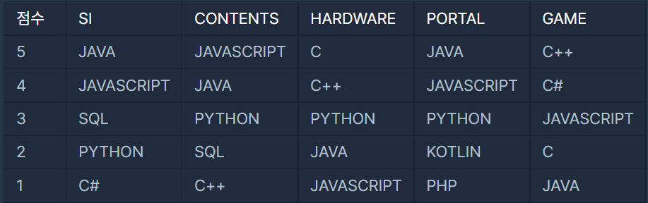

## 1. 같은 숫자는 싫어

4점

**문제 설명**

배열 arr가 주어집니다. 배열 arr의 각 원소는 숫자 0부터 9까지로 이루어져 있습니다. 이때, 배열 arr에서 연속적으로 나타나는 숫자는 하나만 남기고 전부 제거하려고 합니다. 단, 제거된 후 남은 수들을 반환할 때는 배열 arr의 원소들의 순서를 유지해야 합니다. 예를 들면,

- arr = [1, 1, 3, 3, 0, 1, 1] 이면 [1, 3, 0, 1] 을 return 합니다.
- arr = [4, 4, 4, 3, 3] 이면 [4, 3] 을 return 합니다.

배열 arr에서 연속적으로 나타나는 숫자는 제거하고 남은 수들을 return 하는 solution 함수를 완성해 주세요.

**입출력 예**

| arr             | answer    |
| --------------- | --------- |
| [1,1,3,3,0,1,1] | [1,3,0,1] |
| [4,4,4,3,3]     | [4,3]     |

**코드**

```java
public class Solution {
    public int[] solution(int []arr) {
        int[] answer = new int[arr.length];
        int count = 0;

        for (int i = 0; i < arr.length - 1; i++) {
			if (arr[i] != arr[i + 1]) answer[count++] = arr[i];
		}
        answer[count++] = arr[arr.length - 1];
        return Arrays.copyOf(answer, count);
    }
}
```

## 2. 문자열 다루기 기본

8점

**문제 설명**

문자열 s의 길이가 4 혹은 6이고, 숫자로만 구성돼있는지 확인해주는 함수, solution을 완성하세요. 예를 들어 s가 "a234"이면 False를 리턴하고 "1234"라면 True를 리턴하면 됩니다.

**입출력 예**

| s      | return |
| ------ | ------ |
| "a234" | false  |
| "1234" | true   |

**코드**

```java
public class Solution {
    public boolean solution(String s) {
    	return s.matches("\\d{4}|\\d{6}") ? true : false;
    }
}
```

## 3. 소수찾기

10점

**문제 설명**

1부터 입력받은 숫자 n 사이에 있는 소수의 개수를 반환하는 함수, solution을 만들어 보세요.

소수는 1과 자기 자신으로만 나누어지는 수를 의미합니다.
(1은 소수가 아닙니다.)

**입출력 예**

| n    | result |
| ---- | ------ |
| 10   | 4      |
| 5    | 3      |

**코드**

```java
public class Solution {
    public int solution(int n) {
        int count = 0;
        
        for (int i = 2; i <= n; i++) {
			if (isPrime(i)) count++;
		}
        return count;
    }

	private boolean isPrime(int num) {
		for (int i = 2; i <= Math.sqrt(num); i++) {
			if (num % i == 0) return false;
		}
		return true;
	}
}
```

## 4. 두 정수 사이의 합

2점

**문제 설명**

두 정수 a, b가 주어졌을 때 a와 b 사이에 속한 모든 정수의 합을 리턴하는 함수, solution을 완성하세요.
예를 들어 a = 3, b = 5인 경우, 3 + 4 + 5 = 12이므로 12를 리턴합니다.

**입출력 예**

| a    | b    | return |
| ---- | ---- | ------ |
| 3    | 5    | 12     |
| 3    | 3    | 3      |
| 5    | 3    | 12     |

**코드**

```java
public class Solution {
    public long solution(int a, int b) {
        long sum = 0;
        
        for (int i = a > b ? b : a; i <= (a > b ? a : b); i++) sum += i;
        return sum;
    }
}
```

**등차수열의 합 공식**

S n = n (a 1 + X) / 2

n: 항의 개수

a 1: 첫 항

X: 마지막 항

```java
public class Solution {
    public long solution(int a, int b) {
        return (long) (Math.abs(b-a)+1)*(a+b)/2;
    }
}
```

## 5. 직업군 추천하기


**직업군 언어 점수**



**table 문자배열**

```
["SI JAVA JAVASCRIPT SQL PYTHON C#", 
"CONTENTS JAVASCRIPT JAVA PYTHON SQL C++", 
"HARDWARE C C++ PYTHON JAVA JAVASCRIPT", 
"PORTAL JAVA JAVASCRIPT PYTHON KOTLIN PHP", 
"GAME C++ C# JAVASCRIPT C JAVA"]
```

**languages 문자배열**

```
["PYTHON", "C++", "SQL"]
```

**개선된 코드**

```java
public class Solution {
    public String solution(String[] table, String[] languages, int[] preference) {
    	String answer = "";
        int max = 0;
        String[][] jobs = new String[5][6];
        Arrays.sort(table, Collections.reverseOrder());
        
        for (int i = 0; i < table.length; i++) {
			jobs[i] = table[i].split(" ");
		}

        for (String[] job : jobs) {
        	int sum = 0;
        	int idx = 0;
        	for (String l : languages) {
        		for (int i = 1; i < job.length; i++) {
        			if (job[i].equals(l)) {
        				sum += (6 - i) * preference[idx++];
        				break;
        			}
        		}
			}
        	if (max <= sum) {
        		max = sum;
        		answer = job[0];
        	}
		}
        return answer;
    }
}
```

**코드**

```java
public class Solution {
    public String solution(String[] table, String[] languages, int[] preference) {
        String answer = "";
        int sum;
        String[][] scores = new String[5][5];
        int max = 0;
        Arrays.sort(table, Collections.reverseOrder());
        
        for (int i = 0; i < table.length; i++) {
			scores[i] = table[i].split(" ");
		}

        for (int i = 0; i < scores.length; i++) {
        	sum = 0;
        	
        	for (int j = 0; j < languages.length; j++) {
        		for (int k = 1; k < scores.length; k++) {
        			if (languages[j].equals(scores[i][k])) {
        				sum += (6 - k) * preference[j];
        				break;
        			}
        		}
        	}
        	if (max <= sum) {
        		max = sum;
        		answer = scores[i][0];
        	}
        	System.out.println(sum);
		}
        
        System.out.println(Arrays.toString(scores[0]));
        System.out.println(Arrays.toString(scores[1]));
        System.out.println(Arrays.toString(scores[2]));
        System.out.println(Arrays.toString(scores[3]));
        System.out.println(Arrays.toString(scores[4]));
        return answer;
    }
}
```

**배열의 내림차순 정렬**

```java
Arrays.sort(table, Collections.reverseOrder());
```

## 6. 최소직사각형 (8주차)

