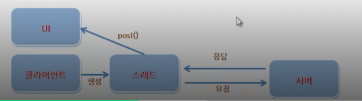
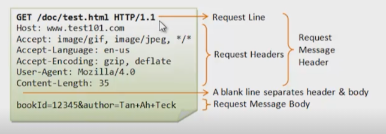

**링크연결** 

```java
Intent intent = new Intent(Intent.ACTION_VIEW, Uri.parse("http://m.naver.com"));
startActivity(intent);
```

# 1. 레이아웃

## 환경설정 및 기본속성

android studio: IntelliJ 에서 발전된 개발도구

다운로드링크: <https://developer.android.com/studio?gclid=CjwKCAjwos-HBhB3EiwAe4xM91psnsUbokVvgwEWcNRh-BxSys_fKIvvB6wOoWJ5ZnKqZk_rzkfX0BoCt10QAvD_BwE&gclsrc=aw.ds>{:target="_blank"}

help - check for update: 최신버전 확인

루트디렉토리에 .android 폴더가 생성된다.

패키지 생성 시 Name: 앱이름이 되며 파스칼표기법 혹은 띄어쓰기를 활용한다.

AVD Manager 를 통해 가상단말을 추가한다.

폰트설정: file - settings - editor - font

오토임폴트: file - settings - editor - general - auto import - 

- add unambiguous imports on the fly: import 문 자동추가
- optimize imports on the fly: 불필요한 import문을 제거하여 자동으로 최적화

**도구사용**

테마변경: Appearance&Behavior - Appearance - Theme

gradle 파일 변경저장: Sync project with gradle files

ctrl + Q: 설명문서

ctrl + shift + F: 검색

design 과 blueprint 를 볼 수 있다.

**뷰의속성**


뷰 (View): 화면에 보이는 것들. 흔히 컨트롤이나 위젯이라 불리는 UI 구성요소

뷰그룹 (View Group)

위젯 (Widget): 뷰 중에서 일반적인 컨트롤의 역할을 하고있는 것

레이아웃 (Layout): 뷰 그룹 중에서 내부에 뷰들을 포함하고 있으면서 그것들을 배치하는 역할을 하는 것

레이아웃 안에 레이아웃을 포함시킬 수 있다.

필수속성: `layout_width`, `layout_height` 

`match_parent` 부모와 같게.

`wrap_content` 내용을 감싼다.

`ConstraintLayout` 

`LinearLayout` orientation 이 필수

**단위**

px: 픽셀

dp or dip: 밀도 독립적 픽셀 (density independent pixel). 화면이 클수록 크게 표현한다.

예) 1인치 당 160개 점이있는 디스플레이화면에서 1dp = 1px

1인치 당 320 개의 점이있는 디스플레이화면에서 1dp = 2px

sp or sip: 축적 독립적 픽셀 (scale independent pixel).

in: 인치

mm: 밀리미터

em: 글꼴과 상관없이 동일한 텍스트크기 표시

보통은 dp 로 모두 작성

**Constraint Layout: 제약 레이아웃**

autoconnection to parent: 자석모양. 자동연결된다.

bias: 위치조정

guidelines 을 만들 수 있다.

## 레이아웃 종류

**대표레이아웃**

| 레이아웃   | 설명                                                         |
| ---------- | ------------------------------------------------------------ |
| Constraint | 제약조건을 사용해 화면구성<br />최근에 나온 레이아웃         |
| Linear     | 박스모델<br />한쪽방향으로 차례대로 뷰를 추가하며 화면구성   |
| Relative   | 규칙기반모델<br />부모컨테이너나 다른뷰와 상대적위치로 화면구성 |
| Frame      | 싱글모델<br />가장 상위에있는 하나의 뷰 또는 뷰그룹만 보여주는 방법<br />여러개의 뷰가 들어가면 중첩하여 쌓게됨. 여러개의 뷰를 중첩한 후 각 뷰를 전환하여 보여주는 방식 |
| Table      | 격자모델<br />HTML에서 많이 사용하는 정렬방식과 유사하지만 많이 사용하지는 않음 |

뷰의영역 (box) 는 패딩 (padding) 과 테두리 (border) 와 마진 (margin) 까지를 포함한다.  

background 의 앞 두자리는 투명도이다. 00~ff 까지 투명~원색

`layout_gravity` 뷰 정렬

`gravity` 내용 정렬

`layout-margin`

`padding` 

`layout_weight` 남아있는 공간분할

**Relative Layout: 상대 레이아웃**

`layout_alignParentTop` `Bottom` `Left` `Right` 부모에 상대적으로 연결

`layout_alignTop` `Bottom` `Left` `Right` 뷰에 상대적으로 연결

**Frame Layout: 프레임 레이아웃**

뷰의 가시성 (visibility) 을 이용한다.

```java
ImageView imageView = (ImageView) findViewById(R.id.imageView);
```

R: resource

리소스에 있는 imageView 라는 id 를 찾아서 형변환 (캐스팅) 하여 imageView 변수에 넣습니다.

```java
imageView.setVisibility(View.VISIBLE);
```

visibility 를 제어한다.

**버튼클릭으로 이미지변환**

```java
public void clicked(View view) {
    if (bool == true) {
        bool = false;
    } else {
        bool = true;
    }
    if (bool) {
        imageView.setVisibility(View.VISIBLE);
        imageView2.setVisibility(view.INVISIBLE);
    } else {
        imageView.setVisibility(View.INVISIBLE);
        imageView2.setVisibility(view.VISIBLE);
    }
}
```

**기본위젯**

텍스트뷰 속성

- `text` 문자
- `textColor` 색상
- `textSize` 크기
- `textStyle` 스타일속성
- `typeFace` 폰트설정 `normal` `sans` `serif` `monospace` 
- `maxLines="1"` 한 줄로만 표시

`radioButton`

- `isChecked` 

## 드로어블

**상태 드로어블**

새로운 xml 파일을 만든다.

`drawable` 

`state_pressed` 

`state_focused` 

```xml
<item
    android:state_pressed="true"
    android:drawable="@drawable/ic_thumb_up_selected"/>
<item
    android:drawable="@drawable/ic_thumb_up"/>
```

**쉐이프 드로어블**

selector 를 shape 로 바꾼다.

```xml
<shape xmlns:android="http://schemas.android.com/apk/res/android">
    <size android:width="200dp"
        android:height="120dp"/>
    <stroke android:width="1dp"
        android:color="#00f"/>
    <solid android:color="#adf"/>
    <padding android:bottom="1dp"/>
</shape>
```

`<Shape`

`shape` 내부속성 

- `size`
- `stroke` 
- `solid` 테두리
- `padding` 내부여백
- `gradient` `startColor` `centerColor` `endColor` `angle` `centerY`
- `corners` `radius` 

```xml
<shape xmlns:android="http://schemas.android.com/apk/res/android">
    <gradient
        android:startColor="#7288DB"
        android:centerColor="#3250B4"
        android:endColor="#254095"
        android:angle="90"
        android:centerY="0.5"
        />
    <corners android:radius="2dp"
        />
</shape>
```

**테두리**

```xml
<layer-list xmlns:android="http://schemas.android.com/apk/res/android">
    <item>
        <shape android:shape="rectangle">
            <stroke android:width="1dp"
                android:color="#BE55DA"/>
            <solid android:color="#0000"/>
        </shape>
    </item>
    <item android:top="1dp"
        android:bottom="1dp"
        android:right="1dp"
        android:left="1dp">
        <shape android:shape="rectangle">
            <stroke android:width="1dp"
                android:color="#BE55DA"/>
            <solid android:color="#0000"/>
        </shape>
    </item>
</layer-list>
```

**앱 정보**

manifests 폴더의 AndroidManifest.xml 에서

`icon` 앱 아이콘

`label` 앱 이름

# 2. 이벤트와 리스트뷰

## 이벤트

**테이블 레이아웃**

격자로 추가할 수 있다.

`stretchColumns` 갯수만큼 `0, 1, 2` 해주면 크기를 동일하게 나눠 갖는다.

`layout_column` `0` `1` `2` 

`layout_span` 몇 칸 차지할지 정할 수 있다.

**스크롤뷰**

`<ScrollView>` 로 감싸주면 된다.

**이벤트처리**

- 터치 이벤트
- 키 이벤트
- 제스처 이벤트
- 포커스
- 화면방향 변경

| 메서드           | 이벤트                                                    |
| ---------------- | --------------------------------------------------------- |
| onDown           | 눌렀을 경우                                               |
| onShowPress      | 눌렀다 떼어지는 경우                                      |
| onSingleTapUp    | 한손가락으로 눌르는 경우                                  |
| onDoubleTap      |                                                           |
| onDoubleTabEvent | 두 손가락이 눌러진 상태에서 떼거나 이동하는 세부적인 액션 |
| onScroll         | 화면을 누른 채 일정한 속도와 방향으로 움직였다 떼는 경우  |
| onFling          | 화면을 누른 채 가속도를 붙여 손가락을 움직였다 떼는 경우  |
| onLongPress      | 화면을 손가락으로 오래 누르는 경우                        |

`textView` 

- `append` 글자 추가

```java
public void println(String data) {
        textView.append(data + "\n");
}
```

**터치 감지**

```java
view.setOnTouchListener(new View.OnTouchListener() {
    @Override
    public boolean onTouch(View v, MotionEvent event) {
        int action = event.getAction();
        float curX = event.getX();
        float curY = event.getY();

        if (action == MotionEvent.ACTION_DOWN) {
            println("손가락 눌렸음:" + curX + ", " + curY);

        } else if (action == MotionEvent.ACTION_MOVE) {
            println("손가락 움직임:" + curX + ", " + curY);

        } else if (action == MotionEvent.ACTION_UP) {
            println("손가락 떼졌음:" + curX + ", " + curY);
        }
        return true;
    }
});
```

**제스처 감지**

```java
detector = new GestureDetector(this, new GestureDetector.OnGestureListener() {
    @Override
    public boolean onDown(MotionEvent e) {
        println("onDown() 호출됨");
        return true;
    }

    @Override
    public void onShowPress(MotionEvent e) {
        println("ShowPress");

    }

    @Override
    public boolean onSingleTapUp(MotionEvent e) {
        println("SingleTapUp");
        return true;
    }

    @Override
    public boolean onScroll(MotionEvent e1, MotionEvent e2, float distanceX, float distanceY) {
        println("Scroll" + distanceX + ", " + distanceY);
        return true;
    }

    @Override
    public void onLongPress(MotionEvent e) {
        println("LongPress");

    }

    @Override
    public boolean onFling(MotionEvent e1, MotionEvent e2, float velocityX, float velocityY) {
        println("Fling" + velocityX + ", " + velocityY);
        return true;
    }
});
```

```java
view2.setOnTouchListener(new View.OnTouchListener() {
    @Override
    public boolean onTouch(View v, MotionEvent event) {
        detector.onTouchEvent(event);
        return true;
    }
});
```

**키 입력 이벤트 처리**

| 키 코드             | 설명                         |
| ------------------- | ---------------------------- |
| keycode_dpad_left   | 왼쪽 화살표                  |
| keycode_dpad_right  | 오른쪽 화살표                |
| keycode_dpad_up     | 위쪽 화살표                  |
| keycode_dpad_down   | 아래쪽 화살표                |
| keycode_dpad_center | 중앙 버튼                    |
| keycode_call        | 통화 버튼                    |
| keycode_endcall     | 통화종료 버튼                |
| keycode_home        | 홈 버튼                      |
| keycode_back        | 뒤로가기 버튼                |
| keycode_volume_up   | 소리크기증가 버튼            |
| keycode_volume_down | 소리크기감소 버튼            |
| keycode_0~keycode_9 | 숫자 0부터 9까지의 키 값     |
| keycode_A~keycode_Z | 알파벳 A 부터 Z 까지의 키 값 |

ctrl + O (메서드 오버라이딩) 을 통해 정의

**뒤로가기 버튼**

```java
    @Override
    public boolean onKeyDown(int keyCode, KeyEvent event) {
        if (keyCode == KeyEvent.KEYCODE_BACK) {
            Toast.makeText(this, "시스템 Back 버튼눌림", Toast.LENGTH_LONG).show();
        }
        return true;
    }
```

**무료아이콘 사이트**

아이콘파인더:  <https://www.iconfinder.com/>{:target="_blank"}

**토스트**

`setGravity` 

`setMargin` 

클릭: 셋온클릭리스너(뉴 뷰.온클릭리스너: . - new - V)

**토스트 위치바꾸기**

```java
button.setOnClickListener(new View.OnClickListener() {
    @Override
    public void onClick(View v) {
        Toast toast = Toast.makeText(getApplicationContext(), "위치가 바뀐 토스트", Toast.LENGTH_LONG);
        toast.setGravity(Gravity.TOP|Gravity.LEFT, 0, 0);
        toast.show();
    }
});
```

```java
LayoutInflater inflater = getLayoutInflater();
```

`inflater.inflate(layout res, root layout id)` 레이아웃을 찾습니다.

**토스트 꾸미기**

```xml
<shape xmlns:android="http://schemas.android.com/apk/res/android"
    android:shape="rectangle">
    <stroke
        android:width="4dp"
        android:color="#ffffff00"/>
    <solid
        android:color="#ff883300"/>
    <padding
        android:left="20dp"
        android:top="20dp"
        android:right="20dp"
        android:bottom="20dp"/>
    <corners
        android:radius="15dp"/>
</shape>
```

**토스트**

```xml
<LinearLayout xmlns:android="http://schemas.android.com/apk/res/android"
    android:layout_width="match_parent"
    android:layout_height="match_parent"
    android:id="@+id/toast_layout_root">
    <TextView
        android:id="@+id/text"
        android:layout_width="wrap_content"
        android:layout_height="wrap_content"
        android:padding="20dp"
        android:textSize="40dp"
        android:background="@drawable/toast"/>
</LinearLayout>
```

**버튼클릭 시 토스트**

```java
button2.setOnClickListener(new View.OnClickListener() {
    @Override
    public void onClick(View v) {
        LayoutInflater inflater = getLayoutInflater();
        View layout = inflater.inflate(R.layout.toastborder, (ViewGroup) findViewById(R.id.toast_layout_root));
        TextView text = layout.findViewById(R.id.text);
        text.setText("모양을 바꾼 토스트");
        Toast toast = new Toast(getApplicationContext());
        toast.setGravity(Gravity.CENTER, 100, 100);
        toast.setDuration(Toast.LENGTH_LONG);
        toast.setView(layout);
        toast.show();
    }
});
```

**스낵바**

file - project structure - dependencies - "+" - library dependency - design 이라고 검색하면

com.android.support 라고 있다. 

선택하여 ok 를 눌러주면


gradle scripts 의 build.gradle (module: event-4.app) 의 dependencies 에 design 이 

implementation 된 것을 볼 수 있다.

> 저는 외부 라이브러리가 되지않아 삭제하고 내장된 come.google.android.material.snackbar 를 이용했습니다.

```java
Button button3 = findViewById(R.id.button3);
button3.setOnClickListener(new View.OnClickListener() {
    @Override
    public void onClick(View v) {
        Snackbar.make(v, "스낵바입니다.", Snackbar.LENGTH_LONG).show();
    }
});
```

**알림대화상자**

```java
public void showMessage() {
    AlertDialog.Builder builder = new AlertDialog.Builder(this);
    builder.setTitle("안내");
    builder.setMessage("종료하시겠습니까?");
    builder.setIcon(android.R.drawable.ic_dialog_alert);
    builder.setPositiveButton("예", new DialogInterface.OnClickListener() {
        @Override
        public void onClick(DialogInterface dialog, int which) {
            Snackbar.make(textView, "예 버튼이 눌렸습니다.", Snackbar.LENGTH_LONG).show();
        }
    });
    builder.setNegativeButton("아니오", new DialogInterface.OnClickListener() {
        @Override
        public void onClick(DialogInterface dialog, int which) {
            Snackbar.make(textView, "아니오 버튼이 눌렸습니다.", Snackbar.LENGTH_LONG).show();
        }
    });
    AlertDialog dialog = builder.create();
    dialog.show();
}
```

## 나인패치

**나인패치 이미지**

Nine patch 이미지란?

- 이미지가 늘어나거나 줄어들 때 생기는 이미지 왜곡을 해결하는 방법을 정의한 것
- 서로 다른 해상도를 가진 여러 단말에 dp 단위로 뷰의 크기를 맞추다 보면 이미지 크기가 자동조절되면서 왜곡되는 현상발생 -> 나인패치 이미지로 해결한다.

나인패치 정식 가이드: <https://developer.android.com/studio/write/draw9patch.html?hl=ko>{:target="_blank"}

나인패치 비공식 가이드: <https://recipes4dev.tistory.com/132>{:target="_blank"}

나인패치 만드는 사이트: <http://romannurik.github.io/AndroidAssetStudio/nine-patches.html#&sourceDensity=320&name=example>{:target="_blank"}

**비트맵 버튼**

나인패치 이미지를 적용하는 대표적인 경우가 바로 버튼이다.

하지만 이런 버튼은 아무리 눌러도 이미지의 변화가 없어 사용자가 버튼을 눌렀는지 알 수 없다는 단점이 있다.

비트맵 이미지를 이용해 버튼의 상태를 표시하려면 버튼이 눌렸을 때와 떼어졌을 때를 이벤트로 구분하여 처리한다.

`onMeasure` 

`onDraw` 

`setMeasuredDimension` 

뷰에 그래픽이 그려질 때 onDraw() 메소드가 호출됨

다시 그리기는 invalidate() 메소드를 사용함

AppCompatButton 의 필수 생성자

- 파라미터 하나: 자바에서 버튼생성
- 파라미터 둘: layout.xml 로 버튼생성

자바 소스코드에서는 px 단위로 텍스트크기가 설정된다.

설정하고 싶다면 values 폴더에 xml 파일을 만들어 불러온다.

```xml
<resources>
    <dimen name="text_size">16dp</dimen>
</resources>
```

**비트맵 버튼**

```java
public class BitmapButton extends AppCompatButton {
    public BitmapButton(Context context) {
        super(context);
        init(context);
    }
    public BitmapButton(Context context, AttributeSet attrs) {
        super(context, attrs);
        init(context);
    }
    private void init(Context context) {
        setBackgroundResource(R.drawable.title_bitmap_button_normal);
        float textSize = getResources().getDimension(R.dimen.text_size);
        setTextSize(textSize);
        setTextColor(Color.WHITE);
    }

    @Override
    public boolean onTouchEvent(MotionEvent event) {
        int action = event.getAction();
        switch (action) {
            case MotionEvent.ACTION_DOWN:
                setBackgroundResource(R.drawable.title_bitmap_button_clicked);
                break;
            case MotionEvent.ACTION_UP:
                setBackgroundResource(R.drawable.title_bitmap_button_normal);
                break;
        }
        invalidate();
        return true;
    }
}
```

버튼은 `<com.example.mybutton.BitmapButton>` 로 선언해야 한다.

## 어댑터 및 인플레이션

**인플레이션**

XML 레이아웃에 정의된 내용이 메모리에 객체화되는 과정

안드로이드가 버튼과 같은 것을 만들어준다.

`setContentView(R.layout.activity_main)` xml 파일을 화면으로 만들어줍니다.

전체화면이 아닌경우 `LayoutInflater` 클래스를 사용해 사용자가 직접 인플레이트를 해야한다.

```java
FrameLayout container = findViewById(R.id.container);
Button button = findViewById(R.id.button);
button.setOnClickListener(new View.OnClickListener() {
    @Override
    public void onClick(View v) {
        LayoutInflater inflater = (LayoutInflater) getSystemService(Context.LAYOUT_INFLATER_SERVICE);
        inflater.inflate(R.layout.sub1, container, true);
    }
});
```

`inflater.inflate(R.layout.부분 레이아웃, 부모 레이아웃 id, true)` 

**리스트뷰**

여러 개의 아이템중에서 하나를 선택하는 방식의 선택위젯은 어댑터를 사용하여야 한다.

이 어댑터에서 데이터를 관리하도록 해야할 뿐만 아니라 화면에 보여지는 뷰도 어댑터의 getView() 메소드에서 결정한다.

선택위젯의 가장 큰 특징은 원본 데이터를 위젯에 직접 설정하지 않고 어댑터라는 클래스를 사용하도록 되어있다는 점이다.

- 리스트뷰
- 스피너: 콤보박스
- 그리드뷰
- 갤러리

리스트뷰로 보여줄 때 해야할 일들

1. 리스트뷰에 들어갈 각 아이템의 레이아웃을 XML 로 정의한다.
2. 인플레이션 후 설정해야 한다.
3. 데이터관리 역할을 하는 어댑터 클래스를 만들고 그 안에 각 아이템으로 표시할 뷰를 리턴하는 getView() 메소드를 정의한다.
4. 화면에 보여줄 리스트뷰를 만들고 그 안에 데이터가 선택되었을 때 호출될 리스너 객체를 정의한다.

**어댑터**

`BaseAdapter` 를 상속한다.

데이터를 관리한다.

만드는 법

1. 객체클래스를 생성 후 생성자, getter, setter, toString 을 작성
2. singer_item.xml 리스트뷰 디자인
3. singer_item 을 inflate
4. BaseAdapter 를 상속하는 어댑터클래스 생성 후 객체리스트 작성

**객체**

```java
public class SingerItem {
    String name;
    String mobile;
    int resId;

    public SingerItem(String name, String mobile, int resId) {
        this.name = name;
        this.mobile = mobile;
        this.resId = resId;
    }

    public String getName() {
        return name;
    }
    public void setName(String name) {
        this.name = name;
    }

    public int getResId() {
        return resId;
    }

    public String getMobile() {
        return mobile;
    }
    public void setMobile(String mobile) {
        this.mobile = mobile;
    }

    public int getImage() {
        return resId;
    }

    @Override
    public String toString() {
        return "SingerItem{" +
                "name='" + name + '\'' +
                ", mobile='" + mobile + '\'' +
                '}';
    }
}
```

**뷰 레이아웃**

```xml
<LinearLayout xmlns:android="http://schemas.android.com/apk/res/android"
    android:orientation="horizontal"
    android:layout_width="match_parent"
    android:layout_height="wrap_content">
    <ImageView
        android:id="@+id/imageView"
        android:layout_width="80dp"
        android:layout_height="80dp"
        android:src="@mipmap/ic_launcher"/>

    <LinearLayout
        android:layout_width="match_parent"
        android:layout_height="wrap_content"
        android:orientation="vertical">

        <TextView
            android:id="@+id/textView"
            android:layout_width="wrap_content"
            android:layout_height="wrap_content"
            android:text="이름"
            android:textSize="30dp"
            android:textColor="@color/design_default_color_primary_dark"/>

        <TextView
            android:id="@+id/textView2"
            android:layout_width="wrap_content"
            android:layout_height="wrap_content"
            android:text="전화번호"
            android:textColor="@android:color/holo_orange_light"
            android:layout_marginTop="3dp"
            android:textSize="30dp" />
    </LinearLayout>
</LinearLayout>
```

**inflate**

```java
public class SingerItemView extends LinearLayout {
    TextView textView;
    TextView textView2;
    ImageView imageView;

    public SingerItemView(Context context) {
        super(context);
        init(context);
    }

    public SingerItemView(Context context, @Nullable AttributeSet attrs) {
        super(context, attrs);
        init(context);
    }

    private void init(Context context) {
        LayoutInflater inflater = (LayoutInflater) context.getSystemService(Context.LAYOUT_INFLATER_SERVICE);
        inflater.inflate(R.layout.singer_item, this, true);
        textView = findViewById(R.id.textView);
        textView2 = findViewById(R.id.textView2);
        imageView = findViewById(R.id.imageView);
    }

    public void setName(String name) {
        textView.setText(name);
    }
    public void setMobile(String mobile) {
        textView2.setText(mobile);
    }

    public void setImage(int resId) {
        imageView.setImageResource(resId);
    }
}
```

**리스트뷰**

```java
public class MainActivity extends AppCompatActivity {
    SingerAdapter adapter;
    EditText editText;
    EditText editText2;

    @Override
    protected void onCreate(Bundle savedInstanceState) {
        super.onCreate(savedInstanceState);
        setContentView(R.layout.activity_main);

        ListView listView = findViewById(R.id.listView);
        adapter = new SingerAdapter();
        adapter.addItem(new SingerItem("소녀시대", "010-1000-1000", android.R.drawable.ic_lock_idle_lock));
        adapter.addItem(new SingerItem("동방신기", "010-2000-1000", android.R.drawable.ic_btn_speak_now));
        adapter.addItem(new SingerItem("걸스데이", "010-3000-1000", android.R.drawable.ic_lock_silent_mode));
        adapter.addItem(new SingerItem("여자친구", "010-4000-1000", android.R.drawable.ic_dialog_email));
        adapter.addItem(new SingerItem("티아라", "010-5000-1000", android.R.drawable.ic_lock_idle_alarm));
        listView.setAdapter(adapter);

        listView.setOnItemClickListener(new AdapterView.OnItemClickListener() {
            @Override
            public void onItemClick(AdapterView<?> parent, View view, int position, long id) {
                SingerItem item = (SingerItem) adapter.getItem(position);
                Toast.makeText(getApplicationContext(), "선택: " + item.getName(), Toast.LENGTH_LONG).show();
            }
        });

        editText = findViewById(R.id.editText);
        editText2 = findViewById(R.id.editText2);
        Button button = findViewById(R.id.button);
        button.setOnClickListener(new View.OnClickListener() {
            @Override
            public void onClick(View v) {
                String name = editText.getText().toString();
                String mobile = editText2.getText().toString();
                adapter.addItem(new SingerItem(name, mobile, R.drawable.ic_launcher_foreground));
                adapter.notifyDataSetChanged();
            }
        });
    }

    class SingerAdapter extends BaseAdapter {
        ArrayList<SingerItem> items = new ArrayList<>();

        @Override
        public int getCount() {
            return items.size();
        }

        @Override
        public Object getItem(int position) {
            return items.get(position);
        }

        @Override
        public long getItemId(int position) {
            return position;
        }

        @Override
        public View getView(int position, View convertView, ViewGroup parent) {
            SingerItemView view = null;
            if (convertView == null) {
                view = new SingerItemView(getApplicationContext());
            } else {
                view = (SingerItemView) convertView;
            }

            SingerItem item = items.get(position);
            view.setName(item.getName());
            view.setMobile(item.getMobile());
            view.setImage(item.getImage());
            return view;
        }

        public void addItem(SingerItem item) {
            items.add(item);
        }
    }
}
```

**요소 추가하는 법**

1. 객체에 속성, 생성자, getter 추가
2. 디자인에 id 추가
3. 속성, init, setter 추가
4. getView 추가

> 뷰는 setter, 객체는 getter

**클릭 시 토스트**

```java
listView.setOnItemClickListener(new AdapterView.OnItemClickListener() {
    @Override
    public void onItemClick(AdapterView<?> parent, View view, int position, long id) {
        SingerItem item = (SingerItem) adapter.getItem(position);
        Toast.makeText(getApplicationContext(), "선택: " + item.getName(), Toast.LENGTH_LONG).show();
    }
});
```

**버튼클릭 시 추가**

```java
button.setOnClickListener(new View.OnClickListener() {
    @Override
    public void onClick(View v) {
        String name = editText.getText().toString();
        String mobile = editText2.getText().toString();
        adapter.addItem(new SingerItem(name, mobile, R.drawable.ic_launcher_foreground));
        adapter.notifyDataSetChanged();
    }
});
```

**뷰 돌려쓰기**

```java
    SingerItemView view = null;
    if (convertView == null) {
        view = new SingerItemView(getApplicationContext());
    } else {
        view = (SingerItemView) convertView;
    }
```

**스피너**

```java
public class MainActivity extends AppCompatActivity {
    TextView textView;
    String[] items = {"소녀시대", "걸스데이", "티아라", "블랙핑크", "여자친구", "동방신기"};

    @Override
    protected void onCreate(Bundle savedInstanceState) {
        super.onCreate(savedInstanceState);
        setContentView(R.layout.activity_main);

        textView = findViewById(R.id.textView);
        Spinner spinner = findViewById(R.id.spinner);
        ArrayAdapter<String> adapter = new ArrayAdapter<>(
                this, android.R.layout.simple_spinner_item, items
        );
        adapter.setDropDownViewResource(android.R.layout.simple_spinner_dropdown_item);
        spinner.setAdapter(adapter);
        spinner.setOnItemSelectedListener(new AdapterView.OnItemSelectedListener() {
            @Override
            public void onItemSelected(AdapterView<?> parent, View view, int position, long id) {
                textView.setText(items[position]);
            }

            @Override
            public void onNothingSelected(AdapterView<?> parent) {
                textView.setText("선택: ");
            }
        });
    }
}
```

**그리드뷰**

`numColumns` 격자의 칼럼갯수. 1이라면 리스트뷰와 차이가 없다.

리스트뷰와 구현방식이 똑같다.

**setText**

>  `textView.setText(String)` 파라미터로 String 형만 받으므로 int 형을 넣고싶을 때는 `String.valueOf()` 를 사용한다.

**프로필 둥글게 만들기**

build.gradle(Module) - dependencies 에 라이브러리 추가

```
implementation 'de.hdodenhof:circleimageview:2.2.0'
```

```xml
<de.hdodenhof.circleimageview.CircleImageView
    android:layout_width="90dp"
    android:layout_height="90dp"
    android:layout_marginStart="16dp"
    android:layout_marginLeft="16dp"
    android:layout_marginTop="16dp"
    android:src="@drawable/ic_launcher_background"
    app:civ_border_color="#ffcccccc"
    app:civ_border_width="2dp"
    app:layout_constraintStart_toStartOf="parent"
    app:layout_constraintTop_toTopOf="parent" />
```

위와 같이 선언한다.

**inflate 요약**

1. L i = sy Co. 후 캐스팅
2. i. R.l.레이아웃 뷰

리시코 아이 알 엘

```java
FrameLayout view = findViewById(R.id.view);
LayoutInflater inflater = (LayoutInflater) getSystemService(Context.LAYOUT_INFLATER_SERVICE);
inflater.inflate(R.layout.xml, view);
```

> FrameLayout 은 바로 추가할 수 있다.

**뷰 생성**

1. 클래스 생성 후 LinearLayout 상속받는다.
2. 생성자 2개 생성 후 init(content) 메서드 호출

**버튼생성 요약**

1. B b = f R.id.
2. b. new

버튼.셋온클릭리스너(뉴 뷰.온클릭리스너)

# 3. 여러 개의 화면

네 가지 구성요소

- 액티비티
- 서비스
- 브로드캐스트 수신자
- 내용 제공자

## 액티비티

**Main 화면**

```java
public class MainActivity extends AppCompatActivity {
    @Override
    protected void onCreate(Bundle savedInstanceState) {
        super.onCreate(savedInstanceState);
        setContentView(R.layout.activity_main);

        Button button = findViewById(R.id.button);
        button.setOnClickListener(new View.OnClickListener() {
            @Override
            public void onClick(View v) {
                Intent intent = new Intent(getApplicationContext(), MenuActivity.class);
                startActivityForResult(intent, 101);
            }
        });
    }

    @Override
    protected void onActivityResult(int requestCode, int resultCode,  Intent data) {
        super.onActivityResult(requestCode, resultCode, data);
        if (requestCode == 101) {
            String name = data.getStringExtra("name");
            Toast.makeText(getApplicationContext(), "메뉴화면으로부터 응답: " + name, Toast.LENGTH_LONG).show();
        }
    }
}
```

1. Intent i = new g , 액티비티. 

오버라이딩: acr 검색 (onActivityResult)

**Menu 화면**

```java
button2.setOnClickListener(new View.OnClickListener() {
    @Override
    public void onClick(View v) {
        Intent intent = new Intent();
        intent.putExtra("name", "mike");
        setResult(Activity.RESULT_OK, intent);
        finish();
    }
});
```

**Manifest**

```xml
<activity android:name=".MenuActivity"
    android:label="메뉴"
    android:theme="@style/Theme.AppCompat.Light.Dialog"></activity>
```

 **인텐트**

액티비티, 서비스, 브로드캐스트 수신자끼리 이동하게 해준다. 화면이동 그 이상이라고 할 수 있다.

| 속성                                    | 설명                                                         |
| --------------------------------------- | ------------------------------------------------------------ |
| ACTION_DIAL tel:01077881234             | 주어진 전화번호를 이용해 전화걸기 화면을 보여줌              |
| ACTION_VIEW tel:01077881234             | 주어진 전화번호를 이용해 전화걸기 화면을 보여줌. URI 값의 유형에 따라 VIEW 액션이 다른 기능을 수행함 |
| ACTION_EDIT content://contacts/people/2 | 전화번호부 데이터베이스에 있는 정보중에서 ID 값이 2인 정보를 편집하기 위한 화면을 보여줌 |
| ACTION_VIEW content://contacts/people   | 전화번호부 데이터베이스의 내용을 보여줌                      |

명시적 인텐트 (Explicit Intent)

- 인텐트에 클래스 객체나 컴포넌트 이름을 지정하여 호출할 대상을 확실히 알 수 있는경우

암시적 인텐트 (Implicit Intent)

- 액션과 데이터를 지정하긴 햇지만 호출할 대상이 달라질 수 있는경우
- 범주 (category), 타입 (type), 컴포넌트 (component), 부가데이터 (extras)

**전화걸기**

```java
button.setOnClickListener(new View.OnClickListener() {
    @Override
    public void onClick(View v) {
        String receiver = editText.getText().toString();
        Intent intent = new Intent(Intent.ACTION_DIAL, Uri.parse("tel:" + receiver));
        startActivity(intent);
    }
});
```

인텐트로 화면전환이 아닌 전화걸기라는 서비스로 연결해준 것을 볼 수 있다.

**화면이동**

```java
button.setOnClickListener(new View.OnClickListener() {
    @Override
    public void onClick(View v) {
        Intent intent2 =new Intent();
        ComponentName name = new ComponentName("com.example.a11mycallintent", "com.example.a11mycallintent.MenuActivity");
        intent2.setComponent(name);
        startActivity(intent2);
    }
});
```

객체가 아닌 문자열로 화면이동이 가능하다.

인텐트로 PDF 파일을 보여줄 수 있다. 그러려면 pdf 파일을 앱에 다운로드 받아야 한다.

**읽기/쓰기 권한**

**Manifest**

```xml
<uses-permission android:name="android.permission.READ_EXTERNAL_STORAGE"/>
<uses-permission android:name="android.permission.WRITE_EXTERNAL_STORAGE"/>
```

하지만 이것은 위험권한이다.

targetSdkVersion 을 22 보다 낮게하면 위험권한 감지가 되지 않는다.

**부가데이터**

액티비티는 스택구조이다.

- 새로운 액티비티를 실행할 때마다 메모리에 새로운 객체를 만들고 이전화면 위에 쌓는 방식은 비효율적일 수 있다.
- 동일한 화면이 이미 만들어져 있는 경우에는 그 화면을 그대로 보여주고 싶다면 플래그를 사용하면 된다.

`FLAG_ACTIVITY_SINGLE_TOP` 

`FLAG_ACTIVITY_NO_HISTORY` 

`FLAG_ACTIVITY_CLEAR_TOP` 

플래그 사용 예

1. 인텐트객체 생성
2. 부가데이터 넣기
3. 인텐트플래그 설정
4. 인텐트 띄우기


실무에서는 clear top 과 single top 을 많이 쓴다.

**MyParcelable**

**데이터 넘겨주기**

`intent.putExtra("names", names)` 

**데이터 넘겨받기**

```java
private void processIntent(Intent intent) {
    if (intent != null) {
        ArrayList<String> names = (ArrayList<String>) intent.getSerializableExtra("names");
        if (names != null) {
            Toast.makeText(getApplicationContext(), "전달받은 이름 리스트 갯수: " + names.size(), Toast.LENGTH_LONG).show();
        }
    }
}
```

getIntent() 로 받아서 토스트를 띄운다.

파슬은 데이터를 전달할 때 사용되는 객체

1. 변수선언 및 생성자
2. writeToParcel 구현

**객체 데이터**

```java
public class SimpleData implements Parcelable {
    int number;
    String message;

    public SimpleData(int number, String message) {
        this.number = number;
        this.message = message;
    }

    protected SimpleData(Parcel in) {
        number = in.readInt();
        message = in.readString();
    }

    public static final Creator<SimpleData> CREATOR = new Creator<SimpleData>() {
        @Override
        public SimpleData createFromParcel(Parcel in) {
            return new SimpleData(in);
        }

        @Override
        public SimpleData[] newArray(int size) {
            return new SimpleData[size];
        }
    };

    @Override
    public int describeContents() {
        return 0;
    }

    @Override
    public void writeToParcel(Parcel dest, int flags) {
        dest.writeInt(number);
        dest.writeString(message);
    }
}
```

**객체 데이터 넘겨주기**

```java
button.setOnClickListener(new View.OnClickListener() {
    @Override
    public void onClick(View v) {
        Intent intent = new Intent(getApplicationContext(), MenuActivity.class);
        SimpleData data = new SimpleData(100, "Hello");
        intent.putExtra("data", data);
        startActivityForResult(intent, 101);
    }
});
```

**객체 데이터 받기**

getIntent 로 받은 후

```java
private void processIntent(Intent intent) {
    if (intent != null) {
        SimpleData data = intent.getParcelableExtra("data");
        if (data != null) {
            Toast.makeText(getApplicationContext(), "전달받은 SimpleData: " + data.message, Toast.LENGTH_LONG).show();
        }
    }
}
```

**액티비티 수명주기** 

| 상태              | 설명                                                         |
| ----------------- | ------------------------------------------------------------ |
| 실행 (Running)    | 화면상에 액티비티가 보이면서 실행되어있는 상태               |
| 일시중지 (Paused) | 사용자에게 보이지만 다른 액티비티가 위에있어 포커스 받지 못하는 상태. 대화상자가 위에 있어 일부가 가려져있는 경우에 해당함 |
| 중지 (Stopped)    | 다른 액티비티에 의해 완전히 가려져 보이지 않는 상태          |


**토스트 요약** 

```java
Toast.makeText(this, "Hello", Toast.LENGTH_LONG).show();
```

To. t, 텍스트, T탭.탭 .탭

**오버라이딩** 

```java
@Override
protected void onRestart() {
    Toast.makeText(this, "리스타트", Toast.LENGTH_LONG).show();
    super.onRestart();
}

@Override
protected void onPause() {
    Toast.makeText(this, "퍼즈", Toast.LENGTH_LONG).show();
    super.onPause();
}

@Override
protected void onResume() {
    Toast.makeText(this, "리쥼", Toast.LENGTH_LONG).show();
    super.onResume();
}

@Override
protected void onStart() {
    Toast.makeText(this, "스타트", Toast.LENGTH_LONG).show();
    super.onStart();
}

@Override
protected void onStop() {
    Toast.makeText(this, "스탑", Toast.LENGTH_LONG).show();
    super.onStop();
}

@Override
protected void onDestroy() {
    Toast.makeText(this, "디스트로이", Toast.LENGTH_LONG).show();
    super.onDestroy();
}
```

**앱을 끄는 순간 저장하기**

```java
@Override
protected void onPause() {
    super.onPause();
    Toast.makeText(this, "퍼즈", Toast.LENGTH_LONG).show();
    SharedPreferences pref = getSharedPreferences("pref", Activity.MODE_PRIVATE);
    SharedPreferences.Editor editor = pref.edit();
    editor.putString("name", "소녀시대");
    editor.commit();
}

@Override
protected void onResume() {
    super.onResume();
    Toast.makeText(this, "리쥼", Toast.LENGTH_LONG).show();
    SharedPreferences pref = getSharedPreferences("pref", Activity.MODE_PRIVATE);
    if (pref != null) {
        String name = pref.getString("name", "");
        Toast.makeText(this, "복구된 이름: " + name, Toast.LENGTH_LONG).show();
    }
}
```

## **서비스**

- 서비스는 화면이 없는 상태에서 백그라운드로 실행됨
- 서비스는 프로세스가 종료되어도 시스템에서 자동으로 재시작됨

new - service - service 메뉴를 이용해 서비스 추가

서비스는 한 번 실행되면 계속 실행되어있다.

onCreate 에서 확인할 수 없다.

그래서 서비스는 onStartCommand 에서 확인할 수 있다. 

인텐트를 StartCommand 에 넣는다.

```java
public class MyService extends Service {
    private static final String TAG = "MyService";

    public MyService() {
    }

    @Override
    public void onCreate() {
        super.onCreate();
        Log.d(TAG, "onCreate() 호출됨.");
    }

    @Override
    public int onStartCommand(Intent intent, int flags, int startId) {
        Log.d(TAG, "onStartCommand() 호출됨.");
        if (intent == null) {
            return Service.START_STICKY;
        } else {
            processCommand(intent);
        }
        return super.onStartCommand(intent, flags, startId);
    }

    private void processCommand(Intent intent) {
        String command = intent.getStringExtra("command");
        String name = intent.getStringExtra("name");
        Log.d(TAG, "전달받은 데이터: " + command + ", " + name);
    }

    @Override
    public void onDestroy() {
        super.onDestroy();
        Log.d(TAG, "onDestroy() 호출됨.");
    }

    @Override
    public IBinder onBind(Intent intent) {
        // TODO: Return the communication channel to the service.
        throw new UnsupportedOperationException("Not yet implemented");
    }
}
```

Logcat 에서 로그를 확인할 수 있다.

android monitor 에서 서비스를 확인할 수 있다.

화면이 없는 상태에서 띄우려면 flag 가 필요하다.

**Main**

```java
public class MainActivity extends AppCompatActivity {

    @Override
    protected void onCreate(Bundle savedInstanceState) {
        super.onCreate(savedInstanceState);
        setContentView(R.layout.activity_main);

        EditText editText = findViewById(R.id.editText);
        Button button = findViewById(R.id.button);
        button.setOnClickListener(new View.OnClickListener() {
            @Override
            public void onClick(View v) {
                String name = editText.getText().toString();
                Intent intent = new Intent(getApplicationContext(), MyService.class);
                intent.putExtra("command", "show");
                intent.putExtra("name", name);
                startService(intent);
            }
        });
    Intent passedIntent = getIntent();
    processCommand(passedIntent);
    }

    private void processCommand(Intent intent) {
        if (intent != null) {
            String command = intent.getStringExtra("command");
            String name = intent.getStringExtra("name");
            Toast.makeText(this, "서비스로부터 전달받은 데이터: ", Toast.LENGTH_LONG).show();
        }
    }

    @Override
    protected void onNewIntent(Intent intent) {
        super.onNewIntent(intent);
        processCommand(intent);
    }
}
```

**Service**

```java
public class MyService extends Service {
    private static final String TAG = "MyService";

    public MyService() {
    }

    @Override
    public void onCreate() {
        super.onCreate();
        Log.d(TAG, "onCreate() 호출됨.");
    }

    @Override
    public int onStartCommand(Intent intent, int flags, int startId) {
        Log.d(TAG, "onStartCommand() 호출됨.");
        if (intent == null) {
            return Service.START_STICKY;
        } else {
            processCommand(intent);
        }
        return super.onStartCommand(intent, flags, startId);
    }

    private void processCommand(Intent intent) {
        String command = intent.getStringExtra("command");
        String name = intent.getStringExtra("name");
        Log.d(TAG, "전달받은 데이터: " + command + ", " + name);
        try {
            Thread.sleep(5000);
        } catch (Exception e) {
        }
        Intent showIntent = new Intent(getApplicationContext(), MainActivity.class);
        showIntent.addFlags(Intent.FLAG_ACTIVITY_NEW_TASK|
                Intent.FLAG_ACTIVITY_SINGLE_TOP|
                Intent.FLAG_ACTIVITY_CLEAR_TOP);
        showIntent.putExtra("command", "show");
        showIntent.putExtra("name", name + " from service.");
        startActivity(showIntent);
    }

    @Override
    public void onDestroy() {
        super.onDestroy();
        Log.d(TAG, "onDestroy() 호출됨.");
    }

    @Override
    public IBinder onBind(Intent intent) {
        // TODO: Return the communication channel to the service.
        throw new UnsupportedOperationException("Not yet implemented");
    }
}
```

## **브로드캐스트 수신자**

- 애플리케이션이 글로벌이벤트를 받아서 처리하려면 브로드캐스트 수신자로 등록
- "전화가 왔습니다." "문자 메시지가 도착했습니다." 와 같이 안드로이드 시스템 전체에 보내지는 이벤트
- 브로드캐스트 수신자는 인텐트필터를 포함하며 매니페스트 파일에 등록함으로써 인텐트를 받을 준비를 함
- 수신자가 매니페스트 파일에 등록되었다면 따로 시작시키지 않아도 됨
- 애플리케이션은 컨텍스트 클래스의 registerReceiver 메소드를 이용하면 런타임시에도 수신자를 등록할 수 있음
- 서비스처럼 브로드캐스트 수신자도 UI 가 없음

크게 두가지 클래스로 구분된다.

- 일반
- 순차

서비스처럼 시작할 필요가 없다.

```xml
<receiver>
    <intent-filter>
        <action android:name="android.provider.Telephony.SMS_RECEIVED"/>
    </intent-filter>
</receiver>
```

필터로 특정 액션정보만 받는다.

```xml
<uses-permission android:name="android.permission.RECEIVE_SMS"/>
```

권한을 한 후 사용자에게도 권한을 받아야 한다.

targetSdkVersion 이 22 이하이면 사용자권한이 필요없다.

**가상 에뮬레이터로 메시지 받는방법** 


실험

1. 앱이 꺼진 백그라운드에서도 실행됨
2. targetSdkVersion 22 이하에서만 실행됨 (앱 재설치 필요)
3. **브로드캐스트 리시버 생성**

```java
public class SmsReceiver extends BroadcastReceiver {
    private static final String TAG = "SmsReceiver";

    @Override
    public void onReceive(Context context, Intent intent) {
        Log.d(TAG, "onReceiver() 호출됨.");
    }
}
```

**SMS Receiver**

```java
public class SmsReceiver extends BroadcastReceiver {
    private static final String TAG = "SmsReceiver";

    @Override
    public void onReceive(Context context, Intent intent) {
        Log.d(TAG, "onReceiver() 호출됨.");

        Bundle bundle = intent.getExtras();
        SmsMessage[] messages = parseSmsMessage(bundle);

        if (messages.length > 0) {
            String sender = messages[0].getOriginatingAddress();
            Log.d(TAG, "sender: " + sender);

            String contents = messages[0].getMessageBody().toString();
            Log.d(TAG, "contents: " + contents);

            Date receiverDate = new Date(messages[0].getTimestampMillis());
            Log.d(TAG, "received dated: " + receiverDate);
        }
    }

    private SmsMessage[] parseSmsMessage(Bundle bundle) {
        Object[] objs = (Object[]) bundle.get("pdus");
        SmsMessage[] messages = new SmsMessage[objs.length];

        for (int i = 0; i < objs.length; i++) {
            if (Build.VERSION.SDK_INT >= Build.VERSION_CODES.M) {
                String format = bundle.getString("format");
                messages[i] = SmsMessage.createFromPdu((byte[]) objs[i], format);
            } else {
            messages[i] = SmsMessage.createFromPdu((byte[]) objs[i]);
            }
        }
        return messages;
    }
}
```

**sms receiver**

```java
public class SmsReceiver extends BroadcastReceiver {
    private static final String TAG = "SmsReceiver";
    private static SimpleDateFormat format = new SimpleDateFormat("yyyy-MM-dd HH:mm");

    @Override
    public void onReceive(Context context, Intent intent) {
        Log.d(TAG, "onReceiver() 호출됨.");

        Bundle bundle = intent.getExtras();
        SmsMessage[] messages = parseSmsMessage(bundle);

        if (messages.length > 0) {
            String sender = messages[0].getOriginatingAddress();
            Log.d(TAG, "sender: " + sender);

            String contents = messages[0].getMessageBody().toString();
            Log.d(TAG, "contents: " + contents);

            Date receivedDate = new Date(messages[0].getTimestampMillis());
            Log.d(TAG, "received dated: " + receivedDate);

            sendToActivity(context, sender, contents, receivedDate);
        }
    }

    private void sendToActivity(Context context, String sender, String contents, Date receivedDate) {
        Intent intent = new Intent(context, SmsActivity.class);
        intent.addFlags(Intent.FLAG_ACTIVITY_NEW_TASK
        |Intent.FLAG_ACTIVITY_SINGLE_TOP
        |Intent.FLAG_ACTIVITY_CLEAR_TOP);
        intent.putExtra("sender", sender);
        intent.putExtra("contents", contents);
        intent.putExtra("receivedDate", format.format(receivedDate));
        context.startActivity(intent);
    }

    private SmsMessage[] parseSmsMessage(Bundle bundle) {
        Object[] objs = (Object[]) bundle.get("pdus");
        SmsMessage[] messages = new SmsMessage[objs.length];

        for (int i = 0; i < objs.length; i++) {
            if (Build.VERSION.SDK_INT >= Build.VERSION_CODES.M) {
                String format = bundle.getString("format");
                messages[i] = SmsMessage.createFromPdu((byte[]) objs[i], format);
            } else {
            messages[i] = SmsMessage.createFromPdu((byte[]) objs[i]);
            }
        }
        return messages;
    }
}
```

**sms activity**

```java
public class SmsActivity extends AppCompatActivity {
    private EditText editText;
    private EditText editText2;
    private EditText editText3;

    @Override
    protected void onCreate(Bundle savedInstanceState) {
        super.onCreate(savedInstanceState);
        setContentView(R.layout.activity_sms);

        editText = findViewById(R.id.editText);
        editText2 = findViewById(R.id.editText2);
        editText3 = findViewById(R.id.editText3);
        Button button = findViewById(R.id.button);
        button.setOnClickListener(new View.OnClickListener() {
            @Override
            public void onClick(View v) {
                finish();
            }
        });
        Intent passedIntent = getIntent();
        processCommand(passedIntent);
    }

    @Override
    protected void onNewIntent(Intent intent) {
        super.onNewIntent(intent);
        processCommand(intent);
    }

    private void processCommand(Intent intent) {
        if (intent != null) {
            String sender = intent.getStringExtra("sender");
            String contents = intent.getStringExtra("contents");
            String receivedDate = intent.getStringExtra("receivedDate");
            editText.setText((sender));
            editText3.setText((contents));
            editText2.setText((receivedDate));
        }
    }
}
```

## 권한

**위험권한 부여**

일반권한과 위험권한 (마시멜로 API 23 부터)

- 위험권한은 실행 시 권한부여

대표 위험권한

- 위치
- 카메라
- 마이크
- 연락처
- 전화
- 문자
- 일정
- 센서


**권한 대화상자**

```java
public class MainActivity extends AppCompatActivity {
    @Override
    protected void onCreate(Bundle savedInstanceState) {
        super.onCreate(savedInstanceState);
        setContentView(R.layout.activity_main);

        Button button2 = findViewById(R.id.button2);
        int permissionCheck = ContextCompat.checkSelfPermission(this, Manifest.permission.RECEIVE_SMS);
        if (permissionCheck == PackageManager.PERMISSION_GRANTED) {
            Toast.makeText(this, "SMS 수신권한 주어져있음", Toast.LENGTH_LONG).show();
        } else {
            Toast.makeText(this, "SMS 수신권한 없음", Toast.LENGTH_LONG).show();
            ActivityCompat.requestPermissions(this, new String[] {Manifest.permission.RECEIVE_SMS}, 1);
        }
    }
    @Override
    public void onRequestPermissionsResult(int requestCode, @NonNull String[] permissions, @NonNull int[] grantResults) {
        super.onRequestPermissionsResult(requestCode, permissions, grantResults);
        switch (requestCode) {
            case 1:
                if (grantResults.length > 0) {
                    if (grantResults[0] == PackageManager.PERMISSION_GRANTED) {
                        Toast.makeText(this, "SMS 수신권한을 사용자가 승인함", Toast.LENGTH_LONG).show();
                    } else if (grantResults[0] == PackageManager.PERMISSION_DENIED){
                        Toast.makeText(this, "SMS 수신권한을 사용자가 거부함", Toast.LENGTH_LONG).show();
                    }
                } else {
                        Toast.makeText(this, "SMS 수신권한을 부여받지 못함", Toast.LENGTH_LONG).show();
                }
        }
    }
}
```

**화면이동 정리**

startActivityForresult() 로 requestCode 와 함께 데이터를 넘겨주면

화면이동 후 getIntent 로 받는다.

돌아갈 때 setResult() 와 requestCode 로 받는다.

- 데이터를 넘겨주지 않을 때

```java
Intent intent = new Intent(getApplicationContext(), CommentWriteActivity.class);
startActivity();
```

- 데이터를 넘겨줄 때

```java
Intent intent = new Intent(getApplicationContext(), CommentWriteActivity.class);
intent.putExtra("rating", rating);
startActivityForResult(intent, 101);
```

- 데이터를 받을 때

```java
@Override
protected void onCreate(Bundle savedInstanceState) {
    super.onCreate(savedInstanceState);
    setContentView(R.layout.activity_comment_write);

    ratingBar = findViewById(R.id.ratingBar);
    Intent intent = getIntent();
    processIntent(intent);
}

private void processIntent(Intent intent) {
    if (intent != null) {
        float rating = intent.getFloatExtra("rating", 0.0f);
        ratingBar.setRating(rating);
    }
}
```

**Main**

```java
public class MainActivity extends AppCompatActivity {
    private RatingBar ratingBar;
    TextView outputView;

    @Override
    protected void onCreate(Bundle savedInstanceState) {
        super.onCreate(savedInstanceState);
        setContentView(R.layout.activity_main);

        ratingBar = findViewById(R.id.ratingBar);
        outputView = findViewById(R.id.outputView);
        Button button = findViewById(R.id.button);
        button.setOnClickListener(new View.OnClickListener() {
            @Override
            public void onClick(View v) {
                showCommentWriteActivity();
            }
        });
    }

    private void showCommentWriteActivity() {
        float rating = ratingBar.getRating();
        Intent intent = new Intent(getApplicationContext(), CommentWriteActivity.class);
        intent.putExtra("rating", rating);
        startActivityForResult(intent, 101);
    }

    @Override
    protected void onActivityResult(int requestCode, int resultCode, Intent data) {
        super.onActivityResult(requestCode, resultCode, data);
        if (requestCode == 101) {
            if (data != null) {
                String contents = data.getStringExtra("contents");
                outputView.setText(contents);
            }
        }
    }
}
```

**Comment**

```java
public class CommentWriteActivity extends AppCompatActivity {
    private RatingBar ratingBar;
    private EditText contentsInput;

    @Override
    protected void onCreate(Bundle savedInstanceState) {
        super.onCreate(savedInstanceState);
        setContentView(R.layout.activity_comment_write);

        ratingBar = findViewById(R.id.ratingBar);
        Intent intent = getIntent();
        processIntent(intent);
        contentsInput = findViewById(R.id.contentsInput);
        Button saveButton = findViewById(R.id.saveButton);
        saveButton.setOnClickListener(new View.OnClickListener() {
            @Override
            public void onClick(View v) {
                returnToMain();
            }
        });
    }

    private void returnToMain() {
        String contents = contentsInput.getText().toString();
        // 화면이동이 없다면 Intent 에 파라미터가 필요없다.
        Intent intent = new Intent();
        intent.putExtra("contents", contents);
        setResult(RESULT_OK, intent);
        finish();
    }

    private void processIntent(Intent intent) {
        if (intent != null) {
            float rating = intent.getFloatExtra("rating", 0.0f);
            ratingBar.setRating(rating);
        }
    }
}
```

# 4. 화면 내비게이션

## **프래그먼트**


액티비티와 사용방법이 비슷하다.

프래그먼트도 액티비티처럼 화면전환으로 사용할 수 있다.

setContentView 는 액티비티에만 있어서 프래그먼트는 인플레이션을 직접 해주어야 한다.

`Fragment` 상속받는다.

**fragment**

```java
public class fragmentActivity extends Fragment {
    @Override
    public View onCreateView(LayoutInflater inflater, ViewGroup container, Bundle savedInstanceState) {
        View rootView = inflater.inflate(R.layout.activity_fragment, container, false);
        return rootView;
    }
}
```

**activity_main.xml**

```xml
<fragment
    android:layout_width="match_parent"
    android:layout_height="match_parent"
    android:name="com.example.a17myfragment2.ListFragment"
    android:id="@+id/listFragment"/>
```

xml 에 선언한 경우 자바에서는 

```java
@Override
protected void onCreate(Bundle savedInstanceState) {
    super.onCreate(savedInstanceState);
    setContentView(R.layout.activity_main);

    FragmentManager manager = getSupportFragmentManager();
    fragment1 = (ListFragment) manager.findFragmentById(R.id.listFragment);
    fragment2 = (ViewerFragment) manager.findFragmentById(R.id.viewerFragment);
}
```

findFragmentById 를 사용해 변수로 가져온다.

xml 에 추가해도 되지만 java 에 추가해도 된다.

```java
button.setOnClickListener(new View.OnClickListener() {
    @Override
    public void onClick(View v) {
        fragmentActivity fragment1 = new fragmentActivity();
        getSupportFragmentManager().beginTransaction().add(R.id.container, fragment1).commit();
    }
});
```

**프래그먼트로 화면이동**

```java
public class MainActivity extends AppCompatActivity {
    fragmentActivity fragment1;
    MenuFragment fragment2;

    @Override
    protected void onCreate(Bundle savedInstanceState) {
        super.onCreate(savedInstanceState);
        setContentView(R.layout.activity_main);

        fragment1 = new fragmentActivity();
        fragment2 = new MenuFragment();
        Button main = findViewById(R.id.main);
        main.setOnClickListener(new View.OnClickListener() {
            @Override
            public void onClick(View v) {
                getSupportFragmentManager().beginTransaction().replace(R.id.container, fragment1).commit();
            }
        });
        Button menu = findViewById(R.id.menu);
        menu.setOnClickListener(new View.OnClickListener() {
            @Override
            public void onClick(View v) {
                getSupportFragmentManager().beginTransaction().replace(R.id.container, fragment2).commit();
            }
        });
    }
}
```

**프래그먼트 내 버튼**

```java
@Override
public void onAttach(Context context) {
    super.onAttach(context);
    activity = (MainActivity) getActivity();
}

@Override
public void onDetach() {
    super.onDetach();
    activity = null;
}
```

프래그먼트 내 버튼으로 이동 시 onAttach 와 onDetach 를 오버라이딩 해야합니다.

**화면이동 메서드**

```java
public void onFragmentChange(int index) {
    if (index == 0) {
            getSupportFragmentManager().beginTransaction().replace(R.id.container, fragment1).commit();
    } else {
            getSupportFragmentManager().beginTransaction().replace(R.id.container, fragment2).commit();
    }
}
```

화면이동을 메서드로 정의해도 됩니다.


프래그먼트 활성화 (액티비티 화면에 보이는 상태)

**프래그먼트 이미지변환**

**Main**

```java
public class MainActivity extends AppCompatActivity {
    ListFragment fragment1;
    ViewerFragment fragment2;
    FragmentManager manager;

    @Override
    protected void onCreate(Bundle savedInstanceState) {
        super.onCreate(savedInstanceState);
        setContentView(R.layout.activity_main);

        manager = getSupportFragmentManager();
        fragment1 = (ListFragment) manager.findFragmentById(R.id.listFragment);
        fragment2 = (ViewerFragment) manager.findFragmentById(R.id.viewerFragment);
    }

    public void onImageChange(int index) {
        fragment2.setImage(index);
    }
}
```

**ListFragment**

```java
public class ListFragment extends Fragment {
    private MainActivity activity;

    @Override
    public void onDetach() {
        super.onDetach();
        activity = null;
    }

    @Override
    public void onAttach( Context context) {
        super.onAttach(context);
        activity = (MainActivity) getActivity();
    }

    @Override
    public View onCreateView(LayoutInflater inflater, ViewGroup container,
                             Bundle savedInstanceState) {
        View rootView = inflater.inflate(R.layout.fragment_list, container, false);
        Button button = rootView.findViewById(R.id.button);
        button.setOnClickListener(new View.OnClickListener() {
            @Override
            public void onClick(View v) {
                activity.onImageChange(0);
            }
        });
        Button button2 = rootView.findViewById(R.id.button2);
        button2.setOnClickListener(new View.OnClickListener() {
            @Override
            public void onClick(View v) {
                activity.onImageChange(1);
            }
        });
        Button button3 = rootView.findViewById(R.id.button3);
        button3.setOnClickListener(new View.OnClickListener() {
            @Override
            public void onClick(View v) {
                activity.onImageChange(2);
            }
        });
        return rootView;
    }
}
```

**ViewerFragment**

```java
public class ViewerFragment extends Fragment {
    private ImageView imageView;

    @Override
    public View onCreateView(LayoutInflater inflater, ViewGroup container,
                             Bundle savedInstanceState) {
        View rootView = inflater.inflate(R.layout.fragment_viewer, container, false);
        imageView = rootView.findViewById(R.id.imageView);
        return rootView;
    }

    public void setImage(int index) {
        if (index == 0) {
            imageView.setImageResource(R.mipmap.ic_launcher);
        } else if (index == 1) {
            imageView.setImageResource(R.drawable.ic_launcher_foreground);
        } else {
            imageView.setImageResource(R.drawable.ic_launcher_background);
        }
    }
}
```

## **액션바**

res 에 menu 폴더를 만든다.

`xmlns:android="http://schemas.android.com/apk/res/android"` 안드로이드에 정해진 속성을 쓰겠다.

`xmlns:app="http://schemas.android.com/apk/res-auto"` 앱에 정해진 속성을 쓰겠다.

**버튼구현** 

**menu**

```xml
<menu xmlns:android="http://schemas.android.com/apk/res/android"
    xmlns:app="http://schemas.android.com/apk/res-auto">
    <item android:id="@+id/menu_refresh"
        android:title="새로고침"
        android:icon="@drawable/menu_refresh"
        app:showAsAction="always"/>
    <item android:id="@+id/menu_search"
        android:title="검색"
        android:icon="@drawable/menu_search"
        app:showAsAction="always"/>
    <item android:id="@+id/menu_settings"
        android:title="설정"
        android:icon="@drawable/menu_settings"
        app:showAsAction="always"/>
</menu>
```

**MainActivity.java**

```java
@Override
public boolean onCreateOptionsMenu(Menu menu) {
    getMenuInflater().inflate(R.menu.menu_main, menu);
    return true;
}
```

call back method 란?

어떤 상황이 됐을 때 호출되는 함수

**버튼이벤트**

```java
@Override
public boolean onOptionsItemSelected(@NonNull MenuItem item) {
    int curId = item.getItemId();
    switch(curId) {
        case R.id.menu_refresh:
            Toast.makeText(this, "새로고침 메뉴 클릭됨", Toast.LENGTH_SHORT).show();
            break;
        case R.id.menu_search:
            Toast.makeText(this, "검색 메뉴 클릭됨", Toast.LENGTH_SHORT).show();
            break;
        case R.id.menu_settings:
            Toast.makeText(this, "설정 메뉴 클릭됨", Toast.LENGTH_SHORT).show();
            break;
        default:
            break;
    }
    return super.onOptionsItemSelected(item);
}
```

**액션바 없애기**

themes 폴더 내 themes.xml 파일

```xml
<style name="Theme.MyOptionMenu" parent="Theme.MaterialComponents.DayNight.NoActionBar">
```

parent 에서 NoActionBar 로 바꾸면 액션바가 없어진다.

혹은 

**MainActivity.java**

```java
ActionBar abar = getSupportActionBar();
abar.hide();
```

를 onCreate 에 선언해도 된다.

**액션바에 레이아웃넣기**

```xml
<item android:id="@+id/menu_search"
    android:title="검색"
    android:icon="@drawable/menu_search"
    app:showAsAction="always|withText"
    app:actionLayout="@layout/activity_search"/>
```

툴바는 다음과 같은 것을 임폴트해야 한다.

```java
import androidx.appcompat.widget.Toolbar;
```


**탭 만들기**

~~프로젝트 스트럭처 - 디펜던시 - com.android.support.design 추가~~

~~build.gradle 에서~~

~~implementation 'com.android.support:design:30.+' 와 같이~~

~~현재버전과 맞춰준다.~~

**activity_main.xml**

```xml
<androidx.constraintlayout.widget.ConstraintLayout xmlns:android="http://schemas.android.com/apk/res/android"
    xmlns:app="http://schemas.android.com/apk/res-auto"
    xmlns:tools="http://schemas.android.com/tools"
    android:layout_width="match_parent"
    android:layout_height="match_parent"
    tools:context=".MainActivity">
    <androidx.coordinatorlayout.widget.CoordinatorLayout
        android:layout_width="match_parent"
        android:layout_height="match_parent">
        <com.google.android.material.appbar.AppBarLayout
            android:layout_width="match_parent"
            android:layout_height="wrap_content"
            android:theme="@style/ThemeOverlay.AppCompat.Dark.ActionBar">
            <androidx.appcompat.widget.Toolbar
                android:layout_width="match_parent"
                android:layout_height="wrap_content"
                android:background="@color/design_default_color_primary"
                android:theme="@style/ThemeOverlay.AppCompat.Dark"
                android:elevation="1dp"
                android:id="@+id/toolbar">
            </androidx.appcompat.widget.Toolbar>

            <com.google.android.material.tabs.TabLayout
                android:id="@+id/tabs"
                android:layout_width="match_parent"
                android:layout_height="wrap_content"
                android:elevation="1dp"
                android:background="@android:color/background_light"
                app:tabMode="fixed"
                app:tabGravity="fill"
                app:tabTextColor="@color/design_default_color_primary"
                app:tabSelectedTextColor="@color/design_default_color_primary">
            </com.google.android.material.tabs.TabLayout>
        </com.google.android.material.appbar.AppBarLayout>

        <FrameLayout
            android:layout_width="match_parent"
            android:layout_height="match_parent"
            app:layout_behavior="com.google.android.material.appbar.AppBarLayout$ScrollingViewBehavior"
            android:id="@+id/container">
        </FrameLayout>
    </androidx.coordinatorlayout.widget.CoordinatorLayout>
</androidx.constraintlayout.widget.ConstraintLayout>
```

**MainActivity.java**

```java
public class MainActivity extends AppCompatActivity {
    FirstFragment fragment1;
    SecondFragment fragment2;
    ThirdFragment fragment3;

    @Override
    protected void onCreate(Bundle savedInstanceState) {
        super.onCreate(savedInstanceState);
        setContentView(R.layout.activity_main);

        Toolbar toolbar = findViewById(R.id.toolbar);
        setSupportActionBar(toolbar);
        fragment1 = new FirstFragment();
        fragment2 = new SecondFragment();
        fragment3 = new ThirdFragment();
        getSupportFragmentManager().beginTransaction().add(R.id.container, fragment1).commit();

        TabLayout tabs = findViewById(R.id.tabs);
        tabs.addTab(tabs.newTab().setText("친구"));
        tabs.addTab(tabs.newTab().setText("일대일채팅"));
        tabs.addTab(tabs.newTab().setText("기타"));
        tabs.setOnTabSelectedListener(new TabLayout.OnTabSelectedListener() {
            @Override
            public void onTabSelected(TabLayout.Tab tab) {
                int position = tab.getPosition();
                Fragment selected = null;
                switch (position) {
                    case 0:
                        selected = fragment1;
                        break;
                    case 1:
                        selected = fragment2;
                        break;
                    case 2:
                        selected = fragment3;
                        break;
                    default:
                        break;
                }
                getSupportFragmentManager().beginTransaction().replace(R.id.container, selected).commit();
            }

            @Override
            public void onTabUnselected(TabLayout.Tab tab) {
            }

            @Override
            public void onTabReselected(TabLayout.Tab tab) {
            }
        });
    }
}
```

*강사쌤은 if 문으로 작성했지만 switch 문이 더 직관적이라서 수정했습니다.

## **뷰페이저**

어댑터를 통해 만든다.

```java
public class MainActivity extends AppCompatActivity {
    @Override
    protected void onCreate(Bundle savedInstanceState) {
        super.onCreate(savedInstanceState);
        setContentView(R.layout.activity_main);

        ViewPager pager = findViewById(R.id.pager);
        pager.setOffscreenPageLimit(3);
        MoviePagerAdapter adapter = new MoviePagerAdapter(getSupportFragmentManager());
        FirstFragment fragment1 = new FirstFragment();
        SecondFragment fragment2 = new SecondFragment();
        ThirdFragment fragment3 = new ThirdFragment();
        adapter.addItem(fragment1);
        adapter.addItem(fragment2);
        adapter.addItem(fragment3);
        pager.setAdapter(adapter);
    }

    class MoviePagerAdapter extends FragmentStatePagerAdapter {
        ArrayList<Fragment> items = new ArrayList<>();

        public MoviePagerAdapter(@NonNull @NotNull FragmentManager fm) {
            super(fm);
        }

        public void addItem(Fragment item) {
            items.add(item);
        }

        @NonNull
        @NotNull
        @Override
        public Fragment getItem(int position) {
            return items.get(position);
        }

        @Override
        public int getCount() {
            return items.size();
        }
    }
}
```

유지보수

```java
adapter.addItem(new ThirdFragment());
```

하나의 프래그먼트와 한 줄의 코드를 통해 화면을 추가할 수 있다.

**타이틀 스트립**

뷰페이저를 넘기면 어느 화면을 나타내는지 알 수 없다.

탭스트립 혹은 타이틀스트립이 그것을 보여준다.

**activity_main.xml**

```xml
<androidx.viewpager.widget.PagerTitleStrip
    android:layout_width="match_parent"
    android:layout_height="wrap_content"
    android:foregroundGravity="top"
    android:background="#55cedf"
    android:paddingTop="5dp"
    android:paddingBottom="5dp">
</androidx.viewpager.widget.PagerTitleStrip>
```

**MainActivity.java**

```java
@Nullable
@org.jetbrains.annotations.Nullable
@Override
public CharSequence getPageTitle(int position) {
    return "페이지 " + position;
}
```

**버튼으로 뷰페이저 보기**: MainActivity.java

```java
button.setOnClickListener(new View.OnClickListener() {
    @Override
    public void onClick(View v) {
        pager.setCurrentItem(1);
    }
});
```

**바로가기 메뉴**

drawer layout: 다른 레이아웃을 담을 수 있다.

`<include>` 다른 레이아웃을 넣는다.

`onOptionsItemSelected` 옵션선택 오버라이딩 메서드

**버튼으로 뷰페이저 작동**

추가한 코드

**MainActivity.java** 내 onCreate 

```java
fragment1 = new FirstFragment();
fragment2 = new SecondFragment();
fragment3 = new ThirdFragment();
toolbar = findViewById(R.id.toolbar);

toolbar.setTitle("첫번째 화면");
getSupportFragmentManager().beginTransaction().add(R.id.container, fragment1).commit();
navigationView.setNavigationItemSelectedListener(new NavigationView.OnNavigationItemSelectedListener() {
    @Override
    public boolean onNavigationItemSelected(@NonNull @NotNull MenuItem item) {
        switch (item.getItemId()) {
            case R.id.nav_home:
                Toast.makeText(MainActivity.this, "첫 번째 메뉴", Toast.LENGTH_SHORT).show();
                onFragmentSelected(0, null);
                drawer.close();
                break;
            case R.id.nav_gallery:
                Toast.makeText(MainActivity.this, "두 번째 메뉴", Toast.LENGTH_SHORT).show();
                onFragmentSelected(1, null);
                drawer.close();
                break;
            case R.id.nav_slideshow:
                Toast.makeText(MainActivity.this, "세 번째 메뉴", Toast.LENGTH_SHORT).show();
                onFragmentSelected(2, null);
                drawer.close();
                break;
            default:
                break;
        }
        return true;
    }
});
```

**새 인터페이스**

```java
public interface FragmentCallback {
    public void onFragmentSelected(int position, Bundle bundle);
}
```

**MainActivity.java** 내 메서드

직접 구현한 인터페이스를 상속받았습니다.

```java
@Override
public void onFragmentSelected(int position, Bundle bundle) {
    Fragment curFragment = null;
    switch (position) {
        case 0:
            curFragment = fragment1;
            toolbar.setTitle("첫번째 화면");
            break;
        case 1:
            curFragment = fragment2;
            toolbar.setTitle("두번째 화면");
            break;
        case 2:
            curFragment = fragment3;
            toolbar.setTitle("세번째 화면");
            break;
        default:
            break;
    }
    getSupportFragmentManager().beginTransaction().replace(R.id.container, curFragment).commit();
}
```

**정리**

**프래그먼트 띄우기**

```java
getSupportFragmentManager().beginTransaction().add(R.id.container, fragment1).commit();
```

1. sfm . . a R.id.container, f c

Q. onAttach 에서 Context 는 어떤 것일까?

A. 

## 데이터 주고받기: 프래그먼트

**프래그먼트에서 메인으로 데이터넘기기**

**FirstFragment.java**

```java
public class F1Fragment extends Fragment {
    FragmentCallback callback;

    @Override
    public void onAttach(@NonNull @NotNull Context context) {
        super.onAttach(context);
        if (context instanceof FragmentCallback) {
            callback = (FragmentCallback) context;
        }
    }

    @Override
    public void onDetach() {
        super.onDetach();
        if (callback != null) {
            callback = null;
        }
    }

    @Override
    public View onCreateView(@NonNull LayoutInflater inflater, @Nullable ViewGroup container,
                             @Nullable Bundle savedInstanceState) {
        View root = inflater.inflate(R.layout.f1_fragment, container, false);
        Button button = root.findViewById(R.id.button);
        button.setOnClickListener(new View.OnClickListener() {
            @Override
            public void onClick(View v) {
                if (callback != null) {
                    callback.onCommand("show", "프래그먼트1에서 전달함");
                }
            }
        });
        return root;
    }
}
```

**새 인터페이스**

```java
public interface FragmentCallback {
    public void onCommand(String command, String data);
}
```

**MainActivity.java** 내 메서드

```java
@Override
public void onCommand(String command, String data) {
    button2.setText(data);
}
```

> 데이터를 넘길 때 프래그먼트에서 메인으로는 인터페이스가 필요하고 메인에서 프래그먼트로는 인터페이스가 필요없다.

**메인에서 프래그먼트로 데이터넘기기**

**MainActivity.java** 내 onCreate

```java
button2.setOnClickListener(new View.OnClickListener() {
    @Override
    public void onClick(View v) {
        if (fragment1 != null) {
            fragment1.onCommandFromActivity("show", "액티비티로부터 전달됨.");
        }
    }
});
```

**FirstFragment.java** 내 메서드

```java
public void onCommandFromActivity(String command, String data) {
    textView.setText(data);
}
```

# 5. 네트워킹

## **스레드**

자바의 스레드를 기본으로 쓸 수 있다.

1. 스레드 만들기
2. 화면에 보여주기
3. 애니메이션 만들기
4. 트윈 애니메이션 만들기
5. 그래프 애니메이션 만들기

동시에 리소스를 접근할 경우 데드락 (DeadLcok) 이 발생

표준자바에서 스레드 사용방법

- 스레드는 new 연산자를 이용하여 객체를 생성한 후 start() 메서드를 호출하면 시작함
- Thread 클래스에 정의된 생성자는 그게 파라미터가 없는경우와 Runnable 객체를 파라미터로 가지는 두가지로 구분함

```java
running = true;
Thread thread1 = new BackgroundThread();
thread1.start();
```

핸들러란? (Handler)

- 메시지 큐를 이용해 메인스레드에서 처리할 메시지를 다른 스레드로 전달하는 역할을 담당함
- 특정 메시지가 미래의 어떤시점에 실행되도록 스케줄링 할 수 있음

`obtainMessage()` 

`sendMessage()` 

`handleMessage()` 

**스레드 예제**

제일 아래의 압축형코드를 쓰시기를 추천합니다.

```java
TextView textView = (TextView) findViewById(R.id.textView);

Button start = (Button) findViewById(R.id.start);
start.setOnClickListener(new View.OnClickListener() {
@Override
public void onClick(View v) {
	BackgroundThread thread = new BackgroundThread();
	thread.start();
	}
});

Button check = (Button) findViewById(R.id.check);
check.setOnClickListener(new View.OnClickListener() {
@Override
public void onClick(View v) {
	textView.setText("현재 값: " + value);
	}
});
```

```java
class BackgroundThread extends Thread {
    boolean running = false;

    public void run() {
        running = true;
        while (running) {
            value += 1;
            try {
                Thread.sleep(1000);
            } catch (Exception e) {
            }
        }
    }
}
```

**값 입력**

1. 핸들러선언
2. 메시지선언
3. 번들선언
4. `bundle.putInt("key", value)`  번들에 값을 저장합니다.
5. `msg.setData(bundle)` 메시지에 담습니다.
6. `handler.sendMessage(msg)` 핸들러로 메시지를 보냅니다.

**값 읽기**

`msg.getData().getInt("key")` key 값과 연결된 value 를 int 형으로 반환합니다.

`msg.getData()` bundle 값을 반환합니다.

**멀티스레드 예제**

```java
        textView = (TextView) findViewById(R.id.textView);
        Button start = (Button) findViewById(R.id.start);
        start.setOnClickListener(new View.OnClickListener() {
            @Override
            public void onClick(View v) {
                BackgroundThread thread = new BackgroundThread();
                thread.start();
            }
        });
```

```java
    class BackgroundThread extends Thread {
        int value = 0;
        boolean running = false;

        public void run() {
            running = true;
            while (running) {
                value += 1;
                Message msg = handler.obtainMessage();
                Bundle bundle = new Bundle();
                bundle.putInt("key", value);
                msg.setData(bundle);
                handler.sendMessage(msg);
                try {
                    Thread.sleep(1000);
                } catch (Exception e) {
                    e.printStackTrace();
                }
            }
        }
    }

    class ValueHandler extends Handler {
        @Override
        public void handleMessage(@NonNull Message msg) {
            super.handleMessage(msg);
            int value = msg.getData().getInt("key");
            textView.setText("현재 값: " + value);
        }
    }
```

date: 07.19

**압축형 코드**

```java
start.setOnClickListener(new View.OnClickListener() {
    @Override
    public void onClick(View v) {
        new Thread(new Runnable() {
            @Override
            public void run() {
                for (int i = 0; i < 1000; i++) {
                    int value= i;
                    handler.post(new Runnable() {
                        @Override
                        public void run() {
                            textView.setText("현재 값: " + value);
                        }
                    });

                    try {
                        Thread.sleep(1000);
                    } catch (Exception e) {
                        e.printStackTrace();
                    }
                }
            }
        }).start();
    }
});
```

**사용방법**

1. 뉴 쓰레드 (뉴 러너블)
2. 런 메서드 내부에 핸들러 포스트 (뉴 러너블)
5. 쓰레드 스타트

```java
start.setOnClickListener(new View.OnClickListener() {
@Override
    public void onClick(View v) {
        new Thread(new Runnable() {
            @Override
            public void run() {
                handler.post(new Runnable() {
                    @Override
                    public void run() {
                    }
                });
            }
        }).start();
    }
});
```

## AsyncTask

필수요소: doInBackground (콜백요소)

선택요소: onPostExecute, onProgressUpdate

doInBackground 에서 PostExecute 로 값을 넘겨준다.

publishProgress 를 선언하면 onProgressUpdate 를 호출

**프로그래스 바 넣기:** MainActivity.java

```java
public class MainActivity extends AppCompatActivity {
    ProgressBar progressBar;
    Handler handler = new Handler();

    @Override
    protected void onCreate(Bundle savedInstanceState) {
        super.onCreate(savedInstanceState);
        setContentView(R.layout.activity_main);

        Button button = findViewById(R.id.button);
        progressBar = findViewById(R.id.progressBar);
        button.setOnClickListener(new View.OnClickListener() {
            @Override
            public void onClick(View v) {
                ProgressThread thread = new ProgressThread();
                thread.start();
            }
        });
    }

    class ProgressThread extends Thread {
        @Override
        public void run() {
            for (int i = 0; i < 100; i++) {
                int value = i;
                handler.post(new Runnable() {
                    @Override
                    public void run() {
                    progressBar.setProgress(value);
                    }
                });
                try {
                    Thread.sleep(200);
                } catch (Exception e) {
                    e.printStackTrace();
                }
            }
        }
    }
}
```

`handler` 

- `.post` 
- `.postAtFrontOfQueue` 
- `.postAtTime` 
- `.postDelayed` 

**postDelayed 예시**

```java
button.setOnClickListener(new View.OnClickListener() {
    @Override
    public void onClick(View v) {
        handler.postDelayed(new Runnable() {
            @Override
            public void run() {
                ProgressThread thread = new ProgressThread();
                thread.start();
            }
        }, 5000);
    }
});
```

`onPostExecute` 실행이 끝나면 메서드 실행

**AsyncTask 예제**

```java
public class MainActivity extends AppCompatActivity {
    ProgressBar progressBar;

    @Override
    protected void onCreate(Bundle savedInstanceState) {
        super.onCreate(savedInstanceState);
        setContentView(R.layout.activity_main);

        progressBar = findViewById(R.id.progressBar);
        Button button = findViewById(R.id.button);
        button.setOnClickListener(new View.OnClickListener() {
            @Override
            public void onClick(View v) {
                ProgressTask task = new ProgressTask();
                task.execute("시작");
            }
        });
    }

    class ProgressTask extends AsyncTask<String, Integer, Integer> {
        @Override
        protected Integer doInBackground(String... strings) {
            int value;
            for (value = 0; value < 100; value++) {
                publishProgress(value);
                try {
                    Thread.sleep(200);
                } catch (Exception e) {
                    e.printStackTrace();
                }
            }
            return value;
        }

        @Override
        protected void onProgressUpdate(Integer... values) {
            super.onProgressUpdate(values);
            progressBar.setProgress(values[0].intValue());
        }

        @Override
        protected void onPostExecute(Integer integer) {
            super.onPostExecute(integer);
            Toast.makeText(MainActivity.this, "완료됨", Toast.LENGTH_SHORT).show();
        }
    }
}
```

스레드보다 AsyncTask 를 이용하는 경우가 많다.

**소켓**

웹서버에서 데이터를 가져오는 것을 구현한다.


일반적인 프로그래밍에서는 대부분 TCP 연결을 사용한다.

주의할 점

- 네트워킹을 사용할 때에는 반드시 스레드 사용
- UI 업데이트를 위해 반드시 핸들러 사용. post() 메서드사용 권장



**Manifest.xml** 

```
<uses-permission android:name="android.permission.INTERNET"/>
```

**서버스레드**

```java
public class MainActivity extends AppCompatActivity {
    @Override
    protected void onCreate(Bundle savedInstanceState) {
        super.onCreate(savedInstanceState);
        setContentView(R.layout.activity_main);

        Button button = findViewById(R.id.button);
        button.setOnClickListener(new View.OnClickListener() {
            @Override
            public void onClick(View v) {
                ServerThread thread = new ServerThread();
                thread.start();
            }
        });
    }

    class ServerThread extends Thread {
        @Override
        public void run() {
            int port = 5001;
            try {
                ServerSocket server = new ServerSocket(port);
                Log.d("ServerThread", "서버가 실행됨");
                while (true) {
                    Socket socket = server.accept();
                    ObjectInputStream instream = new ObjectInputStream(socket.getInputStream());
                    Object input = instream.readObject();
                    Log.d("ServerThread", "input:" + input);
                    ObjectOutputStream outstream = new ObjectOutputStream(socket.getOutputStream());
                    outstream.writeObject(input + " from server.");
                    outstream.flush();
                    Log.d("ServerThread", "output 보냄");
                    socket.close();
                }
            } catch (Exception e) {
                e.printStackTrace();
            }
        }
    }
}
```

**소켓스레드**

```java
public class MainActivity extends AppCompatActivity {
    @Override
    protected void onCreate(Bundle savedInstanceState) {
        super.onCreate(savedInstanceState);
        setContentView(R.layout.activity_main);

        Button button = findViewById(R.id.button);
        button.setOnClickListener(new View.OnClickListener() {
            @Override
            public void onClick(View v) {
                ClientThread thread = new ClientThread();
                thread.start();
            }
        });
    }

    class ClientThread extends Thread {
        @Override
        public void run() {
            String host = "localhost";
            int port = 5001;
            try {
                Socket socket = new Socket(host, port);
                ObjectOutputStream outstream = new ObjectOutputStream(socket.getOutputStream());
                outstream.writeObject("안녕!");
                outstream.flush();
                Log.d("ClentThread", "서버로 보냄");
                ObjectInputStream instream = new ObjectInputStream(socket.getInputStream());
                Object input = instream.readObject();
                Log.d("ClientThread", "받은 데이터: " + input);
            } catch (Exception e) {
                e.printStackTrace();
            }
        }
    }
}
```

UI 에 넘겨주려면 꼭 handler 를 써야한다.

**핸들러:** MySocket - MainActivity.java

```java
handler.post(new Runnable() {
    @Override
    public void run() {
        textView.setText("받은데이터: " + input);
    }
});
```

**서비스 실행: ** MyServer - MainActivity.java

```java
button.setOnClickListener(new View.OnClickListener() {
    @Override
    public void onClick(View v) {
        Intent intent = new Intent(getApplicationContext(), ChatService.class);
        startService(intent);
    }
});
```

**챗 서비스:** MyServer - 새 서비스

```java
public class ChatService extends Service {
    @Override
    public void onCreate() {
        super.onCreate();
        ServerThread thread = new ServerThread();
        thread.start();
    }

    @Override
    public int onStartCommand(Intent intent, int flags, int startId) {
        return super.onStartCommand(intent, flags, startId);
    }

    @Override
    public void onDestroy() {
        super.onDestroy();
    }

    public ChatService() {
    }

    @Override
    public IBinder onBind(Intent intent) {
        // TODO: Return the communication channel to the service.
        throw new UnsupportedOperationException("Not yet implemented");
    }

    class ServerThread extends Thread {
        @Override
        public void run() {
            int port = 5001;
            try {
                ServerSocket server = new ServerSocket(port);
                Log.d("ServerThread", "서버가 실행됨");
                while (true) {
                    Socket socket = server.accept();
                    ObjectInputStream instream = new ObjectInputStream(socket.getInputStream());
                    Object input = instream.readObject();
                    Log.d("ServerThread", "input:" + input);
                    ObjectOutputStream outstream = new ObjectOutputStream(socket.getOutputStream());
                    outstream.writeObject(input + " from server.");
                    outstream.flush();
                    Log.d("ServerThread", "output 보냄");
                    socket.close();
                }
            } catch (Exception e) {
                e.printStackTrace();
            }
        }
    }
}
```

**HTTP**

HTTP 는 소켓과 별반 다르지 않다.


**요청**



**응답** 


요청코드를 작성하는 것이 복잡하므로 volley 라는 라이브러리를 사용하여 작성한다.

**웹으로 요청**

- 자바에서 사용하는 클래스를 그대로 사용할 수 있다.

URL Connection 클래스

**Manifest **\<application> 태그내부


```
android:usesCleartextTraffic="true"
```

**HTTP 예시** 

```java
public class MainActivity extends AppCompatActivity {
    EditText editText;
    TextView textView;
    Handler handler = new Handler();
    String urlStr;

    @Override
    protected void onCreate(Bundle savedInstanceState) {
        super.onCreate(savedInstanceState);
        setContentView(R.layout.activity_main);

        textView = findViewById(R.id.textView);
        editText = findViewById(R.id.editText);
        Button button = findViewById(R.id.button);
        button.setOnClickListener(new View.OnClickListener() {
            @Override
            public void onClick(View v) {
                urlStr = editText.getText().toString();
                RequestThread thread = new RequestThread();
                thread.start();
            }
        });
    }

    class RequestThread extends Thread {
        @Override
        public void run() {
            try {
                URL url = new URL(urlStr);
                HttpURLConnection conn = (HttpURLConnection) url.openConnection();
                if (conn != null) {
                    conn.setConnectTimeout(10000);
                    conn.setRequestMethod("GET");
                    conn.setDoInput(true);
                    conn.setDoOutput(true);
                    int resCode = conn.getResponseCode();
                    BufferedReader reader = new BufferedReader(new InputStreamReader(conn.getInputStream()));
                    String line = null;
                    while (true) {
                        line = reader.readLine();
                        if (line == null) {
                            break;
                        }
                        println(line);
                    }
                    reader.close();
                    conn.disconnect();
                }
            } catch (Exception e) {
                e.printStackTrace();
            }
        }
    }

    public void println(String data) {
        handler.post(new Runnable() {
            @Override
            public void run() {
                textView.append(data + "\n");
            }
        });
    }
}
```

**Volley**

코드의 양이 적고 스레드를 사용하지 않는다.

1. Request 객체를 만든다.
2. RequestQueue 에 추가해준다: 자동으로 스레드를 만들어준다.

**볼리 라이브러리**

```
implementation 'com.android.volley:volley:1.1.0'
```

영화 API: <https://www.kobis.or.kr/kobisopenapi/homepg/main/main.do>{:target="_blank"}

**볼리 예제**

Mainfest

```
<uses-permission android:name="android.permission.INTERNET"/>

<application
android:usesCleartextTraffic="true">
```

MainActivity.java

```java
public class MainActivity extends AppCompatActivity {
    TextView textView;

    @Override
    protected void onCreate(Bundle savedInstanceState) {
        super.onCreate(savedInstanceState);
        setContentView(R.layout.activity_main);

        textView = findViewById(R.id.textView);
        Button button = findViewById(R.id.button);
        button.setOnClickListener(new View.OnClickListener() {
            @Override
            public void onClick(View v) {
                sendRequest();
            }
        });
        if (AppHelper.requestQueue == null) {
            AppHelper.requestQueue = Volley.newRequestQueue(getApplicationContext());
        }
    }

    public void sendRequest() {
        String url = "http://www.google.co.kr";
        StringRequest request = new StringRequest(
                Request.Method.GET,
                url,
                new Response.Listener<String>() {
                    @Override
                    public void onResponse(String response) {
                        println("응답 -> " + response);
                    }
                },
                new Response.ErrorListener() {
                    @Override
                    public void onErrorResponse(VolleyError error) {
                        println("에러 -> " + error.getMessage());
                    }
                }
        ) {
            @Override
            protected Map<String, String> getParams() throws AuthFailureError {
                Map<String, String> params = new HashMap<>();
                return params;
            }
        };
        request.setShouldCache(false);
        AppHelper.requestQueue.add(request);
        println("요청 보냄.");
    }

    public void println(String data) {
        textView.append(data + "\n");
    }
}
```

**AppHelper**

```java
public class AppHelper {
    public static RequestQueue requestQueue;
}
```

**JSON**

데이터포맷이다.

자바스크립트 객체로 바꿔 바로 사용가능하다.

구글에서 만든 GSON 은 이 객체를 자바객체로 바꿔준다.

**GSON**

```
implementation 'com.google.code.gson:gson:2.8.2'
```

예시 JSON 파일: <http://kobis.or.kr/kobisopenapi/webservice/rest/boxoffice/searchDailyBoxOfficeList.json?key=f5eef3421c602c6cb7ea224104795888&targetDt=20120101>{:target="_blank"}

`{ }` 중괄호: 객체

`[ ]` 대괄호: 배열

JSON 정렬 사이트: <http://json.parser.online.fr/>{:target="_blank"}

```json
{
    "boxOfficeResult":{
        "boxofficeType":"일별 박스오피스",
        "showRange":"20120101~20120101",
        "dailyBoxOfficeList":[10]
    }
}
```

클래스로 구조를 만든다.

1. 가장 상단 클래스 생성
2. BoxofficeType 클래스 생성
3. DailyBoxOfficeList 클래스 생성

**최상위 클래스**

```java
public class MovieList {
    MovieListResult boxOfficeResult;
}
```

**boxOfficeResult**

```java
public class MovieListResult {
    String boxofficeType;
    String showRange;
    ArrayList<Movie> dailyBoxOfficeList = new ArrayList<>();
}
```

**DailyBoxOfficeList **

```java
public class Movie {
    String rnum;
    String rank;
    String rankInten;
    String rankOldAndNew;
    String movieCd;
    String movieNm;
    String openDt;
    String salesAmt;
    String salesShare;
    String salesInten;
    String salesChange;
    String salesAcc;
    String audiCnt;
    String audiInten;
    String audiChange;
    String audiAcc;
    String scrnCnt;
    String showCnt;
}
```

