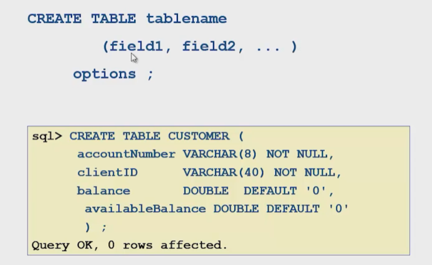
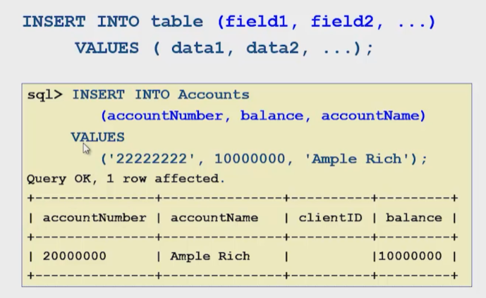
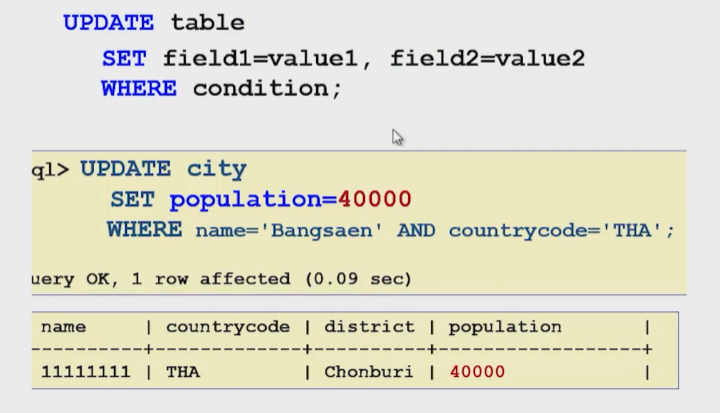
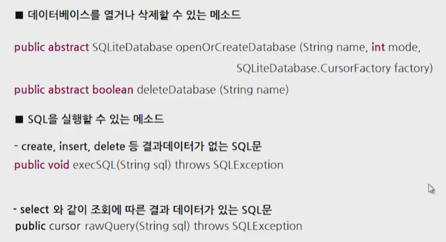

# 6. 데이터베이스

## 이론


테이블을 Relation 이라고 한다.

행을 Tuple 이라고 한다.

열을 Column or Attribute 라고 한다.

테이블의 구조 (스키마) 를 만들어야 한다.

**테이블 생성**



`DROP TABLE NAME` 테이블 삭제

**데이터 입력**



**데이터 수정**



**데이터 삭제**

`DELETE` 

**데이터 조회**


**테이블**

안드로이드 데이터저장 방법

- 설정정보
- 파일사용
- 데이터베이스

데이터베이스 순서

1. 데이터베이스 만들기
2. 테이블 만들기
3. 레코드 추가하기
4. 데이터 조회하기

데이터베이스를 만드는 간단한 방법

- Context 클래스에 정의된 openOrCreateDatabase() 메소드를 사용
- 기본적으로 사용하는 Activity 클래스가 Context 를 상속한 것이므로 액티비티 안에서 데이터베이스 생성 가능



SQLite 의 데이터를 PC 로도 볼 수 있다.


## 예시

**데이터베이스 열기**

```java
public void openDatabase(String databaseName) {
    println("openDatabase() 호출됨.");
    database = openOrCreateDatabase(databaseName, MODE_PRIVATE, null);
    if (database != null) {
        println("데이터베이스 오픈됨.");
    }
}
```

database 의 타입은 SQLiteDatabse 이다.

`database.execSQL(sql)` 결과값을 반환하지 않는 SQL 문은 execSQL 로 작성한다.

**Q&A**

Q. 자바에서 SQL 을 작성할 때 대문자로 작성하나요?

A. 

Q. 레이아웃에서 ems 속성이란?

A. 

Q. trim 메소드란?

A. 

**테이블 만들기**

```java
public void createTable(String tableName) {
    println("createTable() 호출됨.");
    if (database != null) {
        String sql = "create table " + tableName + "(_id integer PRIMARY KEY autoincrement, name text, age integer, mobile text)";
        database.execSQL(sql);
        println("테이블 생성됨.");
    } else {
        println("먼저 데이터베이스를 오픈하세요.");
    }
}
```

**데이터 추가**

```java
button3.setOnClickListener(new View.OnClickListener() {
    @Override
    public void onClick(View v) {
        String name = editText3.getText().toString().trim();
        String ageStr = editText4.getText().toString().trim();
        String mobile = editText5.getText().toString().trim();
        int age = -1;
        try {
            age = Integer.parseInt(ageStr);
        } catch (Exception e) {
            e.printStackTrace();
        }
        insertData(name, age, mobile);
    }
});
```

```java
public void insertData(String name, int age, String mobile) {
    println("insertData() 호출됨.");
    if (database != null) {
        String sql = "insert into customer(name, age, mobile) values(?, ?, ?)";
        Object[] params = {name, age, mobile};
        database.execSQL(sql, params);
        println("데이터 추가함.");
    } else {
        println("먼저 데이터베이스를 오픈하세요.");
    }
}
```

데이터베이스 오픈은 매번 해야하고 테이블은 한 번 만들면 더 이상 만들 필요가 없다.

Cursor 는 Jquery 의 result set 과 비슷하다.

**데이터 조회**

```java
public void selectData(String tableName) {
    println("selectData() 호출됨.");
    if (database != null) {
        String sql = "select name, age, mobile from " + tableName;
        Cursor cursor = database.rawQuery(sql, null);        // null 에 ? 의 리스트를 넣을 수 있다. 
        println("조회된 데이터 개수: " + cursor.getCount());  // ex) Object[] params = {name, age, mobile}
        for (int i = 0; i < cursor.getCount(); i++) {
            cursor.moveToNext();
            String name = cursor.getString(0);
            int age = cursor.getInt(1);
            String mobile = cursor.getString(2);
            println("#" + i + " -> " + name + ", " + age + ", " + mobile);
        }
        cursor.close();
    }
}
```

**전체코드**

```java
public class MainActivity extends AppCompatActivity {
    EditText editText;
    TextView textView;
    EditText editText2;
    EditText editText3;
    EditText editText4;
    EditText editText5;
    SQLiteDatabase database;

    @Override
    protected void onCreate(Bundle savedInstanceState) {
        super.onCreate(savedInstanceState);
        setContentView(R.layout.activity_main);

        editText = findViewById(R.id.editText);
        textView = findViewById(R.id.textView);
        editText2 = findViewById(R.id.editText2);
        editText3 = findViewById(R.id.editText3);
        editText4 = findViewById(R.id.editText4);
        editText5 = findViewById(R.id.editText5);
        Button button = findViewById(R.id.button);
        button.setOnClickListener(new View.OnClickListener() {
            @Override
            public void onClick(View v) {
                String databaseName = editText.getText().toString();
                openDatabase(databaseName);
            }
        });
        Button button2 = findViewById(R.id.button2);
        button2.setOnClickListener(new View.OnClickListener() {
            @Override
            public void onClick(View v) {
                String tableName = editText2.getText().toString();
                createTable(tableName);

            }
        });
        Button button3 = findViewById(R.id.button3);
        button3.setOnClickListener(new View.OnClickListener() {
            @Override
            public void onClick(View v) {
                String name = editText3.getText().toString().trim();
                String ageStr = editText4.getText().toString().trim();
                String mobile = editText5.getText().toString().trim();
                int age = -1;
                try {
                    age = Integer.parseInt(ageStr);
                } catch (Exception e) {
                    e.printStackTrace();
                }
                insertData(name, age, mobile);
            }
        });
        Button button4 = findViewById(R.id.button4);
        button4.setOnClickListener(new View.OnClickListener() {
            @Override
            public void onClick(View v) {
                String tableName = editText2.getText().toString();
                selectData(tableName);
            }
        });
    }

    public void selectData(String tableName) {
        println("selectData() 호출됨.");
        if (database != null) {
            String sql = "select name, age, mobile from " + tableName;
            Cursor cursor = database.rawQuery(sql, null);
            println("조회된 데이터 개수: " + cursor.getCount());
            for (int i = 0; i < cursor.getCount(); i++) {
                cursor.moveToNext();
                String name = cursor.getString(0);
                int age = cursor.getInt(1);
                String mobile = cursor.getString(2);
                println("#" + i + " -> " + name + ", " + age + ", " + mobile);
            }
            cursor.close();
        }
    }

    public void insertData(String name, int age, String mobile) {
        println("insertData() 호출됨.");
        if (database != null) {
            String sql = "insert into customer(name, age, mobile) values(?, ?, ?)";
            Object[] params = {name, age, mobile};
            database.execSQL(sql, params);
            println("데이터 추가함.");
        } else {
            println("먼저 데이터베이스를 오픈하세요.");
        }
    }

    public void createTable(String tableName) {
        println("createTable() 호출됨.");
        if (database != null) {
            String sql = "create table [if not exists] " + tableName + "(_id integer PRIMARY KEY autoincrement, name text, age integer, mobile text)";
            database.execSQL(sql);
            println("테이블 생성됨.");
        } else {
            println("먼저 데이터베이스를 오픈하세요.");
        }
    }

    public void openDatabase(String databaseName) {
        println("openDatabase() 호출됨.");
        database = openOrCreateDatabase(databaseName, MODE_PRIVATE, null);
        if (database != null) {
            println("데이터베이스 오픈됨.");
        }
    }
    
    public void println(String data) {
        textView.append(data + "\n");
    }
}
```


이미 있는 테이블 생성의 오류를 막으려면 [IF NOT EXISTS] 를 넣으면 된다.

SQLite: <https://sqlitebrowser.org/>{:target="_blank"}


## **헬퍼 클래스**

배포 후 데이터베이스를 수정하기 위해 사용한다.


**오픈 데이터베이스**

```java
public void openDatabase(String databaseName) {
    println("openDatabase() 호출됨.");
    DatabaseHelper helper = new DatabaseHelper(this, databaseName, null, 3);
    database = helper.getWritableDatabase();
}
```

**SQLite 오픈헬퍼**

```java
class DatabaseHelper extends SQLiteOpenHelper {
    public DatabaseHelper(@Nullable Context context, @Nullable String name, @Nullable SQLiteDatabase.CursorFactory factory, int version) {
        super(context, name, factory, version);
    }

    @Override
    public void onCreate(SQLiteDatabase db) {
        println("onCreate() 호출됨.");
        String tableName = "customer";
        String sql = "create table if not exists " + tableName + "(_id integer PRIMARY KEY autoincrement, name text, age integer, mobile text)";
        db.execSQL(sql);
        println("테이블 생성됨.");
    }

    @Override
    public void onUpgrade(SQLiteDatabase db, int oldVersion, int newVersion) {
        println("onUpgrade 호출됨: " + oldVersion + ", " + newVersion);
        if (newVersion > 1) {
            String tableName = "customer";
            db.execSQL("drop table if exists " + tableName);
            println("테이블 삭제함.");
            String sql = "create table if not exists " + tableName + "(_id integer PRIMARY KEY autoincrement, name text, age integer, mobile text)";
            db.execSQL(sql);
            println("테이블 새로 생성됨.");
        }
    }
}
```

## **인터넷 연결상태**

NetworkStatus.java

```java
public class NetworkStatus {
    public static final int TYPE_WIFI = 1;
    public static final int TYPE_MOBILE = 2;
    public static final int TYPE_NOT_CONNECTED = 3;

    public static int getConnectivityStatus(Context context) {
        ConnectivityManager manager = (ConnectivityManager) context.getSystemService(Context.CONNECTIVITY_SERVICE);
        NetworkInfo networkInfo = manager.getActiveNetworkInfo();
        if (networkInfo != null) {
            int type = networkInfo.getType();
            if (type == ConnectivityManager.TYPE_WIFI) {
                return TYPE_WIFI;
            }
        }
        return TYPE_NOT_CONNECTED;
    }
}
```

**MainActivity.java** 내 버튼

```java
button.setOnClickListener(new View.OnClickListener() {
    @Override
    public void onClick(View v) {
        int status = NetworkStatus.getConnectivityStatus(getApplicationContext());
        if (status == NetworkStatus.TYPE_MOBILE) {
            textView.setText("모바일로 연결됨.");
        } else if (status == NetworkStatus.TYPE_WIFI) {
            textView.setText("무선랜으로 연결됨.");
        } else {
            textView.setText("연결안됨.");
        }
    }
});
```

**정리**

데이터베이스 생성

```java
public class AppHelper {
    private static final String TAG = "AppHelper";
    private static SQLiteDatabase database;
    private static String createTableOutlineSql = "create table if not exists outline" +
            "(" +
            "   _id integer PRIMARY KEY autoincrement, " +
            "   id integer, " +
            "   title_eng text, " +
            "   dataValue text, " +
            "   user_rating float, " +
            "   audoence_rating float, " +
            "   reviwer_rating float, " +
            "   reservation_rate float, " +
            "   reservation_grade integer, " +
            "   grade integer, " +
            "   thumb text, " +
            "   image text" +
            ")";

    public static void openDatabase(Context context, String databaseName) {
        println("openDatabase 호출됨.");
        try {
            database = context.openOrCreateDatabase(databaseName, Context.MODE_PRIVATE, null);
            if (database != null) {
                println("데이터베이스 " + databaseName + " 오픈됨.");
            }
        } catch (Exception e) {
            e.printStackTrace();
        }
    }

    public static void createTable(String tableName) {
        println("createTable 호출됨: " + tableName);
        if (database != null) {
            if (tableName.equals("outline")) {
                database.execSQL(createTableOutlineSql);
                println("outline 테이블 생성 요청됨.");
            }
        } else {
            println("데이터베이스를 먼저 오픈하세요.");
        }
    }

    public static void println(String data) {
        Log.d(TAG, data);
    }
}
```

**MainActivity.java**

```java
AppHelper.openDatabase(getApplicationContext(), "movie");
AppHelper.createTable("outline");
```

Q. 가상에뮬레이터에서 LTE 연결방법은?

A. 

