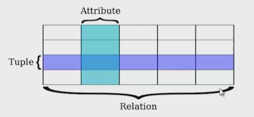
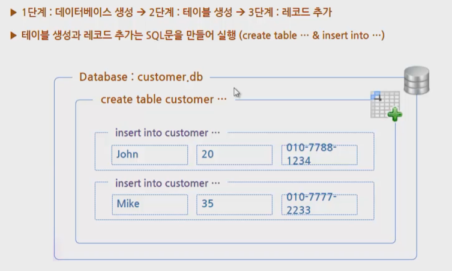
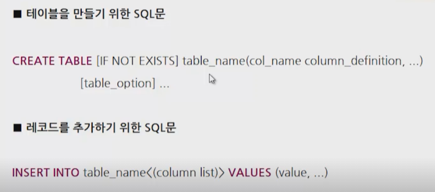
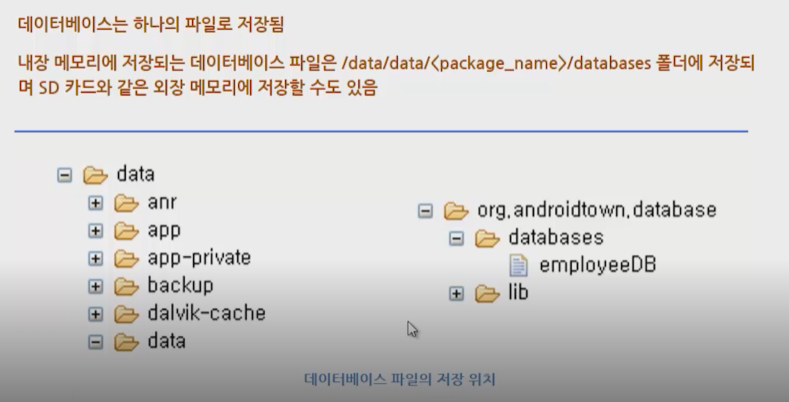
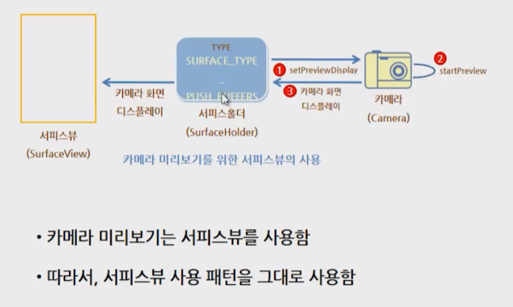
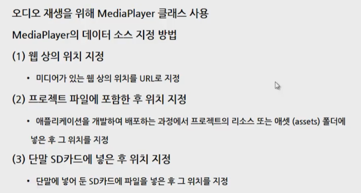

# 6. 데이터베이스

## 이론



테이블을 Relation 이라고 한다.

행을 Tuple 이라고 한다.

열을 Column or Attribute 라고 한다.

테이블의 구조 (스키마) 를 만들어야 한다.

**테이블 생성**


`DROP TABLE NAME` 테이블 삭제

**데이터 입력**


**데이터 수정**


**데이터 삭제**

`DELETE` 

**데이터 조회**


**테이블**

안드로이드 데이터저장 방법

- 설정정보
- 파일사용
- 데이터베이스

데이터베이스 순서

1. 데이터베이스 만들기
2. 테이블 만들기
3. 레코드 추가하기
4. 데이터 조회하기

데이터베이스를 만드는 간단한 방법

- Context 클래스에 정의된 openOrCreateDatabase() 메소드를 사용
- 기본적으로 사용하는 Activity 클래스가 Context 를 상속한 것이므로 액티비티 안에서 데이터베이스 생성 가능


SQLite 의 데이터를 PC 로도 볼 수 있다.



## 예시

**데이터베이스 열기**

```java
public void openDatabase(String databaseName) {
    println("openDatabase() 호출됨.");
    database = openOrCreateDatabase(databaseName, MODE_PRIVATE, null);
    if (database != null) {
        println("데이터베이스 오픈됨.");
    }
}
```

database 의 타입은 SQLiteDatabse 이다.

`database.execSQL(sql)` 결과값을 반환하지 않는 SQL 문은 execSQL 로 작성한다.

**Q&A**

Q. 자바에서 SQL 을 작성할 때 대문자로 작성하나요?

A. 기본제공 키워드는 대문자로 아니라면 소문자로 작성하는 것이 가독성에 좋습니다.

Q. 레이아웃에서 ems 속성이란?

A. layout_width 가 wrap_content 일 때 textSize 에 비례해 뷰의 사이즈가 커집니다.

Q. trim 메소드란?

A. 자바에서 trim 메소드란 문자열의 앞 뒤 공백을 제거한 문자열을 반환합니다.

데이터베이스에서 공백이 들어간 문자열이 입력되면 문제가 생길 수 있기 때문에 trim 메소드를 활용합니다.

**테이블 만들기**

```java
public void createTable(String tableName) {
    println("createTable() 호출됨.");
    if (database != null) {
        String sql = "create table " + tableName + "(_id integer PRIMARY KEY autoincrement, name text, age integer, mobile text)";
        database.execSQL(sql);
        println("테이블 생성됨.");
    } else {
        println("먼저 데이터베이스를 오픈하세요.");
    }
}
```

**데이터 추가**

```java
button3.setOnClickListener(new View.OnClickListener() {
    @Override
    public void onClick(View v) {
        String name = editText3.getText().toString().trim();
        String ageStr = editText4.getText().toString().trim();
        String mobile = editText5.getText().toString().trim();
        int age = -1;
        try {
            age = Integer.parseInt(ageStr);
        } catch (Exception e) {
            e.printStackTrace();
        }
        insertData(name, age, mobile);
    }
});
```

```java
public void insertData(String name, int age, String mobile) {
    println("insertData() 호출됨.");
    if (database != null) {
        String sql = "insert into customer(name, age, mobile) values(?, ?, ?)";
        Object[] params = {name, age, mobile};
        database.execSQL(sql, params);
        println("데이터 추가함.");
    } else {
        println("먼저 데이터베이스를 오픈하세요.");
    }
}
```

데이터베이스 오픈은 매번 해야하고 테이블은 한 번 만들면 더 이상 만들 필요가 없다.

Cursor 는 Jquery 의 result set 과 비슷하다.

**데이터 조회**

```java
public void selectData(String tableName) {
    println("selectData() 호출됨.");
    if (database != null) {
        String sql = "select name, age, mobile from " + tableName;
        Cursor cursor = database.rawQuery(sql, null);        // null 에 ? 의 리스트를 넣을 수 있다. 
        println("조회된 데이터 개수: " + cursor.getCount());  // ex) Object[] params = {name, age, mobile}
        for (int i = 0; i < cursor.getCount(); i++) {
            cursor.moveToNext();
            String name = cursor.getString(0);
            int age = cursor.getInt(1);
            String mobile = cursor.getString(2);
            println("#" + i + " -> " + name + ", " + age + ", " + mobile);
        }
        cursor.close();
    }
}
```

**전체코드**

```java
public class MainActivity extends AppCompatActivity {
    EditText editText;
    TextView textView;
    EditText editText2;
    EditText editText3;
    EditText editText4;
    EditText editText5;
    SQLiteDatabase database;

    @Override
    protected void onCreate(Bundle savedInstanceState) {
        super.onCreate(savedInstanceState);
        setContentView(R.layout.activity_main);

        editText = findViewById(R.id.editText);
        textView = findViewById(R.id.textView);
        editText2 = findViewById(R.id.editText2);
        editText3 = findViewById(R.id.editText3);
        editText4 = findViewById(R.id.editText4);
        editText5 = findViewById(R.id.editText5);
        Button button = findViewById(R.id.button);
        button.setOnClickListener(new View.OnClickListener() {
            @Override
            public void onClick(View v) {
                String databaseName = editText.getText().toString();
                openDatabase(databaseName);
            }
        });
        Button button2 = findViewById(R.id.button2);
        button2.setOnClickListener(new View.OnClickListener() {
            @Override
            public void onClick(View v) {
                String tableName = editText2.getText().toString();
                createTable(tableName);

            }
        });
        Button button3 = findViewById(R.id.button3);
        button3.setOnClickListener(new View.OnClickListener() {
            @Override
            public void onClick(View v) {
                String name = editText3.getText().toString().trim();
                String ageStr = editText4.getText().toString().trim();
                String mobile = editText5.getText().toString().trim();
                int age = -1;
                try {
                    age = Integer.parseInt(ageStr);
                } catch (Exception e) {
                    e.printStackTrace();
                }
                insertData(name, age, mobile);
            }
        });
        Button button4 = findViewById(R.id.button4);
        button4.setOnClickListener(new View.OnClickListener() {
            @Override
            public void onClick(View v) {
                String tableName = editText2.getText().toString();
                selectData(tableName);
            }
        });
    }

    public void selectData(String tableName) {
        println("selectData() 호출됨.");
        if (database != null) {
            String sql = "select name, age, mobile from " + tableName;
            Cursor cursor = database.rawQuery(sql, null);
            println("조회된 데이터 개수: " + cursor.getCount());
            for (int i = 0; i < cursor.getCount(); i++) {
                cursor.moveToNext();
                String name = cursor.getString(0);
                int age = cursor.getInt(1);
                String mobile = cursor.getString(2);
                println("#" + i + " -> " + name + ", " + age + ", " + mobile);
            }
            cursor.close();
        }
    }

    public void insertData(String name, int age, String mobile) {
        println("insertData() 호출됨.");
        if (database != null) {
            String sql = "insert into customer(name, age, mobile) values(?, ?, ?)";
            Object[] params = {name, age, mobile};
            database.execSQL(sql, params);
            println("데이터 추가함.");
        } else {
            println("먼저 데이터베이스를 오픈하세요.");
        }
    }

    public void createTable(String tableName) {
        println("createTable() 호출됨.");
        if (database != null) {
            String sql = "create table [if not exists] " + tableName + "(_id integer PRIMARY KEY autoincrement, name text, age integer, mobile text)";
            database.execSQL(sql);
            println("테이블 생성됨.");
        } else {
            println("먼저 데이터베이스를 오픈하세요.");
        }
    }

    public void openDatabase(String databaseName) {
        println("openDatabase() 호출됨.");
        database = openOrCreateDatabase(databaseName, MODE_PRIVATE, null);
        if (database != null) {
            println("데이터베이스 오픈됨.");
        }
    }
    
    public void println(String data) {
        textView.append(data + "\n");
    }
}
```




이미 있는 테이블 생성의 오류를 막으려면 [IF NOT EXISTS] 를 넣으면 된다.

SQLite: <https://sqlitebrowser.org/>{:target="_blank"}



## **헬퍼 클래스**

배포 후 데이터베이스를 수정하기 위해 사용한다.


**오픈 데이터베이스**

```java
public void openDatabase(String databaseName) {
    println("openDatabase() 호출됨.");
    DatabaseHelper helper = new DatabaseHelper(this, databaseName, null, 3);
    database = helper.getWritableDatabase();
}
```

**SQLite 오픈헬퍼**

```java
class DatabaseHelper extends SQLiteOpenHelper {
    public DatabaseHelper(@Nullable Context context, @Nullable String name, @Nullable SQLiteDatabase.CursorFactory factory, int version) {
        super(context, name, factory, version);
    }

    @Override
    public void onCreate(SQLiteDatabase db) {
        println("onCreate() 호출됨.");
        String tableName = "customer";
        String sql = "create table if not exists " + tableName + "(_id integer PRIMARY KEY autoincrement, name text, age integer, mobile text)";
        db.execSQL(sql);
        println("테이블 생성됨.");
    }

    @Override
    public void onUpgrade(SQLiteDatabase db, int oldVersion, int newVersion) {
        println("onUpgrade 호출됨: " + oldVersion + ", " + newVersion);
        if (newVersion > 1) {
            String tableName = "customer";
            db.execSQL("drop table if exists " + tableName);
            println("테이블 삭제함.");
            String sql = "create table if not exists " + tableName + "(_id integer PRIMARY KEY autoincrement, name text, age integer, mobile text)";
            db.execSQL(sql);
            println("테이블 새로 생성됨.");
        }
    }
}
```

## **인터넷 연결상태**

NetworkStatus.java

```java
public class NetworkStatus {
    public static final int TYPE_WIFI = 1;
    public static final int TYPE_MOBILE = 2;
    public static final int TYPE_NOT_CONNECTED = 3;

    public static int getConnectivityStatus(Context context) {
        ConnectivityManager manager = (ConnectivityManager) context.getSystemService(Context.CONNECTIVITY_SERVICE);
        NetworkInfo networkInfo = manager.getActiveNetworkInfo();
        if (networkInfo != null) {
            int type = networkInfo.getType();
            if (type == ConnectivityManager.TYPE_WIFI) {
                return TYPE_WIFI;
            }
        }
        return TYPE_NOT_CONNECTED;
    }
}
```

**MainActivity.java** 내 버튼

```java
button.setOnClickListener(new View.OnClickListener() {
    @Override
    public void onClick(View v) {
        int status = NetworkStatus.getConnectivityStatus(getApplicationContext());
        if (status == NetworkStatus.TYPE_MOBILE) {
            textView.setText("모바일로 연결됨.");
        } else if (status == NetworkStatus.TYPE_WIFI) {
            textView.setText("무선랜으로 연결됨.");
        } else {
            textView.setText("연결안됨.");
        }
    }
});
```

**정리**

데이터베이스 생성

```java
public class AppHelper {
    private static final String TAG = "AppHelper";
    private static SQLiteDatabase database;
    private static String createTableOutlineSql = "create table if not exists outline" +
            "(" +
            "   _id integer PRIMARY KEY autoincrement, " +
            "   id integer, " +
            "   title_eng text, " +
            "   dataValue text, " +
            "   user_rating float, " +
            "   audoence_rating float, " +
            "   reviwer_rating float, " +
            "   reservation_rate float, " +
            "   reservation_grade integer, " +
            "   grade integer, " +
            "   thumb text, " +
            "   image text" +
            ")";

    public static void openDatabase(Context context, String databaseName) {
        println("openDatabase 호출됨.");
        try {
            database = context.openOrCreateDatabase(databaseName, Context.MODE_PRIVATE, null);
            if (database != null) {
                println("데이터베이스 " + databaseName + " 오픈됨.");
            }
        } catch (Exception e) {
            e.printStackTrace();
        }
    }

    public static void createTable(String tableName) {
        println("createTable 호출됨: " + tableName);
        if (database != null) {
            if (tableName.equals("outline")) {
                database.execSQL(createTableOutlineSql);
                println("outline 테이블 생성 요청됨.");
            }
        } else {
            println("데이터베이스를 먼저 오픈하세요.");
        }
    }

    public static void println(String data) {
        Log.d(TAG, data);
    }
}
```

**MainActivity.java**

```java
AppHelper.openDatabase(getApplicationContext(), "movie");
AppHelper.createTable("outline");
```

Q. 가상에뮬레이터에서 LTE 연결방법은?

A. 

# 7. 멀티미디어

## 카메라



**Mainfest**

```
<uses-permission android:name="android.permission.READ_EXTERNAL_STORAGE"/>
<uses-permission android:name="android.permission.WRITE_EXTERNAL_STORAGE"/>
```

**build.gradle**

```
targetSdkVersion 22
```

**MainActivity.java**

```java
public class MainActivity extends AppCompatActivity {
    ImageView imageView;
    private File file;

    @Override
    protected void onCreate(Bundle savedInstanceState) {
        super.onCreate(savedInstanceState);
        setContentView(R.layout.activity_main);

        imageView = findViewById(R.id.imageView);
        File sdcard = Environment.getExternalStorageDirectory();
        file = new File(sdcard, "capture.jpg");
        Button button = findViewById(R.id.button);
        button.setOnClickListener(new View.OnClickListener() {
            @Override
            public void onClick(View v) {
                capture();
            }
        });
    }

    private void capture() {
        Intent intent = new Intent(MediaStore.ACTION_IMAGE_CAPTURE);
        intent.putExtra(MediaStore.EXTRA_OUTPUT, Uri.fromFile(file));
        startActivityForResult(intent, 101);
    }

    @Override
    protected void onActivityResult(int requestCode, int resultCode, Intent data) {
        super.onActivityResult(requestCode, resultCode, data);
        if (requestCode == 101 && resultCode == Activity.RESULT_OK) {
            BitmapFactory.Options options = new BitmapFactory.Options();
            options.inSampleSize = 8;
            Bitmap bitmap = BitmapFactory.decodeFile(file.getAbsolutePath(), options);
            imageView.setImageBitmap(bitmap);
        }
    }
}
```

Q. context 란?

A. 

Q. call back 메소드란?

A. 

**앱 내에 카메라 넣기**

**Mainfest**

```
<uses-permission android:name="android.permission.CAMERA"/>
```

**SurfaceView.java**

```java
public class CameraSurfaceView extends SurfaceView implements SurfaceHolder.Callback {
    SurfaceHolder holder;
    Camera camera = null;

    public CameraSurfaceView(Context context) {
        super(context);
        init(context);
    }

    public CameraSurfaceView(Context context, AttributeSet attrs) {
        super(context, attrs);
        init(context);
    }

    private void init(Context context) {
        holder = getHolder();
        holder.addCallback(this);
    }

    @Override
    public void surfaceCreated(@NonNull SurfaceHolder holder) {
        camera = Camera.open();
        try {
            camera.setPreviewDisplay(holder);
        } catch (Exception e) {
            e.printStackTrace();
        }
    }

    @Override
    public void surfaceChanged(@NonNull SurfaceHolder holder, int format, int width, int height) {
        camera.startPreview();

    }

    @Override
    public void surfaceDestroyed(@NonNull SurfaceHolder holder) {
        camera.stopPreview();
        camera.release();
        camera = null;

    }

    public boolean capture(Camera.PictureCallback callback) {
        if (camera != null) {
            camera.takePicture(null, null, callback);
            return true;
        } else {
            return false;
        }
    }
}
```

**MainActivity.java**

```java
public class MainActivity extends AppCompatActivity {
    ImageView imageView;
    CameraSurfaceView surfaceView;

    @Override
    protected void onCreate(Bundle savedInstanceState) {
        super.onCreate(savedInstanceState);
        setContentView(R.layout.activity_main);

        imageView = findViewById(R.id.imageView);
        surfaceView = findViewById(R.id.surfaceView);
        Button button = findViewById(R.id.button);
        button.setOnClickListener(new View.OnClickListener() {
            @Override
            public void onClick(View v) {
                capture();
            }
        });
    }

    public void capture() {
        surfaceView.capture(new Camera.PictureCallback() {
            @Override
            public void onPictureTaken(byte[] data, Camera camera) {
                BitmapFactory.Options options = new BitmapFactory.Options();
                options.inSampleSize = 8;
                Bitmap bitmap = BitmapFactory.decodeByteArray(data, 0, data.length);
                imageView.setImageBitmap(bitmap);
                camera.startPreview();
            }
        });
    }
}
```

## 음악&동영상




URL 에 지정해놓는다.

에뮬레이터로는 에러가 날 수 있습니다.

```java
public class MainActivity extends AppCompatActivity {
    public static String url = "http://sites.google.com/site/ubiaccessmobile/sample_audio.amr";
    MediaPlayer player;
    int position = 0;

    @Override
    protected void onCreate(Bundle savedInstanceState) {
        super.onCreate(savedInstanceState);
        setContentView(R.layout.activity_main);

        Button button_play = findViewById(R.id.play);
        button_play.setOnClickListener(new View.OnClickListener() {
            @Override
            public void onClick(View v) {
                playAudio();

            }
        });
        Button button_pause = findViewById(R.id.pause);
        button_pause.setOnClickListener(new View.OnClickListener() {
            @Override
            public void onClick(View v) {
                pauseAudio();

            }
        });
        Button button_replay = findViewById(R.id.replay);
        button_replay.setOnClickListener(new View.OnClickListener() {
            @Override
            public void onClick(View v) {
                resumeAudio();

            }
        });
        Button button_stop = findViewById(R.id.stop);
        button_stop.setOnClickListener(new View.OnClickListener() {
            @Override
            public void onClick(View v) {
                stopAudio();

            }
        });
    }

    public void stopAudio() {
        if (player != null && player.isPlaying()) {
            player.stop();
            Toast.makeText(this, "정지됨.", Toast.LENGTH_SHORT).show();
        }
    }

    public void resumeAudio() {
        if (player != null && !player.isPlaying()) {
            player.seekTo(position);
            player.start();
            Toast.makeText(this, "재시작됨.", Toast.LENGTH_SHORT).show();
        }
    }

    public void pauseAudio() {
        if (player != null) {
            position = player.getCurrentPosition();
            player.pause();
            Toast.makeText(this, "일시정지됨.", Toast.LENGTH_SHORT).show();
        }
    }

    public void playAudio() {
        closePlayer();
        try {
            player = new MediaPlayer();
            player.setDataSource(url);
            player.prepare();
            player.start();
            Toast.makeText(this, "재생 시작됨.", Toast.LENGTH_SHORT).show();
        } catch (IOException e) {
            e.printStackTrace();
        }
    }

    public void closePlayer() {
        if (player != null) {
            player.release();
            player = null;
        }
    }
}
```

**동영상재생**

샘플비디오: <http://sites.google.com/site/ubiaccessmobile/sample_video.mp4>{:target="_blank"}

```java
public class MainActivity extends AppCompatActivity {
    VideoView videoView;
    public static String url = "http://sites.google.com/site/ubiaccessmobile/sample_video.mp4";

    @Override
    protected void onCreate(Bundle savedInstanceState) {
        super.onCreate(savedInstanceState);
        setContentView(R.layout.activity_main);

        videoView = findViewById(R.id.videoView);
        MediaController controller = new MediaController(this);
        videoView.setMediaController(controller);
        videoView.setVideoURI(Uri.parse(url));
        videoView.requestFocus();
        videoView.setOnPreparedListener(new MediaPlayer.OnPreparedListener() {
            @Override
            public void onPrepared(MediaPlayer mp) {
                Toast.makeText(MainActivity.this, "동영상 준비됨.", Toast.LENGTH_SHORT).show();
            }
        });

        Button button = findViewById(R.id.button);
        button.setOnClickListener(new View.OnClickListener() {
            @Override
            public void onClick(View v) {
                videoView.seekTo(0);
                videoView.start();
            }
        });
    }
}
```

## **음성녹음**

과정

1. 미디어리코더 객체 생성
2. 오디오 입력 및 출력형식 설정
3. 오디오 인코더와 파일 지정
4. 녹음 시작
5. 매니페스트에 권한 설정

**Manifest**

```
<uses-permission android:name="android.permission.READ_EXTERNAL_STORAGE"/>
<uses-permission android:name="android.permission.WRITE_EXTERNAL_STORAGE"/>
<uses-permission android:name="android.permission.RECORD_AUDIO"/>
```

**MainActivity.java**

```java
public class MainActivity extends AppCompatActivity {
    public static String url = "http://sites.google.com/site/ubiaccessmobile/sample_audio.amr";
    MediaPlayer player;
    MediaRecorder recorder;
    int position = 0;
    private String filename;

    @Override
    protected void onCreate(Bundle savedInstanceState) {
        super.onCreate(savedInstanceState);
        setContentView(R.layout.activity_main);

        File sdcard = Environment.getExternalStorageDirectory();
        File file = new File(sdcard, "recorded.mp4");
        filename = file.getAbsolutePath();
        Log.d("MainActivity", "저장할 파일명: " +filename);

        Button button_play = findViewById(R.id.play);
        button_play.setOnClickListener(new View.OnClickListener() {
            @Override
            public void onClick(View v) {
                playAudio();
            }
        });
        Button button_pause = findViewById(R.id.pause);
        button_pause.setOnClickListener(new View.OnClickListener() {
            @Override
            public void onClick(View v) {
                pauseAudio();

            }
        });
        Button button_replay = findViewById(R.id.replay);
        button_replay.setOnClickListener(new View.OnClickListener() {
            @Override
            public void onClick(View v) {
                resumeAudio();

            }
        });
        Button button_stop = findViewById(R.id.stop);
        button_stop.setOnClickListener(new View.OnClickListener() {
            @Override
            public void onClick(View v) {
                stopAudio();
            }
        });
        Button button_record = findViewById(R.id.record);
        button_record.setOnClickListener(new View.OnClickListener() {
            @Override
            public void onClick(View v) {
                recordAudio();
            }
        });
        Button button_stopRecord = findViewById(R.id.stopRecord);
        button_stopRecord.setOnClickListener(new View.OnClickListener() {
            @Override
            public void onClick(View v) {
                stopRecording();
            }
        });
    }

    private void stopRecording() {
        if (recorder != null) {
            recorder.stop();
            recorder.release();
            recorder = null;
            Toast.makeText(this, "녹음 중지됨.", Toast.LENGTH_SHORT).show();
        }
    }

    public void recordAudio() {
        recorder = new MediaRecorder();
        recorder.setAudioSource(MediaRecorder.AudioSource.MIC);
        recorder.setOutputFormat(MediaRecorder.OutputFormat.MPEG_4);
        recorder.setAudioEncoder(MediaRecorder.AudioEncoder.DEFAULT);
        recorder.setOutputFile(filename);
        try {
            recorder.prepare();
        } catch (IOException e) {
            e.printStackTrace();
        }
        recorder.start();
        Toast.makeText(this, "녹음 시작됨.", Toast.LENGTH_SHORT).show();
    }

    public void stopAudio() {
        if (player != null && player.isPlaying()) {
            player.stop();
            Toast.makeText(this, "정지됨.", Toast.LENGTH_SHORT).show();
        }
    }

    public void resumeAudio() {
        if (player != null && !player.isPlaying()) {
            player.seekTo(position);
            player.start();
            Toast.makeText(this, "재시작됨.", Toast.LENGTH_SHORT).show();
        }
    }

    public void pauseAudio() {
        if (player != null) {
            position = player.getCurrentPosition();
            player.pause();
            Toast.makeText(this, "일시정지됨.", Toast.LENGTH_SHORT).show();
        }
    }

    public void playAudio() {
        closePlayer();
        try {
            player = new MediaPlayer();
            player.setDataSource(filename);
            player.prepare();
            player.start();
            Toast.makeText(this, "재생 시작됨.", Toast.LENGTH_SHORT).show();
        } catch (IOException e) {
            e.printStackTrace();
        }
    }

    public void closePlayer() {
        if (player != null) {
            player.release();
            player = null;
        }
    }
}
```

## **리사이클러뷰**

- 좌우로 리스트뷰를 표현하고 싶을 때 사용
- 상하스크롤도 지원된다.

**MainActivity.java**

```java
public class MainActivity extends AppCompatActivity {
    RecyclerView recyclerView;

    @Override
    protected void onCreate(Bundle savedInstanceState) {
        super.onCreate(savedInstanceState);
        setContentView(R.layout.activity_main);

        recyclerView = findViewById(R.id.recyclerView);
        LinearLayoutManager layoutManager = new LinearLayoutManager(this, LinearLayoutManager.HORIZONTAL, false);
        recyclerView.setLayoutManager(layoutManager);

        SingerAdapter adapter = new SingerAdapter(getApplicationContext());
        adapter.addItem(new SingerItem("소녀시대", "010-1000-1000"));
        adapter.addItem(new SingerItem("걸스데이", "010-1000-2000"));
        adapter.addItem(new SingerItem("여자친구", "010-1000-3000"));
        recyclerView.setAdapter(adapter);
    }
}
```

**SingerItem.java**

```java
public class SingerItem {
    String name;
    String mobile;

    public SingerItem(String name, String mobile) {
        this.name = name;
        this.mobile = mobile;
    }

    public String getName() {
        return name;
    }

    public void setName(String name) {
        this.name = name;
    }

    public String getMobile() {
        return mobile;
    }

    public void setMobile(String mobile) {
        this.mobile = mobile;
    }
}
```

**SingerAdapter.java**

```java
public class SingerAdapter extends RecyclerView.Adapter<SingerAdapter.ViewHolder> {
    Context context;
    ArrayList<SingerItem> items = new ArrayList<>();

    public SingerAdapter(Context context) {
        this.context = context;
    }

    @NonNull
    @Override
    public ViewHolder onCreateViewHolder(@NonNull ViewGroup parent, int viewType) {
        LayoutInflater inflater = (LayoutInflater) context.getSystemService(Context.LAYOUT_INFLATER_SERVICE);
        View itemView = inflater.inflate(R.layout.singer_item, parent, false);
        return new ViewHolder(itemView);
    }

    @Override
    public void onBindViewHolder(@NonNull SingerAdapter.ViewHolder holder, int position) {
        SingerItem item = items.get(position);
        holder.setItem(item);

    }

    @Override
    public int getItemCount() {
        return items.size();
    }

    public void addItem(SingerItem item) {
        items.add(item);
    }

    public void addItems(ArrayList<SingerItem> items) {
        this.items = items;
    }

    public SingerItem getItem(int position) {
        return items.get(position);
    }

    public class ViewHolder extends RecyclerView.ViewHolder {
        TextView textView;
        TextView textView2;

        public ViewHolder(@NonNull View itemView) {
            super(itemView);
            textView = itemView.findViewById(R.id.textView);
            textView2 = itemView.findViewById(R.id.textView2);
        }

        public void setItem(SingerItem item) {
            textView.setText(item.getName());
            textView2.setText(item.getMobile());
        }
    }
}
```

**singer_item.xml**


Q. 인터페이스의 static 선언?

A. 인터페이스는 객체를 생성할 수 없으므로 static 은 의미가 없다.

Q. 인터페이스의 public 메소드?

A. 인터페이스의 모든 메소드는 public abstract 이며 생략된다.

**선택되는 리사이클러뷰**

MainActivity.java

```java
adapter.setOnItemClickListener(new SingerAdapter.OnItemClickListener() {
    @Override
    public void onItemClick(SingerAdapter.ViewHolder holder, View view, int position) {
        SingerItem item = adapter.getItem(position);
        Toast.makeText(MainActivity.this, "아이템 선택됨: " + item.getName(), Toast.LENGTH_SHORT).show();
    }
});
```

SingerAdapter.java

```java
public class SingerAdapter extends RecyclerView.Adapter<SingerAdapter.ViewHolder> {
    Context context;
    ArrayList<SingerItem> items = new ArrayList<>();
    OnItemClickListener listener;

    public interface OnItemClickListener {
        void onItemClick(ViewHolder holder, View view, int position);
    }

    public SingerAdapter(Context context) {
        this.context = context;
    }

    @NonNull
    @Override
    public ViewHolder onCreateViewHolder(@NonNull ViewGroup parent, int viewType) {
        LayoutInflater inflater = (LayoutInflater) context.getSystemService(Context.LAYOUT_INFLATER_SERVICE);
        View itemView = inflater.inflate(R.layout.singer_item, parent, false);
        return new ViewHolder(itemView);
    }

    @Override
    public void onBindViewHolder(@NonNull SingerAdapter.ViewHolder holder, int position) {
        SingerItem item = items.get(position);
        holder.setItem(item);
        holder.setOnItemClickListener(listener);
    }

    @Override
    public int getItemCount() {
        return items.size();
    }

    public void addItem(SingerItem item) {
        items.add(item);
    }

    public void addItems(ArrayList<SingerItem> items) {
        this.items = items;
    }

    public SingerItem getItem(int position) {
        return items.get(position);
    }

    public void setOnItemClickListener(OnItemClickListener listener) {
        this.listener = listener;
    }

    static class ViewHolder extends RecyclerView.ViewHolder {
        TextView textView;
        TextView textView2;
        OnItemClickListener listener;

        public ViewHolder(@NonNull View itemView) {
            super(itemView);
            textView = itemView.findViewById(R.id.textView);
            textView2 = itemView.findViewById(R.id.textView2);
            itemView.setOnClickListener(new View.OnClickListener() {
                @Override
                public void onClick(View v) {
                    int position = getAdapterPosition();
                    if (listener != null) {
                        listener.onItemClick(ViewHolder.this, v, position);
                    }
                }
            });
        }

        public void setItem(SingerItem item) {
            textView.setText(item.getName());
            textView2.setText(item.getMobile());
        }

        public void setOnItemClickListener(OnItemClickListener listener) {
            this.listener = listener;
        }
    }
}
```

## 포토뷰&유튜브

**정리**

**Photo View**

build.gradle(project)

```
allprojects {
    repositories {
    	maven {url "https://jitpack.io"}
    }
}
```

build.gradle(app)

```
implementation 'com.github.chrisbanes:PhotoView:2.1.3'
```

**에러**

```
Execution failed for task ':app:checkDebugDuplicateClasses'.
> A failure occurred while executing com.android.build.gradle.internal.tasks.CheckDuplicatesRunnable

* Try:
Run with --stacktrace option to get the stack trace. Run with --info or --debug option to get more log output. Run with --scan to get full insights.
```

와 같은 에러가 난다면 gradle.properties 에 다음과 같은 코드 추가

```
android.enableJetifier=true
```

**MainActivity.java**

```java
PhotoView photoView = findViewById(R.id.photoView);
photoView.setImageResource(R.drawable.black_widow);
```

**유튜브 연결**

```java
button.setOnClickListener(new View.OnClickListener() {
    @Override
    public void onClick(View v) {
        String url = editText.getText().toString();
        Intent intent = new Intent(Intent.ACTION_VIEW, Uri.parse(url));
        startActivity(intent);
    }
});
```

# 8. 애니메이션

## 애니메이션

**1. 스레드 애니메이션**

```java
public class MainActivity extends AppCompatActivity {
    ArrayList<Drawable> imageList = new ArrayList<>();
    ImageView imageView;
    Handler handler = new Handler();

    @Override
    protected void onCreate(Bundle savedInstanceState) {
        super.onCreate(savedInstanceState);
        setContentView(R.layout.activity_main);

        imageView = findViewById(R.id.imageView);
        Resources res = getResources();
        imageList.add(res.getDrawable(R.drawable.ic_launcher_foreground));
        imageList.add(res.getDrawable(R.drawable.ic_launcher_background));
        imageList.add(res.getDrawable(R.mipmap.ic_launcher_round));
        Button button = findViewById(R.id.button);
        button.setOnClickListener(new View.OnClickListener() {
            @Override
            public void onClick(View v) {
                AnimThread thread = new AnimThread();
                thread.start();
            }
        });
    }

    class AnimThread extends Thread {
        @Override
        public void run() {
            for (int i = 0; i < 100; i++) {
                int index = i % 3;
                Drawable drawable = imageList.get(index);
                handler.post(new Runnable() {
                    @Override
                    public void run() {
                        imageView.setImageDrawable(drawable);
                    }
                });
                try {
                    Thread.sleep(1000);
                } catch (InterruptedException e) {
                    e.printStackTrace();
                }
            }
        }
    }
}
```

**2. 트윈 애니메이션 (Tweened Animation)**

- 뷰 애니메이션이라고도 하며, 보여줄 대상을 적절하게 연산한 후 그 결과를 연속적으로 디스플레이하는 방식임
- 애니메이션 대상과 변환방식을 지정하면 애니메이션 효과를 낼 수 있도록 만들어 줌
- 따라서 프레임 애니메이션처럼 변경하면서 보여줄 각각의 이미지를 추가할 필요없이 대상만 지정하면 시스템 내부적으로 적절하게 연산하는 과정을 거치게 됨

애니메이션을 위한 액션정보

- XML 리소스로 정의하거나 자바코드에서 직접 객체로 만듬
- 애니메이션을 위한 XML 파일은 [/res/anim] 폴더의 밑에 두어야 하며 확장자를 xml 로 함
- 리소스로 포함된 애니메이션 액션정의는 다른 리소스와 마찬가지로 빌드할 때 컴파일되어 설치파일에 포함됨

**대상과 애니메이션 효과**


**MainActivity.java** 버튼 클릭

```java
button.setOnClickListener(new View.OnClickListener() {
    @Override
    public void onClick(View v) {
        Animation scale = AnimationUtils.loadAnimation(getApplicationContext(), R.anim.scale);
        v.startAnimation(scale);
    }
});
```

**scale.xml** Anim 디렉토리 내부

```xml
<scale
    android:pivotX="50%"
    android:pivotY="50%"
    android:fromXScale="1.0"
    android:fromYScale="1.0"
    android:toXScale="3.0"
    android:toYScale="3.0"
    android:duration="1500"/>
<scale
    android:startOffset="1500"
    android:pivotX="50%"
    android:pivotY="50%"
    android:fromXScale="1.0"
    android:fromYScale="1.0"
    android:toXScale="0.3"
    android:toYScale="0.3"
    android:duration="1500"/>
```

**인터폴레이터**

- accelerate_interpolator: 애니메이션 효과를 점점 빠르게
- decelerate-interpolator: 애니메이션 효과를 점점 느리게
- accelerate_decelerate_interpolator: 애니메이션 효과를 점점 빠르다가 느리게
- anticipate_interpolator: 시작위치에서 조금 뒤로 당겼다가 시작하도록
- overshoot_interpolator: 종료위치에서 조금 지나쳤다가 종료되도록

트윈 애니메이션이 스레드 애니메이션보다 성능면 등이 더 좋다.

**페이지 슬라이딩**


`100%p` 오른쪽 끝

`0%p` 왼쪽 끝

**MainActivity.java**

```java
public class MainActivity extends AppCompatActivity {
    LinearLayout page;
    Animation translateLeft;
    Animation translateRight;
    Boolean isPageOpen = false;
    private Button button;

    @Override
    protected void onCreate(Bundle savedInstanceState) {
        super.onCreate(savedInstanceState);
        setContentView(R.layout.activity_main);

        page = findViewById(R.id.page);
        translateLeft = AnimationUtils.loadAnimation(this, R.anim.translate_left);
        translateRight = AnimationUtils.loadAnimation(this, R.anim.translate_right);
        SlidingAnimationListener listener = new SlidingAnimationListener();
        translateLeft.setAnimationListener(listener);
        translateRight.setAnimationListener(listener);
        button = findViewById(R.id.button);
        button.setOnClickListener(new View.OnClickListener() {
            @Override
            public void onClick(View v) {
                if (isPageOpen) {
                    page.startAnimation(translateRight);
                    button.setText("열기");
                } else {
                    button.setText("닫기");
                    page.setVisibility(View.VISIBLE);
                    page.startAnimation(translateLeft);
                }
            }
        });
    }

    class SlidingAnimationListener implements Animation.AnimationListener {
        @Override
        public void onAnimationStart(Animation animation) {
        }

        @Override
        public void onAnimationEnd(Animation animation) {
            if (isPageOpen) {
                page.setVisibility(View.INVISIBLE);
                isPageOpen = false;
           } else {
                isPageOpen = true;
            }
        }

        @Override
        public void onAnimationRepeat(Animation animation) {
        }
    }
}
```

**translate_left.xml**

```xml
<set xmlns:android="http://schemas.android.com/apk/res/android">
    <translate
        android:fromXDelta="100%p"
        android:toXDelta="0%p"
        android:duration="1500"/>
</set>
```

**translate_right.xml**

```xml
<set xmlns:android="http://schemas.android.com/apk/res/android">
    <translate
        android:fromXDelta="0%p"
        android:toXDelta="100%p"
        android:duration="1500"/>
</set>
```

## **스플래시**

layout 을 만들어 setContentView 해도 되고 테마로 설정해도 된다.

**splash_base.xml:** drawable 내부 새 xml

```xml
<shape xmlns:android="http://schemas.android.com/apk/res/android">
    <gradient
        android:startColor="#FF3E50B4"
        android:centerColor="#FF7288DB"
        android:endColor="#FF7288DB"
        android:angle="90"
        android:centerY="0.5"/>
    <corners android:radius="0dp"/>
</shape>
```

**splash_background.xml:** drawable 내부 새 xml

```xml
<layer-list xmlns:android="http://schemas.android.com/apk/res/android">
    <item android:drawable="@drawable/splash_base"/>
    <item android:top="210dp"
        android:drawable="@drawable/ic_launcher_foreground"
        android:gravity="center">
    </item>
</layer-list>
```

**themes.xml:** values 폴더 내부

```xml
<style name="SplashTheme" parent="Theme.AppCompat.NoActionBar">
    <item name="android:windowBackground">@drawable/splash_background</item>
</style>
```

**SplashActivity.java**

```java
public class SplashActivity extends AppCompatActivity {
    Handler handler = new Handler();

    @Override
    protected void onCreate(@Nullable Bundle savedInstanceState) {
        super.onCreate(savedInstanceState);

        handler.postDelayed(new Runnable() {
            @Override
            public void run() {
                Intent intent = new Intent(getApplicationContext(), MainActivity.class);
                startActivity(intent);
                finish();
            }
        }, 1000);
    }
}
```

**Manifest**

```
<activity android:name=".SplashActivity"
    android:theme="@style/SplashTheme">
    <intent-filter>
        <action android:name="android.intent.action.MAIN" />

        <category android:name="android.intent.category.LAUNCHER" />
    </intent-filter>
</activity>
```

초기 화면을 SplashActivity 로 변경 후 테마를 SplashTheme 으로 변경

**정리**

```java
public class MainActivity extends AppCompatActivity {
    private Animation translateUp;
    private Animation translateDown;
    LinearLayout menuContainer;

    @Override
    protected void onCreate(Bundle savedInstanceState) {
        super.onCreate(savedInstanceState);
        setContentView(R.layout.activity_main);

        translateUp = AnimationUtils.loadAnimation(getApplicationContext(), R.anim.translate_up);
        translateDown = AnimationUtils.loadAnimation(getApplicationContext(), R.anim.translate_down);
        translateUp.setAnimationListener(new Animation.AnimationListener() {
            @Override
            public void onAnimationStart(Animation animation) {
            }

            @Override
            public void onAnimationEnd(Animation animation) {
                menuContainer.setVisibility(View.INVISIBLE);
            }

            @Override
            public void onAnimationRepeat(Animation animation) {
            }
        });

        menuContainer = findViewById(R.id.menuContainer);
        Button button = findViewById(R.id.button);
        button.setOnClickListener(new View.OnClickListener() {
            @Override
            public void onClick(View v) {
                if (menuContainer.getVisibility() == View.VISIBLE) {
                    menuContainer.startAnimation(translateUp);
                } else {
                    menuContainer.setVisibility(View.VISIBLE);
                    menuContainer.startAnimation(translateDown);
                }
            }
        });
    }
}
```

강사쌤은 isShown 이라는 불린 값을 정의해서 사용했지만 getVisibility 와 View.VISIBLE 함수를 사용하는 것이 더 적절한 것 같아 수정해서 작성했습니다.

