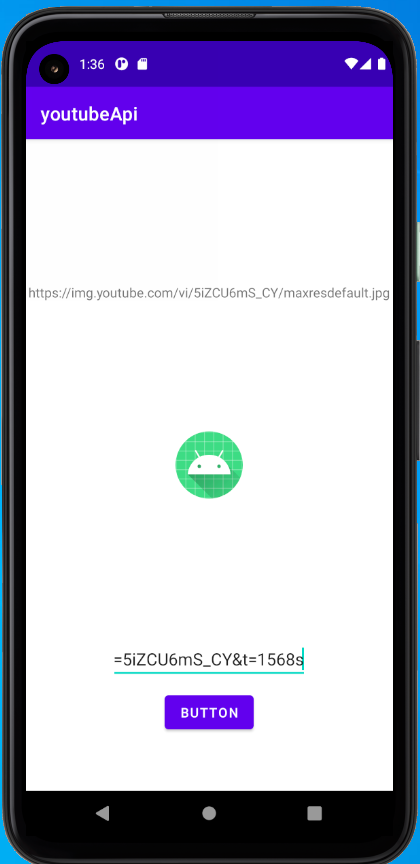
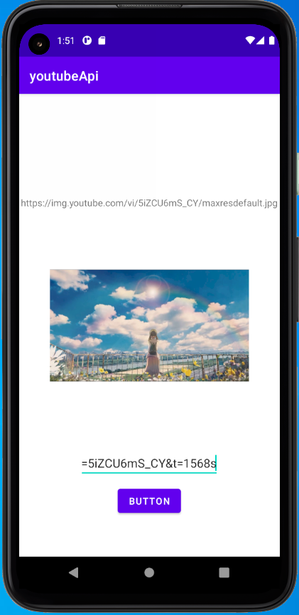
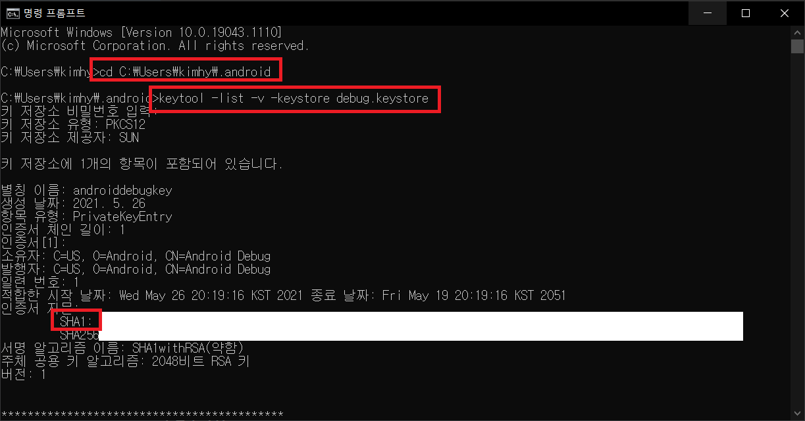
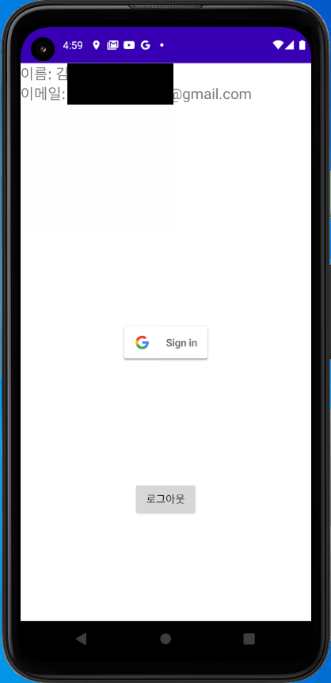

**editText.text.**

`substring()`

`indexOf()` 

`split()` 특정 문자를 기준으로 잘라 문자열 리스트를 반환합니다.

```kotlin
var startIndex = editText.text.indexOf('=')
var endIndex = editText.text.indexOf('&')
val videoId = editText.text.substring(startIndex, endIndex)  // =5iZCU6mS_CY
```

startIndex 포함, endIndex 미포함

# 1. 유튜브 API

## I. 이미지링크



```kotlin
class MainActivity : AppCompatActivity() {
    override fun onCreate(savedInstanceState: Bundle?) {
        super.onCreate(savedInstanceState)
        setContentView(R.layout.activity_main)

        val textView = findViewById<TextView>(R.id.textView)
        val editText = findViewById<EditText>(R.id.editText)
        val button = findViewById<Button>(R.id.button)

        button.setOnClickListener {
            var startIndex = editText.text.indexOf('=')
            var endIndex = editText.text.indexOf('&')
            val videoId = editText.text.substring(startIndex + 1, endIndex)
            var imageLink = "https://img.youtube.com/vi/" + videoId + "/maxresdefault.jpg"
            textView.setText(imageLink)
        }
    }
}
```

웹서버에 이미지를 불러오기 위해 이번에는 glide 라는 라이브러리를 활용해보겠다.



**build.gradle**

```
implementation 'com.github.bumptech.glide:glide:4.11.0'
annotationProcessor 'com.github.bumptech.glide:compiler:4.11.0'
```

**manifest**

```
<uses-permission android:name="android.permission.INTERNET"/>
```

Glide 후에 with, load, into 메소드 세 개를 사용하면 쉽게 사용할 수 있다.

```kotlin
class MainActivity : AppCompatActivity() {
    override fun onCreate(savedInstanceState: Bundle?) {
        super.onCreate(savedInstanceState)
        setContentView(R.layout.activity_main)

        val textView = findViewById<TextView>(R.id.textView)
        val editText = findViewById<EditText>(R.id.editText)
        val imageView = findViewById<ImageView>(R.id.imageView)
        val button = findViewById<Button>(R.id.button)

        button.setOnClickListener {
            var startIndex = editText.text.indexOf('=')
            var endIndex = editText.text.indexOf('&')
            val videoId = editText.text.substring(startIndex + 1, endIndex)
            var imageURL = "https://img.youtube.com/vi/" + videoId + "/maxresdefault.jpg"
            textView.setText(imageURL)
            Glide.with(this)
                .load(imageURL)
                .into(imageView)
        }
    }
}
```

**오류수정 및 지우기버튼 추가**

유튜브 URL 에서 특수문자 & 가 없는 경우도 있어 앱이 비정상 종료 되었다. if 문으로 예외처리 했다.

```kotlin
class MainActivity : AppCompatActivity() {
    override fun onCreate(savedInstanceState: Bundle?) {
        super.onCreate(savedInstanceState)
        setContentView(R.layout.activity_main)

        val textView = findViewById<TextView>(R.id.textView)
        val editText = findViewById<EditText>(R.id.editText)
        val imageView = findViewById<ImageView>(R.id.imageView)

        /* 유튜브 썸네일 추가 버튼 */
        val button = findViewById<Button>(R.id.button)
        button.setOnClickListener {
            var startIndex = editText.text.indexOf('=')
            lateinit var videoId: String

            /* 입력한 유튜브 영상의 썸네일 가져오기 */
            if (editText.text.contains('&')) {
                var endIndex = editText.text.indexOf('&')
                videoId = editText.text.substring(startIndex + 1, endIndex)
            } else {
                videoId = editText.text.substring(startIndex + 1)
            }
            var imageURL = "https://img.youtube.com/vi/" + videoId + "/maxresdefault.jpg"
            textView.setText(imageURL)
            Glide.with(this)
                .load(imageURL)
                .into(imageView)
        }

        /* URL 지우는 버튼 */
        val buttonDelete = findViewById<Button>(R.id.delete)
        buttonDelete.setOnClickListener {
            editText.setText("")
        }
    }
}
```

**썸네일 클릭 시 유튜브 연결**

```kotlin
class MainActivity : AppCompatActivity() {
    var videoURL: String? = null

    override fun onCreate(savedInstanceState: Bundle?) {
        super.onCreate(savedInstanceState)
        setContentView(R.layout.activity_main)

        val textView = findViewById<TextView>(R.id.textView)
        val editText = findViewById<EditText>(R.id.editText)
        val imageView = findViewById<ImageView>(R.id.imageView)

        /* 유튜브 썸네일 추가 버튼 */
        val button = findViewById<Button>(R.id.button)
        button.setOnClickListener {
            if (editText.text.toString() != "") {
                var startIndex = editText.text.indexOf('=')
                lateinit var videoId: String

                /* 입력한 유튜브 영상의 썸네일 가져오기 */
                if (editText.text.contains('&')) {
                    var endIndex = editText.text.indexOf('&')
                    videoId = editText.text.substring(startIndex + 1, endIndex)
                } else {
                    videoId = editText.text.substring(startIndex + 1)
                }
                var imageURL = "https://img.youtube.com/vi/" + videoId + "/maxresdefault.jpg"
                textView.setText(imageURL)
                Glide.with(this)
                    .load(imageURL)
                    .into(imageView)
                videoURL = editText.text.toString()
                editText.setText("")
            }
        }

        /* URL 지우는 버튼 */
        val buttonDelete = findViewById<Button>(R.id.delete)
        buttonDelete.setOnClickListener {
            editText.setText("")
        }

        /* 유튜브 연결 버튼 */
        imageView.setOnClickListener {
            if (videoURL != null) {
                var intent = Intent(Intent.ACTION_VIEW, Uri.parse(videoURL))
                try {
                startActivity(intent)
                } catch(e: Exception) {
                    textView.setText("올바른 URL 이 아닙니다.")
                    e.printStackTrace()
                }
            }
        }
    }
}
```

**Firebase 연결**

1. 앱 등록
2. google-services 파일 app 폴더에 저장
3. Firebase SDK 를 프로젝트 수준의 build.gradle 과 앱 수준의 build.gradle 에 추가

**프로젝트 수준 build.gradle**

buildscript {
    dependencies { 내부

```
/* 파이어베이스 SDK */
classpath 'com.google.gms:google-services:4.3.8'
```

**앱 수준 build.gradle**

plugins { 내부

```
/* 파이어베이스 SDK */
id 'com.google.gms.google-services'
```

dependencies { 내부

```
/* 파이어베이스 SDK */
implementation platform('com.google.firebase:firebase-bom:28.3.0')
```

기타 다른 라이브러리들을 dependencies 내부에 추가합니다.

다른 라이브러리: <https://firebase.google.com/docs/android/setup#available-libraries>{:target="_blank"}

**구글로그인**

1> 앱 수준 build.gradle 파일 dependencies { 내부에 추가

```
/* 구글로그인 인증 */
// Import the BoM for the Firebase platform
implementation platform('com.google.firebase:firebase-bom:28.2.1')
// Declare the dependency for the Firebase Authentication library
// When using the BoM, you don't specify versions in Firebase library dependencies
implementation 'com.google.firebase:firebase-auth-ktx'
// Also declare the dependency for the Google Play services library and specify its version
implementation 'com.google.android.gms:play-services-auth:19.2.0'
```

2> SHA-1 디지털 지문을 지정한다.

**SHA-1 인증서 얻는법**

1. cmd 실행
2. 안드로이드 스튜디오의 루트디렉토리 .android 로 이동한다.
3. 다음과 같은 코드를 입력하고 비밀번호로 `android` 를 입력한다.

```
keytool -list -v -keystore debug.keystore
```



3> 파이어베이스 인증탭에서 구글로그인을 사용으로 설정하고 저장

4> 다음 파일을 저장 후 패키지명 변경

```kotlin
/**
 * Demonstrate Firebase Authentication using a Google ID Token.
 */
class GoogleSignInActivity : Activity() {

    // [START declare_auth]
    private lateinit var auth: FirebaseAuth
    // [END declare_auth]

    private lateinit var googleSignInClient: GoogleSignInClient

    override fun onCreate(savedInstanceState: Bundle?) {
        super.onCreate(savedInstanceState)

        // [START config_signin]
        // Configure Google Sign In
        val gso = GoogleSignInOptions.Builder(GoogleSignInOptions.DEFAULT_SIGN_IN)
                .requestIdToken(getString(R.string.default_web_client_id))
                .requestEmail()
                .build()

        googleSignInClient = GoogleSignIn.getClient(this, gso)
        // [END config_signin]


        // [START initialize_auth]
        // Initialize Firebase Auth
        auth = Firebase.auth
        // [END initialize_auth]
    }

    // [START on_start_check_user]
    override fun onStart() {
        super.onStart()
        // Check if user is signed in (non-null) and update UI accordingly.
        val currentUser = auth.currentUser
        updateUI(currentUser)
    }
    // [END on_start_check_user]

    // [START onactivityresult]
    override fun onActivityResult(requestCode: Int, resultCode: Int, data: Intent?) {
        super.onActivityResult(requestCode, resultCode, data)

        // Result returned from launching the Intent from GoogleSignInApi.getSignInIntent(...);
        if (requestCode == RC_SIGN_IN) {
            val task = GoogleSignIn.getSignedInAccountFromIntent(data)
            try {
                // Google Sign In was successful, authenticate with Firebase
                val account = task.getResult(ApiException::class.java)!!
                Log.d(TAG, "firebaseAuthWithGoogle:" + account.id)
                firebaseAuthWithGoogle(account.idToken!!)
            } catch (e: ApiException) {
                // Google Sign In failed, update UI appropriately
                Log.w(TAG, "Google sign in failed", e)
            }
        }
    }
    // [END onactivityresult]

    // [START auth_with_google]
    private fun firebaseAuthWithGoogle(idToken: String) {
        val credential = GoogleAuthProvider.getCredential(idToken, null)
        auth.signInWithCredential(credential)
                .addOnCompleteListener(this) { task ->
                    if (task.isSuccessful) {
                        // Sign in success, update UI with the signed-in user's information
                        Log.d(TAG, "signInWithCredential:success")
                        val user = auth.currentUser
                        updateUI(user)
                    } else {
                        // If sign in fails, display a message to the user.
                        Log.w(TAG, "signInWithCredential:failure", task.exception)
                        updateUI(null)
                    }
                }
    }
    // [END auth_with_google]

    // [START signin]
    private fun signIn() {
        val signInIntent = googleSignInClient.signInIntent
        startActivityForResult(signInIntent, RC_SIGN_IN)
    }
    // [END signin]

    private fun updateUI(user: FirebaseUser?) {

    }

    companion object {
        private const val TAG = "GoogleActivity"
        private const val RC_SIGN_IN = 9001
    }
}
```

5> R 을 import

6> default_web_client_id 가 빨간상태에서 앱을 실행하면 자동으로 값이 저장된다.

7> R import 를 없앤다.

**구글로그인 버튼**

```xml
<com.google.android.gms.common.SignInButton
    android:layout_width="wrap_content"
    android:layout_height="wrap_content"
</com.google.android.gms.common.SignInButton>
```

`SignInButton` 타입으로 findViewById 를 해주어야 한다.

**GoogleSignInActivity**



```kotlin
/**
 * Demonstrate Firebase Authentication using a Google ID Token.
 */
class GoogleSignInActivity : Activity() {

    private lateinit var textView: TextView
    private lateinit var textView2: TextView
    private lateinit var textView3: TextView
    private lateinit var textView4: TextView

    // [START declare_auth]
    private lateinit var auth: FirebaseAuth
    // [END declare_auth]

    private lateinit var googleSignInClient: GoogleSignInClient

    override fun onCreate(savedInstanceState: Bundle?) {
        super.onCreate(savedInstanceState)
        setContentView(R.layout.activity_login)

        val btn_googleLogin = findViewById<SignInButton>(R.id.btn_googleLogin)
        btn_googleLogin.setOnClickListener {
            signIn()
        }

        // [START config_signin]
        // Configure Google Sign In
        val gso = GoogleSignInOptions.Builder(GoogleSignInOptions.DEFAULT_SIGN_IN)
                .requestIdToken(getString(R.string.default_web_client_id))
                .requestEmail()
                .build()

        googleSignInClient = GoogleSignIn.getClient(this, gso)
        // [END config_signin]


        // [START initialize_auth]
        // Initialize Firebase Auth
        auth = Firebase.auth
        // [END initialize_auth]
    }

    // [START on_start_check_user]
    override fun onStart() {
        super.onStart()
        // Check if user is signed in (non-null) and update UI accordingly.
        val currentUser = auth.currentUser
        updateUI(currentUser)
    }
    // [END on_start_check_user]

    // [START onactivityresult]
    override fun onActivityResult(requestCode: Int, resultCode: Int, data: Intent?) {
        super.onActivityResult(requestCode, resultCode, data)

        // Result returned from launching the Intent from GoogleSignInApi.getSignInIntent(...);
        if (requestCode == RC_SIGN_IN) {
            val task = GoogleSignIn.getSignedInAccountFromIntent(data)
            try {
                // Google Sign In was successful, authenticate with Firebase
                val account = task.getResult(ApiException::class.java)!!
                Log.d(TAG, "firebaseAuthWithGoogle:" + account.id)
                firebaseAuthWithGoogle(account.idToken!!)
            } catch (e: ApiException) {
                // Google Sign In failed, update UI appropriately
                Log.w(TAG, "Google sign in failed", e)
            }
        }
    }
    // [END onactivityresult]

    // [START auth_with_google]
    private fun firebaseAuthWithGoogle(idToken: String) {
        val credential = GoogleAuthProvider.getCredential(idToken, null)
        auth.signInWithCredential(credential)
                .addOnCompleteListener(this) { task ->
                    if (task.isSuccessful) {
                        // Sign in success, update UI with the signed-in user's information
                        Log.d(TAG, "signInWithCredential:success")
                        val user = auth.currentUser
                        updateUI(user)
                    } else {
                        // If sign in fails, display a message to the user.
                        Log.w(TAG, "signInWithCredential:failure", task.exception)
                        updateUI(null)
                    }
                }
    }
    // [END auth_with_google]

    // [START signin]
    private fun signIn() {
        val signInIntent = googleSignInClient.signInIntent
        startActivityForResult(signInIntent, RC_SIGN_IN)
    }
    // [END signin]

    private fun updateUI(user: FirebaseUser?) {
        if (user != null) {
            Toast.makeText(this, "로그인에 성공했습니다.", Toast.LENGTH_SHORT).show()
            textView.setText(user.displayName)
            textView2.setText(user.email)
        }
    }

    companion object {
        private const val TAG = "GoogleActivity"
        private const val RC_SIGN_IN = 9001
    }
}
```


---

**참조**

유튜브 API: <https://blog.naver.com/PostView.nhn?blogId=deathrock&logNo=221701778199>{:target="_blank"}