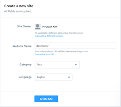
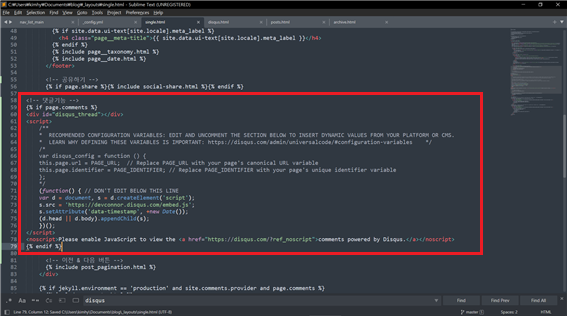

이 문서는 깃허브블로그 만드는 법을 minimal-mistakes 테마를 사용하여 설명합니다.
공통되는부분도 있고 다른부분도 있으니 유의해서 봐주세요.

# 기능추가

## 댓글기능

> Disqus is an American blog comment hosting service for web sites and online communities that use a networked platform.

우리는 disqus 라는 '웹사이트 혹은 온라인 커뮤니티를 위한 미국 블로그 댓글호스팅 서비스' 를 이용할 것입니다.

<https://disqus.com/profile/login/>

&#160;&#160;&#160;&#160;

1) Disqus 에 가입합니다.

2) Get started 를 클릭합니다.

3) 아래에 I want to install Disqus on my site 를 클릭합니다.

4) Website Name 에 본인의 Disqus URL 이 될 이름을 정해줍니다.

    

5) 아래로 내리면 무료플랜인 Basic plan 이 보입니다. Subscribe Now 를 클릭합니다.

    

6) 본인의 플랫폼을 선택합니다. 저는 Jekyll Platform 이군요.

  

7-1) _config.yml 파일의 가장 하단에 'comments: true' 를 입력합니다. (아래사진처럼)

7-2) 본인의 layout 이 single 인 것을 확인하고 (7-3에 영향을 줍니다.)

    

Universal Embed Code 를 눌러서 1번에 나오는 코드를 복사합니다. (6과 7-1 사이 사진)

7-3) if page.comments 와 endif 를 앞뒤로 추가해서 _layouts/single.html 에 이렇게 추가해주면 됩니다.

저는 '공유하기' 와 '이전 & 다음 버튼' 사이에 넣었습니다.

  

8) Website URL 에 본인의 웹사이트주소를 넣습니다. Comment Policy URL 은 비워두면 자동으로 완성되므로 저는 Category 만 선택하고 Next 를 눌렀습니다.

    

9) Balanced 는 이미지, 비디오, 링크, 게스트 댓글 등을 허용하고 Strict (엄격한 모드) 는 허용하지 않습니다.

> 게스트모드는 이름과 이메일만으로 댓글을 작성할 수 있습니다.

10) _config.yml 파일에서 'comments:' 부분을 찾아 'provider:' 에 "disque" 를 입력하고 'shortname:' 에 자신의 Disqus 사이트이름을 입력합니다. 만약 모르겠다면

Admin 으로 들어가서

Settings - General - Shortname 을 확인합니다.

  

완성! 도움이 되었다면 댓글을 달아주세요!!
