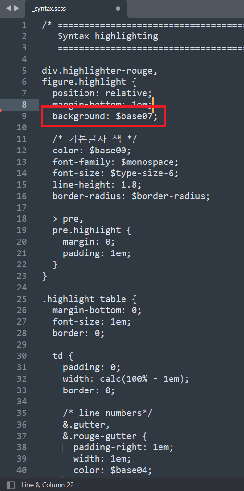

이 문서는 깃허브블로그 만드는 법을 minimal-mistakes 테마를 사용하여 설명합니다.
공통되는부분도 있고 다른부분도 있으니 유의해서 봐주세요.

# 블로그구축

## 블로그테마 정하기

Jekyll 테마제공 사이트

<[Free Jekyll Themes](https://jekyllthemes.io/free)>

후보테마

<[mmistakes/minimal-mistakes: Jekyll theme for building a personal site, blog, project documentation, or portfolio. (github.com)](https://github.com/mmistakes/minimal-mistakes)>

<[mmistakes/minimal-mistakes: Jekyll theme for building a personal site, blog, project documentation, or portfolio. (github.com)](https://github.com/mmistakes/minimal-mistakes)>

기준

1. 모바일에서 보기 편한 반응형인지
2. 디자인이 마음에 드는지
3. 검색, 태그, 댓글, Syntax Highlighting, 수식입력 등 기능 지원
4. 가격 등

## GitHub 페이지 만들기

> 선행학습 : GitHub 계정이 있나요? Git 이 깔려있나요? 

1. Fork : 테마제공자로부터 계속 업데이트받을 수 있고 Pull request 등도 할 수 있다.
2. Clone : 본인만의 Commit 을 쌓을 수 있다.

본인은 Clone 했으므로 이 방법대로 설명합니다.


1) 테마 GitHub 사이트에서 Code 를 눌러 오른쪽 버튼을 눌러 URL 을 복사합니다.


2) Git Bash 를 실행해 폴더 (저는 blog 폴더에 내려받겠습니다) 에 내려받습니다.

```bash
cd "폴더위치"
ls # 자신의폴더이름 확인
git clone "URL 붙여넣기" "폴더이름" # 붙여넣기는 Shift + Insert
```


3) blog 폴더에 정상적으로 내려받은 것을 확인할 수 있습니다.


4) ls -al 명령어로 .git 파일을 확인할 수 있는데요.


5) rm -rf .git 명령어로 삭제합니다. master 가 사라진 것으로 삭제가 제대로 된 것을 알 수 있습니다.


6) GitHub 로 들어가 새로운 Repository (레포지토리) 를 만드세요.


7) 자신의 이름이 username 이라면 Repository 이름을 username.github.io 로 만드세요.


8) 자신의 Repository 가 만들어진 것을 볼 수 있습니다. 클릭하세요.


9) Settings 을 누르고 좌측 탭에서 Pages 를 누른 후 Source 를 master 에 연결하면 페이지가 생성됩니다.


10) 성공! 초록색 창에 "Your site is published at https://~" 를 클릭해서 들어가보세요!!

도움이 되었다면 댓글을 달아주세요!!

# 블로그사용

## 글쓰기 : 포스팅하기

1. root directory 에 '_posts' 폴더를 만들고 

2. .md 확장자로 저장. 파일이름은 'YEAR_MONTH_DAY-title.md' 로 저장한다.

   ex) 2021-06-06-Start Minimal Mistakes theme

> title 은 영어로 작성할 것!! (혹은 본문에 한글 작성), title 에 " : " 넣지 않을 것!!
> categories 는 영어로 작성, 띄어쓰기하면 분리되므로 " - " 로 연결할 것!!

\-\-\-

title: 제목

categories: category

tags: tag

\-\-\-

## (옵션) 이미지 자동으로 추가하기

이미지를 포스팅하기 위해서는 직접 assets/images 폴더에 이미지파일을 저장하고 상대경로로 연결해야 한다. 

하지만 이 작업을 Typora 프로그램에서 해주기 때문에 이미지를 직접 저장하는 과정이 필요없다.

> Typora 란? Markdown editor 중의 하나입니다. 꼭 이 에디터를 사용할 필요는 없습니다.


1) 파일 - 환경설정


2) 이미지탭에서 When Insert - 특별한 동작없음 을 클릭하고 Copy image to custom folder 로 변경한 후 

- "로컬 이미지에 위 규칙을 적용"
- "온라인 이미지에 위 규칙을 적용"
- "가능하다면 상대적 위치 사용" 을 체크한다.

> 만약 Typora 에서는 보이는데 서버에서는 보이지 않는다면 Ctrl + / 를 눌러 assets 앞에 ".." 을 없애고 저장 후 다시 확인해본다.
> 혹은 | 와 같은 특수문자를 지우고 다시 확인해본다.


2. 컴퓨터에 있는 사진 드래그 & 드랍
3. 인터넷에서 복사 후 붙여넣기
3. Print Screen 버튼을 누른 후 붙여넣기

모두 정상 작동하는 것을 볼 수 있다.

> 단 삭제는 수동으로 해야한다. 붙여넣기 후 안쓰는 이미지라면 삭제할 것!!

도움이 되었다면 댓글을 달아주세요!!

**출처**

<[Images in Typora](https://support.typora.io/Images/#when-insert-images)>

## 페이지 연결하기 : 카테고리 및 태그 

root directory 에 "_pages" 폴더를 만들고

category-archive.md 와 tag-archive.md 파일을 만듭니다.

```html
title: "Posts by Category"
layout: categories
permalink: /categories/
author_profile: true
```

```html
title: "Posts by Tag"
permalink: /tags/
layout: tags
author_profile: true
```

# 기능추가

## 헤드에 메뉴버튼 만들기

```yaml
# main links
main:
  - title: 카테고리
    url: /categories/
  - title: 태그
    url: /tags/
  - title: 아카이브
    url: /year-archive/
  - title: "Sample Collections"
    url: /collection-archive/
  - title: "Quick-Start Guide"
    url: https://mmistakes.github.io/minimal-mistakes/docs/quick-start-guide/
  - title: "Sitemap"
    url: /sitemap/
  # - title: "About"
  #   url: https://mmistakes.github.io/minimal-mistakes/about/
```

_data/navigation.yml 파일에 title 과 url 을 추가한다.

이 url 은 root directory 에 _pages 폴더 내에 적절한 파일이 있어야 한다.

## 댓글기능 넣기

> Disqus is an American blog comment hosting service for web sites and online communities that use a networked platform.

우리는 disqus 라는 '웹사이트 혹은 온라인 커뮤니티를 위한 미국 블로그 댓글호스팅 서비스' 를 이용할 것입니다.

<https://disqus.com/profile/login/>

&#160;&#160;&#160;&#160;

1) Disqus 에 가입합니다.

2) Get started 를 클릭합니다.

3) 아래에 I want to install Disqus on my site 를 클릭합니다.

4) Website Name 에 본인의 Disqus URL 이 될 이름을 정해줍니다.

    

5) 아래로 내리면 무료플랜인 Basic plan 이 보입니다. Subscribe Now 를 클릭합니다.

    

6) 본인의 플랫폼을 선택합니다. 저는 Jekyll Platform 이군요.

  

7-1) _config.yml 파일의 가장 하단에 'comments: true' 를 입력합니다. (아래사진처럼)


7-2) 본인의 layout 이 single 인 것을 확인하고 (7-3에 영향을 줍니다.)

    

Universal Embed Code 를 눌러서 1번에 나오는 코드를 복사합니다. (6과 7-1 사이 사진)


7-3) if page.comments 와 endif 를 앞뒤로 추가해서 _layouts/single.html 에 이렇게 추가해주면 됩니다.

저는 '공유하기' 와 '이전 & 다음 버튼' 사이에 넣었습니다.


  

8) Website URL 에 본인의 웹사이트주소를 넣습니다. Comment Policy URL 은 비워두면 자동으로 완성되므로 저는 Category 만 선택하고 Next 를 눌렀습니다.

    

9) Balanced 는 이미지, 비디오, 링크, 게스트 댓글 등을 허용하고 Strict (엄격한 모드) 는 허용하지 않습니다.

> 게스트모드는 이름과 이메일만으로 댓글을 작성할 수 있습니다.


10) _config.yml 파일에서 'comments:' 부분을 찾아 'provider:' 에 "disque" 를 입력하고 'shortname:' 에 자신의 Disqus 사이트이름을 입력합니다. 만약 모르겠다면


Admin 으로 들어가서


Settings - General - Shortname 을 확인합니다.

  

완성! 도움이 되었다면 댓글을 달아주세요!!

## 목차기능 넣기

minimal-mistakes 테마기준으로 목차는 이미 구현되있습니다.


'_config.yml' 파일의 가장 하단부분에서 'defaults:' 를 찾은 후 

- 'toc: true' 를 입력해 목차를 활성화합니다.
- 'toc_label:' 부분에 목차위에 표시될 글을 입력합니다.
- 'toc_sticky: true' 를 입력해 목차를 화면이동과 같이 움직이게 합니다.


오른쪽에 목차가 성공적으로 표시됩니다. :)

## 코드블럭번호: line numbers 

라인넘버를 추가하는 방법

```yaml
kramdown:
  syntax_highlighter_opts:
    block:
      line_numbers: true
```

_config.yml 파일 가장 하단부분 (defaults: 아래) 에 다음의 코드를 추가합니다.

> `block:` 을 추가하지 않으면 코드블럭 뿐만 아니라 /` /` 로 감싼 코드에도 번호가 붙어 문제가 생깁니다.

# 꾸미기

## 코드문법강조: Syntax highlight

_sass/minimal-mistakes/\_syntax.scss 를 실행합니다.

색은 16진수로 16가지 색이 있습니다.

$base00 ~ $base0f

| No.   | Color         |
| ----- | ------------- |
| 00~03 | 흰색~연한회색 |
| 04    | 검정          |
| 05~07 | 진한회색~회색 |
| 08    | 분홍          |
| 09    | 주황          |
| 0a    | 노랑          |
| 0b    | 연두          |
| 0c    | 하늘          |
| 0d    | 파랑          |
| 0e    | 보라          |
| 0f    | 주황          |

**코드블럭 배경색** 



기본색 (bash: git 명령어 등) : 배경색 `background` 바로 아래줄에 있습니다.

라인넘버 (Line number) : `line numbers` 의 color (숫자) 와 border-right (구분선) 의 색을 바꿔줍니다.

주석 : `comment` 라고 검색하고 다섯 개를 바꿔줍니다. ex) comment.multiline, preproc, single, special 등

인스턴스 & 변수 이름 : `name` 을 검색해 찾아 바꿉니다.

괄호 : `operator` 를 검색해 찾아 바꿉니다.

터미널 명령어 (bash: cd, ls 등) : `name.builtin` 를 검색해 찾아 바꿉니다.

# 폴더구조

_data/navigation.yml : 상단버튼 추가/제거

_pages 폴더 : 페이지 저장위치 ex) 카테고리 페이지, 태그 페이지

_posts 폴더 : 글 저장위치

_sass/minimal-mistakes/\_reset.scss : 폰트수정

_sass/minimal-mistakes/\_variables.scss : 사이드바 너비조정

_sass/minimal-mistakes/\_base.scss : 링크 밑줄제거

_site 폴더 : 자동으로 내부에 파일이 생성됩니다.

assets/images 폴더 : 이미지 저장위치

docs 폴더 : 예시폴더

test 폴더 : 테스트폴더

_config.yml : 기본설정파일

feed.xml : 최근 글 검색에 쓰이는 피드파일

minimal-mistakes-jekyll.gemspec : 서버실행파일

README.md : GitHub 에 레포지토리 설명 글

robots.txt : 검색도우미

sitemap.xml : 검색에 필수적인 사이트맵
