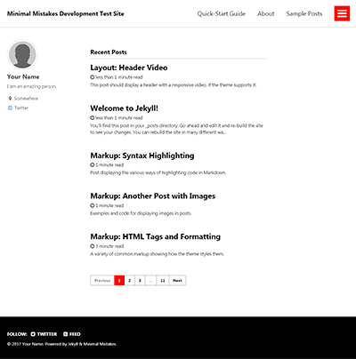
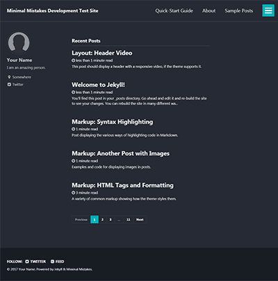
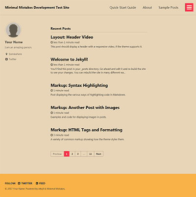
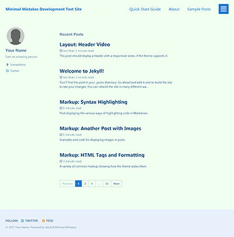

# [Minimal Mistakes Jekyll theme](https://mmistakes.github.io/minimal-mistakes/)

[](https://raw.githubusercontent.com/mmistakes/minimal-mistakes/master/LICENSE)
[](https://jekyllrb.com/)
[](https://rubygems.org/gems/minimal-mistakes-jekyll)
[](https://www.paypal.me/mmistakes)

Minimal Mistakes is a flexible two-column Jekyll theme, perfect for building personal sites, blogs, and portfolios. As the name implies, styling is purposely minimalistic to be enhanced and customized by you :smile:.

**If you enjoy this theme, please consider [supporting me](https://www.paypal.me/mmistakes){:target="blank"} to continue developing and maintaining it.**

[](https://www.paypal.me/mmistakes){:target="blank"}

**Note:** The theme uses the [jekyll-include-cache](https://github.com/benbalter/jekyll-include-cache){:target="blank"} plugin which will need to be installed in your `Gemfile` and added to the `plugins` array of `_config.yml`. Otherwise you'll encounter `Unknown tag 'include_cached'` errors at build.

[![Minimal Mistakes live preview][2]][1]

[1]: https://mmistakes.github.io/minimal-mistakes/
[2]: screenshot.png "live preview"


## Notable features

- Bundled as a "theme gem" for easier installation/upgrading.
- Compatible with GitHub Pages.
- Support for Jekyll's built-in Sass/SCSS preprocessor.
- Nine different skins (color variations).
- Several responsive layout options (single, archive index, search, splash, and paginated home page).
- Optimized for search engines with support for [Twitter Cards](https://dev.twitter.com/cards/overview){:target="blank"} and [Open Graph](http://ogp.me/){:target="blank"} data.
- Optional [header images](https://mmistakes.github.io/minimal-mistakes/docs/layouts/#headers){:target="blank"}, [custom sidebars](https://mmistakes.github.io/minimal-mistakes/docs/layouts/#sidebars){:target="blank"}, [table of contents](https://mmistakes.github.io/minimal-mistakes/docs/helpers/#table-of-contents){:target="blank"}, [galleries](https://mmistakes.github.io/minimal-mistakes/docs/helpers/#gallery){:target="blank"}, related posts, [breadcrumb links](https://mmistakes.github.io/minimal-mistakes/docs/configuration/#breadcrumb-navigation-beta){:target="blank"}, [navigation lists](https://mmistakes.github.io/minimal-mistakes/docs/helpers/#navigation-list){:target="blank"}, and more.
- Commenting support (powered by [Disqus](https://disqus.com/){:target="blank"}, [Facebook](https://developers.facebook.com/docs/plugins/comments){:target="blank"}, Google+, [Discourse](https://www.discourse.org/){:target="blank"}, static-based via [Staticman](https://staticman.net/){:target="blank"}, and [utterances](https://utteranc.es/){:target="blank"}).
- [Google Analytics](https://www.google.com/analytics/){:target="blank"} support.
- UI localized text in English (default), Arabic (عربي), Brazilian Portuguese (Português brasileiro), Catalan, Chinese, Danish, Dutch, Finnish, French (Français), German (Deutsch), Greek, Hebrew, Hindi (हिंदी), Hungarian, Indonesian, Irish (Gaeilge), Italian (Italiano), Japanese, Korean, Malayalam, Myanmar (Burmese), Nepali (Nepalese), Norwegian (Norsk), Persian (فارسی), Polish, Punjabi (ਪੰਜਾਬੀ), Romanian, Russian, Slovak, Spanish (Español), Swedish, Thai, Turkish (Türkçe), and Vietnamese.

## Skins (color variations)

This theme comes in nine different skins (in addition to the default one).

| `air`                                                        | `contrast`                                                   | `dark`                                                       |
| ------------------------------------------------------------ | ------------------------------------------------------------ | ------------------------------------------------------------ |
| [](https://mmistakes.github.io/minimal-mistakes/assets/images/air-skin-archive-large.png) | [](https://mmistakes.github.io/minimal-mistakes/assets/images/contrast-skin-archive-large.png) | [](https://mmistakes.github.io/minimal-mistakes/assets/images/dark-skin-archive-large.png) |

| `dirt`                                                       | `mint`                                                       | `sunrise`                                                    |
| ------------------------------------------------------------ | ------------------------------------------------------------ | ------------------------------------------------------------ |
| [](https://mmistakes.github.io/minimal-mistakes/assets/images/dirt-skin-archive-large.png) | [](https://mmistakes.github.io/minimal-mistakes/assets/images/mint-skin-archive-large.png) | [](https://mmistakes.github.io/minimal-mistakes/assets/images/sunrise-skin-archive-large.png) |

| `aqua`                                                       | `neon`                                                       | `plum`                                                       |
| ------------------------------------------------------------ | ------------------------------------------------------------ | ------------------------------------------------------------ |
| [](https://mmistakes.github.io/minimal-mistakes/assets/images/aqua-skin-archive-large.png) | [](https://mmistakes.github.io/minimal-mistakes/assets/images/neon-skin-archive-large.png) | [](https://mmistakes.github.io/minimal-mistakes/assets/images/plum-skin-archive-large.png) |

## Demo pages

| Name                                                         | Description                                                  |
| ------------------------------------------------------------ | ------------------------------------------------------------ |
| [Post with Header Image][header-image-post]{:target="blank"} | A post with a large header image.                            |
| [HTML Tags and Formatting Post][html-tags-post]{:target="blank"} | A variety of common markup showing how the theme styles them. |
| [Syntax Highlighting Post][syntax-post]{:target="blank"}     | Post displaying highlighted code.                            |
| [Post with a Gallery][gallery-post]{:target="blank"}         | A post showing several images wrapped in `<figure>` elements. |
| [Sample Collection Page][sample-collection]{:target="blank"} | Single page from a collection.                               |
| [Categories Archive][categories-archive]{:target="blank"}    | Posts grouped by category.                                   |
| [Tags Archive][tags-archive]{:target="blank"}                | Posts grouped by tag.                                        |

Additional sample posts are available under [posts archive][year-archive]{:target="blank"} on the demo site. Source files for these (and the entire demo site) can be found in [`/docs`].

[header-image-post]: https://mmistakes.github.io/minimal-mistakes/layout-header-image-text-readability/
[gallery-post]: https://mmistakes.github.io/minimal-mistakes/post%20formats/post-gallery/
[html-tags-post]: https://mmistakes.github.io/minimal-mistakes/markup/markup-html-tags-and-formatting/
[syntax-post]: https://mmistakes.github.io/minimal-mistakes/markup-syntax-highlighting/
[sample-collection]: https://mmistakes.github.io/minimal-mistakes/recipes/chocolate-chip-cookies/
[categories-archive]: https://mmistakes.github.io/minimal-mistakes/categories/
[tags-archive]: https://mmistakes.github.io/minimal-mistakes/tags/
[year-archive]: https://mmistakes.github.io/minimal-mistakes/year-archive/

## Installation

There are three ways to install: as a [gem-based theme](https://jekyllrb.com/docs/themes/#understanding-gem-based-themes){:target="blank"}, as a [remote theme](https://blog.github.com/2017-11-29-use-any-theme-with-github-pages/){:target="blank"} (GitHub Pages compatible), or forking/directly copying all of the theme files into your project.

### Gem-based method

With Gem-based themes, directories such as the `assets`, `_layouts`, `_includes`, and `_sass` are stored in the theme’s gem, hidden from your immediate view. Yet all of the necessary directories will be read and processed during Jekyll’s build process.

This allows for easier installation and updating as you don't have to manage any of the theme files. To install:

1. Add the following to your `Gemfile`:

   ```ruby
   gem "minimal-mistakes-jekyll"
   ```

2. Fetch and update bundled gems by running the following [Bundler](http://bundler.io/){:target="blank"} command:

   ```bash
   bundle
   ```

3. Set the `theme` in your project's Jekyll `_config.yml` file:

   ```yaml
   theme: minimal-mistakes-jekyll
   ```

To update the theme run `bundle update`.

### Remote theme method

Remote themes are similar to Gem-based themes, but do not require `Gemfile` changes or whitelisting making them ideal for sites hosted with GitHub Pages.

To install:

1. Create/replace the contents of your `Gemfile` with the following:

   ```ruby
   source "https://rubygems.org"
   
   gem "github-pages", group: :jekyll_plugins
   gem "jekyll-include-cache", group: :jekyll_plugins
   ```

2. Add `jekyll-include-cache` to the `plugins` array of your `_config.yml`.

3. Fetch and update bundled gems by running the following [Bundler](http://bundler.io/){:target="blank"} command:

   ```bash
   bundle
   ```

4. Add `remote_theme: "mmistakes/minimal-mistakes@4.23.0"` to your `_config.yml` file. Remove any other `theme:` or `remote_theme:` entry.

**Looking for an example?** Use the [Minimal Mistakes remote theme starter](https://github.com/mmistakes/mm-github-pages-starter/generate){:target="blank"} for the quickest method of getting a GitHub Pages hosted site up and running. Generate a new repository from the starter, replace sample content with your own, and configure as needed.

## Usage

For detailed instructions on how to configure, customize, add/migrate content, and more read the [theme's documentation](https://mmistakes.github.io/minimal-mistakes/docs/quick-start-guide/){:target="blank"}.

---

## Contributing

Found a typo in the documentation or interested in [fixing a bug](https://github.com/mmistakes/minimal-mistakes/issues){:target="blank"}? Then by all means [submit an issue](https://github.com/mmistakes/minimal-mistakes/issues/new){:target="blank"} or [pull request](https://help.github.com/articles/using-pull-requests/){:target="blank"}. If this is your first pull request, it may be helpful to read up on the [GitHub Flow](https://guides.github.com/introduction/flow/){:target="blank"} first.

For help with using the theme or general Jekyll support questions, please use the [Jekyll Talk forums](https://talk.jekyllrb.com/){:target="blank"}.

### Pull Requests

When submitting a pull request:

1. Clone the repo.
2. Create a branch off of `master` and give it a meaningful name (e.g. `my-awesome-new-feature`).
3. Open a pull request on GitHub and describe the feature or fix.

Theme documentation and demo pages can be found in the [`/docs`](docs) if submitting improvements, typo corrections, etc.

## Development

To set up your environment to develop this theme, run `bundle install`.

To test the theme, run `bundle exec rake preview` and open your browser at `http://localhost:4000/test/`. This starts a Jekyll server using content in the `test/` directory. As modifications are made to the theme and test site, it will regenerate and you should see the changes in the browser after a refresh.

---

## Credits

### Creator

**Michael Rose**

- <https://mademistakes.com>{:target="blank"}
- <https://twitter.com/mmistakes>{:target="blank"}
- <https://github.com/mmistakes>{:target="blank"}

### Icons + Demo Images:

- [The Noun Project](https://thenounproject.com){:target="blank"} -- Garrett Knoll, Arthur Shlain, and [tracy tam](https://thenounproject.com/tracytam){:target="blank"}
- [Font Awesome](http://fontawesome.io/){:target="blank"}
- [Unsplash](https://unsplash.com/){:target="blank"}

### Other:

- [Jekyll](http://jekyllrb.com/){:target="blank"}
- [jQuery](http://jquery.com/){:target="blank"}
- [Susy](http://susy.oddbird.net/){:target="blank"}
- [Breakpoint](http://breakpoint-sass.com/){:target="blank"}
- [Magnific Popup](http://dimsemenov.com/plugins/magnific-popup/){:target="blank"}
- [FitVids.JS](http://fitvidsjs.com/){:target="blank"}
- [GreedyNav.js](https://github.com/lukejacksonn/GreedyNav){:target="blank"}
- [Smooth Scroll](https://github.com/cferdinandi/smooth-scroll){:target="blank"}
- [Gumshoe](https://github.com/cferdinandi/gumshoe){:target="blank"}
- [jQuery throttle / debounce](http://benalman.com/projects/jquery-throttle-debounce-plugin/){:target="blank"}
- [Lunr](http://lunrjs.com){:target="blank"}

---

## License

The MIT License (MIT)

Copyright (c) 2013-2020 Michael Rose and contributors

Permission is hereby granted, free of charge, to any person obtaining a copy
of this software and associated documentation files (the "Software"), to deal
in the Software without restriction, including without limitation the rights
to use, copy, modify, merge, publish, distribute, sublicense, and/or sell
copies of the Software, and to permit persons to whom the Software is
furnished to do so, subject to the following conditions:

The above copyright notice and this permission notice shall be included in all
copies or substantial portions of the Software.

THE SOFTWARE IS PROVIDED "AS IS", WITHOUT WARRANTY OF ANY KIND, EXPRESS OR
IMPLIED, INCLUDING BUT NOT LIMITED TO THE WARRANTIES OF MERCHANTABILITY,
FITNESS FOR A PARTICULAR PURPOSE AND NONINFRINGEMENT. IN NO EVENT SHALL THE
AUTHORS OR COPYRIGHT HOLDERS BE LIABLE FOR ANY CLAIM, DAMAGES OR OTHER
LIABILITY, WHETHER IN AN ACTION OF CONTRACT, TORT OR OTHERWISE, ARISING FROM,
OUT OF OR IN CONNECTION WITH THE SOFTWARE OR THE USE OR OTHER DEALINGS IN THE
SOFTWARE.

Minimal Mistakes incorporates icons from [The Noun Project](https://thenounproject.com/) 
creators Garrett Knoll, Arthur Shlain, and tracy tam.
Icons are distributed under Creative Commons Attribution 3.0 United States (CC BY 3.0 US).

Minimal Mistakes incorporates [Font Awesome](http://fontawesome.io/),
Copyright (c) 2017 Dave Gandy.
Font Awesome is distributed under the terms of the [SIL OFL 1.1](http://scripts.sil.org/OFL) 
and [MIT License](http://opensource.org/licenses/MIT).

Minimal Mistakes incorporates photographs from [Unsplash](https://unsplash.com).

Minimal Mistakes incorporates [Susy](http://susy.oddbird.net/),
Copyright (c) 2017, Miriam Eric Suzanne.
Susy is distributed under the terms of the [BSD 3-clause "New" or "Revised" License](https://opensource.org/licenses/BSD-3-Clause).

Minimal Mistakes incorporates [Breakpoint](http://breakpoint-sass.com/).
Breakpoint is distributed under the terms of the [MIT/GPL Licenses](http://opensource.org/licenses/MIT).

Minimal Mistakes incorporates [FitVids.js](https://github.com/davatron5000/FitVids.js/),
Copyright (c) 2013 Dave Rubert and Chris Coyier.
FitVids is distributed under the terms of the [WTFPL License](http://www.wtfpl.net/).

Minimal Mistakes incorporates [Magnific Popup](http://dimsemenov.com/plugins/magnific-popup/),
Copyright (c) 2014-2016 Dmitry Semenov, http://dimsemenov.com.
Magnific Popup is distributed under the terms of the MIT License.

Minimal Mistakes incorporates [Smooth Scroll](http://github.com/cferdinandi/smooth-scroll),
Copyright (c) 2019 Chris Ferdinandi.
Smooth Scroll is distributed under the terms of the [MIT License](http://opensource.org/licenses/MIT).

Minimal Mistakes incorporates [Gumshoejs](http://github.com/cferdinandi/gumshoe),
Copyright (c) 2019 Chris Ferdinandi.
Smooth Scroll is distributed under the terms of the [MIT License](http://opensource.org/licenses/MIT).

Minimal Mistakes incorporates [jQuery throttle / debounce](http://benalman.com/projects/jquery-throttle-debounce-plugin/),
Copyright (c) 2010 "Cowboy" Ben Alman.
jQuery throttle / debounce is distributed under the terms of the [MIT License](http://opensource.org/licenses/MIT).

Minimal Mistakes incorporates [GreedyNav.js](https://github.com/lukejacksonn/GreedyNav),
Copyright (c) 2015 Luke Jackson.
GreedyNav.js is distributed under the terms of the [MIT License](http://opensource.org/licenses/MIT).

Minimal Mistakes incorporates [Jekyll Group-By-Array](https://github.com/mushishi78/jekyll-group-by-array),
Copyright (c) 2015 Max White <mushishi78@gmail.com>.
Jekyll Group-By-Array is distributed under the terms of the [MIT License](http://opensource.org/licenses/MIT).

Minimal Mistakes incorporates [@allejo's Pure Liquid Jekyll Table of Contents](https://allejo.io/blog/a-jekyll-toc-in-liquid-only/),
Copyright (c) 2017 Vladimir Jimenez.
Pure Liquid Jekyll Table of Contents is distributed under the terms of the [MIT License](http://opensource.org/licenses/MIT).

Minimal Mistakes incorporates [Lunr](http://lunrjs.com),
Copyright (c) 2018 Oliver Nightingale.
Lunr is distributed under the terms of the [MIT License](http://opensource.org/licenses/MIT).