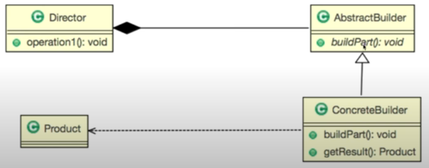

## 생성패턴

1. 싱글턴 패턴: 하나의 객체생성 패턴
2. 프로토타입 패턴: 객체복사 패턴
3. 팩토리메서드 패턴
4. 빌더 패턴: 변수대입 패턴
5. 추상팩토리 패턴: 객체생성 패턴

## 1. Strategy Pattern


인터페이스

델리게이트 : 떠넘기는 것

Strategy Pattern : 여러 알고리즘을 하나의 추상적인 접근점 (인터페이스) 를 만들어 접근 점에서 서로 교환 가능하도록 하는 패턴.

- interface 사용 예제

```java
public class Main {
	public static void main(String[] args) {		
		Ainterface ainterface = new AinterfaceImpl();
		// 가능
		AinterfaceImpl ainterface = new AinterfaceImpl();
		// 불가능
		AinterfaceImpl ainterface = new Ainterface();
		Ainterface ainterface = new Ainterface();
	}
}
```

- Main

```java
public class Main {
	public static void main(String[] args) {
		GameCharacter bobi = new GameCharacter();
		
		bobi.setWeapon(new Knife());
		bobi.attact();	
	}
}
```

- Character

```java
public class GameCharacter {
	private Weapon weapon;

	public void attact() {
		if (weapon == null) {
			System.out.println("맨손 공격");
		} else {
			weapon.doAttact();
		}
	}
	public void setWeapon(Weapon weapon) {
		this.weapon = weapon;
	}
}
```

- Weapon interface

```java
public interface Weapon {
	public void doAttact();	
}
```

- Weapon 의 클래스 : Sword

```java
public class Sword implements Weapon {
	public void doAttact() {
		System.out.println("검 공격");
	}
}
```

- Weapon 의 클래스 : Knife

```java
public class Knife implements Weapon {
	public void doAttact() {
		System.out.println("칼 공격");
	}
}
```

- 로봇예시

```java
public class Client {
public static void main(String[] args) {
  Robot taekwonV = new TaekwonV("TaekwonV");
  Robot atom = new Atom("Atom");

  /* 수정된 부분: 전략 변경 방법 */
  taekwonV.setMovingStrategy(new WalkingStrategy());
  taekwonV.setAttackStrategy(new MissileStrategy());
  atom.setMovingStrategy(new FlyingStrategy());
  atom.setAttackStrategy(new PunchStrategy());

  /* 아래부터는 동일 */
  System.out.println("My name is " + taekwonV.getName());
  taekwonV.move();
  taekwonV.attack();

  System.out.println()
  System.out.println("My name is " + atom.getName());
  atom.move();
  atom.attack();
}
}
```


## 2. Adapter Pattern


어댑터 패턴

기계, 기구 등을 사전적 의미 : 다목적으로 사용하기 위한 부가 기구

`doubleValue` double 로 변환

f 로 끝나면 float 형이다. ex) 100f

main 메서드를 변경하지 않고 AdapterImpl class 에서 Math.doubled 를 바꿈으로써 간단히 변경

### 로그작성

Math 클래스에 넣으면 보기 싫은사람도 봐야한다.

AdapterImpl 에 작성하 것

---

3개의 구성

1. static Math
2. Adaper interface
3. AdapterImpliment

interface 에 Array 를 List 변환 후 sort 후 Array 재 변환의 기능을 넣어도 된다.

### 예시

```java
public class Application {
	
	public static void main(String[] args) {

		//요구사항을 수행하는 인스턴스
		Adapter target = new AdapterImpl();
		
		System.out.println(target.twiceOf(100.0f));
		System.out.println(target.halfOf(100.3f));	
	}	
}
```

```java
public interface Adapter {
	public Double twiceOf(Float num);
	public Double halfOf(Float num);	
}
```

```java
public class AdapterImpl implements Adapter {

	@Override
	public Double twiceOf(Float num) {
		return Math.doubled(num.doubleValue());
	}

	@Override
	public Double halfOf(Float num) {
		return Math.half(num);
	}
}
```

## 3. Template Method Pattern


템플릿 메서드 패턴

사전적 의미 : 모양자

언제 사용하는가?

1. 알고리즘이 일정한 프로세스가 있다. (여러 단계로 나눌 수 있다.)
2. 알고리즘이 변경가능성이 클 때

3. 알고리즘을 여러단계로 나눈다.
4. 단계를 메소드로 선언한다.
5. 템플릿 메소드를 만든다.
6. 하위클래스에서 나눠진 메소드를 구현한다.

추상클래스에 메서드 1, 2, 3 선언

유저 접속 시 

1. 보안
2. 인증
3. 권한
4. 접속

abstract 클래스에는 abstract 변수 선언

abstract 를 protected 와 같이 쓴다 : 자식에서 선언해야 되기 때문

`throw new Error("셧다운")` 에러문자 남기기

> 추상클래스에 추상메서드들 (자식에서 구현) 과 하나의 public 클래스

### 추상클래스

```java
public abstract class AbstConnectHelper {
	abstract protected String doSecurity(String info);
	abstract protected String authentication(String id, String password);
	abstract protected int authorization(String userName);
	abstract protected String connection(String info);
	public String requestConnection(String info) {
		String id, password, userName, decodedInfo, userInfo;

		// 암호화된 정보를 복호화 합니다.
		// doSecurity 는 getInfo 즉 getter 함수
		decodedInfo = doSecurity(info);

		// decodedInfo에서 id 와 password를 추출
		id = "abc";
		password = "abc";

		userInfo = authentication(id, password);

		// userInfo에서 userName을 찾아 냅니다.
		userName = "abc";

		int result = authorization(userName);

		switch (result) {

		case 0:// 무료회원
			break;
		case 1:// 유료회원
			break;
		case 2:// 게임 마스터
			break;
		case 3:// 접속 권한 없음
			break;
		default:
			break;
		}

		return connection(userInfo);
	}
}
```

### 자식클래스

```java
public class ConcreteConnectHelper extends AbstConnectHelper {

	@Override
	protected String doSecurity(String info) {
		return info;
	}

	@Override
	protected String authentication(String id, String password) {
		if(id.equals("abc")|password.equals("abc"))
			return "true info";
		else
			return "false info";
	}

	@Override
	protected int authorization(String userName) {
		return 0;
	}

	@Override
	protected String connection(String info) {
		return info;
	}
}
```


## 4. Factory Method Pattern


팩토리 메서드 : 템플릿 메소드 패턴이 사용된다.

**Application** 

```java
import com.parkgaram.dp.templatecreator.fw.Creator;
import com.parkgaram.dp.templatecreator.fw.Item;

public class Application { 
	public static void main(String[] args) {
		Creator creator = new DefaultItemCreator();

		Item item1 = creator.create("나무칼");
		Item item2 = creator.create("나무방패");
		Item item3 = creator.create("나무갑주");
		item1.use();
		item2.use();
		item3.use();
	}
}
```

**Item class**

```java
package com.parkgaram.dp.templatecreator.fw;

public abstract class Item {
	public abstract void use();
}
```

**DefaultItem 자식 클래스**

```java
package com.parkgaram.dp.templatecreator;

import com.parkgaram.dp.templatecreator.fw.Item;

public class DefaultItem extends Item {
	private String itemName;
	
	public DefaultItem(String itemName) {
		this.itemName = itemName;
	}
	
	@Override
	public void use() {
		System.out.println(itemName +" 사용했습니다!");
	}
}
```

**Creator class**

```java
package com.parkgaram.dp.templatecreator.fw;

public abstract class Creator {
    // 여러 메소드들을 추상화하여 자식에서 선언하고
	abstract protected String init(String itemName);
	abstract protected Item createItem(String itemName);
	abstract protected String end(String itemName);
    
    // 하나의 메서드에서 추상화한 메서드를 구현하면 템플릿메서드의 완성!!
	public Item create(String itemName) {
		init(itemName);
		Item item = createItem(itemName);
		end(itemName);
		return item;
	}
}
```

**Creator 자식 클래스**

```java
package com.parkgaram.dp.templatecreator;

import com.parkgaram.dp.templatecreator.fw.Creator;
import com.parkgaram.dp.templatecreator.fw.Item;

public class DefaultItemCreator extends Creator {
	@Override
	protected String end(String itemName) {
		System.out.println("Default 마무리 작업!");
		return itemName;
	}

	@Override
	protected String init(String itemName) {
		System.out.println("Default 초기 작업!");
		return itemName;
	}

	@Override
	protected Item createItem(String itemName) {
		return new DefaultItem(itemName);
	}
}
```

## 5. Singleton Pattern


싱글톤 패턴 : 하나의 인스턴스만 생성해야 할 객체를 위한 패턴

**작성방법**

1. `private static 클래스 instance` 
2. `private 생성자` 메인클래스에서 생성할 수 없게 함
3. `public static 클래스 getInstance` 메서드의 반환으로 인스턴스 호출

**Application**

```java
public class Application {
	public static void main(String[] args) {
		SystemSpeaker LG = SystemSpeaker.getInstance();
		SystemSpeaker SAMSUNG = SystemSpeaker.getInstance();

		System.out.println(LG.getVolume());
		System.out.println(SAMSUNG.getVolume());
		LG.setVolume(10);
		System.out.println(LG.getVolume());
		System.out.println(SAMSUNG.getVolume());
		SAMSUNG.setVolume(20);
		System.out.println(LG.getVolume());
		System.out.println(SAMSUNG.getVolume());
	}
}
```

**SystemSpeaker**

```java
public class SystemSpeaker {

	private static SystemSpeaker instance;
	private int volume;

	private SystemSpeaker() {
		setVolume(5);
	}

	public static SystemSpeaker getInstance() {
		if (instance == null) {
			instance = new SystemSpeaker();
		} else {
		}
		return instance;
	}

	public int getVolume() {
		return volume;
	}

	public void setVolume(int volume) {
		this.volume = volume;
	}
}
```

## 6. Prototype pattern

date: 06.22


생산비용이 높은 인스턴스를 복사를 통해서 쉽게 생성 할 수 있도록 하는 패턴

생산비용이 높은경우

- 종류가 너무 많아서 클래스로 정리되지 않는 경우
- 클래스로부터 인스턴스 생성이 어려운 경우

**작성방법**

1. `implements Cloneable` 이미 정의된 Object 의 인터페이스를 사용
2. `(캐스팅) clone()` 깊은복사를 유의하며 복사메서드를 이용해 재 정의하여 사용

`Object clone()` 

**얕은복사와 깊은복사**

얕은복사 : 참조형변수에서 같은 주소를 가리키는 것 : 등호 (=) 를 참조형변수에 사용

깊은복사 : 참조형변수에서 주소가 아닌 값만 복사하는 것

### 예시

**Main**

```java
public class Application {
	public static void main(String[] args) throws CloneNotSupportedException {

		Circle circle1 = new Circle();

		circle1.setId("1");

		circle1.setX(1);
		circle1.setY(1);
		circle1.setR(3);

		circle1.a.x = 1;

		Circle circle2 = (Circle) circle1.copy();

		System.out.println(circle1.a.x);
		System.out.println(circle2.a.x);

		circle1.a.x = 2;

		System.out.println(circle1.a.x);
		System.out.println(circle2.a.x);

		circle2.a.x = 3;

		System.out.println(circle1.a.x);
		System.out.println(circle2.a.x);
	}
}
```

**Shape**

```java
public abstract class Shape implements Cloneable {
	private String id;

	public String getId() {
		return id;
	}

	public void setId(String id) {
		this.id = id;
	}
}
```

**Prototype class**

```java
public class Circle extends Shape {
	int x, y;
	int r;
	public Double d;
	public A a;
	
	public Circle() {
		a = new A();
	}
	
	public void setA(A a) {
		this.a = a;
	}
	
	public A getA() {
		return a;
	}
	public int getX() {
		return x;
	}

	public void setX(int x) {
		this.x = x;
	}

	public int getY() {
		return y;
	}

	public void setY(int y) {
		this.y = y;
	}

	public int getR() {
		return r;
	}

	public void setR(int r) {
		this.r = r;
	}

	public Shape copy() throws CloneNotSupportedException {
		
		Circle shape = (Circle) clone();
		
		shape.x += 1;
		shape.y += 1;
		shape.setA((A)shape.getA().clone());
		
		return shape;
	}
}
```

## 7. Builder pattern



빌더패턴은 두 가지로 나뉘는 것 같다.

- GOF 의 : 복잡한 단계를 거쳐야 생성되는 객체의 구현을 서브클래스에게 넘겨주는 패턴
- Effective Java 의 : 많은 인자를 가진 객체의 생성을 다른 객체의 도움으로 생성하는 패턴

### GOF  Builder

객체의 생성과 표현을 분리하여 다양한 조합을 가질 수 있게 도와준다.

GOF빌더패턴에는 크게 Builder, Concrete Builder, Director, Product 가 있다.

Builder : 추상 클래스

Concrete Builder : Builder 를 상속받아 기능을 정의하는 실질적인 객체

Director : Builder 의 함수를 사용하여 Product 를 만드는 클래스

Product

### Effective Java


점층적 생성자패턴과 자바빈즈 패턴의 장점을 섞은 것이 Effective Java 의 빌더패턴입니다.

- 점층적생성자 패턴 예시

```java
Computer gram = new Computer("LG", "i7", "8GB", "256GB", "SSD");
```

단점

1. 인자들이 많아 질 수록 생성자의 숫자 역시 많아진다 : 필수입력과 선택입력이 있기때문에
2. 같은 자료형은 실수로 바꿔 넣는 실수가 생길 수 있다.
3. 가독성이 떨어진다 : 매개변수이름이나 주석을 참고해야 한다.

- 자바빈즈 패턴 예시

```java
PersonInfo personInfo = new PersonInfo( );
personInfo.setName("Mommoo");    
personInfo.setAge(12);       
personInfo.setPhonNumber(119);
```

단점

1. 코드량이 늘어난다.
2. 객체 일관성이 깨진다.

### Builder pattern 예시

```java
Computer gram = ComputerBuilder
	.startWithBrand("LG")
	.setCpu("i7")
	.setRam("8GB")
	.setCapacity("256GB")  // 이것을 체인이라고 합니다.
	.setDiskDrive("SSD")
	.build();
```

두 패턴의 단점을 개선했다.

## 8. Abstract Factory Pattern

date: 07.01


생성부분의 가상화/관련있는 객체

인스턴스를 생성하는 메서드를 하나만 사용

```java
System.out.println(System.getProperty("os.name"));  // Windows 10
// System.getProperty("os.name") 운영체제 반환함수
```

**사용방법**

1) 팩토리 인터페이스 생성

```java
public interface GuiFac {
	public Button createButton();
	public TextArea createTextArea();	
}
```

2) 인터페이스를 구현하는 객체생성 메서드 구현

```java
class MacGutFac implements GuiFac {
	@Override
	public Button createButton() {
		return new MacButton();
	}

	@Override
	public TextArea createTextArea() {
		return new MacTextArea();
	}
}
```

3) 객체 인터페이스와 구현된 클래스 생성

```java
class MacButton implements Button {
	@Override
	public void click() {
		System.out.println("맥 버튼 ");
	}
}

class MacTextArea implements TextArea {
	@Override
	public String getText() {
		return "맥 텍스트 에어리어";
	}
}
```

4) 똑같은 메서드로 객체를 생성함을 볼 수 있다.

```java
public class Main {
	public static void main(String[] args) {	
		BikeFactory factory = new GtBikeFactory();
		Body body = factory.createBody();
		Wheel wheel = factory.creatWheel();
		
		System.out.println(body.getClass());
		System.out.println(wheel.getClass());
	}
}
```

Q. 팩토리메서드 패턴과 추상팩토리 패턴의 차이점은?

A. 
