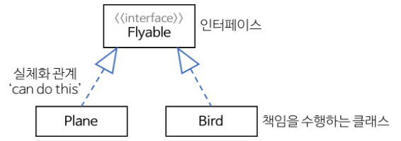

# 다이어그램 이론

## 클래스와 접근제어자

UML 클래스

윗부분: 클래스이름

추상클래스와 인터페이스: _이탤릭체_  혹은 <<스테레오 타입>> 기호 안에 넣는다.
ex) <\<abstract>> <\<interface>>

중간부분: 변수

아랫부분: 메서드

| 접근제어자 | 표시 |
| ---------- | ---- |
| public     | +    |
| private    | -    |
| protected  | #    |
| package    | ~    |

## 클래스의 연결

| 관계                             | 표시                               | 설명                                             |
| -------------------------------- | ---------------------------------- | ------------------------------------------------ |
| 연관관계 (association)      | 실선 혹은 화살표                   |                                                  |
| 일반화관계 (generalization) | 속이 빈 화살표 (부모방향으로) | 상속                                             |
| 집합-집약관계 (aggregation) | 속이 빈 다이아몬드                 | **독립적인** 전체 또는 부분같은 관계             |
| 집합-합성관계 (composition) | 속이 찬 다이아몬드                 | **의존적인** 전체 또는 부분같은 관계             |
| 의존관계 (dependency)       | 점선 화살표                        | 메서드를 실행하는 동안과 같은 매우 짧은시간 유지 |
| 실체화관계 (realization)    | 빈 삼각형과 점선                   | 인터페이스와 클래스 사이의 관계                  |

## 예시

**상속**

**인터페이스**

---

**출처**

<https://gmlwjd9405.github.io/2018/07/04/class-diagram.html>{:target="_blank"}

# draw.io 사용법

| 단축키            | 기능                   |
| ----------------- | ---------------------- |
| spacebar + 드래그 | 화면이동               |
| shift + 도형클릭  | 도형바꾸기             |
| ctrl + 휠         | 화면크기조정           |
| ctrl + shift + D  | 기본스타일설정: 화살표 |

**주의사항**

getter, setter, constructor 생략가능

**팁**

View - Scratchpad

