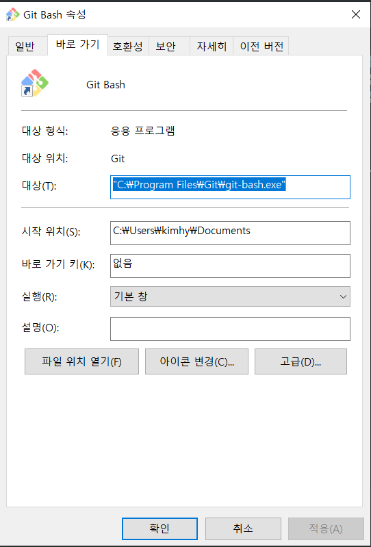

---

title: git 설정
categories: configure
---

**루트디렉토리 변경**

git 실행시 초기경로를 설정해줍니다.



속성 - 대상에서 --cd-to-home 를 지우고 시작위치를 원하는 경로로 변경합니다.

## git config

**1. 유저이름 설정**

```bash
git config --global user.name '이름'
```

ex)

```bash
git config --global user.name 'Connor'
```


**2. 유저이메일 설정**

```bash
git config --global user.email '아이디@이메일'
```

ex)

```bash
git config --global user.email 'dev.connor.kim@gmail.com'
```


**3. 명령어 단축키 저장**

```bash
git config --global alias.단축키 '원하는 명령어'
```

ex)

```bash
git config --global alias.history 'log --oneline'
```

