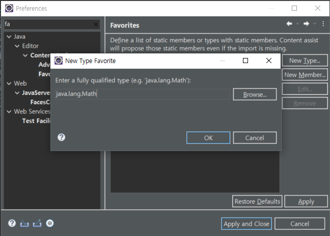
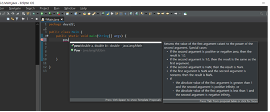
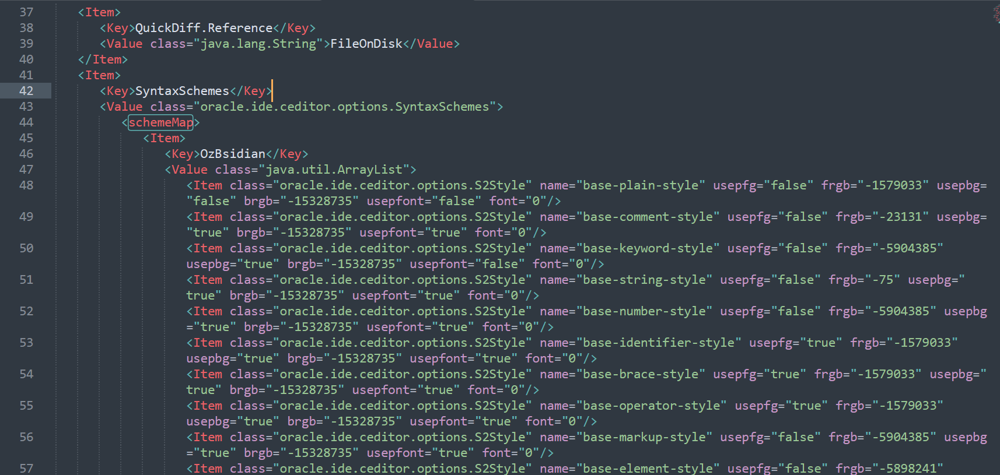

# Eclipse

## import static 자동추가



window - preferences - favorites 검색 (java - editor - content assist - favorites) - 

오른쪽 탭의 New Type 을 클릭하고 import static 를 사용하고 싶은 패키지명을 입력하고 Apply and Close 를 누른다.



패키지에 있는 메서드 (저는 `Math.pow`) 를 클래스명 없이 호출해보면


다음과 같이 import static 이 자동을 호출된 것을 볼 수 있다.

자주쓰고 클래스명이 긴 것들을 등록해두자.

## import 자동정리

window - preferences - Save Actions 검색 (Java - Editor - Save Actions) - 

Perform the selected actions on save 체크 (저장 시 선택된 행동 수행) -

Organize imports 체크 (import 들 정리) 후 Apply and Close 클릭

> 저장 시 자동으로 사용하지 않는 import 구문이 사라지는 것을 볼 수 있다.

## 하이라이트

**Matching brackets highlight 색 변경**

Window - Preference 창 - Java 탭 - Editor

Matching brackets highlight 를 변경한다.

## 한글깨짐 UTF 설정

window - preference 창 - general 탭 - workspace 에서

Text file encoding 을 other 로 하고 UTF-8 로 설정한다.

# SQL Developer

## 다크모드

**IDE 테마 변경**

SQL Developer 를 종료한다.

src 폴더의 파일들을 받아서 fusionblue.jar 로 압축한다.

```
C:\Users\Connor\Documents\DIRECTORY\프로그램\sqldeveloper-21.2.1.204.1703-x64\sqldeveloper\ide\themes
```

에 있는 fusionblue.jar 를 백업한 후 다운로드 받은 압축파일을 넣고 다시 SQL Developer 를 실행한다.


**편집기 테마 변경**

```
C:\Users\Connor\AppData\Roaming\SQL Developer\system21.2.1.204.1703\o.ide.12.2.1.5.42.210420.1713
```

>  AppData 는 숨겨진폴더이다.



44번째 줄 `<schemeMap>` 아래에 ozbsidian_scheme.xml 파일의 코드를 복사해서 붙여넣는다.

도구 - 환경설정 - 코드 편집기 - PL/SQL 구문 색상에서 구성표를 눌러보면

 ozBsidian 이라는 새 테마가 추가된 것을 확인할 수 있다.


---

**참조**

IDE테마 사용법: https://medium.com/@rammelhofdotat/oracle-sql-developer-theme-7c870ce19fb5

IDE테마 GitHub: https://github.com/rhinterndorfer/OracleSqlDeveloper_Theme

편집기 테마 GitHub: https://github.com/ozmoroz/ozbsidian-sqldeveloper

---

# Atom

## welcome 창 없애기

file - settings - packages 탭 - welcome 검색 - disable

