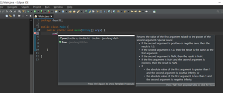
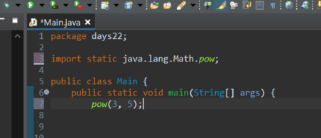

## import static 자동추가

window - preferences - favorites 검색 (java - editor - content assist - favorites) - 

오른쪽 탭의 New Type 을 클릭하고 import static 를 사용하고 싶은 패키지명을 입력하고 Apply and Close 를 누른다.

패키지에 있는 메서드 (저는 `Math.pow`) 를 클래스명 없이 호출해보면

다음과 같이 import static 이 자동을 호출된 것을 볼 수 있다.

자주쓰고 클래스명이 긴 것들을 등록해두자.

## import 자동정리

window - preferences - Save Actions 검색 (Java - Editor - Save Actions) - 

Perform the selected actions on save 체크 (저장 시 선택된 행동 수행) -

Organize imports 체크 (import 들 정리) 후 Apply and Close 클릭

> 저장 시 자동으로 사용하지 않는 import 구문이 사라지는 것을 볼 수 있다.

## 하이라이트

**Matching brackets highlight 색 변경**

Window - Preference 창 - Java 탭 - Editor

Matching brackets highlight 를 변경한다.

## 한글깨짐 UTF 설정

window - preference 창 - general 탭 - workspace 에서

Text file encoding 을 other 로 하고 UTF-8 로 설정한다.

