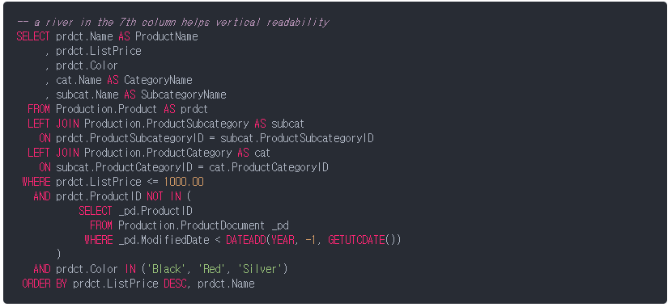
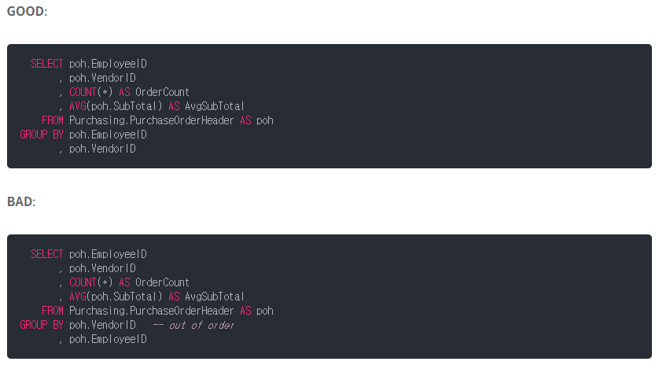

## SQL

SQL style guide by Simon Holywell

가장 오래되었고 star 와 fork 가 많다.

컬럼이름을 모두 소문자로 사용한다.


Modern SQL Style Guide (github.com)

컬럼이름을 모두 파스칼케이스로 표시한다.

키워드를 모두 소문자로 사용한다.


https://kaki104.tistory.com/722

**Column**

테이블은 항상 기본키가 있어야 한다.

가능한 열이름에 예약어를 사용하지 않는다.

테이블과 동일한 이름으로 열을 추가하지 않고 그 반대도 하지 않는다.

Description 의 약어로 Desc 를 사용하지 않는다. 전체단어를 쓰거나 키워드가 아닌 다른 단어를 사용한다.


**Alias**

일반적으로 별칭은 개체이름에 있는 각 단어의 첫 글자가 좋은 약어이다.

항상 AS 키워드를 포함하여 쉽게 읽을 수 있게한다.

계산된 데이터 (sum, avg) 일 경우 스키마에서 정의된 열이면 이름을 지정한다.


**Whitespace**

river 로 들여쓰기한다.

SQL 편집기가 지원하는 경우 합리적인 공백규칙을 적용하려면 .editorconfig 파일을 사용한다.

```
# .editorConfig is awesome: https://EditorConfig.org 

# SQL files 
[*.{sql,tsql,ddl}] 
charset = utf-8 
indent_style = space 
indent_size = 4 
end_of_line = crlf 
trim_trailing_whitespace = true 
insert_final_newline = true
```


**River formatting**




**Indent formatting**

River 를 사용하는 것이 힘들어 팀원들이 이 정렬을 선호하지 않는다면 4애의 공간 들여쓰기를 사용할 수 있다.


**select clause**

동일한 행에 첫번째 열을 넣고 모든 후속열을 다음줄에 정렬한다.

공통: 다음과 같은 이유로 쉼표를 앞에 적는다. 

1. 끝에 새 열을 추가하기 쉽다.
2. 의도하지 않은 버그 (쉼표없음) 을 방지한다.
3. 가독성에 악영향을 미치지 않는다.

AS 는 다음 줄에 사용하거나 줄을 맞춰 사용한다.

둘 이상의 테이블에서 쿼리할 때는 항상 모든 열에대해 테이블 별칭 접두사를 사용한다.


**case statments**

WHEN, THEN. ELSE 를 CASE 와 END 사이에 한 라인에 작성한다.


**JOIN**

보통 LEFT JOIN 을 더 잘쓰므로 RIGHT JOINT 은 피한다.


**WHERE clause**

여러개의 WHERE 절은 river 에 정렬한다.

AND 와 OR 을 혼합하는 경우 작업순서에 의존하지 말고 항상 괄호를 사용한다.

세미콜론을 사용할 때는 항상 다음 줄에 세미콜론을 놓는다. 이렇게하면 여기서 절에 조건을 추가하고 후행세미콜론 이동을 무시하는 것 과 같은 일반적인 오류를 방지할 수 있다.


**GROUP BY clause**



SELECT 와 동일한 순서로 사용한다.


**ORDER BY clause**

불필요한 ASC 를 사용하지 않는다.

