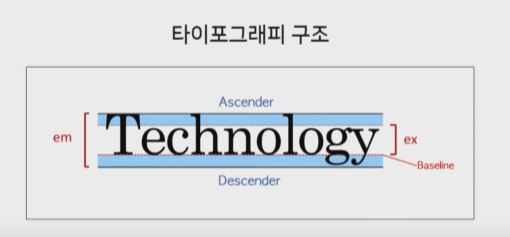
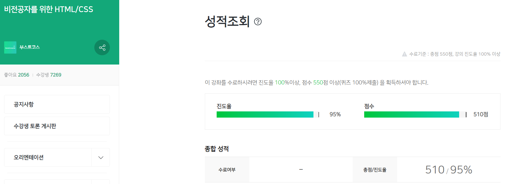

## 1. HTML 문법

약자: Hyper Text Markup Language

Hyper Text: 링크

- 태그: 꼬리표, 이름표

- 속성 (Attribute): 공백을 넣지 않습니다. 홀따옴표나 쌍따옴표 모두 사용가능

  글로벌속성과 특정태그에만 있는 속성이 있습니다.

- 태그의 중첩 (Nesting Tags)

- 빈 태그 (Empty tag): 시작태그만 존재하고 닫는태그가 존재하지 않는 것. relace tag 라고도 합니다.

- 공백: 한 칸 이상의 공백과 개행을 무시합니다.

- 주석 (Comment Tags)

### 기본구조 

```html
<!DOCTYPE html>
<html lang="en">
<head>
  <meta charset="UTF-8">
  <meta http-equiv="X-UA-Compatible" content="IE=edge">
  <meta name="viewport" content="width=device-width, initial-scale=1.0">
  <title>Document</title>
</head>
<body>
  
</body>
</html>
```

`<!DOCTYPE html>` DOC 타입: html 태그 위에 선언

`<html lang="en">` ko 라고하면 한국어로 작성된 문서

`<head> ` 문서에 표시되지 않는다.

`<meta charset="UTF-8">` 인코딩방식

`<title>` 문서의 제목: 검색에 이용

## 2. 태그

모질라사이트 html태그 사용법: <https://developer.mozilla.org/en-US/docs/Web/HTML/Element>{:target="_blank"}

닥터사이트 html태그 사용법: <http://html5doctor.com/element-index/>{:target="_blank"}

스쿨사이트 html태그 사용법: <https://www.w3schools.com/tags/default.asp>{:target="_blank"}

모질라 사이트의 사이드바에 HTML elements 를 누르면 다양한 태그들을 볼 수 있다.

**제목태그: Heading**

**단락과 개행: Paragraph, Linebreak**

`<p>` 단락의 개행

`<br>` 

**텍스트 관련 태그: B, I, U, S**

`<b>` bold 굵게

`<i>` 이탤릭체

`<u>` under line 밑줄

`<s>` 취소선

모질라사이트 html태그: <https://developer.mozilla.org/en-US/docs/Web/HTML/Element#inline_text_semantics>{:target="_blank"}

**앵커: Anchor**

속성 href (hyper reference) 가 무조건 있어야 한다.

`href="#id"` 내부링크

**의미없는 태그: Container**

`<div>` 디비전: block-level

`<span>` inline-level

### **리스트**

date: 07.10

실시간검색어, 뉴스

ul 혹은 il 안에 li 로 감싼다.

ul (unordered list): 순서가 없는 리스트

ol (ordered list): 순서가 있는 리스트

dl (description list)

dt (definition term): 용어.

dd (definition description): 용어의 정의. 용어 하나에 여러개의 정의도 가능.

> ol 내부에 div 나 p 태그 등이 들어올 수 없다.

ul태그 사용법: <https://developer.mozilla.org/en-US/docs/Web/HTML/Element/ul>{:target="_blank"}

ol태그 사용법: <https://developer.mozilla.org/en-US/docs/Web/HTML/Element/ol>{:target="_blank"}

dl태그 사용법: <https://developer.mozilla.org/en-US/docs/Web/HTML/Element/dl>{:target="_blank"}

**이미지**

alt: 이미지의 대체 텍스트를 입력. 시각장애나 이미지를 못가져오는 경우 대체텍스트를 출력

GIF: 256색으로 제한적이지만 용량이 작고 애니메이션과 투명이미지가 가능

JPG: 높은 압축률과 자연스러운 색상표현이 가능하며 사진이나 일반적인 그림에 사용

PNG: jpg 와 비교했을 때, 이미지 손실이 없고 투명과 반투명 모두 지원한다.

### **표: Table**

td, th: 데이터 셀 (table-cell). 제목행을 쓸 때는 th 를 씁니다.

tr: 행 (table-row)

모든 것을 table 태그로 감쌉니다.

caption: 표의 제목

thead: 제목행을 그룹

tfoot: 바닥행을 그룹

colspan: 셀을 가로방향으로 병합

rowspan: 셀을 세로방향으로 병합

colgroup

col

scope 속성

headers 속성

### **폼**

서버에 데이터를 전달하기 위한 요소들

`<input` 입력창 

`type=` 

- `text`
- `password` 값이 노출되지 않는다.
- `radio` 하나만 선택하는 것. `name` 속성으로 같은 이름으로 정해주어야 한다.
- `checkbox` 여러개 선택
- `file` 파일 업로드
- `submit` `form` 태그에 있는 action 을 실행한다. `value` 이름지정
- `reset` `form` 태그에 있는 모든값을 지운다.`value` 이름지정
- `button` `value` 이름지정
- `image` submit 과 같이 동작. src 속성이 필요하다.

`placeholder` 

`checked` 기본 선택상태

`<select>` 

- `<option>` 속성: `selected` 

`<textarea>` 여러 줄 텍스트 입력 상자

속성: `cols="int"` `rows="int"` `placeholder` 

**버튼요소**

`<button`

`type=` 

- `submit`
- `reset`
- `button` 

> input 은 닫는 태그가 없어 value 에 버튼이름을 넣어줘야하고, button 태그는 닫는 태그가 있어 사이에 버튼이름을 넣는다.

`<label>` 폼과 매칭해준다.

폼 컨트롤과 연결시켜주기 위함으로 웹 접근성 향상에 도움이 된다.

속성: `for` 아이디 값을 적어줍니다.

`<fieldset>` 여러 개의 폼 요소를 그룹화하여 구조적으로 만들기 위해 사용

- `<legend>` 폼 요소의 제목으로 fieldset 요소 내부에 작성

`<form` 서버개발자가 주로 이용

- `action` 폼 데이터를 처리하기 위한 서버의 주소
- `method` 데이터를 전송하는 방식을 지정 (get, post) post: 민감한 정보를 받을 때 사용

## 3. 콘텐츠모델, 시멘틱마크업, 블록

date: 07.11

**콘텐츠모델**

metadata: 콘텐츠의 style (표현), script (동작) 을 설정하거나 다른 문서와의 관계 등의 정보를 포함하는 요소

base, link, meta, noscript, script, style, title. head 태그에 위치

flow: 문서에 사용되는 대부분의 요소

a, abbr, address, ... button... 

sectioning: 헤딩과 푸터의 범위를 결정하는 요소, 아웃라인에 있음

article, aside, nav, section. HTML5 에 새로 생긴 태그들

heading: 섹션의 헤더를 정이하는 요소

h1, h2, h3, h4, h5, h6

phrasing: 문서의 텍스트이며 문단 내부레벨로 마크업하는 요소

a, abbr, map..

embedded: 이미지, 비디오, 플래시 등 외부 콘텐츠를 문서내에 표현하는 요소

audio, canvas, embed...

interactive: 사용자와 상호작용을 하는 요소

a, audio, button, details, embed, iframe, img, input

**시멘틱마크업**

의미론적인 마크업

일종의 스타일가이드와 같이 약속이다.

- 의미에 맞는 요소를 사용
- 문서의 구조화
- 인간과 기계가 모두 이해할 수 있는 것이 목표

모양은 같지만 의미가 다른 태그들

- `<b>` `<strong>` 중요할 때 사용
- `<i>` `<em>` 
- `<u>` `<ins>` 새롭게 추가된 내용
- `<s>` `<del>` 

HTML5에서 새로 생긴 Sematic 요소들

- `<article>`
- `<aside>`
- `<figcaption>`
- `<figure>`
- `<footer>`
- `<header>`
- `<main>`
- `<mark>`
- `<nav>`
- `<section>`
- `<time>`

Sematic 에 대해: <https://developer.mozilla.org/en-US/docs/Glossary/Semantics>{:target="_blank"}

**Block&Inline level**

block level 요소: 한 줄에 하나의 요소 표시

- ex) div, p, h

inline level 요소: 한 줄에 여러개의 요소 표시

- ex) span, a

inline 에는 block level 을 넣을 수 없다.

단, HTML5 에서는 block level 에 inline level 을 넣을 수 있다.

## 4. CSS

Cascading Style Sheets

- HTML을 꾸며주는 언어
- html 이 웹페이지의 정보를 표현한다면, CSS 는 html 을 보기좋게 디자인하는 역할

CSS Zen garden: <http://www.csszengarden.com/>{:target="_blank"}

위 사이트에서 html 파일은 같지만 css 파일만 다르게 해서 사이트에 변화를 주는 것을 경험할 수 있다.

**문법**

date: 07.12

- 선택자 (selector)
- 속성 (property)
- 값 (value)
- 선언 (declaration)
- 선언부 (declaration block)
- 규칙 (rule set)

h1(color:yellow; font-size:2em;)

h1: 선택자

color:yellow: 선언

> html 의 속성은 attribute, css 의 속성은 property

h1(color:yellow; font-size:2em;): 규칙

**주석**

comment tags

**CSS 적용방식**

Inline

style 속성에 넣음

Internal

문서의 style 태그를 head 태그에 씀

```html
<style>
    p {color: yellow;}
  </style>
```

External

rel: 문서와의 관계. ex) stylesheet

```html
<link href="style.css" rel="stylesheet">
```

```css
p {color: green;}
```

Import

```html
@import url('css/style.css');
```

**선택자**

Selector

- 요소 선택자 (태그): 태그 모두에 적용

*: 전체선택자. 성능에는 그다지 좋지 않다.

- class 선택자: 클래스에 큰 따옴표를 넣지않아도 동작한다. 여러개의 클래스를 넣어도 된다.

> 여러개의 클래스를 넣으려면 큰 따옴표를 넣어야 한다.

- id 선택자
- 속성 선택자

`text-decoration: underline` 밑줄

**선택자의 조합**

`p.bar` 

`.foo.bar` 

`#foo.bar` 

`p[class]` 클래스속성이 있어야함

`p[class][id]` 클래스속성과 id 속성이 있어야함

`[class*="bar"]` "bar" 문자가 포함되는 요소

`[class~="bar"]` 공백으로 구분한 "bar" 단어가 포함되는 요소

`[class^="bar"] ` "bar" 로 시작하는 요소

`[class$="bar"] ` "bar" 로 끝나는 요소

**문서구조관련 선택자**

부모/자식 요소 `div > span` div 자식인 span 태그에만 적용

조상/자손 요소 `div span` div 자손인 span 태그에만 적용

형제 요소

인접한형제 요소 `div + span` div 와 인접한 span 태그에만 적용

**가상 선택자: 가상클래스**

date: 07.14

- 가상클래스 (pseudo class): 미리 정의해놓은 상황에 적용이 되도록 약속되어지는 보이지 않는 클래스
- 가상요소 (pseudo element): 미리 정의해놓은 위치에 삽입이 되도록 약속되어있는 보이지않는 요소

li 태그의 첫번째자식과 마지막자식

```css
li:first-child{
  color:red;
}
li:last-child{
  color:blue;
}
```

링크관련된 가상클래스

`:link` 하이퍼링크이면서 아직 방문하지않은 앵커

`:visited` 이미 방문한 하이퍼링크를 의미

```css
a:link{
  color:red;
}
a:visited{
  color:green;
}
```

사용자 동작관련 가상클래스

`:focus` 입력포커스를 갖고있는 요소 (탭키로 이동할 때)

`:hover` 마우스포인터가 위치해있는 요소 (마우스를 올릴 때)

`:active` 사용자입력에 의해 활성화된 요소 (클릭할 때)

다른 가상클래스: <https://developer.mozilla.org/ko/docs/Web/CSS/Pseudo-classes>{:target="_blank"}

**가상 선택자: 가상요소**

`:before` 가장 앞에 요소를 삽입: content 속성으로 내용을 넣어야한다. ex) a:before 이면 모든 a 앞에 작성

`:after` 가장 뒤에 요소를 삽입: content 속성으로 내용을 넣어야한다.

`:first-line` 요소의 첫 번째 줄에있는 텍스트

`:first-letter` 블록레벨요소의 첫 번째 문자

다른 가상요소: <https://developer.mozilla.org/ko/docs/Web/CSS/Pseudo-elements>{:target="_blank"}

**구체성**

선택자를 얼마나 명시적으로 선언했느냐를 수치화한 것

0, 0, 0, 0

- 0, 1, 0, 0: 선택자에 있는 모든 id 속성값
- 0, 0, 1, 0: 선택자에 있는 모든 class 속성값, 기타속성, 가상클래스
- 0, 0, 0, 1: 선택자에 있는 모든 요소, 가상요소
- 전체 선택자는 0, 0, 0, 0 을 갖는다.

조합자는 구체성에 영향을 주지 않는다.

```
h1 - 0, 0, 0, 1
body h1 - 0, 0, 0, 2
.grape - 0, 0, 1, 0
*.bright - 0, 0, 1, 0
p.bright em.dark - 0, 0, 2, 2
#page - 0, 1, 0, 0
div#page - 0, 1, 0, 1
```

CSS vs HTML 인라인

- 인라인스타일은 1, 0, 0, 0

!important: 구체성을 모두 무시하고 우선된다.

```css
p#page {
    color: red !important;
}
```

```html
<p id="page" style="color: blue">
    Lorem ipsum dolor sit.
</p>
```

빨강으로 표현되는 것을 볼 수 있다.

**상속**

박스모델 속성들은 상속되지 않는다.

margin, padding, background, border

상속된 값은 아무런 구체성을 가지지 않으며 심지어 0, 0, 0, 0 도 아니다.

**캐스케이딩**

규칙

- 중요도&출처
- 구체성
- 선언순서

기본적으로 !important 로 선언된 모든 규칙은 그렇지 않은 규칙보다 우선한다.

출처는 제작자, 사용자, 사용자 에이전트 (User Agent) 로 구분한다.

우선순위

사용자 !important 스타일

제작자 !important 스타일

제작자 스타일: 웹사이트 제작자가 설정

사용자 스타일: 일반유저가 CSS 에 설정

사용자 에이전트 스타일: 브라우저에 내장된 스타일

구체성

선언순서: 뒤에 선언한 스타일이 적용된다.

기타선택자: <https://www.w3schools.com/cssref/css_selectors.asp>{:target="_blank"}

## 5. 단위, 배경, 박스모델

css 속성의 정의와 syntax 확인방법

w3schools: <https://www.w3schools.com/>{:target="_blank"}

간단한 스펙과 예제를 보기 좋다.

MDN: <https://developer.mozilla.org/en-US/>{:target="_blank"}

개발적 버그나 추가적 스펙에대해 확인하기 유용

`initial` 초기값

`inherit` 부모요소를 상속

**CSS 단위**

절대길이

- px: pixels
- pt: points 가장 작은 인쇄의 단위. 웹 개발에는 권장되지 않는다. 디자이너가 pt 로 전달해주면 px 로 제작

Window 에서는 9pt = 12px

Mac 에서는 9pt = 9px

상대길이

- %: Percentage
- em: font size of the element. 1em 은 지정된 폰트크기와 같다. ex) 부모를 16px 로 하고 자식을 1em 으로 지정

소수점 세자리까지 가능

- rem: font size of the root element
- vw: 1% of viewport's width

**CSS 속성-색상**

- black
- #000000
- #000
- rgb(0, 0, 0)
- rgba(0, 0, 0, 0.5): 0은 투명, 1은 원색
- HSL (CSS3)
- HWB (CSS4)

**CSS 속성-배경**

- `background-color` 
- `background-image` url()
- `background-repeat` default 가 repeat 이다. `repeat-x` `repeat-y` `no-repeat` 
- `background-position` left right top bottom. px 은 왼쪽상단 모서리가 기준이다. 
- `background-attachment` `fixed` 스크롤해도 따라 이동
- `background` color image position/size repeat attackment 등

**BOX Model-1**

content

padding: 테두리 내부 여백

border: 테두리

margin: 테두리 외부 여백

예시

`border` width style color

ex) 10px solid #000

`border-width` thin medium thick

`border-style` solid (실선)  

`padding` top right bottom left (시계방향). 세개만 선언 시 좌우가 같다. 두 개만 선언 시 y, x

ex) 30px

`margin` 

auto: 가운데정렬. 요소에 `width` 가 꼭 있어야 한다. `margin: auto` 와 `margin: 0 auto` 는 비슷한 기능

margin-left: auto 오른쪽정렬

margin-right: auto 왼쪽정렬

ex) 50px

margin collapse 란?

margin 이 큰 값으로 겹쳐지는 것

| 차이점  | +    | -    | auto | 단위  |
| ------- | ---- | ---- | ---- | ----- |
| margin  | O    | O    | O    | px, % |
| padding | O    | X    | X    | px, % |

****

**BOX Model-2**

`width` default = auto

**height**

`%` 부모를 지정해줘야 자식이 %가 적용된다.

**오답**

background-color 의 기본값은 transparent

border 는 선의 형태만 지정해줘도 표현된다.

전체길이는 width or height + (border + padding) * 2 

## 6. 폰트&텍스트

폰트나 텍스트는 대부분 상속된다.



**font-family**

글꼴

한글폰트의 경우 작은따옴표안에, 영문명도 지정해준다.

마지막에는 항상 generic-family 를 선언해준다.

generic-family 는 family-name 으로 지정한 폰트가 사용자의 컴퓨터에 없을 시 적절한 폰트를 선택할 수 있도록 함

삐침이 있는것을 세리프체 (serif) 라고 한다.

sans 없다. sanserif 삐침이 없다.

**line-height**

줄간격

숫자만입력

브라우저마다 홀수인 간격을 나누는 기준이 다르므로 브라우저를 꼭 확인할 것

**font-size**

default: 16px (1em)

larger smaller 는 브라우저마다 값이 다르다.

**font-weight**

글꼴 굵기

normal 과 bold 를 가장 많이 사용한다.

lighter 와 bolder 는 부모요소보다 얆거나 굵은 폰트가중치. 잘 사용하지 않는다.

100~900 사이의 수치로 굵기표현

normal 과 bold 만 지원하는 폰트일 경우 100~500 은 normal, 600~900 은  bold 이다.

**font-style**

글꼴 스타일 지정

`oblique` 기울임

**font-variant**

글꼴 변환

`small-caps` 소문자를 작은 대문자로 변환하는 속성

**font**

글꼴 속성의 축약형

size 와 family 는 반드시 선언해야하는 필수 속성

각 속성마다 선언순서를 지켜야 함.

**@font-face**

웹 폰트

- 시스템폰트
- 이미지폰트
- 웹폰트: import 혹은 사용자의 로컬환경에 글꼴을 다운받아 적용

네이버는 설치형 폰트를 사용

```css
@font-face {
    font-family: webNanumGothic;
    src: url(NanumGothic.eot);
    font-weight: bold;
    font-style: italic;
}
body {
    font-family: webNanumGothic;
}
```

사용방법: <https://wit.nts-corp.com/2017/02/13/4258>{:target="_blank"}

글꼴 최적화: <https://web.dev/fast/#optimize-webfonts>{:target="_blank"}

**vertical-align**

수직정렬: 위첨자와 아래첨자를 넣을 수 있다.

인라인요소 또는 테이블 셀 상자의 수직정렬을 지정한다.

대부분 부모요소에 상대적으로 정렬된다.

**text&word**

text-align 텍스트정렬

- `left`
- `right`
- `center`
- `justify` 양쪽정렬
- `initual` 

**text-indent**

**text-decoration**

텍스트 장식

`overline`

`line-through`

`underline`

`underline overline`

**단어관련속성**

`white-space` : `nowrap` 줄바꿈무시 `pre` `pre-line` `pre-wrap` 

주로 normal 과 nowrap 사용

`letter-spacing` 자간: px단위, 음수도 가능

`word-spacing` 단어사이의 간격: px단위, 음수도 가능

`word-break` 

`word-wrap` :  `break-word` 영역을 넘는 것을 자릅니다.

**오답**

family name 은 여러개 선언할 수 있다.

자식요소에 font-family 를 재선언 시 generic-family 도 다시 선언해줘야한다.

font 속성 사용 시 반드시 선언해야 하는 필수속성은?

부모의 위 첨자 기준으로 정렬하는 방법은?

text-indent 의 기준은?

text-decoration 의 기본값은 none currentColor solid

## 7. 레이아웃

date: 07.17

**display&visibility 속성**

display: 요소의 rendering box 유형을 결정

`none` 브라우저에서 보이지않음

`inline` span 등

`block` div 등

`list-item` 

`inline-block` inline 과 비슷

| display      | width | height | margin | padding | border |
| ------------ | ----- | ------ | ------ | ------- | ------ |
| block        | O     | O      | O      | O       | O      |
| inline       | X     | X      | 좌/우  | 좌/우   | 좌/우  |
| inline-block | O     | O      | O      | O       | O      |

대신 inline-block 은 4px 의 공백이 발생할 수 있다.

**visibility**

요소를 어떻게 숨길 것인지 결정

`visible` 기본값: 보임

`hidden` 숨김

`collapse` IE 와 firefox 에서만 렌더링된다. 숨기면서 여백을 없앤다. 잘 쓰이진 않는다.

**float**

`float` 

- `none` 기본값
- `left` 
- `right` 

요소를 보통의 흐름에서 벗어나 띄어지게 함

주변 텍스트나 인라인요소가 주위를 감싸는 특징이 있음

대부분 요소의 display 값을 block 으로 변경함

> 배경은 겹쳐지고 텍스트 (content) 는 겹쳐지지 않는다.

**clear**

floating 된 요소의 영향에서 벗어나 다음 행으로 이동

`none` 

`left` 

`right` 

`both` 

> 해당태그가 block-level 이거나 display 가 block 일 때 사용가능. 자식에 선언해도 적용됨

**position&offset**

요소의 위치를 원하는 곳으로 이동시킬 때 사용

`static` 기본값: 정상흐름대로 배열. 좌표설정 안됨 (top, right 등) 입력해도 에러가 나지 않는다. 

`relative` 상대위치. 정상흐름대로배열. 주변요소들에 영향주지않으면서 offset 이동

부모가 relative 여도 된다. 바깥선의 바로 안쪽에 위치한다.

`absolute` 절대위치. offset 이동. 부모가 상대 절대위치를 가지면 offset 값의 시작점이 됨. display 를 block 으로 변경함

부모가 static 이면 안된다.

`fixed` 고정위치. 뷰포드상에서 offset 이동. 부모위치에 영향을 안받음. 

스크롤해도 고정된다.

> 겹칠 때 bottom 을 0 으로 선언한다.

`sticky` 원래 위치에 있다가 스크롤하면 고정위치가 된다.

브라우저 지원확인: <https://caniuse.com/>{:target="_blank"}

**position&z-index**

z-index: 박스가 겹치는 순서를 지정

default: auto

`number` 

- position 값이 static 이 아닌경우 지정가능
- 순서값이 없을 경우 생성순서 (코드상 순서) 에 따라 쌓임
- 부모가 z-index 값이 있을경우 부모안에서만 의미있음
- 큰 값이 가장 위쪽. 음수사용가능

> 부모가 이기면 자식도 이긴다.

유효성검사 링크: <https://validator.w3.org/>{:target="_blank"}

**오답**

float 을 선언하면 display 속성이 block 으로 변경된다.

뷰포트를 기준으로 offset 이동하는 것은 fixed

## 8. 미디어쿼리

각 미디어 매체에 따라 다른 스타일시트를 적용할 수 있게 만드는 것

CSS2 Media type 의 진보된 버전

**구문**

```
@media media queries {}
```

media queries 가 참이면 적용

- Media types (미디어타입): all *, print *, screen *, tv...
- Media features (미디어 특성): width *, height, device-width, device-height, orientation *...

*실제 사용되는 것들

**syntax**

```
media_query_list
	: S* [media_query [ ',' S* media_query ]* ]?
	;
media_query
	: [ONLY | NOT]? S* media_type S* [ AND S* expression ]*
	| expression [ AND S* expression ]*  // 위 혹은 아래로 작성가능
	;
expression
	: '(' S* media_feature S* [ ':' S* expr ]? ')' S*
	;
```

S*: 공백관련표시. 없다고 생각할 것

\[ ]: 있을수도 있고 없을 수도 있다.

|: a 가 나올 수도있고 b 가 나올 수도 있다.

?: 0 번 혹은 한번 나온다. 

*: 0 번 나오거나 한번 혹은 그 이상 나온다.

---

1. 여러 개의 미디어쿼리로 이루어진 리스트로 작성할 수 있다.
2. 미디어타입 또는 표현식 단독으로도 작성할 수 있다.
3. 표현식은 값이 없이 특성이름만으로도 작성할 수 있다.

`@media screen` 

`@media screen and (min-width:768px) {}` 미디어타입이 screen 이고 width 가 768px 이상이면 적용

orientation, grid, scan 에는 프리픽스 (min, max) 를 넣을 수 없다.

orientation

- portrait: 세로로 긴 형태

- landscape: 가로로 긴 형태

`@media (min-width: 768px) and (max-width: 1024px) {}`

`@media (color-index)` 미디어장치가 color-index 를 지원하면 적용

`@media screen and (min-width: 768px), screen and (orientation: portrait), ...` 쉼표 (,) 는 or 이다.

`@media not screen and (min-width: 768px)` 

사용방법

1. `@media` css 혹은 html 의 style 태그 내부에 선언
2. `<link media="">` 잘 쓰이지않는 방법
3. `@import`  잘 쓰이지않는 방법

**실습**

- 디스플레이 크기에 따른 background-color 변경

0~767px: mobile

768~1024px: tablet

1025px~: desktop

- 페이지 인쇄하는 경우의 스타일추가

> and 후 띄어쓰기해야 적용된다.

**화면크기에 따른 배경색**

```html
<style>
    @media screen and (max-width:767px) {
      body {
        background-color: gold;
      }
    }
    @media screen and (min-width:768px) and (max-width:1024px) {
      body {
        background-color:lightblue;
      }
    }
    @media screen and (min-width:1025px) {
      body {
        background-color: lightpink;
      }
    }
  </style>
```

**mobile first**

```html
<style>
body {
      background-color: gold;
    }
    @media screen and (min-width:768px) and (max-width:1024px) {
      body {
        background-color:lightblue;
      }
    }
    @media screen and (min-width:1025px) {
      body {
        background-color: lightpink;
      }
    }
</style>
```

ctrl + P: 화면인쇄

**화면인쇄 예제**

```html
<style>
    @media print {
      a {
        text-decoration: none;
      }
      a:after {
        content:"("attr(href)")";
      }
    }
  </style>
```


표준명세 (min,max): <https://www.w3.org/TR/css3-mediaqueries/>{:target="_blank"}

다음 표준명세 (부등호): <https://www.w3.org/TR/mediaqueries-4/>{:target="_blank"} 

작성된 반응형사이트 디자인 및 소스: <https://mediaqueri.es/>{:target="_blank"} 

**뷰포트설정**

```html
<meta name="viewport" content=" 뷰포트의 설정 값" >
```
- width(height) : 뷰포트의 가로(세로) 크기를 지정합니다. px단위의 수치가 들어갈 수 있지만, 대부분 특수 키워드인 "device-width(height)"를 사용합니다.(뷰포트의 크기를 기기의 스크린 width(height) 크기로 설정한다는 의미입니다.)
- initial-scale : 페이지가 처음 나타날 때 초기 줌 레벨 값을 설정합니다.(소수값)
- user-scalable : 사용자의 확대/축소 기능을 설정할 수 있습니다.
```html
<meta name="viewport" content="width=device-width, initial-scale=1.0">
```

뷰포트가 없을 때: <https://www.w3schools.com/css/css_rwd_viewport.asp>{:target="_blank"} 



