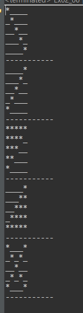

## 8.18

알고리즘이 곧 연봉이므로 알고리즘을 열심히 공부한다.

**목차**

자바 + 알고리즘 + 프로젝트 + UML 클래스 설계 + 구현: 6주

오라클: 3~4주 (1주) 웹사이트 -> DB 모델링 + SQL/PLSQL 프로젝트

자바 + 오라클 = JDBC

html5, css3, Javascript, Jquery

JSP/Servlet 프로젝트(4주) MVC 패턴

Jquery AJAX + 차트 + Open API 등등

Spring 3.0, 4.0, 5.0 + mybatis 프로젝트

+AWS (아마존 웹서비스)

**개발환경구축**

JDK = JVM + 자바클래스 라이브러리(Java API) + 개발 프로그램

JDK1.5 == JDK5.0

JDK1.8 == JDK 8.0

javac.exe: 컴파일러, 소스코드 -> 바이트코드로 컴파일한다.

java.exe: 자바 인터프리터, 바이트코드를 해석 + 실행

JDK = JRE (java runtime environment) [JVM + Java API] + 관련 프로그램 (javac.exe, java.exe)

자바설치: <https://www.oracle.com/index.html>

products - software 탭의 Java - 

설치된 JDK 있는지 유무 확인

1) 탐색기 - 설치폴더 확인 (window + E: 파일탐색기) 을 C/Program Files/Java/jdk 에서 확인
2) cmd 에 `java -version` 라고 입력

cmd 명령어

cls: 화면 clear

**환경설정**


+++ 검색창에서 고급 시스템 설정 보기 - 환경변수 - 편집 - 새로만들기

혹은 내 PC - 속성 - 고급 시스템 설정 


본인이 설치한 자바 위치를 다음과 같이 복사 

```
C:\Program Files\Java\jdk1.8.0_301\bin
```

붙여넣기

혹은 새로만들기를 눌러 JAVA_HOME 변수값을

```
C:\Program Files\Java\jdk1.8.0_301
```

로 설정한다.

환경변수를

```
%JAVA_HOME%\bin
```

으로 만든다.

jar: 자바압축파일

내일 테스트

1. JDK 설치 확인
2. 제거
3. JDK 설치
4. 설치 확인
5. 환경변수 JAVA_HOME, path 변수 설정
6. Hello.java 본인 이름 출력
7. javac 컴파일
8. java 실행

자바에서 클래스를 선언하는 형식 (시험)

[접근지정자] [기타제어자] class 클래스이름 { }

modifiers = 접근지정자 + 기타제어자

자바에서 함수 선언하는 형식 (시험)

```
[접근지정자] [기타제어자] 리턴자료형 함수명([매개변수]) {
	[return 리턴값;] 
}
```

매개변수 == 인자 == 파라미터 == 실인자, 가인자

args (arguments)

**이클립스 설치**

설치: <https://www.eclipse.org/downloads/packages/>

**Eclipse IDE for Enterprise Java and Web Developers 로 설치할 것**

프로젝트를 만들 때 JRE 1.8 을 선택한다.

클래스를 bin 폴더에 자동으로 생성한다.

**환경설정**

1. 다크테마
2. 단축키
3. text editor - show print margin 체크해제
4. 주석저장

**폰트 바꾸는 법**

window - preference - font 검색 후 가장 아래에 text font

**한글깨짐 환경설정**

workspace 에 text file encoding 에서 other 선택 후 UTF-8 적용한다.

**자동 주석변경**

templates 검색하면 Java 안에 code templates

```
/**
 * @author ${user}
 * @date ${date} - ${time}
 * @subject
 * @content
 * ${tags}
 */
```

폴더열기: 우클릭 - show in - system explorer

시험

1. 개발환경설정
2. 클래스 선언 형식
3. 함수 (메서드) 선언 형식
4. 본인 이름 출력하는 전체 코딩 (메모장)
5. Hello.java, javac.exe, java.exe
6. 이클립스 단축키

## 8.19

함수의 세가지 기능

1. 기능
2. 매개변수
3. 리턴 값

```
Exception in thread "main" java.lang.Error: Unresolved compilation problem: 
	The local variable name may not have been initialized
```

> main 스레드에서 예외: 해결되지 않는 컴파일 문제
>
> 지역변수 name 이 초기화되지 않았다.

```
Duplicate local variable name
```

> 지역변수가 중복되었다.

```
age cannot be resolved to a variable
```

> age 가 변수로 선언되야 한다.

예약어는 키워드 (keyword) 또는 reserved word 라고 한다. 의미가 부여된 식별자라고 할 수 있다.

식별자 (identifier): 프로그래밍에서 사용한 모든 이름. 좁은 의미로 개발자 (사용자) 가 선언한 이름

변수명은 숫자로 시작할 수 없다.

상수는 final 을 붙인다.

**색**


주황: 키워드와 리턴 (Keyword, Return)

노랑: 지역변수 (Local variables)

연두: 메서드 (Methods)

진한파랑: 클래스 (Classes)

**특수**

**특수문자**

| 특수문자             | 리터럴                           |                                                          |
| -------------------- | -------------------------------- | -------------------------------------------------------- |
| tab                  | \t                               |                                                          |
| backspace            | \b                               |                                                          |
| form feed            | \f                               | 출력 시 페이지 넘김                                      |
| new line             | \n                               |                                                          |
| carriage return      | \r                               | 커서를 현재 줄의 처음으로 옮기고 문자 하나를 덮어씌운다. |
| 역슬래쉬(\\)         | \\\\\                            |                                                          |
| 작은따옴표           | \\'                              |                                                          |
| 큰따옴표             | \\"                              |                                                          |
| 유니코드(16진수)문자 | \u유니코드 (예: char a='\u0041') |                                                          |

```
Syntax error on token "" + name + "", invalid AssignmentOperator
```

> 유효하지 않은 (invalid) 대입연산자 (AssignmentOperator) 입니다.

**printf**

`%s` int

`%d` String

`%f` double `%6.2f` 라고하면 총 6자리의 수와 2자리의 소수점 자리수이다.

스트림에는 바이트스트림과 문자스트림이 있다.

키보드 -> System.in 바이트 스트림 -> 문자변환 스트림 InputStreamReader -> 한 문자 읽기 BufferedReader

**input**

Scanner

```java
Scanner sc = new Scanner(System.in);
```

BufferedReader

```java
BufferedReader br = new BufferedReader(new InputStreamReader(System.in));
String name = br.readLine();
```

**자료형의 종류**

기본형 (primitive type) 8가지: 

- 정수 - byte, short, int, long, 문자 char
- 실수 - float, double
- 불린 - boolean

참조형 (reference type): 배열, 클래스, 인터페이스

byte 크기 1바이트 [ ] [ ] [ ] [ ]

short 크기 2바이트 [ ] [ ] [ ] [ ] [ ] [ ] [ ] [ ]

int 크기 4바이트

long 크기 8바이트

1비트는 2가지

2비트는 4가지

1바이트는 8비트이고 256가지이므로 범위가 -128~127 이다.

short 는 $$2^{16}$$ 가지

int 는 $$2^{32}$$ 가지이므로 -21억에서 21억정도이다.

long 은 -900경에서 900경

| 자료형  | 범위         |
| ------- | ------------ |
| byte    | -128~127     |
| short   | -32768~32767 |
| int(4)  | -21억~21억   |
| long(8) | -900경~900경 |

>  나이는 메모리낭비를 방지하기 위해 꼭 byte 로 작성할 것!!

float(4), double(8)

long 과 float 형은 숫자 뒤에 l 과 f 를 붙인다.

**진수**

10진수 -> 2, 8, 16진수

```java
System.out.printf("%x", 42);
```

`%o` `%x` 

8진수 -> 10진수

042

16진수 -> 10진수

0x42

Q. 2진수로 바꾸기?

A. 


Q. 다음과 같은 에러?

A. 디버그 중 다른 행동 (저장 등) 을 했을 때 나타난다. Do not show error 를 누르고 continue 를 누르거나 하면 된다.

## 8.23

> 반올림을 위해서는 0.5 를 int 에 더한다.
>
> 90 이 Z, 91~96 은 특수문자, 97 이 a 이다.

**오답**

자료형은 크기와 저장형식을 정의한 것이다.

temp 는 중괄호에 넣는다.

throws IOException

작은 값은 byte 선언

printf 개행

**수업**

**음수를 데이터로 표현하기**

-10 저장

4bit = nibble

4byte = word

처음에는 부호와 절대치를 사용했으나 현재는 2의 보수법을  사용한다.

1의 보수법

10 -> 2진수 0000 1010

보수 -> 1111 0101

2의 보수법

1의 보수법에 1을 더한다.

-10이 저장된 2의 보수 -> 1111 0110

1. 0과 1을 바꾼다.
2. 1을 더한다.

**실수의 진법변환**

0.625

1. 2를 곱한다. -> 1.25 -- 1
2. 2를 곱한다. -> 0.5 -- 0
3. 2를 곱한다. -> 1.0 -- 1

0.625(10) -> 0.101(2)

반대로

0.5 + 0.25 x 0 + 0.125 = 0.625

부호 S (Sign bit): 0 이면 양수 1 이면 음수

지수 E (Exponent): 부호있는 정수

가수 M (Mantissa): 실제값을 저장하는 부분

float 은 지수가 8자리 가수가 23자리 = 31

double 은 지수가 11자리 가수가 52자리 = 63

float 은 정밀도가 7 이다.

double 은 정밀도가 15자리이다.

```java
byte kor = Byte.parseByte(br.readLine());
```

Integer.parseInt 로 해서 byte 캐스팅 하지말고 이렇게 코딩할 것

parse: 분석하다

바이트로 분석하기 위한 코드이다.

> 기본형과 참조형끼리는 캐스팅할 수 없다.

`Integer.MAX_VALUE`

`Integer.MIN_VALUE` 

정수를 0으로 나누면

ArithmeticException 산술적 예외 발생

arithmetic: 연산, 계산

실수를 0으로 나누면

에러가 나지않고 Infinity 혹은 NaN (not a number) 가 나온다.

**진수**

`%o` 8진수

`%#o` 앞에 0을 붙여 8진수임을 보여준다.

`%x` `%X` 16진수 (대소문자)

`%#x` 앞에 0x 를 붙여 16진수임을 보여준다.

**정렬**

`%-10d` 좌측정렬

`%10d` 우측정렬

`%05d` 빈 칸을 0으로 채운다.

**특수문자**

`%(d` 음수이면 괄호사이에 넣는다.

`%,d` 세자리마다 반점

**하나의 지시자로 여러 개 출력**

`1$` % 와 d 사이에 넣는다.

```java
public class Printf {
	public static void main(String[] args) {
		int n = 3;
		System.out.printf("%1$d, %1$d", n);
	}
}
```

클래스확인: ctrl + 클릭 or F3

**printf**

%\[argument_index$]\[flags]\[width]\[.precision]conversion

| argument_index$ | 기능 |
| --------------- | ---- |
|                 |      |

| flags | 기능 |
| ----- | ---- |
|       |      |

| width | 기능 |
| ----- | ---- |
|       |      |

| .precision | 기능 |
| ---------- | ---- |
|            |      |

| conversion | 기능 |
| ---------- | ---- |
|            |      |

메뉴얼 printf - formatter: <[Formatter (Java Platform SE 8 ) (oracle.com)](https://docs.oracle.com/javase/8/docs/api/index.html)>{:target="_blank"}

**AND 연산자 우선순위**

산술 - 비교 - 논리 - 대입

#

정규표현식?

  1) int i = 100; 을  long l 로 형변환하는 방법
  2) long l = 100L; 을 int i 로 형변환하는 방법

**비트연산자**

일반논리 연산자: ! && ||

비트논리 연산자: 

`~` 틸드 (비트부정) 연산자

~10 -> -11 비트를 역으로 한다.

0000 1010 -> 10

0000 1011 -> 11

1111 0101 -> -11

**3 & 4** -> 0

3 -> 0000 0011

4 -> 0000 0100

& -> 0000 0000

3 | 4 -> 7

| -> 0000 0111

XOR: 서로 다를 때만 1을 얻는다.

^ -> 0000 0111

**쉬프트(shift) 연산자**

`<<` `>>` 

15 >> 2 -> 3

15 -> 0000 1111

`15 >> 2` -> 0000 0011

`15 << 2` -> 0011 1100

`Integer.toBinaryString` 

printf 에서는 \n 보다는 %n 이 더 안전하다.

**int 형을 String 으로 바꾸기**

1. Integer.toString(n)
2. String.valueOf(n)
3. String str = n + ""
4. String str = new String(n)

Q. Scanner 가 아니라 BufferedReader 를 배운 이유

A. 같은 기능이지만 용도는 다르다. 

Scanner 클래스는 jdk 1.5 에 나왔으므로 Scanner 를 사용하도록 한다.

**Scanner**

`next()`

`nextInt()`

`nextLine()` 

`close()` 

`useDelimiter()`

**반점으로 구분하기**

**useDelimiter()**

```java
public class Delimiter {
	public static void main(String[] args) {
		String input = "1 , 2 , red , blue fish";
		Scanner s = new Scanner(input).useDelimiter("\\s*,\\s*");
	}
}
```

**예제**

```java
public class Delimiter {
	public static void main(String[] args) {
		Scanner sc = new Scanner(System.in).useDelimiter("\\s*,\\s*");
		
		String name = sc.next();
		int age = sc.nextInt();
		boolean gender = sc.nextBoolean();
		double height = sc.nextDouble();
		
		System.out.printf("이름: %s%n", name);
		System.out.printf("나이: %d%n", age);
		System.out.printf("성별: %b%n", gender);
		System.out.printf("키: %.2f%n", height);
	}
}
```

**입력**

```
Connor,25,true,167.7777777,
```

**출력**

```
이름: Connor
나이: 25
성별: true
키: 167.78
```

**삼항연산자**

단항: !true

이항: 3+5

삼항: `?:` 항1 ? 항2 : 항3

항1 이 참이면 항2 반환

항1 이 거짓이면 항3 반환

**복합 대입 연산자**

`x >>= 2` x = x >> 2

**부호연산자**

```java
x = -x;
x *= -1;  // 같은 코드이다.
```

**char 는 정수형이다**

```java
System.out.println('Z' - 'A');  // 25가 출력된다.
```

**소수점 반올림하는 방법**

```java
double pi = 3.141592;
```

format 

```java
String temp = String.format("%.3f", pi);
pi = Double.parseDouble(temp);
```

int

```java
pi = (int) (pi * 1000 + 0.5) / 1000D;
```

> 0.5 를 빼면 반올림대신 버림이 된다.

**0 이상 100 이하**

0 <= kor && kor <= 100

**0 미만 100 초과**

1. !(0 <= kor && kor <= 100)
2. kor < 0 || 100 < kor

**배열**

`int[ ] kors`

`kors` 를 변수, 참조변수, 배열명이라고 한다.

정의: 동일한 자료형을 메모리상에 연속적으로 놓이게 한 것

선언: 자료형[ ] 변수명 = new 자료형[배열크기]

그림: 힙 영역에 주소 값이 저장되고 스택영역의 100번지를 참조한다.


영역

- 스택 영역
- 힙(동적) 영역
- 스태틱 영역
- 코드 영역

**제어문**

정의: 프로그램의 흐름 (실행순서) 를 바꾸어 주는 문장

control statement

종류

1. 조건문: if 문
2. 분기문: swtich 문
3. 반복문: for 문, for-each 문
4. 조건반복문: while 문, do-while 문
5. 기타: break 문, continue 문

**switch**

key: 변수, 수식, 정수, 문자열

value: 값, 변수x, 정수리터럴, 문자리터럴, 문자열, 중복x

default 는 생략 가능하다.

default 는 보통 마지막에 쓰고 마지막에 쓰면 break 문을 쓰지않아도 된다.

**for**

for(초기식; 조건식; 증감식)


## 8.25

문제

```java
public class Ex03 {
	public static void main(String[] args) {
		int n = 10;
		int sum = 0;
		
		for (int i = 1; i < n; i++) {
			System.out.printf("%d+", i);
			sum += i;
		}
		sum += n;
		System.out.printf("%d=%d", n, sum);
	}
}
```

마지막 숫자를 밖으로 빼면 성능은 좋고 가독성이 떨어진다. (if 문을 계속 반복하지 않으므로)

for 문에 if 문을 쓰면 성능은 떨어지나 가독성이 좋다.

오답: char 입력받는 방법

```java
char grade = sc.next().charAt(0);
```

nextCharacter 가 없으므로 next (String) 으로 받아서 첫 번째 문자를 받는다.

삼항연산자

```java
for (int i = 1; i <= 10; i++) {
    System.out.printf(i == 10? "%d" : "%d+", i);
    sum += i;
}
System.out.printf("=%d", sum);
```

백스페이스

```java
for (int i = 1; i <= 10; i++) {
    System.out.printf("%d+", i);
    sum += i;
}
System.out.printf("\b=%d", sum);
```

재귀

```java
static int iterate(int n) {
    return n != 1 ? n + sum(n - 1) : 1;
}
```

**알고리즘**

문자축약

```java
public class Main {
	public static void main(String[] args) {
		Scanner sc = new Scanner(System.in);
		String str = sc.next();
		int count = 1;

		for (int i = 0; i < str.length() - 1; i++) {
			if (str.charAt(i) == str.charAt(i + 1)) {
				count++;
			} else {
				if (count != 1) System.out.print(count);
				System.out.print(str.charAt(i));
				count = 1;
			}
		}
		if (count != 1) System.out.print(count);
		System.out.print(str.charAt(str.length() - 1));
	}
}
```

**for문**

1. 초기값, 조건문, 증감값 모두 비워두어도 된다.
2. 초기값에 두 개 이상의 변수를 선언할 수 있다.

**Math**

`round()` double 형을 넣으면 long 형이, float 형을 넣으면 int 형을 반환한다.

```java
long _pi = Math.round(pi);
```

그러므로 long 형으로 받는다.

`floor()` 절삭하고 double 형을 반환한다.

> 1000을 곱하고 round 나 floor 를 할 때는 round 는 D를 포함, floor 는 D를 포함하지 않는다.

round 는 int 를 반환, floor 는 double 을 반환하기 때문이다.

`ceil()` 올림으로 double 형을 반환한다.

`PI`

`random()` 

0~100 사이 정수 랜덤하게 출력하는 방법

(int) Math.random() * 101

혹은 Math.round(Math.random() * 100)


## 8.26

**오답**

결과예상

```java
   1)
        int sum = 0 , i = 1 ; 
		for (      ;       ;     ) {
			sum += i;
			if( i > 10 ) break; 
			System.out.printf("%d+", ++i);
		} 
		System.out.printf("=%d\n", sum);     
```

```java
    2)
       int i = 1;		
		while ( ++i <= 5) {
			System.out.println(i);
		}
```

**좋은코딩**

```java
public class Ex01 {
	public static void main(String[] args) {
		Scanner sc = new Scanner(System.in);
		int n = sc.nextInt();
		int m = sc.nextInt();
		int sum = 0;
		int min = n > m ? m : n;
		int max = n > m ? n : m;
		
		for (int i = min; i <= max; i++) {
			sum += i;
			System.out.printf(i != max ? "%d+" : "%d", i);
		}
		System.out.printf("=%d", sum);
	}
}
```

**입력**

```
1 10
```

**출력**

```java
1+2+3+4+5+6+7+8+9+10=55
```

> 모든 입력값에 대해서는 **유효성 검사**를 해야한다.

**좋은코딩**

```java
switch (score / 10) {
case 10:
case 9:
    answer = '수';
    break;
case 8:
    answer = '우';
    break;
case 7:
    answer = '미';
    break;
case 6:
    answer = '양';
    break;
default:
    answer = '가';
    break;
}
System.out.println(answer);

```

> break 문이 없으면 다음 case 로 넘어간다.

**ASCII**

`10` 라인피드

`13` 캐리지리턴

**열 개씩 출력하는 법**

```java
for (int i = 0; i < 256; i++) {
    int lineNumber = (i/10) + 1;

    if (i % 10 == 0) System.out.printf("%d: ", lineNumber);
    System.out.printf("[%c]", i);
    if (i % 10 == 9) System.out.println();
}
```

**System.in**

```java
char one = (char) System.in.read();
```

`read()`

int 형을 반환합니다.

> 엔터는 \\r (13), \\n (10) 을 출력한다.

`skip(long)` 남아있는 데이터 제거

`available()` 남아있는 데이터 갯수 반환

사용방법

```java
System.in.skip(System.in.available());
```

> read() 후에는 꼭 skip 으로 데이터를 지워야 한다. 

Q. System.in.read 와 스캐너, BufferedReader 의 차이점은?

A. 

**순서도**


순서도를 영어로 플로우차트 (Flow chart) 라고 한다.

순서도를 그리고 프로젝트를 하면 편하다.

**예제**


1. 타원으로 시작하거나 끝낸다.
2. 육각형으로 초기값을 선언한다.
3. <> 에는 조건을 넣는다.
4. 사각형에 데이터연산을 한다.
5. 평행사변형 또는 사각형 하단 물결로 출력한다.


## 8.27

**오답**

두 정수 a, b 크기 비교 후 for 문 넣기

> 엔터를 치면 아스키코드로 13, 10 이 출력된다.

조건이 참이면 true 를 반환할것

if 와 else 사용하기

> do-while 문에서 whil(condition)의 조건은 do 의 바깥에 선언해야 한다.

> == 를 != 로 바꾸면 and 도 모두 or 로 바뀐다.

`str.`

- `matches(String regex): boolean` 

정규표현식이란?

regular expression 간단히 regex 라고 한다. 또는 rational expression (이상적인 표현식) 이라고도 한다.

> regex 란? 정규표현식 문자열이 들어간다.


> 정규표현식: 대괄호에 문자열을 넣는다. `"[수우미양가]"`
>
> `"[0-9]"` `"[a-z]"` `"[A-Z]"` range 로도 표현가능하다.
>
> `&&` 를 넣지 않으면 or 이 된다.
>
> `^` 은 not 이 된다.

> char 형으로 하면 안된다!!

정규표현식 메뉴얼: <https://docs.oracle.com/javase/8/docs/api/index.html>{:target="_blank"}

java.lang - String - matches

**예시** 

```java
		Scanner sc = new Scanner(System.in);
		String regex = "[수우미양가]";
		System.out.print("> 등급 입력 ? ");
		String strGrade = sc.next();  // "수"
		
		if (strGrade.matches(regex)) {
			System.out.printf("등급은 '%c'입니다.\n", strGrade.charAt(0));
		} else {
			System.out.println(" 입력 잘못!!!");
		}
```

**우편번호 정규표현식으로 나타내기**

```java
Scanner sc = new Scanner(System.in);
System.out.print("> 우편 번호를 입력 ? ");
String zipCode = sc.next();
String regex = "[0-9][0-9][0-9]-[0-9][0-9][0-9]";
// String regex = "\\d{3}-\\d{3}"; 같은 표현이다.
// String regex = "\\d{3}-\\d{3}|\\d{5}";

if (zipCode.matches(regex)) System.out.println("우편번호 O");
else System.out.println("우편번호 X");
```


> 작성할 때 역슬래쉬를 두번 적어야 한다.


**0-100점 사이의 국어점수 입력받기**

```java
String regex = "\\d{1,2}|100";
```

Character class 숙제

**별찍기**


**print("*")로 찍기** 

```java
		Scanner sc = new Scanner(System.in);
		System.out.print("> 세로를 입력해주세요: ");
		int height = sc.nextInt();
		
		for (int i = 0; i < height; i++) {
			for (int j = 0; j < i + 1; j++) {
				System.out.print("*");
			}
			System.out.println();
		}

		System.out.println("--------------");
//2) 
		for (int i = 0; i < height; i++) {
			for (int j = 0; j < height - i; j++) {
				System.out.print("*");
			}
			System.out.println();
		}

		System.out.println("--------------");
//3)
		for (int i = 0; i < height; i++) {
			for (int j = 0; j < i; j++) {
				System.out.print(" ");
			}
			for (int j = 0; j < height - i; j++) {
				System.out.print("*");
			}
			System.out.println();
		}
		
		System.out.println("--------------");
//4)
		for (int i = 0; i < height; i++) {
			for (int j = 0; j < height - i - 1; j++) {
				System.out.print(" ");
			}
			for (int j = 0; j < i + 1; j++) {
				System.out.print("*");
			}
			System.out.println();
		}
		
		System.out.println("--------------");
//5)
		for (int i = 0; i < height; i++) {
			for (int j = 0; j < height - i - 1; j++) {
				System.out.print(" ");
			}
			System.out.print("*");
			for (int j = 0; j < i; j++) {
				System.out.print("**");
			}
			System.out.println();
		}
		
		System.out.println("--------------");
//6)
		for (int i = 0; i < height; i++) {
			for (int j = 0; j < height - i - 1; j++) {
				System.out.print(" ");
			}
			System.out.print("*");
			for (int j = 0; j < i; j++) {
				System.out.print("**");
			}
			System.out.println();
		}
		for (int i = 0; i < height - 1; i++) {
			for (int j = 0; j < i + 1; j++) {
				System.out.print(" ");
			}
			System.out.print("*");
			for (int j = 0; j < height - i - 2; j++) {
				System.out.print("**");
			}
			System.out.println();
		}
```

**String 으로 찍기**


```java
		Scanner sc = new Scanner(System.in);
		int height = sc.nextInt();
		String star = "";
		
		for (int i = 0; i < height; i++) {
			star += "*";
			System.out.println(star);
		}
		System.out.println("-------------");
		
//		2)
		star += "*";
		for (int i = 0; i < height; i++) {
			star = star.substring(1);
			System.out.println(star);
		}
		System.out.println("-------------");
```

**대각선 찍기**



```java
// 왼쪽 대각선 별 찍기
for (int i = 1; i < 6; i++) {
    for (int j = 1; j < 6; j++) {
        System.out.print(i == j ? "*" : "_");
    }
    System.out.println();
}
System.out.println("-----------");

// 오른쪽 대각선 별 찍기
for (int i = 1; i < 6; i++) {
    for (int j = 1; j < 6; j++) {
        System.out.print(i + j == 6 ? "*" : "_");
    }
    System.out.println();
}
System.out.println("-----------");

// 오른쪽 대각선 위 별 찍기
for (int i = 1; i < 6; i++) {
    for (int j = 1; j < 6; j++) {
        System.out.print(i + j <= 6 ? "*" : "_");
    }
    System.out.println();
}
System.out.println("-----------");

// 오른쪽 대각선 아래 별 찍기
for (int i = 1; i < 6; i++) {
    for (int j = 1; j < 6; j++) {
        System.out.print(i + j >= 6 ? "*" : "_");
    }
    System.out.println();
}
System.out.println("-----------");

// X 자 별 찍기
for (int i = 1; i < 6; i++) {
    for (int j = 1; j < 6; j++) {
        System.out.print(i == j || i + j == 6 ? "*" : "_");
    }
    System.out.println();
}
System.out.println("-----------");
```

**마름모 별 찍기** 


```java
for (int i = 1; i <= 5; i++) {
    for (int j = 1; j <= 5; j++) {
        System.out.printf("%d:%d ", i, j);
    }
    System.out.println();
}

for (int i = 1; i <= 5; i++) {
    for (int j = 1; j <= 5; j++) {

        boolean condition = i + j <= 8 && i - j <= 2 
                && i + j >= 4 && j - i <= 2;
        System.out.print(condition ? "*" : "_");
    }
    System.out.println();
}
```

> 가로 대각선은 i == j, i + j

> for 문에는 초기화와 조건문 증감값을 두 개 이상 넣을 수 있다.

**마름모 찍기2**

```java
int direction = -1;
  for (int i = 1, b = 2; i <= 5; i++ , b +=direction) {          // 행
     // 공백 for
     for (int j = 1; j <= b ; j++) {      // 열
        System.out.print("_");
     }

     direction = ( i==3 ? -direction : direction );

     // 별 for
     System.out.println();
  }
```

## 8.30

`System.in.read()` 1byte 값을 받으므로 한글을 입력받을 수 없다.

`\\d` 숫자

`\\D` 숫자 제외

`"\\p{Punct}"` 특수문자: punctuation 구두점

`"\\p{Lower}"` 소문자

`"\\p{Upper}"` 대문자

**문자 구분하기**

```java
Scanner sc = new Scanner(System.in);
String rrn = sc.next();
String digit = "\\d";
String lower = "\\p{Lower}";
String upper = "\\p{Upper}";
String punct = "\\p{Punct}";

if (rrn.matches(digit)) {
    System.out.println("숫자");
} else if (rrn.matches(lower)) {
    System.out.println("소문자");
} else if (rrn.matches(upper)) {
    System.out.println("대문자");
} else if (rrn.matches(punct)) {
    System.out.println("특수문자");
} else {
    System.out.println("기타");
}
```

**구구단 응용**


```java
for (int i = 1; i <=9; i++) {
    for (int j = 2; j <= 4; j++) {
        System.out.printf("%dx%d=%02d ", j ,i, i * j);
    }
    System.out.println();
}

System.out.println();

for (int i = 1; i <=9; i++) {
    for (int j = 5; j <= 7; j++) {
        System.out.printf("%dx%d=%02d ", j, i, i * j);
    }
    System.out.println();
}

System.out.println();

for (int i = 1; i <=9; i++) {
    for (int j = 8; j <= 9; j++) {
        System.out.printf("%dx%d=%02d ", j, i, i * j);
    }
    System.out.println();
}

```

**숏코딩** 

```java
for (int k = 1; k <= 3; k++) {
    for (int i = 1; i <= 9; i++) {
        for (int j = 3 * k - 1; j <= 3 * k - 1 + 2 && j <= 9; j++) {
            System.out.printf("%d*%d=%02d ", j, i, i * j);
        }
        System.out.println();
    }
    System.out.println();
}
```

**평년&윤년**

윤년 (leap year): 2월을 29일로 둔 해

[치윤법] 에 따라 400년에 97년을 윤년으로 두고 있다.

평년(common year): 윤년이 아닌 해 혹은 태양력에서 2월은 28일까지 있는 해


1년은 365.2422 일이지만 우리는 365 일로 쓴다.

0.2422일의 오차가 매년 생긴다.

[율리우스력] 에서는 4년마다 2월을 29일로 함으로써 4년간의 연평균 일수를 365.25 일로 정하였다. 이 값은 실제보다 1년에 0.0078 일이 길다.

[그레고리오력] 에서는 다음과 같은 치윤법을 정하고 시행하였다.

**치윤법**

① [서력](https://terms.naver.com/entry.nhn?docId=1111021&ref=y) 기원 연수가 4로 나누어 떨어지는 해는 우선 윤년으로 하고, 

② 그 중에서 100으로 나누어 떨어지는 해는 평년으로 하며, 

③ 다만 400으로 나누어 떨어지는 해는 다시 윤년으로 정하였다. 이로써 1년의 평균길이를 365.2425일로 정하여 역에 썼으므로 실제의 1년보다 0.0003일이 길다.

**[네이버 지식백과]** [윤년](https://terms.naver.com/entry.naver?docId=1133190) [leap year, 閏年] (두산백과)


400년 동안 97번의 윤년이 있다.

1~400

1) 4의 배수년도에 2월 29일 -> 윤년. 400/4 = 100번의 윤년
2) 100의 배수년도는 윤년에서 제외. 400/100 = 4번 -> 96번의 윤년
3) 400의 배수일 때는 윤년 -> 97번의 윤년

```java
Scanner sc = new Scanner(System.in);
System.out.print("> 년도 입력 ? ");
int year  = sc.nextInt();

if (year % 4 == 0 && year % 100 != 0 || year % 400 == 0 ) {
    System.out.println("Leap year");
} else {
    System.out.println("Common year");
}
```

> 100, 200, 300 은 평년, 400 은 윤년

**함수**

메서드: 클래스 안에 선언된 함수를 '메서드' 라고 부른다.

이벤트 핸들러: 이벤트를 처리하는 함수

프로시저 (Procedure), function

1. 기능
2. 매개변수
3. 리턴값 (리턴자료형)

오버로딩 (over loading): 함수명을 똑같이 해서 중복 선언하는 것

시험

함수 선언 형식

```java
[접근지정자] [기타제어자] [리턴자료형] 함수명 ([매개변수...]) { 
    명령코딩;
    명령코딩;
    명령코딩;
    [return 리턴값;]
}
```

1. 함수의 정의: 명령어들을 별도로 묶어서 필요할 때 마다 불러서 사용하는 것
2. 함수 선언 형식
3. 함수 사용 장점: 코딩량 줄어든다. -> 컴파일 용량이 줄어든다. -> 실행 성능이 향상된다.

> 평년은 4의 배수가 아니거나 100, 200, 300

요구분석: 프로젝트를 위한 정보를 모은다.

 **검색 (Search)**

1. 순차검색 (Sequence Search)
2. 이진검색 (Binary Search)

**중복하지 않고 값 추가하기**

```java
public static void main(String[] args) {
    int[] lotto = new int[6];
    int idx = 0;
    while (idx <= 5) {
        int n = (int) (Math.random() * 10) + 1;
        System.out.println(n);
        if (!isDuplicateLottoCheck(lotto, idx, n)) {
            lotto[idx] = n;
            idx++;
        }
    }
    for (int i : lotto) {
        System.out.printf("%d, ", i);
    }
}

private static boolean isDuplicateLottoCheck(int[] lotto, int idx, int n) {
    for (int i = 0; i < lotto.length; i++) {
        if (lotto[i] == n) {
            return true;
        }
    }
    return false;
}
```

**짝수 빼기**

```java
boolean sw = true;
int sum = 0;

for (int i = 1; i <= 10; i++) {
    System.out.printf(sw ? "+%d" : "-%d", i);
    sw = !sw;
    sum += sw ? i : -i;
}
System.out.printf("=%d", sum);

```

**피보나치 수열**

```java
int first = 1;
int second = 1;
int third = 0;
int sum = 0;

sum += first + second;
System.out.printf("%d+%d+", first, second);

while ((third = first + second) <= 100) {
    sum += third;
    System.out.printf("%d+", third);

    first = second;
    second = third;
}
System.out.printf("=%d", sum);
```

결과

```
1+1+2+3+5+8+13+21+34+55+89+=232
```

## 8.31

프로그래머스: 코딩테스트 연습 - 모든문제

search - quick search: 다른 패키지의 파일을 텍스트로 찾을 수 있다.

**replace 메서드:** 카드번호

```java
String card = "7655-8988-9234-5677";
String regex = "\\d{4}";
card = card.replaceFirst(regex, "****");

System.out.println(card);
```

**replace 메서드:** 주민등록번호

```java
String rrn = "971223-1700001";
String regex = "\\d{7}";
rrn = rrn.replaceFirst(regex, "*******");
System.out.println(rrn);

```

**split & format 메서드**

```java
/* 카드번호 나누기 */
String card = "7655-8988-9234-5677";
String regex = "-";
String[] cards = card.split(regex);

/* 번호 비공개 처리 */
cards[1] = "****";
String changedCard = String.format("%s-%s-%s-%s", 
        cards[0], cards[1], cards[2], cards[3]);
System.out.println(changedCard);
```

**join 메서드**

```java
String changedCard = String.join("-", cards);
System.out.println(changedCard);
```

> split 과 join 을 함께 쓰는 것이 좋다.

Toggle  break point: 줄 선택 - 우클릭

중단점 실행을 위해서는 실행이 아니라 디버그를 해야한다.

F6: 디버그 실행 단축키

**Call by value, Call by reference**

C 는 call by reference 이고 JAVA 는 call by value 이다.

call by reference: 함수를 선언하면 주소를 넘겨준다.

call by value: 함수를 선언하면 값을 넘겨준다.

함수에서 x, y 를 바꿔도 객체에서의 x, y 는 바뀌지 않는다.

**Call by name**

매개변수 혹은 파라미터 없이 호출하는 것

**swap**

```java
public class Ex03_04 {
	static int x = 10;
	static int y = 20;
	
	public static void main(String[] args) {
		System.out.printf("%d %d\n", x, y);
		swap();
		System.out.printf("%d %d\n", x, y);
	}

	private static void swap() {
		int temp = x;
		x = y;
		y = temp;
	}
}
```

**메인함수 매개변수**


우클릭 - run as - run configurations - arguments 에 메인함수의 인자에 값을 넣을 수 있다.

**재귀함수**

재귀함수 recursive function. 자기 자신을 호출하는 함수

합을 구하는 함수

```java
private static int recursiveSum(int n) {
    if (n == 1) return 1;
    return n + recursiveSum(n - 1);
}
```

숏코딩

```java
private static int recursiveSum(int n) {
    return n == 1 ? 1 : n + recursiveSum(n - 1); 
}
```

> 재귀함수는 성능이 좋지 않으므로 쓰지 않는 것이 좋다.

**거듭제곱**

```JAVA
public class Ex05_05 {
	public static void main(String[] args) {
		int a = 2;
		int n = 10;
		int result = pow(a, n);
		System.out.println(result);
	}

	private static int pow(int base, int power) {
		int number = 1;
		for (int i = 0; i < power; i++) {
			number *= base;
		}
		return number;
	}
}
```

**지수가 음수일 때 거듭제곱**

```java
public class Ex05_05 {
	public static void main(String[] args) {
		int a = 2;
		int n = -3;
		double result = pow(a, n);
		double result2 = recursivePow(a, n);
		System.out.println(result);
		System.out.println(result2);
	}

	private static double recursivePow(int base, int power) {
		if (power >= 0) {
			if (power == 0) return 1;
			return recursivePow(base, power - 1) * base;
		} else {
			if (power == 0) return 1;
			return recursivePow(base, power + 1) / base;
		}
	}
}
```

**거듭제곱 함수**

```java
private static double pow(int base, int power) {
    double result = 1;
    for (int i = 0; i < Math.abs(power); i++) {
        result *= base;
    }
    return power >= 0 ? result : 1/result;
}
```

**거듭제곱 재귀함수**

```java
private static double recursivePow(int base, int power) {
    if (power < 0) return 1 / recursivePow(base, -power);
    if (power == 0) return 1;
    return base * recursivePow(base, power - 1);
}
```

## 9.1

double 형도 증감연산자 (++) 가 적용된다.

```java
String regex = "\\s*,\\s*";
```

**생년월일 출력 함수**

```java
public class Ex02 {
	public static void main(String[] args) {
		String rrn = "951129-1709283";
		String birthday = getBirth(rrn);
		System.out.println(birthday);
	}

	private static String getBirth(String rrn) {
		String year;
		String month = rrn.substring(2, 4);
		String day = rrn.substring(4, 6);
		
		switch (rrn.charAt(7) - 48) {
		case 9: case 0:
			year = "18";
			break;
		case 1: case 2: case 5: case 6:
			year = "19";
			break;
		default:
			year = "20";
			break;
		}
		year += rrn.substring(0, 2);
		return String.format("%s년 %s월 %s일", year, month, day);
	}
}
```

**날짜 클래스**

`date` 

- `getYear() - 1900` 현재 년도 반환
- `getMonth() - 1`  현재 월 반환
- `getDate()` 현재 일자 반환
- `after()` 생일이 지났으면 true
- `before()` 생일이 지나지 않았으면 false

```java
int year = date.getYear() + 1900;
```

> 생일이 크면 생일이 아직 지나지 않았다.

deprecated 함수가 제거될 예정이다.

**만 나이 계산 함수**

```java
public class Ex03 {
	public static void main(String[] args) {
		String rrn = "950802-1411001";
		int age = getAge(rrn);
		
		System.out.printf("age: %d", age);
	}

	private static int getAge(String rrn) {
		Date date = new Date();
		int year = Integer.parseInt(rrn.substring(0, 2));
		int month = Integer.parseInt(rrn.substring(2, 4));
		int day = Integer.parseInt(rrn.substring(4, 6));

		/* 년도 받아오기 */
		switch (rrn.charAt(7) - 48) {
		case 9: case 0:
			year += 1800;
			break;
		case 1: case 2: case 5: case 6:
			year += 1900;
			break;
		default:
			year += 2000;
			break;
		}
		int age = date.getYear() + 1900 - year;

		/* 생일 지났는지 확인하기 */
		if (date.getMonth() + 1 < month) {
			age -= 1;
		} else if (date.getMonth() + 1 == month && date.getDate() < day) {
			age -= 1;
		}
		return age;
	}
}
```

**주민번호 검증 함수**

**결과**

```
990112141100
9x2 9x3 0x4 1x5 1x6 2x7 1x8 4x9 1x2 1x3 0x4 0x5 
sum: 119
result: 2
2 = 1
올바르지 않은 주민번호
```

```java
public class Ex02_03 {
	public static void main(String[] args) {
		String rrn = "990112-1411001";
		boolean checkRRN = isCorrect(rrn);

		System.out.println(checkRRN ? "올바른 주민번호" : "올바르지 않은 주민번호");
	}

	private static boolean isCorrect(String rrn) {
		int[] arr = new int[12];
		for (int i = 0; i < arr.length; i++) {
			arr[i] = rrn.charAt(i <= 5 ? i : i + 1) - 48;
		}

		/* 주민번호 출력 */
		for (int i : arr) {
			System.out.print(i);
		}
		System.out.println();

		int sum = 0;
		for (int i = 0, j = 2; i < arr.length; i++, j++) {
			if (j == 10) j = 2;
			System.out.printf("%dx%d ", arr[i], j);
			sum += arr[i] * j;
		}
		System.out.println();
		System.out.printf("sum: %d\n", sum);
		int result = (11 - (sum % 11)) % 10;
		System.out.printf("result: %d\n", result);
		System.out.printf("%d = %d\n", result, rrn.charAt(13) - 48);
		return result == rrn.charAt(13) - 48;
	}
}
```

> 변수에 자음을 넣어도 된다.

**달력 만들기**

```
 * [만년달력]
 * 1. 년도와 월 입력받기
 * [달력 그리기]
 * 1. 년, 월, 1일이 무슨 요일인지 확인 ? 2010.5.1 무슨요일?
 * 1.1.1 ~ year.month.1 까지의 총 날짜수 % 7 나머지
 * 0 (일) 1(월) ... 6(토) 
 * 2. 년, 월이 몇 일까지 있는지
 * 28 - 2월 (평년)
 * 29 - 2월 (윤영)
 * 30 - 4월, 6월, 9월, 11월
 * 31 - 1월, 3월, 5월, 7월, 8월, 10월, 12월
```

**마지막 날짜 반환 변수**

```java
private static int getLastDay(int year, int month) {
    int [] months = {0, 31, 28, 31, 30, 31, 30, 31, 31, 30, 31, 30, 31};
    int lastDay = month == 2 && Ex02_02.isLeap(year) ? months[month] + 1 : months[month];
    return lastDay;
}
```

**년도사이 전체 날짜 구하기 변수**

```java
private static int getTotalDays(int year, int month, int day) {
    int totalDays = 0;

    /* 365 더하기 */
    for (int i = 0; i < year; i++) {
        totalDays += Ex02_02.isLeap(i) ? 366 : 365;
    }

    /* 30 더하기 */
    for (int i = 1; i < month; i++) {
        totalDays += getLastDay(year, i);
    }
    totalDays += day;
    return totalDays;
}

```

**전체코드**

```java
/*
 * [만년달력]
 * 1. 년도와 월 입력받기
 * [달력 그리기]
 * 1. 년, 월, 1일이 무슨 요일인지 확인 ? 2010.5.1 무슨요일?
 * 1.1.1 ~ year.month.1 까지의 총 날짜수 % 7 나머지
 * 0 (일) 1(월) ... 6(토) 
 * int dayOfWeek = getDayOfWeek(year, month, 1);
 * 2. 년, 월이 몇 일까지 있는지
 * 28 - 2월 (평년)
 * 29 - 2월 (윤영)
 * 30 - 4월, 6월, 9월, 11월
 * 31 - 1월, 3월, 5월, 7월, 8월, 10월, 12월
 * int lastDay = getLastDay(year, month);
 * 3. 달력 출력
*/

public class Ex03 {
	public static void main(String[] args) {
		Scanner sc = new Scanner(System.in);
		System.out.print("> year, month input ? ");  // 2010 5
		int year = sc.nextInt();
		int month = sc.nextInt();
		
		int dayOfWeek = getDayOfWeek(year, month, 1);
		int lastDay = getLastDay(year, month);
		
	}

	private static int getLastDay(int year, int month) {
		int lastDay = 0;
		int [] months = {31, 28, 31, 30, 31, 30, 31, 31, 30, 31, 30, 31};
		lastDay = Ex02_02.isLeap(year) && month == 2 ? ++months[month - 1] : months[month - 1];
		return lastDay;
	}

	private static int getDayOfWeek(int year, int month, int i) {
		int totalDays = getTotalDays(year, month, 1);
		System.out.println(totalDays);
		
		String dayOfWeek = "일월화수목금토";
		System.out.println(dayOfWeek.charAt(totalDays % 7));
		
		return 0;
	}

	private static int getTotalDays(int year, int month, int day) {
		int totalDays = 0;
		
		/* 365 더하기 */
		for (int i = 1; i < year; i++) {
			totalDays += Ex02_02.isLeap(i) ? 366 : 365;
		}

		/* 30 더하기 */
		for (int i = 1; i < month; i++) {
			totalDays += getLastDay(year, i);
		}
		totalDays += day;
		
		/*
		 * 1.1.1 ~ 2010.5.1 까지의 총 날짜 수
		 * 1년도 365
		 * 2년도 365
		 * 4년도 (윤년) 366일
		 * :
		 * 2009년도 - 2010년 이전년도까지의 총 날짜 수.....
		 * 2010.1월 - +31 을 더할 것
		 *      2월 - +28
		 *      3월 - +31
		 *      4월 = +30
		 *           + 1
		*/
		// TODO Auto-generated method stub
		return totalDays;
	}
}
```

**쌤님코딩**

```java
package days10;

import java.util.Scanner;

import days08.Ex02_02;

/**
 * @author kenik
 * @date 2021. 9. 1. - 오후 3:22:25
 * @subject 
 * @cotent
 */
public class Ex03 {

   public static void main(String[] args) {
      // 만년달력
      // 1. 년도와 월 입력받기.
      int year, month;
      Scanner scanner = new Scanner(System.in);
      
      System.out.print("> year, month input ? "); // 2010 5
      year = scanner.nextInt();  
      month = scanner.nextInt();
      
      // 2. 달력 그리기
      //   1) 년,월,1일 무슨 요일 ? 2010.5.1 
      //      1.1.1 ~   year.month.1 까지의 총날짜수  % 7  나머지
      //      0(일)  1(월) ... 6( 토 )
      int dayOfWeek = getDayOfWeek(year,month, 1);
      
      //   2) 년,월이 몇 일까지 있는지 ? 28,29,30,[31]
      //       28 - 2월(평년)
      //       29 - 2월(윤년)
      //       30 - 4월,6월,9월,11월
      //       31 - 1월,3월,5월,7월,8월,10월, 12월 
      int lastDay = getLastDay(year, month);
      // System.out.println(lastDay);
      
      //   3) 달력 출력

   } // main

   private static int getLastDay(int year, int month) {
      int lastDay = 0;
      //              1월                               12월
      //        months[0]                                11
      int [] months = {31,28,31,30,31,30,31,31,30,31,30,31};      
      lastDay =  Ex02_02.isLeapYear(year) && month==2 ?  ++months[month-1] : months[month-1];
      /*
      switch (month) {
         case 2:      
            lastDay =  Ex02_02.isLeapYear(year)   ? 29 : 28;
            break;
         case 4:case 6: case 9: case 11:
            lastDay = 30;
            break;
         default:  // 1월,3월,5월,7월,8월,10월,12월 
            lastDay = 31;
            break;
      }
      */
      return lastDay;
   }

   private static int getDayOfWeek(int year, int month, int i) {
      // 1.1.1 ~ y.m.1 총날짜수를 반환하는 함수
      int totalDays = getTotalDays( year, month, 1 );
      System.out.println( totalDays );
      
      String dayOfWeek = "일월화수목금토";      
      System.out.println( dayOfWeek.charAt(    totalDays % 7  ) );
      
      
      return 0;
   }

   private static int getTotalDays(int year, int month, int day) {
      // 1.1.1    ~ 2010.5.1 까지의 총날짜수
      // 1년도 365
      // 2년도 365
      // 3년도 365
      // 4년도(윤년) 366
      // :
      // 2009년도  -  [2010]년 [이전 년도] 까지의 총날짜수.....
      int totalDays = 0;
       for (int i = 1; i < year; i++) {
         totalDays +=   Ex02_02.isLeapYear(i) ? 366 : 365;
      }
      
       //      [5월 달력]
      // 2010.1월 -   +31
      //      2월 -   +28
      //      :월 -   +31
      //      4월 -   +30
       for (int i = 1; i < month; i++) {
         totalDays += getLastDay(year, i);
      } 
      //              +1
       totalDays+= day;   //  734259   737545   733406  733897  737545 
   
      return totalDays;
      
      
   } // 

} // class
```

함수

- getLastDay: 월이 몇일까지 있는지 반환
- getDayOfWeek: 무슨요일인지 반환
- getTotalDays: 1년1월1일부터 현재까지 몇일이 있는지 반환
- isLeap: 윤년이면 true 평년이면 false 를 반환

## 9.2

**아침시험** 

**날짜출력 코드**

```java
public class Main {
	public static void main(String[] args) {
		int year = 2021;
		int month = 9;
		int totalDay = getTotalDay(year, month);
		char dayOfWeek = getDayOfWeek(totalDay);
		
		System.out.printf("%d일\n", totalDay);
		System.out.printf("%c요일\n", dayOfWeek);
	}

	private static char getDayOfWeek(int totalDay) {
		String day = "일월화수목금토";
		return day.charAt(totalDay % 7);
	}

	private static int getTotalDay(int year, int month) {
		int totalDay = 0;
		
		/* 365 더하기 */
		for (int i = 1; i < year; i++) {
			totalDay += Ex02_02.isLeap(i) ? 366 : 365;
		}
		
		/* 30 더하기 */
		for (int i = 1; i < month; i++) {
			totalDay += getLastDay(year, i);
		}
		totalDay += 1;
		return totalDay;
	}

	private static int getLastDay(int year, int month) {
		int [] months = {0, 31, 28, 31, 30, 31, 30, 31, 31, 30, 31, 30, 31};  
		int lastDay = Ex02_02.isLeap(year) && month == 2 ? months[month] + 1 : months[month];  
		return lastDay;
	}
}
```

**나이 출력 코드**

```java
public class Main {
	public static void main(String[] args) {
		String rrn = "950830-1703113";
		int century = getCentury(rrn);
		int age = getAge(rrn, century);
		
		System.out.printf("%d살", age);
	}

	private static int getAge(String rrn, int century) {
		Date date = new Date();
		int year = Integer.parseInt(rrn.substring(0, 2));
		int month = Integer.parseInt(rrn.substring(2, 4));
		int day = Integer.parseInt(rrn.substring(4, 6));
		
		int thisYear = date.getYear() + 1900;
		int thisMonth = date.getMonth() + 1;
		int thisDate = date.getDate();
		int age = thisYear - (century + year);
		
		if (thisMonth < month) age -= 1;
		else if (thisMonth == month && thisDate < day) age -= 1;
		return age;
	}

	private static int getCentury(String rrn) {
		int century;

		switch (rrn.charAt(7) - 48) {
		case 9: case 0:
			century = 1800;
			break;
		case 1: case 2: case 5: case 6: 
			century = 1900;
			break;
		default:
			century = 2000;
			break;
		}
		return century;
	}
}
```

**오답**

century 를 배열로 받기

**달력출력 함수**

```java
private static void printCalendar(int year, int month) {
      int dayOfWeek = getDayOfWeek(year,month, 1);
      int lastDay = getLastDay(year, month);

      System.out.printf("\t\t\t%d년 %d월\n", year, month);
      Ex03.drawLine(50);
      System.out.printf("%s\t%s\t%s\t%s\t%s\t%s\t%s\n", "일", "월", "화", "수", "목", "금", "토");
      Ex03.drawLine(50);
      for (int i = 0; i < dayOfWeek; i++) {
        System.out.print("\t");
    }

    /* 날짜처리: for 문 */
      for (int i = 1; i < lastDay; i++) {
        System.out.printf("%d\t", i);
        if ((dayOfWeek + i) % 7 == 0) System.out.println();
    }
      System.out.println();

      Ex03.drawLine(50);
}
```

**main 함수 사용**


```java
int year, month;
if (args.length == 2) {
   year = Integer.parseInt(args[0]);
   month = Integer.parseInt(args[1]);
}else {
   System.out.println("> 입력 잘못!!!");
   return;
}
```

**달력 만들기 전체코드**


```java
public class Ex02 {
	public static void main(String[] args) {
		int year, month;

		if (args.length == 1) {
			year = Integer.parseInt(args[0]);
			for (int i = 1; i <= 12; i++) {
				printCalendar(year, i);
			}
		} else if (args.length == 2) {
			year = Integer.parseInt(args[0]);
			month = Integer.parseInt(args[1]);
			printCalendar(year, month);
		} else {
			System.out.println("> 입력 잘못!!!");
			return;
		}
	}

	private static void printCalendar(int year, int month) {
		int dayOfWeek = getDayOfWeek(year, month, 1);
		int lastDay = getLastDay(year, month);

		System.out.printf("\t\t\t%d년 %d월\n", year, month);
		Ex03.drawLine(50);
		System.out.printf("%s\t%s\t%s\t%s\t%s\t%s\t%s\n", "일", "월", "화", "수", "목", "금", "토");
		Ex03.drawLine(50);
		for (int i = 0; i < dayOfWeek; i++) {
			System.out.print("\t");
		}

		/* 날짜처리: for 문 */
		for (int i = 1; i <= lastDay; i++) {
			System.out.printf("%d\t", i);
			if ((dayOfWeek + i) % 7 == 0)
				System.out.println();
		}
		System.out.println();
		Ex03.drawLine(50);
	}

	private static void getYearMonth(int[] ym) {
		Scanner scanner = new Scanner(System.in);

		System.out.print("> year, month input ? ");
		ym[0] = scanner.nextInt();
		ym[1] = scanner.nextInt();
	}

	private static int getLastDay(int year, int month) {
		int lastDay = 0;
		int[] months = { 31, 28, 31, 30, 31, 30, 31, 31, 30, 31, 30, 31 };
		lastDay = Ex02_02.isLeap(year) && month == 2 ? months[month - 1] + 1 : months[month - 1];
		return lastDay;
	}

	private static int getDayOfWeek(int year, int month, int day) {
		int totalDays = getTotalDays(year, month, day);
		return totalDays % 7;
	}

	private static int getTotalDays(int year, int month, int day) {
		int totalDays = 0;
		for (int i = 1; i < year; i++) {
			totalDays += Ex02_02.isLeap(i) ? 366 : 365;
		}
		for (int i = 1; i < month; i++) {
			totalDays += getLastDay(year, i);
		}
		totalDays += day;
		return totalDays;
	}
}
```

**10진수를 2진수로 표현**

```java
int n = 10;
String bn = "";

while (n > 0) {
    bn = n % 2 + bn;
    n /= 2;
}
n = Integer.parseInt(bn);
System.out.printf("%016d", n);
```


결과

```
0000 0000 0000 1010 
```

코딩	

```java
int n = 10;
int[] num = new int[16];

for (int i = num.length - 1; n > 0; i--) {
    num[i] = n % 2;
    n /= 2;
}

for (int i = 0; i < num.length; i++) {
    System.out.printf((i + 1) % 4 != 0 ? "%d" : "%d ", num[i]);
}
```

**내가 짠 코드**

```java
int binary = 1;
String str = "";

for (int i = 0; i < 16; i++) {
    for (int j = 0; j < 15 - i; j++) {
        binary *= 2;
    }
    if (i % 4 == 0) str += " ";
    if (n / binary == 1) {
        str += "1";
        n -= binary;
    } else {
        str += "0";
    }
    binary = 1;
}
System.out.println(str);
```

**화폐 갯수 구하기**

출력

```
> 머니 입력(125760) ? 
50000원: 2개, 나머지: 25760
10000원: 2개, 나머지: 5760
5000원: 1개, 나머지: 760
1000원: 0개, 나머지: 760
500원: 1개, 나머지: 260
100원: 2개, 나머지: 60
50원: 1개, 나머지: 10
10원: 1개, 나머지: 0
5원: 0개, 나머지: 0
1원: 0개, 나머지: 0
```

코드

```java
Scanner sc = new Scanner(System.in);
System.out.print("> 머니 입력(125760) ? ");
int money = sc.nextInt();
int currency = 50000;
boolean sw = true;

while (currency > 0) {
    int share = money / currency;
    money %= currency;
    System.out.printf("%d원: %d개, 나머지: %d\n", currency, share, money);
    currency /= sw ? 5 : 2;
    sw = !sw;
}
```

**배열 늘리기**

```java
int[] temp = new int[m.length + 3];
for (int i = 0; i < m.length; i++) {
    temp[i] = m[i];
    m = temp;
}
```

함수

```java
private static int[] increaseArraySize(int[] m, int n) {
    int[] temp = new int[m.length + n];
    for (int i = 0; i < m.length; i++) {
        temp[i] = m[i];
    }
    return temp;
}
```

> 배열의 입력은 함수에서 리턴없이 가능하지만 배열의 생성은 함수에서 리턴해야 한다.

**배열에 밀어서 추가함수**

```java
private static void add(int[] arr, int index, int number) {
    for (int i = arr.length - 1; i > index; i--) {
        arr[i] = arr[i - 1];
    }
    arr[index] = number;
}
```

**10진수를 8진수로 출력**

결과

```
10진수: 9796
8진수: 023104
```

코딩

```java
int n = (int) (Math.random() * 10000);
String result = "";
System.out.printf("10진수: %d\n", n);

while (n > 0) {
    result = n % 8 + result;
    n /= 8;
}
System.out.printf("8진수: 0%s", result);
```

