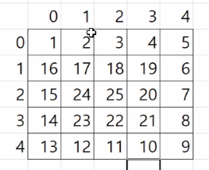

## 9.9

**10진수를 16진수로 변환**

**출력**

```
75BCD15
```

**코드**

```java
int number = 123456789;
String result = "";

while (number > 0) {
    String[] arr = {"A", "B", "C", "D", "E", "F"};
    int remainder = number % 16;

    if (remainder > 9) result = arr[remainder % 10] + result;
    else result = remainder + result;
    number /= 16;
}
System.out.println(result);
```

**배열복사**

```java
System.arraycopy(src, srcPos, dest, destPos, length);
System.arraycopy(m, 0, temp, 0, m.length);
System.arraycopy(m, 1, temp, 2, 2);
```

m 배열의 index 1 부터 temp 배열의 index 2 부터 2개 붙여넣기 한다.

**정렬**

- 선택
- 삽입
- 버블
- 병합
- 퀵
- 힙

**버블정렬**

서로 이웃한 데이터들을 비교하며 가장 큰 데이터를 가장 뒤로 보내는 정렬

```java
public class Ex04 {
	public static void main(String[] args) {
		int[] m = {3, 5, 2, 4, 1};
		bubbleSort(m);
		System.out.println(Arrays.toString(m));
	}

	private static void bubbleSort(int[] m) {
		for (int i = 0; i < m.length - 1; i++) {
			for (int j = 0; j < 4 - i; j++) {
				if (m[j] > m[j + 1]) {
					int temp = m[j];
					m[j] = m[j + 1];
					m [j + 1] = temp;
				}
			}
		}
	}
}
```

**삽입정렬**

```java
private static void selectionSort(int[] m) {
    for (int i = 0; i < m.length; i++) {
        for (int j = i + 1; j < m.length; j++) {
            System.out.printf("%d-%d ", i, j);
            if (m[i] > m[j]) {
                int temp = m[i];
                m[i] = m[j];
                m[j] = temp;
            }
        }
        System.out.println();
    }
}
```

> 배열에도 ++ 가 적용된다. ex) `arr[i]++`

> boolean 형의 기본 값은 false 이다.

**String -> char[ ] 형변환 및 char[ ] String 형변환**

문자열을 char[ ] 배열로 바꾸기

```java
private static char[] toCharArray(String str) {
    char[] chArr = new char[str.length()];

    for (int i = 0; i < str.length(); i++) {
        chArr[i] = str.charAt(i);
    }
    return chArr;
}
```

`str.toCharArray()`

char[ ] 배열을 문자열로 바꾸기

```java
String name = new String(chArr);
```

**다차원 배열**

> `arr.length` 다차원일 경우 배열의 크기가 아니라 행의 크기를 반환한다.

**3차원 배열 출력 함수**

```java
private static void dispM(int[][][] m) {
    for (int i = 0; i < m.length; i++) {
        for (int j = 0; j < m[i].length; j++) {
            for (int k = 0; k < m[i][j].length; k++) {
                System.out.printf("m[%d][%d][%d]=%d ", i, j, k, m[i][j][k]);
            }
            System.out.println();
        }
        System.out.println();
    }
}
```

**로또 이차원배열에 넣기**

결과

```
> 게임횟수 입력 ? 5
[16, 3, 1, 14, 7, 6]
[41, 20, 21, 40, 6, 9]
[4, 39, 31, 18, 2, 18]
[31, 25, 10, 40, 26, 15]
[13, 38, 25, 35, 36, 13]
```

코드

```java
public class Ex13_02 {
	public static void main(String[] args) {
		Scanner scanner = new Scanner(System.in);
		int gameNumber = 1;
		System.out.print("> 게임횟수 입력 ? ");
		gameNumber = scanner.nextInt();
		int[][] lottos = new int[gameNumber][6];
		
		fillLotto(lottos);
		
		for (int[] arr : lottos) {
			System.out.println(Arrays.toString(arr));
		}
	}
	
	static void fillLotto(int[][] lottos) {
		for (int i = 0; i < lottos.length; i++) {
			for (int j = 0; j < 6; j++) {
				lottos[i][j] = (int) (Math.random() * 45) + 1;
			}
		}
	}
}
```

> 2차원 배열을 for-each 하면 arr\[0]\[i], arr\[1]\[i], arr\[2]\[i] 가 반환된다.

**1차로 로또번호를 채우는 함수로 2차원 배열 만들기**

결과

```
> 게임횟수 입력 ? 3
[3, 28, 10, 9, 5, 12]
[32, 33, 4, 29, 2, 37]
[24, 7, 14, 3, 27, 23]
```

코드

```java
public class Ex13_02 {
	public static void main(String[] args) {
		Scanner scanner = new Scanner(System.in);
		int gameNumber = 1;
		System.out.print("> 게임횟수 입력 ? ");
		gameNumber = scanner.nextInt();
		int[][] lottos = new int[gameNumber][6];
		
		for (int i = 0; i < gameNumber; i++) {
			fillLottoOne(lottos[i]);
		}
		
		for (int[] arr : lottos) {
			System.out.println(Arrays.toString(arr));
		}		
	}
	
	public static boolean isDuplicateLottoCheck(int[] lotto, int idx, int n) {
		for (int i = 0; i < lotto.length; i++) {
			if (lotto[i] == n) {
				return true;
			}
		}
		return false;
	}
	
	private static void fillLottoOne(int[] lotto) {
		int idx = 0;
		while (idx <= 5) {
			int n = (int) (Math.random() * 45 + 1);
			if (!isDuplicateLottoCheck(lotto, idx, n)) {
				lotto[idx] = n;
				idx ++;
			}
		}
	}
}
```

**2차원배열을 1차원배열로 옮기기**

결과

```
[1, 2, 3, 4, 5, 6, 7, 8, 9, 10, 11, 12]
```

코드

```java
public class Ex14_02 {
	public static void main(String[] args) {
		int[][] m = {
				{1, 2, 3}, 
				{4, 5, 6}, 
				{7, 8, 9}, 
				{10, 11, 12} 
		};
		int rows = m.length;
		int cols = m[0].length;
		int[] n = new int[rows * cols];
		
		for (int i = 0, index = 0; i < m.length; i++) {
			for (int j = 0; j < m[0].length; j++, index++) {
				n[index] = m[i][j];
			}
		}
		
		System.out.println(Arrays.toString(n));
	}
}
```

**1차원배열을 2차원배열로 옮기기**

결과

```
[1, 2]
[3, 4]
[5, 6]
[7, 8]
[9, 10]
[11, 12]
```

코드

```java
public class Ex14_02 {
	public static void main(String[] args) {
		int[] n = {1, 2, 3, 4, 5, 6, 7, 8, 9, 10, 11, 12};
		int[][] m = new int[6][2];
		
		for (int i = 0, k = 0; i < m.length; i++) {
			for (int j = 0; j < m[0].length; j++, k++) {
				m[i][j] = n[k];
			}
		}
		
		for (int[] arr : m) {
			System.out.println(Arrays.toString(arr));
		}
	}
}
```

다른코딩

```java
for (int i = 0; i < n.length; i++) {
    m[i/2][i%2] = n[i];
}
```

## 9.10

> 디버그를 할 때는 문제가 없는 부분 이후에 break point 를 설정하고 디버그를 합니다.


**이중for문 숫자채우기**

출력 함수

```java
private static void dispM(int[][] m) {
    for (int i = 0; i < m.length; i++) {
        for (int j = 0; j < m[i].length; j++) {
            System.out.printf("[%02d]", m[i][j]);
        }
        System.out.println();
    }
    System.out.println();
}
```

출력

```
[01][02][03][04][05]
[10][09][08][07][06]
[11][12][13][14][15]
[20][19][18][17][16]
[21][22][23][24][25]
```


```java
for (int i = 0; i < m.length; i++) {
    for (int j = 0; j < m.length; j++) {
        if (i % 2 == 0) m[i][j] = 5*i + 1 + j;
        else m[i][j] = 5*i + 5 - j;
    }
}
```


```java
for (int i = 0; i < m.length; i++) {
    for (int j = 0; j < m.length; j++) {
        m[i][i%2==0 ? j : 4-j] = 5*i + j + 1;
    }
}
```

출력

```
[01][00][00][00][00]
[02][06][00][00][00]
[03][07][10][00][00]
[04][08][11][13][00]
[05][09][12][14][15]
```


```java
private static void fillM05(int[][] m) {
    for (int i = 0, k = 1; i < m.length; i++) {
        for (int j = i; j < m.length; j++) {
            m[j][i] = k++;
        }
    }
}
```

다른풀이

```java
private static void fillM05(int[][] m) {
    int k = 0;
    
    for (int i = 0; i < m.length; i++) {
        if (i >= 1)
            k += m.length - i;
        for (int j = i; j < m[i].length; j++)
            m[j][i] = k + j + 1;
    }
}
```

문제1. 대각선 채우기


문제2. 달팽이



**마방진**

```java
private static void fillMagicSquare(int[][] m) {
  int row = 0 , col= m[0].length/2 , n = 1;      

  while (n <= 25) {
     m[row][col]=n;         
     if ( n % m.length ==0 ) {
        row++;
     } else {
        col++;         row--;
     }         
     if( row < 0) row= m.length-1;
     else if( col > 4 ) col = 0;         
     n++;

     dispM(m);
  }
}
```

1. 같은문자 출력
2. 막대기 나누기

5문제 풀기

