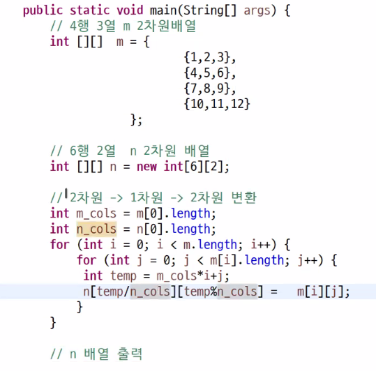
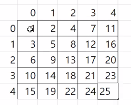
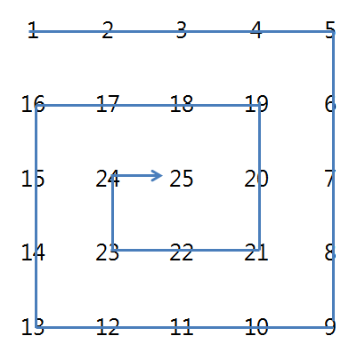
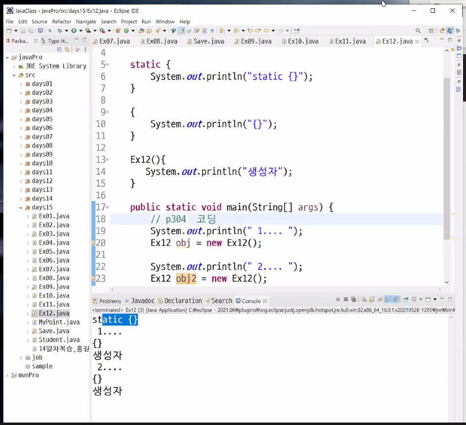

## 9.9

**10진수를 16진수로 변환**

**출력**

```
75BCD15
```

**코드**

```java
int number = 123456789;
String result = "";

while (number > 0) {
    String[] arr = {"A", "B", "C", "D", "E", "F"};
    int remainder = number % 16;

    if (remainder > 9) result = arr[remainder % 10] + result;
    else result = remainder + result;
    number /= 16;
}
System.out.println(result);
```

**배열복사**

```java
System.arraycopy(src, srcPos, dest, destPos, length);
System.arraycopy(m, 0, temp, 0, m.length);
System.arraycopy(m, 1, temp, 2, 2);
```

m 배열의 index 1 부터 temp 배열의 index 2 부터 2개 붙여넣기 한다.

**정렬**

- 선택
- 삽입
- 버블
- 병합
- 퀵
- 힙

**버블정렬**

서로 이웃한 데이터들을 비교하며 가장 큰 데이터를 가장 뒤로 보내는 정렬

```java
public class Ex04 {
	public static void main(String[] args) {
		int[] m = {3, 5, 2, 4, 1};
		bubbleSort(m);
		System.out.println(Arrays.toString(m));
	}

	private static void bubbleSort(int[] m) {
		for (int i = 0; i < m.length - 1; i++) {
			for (int j = 0; j < 4 - i; j++) {
				if (m[j] > m[j + 1]) {
					int temp = m[j];
					m[j] = m[j + 1];
					m [j + 1] = temp;
				}
			}
		}
	}
}
```

**삽입정렬**

```java
private static void selectionSort(int[] m) {
    for (int i = 0; i < m.length; i++) {
        for (int j = i + 1; j < m.length; j++) {
            System.out.printf("%d-%d ", i, j);
            if (m[i] > m[j]) {
                int temp = m[i];
                m[i] = m[j];
                m[j] = temp;
            }
        }
        System.out.println();
    }
}
```

> 배열에도 ++ 가 적용된다. ex) `arr[i]++`

> boolean 형의 기본 값은 false 이다.

**String -> char[ ] 형변환 및 char[ ] String 형변환**

문자열을 char[ ] 배열로 바꾸기

```java
private static char[] toCharArray(String str) {
    char[] chArr = new char[str.length()];

    for (int i = 0; i < str.length(); i++) {
        chArr[i] = str.charAt(i);
    }
    return chArr;
}
```

`str.toCharArray()`

char[ ] 배열을 문자열로 바꾸기

```java
String name = new String(chArr);
```

**다차원 배열**

> `arr.length` 다차원일 경우 배열의 크기가 아니라 행의 크기를 반환한다.

**3차원 배열 출력 함수**

```java
private static void dispM(int[][][] m) {
    for (int i = 0; i < m.length; i++) {
        for (int j = 0; j < m[i].length; j++) {
            for (int k = 0; k < m[i][j].length; k++) {
                System.out.printf("m[%d][%d][%d]=%d ", i, j, k, m[i][j][k]);
            }
            System.out.println();
        }
        System.out.println();
    }
}
```

**로또 이차원배열에 넣기**

결과

```
> 게임횟수 입력 ? 5
[16, 3, 1, 14, 7, 6]
[41, 20, 21, 40, 6, 9]
[4, 39, 31, 18, 2, 18]
[31, 25, 10, 40, 26, 15]
[13, 38, 25, 35, 36, 13]
```

코드

```java
public class Ex13_02 {
	public static void main(String[] args) {
		Scanner scanner = new Scanner(System.in);
		int gameNumber = 1;
		System.out.print("> 게임횟수 입력 ? ");
		gameNumber = scanner.nextInt();
		int[][] lottos = new int[gameNumber][6];
		
		fillLotto(lottos);
		
		for (int[] arr : lottos) {
			System.out.println(Arrays.toString(arr));
		}
	}
	
	static void fillLotto(int[][] lottos) {
		for (int i = 0; i < lottos.length; i++) {
			for (int j = 0; j < 6; j++) {
				lottos[i][j] = (int) (Math.random() * 45) + 1;
			}
		}
	}
}
```

> 2차원 배열을 for-each 하면 arr\[0]\[i], arr\[1]\[i], arr\[2]\[i] 가 반환된다.

**1차로 로또번호를 채우는 함수로 2차원 배열 만들기**

결과

```
> 게임횟수 입력 ? 3
[3, 28, 10, 9, 5, 12]
[32, 33, 4, 29, 2, 37]
[24, 7, 14, 3, 27, 23]
```

코드

```java
public class Ex13_02 {
	public static void main(String[] args) {
		Scanner scanner = new Scanner(System.in);
		int gameNumber = 1;
		System.out.print("> 게임횟수 입력 ? ");
		gameNumber = scanner.nextInt();
		int[][] lottos = new int[gameNumber][6];
		
		for (int i = 0; i < gameNumber; i++) {
			fillLottoOne(lottos[i]);
		}
		
		for (int[] arr : lottos) {
			System.out.println(Arrays.toString(arr));
		}		
	}
	
	public static boolean isDuplicateLottoCheck(int[] lotto, int idx, int n) {
		for (int i = 0; i < lotto.length; i++) {
			if (lotto[i] == n) {
				return true;
			}
		}
		return false;
	}
	
	private static void fillLottoOne(int[] lotto) {
		int idx = 0;
		while (idx <= 5) {
			int n = (int) (Math.random() * 45 + 1);
			if (!isDuplicateLottoCheck(lotto, idx, n)) {
				lotto[idx] = n;
				idx ++;
			}
		}
	}
}
```

**2차원배열을 1차원배열로 옮기기**

결과

```
[1, 2, 3, 4, 5, 6, 7, 8, 9, 10, 11, 12]
```

코드

```java
public class Ex14_02 {
	public static void main(String[] args) {
		int[][] m = {
				{1, 2, 3}, 
				{4, 5, 6}, 
				{7, 8, 9}, 
				{10, 11, 12} 
		};
		int rows = m.length;
		int cols = m[0].length;
		int[] n = new int[rows * cols];
		
		for (int i = 0, index = 0; i < m.length; i++) {
			for (int j = 0; j < m[0].length; j++, index++) {
				n[index] = m[i][j];
			}
		}
		
		System.out.println(Arrays.toString(n));
	}
}
```

**1차원배열을 2차원배열로 옮기기**

결과

```
[1, 2]
[3, 4]
[5, 6]
[7, 8]
[9, 10]
[11, 12]
```

코드

```java
public class Ex14_02 {
	public static void main(String[] args) {
		int[] n = {1, 2, 3, 4, 5, 6, 7, 8, 9, 10, 11, 12};
		int[][] m = new int[6][2];
		
		for (int i = 0, k = 0; i < m.length; i++) {
			for (int j = 0; j < m[0].length; j++, k++) {
				m[i][j] = n[k];
			}
		}
		
		for (int[] arr : m) {
			System.out.println(Arrays.toString(arr));
		}
	}
}
```

다른코딩

```java
for (int i = 0; i < n.length; i++) {
    m[i/2][i%2] = n[i];
}
```

## 9.10

> 디버그를 할 때는 문제가 없는 부분 이후에 break point 를 설정하고 디버그를 합니다.



**이중for문 숫자채우기**

출력1

```
[01][02][03][04][05]
[10][09][08][07][06]
[11][12][13][14][15]
[20][19][18][17][16]
[21][22][23][24][25]
```

코드

```java
private static void dispM(int[][] m) {
    for (int i = 0; i < m.length; i++) {
        for (int j = 0; j < m[i].length; j++) {
            System.out.printf("[%02d]", m[i][j]);
        }
        System.out.println();
    }
    System.out.println();
}
```

출력2

```
[01][02][03][04][05]
[10][09][08][07][06]
[11][12][13][14][15]
[20][19][18][17][16]
[21][22][23][24][25]
```

코드

```java
for (int i = 0; i < m.length; i++) {
    for (int j = 0; j < m.length; j++) {
        if (i % 2 == 0) m[i][j] = 5*i + 1 + j;
        else m[i][j] = 5*i + 5 - j;
    }
}
```

다른코딩

```java
for (int i = 0; i < m.length; i++) {
    for (int j = 0; j < m.length; j++) {
        m[i][i%2==0 ? j : 4-j] = 5*i + j + 1;
    }
}
```

출력3

```
[01][00][00][00][00]
[02][06][00][00][00]
[03][07][10][00][00]
[04][08][11][13][00]
[05][09][12][14][15]
```

코드

```java
private static void fillM05(int[][] m) {
    for (int i = 0, k = 1; i < m.length; i++) {
        for (int j = i; j < m.length; j++) {
            m[j][i] = k++;
        }
    }
}
```

다른풀이

```java
private static void fillM05(int[][] m) {
    int k = 0;
    
    for (int i = 0; i < m.length; i++) {
        if (i >= 1)
            k += m.length - i;
        for (int j = i; j < m[i].length; j++)
            m[j][i] = k + j + 1;
    }
}
```

문제1. 대각선 채우기



**문제2. 달팽이**



출력

```
[01][02][03][04][05]
[16][17][18][19][06]
[15][24][25][20][07]
[14][23][22][21][08]
[13][12][11][10][09]
```

코드

```java
private static void fillSnail(int[][] m) {
    int row = 0;
    int col = -1;
    int loop = m.length;
    int n = 1;
    boolean sw = true;

    while (loop != 0) {
        for (int i = 0; i < loop; i++) {
            col += sw ? 1 : -1;
            m[row][col] = n++;
        }

        loop--;
        for (int i = 0; i < loop; i++) {
            row += sw ? 1 : -1;
            m[row][col] = n++;
        }
        sw = !sw;
    }
}
```

출력포함 전체코드

```java
public class Main {
	public static void main(String[] args) {
		int[][] m = new int[5][5];
		fillSnail(m);
		dispM(m);
	}

	private static void fillSnail(int[][] m) {
		int row = 0;
		int col = -1;
		int loop = m.length;
		int n = 1;
		boolean sw = true;

		while (loop != 0) {
			for (int i = 0; i < loop; i++) {
				col += sw ? 1 : -1;
				m[row][col] = n++;
			}

			loop--;
			for (int i = 0; i < loop; i++) {
				row += sw ? 1 : -1;
				m[row][col] = n++;
			}
			sw = !sw;
		}
	}

	private static void dispM(int[][] m) {
		for (int i = 0; i < m.length; i++) {
			for (int j = 0; j < m[i].length; j++) {
				System.out.printf("[%02d]", m[i][j]);
			}
			System.out.println();
		}
		System.out.println();
	}
}
```

**마방진**

```java
private static void fillMagicSquare(int[][] m) {
  int row = 0 , col= m[0].length/2 , n = 1;      

  while (n <= 25) {
     m[row][col]=n;         
     if ( n % m.length ==0 ) {
        row++;
     } else {
        col++;         row--;
     }         
     if( row < 0) row= m.length-1;
     else if( col > 4 ) col = 0;         
     n++;

     dispM(m);
  }
}
```

1. 같은문자 출력
2. 막대기 나누기

5문제 풀기

## 9.13

`Arrays.sort(Array)` 정렬 메소드

`str = new String(charArray)` 문자열로 바꾸기

`str.toCharArray()` char array 로 변환

`str.equals(String)` 문자열 비교
**막대 자르기**

로직1.

```
 * 1. 막대 수 N 입력받아 N 의 길이만큼 배열 생성
 * 2. 막대의 길이 1번 배열에 저장
 * 1. 2. 값 1~1000 사이의 값 인지 확인
 * 3. 가장 작은 막대의 길이 찾기
 * 4. 가장 작은 막대의 길이로 모든 막대 자르기
 * 5. 0인 막대 버리고 새로운 배열 만들어 남은 막대 수 출력
 * 3~5 반복
```

로직2. 새로운 배열을 만들지 않고 0 보다 큰 수만 카운트한다.

로직3. 혹은 오름차순 정렬해서 인덱스 반환

**로직3**

```java
Scanner sc = new Scanner(System.in);
int n = sc.nextInt();
int [] sticks = new int[n];

for (int i = 0; i < sticks.length; i++) {
    sticks[i] = sc.nextInt();
}

Arrays.sort(sticks);

int idx = 0;
int value;
do {
    System.out.println(n - idx);
    value = sticks[idx];
    while (value == sticks[++idx]);
} while (idx < n);
```

Q. 조건문 (if, for, while) 안의 증감연산자?

A. 

**합 출력**

마지막 열과 마지막 행에 합을 출력한다.

출력

```
[01][02][03][04][10]
[05][06][07][08][26]
[09][10][11][12][42]
[13][14][15][16][58]
[28][32][36][40][136]
```

코드

```java
private static void fillM(int[][] m) {
    int lastIdx = m.length - 1;

    for (int i = 0; i < m.length - 1; i++) {
        for (int j = 0; j < m.length - 1; j++) {
            m[i][j] = lastIdx * i + j + 1;
            m[i][lastIdx] += m[i][j];
            m[lastIdx][j] += m[i][j];
            m[lastIdx][lastIdx] += m[i][j];
        }
    }
}
```

**가변배열**

```java
String[][] names = new String[3][];
names[0] = new String[12];
names[1] = new String[30];
names[2] = new String[21];
```

마지막 열은 배열의 크기를 다르게 할 수 있다.

220p ex5-20, 21, 22 풀어보기

**객체지향**

Object Oriented Programming (OOP)

특징 (다은상추캡)

1. 상속성
2. 다형성
3. 추상화
4. 캡슐화
5. 은닉화

클래스: 객체의 설계도, 객체를 정의해놓은 것 (객정)

객체: 실제로 존재하는 것. 사물 또는 개념, 유형, 뮤형의 객체

인스턴스: 만들어진 객체를 그 클래스의 인스턴스라고 한다.

인스턴스화: 객체를 만드는 과정

객체의 구성요: 속성 + 기능

속성(property): 멤버변수, 필드(field), 특성(attribute), 상태

기능(function): 멤버함수, 메서드(method)

클래스를 설계하는 과정 (요목설테 유상버)

1. 객체의 요구, 분석
2. 객체의 구성요소 파악 -> 목록작성
3. 클래스 선언 (정의, 설계)
4. 객체 생성 + 테스트
5. 문제점 -> 유지, 보수
6. 상용화
7. 기능 추가, 문제점 보완 - 버전관리

\[클래스 선언 형식]

접근지정자 기타제어자 class 클래스명 \[extends 부모클래스] \[implements 인터페이스...]

\[자바 자료형] = 참조형

접근지정자 종류

1. public: 패키지 내부/외부 어디서든 \[상속] 과 참조가능
2. default: 패키지 내부에서만 \[상속]과 참조가능
3. protected: 패키지 내부에서만 상속과 참조가능
4. private: 같은 파일 내에서만 상속과 참조가능

protected 와 private 는 독립적으로 클래스 선언 할 수 없다.

중첩으로 클래스 선언 할 수 있다.

기타제어자 종류

1. abstract: 추상 클래스
2. final: 최종 클래스
3. static: 정적 클래스

\[클래스 -> 객체 생성하는 방법 (형식)]

```java
클래스자료형 변수명 = new 클래스자료형();
```

객체: 클래스를 자료형으로 선언된 참조변수 (클자선참)

**객체**

객체생성

```java
MyPoint[] points = {
    new MyPoint(),
    new MyPoint(),
    new MyPoint()
};
```

**생성자**

매개변수가 없는 생성자를 default constructor 라고 한다.

1. 역할: 필드를 초기화한다.

수업 5시에 끝나면 할 것

1. 교재 챕터 06 반드시 읽어보기

## 9.14

오답

가변배열: 마지막 차수의 길이를 지정하지 않고 각각 다른 크기의 배열로 지정할 수 있다.

**객체**

- static 클래스 변수: 클래스 당 한 개만 생성
- 인스턴수 변수: 인스턴스가 생성될 때마다 변수 생성

**복사&복제**

- 복사: 새로운 인스턴스를 만들지 않고 같은주소 참조
- 얕은복제: 새로운 인스턴스를 만들며 같은주소 참조
- 깊은복제: 새로운 인스턴스에 값만 복제

**가변인자**

`int...args` 로 인자를 여러개 받을 수 있다.

출력

```
3
6
10
45
```

코드

```java
public class Ex05 {
	public static void main(String[] args) {
		int result = sum(1, 2);
		System.out.println(result);
		
		result = sum(1, 2, 3);
		System.out.println(result);
		
		result = sum(1, 2, 3, 4);
		System.out.println(result);
		
		int[] m = {1, 2, 3, 4, 5, 6, 7, 8, 9};
		result = sum(m);
		System.out.println(result);
	}
	
	private static int sum(int...args) {
		int result = 0;
		for (int i : args) {
			result += i;
		}
		return result;
	}
}
```

**this**

정의: 클래스 자기 자신의 주소 값을 가지는 참조변수

3가지 용도

1. 멤버를 가리킬 때의 this
2. 생성자에서 또 다른 생성자를 호출할 때의 this
3. 단독으로 사용될 때의 this

**static**

공유 변수, 클래스 변수, static 변수, 정적 변수

사용법: `클래스명.클래스변수` 

클래스 메서드 == 정적 메서드 == static 메서드

**초기화 순서**



출력

```
static {}
1....
{}
생성자
2....
{}
생성자
```

코드

```java
public class Ex12 {
	static {
	System.out.println("static {}");
	}
	
	{
		System.out.println("{}");
	}
	
	Ex12() {
		System.out.println("생성자");
	}
	
	public static void main(String[] args) {
		System.out.println("1....");
		Ex12 obj = new Ex12();
		System.out.println("2....");
		Ex12 obj2 = new Ex12();
	}
}
```

**인스턴스 초기화 블럭 예제**

출력

```
제품번호: 1
제품번호: 2
제품번호: 3
제품번호: 4
제품번호: 5
제품번호: 6
제품번호: 7
제품번호: 8
제품번호: 9
제품번호: 10
```

코드

```java
public class Ex13 {
	public static void main(String[] args) {
		Product[] p = new Product[10];
		for (int i = 0; i < p.length; i++) {
			p[i] = new Product();
		}
		
		for (int i = 0; i < p.length; i++) {
			System.out.println("제품번호: " + p[i].serialNo);
		}
	}
}

class Product {
	static int count = 0;
	int serialNo;
	
    // 객체가 만들어질 때마다 실행된다.
	{
		++count;
		serialNo = count; // 두 코드의 위치를 바꾸면 제품번호는 0번부터 찍힌다.
	}
}
```

**예제2**

출력

```
문서 제목없음1 가 생성되었습니다.
문서 자바.txt 가 생성되었습니다.
문서 제목없음2 가 생성되었습니다.
문서 제목없음3 가 생성되었습니다.
```

코드

```java
public class Ex14 {
	public static void main(String[] args) {
		Document d1 = new Document();
		Document d2 = new Document("자바.txt");
		Document d3 = new Document();
		Document d4 = new Document();
	}
}

class Document {
	static int count = 0;
	String name; // 문서명
	
	Document() {
		this("제목없음" + ++count);
	}

	Document(String name) {
		this.name = name;
		System.out.println("문서 " + this.name + " 가 생성되었습니다.");
	}
}
```

멤버변수의 초기화 방법 

1. 명시적 초기화 `int age = 20;` 
2. 생성자
3. 초기화 블럭

- 인스턴스 초기화블럭
- 클래스 초기화블럭

멤버변수 == 필드 == 인스턴스 변수

> 인스턴스 변수는 초기화할 필요가 없지만 지역변수는 반드시 초기화해서 사용해야 한다.

초기화 블럭의 장점

1. 코드의 중복 제거
2. 코드의 신뢰성 향상
3. 오류 발생가능성의 감소

**예제**

모든 생성자에 count 를 넣는 대신에 초기화 블럭에 한번만 넣어줄 수 있다.

```java
// 초기화 블럭
{
    count++;
    serialNo = count;
}

Person() {
//     중복코드
//	   count++;
//	   serialNo = count;
}

Person(String name ,int age) {
//         중복코드
//		   count++;
//		   serialNo = count;
       //
       //
}
```

## 9.15

**JVM 메모리구조**

1. method area: 클래스에 대한 정보와 클래스변수를 저장한다.
2. heap: 인스턴스와 인스턴스변수를 저장한다.
3. call stack (execution stack): 메서드 작업에 필요한 메모리와 지역변수, 연산의 중간결과를 저장하고 메서드 작업이 끝나면 메모리공간은 반환되어 비워진다.

오답

4.변수의 3가지 종류에 대해 설명하세요.

1. 지역 변수
2. 인스턴스 변수
3. 클래스 변수

5-1. 인스턴스 변수의 초기화 되는 순으로 적으세요.
   기본값, 명시적초기화, 생성자 , 초기화 블럭

> 기본값 - 명시적초기화 - 초기화블럭 - 생성자

5-2. 클래스 변수의 초기화 되는 순으로 적으세요.
   기본값, 명시적초기화, 생성자 , 초기화 블럭

> 기본값 - 명시적초기화 - 초기화블럭

명시적 초기화 (explicit initialization)

explicit: 노골적인, 명백한, 명시적

`java.awt.Frame`

**창 생성**

```java
public class MyForm extends Frame {
	public MyForm() {
		this.setTitle("title");
		this.setSize(400, 400);
		this.setVisible(true);
	}
}
```

 `java.awt.event.WindowListener` 

윈도우창을 닫았을 때 이벤트

```java
@Override
public void windowClosing(WindowEvent e) {
    System.out.println("프로그램 종료!!!");
    System.exit(-1); // 창 닫기
}
```

메인

```java
this.addWindowListener(new MyFormWindowListener());
```

혹은

```java
this.addWindowListener(this);
```

**관계**

is - a 관계 (상속관계)

has - a 관계 (소속관계)

예) Engine 클래스가 Car 클래스 내부에 있음

Car 클래스

```java
Engine engine = new Engine();
```

결합력이 좋은 코딩은 좋은코딩이 아니다.

**상속관계**

정의: 기존클래스를 재사용하여 새로운 클래스를 생성하는 것

장점: 코드 재사용, 코드 중복 제거 -> 생산성, 유지보수에 좋다.

조상클래스 == 부모(parent) 클래스 == 상위(super) 클래스 == 기반(base) 클래스

> 생성자와 초기화블럭은 상속되지 않는다.
>
> 멤버 (필드와 메서드) 만 상속된다.

**Object**

`equals()`

`getClass()`

`hashCode()`

`notify()` 잠들어있던 스레드 중 임의로 하나를 골라 깨운다.

`notifyAll()` 잠들어있던 모든 스레드를 깨운다.

`wait()` 스레드를 잠들게 한다.

Q. 부모와 자식필드 모두 만드는 생성자 단축키는?

A. 

> final static 과 static final 둘은 위치가 바껴도 상관없다.

**final**

final class: 더 이상 자식을 생성할 수 없다.

final method: 더 이상 재정의(오버라이딩) 을 할 수 없다.

**상속**

재정의할 때는 리턴 자료형과 파라미터, throws 가 같아야 한다.

접근지정자는 부모보다 더 큰 지정자만 올 수 있다.

**수업 끝난 후**

복습 + \[챕터07] 읽기

**추상클래스&메서드**

추상메서드가 하나라도 있으면 불완전한 클래스이므로 객체를 생성할 수 가 없다.

그러므로 추상메서드를 사용하려면 추상클래스로 선언해야 한다.

**상속**

부모객체는 자식필드와 메서드에 접근할 수 없다.

자식객체는 오버라이딩한 부모메서드에 접근할 수 없다.

결과

```
p var: 1
parent method

p var: 1, c var: 2
overriding method
child method

p var: 1, c var: 2
overriding method
child method
```

```java
Parent p = new Parent();
Child c = new Child();
Parent pc = new Child();

System.out.printf("p var: %d\n", p.parentVar);
p.parentMethod();
System.out.println();

System.out.printf("p var: %d, c var: %d\n", c.parentVar, c.childVar);
c.parentMethod();
c.childMethod();
System.out.println();

System.out.printf("p var: %d, c var: %d\n", pc.parentVar, ((Child) pc).childVar);
pc.parentMethod();
((Child) pc).childMethod();
System.out.println();
```

## 9.16

오답

5-1. 추상메서드 설명

몸체 { } 가 구현이 되지않은 불완전한 메서드


상속의 장점: 코드 재사용 -> 생산성향상

유지, 보수, 확장 용이

자바는 다중상속을 지원하지 않는다.

오버라이딩 메서드

1. 이름이 같아야 한다.
2. 매개변수가 같아야 한다.
3. 반환타입이 같아야 한다.
4. 접근제어자는 부모클래스보다 크거나 같아야 한다.
5. 예외의 갯수는 적거나 같아야 한다.
6. static 이 없거나 있는데 그 반대로 만들 수 없다.

private - default - protected - public

> default 메서드를 오버라이딩해서 protected 로 선언할 수 있고 
>
> private 메서드는 오버라이딩 자체가 불가능하다.

> protected 변수는 메서드 내에서 this.protectedVar 로 사용한다.

**자동컴파일**

1. import java.lang.*
2. extends Object

**static import 구문**

```java
import static java.lang.Math.random;
```

라고 작성하면 

`Math.random()` 을 `random()` 으로만 작성해도 된다.

**제어자**

modifier

접근제어자: public, protected, default, private

그 외: static, fianl, abstract, native, transient, synchronized, volatile, strictfp

`native`

`transient`

`synchronized`

`volatile`

`strictfp`

추상메서드가 없는 추상클래스는 객체를 생성해서 사용하지 말라는 뜻이다.

> 업캐스팅된 것만 다운캐스팅할 수 있다.

**OOP 특징**

캡슐화&은닉화: 접근지정자를 통해 중요한 것이나 내부에서만 사용되는 것을 private 으로 선언하는 것

**싱글톤패턴**

```java
class Singleton {
	private static Singleton s;
	
	private Singleton() {
	}
	
	public static Singleton getInstance() {
		if (s == null) {
			s = new Singleton();
		}
		return s;
	}
}
```

1. private static Singleton 필드
2. private 생성자
3. public static 함수
4. if single == null 이면 new Singleton() return single

추상클래스 정의: 미완성된 설계도

**인터페이스**

1. 모든 멤버변수는 public static final 이고 생략이 가능하다.
2. 생략된 메서드는 public abstract 이고 생략이 가능하다.
3. JDK 1.8 부터는 static 혹은 default 메서드도 구현이 가능하다.
4. 인터페이스한테만 상속받을 수 있다.
5. 클래스와 다르게 다중상속이 가능하다.
6. 객체 instanceof 인터페이스 도 가능하다.

수업 끝난 후

1. Ex10번 타이핑 받아두기
2. interface 멤버변수 메서드 테스트

**매개변수 다형성**

```java
static void allTypeParse(Parseable p) {
    p.parse(str);
}
```

인터페이스의 장점

1. 개발시간 단축
2. 표준화
3. 서로 관계없는 클래스를 관계맺어준다.
4. 독립적인 프로그래밍 가능

> 자동완성되는 super() 는 지우지 말자!!

## 9.17

오답

8.instanceof연산자를 사용할 때 주의할점은? 

상속관계를 먼저 파악하여 if -else if 구문을 사용할 때 자식부터 묻는다.

```java
if (instance instanceof Child) {}
else if (instance instanceof Parent) {}
```

싱글톤

1. private static 필드
2. private 생성자
3. public static 메서드

**익명클래스**

```java
    new 부모클래스() {
        // 부모클래스의 메서드만 오버라이딩
    };
    new 구현할인터페이스() {
        // 인터페이스의 추상메서드만 오버라이딩..
    };
```

```java
NewCar myCar = new NewCar(new IEngine() {
    @Override
    public void stop() {
        // TODO Auto-generated method stub

    }

    @Override
    public void moreFuel(int fuel) {
        // TODO Auto-generated method stub

    }

    @Override
    public void lessFuel(int fuel) {
        // TODO Auto-generated method stub
    }
}); 
```

**익명클래스를 활용한 폼 생성**

```java
class MyForm extends Frame {
	MyForm() {
		this.setTitle("새 폼");
		this.setSize(400, 400);
		this.setVisible(true);
		this.addWindowListener(new WindowListener() {
			
			@Override
			public void windowOpened(WindowEvent e) {
				// TODO Auto-generated method stub
				
			}
			
			@Override
			public void windowIconified(WindowEvent e) {
				// TODO Auto-generated method stub
				
			}
			
			@Override
			public void windowDeiconified(WindowEvent e) {
				// TODO Auto-generated method stub
				
			}
			
			@Override
			public void windowDeactivated(WindowEvent e) {
				// TODO Auto-generated method stub
				
			}
			
			@Override
			public void windowClosing(WindowEvent e) {
				System.out.println("프로그램 종료!!!");
				System.exit(-1);
			}
			
			@Override
			public void windowClosed(WindowEvent e) {
				// TODO Auto-generated method stub
				
			}
			
			@Override
			public void windowActivated(WindowEvent e) {
				// TODO Auto-generated method stub
				
			}
		});
	}
}
```

**WindowAdapter 클래스**

WindowListener 인터페이스와 다르게 빈 몸체이다.

필요한 메서드만 오버라이딩할 수 있다.

```java
class MyForm2 extends Frame {
	MyForm2() {
		this.setTitle("새 폼");
		this.setSize(400, 400);
		this.setVisible(true);
		this.addWindowListener(new WindowAdapter() {
			@Override
			public void windowClosing(WindowEvent e) {
				System.out.println("프로그램 종료!!!");
				System.exit(-1);
			}
		});
	}
}
```

**예외처리 (Exception Handling)**

프로그램 오류 - 

 * 프로그램 실행 중에 오작동, 비정상적으로 종료되는 결과의 원인.
 * 2. 에러 (오류)
 * 1) 발생 시점 - 컴파일 에러, 런타임(실행) 에러

**런타임에러**

1. 컴퓨터의 하드웨어 오작동
2. 예외 (Exception) - 프로그램 코드에 의해서 수습될 수 있는 다소 미약한 오류

예시

```java
int i = 10;
int[] m = null;
m[0] = 100;
System.out.println(m[0]);
```

```java
int i = 0, j = 100;
int result = j / i;
System.out.println(result);
```

**논리적에러 - 실행은 되지만 의도와 다르게 동작하는 것**

출력

```
-2147483549
```

코드

```java
int i = Integer.MAX_VALUE;
int j = 100;
long l = i + j;
System.out.println(l);
```

자바에서 런타임 (실행) 시 발생할 수 있는 오류

1. 에러 (Error) - 메모리부족, 스택오버플로우 심각한 오류
2. 예외 (Exception) - 수습될 수 있는 비교적 덜 심각한 오류

자바는 예외클래스의 계층구조가 있다.

모든 클래스의 최상위 부모클래스: Object

Object

​	Throwable 인터페이스

​		Exception 클래스

​		Error 클래스

모든 예외의 부모클래스는 Exception 클래스이다.

> if 문은 예외처리라고 하지 않는다.

**예외처리 방법**

1. try - catch 문
2. throws 문

> catch 블럭에서 자식을 위에 먼저 선언한다.

try 블록안에 try - catch 를 넣을 수 있고, catch 블록안에 try - catch 를 넣을 수 있다.

**멀티 catch 블럭**

JDK 1.7 부터 가능하다.

```java
catch (ExceptionA | ExceptionB e) {}
```

> A 예외와 B 예외가 부모자식관계이면 사용할 수 없다.

**예외발생 시키기**

`throw` 개발자가 고의로 예외를 발생시킬 수 있다.

> 컴파일러가 예외처리를 확인하지 않는 RuntimeException 은 try - catch 가 필요없지만 IOException 은 try - catch 가 필요하다.

**복습**

예외처리 throws 

**finally 블록**

꼭 필요하지 않다.

예외가 발생유무에 상관없이 꼭 처리해야할 구문을 finally 블럭에 코딩한다.

```java
finally {
//			파일.close();
//			DB.close();
}
```

**자동자원 반환**

try - catch 문의 변형 -> try - with - resources 문

try 의 괄호에 (자원) 을 넣어서 자동으로 scanner 를 닫는다.

finally 에 scanner.close() 를 작성할 필요가 없다.

```java
try (Scanner scanner = new Scanner(System.in)) {
    System.out.print("> 국어 점수 입력 ? ");
    int kor = scanner.nextInt();
    System.out.println(kor);
} catch (Exception e) {
    e.printStackTrace();
}
```

`FileReader`

`fr.`

- `read()`
- `close()`

**파일 읽어서 출력**

출력

```
package days18;

public class Ex01 {
	public static void main(String[] args) {
		
	}

}
 = END = 
```

코드

```java
String fileName = "C:\\class\\javaClass\\javaPro\\src\\days18\\Ex01.java";
FileReader  fr = null;

try {
    fr = new FileReader(fileName);
    int n;

    while ((n = fr.read()) != -1) {
        System.out.print((char) n);
    }
} catch (FileNotFoundException e) {
    e.printStackTrace();
} catch (IOException e) {
    e.printStackTrace();
} finally {
    try {
        fr.close();
    } catch (IOException e) {
        e.printStackTrace();
    }
}

System.out.println(" = END = ");
```

BufferedReader 는 저장기능이 있어 System.in.read 와 다르게 줄 단위로 출력할 수 있다.

FileReader 는 부모가 Reader 이다.

**try - with - resources 를 활용한 FileReader**

> 파일확장자 (java) 를 꼭 붙여야 한다!!

**개선된 코드**

```java
try {
    FileReader fr = new FileReader("C:\\class\\javaClass\\javaPro\\src\\days18\\Ex05.java");
    BufferedReader br = new BufferedReader(fr);
    String line;

    for (int i = 1; (line = br.readLine()) != null; i++) {
        System.out.printf("%d: %s\n", i, line);
    }
} catch (Exception e) {
    e.printStackTrace();
}
```

**코드** 

```java
String fileName = "C:\\class\\javaClass\\javaPro\\src\\days18\\Ex01.java";

try (FileReader  fr = new FileReader(fileName);
        BufferedReader br = new BufferedReader(fr);) {
    String line;
    int lineNumber = 1;

    while ((line = br.readLine()) != null) {
        System.out.printf("%d: %s\n", lineNumber++, line);
    }
} catch (FileNotFoundException e) {
    e.printStackTrace();
} catch (IOException e) {
    e.printStackTrace();
}

System.out.println(" = END = ");
```

`super(message)` Exception 에서 메세지를 받는다.

**Score**

```java
class Score {
	private int kor;

	public int getKor() {
		return kor;
	}

	public void setKor(int kor) throws ScoreOutOfBoundException {
		if (0 <= kor && kor <= 100) {
			this.kor = kor;
		} else {
			throw new ScoreOutOfBoundException("국어 점수 벙위 벗어남.(0~100)", 1008);
		}
	}
}
```

**커스텀 예외**

```java
public class ScoreOutOfBoundException extends Exception {
	private final int ERR_CODE;

	public int getERR_CODE() {
		return ERR_CODE;
	}
	
	public ScoreOutOfBoundException(int err_code) {
		ERR_CODE = err_code;
	}
	public ScoreOutOfBoundException(String message, int err_code) {
		super(message);
		ERR_CODE = err_code;
	}
}
```

**java.lang 패키지**

자바프로그램할 때 가장 기본이 되는 클래스

- 최상위 클래스가 Object: 필드 X, 메서드 11개

hashCode(): 인스턴스의 고유한 값

equals(): 인스턴스가 다르면 false

value 가 같으면 true 나오게 equals 재정의

Q. 객체의 == 와 equals() ?

A. 

`getClass().getName()` fullName 을 반환한다.

`toString()` getName()@hashCode() 를 16진수로 바꾼 것

**toString()**

```java
String info = String.format("%s@%s", clsInfo.getName(), Integer.toHexString(v1.hashCode()));
System.out.println(info);
```

**공변 반환타입**

p.457

JDK 1.5 부터 추가되었다.

오버라이딩할 때 조상메서드의 반환타입을 자손클래스의 타입으로 반환하는 것을 허용하는 것

```java
public Point clone() {
    Point obj = null;
    try {
        obj = (Point) super.clone();
    } catch (Exception e) {}
    return obj;
}
```

>  배열은 객체와 다르게 Cloneable 인터페이스를 구현하지 않아도 된다.

## 9.23

오답

3-4. 다중 catch 문과 멀티 catch 문에 대해 설명하세요.
	  사용시 주의할 점 ?

A. 멀티캐치: JDK 1.7 에서 생겼다. or 연산자로 하나의 캐치문에 여러 예외를 넣을 수 있다. 

주의: 

4-1. 아래 코딩의 결과를 적으세요.

- `e.printStackTrace()`
- `e.getMessage()`
- `e.toString()`

7-1. try~with-resources 문을 사용해서 day18.Ex05.java 파일을 읽어서 출력하는 코딩
( 라인번호 붙여서 출력 )

JDK 1.7 에서 생겼다.

close 가 필요없다.

8-1. 사용자 정의 예외 만들기에 대해서 설명하시고 예외 클래스를 만들어 보세요.

> 배열은 Cloneable 인터페이스를 구현할 필요가 없다.

**p.463 \[클래스 객체를 얻는 방법]**

1. c.getClass()
2. Card.class
3. Class.forName("days19.Card")

`Card.class`

`c.getClass()` 

```java
//		Card c = new Card("HEART", 3);
//		Class cls = Card.class;
//		System.out.println(cls.getName());
//		try {
//			Card c = (Card) cls.newInstance();
//		} catch (InstantiationException | IllegalAccessException e) {
//			// TODO Auto-generated catch block
//			e.printStackTrace();
//		}

// JDBC 에서 사용
try {
    Class cls = Class.forName("days19.Card");
} catch (ClassNotFoundException e) {
    // TODO Auto-generated catch block
    e.printStackTrace();
}
```

**문자열 클래스**

- String
- StringBuffer
- String builder
- StringTokenizer

문자열은 문자열이 곧 주소이다.

**결과**

```
false
true
```

**코드**

```java
String name = new String("kenik");
String name2 = new String("kenik");
System.out.println(name == name2);
System.out.println(name.equals(name2));
```

**결과**

```
true
true
```

**코드**

```java
String name = "kenik";
String name2 = "kenik";
System.out.println(name == name2);
System.out.println(name.equals(name2));
```

> 반드시 문자열을 비교할 때는 `equals` 함수를 사용한다.

prefix: 접두사 (프리픽스)

suffix: 접미사 (서픽스)

**문자열의 몰랐던 함수들**

- `compareTo()`
- `concat()` concatenate: 연결시키다.
- `endsWith()`
- `equalsIgnoreCase()`
- `intern()`
- `startsWith()`

**CharSequence**

String 의 부모이다.

**문자열의 인덱스를 배열에 넣기**

```java
int idx = 0;
int size = 0;

while ((idx = name.indexOf("str", idx + 1)) != -1) size++;

int[] arr = new int[size];
idx = 0;

for (int i = 0; (idx = name.indexOf("str", idx + 1)) != -1; i++) arr[i] = idx;
System.out.println(Arrays.toString(arr));
```

`Arrays.fill(m, -1)` m 배열을 모두 -1 로 채운다.

**try - catch 코드**

```java
String name = "empty string empty string empty string";
int fromIndex = 0;
int idx = -1; 
int [] m = null;  // 6
int mIdx = 0;

while(  ( idx = name.indexOf("str", fromIndex) ) != -1) {  
 try { 
   m[ mIdx] = idx;
   mIdx++;
   fromIndex = idx + "str".length();
 }catch(NullPointerException e) {
   m = new int[1];   
 }catch(ArrayIndexOutOfBoundsException e) {
   int [] temp = new int[m.length + 1];   
   System.arraycopy(m, 0, temp, 0, m.length);
    m = temp;
 }
}     
System.out.println(Arrays.toString(m));
```

**정규표현식**

\[정규표현식] 검색...

과제: 비밀번호 8~15, 숫자 1개, 특수문자 (#@!$...) 1개, 알소 1개, 알대 1개...

> String 은 불변 (Imutable) 의 클래스이다.

**숫자를 문자열로 바꾸기**

1. str = i + ""
2. String.valueOf(i)
3. Integer.parseInt("100")

`String.join()`

delimeter: 구분자

`.` 현재위치는 패키지이름까지

**파일을 읽어서 파일생성**

```java
String fileName = ".\\src\\교육생명단.txt";
String[] names = new String[23];

try (FileReader fr = new FileReader(fileName); 
        BufferedReader br = new BufferedReader(fr)) {
    String line;
    int lineNumber = 1;
    int idx = 0;

    while ((line = br.readLine()) != null) {
        names[idx++] = line;
        System.out.printf("%d : %s\n", lineNumber++, line);
    }
} catch (Exception e) {
    e.printStackTrace();
}

String data = "<ul><li>" + String.join("</li><li>", names) + "</li></ul>";
fileName = ".\\src\\sample.htm";

try (FileWriter fw = new FileWriter(fileName);
        BufferedWriter bw = new BufferedWriter(fw)){
    bw.write(data);
} catch (Exception e) {
    e.printStackTrace();
}
System.out.println(" = END = ");
```

과제: p472 \[예제 StringJoiner 클래스]

9-14

9-15

9-16

StringBuffer vs StringBuilder

StringBuilder 는 멀티스레드에 안전 (동기화처리) 하다.

나노: 10^(-9) 초

`System.nanoTime()` 1900년 1월 1일부터

**처리시간**

**출력**

```
> 처리시간 : 5278219099ns
> 처리시간 : 4636601ns
```

**String**

```java
private static void testString() {
    long startTime = System.nanoTime();
    String sb = "a";

    for (int i = 0; i < 200000; i++) {
        sb += "a";
    }

    long endTime = System.nanoTime();
    System.out.println("> 처리시간 : " + (endTime - startTime) + "ns");
}
```

**StringBuffer**

```java
private static void testStringBuffer() {
    long startTime = System.nanoTime();
    StringBuffer sb = new StringBuffer("a");

    for (int i = 0; i < 200000; i++) {
        sb.append("a");
    }

    long endTime = System.nanoTime();
    System.out.println("> 처리시간 : " + (endTime - startTime) + "ns");
}
```

> String 은 값을 변경하기에 좋지않은 클래스이다.
>
> 속도가 1100배 차이난다.

**String vs StringBuffer 문자열 추가, 수정, 삭제**


