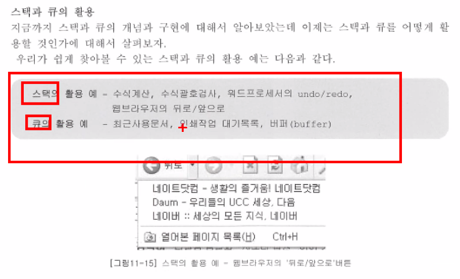
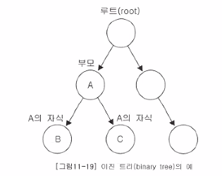
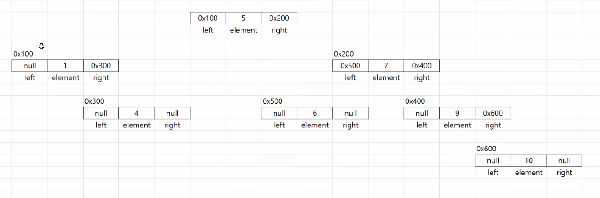
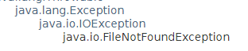
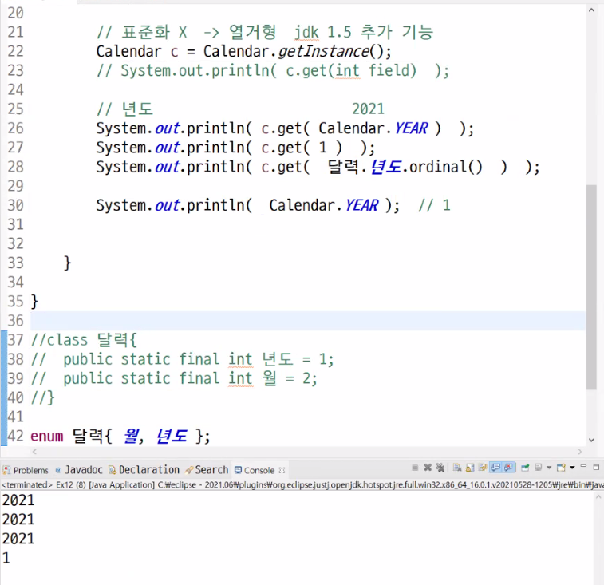
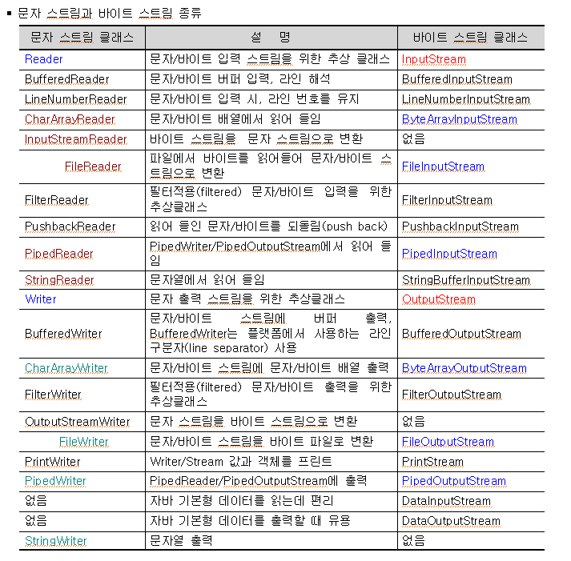

## 9.29

오답

3-1. 수업을  9시 정각에 시작 후 현재 몇 초가 지났나?

```java
LocalTime now = LocalTime.now();
LocalTime start = LocalTime.of(9, 0);
```

**until**

```java
System.out.println(start.until(now, ChronoUnit.SECONDS));
```

**Duration**

```java

```

3-2. 개강(21.8.18) 후 오늘까지 몇일이 지났나?

```java
LocalDate today = LocalDate.now();
LocalDate start = LocalDate.of(2021, 8, 18);
```

**until**

```java
System.out.println(start.until(today, ChronoUnit.DAYS));
```

**Period**

```java

```

4-1. 다음 주 토요일은 몇 일인가?

```java
LocalDate today = LocalDate.now();
LocalDate nxSa = today.with(TemporalAdjusters.next(DayOfWeek.SATURDAY));
System.out.println(nxSa);
```

8-1. java.time 패키지 클래스 사용.
년, 월, 일, 시간, 분, 초, 밀리세컨트 정보 출력. 

Q. 밀리세컨드를 출력하는 방법?

A. 


9-1. String source = "2021/9/29" 을 LocalDate 클래스로 형 변환 코딩.

`LocalDate.parse(String)` yyyy-MM-dd 형식만 받을 수 있다.

**replaceAll**

```java
LocalDate d = LocalDate.parse(source.replaceAll("/", "-"));
```

**DateTimeFormatter**

```java
LocalDate d = LocalDate.parse(source, DateTimeFormatter.ofPattern("yyyy/MM/dd"));
```

> 월이나 일이 한자리 수이면 에러가난다.

전체코드

```java
try (Scanner scanner = new Scanner(System.in);){
    System.out.printf("> 날짜 입력 (2019/09/15) ? ");
    String source = scanner.next();
    DateTimeFormatter formatter = DateTimeFormatter.ofPattern("yyyy/MM/dd");
    LocalDate d = LocalDate.parse(source, formatter);
    
    System.out.println(d);
} catch (Exception e) {
    e.printStackTrace();
}
```

**배열에서 김씨로 시작하는 요소 삭제**

```java
list.removeIf(i -> i.matches("김.+"));
```

> 제네릭의 타입이 Object 인 경우 String 으로 다운캐스팅하여 matches 함수를 사용해야 한다.

10-1. Scanner 클래스를 사용해서 날짜형식(2021/9/29)을 가진 문자열을 입력 
받아서 Calendar 형 변환 날짜 정보 출력.

String -> LocalDate -> Calendar

String -> Date, Calendar (SimpleDateFormatter)

**문자열 받기**

- `Date()` 
- `LocalDate()` 

11-1. 한 학생의 이,국,영,수,총,등 처리하는 2차원 또는 3차원 배열 수업 예제를 
ArrayList 컬렉션 클래스 사용해서 30명의 학생의 성적 처리하세요.

   ㄱ. class Student {}  클래스 선언
   ㄴ. 팀원들 학생 추가
   ㄷ. 학생 검색 기능 추가
   ㄹ. 학생 수정
   ㅁ. 학생 삭제
   ㅂ. 모든 학생 정보  출력 ( iterator 반복자 사용 ) 
   ㅅ. 학생 정렬 ( 번호순 또는 이름순 또는 성적순 )
   ㅁ. 입력받은 학생수 출력

**ㄱ.추가**

```java
for (int i = 0; i < list.size(); i++) {
    Student target = (Student) list.get(i);
}
```

**ㄷ. 검색**

```java
String searchName = "이창익";
ArrayList temp = (ArrayList) list.clone();
temp.removeIf(s -> !((Student) s).getName().equals(searchName));
if (temp.isEmpty()) System.out.println("찾는 학생은 없다.");
else temp.forEach(s -> System.out.println(s));
```

**ㄹ. 수정**

```java
list.set(3, new Student(4, "김창교", 100, 100, 100, 300, 1, 100.00));
```

**ㅁ. 삭제**

```java
int idx = 3;
list.remove(idx);
```

**ㅂ. 반복자**

```java
private static void printStudentList(List list) {
    Iterator ir = list.iterator();
    while (ir.hasNext()) {
        Student s = (Student) ir.next();
        System.out.println(s);
    }
}
```

**ㅅ. 학생정렬**

1. `Collections.sort()`
2. `List.sort()`
3. `Comparator` `Comparable` 

**Collections**

내림차순 정렬

```java
list.sort(Collections.reverseOrder());
// Collections.sort(list, Collections.reverseOrder()); 같은코드
```


**Comparator**

implements Comparable 의 compareTo 메서드

정의하고 `Collections.sort` 사용

implements Comparator 의 compare 메서드

`Integer.compare(x, y)` x == y 일 경우 0 반환. x < y 일 경우 -1 반환. x > y 일 경우 1 반환.

compareTo 의 반환값

**compareTo**

```java
@Overridepublic int compareTo(Object o) {    Student s2 = (Student) o;    return Integer.compare(this.getNo(), s2.getNo());//		return Integer.compare(this.getTot(), s2.getTot());//		return this.getName().compareTo(s2.getName());}
```


```java
list.sort(Comparator.comparingDouble(i -> ((Student) i).getAvg()));
```

Q. 함수는 static 만 쓸 수 있을까? getAvg() 처럼 파라미터가 없으면 쓸 수 없을까?

A.

---

**String**

`Serialize` 직렬화

**p.588 [Vector 컬렉션 클래스]**

List, Cloneable

생성자 4개

- `Vector()` 초기용량은 10개
- `Vector(Collection)`
- `Vector(int initialCapacity)` 
- `Vector(int initialCapacity, increment)`  

**vs ArrayList**

멀티스레드에 안전하다.

**v.**

- `addElement()` 동기화에 좋은 메서드. 
- `elementAt(index)` 
- `capacity()` 
- `trimToSize()` 요소갯수만큼 용량을 제거한다.
- `ensureCapacity(capacity)` 배열이 더 필요하면 int 까지 늘린다.
- `setSize(size)` size 를 int 로 바꾼다.

공부:  p.591 예제 11-4

p.595 알아두면 좋아요.

src.zip 파일 압축을 풀면 기본 클래스의  실제 소스코드를 볼 수있다.

**게시판 만들기**

1번페이지 - 10개 최신 게시글

글번호, 작성자, 제목, 내용, 작성일, 조회수 등등

`BoardVO` 

`BoardDTO` 

VO: (Value Object) 값을 담기위한 객체

DTO: 데이터 전송 객체 (Data Transfer Object) 데이터를 넘겨줄때 사용하는 객체.

서버 간에 데이터를 넘겨줄 때 객체에 담아 넘겨준다.

DAO: (Data Access Object) DB 연동해서 처리할 수 있는 기능이 구현된 클래스

MVC 패턴: Model - View - Controller 

**Enumeration 열거자**

출력

1. for 문
2. Iterator
3. Enumeration
4. foreach(함수)

출력을 위해 반복자 (Iterator) 나 열거자 (Enumeration) 어떤것을 사용해도 무방하다.

```java
Enumeration en = list.elements();
while (en.hasMoreElements()) {
    BoardVO vo = (BoardVO) en.nextElement();
    System.out.println(vo);
}
```

**Iterator vs Enumeration**

Iterator 는 fail-fast 이다.

fail - fast: 처리중에 수정, 삭제 등이 발생하면 예외를 발생시킨다.

내일문제: 반복자와 열거자의 차이점과 사용법

`firstElement()` == `get(0)` == `elementAt(0)` 

`lastElement()` == `get(list.size() - 1)` == `elementAt(list.size() - 1)`

**v.**

- `insertElementAt(element, index)` 

**LinkedList 컬렉션 클래스**

불연속적으로 존재하는 데이터를 서로 연결 (Link) 한 형태로 구성

**list.**

p.599 표 11-7

- `offer()` Deque 를 구현했기 때문에 사용가능
- `element()` 
- `getFirst()` `getLast()` 
- `pop()`
- `poll()` 한개씩 제거하면서 가져옵니다.
- `peek()` 제거하지 않고 값을 가져옵니다.
- `removeFirstOccurrence()` 

**poll**

출력

```
김창교
양시영
김희진
이희창
조영빈
```

코드

```java
while (!list.isEmpty()) System.out.println(list.poll());
```

Q. Deque 란?

A. 


**ArrayList 와 LinkedList 컬렉션 클래스 어느경우에 속도가 빠른지?**

p.600 예제 11-5

1. 순차적으로 추가하는 경우 Array 가 더 빠르다.
2. 중간에 데이터를 추가/삭제하는 경우에는 Linked 가 더 빠르다.

**p.604 [Stack 과 Queue]**

Queue <-> Deque

**stack.**

- `empty()` 비어있는지 불린반환
- `peek()` 맨 위에 저장된 객체 반환. 비어있으면 예외발생
- `pop()` 맨 위에 저장된 객체 꺼낸다. 비어있으면 예외발생
- `push()` 객체를 저장한다.
- `search(Object)` 찾으면 위치 반환. 못찾으면 -1 반환. 스택은 인덱스가 1부터 시작한다.

**queue.**

- `add(Object)` 성공여부를 불린반환
- `remove()` 객체 꺼내 반환. 비어있으면 예외발생
- `element()` 삭제없이 요소를 읽어온다. 없으면 예외발생
- `offer()` 객체저장. 성공여부 불린반환
- `poll()` 객체 꺼내며 반환. 비어있으면 null 반환
- `peek()` 삭제없이 요소를 읽어온다. 비어있으면 null 반환

> Stack 은 꺼낼 때 비어있는지 꼭 확인할 것!!

push: 넣다.

pop: 터뜨리다.

peek: 훔쳐보다.

offer: 제공하다. 

poll: 득표하다.

## 9.30

2-1. ㄱ. Person 클래스 선언
 필드 name, age
	   생성자
	   getter,setter
	   toString() 재정의

ㄴ. Person 객체 팀원정보로 컬렉션 클래스에 저장 
ㄷ. 모든 Person  출력
ㄹ. 이름을 입력받아서 Person 객체 검색
ㅁ. 위에서 검색한 Person의 age 임의의 값으로 수정
ㅂ. 이름 오름차순으로 정렬해서 출력

ㅅ. forEach() 를 사용해서  Person 출력
ㅇ. removeIf()를 사용해서  "김"씨만 출력

출력

```
> 검색할 이름을 입력하세요 ? 문경록
권영훈 21
김길동 25
김현준 24
문경록 10
윤영선 22
조영빈 20
-----
김길동 25
김현준 24
```

코드

```java
public class Main {
	public static void main(String[] args) {
		ArrayList<Person> team = new ArrayList<>(); // ㄴ.
		team.add(new Person("홍길동", 20));
		team.add(new Person("이몽룡", 21));
		team.add(new Person("김춘향", 22));
		team.add(new Person("철수", 23));
		team.add(new Person("영희", 24));
		team.add(new Person("김길동", 25));
		
		try (Scanner sc = new Scanner(System.in);){
			System.out.print("> 검색할 이름을 입력하세요 ? ");
			String search = sc.next(); // ㄹ.
			for (Person p : team) if (p.getName().equals(search)) p.setAge(new Random().nextInt(30)); // ㅁ.
		} catch (Exception e) {
			e.printStackTrace();
		}
		team.sort(Comparator.comparing(Person::getName)); // ㅂ.
		team.forEach(System.out::println); // ㄷ. ㅅ.
		team.removeIf(it -> it.getName().matches("[^김].+")); // ㅇ.
		System.out.println("-".repeat(5));
		team.forEach(System.out::println); // ㄷ. ㅅ.
	}
}

class Person { // ㄱ.
	private String name;
	private int age;

	public Person(String name, int age) { 
		super();
		this.name = name;
		this.age = age;
	}

	public String getName() {
		return name;
	}

	public void setName(String name) {
		this.name = name;
	}

	public int getAge() {
		return age;
	}

	public void setAge(int age) {
		this.age = age;
	}

	@Override
	public String toString() {
		return name + " " + age;
	}
}
```

> 정규표현식에서 not ( ^ ) 을 사용하려면 대괄호 \[ ] 안에 넣는다. 예) \[^김].+

**Comparator**

```java
class ListDescndingComparator implements Comparator<Integer> {
	@Override
	public int compare(Integer o1, Integer o2) {
		return o1.compareTo(o2) * -1;
	}
}
```

---

**Queue**

Queue 와 Deque 는 인터페이스이므로 아래와 같이 선언한다.

```java
Queue<E> q = new LinkedList<>();
Deque<E> dq = new LinkedList<>();
```

공부: parallelStream 메서드

p.606 예제 11-8 \[Stack 직접 구현하기]

**스택과 큐의 활용** 



공부: p.610 예제 11-10, 11

**PriorityQueue**

```java
Queue<E> q = new PriorityQueue<>();
```

저장한 순서에 관계없이 우선순위가 높은 것부터 꺼내온다.

출력

```
1
2
3
4
5
```

코드

```java
Queue<Integer> q = new PriorityQueue<>();
q.offer(3);
q.offer(5);
q.offer(2);
q.offer(4);
q.offer(1);

while (!q.isEmpty()) {
    int n = q.poll();
    System.out.println(n);
}
```

> 숫자가 작은 것이 우선순위가 높다.
>
> != null 을 사용하려면 Integer 에 담아야 한다.

**Deque**

Double-Ended Queue

Queue 가 한 쪽 끝으로만 추가/삭제할 수 있다면 Deque 는 양쪽 끝에서 추가/삭제가 가능하다.

특징

1. 양쪽 끝에서 추가/추출이 가능하다.
2. 조상은 Queue
3. Deque 인터페이스를 구현한 컬렉션 클래스는 LinkedList, ArrayDeque 가 있다.

**dq.**

- `offerFirst()` `offerLast()`
- `pollFirst()` `pollLast()`

**p.614 \[Iterator, ListIterator]**

ListItereator 는 양방향 반복자이다.

```java
ListIterator<String> ir = list.listIterator();
while (ir.hasNext()) {
    String name = ir.next();
    System.out.println(name);
}
System.out.println("-".repeat(20));

while (ir.hasPrevious()) {
    String name = ir.previous();
    System.out.println(name);
}
```

> Enumeration 은 Iterator 의 구버전이므로 Iterator 를 사용하도록 한다.

p.624 Arrays 클래스: 배열기능구현 클래스

배열복사

`System.arraycopy()` 

`copyOf()`

`copyOfRange()`

배열 채우기

`fill()`

`setAll()` 

**p.626 \[parallelXXX(), spliterator(), stream()]**

`plarallelXXX()` 멀티스레드를 사용해서 보다 빠르게 처리하도록 구현된 메서드

예제 11-18

**p.628 \[Comparator 와 Comparable]**

예제 11-19

`String.CASE_INSENSITIVE_ORDER` Comparator 타입. 대소문자를 구분하지 않는다.

**출력**

```
[cat, Dog, lion, tiger]
```

**코드**

```java
String[] strArr = {"tiger", "cat", "Dog", "lion"};
Arrays.sort(strArr, String.CASE_INSENSITIVE_ORDER);
```

**compare**

```java
@Override
public int compare(String o1, String o2) {
    return o2.compareTo(o1);
}
```

같은코드

```java
@Override
public int compare(String o1, String o2) {
    return o1.compareTo(o2) * -1;
}
```

**Set**

p. 631 Collection  <- Set 인터페이스 계열의 컬렉션 클래스

HashSet 은 Set 인터페이스를 구현한 가장 대표적인 컬렉션이다.

저장순서를 유지하고자 한다면 LinkedHashSet 을 사용하도록 한다.

LinkedHashSet: 순서유지 O, 중복허용 X

HashSet 특징

1. 순서유지 X, 중복허용 X

생성자 및 메서드

`HashSet(initialCapacity, float loadFactor)` loadFactor 의 기본값은 0.75 로 전체의 75% 가 되면 용량이 증가한다.

Hash + Set: 해싱기법을 이용해서 구분된 컬렉션 클래스 (hashCode)

HashSet 은 순서유지가 되지않기 때문에 `get()` 메서드가 없다.

**로또 HashSet**

```java
public class Ex10_03 {
	public static void main(String[] args) {
		Scanner scanner = new Scanner(System.in);
		System.out.print("> 게임횟수 입력 ? ");
		int gameNumber = scanner.nextInt();
		HashSet<Integer>[] lottos = new HashSet[gameNumber];
		
		for (int i = 0; i < lottos.length; i++) lottos[i] = new HashSet<Integer>();
		for (int i = 0; i < gameNumber; i++) fillLottoOne(lottos[i]);
		for (HashSet<Integer> hashSet : lottos) System.out.println(hashSet);
	}
	
	private static void fillLottoOne(HashSet<Integer> lotto) {
		Random rdm = new Random();
		while (lotto.size() < 6) lotto.add(rdm.nextInt(45) + 1);
	}
}
```

쌤님은 ArrayList 에 HashSet 을 넣으셨다.

> 로또번호가 위치가 바뀌지 않기를 원한다면 `LinkedHashSet` 을 사용한다.

p.632 예제 11-21

p.633 예제 11-22: Set -> int\[5]\[5] 변환출력

공부: p.634 ~ p.636 설명 (정독)

**배열에 객체 중복없이 넣기**

hashCode 메서드를 오버라이딩한다.

```java
@Override
public int hashCode() {
    return name.hashCode() + sno;
}
```

equals 메서드를 오버라이딩한다.

```java
@Override
public boolean equals(Object obj) {
    if (obj instanceof Member) {
        Member m = (Member) obj;
        return m.sno == this.sno && m.name.equals(this.name);
    }
    return false;
}
```

> 두개 다 재정의해야 같은객체로 인식된다.

**다른코드**

```java
@Override
public boolean equals(Object obj) {
    if (obj instanceof Member) return hashCode() == obj.hashCode();
    else return false;
}
```

이 코드는 해쉬코드값을 비교한다.

p.637 예제 11-25

**합집합 교집합 차집합**

```java
HashSet<Integer> a = new HashSet<>();
a.add(1);
a.add(2);
a.add(3);
a.add(4);
a.add(5);
HashSet<Integer> b = new HashSet<>();
b.add(4);
b.add(5);
b.add(6);
b.add(7);
b.add(8);
HashSet<Integer> kyo = new HashSet<>();
HashSet<Integer> cha = new HashSet<>();
Iterator<Integer> ir = a.iterator();

// 합집합 & 차집합
while (ir.hasNext()) {
    Integer ae = ir.next();
    if (b.contains(ae)) kyo.add(ae);
    else cha.add(ae);
}
System.out.println(kyo);

// 합집합
HashSet<Integer> hab = new HashSet<>();
hab.addAll(a);
hab.addAll(b);
System.out.println(hab);
System.out.println(cha);
```

**p.638 \[TreeSet]**

Tree(트리): 트리구조 특징 ?

Map: Entry (key, value) 형태로 저장된다.

이진검색트리 + 정렬

이진검색을 위해서는 정렬이 되어있어야 한다.



TreeSet 은 이진검색트리라는 자료구조의 형태로 데이터를 저장하는 컬렉션 클래스이다.

이진검색트리는 정렬, 검색, 범위검색 (range search) 에 높은 성능을 보이는 자료구조이며 TreeSet 은 이진검색트리의 성능을 향상시킨 '레드-블랙 트리(Red-Black tree)' 로 구현되어 있다.

노드에 최대 2개의 노드를 연결할 수 있다. 루트 (root) 라고 불리는 하나의 노드에서부터 시작해서 계속 확장해나갈 수 있다.

위 아래로 연결된 두 노드를 '부모-자식관계' 에 있다고한다.



```java
TreeSet<Integer> ts = new TreeSet<>();
ts.add(5);
ts.add(1);
ts.add(7);
ts.add(4);
ts.add(9);
ts.add(6);
ts.add(10);
```

**set.**

- `ceiling(int)` int 값보다 크거나 같은 값
- `floor(int)`  int 값보다 작거나 같은 값 
- `first()` `last()` 가장 작은 값 혹은 큰 값을 반환한다.
- `subSet(fromElement, toElement)` SortedSet 반환. subSet 에만 있다.

p.642 예제 11-27 문자열은 from - to 가 어떻게 적용될까?

A. fromElement 는 포함, toElement 는 포함되지 않는다. 오름차순이라면 짧은 단어에서 긴 단어 순이다.

예제 11-29 

## 10.5

복습

**Deque**

`offer()` == `offerLast()` 

`poll()` == `pollFirst()` 

Q. LinkedHashSet 과 TreeSet 의 차이점?

A.

Q. HashSet 으로 넣은 후 TreeSet 으로 옮기면 시간이 덜 걸릴까?

A.

복습문제

> 넣은 후에 Iterator 를 생성할 것!!

6. HashSet\<Integer> a = new HashSet\<Integer>();
   	a.add(1);a.add(2);a.add(7);a.add(4);a.add(9);

   HashSet\<Integer> b = new HashSet\<Integer>();
   	b.add(4);b.add(5);b.add(6);b.add(7);b.add(8);  
     ㄱ. 교집합을 컬렉션에 저장 후 출력
     ㄴ. 합집합을    "
     ㄷ. 차집합을    " 	

intersection: 교집합

union: 합집합

complement, difference: 차집합

ㄱ. 

```java
a.forEach(it -> {if (b.contains(it)) itersc.add(it);});
```

ㄴ. 

```java
union.addAll(a);
union.addAll(b);
```


---

**p.644 \[HashMap 과 Hashtable 컬렉션 클래스]**

1. Hash: 해싱을 사용하기 때문에 많은 양의 데이터를 검색할 때 성능이 뛰어나다.
2. Hashtable < HashMap (NEW 권장)
3. Vector 와 ArrayList 관계와 비슷하다.
4. 키는 중복 X, 값은 중복 O

Q. 멀티스레드에 유용한 클래스는?

A.

`HashMap(Map<? extends String, ? extends<String> m)` 

**HashMap**

모든 키 출력

```java
hm.keySet().forEach(System.out::println);
```

Q. printf 에서 object 출력하기

모든 엔트리 출력

```
김희진=90
김창교=80
양시영=50
윤진환=100
```

```java
map.entrySet().forEach(System.out::println);
```

최대값 가져오기

```java
int max = Collections.max(map.values());
```

**Collections.**

- `shuffle(List)` 리스트를 섞는다.

***p.648 예제 11-32 내일 복습문제

***p. 650 예제 11-33 내일 복습문제

```java
days25.Exx01.java 한 문자 -> HashMap<한문자, 갯수> map;
```

**카운트해서 Map 에 넣기**

```java
map.putIfAbsent(one, 0);
map.put(one, map.get(one) + 1);
```

혹은

```java
map.put(one, map.containsKey(one) ? map.get(one) + 1 : 1);
```

p.651 해싱과 해시함수

해싱이란? 

해시함수를 이용해서 데이터를 해시테이블에 저장하고 검색하는 기법

해시함수는 데이터가 저장되어있는 곳을 알려주기 때문에 다량의 데이터 중에서 원하는 데이터를 빠르게 찾을 수 있다.

**TreeMap.**

p.656 예제 11-34

**p.659 \[Properties 컬렉션 클래스]**

중요

1. key, value 의 자료형이 String 이다.
2. 주로 애플리케이션의 환경설정과 관련된 속성을 저장, 읽기

**Properties.**

- `setProperty(String, String)` put 대신 setProperty 를 사용한다.
- `store()` 
- `save()` 자바에서는 store() 메서드를 사용할 것을 권장한다.

**properties 파일생성**

`setProperty()` `store()`  `FileOutputStream()`  두 메서드와 클래스를 사용한다.

```java
Properties prop = new Properties();
prop.setProperty("user", "Connor");
prop.setProperty("password", "1234");
prop.setProperty("ipaddress", "211.63.89.163");
prop.store(new FileOutputStream(".\\src\\days27\\user.properties"), "comment");
```



FileOutputStream 은 FileNotFoundException 을 던지고 store 메서드는 IOException 을 던진다.

FileNotFoundException 은 IOException 의 자손인 것을 볼 수 있다.

**properties 파일불러오기**

```
-- listing properties --
ipaddress=211.63.89.163
password=1234
user=Connor
```

```java
Properties prop = new Properties();
prop.load(new FileInputStream(".\\\\src\\\\days27\\\\user.properties"));
prop.list(System.out);
```

**list 메서드**

```
-- listing properties --
password=tiger
driver=oracle.jdbc.OracleDriver
url=jdbc:oracle:thin:@localhost:1521:orcl
username=scott
```

```java
prop.list(System.out);
```

**getProperty 메서드** :패스워드 읽어오기

```java
String password = prop.getProperty("password");
```

**keySet 출력**

```
ipaddress
password
user
```

```java
prop.keySet().forEach(System.out::println);
```

**values 출력**

```
211.63.89.163
1234
Connor
```

```java
prop.values().forEach(System.out::println);
```

**Enumeration** p.663 예제 11-38

```java
Properties prop = System.getProperties();
Enumeration<String> en = (Enumeration<String>) prop.propertyNames();
while (en.hasMoreElements()) {
    String pName = en.nextElement();
    System.out.println(pName);
}
```

**JDBC 예시**

```java
Properties map = new Properties();

// JDBC 사용해서 DB 연동할 때의 환경설정
map.setProperty("driver", "oracle.jdbc.OracleDriver");
map.setProperty("url", "jdbc:oracle:thin:@localhost:1521:orcl");
map.setProperty("username", "scott");
map.setProperty("password", "tiger");

try {
    String fileName = ".\\src\\days25\\jdbc.properties";
    map.store(new FileOutputStream(fileName), "> JDBC 환경설정 <");
} catch (Exception e) {
    e.printStackTrace();
}
System.out.println("= END =");
```

**XML 파일생성**

```java
try {
    String fileName = ".\\src\\days25\\jdbc.xml";
    map.storeToXML(new FileOutputStream(fileName), "> JDBC 환경설정 <");
} catch (Exception e) {
    e.printStackTrace();
}
System.out.println("= END =");
```

Properties 컬렉션 클래스에 JDBC 환경설정들을 속성으로 설정한 후 jdbc.properties 파일로 저장

저장된 jdbc.properties 파일 읽어오기

**Properties 객체사용**

```java
String fileName = ".\\src\\days25\\jdbc.properties";
Properties prop = new Properties();

try {
prop.load(new FileReader(fileName));
} catch (IOException e) {
e.printStackTrace();
}
Iterator<Entry<Object, Object>> ir = prop.entrySet().iterator();
while (ir.hasNext()) {
  Entry<Object, Object> entry = ir.next();
  System.out.printf("> 속성명 : %s, 속성값 : %s\n", entry.getKey(), entry.getValue());
}
```

**prop.**

- `entrySet()` entry 반환
- `getProperty(key)` 속성 반환
- `propertyNames()` Enumeration 반환

**path**

```java
String path = System.getProperty("user.dir");
```

p.666 예제 11-39 해볼 것

**Chapter12. 지네릭스, 열거형, 애너테이션**

Generics: 일반적인 상품, 상표없는 것들

객체의 타입을 컴파일 시에 체크한다.

장점: 

1. 객체의 타입 안정성을 높인다.
2. 형변환 번거로움이 줄어든다.

Annotation: 주석

**지네릭**

JDK1.5 에 추가되었다.

**p.673 \[지네릭의 제한]**

static 필드, 메서드, 배열은 제한적이다.

배열은 new 로 생성할 수 없고 리플렉션 API 의 newInstance() 와 같이 동적으로 객체를 생성하거나 Object 배열로 생성해서 복사한 다음 T\[ ] 로 형변환할 수 있다.

**p.676 \[제한된 지네릭 클래스]**

Fruit 클래스를 상속받고 Eatable 인터페이스를 구현하도록 제한

```java
class FruitBox<T extends Fruit & Eatable>
```

**p.678 \[와일드 카드]**

`<? extends T>` 

`<? super T>` 

`<?>` 

```java
Vector<Regular> v1 = new Vector<>();
v1.add(new Regular());
v1.add(new Regular());
v1.add(new Regular());
Vector<? extends Employee> v2 = v1;
```

**p.684 \[지네릭 메서드]**

지네릭메서드란? 

메서드의 선언부에 지네릭타입이 선언된 메서드.

앞에 살펴본 Collections.sort() 지네릭 메서드

지네릭 타입의 선언위치는 반환타입 바로 앞이다.

```java
static<T> void sort(List<T> list, Comparator<? super T> c)
```

복습: 와일드카드와 지네릭메서드

클래스의 지네릭 \<T> 과 별개의 것이다.

p.687 \[지네릭타입의 형변환]

**p.691 \[열거형 (enums)]**

JDK 1.5 부터 새로 추가되었다.

C언어보다 더 향상된 것이고 값 뿐만 아니라 타입까지 관리하므로 논리적인 오류를 줄일 수 있다.

표준화되지 않은 것을 열거형을 사용한다.

장점

1. equals 메서드 대신 등호 == 를 사용하여 비교하여 성능면에서 띄어나다.



p.691 열거형 (enums) 후 Annotation

Chapter 13 스레드 나중에 수업한다.

Chapter 14 람다와 스트림 하지않는다.

Chapter 15 자바의 입출력을 10.6 수업

**기억할 것들**

1. 지네릭스에는 implements 대신 모두 extends 를 쓴다.
2. 지네릭스만 다르게해서 메서드를 오버로딩하는 것은 불가능하다.
3. 와일드카드는 static 메서드에서 매개변수를 지네릭처럼 활용하기위해 고안되었다.
4. static 메서드에서 와일드카드 대신 지네릭 메서드를 사용해도 된다.
5. 지네릭 메서드에서는 클래스명이나 this 를 반드시 써야하고 호출할 때는 컴파일러가 유추할 수 없는경우 `this.<Fruit>makeJuice(fruitBox)` 와 같이 지네릭을 작성해야 한다.

## 10.6

복습문제

파일읽기: FileReader, BufferedReader

1. 1차_조편성.txt 파일을 읽어서
   컬렉션 클래스(HashMap 등등)를 사용하여 아래와 같이 출력
   
 * 1조(5명)
   팀장 - 김현준
   팀원(4명)
    문경록
    윤영선
    권영훈
    조영빈
 * 2조(5명)
   팀장 -  김희진
   팀원(3명)
    양시영
    윤진한
    김준호
    정수빈
     :
 * 5조 (4명)
   팀장 -  권재희
   팀원(3명)
    김다니엘
    서지현
    이경수

> 정규표현식으로 자르기 `line.split("[:,]")` 

3.  Properties 컬렉션을 사용해서 아래 사용자 정보를
	user.properties 파일로 저장하고 파일을 읽어서 
	속성을 출력하는 코딩을 하세요.
	
	[저장할 사용자 정보]
	user=kenik
	password=1234
	ipaddress=211.63.89.163

---

**p.691 \[열거형]**

열거형이란 ?

서로 관련된 상수를 편리하게 선언하기 위한 것

출력

```
4
```

코드

```java
public class Ex02 {
	public static void main(String[] args) {
		Card.Kind ck = Card.Kind.HEART;
		int cardType = -1;
		
		switch (ck) {
		case CLOVER:
			cardType = 4;
			break;
		case HEART:
			cardType = 5;
			break;
		case DIAMOND:
			cardType = 6;
			break;
		case SPADE:
			cardType = 7;
			break;
		default:
			break;
		}
		System.out.println(cardType);
	}
}

class Card {
	enum Kind {CLOVER, HEART, DIAMOND, SPADE};
}
```

**enum.**

- `ordinal()` 서수 int 반환. 
- `name()` 열거형의 이름 문자열로 반환
- `getDeclaringClass()` 클래스객체 반환
- `valueOf(Class enumType, String name)` name 과 일치하는 열거형 상수 반환

p.693 모든 열거형은 Enum 의 자손이다.

```java
public enum Direction {
	EAST(10), 
	SOUTH(20), 
	WEST(30), 
	NORTH(40);
	private final int value;

	public int getValue() {
		return value;
	}

	Direction(int value) {
		this.value = value;
	}
}
```

**p.702 \[Annotation]**

`/** */` 자바소스코드 주석처리

javadoc.exe 를 실행 시 주석이 같이 저장된다.

| Annotation          | 설명                                               |
| ------------------- | -------------------------------------------------- |
| Override            |                                                    |
| Deprecated          |                                                    |
| SuppressWarnings    | 컴파일러의 특정 경고메시지가 나타나지 않게 해준다. |
| SafeVarargs         |                                                    |
| FunctionalInterface |                                                    |
| Native              |                                                    |
| Target              |                                                    |
| Documented          |                                                    |
| Inherited           |                                                    |
| Retention           |                                                    |
| Repeatable          |                                                    |

Chapter 13 쓰레드

Chapter 14 람다와 스트림

Chapter 16 네트워크

**Chapter 15 입출력 IO**

스트림 (Stream)

1. 빨대
2. 사전적의미: 흐르는 물
3. 모든 데이터의 입출력은 스트림 (Stream) 개념으로 이루어져 있다.
4. 단방향: 입력용(읽기)스트림: FileReader. 스트림객체
   출력용(쓰기)스트림: FileWriter
5. 입력, 출력의 기준: 
   - 자바프로그램 <--입력-- 파일, 장치
   - 자바프로그램 --출력--> 파일, 장치



자바의 스트림은 크게 2가지 종류로 구분

1. 문자스트림 - 2바이트: 한 문자, 문자열, 문자배열
2. 바이트스트림 - 1바이트: 바이트, 바이트배열, 정수

**문자스트림**

최상위 부모클래스: 추상클래스 Reader/Writer

예) FileReader, FileWriter

**바이트스트림**

최상위 부모클래스: 추상클래스 InputStream/OutputStream

예) XXXInputStream/XXXOutputStream

**보조스트림**

어떤 스트림을 사용하기 더 쉽도록 보조해주는 스트림

FileReader 문자 입력용 스트림클래스이다.

BufferedReader 는 라인단위로 읽게 해주는 보조스트림이다.

InputStreamReader: 문자스트림

**InputStream.**

- `read()`
- `read(byte[])`
- `read(byte[], int off, int len)` 배열의 off index 위치부터 len 만큼 저장

**p.874 \[바이트기반 스트림]**

**InputStream**

- `read()` 바이트값을 읽어 0~255 정수로 반환하는 메서드
- `readAllBytes()` 모두 읽어와서 바이트배열로 반환한다. 
- `readNBytes()` N 크기를 읽어와 바이트배열로 반환한다.

**FileInputStream**

이미지나 실행파일을 읽는다.

**글자 입력 후 읽기**

```java
byte[] b = new byte[1024];
System.out.print("> 이름을 입력하세요 ? ");
InputStream is = System.in;

try {
    int readNumber = is.read(b);
    String name = new String(b, 0, readNumber);
    System.out.println("> Name : " + name);
} catch (IOException e) {
    e.printStackTrace();
}
```

**FileOutputStream.**

- `write()`

try - with - resources 를 하면 자동으로 플러쉬 후 `fos.flush()` 닫아준다.  `fos.close()` 

**한 바이트씩 처리하기**

```java
InputStream is = System.in;
String pathName = "save.dat";

try (FileOutputStream fos = new FileOutputStream(pathName, true);) {
    System.out.print("> 저장할 문자열 입력 ? ");
    int b = -1;

    while ((b = is.read()) != -1) {
        fos.write(b);
        fos.flush();
    }
    System.out.println("= END =");
} catch (FileNotFoundException e) {
    e.printStackTrace();
}
```

EOF: ctrl + Z 를 눌러 종료할 수 있다.

```java
InputStream is = System.in;
String pathName = "save.dat";
byte[] b = new byte[1024];

try (FileOutputStream fos = new FileOutputStream(pathName, true);) {
    System.out.print("> 저장할 문자열 입력 ? ");
    int readNumber = is.read(b);
    int off = 0;
    int len = readNumber - 2;
    fos.write(b, off, len);

    System.out.println("= END =");
} catch (FileNotFoundException e) {
    e.printStackTrace();
}
```

고민: 배열의 크기가 작으면 어떻게 처리할지

`fos.write(messageBytes)` 문자열을 파일로 쓰기

**파일복사**

File 클래스: 파일 + 폴더 (디렉토리) 를 관리하는 메서드가 구현된 클래스

**파일복사 예제**

**숏코딩**

```java
final int BUFFER_SIZE = (int) pow(1024, 2);
FileInputStream fis = new FileInputStream("C:\\class\\AtomSetup.exe");
FileOutputStream fos = new FileOutputStream("C:\\class\\download\\AtomSetup.exe");
BufferedInputStream bis = new BufferedInputStream(fis, BUFFER_SIZE);
BufferedOutputStream bos = new BufferedOutputStream(fos, BUFFER_SIZE);
byte[] buffer = new byte[BUFFER_SIZE];
int b;

while ((b = bis.read(buffer)) != -1)
    bos.write(buffer, 0, b);
```

`FileInputStream()` fis

`FileOutputStream()` fios

`BufferedInputStream()` bis

`BufferedOutputStream()` bos

바이트배열이 있을 때와 없을 때 처리시간을 비교해보자.

**없을 때**

```java
189.80 MB
5.22 sec
```

```java
BufferedInputStream bis = new BufferedInputStream(fis);
BufferedOutputStream bos = new BufferedOutputStream(fos);
while ((b = bis.read()) != -1)
    bos.write(b);
```

**버퍼가 작을 때**

```java
189.80 MB
4.29 sec
```

```java
int bufferSize = 1024;
BufferedInputStream bis = new BufferedInputStream(fis, BUFFER_SIZE);
BufferedOutputStream bos = new BufferedOutputStream(fos, BUFFER_SIZE);
byte[] buffer = new byte[BUFFER_SIZE];

while ((b = bis.read(buffer)) != -1)
    bos.write(buffer, 0, b);
```

**버퍼가 클 때**

```java
189.80 MB
0.44 sec
```

```java
int bufferSize = (int) pow(1024, 2);
BufferedInputStream bis = new BufferedInputStream(fis, BUFFER_SIZE);
BufferedOutputStream bos = new BufferedOutputStream(fos, BUFFER_SIZE);
byte[] buffer = new byte[BUFFER_SIZE];

while ((b = bis.read(buffer)) != -1)
    bos.write(buffer, 0, b);
```

> 바이트 배열이 있고 버퍼가 클수록 속도가 더 빠르다.

**전체코드**

```java
long start = System.nanoTime();

int bufferSize = (int) pow(1024, 2);
String copyPath = "C:\\class\\AtomSetup.exe";
FileInputStream fis = new FileInputStream(copyPath);
FileOutputStream fos = new FileOutputStream("C:\\class\\download\\AtomSetup.exe");
BufferedInputStream bis = new BufferedInputStream(fis, bufferSize);
BufferedOutputStream bos = new BufferedOutputStream(fos, bufferSize);
byte[] buffer = new byte[bufferSize];
int b;

while ((b = bis.read(buffer)) != -1)
    bos.write(buffer, 0, b);

long end = System.nanoTime();
System.out.printf("%.2f MB\n", new File(copyPath).length() / pow(1024, 2));
System.out.printf("%.2f sec", (end - start) / pow(10, 9));
```

FileIOStream 과 BufferedIOStream 의 처리시간을 비교해보자.

**FileStream**

```java
35.70863342285156 MB
> 처리 시간 : 419.5933087sec
 = Copy End = 
```

**BufferedStream**

```java
35.70863342285156 MB
> 처리 시간 : 0.6877915sec
 = Copy End = 
```

> FileStream 은 7분가까이 걸렸지만 BufferedStream 은 0.7초만에 되는 것을 볼 수 있다.

**FileStream 코드**

```java
public class Ex10kenik {
	public static void main(String[] args) {
		String originalPath = "C:\\class\\PDFEditor.exe";
		String copyPath = "C:\\class\\download\\PDFEditor.exe";
		fileCopy_byteStream(originalPath, copyPath);
		System.out.println(" = Copy End = ");
	} // main

	private static void fileCopy_byteStream(String originalPath, String copyPath) {
		long start = System.nanoTime();
		File orignalFile = new File(originalPath);
		System.out.println(orignalFile.length() / pow(1024, 2) + " MB"); // 2,385,496 bytes
		FileInputStream fis = null;
		FileOutputStream fos = null;

		try {
			fis = new FileInputStream(orignalFile);// File
			fos = new FileOutputStream(copyPath); // String

			int b = -1;
			while ((b = fis.read()) != -1) {
				fos.write(b);
			}
			fos.flush();
		} catch (FileNotFoundException e) {
			e.printStackTrace();
		} catch (IOException e) {
			e.printStackTrace();
		} finally {
			try {
				fis.close();
				fos.close();
			} catch (IOException e) {
				e.printStackTrace();
			}
		}
		long end = System.nanoTime();
		System.out.println("> 처리 시간 : " + (end - start) / Math.pow(10, 9) + "sec");
	} // fileCopy_byteStream
}
```

**BufferedStream 코드**

```java
public class Ex10_02 {
   public static void main(String[] args) {
      String originalPath = "C:\\class\\AtomSetup-x64.exe";
      String copyPath = "C:\\class\\download\\AtomSetup-x64.exe";
      fileCopy_byteStream(originalPath, copyPath);
      System.out.println( " = Copy End = ");
   } // main
   
   private static void fileCopy_byteStream(String originalPath, String copyPath) {
      long start =    System.nanoTime();
      // [File 클래스] : 파일 + 폴더(디렉토리)를 관리하는 메서드가 구현된 클래스
      File orignalFile = new File(originalPath);
      System.out.println(  orignalFile.length()/1024 +" KB");  // 2,385,496 bytes
      FileInputStream fis = null;
      FileOutputStream fos = null;
      BufferedInputStream bis = null;
      BufferedOutputStream bos = null;
      final int BUFFER_SIZE = 1024;
      byte[] buffer = new byte[BUFFER_SIZE];
      
      try {
         fis = new FileInputStream(orignalFile);// File
         fos = new FileOutputStream(copyPath);  // String
         bis = new BufferedInputStream(fis, BUFFER_SIZE);
         bos = new BufferedOutputStream(fos, BUFFER_SIZE);
         int readNumber = -1;
         
         while ((readNumber = bis.read(buffer)) != -1) {
        	 bos.write(buffer, 0, readNumber);
         }
         bos.flush();
         
      } catch (FileNotFoundException e) { 
         e.printStackTrace();
      } catch (IOException e) {
         e.printStackTrace();
      } finally {
         try {
            fis.close();
            fos.close();
         } catch (IOException e) { 
            e.printStackTrace();
         }
      }
      long end =    System.nanoTime();
      System.out.println( "> 처리 시간 : " + (end-start)/Math.pow(10, 9) + "sec" );
   } // fileCopy_byteStream
}
```

**p.915 \[File 클래스]**

가장 기본적이면서 가장 많이 사용되는 입출력 대상

**file.**

- `isDirectory()`  폴더이면 true 반환
- `isFile()`  파일이면 true 반환
- `exists()` 존재하면 true 반환
- `canExecute()` 실행가능하면 true 반환
- `canRead()` 읽기 가능한 파일이면 true 반환
- `canWrite()` 쓰기 가능한 파일이면 false 반환
- `isHidden()` 숨김파일이면 true 반환
- `length()` 파일크기를 바이트로 반환. 1024 로 나누면 KB
- `lastModified()` long 반환. 

**수정한 날짜 출력**

```
Wed Oct 06 16:53:26 KST 2021
2021년 10월 6일 수요일, 오후 4:53:26
```

```java
Date modifiedDate = new Date(f.lastModified());
System.out.println(modifiedDate);
SimpleDateFormat sdf = new SimpleDateFormat("yyyy년 M월 d일 E요일, a h:m:s");
System.out.println(sdf.format(modifiedDate));
```

`a` afternoon: 오전, 오후를 표시한다.

`E` week: 요일을 표시한다.

