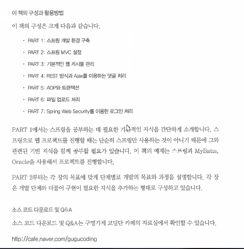

# 1.17

18, 20, 21일 팀별 취업설명회

4시 30분 전에 수업 끝낸다.


스프링 + 마이비티스

오전 - 발표 + 마무리

오후 2시 - 스프링




Part 1, 2

12시에 점심먹고 2시사이 모두 읽어보기

오전 10:30 ~ 11:50 수업

---

Spring 환경설정

1. Class 폴더
   - SpringClass 폴더생성
2. springDI 이름으로 java project 생성 


1. 스프링 프레임워크 개요
2. 핵심기능 - DI, AOP
   - DI 를 사용해서 객체 생성
     - xml 파일 - Ex02.java
     - 자바파일
   - 스프링 빈 라이프 사이클
   - AOP
     - POJO 기반
     - 어노테이션 기반
3. 스프링 MVC
4. 스프링 JDBC
5. 스프링 트랜잭션
6. 스프링 PRM - mybatis 
7. 스프링 보안


spring: https://spring.io/team 


1. 스프링 프레임워크 개요
   - 스프링 설치: 3.x 4.x 5.x. zip 메이븐
     - 메이븐 - 빌드도구 +++ 프로젝트 생성 ~ 배포
     - 중앙저장소 -> 다운로드 -> `.jar` 모듈
     - `pom.xml` 파일
     - 그래들


1. Record 인터페이스
2. RecordImpl 클래스
3. RecordView 인터페이스
4. RecordViewImpl 클래스 생성


예) 한 학생의 국, 영, 수 정보를 입력하고 출력하기


DI (의존성주입)

- 생성자를 사용해서 DI
- setter 를 사용해서 DI


스프링

- 주요 모듈 jar 파일 추가
  - 메이븐 (빌드도구): pom.xml
- 객체생성 + DI: xml 파일 추가 (applicationContext.xml)


우클릭 - build path - libraries 탭

Add External JARs... 클릭 - 

spring-framework-3.0.2.RELEASE-with-docs 가 메인이다.

dist 폴더의 jar 파일을 전부 선택한다. (Ctrl A) - Apply - close 


예시파일

```
C:\spring-framework-3.0.2.RELEASE-with-docs\spring-framework-3.0.2.RELEASE\docs\spring-framework-reference\htmlsingle\spring-framework-reference.html
```

```
file:///C:/spring-framework-3.0.2.RELEASE-with-docs/spring-framework-3.0.2.RELEASE/docs/spring-framework-reference/htmlsingle/spring-framework-reference.html
```

주소창에 복사해도 된다.

`3.2.1. Configuration metadata`  클릭

예시

```xml
<?xml version="1.0" encoding="UTF-8"?>
<beans xmlns="http://www.springframework.org/schema/beans"
       xmlns:xsi="http://www.w3.org/2001/XMLSchema-instance"
       xsi:schemaLocation="http://www.springframework.org/schema/beans
           http://www.springframework.org/schema/beans/spring-beans-3.0.xsd">

  <bean id="..." class="...">
    <!-- collaborators and configuration for this bean go here -->
  </bean>

  <bean id="..." class="...">
    <!-- collaborators and configuration for this bean go here -->
  </bean>

  <!-- more bean definitions go here -->

</beans>
```


spring bean 이라고 한다.


스프링의 객체생성

```xml
<bean id="record" class="di.RecordImpl"></bean>
<bean id="service" class="di.RecordViewImpl">
    <property name="record" ref="record"></property>
</bean>
```

> 꼭 class 에 패키지도 작성한다.

`ref` id 를 가리킨다.

`name` setRecord 함수를 가리킨다.


스프링빈 - Application Context == 스프링 컨테이너

`gx` GenericXmlApplicationContext ctx


에러

```
Exception in thread "main" java.lang.NoClassDefFoundError: org/apache/commons/logging/LogFactory
Caused by: java.lang.ClassNotFoundException: org.apache.commons.logging.LogFactory
```

해결: com.springsource.org.apache.commons.logging-1.1.1.jar 파일을 추가한다.


dependencies 에서 logging 검색

```
C:\spring-framework-3.0.2.RELEASE-dependencies\org.apache.commons\com.springsource.org.apache.commons.logging\1.1.1
```


**xml**

```xml
<?xml version="1.0" encoding="UTF-8"?>
<beans xmlns="http://www.springframework.org/schema/beans"
	xmlns:xsi="http://www.w3.org/2001/XMLSchema-instance"
	xsi:schemaLocation="http://www.springframework.org/schema/beans
           http://www.springframework.org/schema/beans/spring-beans-3.0.xsd">
	<bean id="record" class="di.RecordImpl"></bean>
	<bean id="service" class="di.RecordViewImpl">
		<property name="record" ref="record"></property>
	</bean>
</beans>
```

**java**

```java
String resourceLocations = "applicationContext.xml";
GenericXmlApplicationContext ctx = new GenericXmlApplicationContext(resourceLocations);
RecordViewImpl service = (RecordViewImpl) ctx.getBean("service");

service.input();
service.output();
System.out.println(" = END = ");
```


생성자를 사용해서 DI

```xml
<bean id="record" class="di.RecordImpl"></bean>
<bean id="service" class="di.RecordViewImpl">
    <constructor-arg ref="record"></constructor-arg>
</bean>
```


챕터 part 1 꼭 볼 것. 154p 까지


```xml
<bean id="record" class="di.RecordImpl"></bean>
<bean id="service" class="di.RecordViewImpl">
    <constructor-arg>
        <ref bean="record"></ref>
    </constructor-arg>
</bean>
```

같은코드


applicationContext.xml 파일 대신에 자바파일을 사용 - di.Config.java

**Config.java**

```java
@Configuration
public class Config {
	
	@Bean
	public RecordImpl record() {
		return new RecordImpl();
	}
	
	@Bean
	public RecordViewImpl getRecordViewImpl() {
		// 1. 생성자 DI
//		return new RecordViewImpl(record());
		
		// 2. setter DI
		RecordViewImpl service = new RecordViewImpl();
		service.setRecord(record());
		return service;
	}
}
```


applicationContext.xml 파일 대신할 자바파일


오류

```
Exception in thread "main" java.lang.IllegalStateException: CGLIB is required to process @Configuration classes. Either add CGLIB to the classpath or remove the following @Configuration bean definitions: [config]
```

해결: CGLIB 라이브러리를 추가한다.

```
C:\spring-framework-3.0.2.RELEASE-dependencies\net.sourceforge.cglib\com.springsource.net.sf.cglib\2.2.0\com.springsource.net.sf.cglib-2.2.0.jar
```


오류

```
Exception in thread "main" java.lang.IllegalStateException: Cannot load configuration class: di.Config
Caused by: java.lang.ExceptionInInitializerError
Caused by: java.lang.reflect.InaccessibleObjectException: Unable to make protected final java.lang.Class java.lang.ClassLoader.defineClass(java.lang.String,byte[],int,int,java.security.ProtectionDomain) throws java.lang.ClassFormatError accessible: module java.base does not "opens java.lang" to unnamed module @401e7803
```

해결: JRE 를 openjdk 가 아니라 우리가 설치한 jre 를 사용한다.

libraries 클릭 후 Edit - Alternate Installed  - directory - 

```
C:\Program Files\Java\jre1.8.0_301
```


오류

```
Exception in thread "main" org.springframework.beans.factory.NoSuchBeanDefinitionException: No bean named 'service' is defined
```


**Config.java**

```java
public class Config {
	
	@Bean
	public RecordImpl record() {
		return new RecordImpl();
	}
	
	@Bean(name="service")
	public RecordViewImpl getRecordViewImpl() {
		// 1. 생성자 DI
//		return new RecordViewImpl(record());
		
		// 2. setter DI
		RecordViewImpl service = new RecordViewImpl();
		service.setRecord(record());
		return service;
	}
}
```


**Ex02.java**

```java
public class Ex02 {
	public static void main(String[] args) {
		AnnotationConfigApplicationContext ctx = new AnnotationConfigApplicationContext(Config.class);
		RecordViewImpl service = (RecordViewImpl) ctx.getBean("service");
		
		service.input();
		service.output();
		System.out.println(" = END = ");
	}
}
```


**[springDI03]**

자동으로 DI p.105

1. `@Autowired` 클래스이름으로 적용
2. `@Resource` name 으로 적용
3. `@Inject` 가장 최근


**applicationContext.xml**

```xml
<?xml version="1.0" encoding="UTF-8"?>
<beans xmlns="http://www.springframework.org/schema/beans"
	xmlns:xsi="http://www.w3.org/2001/XMLSchema-instance"
	xsi:schemaLocation="http://www.springframework.org/schema/beans
           http://www.springframework.org/schema/beans/spring-beans-3.0.xsd">
           
	<bean id="record" class="di.RecordImpl"></bean>
	<!-- 자동으로 의존성 주입 -->
	<bean id="service" class="di.RecordViewImpl"></bean>
</beans>
```

**RecordViewImpl.java**

```java
@Autowired
private RecordImpl record = null;
```


Autowired 또는 Resource 어노테이션을 사용하려면 추가

**applicationContext.xml**

```xml
xmlns:context="http://www.springframework.org/schema/context"

http://www.springframework.org/schema/context           http://www.springframework.org/schema/context/spring-context.xsd

<context:annotation-config></context:annotation-config>
```

추가


전체코드

```xml
<?xml version="1.0" encoding="UTF-8"?>
<beans xmlns="http://www.springframework.org/schema/beans"
			xmlns:context="http://www.springframework.org/schema/context"
	xmlns:xsi="http://www.w3.org/2001/XMLSchema-instance"
	xsi:schemaLocation="http://www.springframework.org/schema/beans
           http://www.springframework.org/schema/beans/spring-beans-3.0.xsd
           http://www.springframework.org/schema/context
           http://www.springframework.org/schema/context/spring-context.xsd">

	<context:annotation-config></context:annotation-config>
           
	<bean id="record" class="di.RecordImpl"></bean>
	<!-- 자동으로 의존성 주입 -->
	<bean id="service" class="di.RecordViewImpl"></bean>
</beans>
```


**[springDI04]**

빈 객체를 자동으로 스캔해서 생성 + DI


**applicationContext.xml**

```xml
<context:component-scan base-package="di"></context:component-scan>
```


```java
@Component
public class RecordImpl implements Record {
```

어노테이션을 붙이면 스캔한다.


전체코드

```xml
<?xml version="1.0" encoding="UTF-8"?>
<beans xmlns="http://www.springframework.org/schema/beans"
			xmlns:context="http://www.springframework.org/schema/context"
	xmlns:xsi="http://www.w3.org/2001/XMLSchema-instance"
	xsi:schemaLocation="http://www.springframework.org/schema/beans
           http://www.springframework.org/schema/beans/spring-beans-3.0.xsd
           http://www.springframework.org/schema/context
           http://www.springframework.org/schema/context/spring-context.xsd">
           <context:component-scan base-package="di"></context:component-scan>
</beans>
```

오류

```
Exception in thread "main" org.springframework.beans.factory.NoSuchBeanDefinitionException: No bean named 'service' is defined
```


RecordViewImpl 클래스가 자동으로 bean 생성이 되어지면 그 이름은 recordViewImpl 이 된다.

```java
RecordViewImpl service = (RecordViewImpl) ctx.getBean("service");
```

> getBean("recordViewImpl") 라고 해야한다. 
>
> 혹은 `@Component("service")` 라고 해야한다.


**전체코드**

**applicationContext.xml**

```xml
<?xml version="1.0" encoding="UTF-8"?>
<beans xmlns="http://www.springframework.org/schema/beans"
			xmlns:context="http://www.springframework.org/schema/context"
	xmlns:xsi="http://www.w3.org/2001/XMLSchema-instance"
	xsi:schemaLocation="http://www.springframework.org/schema/beans
           http://www.springframework.org/schema/beans/spring-beans-3.0.xsd
           http://www.springframework.org/schema/context
           http://www.springframework.org/schema/context/spring-context.xsd">
           <context:component-scan base-package="di"></context:component-scan>
</beans>
```

**RecordViewImpl.java**

```java
@Component("service")
public class RecordViewImpl implements RecordView {
	@Autowired
	private RecordImpl record = null;

	public RecordImpl getRecord() {
		return record;
	}
	public void setRecord(RecordImpl record) {
		this.record = record;
	}
	
	public RecordViewImpl() {}		
	public RecordViewImpl(RecordImpl record) {		
		this.record = record;
	}

	@Override
	public void input() {
		try(Scanner scanner = new Scanner(System.in)) {
			System.out.print("> kor, eng, mat input ? ");
			
			record.setKor(scanner.nextInt());
			record.setEng(scanner.nextInt());
			record.setMat(scanner.nextInt());
			
		} catch (Exception e) {
			e.printStackTrace();
		}
	}

	@Override
	public void output() {
		System.out.printf("> kor:%d, eng:%d, mat:%d, tot=:%d, avg:%.2f\n"
				, record.getKor()
				, record.getEng()
				, record.getMat()
				, record.total()
				, record.avg()
				);
	}
}
```


**Ex02.java**

```java
public class Ex02 {
	public static void main(String[] args) {
		String resourceLocations = "applicationContext.xml";
		GenericXmlApplicationContext ctx = new GenericXmlApplicationContext(resourceLocations);
		RecordViewImpl service = (RecordViewImpl) ctx.getBean("service");
		
		service.input();
		service.output();
		System.out.println(" = END = ");
	}
}
```


## 복습

**목차**

1. xml 파일로 생성자 & setter
2. Config.java 파일로 생성자 & setter
3. `@Autowired` 자동으로 주입
4. `@Component` 객체생성까지 자동

**[springDI]**

xml 파일에 생성자 혹은 setter 로 주입

```java
String resourceLocations = "applicationContext.xml";
GenericXmlApplicationContext ctx = new GenericXmlApplicationContext(resourceLocations);
RecordViewImpl service = (RecordViewImpl) ctx.getBean("service");
```


```xml
<?xml version="1.0" encoding="UTF-8"?>
<beans xmlns="http://www.springframework.org/schema/beans"
	xmlns:xsi="http://www.w3.org/2001/XMLSchema-instance"
	xsi:schemaLocation="http://www.springframework.org/schema/beans
           http://www.springframework.org/schema/beans/spring-beans-3.0.xsd">
<!-- setter 를 통해 주입 -->
<!-- 	<bean id="record" class="di.RecordImpl"></bean> -->
<!-- 	<bean id="service" class="di.RecordViewImpl"> -->
<!-- 		<property name="record" ref="record"></property> -->
<!-- 	</bean> -->
	
	<bean id="record" class="di.RecordImpl"></bean>
	<bean id="service" class="di.RecordViewImpl">
		<constructor-arg>
			<ref bean="record"></ref>
		</constructor-arg>
	</bean>
</beans>
```


**[springDI02]**

자바파일로 주입

JavaSE-1.8 을 Jre 로 바꿔야한다.

```java
AnnotationConfigApplicationContext ctx = new AnnotationConfigApplicationContext(Config.class);
RecordViewImpl service = (RecordViewImpl) ctx.getBean("service");
```


```java
@Configuration
public class Config {
	
	@Bean
	public RecordImpl record() {
		return new RecordImpl();
	}
	
	@Bean(name="service")
	public RecordViewImpl getRecordViewImpl() {
		// 1. 생성자 DI
//		return new RecordViewImpl(record());
		
		// 2. setter DI
		RecordViewImpl service = new RecordViewImpl();
		service.setRecord(record());
		return service;
	}
}
```


**[springDI03]**

context 관련 세 줄을 추가하고 `@Autowired` 한다.

```java
String resourceLocations = "applicationContext.xml";
GenericXmlApplicationContext ctx = new GenericXmlApplicationContext(resourceLocations);
RecordViewImpl service = (RecordViewImpl) ctx.getBean("service");
```

```java
@Autowired
private RecordImpl record = null;
```

```xml
<?xml version="1.0" encoding="UTF-8"?>
<beans xmlns="http://www.springframework.org/schema/beans"
			xmlns:context="http://www.springframework.org/schema/context"
	xmlns:xsi="http://www.w3.org/2001/XMLSchema-instance"
	xsi:schemaLocation="http://www.springframework.org/schema/beans
           http://www.springframework.org/schema/beans/spring-beans-3.0.xsd
           http://www.springframework.org/schema/context
           http://www.springframework.org/schema/context/spring-context.xsd">

	<context:annotation-config></context:annotation-config>
           
	<bean id="record" class="di.RecordImpl"></bean>
	<!-- 자동으로 의존성 주입 -->
	<bean id="service" class="di.RecordViewImpl"></bean>
</beans>
```


**[springDI04]**

**Main**

```java
String resourceLocations = "applicationContext.xml";
GenericXmlApplicationContext ctx = new GenericXmlApplicationContext(resourceLocations);
RecordViewImpl service = (RecordViewImpl) ctx.getBean("service");
```

**Impl**

```java
@Component("service")
public class RecordViewImpl implements RecordView {
	@Autowired
	private RecordImpl record = null;
```

**xml**

```xml
<?xml version="1.0" encoding="UTF-8"?>
<beans xmlns="http://www.springframework.org/schema/beans"
			xmlns:context="http://www.springframework.org/schema/context"
	xmlns:xsi="http://www.w3.org/2001/XMLSchema-instance"
	xsi:schemaLocation="http://www.springframework.org/schema/beans
           http://www.springframework.org/schema/beans/spring-beans-3.0.xsd
           http://www.springframework.org/schema/context
           http://www.springframework.org/schema/context/spring-context.xsd">
           <context:component-scan base-package="di"></context:component-scan>
</beans>
```

# 1.18

**[AOP]**

1. Java Project 추가 - springAOP

2. Ex01.java 추가

3. 로직처리코딩 + 로그기록 (공통적)

   - 쓰,목,수,삭 + 인증, 권한 (공통적)
   - 핵심관심사항 : 공통관심사항
   - core concern : cross-cutting concern
   - JSP - 필터
   - 중복코딩제거 - 

   - 스프링 AOP (Aspect Oriented Programming)
   - 스프링 - 인증, 권한, 보안 (시큐리티), 트랜잭션 처리 (AOP 방식)
   - 관점 지향적 프로그래밍

4. +++ 반드시 알아야할 AOP 용어 +++ (암기)

   - Aspect: 여러 객체에 공통으로 적용되는 기능 (공통기능)
   - Advice: 공통기능을 핵심기능에 [언제] 적용할지를 정의 - 전+후, 전, 후
   - Weaving: advice 를 핵심로직코드에 적용 (삽입) 하는 것.
   - Joinpoint: Advice 를 적용 (삽입) 가능하는 지점- 예) add() 메서드 호출
   - Pointcut: Advice 를 실제 적용한 지점.
     - 스프링에서는 정규표현식, [AspectJ문법] +++ 을 이용해서 Pointcut 을 설정할 수 있다.

5. 세가지의 Weaving 방식

   - 컴파일 시 
   - 클래스 로딩 시
   - 런타임 시
     - 프록시 (proxy) 기반으로 AOP 지원하기 때문에
     - Joinpoint 를 메서드만 사용할 수 있다.

6. 스프링 AOP 구현하는 3가지 방법

   - 스프링 API 이용한 AOP 구현 X
   - XML 스키마 기반의 POJO 클래스를 이용한 AOP 구현 O - xml 파일
   - AspectJ 에서 정의한 `@Aspect` 어노테이션 기반의 AOP 구현 O - `@Aspect` 어노테이션

7. Advice 종류

   - Before Advice
   - Around Advice
   - After Advice, After Throwing Advice, After Returning Advice


모듈추가: spring, CGLIB, logging, aopalliance


**CalculatorImpl.java**

```java
public class CalculatorImpl implements Calculator {
	@Override
	public int add(int x, int y) {
		int result = x + y;
		return result;
	}

	@Override
	public int sub(int x, int y) {
		int result = x - y; // 산술연산 로직처리 코딩부분
		return result;
	}

	@Override
	public int mult(int x, int y) {
		int result = x * y;
		return result;
	}

	@Override
	public int div(int x, int y) {
		int result = x / y;
		return result;
	}
}
```

**Ex02.java**

```java
public class Ex02 {
	public static void main(String[] args) {
//		ProxyFactoryBean pfb = new ProxyFactoryBean();
//		pfb.setProxyInterfaces(null);
		
		// 계산기의 산술연산하는 메서드를 호출할 때 연산처리시간을 로그로 기록하고 싶다.
		// Advice - 로그기록
		// Around Advice = 전 + 후		aop.advice.LogPrintAroundAdvice
		
		String resourceLocations = "applicationContext.xml";
		AbstractApplicationContext ctx = new GenericXmlApplicationContext(resourceLocations );
		Calculator calc = (Calculator) ctx.getBean("calcProxy");
		
		System.out.println(calc.add(4, 2));
		System.out.println(calc.sub(4, 2));
		System.out.println(calc.mult(4, 2));
		System.out.println(calc.div(4, 2));
		System.out.println("= END =");
	}
}
```

**applicationContext.xml**

```xml
<?xml version="1.0" encoding="UTF-8"?>
<beans xmlns="http://www.springframework.org/schema/beans"
			xmlns:context="http://www.springframework.org/schema/context"
	xmlns:xsi="http://www.w3.org/2001/XMLSchema-instance"
	xsi:schemaLocation="http://www.springframework.org/schema/beans
           http://www.springframework.org/schema/beans/spring-beans-3.0.xsd
           http://www.springframework.org/schema/context
           http://www.springframework.org/schema/context/spring-context.xsd">
           
	<bean id="calc" class="aop.CalculatorImpl"></bean>           
	<bean id="logPrintAroundAdvice" class="aop.advice.LogPrintAroundAdvice"></bean>           
	
	<!-- 스프링 AOP: 프록시기반 + 메서드 적용 -->
	<bean id="calcProxy" class="org.springframework.aop.framework.ProxyFactoryBean">
	
		<!-- [1] -->
		<property name="target" ref="calc"></property>
		
		<!-- [2] pointcut 설정 -->
		<property name="proxyInterfaces">
			<list>
				<value>aop.Calculator</value>
			</list>
		</property>
		
		<!-- [3] Advice 등록 -->
		<property name="interceptorNames">
			<list>
				<value>logPrintAroundAdvice</value>
			</list>
		</property>
	</bean>
</beans>
```

**LogPrintAroundAdvice.java**

```java
import org.aopalliance.intercept.MethodInterceptor;

public class LogPrintAroundAdvice implements MethodInterceptor {
	@Override
	public Object invoke(MethodInvocation method) throws Throwable {
		String methodName = method.getMethod().getName();
		
		// 로직처리 (공통기능)
		Log log = LogFactory.getLog(this.getClass());
		StopWatch sw = new StopWatch();
		
		log.info("> " + methodName + "() start.");
		sw.start();
		Object result = method.proceed(); // add()
		sw.stop();
		log.info("> " + methodName + "() stop.");
		log.info("> " + methodName + "() 처리시간: " + sw.getTotalTimeMillis() + "ms");
		return result;
	}
}
```


출력

```
1월 18, 2022 11:11:06 오전 aop.advice.LogPrintAroundAdvice invoke
정보: > add() start.
1월 18, 2022 11:11:06 오전 aop.advice.LogPrintBeforeAdvice before
정보: >>>add(): BeforeAdvice 가 호출됨...
1월 18, 2022 11:11:06 오전 aop.advice.LogPrintAroundAdvice invoke
정보: > add() stop.
1월 18, 2022 11:11:06 오전 aop.advice.LogPrintAroundAdvice invoke
정보: > add() 처리시간: 2ms
6
= END =
```


스프링 AOP: 프록시기반 + 메서드 적용

**applicationContext.xml**

```xml
<bean id="logPrintBeforeAdvice" class="aop.advice.LogPrintBeforeAdvice"></bean>

<value>logPrintBeforeAdvice</value>
```

**LogPrintBeforeAdvice.java**

```java
public class LogPrintBeforeAdvice implements MethodBeforeAdvice {

	// add(4, 2) 가정을 하면
	@Override
	public void before(
			Method method	// add()
			, Object[] arg	// 4, 2
			, Object target	// 핵심기능을 구현한 실제객체 calc
			) throws Throwable {
		String methodName = method.getName();
		Log log = LogFactory.getLog(getClass());
		log.info(">>>" + methodName + "(): BeforeAdvice 가 호출됨...");
	}
}
```


- afterThrowing
- afterReturning


```
1월 18, 2022 11:18:19 오전 aop.advice.LogPrintAroundAdvice invoke
정보: > add() start.
1월 18, 2022 11:18:19 오전 aop.advice.LogPrintBeforeAdvice before
정보: >>>add(): BeforeAdvice 가 호출됨...
1월 18, 2022 11:18:19 오전 aop.advice.LogPrintAfterReturningAdvice afterReturning
정보: >>>add(): AfterReturningAdvice 가 호출됨...6
1월 18, 2022 11:18:19 오전 aop.advice.LogPrintAroundAdvice invoke
정보: > add() stop.
1월 18, 2022 11:18:19 오전 aop.advice.LogPrintAroundAdvice invoke
정보: > add() 처리시간: 3ms
6
= END =
```

```java
public class LogPrintAfterReturningAdvice implements AfterReturningAdvice {

	@Override
	public void afterReturning(
			Object returnValue
			, Method method
			, Object[] arg
			, Object target
			) throws Throwable {
		String methodName = method.getName();
		Log log = LogFactory.getLog(getClass());
		log.info(">>>" + methodName + "(): AfterReturningAdvice 가 호출됨..." + returnValue);
	}
}
```


**applicationContext.xml 전체코드**

```xml
<?xml version="1.0" encoding="UTF-8"?>
<beans xmlns="http://www.springframework.org/schema/beans"
			xmlns:context="http://www.springframework.org/schema/context"
	xmlns:xsi="http://www.w3.org/2001/XMLSchema-instance"
	xsi:schemaLocation="http://www.springframework.org/schema/beans
           http://www.springframework.org/schema/beans/spring-beans-3.0.xsd
           http://www.springframework.org/schema/context
           http://www.springframework.org/schema/context/spring-context.xsd">
           
	<bean id="calc" class="aop.CalculatorImpl"></bean>           
	<bean id="logPrintAroundAdvice" class="aop.advice.LogPrintAroundAdvice"></bean>           
	<bean id="logPrintBeforeAdvice" class="aop.advice.LogPrintBeforeAdvice"></bean>           
	<bean id="logPrintAfterReturningAdvice" class="aop.advice.LogPrintAfterReturningAdvice"></bean>           
	
	<!-- 스프링 AOP: 프록시기반 + 메서드 적용 -->
	<bean id="calcProxy" class="org.springframework.aop.framework.ProxyFactoryBean">
	
		<!-- [1] -->
		<property name="target" ref="calc"></property>
		
		<!-- [2] pointcut 설정 -->
		<property name="proxyInterfaces">
			<list>
				<value>aop.Calculator</value>
			</list>
		</property>
		
		<!-- [3] Advice 등록 -->
		<property name="interceptorNames">
			<list>
				<value>logPrintAroundAdvice</value>
				<value>logPrintBeforeAdvice</value>
				<value>logPrintAfterReturningAdvice</value>
			</list>
		</property>
	</bean>
</beans>
```


**@component**

```xml
<?xml version="1.0" encoding="UTF-8"?>
<beans xmlns="http://www.springframework.org/schema/beans"
			xmlns:context="http://www.springframework.org/schema/context"
	xmlns:xsi="http://www.w3.org/2001/XMLSchema-instance"
	xsi:schemaLocation="http://www.springframework.org/schema/beans
           http://www.springframework.org/schema/beans/spring-beans-3.0.xsd
           http://www.springframework.org/schema/context
           http://www.springframework.org/schema/context/spring-context.xsd">

<context:component-scan base-package="aop"/>           
<!-- 	<bean id="calc" class="aop.CalculatorImpl"></bean>            -->
<!-- 	<bean id="logPrintAroundAdvice" class="aop.advice.LogPrintAroundAdvice"></bean>            -->
<!-- 	<bean id="logPrintBeforeAdvice" class="aop.advice.LogPrintBeforeAdvice"></bean>            -->
<!-- 	<bean id="logPrintAfterReturningAdvice" class="aop.advice.LogPrintAfterReturningAdvice"></bean>            -->
	
	<bean id="calcProxy" class="org.springframework.aop.framework.ProxyFactoryBean">
		<property name="target" ref="calc"></property>
	
		<property name="proxyInterfaces">
			<list>
				<value>aop.Calculator</value>
			</list>
		</property>
		<property name="interceptorNames">
			<list>
				<value>logPrintAroundAdvice</value>
				<value>logPrintBeforeAdvice</value>
				<value>logPrintAfterReturningAdvice</value>
			</list>
		</property>
	</bean>
</beans>
```


**[XML 스키마 기반 AOP 구현]**

p.209

1. advice 패키지 삭제
2. xml 내용 제거


스프링 AOP 3가지 방법 중에

+++ XML 스키마 기반 AOP 구현 +++

처리과정

1. 스프링 AOP 를 사용하기 위해 jar 의존파일 추가
   - weaver.jar 추가
2. aop.advice 패키지 -- 삭제
   - B, A, A advice 3가지
   - 공통기능을 제공할 클래스 추가
   - aop.LogPrintProfiler.java
     - trace() 구현 - Around Advice
3. xml 설정파일
   - `<aop:config>` aop 설정하는 태그
   - Aspect 를 설정
   - Advice 를 어떤 Pointcut 에 적용할지를 설정 (지정)

p.252 AspectJ 의 문법

pointcut 

1. execution 명시자
2. within 명시자
3. bean 명시자

```
execution(수식어패턴?리턴타입패턴 클래스이름패턴?메서드이름패턴(파라미터패턴))
```

수식어패턴

- public

리턴타입

- `int`
- `*` 상관없다.


**예시**

- ``execution(public void set*(..))` 리턴타입이 void 이고 메서드이름이 set 으로 시작하는 메서드
- `excution(* net.madvirus.spring4.chap06.*.*())` 파라미터가 없는 모든메서드
- `execution(* net.madvirus.spring4.chap06..*.*(..))` 패키지부분에 `..` 을 사용하여 해당피키지 혹은 하위 패키지를 나타낸다.


**xml**

추가

```xml
xmlns:aop="http://www.springframework.org/schema/aop"

http://www.springframework.org/schema/aop
http://www.springframework.org/schema/aop/spring-aop.xsd
```


전체코드

```xml
<?xml version="1.0" encoding="UTF-8"?>
<beans xmlns="http://www.springframework.org/schema/beans"
	xmlns:context="http://www.springframework.org/schema/context"
	xmlns:aop="http://www.springframework.org/schema/aop"
	xmlns:xsi="http://www.w3.org/2001/XMLSchema-instance"
	xsi:schemaLocation="http://www.springframework.org/schema/beans
           http://www.springframework.org/schema/beans/spring-beans-3.0.xsd
           http://www.springframework.org/schema/context
           http://www.springframework.org/schema/context/spring-context.xsd
           	http://www.springframework.org/schema/aop
			http://www.springframework.org/schema/aop/spring-aop.xsd
           ">

	<context:component-scan base-package="aop" />

	<aop:config>
		<aop:aspect id="traceAspect" ref="logPrintProfiler">
			<aop:around method="trace" pointcut="execution(public * aop..*.*(*,*))"/>
		</aop:aspect>
	</aop:config>
</beans>
```


**LogPrintProfiler.java**

```java
// before, after, around advice 를 대신할 공통기능을 구현할 클래스
public class LogPrintProfiler {
	
	// 1. Around Advice - 처리시간을 로그로 기록 (출력)
	public Object trace(ProceedingJoinPoint joinPoint) {
		String signature = joinPoint.getSignature().toShortString();
		
		Log log = LogFactory.getLog(this.getClass());
		StopWatch sw = new StopWatch();
		log.info("> " + signature + "() start.");
		sw.start();
		
		Object result = null;
		
		try {
			result = joinPoint.proceed();
		} catch (Throwable e) {
			e.printStackTrace();
		} finally {
			sw.stop();
			log.info("> " + signature + "() stop.");
			log.info("> " + signature + "() 처리시간: " + sw.getTotalTimeMillis() + "ms");
		}
		return result;
	}
}
```

`ProceedingJoinPoint` 계산코드


```java
@Component()
public class LogPrintProfiler {
```


```java
@Component("calc")
public class CalculatorImpl implements Calculator {
```


**Ex02.java**

```java
public class Ex02 {
	public static void main(String[] args) {
		String resourceLocations = "applicationContext.xml";
		AbstractApplicationContext ctx = new GenericXmlApplicationContext(resourceLocations );
		Calculator calc = (Calculator) ctx.getBean("calc");
		
		System.out.println(calc.add(4, 2));
//		System.out.println(calc.sub(4, 2));
//		System.out.println(calc.mult(4, 2));
//		System.out.println(calc.div(4, 2));
		System.out.println("= END =");
	}
}
```


**추가**

**LogPrintProfiler.java**

```java
import org.aspectj.lang.JoinPoint;
```


전체코드

```java
@Component()
public class LogPrintProfiler {
	
	// 1. Around Advice - 처리시간을 로그로 기록 (출력)
	public Object trace(ProceedingJoinPoint joinPoint) throws Exception {
		String signature = joinPoint.getSignature().toShortString();
		
		Log log = LogFactory.getLog(this.getClass());
		StopWatch sw = new StopWatch();
		log.info("> " + signature + "() start.");
		sw.start();
		
		Object result = null;
		
		try {
			result = joinPoint.proceed();
		} catch (Throwable e) {
			e.printStackTrace();
		} finally {
			sw.stop();
			log.info("> " + signature + "() stop.");
			log.info("> " + signature + "() 처리시간: " + sw.getTotalTimeMillis() + "ms");
		}
		return result;
	}
	
	public void before(JoinPoint joinpoint) {
		String methodName = joinpoint.getSignature().getName();
		Log log = LogFactory.getLog(this.getClass());
		log.info(">>> " + methodName + "() before advice.");
	}
	
	public void afterFinally(JoinPoint joinpoint) {
		String methodName = joinpoint.getSignature().getName();
		Log log = LogFactory.getLog(this.getClass());
		log.info(">>> " + methodName + "() after advice.");
	}
}
```


**xml**

```xml
<aop:config>
    <aop:aspect id="traceAspect" ref="logPrintProfiler">
        <aop:around method="trace" pointcut="execution(public * aop..*.*(*,*))"/>
        <aop:before method="before" pointcut="execution(public * aop..*.*(*,*))"/>
        <aop:after method="afterFinally" pointcut="execution(public * aop..*.*(*,*))"/>
    </aop:aspect>
</aop:config>
```


전체코드

```xml
<?xml version="1.0" encoding="UTF-8"?>
<beans xmlns="http://www.springframework.org/schema/beans"
	xmlns:context="http://www.springframework.org/schema/context"
	xmlns:aop="http://www.springframework.org/schema/aop"
	xmlns:xsi="http://www.w3.org/2001/XMLSchema-instance"
	xsi:schemaLocation="http://www.springframework.org/schema/beans
           http://www.springframework.org/schema/beans/spring-beans-3.0.xsd
           http://www.springframework.org/schema/context
           http://www.springframework.org/schema/context/spring-context.xsd
           	http://www.springframework.org/schema/aop
			http://www.springframework.org/schema/aop/spring-aop.xsd
           ">

	<context:component-scan base-package="aop" />

	<aop:config>
		<aop:aspect id="traceAspect" ref="logPrintProfiler">
			<aop:around method="trace" pointcut="execution(public * aop..*.*(*,*))"/>
			<aop:before method="before" pointcut="execution(public * aop..*.*(*,*))"/>
			<aop:after method="afterFinally" pointcut="execution(public * aop..*.*(*,*))"/>
		</aop:aspect>
	</aop:config>
</beans>
```


**포인트컷 참조**

```xml
<aop:pointcut expression="execution(public * aop..*.*(*,*))" id="publicMethod"/>
<aop:around method="trace" pointcut-ref="publicMethod"/>
<aop:before method="before" pointcut-ref="publicMethod"/>
<aop:after method="afterFinally" pointcut-ref="publicMethod"/>
```


전체코드

```xml
<?xml version="1.0" encoding="UTF-8"?>
<beans xmlns="http://www.springframework.org/schema/beans"
	xmlns:context="http://www.springframework.org/schema/context"
	xmlns:aop="http://www.springframework.org/schema/aop"
	xmlns:xsi="http://www.w3.org/2001/XMLSchema-instance"
	xsi:schemaLocation="http://www.springframework.org/schema/beans
           http://www.springframework.org/schema/beans/spring-beans-3.0.xsd
           http://www.springframework.org/schema/context
           http://www.springframework.org/schema/context/spring-context.xsd
           	http://www.springframework.org/schema/aop
			http://www.springframework.org/schema/aop/spring-aop.xsd
           ">

	<context:component-scan base-package="aop" />

	<aop:config>
		<aop:aspect id="traceAspect" ref="logPrintProfiler">
			<aop:pointcut expression="execution(public * aop..*.*(*,*))" id="publicMethod"/>
			<aop:around method="trace" pointcut-ref="publicMethod"/>
			<aop:before method="before" pointcut-ref="publicMethod"/>
			<aop:after method="afterFinally" pointcut-ref="publicMethod"/>
		</aop:aspect>
	</aop:config>
</beans>
```


**[세번째방법]**

`@Aspect` 어노테이션

`aop:config` 를 모두 `@Aspect` 어노테이션으로 바꾼다.


**applicationContext.xml**

```xml
<?xml version="1.0" encoding="UTF-8"?>
<beans xmlns="http://www.springframework.org/schema/beans"
	xmlns:context="http://www.springframework.org/schema/context"
	xmlns:aop="http://www.springframework.org/schema/aop"
	xmlns:xsi="http://www.w3.org/2001/XMLSchema-instance"
	xsi:schemaLocation="http://www.springframework.org/schema/beans
           http://www.springframework.org/schema/beans/spring-beans-3.0.xsd
           http://www.springframework.org/schema/context
           http://www.springframework.org/schema/context/spring-context.xsd
           	http://www.springframework.org/schema/aop
			http://www.springframework.org/schema/aop/spring-aop.xsd">
	<context:component-scan base-package="aop" />
	<aop:aspectj-autoproxy />
</beans>
```

**LogPrintProfiler.java**

```java
@Component()
@Aspect
public class LogPrintProfiler {
	@Pointcut("execution(public * aop..*.*(*,*))")
	public void profileTarget() {}
	
	// 1. Around Advice - 처리시간을 로그로 기록 (출력)
	@Around("profileTarget()")
	public Object trace(ProceedingJoinPoint joinPoint) throws Exception {
		String signature = joinPoint.getSignature().toShortString();
		
		Log log = LogFactory.getLog(this.getClass());
		StopWatch sw = new StopWatch();
		log.info("> " + signature + "() start.");
		sw.start();
		
		Object result = null;
		
		try {
			result = joinPoint.proceed();
		} catch (Throwable e) {
			e.printStackTrace();
		} finally {
			sw.stop();
			log.info("> " + signature + "() stop.");
			log.info("> " + signature + "() 처리시간: " + sw.getTotalTimeMillis() + "ms");
		}
		return result;
	}
	
	@Before("profileTarget()")
	public void before(JoinPoint joinpoint) {
		String methodName = joinpoint.getSignature().getName();
		Log log = LogFactory.getLog(this.getClass());
		log.info(">>> " + methodName + "() before advice.");
	}
	
	@After("profileTarget()")
	public void afterFinally(JoinPoint joinpoint) {
		String methodName = joinpoint.getSignature().getName();
		Log log = LogFactory.getLog(this.getClass());
		log.info(">>> " + methodName + "() after advice.");
	}
}
```


**Ex02.java**

```java
public class Ex02 {
	public static void main(String[] args) {
		String resourceLocations = "applicationContext.xml";
		AbstractApplicationContext ctx = new GenericXmlApplicationContext(resourceLocations );
		Calculator calc = (Calculator) ctx.getBean("calc");
		
		System.out.println(calc.add(4, 2));
//		System.out.println(calc.sub(4, 2));
//		System.out.println(calc.mult(4, 2));
//		System.out.println(calc.div(4, 2));
		System.out.println("= END =");
	}
}
```

**CalculatorImpl.java**

```java
@Component("calc")
public class CalculatorImpl implements Calculator {
	@Override
	public int add(int x, int y) {
		int result = x + y;
		return result;
	}

	@Override
	public int sub(int x, int y) {
		int result = x - y; // 산술연산 로직처리 코딩부분
		return result;
	}

	@Override
	public int mult(int x, int y) {
		int result = x * y;
		return result;
	}

	@Override
	public int div(int x, int y) {
		int result = x / y;
		return result;
	}
}
```

**[MVC 패턴]**

springMVC 로 Dynamic Web Project 생성


1. css 폴더
2. customer 폴더
   - images 폴더
   - js 폴더
   - notice.css
   - notice.jsp 공지사항 목록
   - noticeDetail.jsp 공지사항 상세보기
   - noticeEdit.jsp 공지사항 수정
   - noticeReg.jsp 공지사항 등록


**[스프링MVC + DB연동 처리]**

+++ 중요 +++

JSP MVC 패턴

1. MVC 컨트롤러 선언, 서블릿 -> web.xml 서블릿 등록
2. ???.properties 
   - list.do=ListHandler 커맨드 객체
3. CommandHandler 인터페이스 process()
4. ListHandler implements CommandHandler {
5. ListService
6. Dao


1. webapp > WEB-INF > lib 폴더
   - 스프링 주요모듈 (jar 파일) 추가
2. ojdbc6.jar
   - tomcat-dbcp.jar
3. 의존모듈
   - logging
   - aopal~


- `json` 
- `jstl` JSTL
- `ojdbc6` JDBC DB 연결
- `dbcp ` WAS DBCP 커넥션풀

를 추가한다.

**[스프링 MVC 처리과정]**

+++  +++ p.268

[list.do] - 요청 -> MVC 컨트롤러

list.do 요청/컨트롤러 (MVC) 검색

DispatcherServlet 클래스명	<-	Handler  

-처리요청 -> HandlerAdapter 객체 -> 로직처리하는 컨트롤러

<- Model And View 객체 <-

r.sa("list", list) + list.jsp

-> ViewResolver 객체 - 뷰 검색

-> list.jsp		JSP 페이지 X

​						스프링 타일즈 (tiles)

<- 응답


개발자가 만들 것

- JSP
- spring bean 컨트롤러


1. MV[C] "Fromt 컨트롤러" == 서블릿 등록 web.xml


**web.xml**

```xml
  <filter>
      <filter-name>encodingFilter</filter-name>
      <filter-class>org.springframework.web.filter.CharacterEncodingFilter</filter-class>
      <init-param>
         <param-name>encoding</param-name>
         <param-value>UTF-8</param-value>
      </init-param>
    </filter>
    <filter-mapping>
      <filter-name>encodingFilter</filter-name>
      <url-pattern>/*</url-pattern>
    </filter-mapping>
  
  <servlet>
  	<servlet-name>dispatcher</servlet-name>
  	<servlet-class>org.springframework.web.servlet.DispatcherServlet</servlet-class>
  	<load-on-startup>1</load-on-startup>
  </servlet>
  <servlet-mapping>
  	<servlet-name>dispatcher</servlet-name>
  	<url-pattern>*.htm</url-pattern>
  </servlet-mapping>
```


spring 메뉴얼

```
C:\spring-framework-3.0.2.RELEASE-with-docs\spring-framework-3.0.2.RELEASE\docs\spring-framework-reference\pdf
```

p.450

**dispatcher-servlet.xml**

```xml
<?xml version="1.0" encoding="UTF-8"?>
<beans xmlns="http://www.springframework.org/schema/beans"
xmlns:xsi="http://www.w3.org/2001/XMLSchema-instance"
xmlns:p="http://www.springframework.org/schema/p"
xmlns:context="http://www.springframework.org/schema/context"
xsi:schemaLocation="
http://www.springframework.org/schema/beans
http://www.springframework.org/schema/beans/spring-beans-3.0.xsd
http://www.springframework.org/schema/context
http://www.springframework.org/schema/context/spring-context-3.0.xsd">
<context:component-scan base-package="org.springframework.samples.petclinic.web"/>
// ...
</beans>
```

applicationContext.xml 기능과 똑같다.


## 복습

에러

```
java.lang.ClassNotFoundException: org.springframework.web.filter.CharacterEncodingFilter
```


오류

원인: WEB-INF 의 lib 폴더에 넣지않고 references libraries 에 추가했다.

해결: lib 폴더에 logging, weaver 등을 넣는다.


오류

```
Caused by: java.io.FileNotFoundException: Could not open ServletContext resource [/WEB-INF/dispatcher-servlet.xml]
```

WEB-INF 에 `dispatcher-servlet.xml` 로 추가


```
C:\spring-framework-3.0.2.RELEASE-with-docs\spring-framework-3.0.2.RELEASE\docs\spring-framework-reference\pdf
```

`spring-framework-reference.pdf` 파일을 열어 p.450 로 이동한다.


```xml
<?xml version="1.0" encoding="UTF-8"?>
<beans xmlns="http://www.springframework.org/schema/beans"
xmlns:xsi="http://www.w3.org/2001/XMLSchema-instance"
xmlns:p="http://www.springframework.org/schema/p"
xmlns:context="http://www.springframework.org/schema/context" xsi:schemaLocation="
http://www.springframework.org/schema/beans
http://www.springframework.org/schema/beans/spring-beans-3.0.xsd
http://www.springframework.org/schema/context
http://www.springframework.org/schema/context/spring-context-3.0.xsd">
</beans>
```

복사해서 component-scan 을 지운다.

# 1.19


```
String ppage = request.getParameter("page");
```


1. 글 목록 페이지에서 하나의 공지사항의 제목을 클릭하면 공지사항 상세보기로 요청
   - noticeDetail.htm?seq=10


서버우클릭 - add and remove 해서 context path 를 하나만 남긴다.

properties - web project settings - context root 를 변경해서 경로를 바꾼다.

springMVC02 로 변경


didspatcher 파일안에 bean 태그 모두 삭제 후 

component-scan 태그로 변경


**[component-scan]**

1. dispatcher 파일안에 bean 태그 모두 삭제
2. NoticeDao 에 @Component 를 추가
3. NoticeController
4. NoticeDetailController

**dispatcher-servlet.xml**

```xml
<context:component-scan base-package="newlecture.dao, controllers.customer"/>
```


```java
@Component
@RequestMapping("/customer/notice.htm")
public class NoticeController implements Controller{
```


```java
@Component
@RequestMapping("/customer/noticeDetail.htm")
public class NoticeDetailController implements Controller{
```


태권형 파일 후 

NoticeDao.java: @Component 대신에 Repository 를 붙인다. (DAO 일 경우)

service 는 service

controller 는 controller 라고 붙이는 게 좋다.


---

## 복습

**[9~10시]**

**코드**

customer/notice.htm 생성

**notice.htm**

```
http://localhost/springMVC/customer/notice.htm
```

controllers.customer 패키지 추가

NoticeController 클래스 추가. ListHandler 와 같은 기능이다.

**NoticeController.java**

```java
import org.springframework.web.servlet.mvc.Controller;

@Override
public ModelAndView handleRequest(HttpServletRequest request, HttpServletResponse response) throws Exception {
    String ppage = request.getParameter("page");
    String pfield = request.getParameter("field");
    String pquery = request.getParameter("query");

    int page = 1;
    String field = "title", query = "";

    if ( ppage != null && !ppage.equals("") ) {
        page = Integer.parseInt(ppage);
    }
    if ( pfield != null && !pfield.equals("") ) {
        field = pfield;
    }
    if ( pquery != null && !pquery.equals("") ) {
        query = pquery;
    }

    // ModelAndView 리턴값
    ModelAndView mv = new ModelAndView();
    //request.setAttribute("test", "Hello.Spring MVC World!");
    mv.addObject("test", "Hello.Spring MVC World!");
    List<Notice> list = this.noticeDao.getNotices(page, field, query);
    mv.addObject("list",list);
    mv.setViewName("notice.jsp");
    return mv;
}
```

ModelAndView mv 로 생성

mv.setViewName("notice.jsp"); 추가

스프링 빈 구현

/customer/notice.html 요청 -> 스프링 빈으로 등록


**dispatcher-servlet.xml**

```xml
<?xml version="1.0" encoding="UTF-8"?>
<beans xmlns="http://www.springframework.org/schema/beans"
xmlns:xsi="http://www.w3.org/2001/XMLSchema-instance"
xmlns:p="http://www.springframework.org/schema/p"
xmlns:context="http://www.springframework.org/schema/context"
xsi:schemaLocation="
http://www.springframework.org/schema/beans
http://www.springframework.org/schema/beans/spring-beans-3.0.xsd
http://www.springframework.org/schema/context
http://www.springframework.org/schema/context/spring-context-3.0.xsd">

<bean id="noticeDao" class="newlecture.dao.NoticeDao"></bean>

<!-- 생성자 DI, setter DI -->
<bean name="/customer/notice.htm" class="controllers.customer.NoticeController">
	<!-- <constructor-arg ref="noticeDao"></constructor-arg> -->
	<property name="noticeDao" ref="noticeDao"></property>
</bean>

<bean name="/customer/noticeDetail.htm" class="controllers.customer.NoticeDetailController">
	<constructor-arg ref="noticeDao"></constructor-arg> 
</bean>

</beans>
```

`name` 요청 url (request url) 을 적는다.

`class` 패키지명.클래스명 으로 꼭 복사한다.

요청순서: 요청 (notice.htm) -> 컨트롤러 (dispatcher-servlet.xml) -> NoticeController.java -> notice.jsp


**ModelAndView mv.**

- `setViewName` 

---


notice.jsp - 게시글 목록

3-2. 스프링 MVC

1. HandlerMapping 컨트롤러 검색
2. HandlerAdapter 컨트롤러 처리 요청

+++ 변화 이해 +++

(4) notice.htm -> 컨트롤러 구현

- controllers.customer 패키지 추가

(5) notice.jsp

컨트롤러와 프론트컨트롤러의 차이를 이해해야한다.

**[10시]**

NoticeController.java

`request.setAttribute()` 도 이전과 같이 동작한다.

ModelAndView mv 에 `addObject` 함수로 넘겨줘도 된다.

setAttribute 보다는 ModelAndView 의 `addObject` 를 사용하도록 한다.


(5) notice.jsp 확인

(6) NoticeDao.java - getNotices: 공지사항 목록 반환하는 메서드

- 현재페이지 검색조건 검색어를 입력하면 게시글목록을 가져온다.

(7) NoticeController 컨트롤러 클래스 안에서

- NoticeService 클래스: 원래는 만들어야하지만 스프링 트랜잭션처리할 때 만들자. 
  - NoticeDao 호출


**[10시반]**

springMVC 프로젝트는 생성자 DI, setter DI 를 사용한다.

notice.jsp 수정

**[11~12]**

1. 검색 및 글 상세보기로 요청
   - noticeDetail.htm?seq=10
2. NoticeDetailController 컨트롤러 추가

글상세보기의 bean 등록

**[12~1]**

springMVC02: component-scan 을 적용해보자.

프로젝트를 복사 붙여넣기하면 에러가 난다.

properties - web project settings 와 

서버 우클릭 - add and remove 둘 다 적용하도록 한다.


에러

```
No mapping found for HTTP request with URI [/springMVC02/customer/notice.htm] in DispatcherServlet
```


`@Controller` Controller

`@RequestMapping`  Controller

`@Autowired`  Controller

`@Repository`  DAO

`@Service` 서비스


---

## **오후수업**

springMVC03 프로젝트 복사

springMVC02 문제점을 파악 -> 해결 -> 공지사항 CRUD 작업

1. 문제점 ? 
   - notice.htm -> NoticeController.java 컨트롤러 클래스
   - noticeDetail.htm -> NoticeDetailController.java 컨트롤러 클래스
   - ???.htm -> ???Controller.java 컨트롤러 클래스 생성
2. 위의 문제점 해결
   - 공지사항 관련된 컨트롤러 클래스를 1개만 선언
   - notice.htm -> 컨트롤 메서드 선언
   - noticeDetail.htm -> 컨트롤 메서드 선언
3. controllers.customer 패키지 삭제 X
   - controllers 패키지 추가
     - 공지사항 모든 요청을 처리하는 클래스 1개 추가 + 컨트롤러 메서드
     - CustomerController.java 추가


NoticeController 의 오버라이딩과 생성자를 지우고 모두 복사

`@Controller`  `@RequestMapping`  을 추가한다.

**[요청매핑 나누기]**

**CustomerController.java**

```java
@Controller
@RequestMapping("/customer/*")
public class CustomerController {

@RequestMapping("notice.htm")
public ModelAndView notices(HttpServletRequest request, HttpServletResponse response) throws Exception {
    
@RequestMapping("noticeDetail.htm")
public ModelAndView noticeDetail(HttpServletRequest request, HttpServletResponse response) throws Exception {
```

요청 URL 을 나눠도 된다.


**[모델을 파라미터로]**

```java
@RequestMapping("notice.htm")
public String notices(
    HttpServletRequest request
    , HttpServletResponse response
    , Model model
) throws Exception {
    String ppage = request.getParameter("page");
    String pfield = request.getParameter("field");
    String pquery = request.getParameter("query");
    int page = 1;
    String field = "title", query = "";

    if ( ppage != null && !ppage.equals("") ) {
        page = Integer.parseInt(ppage);
    }
    if ( pfield != null && !pfield.equals("") ) {
        field = pfield;
    }
    if ( pquery != null && !pquery.equals("") ) {
        query = pquery;
    }

    //		ModelAndView mv = new ModelAndView();
    model.addAttribute("test", "Hello.Spring MVC World!");
    List<Notice> list = this.noticeDao.getNotices(page, field, query);

    model.addAttribute("list",list);
    return "notice.jsp";
}
```


**기존코딩**

```java
@RequestMapping("notice.htm")
public ModelAndView notices(HttpServletRequest request, HttpServletResponse response) throws Exception {
    String ppage = request.getParameter("page");
    String pfield = request.getParameter("field");
    String pquery = request.getParameter("query");
    int page = 1;
    String field = "title", query = "";

    if ( ppage != null && !ppage.equals("") ) {
        page = Integer.parseInt(ppage);
    }
    if ( pfield != null && !pfield.equals("") ) {
        field = pfield;
    }
    if ( pquery != null && !pquery.equals("") ) {
        query = pquery;
    }

    ModelAndView mv = new ModelAndView();
    mv.addObject("test", "Hello.Spring MVC World!");
    List<Notice> list = this.noticeDao.getNotices(page, field, query);

    mv.addObject("list",list);
    mv.setViewName("notice.jsp");
    return mv;
}
```


**[파라미터 자동으로 받기]**

getParameter 를 할 필요가 없고, 자동으로 형변환해준다.

```java
@RequestMapping("notice.htm")
public String notices(
    String page, String field, String query
    , HttpServletRequest request
    , HttpServletResponse response
    , Model model
) throws Exception {
```


**기존코딩**

```java
@RequestMapping("notice.htm")
public String notices(
    HttpServletRequest request
    , HttpServletResponse response
    , Model model
) throws Exception {
    String ppage = request.getParameter("page");
    String pfield = request.getParameter("field");
    String pquery = request.getParameter("query");
```


**[RequestParam]**

response, request 파라미터 필요없으니 지운다.

```java
@RequestMapping("notice.htm")
public String notices(
    @RequestParam(value = "page", defaultValue = "1")int page
    , @RequestParam(value = "field", defaultValue = "title")String field
    , @RequestParam(value = "query", defaultValue = "")String query
    , Model model
) throws Exception {

    List<Notice> list = this.noticeDao.getNotices(page, field, query);

    model.addAttribute("test", "Hello.Spring MVC World!");
    model.addAttribute("list",list);
    return "notice.jsp";
}
```


**같은코딩**

```java
@RequestMapping("notice.htm")
public String notices(
    String page, String field, String query
    , HttpServletRequest request
    , HttpServletResponse response
    , Model model
) throws Exception {

    int _page = 1;
    String _field = "title", _query = "";

    if ( page != null && !page.equals("") ) {
        _page = Integer.parseInt(page);
    }
    if ( field != null && !field.equals("") ) {
        _field = field;
    }
    if ( query != null && !query.equals("") ) {
        _query = query;
    }
}    
```


**[noticeDetail 도 수정]**

```java
@RequestMapping("noticeDetail.htm")
public String noticeDetail(
    String seq
    , Model model
) throws Exception {
    Notice notice = this.noticeDao.getNotice(seq);

    model.addAttribute("test", "Hello.Spring MVC World!");
    model.addAttribute("notice",notice);
    return "noticeDetail.jsp";
}
```


**같은코딩**

```java
@RequestMapping("noticeDetail.htm")
public ModelAndView noticeDetail(HttpServletRequest request, HttpServletResponse response) throws Exception {

    String seq =  request.getParameter("seq");

    ModelAndView mv = new ModelAndView();
    mv.addObject("test", "Hello.Spring MVC World!");

    Notice notice = this.noticeDao.getNotice(seq);
    mv.addObject("notice",notice);
    mv.setViewName("noticeDetail.jsp");
    return mv;
}
```


3시수업

358p

return 타입 void 라고해도 되고 String 으로 해도되고 객체로 줘도 된다.

세션이 필요하면 `HttpSession` 을 파라미터로 받을 수 있다.

(4) 공지사항 글쓰기 작업

1. notice.jsp -> [글쓰기] 버튼 확인
   - 144 라인 `<a class="btn-write button" href="noticeReg.jsp">글쓰기</a>` -> .htm 으로 수정
   - noticeReg.htm 요청 (GET 방식) -> 제목, 내용, 파일 입력 notice.jsp 이동
   - noticeReg.htm 요청 (POST 방식) -> 입력받은 공지사항 정보를 저장 -> 목록 페이지 이동
2. noticeReg.jsp 페이지에서 [저장하기] 버튼을 클릭하면 어떤 요청 확인


**[매핑]**

```java
@RequestMapping("noticeReg.htm") 
@RequestMapping(value = {"noticeReg.htm"}) // 같은코드이다.

@RequestMapping(value = {"noticeReg.htm"}, method = RequestMethod.GET)
```


파일첨부는 내일한다.

**[글쓰기]**

```java
@RequestMapping(value = {"noticeReg.htm"}, method = RequestMethod.POST)
public String noticeReg(HttpServletRequest request
                        , Notice notice
                        , String title
                        , String content
                       ) throws Exception {
    notice.setTitle(title);
    notice.setContent(content);
    noticeDao.insert(notice);
    return "notice.htm";
}
```


**[리다이렉트]**

```java
@RequestMapping(value = {"noticeReg.htm"}, method = RequestMethod.POST)
public String noticeReg(HttpServletRequest request
                        , Notice notice
                        , String title
                        , String content
                       ) throws Exception {
    notice.setTitle(title);
    notice.setContent(content);
    int rowCount = noticeDao.insert(notice);

    if (rowCount == 1) {
        // 스프링에서 리다이렉트 redirect: 접두어 붙이자.
        return "redirect:notice.htm";
    } else {
        return "noticeReg.jsp?error";
    }
}
```

`redirect:`  접두어를 붙이면 리다이렉트된다.


**[객체를 파라미터로]**

```java
@RequestMapping(value = {"noticeReg.htm"}, method = RequestMethod.POST)
public String noticeReg(HttpServletRequest request
                        , Notice notice
                       ) throws Exception {
    int rowCount = noticeDao.insert(notice);

    if (rowCount == 1) {
        // 스프링에서 리다이렉트 redirect: 접두어 붙이자.
        return "redirect:notice.htm";
    } else {
        return "noticeReg.jsp?error";
    }
}
```

자동으로 객체에 담아준다.

단 필드명과 이름이 같아야한다.

fields		table/column Name -> Notice field name -> jsp input name 속성

**같은코딩**

```java
@RequestMapping(value = {"noticeReg.htm"}, method = RequestMethod.POST)
public String noticeReg(HttpServletRequest request
                        , String title
                        , String content
                       ) throws Exception {
    Notice notice = new Notice();
    notice.setTitle(title);
    notice.setContent(content);
    int rowCount = noticeDao.insert(notice);

    if (rowCount == 1) {
        // 스프링에서 리다이렉트 redirect: 접두어 붙이자.
        return "redirect:notice.htm";
    } else {
        return "noticeReg.jsp?error";
    }
}
```


**[글수정]**

ㄴ. 2개의 컨트롤러 메서드 추가


Model 파라미터를 추가해 model.addAttribute 함수를 이용한다.

attribute 로 담아 `${notice.content}` 와 같이 사용한다.


```java
@RequestMapping(value = {"noticeEdit.htm"}, method = RequestMethod.GET)
public String noticeEdit(String seq, Model model) throws Exception {
    Notice notice = noticeDao.getNotice(seq);
    model.addAttribute("notice", notice);
    return "noticeEdit.jsp";
}

@RequestMapping(value = {"noticeEdit.htm"}, method = RequestMethod.POST)
public String noticeEdit(Notice notice) throws Exception {
    int rowCount = noticeDao.update(notice);
    return "redirect:noticeDetail.htm?seq=" + notice.getSeq();
}
```


**[글삭제]**

(6) 공지사항 글삭제 작업

ㄱ. noticeDetail.jsp -> [삭제] 버튼클릭

삭제권한, 또는 비밀번호 맞는지 체크 X

로그인 (인증) 스프링 시큐리티


```java
@RequestMapping("noticeDel.htm")
public String noticeDel(String seq) throws Exception {
    noticeDao.delete(seq);
    return "redirect:notice.htm";
}
```


**[삭제확인 창]**

```jsp
<script src="https://ajax.googleapis.com/ajax/libs/jquery/3.6.0/jquery.min.js"></script>

<script>
  $(".btn-del.button").on("click", function(event) {        
        if(  !window.confirm("정말 삭제할까요 ? ") ){
         event.preventDefault();   
        }
  });
</script>						
```


내일: 파일첨부 - 글쓰기, 글수정, 글삭제

스프링 JDBC

