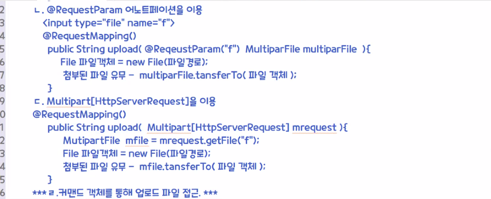
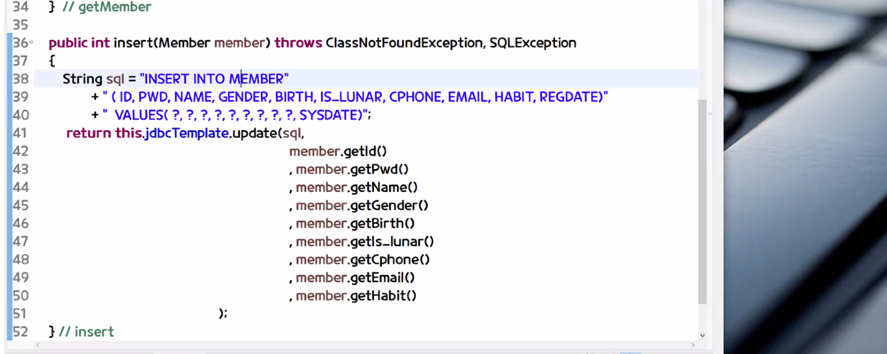

# 1.20

1. 첨부파일 있을 때 p.438
2. 스프링 JDBC + [ORM (mybatis)]

[JSP 파일업로드]

1. 외부 파일 업로드 라이브러리: cos.jar
2. form enctype="multipart/form-data" method="post"
3. request x null
   - MultipartRequest mrequest


[스프링 파일업로드]

1. form enctype="multipart/form-data" method="post" 설정

2. 멀티 파트 형식으로 데이터 (첨부파일) 가 전송이 되면 스프링 MVC 에서 사용할 수 있도록 변환해주는 객체 - MultipartResover 스프링 빈으로 등록

   2-2. 스프링이 기본 제공하는 MultipartResover 2가지 종류

   - CommonMultipartResolver - Commons FileUpload API 이용해서 데이터 처리 +++ (수업)
   - StandardServletmultipartResolver - 서블릿 3.0 의 Part 이용해서 데이터 처리

   2-3. 주의할 점

   - MultipartResover 스프링 빈으로 등록할 때 반드시 이름 "multipartResolver" 라고 설정.
   - DispatcherServlet 프론트 컨트롤러에서 해당이름으로 처리하도록 코딩되어져있기 때문.

3. 서버 재시작 (restart)

4. 업로드 파일 접근하는 방법 (4가지)

   - MultipartFile 인터페이스 이용
     - 컨트롤러 메서드
     - `RequestMapping()` 
     - public String upload(MultipartFile multipartFile) { }
     - File 파일객체 = new File(파일경로)
     - 첨부된 파일 유무 - multipartFile.transferTo(파일객체)
   - `RequestParam` 어노테이션을 이용
     - `<input type="file" name="f">` 



ㄴ.

```java
@RequestMapping()
public String upload(@RequestParam("f") MultipartFile multipartFile) {
    File 파일객체 = new File(파일경로);
    첨부된 파일 유무 - multipartFile.trasferTo(파일객체);
}
```


ㄷ. Multipart[HttpServerRequest] 를 이용

```java
@RequestMapping()
public String upload(Multipart[HttpServerReqeust] mrequest) {

}
```

+++ ㄹ. 커맨드 객체를 통해 업로드 파일 접근 +++

1. Notice.java
   - `<input type~~>` 
2. 필드 추가
3. MultipartFile 인터페이스 주요 메서드
   1. String `getName()` 파라미터 이름
   2. String `getOriginalFilename()` 업로드한 파일의 이름
   3. boolean `isEmpty()` 업로드한 파일 존재유무
   4. long `getSize()` 업로드한 파일크기
   5. byte[] `getBytes()` 업로드한 파일의 바이트 데이터
   6. InputStream `getInputStream()`  읽기 스트림 객체 반환
   7. `transferTo(File)` 업로드한 파일을 저장

ㅁ. 서블릿 3.0 의 Part 이용

```java
@RequestMapping()
public String upload(@RequestParam("f") Part part) {
    
}
```


**dispatcher-servlet.xml**

```xml
<bean id="multipartResolver" class="org.springframework.web.multipart.commons.CommonsMultipartResolver">
    <property name="maxUploadSize" value="-1"></property>
</bean>
```

`maxUploadSize` 최대 업로드 가능한 크기. 기본값 -1

`maxInMemorySize` 디스크에 임시파일을 생성하기 전에 메모리에 보관할 수 있는 최대바이트 크키. 기본값 1024. 

`defaultEncoding` 기본값 ISO-8859-1


에러

해결: io 와 fileupload.jar 를 lib 폴더에 추가한다.


**추가**

1. io, fileupload.jar 파일 추가
2. dispatcher-servlet.xml 에 위 코드 추가
3. form 태그에 `enctype="multipart/form-data"` 추가

---

1. noticeReg.jsp 에 enctype 설정
2. customer 폴더에 upload 폴더 추가
3. CustomerController.noticeReg 컨트롤러 메서드 수정


**[파일첨부]**

```java
@RequestMapping(value = {"noticeReg.htm"}, method = RequestMethod.POST)
public String noticeReg(Notice notice, HttpServletRequest request) throws Exception {
    CommonsMultipartFile multipartFile = notice.getFile();
    String uploadRealPath = null;

    // 첨부된 파일 있다면
    if (!multipartFile.isEmpty()) {

        // ㄱ. upload 폴더 - 저장
        uploadRealPath = request.getServletContext().getRealPath("/customer/upload");
        System.out.println("> uploadRealPath: " + uploadRealPath);
        String originalFilename = multipartFile.getOriginalFilename(); // a.txt
        originalFilename = getFileNameCheck(uploadRealPath, originalFilename);
        File dest = new File(uploadRealPath, originalFilename);
        multipartFile.transferTo(dest); // 업로드 폴더에 파일 저장.

        // ㄴ. notice.filesrc 업로드된 파일이름 저장: a.txt -> [a-1.txt]
        notice.setFilesrc(originalFilename);
    }
    int rowCount = noticeDao.insert(notice);

    if (rowCount == 1) {
        // 스프링에서 리다이렉트 redirect: 접두어 붙이자.
        return "redirect:notice.htm";
    } else {
        return "noticeReg.jsp?error";
    }
}
```


**기존코드**

```java
@RequestMapping(value = {"noticeReg.htm"}, method = RequestMethod.POST)
public String noticeReg(Notice notice) throws Exception {
    int rowCount = noticeDao.insert(notice);

    if (rowCount == 1) {
        return "redirect:notice.htm";
    } else {
        return "noticeReg.jsp?error";
    }
}
```


**함수**

```java
public String getFileNameCheck(String uploadPath 
                               , String originalFilename) {   
    int index = 1;
    while(true) {
        File f = new File(uploadPath, originalFilename); // 파일객체
        if( !f.exists()) return originalFilename;    
        originalFilename = 
            originalFilename.substring(0, originalFilename.length()-4)
            +" - "
            + (index++)
            + originalFilename.substring(originalFilename.length()-4); 
    } // while 문 닫기
}
```


**[상세보기: 다운로드]**

1. noticeDetail.jsp

**noticeDetail.jsp**

```jsp
<a href="upload/${notice.filesrc }">${ notice.filesrc }</a>
```

텍스트파일은 다운로드되지 않고 열린다.

이미지도 다운로드되지 않고 열린다.


```jsp
<a href="download.htm?p=customer/upload&f=${notice.filesrc }">${ notice.filesrc }</a>
```

로 변경해서 서버를 갔다오도록 한다.

```java
// download.htm?p=customer/upload&f=a.txt
@RequestMapping("download.htm")
public void download(
    @RequestParam("p") String p
    , @RequestParam("f") String f
    , HttpServletRequest request
    , HttpServletResponse response)
    throws IOException {

    /*파일 이름에 대한 인코딩 처리 추가*/       
    String fname =  f; //  new String(f.getBytes("ISO8859_1"), "UTF-8"); // f 
    response.setHeader("Content-Disposition","attachment;filename="+ new String(fname.getBytes(), "ISO8859_1"));      
    /*파일 다운로드가 가능하도록 하기 위한 물리적 경로*/
    String fullPath = request.getServletContext().getRealPath(   p + "/" + fname);
    /*파일 다운로드에 대한 처리 과정 추가*/
    FileInputStream fin = new FileInputStream(fullPath);
    ServletOutputStream sout = response.getOutputStream(); // 응답 스트림
    byte[] buf = new byte[1024];
    int size = 0;
    while((size = fin.read(buf, 0, 1024)) != -1) {
        sout.write(buf, 0, size); 
    }
    fin.close();
    sout.close();
} // method
```


**[공지사항 수정]**

1. 첨부파일 X - 수정할 때 첨부파일 추가저장 + DB 수정
2. 첨부파일 O - 새로 첨부파일 선택 X 수정 - 원래있던 첨부파일 그대로 저장.
   - 새로 첨부파일 선택 O 수정 - 원래있던 첨부파일 삭제 처리


-- 수정처리 --

1. NoticeDao.java getNotice() 확인
2. CustomerController.java noticeDetail() 확인
3. noticeDetail.jsp 확인 
4. noticeEdit.htm -> Customer.Controller GET 방식
5. noticeEdit.jsp


```java
@RequestMapping(value = {"noticeEdit.htm"}, method = RequestMethod.POST)
public String noticeEdit(
    Notice notice
    , @RequestParam("oFilesrc") String oFilesrc // 원래 첨부파일 유무 체크
    , HttpServletRequest request
) throws Exception {
    String uploadRealPath = request.getServletContext().getRealPath("/customer/upload");
    CommonsMultipartFile multipartFile = notice.getFile();

    if (!multipartFile.isEmpty()) { // 새로 첨부파일 있다면
        // 원래 첨부된 파일이 있다면 삭제.
        File delOFile = new File(uploadRealPath, oFilesrc);

        if (delOFile.exists()) {
            delOFile.delete();
        }
        // ㄱ. upload 폴더 - 저장
        System.out.println("> uploadRealPath: " + uploadRealPath);
        String originalFilename = multipartFile.getOriginalFilename(); // a.txt
        originalFilename = getFileNameCheck(uploadRealPath, originalFilename);
        File dest = new File(uploadRealPath, originalFilename);
        multipartFile.transferTo(dest); // 업로드 폴더에 파일 저장.

        // ㄴ. notice.filesrc 업로드된 파일이름 저장: a.txt -> [a-1.txt]
        notice.setFilesrc(originalFilename);
    } else { // 새로 첨부파일 있다면
        notice.setFilesrc(oFilesrc);
    }
    int rowCount = noticeDao.update(notice);
    return "redirect:noticeDetail.htm?seq=" + notice.getSeq();
}
```

**[공지사항 삭제]**

1. noticeDetail.jsp 확인 `href="noticeDel.htm?seq=${notice.seq}"`
2. noticeDel.htm -> noticeDel 컨트롤러 메서드 호출

**noticeDetail.jsp**

```jsp
<a class="btn-del button" href="noticeDel.htm?seq=${notice.seq }&p=customer/upload&oFilesrc=${notice.filesrc }">삭제</a>
```

**CustomerController.java**

```java
@RequestMapping("noticeDel.htm")
public String noticeDel(String seq
                        , Notice notice
                        , @RequestParam("oFilesrc") String oFilesrc // 원래 첨부파일 유무 체크) 
                        , HttpServletRequest request
                       ) throws Exception {

    // 글 번호 (seq) 의 첨부파일 유무 확인해서 -> 첨부파일 삭제
    String uploadRealPath = request.getServletContext().getRealPath("/customer/upload");
    File delOFile = new File(uploadRealPath, oFilesrc);

    if (delOFile.exists()) {
        delOFile.delete();
    }

    int rowCount = noticeDao.delete(seq);
    return "redirect:notice.htm";
}
```


**다른코딩**

```java
// 글 번호 (seq) 의 첨부파일 유무 확인해서 -> 첨부파일 삭제
Notice notice = noticeDao.getNotice(seq);
String attachFileName= notice.getFilesrc();

//		if (attachFileName != null) {
String uploadRealPath = request.getServletContext().getRealPath("/customer/upload");
File delOFile = new File(uploadRealPath, attachFileName);

if (delOFile.exists()) {
    delOFile.delete();
}
//		}
```


**[springJDBC]**

1. 프로젝트 - 우클릭 - web project settings
2. 서버 우클릭 - Add and Remove
3. 서버 우클릭 - clean


(1) 스프링 JDBC + [ORM (mybatis)] p.474

Spring DI

Spring AOP

Spring MVC - 공지사항, 회원가입 CRUD + 파일업로드

- 템플릿 클래스 지원
  1. 쿼리 sql - 다른부분
  2. jdbc driver 로딩
  3. Connection conn 객체 
  4. PreparedStatement pstmt 객체 - 다른부분
  5. pstmt.executeQuery() - 다른부분
  6. `List<Notice> list` 
  7. .conn, pstmt, rs 닫기
- 스프링의 의미있는 Exception 타입 존재한다.
  - DataAccessException 등등
- 트랜잭션 처리

(2) 스프링에서 DB 연동해서 작업 (처리) - DataSource 객체

- 스프링 빈으로 등록
- mybatis 연동할 때도 DataSource 객체가 필요하다.

ㄱ. DataSourrce 설정하는 3가지 방법

1. 커넥션풀을 이용한 DataSource 설정
2. JNDI 를 이용한 방법 - X 웹로직, JBoss WAS 서버에서 사용한다.
3. 로컬 테스트 할 목적으로 DriverManager 를 이용한 DataSource 설정 - X

ㄴ. 커넥션풀을 이용한 DataSource 설정


오후에 커넥션풀을 한다.

---

**오후수업**


**dispatcher-servlet.xml**

```xml
<bean id="dataSource" class="org.springframework.jdbc.datasource.DriverManagerDataSource">
    <property name="driverClassName" value="oracle.jdbc.driver.OracleDriver"></property>
    <property name="url" value="jdbc:oracle:thin:@localhost:1521:xe"></property>
    <property name="username" value="scott"></property>
    <property name="password" value="tiger"></property>
</bean>

<bean id="jdbcTemplate" class="org.springframework.jdbc.core.JdbcTemplate">
    <property name="dataSource" ref="dataSource"></property>
</bean>
```


ㄴ. 커넥션풀을 이용한 DataSource 설정

ㄷ. 스프링은 DB 연동 중복되는 코딩을 제거할 수 있는 템플릿 클래스 지원 -> Dao 구현

1. JdbcTemplate 
2. NamedParameterJdbcTemplate
3. 등등

(3) JdbcTemplate 클래스를 사용해서 -> Dao 구현 (중복코딩 제거)

ㄱ. 스프링 빈 등록

ㄴ. 주요 메서드

- `query()` 조회하는 메서드
- `queryForList()` 조회하는 메서드. 읽어온 컬럼 개수가 한 개
  - `SELECT count(*) FROM emp` 
- `queryForObject()` 조회하는 메서드. 행이 한 개.
  - `SELECT * FROM emp WHERE empno = 7655` 
- `update()` 삽입, 수정, 삭제하는 메서드

(4) 

**NoticeDao.java**

```java
@Component
public class NoticeDao {
	@Autowired
	private JdbcTemplate jdbcTemplate;
```

JdbcTemplate 를 필드로 만든다.

getter setter 가 없어도 된다. (우리는 setter 만 만들었다.)


**NoticeDao.java: 글목록**

```java
public List<Notice> getNotices(int page, String field, String query) throws ClassNotFoundException, SQLException {					
    int srow = 1 + (page-1)*15; // 1, 16, 31, 46, 61, ... an = a1 + (n-1)*d
    int erow = 15 + (page-1)*15; //15, 30, 45, 60, 75, ...

    String sql = "SELECT * "
        + " FROM "
        + "       ("
        + "        SELECT ROWNUM NUM, N.* "
        + "        FROM ("
        + "               SELECT * "
        + "               FROM NOTICES "
        + "               WHERE "+field+" LIKE ? "
        + "       ORDER BY REGDATE DESC "
        + "       ) N"
        + ") "
        + " WHERE NUM BETWEEN ? AND ? ";

    List<Notice> list = jdbcTemplate.query(sql
                                           , new Object[] {"%"+query+"%", srow, erow}
                                           , new BeanPropertyRowMapper<Notice>(Notice.class));
    return list;
}
```

getNotices 메서드의 SQL 쿼리문 제외하고 모두 지운다.


**NoticeDao.java: 글상세**

```java
public Notice getNotice(String seq) throws ClassNotFoundException, SQLException {
    String sql = "SELECT * "
        + " FROM NOTICES "
        + " WHERE SEQ=?";

    Notice notice = jdbcTemplate.queryForObject(sql, new Object[] {seq}
                                                , ParameterizedBeanPropertyRowMapper.newInstance(Notice.class));
    return notice;
}
```

Notice.java 필드명과 Notices 테이블의 칼럼명이 일치하지 않는다면

**자동매핑 되지않을 때**

```java
public Notice getNotice(String seq) throws ClassNotFoundException, SQLException {
    String sql = "SELECT * "
        + " FROM NOTICES "
        + " WHERE SEQ=?";

    Notice notice = jdbcTemplate.queryForObject(sql, new Object[] {seq}
                                                , new RowMapper<Notice>() {

                                                    @Override
                                                    public Notice mapRow(ResultSet rs, int rowNum) throws SQLException {
                                                        Notice notice = new Notice();
                                                        notice.setSeq(rs.getString("seq"));
                                                        notice.setWriter(rs.getString("writer"));
                                                        notice.setRegdate(rs.getDate("regdate"));
                                                        notice.setHit(rs.getInt("hit"));
                                                        notice.setContent(rs.getString("content"));
                                                        notice.setFilesrc(rs.getString("filesrc"));
                                                        return notice;
                                                    }
                                                });
    return notice;
}
```

자동매핑이 되지 않는다면 이렇게 긴 코드를 직접 작성해야 한다.


```java
public int getCount(String field, String query) throws ClassNotFoundException, SQLException {
    String sql = "SELECT COUNT(*) CNT "
        + " FROM NOTICES "
        + " WHERE "+field+" LIKE ?";

    // queryForList() 한개 컬럼, queryForInt(), queryForLong()
    return jdbcTemplate.queryForInt(sql, new Object[] {"%" + query + "%"});
}
```


**글 작성**

```java
public int insert(Notice notice) throws ClassNotFoundException, SQLException {
    String sql = "INSERT INTO NOTICES(SEQ, TITLE, CONTENT, WRITER, REGDATE, HIT, FILESRC) "
        + " VALUES( "
        + "        (SELECT MAX(TO_NUMBER(SEQ))+1 FROM NOTICES), ?, ?, 'tae', SYSDATE, 0, ?) ";

    return jdbcTemplate.update(sql, notice.getTitle(), notice.getContent(), notice.getFilesrc());
}
```


```java
public int delete(String seq) throws ClassNotFoundException, SQLException {
    String sql = "DELETE NOTICES "
        + " WHERE SEQ=?";

    return jdbcTemplate.update(sql, seq);
}

public int update(Notice notice) throws ClassNotFoundException, SQLException {
    String sql = "UPDATE NOTICES "
        + " SET TITLE=?, CONTENT=?, FILESRC=? "
        + " WHERE SEQ=?";

    return jdbcTemplate.update(sql
                               , notice.getTitle(), notice.getContent(), notice.getFilesrc(), notice.getSeq());
}
```


- `queryForInt(sql, new Object[] {"%" + query + "%"})` 
- `query(sql, new Object[] {"%"+query+"%", srow, erow}
  			, new BeanPropertyRowMapper<Notice>(Notice.class))` 
- `queryForObject(sql, new Object[] {seq},ParameterizedBeanPropertyRowMapper.newInstance(Notice.class))`


MemberDao.java insert




**[springJDBC03]**

NamedParameterJdbcTemplate 클래스 -> NoticeDao, MemberDao 구현, 테스트

차이점: 쿼리에서 파라미터를

- 쿼리에서 파라미터 이름
- 가독성, 유지보수 용이

(3) dispatcher-servlet.xml 파일용도(기능) 분리 ? 스프링 빈을 관리를 목적으로 설정파일 분리

1. `dispatcher-service.xml` DB 연동처리 빈
2. `dispatcher-servlet.xml`
   - web.xml 설정 추가

**dispatcher-service.xml**

```xml
<bean id="dataSource" class="org.springframework.jdbc.datasource.DriverManagerDataSource">
    <property name="driverClassName" value="oracle.jdbc.driver.OracleDriver"></property>
    <property name="url" value="jdbc:oracle:thin:@localhost:1521:xe"></property>
    <property name="username" value="scott"></property>
    <property name="password" value="tiger"></property>
</bean>

<!-- NamedParameterJddbcTemplate 템플릿 클래스 사용 -->
<bean id="jdbcTemplate" class="org.springframework.jdbc.core.namedparam.NamedParameterJdbcTemplate">
    <constructor-arg ref="dataSource"/>
</bean>
```

**dispatcher-servlet.xml**

```xml
<context:component-scan base-package="newlecture.dao, controllers" />

<bean id="multipartResolver" class="org.springframework.web.multipart.commons.CommonsMultipartResolver">
    <property name="maxUploadSize" value="-1"></property>
</bean>
```


프론트컨트롤러는 2개이상 쓸 수 있다.


**web.xml**

```xml
<!-- p.371 WebApplicationContext 계층 -->
<context-param>
    <param-name>contextConfigLocation</param-name>
    <param-value>/WEB-INF/dispatcher-service.xml</param-value>
</context-param>
<listener>
    <listener-class>org.springframework.web.context.ContextLoaderListener</listener-class>
</listener>
```


---

**마지막시간**

JDBC 템플릿 과정 정리해서 내일 시험

점심먹고 jdbcTemplate 클래스 -> NoticeDao, MemberDao 구현, 테스트

쿼리에서 파라미터를 `?` 대신에 `:title` 로 쓸 수 있다.


(3) dispatcher 분리

심각에러

```
Context initialization failed 
```

빈 생산 + 조립 공장

```
org.springframework.beans.factory.BeanCreationException: Error creating bean with name 'memberDao': Injection of autowired dependencies failed; nested exception is org.springframework.beans.factory.BeanCreationException: Could not autowire field: private org.springframework.jdbc.core.JdbcTemplate newlecture.dao.MemberDao.jdbcTemplate; nested exception is org.springframework.beans.factory.NoSuchBeanDefinitionException: No matching bean of type [org.springframework.jdbc.core.JdbcTemplate] found for dependency: expected at least 1 bean which qualifies as autowire candidate for this dependency. Dependency annotations: {@org.springframework.beans.factory.annotation.Autowired(required=true)}
```

`@Autowired` 의 인젝션이 문제다. 클래스가 다르다.


(5) NoticeDao.java 복사해서 NLNoticeDao.java 생성

MemberDao.java 복사해서 NLMemberDao.java 생성

NoticeDao.java 와 MemberDao.java 를 인터페이스로 변경한다.


NPJT 코딩 수정

