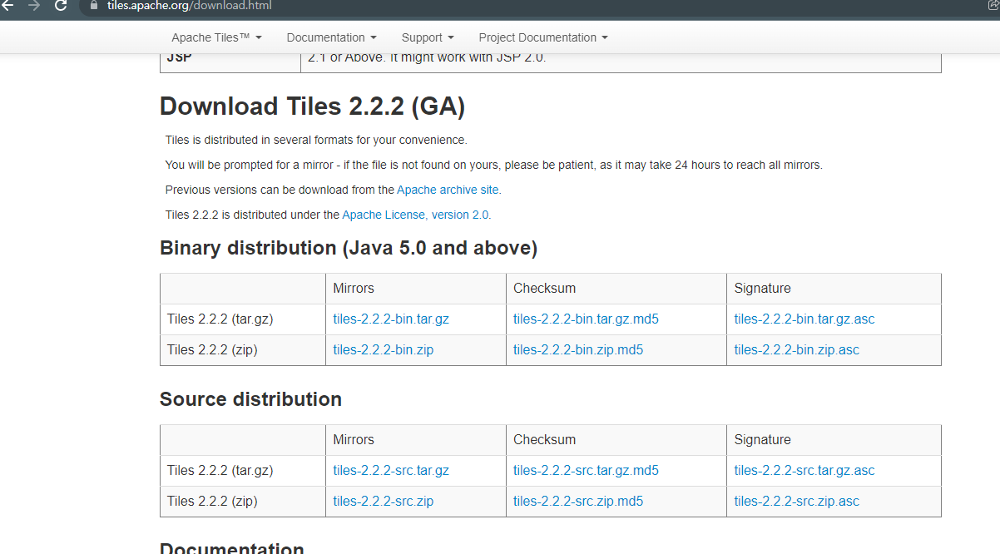

# 1.24

**복습**

환경설정

1. 프로젝트 생성

2. jar 파일 추가
 - spring-framework 주요 모듈
 - json, jstl, ojdbc, dbcp.jar 추가
 - 의존 모듈 추가: aopaliance, logging, weaver, cglib
 - 첨부파일
   : com.springsource.org.apache.commons.fileupload-1.2.0
     com.springsource.org.apache.commons.io-1.4.0

3. web.xml 
- 인코딩
- ContextLoaderListener 로 service 를 받는다.
- DispatcherServlet 로 컨트롤러 받는다.

4. dispatcher-servlet.xml
 - newlecture.dao, controllers 패키지에 있는 모든 객체 생성
 - multipartResolver bean 객체 생성

5. dispatcher-service.xm
 - DataSource
 - NamedParameterJdbcTemplate
- DataSourceTransactionManager 매니저는 dataSource 를 갖고
- TransactionTemplate 템플릿은 매니저를 갖는다.


---

스프링 트랜잭션 방법 - (선언적 트랜잭션 처리)

- 선언적 트랜잭션 ? 트랜잭션 매니저 객체
- 트랜잭션 템플릿 클래스 객체 생성 springTransaction X
- 트랜잭션 처리를 코드에서 직접 수행하지 않고
  1. xml 설정파일 - springTransaction02 
     - `<tx:advice>` 태그이용 - 트랜잭션 속성 정의하는 태그
     - `<aop:config>` 태그 - 트랜잭션도 내부적으로 AOP 를 사용한다.
  2. `@Transaction` 어노테이션 - springTransaction03
  3. 트랜잭션 처리 범위, 롤백 규칙 등등 정의해서 처리


Q. aop 란 ?

A. 검색해보자.


```
xmlns:tx="http://www.springframework.org/schema/tx"

http://www.springframework.org/schema/tx
http://www.springframework.org/schema/tx/spring-tx.xsd
```


AOP 5가지 반드시 알아야 할 용어

- a
- a
- p
- j
- w

`tx:advice` transaction-manager 에 객체를 담는다.

p.522, 523


**dispatcher-servlet.xml**

```xml
<?xml version="1.0" encoding="UTF-8"?>
<beans xmlns="http://www.springframework.org/schema/beans"
	xmlns:xsi="http://www.w3.org/2001/XMLSchema-instance"
	xmlns:p="http://www.springframework.org/schema/p"
	xmlns:context="http://www.springframework.org/schema/context"
	xmlns:tx="http://www.springframework.org/schema/tx"
	xmlns:aop="http://www.springframework.org/schema/aop"
	xsi:schemaLocation="
		http://www.springframework.org/schema/beans
		http://www.springframework.org/schema/beans/spring-beans-3.0.xsd
		http://www.springframework.org/schema/context
		http://www.springframework.org/schema/context/spring-context-3.0.xsd
		http://www.springframework.org/schema/tx
		http://www.springframework.org/schema/tx/spring-tx.xsd
		http://www.springframework.org/schema/aop
		http://www.springframework.org/schema/aop/spring-aop.xsd
">

	<context:component-scan base-package="newlecture.dao, controllers" />
	
	<bean id="multipartResolver" class="org.springframework.web.multipart.commons.CommonsMultipartResolver">
		<property name="maxUploadSize" value="-1"></property>
	</bean>

	<!-- 추가 -->
	<tx:advice id="txAdvice" transaction-manager="transactionManager">
		<tx:attributes>
			<tx:method name="insertAndPointUpOfMember" 
				isolation="DEFAULT" 
				propagation="REQUIRED"
				read-only="false"
				timeout="-1"
			/>
		</tx:attributes>
	</tx:advice>
	
	<aop:config>
		<aop:pointcut expression="execution(public void insertAndPointUpOfMember(*, *))" id="insertOrM"/>
		<aop:pointcut expression="within(newlecture.dao.*)" id="insertPackage"/>
		<aop:advisor advice-ref="txAdvice" pointcut-ref="insertOrM"/>
	</aop:config>
</beans>
```

aop 와 tx 를 추가한다.

`get*` 

- `isolation` 격리성
- `propagation` 전파방식
- `read-only` 
- `timeout` 

자동완성이 되지 않으면 import 되지 않은 것이다.

**에러**

weaver.jar 파일을 추가한다.


**NLNoticeDAO.java**

```java
@Override
public void insertAndPointUpOfMember(Notice notice, String id) throws ClassNotFoundException, SQLException {
    String sql  = "INSERT INTO NOTICES "
        + "(SEQ, TITLE, CONTENT, WRITER, REGDATE, HIT, FILESRC) "
        + " VALUES ( "
        + "        (SELECT MAX(TO_NUMBER(SEQ))+1 FROM NOTICES), :title, :content, 'kk0939', SYSDATE, 0, :filesrc) ";

    // 2. 포인트 1증가
    String sql2 = "UPDATE member "
        + "SET point = point + 1 "
        + "WHERE id = :id";

    // A
    SqlParameterSource paramSource = new BeanPropertySqlParameterSource(notice);
    jdbcTemplate.update(sql, paramSource); 

    // B
    MapSqlParameterSource paramSource2 = new MapSqlParameterSource();
    paramSource2.addValue("id", id);
    jdbcTemplate.update(sql2, paramSource2);
}
```


**[트랜잭션 어노테이션]**

springTransaction03


단 두 줄의 코드를 추가한다.

```java
@Transactional(isolation = Isolation.DEFAULT, propagation = Propagation.REQUIRED, timeout = -1)
```


```xml
<!-- 추가: p.525 -->
<tx:annotation-driven />
```


**NLNoticeDAO.java**

```java
@Override
@Transactional(isolation = Isolation.DEFAULT, propagation = Propagation.REQUIRED, timeout = -1)
public void insertAndPointUpOfMember(Notice notice, String id) throws ClassNotFoundException, SQLException {
    String sql  = "INSERT INTO NOTICES "
        + "(SEQ, TITLE, CONTENT, WRITER, REGDATE, HIT, FILESRC) "
        + " VALUES ( "
        + "        (SELECT MAX(TO_NUMBER(SEQ))+1 FROM NOTICES), :title, :content, 'kk0939', SYSDATE, 0, :filesrc) ";

    // 2. 포인트 1증가
    String sql2 = "UPDATE member "
        + "SET point = point + 1 "
        + "WHERE id = :id";

    // A
    SqlParameterSource paramSource = new BeanPropertySqlParameterSource(notice);
    jdbcTemplate.update(sql, paramSource); 

    // B
    MapSqlParameterSource paramSource2 = new MapSqlParameterSource();
    paramSource2.addValue("id", id);
    jdbcTemplate.update(sql2, paramSource2);
}
```

(주의)

`@transactional` 어노테이션이 적용된 스프링 빈에 트랜잭션을 실제 적용하려면 `<tx:annotation-driven>` 태그를 추가 설정해줘야 한다.


**<tx:annotation-driven />**

- `mode`
- `proxy-target-class`
- `order` advice 적용순서


**dispatcher-servlet.xml**

```xml
<?xml version="1.0" encoding="UTF-8"?>
<beans xmlns="http://www.springframework.org/schema/beans"
	xmlns:xsi="http://www.w3.org/2001/XMLSchema-instance"
	xmlns:p="http://www.springframework.org/schema/p"
	xmlns:context="http://www.springframework.org/schema/context"
	xmlns:tx="http://www.springframework.org/schema/tx"
	xmlns:aop="http://www.springframework.org/schema/aop"
	xsi:schemaLocation="
		http://www.springframework.org/schema/beans
		http://www.springframework.org/schema/beans/spring-beans-3.0.xsd
		http://www.springframework.org/schema/context
		http://www.springframework.org/schema/context/spring-context-3.0.xsd
		http://www.springframework.org/schema/tx
		http://www.springframework.org/schema/tx/spring-tx.xsd
		http://www.springframework.org/schema/aop
		http://www.springframework.org/schema/aop/spring-aop.xsd
">

	<context:component-scan base-package="newlecture.dao, controllers" />
	
	<bean id="multipartResolver" class="org.springframework.web.multipart.commons.CommonsMultipartResolver">
		<property name="maxUploadSize" value="-1"></property>
	</bean>
	
	<!-- 추가: p.525 -->
	<tx:annotation-driven />
</beans>
```

**dispatcher-service.xml**

```xml
<?xml version="1.0" encoding="UTF-8"?>
<beans xmlns="http://www.springframework.org/schema/beans"
	xmlns:xsi="http://www.w3.org/2001/XMLSchema-instance"
	xmlns:p="http://www.springframework.org/schema/p"
	xmlns:context="http://www.springframework.org/schema/context"
	xsi:schemaLocation="
http://www.springframework.org/schema/beans
http://www.springframework.org/schema/beans/spring-beans-3.0.xsd
http://www.springframework.org/schema/context
http://www.springframework.org/schema/context/spring-context-3.0.xsd">

	<bean id="dataSource" class="org.springframework.jdbc.datasource.DriverManagerDataSource">
		<property name="driverClassName" value="oracle.jdbc.driver.OracleDriver"></property>
		<property name="url" value="jdbc:oracle:thin:@localhost:1521:xe"></property>
		<property name="username" value="scott"></property>
		<property name="password" value="tiger"></property>
	</bean>
	
<!-- 	NamedParameterJddbcTemplate 템플릿 클래스 사용 -->
	<bean id="jdbcTemplate" class="org.springframework.jdbc.core.namedparam.NamedParameterJdbcTemplate">
		<constructor-arg ref="dataSource"/>
	</bean>
	
	<!-- 스프링 트랜잭션을 처리할 트랜잭션 메니져 등록 -->
	<bean id="transactionManager" class="org.springframework.jdbc.datasource.DataSourceTransactionManager">
		<property name="dataSource" ref="dataSource"/>
	</bean>
	
	<!-- 트랜잭션 템플릿 객체 -->
	<bean id="transactionTemplate" class="org.springframework.transaction.support.TransactionTemplate">
		<property name="transactionManager" ref="transactionManager"/>
	</bean>
</beans>
```


**[스프링 전파방식 Propagation]**

springTransaction04

method(){}

1. insert
2. update


중첩 트랜잭션 처리될 때 전파방식이 의미있다.

1. 전파방식을 테스트
   - `insertAndPointUpOfMember()`  
     1. 새글쓰기 `insert()` 
     2. 포인트증가


**한 일**

1. insert 수정


**propagation**

- `required` 현재 진행중인 트랜잭션이 있으면 해당 트랜잭션을 사용하고 없으면 새로운 트랜잭션을 생성한다.
- `requires_new` 항상 새로운 트랜잭션을 시작한다. 

**오류**

무한루프가 걸린다면 SQL Dveloper 의 COMMIT 을 확인한다.


**NLNoticeDAO.java**

```java
@Transactional
public int insert(Notice notice) throws ClassNotFoundException, SQLException {
    // 1. 새글쓰기
    String sql  = "INSERT INTO NOTICES "
        + "(SEQ, TITLE, CONTENT, WRITER, REGDATE, HIT, FILESRC) "
        + " VALUES ( "
        + "        (SELECT MAX(TO_NUMBER(SEQ))+1 FROM NOTICES), :title, :content, 'kk0939', SYSDATE, 0, :filesrc) ";

    // 2. 포인트 1증가
    String sql2 = "UPDATE member "
        + "SET point = point + 1 "
        + "WHERE id = :id";

    // A
    SqlParameterSource paramSource = new BeanPropertySqlParameterSource(notice);
    jdbcTemplate.update(sql, paramSource); 

    // B
    MapSqlParameterSource paramSource2 = new MapSqlParameterSource();
    paramSource2.addValue("id", "kk0939");
    return jdbcTemplate.update(sql2, paramSource2);
}

@Override
@Transactional(isolation = Isolation.DEFAULT, propagation = Propagation.REQUIRED, timeout = -1)
public void insertAndPointUpOfMember(Notice notice, String id) throws ClassNotFoundException, SQLException {
    insert(notice); // kk0939 / 2
    notice.setTitle(notice.getTitle() + " - 2");
    insert(notice); // 에러
}
```

`insertAndPointUpOfMember` 메서드의 `@Transactional` 이 없으면 문제가 생긴다.

=> 원인 + 해결 ? NLNoticeDao 클래스 내에서 insert() 메서드를 insertAndPointUpOfMember 메서드에서 또 다른 insert() 메서드를 호출하면 AOP 방식으로 트랜잭션은 처리가 되지 않는다.


insertAndPointUpOfMember / insert 분리하면 된다.

= Service 클래스 생성하면 된다. + 트랜잭션 처리

newlecture.service 패키지 추가


**[두 번째 테스트]**

Service 전파방식 테스트

```xml
<context:component-scan base-package="newlecture, controllers" />
```


```java
public interface MemberShipService {
	@Transactional(isolation = Isolation.DEFAULT, propagation = Propagation.REQUIRED, timeout = -1)
	public void insertAndPointUpOfMember(Notice notice, String id) throws ClassNotFoundException, SQLException;
```

인터페이스의 메서드에 붙여도 된다.


```java
@Transactional(isolation = Isolation.DEFAULT, propagation = Propagation.REQUIRED, timeout = -1)
public interface MemberShipService {
	public void insertAndPointUpOfMember(Notice notice, String id) throws ClassNotFoundException, SQLException;
```

인터페이스에 붙여도 된다.


**[세 번째 테스트]**

```java
@Transactional(propagation = Propagation.REQUIRES_NEW)
public interface MemberShipService {
	public void insertAndPointUpOfMember(Notice notice, String id) throws ClassNotFoundException, SQLException;
```

현재 진행중인 트랜잭션 일단 일시정지

```java
@Transactional(propagation = Propagation.REQUIRES_NEW)
public int insert(Notice notice) throws ClassNotFoundException, SQLException {
```

트랜잭션이 각각 처리되는 것을 볼 수 있다.

**[스프링 격리레벨]**

springTransaction05

격리레벨 Isolation

1. 트랜잭션 처리과정에 두 개 이상의 트랜잭션이 동시에 공유자원에 접근하게 되면
2. 예) 멀티스레드 (동기화처리)
   - 임계영역 장금(Lock)
   - 기다려 (wait) - notifyAll()
3. 트랜잭션의 동시성에 따른 문제점
   - hitUp() 메서드: 조회수를 증가하는 메서드
   - getHit() 메서드: 조회수를 읽어와서 반환하는 메서드
   - 위의 2가지 메서드가 동시에 실행된다고 가정.
4. 용어
   - Dirty Read 상황: 잘못된 데이터를 읽어간 상황
     - A 트랜잭션 hitUp() 조회수 증가
     - B 트랜잭션 getHit() 조회수 읽어
   - Non-Repeatable Read 상황: 반복적으로 읽었는데 값이 매번 달라지는 경우
   - Phantom Read 상황
     - 여러 개의 행 (레코드) 를 한번에 읽어오는 과정 (작업) 을 반복하는 경우
     - A 트랜잭션
5. 트랜잭션 격리 레벨
   - DEFAULT: 기본설정 (DBMS 의 격리성 수준)
   - READ_COMMITED: 커밋이 된 경우에만 READ 실행.
     - Dirty READ 상황 X, non-repeatable read 상황 O
   - READ_UNCOMMITED: 커밋이 되지 앙ㄶ은경우에도 read 실행가능
     - dirty read 상황 O, non-repeatable read 상황
   - REPEATABLE_READ: 특정 행을 잠그고 작업을 진행. 두 상황 모두 일어나지 않는다.
   - SERIALIZABLE: 모든 행 (테이블 전체) 를 잠그고 작업을 진행.
     - 팬텀리드상황 X
6. hitUp() / getHit() 추가/수정.
7. CustomerController - noticeDetail() 상세보기 수정


오라클 (DBMS 에서 격리수준옵션): read_commited, serializable 만 지원


**[Dirty Read]**

**NLNoticeDao.java**

```java
@Override
public void hitUp(String seq) {
    String sql 
        = "UPDATE notices "
        + "SET hit = hit + 1 "
        + "WHERE seq = :seq";

    String threadName = Thread.currentThread().getName();
    System.out.println("> hitUp(): " + threadName + " -> 조회수 증가 전.");

    MapSqlParameterSource parameterSource = new MapSqlParameterSource();
    parameterSource.addValue("seq", seq);
    jdbcTemplate.update(sql, parameterSource);
    System.out.println("> hitUp(): " + threadName + " -> 조회수 Update 한 후.");

    // Dirty Read 상황 발생
    try {
        System.out.printf("> hitUp(): %s -> Dirty Read 상황 발생시키기 위해 Sleep 시작\n", threadName);
        Thread.sleep(1000); // 1초 멈춤
    } catch (InterruptedException e) {
        e.printStackTrace();
    } finally {
        System.out.printf("> hitUp(): %s -> Dirty Read 상황 발생시키기 위해 Sleep 종료\n", threadName);
    }

    System.out.printf("> hitUp(): %s -> 강제 예외 발생 후 조회수 롤백됨.\n", threadName);
    throw new RuntimeException("> 조회수 증가 강제로 예외 발생 -> 롤백처리");
}
```

```java
@Override
@Transactional(isolation = Isolation.READ_UNCOMMITTED)
public int getHit(String seq) {
    String sql 
        = "SELECT hit "
        + "FROM notices "
        + "WHERE seq = :seq";

    Map<String, Object> paramMap = new HashMap<>();
    paramMap.put("seq", seq);
    int hit = jdbcTemplate.queryForInt(sql, paramMap);
    System.out.printf("<< getHit.hit = %d\n", hit);

    return hit;
}
```


**CustomerController.java**

```java
@RequestMapping("noticeDetail.htm")
public String noticeDetail(
    String seq
    , Model model
) throws Exception {

    // B 스레드 + getHit()		2
    new Thread(new Runnable() {

        @Override
        public void run() {
            try {
                Thread.sleep(500); // 혹시 getHit() 먼저 작업을 하더라도 일시멈춤..
            } catch (InterruptedException e) {
                e.printStackTrace();
            }
            noticeDao.getHit(seq);

        }
    }, "getHit Thread").start();

    // A 스레드 + hitUp()			1초 sleep - 롤백
    new Thread(new Runnable() {

        @Override
        public void run() {
            noticeDao.hitUp(seq); // 조회수 증가 후 1초간 sleep

        }
    }, "hitUp Thread").start();

    // 인증
    model.addAttribute("test", "Hello.Spring MVC World!");
    Notice notice = this.noticeDao.getNotice(seq);
    model.addAttribute("notice",notice);
    return "noticeDetail.jsp";
}
```


**오류**

```
Exception in thread "getHit Thread" org.springframework.transaction.CannotCreateTransactionException: Could not open JDBC Connection for transaction; nested exception is java.sql.SQLException: READ_COMMITTED와 SERIALIZABLE만이 적합한 트랜잭션 레벨입니다
```

오라클은 다른 격리레벨을 지원하지 않는다.

해결: READ_COMMITTED 로 변경한다.


**출력**

```
> hitUp(): hitUp Thread -> 조회수 증가 전.
> hitUp(): hitUp Thread -> 조회수 Update 한 후.
> hitUp(): hitUp Thread -> Dirty Read 상황 발생시키기 위해 Sleep 시작
<< getHit.hit = 1
> hitUp(): hitUp Thread -> Dirty Read 상황 발생시키기 위해 Sleep 종료
> hitUp(): hitUp Thread -> 강제 예외 발생 후 조회수 롤백됨.
Exception in thread "hitUp Thread" java.lang.RuntimeException: > 조회수 증가 강제로 예외 발생 -> 롤백처리
```


**[springTiles]**

1. 페이지 집중화 (모듈화) ? 
   - 페이지마다 공통적인 영역 (부분) 을 집중화 (모듈화) 해서 공통적으로 참조할 수 있도록 하는 방법
2. JSP 프로젝트: `@include` 지시자, `<jsp:include/>` 
   - layout 폴더
     - Top
     - Bottom
     - Aside (left)
   - +++ 2-2. 스프링에서 페이지 집중화 (모듈화) 를 할 수 있도록 타일즈 (Tiles) 라는 방법을 제공한다.
3. Tiles 다운로드 설치, 설정
   - http://tiles.apache.org
   - 10 개의 jar 파일 lib 폴더에 추가
4. webapp 폴더
   - inc 폴더 - 모든 웹페이지에서 공통적인 영역
     - header.jsp
     - footer.jsp
     - layout.jsp
   - joinus 폴더
     - inc 폴더
       - visual.jsp
       - aside.jsp
       - latout.jsp
   - customer 폴더
     - inc 폴더 - 모든 웹페이지에서 공통적인 영역 
       - visual.jsp
       - aside.jsp
       - latout.jsp
5. notice.jsp 페이지 집중화 (모듈화)


**[Tiles]**



Tiles 2.2.2 (GA)  클릭 - Binary distribution (Java 5.0 and above) - [tiles-2.2.2-bin.zip](http://www.apache.org/dyn/closer.cgi/tiles/v2.2.2/tiles-2.2.2-bin.zip) - Downloads

[ archive.apache.org/dist/tiles/](http://archive.apache.org/dist/tiles/)  - v.2.2.2 - tiles-2.2.2-bin.zip 

최종경로: http://archive.apache.org/dist/tiles/v2.2.2/


10개의 jar 파일 추가

- `commons-beanutils-1.8.0` lib 폴더
- `commons-digester-2.0` lib 폴더
- `jcl-over-slf4j-1.5.8` lib 폴더
- `slf4j-api-1.5.8` lib 폴더
- `slf4j-jdk14-1.5.8` lib/optional 폴더
- `tiles-api-2.2.2`
- `tiles-core-2.2.2`
- `tiles-jsp-2.2.2`
- `tiles-servlet-2.2.2`
- `tiles-template-2.2.2`


**notice.jsp**

```jsp
<jsp:include page="../inc/header.jsp" />
```


**모듈화**

모든 페이지를 content div 태그를 제외하고 모두 지운다.

# 1.25

notice.jsp - JSP 페이지 사용 X

스프링의 타일즈


메뉴얼: [Tiles 2.2 Documentation](https://tiles.apache.org/2.2/framework/index.html)

Documentation 탭 - **Tutorial** - [Basic Usage](https://tiles.apache.org/2.2/framework/tutorial/basic/index.html) 

**Creating Pages**  - 

예시: https://tiles.apache.org/2.2/framework/tutorial/basic/pages.html

**tiles-defs.xml**

```xml
<?xml version="1.0" encoding="UTF-8"?>
<!DOCTYPE tiles-definitions PUBLIC
       "-//Apache Software Foundation//DTD Tiles Configuration 2.1//EN"
       "http://tiles.apache.org/dtds/tiles-config_2_1.dtd">
<tiles-definitions>
  <definition name="myapp.homepage" template="/layouts/classic.jsp">
    <put-attribute name="title" value="Tiles tutorial homepage" />
    <put-attribute name="header" value="/tiles/banner.jsp" />
    <put-attribute name="menu" value="/tiles/common_menu.jsp" />
    <put-attribute name="body" value="/tiles/home_body.jsp" />
    <put-attribute name="footer" value="/tiles/credits.jsp" />
  </definition>
</tiles-definitions>
```


p.270


1. jar
2. 타일즈 설정파일 tiles-defs.xml 추가
3. 타일즈를 사용하는 viewResolver 스프링빈 등록


**dispatcher-servlet.xml**

```xml
<?xml version="1.0" encoding="UTF-8"?>
<beans xmlns="http://www.springframework.org/schema/beans"
	xmlns:xsi="http://www.w3.org/2001/XMLSchema-instance"
	xmlns:p="http://www.springframework.org/schema/p"
	xmlns:context="http://www.springframework.org/schema/context"
	xmlns:tx="http://www.springframework.org/schema/tx"
	xmlns:aop="http://www.springframework.org/schema/aop"
	xsi:schemaLocation="
		http://www.springframework.org/schema/beans
		http://www.springframework.org/schema/beans/spring-beans-3.0.xsd
		http://www.springframework.org/schema/context
		http://www.springframework.org/schema/context/spring-context-3.0.xsd
		http://www.springframework.org/schema/tx
		http://www.springframework.org/schema/tx/spring-tx.xsd
		http://www.springframework.org/schema/aop
		http://www.springframework.org/schema/aop/spring-aop.xsd
">

	<context:component-scan base-package="newlecture, controllers" />
	
	<bean id="multipartResolver" class="org.springframework.web.multipart.commons.CommonsMultipartResolver">
		<property name="maxUploadSize" value="-1"></property>
	</bean>
	
	<tx:annotation-driven transaction-manager="transactionManager"
	mode="proxy"
	proxy-target-class="false"/>

	<!-- 추가 -->	
	<bean id="tilesConfigurer" 
		class="org.springframework.web.servlet.view.tiles2.TilesConfigurer">
		<property name="definitions" value="/WEB-INF/tiles-defs.xml"></property>
	</bean>
	
	<!-- 추가 -->	
	<bean class="org.springframework.web.servlet.view.UrlBasedViewResolver">
		<property name="viewClass" value="org.springframework.web.servlet.view.tiles2.TilesView"></property>
	</bean>
</beans>
```

**CustomerController.java**

```java
@RequestMapping("notice.htm")
public String notices(
    @RequestParam(value = "page", defaultValue = "1")int page
    , @RequestParam(value = "field", defaultValue = "title")String field
    , @RequestParam(value = "query", defaultValue = "")String query
    , Model model
) throws Exception {

    List<Notice> list = this.noticeDao.getNotices(page, field, query);

    model.addAttribute("test", "Hello.Spring MVC World!");
    model.addAttribute("list",list);

    // 총 레코드 수, 총 페이지 수
    int rowCount = noticeDao.getCount(field, query);
    int pageCount = (int) Math.ceil((double) rowCount / 15);
    model.addAttribute("pageCount", pageCount);

    //		return "notice.jsp";
    return "customer.notice";
}
```

return 값 변경


```jsp
<%@ taglib uri="http://tiles.apache.org/tags-tiles" prefix="tiles" %>
<tiles:insertAttribute name="header" />
```


**dispatcher-servlet.xml**

```xml
<bean class="org.springframework.web.servlet.view.InternalResourceViewResolver"></bean>
```

타일즈를 거치지 않음


noticeDetail.jsp 뷰이름으로 사용할 때 JSP 페이지 사용하도록 viewResolver 등록

**tiles-defs.xml**

```xml
<definition name="customer.notice" template="/customer/inc/layout.jsp">
    <put-attribute name="header" value="/inc/header.jsp" />
    <put-attribute name="visual" value="/customer/inc/visual.jsp" />
    <put-attribute name="aside" value="/customer/inc/aside.jsp" />
    <put-attribute name="content" value="/customer/notice.jsp" />
    <put-attribute name="footer" value="/inc/footer.jsp" />
</definition>

<definition name="customer.noticeDetail" template="/customer/inc/layout.jsp">
    <put-attribute name="header" value="/inc/header.jsp" />
    <put-attribute name="visual" value="/customer/inc/visual.jsp" />
    <put-attribute name="aside" value="/customer/inc/aside.jsp" />
    <put-attribute name="content" value="/customer/noticeDetail.jsp" />
    <put-attribute name="footer" value="/inc/footer.jsp" />
</definition>

<!-- 글작성 -->
<definition name="customer.noticeReg" template="/customer/inc/layout.jsp">
    <put-attribute name="header" value="/inc/header.jsp" />
    <put-attribute name="visual" value="/customer/inc/visual.jsp" />
    <put-attribute name="aside" value="/customer/inc/aside.jsp" />
    <put-attribute name="content" value="/customer/noticeReg.jsp" />
    <put-attribute name="footer" value="/inc/footer.jsp" />
</definition>

<!-- 글수정 -->
<definition name="customer.noticeEdit" template="/customer/inc/layout.jsp">
    <put-attribute name="header" value="/inc/header.jsp" />
    <put-attribute name="visual" value="/customer/inc/visual.jsp" />
    <put-attribute name="aside" value="/customer/inc/aside.jsp" />
    <put-attribute name="content" value="/customer/noticeEdit.jsp" />
    <put-attribute name="footer" value="/inc/footer.jsp" />
</definition>
```

이것을 패턴기호로 바꿀 수 있다.

**패턴기호**

```xml
<?xml version="1.0" encoding="UTF-8"?>
<!DOCTYPE tiles-definitions PUBLIC
       "-//Apache Software Foundation//DTD Tiles Configuration 2.1//EN"
       "http://tiles.apache.org/dtds/tiles-config_2_1.dtd">
<tiles-definitions>
	<definition name="customer.*"
		template="/customer/inc/layout.jsp">
		<put-attribute name="header" value="/inc/header.jsp" />
		<put-attribute name="visual"
			value="/customer/inc/visual.jsp" />
		<put-attribute name="aside"
			value="/customer/inc/aside.jsp" />
		<put-attribute name="content" value="/customer/{1}.jsp" />
		<put-attribute name="footer" value="/inc/footer.jsp" />

		<put-attribute name="title" value="게시판 연습" />
	</definition>
</tiles-definitions>
```


```jsp
<title><tiles:getAsString name="title"/></title>
```


**전체코드**

```xml
```


```xml
<definition name="customer.*"
            template="/customer/inc/layout.jsp">
    <put-attribute name="header" value="/inc/header.jsp" />
    <put-attribute name="visual" value="/customer/inc/visual.jsp" />
    <put-attribute name="aside" value="/customer/inc/aside.jsp" />
    <put-attribute name="content" value="/customer/{1}.jsp" />
    <put-attribute name="footer" value="/inc/footer.jsp" />
    <put-attribute name="title" value="게시판 연습" />
</definition>

<definition name="joinus.*" template="/joinus/inc/layout.jsp">
    <put-attribute name="header" value="/inc/header.jsp" />
    <put-attribute name="footer" value="/inc/footer.jsp" />
    <put-attribute name="visual" value="/joinus/inc/visual.jsp" />
    <put-attribute name="aside" value="/joinus/inc/aside.jsp" />
    <put-attribute name="content" value="/joinus/{1}.jsp" />
    <put-attribute name="title" value="게시판 연습" />
</definition>

<definition name="home.*" template="/inc/layout.jsp">
    <put-attribute name="header" value="/inc/header.jsp" />
    <put-attribute name="footer" value="/inc/footer.jsp" />
    <put-attribute name="content" value="/{1}.jsp" />
</definition>
```


**패턴 간소화**

```xml
<definition name="home.*" template="/inc/layout.jsp">
    <put-attribute name="header" value="/inc/header.jsp" />
    <put-attribute name="footer" value="/inc/footer.jsp" />
    <put-attribute name="content" value="/{1}.jsp" />
</definition>

<definition name="*.*" template="/{1}/inc/layout.jsp">
    <put-attribute name="header" value="/inc/header.jsp" />
    <put-attribute name="footer" value="/inc/footer.jsp" />
    <put-attribute name="visual" value="/{1}/inc/visual.jsp" />
    <put-attribute name="aside" value="/{1}/inc/aside.jsp" />
    <put-attribute name="content" value="/{1}/{2}.jsp" />
    <put-attribute name="title" value="게시판 연습" />
</definition>
```


(3) 문제점

1. header 부분의 로그인 버튼 클릭: login.jsp 이동 스타일 깨진다.
2. header 부분의 회원가입 버튼 클릭: join.jsp 이동 스타일 깨지지 않음.
3. index.htm 메인페이지로 이동: 모든 이미지 깨진다.


join.jsp + join.css 적용

login.jsp + login.css 적용
