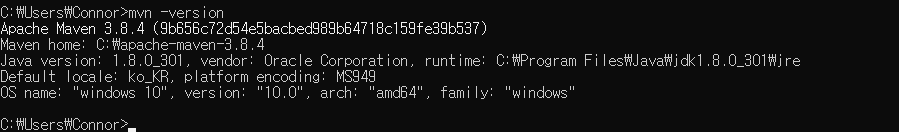
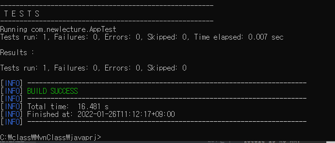
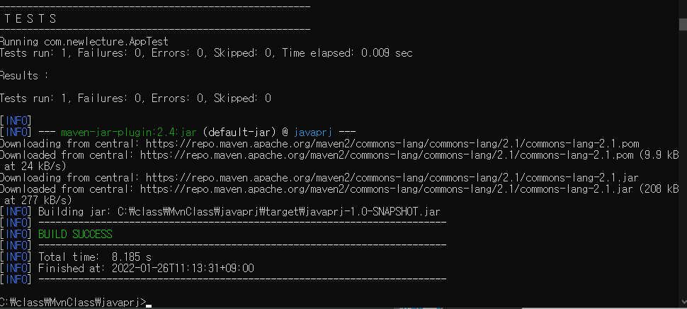
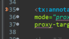
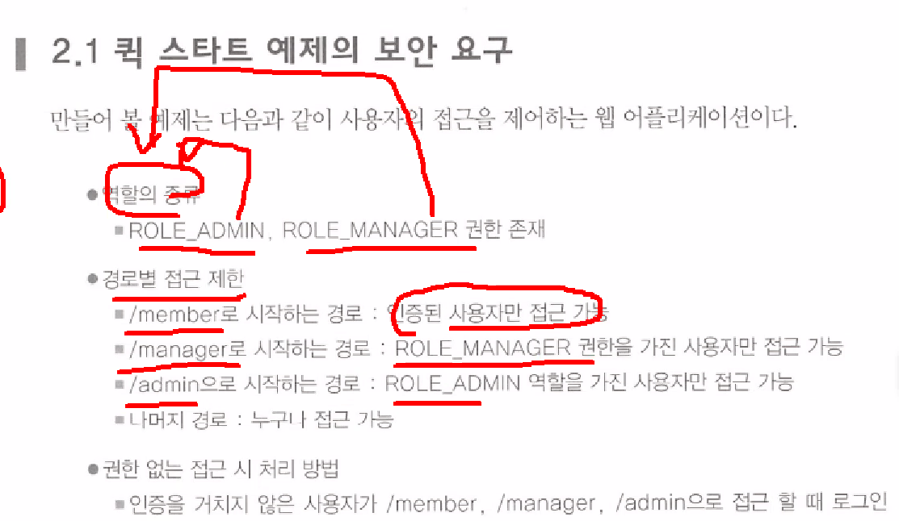
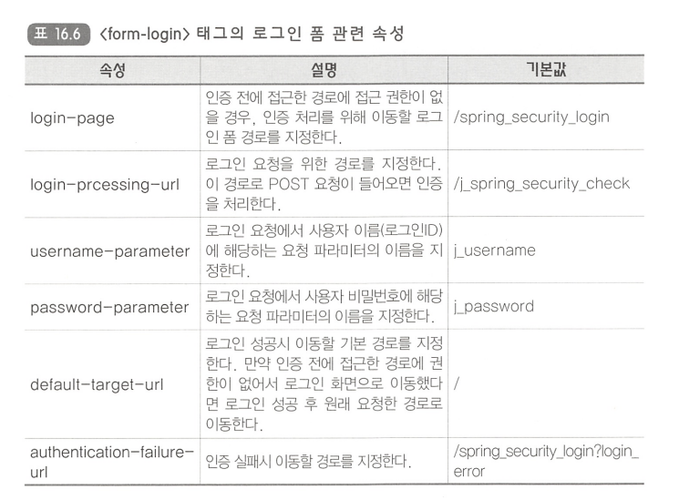

# 1.26

- 페이지 집중화 (모듈화): 유지, 보수, 확장성 ~ 
- inc 폴더 + jsp 모듈화
- tiles.jar 다운받아서 lib 폴더 10개
- [xml] 타일즈 관련 빈 등록: viewResolver 2개 + tiles-defs.xml
- tiles-defs.xml


문제) STSMVC 2 프로젝트 생성

- 스프링 버전 4.0.4 수정
- jre 1.6 -> 1.8
- home.jsp 브라우저 출력
- hello world 
- 시간


1. STS3 = 1. spring lagacy project
   - spring boot project
   - STS 3.9.13 (Eclipse 2020-06 (4.16.0))
   - STS4 = 2. spring boot project
2. STSMVC02 프로젝트 생성
3. 메이븐 (maven) / 그래들 (gradle)
   - 빌드도구
   - 빌드 ? 컴파일 + 실행
   - 프로젝트 생성부터 배포에 관련된 전 과정을 통합하여 관리할 수 있는 도구 (툴)
   - 프로젝트 전 과정
     1. 프로젝트 생성     eclipse + 메이븐 plugin /   sts 
     2. 라이브러리 설정                 lib 폴더  /  pom.xml
     3. 코딩 (개발) 작업
     4. 컴파일 (.class)
     5. 테스트   junit 단위 테스트
     6. 패키지 생성
     7. 인스톨
     8. 배포 Git (형사완리도구)
4. 메이븐 다운로드 + 설치 설정
   - http://maven.apache.org
   - M2_HOME 환경설정: `C:\apache-maven-3.8.4` 
   - path 환경설정 `%M2_HOME%bin` 
5. mvn.exe 메이븐 프로젝트 생성
   - +++ java Project +++
   - web Project


**[메이븐 설치]**

http://maven.apache.org

Download - Files - Binary zip archive 의 Link 다운로드

`tar.gz` 리눅스용이다.

압축풀어서 C 드라이브에 apache-maven-3.8.4 폴더 붙여넣는다.




환경변수를 설정 후 cmd 를 껐다켜서 mvn -version 으로 확인한다.


**archetype**

- `quickstart` java project
- `webapp` jsp project

**cmd**

```
C:\class\MvnClass>
```

```
mvn archetype:generate -DgroupId=com.newlecture -DartifactId=javaprj -DarchetypeArtifactId=maven-archetype-quickstart
```

자바프로젝트를 생성하는 명령어이다.

중간에 두 번 멈추는데 엔터를 두번 입력하면 

BUILD SUCCESS 의 초록색 글자를 볼 수 있다.

`javaprj` 폴더가 생긴다.

**cmd**

```
C:\class\MvnClass\javaprj>
```

```
mvn compile
```

컴파일 후 target 폴더가 생긴다.


**[단위 테스트]**



**cmd**

```
mvn test
```


(6) 패키지 생성



```
mvn package
```

javaprj-1.0-SNAPSHOT.jar 생성

(7) 인스톨 (설치): 로컬 저장소 (local repository) 에 설치된다.

```
mvn install
```


**레포지토리**

```
C:\Users\Connor\.m2\repository
```

로컬 저장소이다.

(8) 배포: 로컬저장소 -> 원격저장소

---

이 과정들이

이클립스 + 메이븐 플러그인으로 할 수 있다.


이클립스 - MvnClass 로 workspace 설정

maven project - next - Filter 에 quickstart (java project) 검색 - 


github.ywchang             maven-archetype-quickstart 선택

Group id: com.newlecture

Artifact id: mJavaPro


jar 파일 이렇게 추가할 수 있다.

프로젝트 우클릭 - Maven


Show View - maven 검색 후 maven repository


mvn repository: https://mvnrepository.com/

springTiles 프로젝트를 STSMVC02 프로젝트 설정


이클립스 -> 다이나믹 웹 프로젝트 생성 + 스프링 모듈 + 코딩

STS 툴 -> 스프링 MVC 프로젝트 생성해서 개발

**[다른프로젝트 -> 스프링프로젝트]**

1. web.xml 파일을 web_original.xml 파일명 수정 - 사용 X
   - springTiles 프로젝트의 web.xml 복사해서 붙이기
2. spring 폴더 servlet-context.xml, root-context.xml 사용 X
   - springTiles 프로젝트의 dispatcher-service.xml, dispatcher-servlet.xml
   - tiles-defs.xml 복사 붙이기
   - lib 폴더 - jar 파일을 추가 X
   - pom.xml
3. WEB-INF/views 폴더 생성해서 모든 jsp 파일 옮겨놨다.
   - views 복사
   - lib 폴더 - jar 파일을 추가 X
4. springTiles 프로젝트
5. springTiles 프로젝트의 webapp 폴더 안에
   - css
   - customer
   - images
   - inc
   - joinus
   - js
   - mypage 
   - STSMVC02 프로젝트의 webapp 폴더 안에 복사 붙이기
   - 5-2. index.css, index.htm 복사
6. pom.xml 모듈 추가


org.doit.web 에 controllers 와 newlecture 패키지를 복사한다.


**pom.xml**

```xml
<version>${org.springframework-version}</version>
```

properties 의 4.0.4.RELEASE 값을 가져온다.


```xml
<!-- Test: 112 번째 줄 -->
<dependency>
    <groupId>junit</groupId>
    <artifactId>junit</artifactId>
    <version>4.12</version>
    <scope>test</scope>
</dependency>        
```

4.7 -> 4.12 로 수정한다.

- [Maven Repository](https://tiles.apache.org/download.html#Tiles_2_as_a_Maven_dependency) - 

```xml
<dependency>
    <groupId>org.apache.tiles</groupId>
    <artifactId>tiles-jsp</artifactId>
    <version>2.2.2</version>
</dependency>
```

이 코드를 추가하면 tiles 관련 jar 파일들이 추가된다.

사이트가서 찾기 힘드므로

https://mvnrepository.com/ 에서 tiles 를 검색한다.

[Tiles JSP Support](https://mvnrepository.com/artifact/org.apache.tiles/tiles-jsp) - maven 탭의 dependency 코드 붙여넣는다.

spring-jdbc 검색 - [4.0.2.RELEASE](https://mvnrepository.com/artifact/org.springframework/spring-jdbc/4.0.2.RELEASE)

```xml
<dependency>
    <groupId>org.springframework</groupId>
    <artifactId>spring-jdbc</artifactId>
    <version>4.0.2.RELEASE</version>
</dependency>
```

```xml
<dependency>
    <groupId>org.springframework</groupId>
    <artifactId>spring-jdbc</artifactId>
    <version>${org.springframework-version}</version>
</dependency>
```

이렇게 작성하는 것이 확장성에 좋다.


(3) fileUpload

(4)


fileupload 검색 - Apache Commons FileUpload](https://mvnrepository.com/artifact/commons-fileupload/commons-fileupload) - 1.2

```xml
<dependency>
    <groupId>commons-fileupload</groupId>
    <artifactId>commons-fileupload</artifactId>
    <version>1.2</version>
</dependency>
```

cglib 검색 - [CGLib](https://mvnrepository.com/artifact/cglib/cglib) - 

```xml
<dependency>
    <groupId>cglib</groupId>
    <artifactId>cglib</artifactId>
    <version>2.2</version>
</dependency>
```


톰캣 [8.5.73](https://mvnrepository.com/artifact/org.apache.tomcat/tomcat-dbcp/8.5.73)

```xml
<dependency>
    <groupId>org.apache.tomcat</groupId>
    <artifactId>tomcat-dbcp</artifactId>
    <version>8.5.73</version>
</dependency>
```


ojdbc

라이센스문제로 메이븐 레포지토리에 있는 걸 사용하면 안된다.

로컬저장소 .m2 > repository mvn 메이븐 빌드도구를 사용해서 


(6) pom.xml 모듈 추가

- c:\ojdbc6.jar 확인
- cmd
- `cd c:\` 로컬 저장소에 ojdbc6.jar 등록 (install)

**cmd**

```
mvn install:install-file  "-Dfile=ojdbc6.jar" "-DgroupId=com.oracle" "-DartifactId=ojdbc" "-Dversion=6.0" "-Dpackaging=jar"
```

쌍따옴표 없어도 된다.

패키지: -DgroupId=com.oracle

프로젝트명: -DartifactId=ojdbc

버전: Dversion=6.0

**결과**

```
[INFO] --- maven-install-plugin:2.4:install-file (default-cli) @ standalone-pom ---
[INFO] Installing c:\ojdbc6.jar to C:\Users\Connor\.m2\repository\com\oracle\ojdbc\6.0\ojdbc-6.0.jar
[INFO] Installing C:\Users\Connor\AppData\Local\Temp\mvninstall3856202711984190658.pom to C:\Users\Connor\.m2\repository\com\oracle\ojdbc\6.0\ojdbc-6.0.pom
[INFO] ------------------------------------------------------------------------
[INFO] BUILD SUCCESS
```


```
C:\Users\Connor\.m2\repository\com\oracle\ojdbc\6.0\ojdbc-6.0.pom
```

이 경로에 저장된다.

혹은 다른방법

프로젝트 우클릭 - maven - add dependency 검색

```xml
<!-- 7. ojdbc -->
<dependency>
    <groupId>com.oracle</groupId>
    <artifactId>ojdbc</artifactId>
    <version>6.0</version>
</dependency>	
```

ojdbc-6.0.pom 에서 groupId 부터 세 줄을 가져온다.


**오류**

```java
@Controller("o_homeController")
```

클래스명이 겹치면 컨트롤러 이름을 변경한다.


**[STSMVC03]**

WEB-INF/spring/root-context.xml: dispatcher-service.xml

WEB-INF/spring/appServlet/servlet-context.xml: dispatcher-service.xml


**web.xml**

```xml
<?xml version="1.0" encoding="UTF-8"?>
<web-app version="2.5" xmlns="http://java.sun.com/xml/ns/javaee"
	xmlns:xsi="http://www.w3.org/2001/XMLSchema-instance"
	xsi:schemaLocation="http://java.sun.com/xml/ns/javaee https://java.sun.com/xml/ns/javaee/web-app_2_5.xsd">

	<!-- The definition of the Root Spring Container shared by all Servlets and Filters -->
	<context-param>
		<param-name>contextConfigLocation</param-name>
		<param-value>/WEB-INF/spring/root-context.xml</param-value>
	</context-param>
	
	<!-- Creates the Spring Container shared by all Servlets and Filters -->
	<listener>
		<listener-class>org.springframework.web.context.ContextLoaderListener</listener-class>
	</listener>

	<!-- Processes application requests -->
	<servlet>
		<servlet-name>appServlet</servlet-name>
		<servlet-class>org.springframework.web.servlet.DispatcherServlet</servlet-class>
		<init-param>
			<param-name>contextConfigLocation</param-name>
			<param-value>/WEB-INF/spring/appServlet/servlet-context.xml</param-value>
		</init-param>
		<load-on-startup>1</load-on-startup>
	</servlet>
		
	<servlet-mapping>
		<servlet-name>appServlet</servlet-name>
		<url-pattern>*.htm</url-pattern>
	</servlet-mapping>
	
	<!-- 인코딩 -->
    <filter>
      <filter-name>encodingFilter</filter-name>
      <filter-class>org.springframework.web.filter.CharacterEncodingFilter</filter-class>
      <init-param>
         <param-name>encoding</param-name>
         <param-value>UTF-8</param-value>
      </init-param>
    </filter>
    <filter-mapping>
      <filter-name>encodingFilter</filter-name>
      <url-pattern>/*</url-pattern>
    </filter-mapping>
</web-app>
```

**root-context.xml**

```xml
<?xml version="1.0" encoding="UTF-8"?>
<beans xmlns="http://www.springframework.org/schema/beans"
	xmlns:xsi="http://www.w3.org/2001/XMLSchema-instance"
	xsi:schemaLocation="http://www.springframework.org/schema/beans https://www.springframework.org/schema/beans/spring-beans.xsd">
	
	<bean id="dataSource" class="org.springframework.jdbc.datasource.DriverManagerDataSource">
		<property name="driverClassName" value="oracle.jdbc.driver.OracleDriver"></property>
		<property name="url" value="jdbc:oracle:thin:@localhost:1521:xe"></property>
		<property name="username" value="scott"></property>
		<property name="password" value="tiger"></property>
	</bean>
	
<!-- 	NamedParameterJddbcTemplate 템플릿 클래스 사용 -->
	<bean id="jdbcTemplate" class="org.springframework.jdbc.core.namedparam.NamedParameterJdbcTemplate">
		<constructor-arg ref="dataSource"/>
	</bean>
	
	<!-- 스프링 트랜잭션을 처리할 트랜잭션 메니져 등록 -->
	<bean id="transactionManager" class="org.springframework.jdbc.datasource.DataSourceTransactionManager">
		<property name="dataSource" ref="dataSource"/>
	</bean>
	
	<!-- 트랜잭션 템플릿 객체 -->
	<bean id="transactionTemplate" class="org.springframework.transaction.support.TransactionTemplate">
		<property name="transactionManager" ref="transactionManager"/>
	</bean>
</beans>
```

**servlet-context.xml**

```xml
<?xml version="1.0" encoding="UTF-8"?>
<beans:beans xmlns="http://www.springframework.org/schema/mvc"
	xmlns:xsi="http://www.w3.org/2001/XMLSchema-instance"
	xmlns:beans="http://www.springframework.org/schema/beans"
	xmlns:context="http://www.springframework.org/schema/context"
	xmlns:tx="http://www.springframework.org/schema/tx"
	xmlns:p="http://www.springframework.org/schema/p"
	xsi:schemaLocation="http://www.springframework.org/schema/mvc https://www.springframework.org/schema/mvc/spring-mvc.xsd
		http://www.springframework.org/schema/beans https://www.springframework.org/schema/beans/spring-beans.xsd
		http://www.springframework.org/schema/context https://www.springframework.org/schema/context/spring-context.xsd
		http://www.springframework.org/schema/tx http://www.springframework.org/schema/tx/spring-tx-4.0.xsd">

	<!-- DispatcherServlet Context: defines this servlet's request-processing infrastructure -->
	
	<!-- Enables the Spring MVC @Controller programming model -->
	<annotation-driven />

	<!-- Handles HTTP GET requests for /resources/** by efficiently serving up static resources in the ${webappRoot}/resources directory -->
	<resources mapping="/resources/**" location="/resources/" />

	<!-- Resolves views selected for rendering by @Controllers to .jsp resources in the /WEB-INF/views directory -->
	
<!-- 	<beans:bean class="org.springframework.web.servlet.view.InternalResourceViewResolver"> -->
<!-- 		<beans:property name="prefix" value="/WEB-INF/views/" /> -->
<!-- 		<beans:property name="suffix" value=".jsp" /> -->
<!-- 	</beans:bean> -->
	
	<context:component-scan base-package="org.doit.web" />
	
	<beans:bean id="multipartResolver" 
	class="org.springframework.web.multipart.commons.CommonsMultipartResolver">
		<beans:property name="maxUploadSize" value="-1"/>
	</beans:bean>
	
	<tx:annotation-driven transaction-manager="transactionManager"
	mode="proxy"
	proxy-target-class="false"/>

	<!-- 추가	 -->
	<beans:bean id="tilesConfigurer" 
		class="org.springframework.web.servlet.view.tiles2.TilesConfigurer">
		<beans:property name="definitions" value="/WEB-INF/tiles-defs.xml"/>
	</beans:bean>
	
	<!-- 추가	 -->
	<beans:bean class="org.springframework.web.servlet.view.UrlBasedViewResolver">
		<beans:property name="viewClass" value="org.springframework.web.servlet.view.tiles2.TilesView"/>
	</beans:bean>
</beans:beans>
```

`bean` 태그를 `beans:bean` 태그로 변경

`property` 태그를 `beans:property` 태그로 변경한다.


nameespaces 에서 체크만 하면 자동으로 import 된다.

root-context.xml 에서 beans Graph 를 볼 수 있다.




AOP 마커가 있다.


`xmlns:tx` xml name space. 접두어가 tx 이다.

**servlet-context.xml**

```xml
<?xml version="1.0" encoding="UTF-8"?>
<beans xmlns:mvc="http://www.springframework.org/schema/mvc"
	xmlns:xsi="http://www.w3.org/2001/XMLSchema-instance"
	xmlns="http://www.springframework.org/schema/beans"
	xmlns:context="http://www.springframework.org/schema/context"
	xmlns:tx="http://www.springframework.org/schema/tx"
	xmlns:p="http://www.springframework.org/schema/p"
	xsi:schemaLocation="http://www.springframework.org/schema/mvc https://www.springframework.org/schema/mvc/spring-mvc.xsd
		http://www.springframework.org/schema/beans https://www.springframework.org/schema/beans/spring-beans.xsd
		http://www.springframework.org/schema/context https://www.springframework.org/schema/context/spring-context.xsd
		http://www.springframework.org/schema/tx http://www.springframework.org/schema/tx/spring-tx-4.0.xsd">

	<!-- DispatcherServlet Context: defines this servlet's request-processing infrastructure -->
	
	<!-- Enables the Spring MVC @Controller programming model -->
	<mvc:annotation-driven />

	<!-- Handles HTTP GET requests for /resources/** by efficiently serving up static resources in the ${webappRoot}/resources directory -->
	<mvc:resources mapping="/resources/**" location="/resources/" />

	<context:component-scan base-package="org.doit.web" />
	
	<bean id="multipartResolver" 
	class="org.springframework.web.multipart.commons.CommonsMultipartResolver">
		<property name="maxUploadSize" value="-1"/>
	</bean>
	
	<tx:annotation-driven transaction-manager="transactionManager"
	mode="proxy"
	proxy-target-class="false"/>

	<!-- 추가	 -->
	<bean id="tilesConfigurer" 
		class="org.springframework.web.servlet.view.tiles2.TilesConfigurer">
		<property name="definitions" value="/WEB-INF/tiles-defs.xml"/>
	</bean>
	
	<!-- 추가	 -->
	<bean class="org.springframework.web.servlet.view.UrlBasedViewResolver">
		<property name="viewClass" value="org.springframework.web.servlet.view.tiles2.TilesView"/>
	</bean>
</beans>
```

bean 을 기본 name space 로 만든다.

## **STSSecurity**

챕터 16. 654p

1. 웹 개발자가 해야할 웹 보안 3가지
   - 인증 (Authenication) - 로그인 (현재 사용자) 확인
   - 인가 (Authorization) - 현재 사용자 권한
   - 권한 없을 시 UI 처리
2. 롤 (role == 역할) 개념 도입
   - ROLE_ADMIN, ROLE_USER
3. 스프링 시큐리티 프로젝트 - 웹 보안 측면 구현 유사한 기본 틀
   - 기본 제공 + 확장
   - 보다 빠르게 웹 보안 (인증, 인가) 를 구현할 수 있다.
4. 공지사항
   - /customer/noticeDetail.htm 요청        인증
   - /customer/noticeReg.htm 요청           인증 + 인가 (관리자)
   - 그 외 공지사항 요청은 인증 X, 인가 X 허용




`spring-security-web`

`spring-security-config`

**pom.xml**

```xml
<!-- 보안 -->
<dependency>
    <groupId>org.springframework.security</groupId>
    <artifactId>spring-security-web</artifactId>
    <version>${org.springframework-version}</version>
</dependency>

<dependency>
    <groupId>org.springframework.security</groupId>
    <artifactId>spring-security-config</artifactId>
    <version>${org.springframework-version}</version>
</dependency>

<dependency>
    <groupId>org.springframework.security</groupId>
    <artifactId>spring-security-taglibs</artifactId>
    <version>${org.springframework-version}</version>
</dependency>
```

(5) 메이븐 의존 모듈 설정

(6) 스프링 시큐리티 XML 설정파일

658p

교재: src/main/resources/spring-security.xml 파일 추가

2.5 챕터 662p

**교재**

```xml
<context-param>
    <param-name>contextConfigLocation</param-name>
    <param-value>spring-security.xml</param-value>
</context-param>
```

수업: WEB-INF/spring-security.xml 을 spring bean configuration file 로 추가

자동으로 beans 를 담게된다.

name spaces 에서 context, security, tx 추가한다.


**web.xml**

```xml
<context-param>
    <param-name>contextConfigLocation</param-name>
    <param-value>
        /WEB-INF/spring/root-context.xml
        /WEB-INF/spring-security.xml
    </param-value>
</context-param>
```

param-value 에 추가한다. bean 을 분리해서 담는다.

661p. 2.4 챕터는 아직 하지 않음

661p. 

**web.xml: spring security filter**

```xml
<filter>
    <filter-name>springSecurityFilterChain</filter-name>
    <filter-class>org.springframework.web.filter.DelegatingFilterProxy</filter-class>
</filter>
<filter-mapping>
    <filter-name>springSecurityFilterChain</filter-name>
    <url-pattern>/*</url-pattern>
</filter-mapping>	
```


복습/자소/포폴 + JSP 프로젝트를 STS 스프링으로 메인페이지만 변환...

# 1.27

**오류**

```
org.springframework.beans.factory.NoSuchBeanDefinitionException: No bean named 'springSecurityFilterChain' is defined
```

**pom.xml**

```xml
<?xml version="1.0" encoding="UTF-8"?>
<web-app version="2.5" xmlns="http://java.sun.com/xml/ns/javaee"
	xmlns:xsi="http://www.w3.org/2001/XMLSchema-instance"
	xsi:schemaLocation="http://java.sun.com/xml/ns/javaee https://java.sun.com/xml/ns/javaee/web-app_2_5.xsd">

	<!-- The definition of the Root Spring Container shared by all Servlets and Filters -->
	<context-param>
		<param-name>contextConfigLocation</param-name>
		<param-value>
			/WEB-INF/spring/root-context.xml
			/WEB-INF/spring-security.xml
		</param-value>
	</context-param>
	
	<!-- Creates the Spring Container shared by all Servlets and Filters -->
	<listener>
		<listener-class>org.springframework.web.context.ContextLoaderListener</listener-class>
	</listener>

	<!-- Processes application requests -->
	<servlet>
		<servlet-name>appServlet</servlet-name>
		<servlet-class>org.springframework.web.servlet.DispatcherServlet</servlet-class>
		<init-param>
			<param-name>contextConfigLocation</param-name>
			<param-value>/WEB-INF/spring/appServlet/servlet-context.xml</param-value>
		</init-param>
		<load-on-startup>1</load-on-startup>
	</servlet>
		
	<servlet-mapping>
		<servlet-name>appServlet</servlet-name>
		<url-pattern>*.htm</url-pattern>
	</servlet-mapping>
	
    <!-- 추가: spring security 관련 필터 -->
    <filter>
      <filter-name>springSecurityFilterChain</filter-name>
      <filter-class>org.springframework.web.filter.DelegatingFilterProxy</filter-class>
    </filter>
    <filter-mapping>
      <filter-name>springSecurityFilterChain</filter-name>
      <url-pattern>/*</url-pattern>
    </filter-mapping>	
	
	<!-- 인코딩 -->
    <filter>
      <filter-name>encodingFilter</filter-name>
      <filter-class>org.springframework.web.filter.CharacterEncodingFilter</filter-class>
      <init-param>
         <param-name>encoding</param-name>
         <param-value>UTF-8</param-value>
      </init-param>
    </filter>
    <filter-mapping>
      <filter-name>encodingFilter</filter-name>
      <url-pattern>/*</url-pattern>
    </filter-mapping>
</web-app>
```

spring security 를 주석처리하면 오류가나지 않는다.

해결: spring-security.xml 파일의 내용을 채우니 에러가 나지 않는다.

1. notice.htm 목록 요청 -> 인증 X, 권한 X
2. noticeDetail.htm 상세보기 요청 -> 인증 O, 권한 X
3. noticeReg.htm 쓰기 요청 -> 인증 O, 권한 O
4. 웹보안 (인증 + 권한) 설정파일: spring-security.xml


**spring-security.xml: 4.0.4**

```xml
<?xml version="1.0" encoding="UTF-8"?>
<beans:beans xmlns:beans="http://www.springframework.org/schema/beans"
	xmlns="http://www.springframework.org/schema/security"
	xmlns:xsi="http://www.w3.org/2001/XMLSchema-instance"
	xsi:schemaLocation="http://www.springframework.org/schema/security http://www.springframework.org/schema/security/spring-security-4.0.xsd
		http://www.springframework.org/schema/beans http://www.springframework.org/schema/beans/spring-beans.xsd">
		
	<!-- 추가: 보안 (인증 + 권한) 설정 -->
	<!-- auto-config="true" 속성 ? 스프링이 제공하는 로그인 전용 페이지로 이동 -->
	<http auto-config="true">
		<intercept-url pattern="/customer/noticeDetail.htm" access="ROLE_USER"/>
		<intercept-url pattern="/customer/noticeEdit.htm" access="ROLE_ADMIN"/>
		<intercept-url pattern="/customer/noticeReg.htm" access="ROLE_ADMIN"/>
	</http>
	
	<!-- 추가: 로그인 -->
	<authentication-manager>
		<authentication-provider>
			<user-service>
				<user name="hong" authorities="ROLE_USER" password="1111"/>
				<user name="admin" authorities="ROLE_ADMIN" password="2222"/>
				<user name="kenik" authorities="ROLE_ADMIN, ROLE_USER" password="1234"/>
			</user-service>
		</authentication-provider>	
	</authentication-manager>
</beans:beans>
```

로그인 처리 X - 사용자 정보 -> member 테이블

in-memory 방식으로 사용자계정, 권한설정해서 등록


의존모듈 충돌을 dependencyManagement 태그를 사용한다.


 

```xml
<org.springframework-version>3.1.1.RELEASE</org.springframework-version>
```

4.0.4 -> 3.1.1 로 변경

버전 변경 후 

**spring-security.xml: 3.1.1**

```xml
<?xml version="1.0" encoding="UTF-8"?>
<beans:beans xmlns:beans="http://www.springframework.org/schema/beans"
   xmlns="http://www.springframework.org/schema/security"
   xmlns:xsi="http://www.w3.org/2001/XMLSchema-instance"
   xsi:schemaLocation="http://www.springframework.org/schema/beans   
       http://www.springframework.org/schema/beans/spring-beans.xsd
       http://www.springframework.org/schema/security
       http://www.springframework.org/schema/security/spring-security.xsd">		
	<!-- 추가: 보안 (인증 + 권한) 설정 -->
	<!-- auto-config="true" 속성 ? 스프링이 제공하는 로그인 전용 페이지로 이동 -->
	<http auto-config="true">
		<intercept-url pattern="/customer/noticeDetail.htm" access="ROLE_USER"/>
		<intercept-url pattern="/customer/noticeEdit.htm" access="ROLE_ADMIN"/>
		<intercept-url pattern="/customer/noticeReg.htm" access="ROLE_ADMIN"/>
	</http>
	
	<!-- 추가: 로그인 -->
	<authentication-manager>
		<authentication-provider>
			<user-service>
				<user name="hong" authorities="ROLE_USER" password="1111"/>
				<user name="admin" authorities="ROLE_ADMIN" password="2222"/>
				<user name="kenik" authorities="ROLE_ADMIN, ROLE_USER" password="1234"/>
			</user-service>
		</authentication-provider>	
	</authentication-manager>
</beans:beans>
```


**수정**

1. pom.xml 버전변경
2. spring-security.xml 변경


**pom.xml**

```xml
<org.springframework-version>3.1.1.RELEASE</org.springframework-version>
```

**spring-security.xml**

```xml
<?xml version="1.0" encoding="UTF-8"?>
<beans:beans xmlns:beans="http://www.springframework.org/schema/beans"
   xmlns="http://www.springframework.org/schema/security"
   xmlns:xsi="http://www.w3.org/2001/XMLSchema-instance"
   xsi:schemaLocation="http://www.springframework.org/schema/beans   
       http://www.springframework.org/schema/beans/spring-beans.xsd
       http://www.springframework.org/schema/security
       http://www.springframework.org/schema/security/spring-security.xsd">		
	<!-- 추가: 보안 (인증 + 권한) 설정 -->
	<!-- auto-config="true" 속성 ? 스프링이 제공하는 로그인 전용 페이지로 이동 -->
	<http auto-config="true">
		<intercept-url pattern="/customer/noticeDetail.htm" access="ROLE_USER"/>
		<intercept-url pattern="/customer/noticeEdit.htm" access="ROLE_ADMIN"/>
		<intercept-url pattern="/customer/noticeReg.htm" access="ROLE_ADMIN"/>
	</http>
	
	<!-- 추가: 로그인 -->
	<authentication-manager>
		<authentication-provider>
			<user-service>
				<user name="hong" authorities="ROLE_USER" password="1111"/>
				<user name="admin" authorities="ROLE_ADMIN" password="2222"/>
				<user name="kenik" authorities="ROLE_ADMIN, ROLE_USER" password="1234"/>
			</user-service>
		</authentication-provider>	
	</authentication-manager>
</beans:beans>
```


**[사용자 로그인]**

**spring-security.xml**

```xml
<form-login login-page="/joinus/login.htm"/>
```

**전체코드**

```xml
<?xml version="1.0" encoding="UTF-8"?>
<beans:beans xmlns:beans="http://www.springframework.org/schema/beans"
   xmlns="http://www.springframework.org/schema/security"
   xmlns:xsi="http://www.w3.org/2001/XMLSchema-instance"
   xsi:schemaLocation="http://www.springframework.org/schema/beans   
       http://www.springframework.org/schema/beans/spring-beans.xsd
       http://www.springframework.org/schema/security
       http://www.springframework.org/schema/security/spring-security.xsd">		
	<!-- 추가: 보안 (인증 + 권한) 설정 -->
	<!-- auto-config="true" 속성 ? 스프링이 제공하는 로그인 전용 페이지로 이동 -->
	<http auto-config="true">
		
		<!-- 2. 사용자 로그인 페이지를 사용하도록 설정. -->
		<form-login login-page="/joinus/login.htm"/>
		<intercept-url pattern="/customer/noticeDetail.htm" access="ROLE_USER"/>
		<intercept-url pattern="/customer/noticeEdit.htm" access="ROLE_ADMIN"/>
		<intercept-url pattern="/customer/noticeReg.htm" access="ROLE_ADMIN"/>
	</http>
	
	<!-- 추가: 로그인 -->
	<authentication-manager>
		<authentication-provider>
			<user-service>
				<user name="hong" authorities="ROLE_USER" password="1111"/>
				<user name="admin" authorities="ROLE_ADMIN" password="2222"/>
				<user name="kenik" authorities="ROLE_ADMIN, ROLE_USER" password="1234"/>
			</user-service>
		</authentication-provider>	
	</authentication-manager>
</beans:beans>
```

오류: 폼태그를 넘겨주지 못하므로 form 태그의 action 속성값을 바꿔야한다.




p.708

| 속성     | 기본값                               |
| -------- | ------------------------------------ |
| action   | /j_spring_security_check             |
| ID       | j_username                           |
| password | j_password                           |
| logout   | contextPath/j_spring_security_logout |


**login.jsp**

```jsp
<form action='<c:url value="/j_spring_security_check"/>' method="post">
```

(5) 로그인이 실패했을 때 처리

**spring-security.xml**

```xml
<form-login 
            login-page="/joinus/login.htm"
            authentication-failure-url="/joinus/login.htm?error"
            />
```


**로그인실패: login.jsp**

```jsp
<c:if test="${param.error != null}">
    아이디 또는 패스워드가 잘못되었습니다.<br>
    <c:if test="${SPRING_SECURITY_LAST_EXCEPTION != null }">
        Message: <c:out value="${SPRING_SECURITY_LAST_EXCEPTION.message }"></c:out>
    </c:if>
</c:if>
```

> not empty 와 != null 은 다르다.

(6) 로그인 했다면 header 부분 [hong] 님 로그인했습니다.

1. [hong] 님 로그인했습니다.
2. 로그아웃

**header.jsp**

```jsp
<c:if test="${empty pageContext.request.userPrincipal }">
    <a href="${pageContext.request.contextPath }/joinus/login.htm">로그인</a>
</c:if>
<c:if test="${pageContext.request.userPrincipal }">
    <a href="${pageContext.request.contextPath }/j_spring_security_logout">
        [${pageContext.request.userPrincipal.name }] 로그아웃
    </a>
</c:if>
```

**spring-security.xml**

```xml
<logout logout-success-url="/customer/notice.htm"/>
```


**쌤코드: header.jsp**

```jsp
<!-- 로그인(인증) 여부를 확인 해서  -->
<c:if
      test="${ empty pageContext.request.userPrincipal }">
    <a href="${ pageContext.request.contextPath }/joinus/login.htm">로그인</a>
</c:if> <c:if test="${ not empty pageContext.request.userPrincipal }">
    <a
       href="${ pageContext.request.contextPath }/j_spring_security_logout">
        [${ pageContext.request.userPrincipal.name }] 로그아웃 </a>
</c:if>
```


**spring-security.xml**

```xml
<form-login 
            login-page="/joinus/login.htm"
            authentication-failure-url="/joinus/login.htm?error"
            default-target-url="/customer/notice.htm"
            />
```

`default-target-url` 로그인 후 연결되는 페이지

(7) spring-security-taglibs 모듈 추가

- 스프링 시큐리티 태그를 사용해서 코딩

**header.jsp**

```jsp
<%@taglib prefix="s" uri="http://www.springframework.org/security/tags" %>


```

pom.xml 에서 import 후 taglib 사용

`<c:if>` 대신 이 코드를 사용한다.

**notice.jsp**

```jsp
<%@taglib prefix="s" uri="http://www.springframework.org/security/tags" %>

<s:authorize ifAllGranted="ROLE_USER, ROLE_ADMIN">
    <a class="btn-write button" href="noticeReg.htm">글쓰기</a>
</s:authorize>
```

(8) notice.jsp 페이지

[글쓰기] kenik 계정으로 로그인해야만 사용할 수 있다.

(9) 새글 작성하면 항상 로그인한 계정으로 글쓰기 되지 않고 고정된 ID 값


**체크제약조건 제거**

```sql
ALTER TABLE member
DROP CONSTRAINT ck_member_point;
```

ㄴ. CustomerController.java

noticeReg() 함수


**CustomerController.java**

```java
UserDetails user = (UserDetails) SecurityContextHolder.getContext().getAuthentication();
user.getUsername();
```

혹은

```java
@RequestMapping(value = {"noticeReg.htm"}, method = RequestMethod.POST)
public String noticeReg(
    Notice notice
    , HttpServletRequest request
    , Principal principal
) throws Exception {
```

```java
principal.getName();
```


**NLMemberShipService.java**

```java
@Override
public void insertAndPointUpOfMember(Notice notice, String id) throws ClassNotFoundException, SQLException {
    notice.setWriter(id);
    noticeDao.insert(notice); // kk0939 / 2
}
```


등


(10) member 테이블의 계정으로 로그인처리 ... 구현 - DB 연동 + 스프링 시큐리티


```sql
select id as username, pwd as password, 1 as enabled from member where id = ?
```

**spring-security.xml**

```xml
<authentication-manager>
    <authentication-provider>
        <jdbc-user-service 
                           data-source-ref="dataSource"
                           users-by-username-query="select id as username, pwd as password, 1 as enabled from member where id = ?"
                           authorities-by-username-query="select id as  username , case when id='admin' then 'ROLE_ADMIN' else 'ROLE_USER' end as authority from member where id = ?"
                           </authentication-provider>	
        </authentication-manager>
```


**[mybatis]**

ORM 프레임워크중에 

- 마이바티스
- 하이버네이트
- JPA 등등

p.565

1. 스프링 4.x 에는 mybatis (ibatis 2.0) 연동기능포함 X
   - 스프링 3.x
2. mybatis 를 스프링과 연동하는 과정 (방법)
   - mybatis-spring 모듈 추가 - pom.xml
   - SqlSessionFactoryBeaan 을 이용해서 SqlSessionFactory 설정 - rootContext.xml
   - 트랜잭션 설정
   - mybatis 를 통해서 DAO 구현
     1. SqlSession 이용해서 구현
     2. 매퍼동적생성 이용해서 구현


```xml
<dependency>
    <groupId>org.mybatis</groupId>
    <artifactId>mybatis</artifactId>
    <version>3.2.3</version>
</dependency>	

<dependency>
    <groupId>org.mybatis</groupId>
    <artifactId>mybatis-spring</artifactId>
    <version>1.2.2</version>
</dependency>	
```

