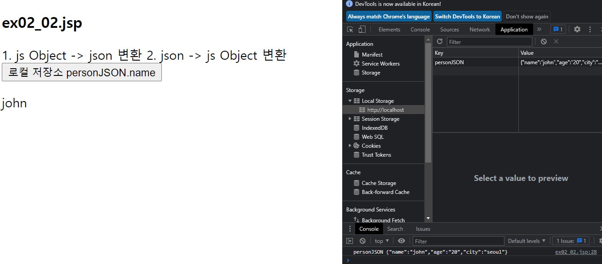
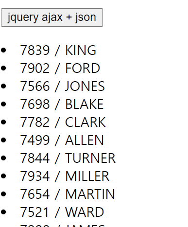

# 1.4


**FileTestController.java**

```java
public class FileTestController extends HttpServlet {

	@Override
	protected void doGet(HttpServletRequest request, HttpServletResponse response)
			throws ServletException, IOException {
		// commandHandler.properties 파일 X
		// [M]VC 모델 X
		// 어떤 요청 URL 에 어떤 커맨드핸들러 객체가 로직처리 X
		String uri = request.getRequestURI();
		Connection con = null;

		try {
			con = ConnectionProvider.getConnection();
			String saveDirectory = request.getRealPath("/days10/upload");
			System.out.println(saveDirectory);
			File saveDir = new File(saveDirectory);
			if (!saveDir.exists())
				saveDir.mkdirs();

			FileTestDAO dao = FileTestDAO.getInstance();

			if (uri.indexOf("list.ss") != -1) {
				ArrayList<FileTestDTO> list = dao.selectFileList(con);
				request.setAttribute("list", list);
				String path = "/days10/ex05_list.jsp";
				RequestDispatcher dispatcher = request.getRequestDispatcher(path);
				dispatcher.forward(request, response);

			} else if (uri.indexOf("write.ss") != -1) {
				// 리다이렉트
				String path = "/days10/ex05_write.jsp";
				RequestDispatcher dispatcher = request.getRequestDispatcher(path);
				dispatcher.forward(request, response);
				

			} else if (uri.indexOf("write_ok.ss") != -1) {
				// request X null -> cos.jar -> mrequest ㄱ.ㄴ.ㄷ.ㄹ.ㅁ.
				int maxPostSize = 5 * 1024 * 1024; // 5MB
				String encoding = "UTF-8";
				
				// cos.jar 파일 중복 -> 클래스 a.txt -> a-(1).txt
				FileRenamePolicy policy = new DefaultFileRenamePolicy();
				MultipartRequest mrequest = new MultipartRequest(
						request
						, saveDirectory
						, maxPostSize
						, encoding
						, policy
						);
				// -> 벌써 업로드한 파일은 저장 완료!!!
				
				// ㄴ. dto
				FileTestDTO dto = new FileTestDTO();
				String subject = mrequest.getParameter("subject");
				dto.setSubject(subject);
				
				// 첨부파일 유무
				File uploadFile = mrequest.getFile("attachFile");
				
				if (uploadFile != null) {
					String fileName = uploadFile.getName();
					long fileLength = uploadFile.length();
					String originalFileName = mrequest.getOriginalFileName("attachFile");
					String filesystemName = mrequest.getFilesystemName("attachFile");	
					
					dto.setFilesystemname(filesystemName);
					dto.setOriginalfilename(originalFileName);
					dto.setFilelength(fileLength);
				}
				int rowCount = dao.insert(con, dto);
				response.sendRedirect("list.ss");

			} else if (uri.indexOf("delete.ss") != -1) {
				// delete.ss?num=1
				// ㄱ. 1번 게시글의 첨부파일이 있는지 확인 - O
				// ㄴ. DB delete + 첨부파일 삭제
				
				int num = Integer.parseInt(request.getParameter("num"));
				String filesystemname = request.getParameter("filesystemname");
				
				String pathname = String.format("%s%s%s"
						, saveDirectory, File.separator, filesystemname);
				File deleteFile = new File(pathname);
				
				if (deleteFile.exists()) {
					deleteFile.delete();
				}
				
				int rowCount = dao.delete(con, num);
				String location = request.getContextPath() + "/days10/ex05_list.ss";
				response.sendRedirect(location);
			} else if (uri.indexOf("update.ss") != -1) {

			}
		} catch (Exception e) {
			e.printStackTrace();
		} finally {
			JdbcUtil.close(con);
		} // try
	} // doGet

	@Override
	protected void doPost(HttpServletRequest request, HttpServletResponse response)
			throws ServletException, IOException {
		doGet(request, response);
	}
}
```

**ex05_list.jsp**

```jsp
<h3 style="text-align:center">FileList - ex05_list.jsp</h3>
<table style="width:600px" border="1" align="center">
    <tr>
        <td align="right" colspan="4">
            <a href="write.ss">WRITE</a>
        </td>
    </tr>
    <tr>
        <td align="center" width="50">글번호</td>
        <td align="left" >제목</td>
        <td align="center" width="200">첨부파일</td>
        <td align="center" width="50">삭제</td>
    </tr>  
    <c:forEach items="${ list }" var="dto">
        <tr>
            <td align="center" width="50">${ dto.num }</td>
            <td align="left" >${ dto.subject }</td>
            <td align="center" width="200">          
                <a href="/jspPro/days10/upload/${ dto.filesystemname }"> ${ empty dto.originalfilename ? "없음" :  dto.originalfilename}</a>
            </td>
            <td align="center" width="50">
                <a href="delete.ss?num=${ dto.num }&filesystemname=${ dto.filesystemname}">삭제</a>
                <a href="update.ss?num=${ dto.num }&filesystemname=${ dto.filesystemname}">수정</a>
            </td>
        </tr>
    </c:forEach>
</table>
```


**ex05_write.jsp**

```jsp
<h3 style="text-align: center">ex05_write.jsp</h3>
<form 
      action="write_ok.ss" 
      method="post"
      enctype="multipart/form-data" >
    <table border="1" style="width: 500px;" align="center">
        <tr>
            <td> subject </td>
            <td> <input type="text" name="subject" /></td>
        </tr>
        <tr>
            <td> attach file </td>
            <td><input type="file" name="attachFile" /></td>
        </tr>
        <tr>
            <td colspan="2"><input type="submit" /></td>
        </tr>
    </table>
</form>	
```

파일업로드와 삭제까지 구현했다.


**FileTestController.java**

```java
public class FileTestController extends HttpServlet{
 
   private static final long serialVersionUID = -8272952047829416881L;

   @Override
   protected void doGet(HttpServletRequest request
         , HttpServletResponse response) throws ServletException, IOException {
        //  commandHandler.properties 파일  X
       //  [M]VC  모델 X
       // 어떤 요청 URL 에 어떤 커맨드핸들러 객체 가 로직 처리. X
      String uri = request.getRequestURI();
      Connection con = null;
      
      try {
         con = ConnectionProvider.getConnection();         
         String saveDirectory = request.getRealPath("/days10/upload");
         System.out.println( saveDirectory ); 
         File saveDir = new File( saveDirectory );
         if( !saveDir.exists() ) saveDir.mkdirs();         
         FileTestDAO dao = FileTestDAO.getInstance();
         
         if( uri.indexOf("list.ss") != -1 ) {
            
            ArrayList<FileTestDTO> list =  dao.selectFileList(con);
            request.setAttribute("list", list);
            String path = "/days10/ex05_list.jsp";
            RequestDispatcher dispatcher = request.getRequestDispatcher(path);
            dispatcher.forward(request, response);
            
         }else if( uri.indexOf("write.ss") != -1 ) {
            
            RequestDispatcher dispatcher = request.getRequestDispatcher("/days10/ex05_write.jsp");
            dispatcher.forward(request, response);
            
         }else if( uri.indexOf("write_ok.ss") != -1 ) {
            // ㄱ. request X null    -> cos.jar -> mrequest ㄱ.ㄴ.ㄷ.ㄹ.ㅁ
            int maxPostSize = 5 * 1024 * 1024 ;  // 5MB
            String encoding = "UTF-8"; 
            FileRenamePolicy policy = new DefaultFileRenamePolicy();
            MultipartRequest mrequest = new MultipartRequest(
                  request
                  ,  saveDirectory       
                  ,  maxPostSize
                  , encoding
                  , policy
                  );
            //      -> 벌써 업로드한  파일은  저장 완료!!! 
            
            // ㄴ. dto
                FileTestDTO dto = new FileTestDTO();
            String subject = mrequest.getParameter("subject");
            dto.setSubject(subject); 
            // 첨부파일 유무
            File uploadFile = mrequest.getFile("attachFile");
            if ( uploadFile != null ) {
               
               String fileName = uploadFile.getName(); 
               long fileLength = uploadFile.length(); 
               String originalFileName = mrequest.getOriginalFileName("attachFile");
               String filesystemName = mrequest.getFilesystemName("attachFile");

               dto.setFilesystemname(filesystemName);
               dto.setOriginalfilename(originalFileName);
               dto.setFilelength(fileLength);
            }
            
            int rowCount = dao.insert(con, dto);
            response.sendRedirect("list.ss");
             
         }else if( uri.indexOf("delete.ss") != -1 ) {
            // delete.ss?num=1&filesystemname=steup.log
            // ㄱ. 1번 게시글의 첨부파일이 있는지 확인 - O
            //  ㄴ. DB delete  + 첨부파일 삭제
            
            int num = Integer.parseInt( request.getParameter("num") );
            String filesystemname = request.getParameter("filesystemname");
            
            String pathname = String.format("%s%s%s"
                  , saveDirectory, File.separator,   filesystemname);
            File deleteFile = new File(pathname);
            if (deleteFile.exists()) {
               deleteFile.delete();
            }
            
            int rowCount = dao.delete(con, num);
            
            String location = "/jspPro/days10/ex05_list.ss";
            response.sendRedirect(location);
            
         }else if( uri.indexOf("update.ss") != -1 ) {
            // update.ss?num=1&filesystemname=Setup.log
            int num = Integer.parseInt( request.getParameter("num") );
            FileTestDTO dto = dao.selectOne(con, num);
            request.setAttribute("dto", dto);
            
            RequestDispatcher dispatcher = request.getRequestDispatcher("/days10/ex05_update.jsp");
            dispatcher.forward(request, response);
            
         }else if( uri.indexOf("update_ok.ss") != -1 ) {
            // ㄱ. write_ok.ss  코딩을 복사 -> 붙이기
            int maxPostSize = 5 * 1024 * 1024 ;  // 5MB
            String encoding = "UTF-8"; 
            FileRenamePolicy policy = new DefaultFileRenamePolicy();
            MultipartRequest mrequest = new MultipartRequest(
                  request
                  ,  saveDirectory       
                  ,  maxPostSize
                  , encoding
                  , policy
                  );
            //      -> 벌써 업로드한  파일은  저장 완료!!! 
            
            // ㄴ. dto
                FileTestDTO dto = new FileTestDTO();
                int num = Integer.parseInt( mrequest.getParameter("num") );
            dto.setNum( num );    
            String subject = mrequest.getParameter("subject");
            dto.setSubject(subject); 
            // 첨부파일 유무
            File uploadFile = mrequest.getFile("attachFile");
            if ( uploadFile != null ) {   //  a.txt파일 삭제                         b.txt 파일 추가
               
               String fileName = uploadFile.getName(); 
               long fileLength = uploadFile.length(); 
               String originalFileName = mrequest.getOriginalFileName("attachFile");
               String filesystemName = mrequest.getFilesystemName("attachFile");

               dto.setFilesystemname(filesystemName);
               dto.setOriginalfilename(originalFileName);
               dto.setFilelength(fileLength);
               
               // 첨부된 파일이 있다면 이전 첨부파일은 삭제 코딩 추가...
               String delete_filesystemname = mrequest.getParameter("filesystemname");
               String deleteFilePath = String.format("%s%s%s",   saveDirectory, File.separator,delete_filesystemname);   
               
               File deleteFile = new File(deleteFilePath);
               if( deleteFile.exists() ) deleteFile.delete(); 
               
               // 1번             제목          파일1     [수정]
               // update.jsp 이동
               // 제목 수정
               // 파일 새로 선택 파일2
               // [수정하기]
            }else {
               // 제목만 수정                + 원래 수정 전 파일 존재 유무
               dto = dao.selectOne(con, num);
               dto.setSubject(mrequest.getParameter("subject"));
            } 
            
            int rowCount = dao.update(con, dto);
            response.sendRedirect("list.ss");
            
            
         } // if
      } catch (Exception e) {
         e.printStackTrace();
      }finally {
           try {
            con.close();
          } catch (SQLException e) { 
            e.printStackTrace();
         }   
      } // try      
      
   } // doGet

   @Override
   protected void doPost(HttpServletRequest request
         , HttpServletResponse response) throws ServletException, IOException {
      doGet(request, response);
   }
}
```

수정까지 잘 구현된다.


**[ajax]**

오후 

```jsp
<!--
    days11 폴더 추가 
    ㄴ ex01.jsp 파일 추가

    [ AJAX 에이작스, 아작스 ([A]synchronous [J]avascript [A]nd [X]ML))-]
    비동기적인            자바스크립스               XML
    ㄱ. 자바스크립트 언어를 사용해서 XML 데이터를 비동기적으로 서버-클라이언트의  처리 기술
    ㄴ. 비동기적 의미 ? 웹 페이지 전체를 다시 요청->응답 X  로딩되지 않고    웹 페이지를 업데이트
    ㄷ. 예)
    예) 회원가입 
    이름
    생년월일
    주소
    기타
    기타
    아이디 : [             kenik          ] [아이디중복체크 버튼]
기타
    기타
    기타
    기타

    ㄹ. AJAX 장점     
    ㄱ. 페이지 전체 요청 X -> 성능 향샹                                        
    - 필요한 데이터만 수신하기 때문에 데이터 양을 줄일 수 있다.
    ㄴ. 마치 스레드 처럼 서버 처리하는 동안 기다리지 않고, 또 다른 비동기 처리 요청 가능.
    네이버 메인의  실시간으로 바뀌는 부분 (   날씨 정보,    검색 , 뉴스 순위 )    
    기상청서버   네서버   연합뉴스서버
    ㄷ. 서버 측 처리를 각각 PC에서 분산 처리 가능
    ㅁ.  AJAX 단점
    ㄱ.  보안 취약 ( 오픈 소스 )
    ㄴ. 차별화  X
    ㄷ. 브라우저 호환성 체크              
    ㅂ. AJAX 활용   
    ㄱ. 회원가입  - 우편번호 검색
    [ ID 중복 체크 ]
    ㄴ. 게시판 , 한줄 댓글 처리
    등등  

    ㅅ.   AJAX 처리를 하기 위한 절차(방법)   **** 
    1) 비동기적으로 처리하는 객체 - 브라우저 내장 객체
    XMLHttpRequest 객체  == 심부름꾼( 스레드 )
    2) js / jquery  로 XMLHttpRequest 객체를 얻어오는 코딩.
    var 변수명 =  new XMLHttpRequest()
    예외) IE5/6
    var 변수명 = new ActiveXObject("Microsoft.XMLHTTP");

var xmlHttp ;  
if( window.XMLHttpReqeust ){
    xmlHttp = new XMLHttpRequest()
} else{
    xmlHttp =new ActiveXObject("Microsoft.XMLHTTP");
} else{
    xmlHttp = null;
} 

3) 요청 설정 
    open() - 요청에 대한 설정하는 함수
    send() - 실제 요청하는 함수   
    4) 콜백함수( callback )  호출    
    DOM 을 사용해서 처리 결과 출력.

    5) 서버 요청
    ㄱ. get 방식
    ㄱ) XMLHttpRequest 객체
    ㄴ) XMLHttpRequest 객체.open("GET", "/test.jsp?id=admin", true);
ㄷ. XMLHttpRequest 객체.send(null);                     

ㄴ. post   방식
    ㄱ) XMLHttpRequest 객체
    ㄴ) XMLHttpRequest 객체.open("POST", "/test.jsp", true);
ㄷ) XMLHttpRequest 객체.send("id=admin");

ㅇ. 최신 브라우저에는 도메인 간 엑세스 허용 X ( 보안상 이유 )
    ㅈ. 최신 브라우저는          XMLHttpRequest 객체 대신에   Fetch API 를 사용할 수 있다.     

    ㅊ. XMLHttpRequest 객체의 메서드
    ㄱ. new XMLHttpRequest()
    ㄴ. open( method, url, async, user, passwd )
    ㄷ. send( [param] )
    ㄹ. abort()  현재 요청 취소
    ㅁ. getAllResponseHeader()
    getResponseHeader( name )
    setRequestHeader()

    ㅋ.  XMLHttpRequest 객체의 속성
    ㄱ. onreadystatechange 속성 =  XMLHttpRequest 객체의 준비상태(readystate)가 바뀔 때 마다 호출되는 이벤트 함수
    이벤트
    ㄴ. readyState 속성
    0   요청이 초기화 되지 않았다.
    1   서버 연결 설정
    2    요청 접수
    3   요청 처리
    [ 4   요청이 완료되었고 응답 준비가 되었다. ]
    ㄷ. state 속성 : 요청 결과를 정수 반환.
        404 : 요청 페이지를 찾을 수 없다.
            400
            403 : 금지
                [ 200: 확인 ]     

                ㄹ.  responseText 속성 :  응답결과  String 반환 
                    responseXML 속성 :  응답결과  XML 반환 
                        -->
```


**ajax 예시**


```jsp
서버 요청 시간 : <%= new Date().toLocaleString() %>
<br>

<input type="button" value="js ajax" onclick="load('ex02_ajax_info.txt')" />
<br>
<input type="button" value="jquery ajax" id="btnAjax" />
<br>
<div id="demo"></div>	

<script>
    var httpRequest; 
    function getXMLHttpReqeust(){
        if( window.ActiveXObject ){   // IE
            try{
                return new ActiveXObject("Msxml2.XMLHTTP");   // 
            }catch(e){
                try{
                    return new ActiveXObject("Microsoft.XMLHTTP");
                }catch(e){
                    return null;
                }
            }
        }else if( window.XMLHttpRequest ){
            return new XMLHttpRequest();
        }else{
            return null;
        }
    }	


    function load(url){
        // 1. XMLHttpRequest 객체 얻어오기
        httpRequest = getXMLHttpReqeust();
        // 2. 요청 설정 : open()
        httpRequest.onreadystatechange = callback;
        httpRequest.open("GET", url, true);
        // 3. 요청 실행 : send()
        httpRequest.send();
    }

    function callback(){
        if( httpRequest.readyState == 4 ){  // 요청 완료!!
            if(httpRequest.status == 200 ){   // 성공적 
                $("#demo").html(httpRequest.responseText);
            } else {
                alert("> 에이작스 요청 실패: " + httpRequest.status);
            }
        }
    }		

</script>
```


**jQuery**

```javascript
$("#btnAjax").on("click", function(event) {

    // jquery ajax method: load()
    $("#demo").load('ex02_ajax_info.txt', function(response, status, xhr) {
        if (status == "success") $(this).html(response);
        else if (status == "error") alert(xhr.status + " : " + xhr.statusText);
    });
});
```


**ex03.jsp**

이 웹페이지를 로딩할 때 jquery ajax 를 사용해서 ex03_load.html 을 읽어와서 ol 태그의 자식 li 태그를 읽어와서 #new-projects 가진 ol 태그에 자식 추가


ex03.jsp

```jsp
<ol id="new-projects"></ol>

<script>
    $(function() {
        $("#new-projects").load("ex03_load.html #projects li");
    });
</script>
```

ex03_load.html

```html
<ul id="projects">
   <li>jQuery</li>
   <li>jQuery UI</li>
   <li>jQuery Mobile</li>
   <li>QUnit</li>
   <li>Sizzle</li>
</ul>
```


**ex04_top5.jsp**

```jsp
<%@ page contentType="text/html; charset=UTF-8" pageEncoding="UTF-8"%>
<%@ taglib prefix="c" uri="http://java.sun.com/jsp/jstl/core" %>

<%@page import="java.util.Calendar"%>
<%@page import="com.util.ConnectionProvider"%>
<%@page import="java.sql.ResultSet"%>
<%@page import="java.sql.PreparedStatement"%>
<%@page import="java.sql.Connection"%>

<%
  Connection conn = null;
  PreparedStatement pstmt = null;
  ResultSet rs = null;
  // TOP 5
  String sql = "with temp as ("
              +"   select empno, ename, sal, "
              +"          rank() over(order by sal desc) r "
              +"   from emp "
              +")"
              +" select * from temp "
              +" where r <= 5 ";
  
  Calendar cal = Calendar.getInstance();
  String now = String.format("%tT", cal);
  
  String responseText = "<h3>" + now + "</h3>";
  try{
     conn =  ConnectionProvider.getConnection();
     pstmt = conn.prepareStatement(sql);
     rs =  pstmt.executeQuery();
     while(rs.next()){
        int rank = rs.getInt("r");
        int empno = rs.getInt("empno");
        String ename = rs.getString("ename");
        double sal = rs.getDouble("sal");
        
        responseText +=String.format("<li>[%d] %d %s\t\t(%.2f)</li>"
              , rank, empno, ename, sal);
     } 
  }catch(Exception e){
     e.printStackTrace();
  }finally{
     try{
        pstmt.close();rs.close();conn.close();
     }catch(Exception e){}
  }
%>
<%= responseText %>
```


**httpRequest.js**

```javascript
/**
 * httpReqeust.js
 */

var httpRequest = null;

function getXMLHttpRequest(){
   if(window.ActiveXObject){
      try {
         return new ActiveXObject("Msxml2.XMLHTTP");
      } catch (e) {
         try {
            return new ActivXObject("Microsoft.XMLHTTP");
         } catch (e) {
            return null;
         }

      }
   }else if(window.XMLHttpRequest){
      return new XMLHttpRequest();       
   }else {
      return null;
   }
}

//  요청할 url, 파라미터, 콜백함수등록, get/post
function sendRequest(url,params,callback,method){ 
   
   httpRequest = getXMLHttpRequest();    
   
   var httpMethod= method?method:'GET';   
    
   if(httpMethod!='GET' && httpMethod!='POST') httpMethod='GET';
    
   var httpParams = (params==null||params=="")?null:params;
   
   var httpUrl = url;
   
   if(httpMethod=='GET' && httpParams != null){
      httpUrl= httpUrl +"?"+httpParams;
   }     
   
   httpRequest.open(httpMethod,httpUrl,true); // true 비동기적..
   // [XMLHTTP를 사용해서 통신할 때 규약] 
   // httpRequest.setRequestHeader('Content-Type','application/x-www-form-unlencoded');    
   httpRequest.onreadystatechange = callback;    
   httpParams = (httpMethod=='POST'?httpParams:null );
   httpRequest.send( httpParams); // 요청처리...
}
```


`xhr` XMLHttpRequest 의 약어


```sql
--  king 7839   sal 1000 update
update emp
set sal = 1000
where empno = 7839;
commit;
--  king 7839   sal 1000 update
update emp
set sal = 5000
where empno = 7839;
commit;              
```

# 1.5

**[ajax]**

xhr 객체 == 스레드

`open(, callback)` 메서드로 설정

`send()` 

`function callback(){}` 상태가 바뀌면 

내일: 구글맵 API


**ex01_cd_catalog.xml**

```xml
<?xml version="1.0" encoding="UTF-8"?>
<CATALOG>
  <CD>
    <TITLE>Empire Burlesque</TITLE>
    <ARTIST>Bob Dylan</ARTIST>
    <COUNTRY>USA</COUNTRY>
    <COMPANY>Columbia</COMPANY>
    <PRICE>10.90</PRICE>
    <YEAR>1985</YEAR>
  </CD>
  <CD>
    <TITLE>Hide your heart</TITLE>
    <ARTIST>Bonnie Tyler</ARTIST>
    <COUNTRY>UK</COUNTRY>
    <COMPANY>CBS Records</COMPANY>
    <PRICE>9.90</PRICE>
    <YEAR>1988</YEAR>
  </CD>
  <CD>
    <TITLE>Greatest Hits</TITLE>
    <ARTIST>Dolly Parton</ARTIST>
    <COUNTRY>USA</COUNTRY>
    <COMPANY>RCA</COMPANY>
    <PRICE>9.90</PRICE>
    <YEAR>1982</YEAR>
  </CD>
  <CD>
    <TITLE>Still got the blues</TITLE>
    <ARTIST>Gary Moore</ARTIST>
    <COUNTRY>UK</COUNTRY>
    <COMPANY>Virgin records</COMPANY>
    <PRICE>10.20</PRICE>
    <YEAR>1990</YEAR>
  </CD>
  <CD>
    <TITLE>Eros</TITLE>
    <ARTIST>Eros Ramazzotti</ARTIST>
    <COUNTRY>EU</COUNTRY>
    <COMPANY>BMG</COMPANY>
    <PRICE>9.90</PRICE>
    <YEAR>1997</YEAR>
  </CD>
  <CD>
    <TITLE>One night only</TITLE>
    <ARTIST>Bee Gees</ARTIST>
    <COUNTRY>UK</COUNTRY>
    <COMPANY>Polydor</COMPANY>
    <PRICE>10.90</PRICE>
    <YEAR>1998</YEAR>
  </CD>
  <CD>
    <TITLE>Sylvias Mother</TITLE>
    <ARTIST>Dr.Hook</ARTIST>
    <COUNTRY>UK</COUNTRY>
    <COMPANY>CBS</COMPANY>
    <PRICE>8.10</PRICE>
    <YEAR>1973</YEAR>
  </CD>
  <CD>
    <TITLE>Maggie May</TITLE>
    <ARTIST>Rod Stewart</ARTIST>
    <COUNTRY>UK</COUNTRY>
    <COMPANY>Pickwick</COMPANY>
    <PRICE>8.50</PRICE>
    <YEAR>1990</YEAR>
  </CD>
  <CD>
    <TITLE>Romanza</TITLE>
    <ARTIST>Andrea Bocelli</ARTIST>
    <COUNTRY>EU</COUNTRY>
    <COMPANY>Polydor</COMPANY>
    <PRICE>10.80</PRICE>
    <YEAR>1996</YEAR>
  </CD>
  <CD>
    <TITLE>When a man loves a woman</TITLE>
    <ARTIST>Percy Sledge</ARTIST>
    <COUNTRY>USA</COUNTRY>
    <COMPANY>Atlantic</COMPANY>
    <PRICE>8.70</PRICE>
    <YEAR>1987</YEAR>
  </CD>
  <CD>
    <TITLE>Black angel</TITLE>
    <ARTIST>Savage Rose</ARTIST>
    <COUNTRY>EU</COUNTRY>
    <COMPANY>Mega</COMPANY>
    <PRICE>10.90</PRICE>
    <YEAR>1995</YEAR>
  </CD>
  <CD>
    <TITLE>1999 Grammy Nominees</TITLE>
    <ARTIST>Many</ARTIST>
    <COUNTRY>USA</COUNTRY>
    <COMPANY>Grammy</COMPANY>
    <PRICE>10.20</PRICE>
    <YEAR>1999</YEAR>
  </CD>
  <CD>
    <TITLE>For the good times</TITLE>
    <ARTIST>Kenny Rogers</ARTIST>
    <COUNTRY>UK</COUNTRY>
    <COMPANY>Mucik Master</COMPANY>
    <PRICE>8.70</PRICE>
    <YEAR>1995</YEAR>
  </CD>
  <CD>
    <TITLE>Big Willie style</TITLE>
    <ARTIST>Will Smith</ARTIST>
    <COUNTRY>USA</COUNTRY>
    <COMPANY>Columbia</COMPANY>
    <PRICE>9.90</PRICE>
    <YEAR>1997</YEAR>
  </CD>
  <CD>
    <TITLE>Tupelo Honey</TITLE>
    <ARTIST>Van Morrison</ARTIST>
    <COUNTRY>UK</COUNTRY>
    <COMPANY>Polydor</COMPANY>
    <PRICE>8.20</PRICE>
    <YEAR>1971</YEAR>
  </CD>
  <CD>
    <TITLE>Soulsville</TITLE>
    <ARTIST>Jorn Hoel</ARTIST>
    <COUNTRY>Norway</COUNTRY>
    <COMPANY>WEA</COMPANY>
    <PRICE>7.90</PRICE>
    <YEAR>1996</YEAR>
  </CD>
  <CD>
    <TITLE>The very best of</TITLE>
    <ARTIST>Cat Stevens</ARTIST>
    <COUNTRY>UK</COUNTRY>
    <COMPANY>Island</COMPANY>
    <PRICE>8.90</PRICE>
    <YEAR>1990</YEAR>
  </CD>
  <CD>
    <TITLE>Stop</TITLE>
    <ARTIST>Sam Brown</ARTIST>
    <COUNTRY>UK</COUNTRY>
    <COMPANY>A and M</COMPANY>
    <PRICE>8.90</PRICE>
    <YEAR>1988</YEAR>
  </CD>
  <CD>
    <TITLE>Bridge of Spies</TITLE>
    <ARTIST>T'Pau</ARTIST>
    <COUNTRY>UK</COUNTRY>
    <COMPANY>Siren</COMPANY>
    <PRICE>7.90</PRICE>
    <YEAR>1987</YEAR>
  </CD>
  <CD>
    <TITLE>Private Dancer</TITLE>
    <ARTIST>Tina Turner</ARTIST>
    <COUNTRY>UK</COUNTRY>
    <COMPANY>Capitol</COMPANY>
    <PRICE>8.90</PRICE>
    <YEAR>1983</YEAR>
  </CD>
  <CD>
    <TITLE>Midt om natten</TITLE>
    <ARTIST>Kim Larsen</ARTIST>
    <COUNTRY>EU</COUNTRY>
    <COMPANY>Medley</COMPANY>
    <PRICE>7.80</PRICE>
    <YEAR>1983</YEAR>
  </CD>
  <CD>
    <TITLE>Pavarotti Gala Concert</TITLE>
    <ARTIST>Luciano Pavarotti</ARTIST>
    <COUNTRY>UK</COUNTRY>
    <COMPANY>DECCA</COMPANY>
    <PRICE>9.90</PRICE>
    <YEAR>1991</YEAR>
  </CD>
  <CD>
    <TITLE>The dock of the bay</TITLE>
    <ARTIST>Otis Redding</ARTIST>
    <COUNTRY>USA</COUNTRY>
    <COMPANY>Stax Records</COMPANY>
    <PRICE>7.90</PRICE>
    <YEAR>1968</YEAR>
  </CD>
  <CD>
    <TITLE>Picture book</TITLE>
    <ARTIST>Simply Red</ARTIST>
    <COUNTRY>EU</COUNTRY>
    <COMPANY>Elektra</COMPANY>
    <PRICE>7.20</PRICE>
    <YEAR>1985</YEAR>
  </CD>
  <CD>
    <TITLE>Red</TITLE>
    <ARTIST>The Communards</ARTIST>
    <COUNTRY>UK</COUNTRY>
    <COMPANY>London</COMPANY>
    <PRICE>7.80</PRICE>
    <YEAR>1987</YEAR>
  </CD>
  <CD>
    <TITLE>Unchain my heart</TITLE>
    <ARTIST>Joe Cocker</ARTIST>
    <COUNTRY>USA</COUNTRY>
    <COMPANY>EMI</COMPANY>
    <PRICE>8.20</PRICE>
    <YEAR>1987</YEAR>
  </CD>
</CATALOG>
```


ex01.jsp xml 파일 -> js ajax -> table 구성


html 을 DOM 으로 불러오듯 xml 을 DOM 으로 불러온다.


**ex01.jsp**

```jsp
<%@ page contentType="text/html; charset=UTF-8" pageEncoding="UTF-8"%>
<%@taglib prefix="c" uri="http://java.sun.com/jsp/jstl/core"%>
<!DOCTYPE html>
<html>
<head>
<meta charset="UTF-8">
<meta name="viewport" content="width=device-width, initial-scale=1.0">
<script
	src="https://ajax.googleapis.com/ajax/libs/jquery/3.6.0/jquery.min.js"></script>
<style>
table, th, td {
	border: 1px solid black;
	border-collapse: collapse;
}

th, td {
	padding: 5px;
}
</style>
<title>Insert title here</title>
</head>
<body>
	<h3>days12.ex01.jsp</h3>

	<button type="button" onclick="loadDoc()">Get my CD collection</button>
	<br>
	<br>
	<table id="demo"></table>
	
	<script>
		function loadDoc() {
			// 1. xhr 객체
			var xhr = new XMLHttpRequest();
			
			// 4. callback(){table 구성}
			xhr.onreadystatechange = function() {
				if (this.readyState == 4 && this.status == 200) {
					// String responseText
					// xml responseXML ***
					var xmlDoc = this.responseXML;
// 					alert(xmlDoc);
					var tblContent = "<tr><th>ARTIST</th> <th>TITLE</th></tr>";
					var cdList = xmlDoc.getElementsByTagName("CD");
					
					for (var i = 0; i < cdList.length; i++) {
						tblContent += "<tr>";
						tblContent += "<td>";
						tblContent += cdList[i].getElementsByTagName("ARTIST")[0].childNodes[0].nodeValue;
						tblContent += "</td>";
						tblContent += "<td>";
						tblContent += cdList[i].getElementsByTagName("TITLE")[0].childNodes[0].nodeValue;
						tblContent += "</td>";
						tblContent += "</tr>";
					}
					document.getElementById("demo").innerHTML = tblContent;
				}
			};
			
			// 2. open()
			xhr.open("GET", "ex01_cd_catalog.xml", true);
			
			// 3. send()
			xhr.send(null);
				
		}
	</script>


</body>
</html>
```

---


**[JSON]** ex02.jsp

1. Java Script Object Notation
2. ajax 보다 가벼운 데이터 교환 방식
3. 사람이 읽기쉽고 쓰기가 쉽다.
4. 기계가 구문분석, 생성, 사용이 쉽다.
5. JSON 메뉴얼: https://www.json.org/json-en.html
6. json 형식 - js Object 구문에서 파생되었다.
7. 주의
   - `{"name":value, "name":value}` 홑따옴표를 쓰면 안된다.
8. json 파일
   - 확장자: json


클라이언트 -> ajax -> 서버

js Ojbect -> json 형식의 문자열 변환 -> js Object 변환


javaScript

```javascript
var person {
    name: "admin"
    , age: 20
    , addr: "seoul"
};
```

JSON

```json
var personJSON {
    "name": "admin"
    , "age": 20
    , "addr": "seoul"
    , "cars": [   ]
    , "colors": "null"
    , "gender": "true"
};
```


1. js Object -> json 변환
2. json -> js Object 변환


```
{"name":"john","age":"20","city":"seoul"}
```

```javascript
// 1. js Object -> json 변환
var person = {
name: "john"
, age: "20"
, city: "seoul"
};

var personJSON = JSON.stringify(person);
console.log("personJSON", personJSON);
```


개발자도구 - application - localStorage


**[js <-> json]**



```jsp
<script>
    // 1. js Object -> json 변환
    var person = {
        name: "john"
        , age: "20"
        , city: "seoul"
    };

    var personJSON = JSON.stringify(person);
    console.log("personJSON", personJSON);
    localStorage.setItem("personJSON", personJSON);
</script>

<button onclick="getPersonName()">로컬 저장소 personJSON.name</button>
<br />
<p id="demo"></p>

<script>
    function getPersonName() {
        var getPersonJSON = localStorage.getItem("personJSON");

        // json -> js Object 변환
        var personObject = JSON.parse(getPersonJSON);
        document.getElementById("demo").innerHTML = personObject.name;
    }
</script>
```


JSON 파일의 생성

파일로 생성해서 확장자를 붙인다.


ex03_demo.json
ex03_demo_array.json
ajax 처리
ex03_dept.xml
ex03_dept.json

**ex03_demo.json**

```json
{
  "name":"John"  ,
  "age": 30 ,
  "pets": [
              { "animal":"dog", "name":"fido"},
              { "animal":"cat", "name":"test"},
              { "animal":"hamster", "name":"box"}
          ]
}
```

**ex03_demo_array.json**

```json
["Ford","BMW","Audi","Fiat"]
```

**ex03_dept.xml**

```xml
<?xml version="1.0" encoding="UTF-8"?>
<departments>  
   <dept>
      <deptno>10</deptno>
      <dname>ACCOUNTING</dname>
      <loc>NEW YORK</loc>
   </dept>
   <dept>
      <deptno>20</deptno>
      <dname>RESEARCH</dname>
      <loc>DALLAS</loc>
   </dept>
   <dept>
      <deptno>30</deptno>
      <dname>SALES</dname>
      <loc>CHICAGO</loc>
   </dept>
   <dept>
      <deptno>40</deptno>
      <dname>OPERATIONS</dname>
      <loc>BOSTON</loc>
   </dept>     
</departments>
```

**ex03_dept.json**

```json
{
   "departments":[
                        {"deptno":10, "dname":"ACCOUNTING", "loc":"NEW YORK"}
                       ,{"deptno":20, "dname":"RESEARCH", "loc":"DALLAS"}
                       ,{"deptno":30, "dname":"SALES", "loc":"CHICAGO"}
                       ,{"deptno":40, "dname":"OPERATIONS", "loc":"BOSTON  "}
             ]
}
```


**ex03.jsp**


```jsp
<button onclick="json_ajax_test()">ex03_dept.json -> ex03.jsp 페이지에서 js ajax 출력</button>
<br>
<p id="demo" ></p>	

<script>
    function json_ajax_test() {

        // 1. xhr 객체
        var xhr = new XMLHttpRequest();

        // 4. callback(){table 구성}
        xhr.onreadystatechange = function() {
            if (this.readyState == 4 && this.status == 200) {
                var deptJSON = this.responseText;
                var dnameArray = [];
                var deptJsObject = JSON.parse(deptJSON);

                for (var i = 0; i < deptJsObject.departments.length; i++) {
                    var dname = deptJsObject.departments[i].dname;
                    dnameArray.push(dname);
                }
                document.getElementById("demo").innerHTML = "<li>" + dnameArray.join("</li><li>") + "</li>";
            }
        };

        // 2. open()
        xhr.open("GET", "ex03_dept.json", true);

        // 3. send()
        xhr.send(null);
    }
</script>
```


**[회원가입]** ex04.jsp


```jsp
<form action="" method="get">
    deptno : <input type="text" name="deptno" value="10" /><br>
    empno : <input type="text" name="empno" value="7369" />
    <input type="button" id="btnEmpnoCheck" value="empno 중복체크" />
    <p id="notice"></p>
    <br>
    ename : <input type="text" name="ename" value="" /><br>
    job : <input type="text" name="job" value="" /><br>
    <input type="submit" value="회원(emp) 가입" />
</form>	
```

**ex04_idcheck.jsp**

```jsp
<%@ page contentType="text/html; charset=UTF-8" pageEncoding="UTF-8"%>
<%@taglib prefix="c" uri="http://java.sun.com/jsp/jstl/core" %>
<%@page import="com.util.ConnectionProvider"%>
<%@page import="com.util.JdbcUtil"%>
<%@page import="net.sf.json.JSONObject"%>
<%@page import="java.sql.ResultSet"%>
<%@page import="java.sql.PreparedStatement"%>
<%@page import="java.sql.Connection"%>

<%
      // json        {  "count":  1 }   또는  {  "count":  0}     ?empno=7369
      String empno = request.getParameter("empno");
      String sql = " select count(*) cnt " + 
                      " from emp  " + 
                      " where empno =  ?";
      Connection conn = null;
      PreparedStatement pstmt = null;
      ResultSet rs = null;
      
      String jsonResult = "{\"count\":";
      
       
      
      try{
         conn = ConnectionProvider.getConnection();
         pstmt = conn.prepareStatement(sql);
          pstmt.setString(1, empno);
          rs = pstmt.executeQuery();
          rs.next();
          int cnt = rs.getInt("cnt");  // 1      0
          jsonResult += cnt;
          jsonResult += "}";
      }catch(Exception e){
         e.printStackTrace();
      }finally{
         JdbcUtil.close(pstmt);
         JdbcUtil.close(rs);
         JdbcUtil.close(conn);
      }
%>
<%=jsonResult %>
```


Q. jQuery serialize() 함수

A.

## 함수

jQuery ajax 함수: $.ajax() - get/post json/xm/js 등등

- `getJSON()` get
- `getScript()`  get
- `post()`
- `load()` 

`$.ajax()` 가 위의 모든 기능을 사용할 수 있다.

ajax 메뉴얼


Category: Low-Level Interface 클릭


**ex04.jsp**

```jsp
<%@ page contentType="text/html; charset=UTF-8" pageEncoding="UTF-8"%>
<%@taglib prefix="c" uri="http://java.sun.com/jsp/jstl/core" %>
<!DOCTYPE html>
<html>
<head>
<meta charset="UTF-8">
<meta name="viewport" content="width=device-width, initial-scale=1.0">
<script 
	src="https://ajax.googleapis.com/ajax/libs/jquery/3.6.0/jquery.min.js"></script> 

<title>Insert title here</title>
</head>
<body>	
	<h3>ex04.jsp - 회원가입</h3>

	<form action="" method="get">
	    deptno : <input type="text" name="deptno" value="10" /><br>
	    empno : <input type="text" name="empno" value="7369" />
	    <input type="button" id="btnEmpnoCheck" value="empno 중복체크" />
	    <p id="notice"></p>
	    <br>
	    ename : <input type="text" name="ename" value="" /><br>
	    job : <input type="text" name="job" value="" /><br>
	    <input type="submit" value="회원(emp) 가입" />
	 </form>	
	 
	 <script>
	 	$(function() {
	 		$("#btnEmpnoCheck").on("click", function(event) {
	 			// ?empno=7369
	 			var params = $("form").serialize();
	 			
	 			// jQuery ajax 함수: 
	 			$.ajax({
	 				url:"ex04_idcheck.jsp" // 프로젝트 *** MVC idcheck.do -> 컨트롤러 -> 모델
	 				, dataType: "json" // text, html, xml, script 등등
	 				, type: "GET"
	 				, data: params
	 				, cache: false // 꼭 기억. DB 바뀌어도 안바뀌는경우가 있다.
	 				, success: function(data, textStatus, jqXHR) {
	 					// jqXHR == js xhr 객체
	 					// textStatus 상태
	 					// data == this.responseText, this.responseXML
	 					// JSON -> js Object 변환 (JSON.parse()) 할 필요 없다. 자동으로 변환된다.
	 					if (data.count == 0) {
	 						$("#notice").css("color", "black").text("사용 가능한 ID 입니다.");
	 					} else {
	 						$("#notice").css("color", "red").text("이미 사용중인 ID 입니다.");
	 						
	 					}
	 				}
	 				, error: function() {
	 					alert("에러~~");
	 				}
	 			});
	 		});
	 	});
	 </script>

</body>
</html>
```


```jsp
<script src="https://maps.googleapis.com/maps/api/js?key=YOUR_KEY&callback=myMap"></script>
```


에러

```
util.js:251 Google Maps JavaScript API warning: InvalidKey https://developers.google.com/maps/documentation/javascript/error-messages#invalid-key
```


구글키 발급받아 넣기

## 구글맵 API

1. 프로젝트 생성
2. 맵 API 설정
3. 키 받기

구글맵 API: https://developers.google.com/maps/gmp-get-started#create-project


에러

```
ApiNotActivatedMapError
```

해결: 맵 API 를 javaScript API 를 사용해야 한다.

```
API Key and Billing Errors
```

해결: 결제정보를 업데이트해야한다.


```jsp
	<div id="googleMap" style="width: 100%;height: 400px;"></div>
	
	<script>
	   function myMap(){
	      // 2-2. 구글 맵의 옵션 
	      var mapOptions = { 
	            // 지도의 중앙 위치 : 영국 런던
	            center:new google.maps.LatLng(51.508742, -0.120850)
	            // 줌 레벨 : 5
	               , zoom:5
	      };
	      
	      // 2. 구글 지도 생성(만들기)
	      // var map = new google.maps.Map(맵캔버스, 맵옵션들 );
	      var map = new google.maps.Map( 
	             document.getElementById("googleMap") 
	            , mapOptions );
	   }
	</script> 	
<script src="https://maps.googleapis.com/maps/api/js?key=키를발급받아넣습니다.c&callback=myMap"></script>
```

> script 태그를 아래로 내려야 동작한다.

지도를 잘 가져오는 것을 볼 수 있다.

# 1.6

**[구글맵 API]**

   Open API( Application Programming Interface )
   Google Map API
   API ? 소프트웨어 응용 프로그램을 구축하는데 사용할 수 있는 방법 또는 도구 집합.

- `xhr`
- `orsc`
- `open`
- `send` 

**학원위치**

```jsp
<a href="ex02.jsp?lat=37.49935854213284&lng=127.03320798504977">쌍용교육센터</a>
```


  1. Google Map Overlays(오버레이) 
     1) 덧씌우다.
     2) 지도 상의 바인딩된 좌표(위도,경도)에 그려진 객체
     3) 오버레이 종류
        
         * ㄱ. 마커( marker ) : 지도상의 단일 위치, 사용자 지정 아이콘 이미지 표시
           ㄴ. 폴리 라인 : 지도 상의 일련의 직선
           ㄷ. 다각형
           ㄹ. 원, 직사각형
         
         * ㅁ. 정보 창 - 맵 상단의 팝업 풍선 ( 콘덴츠 표시 )


**파라미터받아 구글맵.js**

```javascript
lat =${ param.lat } ;
lng =${ param.lng } ;

function myMap(){ 
    var mapCanvas = document.getElementById("googleMap") ;
    var mapCenter = new google.maps.LatLng(lat, lng);

    var mapOptions = {
        center: mapCenter
        , zoom:15
    };

    var map = new google.maps.Map( 
        mapCanvas
        , mapOptions );	

    // 2-1. 마커(marker) 설정 + 위치 설정
    var marker = new google.maps.Marker({
        position:mapCenter
        // 마커 애니메이션을 적용할 수 있다.
        , animation:google.maps.Animation.BOUNCE
        // 마커 대신 아이콘 지정할 수 있다.
        , icon:"pinkball.png"
    });
    // 2-2. 마커 -> 맵 설정      
    marker.setMap( map );
}
```


**마커이미지**

```javascript
icon:"pinkball.png"
```

**애니메이션**

```javascript
animation:google.maps.Animation.BOUNCE
```

**정보창**

```javascript
var message = "<a href='http://www.sist.co.kr'></a>";
var infowindow = new google.maps.InfoWindow({
    content:message
});
infowindow.open( map, marker );	       
```


**전체코드**

```jsp
<%@ page contentType="text/html; charset=UTF-8" pageEncoding="UTF-8"%>
<%@taglib prefix="c" uri="http://java.sun.com/jsp/jstl/core" %>
<!DOCTYPE html>
<html>
<head>
<meta charset="UTF-8">
<meta name="viewport" content="width=device-width, initial-scale=1.0">
<script 
	src="https://ajax.googleapis.com/ajax/libs/jquery/3.6.0/jquery.min.js"></script> 

<title>Insert title here</title>
</head>
<body>	
	<h3>ex02.jsp</h3>
	
	<div id="googleMap" style="width: 100%;height: 400px;"></div>
	
	<script>
	   // 한독빌딩 위도/경도         ?lat=37.49935854213284&lng=127.03320798504977
	   lat =${ param.lat } ;
	   lng =${ param.lng } ;
	   
	   function myMap(){ 
	      var mapCanvas = document.getElementById("googleMap") ;
	      var mapCenter = new google.maps.LatLng(lat, lng);
	      
	      var mapOptions = {
	            center: mapCenter
	               , zoom:15
	      };
	      
	      var map = new google.maps.Map( 
	             mapCanvas
	            , mapOptions );	
	      
	   // 2-1. 마커(marker) 설정 + 위치 설정
	       var marker = new google.maps.Marker({
	          position:mapCenter
	          // 마커 애니메이션을 적용할 수 있다.
	          , animation:google.maps.Animation.BOUNCE
	          // 마커 대신 아이콘 지정할 수 있다.
	          , icon:"pinkball.png"
	       });
	       // 2-2. 마커 -> 맵 설정      
	       marker.setMap( map );
	       
	    // 2-3. 마커에 대한 정보창을 표시
	       var message = "<a href='http://www.sist.co.kr'></a>";
	       var infowindow = new google.maps.InfoWindow({
	          content:message
	       });
	       infowindow.open( map, marker );	       
	   }
	</script> 	
	<script src="https://maps.googleapis.com/maps/api/js?key=키를발급받아넣습니다.&callback=myMap"></script>
</body>
</html>
```


**맛집**

```jsp
	<div id="googleMap" style="width: 100%;height: 400px;"></div>
	
	<script>
	   lat = 37.49935854213284 ;
	   lng = 127.03320798504977 ;
	   
	   // 한독 빌딩의 위도,경도 기준으로 근처 위도/경도 계산하기 위한 함수
	   function getRndInteger(min, max) {
	      return (Math.random() * (max - min) ) + min;
	   }
	   
	   function myMap(){ 
	      var mapCanvas = document.getElementById("googleMap") ;
	      var mapCenter = new google.maps.LatLng(lat, lng);      
	      
	      var mapOptions = {
	            center: mapCenter
	               , zoom:15
	      };      
	      
	      var map = new google.maps.Map( 
	             mapCanvas
	            , mapOptions );
	    
	     // 가정) 한독 빌딩 근처 맛집 + 마커 표시
	     for (var i = 0; i < 10; i++) {
	        
	        lat += getRndInteger( -0.005, 0.005 );
	        lng += getRndInteger( -0.005, 0.005 );
	        
	        markerPos = new google.maps.LatLng( lat, lng );
	        
	        var marker = new google.maps.Marker({
	             position:markerPos  
	          }); 
	          marker.setMap( map ); 
	          
	          var message = "맛집 - " + i ;
	          var infowindow = new google.maps.InfoWindow({
	             content:message
	          });
	          infowindow.open( map, marker );
	     } // for
	   } // myMap
	</script> 	
	<script src="https://maps.googleapis.com/maps/api/js?key=키를발급받아넣습니다.&callback=myMap"></script>
```

**3초 후 마커 사라짐**

```jsp
	<div id="googleMap" style="width: 100%; height: 400px;"></div>

   <script>
      lat = 37.49935854213284;
      lng = 127.03320798504977;

      function myMap() {
         // 1. 한독빌딩 중심으로 구글맵 출력
         var mapCanvas = document.getElementById("googleMap");
         var mapCenter = new google.maps.LatLng(lat, lng);
         var mapOptions = {
            center : mapCenter,
            zoom : 15
         };         
         var map = new google.maps.Map(mapCanvas, mapOptions);
         
            // 2. 마커
         markerPos = new google.maps.LatLng(lat, lng);
         var marker = new google.maps.Marker({
            position : markerPos
         });
         marker.setMap(map);

         // 3. 정보창
         var info ="<a href='http://www.sist.co.kr'></a>" ;
         var infoWindow = new google.maps.InfoWindow({
               content: info
         });
         
         // [마커의 클릭 이벤트 처리] 
         // 정보창이라는 풍선팝업이 보이지 않아요... -> 마커를 클릭 이벤트 처리를 해서
         // 정보창을 띄우겠다.         
         // infowindow.open(map, marker);
         /*
         marker.addListener("click", ()=>{
            infoWindow.open(map, marker);
            window.setTimeout(function() {
               infoWindow.close();
            }, 3000);
         });
         */

          google.maps.event.addListener(
                  marker ,
                  "click", 
                  function (){
                     infoWindow.open( map, marker);
                     // 3초 있다가 정보창 닫기
                     window.setTimeout(() => {
                          infoWindow.close(); 
                         }, 3000);
                  }
                  );
      } // myMap
   </script>
   	<script src="https://maps.googleapis.com/maps/api/js?key=키를발급받아넣습니다.&callback=myMap"></script>
```

**마커찍기**

```jsp
   <div id="googleMap" style="width: 100%; height: 400px;"></div>

   <script>
       // 1. 
      lat = 37.49935854213284;
      lng = 127.03320798504977;

      function myMap() {
         // 2. 구글맵 출력
         var mapCanvas = document.getElementById("googleMap");
         var mapCenter = new google.maps.LatLng(lat, lng);
         var mapOptions = {
            center : mapCenter,
            zoom : 15
         };
         var map = new google.maps.Map(mapCanvas, mapOptions);

         // [ 지도(맵) 위에 클릭을 하면 위도/경도 값을 얻어와서 정보창 띄우기 ]
         map.addListener( "click", (event)=>{
            // alert( event.latLng );        (위도, 경도)
            placeMarker( map, event.latLng );
         } ); // map_click         
      } // myMap
      
      // 맵 위에 위/경 -> 마커 출력함수
      function placeMarker( map, position ){
         var marker = new google.maps.Marker({
            position:position
            , map:map
         });
         
         var message = "Latitue : "+ position.lat() + "<br> Logitude : " + position.lng();
         var infoWindow = new google.maps.InfoWindow({
            content:message
         });
         infoWindow.open( map, marker );
      }
   </script>	
   <script src="https://maps.googleapis.com/maps/api/js?key=키를발급받아넣습니다.&callback=myMap"></script>
```

**[DB -> JSON -> 뿌리기]**

오후수업

days12.ex05.jsp



json 데이터를 문자열로 만든다.

**ex05.jsp**

```jsp
<h3><%= new Date().toLocaleString() %></h3>
<input type="button" id="btn1" value="jquery ajax + json" />
<p id="demo"></p>    	

<script>
    $(function (){
        //  [ jquery Ajax 처리 하는 메서드 ] 
        $("#btn1").on("click", function(event) {
            // jQuery.ajax();
            $.ajax({ 
                url:"ex05_emp_json.jsp",
                dataType:"json",   
                type:"GET",
                cache:false,   
                success:function (data, textStatus, jqXHR){
                    //alert( data );   json -> js Object 변환
                    //alert( data.emp ); 
                    // alert( data.emp[0].ename );
                    $(data.emp).each(function(i, element) {
                        $("#demo").append("<li>"+element.empno+" / "+ element.ename+"</li>");
                    })
                },
                error:function (){
                    alert("에러~~~");
                }
            });
        });
    });
</script>	
```


**ex05_emp_json.jsp**

```jsp
<%@ page contentType="text/html; charset=UTF-8" pageEncoding="UTF-8"%>
<%@ taglib prefix="c" uri="http://java.sun.com/jsp/jstl/core" %>

<%@page import="com.util.JdbcUtil"%>
<%@page import="com.util.ConnectionProvider"%>
<%@page import="java.sql.ResultSet"%>
<%@page import="java.sql.PreparedStatement"%>
<%@page import="java.sql.Connection"%>
<%
    Connection con = null;
   PreparedStatement pstmt = null;
   ResultSet rs = null;
   
   String sql = "select empno, ename, sal "
          + " from emp "
          + " order by sal desc";
   
   String jsonData = "{\"emp\":[";
   
   try{      
      con = ConnectionProvider.getConnection();
      pstmt = con.prepareStatement(sql);
      rs = pstmt.executeQuery(); 
      
      // {"empno":7839,"ename":"KING"},
      while( rs.next() ){ 
         int empno = rs.getInt("empno");
         String ename = rs.getString("ename");
         jsonData +=   "{ \"empno\":"+empno+", \"ename\":\""+ename+"\"},";         
      } // while 
      jsonData = jsonData.substring(0, jsonData.length()-1); 
      
   }catch(Exception e){
      e.printStackTrace();
   }finally{
      JdbcUtil.close(rs);
      JdbcUtil.close(pstmt);
      JdbcUtil.close(con);
   } // try
   
   jsonData += "]}";
%>
<%=jsonData %>
```


**[라이브러리]**

이 작업을 라이브러리로 할 수 있다.

jar 파일 6개

- 

ex05_emp_json_lib.jsp

```jsp
<%@page import="net.sf.json.JSONArray"%>
<%@page import="net.sf.json.JSONObject"%>
<%@ page contentType="text/html; charset=UTF-8" pageEncoding="UTF-8"%>
<%@ taglib prefix="c" uri="http://java.sun.com/jsp/jstl/core" %>

<%@page import="com.util.JdbcUtil"%>
<%@page import="com.util.ConnectionProvider"%>
<%@page import="java.sql.ResultSet"%>
<%@page import="java.sql.PreparedStatement"%>
<%@page import="java.sql.Connection"%>
<%
    Connection con = null;
   PreparedStatement pstmt = null;
   ResultSet rs = null;
   
   String sql = "select empno, ename, sal "
          + " from emp "
          + " order by sal desc";
   
   // object {}: 객체생성
   JSONObject jsonData = new JSONObject();
   
   // {"emp": []}: 배열생성
   JSONArray jsonEmpArray = new JSONArray();
   
   try{      
      con = ConnectionProvider.getConnection();
      pstmt = con.prepareStatement(sql);
      rs = pstmt.executeQuery(); 
      
      // {"empno":7839,"ename":"KING"},
      while( rs.next() ){ 
         int empno = rs.getInt("empno");
         String ename = rs.getString("ename");
	     JSONObject emp = new JSONObject();
	     
	     emp.put("empno", empno);
	     emp.put("ename", ename);
	     jsonEmpArray.add(emp);
      } // while 
      
	  // {"emp": []}
      jsonData.put("emp", jsonEmpArray);
   }catch(Exception e){
      e.printStackTrace();
   }finally{
      JdbcUtil.close(rs);
      JdbcUtil.close(pstmt);
      JdbcUtil.close(con);
   } // try
%>
<%=jsonData %>
```


**[days09 에러]**

**내코드**

```java
package days09.replyboard.controller;

import java.io.FileReader;
import java.io.IOException;
import java.util.HashMap;
import java.util.Iterator;
import java.util.Map;
import java.util.Properties;

import javax.servlet.RequestDispatcher;
import javax.servlet.ServletException;
import javax.servlet.annotation.WebServlet;
import javax.servlet.http.HttpServlet;
import javax.servlet.http.HttpServletRequest;
import javax.servlet.http.HttpServletResponse;

import days09.replyboard.command.CommandHandler;


// 컨트롤러 서블릿
//@WebServlet("/days09/replyboard/list.do")
public class DispatcherServlet extends HttpServlet{ 
	
	/**
	 * 
	 */
	private static final long serialVersionUID = 1L;

	@Override
	public void destroy() {  
	}
	
	private Map<String, CommandHandler> commandHandlerMap =	new HashMap<>();

	@Override
	public void init() throws ServletException { 
		
		// path: /days09.replyboard/commandHandler.properties
		// realPath: C:\class\JSPClass\.metadata\.plugins\org.eclipse.wst.server.core\tmp0\wtpwebapps\jspPro3\days09.replyboard\commandHandler.properties
		String path = this.getInitParameter("path");
		String realPath = this.getServletContext().getRealPath(path);
		
		Properties prop = new Properties();
		try ( FileReader fr = new FileReader(realPath) ) {
			prop.load(fr);
		} catch (Exception e) {
			throw new ServletException(e);
		}
		
		Iterator<Object> ir = prop.keySet().iterator();
		while (ir.hasNext()) {
			String url = (String) ir.next();
			// commandHandlerFullName = days09/replyboard.command.WriteHandler
			String commandHandlerFullName = prop.getProperty(url);
			try {
				// 에러 days09/replyboard.command.WriteHandler
				Class<?> handlerClass = Class.forName(commandHandlerFullName);
				CommandHandler handlerInstance = (CommandHandler) handlerClass.newInstance();
				commandHandlerMap.put(url, handlerInstance);
			} catch (ClassNotFoundException | InstantiationException | IllegalAccessException e) { 
				e.printStackTrace();
			}
		}
		
		
	}

	@Override
	protected void doGet(HttpServletRequest request
			, HttpServletResponse response) throws ServletException, IOException {
		// System.out.println("> DispatcherServlet.doGet() 호출됨...");
		// 1. 요청 URL 분석 - list.do / write.do /
		// requestURI = /jspPro3/*.do
		String requestURI = request.getRequestURI();
		// System.out.println(requestURI);      /jspPro/board/list.do  - > ListHandler.java
		String contextPath = request.getContextPath(); //   /jspPro
		if (  requestURI.indexOf(contextPath) == 0 ) {
			requestURI = requestURI.substring(contextPath.length());
		}
		
		// 에러 modelhandler=null
		// 2. commandHandlerMap 맵 안서 로직을 처리하는 모델( Model )을 얻어오는 작업
		CommandHandler modelhandler = commandHandlerMap.get(requestURI);
		String viewPage = null;
		
		try {
			viewPage = modelhandler.process(request, response);
		} catch (Exception e) { 
			e.printStackTrace();
		}
		// 3. 포워딩 또는 리다이렉트
		if ( viewPage != null ) {
			String prefix = "/days09/replyboard/";
			String suffix = ".jsp";
			viewPage = String.format("%s%s%s", prefix, viewPage, suffix);
			
			RequestDispatcher dispatcher = request.getRequestDispatcher(viewPage);
			dispatcher.forward(request, response);
		}
		
		
	}

	@Override
	protected void doPost(HttpServletRequest request
			, HttpServletResponse response) throws ServletException, IOException {
		doGet(request, response);
	}
	
	

}

```


**쌤코드**

```java
package days09.replyboard.controller;

import java.io.FileReader;
import java.io.IOException;
import java.util.HashMap;
import java.util.Iterator;
import java.util.Map;
import java.util.Properties;

import javax.servlet.RequestDispatcher;
import javax.servlet.ServletException;
import javax.servlet.http.HttpServlet;
import javax.servlet.http.HttpServletRequest;
import javax.servlet.http.HttpServletResponse;

import days09.replyboard.command.CommandHandler;

// 컨틀로러 서블릿
public class DispatcherServlet extends HttpServlet{ 
	
	@Override
	public void destroy() {  
	}
	
	private Map<String, CommandHandler> commandHandlerMap =	new HashMap<>();

	@Override
	public void init() throws ServletException { 
		
		String path = this.getInitParameter("path");
		String realPath = this.getServletContext().getRealPath(path);
		
		Properties prop = new Properties();
		try ( FileReader fr = new FileReader(realPath) ) {
			prop.load(fr);
		} catch (Exception e) {
			throw new ServletException(e);
		}
		
		Iterator<Object> ir = prop.keySet().iterator();
		while (ir.hasNext()) {
			String url = (String) ir.next();
			String commandHandlerFullName = prop.getProperty(url);
			try {
				Class<?> handlerClass = Class.forName(commandHandlerFullName);
				CommandHandler handlerInstance = (CommandHandler) handlerClass.newInstance();
				this.commandHandlerMap.put(url, handlerInstance);
			} catch (ClassNotFoundException | InstantiationException | IllegalAccessException e) { 
				e.printStackTrace();
			}
		}
		
		
	}

	@Override
	protected void doGet(HttpServletRequest request
			, HttpServletResponse response) throws ServletException, IOException {
		// System.out.println("> DispatcherServlet.doGet() 호출됨...");
		// 1. 요청 URL 분석 - list.do / write.do /
		String requestURI = request.getRequestURI();
		// System.out.println(requestURI);      /jspPro/board/list.do  - > ListHandler.java
		String contextPath = request.getContextPath(); //   /jspPro
		if (  requestURI.indexOf(contextPath) == 0 ) {
			requestURI = requestURI.substring(contextPath.length());
		}
		
		// 2. commandHandlerMap 맵 안서 로직을 처리하는 모델( Model )을 얻어오는 작업
		CommandHandler modelhandler = this.commandHandlerMap.get(requestURI);
		String viewPage = null;
		
		try {
			viewPage = modelhandler.process(request, response);
		} catch (Exception e) { 
			e.printStackTrace();
		}
		
		// 3. 포워딩 또는 리다이렉트
		if ( viewPage != null ) {   // "list"
			String prefix = "/days09/replyboard/";
			String suffix = ".jsp";
			viewPage = String.format("%s%s%s",  prefix, viewPage, suffix); 
			
			RequestDispatcher dispatcher = request.getRequestDispatcher(viewPage);
			dispatcher.forward(request, response);
		}
		
		
	}

	@Override
	protected void doPost(HttpServletRequest request
			, HttpServletResponse response) throws ServletException, IOException {
		doGet(request, response);
	}
	
	

}

```

