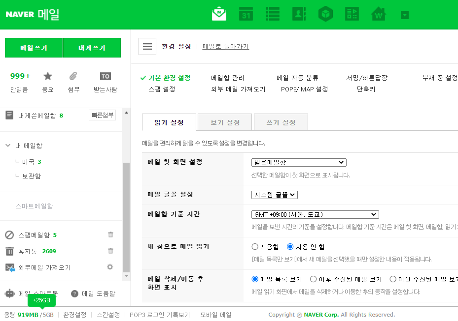

# 1.7

1. 회원가입, 상품주문 -> 문자, 메일전송
2. 구글맵 + DB연동 + ajax + json 사용예제
3. 치트 + jquery ajax + json or xml + DB연동 - 월
4. 우편번호 검색 - 월/화


**[이메일API]**

구글에 jsp 이메일전송 이라 검색


파일추가

- activation.jar
- mail.jar


링크: https://www.google.com/search?q=jsp+%EC%9D%B4%EB%A9%94%EC%9D%BC%EC%A0%84%EC%86%A1&sxsrf=AOaemvIsFieOfsmdSY_wXU8P3sCmMJlFNg%3A1641514729435&ei=6YbXYbqEGuOdseMPnOeTqAk&ved=0ahUKEwj6nN3yrp71AhXjTmwGHZzzBJUQ4dUDCA4&uact=5&oq=jsp+%EC%9D%B4%EB%A9%94%EC%9D%BC%EC%A0%84%EC%86%A1&gs_lcp=Cgdnd3Mtd2l6EAMyBQgAEIAEOgcIABBHELADOgQIIxAnOgsIABCABBCxAxCDAToRCC4QgAQQsQMQgwEQxwEQ0QM6CAgAEIAEELEDOg4ILhCABBCxAxDHARDRAzoECAAQQzoKCAAQgAQQhwIQFEoECEEYAEoECEYYAFDdK1iNTWDlTmgDcAJ4AoABiAGIAcwPkgEEMC4xN5gBAKABAcgBCsABAQ&sclient=gws-wiz


**네이버 설정**



환경설정 - POP3/IMAP 설정

POP3: 메일 보낼 때

IMAP: 메일 받을 때

**에러**

```
설명: Origin 서버가 대상 리소스를 위한 현재의 representation을 찾지 못했거나, 그것이 존재하는지를 밝히려 하지 않습니다.
```


**mailForm.html**

```html
<div>
    <form action="SendMail.jsp" method="post">
        <table>
            <tr><th colspan="2">JSP 메일 보내기</th></tr>
            <tr><td>from</td><td><input type="text" name="from" value="mea_95@naver.com" /></td></tr>
            <tr><td>to</td><td><input type="text" name="to" value="mea_@daum.net"  /></td></tr>
            <tr><td>subject</td><td><input type="text" name="subject"  value="subject test"/></td></tr>
            <tr><td>content</td><td><textarea name="content" style="width:170px; height:200px;">content test</textarea></td></tr>
            <tr><td colspan="2" style="text-align:right;"><input type="submit" value="Transmission"/></td></tr>
        </table>
    </form>
</div>
```

**sendMail.jsp**

```jsp
<%@page import="javax.mail.Transport"%>
<%@page import="javax.mail.Message"%>
<%@page import="javax.mail.Address"%>
<%@page import="javax.mail.internet.InternetAddress"%>
<%@page import="javax.mail.internet.MimeMessage"%>
<%@page import="javax.mail.Session"%>
<%@page import="days14.SMTPAuthenticatior"%>
<%@page import="javax.mail.Authenticator"%>
<%@page import="java.util.Properties"%>
<!--  
출처: https://joont.tistory.com/52 [Toward the Developer]
 -->
<%@ page contentType="text/html; charset=UTF-8" pageEncoding="UTF-8"%>
<%@ taglib prefix="c" uri="http://java.sun.com/jsp/jstl/core"%>
<!DOCTYPE html>
<html>
<head>
<meta charset="UTF-8">
<title>Insert title here</title>
<meta name="viewport" content="width=device-width, initial-scale=1.0">
<title>2022. 1. 6. - 오후 9:50:14</title>
<link rel="icon" type="image/x-icon" href="../images/SiSt.ico">
<script
	src="https://ajax.googleapis.com/ajax/libs/jquery/3.6.0/jquery.min.js"></script>
<style>
</style>
</head>
<body>

	<%
	request.setCharacterEncoding("utf-8");

	String from = request.getParameter("from");
	String to = request.getParameter("to");
	String subject = request.getParameter("subject");
	String content = request.getParameter("content");
	// 입력값 받음

	// 현재 SMTP 서버를 만들어둔게 없어 naver의 SMTP 서버를 사용하였습니다.
	Properties p = new Properties(); // 정보를 담을 객체

	p.put("mail.smtp.host", "smtp.naver.com"); // 네이버 SMTP 
	p.put("mail.smtp.port", "465");
	p.put("mail.smtp.starttls.enable", "true"); //  로그인시 TLS를 사용할 것인지 설정
	p.put("mail.smtp.auth", "true");
	p.put("mail.smtp.debug", "true");
	p.put("mail.smtp.socketFactory.port", "465");
	p.put("mail.smtp.socketFactory.class", "javax.net.ssl.SSLSocketFactory");
	p.put("mail.smtp.socketFactory.fallback", "false");
	p.put("mail.smtp.ssl.protocols", "TLSv1.2");
	// SMTP 서버에 접속하기 위한 정보들

	try {
		Authenticator auth = new SMTPAuthenticatior();
		Session ses = Session.getInstance(p, auth);

		ses.setDebug(true);

		MimeMessage msg = new MimeMessage(ses); // 메일의 내용을 담을 객체
		msg.setSubject(subject); // 제목

		Address fromAddr = new InternetAddress(from);
		msg.setFrom(fromAddr); // 보내는 사람

		Address toAddr = new InternetAddress(to);
		msg.addRecipient(Message.RecipientType.TO, toAddr); // 받는 사람

		msg.setContent(content, "text/html;charset=UTF-8"); // 내용과 인코딩

		Transport.send(msg); // 전송

	} catch (Exception e) {
		e.printStackTrace();
		out.println("<script>alert('Send Mail Failed..');history.back();</script>");
		// 오류 발생시 뒤로 돌아가도록
		return;
	}

	out.println("<script>alert('Send Mail Success!!');location.href='mailForm.html';</script>");
	// 성공 시
	%>
</body>
</html>
```


**SMTPAuthenticatior.java**

```java
import javax.mail.Authenticator;
import javax.mail.PasswordAuthentication;
 
// SMTP 서버의 인증정보를 담고있는 클래스를 먼저 생성
public class SMTPAuthenticatior extends Authenticator{
 
    @Override
    protected PasswordAuthentication getPasswordAuthentication() { 
       //  애플리케이션 비밀번호 생성 후 사용
       // 2단계 인증 설정하면 비번으로 로그인 X
        return new PasswordAuthentication("mea_95","pj23ew7sa");
    }
}
```


암호화에는 SSL 과 TLS 가 있다.


**[구글맵]**

```sql
create table googlemap (
    id number primary key
    ,type varchar2(20)
    , name varchar2(30)
    , lng number
    , lat number
    , address varchar2(255)
);
```


**에러**

```
설명 Origin 서버가 대상 리소스를 위한 현재의 representation을 찾지 못했거나, 그것이 존재하는지를 밝히려 하지 않습니다.
```


**ex01.jsp**

```jsp
<%@ page contentType="text/html; charset=UTF-8" pageEncoding="UTF-8"%>
<%@taglib prefix="c" uri="http://java.sun.com/jsp/jstl/core"%>
<!DOCTYPE html>
<html>
<head>
<meta charset="UTF-8">
<meta name="viewport" content="width=device-width, initial-scale=1.0">
<script
	src="https://ajax.googleapis.com/ajax/libs/jquery/3.6.0/jquery.min.js"></script>
<link rel="stylesheet"
	href="http://maxcdn.bootstrapcdn.com/bootstrap/3.3.5/css/bootstrap.min.css">
<script
	src="https://ajax.googleapis.com/ajax/libs/jquery/1.11.3/jquery.min.js"></script>
<script
	src="http://maxcdn.bootstrapcdn.com/bootstrap/3.3.5/js/bootstrap.min.js"></script>
<title>Insert title here</title>
</head>
<body>
	<h3>ex01.jsp</h3>

	<script>
		$("#btnSave").click(function() {
			if (confirm("정말 저장합니까?")) {
				$("#form1").submit();
			} // if
		}); // click

		function modal_close() {
			if (typeof marker != 'undefined') {
				marker.setMap(null); // 마커 삭제....
			} // if
		} // modal_close
	</script>

	<div id="map" style="width: 100%; height: 500px;"></div>

	<script>
		// 한독빌딩 중심... 지도
		// 한독빌딩 위도,경도 
		var lat = 37.49935854213284;
		var lng = 127.03320798504977;

		function myMap() {
			// 구글맵 설정 생성
			var mapCanvas = document.getElementById("map");
			var myCenter = new google.maps.LatLng(lat, lng); // 
			var mapOptions = {
				center : myCenter,
				zoom : 15
			};
			var map = new google.maps.Map(mapCanvas, mapOptions);

			// 지도 클릭 이벤트 등록
			google.maps.event.addListener(map, 'click', function(event) {
				// 위치 마커 생성
				placeMarker(map, event.latLng);
				//위도 경도를 form태그의 히든태그 로 저장.
				$('#h_lng').val(event.latLng.lng());
				$('#h_lat').val(event.latLng.lat());
				// 모달 창 띄우기
				$("#myModal").modal("show");
				//  Ajax 처리 DB 저장 모달 창 닫기
			});
		}

		function placeMarker(map, location) {
			// 
			//var marker = new google.maps.Marker({
			marker = new google.maps.Marker({
				position : location, // 클릭한 위도,경도
				map : map
			});
			// 
			var infowindow = new google.maps.InfoWindow({
				content : 'Latitude: ' + location.lat() + '<br>Longitude: '
						+ location.lng()
			});

			infowindow.open(map, marker);
		}
	</script>


	<!-- Modal -->
	<div class="modal fade" id="myModal" role="dialog">
		<div class="modal-dialog" style="width: 350px">

			<!-- Modal content-->
			<div class="modal-content">
				<div class="modal-header">
					<h4 class="modal-title">위치 정보 입력</h4>
				</div>
				<div class="modal-body">
					<div style="text-align: center">
						<form id="form1" action="ex01_oracle_input_ok.jsp" method="post">
							<table style="width: 300px; text-align: center" border="1">

								<tr>
									<td>ID</td>
								</tr>
								<tr>
									<td><input type="text" name="id" value="100"></td>
								</tr>
								<tr>
									<td>TYPE</td>
								</tr>
								<tr>
									<td><input type="text" name="type"
										value="restaurant or bar"></td>
								</tr>
								<tr>
									<td>NAME</td>
								</tr>
								<tr>
									<td><input type="text" name="name" value="admin"></td>
								</tr>
								<tr>
									<td>ADDRESS</td>
								</tr>
								<tr>
									<td><input type="text" name="address" value="seoul"></td>
								</tr>
								<tr>
									<td><input type="button" id="btnSave" value="저장"></td>
								</tr>
							</table>
							<input type="hidden" id="h_lat" name="lat" value="" /> <input
								type="hidden" id="h_lng" name="lng" value="" />
						</form>
					</div>

				</div>
				<div class="modal-footer">
					<button type="button" onclick="modal_close();"
						class="btn btn-default" data-dismiss="modal">Close</button>
				</div>
			</div>
		</div>
	</div>
	<script
		src="https://maps.googleapis.com/maps/api/js?key=발급받은키&callback=myMap"></script>
</body>
</html>
```


**ex01_oracle_input_ok.jsp**

```jsp
```


**ex01_oracle_json.jsp**

```jsp


```


**ex01_oracle_json_data.jsp**

```jsp
```

테스트해보기