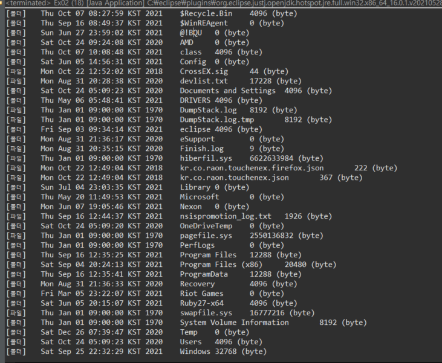
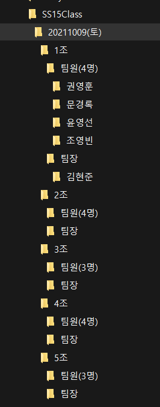

## 10.7

복습

1-1. 1차_조편성.txt 파일을 읽어서
컬렉션 클래스를 사용하여 아래와 같이 출력
( 조건 : 팀원들은 오름차순 정렬해서 출력 )

다음과 같이 출력할 것

**파일 읽어와서 출력만: 숏코딩**

```
 *1조(5명)
팀장 - 김현준
팀원(4명)
권영훈
문경록
윤영선
조영빈
----------
 *2조(5명)
팀장 - 김희진
팀원(4명)
김준호
양시영
윤진한
정수빈
----------
 *3조(4명)
팀장 - 이학준
팀원(3명)
김도희
김창교
여진현
----------
 *4조(5명)
팀장 - 최태권
팀원(4명)
김채홍
예준성
이제환
이희창
----------
 *5조(4명)
팀장 - 권재희
팀원(3명)
김다니엘
서지현
이경수
----------
```

```java
String path = "src\\days26\\1차_조편성.txt";
String line;

try (BufferedReader br = new BufferedReader(new FileReader(path));) {
    while ((line = br.readLine()) != null) {
        ArrayList<String> list = new ArrayList<>(Arrays.asList(line.split("[:,]")));

        System.out.printf(" *%s(%d명)\n", list.remove(0), list.size());
        System.out.printf("팀장 - %s\n", list.remove(0));
        System.out.printf("팀원(%d명)\n", list.size());
        list.stream().sorted().forEach(System.out::println);
        System.out.println("-".repeat(10));
    }
} catch (Exception e) {
    e.printStackTrace();
}
```

> Iterator 는 크기와 정렬이 불가능하다. 리스트가 Iterator 의 상위호환이다.

**파일 읽어와서 맵에 담기: 숏코딩**

```java
{1조=[김현준, 문경록, 윤영선, 권영훈, 조영빈], 
 2조=[김희진, 양시영, 윤진한, 김준호, 정수빈], 
 3조=[이학준, 김창교, 김도희, 여진현], 
 4조=[최태권, 김채홍, 이희창, 예준성, 이제환], 
 5조=[권재희, 김다니엘, 서지현, 이경수]}
```

```java
LinkedHashMap<String, ArrayList<String>> map = new LinkedHashMap<>();
String path = "src\\days26\\1차_조편성.txt";
String line;

try (BufferedReader br = new BufferedReader(new FileReader(path));) {
    while ((line = br.readLine()) != null) {
        ArrayList<String> team = new ArrayList<>(Arrays.asList(line.split("[:,]")));
        map.put(team.remove(0), team);
    }
} catch (Exception e) {
    e.printStackTrace();
}
```

> 잘라진 상태에서는 넣기쉽다.

**맵에 담긴 것 출력: 숏코딩**

출력은 위와 같다.

```java
Iterator<Entry<String, ArrayList<String>>> ir = map.entrySet().iterator();
while (ir.hasNext()) {
    Entry<String, ArrayList<String>> entry = ir.next();
    ArrayList<String> team = entry.getValue();

    System.out.printf(" *%s(%d명)\n", entry.getKey(), team.size());
    System.out.printf("팀장 - %s\n", team.remove(0));
    System.out.printf("팀원(%d명)\n", team.size());
    team.stream().sorted().forEach(System.out::println);
    System.out.println("-".repeat(10));
}
```

Q. 리스트를 부분정렬 하는방법은?

A. 

5-1. InputStream is = System.in; 
을 사용해서 문자열을 입력받아서 출력하고
바이트스트림을 이용해서 message.dat 로 저장하세요. 

> 문자열을 입력 ? 안녕하세요~ 
> 출력 : 안녕하세요~

try-with-resources 를 사용하지 않으면 `flush()` 와 `close()` 를 꼭 해줄 것.

```java
InputStream is = System.in;
try (FileWriter fw = new FileWriter("message.dat");) {
    System.out.print("> 문자열을 입력 ? ");
    String str = new String(is.readAllBytes());
    fw.write(str);
    System.out.printf("> 출력 : %s", str);
} catch (IOException e) {
    e.printStackTrace();
}
```


---

**목차**

- File 클래스
  - 파일정보 출력
  - 폴더 만들기
  - 파일 삭제
  - 파일명 바꾸기
- FileReader, Writer: 텍스트파일 복사
- PrintWriter + FileWriter: 텍스트파일 작성
- BufferedIOStream + FileIOStream: 파일 분할 및 결합
- DataIOStream + FileIOStream: 데이터 저장 및 불러오기


p.918 표 15-28

**file.**

- `getCanonicalPath()` 절대경로
- `getAbsolutePath()` 현재경로 + 상대경로
- `getPath()` 상대경로
- `getName()` 파일이름 + 확장자
- `getParent()` 상대경로 혹은 그 위 디렉토리 ex) .. or C:\class ~~
- `mkdir()` 폴더생성
- `mkdirs()` 필요하면 부모디렉토리까지 생성
- `setExecutable()` ~set 으로 시작하는 것은 속성변경
- `setReadable()` 
- `setReadOnly()` 
- `setWritable()` 
- `toPath()` Path 로 변경
- `toURI` URL 로 변경
- `getTotalSpace()`
- `getUsableSpace()`
- `getFreeSpace()` 
- `delete()` 파일이나 폴더 삭제하고 true 반환. 하위폴더나 파일이 존재하면 삭제가 되지 않는다.
- `deleteOnExit()` 자바 가상머신이 종료될 때 삭제. 아무것도 반환하지 않는다.
- `list()` 문자열로 반환
- `listFiles()`  파일객체로 반환
- `renameTo(File)` 파일명을 바꾼다.
- static `createTempFile()` 임시파일을 만든다.
- static `listRoots()` 파일목록을 File배열로 반환. filter 를 지정한 경우 조건과 일치하는 파일만 반환.

출력

```
C:\class\javaClass\PDFEditor.exe
C:\class\javaClass\javaPro\..\pdfEditor.exe
..\pdfEditor.exe
```

코드

```java
String path = "..\\pdfEditor.exe";
File file = new File(path);

System.out.println(file.getCanonicalPath());
System.out.println(file.getAbsolutePath());
System.out.println(file.getPath());
```

**멤버변수**

- `pathSeparator` 경로와 다른 경로를 구분한다. ex) 윈도우 - ;
- `separator`  왼도우 = \
- `pathSeparatorChar` 문자로 반환
- `separatorChar` 문자로 반환

> 웹에서는 구분을 슬래쉬 / 로 한다.

**용량**

```
C:\
492136894464
146675113984
146675113984
```


```java
File[] rootList = File.listRoots();

for (File f : rootList) {
    System.out.println(f 
            + "\n" + f.getTotalSpace() 
    + "\n" + f.getUsableSpace() 
    + "\n" + f.getFreeSpace());
```

> 하위폴더를 계속해서 찾을 때 재귀함수를 쓴다.

**폴더정보 표시**



```java
for (File f : rootList) {
    File[] subList = f.listFiles();

    for (int i = 0; i < subList.length; i++) {
        File sf = subList[i];
        if (sf.isDirectory()) {
            System.out.print("[폴더]");
        } else if (sf.isFile()) {
            System.out.print("[파일]");
        }
        System.out.printf("\t%s\t%s\t%s (byte)\n"
                , new Date(sf.lastModified())
                , sf.getName()
                , sf.length());
    }
}
```

**오늘날짜 폴더와 조 만들기**

아래와 같이 날짜와 조 폴더 만들기

C:\SS15Class

- ㄴ 20211007(목)
  - ㄴ 1조
    - 김현준(팀장)
    - 권영훈
    - 문경록
    - 윤영선
    - 조영빈
  - ㄴ 2조
  - ㄴ 3조
  - ㄴ 4조
  - ㄴ 5조

```java
String parent = "C:\\SS15Class";
LocalDate d = LocalDate.now();
String pattern = "yyyyMMdd(E)";
DateTimeFormatter formatter = DateTimeFormatter.ofPattern(pattern);
String child = d.format(formatter);
File f = new File(parent, child);
String fileName = ".\\src\\days26\\1차_조편성.txt";

try (FileReader fr = new FileReader(fileName);
        BufferedReader br = new BufferedReader(fr);) {
    String line;
    String regex = "[:,]";
    String[] tm;
    String teamName;
    while ((line = br.readLine()) != null) {
        tm = line.split(regex);
        teamName = tm[0];
        File tf = new File(f, teamName);
        tm[1] += "(팀장)";

        for (int i = 1; i < tm.length; i++) {
            File mf = new File(tf, tm[i]);
            mf.mkdirs();
        }
    }
} catch (Exception e) {
    e.printStackTrace();
}
System.out.println("= END =");
```

SimpleDateFormat 은 Date 클래스를 DateTimeFormatter 는 Local 클래스를 위한 클래스이다.

DateTimeFormatter 는 new 대신 ofPattern 메서드를 사용한다.

`date.format(formatter)` 메서드를 사용한다.

**오늘날짜 날짜포맷 숏코딩**

```
2021년 10월 07일 목요일 오후 09:01:56
```

```
2021년 10월 07일 목요일
```

**Date**

```java
String today = new SimpleDateFormat("yyyy년 MM월 dd일 E요일 a hh:mm:ss").format(new Date());
```

**LocalDate**

```java
LocalDate date = LocalDate.now();
String today = date.format(DateTimeFormatter.ofPattern("yyyy년 MM월 dd일 E요일"));
```

**LocalDateTime**

```java
LocalDateTime date = LocalDateTime.now();
String today = date.format(DateTimeFormatter.ofPattern("yyyy년 MM월 dd일 E요일 a hh:mm:ss"));
```

> Date 는 format부터 LocalDate 는 date부터 입력한다.
>
> Date 는 입력할 때 year - 1900, month - 1 로 입력해야 한다.
>
> LocalDateTime 의 of() 메서드는 파라미터가 year 부터 minute 까지 5개이다.
>
> 반면에 Date 의 생성자에는 year 부터 date 까지 파라미터 3개만 넣어주면 생성할 수 있다.

**텍스트파일 복사**

```
543 bytes
> 처리 시간 : 0.0577339sec
 = Copy End = 
```

```java
public class Ex05 {
	public static void main(String[] args) {
		String originalPath = ".\\src\\days27\\Ex01.java";
		String copyPath = "C:\\class\\download\\Ex01_100.java";
		fileCopy_textStream(originalPath, copyPath);
		System.out.println(" = Copy End = ");
	} // main

	private static void fileCopy_textStream(String originalPath, String copyPath) {
		long start = System.nanoTime();
		File orignalFile = new File(originalPath);
		System.out.printf("%d bytes\n", orignalFile.length()); // 2,385,496 bytes

		try (FileReader fr = new FileReader(originalPath); 
				FileWriter fw = new FileWriter(copyPath)) {
			int c = -1;
			
			while ((c = fr.read()) != -1) {
				fw.write(c);
			}
		} catch (IOException e) {
			e.printStackTrace();
		}
		long end = System.nanoTime();
		System.out.println("> 처리 시간 : " + (end - start) / Math.pow(10, 9) + "sec");
	}
}
```

**p.923 예제 15-32 \[Comparator 로 정렬해서 파일정보 출력]**

내일 재귀함수 복습문제

p.928 예제 15-38

getExtension 메서드 수정

p.929 예제 15-35

**파일삭제 예제**

```java
> 34개 파일이 삭제되었다.
```

```java
public class Ex09 {
	static int deletedFiles = 0;
	
	public static void main(String[] args) {
		String dir = "C:\\ss15class";
		File f = new File(dir);
		String ext = ".java";
		
		delete(f, ext);
		System.out.printf("> %d개 파일이 삭제되었다.", deletedFiles);
	}

	private static void delete(File dir, String ext) {
		File[] files = dir.listFiles();
		
		for (int i = 0; i < files.length; i++) {
			if (files[i].isDirectory()) {
				delete(files[i], ext);
			} else {
				if (files[i].getName().endsWith(ext)) {
					files[i].delete();
					deletedFiles++;
				}
			}
		}
	}
}
```

**p.930 예제 15-36 \[이미지 파일명 바꾸기]**

```java
String dir = ".\\src\\days27\\images";
File f = new File(dir);
File[] flist = f.listFiles();

for (int i = 0; i < flist.length; i++) {
    String fileName = flist[i].getName();
    System.out.println(fileName);
    String newFileName = String.format("%04d.png", Integer.parseInt(FileUtil.getBaseName(fileName)));
    flist[i].renameTo(new File(f, newFileName));
}
```

**p.931 예제 15-37 \[파일 쪼개기]**

숏코딩

```java
String copyPath = "..\\atomSetup.exe";
String pastePath = "..\\atomSetup.";
final int BUFFER_SIZE = (int) pow(1024, 2);
byte[] buffer = new byte[BUFFER_SIZE];
int ordinal = 1;
int count = 0;
int read;

BufferedOutputStream bos = null;
try (BufferedInputStream bis = new BufferedInputStream(new FileInputStream(copyPath), BUFFER_SIZE);) {
    while ((read = bis.read(buffer)) != -1) {
        if (count % 70 == 0) 
            bos = new BufferedOutputStream(new FileOutputStream(pastePath + ordinal++), BUFFER_SIZE);
        bos.write(buffer);
        count++;
    }
} catch (Exception e) {
    e.printStackTrace();
}
```

코딩

```java
String pathname = "C:\\class\\javaClass\\pdfEditor.exe";
final int VOLUME = 10000000;
File f = new File(pathname);
System.out.println(f.length());

FileInputStream fis = new FileInputStream(f);
BufferedInputStream bis = new BufferedInputStream(fis);
int data = 0;
int i = 0; // 읽은 바이트 수
int number = 0; // 쪼갠 파일 서수
FileOutputStream fos;
BufferedOutputStream bos = null;

while ((data = bis.read()) != -1) {
    if (i % VOLUME == 0) {
        fos = new FileOutputStream(pathname + "_." + ++number);
        bos = new BufferedOutputStream(fos);
    }
    bos.write(data);
    i++;
}
System.out.println("= END =");
```

**p.932 예제 15-38 \[나눠진파일을 다시 합치는 예제]**

수업 끝나고 해볼 것

p.934 직렬화 (Serialization)

**p.875 \[ByteArrayInputStream]**

바이트배열에 데이터를 입출력하는데 사용되는 스트림.

Bais 의 생성자와 `bos.write(byte[ ])` 로 읽고 쓴다.

p.876 예제 15-2, 3 꼭 해볼 것

p.879 \[FileInputStream]

p.882 FilterInputStream

p.883 BufferedInputStream

p.886 DataInputStream

데이터를 읽고 쓰는데 byte 단위가 아닌 8가지 기본자료형의 단위로 읽고 쓸 수 있는 장점이 있는 스트림.

**charSequence 란?**

String, StringBuilder, StringBuffer, CharBuffer, Segment 등이 charSequence 인터페이스를 구현했다.

String 은 불변 (immutable), StringBuffer 는 변할수있다. (mutable)

String 은 문자열연산에 성능이 좋지않지만 동기화를 신경쓰지 않아도 된다. (Thread - safe)

StringBuilder 와 StringBuffer 클래스가 제공하는 메서드는 동일하다.

StringBuffer 는 메서드별로 Synchronized Keyword 가 존재하고 멀티스레드 환경에서도 동기화를 지원한다.

StringBuilder 는 동기화를 보장하지 않는다.

단일스레드 환경: StringBuilder

멀티스레드 환경: StringBuffer

한번 사용 및 멀티스레드: String

**FileWriter fw.**

- `append(char)`
- `append(charSequence)` start, end 지정가능
- `write(int)`
- `write(char[ ])`
- `write(String)` 

**PrintWriter pw.**

보조스트림

- `pw.printf(format, Object)` 

`System.in` 은 InputStream

`System.out` 은 PrintStream 인 보조스트림

**원하는 형식으로 텍스트파일 작성**

```
이희창, 90, 89, 77, 256, 85.33, true
```

```java
String name = "이희창";
int kor = 90;
int eng = 89;
int mat = 77;
int tot = kor + eng + mat;
double avg = tot / 3.0;
boolean gender = true;
String fileName = ".\\src\\days27\\students.txt";
FileWriter fw = new FileWriter(fileName); 
PrintWriter pw = new PrintWriter(fw);

pw.printf("%s, %d, %d, %d, %d, %.2f, %b\n", name, kor, eng, mat, tot, avg, gender);
pw.flush();
fw.close();
pw.flush();
pw.close();
System.out.println("= END =");
```

**DateOutputStream dos.**

다양한 형식으로 저장할 수 있다.

- `write~()` 

p.892 

내일 IO 수업

다음주 프로젝트

**쓰기**

```java
		String name = "이희창";
		int kor = 90;
		int eng = 89;
		int mat = 77;
		int tot = kor + eng + mat;
		double avg = tot / 3.0;
		boolean gender = true;
		String fileName = ".\\src\\days27\\students.dat";
		FileOutputStream out = new FileOutputStream(fileName);
		DataOutputStream dos = new DataOutputStream(out);
		
		dos.writeUTF(name);
		dos.writeInt(kor);
		dos.writeInt(eng);
		dos.writeInt(mat);
		dos.writeInt(tot);
		dos.writeDouble(avg);
		dos.writeBoolean(gender);
		
		out.flush();
		dos.flush();
		out.close();
		dos.close();
		System.out.println("END");
```

**읽기**

```java
String name = null;
int kor = 0;
int eng = 0;
int mat = 0;
int tot = 0;
double avg = 0;
boolean gender = false;
String fileName = ".\\src\\days27\\students.dat";
FileInputStream in = new FileInputStream(fileName);
DataInputStream dis = new DataInputStream(in);

name = dis.readUTF();
kor = dis.readInt();
eng = dis.readInt();
mat = dis.readInt();
tot = dis.readInt();
avg = dis.readDouble();
gender = dis.readBoolean();

System.out.printf("%s %d %d %d %d %.2f %b\n",
        name, kor, eng, mat, tot, avg, gender);
in.close();
dis.close();
System.out.println("= END =");
```

> DataInputStream 은 문자열을 쓰거나 읽을 때 `readUTF()` `writeUTF()` 를 쓴다.

**같이쓰는 클래스 정리**

텍스트 쓰기

PrintWriter + FileWriter: 

데이터 읽기/쓰기

DataInputStream + FileInputStream: 값 읽어와서 바로쓰기

BufferedInputStream + FileInputStream: 빠른속도로 파일복사 혹은 쪼개기

텍스트 읽기

BufferedReader + FileReader

```java
PrintWriter pw = new PrintWriter(new FileWriter(path));
DataInputStream dis = new DataInputStream(new FileInputStream(path));
BufferedReader br = new BufferedReader(new FileReader(path), BUFFER_SIZE);
BufferedInputStream bis = new BufferedInputStream(new FileInputStream(path), BUFFER_SIZE);
```

**new 로 생성할 수 없는 클래스들**

`DateTimeFormatter` ofPattern() 생성

`LocalDate` now() 혹은 of(year, month, date) 로 생성

`LocalTime` now() 혹은 of(hour, minute) 로 생성 (+ second, nanoSecond)

`Calendar` getInstance() 로 지금날짜 반환 혹은 new GregorianCalendar(year, month, date) 생성

**날짜 입력받기**

`Date` long, String

`LocalDate` 

`LocalDateTime` long

**long 으로 입력받아서 날짜출력하기**

**Date**

```
Sat Sep 04 20:24:02 KST 2021
```

```java
long l = new File("..\\pdfEditor.exe").lastModified();
Date modifiedDate = new Date(l);
```

**LocalDateTime**

```
2021-09-04T20:24:02
```

```java
long l = new File("..\\pdfEditor.exe").lastModified();
LocalDateTime modifiedDate = LocalDateTime.ofEpochSecond(l / 1000, 0, ZoneOffset.ofHours(9));
```

File 의 lastModified() 메서드와 Date 의 생성자 long 형은 밀리세컨드 ms ($$10^(-3)$$ second) 이므로 LocalDateTime 의 ofEpochSecond 메서드의 첫번째 인자의 단위가 second 이므로 $$10^3$$ 으로 나눠주는 모습이다.

우리나라는 UTC+9 시간이므로 ZoneOffset 에 9 를 더해주면 Date 객체와 같은 시각을 표시하는 것을 볼 수 있다.

**long 날짜출력 예시**

```
2021년 09월 24일 토요일, 오후 08:24:02
```

```java
Date d = new Date(f.lastModified());
String str = new SimpleDateFormat("yyyy년 MM월 mm일 E요일, a hh:mm:ss").format(d);
```

## 10.8

복습문제

3, 7, 8을 못풀었다.

**2-1. 폴더 생성**
// C:\\SS15Class\\20211008(금) (오늘날짜)
	//                    ㄴ 1조
	//                      ㄴ 팀장
	//                        ㄴ김현준
	//                      ㄴ 팀원(4명)
  	//                        ㄴ문경록 
 	 //                        ㄴ윤영선
 	 //                        ㄴ권영훈
	  //                        ㄴ조영빈
	//                    ㄴ 2조
	//                    ㄴ 3조
	//                    ㄴ 4조
	//                    ㄴ 5조



**폴더생성: 숏코딩**

```java
String d = new SimpleDateFormat("yyyyMMdd(E)").format(new Date());
String parent = "C:\\SS15Class\\" + d;
String path = "src\\days26\\1차_조편성.txt";

try (BufferedReader br = new BufferedReader(new FileReader(path));) {
    String line;

    while ((line = br.readLine()) != null) {
        ArrayList<String> team = new ArrayList<>(Arrays.asList(line.split("[:,]")));
        
        File f = new File(parent, team.remove(0));
        new File(f, "팀장\\" + team.remove(0)).mkdirs();
        team.forEach(i -> new File(f, "팀원(" + team.size() + "명)\\" + i).mkdirs());
    }
} catch (Exception e) {
    e.printStackTrace();
}
```

**3-1. days27폴더 안의 파일의 크기 내림차순으로 정렬해서 출력**

```java
src\days27\images0001		669527 (byte)
src\days27\images0011		464943 (byte)
src\days27\images0002		272150 (byte)
src\days27\images		4096 (byte)
src\days27\Main.java		1602 (byte)
src\days27\Ex05_02.java		1292 (byte)
src\days27\Ex04.java		1124 (byte)
src\days27\Ex05.java		1019 (byte)
src\days27\Ex15_02.java		1005 (byte)
src\days27\Ex11.java		988 (byte)
src\days27\Ex16_02.java		858 (byte)
src\days27\Ex16.java		815 (byte)
src\days27\Ex02.java		752 (byte)
src\days27\Ex15.java		698 (byte)
src\days27\Ex13.java		685 (byte)
src\days27\Ex09.java		657 (byte)
src\days27\Ex08.java		612 (byte)
src\days27\Ex01.java		543 (byte)
src\days27\Ex10.java		531 (byte)
src\days27\Ex06.java		526 (byte)
src\days27\Ex07.java		480 (byte)
src\days27\Ex03.java		367 (byte)
src\days27\user.properties		94 (byte)
src\days27\students.txt		40 (byte)
src\days27\students.dat		36 (byte)
```

코드

```java
File[] files = new File("src\\days27").listFiles();
Arrays.sort(files, (o1, o2) -> (int) (o2.length() - o1.length()));

for (File f : files) System.out.printf(f + "\t\t%d (byte)\n", f.length());
```

**객체 내림차순 정렬**

람다식 사용

```java
Arrays.sort(files, (o1, o2) -> (int) (o2.length() - o1.length()));
```

Comparator 의 제네릭메서드 사용

```java
Arrays.sort(files, Comparator.<File>comparingLong(i -> i.length()).reversed());
```

**5-1. src 폴더 안에서  txt 파일 모두 찾아서 출력**

```java
public class Main {
	public static void main(String[] args) {
		String path = "src";
		String find = "txt";
		File[] files = find(path, find);
	}

	private static File[] find(String path, String find) {
		File parent = new File(path);
		ArrayList<File> answer = new ArrayList<>();

		for (File f : parent.listFiles()) {
			if (f.isDirectory())
				find(f.toString(), find);
			else 
				if (f.getName().endsWith(find)) System.out.println(f);
		}
		return null;
	}
}
```

배열로 반환 다시 풀어보기

**6-1. days27.imags 폴더 안의** 
// 1.png  => 0001.png => 1.png
// 2.png  => 0002.png => 2.png
// 11.png => 0011.png => 3.png
파일 이름 변경

```java
String path = "src\\days27\\images";
```

**0011 로 바꾸기: 숏코딩**

```java
for (File f : new File(path).listFiles()) {
    int zero = 8 - f.getName().length();
    f.renameTo(new File(path, "0".repeat(zero) + f.getName()));
}
```

**11로 바꾸기: 숏코딩**

```java
for (File f : new File(path).listFiles()) 
    f.renameTo(new File(path, f.getName().replaceAll("^0+", "")));
```

**7-1. 아무 파일이든 3개의 파일로 나누세요..**
예) test.dat

 test_01.dat    		
 test_02.dat    		
 test_03.dat

```java
String copyPath = "..\\atomSetup.exe";
String pastePath = "..\\atomSetup.";
final int BUFFER_SIZE = (int) pow(1024, 2);
byte[] buffer = new byte[BUFFER_SIZE];
int ordinal = 1;
int count = 0;
int read;

BufferedOutputStream bos = null;
try (BufferedInputStream bis = new BufferedInputStream(new FileInputStream(copyPath), BUFFER_SIZE);) {
    while ((read = bis.read(buffer)) != -1) {
        if (count % 70 == 0) 
            bos = new BufferedOutputStream(new FileOutputStream(pastePath + ordinal++), BUFFER_SIZE);
        bos.write(buffer);
        count++;
    }
} catch (Exception e) {
    e.printStackTrace();
}
```

atomSetup.exe 파일의 용량이 190MB 정도 되므로 70MB 씩 나눈다. 

(count % 70) 의 70 과 pow(1024, 2) 의 1MB 를 곱하면 70MB 가 된다.

**8-1. String name = "홍길동";**
int age = 20;
boolean gender=true;
char grade = 'B';
double weight = 60.25;

위의 데이터를 DataOutputStream을 사용해서 info.dat 파일에
저장하고

DataInputStream을 사용해서 화면에 출력하는 코딩을 하세요. 

```
홍길동
20
true
B
60.25
```

```java
String name = "홍길동";
int age = 20;
boolean gender = true;
char grade = 'B';
double weight = 60.25;
String path = "..\\info.dat";

try (DataOutputStream dos = new DataOutputStream(new FileOutputStream(path));
        DataInputStream dis = new DataInputStream(new FileInputStream(path));) {
    dos.writeUTF(name);
    dos.writeInt(age);
    dos.writeBoolean(gender);
    dos.writeChar(grade);
    dos.writeDouble(weight);

    System.out.println(dis.readUTF());
    System.out.println(dis.readInt());
    System.out.println(dis.readBoolean());
    System.out.println(dis.readChar());
    System.out.println(dis.readDouble());
} catch (Exception e) {
    e.printStackTrace();
}
```

---


**p.892 \[SequenceInputStream]**

순차적인 바이트스트림

생성자에 'Stream 의 Enumeration' 이나 'Stream' 을 두 개까지 담을 수 있다.

**리스트에 스트림 담아 SequenceInputStream 에 넣기**

```java
byte[] arr1 = {0, 1, 2};
byte[] arr2 = {3, 4, 5};
byte[] arr3 = {6, 7, 8};
Vector<ByteArrayInputStream> v = new Vector<>();

v.add(new ByteArrayInputStream(arr1));
v.add(new ByteArrayInputStream(arr2));
v.add(new ByteArrayInputStream(arr3));
Enumeration<ByteArrayInputStream> en = v.elements();
SequenceInputStream sis = new SequenceInputStream(en);
```

**p.901 \[PipedReader, Writer]**

스레드간에 데이터를 주고받을 때 사용한다.

**p.903 \[StringReader, Writer]**

*** `toString()` `getBuffer()` 로 저장한 데이터를 String 이나 StringBuffer 로 반환할 수 있다.

CharArrayReader 도 있다.

문제) source 문자열의 10번째 라인의 5번째 한 문자를 얻어와서 출력.

**split**

```java
char c = source.split("\r\n")[10 - 1].trim().charAt(5 - 1);
```

**StringReader**

```java
StringReader sr = new StringReader(source);
BufferedReader br = new BufferedReader(sr);
String line;

while ((line = br.readLine()) != null) {
    System.out.println(line);
}
```

p.904 \[BufferedReader, Writer]

1. 문자스트림
2. 버퍼를 이용해서 입출력의 효율을 높일 수 있도록 하는 보조스트림

**p.905 \[InputStreamReader, Writer]**

1. 문자스트림
2. 바이트 기반 스트림을 문자기반 스트림으로 연결시켜주는 보조스트림

**한 줄 단위 입력받기**

```java
BufferedReader br = new BufferedReader(new InputStreamReader(System.in));|
```

**한글 하나만 입력받기**

```java
byte[] buffer = new byte[3];
System.out.println("> 문자열 입력 ? ");
InputStream is = System.in;

is.read(buffer);
char c = new String(buffer).charAt(0);
```

**InputStreamReader**

```java
System.out.println("> 문자열 입력 ? ");
InputStreamReader isr = new InputStreamReader(System.in);
int c = isr.read();
```

BufferedReader 를 InputStreamReader 에 다시 담을 수 있다.

```java
System.out.println("> 문자열 입력 ? ");
InputStreamReader isr = new InputStreamReader(System.in);
BufferedReader br = new BufferedReader(isr);

String message = br.readLine();
```

**p.911 \[RandomAccessFile]** 

1. 파일의 어느 위치에나 읽기/쓰기 가능 (장점)
2. 기본형 읽기/쓰기 가능
3. 하나의 스트림 클래스로 파일 읽기 + 쓰기 모두가능

DataOutputStream 과 비슷하게 사용할 수 있다.

**raf.**

- `writeBytes(String)`
- `seek(long pos)` 커서를 옮긴다. (덮어쓴다.)

p.913 예제 15-26

> Integer 는 4바이트를 잡는다.

```java
int[] scores = {
    1, 100, 90, 90,
    2, 70, 90, 100,
    3, 100, 100, 100,
    4, 70, 60, 80,
    5, 70, 90, 100
};

RandomAccessFile raf = 
        new RandomAccessFile(".\\src\\days28\\score.dat", "rw");
for (int i = 0; i < scores.length; i++) {
    raf.writeInt(scores[i]);
}

// 3번 학생의 정보만 출력
long pos = 4*4*2;
raf.seek(pos);
int no = raf.readInt();
int kor = raf.readInt();
int eng = raf.readInt();
int mat = raf.readInt();
System.out.printf("번호:%d, 국어:%d, 영어:%d, 수학:%d\n", no, kor, eng, mat);
```

**수학점수 수정하기**

```java
RandomAccessFile raf = new RandomAccessFile(".\\src\\days28\\score.dat", "rw");

long pos = 4*4*2 + 4*3;
raf.seek(pos);
raf.writeInt(20);
```

> Integer 는 4바이트 0000 0000 으로 표현한다. 

p.915 File 클래스

**p.934 \[직렬화 (Serialization)]**

@@@@@중요

직렬화란 ? 객체를 데이터스트림으로 만드는 것

객체 -> 스트림: 직렬화

스트림 -> 객체: 역직렬화

객체를 다룰 수 있는 보조스트림: ObjectInputStream, OutputStream

**직렬화 예외**

```
java.io.NotSerializableException
```

Serializable 인터페이스를 구현한다.

Serializable 인터페이스를 구현한 모든 클래스는 직렬화를 할 수 있다.

**직렬화 예제**

```java
Member m1 = new Member("문경록", 1000, true);
String fileName = ".\\src\\days28\\member.dat";

try (FileOutputStream out = new FileOutputStream(fileName);
ObjectOutput oos = new ObjectOutputStream(out);) {
    oos.writeObject(m1);
} catch (Exception e) {
    e.printStackTrace();
}

System.out.println("> 엔터 치면 객체를 파일로부터 읽어옵니다.");
System.in.read();
System.in.skip(System.in.available());

try (FileInputStream in = new FileInputStream(fileName);
ObjectInputStream ois = new ObjectInputStream(in);) {
    Member m = (Member) ois.readObject();
    System.out.println(m);
} catch (Exception e) {
    e.printStackTrace();
}
```

**transient 키워드**

transient: 순간적인

transient 가 붙은 필드는 직렬화 대상에서 제외된다.

transient 와 마찬가지로 `static` 이 붙은 필드도 직렬화 대상에서 제외된다.

**p.943 \[직렬화가 가능한 클래스의 버전관리]**

역직렬화할 때는 같은 직렬화할 때와 같은 클래스여야 한다.

부모가 직렬화가 가능하면 자식도 인터페이스 구현없이 직렬화가 가능하다.

> 자식만 Serializable 인터페이스를 구현하면 부모의 필드는 직렬화되지 않는다.

**경고** 

```
The serializable class Child does not declare a static final serialVersionUID field of type long
```

p.934 직렬화 가능한 클래스의 버전관리

Add generated serial version ID 를 누르면 직렬화 가능한 클래스의 버전관리를 할 수 있다.

```java
private static final long serialVersionUID = 2741687742138770720L;
```

이렇게 자동으로 생성해준다.

부모의 필드 (p) 도 직렬화 대상에 포함시키고자 한다면 수동으로 `writeObject()` `readObject()` 를 직접 구현한다.

```java
private void writeObject(ObjectOutputStream out) throws IOException {
    out.writeUTF(name);
    out.defaultWriteObject();
}

private void readObject(ObjectInputStream in) throws ClassNotFoundException, IOException {
    name = in.readUTF();
    in.defaultReadObject();
}
```

**p.722 Chapter 13 \[쓰레드 (Thread)]**

1. 프로세스와 쓰레드
   - 프로세스 (process) ? 실행 중인 플로그램

프로세스: OS 로부터 필요한 자원 (메모리) 할당받아서 실행중인 프로그램

