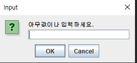

# 10.7

복습

1-1. 1차_조편성.txt 파일을 읽어서
컬렉션 클래스를 사용하여 아래와 같이 출력
( 조건 : 팀원들은 오름차순 정렬해서 출력 )

다음과 같이 출력할 것

**파일 읽어와서 출력만: 숏코딩**

```
 *1조(5명)
팀장 - 김현준
팀원(4명)
권영훈
문경록
윤영선
조영빈
----------
 *2조(5명)
팀장 - 김희진
팀원(4명)
김준호
양시영
윤진한
정수빈
----------
 *3조(4명)
팀장 - 이학준
팀원(3명)
김도희
김창교
여진현
----------
 *4조(5명)
팀장 - 최태권
팀원(4명)
김채홍
예준성
이제환
이희창
----------
 *5조(4명)
팀장 - 권재희
팀원(3명)
김다니엘
서지현
이경수
----------
```

```java
String path = "src\\days26\\1차_조편성.txt";
String line;

try (BufferedReader br = new BufferedReader(new FileReader(path));) {
    while ((line = br.readLine()) != null) {
        ArrayList<String> list = new ArrayList<>(Arrays.asList(line.split("[:,]")));

        System.out.printf(" *%s(%d명)\n", list.remove(0), list.size());
        System.out.printf("팀장 - %s\n", list.remove(0));
        System.out.printf("팀원(%d명)\n", list.size());
        list.stream().sorted().forEach(System.out::println);
        System.out.println("-".repeat(10));
    }
} catch (Exception e) {
    e.printStackTrace();
}
```

> Iterator 는 크기와 정렬이 불가능하다. 리스트가 Iterator 의 상위호환이다.

**파일 읽어와서 맵에 담기: 숏코딩**

```java
{1조=[김현준, 문경록, 윤영선, 권영훈, 조영빈], 
 2조=[김희진, 양시영, 윤진한, 김준호, 정수빈], 
 3조=[이학준, 김창교, 김도희, 여진현], 
 4조=[최태권, 김채홍, 이희창, 예준성, 이제환], 
 5조=[권재희, 김다니엘, 서지현, 이경수]}
```

```java
LinkedHashMap<String, ArrayList<String>> map = new LinkedHashMap<>();
String path = "src\\days26\\1차_조편성.txt";
String line;

try (BufferedReader br = new BufferedReader(new FileReader(path));) {
    while ((line = br.readLine()) != null) {
        ArrayList<String> team = new ArrayList<>(Arrays.asList(line.split("[:,]")));
        map.put(team.remove(0), team);
    }
} catch (Exception e) {
    e.printStackTrace();
}
```

> 잘라진 상태에서는 넣기쉽다.

**맵에 담긴 것 출력: 숏코딩**

출력은 위와 같다.

```java
Iterator<Entry<String, ArrayList<String>>> ir = map.entrySet().iterator();
while (ir.hasNext()) {
    Entry<String, ArrayList<String>> entry = ir.next();
    ArrayList<String> team = entry.getValue();

    System.out.printf(" *%s(%d명)\n", entry.getKey(), team.size());
    System.out.printf("팀장 - %s\n", team.remove(0));
    System.out.printf("팀원(%d명)\n", team.size());
    team.stream().sorted().forEach(System.out::println);
    System.out.println("-".repeat(10));
}
```

Q. 리스트를 부분정렬 하는방법은?

A. 

5-1. InputStream is = System.in; 
을 사용해서 문자열을 입력받아서 출력하고
바이트스트림을 이용해서 message.dat 로 저장하세요. 

> 문자열을 입력 ? 안녕하세요~ 
> 출력 : 안녕하세요~

try-with-resources 를 사용하지 않으면 `flush()` 와 `close()` 를 꼭 해줄 것.

```java
InputStream is = System.in;
try (FileWriter fw = new FileWriter("message.dat");) {
    System.out.print("> 문자열을 입력 ? ");
    String str = new String(is.readAllBytes());
    fw.write(str);
    System.out.printf("> 출력 : %s", str);
} catch (IOException e) {
    e.printStackTrace();
}
```


---

**목차**

- File 클래스
  - 파일정보 출력
  - 폴더 만들기
  - 파일 삭제
  - 파일명 바꾸기
- FileReader, Writer: 텍스트파일 복사
- PrintWriter + FileWriter: 텍스트파일 작성
- BufferedIOStream + FileIOStream: 파일 분할 및 결합
- DataIOStream + FileIOStream: 데이터 저장 및 불러오기


p.918 표 15-28

**file.**

- `getCanonicalPath()` 절대경로
- `getAbsolutePath()` 현재경로 + 상대경로
- `getPath()` 상대경로
- `getName()` 파일이름 + 확장자
- `getParent()` 상대경로 혹은 그 위 디렉토리 ex) .. or C:\class ~~
- `mkdir()` 폴더생성
- `mkdirs()` 필요하면 부모디렉토리까지 생성
- `setExecutable()` ~set 으로 시작하는 것은 속성변경
- `setReadable()` 
- `setReadOnly()` 
- `setWritable()` 
- `toPath()` Path 로 변경
- `toURI` URL 로 변경
- `getTotalSpace()`
- `getUsableSpace()`
- `getFreeSpace()` 
- `delete()` 파일이나 폴더 삭제하고 true 반환. 하위폴더나 파일이 존재하면 삭제가 되지 않는다.
- `deleteOnExit()` 자바 가상머신이 종료될 때 삭제. 아무것도 반환하지 않는다.
- `list()` 문자열로 반환
- `listFiles()`  파일객체로 반환
- `renameTo(File)` 파일명을 바꾼다.
- static `createTempFile()` 임시파일을 만든다.
- static `listRoots()` 파일목록을 File배열로 반환. filter 를 지정한 경우 조건과 일치하는 파일만 반환.

출력

```
C:\class\javaClass\PDFEditor.exe
C:\class\javaClass\javaPro\..\pdfEditor.exe
..\pdfEditor.exe
```

코드

```java
String path = "..\\pdfEditor.exe";
File file = new File(path);

System.out.println(file.getCanonicalPath());
System.out.println(file.getAbsolutePath());
System.out.println(file.getPath());
```

**멤버변수**

- `pathSeparator` 경로와 다른 경로를 구분한다. ex) 윈도우 - ;
- `separator`  왼도우 = \
- `pathSeparatorChar` 문자로 반환
- `separatorChar` 문자로 반환

> 웹에서는 구분을 슬래쉬 / 로 한다.

**용량**

```
C:\
492136894464
146675113984
146675113984
```


```java
File[] rootList = File.listRoots();

for (File f : rootList) {
    System.out.println(f 
            + "\n" + f.getTotalSpace() 
    + "\n" + f.getUsableSpace() 
    + "\n" + f.getFreeSpace());
```

> 하위폴더를 계속해서 찾을 때 재귀함수를 쓴다.

**폴더정보 표시**


```java
for (File f : rootList) {
    File[] subList = f.listFiles();

    for (int i = 0; i < subList.length; i++) {
        File sf = subList[i];
        if (sf.isDirectory()) {
            System.out.print("[폴더]");
        } else if (sf.isFile()) {
            System.out.print("[파일]");
        }
        System.out.printf("\t%s\t%s\t%s (byte)\n"
                , new Date(sf.lastModified())
                , sf.getName()
                , sf.length());
    }
}
```

**오늘날짜 폴더와 조 만들기**

아래와 같이 날짜와 조 폴더 만들기

C:\SS15Class

- ㄴ 20211007(목)
  - ㄴ 1조
    - 김현준(팀장)
    - 권영훈
    - 문경록
    - 윤영선
    - 조영빈
  - ㄴ 2조
  - ㄴ 3조
  - ㄴ 4조
  - ㄴ 5조

```java
String parent = "C:\\SS15Class";
LocalDate d = LocalDate.now();
String pattern = "yyyyMMdd(E)";
DateTimeFormatter formatter = DateTimeFormatter.ofPattern(pattern);
String child = d.format(formatter);
File f = new File(parent, child);
String fileName = ".\\src\\days26\\1차_조편성.txt";

try (FileReader fr = new FileReader(fileName);
        BufferedReader br = new BufferedReader(fr);) {
    String line;
    String regex = "[:,]";
    String[] tm;
    String teamName;
    while ((line = br.readLine()) != null) {
        tm = line.split(regex);
        teamName = tm[0];
        File tf = new File(f, teamName);
        tm[1] += "(팀장)";

        for (int i = 1; i < tm.length; i++) {
            File mf = new File(tf, tm[i]);
            mf.mkdirs();
        }
    }
} catch (Exception e) {
    e.printStackTrace();
}
System.out.println("= END =");
```

SimpleDateFormat 은 Date 클래스를 DateTimeFormatter 는 Local 클래스를 위한 클래스이다.

DateTimeFormatter 는 new 대신 ofPattern 메서드를 사용한다.

`date.format(formatter)` 메서드를 사용한다.

**오늘날짜 날짜포맷 숏코딩**

```
2021년 10월 07일 목요일 오후 09:01:56
```

```
2021년 10월 07일 목요일
```

**Date**

```java
String today = new SimpleDateFormat("yyyy년 MM월 dd일 E요일 a hh:mm:ss").format(new Date());
```

**LocalDate**

```java
LocalDate date = LocalDate.now();
String today = date.format(DateTimeFormatter.ofPattern("yyyy년 MM월 dd일 E요일"));
```

**LocalDateTime**

```java
LocalDateTime date = LocalDateTime.now();
String today = date.format(DateTimeFormatter.ofPattern("yyyy년 MM월 dd일 E요일 a hh:mm:ss"));
```

> Date 는 format부터 LocalDate 는 date부터 입력한다.
>
> Date 는 입력할 때 year - 1900, month - 1 로 입력해야 한다.
>
> LocalDateTime 의 of() 메서드는 파라미터가 year 부터 minute 까지 5개이다.
>
> 반면에 Date 의 생성자에는 year 부터 date 까지 파라미터 3개만 넣어주면 생성할 수 있다.

**텍스트파일 복사**

```
543 bytes
> 처리 시간 : 0.0577339sec
 = Copy End = 
```

```java
public class Ex05 {
	public static void main(String[] args) {
		String originalPath = ".\\src\\days27\\Ex01.java";
		String copyPath = "C:\\class\\download\\Ex01_100.java";
		fileCopy_textStream(originalPath, copyPath);
		System.out.println(" = Copy End = ");
	} // main

	private static void fileCopy_textStream(String originalPath, String copyPath) {
		long start = System.nanoTime();
		File orignalFile = new File(originalPath);
		System.out.printf("%d bytes\n", orignalFile.length()); // 2,385,496 bytes

		try (FileReader fr = new FileReader(originalPath); 
				FileWriter fw = new FileWriter(copyPath)) {
			int c = -1;
			
			while ((c = fr.read()) != -1) {
				fw.write(c);
			}
		} catch (IOException e) {
			e.printStackTrace();
		}
		long end = System.nanoTime();
		System.out.println("> 처리 시간 : " + (end - start) / Math.pow(10, 9) + "sec");
	}
}
```

**p.923 예제 15-32 \[Comparator 로 정렬해서 파일정보 출력]**

내일 재귀함수 복습문제

p.928 예제 15-38

getExtension 메서드 수정

p.929 예제 15-35

**파일삭제 예제**

```java
> 34개 파일이 삭제되었다.
```

```java
public class Ex09 {
	static int deletedFiles = 0;
	
	public static void main(String[] args) {
		String dir = "C:\\ss15class";
		File f = new File(dir);
		String ext = ".java";
		
		delete(f, ext);
		System.out.printf("> %d개 파일이 삭제되었다.", deletedFiles);
	}

	private static void delete(File dir, String ext) {
		File[] files = dir.listFiles();
		
		for (int i = 0; i < files.length; i++) {
			if (files[i].isDirectory()) {
				delete(files[i], ext);
			} else {
				if (files[i].getName().endsWith(ext)) {
					files[i].delete();
					deletedFiles++;
				}
			}
		}
	}
}
```

**p.930 예제 15-36 \[이미지 파일명 바꾸기]**

```java
String dir = ".\\src\\days27\\images";
File f = new File(dir);
File[] flist = f.listFiles();

for (int i = 0; i < flist.length; i++) {
    String fileName = flist[i].getName();
    System.out.println(fileName);
    String newFileName = String.format("%04d.png", Integer.parseInt(FileUtil.getBaseName(fileName)));
    flist[i].renameTo(new File(f, newFileName));
}
```

**p.931 예제 15-37 \[파일 쪼개기]**

숏코딩

```java
String copyPath = "..\\atomSetup.exe";
String pastePath = "..\\atomSetup.";
final int BUFFER_SIZE = (int) pow(1024, 2);
byte[] buffer = new byte[BUFFER_SIZE];
int ordinal = 1;
int count = 0;
int read;

BufferedOutputStream bos = null;
try (BufferedInputStream bis = new BufferedInputStream(new FileInputStream(copyPath), BUFFER_SIZE);) {
    while ((read = bis.read(buffer)) != -1) {
        if (count % 70 == 0) 
            bos = new BufferedOutputStream(new FileOutputStream(pastePath + ordinal++), BUFFER_SIZE);
        bos.write(buffer);
        count++;
    }
} catch (Exception e) {
    e.printStackTrace();
}
```

코딩

```java
String pathname = "C:\\class\\javaClass\\pdfEditor.exe";
final int VOLUME = 10000000;
File f = new File(pathname);
System.out.println(f.length());

FileInputStream fis = new FileInputStream(f);
BufferedInputStream bis = new BufferedInputStream(fis);
int data = 0;
int i = 0; // 읽은 바이트 수
int number = 0; // 쪼갠 파일 서수
FileOutputStream fos;
BufferedOutputStream bos = null;

while ((data = bis.read()) != -1) {
    if (i % VOLUME == 0) {
        fos = new FileOutputStream(pathname + "_." + ++number);
        bos = new BufferedOutputStream(fos);
    }
    bos.write(data);
    i++;
}
System.out.println("= END =");
```

**p.932 예제 15-38 \[나눠진파일을 다시 합치는 예제]**

수업 끝나고 해볼 것

p.934 직렬화 (Serialization)

**p.875 \[ByteArrayInputStream]**

바이트배열에 데이터를 입출력하는데 사용되는 스트림.

Bais 의 생성자와 `bos.write(byte[ ])` 로 읽고 쓴다.

p.876 예제 15-2, 3 꼭 해볼 것

p.879 \[FileInputStream]

p.882 FilterInputStream

p.883 BufferedInputStream

p.886 DataInputStream

데이터를 읽고 쓰는데 byte 단위가 아닌 8가지 기본자료형의 단위로 읽고 쓸 수 있는 장점이 있는 스트림.

**charSequence 란?**

String, StringBuilder, StringBuffer, CharBuffer, Segment 등이 charSequence 인터페이스를 구현했다.

String 은 불변 (immutable), StringBuffer 는 변할수있다. (mutable)

String 은 문자열연산에 성능이 좋지않지만 동기화를 신경쓰지 않아도 된다. (Thread - safe)

StringBuilder 와 StringBuffer 클래스가 제공하는 메서드는 동일하다.

StringBuffer 는 메서드별로 Synchronized Keyword 가 존재하고 멀티스레드 환경에서도 동기화를 지원한다.

StringBuilder 는 동기화를 보장하지 않는다.

단일스레드 환경: StringBuilder

멀티스레드 환경: StringBuffer

한번 사용 및 멀티스레드: String

**FileWriter fw.**

- `append(char)`
- `append(charSequence)` start, end 지정가능
- `write(int)`
- `write(char[ ])`
- `write(String)` 

**PrintWriter pw.**

보조스트림

- `pw.printf(format, Object)` 

`System.in` 은 InputStream

`System.out` 은 PrintStream 인 보조스트림

**원하는 형식으로 텍스트파일 작성**

```
이희창, 90, 89, 77, 256, 85.33, true
```

```java
String name = "이희창";
int kor = 90;
int eng = 89;
int mat = 77;
int tot = kor + eng + mat;
double avg = tot / 3.0;
boolean gender = true;
String fileName = ".\\src\\days27\\students.txt";
FileWriter fw = new FileWriter(fileName); 
PrintWriter pw = new PrintWriter(fw);

pw.printf("%s, %d, %d, %d, %d, %.2f, %b\n", name, kor, eng, mat, tot, avg, gender);
pw.flush();
fw.close();
pw.flush();
pw.close();
System.out.println("= END =");
```

**DateOutputStream dos.**

다양한 형식으로 저장할 수 있다.

- `write~()` 

p.892 

내일 IO 수업

다음주 프로젝트

**쓰기**

```java
		String name = "이희창";
		int kor = 90;
		int eng = 89;
		int mat = 77;
		int tot = kor + eng + mat;
		double avg = tot / 3.0;
		boolean gender = true;
		String fileName = ".\\src\\days27\\students.dat";
		FileOutputStream out = new FileOutputStream(fileName);
		DataOutputStream dos = new DataOutputStream(out);
		
		dos.writeUTF(name);
		dos.writeInt(kor);
		dos.writeInt(eng);
		dos.writeInt(mat);
		dos.writeInt(tot);
		dos.writeDouble(avg);
		dos.writeBoolean(gender);
		
		out.flush();
		dos.flush();
		out.close();
		dos.close();
		System.out.println("END");
```

**읽기**

```java
String name = null;
int kor = 0;
int eng = 0;
int mat = 0;
int tot = 0;
double avg = 0;
boolean gender = false;
String fileName = ".\\src\\days27\\students.dat";
FileInputStream in = new FileInputStream(fileName);
DataInputStream dis = new DataInputStream(in);

name = dis.readUTF();
kor = dis.readInt();
eng = dis.readInt();
mat = dis.readInt();
tot = dis.readInt();
avg = dis.readDouble();
gender = dis.readBoolean();

System.out.printf("%s %d %d %d %d %.2f %b\n",
        name, kor, eng, mat, tot, avg, gender);
in.close();
dis.close();
System.out.println("= END =");
```

> DataInputStream 은 문자열을 쓰거나 읽을 때 `readUTF()` `writeUTF()` 를 쓴다.

**같이쓰는 클래스 정리**

텍스트 쓰기

PrintWriter + FileWriter: 

데이터 읽기/쓰기

DataInputStream + FileInputStream: 값 읽어와서 바로쓰기

BufferedInputStream + FileInputStream: 빠른속도로 파일복사 혹은 쪼개기

텍스트 읽기

BufferedReader + FileReader

```java
PrintWriter pw = new PrintWriter(new FileWriter(path));
DataInputStream dis = new DataInputStream(new FileInputStream(path));
BufferedReader br = new BufferedReader(new FileReader(path), BUFFER_SIZE);
BufferedInputStream bis = new BufferedInputStream(new FileInputStream(path), BUFFER_SIZE);
```

**new 로 생성할 수 없는 클래스들**

`DateTimeFormatter` ofPattern() 생성

`LocalDate` now() 혹은 of(year, month, date) 로 생성

`LocalTime` now() 혹은 of(hour, minute) 로 생성 (+ second, nanoSecond)

`Calendar` getInstance() 로 지금날짜 반환 혹은 new GregorianCalendar(year, month, date) 생성

**날짜 입력받기**

`Date` long, String

`LocalDate` 

`LocalDateTime` long

**long 으로 입력받아서 날짜출력하기**

**Date**

```
Sat Sep 04 20:24:02 KST 2021
```

```java
long l = new File("..\\pdfEditor.exe").lastModified();
Date modifiedDate = new Date(l);
```

**LocalDateTime**

```
2021-09-04T20:24:02
```

```java
long l = new File("..\\pdfEditor.exe").lastModified();
LocalDateTime modifiedDate = LocalDateTime.ofEpochSecond(l / 1000, 0, ZoneOffset.ofHours(9));
```

File 의 lastModified() 메서드와 Date 의 생성자 long 형은 밀리세컨드 ms ($$10^(-3)$$ second) 이므로 LocalDateTime 의 ofEpochSecond 메서드의 첫번째 인자의 단위가 second 이므로 $$10^3$$ 으로 나눠주는 모습이다.

우리나라는 UTC+9 시간이므로 ZoneOffset 에 9 를 더해주면 Date 객체와 같은 시각을 표시하는 것을 볼 수 있다.

**long 날짜출력 예시**

```
2021년 09월 24일 토요일, 오후 08:24:02
```

```java
Date d = new Date(f.lastModified());
String str = new SimpleDateFormat("yyyy년 MM월 mm일 E요일, a hh:mm:ss").format(d);
```

# 10.8

복습문제

3, 7, 8을 못풀었다.

**2-1. 폴더 생성**
// C:\\SS15Class\\20211008(금) (오늘날짜)
	//                    ㄴ 1조
	//                      ㄴ 팀장
	//                        ㄴ김현준
	//                      ㄴ 팀원(4명)
  	//                        ㄴ문경록 
 	 //                        ㄴ윤영선
 	 //                        ㄴ권영훈
	  //                        ㄴ조영빈
	//                    ㄴ 2조
	//                    ㄴ 3조
	//                    ㄴ 4조
	//                    ㄴ 5조


**코드**

```java
String d = new SimpleDateFormat("yyyyMMdd(E)").format(new Date());
String parent = "C:\\SS15Class\\" + d;
String path = "src\\days26\\1차_조편성.txt";

try (BufferedReader br = new BufferedReader(new FileReader(path));) {
    String line;

    while ((line = br.readLine()) != null) {
        ArrayList<String> team = new ArrayList<>(Arrays.asList(line.split("[:,]")));
        
        File f = new File(parent, team.remove(0));
        new File(f, "팀장\\" + team.remove(0)).mkdirs();
        team.forEach(i -> new File(f, "팀원(" + team.size() + "명)\\" + i).mkdirs());
    }
} catch (Exception e) {
    e.printStackTrace();
}
```

**3-1. days27폴더 안의 파일의 크기 내림차순으로 정렬해서 출력**

```
src\days27\images0001		669527 (byte)
src\days27\images0011		464943 (byte)
src\days27\images0002		272150 (byte)
src\days27\images		4096 (byte)
src\days27\Main.java		1602 (byte)
src\days27\Ex05_02.java		1292 (byte)
src\days27\Ex04.java		1124 (byte)
src\days27\Ex05.java		1019 (byte)
src\days27\Ex15_02.java		1005 (byte)
src\days27\Ex11.java		988 (byte)
src\days27\Ex16_02.java		858 (byte)
src\days27\Ex16.java		815 (byte)
src\days27\Ex02.java		752 (byte)
src\days27\Ex15.java		698 (byte)
src\days27\Ex13.java		685 (byte)
src\days27\Ex09.java		657 (byte)
src\days27\Ex08.java		612 (byte)
src\days27\Ex01.java		543 (byte)
src\days27\Ex10.java		531 (byte)
src\days27\Ex06.java		526 (byte)
src\days27\Ex07.java		480 (byte)
src\days27\Ex03.java		367 (byte)
src\days27\user.properties		94 (byte)
src\days27\students.txt		40 (byte)
src\days27\students.dat		36 (byte)
```

코드

```java
File[] files = new File("src\\days27").listFiles();
Arrays.sort(files, (o1, o2) -> (int) (o2.length() - o1.length()));

for (File f : files) System.out.printf(f + "\t\t%d (byte)\n", f.length());
```

**객체 내림차순 정렬**

람다식 사용

```java
Arrays.sort(files, (o1, o2) -> (int) (o2.length() - o1.length()));
```

Comparator 의 제네릭메서드 사용

```java
Arrays.sort(files, Comparator.<File>comparingLong(i -> i.length()).reversed());
```

**4-1. src 폴더 안의 모든  하위폴더 안에서 Lotto 라는 문자열을**
**가지고 있는 파일 찾아서 출력**

출력

```
src\days08\Ex05_02.java
src\days12\Ex13_02.java
src\days24\Ex10_02.java
src\days24\Ex10_03.java
src\days28\Main.java
src\days29\Main.java
```

코드

```java
public class Main {
	public static void main(String[] args) {
		ArrayList<File> files = new ArrayList<>();
		String path = "src";
		String keyword = "Lotto";
		
		find(files, path, keyword).forEach(System.out::println);
	}

	private static ArrayList<File> find(ArrayList<File> files, String path, String keyword) {
		File parent = new File(path);

		for (File f : parent.listFiles()) {
			if (f.isDirectory()) find(files, f.toString(), keyword);
			else {
				try (BufferedReader br = new BufferedReader(new FileReader(f))) {
					String line;

					while ((line = br.readLine()) != null) {
						if (line.contains(keyword)) {
							files.add(f);
							break;
						}
					}
				} catch (Exception e) {
					e.printStackTrace();
				}
			}
		}
		return files;
	}
}
```

> 재귀함수라면 배열을 함수 바깥에서 선언해야 하고 파라미터로 받아 거기에 추가해야 한다.
>
> Set 이 아니라 ArrayList 라면 중복을 피하기 위해 `break;` 문을 써야한다.

라인번호도 함께 반환

```
src\days12\Ex13_02.java=[21, 29, 37, 46, 50, 58]
src\days24\Ex10_02.java=[17, 18, 23, 29, 38]
src\days28\Main.java=[11]
src\days08\Ex05_02.java=[12, 25]
src\days24\Ex10_03.java=[35, 40, 45, 54]
src\days29\Main.java=[13]
```

코드

```java
public class Main {
	public static void main(String[] args) {
		HashMap<File, ArrayList<Integer>> dict = new HashMap<>();
		String path = "src";
		String keyword = "Lotto";

		find(dict, path, keyword).entrySet().forEach(System.out::println);
	}

	private static HashMap<File, ArrayList<Integer>> find(HashMap<File, ArrayList<Integer>> dict, String path,
			String keyword) {
		File parent = new File(path);

		for (File f : parent.listFiles()) {
			if (f.isDirectory()) find(dict, f.toString(), keyword);
			else {
				ArrayList<Integer> lines = null;
				String line;
				int lineNumber = 1;

				try (BufferedReader br = new BufferedReader(new FileReader(f))) {
					while ((line = br.readLine()) != null) {
						if (line.contains(keyword)) {
							try {
								lines.add(lineNumber);
							} catch (NullPointerException e) {
								lines = new ArrayList<>();
								lines.add(lineNumber);
							}
						}
						lineNumber++;
					}
				} catch (Exception e) {
					e.printStackTrace();
				}
				if (lines != null) dict.put(f, lines);
			}
		}
		return dict;
	}
}
```

> 모든파일에 ArrayList lines 를 만들지 않고, keyword 가 파일내에 존재할 때만 ArrayList 를 만들어서 담는다.

**5-1. src 폴더 안에서  txt 파일 모두 찾아서 출력** 

출력

```
교육생명단.txt 
수업시간표.txt
과제.txt 
```

filenameFilter() 인터페이스 사용

```java
public class Main {
	public static void main(String[] args) {
		String path = "src";
		String extension = "txt";
		File[] files = find(path, extension);
		Arrays.stream(files).forEach(System.out::println);
	}

	private static File[] find(String path, String extension) {
		return new File(path).listFiles(new FilenameFilter() {
			@Override
			public boolean accept(File dir, String name) {
				return name.endsWith(extension);
			}
		});
	}
}
```

인터페이스

- FilenameFilter
- FileFilter

람다식

```java
String path = "src";
String extension = "txt";
File[] files = new File(path).listFiles((file, name) -> name.endsWith(extension));
Arrays.stream(files).forEach(System.out::println);
```

숏코딩

```java
Arrays.stream(new File("src").listFiles((file, name) -> name.endsWith("txt"))).forEach(System.out::println);
```

> 스택오버플로우를 뒤지다가 파일리스트를 람다식으로 반환하는 것을 발견했다.

**6-1. days27.imags 폴더 안의** 
// 1.png  => 0001.png => 1.png
// 2.png  => 0002.png => 2.png
// 11.png => 0011.png => 3.png
파일 이름 변경

```java
String path = "src\\days27\\images";
```

**0011 로 바꾸기: 숏코딩**

```java
for (File f : new File(path).listFiles()) {
    int zero = 8 - f.getName().length();
    f.renameTo(new File(path, "0".repeat(zero) + f.getName()));
}
```

**11로 바꾸기: 숏코딩**

```java
for (File f : new File(path).listFiles()) 
    f.renameTo(new File(path, f.getName().replaceAll("^0+", "")));
```

**7-1. 아무 파일이든 3개의 파일로 나누세요..**
예) test.dat

 test_01.dat    		
 test_02.dat    		
 test_03.dat

```java
String copyPath = "..\\atomSetup.exe";
String pastePath = "..\\atomSetup.";
final int BUFFER_SIZE = (int) pow(1024, 2);
byte[] buffer = new byte[BUFFER_SIZE];
int ordinal = 1;
int count = 0;
int read;

BufferedOutputStream bos = null;
try (BufferedInputStream bis = new BufferedInputStream(new FileInputStream(copyPath), BUFFER_SIZE);) {
    while ((read = bis.read(buffer)) != -1) {
        if (count % 70 == 0) 
            bos = new BufferedOutputStream(new FileOutputStream(pastePath + ordinal++), BUFFER_SIZE);
        bos.write(buffer);
        count++;
    }
} catch (Exception e) {
    e.printStackTrace();
}
```

atomSetup.exe 파일의 용량이 190MB 정도 되므로 70MB 씩 나눈다. 

(count % 70) 의 70 과 pow(1024, 2) 의 1MB 를 곱하면 70MB 가 된다.

**8-1. String name = "홍길동";**
int age = 20;
boolean gender=true;
char grade = 'B';
double weight = 60.25;

위의 데이터를 DataOutputStream을 사용해서 info.dat 파일에
저장하고

DataInputStream을 사용해서 화면에 출력하는 코딩을 하세요. 

```
홍길동
20
true
B
60.25
```

```java
String name = "홍길동";
int age = 20;
boolean gender = true;
char grade = 'B';
double weight = 60.25;
String path = "..\\info.dat";

try (DataOutputStream dos = new DataOutputStream(new FileOutputStream(path));
        DataInputStream dis = new DataInputStream(new FileInputStream(path));) {
    dos.writeUTF(name);
    dos.writeInt(age);
    dos.writeBoolean(gender);
    dos.writeChar(grade);
    dos.writeDouble(weight);

    System.out.println(dis.readUTF());
    System.out.println(dis.readInt());
    System.out.println(dis.readBoolean());
    System.out.println(dis.readChar());
    System.out.println(dis.readDouble());
} catch (Exception e) {
    e.printStackTrace();
}
```

---

**목차**

1. SequenceInputStream, OutputStream
2. StringReader, Writer
3. InputStreamReader, Writer
4. RandomAccessFile
5. 직렬화

**p.892 \[SequenceInputStream]**

순차적인 바이트스트림

생성자에 'Stream 의 Enumeration' 이나 'Stream' 을 두 개까지 담을 수 있다.

**리스트에 스트림 담아 SequenceInputStream 에 넣기**

```java
byte[] arr1 = {0, 1, 2};
byte[] arr2 = {3, 4, 5};
byte[] arr3 = {6, 7, 8};
Vector<ByteArrayInputStream> v = new Vector<>();

v.add(new ByteArrayInputStream(arr1));
v.add(new ByteArrayInputStream(arr2));
v.add(new ByteArrayInputStream(arr3));
Enumeration<ByteArrayInputStream> en = v.elements();
SequenceInputStream sis = new SequenceInputStream(en);
```

**p.901 \[PipedReader, Writer]**

스레드간에 데이터를 주고받을 때 사용한다.

**p.903 \[StringReader, Writer]**

*** `toString()` `getBuffer()` 로 저장한 데이터를 String 이나 StringBuffer 로 반환할 수 있다.

CharArrayReader 도 있다.

문제) source 문자열의 10번째 라인의 5번째 한 문자를 얻어와서 출력.

**split**

```java
char c = source.split("\r\n")[10 - 1].trim().charAt(5 - 1);
```

**StringReader**

```java
StringReader sr = new StringReader(source);
BufferedReader br = new BufferedReader(sr);
String line;

while ((line = br.readLine()) != null) {
    System.out.println(line);
}
```

p.904 \[BufferedReader, Writer]

1. 문자스트림
2. 버퍼를 이용해서 입출력의 효율을 높일 수 있도록 하는 보조스트림

**p.905 \[InputStreamReader, Writer]**

1. 문자스트림
2. 바이트 기반 스트림을 문자기반 스트림으로 연결시켜주는 보조스트림

**한 줄 단위 입력받기**

```java
BufferedReader br = new BufferedReader(new InputStreamReader(System.in));|
```

**한글 하나만 입력받기**

System.in 

```java
byte[] buffer = new byte[3];

System.in.read(buffer);
char c = new String(buffer).charAt(0);
```

System.in + InputStreamReader

```java
InputStreamReader isr = new InputStreamReader(System.in);
int c = isr.read();
```

System.in + InpurStreamReader + BufferedReader

```java
BufferedReader br = new BufferedReader(new InputStreamReader(System.in));
String line = br.readLine();
```

**p.911 \[RandomAccessFile]** 

1. 파일의 어느 위치에나 읽기/쓰기 가능 (장점)
2. 기본형 읽기/쓰기 가능
3. 하나의 스트림 클래스로 파일 읽기 + 쓰기 모두가능

DataOutputStream 과 비슷하게 사용할 수 있다.

**생성자**

- `(File, mode)` mode 에는 r, rw, rws, red 가 있다.
- `(String, mode)`

**raf.**

- `writeBytes(String)`
- `seek(long pos)` 커서를 옮긴다. (덮어쓴다.)

p.913 예제 15-26

> Integer 는 4바이트를 잡는다.

```java
int[] scores = {
        1, 100, 90, 90,
        2, 70, 90, 100,
        3, 100, 100, 100,
        4, 70, 60, 80,
        5, 70, 90, 100
    };

    RandomAccessFile raf = new RandomAccessFile(".\\src\\days28\\score.dat", "rw");
    for (int i : scores) 
        raf.writeInt(i);

    // 3번 학생의 정보만 출력
    long pos = 4*4*2;
    raf.seek(pos);
    int no = raf.readInt();
    int kor = raf.readInt();
    int eng = raf.readInt();
    int mat = raf.readInt();
    System.out.printf("번호:%d, 국어:%d, 영어:%d, 수학:%d\n", no, kor, eng, mat);
```

**수학점수 수정하기**

```java
long pos = 4*4*2 + 4*3;
raf.seek(pos);
raf.writeInt(20);
```

> Integer 는 4바이트 0000 0000 으로 표현한다. 

p.915 File 클래스

**p.934 \[직렬화 (Serialization)]**

@@@@@중요

직렬화란 ? 객체를 데이터스트림으로 만드는 것

객체 -> 스트림: 직렬화

스트림 -> 객체: 역직렬화

객체를 다룰 수 있는 보조스트림: ObjectInputStream, OutputStream

**직렬화 예외**

```
java.io.NotSerializableException
```

Serializable 인터페이스를 구현한다.

```java
class Member implements Serializable {
	String name;
	int money;
	boolean gender;
	
	public Member(String name, int money, boolean gender) {
		super();
		this.name = name;
		this.money = money;
		this.gender = gender;
	}
}
```

Serializable 인터페이스를 구현한 모든 클래스는 직렬화를 할 수 있다.

**직렬화 예제**

```java
Member m1 = new Member("문경록", 1000, true);
String fileName = ".\\src\\days28\\member.dat";

try (FileOutputStream out = new FileOutputStream(fileName);
ObjectOutputStream oos = new ObjectOutputStream(out);) {
    oos.writeObject(m1);
} catch (Exception e) {
    e.printStackTrace();
}

System.out.println("> 엔터 치면 객체를 파일로부터 읽어옵니다.");
System.in.read();
System.in.skip(System.in.available());

try (FileInputStream in = new FileInputStream(fileName);
ObjectInputStream ois = new ObjectInputStream(in);) {
    Member m = (Member) ois.readObject();
    System.out.println(m);
} catch (Exception e) {
    e.printStackTrace();
}
```

- `writeObject()`
- `readObject()` 

**transient 키워드**

transient: 순간적인

transient 가 붙은 필드는 직렬화 대상에서 제외된다.

transient 와 마찬가지로 `static` 이 붙은 필드도 직렬화 대상에서 제외된다.

**p.943 \[직렬화가 가능한 클래스의 버전관리]**

역직렬화할 때는 같은 직렬화할 때와 같은 클래스여야 한다.

부모가 직렬화가 가능하면 자식도 인터페이스 구현없이 직렬화가 가능하다.

> 자식만 Serializable 인터페이스를 구현하면 부모의 필드는 직렬화되지 않는다.

**경고** 

```java
The serializable class Child does not declare a static final serialVersionUID field of type long
```

**p.934 \[직렬화 가능한 클래스의 버전관리]**

Add generated serial version ID 를 누르면 직렬화 가능한 클래스의 버전관리를 수동으로 할 수 있다.

```java
private static final long serialVersionUID = 2741687742138770720L;
```

이렇게 자동으로 생성해준다.

만약 이전과 다른 버전이 된다면 다음과 같은 에러를 띄우게된다.

```java
java.io.InvalidClassException: days29.Member; local class incompatible: stream classdesc serialVersionUID = 3702592281529480323, local class serialVersionUID = 1828844963737784662
```


직렬화되지 않은 부모의 필드 (p) 도 직렬화 대상에 포함시키고자 한다면 수동으로 `writeObject()` `readObject()` 를 직접 구현한다.

```java
class Child extends Parent implements Serializable { 
	public int age;
    
	private void writeObject(ObjectOutputStream out) throws IOException {
		out.writeUTF(name);
		out.defaultWriteObject();
	}

	private void readObject(ObjectInputStream in) throws ClassNotFoundException, IOException {
		name = in.readUTF();
		in.defaultReadObject();
	}
}
```

```java
class Parent {
	String name;
}
```

`defaultWriteObject()` 와 `defaultReadObject()` 는 기본 직렬화이므로 부모에게 있는 name 을 따로 넣어준 뒤 기본 직렬화를 해주면 부모의 name 필드도 들어가게 된다.

이때 반드시 이 두 메서드는 private 로 선언해야 한다는 규칙을 우리가 정했으므로 지키도록 하자.

static, 상수, transient 는 직렬화에 영향을 미치지 않으므로 버전에도 영향을 미치지 않는다.


**p.722 Chapter 13 \[쓰레드 (Thread)]**

1. 프로세스와 쓰레드
   - 프로세스 (process) ? 실행 중인 플로그램

프로세스: OS 로부터 필요한 자원 (메모리) 할당받아서 실행중인 프로그램

# 10.12

오늘내일 프로젝트.

14 (목) 9시 오전발표 (PPT) + 목금 스레드, 네트워크

금요일에 일찍 끝나면 오라클

# 10.14

프로세스 

ctrl alt delete

OS 로 부터 실행에 필요한 자원을 할당받아서 

**멀티태스킹 & 멀티스레드**

여러 개의 프로세스를 자동으로 OS 차원의 관리

OS 가 자동으로 멀티태스킹, 멀티스레드 관리.

Runnable 인터페이스

**[Thread 클래스]**

- `currentThread()` 현재 쓰레드객체 반환. 기본은 'main' 스레드

1. 쓰레드 생성방법은 2가지
2. 인터페이스도 가능하다
3. 람다식도 가능하다.
4. 자바는 다중상속이 되지 않으므로 다른 클래스를 상속받을 때는 Runnable 인터페이스를 구현해야 한다.

**Thread 생성방법**

Thread 클래스 상속

```java
Thread thread = new 클래스명();
Thread thread = new 클래스명(쓰레드명);
```

인자를 하나 받기위해서는 생성자를 생성해야 한다.

Runnable 인터페이스 구현

```java
Thread thread = new Thread(new 클래스명());
Thread thread = new Thread(new 클래스명(), 쓰레드명);
```

Thread 는 생성하면 이름을 바꿔도 

Thread-0 처럼 순서대로 이름이 부여된다.

`setName()` 을 통해서 쓰레드이름을 변경할 수 있다.

쓰레드를 출력하면 `Thread[쓰레드명, 숫자, 쓰레드]` 의 형식으로 출력된다.

이름을 출력하려면 `getName()` 

**[메서드]**

| 메서드               | 설명                                                         |
| -------------------- | ------------------------------------------------------------ |
| <u>sleep(long)</u>   | 천분의 1초동안 스레드 일시정지                               |
| <u>yield()</u>       | 다른 스레드에게 양보하고 자신은 실행대기상태가 된다.         |
| currentThread()      |                                                              |
| getState()           | 현재 해당스레드의 상태값을 반환                              |
| getName()            |                                                              |
| setName()            |                                                              |
| setPriority()        |                                                              |
| start()              |                                                              |
| interrupt()          | 하던일을 멈춘다.<br />Object.wait() Thread.join() Thread.sleep() 등 블락된 상태에서 호출하면 InterruptedException 예외가 발생한다. |
| <u>interrupted()</u> | boolean: 호출 후 interrupt 상태가 사라진다.                  |
| isInterrupted()      | boolean: 요청이 들어오다. interrupt() 메서드가 호출되었는지 여부<br />interrupt 상태가 사라지지 않는다. |
| join() join(long)    |                                                              |

c - get2 - set2 - s - i

쓰레드의 run 메서드는 입력이 없고 반환도 없다.

**[자바 GUI]**

개발순서: AWT - Swing - JavaFX

1. AWT: Java 1.0 에 포함된 AWT (Abstract Window Toolkit) 는 운영체제가 제공하는 네이티브 UI 컴포넌트를 이용하는 자바 라이브러리. 종류가 제한적
2. Swing: AWT 의 다음세대. 성능이 느려지고 메모리를 많이 먹어서 밀려남
3. JavaFX: 자바 7부터 JDK 에 포함. 자바표준 UI 라이브러리였던 Swing 보다 강력해졌다. 풍부한 UI 기능을 활용할 수 있다.

**Frame**

Frame 이 옛날 클래스라 그런지 자동완성이 되지 않는다.

패키지: java.awt

**Frame 메서드**

- `setTitle(String)`
- `setSize(가로, 세로)` 
- `setVisible(boolean)` 
- `add(Component)`

**button.**

- `setLabel(String)` 

**Frame 클래스로 버튼추가**

Frame 클래스를 상속

```java
Button btn = new Button();

btn.setLabel("copy");
add(btn);
setSize(200, 200);
setVisible(true);
```

`add()` `setSize()` `setVisible()` 은 꼭 있어야한다.

Frame 클래스 내일문제 버튼클릭 파일복사 스레드 Ex03

복사까지 구현하지 말 것

p.736 

**입력용 대화상자**



```java
String inputData = JOptionPane.showInputDialog("아무값이나 입력하세요.");
```

**JOptionPane.**

- `showInputDialog(Object message)` String 반환. 입력창 보여준다.
- `showConfirmDialog(Component, Object message)` int 반환. 확인창 보여준다.

**p.738 \[스레드의 우선순위]**

우선권 (priority)

멀티스레드: OS 자동으로 자원 (CPU) 할당

- `setPriority(1~10)` 기본값 5. 10이면 우선순위가 제일 높은 값이며 CPU 가 가장 빨리 일을 처리한다. 

p.748 13-3 표 쓰레드의 상태


NEW - start() - RUNNABLE - `sleep()` - TIMED_WAITING - - RUNNABLE - TERMINATED

실행중인 상태는 RUN

일시정지하면 `sleep()` TIMED_WAITING 상태


멀티스레드 - 동기화 처리문제

A 의 작업이 안끝났을 때 lock 을 걸어서 동기화작업을 한다.

데드락: 죽을 때까지 락이 걸린다는 스레드표현

**p.752 \[interrupt() & interrupted()]**

```java
run() {
    while (작업취소 요청확인 !interrupted()) {
    }
}
```

스레드는 run() 메서드를 다 처리하고 나면 자동으로 종료

`InterruptedException` sleep() 등에 의해 실행할 수 없는 상태일 때 interrupt() 를 실행하면 예외가 발생한다.

p.755 메서드

- `suspend()` 일시멈춤. 없어질 메서드
- `resume()` 다시시작. 없어질 메서드
- `stop()` 스레드 강제종료. 없어질 메서드
- `yield()` 

p.760 yield()

양도하다.

뭐를 양보하는가 ? 스레드 자신에게 주어진 실행시간을 다음차례 스레드에게 양보하는 메서드

RUN (실행 중 상태) -> 실행대기상태 (RUNNABLE 상태)

`yield()` , `interrupt()` 를 적절히 사용하면 프로그램의 응답성을 높이고 보다 효율적인 실행이 가능하다.

스레드의 종료시점 ? 

1. run() 모두 처리되면 자동종료
2. interrupt(), \[boolean flag] 강제종료

p.760 예제 13~18 yield() 

내일수업 p.763 join()~

**오라클**

expression edition 이 무료버전이다.

11g 다운방법

https://www.oracle.com/database/technologies/xe-prior-release-downloads.html

1. 오라클 홈페이지 - 제품 - 

**실행파일 에러해결**


```
C:\oraclexe\app\oracle\product\11.2.0\server
```

설치파일로 이동한다.

Get_Started 라는 파일의 속성 (우클릭) 에서 웹문서의 URL 에서 %HTTPPORT% 를 8080 이나 9090 등 다른 값으로 바꿔주면 실행이 된다.

# 10.15

**복습**

5-1. 멀티 스레드를 사용할 때 동기화 처리 문제점에 대해서 설명하세요.

wait() 로 기다리라고 하고 notify() 를 통해 설명

7-1. 스레드의 종료 방법에 대해서 설명하세요.
ㄱ. 자동 종료

run 이 끝나면 자동종료

  ㄴ. 강제 종료

`thread.stop()` 

---


**SQL 다운로드**

sql 검색 후 두번째 클릭

SQL Developer 21.2.1 Downloads 에서 

Windows 64-bit with JDK 8 included (첫번째) 클릭

**p.763 \[join()]**

1. 다른 스레드의 작업을 기다린다.
   - 스레드 자신이 하던 작업을 잠시 멈추고, 다른 스레드가 지정된 시간동안 작업을 수행하도록 할 때 사용한다.
   - 시간이 지정하지 않으면, 해당 스레드가 작업을 모두 마칠 때 까지 기다린다.
2. join() 메서드도 sleep() 메서드처럼 interrupt() 메서드에 의해 대기상태를 벗어날 수 있다.
3. join() 이 호출되는 부분은 try-catch 블럭으로 처리해야 된다.

**join() 예제**

join() 이 없는 출력

```
0+
> 1~10 까지의 합은: 0
1+2+3+4+5+6+7+8+9+10+
```

join() 이 있는 출력

```
0+1+2+3+4+5+6+7+8+9+10+
> 1~10 까지의 합은: 55
```

코드

```java
public class Ex03 {
	public static void main(String[] args) throws InterruptedException {
		JoinThread thread = new JoinThread();
		thread.start();
		thread.join();
		System.out.println("\n> 1~10 까지의 합은: " + thread.sum);
	}
}

class JoinThread extends Thread {
	long sum = 0;

	@Override
	public void run() {
		for (int i = 0; i <= 10; i++) {
			System.out.printf("%d+", i);
			sum += i;

			try {
				sleep(100);
			} catch (InterruptedException e) {
				e.printStackTrace();
			}
		}
	}
}
```

**p.\[767 스레드의 동기화]**

1. 임계영역 (critical section): 어디까지 잠글지를 정하는 영역.
2. 잠금 (lock)
3. 스레드 동기화 (synchronization): 한 스레드가 진행중인 작업을 다른 스레드가 간섭하지 못하도록 막는 것.
4. 자바에서는 synchronized {} 블럭을 이용해서 스레드 동기화 지원
5. JDK1.5 부터 java.util.concurrent.locks 와 java.util.concurrent.atomic 패키지 에 동기화 처리하는 클래스가 있다.
6. 동기화 처리방법
   - 특정코딩부분만 synchronized( 객체의 참조변수 ) { 특정코딩 } 임계영역
   - public synchronized void test() {} 메서드 전체 임계영역. 이게 더 효율적이다.

Q. sleep 을 하면 Thread 를 넘겨주는 것 확인

A.

**p.771 \[wait() notify()]**

**\[synchronized]**

메서드 안에 synchronized 와 synchronized 메서드

**예제1**

**메서드 안에 synchronized**

```
> main 스레드 시작.
p1 : 은하철도 999-4대여.
p1 : 은하철도 999-4보는중.
p1 : 은하철도 999-4반납.
p4 : 은하철도 999-4대여.
p4 : 은하철도 999-4보는중.
p4 : 은하철도 999-4반납.
p2 : 은하철도 999-4대여.
p2 : 은하철도 999-4보는중.
p2 : 은하철도 999-4반납.
p3 : 은하철도 999-4대여.
p3 : 은하철도 999-4보는중.
p3 : 은하철도 999-4반납.
```

코드

```java
public class Ex06 {
	static VideoShop vshop = new VideoShop();

	public static void main(String[] args) {
		System.out.println("> main 스레드 시작.");
		Person p1 = new Person("p1");
		Person p2 = new Person("p2");
		Person p3 = new Person("p3");
		Person p4 = new Person("p4");

		p1.start();
		p2.start();
		p3.start();
		p4.start();
	}
}

class VideoShop {
	private Vector<String> buffer = new Vector<>();

	public VideoShop() {
		buffer.addElement("은하철도 999-1");
		buffer.addElement("은하철도 999-2");
		buffer.addElement("은하철도 999-3");
		buffer.addElement("은하철도 999-4");
	}

	public String lendVideo() {
		String v = buffer.remove(buffer.size() - 1);
		return v;
	}

	public void returnVideo(String v) {
		buffer.addElement(v);
	}
}

class Person extends Thread {
	public Person(String tName) {
		setName(tName);
	}

	@Override
	public void run() {
		// 고객: 대여 ~ 반납
		synchronized (Ex06.vshop) {
			try {
				String v = Ex06.vshop.lendVideo();

				System.out.println(getName() + " : " + v + "대여.");
				System.out.println(getName() + " : " + v + "보는중.");
				sleep(5000);
				System.out.println(getName() + " : " + v + "반납.");
				Ex06.vshop.returnVideo(v);
			} catch (InterruptedException e) {
				e.printStackTrace();
			}
		}
	}
}
```

**예제2**

**synchronized 메서드**

```
> main 스레드 시작.
p1 : 은하철도 999-3대여.
p2 : 은하철도 999-4대여.
p3 : 은하철도 999-2대여.
p4 : 은하철도 999-1대여.
p3 : 은하철도 999-2보는중.
p2 : 은하철도 999-4보는중.
p1 : 은하철도 999-3보는중.
p4 : 은하철도 999-1보는중.
p2 : 은하철도 999-4반납.
p4 : 은하철도 999-1반납.
p1 : 은하철도 999-3반납.
p3 : 은하철도 999-2반납.
```

코드

```java
public class Ex06_02 {
	static VideoShop vshop = new VideoShop();

	public static void main(String[] args) {
		System.out.println("> main 스레드 시작.");
		Person p1 = new Person("p1");
		Person p2 = new Person("p2");
		Person p3 = new Person("p3");
		Person p4 = new Person("p4");

		p1.start();
		p2.start();
		p3.start();
		p4.start();
	}
}

class VideoShop {
	private Vector<String> buffer = new Vector<>();

	public VideoShop() {
		buffer.addElement("은하철도 999-1");
		buffer.addElement("은하철도 999-2");
		buffer.addElement("은하철도 999-3");
		buffer.addElement("은하철도 999-4");
	}

	public synchronized String lendVideo() {
		String v = buffer.remove(buffer.size() - 1);
		return v;
	}

	public synchronized void returnVideo(String v) {
		buffer.addElement(v);
	}
}

class Person extends Thread {
	public Person(String tName) {
		setName(tName);
	}

	@Override
	public void run() {
		// 고객: 대여 ~ 반납
		try {
			String v = Ex06_02.vshop.lendVideo();

			System.out.println(getName() + " : " + v + "대여.");
			System.out.println(getName() + " : " + v + "보는중.");
			sleep(5000);
			System.out.println(getName() + " : " + v + "반납.");
			Ex06_02.vshop.returnVideo(v);
		} catch (InterruptedException e) {
			e.printStackTrace();
		}
	}
}
```

`notify()` 쓰레드가 Runnable 상태가 되면 일을 하도록 알려준다. 본인을 기다리고 있느 쓰레드그에게 알려준다.

`wait()` 가 있으면 while 문이 필요가 없다. 본인을 기다리는 쓰레드에게 기다리라고 한다.

복습: notify 와 wait 

**예제3**

**예제4**

**예제5**


**p.741 \[스레드 그룹 (thread group)]**

공지: 다음 주 월 오전/ 네트워크 + 오후/오라클 ~

오라클은 3주 수업 + 1주 프로젝트

1. Oracle 11g Express 
2. Ora_Help.zip
3. SQL Developer

쓰레드그룹을 어느 그룹에 넣을지 지정하지 않으면 main 그룹에 들어간다.

쓰레드그룹에 interrupt() 메서드를 호출해서 한꺼번에 쓰레드를 종료할 수 있다.

**p.744 데몬 스레드 (daemon thread)**

1. 다른 일반 스레드의 보조역할을 하는 스레드
2. 일반 스레드가 종료되면 강제로 데몬 스레드도 종료된다.
3. 일반 스레드를 실행하기 전에 (t1t.start()) .. setDaemon(true) 설정.
4. 데몬스레드가 생성한 자식 스레드는 데몬스레드가 된다.
5. 가비지 컬렉터 (gc), 워드프로세서의 자동저장, 화면 자동 갱신 등등
6. isDaemon() 이 boolean 반환. setDaemon(true) 을 하여 데몬스레드로 만들 수 있다.

데몬스레드는 메인스레드가 종료될 때 자동으로 종료되므로 t1.interrupt() 를 쓸 필요가 없다. try - with - resources 와 비슷

**p.946 \[Chapter 16 네트워킹]**

1. 서로 관련된 스레드 그룹을 다루기 위한 것.
2. 스레드 그룹안에 스레드 그룹을 포함할 수 있다.
3. 보안상의 이유로 스레드 그룹 개념이 도입되었다.
4. 모든 스레드는 스레드그룹에 반드시 포함된다.
5. 자신이 속한 스레드그룹이나 하위스레드그룹은 변경할 수 있으나 다른 스레드그룹의 스레드를 변경할 수 없다.
6. 자바 어플리케이션에는 main 스레드그룹, system 스레드 그룹 등이 있다.

1. 네트워킹 -- 두 대 이상의 컴퓨터를 케이블로 연결하여 네트워크를 제공
2. 서버 (server) / 클라이언트 (client) 
   - 서비스를 제공하는 측 (컴퓨터)
   - 서비스를 제공받는 측 (컴퓨터)
3. P2P 모델 (Peer - TO - Peer): 클라이언트인 동시에 서버역할을 동시에 수행하는 것
4. IP 주소 (IP Address) - 컴퓨터 (host) 를 구별하는데 사용되는 고유한 값. 컴퓨터는 IP주소를 갖는다. \[0~255]\[0~255]\[0~255]\[0~255]
5. IP 주소를 윈도우에서 확인하는 방법 cmd -ipconfig
6. InetAddress 클래스 - 자바에서 IP 주소를 다루기 위한 클래스 제공
7. URL (Uniform Resource Location): 인터넷에 존재하는 여러 서버들이 제공하는 [자원] 에 접근할 수 있는 주소를 위한 것.

**InetAddress ip.**

- <u>getByName()</u> 
- <u>getLocalHost</u>
- <u>getAllByName</u>
- `getAddress()` 
- `getHostName()`
- `getHostAddress()` 


**자기 자신의 IP 를 내는 법**

localhost == 127.0.0.1 == 192.168.35.231

# 10.18

복습: 스레드

```
> 소비자 스레드 먼저 생성 후 시작...

> 생산자 스레드 먼저 생성 후 시작...
> 생산자 : 
[ 83][ 78][  3][ 56][  1][ 57][ 81][ 91][ 27][ 50]
> 소비자 : 
[ 83][ 78][  3][ 56][  1][ 57][ 81][ 91][ 27][ 50]
> 생산자 : 
[ 15][ 93][ 30][ 13][ 54][ 37][ 26][ 81][ 36][ 69]
> 소비자 : 
[ 15][ 93][ 30][ 13][ 54][ 37][ 26][ 81][ 36][ 69]
> 생산자 : 
[ 38][  7][ 86][ 67][ 34][ 53][ 11][ 99][ 80][ 72]
> 소비자 : 
[ 38][  7][ 86][ 67][ 34][ 53][ 11][ 99][ 80][ 72]
> 생산자 : 
[ 78][ 67][  6][ 37][ 39][ 48][ 34][ 28][  5][ 68]
> 소비자 : 
[ 78][ 67][  6][ 37][ 39][ 48][ 34][ 28][  5][ 68]
> 생산자 : 
[ 51][ 62][ 58][ 82][ 51][ 20][ 43][ 10][ 99][ 36]
> 소비자 : 
[ 51][ 62][ 58][ 82][ 51][ 20][ 43][ 10][ 99][ 36]
> 생산자 : 
[ 82][ 34][ 69][ 17][ 35][ 13][ 10][ 63][ 64][ 89]
> 소비자 : 
[ 82][ 34][ 69][ 17][ 35][ 13][ 10][ 63][ 64][ 89]
> 생산자 : 
[ 41][ 70][ 13][ 35][ 52]
> p 스레드 상태 : TERMINATED
> c 스레드 상태 : TERMINATED
> main 스레드 종료...
```


```java
package days31;

import java.util.Random;

public class Ex00 {
	static SharedBuffer buffer = new SharedBuffer();
	

	public static void main(String[] args) throws InterruptedException {
		ThreadGroup pcGroup = new ThreadGroup("pcGroup");

		System.out.println("> 소비자 스레드 먼저 생성 후 시작...");
		Customer c = new Customer(pcGroup, "customer");
		c.start();

		try {
			Thread.sleep(1000);
		} catch (InterruptedException e) {
			e.printStackTrace();
		}

		System.out.println("\n> 생산자 스레드 먼저 생성 후 시작...");
		Producer p = new Producer(pcGroup, "producer");
		p.start();

		try {
			Thread.sleep(1000 * 20);
		} catch (InterruptedException e) {
			e.printStackTrace();
		}

		pcGroup.interrupt(); // p c

		// 10 초 생-소
		try {
			Thread.sleep(1000);
		} catch (InterruptedException e) {
			e.printStackTrace();
		}

		System.out.println("\n> p 스레드 상태 : " + p.getState());
		System.out.println("> c 스레드 상태 : " + c.getState());
		System.out.println("> main 스레드 종료...");
	} // main
}

class SharedBuffer {
	private int[] buffer;
	public boolean isNew = false;

	public SharedBuffer() {
		this.buffer = new int[10];
	}

	public SharedBuffer(int size) {
		this.buffer = new int[size];
	}

	public synchronized void getBuffer() throws InterruptedException {
		if (isNew) {
			System.out.println("> 소비자 : ");
			
			for (int i = 0; i < buffer.length; i++) {
				System.out.printf("[%3d]", buffer[i]);
				Thread.sleep(100);
			}
			System.out.println();
			isNew = false;
			notifyAll();
		} else {
			wait();
		}
	}

	public synchronized void setBuffer() throws InterruptedException {
		if (!isNew) {
			Random rnd = new Random();
			System.out.println("> 생산자 : ");
			
			for (int i = 0; i < buffer.length; i++) {
				this.buffer[i] = rnd.nextInt(100);
				System.out.printf("[%3d]", buffer[i]);
				Thread.sleep(200);
			}
			System.out.println();
			isNew = true;
			notifyAll();
		} else {
			wait();
		}
	}
}

// 소비자 스레드
class Customer extends Thread {
	public Customer(ThreadGroup group, String name) {
		super(group, name);
	}

	@Override
	public void run() {
		try {
			while (true) {
				Ex00.buffer.getBuffer();
			}
		} catch (InterruptedException e) {
		}
	}
}

// 생산자 스레드
class Producer extends Thread {
	public Producer(ThreadGroup group, String name) {
		super(group, name);
	}

	@Override
	public void run() {
		try {
			while (true) {
				Ex00.buffer.setBuffer();
			}
		} catch (InterruptedException e) {
		}
	}
}
```


---

**p.959 \[소켓 프로그래밍]**

소켓 프로그래밍이란 ? 소켓을 이용한 통신 프로그래밍

소켓이란 ? 프로세스간의 통신에 사용되는 양쪽 끝단을 의미한다.

프로토콜 (통신규약) 에 따라 소켓종류가 나뉜다.

- TCP
- UDP

TCP/IP 프로토콜 -> TCP, UDP 프로토콜

이기종 (다른기종) 시스템 간의 통신을 위한 표준 프로토콜

공부: 유튜브 검색: \[OSI 7 계층 정리]. 한 분 발표.

**TCP / UDP 의 차이점**


Q. 패킷이란?

A. 

A - B (시험)

야호 - 야호

에코 (Echo): 메아리

에코 서버 - 에코 클라이언트

서비스 제공하는 측 - 서버 - EchoServer

서비스 제공받는 측 - 클라이언트 - EchoClient

p.964 참조

1. 서버 소켓을 생성 - 클라이언트가 접속 대기

포트번호의 1024 아래는 예약된 포트번호이다.

**서버 포트연결**

```java
serverSocket = new ServerSocket(port);
```

같은코드

```java
serverSocket = new ServerSocket();
SocketAddress endpoint = new InetSocketAddress(port);
serverSocket.bind(endpoint);
```

서버소켓이 통신을 받아들여서 (accept) Socket 을 반환한다.

통신은 Socket 이 한다.

**클라이언트 포트연결**

```java
socket = new Socket(host, port);
```

같은코드

```java
socket = new Socket();
SocketAddress endpoint = new InetSocketAddress(host, port);
socket.connect(endpoint);
```

서버의 accept() 와 readLine() 에서 멈춘다.

> bw.write() 에는 개행작업이 `\n` 꼭 필요하다.

**실행순서**

1. 서버 accept()
2. 클라이언트 connect()

**메아리 예제**

서버

```java
public class EchoServer {
	public static void main(String[] args) {
		ServerSocket serverSocket = null;
		int port = 5000;

		// IPAddress + Port
//		serverSocket = new ServerSocket(port);
		try {
			serverSocket = new ServerSocket();
			SocketAddress endpoint = new InetSocketAddress(port);
			serverSocket.bind(endpoint);
			while (true) {

				System.out.println("> 서버 소켓 생성 후 클라이언트 접속을 기다림...");
				Socket socket = serverSocket.accept();

				// 3. 접속한 클라이언트 IP 주소
				InetAddress clientIPAddress = socket.getInetAddress();
				String ip = clientIPAddress.getHostAddress();
				System.out.printf("> [%s] 고객님 접속됨 - 날짜/시간\n", ip);

				// 4. 클라이언트와 통신할 스트림
				InputStream is = socket.getInputStream(); // 수신
				OutputStream os = socket.getOutputStream(); // 송신

				// 4-2. 보조 스트림 사용
				BufferedReader br = new BufferedReader(new InputStreamReader(is));
				BufferedWriter bw = new BufferedWriter(new OutputStreamWriter(os));

				// [블러킹] 클라이언트가 데이터를 전송할 때까지
				String message = br.readLine();
				System.out.printf("> [%s] - 수신한 메시지 : %s \n", ip, message);

				// 전송
				Date now = new Date();
//				message = String.format("[%s : %s]\n", now.toLocaleString(), message);
				bw.write(message);
				bw.flush();
			}

//			System.out.println("> 서버 종료됨.");
//			if (!socket.isClosed()) {
//				socket.close();
//			}
//			if (serverSocket.isClosed()) {
//				serverSocket.close();
//			}
			
		} catch (IOException e) {
			e.printStackTrace();
		}
	}
}
```

클라이언트

```java
public class EchoClient {
	public static void main(String[] args) {
		// 클라이언트 소켓 생성 서버소켓에 연결요청
		Socket socket = null;
//		String host = "192.168.0.102";
		String host = "114.207.179.177";
		int port = 5000;
		try {
//			socket = new Socket(host, port);
			socket = new Socket();
			SocketAddress endpoint = new InetSocketAddress(host, port);
			socket.connect(endpoint);
			
			// 4. 클라이언트와 통신할 스트림
			InputStream is = socket.getInputStream(); // 수신
			OutputStream os = socket.getOutputStream(); // 송신
			
			// 4-2. 보조 스트림 사용
			BufferedReader br = new BufferedReader(new InputStreamReader(is));
			BufferedWriter bw = new BufferedWriter(new OutputStreamWriter(os));
			
			System.out.println("> 서버와 연결완료 -> 엔터 치면 야호 전송..");
			System.in.read();
			System.in.skip(System.in.available());
			
			bw.write("반가워여ㅕㅕ\n"); // 서버전송
			bw.flush();
			
			// [블러킹] 서버 데이터를 전송할 때까지
			String message = br.readLine();
			System.out.printf("> [메아리] %s \n", message);
			System.out.println("> 엔터치면 클라이언트 접속 종료!!");
			System.in.read();
			System.in.skip(System.in.available());
			
			if (!socket.isClosed()) {
				socket.close();
				System.out.println("> 클라이언트 접속 종료됨.");
			}
		} catch (IOException e) {
			e.printStackTrace();
		}
	}
}
```

p.970 1:1 채팅

**쓰레드 채팅**

서버

```java
public class TcpIpServer5 {
	public static void main(String[] args) {
		ServerSocket serverSocket;
		Socket socket;
		
		try {
			serverSocket = new ServerSocket(7778);
			
			System.out.println("서버가 준비되었습니다.");
			socket = serverSocket.accept();
			Sender sender = new Sender(socket);
			Receiver receiver = new Receiver(socket);
			
			sender.start();
			receiver.start();
		} catch (Exception e) {
			e.printStackTrace();
		}
	}
}

class Sender extends Thread {
	Socket socket;
	DataOutputStream out;
	String name;
	
	public Sender(Socket socket) {
		this.socket = socket;
		try {
			out = new DataOutputStream(socket.getOutputStream());
			name = "[" + socket.getInetAddress() + ":" + socket.getPort() + "]";
		} catch (Exception e) {}
	}
	
	@Override
	public void run() {
		Scanner scanner = new Scanner(System.in);
		
		while (out != null) {
			try {
				out.writeUTF(name + scanner.nextLine());
			} catch (Exception e) {}
		}
	}
}

class Receiver extends Thread {
	Socket socket;
	DataInputStream in;
	public Receiver(Socket socket) {
		this.socket = socket;
		
		try {
			in = new DataInputStream(socket.getInputStream());
		} catch (Exception e) {}
	}
	
	@Override
	public void run() {
		while (in != null) {
			try {
				System.out.println(in.readUTF());
			} catch (IOException e) {}
		}
	}
}
```

클라이언트

```java
public class TcpIpClient5 {
	public static void main(String[] args) {
		try {
			String serverIp = "127.0.0.1";
			Socket socket = new Socket(serverIp, 7778);
			System.out.println("서버에 연결되었습니다.");
			Sender sender = new Sender(socket);
			Receiver receiver = new Receiver(socket);
			
			sender.start();
			receiver.start();
		} catch (Exception e) {}
	}
}
```


p.972 멀티채팅: 내일시험

예제 16-13, 14

**바둑**

MouseAdapter 상속

mousePressed 메서드 오버라이딩

```java
int x = e.getX();
int y = e.getY();
String msg = String.format("(%d,%d)", x, y);
Graphics g = gp.getGraphics();
g.setColor(new Color(255, 255, 255));
g.fillOval(x, y, 20, 20);
```


서버

```java
package days31;

import java.awt.Canvas;
import java.awt.Color;
import java.awt.Frame;
import java.awt.Graphics;
import java.awt.event.MouseAdapter;
import java.awt.event.MouseEvent;
import java.awt.event.WindowAdapter;
import java.awt.event.WindowEvent;
import java.io.IOException;
import java.io.ObjectInputStream;
import java.io.ObjectOutputStream;
import java.net.ServerSocket;
import java.net.Socket;

public class MouseServerK extends Frame implements Runnable {

	// 필드
	Canvas gp;
	ServerSocket serverSocket = null;
	ObjectInputStream ois = null;
	ObjectOutputStream oos = null;

	// 디폴트 생성자
	public MouseServerK() throws IOException {
		this.gp = new Canvas();
		this.gp.setBackground(new Color(0, 255, 255)); // 배경색
		// 캔버스 위에 마우스를 클릭하면 바둑알 그리기.
		this.gp.addMouseListener(new MouseHandler());
		this.add(this.gp);

		this.setTitle("Server");
		this.setSize(500, 500);
		this.setResizable(false);
		this.setVisible(true);
		this.addWindowListener(new WindowAdapter() {
			@Override
			public void windowClosing(WindowEvent e) {
				System.exit(-1);
			}
		});
		//
		Socket socket = null;
		this.serverSocket = new ServerSocket(5000);
		System.out.println("> 서버 대기 중~~~");
		socket = serverSocket.accept();
		oos = new ObjectOutputStream(socket.getOutputStream());
		ois = new ObjectInputStream(socket.getInputStream());

		// 독립적으로 수신만 담당.. 스레드 시작
		Thread receiveThread = new Thread(this);
		receiveThread.setDaemon(true);
		receiveThread.start();

	} // 생성자 닫기

	public static void main(String[] args) throws IOException {
		// 송신 : main 스레드
		new MouseServerK();
	}

	// 수신
	@Override
	public void run() {
		while (true) {
			try {
				Object obj = ois.readObject();
				if (obj instanceof PointMsg) {
					PointMsg pm = (PointMsg) obj;
					Graphics g = gp.getGraphics();
					g.setColor(new Color(255, 255, 255));
					g.fillOval(pm.x, pm.y, 20, 20);

				}
			} catch (ClassNotFoundException | IOException e) {
				e.printStackTrace();
			}
		}

	} // run()

	// 중첩 클래스
	class MouseHandler extends MouseAdapter {

		@Override
		public void mousePressed(MouseEvent e) {
			int x = e.getX();
			int y = e.getY();
			String msg = String.format("(%d,%d)", x, y);
			// System.out.println(msg);
			// ㄱ. 캔버스 위에 바둑알로 그리기.
			Graphics g = gp.getGraphics();
			// g.drawString(msg, x, y);
			g.setColor(new Color(0, 0, 0));
			g.fillOval(x, y, 20, 20);

			// ㄴ. 바둑알 좦를 PointMsg 객체로 전송
			PointMsg pm = new PointMsg();
			pm.x = x;
			pm.y = y;
			try {
				oos.writeObject(pm);
			} catch (IOException e1) {
				e1.printStackTrace();
			}

		}

	}

} // class
```

클라이언트

```java
package days31;

import java.awt.Canvas;
import java.awt.Color;
import java.awt.Frame;
import java.awt.Graphics;
import java.awt.event.MouseAdapter;
import java.awt.event.MouseEvent;
import java.awt.event.WindowAdapter;
import java.awt.event.WindowEvent;
import java.io.IOException;
import java.io.ObjectInputStream;
import java.io.ObjectOutputStream;
import java.net.ServerSocket;
import java.net.Socket;

public class MouseClientK extends Frame implements Runnable {

	// 필드
	Canvas gp;
	ServerSocket serverSocket = null;
	ObjectInputStream ois = null;
	ObjectOutputStream oos = null;

	// 디폴트 생성자
	public MouseClientK() {
		this.gp = new Canvas();
		this.gp.setBackground(new Color(255, 255, 125)); // 배경색
		this.add(this.gp);
		this.gp.addMouseListener(new MouseHandler());

		this.setTitle("Client");
		this.setSize(500, 500);
		this.setResizable(false);
		this.setVisible(true);
		this.addWindowListener(new WindowAdapter() {
			@Override
			public void windowClosing(WindowEvent e) {
				System.exit(-1);
			}
		});
		Socket socket = null;
		try {
			socket = new Socket("127.0.0.1", 5000);
			oos = new ObjectOutputStream(socket.getOutputStream());
			ois = new ObjectInputStream(socket.getInputStream());

			// 독립적으로 수신만 담당.. 스레드 시작
			Thread receiveThread = new Thread(this);
			receiveThread.setDaemon(true);
			receiveThread.start();
		} catch (IOException e1) {
			e1.printStackTrace();
		}

	}
	

	public static void main(String[] args) {
		new MouseClientK();
	}

	@Override
	public void run() {
		while (true) {
			try {
				Object obj = ois.readObject();
				if (obj instanceof PointMsg) {
					PointMsg pm = (PointMsg) obj;
					Graphics g = gp.getGraphics();
					g.setColor(new Color(0, 0, 0));
					g.fillOval(pm.x, pm.y, 20, 20);

				}
			} catch (ClassNotFoundException | IOException e) {
				e.printStackTrace();
			}
		}

	} // run

	// 중첩 클래스
	class MouseHandler extends MouseAdapter {

		@Override
		public void mousePressed(MouseEvent e) {
			int x = e.getX();
			int y = e.getY();
			String msg = String.format("(%d,%d)", x, y);
			// System.out.println(msg);
			// ㄱ. 캔버스 위에 바둑알로 그리기.
			Graphics g = gp.getGraphics();
			// g.drawString(msg, x, y);
			g.setColor(new Color(255, 255, 255)); // 흰 바둑알.
			g.fillOval(x, y, 20, 20);
			
			PointMsg pm = new PointMsg();
			pm.x = x;
			pm.y = y;
			try {
				oos.writeObject(pm);
			} catch (IOException e1) {
				e1.printStackTrace();
			}

		}

	}

} // class
```

---

## 오라클 설치

**[오라클]**

SYS 와 SYSTEM 데이터베이스 계정의 비밀번호

데이터베이스 관리자 (DBA): SYS, SYSTEM

비밀번호: ss123$


1. 설치위치
2. 오라홈
3. Base
4. Oracle Database Listener: 1521 @@@
5. 마이크로소프트 서버: 2030
6. 오라클 HTTP Listener: 8080 @@@

**Oracle Helper**

SQL Plus 란 ?

- 데이터베이스 시작과 종료
- 데이터베이스 백업과 복구
- 데이터베이스 사용자 생성, 변경, 삭제
- 서버 매니저에서 사용하던 함수를 사용할 수 있다.

오라클 설치 시 기본적으로 내장되어 있다.

```
Use SQL*Plus to execute SQL, PL/SQL and SQL*Plus statements.
```

**cmd 명령어**

- `sqlplus /?` 사용법
- `sqlplus / as sysdba` SQL 명령 프롬프트로 변경
- `sqlplus sys/ss123$ as sysdba` 같은 기능

```
<logon> is: {<username>[/<password>][@<connect_identifier>] | / }
              [AS {SYSDBA | SYSOPER | SYSASM}] [EDITION=value]
```

`@<connect_identifier>` 로컬일 경우 생략이 가능하다.

**SQL 명령어**

- `show user` 
- `exit` SQL 연결 끊기

모든 유저정보 불러오기

```
SQL> select
  2  *
  3  from all_users;
```

SQL*Plus 툴 -> SQL Developer 툴


아니오 누르면 됩니다.

사용추적은 안해도 됩니다.

SID: System Identifier. 무료버전은 무조건 xe 이다.

**단축키**

ctrl enter: 실행

`--` 주석

**멀티채팅**

서버

```java
public class ChatServer {
	HashMap<String, DataOutputStream> clients = new HashMap<>();
	String name = null;

	public ChatServer() {
		Collections.synchronizedMap(clients);
	}

	public void openServer() throws IOException {
		ServerSocket serverSocket = new ServerSocket(6666);

		while (true) {
			Socket socket = serverSocket.accept();
			System.out.println(socket.getInetAddress() + " 에서 접속");
			new ServerReceiver(socket).start();
		}
	}

	public void sendToAll(String msg) {
		Iterator<String> ir = clients.keySet().iterator();

		while (ir.hasNext()) {
			try {
				clients.get(ir.next()).writeUTF(msg);
			} catch (IOException e) {}
		}
	}

	public static void main(String[] args) throws IOException {
		new ChatServer().openServer();
	}

	class ServerReceiver extends Thread {
		Socket socket;
		DataInputStream dis;
		DataOutputStream dos;

		public ServerReceiver(Socket socket) throws IOException {
			this.socket = socket;
			dis = new DataInputStream(socket.getInputStream());
			dos = new DataOutputStream(socket.getOutputStream());
		}

		@Override
		public void run() {
			try {
				name = dis.readUTF();
				sendToAll(name + "님이 들어오셨습니다.");
				clients.put(name, dos);
				System.out.printf("서버 접속자 수: %d\n", clients.size());

				while (dis != null) {
					sendToAll(dis.readUTF());
				}
			} catch (IOException e) {} 
			sendToAll(name + "님이 나가셨습니다.");
			clients.remove(name);
			System.out.printf("서버 접속자 수: %d\n", clients.size());
		}
	}
}
```

- openServer()
- sendToAll()
- ServerReceiver 의 생성자와 run()

클라이언트

```java
class ClientSender extends Thread {
	Socket socket;
	DataOutputStream dos;
	String name;
	
	public ClientSender(Socket socket, String name) throws IOException {
		this.socket = socket;
		this.name = name;
		dos = new DataOutputStream(socket.getOutputStream());
	}
	
	@Override
	public void run() {
		Scanner scanner = new Scanner(System.in);
		
		if (dos != null) {
			try {
				dos.writeUTF(name);
			} catch (IOException e) {}
		}
		
		while (dos != null) {
			try {
				dos.writeUTF(String.format("[%s] %s", name, scanner.nextLine()));
			} catch (IOException e) {}
		}
	}
}

class ClientReceiver extends Thread {
	Socket socket;
	DataInputStream dis;
	
	public ClientReceiver(Socket socket) throws IOException {
		this.socket = socket;
		dis = new DataInputStream(socket.getInputStream());
	}
	
	@Override
	public void run() {
		while (dis != null) {
			try {
				System.out.println(dis.readUTF());
			} catch (IOException e) {}
		}
	}
}

public class Client {
	public static void main(String[] args) throws UnknownHostException, IOException {
		Socket socket = new Socket("127.0.0.1", 6666);
		new ClientSender(socket, "라이언").start();
		new ClientReceiver(socket).start();
	}
}
```

