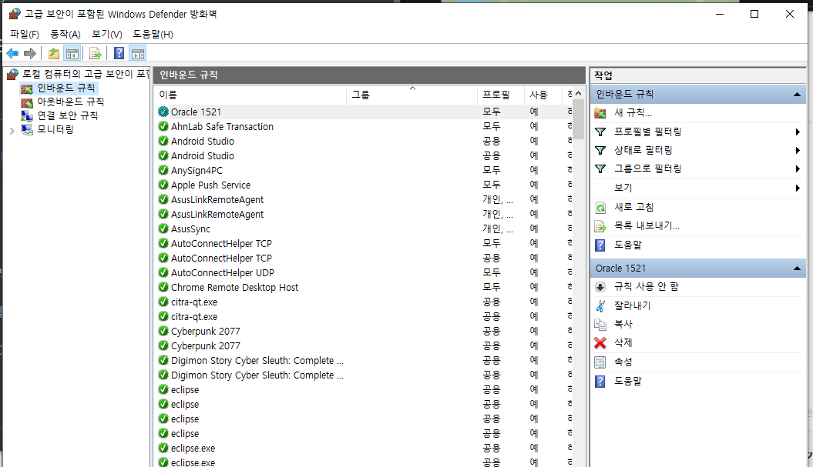
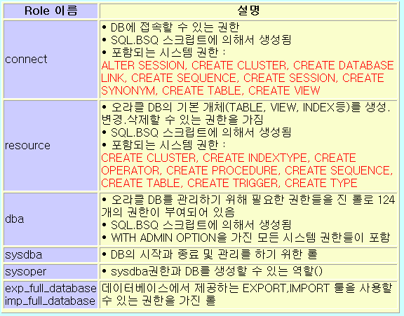
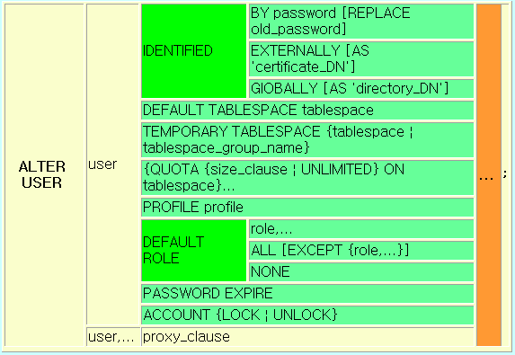
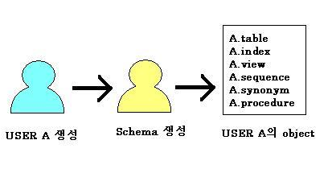
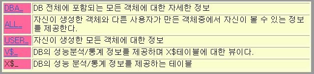
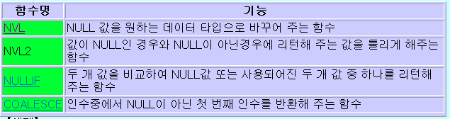
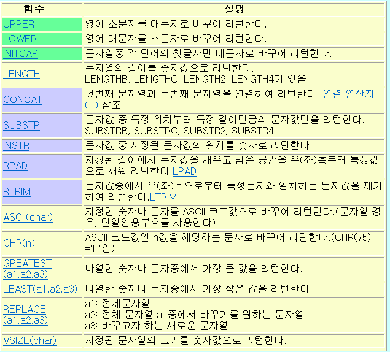

## 10.19

**오라클**

환경설정 

데이터베이스 - 워크시트 - 격자판 체크

코드편집기 - 행 여백 - 행 번호 표시

**방화벽 해제**



시작 - 방화벽 상태 확인 - 고급설정 (왼쪽탭) - 인바운드 규칙

새 규칙 - 포트 - 다음 - 특정 로컬포트 1521 - 디폴트 -디폴트  - 

이름: Oracle 1521 - 마침

services.msc 혹은 구성 요소 서비스 앱 실행 혹은 서비스

- OracleServiceXE: 시작 시 자동으로 실행. 
  - 하지만 사용하지 않을 때는 서버를 끄도록 한다.
- Oracle XE TNS Listener: 네트워크 접속

**데이터 & 정보**

데이터 (Data): 수집된 자료

정보 (Information): 데이터를 가치있게 추가, 새로 의미를 부여한 결과물

데이터베이스 (Data + Base)

- Data + Base (저장소)
- 자료 저장소
- 현실세계존재 (유형, 무형) 방대한 정보를 효과적으로 추출, 분류, 저장, 새로운 정보로 재사용하기 위한 자료의 집합

DBMS (DataBase Management System): 소프트웨어 프로그램

- MySQL, MS SQL Server, Oracle 등등
- 클라이언트 도구: Oracle SQL Developer, 토드 (유료)
- 데이터모델: 컴퓨터에 데이터를 저장하는 방식을 정의해놓은 개념모형.
  계층형, 네트워크형, 관계형 (R), 객체 지향형 등
- 관계형 데이터 모델의 핵심 구성요소
  - 예) 사원, 부서 저장
  - 개체 (entity) == 관계 (relation) == 테이블 (table) == 개념의 정보 단위: 사원, 부서 (무형, 유형)
  - 속성 (attribute) == 열 (column): 개체 상태, 종류, 특징
  - 관계 (relationship) == 개체들 간의 연관성.
    부서 테이블의 부서번호 -> 사원테이블 부서번호를 참조키 (외래키)
- SQL ? SQL Developer 클라이언트 툴 <- 통신 -> 오라클 서버
  - SQL (Structured Query Language): 구조화된 질의 언어
  - 시퀄 (SEQUeL) 에서 유래
- SQL 은 기본적으로 테이블을 대상으로 수행되며... 테이블에는 기본테이블과 뷰 (View) 가 있다.
- PL/SQL ? PL (Procedural Language) + SQL: 절차적언어가 추가된 SQL. 오라클에만 있다.
- SQL*Plus ? SQL 및 PL/SQL 문장을 인식하고 실행시켜주는 Oracle Tool + SQL Plus 명령어
- SQL 5가지 종류
  1. DQL (Data Query Language): 데이터 검색, 조회: select 문
  2. DDL (Data Definition Language): 데이터 생성, 수정, 제거: create, alter, drop 문
  3. DML (Data Manipulation Language)
     - 새로운 행 추가, 수정, 삭제: insert, update, delete 문
     - 데이터베이스 객체 이름수정: rename 문 
     - 데이터 및 저장공간 회수: truncate 문
  4. DCL (Data Control Language): DB 와 구조에서 접근 권한의 부여, 제거: grant, revoke 문
  5. TCL (Transaction Control Language): 거래 (Transaction) 는 출금과 입금이 모두 성공해야 이체가 된다. : commit 문 (모두 성공), rollback 문 (모두 원상태 되돌리기), savepoint 문
- C (Control): grant, revoke
- D (Definition): create, alter, drop
- M (Manipulation): insert, update, delete, rename, truncate
- Q (Query)
- T (Transaction)

- CRUD 작업: insert + select + update + delete
- SQL 문장 작성법
  - 대소문자 구별하지 않는다.
  - SQL*PLUS 툴에서 SQL 문장은 SQL 프롬프트에 입력되며 이후의 Line 은 줄번호가 붙는다.
  - SQL 명령을 종료할 때는 세미콜론 (;) 을 반드시 붙여야 한다.
  - SQL 문장은 한 줄 이상으로 나눠 입력할 수 있다.
  - SQL 명령어를 구성하고 있는 단어 중 어디에서나 분리해도 된다.
  - 한 줄에 한 개의 절 (select, from, where) 형태로 나누어 입력하는 것을 권한다.
  - keyword 는 대문자로 입력하도록 권한다.
  - 탭과 줄 넣기는 읽기 쉽게하기 위해 권장한다.

**[DQL]**

**SELECT**

- 데이터를 조회 (검색)
- 대상 ? 테이블 (table) 또는 뷰 (view, 객체 뷰, 물리적 뷰)
- 대상이 자신이 소유한 (계정) 스키마 + 자신이 소유한 것이 아니면 권한 부여받은 것.
- select 문의 선언형식

**스키마 (Schema)**

- 데이터베이스의 구조 (개체, 속성, 관계) 와 제약조건에 대한 명세를 기술한 것.

SELECT 선언형식

```
【형식】
    [subquery_factoring_clause] subquery [for_update_clause];

【subquery 형식】
   {query_block ¦
    subquery {UNION [ALL] ¦ INTERSECT ¦ MINUS }... ¦ (subquery)} 
   [order_by_clause] 

【query_block 형식】
   SELECT [hint] [DISTINCT ¦ UNIQUE ¦ ALL] select_list
   FROM {table_reference ¦ join_clause ¦ (join_clause)},...
     [where_clause] 
     [hierarchical_query_clause] 
     [group_by_clause]
     [HAVING condition]
     [model_clause]

【subquery factoring_clause형식】
   WITH {query AS (subquery),...}
```


| 절       | 실행순서 |
| -------- | -------- |
| WITH     | 1        |
| SELECT   | 6        |
| FROM     | 2        |
| WHERE    | 3        |
| GROUP BY | 4        |
| HAVING   | 5        |
| ORDER BY | 7        |

WITH

SELECT: 남은 데이터에서 어떤 열을 출력할지 선택한다.

FROM: 데이터를 가져온다.

WHERE: 조건으로 걸러낸다.

GROUP BY: 조건에 맞는 데이터들을 그룹화한다.

HAVING: 그룹화한 데이터를 조건에따라 걸러낸다.

ORDER BY: 정렬한다.

스프가하이

SELECT 와 FROM 은 무조건 있어야 한다.

내일문제: SELECT 순서대로 적기

모든 사용자 계정 정보를 조회하는 쿼리를 작성하세요.

- FROM 대상 (테이블, 뷰)

데이터 뷰

- `user_users` SYS 계정접속, SYS 계정이 접근할 수 있는 사용자정보 조희
- `dba_users` 사용자에 관한 모든 정보(암호관리 포함)
- `all_users` 현재 접속중인 user가 access할 수 있는 user 정보 조회

scott 계정 생성

scott 계정존재유무 확인

```sql
SELECT *
FROM all_users;
```

계정생성

```sql
CREATE USER scott 
IDENTIFIED BY tiger;
```

plus: create_user 검색

create user 문

- 실행하려면 CREATE USER 시스템 권한이 있어야 한다. (SYS 는 최고권한)

형식

```sql
CREATE USER user 
IDENTIFIED BY password 필요한 경우추가 옵션;
EXTERNALLY [AS 'certificate']
GLOBALLY [AS '[directory_DN]']
```

추가옵션

```sql
DEFAULT TABLESPACE tablespace...
TEMPORARY TABLESPACE {tablespace ¦ tablespace_group_name}
{QUOTA {size_clause ¦ UNLIMITED} ON tablespace}...
PROFILE profile PASSWORD EXPIREACCOUNT {LOCK ¦ UNLOCK}
```

> 비밀번호는 대소문자를 구분

새로 생성된 유저로 로그인 에러

```
ERROR:
ORA-01045: user SCOTT lacks CREATE SESSION privilege; logon denied
```

CREATE SESSION 권한이 있어야 로그인이 가능하다. 

권한이 있는 사용자계정에서 권한을 부여해야 한다.

DCL 의 GRANT 문: 권한부여

REVOKE: 권한제거

권한 2가지 종류

1. 시스템 권한: 데이터베이스 객체 생성, 수정, 삭제 권한
2. 객체 권한: Object 내용을 조작 (추가, 수정, 삭제, 검색) 할 수 있는 권한

GRANT 문

- 사용자와 롤에 권한을 부여할 수 있다.

**시스템 권한**


```sql
SQL> show user      
USER is "SYS"      
SQL> GRANT CREATE ANY TYPE 
TO jijoe;

SQL> GRANT CONNECT, RESOURCE 
TO jijoe;

SQL> GRANT 
	CREATE USER
	, ALTER USER
	, DROP USER 
TO jijoe
WITH  ADMIN  OPTION; 

SQL> SELECT count(*) 
FROM [system_privilege_map](../dictionary/system_privilege_map.html);
```

오라클 생성 시 제공되는 role



**로그인 및 DB접근권한 부여**

```sql
GRANT CONNECT, RESOURCE 
TO scott;
```

HR 의 비밀번호 ? 

비밀번호를 lion 으로 변경해서 접속하자.

DDL 의 ALTER 문

alter_user 검색

CREATE PROFILE 문으로 로그인 시도 시 허용된 실패횟수와 잠금상태 시간도 지정할 수 있다.

LOCK 걸렸을 때 에러

```
ORA-28000: the account is locked 의 ERROR
```

형식



**비밀번호 변경**

```sql
ALTER USER hr 
IDENTIFIED BY lion;
```

ACCOUNT_STATUS 에서 LOCKED 상태를 확인할 수 있다.

**잠금 해제**

```sql
ALTER USER hr 
ACCOUNT UNLOCK;
```

**비밀번호 변경 후 잠금해제**

```sql
ALTER USER hr 
IDENTIFIED BY lion 
ACCOUNT UNLOCK;
```

**SQL 파일**

REM: 주석

`connect scott/tiger` SQL 켜진 상태에서 다른 계정 접속

복사: 골뱅이 쓴 후 파일 들래그

sqlplus 라고 검색 후 @ 링크 클릭

DEPT, EMP, BONUS, SALGRADE 4개의 테이블을 scott 계정이 소유하도록 생성.

모든 테이블 조회

```sql
SELECT *
FROM tabs;
```

같은코드

```sql
SELECT *
FROM user_tables;
```


F5: 전체실행

sqlplus: dictionary tabs

`DESC tabs` 사용자가 만든 테이블 요약. tabs = user_tables 와 같다.

EMP 테이블의 구조: 사원번호, 사원명, 집, 직속상사, 급여, 커미션, 입사일자, 부서번호, 컬럼

**테이블 구조 출력**

```sql
DESC 테이블이름;
```

```sql
SELECT *
FROM 테이블이름;
```


`VARCHAR2(n)` 문자열 n 바이트. 

알파벳은 1바이트, 한글은 3바이트 저장된다.

CHAR 는 없다. CHAR 일 때는 n 에 1을 넣어 1바이트로.

`NUMBER(n, decimal)` 숫자(실수) 소숫점 2자리까지 저장

EMP 테이블의 칼럼정보 확인

**사원테이블의 사원정보 조희**

조건: 모든 컬럼 조회 X, 사원번호, 사원명, 입사일자 정보만 조회

```sql
SELECT empno, ename, hiredate
FROM emp;
```

hiredate 는 RR/MM/DD

사원번호, 사원명, 입사일자, 급여를 급여의 내림차순으로 정렬

```sql
SELECT empno, ename, hiredate, sal
FROM emp
ORDER BY sal DESC;
```

부서번호 정렬 후 급여 많은 순으로 정렬

```sql
SELECT *
FROM emp
ORDER BY deptno, sal desc;
```

칼럼명으로도 가능

```sql
SELECT deptno, sal, ename
FROM emp
ORDER BY 1, 2 DESC;
```

`NUMBER(n)` 숫자가 한개만 있다면 정수.

`+` 숫자만 더할 수 있고 문자열은 연결할 수 없다.

`||` 문자열 연결

```
Ellen	Abel	Ellen Abel
Sundar	Ande	Sundar Ande
Mozhe	Atkinson	Mozhe Atkinson
David	Austin	David Austin
Hermann	Baer	Hermann Baer
```

```sql
SELECT first_name, last_name, 
first_name || ' ' || last_name
FROM employees;
```

새로운 칼럼명

```sql
SELECT first_name, last_name, 
first_name || ' ' || last_name AS full_name
FROM employees;
```

Q. AS ALIAS 사용법?

A. `AS 새칼럼명` 으로 새로운 칼럼명을 정할 수 있다.

테이블명도 ALIAS 가 가능하다.

## 10.20

내림차순 DESC 와 요약 DESC 는 키워드가 같다.

> 작은따옴표 안에는 대문자로!!

복습

롤 (Role) 이란 ? 다수 사용자와 다양한 권한을 효과적으로 관리하기 위하여 서로 관련된 권한을 한데 묶은 그룹이다.

SID: 전역 데이터베이스 이름

데이터모델: 컴퓨터에 데이터를 저장하는 방식을 정의해 놓은 개념모델

스키마: DB 에서 어떤 목적을 위하여 필요한 여러 개로 구성된 테이블들의 집합을 스키마라고 한다.



- USER A가 생성되면 자동적으로 동일한 이름의 SCHEMA A가 생성된다.
- USER A는 SCHEMA A와 관련되어 DATABASE를 ACCESS한다.

| 구분     | 동작기능                                |
| -------- | --------------------------------------- |
| Instance | 데이터베이스 startup 에서 shutdown 까지 |
| Session  | 사용자가 login 에서 logout 까지         |
| Schema   | 사용자가 만든 그 사용자의 모든 객체들   |

**SELECT FROM 사용법**

```sql
SELECT *
FROM 테이블명, 뷰;
```

**오라클 삭제방법**

1. 서비스앱에서 오라클 서비스 중지
2. SCOTT 로그인 X -> 오라클 서비스 재시작
3. uninstall.exe
4. 탐색기 - oraclexe 폴더 삭제
5. regedit

**현재유저**

```sql
SELECT *
FROM user_users;
```

`DROP`  계정삭제

**계정을 만들며 비밀번호 설정**

```sql
CREATE USER scott IDENTIFIED BY
```

**계정삭제**

```sql
DROP USER scott 옵션;
```


--6. 오라클이 제공하는 기본적인 롤(role)의 종류를 적으시고,
--   SCOTT 계정에게 권한을 부여하는 쿼리(SQL)을 작성하세요.

- `CONNECT`
- `RESOURCE` 
- `DBA`
- `SYSDBA`
- `SYSOPER`
- `EXP_FULL_DATABASE`
- `IMP_FULL_DATABASE`
- `DELETE_CATALOG_ROLE` 
- `EXECUTE_CATALOG_ROLE` 
- `SELECT_CATALOG_ROLE`

`UNLIMITED TABLESPACE` ?

`NOT NULL` 반드시 필수 입력사항

```sql
empno 컬럼 CONSTRAINT pk_empno PRIMARY KEY
			제약조건	제약조건명	PK
```

고유키 (Primary Key): 각각을 구분할 수 있게 해준다.

--10. 관계형 데이터 모델의 핵심 구성 요소

1. 데이터 모델?
2. 관계형 데이터 모델?
3. 구성요소
   - 개체
   - 속성
   - 관계

--12. 오라클 주석처리 방법  2가지를 적으세요.

1. `--`
2. `/* */`
3. `REM` 

--13. 자료사전( Data Dictionary ) 이란?

--14. SQL 이란 ? 

구조화된 질의언어

```sql
SELECT empno, ename, sal, comm, sal + comm pay
FROM emp;
```

> Alias 에는 AS 를 생략할 수 있고 따옴표도 생략할 수 있다.

sqlplus: [statement_select] null

--22.  emp 테이블에서  아래와 같은 조회 결과가 나오도록 쿼리를 작성하세요.
    (  sal + comm = pay  )

**[null 처리]**

NULL은 미확인 값이므로 컬럼 값이 NULL이면 어떠한 연산을 수행하더라도 결과값으로 NULL을 반환한다.

**null 미출력**

```
EMPNO   ENAME    SAL   COMM   PAY
7499	ALLEN	1600	300	1900
7521	WARD	1250	500	1750
7654	MARTIN	1250	1400	2650
7844	TURNER	1500	0	1500
```

```sql
SELECT empno, ename, sal, comm, sal + comm pay
FROM emp
WHERE comm IS NOT NULL;
```

null 처리 함수

- `nvl()`
- `nvl2()`
- `nullif()`
- `coalesce()` 

**null 0으로 계산**

```
EMPNO   ENAME    SAL   COMM   PAY
7369	SMITH	800		800
7499	ALLEN	1600	300	1900
7521	WARD	1250	500	1750
7566	JONES	2975		2975
7654	MARTIN	1250	1400	2650
7698	BLAKE	2850		2850
7782	CLARK	2450		2450
7839	KING	5000		5000
7844	TURNER	1500	0	1500
7900	JAMES	950		950
7902	FORD	3000		3000
7934	MILLER	1300		1300
```

```sql
SELECT empno, ename, sal, comm, sal + nvl(comm, 0) pay
FROM emp;
```

sql help: dictionary 검색

--23. 14. emp테이블에서
--    각 부서별로 오름차순 1차 정렬하고 급여(PAY)별로 2차 내림차순 정렬해서 조회하는 쿼리를 작성하세요.    

```
7839	KING	5000		5000	10
7782	CLARK	2450		2450	10
7934	MILLER	1300		1300	10
7902	FORD	3000		3000	20
7566	JONES	2975		2975	20
7369	SMITH	800		800	20
7698	BLAKE	2850		2850	30
7654	MARTIN	1250	1400	2650	30
7499	ALLEN	1600	300	1900	30
7521	WARD	1250	500	1750	30
7844	TURNER	1500	0	1500	30
7900	JAMES	950		950	30
```


```sql
SELECT empno, ename, sal, comm, sal + nvl(comm, 0) pay, deptno
FROM emp
ORDER BY deptno, pay DESC;
```

sql help: dictionary_start 자료사전이란 링크

Data Dictionary(자료사전)란 ? 

1. TABLE과 VIEW들의 집합
2. 데이터베이스에 대한 정보를 제공하는 중요한 부분
3. 데이터베이스 생성시 SYS schema 안의 내부 테이블로 구성
4. 자료사전의 4가지 종류
   1. dba_???
   2. all_???
   3. user_???
   4. V$_ X$_



SYS 에서는 `dba_tables` 와 `all_tables` 는 같다.

sql help: operator - 비교연산자

1. 날짜, 숫자, 문자를 구분할 수 있다.
2. true, false, null 을 반환한다.
3. LOB 는 비교연산자를 사용할 수 없지만 PL/SQL 에서는 CLOB 데이터를 비교할 수 있다.
4. 다르다. `!=` `<>` `^=` 
5. ANY, SOME, ALL

> 함수명도 대문자로 작성한다.
>
> all_tables 와 tabs 의 차이점은 all_tables 에는 owner 가 있다.


`IS NOT NULL`

`IS NULL` 

insa 테이블에서 수도권 출신 사원의 정보만 조회

```SQL
SELECT *
FROM insa
WHERE city IN('서울', '경기', '인천')
ORDER BY city;
```

수도권 출신이 아닌 사원의 정보만 조회

```SQL
SELECT *
FROM insa
WHERE city NOT IN('서울', '경기', '인천')
ORDER BY city;
```

`city NOT IN` 과 `NOT city IN` 같은 코드이다.

## 10.21

복습

1-1. employees 테이블에서 first_name, last_name  컬럼을 이용해서 아래와 같이 출력하는 쿼리 작성.
출력

```
NAME
--------------------------------
이름은 'Ellen Abel' 입니다.
이름은 'Sundar Ande' 입니다.
이름은 'Mozhe Atkinson' 입니다.
이름은 'David Austin' 입니다.
이름은 'Hermann Baer' 입니다.
이름은 'Shelli Baida' 입니다.
이름은 'Amit Banda' 입니다.
이름은 'Elizabeth Bates' 입니다.
이름은 'Sarah Bell' 입니다.
:
:
```

코드

```SQL
SELECT '이름은 ''' || first_name || ' ' || last_name || ''' 입니다.' NAME
FROM employees; 
```

>  이스케이프는 홑따옴표로 처리한다.

3-1. 아래 에러 메시지의 의미를 적으세요.
ㄱ. ORA-00942: table or view does not exist
  ㄴ. ORA-00904: "SCOTT": invalid identifier
  ㄷ. ORA-00936: missing expression
  ㄹ. ORA-00933: SQL command not properly ended

ㄱ. 해당계정에 그 테이블이나 뷰가 없다.

ㄴ. 식별자 잘못되었다 ? 

ㄷ. 표현식 (수식) 이 없다.

ㄹ. 

5-1. 오라클의 자료형을 적으세요.

  ㄱ. 숫자 자료형 : NUMBER
  ㄴ. 문자 자료형 : VARCHAR2(byte), CHAR, LONG
  ㄷ. 날짜 자료형 : DATE, TIMESTAMP

14-1. emp 테이블에서 pay(sal+comm)가  1000 이상~ 2000 이하 받는 30부서원들만 조회하는 쿼리 작성
  조건 : ㄱ. ename을 기준으로 오름차순 정렬해서 출력(조회)
    ㄴ. comm 이 null은 0으로 처리 ( nvl () )  

**출력**

```
ENAME	SAL		COMM PAY
-------------------------
ALLEN	1600	300	1900
TURNER	1500	0	1500
WARD	1250	500	1750
```

**코드**

```SQL
SELECT ename, sal, NVL(comm, 0) comm, sal+NVL(comm, 0) pay
FROM emp
WHERE sal+NVL(comm, 0) BETWEEN 1000 AND 2000 AND deptno = 30
ORDER BY ename; 
```

> WHERE 이 SELECT 보다 먼저 실행되므로 ALIAS 를 사용할 수 없다.
> 또한 WHERE 에서는 AS ALIAS 를 사용할 수 없다.


16-1. emp 테이블에서 1981년도에 입사한 사원들만 조회하는 쿼리 작성.

DATE 에서 년도추출

출력

```
EMPNO	ENAME	JOB	MGR	HIREDATE	SAL	COMM	DEPTNO
----------------------------------------------------------
7499	ALLEN	SALESMAN	7698	81/02/20	1600	300	30
7521	WARD	SALESMAN	7698	81/02/22	1250	500	30
7566	JONES	MANAGER	7839	81/04/02	2975		20
7654	MARTIN	SALESMAN	7698	81/09/28	1250	1400	30
7698	BLAKE	MANAGER	7839	81/05/01	2850		30
7782	CLARK	MANAGER	7839	81/06/09	2450		10
7839	KING	PRESIDENT		81/11/17	5000		10
7844	TURNER	SALESMAN	7698	81/09/08	1500	0	30
7900	JAMES	CLERK	7698	81/12/03	950		30
7902	FORD	ANALYST	7566	81/12/03	3000		20
```

코드

```SQL
SELECT *
FROM emp
WHERE TO_CHAR(hiredate, 'YYYY') = '1981';
```

19-1. Alias 를 작성하는 3가지 방법을 적으세요.
   SELECT deptno, ename 
 , sal + comm   (ㄱ) 
 , sal + comm   (ㄴ) 
 , sal + comm   (ㄷ) 
FROM emp;

ㄱ. AS "pay"

ㄴ. "pay" 또는 AS pay

ㄷ. pay

Q. VARCHAR 와 VARCHAR2 의 차이점 ?

A. 이 두개의 데이터 유형은 동일한 의미의 가변길이 문자열 입니다.

둘다 데이터 길이의 상한치는 4000 바이트 입니다. 이렇게 두개의

데이터 유형은 동일합니다. 하지만 오라클 측에서 장래에 varchar 를

다른 용도로 사용할 예정이라고 합니다. 그래서 varchar 데이터 유형은

권장하지 않습니다.

> VARCHAR2 를 사용하도록 한다.


---

PRIMARY KEY 확인방법

테이블 - DEPT - 제약조건 혹은 SQL

**NULL 함수**



`NVL` NULL VALUE 의 약자.

`NVL2(COLUMN, IFNOTNULL, IFNULL)` NULL 이 아니면 두번째, NULL 이면 세번째 값 반환

**[WITH]**

```
【subquery factoring_clause형식】   
WITH {query AS (subquery),...} 
```

14-1. emp 테이블에서 pay(sal+comm)가  1000 이상~ 2000 이하 받는 30부서원들만 조회하는 쿼리 작성
  조건 : ㄱ. ename을 기준으로 오름차순 정렬해서 출력(조회)
    ㄴ. comm 이 null은 0으로 처리 ( nvl () )  

**출력**

```
ENAME	SAL		COMM PAY	DEPTNO
------------------------------------
ALLEN	1600	300	1900	30
WARD	1250	500	1750	30
TURNER	1500	0	1500	30
```

다음문제를 WITH 로 풀어보자.

```SQL
WITH temp AS (
    SELECT ename, sal, NVL(comm, 0) comm, sal+NVL(comm, 0) pay, deptno
    FROM emp
    WHERE deptno = 30
)
SELECT *
FROM temp
WHERE pay BETWEEN 1000 AND 2000;
```

> FROM temp 뒤에 테이블도 ALIAS 도 할 수 있으며 여기선 AS 를 쓸 수 없다.

**FROM 에서 내부 SELECT**

```SQL
SELECT *
FROM (
    SELECT deptno, ename, sal + nvl(comm, 0) pay
    FROM emp
    WHERE deptno = 30
    ) t;
```

> 내부 SELECT 에도 ALIAS 줄 수 있다. (없어도 된다.)
>
> WHERE 에는 FROM 에 있는 칼럼만 입력해야 한다.

**1000 미만 2000 초과**

```SQL
WHERE sal NOT BETWEEN 1000 AND 2000;
```

**WHERE 에서 ALIAS 사용**

```SQL
SELECT *
FROM (
    SELECT empno, ename, sal + nvl(comm, 0) pay, deptno
    FROM emp
    )
WHERE pay BETWEEN 1000 AND 2000;
```

16-1. emp 테이블에서 1981년도에 입사한 사원들만 조회하는 쿼리 작성.

DATE 에서 년도추출

출력

```
EMPNO	ENAME	JOB			MGR		HIREDATE	SAL		COMM 	DEPTNO
-------------------------------------------------------------------------
7499	ALLEN	SALESMAN	7698	81/02/20	1600	300		30
7521	WARD	SALESMAN	7698	81/02/22	1250	500		30
7566	JONES	MANAGER		7839	81/04/02	2975			20
7654	MARTIN	SALESMAN	7698	81/09/28	1250	1400	30
7698	BLAKE	MANAGER		7839	81/05/01	2850			30
7782	CLARK	MANAGER		7839	81/06/09	2450			10
7839	KING	PRESIDENT			81/11/17	5000			10
7844	TURNER	SALESMAN	7698	81/09/08	1500	0		30
7900	JAMES	CLERK		7698	81/12/03	950		30
7902	FORD	ANALYST		7566	81/12/03	3000			20
```

**다른풀이**

BETWEEN

```SQL
SELECT *
FROM emp
WHERE hiredate BETWEEN '1981.1.1' AND '1981.12.31';
```

> 날짜는 작은따옴표가 있어야 한다.

TO_CHAR

```SQL
SELECT *
FROM emp
WHERE to_char(hiredate, 'YYYY') = 1981;
```

같은코딩

```SQL
WHERE to_char(hiredate, 'YY') = 81;
```

`MM` `DD` 로 달과 일자도 가져올 수 있다.

%숫자

```SQL
```

SQL HELP: FUNCTION 검색

SUBSTR(CHAR, POSITION, [LENGTH])

```SQL
SELECT *
FROM emp
WHERE substr(hiredate, 0, 2) = 81;
```

POSITION 이 0 또는 1 이여도 문자열의 첫글자를 의미한다.

**문자함수의 종류**



**SUBSTR**

주민번호 뒷자리 7자리 가져오기

출력

```
NAME	SSN			   RRN6
-------------------------------
홍길동	771212-1022432	1022432
이순신	801007-1544236	1544236
이순애	770922-2312547	2312547
김정훈	790304-1788896	1788896
한석봉	811112-1566789	1566789
이기자	780505-2978541	2978541
장인철	780506-1625148	1625148
김영년	821011-2362514	2362514
나윤균	810810-1552147	1552147
:
:
```


코드

```SQL
SELECT name, ssn, substr(ssn, -7) rrn6
FROM insa;
```

`SUBSTR(COL, -N)` 뒤에서 N 자리를 가져온다.

**SUBSTR 예시**

```SQL
SELECT name, ibsadate
, substr(ibsadate, 1, 2) year
, substr(ibsadate, 4, 2) month
, substr(ibsadate, 7, 2) day
FROM insa;
```

> DATE 는 예약어이므로 칼럼명으로 사용할 수 없다.

**CONCAT**

```
FIRST_NAME LAST_NAME NAME
Ellen	Abel	Ellen Abel
Sundar	Ande	Sundar Ande
Mozhe	Atkinson	Mozhe Atkinson
David	Austin	David Austin
Hermann	Baer	Hermann Baer
Shelli	Baida	Shelli Baida
Amit	Banda	Amit Banda
:
:
```


```sql
SELECT first_name, last_name
    , concat(first_name, ' ' || last_name) NAME
FROM employees;
```

concat 을 두 번 사용해도 된다.

**LIKE**

[NOT] LIKE 연산자

사용할 수 있는 2가지 기호 (와일드카드)

`%` 문자의 갯수에 상관없음 (0~n 문자)

`_` 한개의 문자 대신 (1 문자)

**김씨만 출력**

출력

```
NAME	SSN
---------------------
김정훈	790304-1788896
김영년	821011-2362514
김종서	751010-1122233
김인수	731211-1214576
김말자	830225-2633334
:
:
```

코드

```sql
SELECT name, ssn
FROM insa
WHERE name LIKE '김%';
```

> LIKE 는 함수가 아니라 연산자이므로 괄호가 필요없다.

문제) insa 테이블에서 사원명에 '이' 가 들어간 사원

`regexp_like(String, pattern)` 

출력

```
NAME	SSN
---------------------
이순신	801007-1544236
이순애	770922-2312547
이기자	780505-2978541
황진이	810707-2574812
이현숙	800606-2954687
이상헌	781010-1666678
:
:
```


LIKE

```sql
SELECT name, ssn
FROM insa
WHERE name LIKE '%이%';
```

정규표현식

```sql
SELECT name, ssn
FROM insa
WHERE regexp_like(name, '이');
```

> 자바와 다르게 이스케이프문자가 `'` 이므로 정규표현식에는 `\d` 혹은 `\w` 로 작성한다.
>
> 자바는 숫자까지 정확하게 검색하며 SQL 은 덜 정확하게 검색한다.

예) `'\w이'` 라고 검색하면 이가 끝에있는 황진이도 검색된다.

반면 자바는 두글자만 검색된다. 

**김 혹은 이로 시작**

정규표현식

```sql
SELECT name, ssn
FROM insa
WHERE regexp_like(name, '^[김이]');
```

LIKE

```sql
```

**레코드 추가**

새로운 부서를 추가

DML (INSERT 문)

ctrl I: 행 삽입

F11: 변경사항 커밋

```sql
INSERT INTO 테이블명 (컬럼명...) 
VALUES (컬럼값, 컬럼값, 컬럼값);
```

DML (INSERT, UPDATE, DELETE) 는 반드시 커밋 (COMMIT) 해야한다.

```
unique constraint (SCOTT.PK_DEPT) violated
```

제약조건 위배되었다.

constraint: 제약조건, 제한

```sql
INSERT INTO dept (deptno, dname, loc) 
VALUES (60, '쌍용부', 'COREA');
```

**레코드 수정**

```sql
UPDATE 테이블명
SET 수정할칼럼
WHERE 수정할레코드
```

```sql
UPDATE dept
SET dname = '우한글부'
WHERE deptno = 60;
```

`COMMIT`

`ROLLBACK`


문제) dept 테이블에서 부서명이 '한글_' 문자열 포함하는 부서 정보 조회

dept 테이블에서 부서명이 '한글_' 문자열을 포함하는 부서정보조회

```
DEPTNO DNAME	LOC
---------------------
50	한글_나라	COREA
60	우한글부	COREA
```


```sql
SELECT *
FROM dept
WHERE dname LIKE '%한글_%';
```

이렇게 하면 우한글부도 나와버린다.

`_` 언더바가 와일드카드이기 때문

sql help: LIKE 는 operator - SQL연산자에 있다.

```sql
SELECT *
FROM dept
WHERE dname LIKE '%한글\_%' ESCAPE '\';
```

문제) 50번 부서의 지역명을 'C%OREA' 문자열로 수정

문제) dept 테이블에서 부서명 'C%' 문자열을 가진 부서정보 조회

## 10.22

복습

6-1. insa테이블에서 ssn 컬럼을 통해서 year, month, date, gender 출력

> date 는 예약어로 사용하지 않는 것이  좋지만 굳이 사용한다면 AS "date" 로 사용한다.

---

UPDATE

```sql
UPDATE 테이블
SET 컬럼 = 값
[WHERE]
```

> SET 에서 VARCHAR2 를 바꿀 때는 대소문자를 구분해서 넣는다.

**바이트범위를 벗어나게 출력**

출력

```
MGR
-------
:
:
7839
7839
12345678
7698
7698
7566
:
:
```

코드

```
MGR               NUMBER(4) 
```

```sql
SELECT nvl(mgr, 12345678) AS mgr
FROM emp;
```

> 출력은 바이트범위를 벗어나도 된다.

**DUAL 테이블**

DUAL이라는 테이블은 SYS 사용자가 소유하는 오라클의 표준 테이블로서 오직 한 행(row)에 한 컬럼만 담고 있는  dummy 테이블로서 일시적인 산술연산이나 날짜 연산 을 위하여 주로 쓰인다. 

다시 말해서 이 가상 테이블은 SYS의 소유이다. 우리가 SYS로 로그인하지 않거나 SYS.DUAL로 쓰지 않아도 사용할 수 있는 이유는  SYS 사용자가 모든 사용자들에게 사용할 수 있도록 이 테이블에 PUBLIC  synonym 을 주었기 때문이다.

DUAL 테이블을 요약 정리하면 다음과 같다.

 • DUAL 테이블은 오라클을 설치하면 자동으로 생성되는 테이블이다.
 • DUAL은 SYS 사용자의 스키마이지만 모든 사용자가 억세스할 수 있다.
 • 오직 하나의 DUMMY 컬럼만 가지며, VARCHAR2(1)의 데이터 타입이다.
 • x라는 하나의 행만 가진다.
 • SELECT문에서 상수를 계산할 때 유용하다.
 • 하나의 행만가지므로 오직 한번만 상수를 반환한다.
 • 이를 변형하여 상수, 가상컬럼 또는 테이블로부터의 expression을 select하지만, 테이블의 여러 행에 여러번 그 값을  반환받을 수 있다.

**SYSDATE**

현재 시스템의 날짜/시간 정보를 반환하는 함수

```
21/10/22	21/10/22	21/10/22 12:49:49.000000000 ASIA/SEOUL
```


```sql
SELECT SYSDATE
    , CURRENT_DATE
    , CURRENT_TIMESTAMP
FROM dual;
```

**함수**

`sqrt(n)` 루트함수

**계정 권한부여**

1-1. SCOTT.emp -> HR 사용자도 조회할 수 있도록 권한부여

DCL - GRANT, REVOKE

```sql
GRANT SELECT ON emp 
TO hr;
```

emp 테이블을 SELECT 할 수 있는 권한은 HR 에 준다.

다른계정의 테이블 조회

```sql
SELECT *
FROM scott.emp;
```

**SYNONYM**

SYNONYM: 동의어

DB 객체의 소유권 누가 ?

생성한 계정 (시용자) OWNER

하나의 객체에 대해 다른 이름 (별칭) 을 정의하는 방법

시노님 생성도 다른 객체 생성과 마찬가지로 create 문을 사용하여 만든다. 


```sql
CREATE [PUBLIC] SYNONYM [schema.]synonym명  	
FOR [schema.]object명;
```

예시

```sql
CREATE PUBLIC SYNONYM spemp 
FOR scott.emp;
```


- 디폴트는 private 시노님이다.
- PUBLIC 시노님은 모든 사용자가 접근 가능한 시노님을 생성한다.
- PUBLIC 시노님은 모든 사용자가 접근 가능하기 때문에 생성 및 삭제는 오직 DBA만이 할 수  있다.
- 그러므로 public 시노님의 생성은 다음과 같은 단계를 통해서만 생성할 수 있다.
- SYNONYM 은 생성한 계정이 주인이된다.

**PUBLIC 시노님의 생성  순서**

1. SYSTEM 권한으로 접속한다.
2. PUBLIC 옵션을 사용하여 시노님을 생성한다.
3. 생성된 시노님에  대해 객체 소유자로 접속한다.
4. 시노님에 권한을 부여한다.

> PUBLIC 이더라도 접근권한이 있어야 한다.

```sql
DROP [PUBLIC] SYNONYM synonym명;
```

**산술연산자: 나머지**

나머지는 `%` 로 계산할 수 없다.

MOD 혹은 REMAINDER 함수를 사용해야한다.

내부적 연산방법이 다르다. 내부적으로 MOD 는 FLOOR 함수를, REMAINDER 는 ROUND 함수를 사용한다.

MOD(12, 5) 와 REMAINDER(12, 5) 는 2로 같지만 

MOD(14, 5) 와 REMAINDER(14, 5) 는 각각 4와 -1로 다르다.

MOD 는 0으로 나눴을 때 에러가 나지않고

REMAINDER 는 에러가 난다.


`MOD(n, divide)` n - divide * FLOOR (n / divide)

`REMAINDER(n, divide)` n - divide * ROUND (n / divide)

예시)

n2 = 12

n1 = 5

MOD(12, 5) = 12 - 5 x 2 (2.4 버림) = 2

MOD(14, 5) = 14 - 5 x 2 (2.8 버림) = 4

REMAINDER(12, 5) = 12 - 5 x 2 (2.4 반올림) = 2

REMAINDER(14, 5) = 14 - 5 x 3 (2.8 반올림) = -1


**SQL 연산자**

ALL, SOME, ANY, EXISTS: 서브쿼리할 때  나간다.

**SET (집합) 연산자**

1. UNION 연산자
2. UNIONALL 연산자
3. INTERSECT 연산자
4. MINUS 연산자

1.insa 테이블에서 출신지역이 인천인 사원 조회

```
NAME  CITY	BUSEO
------------------
이미성	인천	개발부
이상헌	경기	개발부
이성길	전북	개발부
이순애	인천	개발부
임수봉	서울	개발부
장인철	제주	개발부
전용재	인천	영업부
```


```sql
SELECT name, city, buseo
FROM insa
WHERE city = '인천'
UNION
SELECT name, city, buseo
FROM insa
WHERE buseo = '개발부';
```

`UNION ALL` 중복도 허용한다.

**다른 두 테이블 UNION**

```
:
:
1035	정영희	1050000
1037	최석규	2350000
1049	이미성	1300000
1056	전용재	1950000
1058	김신제	1950000
7782	CLARK	2450
7839	KING	5000
7934	MILLER	1300
```


```sql
SELECT empno, ename, sal
FROM emp
WHERE deptno = 10
UNION
SELECT num, name, basicpay
FROM insa
WHERE city = '인천';
```

> 칼럼수가 같아야 하며, 데이터유형도 같아야 한다.

`MINUS` 차집합

`INTERSECT` 교집합

**MULTISET 연산자**

계층적 질의 연산자?

**연결 연산자**

**산술 연산자**

**사용자 정의 연산자**

CREATE OPERATOR 문으로 연산자를 생성

**floating-point condition**

IS [NOT] NAN, IS [NOT] INFINITE

NAN: Not A Number

```sql
SELECT COUNT(*)
FROM employees
WHERE commission_pct IS NOT NAN;
```

**함수 (Function)**

숫자함수설명

- `ROUND(NUMBER, [decimal])` 반올림한 값을 반환.
  소수점 n 자리까지 출력

ROUND(n, 2): xxx.xx

ROUND(n, -2): X00 -> 2개를 0으로 바꾼다.

- `TRUNC(number, [decimal])` 절삭

truncate: 자르다.

- `CEIL(number)` CEIL 은 두번째인자를 줄 수 없다.
- `FLOOR(number)` TRUNC 의 하위호환. 두번째인자를 줄 수 없다.

absolute: 절대값

- `sign(number)` 숫자값이 양수이면 1, 0 이면 0, 음수이면 -1 을 반환한다.

문제) emp 테이블에서 사원 급여가 평균급여보다 많으면 1, 적으면 -1, 같으면 0 출력.


**[문법정리]**

목차

1. SELECT
2. SYNONYM
3. GRANT
4. UPDATE
5. 다중 INSERT
   - UNCONDITIONAL INSERT ALL: 조건 없이 입력
   - CONDITIONAL INSERT ALL: 모든 조건 실행
   - CONDIITIONAL FIRST INSERT: 한개의 조건 실행
   - PIVOTING INSERT
     pivoting: 고정시키다. 
     정규화 되지 않은 데이터를 oracle이 제공하는 relational한 형태로 테이블을 변경하는 작업
6. USER


SELECT

```sql
[WITH]
SELECT 
FROM
[WHERE]
[GROUP BY]
[HAVING]
[ORDER BY]
```

SYNONYM

```sql
CREATE [PUBLIC] SYNONYM 시노님
FOR 계정.테이블

DROP [PUBLIC] SYNONYM 시노님

FROM user_synonyms
FROM all_synonyms
```

CREATE 시에 계정을 입력하지 않으면 관리자권한으로 SYNONYM 이 생성된다.

GRANT

간단한 구조

```sql
GRANT 권한 
[ON 테이블]
TO 계정
```

상세한 구조

```sql
GRANT 시스템권한 | 롤 | 모든권한
TO 유저[IDENTIFIED BY password] | 롤 | PUBLIC [WITH ADMIN OPTION]

GRANT 객체권한 | ALL[column...]
ON 객체 | DIRECTORY | JAVA 소스 혹은 리소스
TO 유저[IDENTIFIED BY password] | 롤 | PUBLIC [WITH HIERARCHY OPTION] [WITH GRANT OPTION]
```

시스템권한

- CREATE
- ALTER
- DROP
- INSERT

롤 (ROLE)

- CONNECT
- RESOURCE

객체권한

- ALL
- SELECT
- UPDATE
- READ
- REFERENCES

clause: 절

UPDATE

```sql
UPDATE 테이블
SET 컬럼 = 값
[WHERE]

UPDATE 테이블
SET (컬럼...) = (
	SELECT 컬럼...
	FROM 테이블
	WHERE 조건)
[WHERE]
```

서브쿼리와 데이터타입과 컬럼 수가 일치해야 한다.

INSERT

```sql
INSERT INTO 테이블 (컬럼명...) 
VALUES (컬럼값, 컬럼값, 컬럼값);

-- 다중 INSERT 문
INSERT ALL | FIRST
[WHEN 조건 THEN]
	INTO 테이블(칼럼명...) VALUES (컬럼명...)
[WHEN 조건 THEN]
	INTO 테이블(칼럼명...) VALUES (컬럼명...)
	:
	:
[ELSE]
	INTO 테이블(칼럼명...) VALUES (컬럼명...)
SELECT (Subquery) 
FROM 

INSERT ALL
[WHEN 조건 THEN]
	INTO 테이블 VALUES (컬럼명...)
	INTO 테이블 VALUES (컬럼명...)
	INTO 테이블 VALUES (컬럼명...)
SELECT (Subquery) 
FROM 
```


**USER**

CREATE

```sql
CREATE USER 사용자명
IDENTIFIED BY 비밀번호 또는 IDENTIFIED EXTERNALLY
[DEFAULT TABLESPACE 테이블스페이스명]
[TEMPORARY TABLESPACE 테이블스페이스명]
[PROFILE 프로파일명]
[QUOTA 할당량 ON 테이블스페이스명 또는 UNLIMITED ON 테이블스페이스명]
[PASSWORD EXPIRE]
[ACCOUNT LOCK 또는 UNLOCK];
```

ALTER

```sql
ALTER USER 사용자명
[IDENTIFIED BY 비밀번호 또는 EXTERNALLY]
[PASSWORD EXPIRE]
[ACCOUNT LOCK 또는 UNLOCK]
```


속성

- IDENTIFIED BY 비밀번호
- 인증
- PROFILE
- DEFAULT ROLE
- TABLESPACE

DROP

```sql
DROP USER 사용자명
[CASCADE]
```


Q. PRIVILEGE 가 모여 ROLE 이 된다 ? 

A. 

## 10.25

