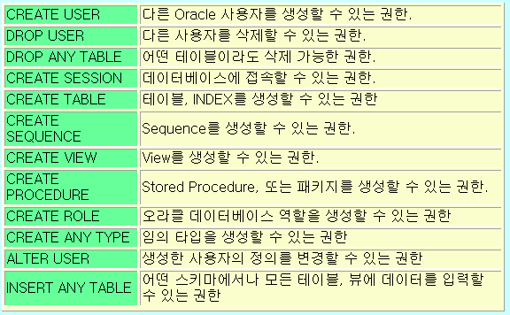

## 10.19

**오라클**

환경설정 

데이터베이스 - 워크시트 - 격자판 체크

코드편집기 - 행 여백 - 행 번호 표시

**방화벽 해제**


시작 - 방화벽 상태 확인 - 고급설정 (왼쪽탭) - 인바운드 규칙

새 규칙 - 포트 - 다음 - 특정 로컬포트 1521 - 디폴트 -디폴트  - 

이름: Oracle 1521 - 마침

services.msc 혹은 구성 요소 서비스 앱 실행 혹은 서비스

- OracleServiceXE: 시작 시 자동으로 실행. 
  - 하지만 사용하지 않을 때는 서버를 끄도록 한다.
- Oracle XE TNS Listener: 네트워크 접속

**데이터 & 정보**

데이터 (Data): 수집된 자료

정보 (Information): 데이터를 가치있게 추가, 새로 의미를 부여한 결과물

데이터베이스 (Data + Base)

- Data + Base (저장소)
- 자료 저장소
- 현실세계존재 (유형, 무형) 방대한 정보를 효과적으로 추출, 분류, 저장, 새로운 정보로 재사용하기 위한 자료의 집합

DBMS (DataBase Management System): 소프트웨어 프로그램

- MySQL, MS SQL Server, Oracle 등등
- 클라이언트 도구: Oracle SQL Developer, 토드 (유료)
- 데이터모델: 컴퓨터에 데이터를 저장하는 방식을 정의해놓은 개념모형.
  계층형, 네트워크형, 관계형 (R), 객체 지향형 등
- 관계형 데이터 모델의 핵심 구성요소
  - 예) 사원, 부서 저장
  - 개체 (entity) == 관계 (relation) == 테이블 (table) == 개념의 정보 단위: 사원, 부서 (무형, 유형)
  - 속성 (attribute) == 열 (column): 개체 상태, 종류, 특징
  - 관계 (relationship) == 개체들 간의 연관성.
    부서 테이블의 부서번호 -> 사원테이블 부서번호를 참조키 (외래키)
- SQL ? SQL Developer 클라이언트 툴 <- 통신 -> 오라클 서버
  - SQL (Structured Query Language): 구조화된 질의 언어
  - 시퀄 (SEQUeL) 에서 유래
- SQL 은 기본적으로 테이블을 대상으로 수행되며... 테이블에는 기본테이블과 뷰 (View) 가 있다.
- PL/SQL ? PL (Procedural Language) + SQL: 절차적언어가 추가된 SQL. 오라클에만 있다.
- SQL*Plus ? SQL 및 PL/SQL 문장을 인식하고 실행시켜주는 Oracle Tool + SQL Plus 명령어
- SQL 5가지 종류
  1. DQL (Data Query Language): 데이터 검색, 조회: select 문
  2. DDL (Data Definition Language): 데이터 생성, 수정, 제거: create, alter, drop 문
  3. DML (Data Manipulation Language)
     - 새로운 행 추가, 수정, 삭제: insert, update, delete 문
     - 데이터베이스 객체 이름수정: rename 문 
     - 데이터 및 저장공간 회수: truncate 문
  4. DCL (Data Control Language): DB 와 구조에서 접근 권한의 부여, 제거: grant, revoke 문
  5. TCL (Transaction Control Language): 거래 (Transaction) 는 출금과 입금이 모두 성공해야 이체가 된다. : commit 문 (모두 성공), rollback 문 (모두 원상태 되돌리기), savepoint 문
- C (Control): grant, revoke
- D (Definition): create, alter, drop
- M (Manipulation): insert, update, delete, rename, truncate
- Q (Query)
- T (Transaction)

- CRUD 작업: insert + select + update + delete
- SQL 문장 작성법
  - 대소문자 구별하지 않는다.
  - SQL*PLUS 툴에서 SQL 문장은 SQL 프롬프트에 입력되며 이후의 Line 은 줄번호가 붙는다.
  - SQL 명령을 종료할 때는 세미콜론 (;) 을 반드시 붙여야 한다.
  - SQL 문장은 한 줄 이상으로 나눠 입력할 수 있다.
  - SQL 명령어를 구성하고 있는 단어 중 어디에서나 분리해도 된다.
  - 한 줄에 한 개의 절 (select, from, where) 형태로 나누어 입력하는 것을 권한다.
  - keyword 는 대문자로 입력하도록 권한다.
  - 탭과 줄 넣기는 읽기 쉽게하기 위해 권장한다.

**[DQL]**

**SELECT**

- 데이터를 조회 (검색)
- 대상 ? 테이블 (table) 또는 뷰 (view, 객체 뷰, 물리적 뷰)
- 대상이 자신이 소유한 (계정) 스키마 + 자신이 소유한 것이 아니면 권한 부여받은 것.
- select 문의 선언형식

**스키마 (Schema)**

- 데이터베이스의 구조 (개체, 속성, 관계) 와 제약조건에 대한 명세를 기술한 것.

SELECT 선언형식

```
【형식】
    [subquery_factoring_clause] subquery [for_update_clause];

【subquery 형식】
   {query_block ¦
    subquery {UNION [ALL] ¦ INTERSECT ¦ MINUS }... ¦ (subquery)} 
   [order_by_clause] 

【query_block 형식】
   SELECT [hint] [DISTINCT ¦ UNIQUE ¦ ALL] select_list
   FROM {table_reference ¦ join_clause ¦ (join_clause)},...
     [where_clause] 
     [hierarchical_query_clause] 
     [group_by_clause]
     [HAVING condition]
     [model_clause]

【subquery factoring_clause형식】
   WITH {query AS (subquery),...}
```

| 절       | 실행순서 |
| -------- | -------- |
| WITH     | 1        |
| SELECT   | 6        |
| FROM     | 2        |
| WHERE    | 3        |
| GROUP BY | 4        |
| HAVING   | 5        |
| ORDER BY | 7        |

WITH

SELECT: 남은 데이터에서 어떤 열을 출력할지 선택한다.

FROM: 데이터를 가져온다.

WHERE: 조건으로 걸러낸다.

GROUP BY: 조건에 맞는 데이터들을 그룹화한다.

HAVING: 그룹화한 데이터를 조건에따라 걸러낸다.

ORDER BY: 정렬한다.

스프가하이

SELECT 와 FROM 은 무조건 있어야 한다.

내일문제: SELECT 순서대로 적기

모든 사용자 계정 정보를 조회하는 쿼리를 작성하세요.

- FROM 대상 (테이블, 뷰)

데이터 뷰

- `user_users` SYS 계정접속, SYS 계정이 접근할 수 있는 사용자정보 조희
- `dba_users` 사용자에 관한 모든 정보(암호관리 포함)
- `all_users` 현재 접속중인 user가 access할 수 있는 user 정보 조회

scott 계정 생성

scott 계정존재유무 확인

```sql
SELECT *
FROM all_users;
```

계정생성

```sql
CREATE USER scott IDENTIFIED BY tiger;
```

plus: create_user 검색

create user 문

- 실행하려면 CREATE USER 시스템 권한이 있어야 한다. (SYS 는 최고권한)

형식

```sql
CREATE USER *user* IDENTIFIED BY *password* 필요한 경우추가 옵션;EXTERNALLY [AS 'certificate']GLOBALLY [AS '[directory_DN]'
```

추가옵션

```sql
DEFAULT TABLESPACE *tablespace*...TEMPORARY TABLESPACE {tablespace ¦ tablespace_group_name}{QUOTA {size_clause ¦ UNLIMITED} ON tablespace}...PROFILE *profile*PASSWORD EXPIREACCOUNT {LOCK ¦ UNLOCK}
```

> 비밀번호는 대소문자를 구분

새로 생성된 유저로 로그인 에러

```
ERROR:
ORA-01045: user SCOTT lacks CREATE SESSION privilege; logon denied
```

CREATE SESSION 권한이 있어야 로그인이 가능하다. 

권한이 있는 사용자계정에서 권한을 부여해야 한다.

DCL 의 GRANT 문: 권한부여

REVOKE: 권한제거

권한 2가지 종류

1. 시스템 권한: 데이터베이스 객체 생성, 수정, 삭제 권한
2. 객체 권한: Object 내용을 조작 (추가, 수정, 삭제, 검색) 할 수 있는 권한

GRANT 문

- 사용자와 롤에 권한을 부여할 수 있다.

**시스템 권한**



```sql
【예제】    SQL> show user      USER is "SYS"      SQL> **GRANT CREATE ANY TYPE TO jijoe;** 
【예제】    SQL> **GRANT CONNECT, RESOURCE TO jijoe;** 
【예제】    SQL> **GRANT CREATE USER, ALTER USER, DROP USER TO jijoe**      2      **WITH  ADMIN  OPTION;** 
【예제】 SQL> **select count(\*) from [system_privilege_map](../dictionary/system_privilege_map.html);** 
```

오라클 생성 시 제공되는 role


**로그인 및 DB접근권한 부여**

```sql
GRANT CONNECT, RESOURCE TO scott;
```

HR 의 비밀번호 ? 

비밀번호를 lion 으로 변경해서 접속하자.

DDL 의 ALTER 문

alter_user 검색

CREATE PROFILE 문으로 로그인 시도 시 허용된 실패횟수와 잠금상태 시간도 지정할 수 있다.

LOCK 걸렸을 때 에러

```
ORA-28000: the account is locked 의 ERROR
```

형식


**비밀번호 변경**

```sql
ALTER USER hr 
IDENTIFIED BY lion;
```

ACCOUNT_STATUS 에서 LOCKED 상태를 확인할 수 있다.

**잠금 해제**

```sql
ALTER USER hr 
ACCOUNT UNLOCK;
```

**비밀번호 변경 후 잠금해제**

```sql
ALTER USER hr 
IDENTIFIED BY lion 
ACCOUNT UNLOCK;
```

**SQL 파일**

REM: 주석

`connect scott/tiger` SQL 켜진 상태에서 다른 계정 접속

복사: 골뱅이 쓴 후 파일 들래그

sqlplus 라고 검색 후 @ 링크 클릭

DEPT, EMP, BONUS, SALGRADE 4개의 테이블을 scott 계정이 소유하도록 생성.

모든 테이블 조회

```sql
SELECT *
FROM tabs;
```

같은코드

```sql
SELECT *
FROM user_tables;
```


### 복습

단축키

- 창 이동
- 줄 이동

F5: 전체실행

sqlplus: dictionary tabs

`DESC tabs` 사용자가 만든 테이블 요약. tabs = user_tables 와 같다.

EMP 테이블의 구조: 사원번호, 사원명, 집, 직속상사, 급여, 커미션, 입사일자, 부서번호, 컬럼

**테이블 구조 출력**

```sql
DESC 테이블이름;
```

```sql
SELECT *
FROM 테이블이름;
```


`VARCHAR2(n)` 문자열 n 바이트. 

알파벳은 1바이트, 한글은 3바이트 저장된다.

CHAR 는 없다. CHAR 일 때는 n 에 1을 넣어 1바이트로.

`NUMBER(n, decimal)` 숫자(실수) 소숫점 2자리까지 저장

EMP 테이블의 칼럼정보 확인

**사원테이블의 사원정보 조희**

조건: 모든 컬럼 조회 X, 사원번호, 사원명, 입사일자 정보만 조회

```sql
SELECT empno, ename, hiredate
FROM emp;
```

hiredate 는 RR/MM/DD

사원번호, 사원명, 입사일자, 급여를 급여의 내림차순으로 정렬

```sql
SELECT empno, ename, hiredate, sal
FROM emp
ORDER BY sal DESC;
```

부서번호 정렬 후 급여 많은 순으로 정렬

```sql
SELECT *
FROM emp
ORDER BY deptno, sal desc;
```

칼럼명으로도 가능

```sql
SELECT deptno, sal, ename
FROM emp
ORDER BY 1, 2 DESC;
```

`NUMBER(n)` 숫자가 한개만 있다면 정수.

`+` 숫자만 더할 수 있고 문자열은 연결할 수 없다.

`||` 문자열 연결

```
Ellen	Abel	Ellen Abel
Sundar	Ande	Sundar Ande
Mozhe	Atkinson	Mozhe Atkinson
David	Austin	David Austin
Hermann	Baer	Hermann Baer
```

```sql
SELECT first_name, last_name, 
first_name || ' ' || last_name
FROM employees;
```

새로운 칼럼명

```sql
SELECT first_name, last_name, 
first_name || ' ' || last_name AS full_name
FROM employees;
```

Q. AS ALIAS 사용법?

A. `AS 새칼럼명` 으로 새로운 칼럼명을 정할 수 있다.

테이블명도 ALIAS 가 가능하다.

## 10.20

내림차순 DESC 와 요약 DESC 는 키워드가 같다.

> 작은따옴표 안에는 대문자로!!

복습

롤 (Role) 이란 ? 다수 사용자와 다양한 권한을 효과적으로 관리하기 위하여 서로 관련된 권한을 한데 묶은 그룹이다.

SID: 전역 데이터베이스 이름

데이터모델: 컴퓨터에 데이터를 저장하는 방식을 정의해 놓은 개념모델

스키마: DB 에서 어떤 목적을 위하여 필요한 여러 개로 구성된 테이블들의 집합을 스키마라고 한다.


- USER A가 생성되면 자동적으로 동일한 이름의 SCHEMA A가 생성된다.
- USER A는 SCHEMA A와 관련되어 DATABASE를 ACCESS한다.

| 구분     | 동작기능                                |
| -------- | --------------------------------------- |
| Instance | 데이터베이스 startup 에서 shutdown 까지 |
| Session  | 사용자가 login 에서 logout 까지         |
| Schema   | 사용자가 만든 그 사용자의 모든 객체들   |

**SELECT FROM 사용법**

```sql
SELECT *
FROM 테이블명, 뷰;
```

**오라클 삭제방법**

1. 서비스앱에서 오라클 서비스 중지
2. SCOTT 로그인 X -> 오라클 서비스 재시작
3. uninstall.exe
4. 탐색기 - oraclexe 폴더 삭제
5. regedit

**현재유저**

```sql
SELECT *
FROM user_users;
```

`DROP`  계정삭제

**계정을 만들며 비밀번호 설정**

```sql
CREATE USER scott IDENTIFIED BY
```

**계정삭제**

```sql
DROP USER scott 옵션;
```


--6. 오라클이 제공하는 기본적인 롤(role)의 종류를 적으시고,
--   SCOTT 계정에게 권한을 부여하는 쿼리(SQL)을 작성하세요.

- `CONNECT`
- `RESOURCE` 
- `DBA`
- `SYSDBA`
- `SYSOPER`
- `EXP_FULL_DATABASE`
- `IMP_FULL_DATABASE`
- `DELETE_CATALOG_ROLE` 
- `EXECUTE_CATALOG_ROLE` 
- `SELECT_CATALOG_ROLE`

`UNLIMITED TABLESPACE` ?

`NOT NULL` 반드시 필수 입력사항

```sql
empno 컬럼 CONSTRAINT pk_empno PRIMARY KEY
			제약조건	제약조건명	PK
```

고유키 (Primary Key): 각각을 구분할 수 있게 해준다.

--10. 관계형 데이터 모델의 핵심 구성 요소

1. 데이터 모델?
2. 관계형 데이터 모델?
3. 구성요소
   - 개체
   - 속성
   - 관계

--12. 오라클 주석처리 방법  2가지를 적으세요.

1. `--`
2. `/* */`
3. `REM` 

--13. 자료사전( Data Dictionary ) 이란?

--14. SQL 이란 ? 

구조화된 질의언어

```sql
SELECT empno, ename, sal, comm, sal + comm pay
FROM emp;
```

> Alias 에는 AS 를 생략할 수 있고 따옴표도 생략할 수 있다.

sqlplus: [statement_select] null

--22.  emp 테이블에서  아래와 같은 조회 결과가 나오도록 쿼리를 작성하세요.
    (  sal + comm = pay  )

**[null 처리]**

NULL은 미확인 값이므로 컬럼 값이 NULL이면 어떠한 연산을 수행하더라도 결과값으로 NULL을 반환한다.

**null 미출력**

```
EMPNO   ENAME    SAL   COMM   PAY
7499	ALLEN	1600	300	1900
7521	WARD	1250	500	1750
7654	MARTIN	1250	1400	2650
7844	TURNER	1500	0	1500
```

```sql
SELECT empno, ename, sal, comm, sal + comm pay
FROM emp
WHERE comm IS NOT NULL;
```

null 처리 함수

- `nvl()`
- `nvl2()`
- `nullif()`
- `coalesce()` 

**null 0으로 계산**

```
EMPNO   ENAME    SAL   COMM   PAY
7369	SMITH	800		800
7499	ALLEN	1600	300	1900
7521	WARD	1250	500	1750
7566	JONES	2975		2975
7654	MARTIN	1250	1400	2650
7698	BLAKE	2850		2850
7782	CLARK	2450		2450
7839	KING	5000		5000
7844	TURNER	1500	0	1500
7900	JAMES	950		950
7902	FORD	3000		3000
7934	MILLER	1300		1300
```

```sql
SELECT empno, ename, sal, comm, sal + nvl(comm, 0) pay
FROM emp;
```

sql help: dictionary 검색

--23. 14. emp테이블에서
--    각 부서별로 오름차순 1차 정렬하고 급여(PAY)별로 2차 내림차순 정렬해서 조회하는 쿼리를 작성하세요.    

```
7839	KING	5000		5000	10
7782	CLARK	2450		2450	10
7934	MILLER	1300		1300	10
7902	FORD	3000		3000	20
7566	JONES	2975		2975	20
7369	SMITH	800		800	20
7698	BLAKE	2850		2850	30
7654	MARTIN	1250	1400	2650	30
7499	ALLEN	1600	300	1900	30
7521	WARD	1250	500	1750	30
7844	TURNER	1500	0	1500	30
7900	JAMES	950		950	30
```


```sql
SELECT empno, ename, sal, comm, sal + nvl(comm, 0) pay, deptno
FROM emp
ORDER BY deptno, pay DESC;
```

sql help: dictionary_start 자료사전이란 링크

Data Dictionary(자료사전)란 ? 

1. TABLE과 VIEW들의 집합
2. 데이터베이스에 대한 정보를 제공하는 중요한 부분
3. 데이터베이스 생성시 SYS schema 안의 내부 테이블로 구성
4. 자료사전의 4가지 종류
   1. dba_???
   2. all_???
   3. user_???
   4. V$_ X$_


SYS 에서는 `dba_tables` 와 `all_tables` 는 같다.

sql help: operator - 비교연산자

1. 날짜, 숫자, 문자를 구분할 수 있다.
2. true, false, null 을 반환한다.
3. LOB 는 비교연산자를 사용할 수 없지만 PL/SQL 에서는 CLOB 데이터를 비교할 수 있다.
4. 다르다. `!=` `<>` `^=` 
5. ANY, SOME, ALL

> 함수명도 대문자로 작성한다.
>
> all_tables 와 tabs 의 차이점은 all_tables 에는 owner 가 있다.

### 복습

스타일가이드

`IS NOT NULL`

`IS NULL` 

insa 테이블에서 수도권 출신 사원의 정보만 조회

```SQL
SELECT *
FROM insa
WHERE city IN('서울', '경기', '인천')
ORDER BY city;
```

수도권 출신이 아닌 사원의 정보만 조회

```SQL
SELECT *
FROM insa
WHERE city NOT IN('서울', '경기', '인천')
ORDER BY city;
```

`city NOT IN` 과 `NOT city IN` 같은 코드이다.

