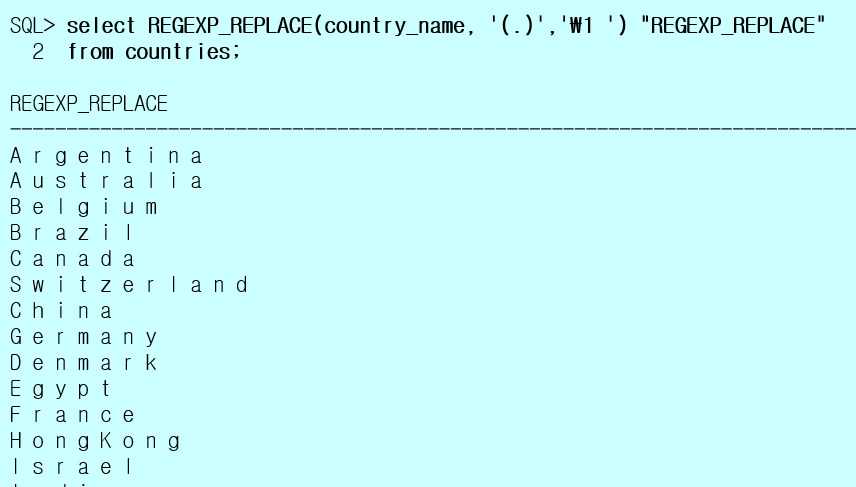
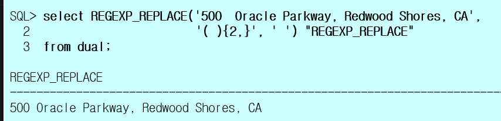
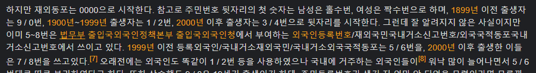

## 10.26

복습

1-1. dept 테이블에 새로운 레코드 추가하는 쿼리 작성
     50, QC, SEOUL

> 같은 칼럼에 추가한다면 칼럼명을 생략할 수 있다.

1-3. dept 테이블에 50번 부서번호 삭제하는 쿼리 작성

> DELETE [FROM] 에서 FROM 을 생략할 수 있다.

2-1. emp 테이블에서 30번 부서만 PAY를 계산 후 막대그래프를 아래와 같이 그리는 쿼리 작성
( 필요한 부분은 결과 분석하세요~    PAY가 100 단위당 # 한개 , 반올림처리 )
[실행결과]
DEPTNO ENAME PAY BAR_LENGTH      

```
DEPTNO ENAME PAY BAR_LENGTH 	#
-------------------------------------------------------
30	BLAKE	2850	29	#############################
30	MARTIN	2650	27	###########################
30	ALLEN	1900	19	###################
30	WARD	1750	18	##################
30	TURNER	1500	15	###############
30	JAMES	950		10	##########
```


```sql
SELECT deptno, ename
	, sal + nvl(comm, 0) AS pay
	, round((sal + nvl(comm, 0)) / 100) AS BAR_LENGTH 
	, lpad('#', round((sal + nvl(comm, 0)) / 100), '#') AS "#"
FROM emp
WHERE deptno = 30
ORDER BY bar_length DESC;
```


3-1. emp테이블에서 ename에   's' 또는 'j' 문자를 대소문자를 구분하지 않고 포함하는 사원 정보 출력. 

```sql
WHERE regexp_like(upper(ename), '[SJ]');
WHERE regexp_like(ename, '[SJsj]'); -- 같은코드
WHERE regexp_like(ename, '[SJ]', 'i'); -- 같은코드
```

>  `'i'`  대소문자를 구분하지않는 옵션 (소문자 i)

전체코드

```sql
SELECT *
FROM emp
WHERE regexp_like(upper(ename), '[SJ]');
```


4-1. RPAD() 함수를 사용해서 쿼리 작성
( `770423-*******` 주민번호 뒷자리 7자리를 * 로 출력 )

**RPAD**

```sql
SELECT name, ssn
	, rpad(substr(ssn, 1, 7), 14, '*') AS security
FROM insa;
```

**정규표현식 REPLACE**

```sql
SELECT name, ssn
	, regexp_replace(ssn, '\d{7}', '*******') AS security
FROM insa;
```


5-1. 앞 뒤 특정 문자 제거 
ㄱ. 앞 뒤 공백 제거
  SELECT '     msg     '       
  FROM dual;
  ㄴ. 앞 뒤 * 제거
  SELECT '*****msg*****'       
  FROM dual;


> trim 은 두 번째 인자가 없고 대신 trim([BOTH] 제거할문자 FROM 전체문자) 의 형식으로 작성한다.
>
> BOTH 를 생략해도 된다.

```
msg
```


```sql
  SELECT trim('     msg     ')
  FROM dual; 
```


```sql
SELECT trim(BOTH '*' FROM '*****msg*****')
FROM dual;
```


7-1. 개강일로부터 오늘날짜까지의 수업일수 ? 
 개강일 : 2021.8.18

> 지난일수는 floor, 남은일수는 ceil 함수를 사용한다.

9-1. 아래 쿼리에 대한 결과를 적으세요 
select  sysdate
      , TRUNC(sysdate,'year')     --  
      , TRUNC(sysdate,'month')    --    
from dual; 

> 날짜는 99/99/99 형식이다.

10-1. emp테이블에서 ename 을 출력하는 데 앞뒤에 ***** 을 붙여서 출력

```
*****SMITH*****
*****ALLEN*****
*****WARD*****
*****JONES*****
*****MARTIN*****
*****BLAKE*****
*****CLARK*****
```

**concat**

```sql
SELECT concat(concat('*****', ename), '*****') AS name
FROM emp;
```

**pad**

```sql
SELECT lpad('*', 5, '*') || ename || lpad('*', 5, '*') 
FROM emp;
```


11-1. emp 테이블에서 각 사원의 입사일을 기준으로 100일 후 날짜, 10일전 날짜, 1시간 후 날짜, 3개월 전 날짜 출력

SMITH	80/12/17	81/03/27	80/12/07	80/12/17	81/03/17	80/09/17
ALLEN	81/02/20	81/05/31	81/02/10	81/02/20	81/05/20	80/11/20
WARD	81/02/22	81/06/02	81/02/12	81/02/22	81/05/22	80/11/22

> 예약어, 괄호, 숫자, 공백을 ALIAS 할 때는 큰 따옴표가 필요하다.
>
> 큰 따옴표에 넣으면 대소문자를 구분해 칼럼명을 넣을 수 있다.

15-1. TO_CHAR( ,  'format') 함수에서 'format'에 사용되는 기호를 적으세요.
  ㄱ. 년도 : Y, YY, YYY, YYYY
  ㄴ. 월 :  MM
  ㄷ. 월의 일 : DD 
  주의 일 :  D
  년의 일 :  DDD
  ㄹ. 요일 :  DY, DAY
  ㅁ. 월의 주차 : W 
  년의 주차 :  WW
  ㅂ. 시간/24시간 : HH, HH24
  ㅅ. 분 : MI
  ㅇ. 초 : SS
  ㅈ. 자정에서 지난 초 : 
  ㅊ. 오전/오후 : AM/PM

17-1. insa 테이블에서 남자사원만 부서별로 정렬해서 출력하는 쿼리를 작성하세요.

> substr() 함수를 숫자와 비교할 수 있다.
>
>  주민번호 뒷자리의 첫 숫자는 남성은 홀수번, 여성은 짝수번이다.

틀린코딩

```sql
WHERE substr(ssn, 8, 1) = 1
```

맞는코딩

```sql
WHERE mod(substr(ssn, 8, 1), 2) = 1
```

전체코드

```sql
SELECT *
FROM insa
WHERE mod(substr(ssn, 8, 1), 2) = 1
ORDER BY buseo;
```

18-1. insa 테이블에서 전화번호가 있으면 '-'을 제거하고 전화번호를 출력하고, 없으면 '전화번호없음'을 출력
[실행결과]
NAME    CITY TEL
홍길남	경기	01199997575
이영숙	전남	01752145282
김인수	서울	전화번호없음
김말자	서울	01152487789
우재옥	서울	01045632587

```sql
SELECT name
	, city
	, nvl(replace(tel, '-'), '전화번호없음') AS tel
FROM insa;
```

> null 에 replace 를 써도 에러가나지 않는다.

20-3. 내림(절삭)(   십의 자리에서 자리에서 절삭  )
   SELECT 123454.6789 
   FROM dual;

```sql
   SELECT trunc(123454.6789, -2)
   FROM dual;
```

> 10 의자리에서 버린다면 trunc(n, -2) 가 맞다.

---

공부: to_char 의 세번째인자에 대해 찾아보기

**문제**

emp 테이블에서 평균 pay 보다 같거나 크면 'good' 출력, 작으면 'bad' 출력

```
ENAME	PAY		OVERPAY
------------------------
SMITH	800		bad
ALLEN	1900	bad
WARD	1750	bad
JONES	2975	good
MARTIN	2650	good
BLAKE	2850	good
CLARK	2450	good
KING	5000	good
TURNER	1500	bad
:
:
```


**CASE-WHEN-THEN**

```sql
SELECT ename, sal + nvl(comm, 0) AS pay
    , CASE 
        WHEN (SELECT avg(sal + nvl(comm, 0)) FROM emp) < sal + nvl(comm, 0)
            THEN 'good' 
        ELSE 'bad'
    END AS overpay
FROM emp;
```

**CASE-WHEN-THEN: 인라인뷰** 

```sql
SELECT ename, pay
    , CASE
        WHEN pay > avgpay
            THEN 'Good'
        ELSE 'Bad'
    END AS overpay
    
FROM (
    SELECT ename, sal + nvl(comm, 0) AS pay
        , (SELECT avg(sal + nvl(comm, 0)) FROM emp) AS avgpay
    FROM emp);
```

> CASE WHEN THEN 절은 AS 를 END 뒤에 쓴다.

```sql
SELECT ename, sal + NVL(comm, 0) PAY
      , ( SELECT  floor(AVG( sal + NVL(comm, 0) )) AVGPAY FROM emp ) AVGPAY
      , 'GOOD' AS overpay
FROM emp
WHERE sal + NVL(comm, 0) >= ( SELECT  AVG( sal + NVL(comm, 0) ) AVGPAY FROM emp )
UNION
SELECT ename, sal + NVL(comm, 0) PAY
      , ( SELECT  floor(AVG( sal + NVL(comm, 0) )) AVGPAY FROM emp ) AVGPAY
      , 'BAD'
FROM emp
WHERE sal + NVL(comm, 0) < ( SELECT  AVG( sal + NVL(comm, 0) ) AVGPAY FROM emp );
```


**문제**

emp 테이블에서 사원이 속해있는 부서번호만 출력

```
DEPTNO
------
30
20
10
```

```sql
SELECT DISTINCT deptno
FROM emp;
```

**문제**

emp 에서 각 사원의 입사일자를 기준으로 10년 5개월 20일째 되는날은?

```
ENAME	HIREDATE	D_DAY
-----------------------------
SMITH	80/12/17	91/06/06
ALLEN	81/02/20	91/08/09
WARD	81/02/22	91/08/11
JONES	81/04/02	91/09/22
MARTIN	81/09/28	92/03/19
```


```sql
SELECT ename, hiredate,
    add_months(hiredate, 10*12 + 5) + 20 AS d_day
FROM emp;
```


**오후수업**

RR/YY 차이점 이해

**TO_DATE**

`to_date(문자, [형식], [NLS파라미터])`

CHAR, VARCHAR2, NCHAR, NVARCHAR2 데이터타입을 DATE 데이터타입으로 변환한다.


```
TO_DATE
--------
21/11/06
```

```sql
SELECT to_date('2022.2.14') - 100
    , to_date('2022/2/14') - 100
    , to_date('2022-2-14') - 100
    , to_date('20220214') - 100
FROM dual;
```

**to_char**

```
SYSDATE			DL					DS				커스텀
------------------------------------------------------------------------
21/10/26	2021년 10월 26일 화요일	2021/10/26	2021년 10일 26일 화요일
```

```sql
SELECT sysdate 
    , to_char(sysdate, 'DL') AS DL
    , to_char(sysdate, 'DS') AS DS
    , to_char(sysdate, 'YYYY"년" MM"일" DD"일" DAY') AS 커스텀
FROM dual;
```

`DL` Date Format Long

`DS` Date Format Short

`TS` 오후 2:55:46

**to_date**

```
21/12/24
```


```sql
SELECT to_date('2021년12월24일', 'YYYY"년"MM"월"DD"일"')
FROM dual;
```


**일부문자를 날짜형식으로**

```
21/10/01	21/09/01	21/10/23
```

YYYY -> MM 을 시스템

MM -> YY 를 시스템

DD -> YY/MM 을 시스템

MMDD -> YY 가 시스템

```sql
SELECT to_date('2021', 'YYYY')
    , to_date('09', 'MM')
    , to_date('23', 'DD')
FROM dual;
```


**[특정형식으로 날짜출력]**

**커스텀**

```
2021년 10월 26일 (화요일) 오후 14:49:24
```

```sql
SELECT to_char(sysdate, 'YYYY"년" MM"월" DD"일" (DAY) AM HH24:MI:SS')
FROM dual;
```


```
2021년 10월 26일 (화요일) 오후 2:57:36
```

**TS**

```sql
SELECT to_char(sysdate, 'YYYY"년" MM"월" DD"일" (DAY) TS') AS today
FROM dual;
```

**DL TS**

```
2021년 10월 26일 화요일 오후 2:57:16
```


```sql
SELECT to_char(sysdate, 'DL TS') AS today
FROM dual;
```

**주민번호로부터 생일이 지났는지 확인**

```
NAME	SSN			SIGN
--------------------------
홍길동	771212-1022432	-1
이순신	801007-1544236	1
이순애	770922-2312547	1
김정훈	790304-1788896	1
한석봉	811112-1566789	-1
이기자	780505-2978541	1
:
:
```


```sql
SELECT name, ssn
    , sign(sysdate - to_date(substr(ssn, 3, 4), 'MMDD')) AS sign
FROM insa;
```

> 고유값 (PRIMARY KEY) 을 WHERE 에 사용해서 UPDATE 하는 습관을 가진다.

```
:
:
김싱식	800715-1313131	생일이 지났어요.
김영길	801216-1898752	생일이 지나지 않았어요.
김영년	821011-2362514	생일이 지났어요.
김인수	731211-1214576	생일이 지나지 않았어요.
김정훈	790304-1788896	생일이 지났어요.
김종서	751010-1122233	생일이 지났어요.
나윤균	810810-1552147	생일이 지났어요.
문길수	721217-1951357	생일이 지나지 않았어요.
박문수	780710-1985632	생일이 지났어요.
:
:
```

> 오늘이 생일이라면 생일이 지났다고 표시된다.

```sql
SELECT name, ssn
    , '생일이 지났어요.' AS birthday
FROM insa
WHERE sysdate > to_date(substr(ssn, 3, 4), 'MMDD')
UNION
SELECT name, ssn
    , '생일이 지나지 않았어요.'
FROM insa
WHERE sysdate < to_date(substr(ssn, 3, 4), 'MMDD');
```

**문제**

2020.2 문자를 입력받아 그 달의 마지막 날을 반환하세요.

**마지막날짜 숫자로 반환**

```
LAST_DAY
--------
29
```

2020년 2월의 마지막 날은 29일이다.

```sql
SELECT extract(day FROM last_day(to_date('2020.2', 'YYYY.MM'))) AS last_day
FROM dual;
```

**문자 입력받기**

```sql
SELECT extract(day FROM last_day(to_date(:yearmonth, 'YYYY.MM'))) AS last_day
FROM dual;
```

`:바인딩` 

**기타함수**

- `hextoraw()` 16진수 문자열 -> 2진수 문자열 변환
- `convert()` 다른국가 언어형식으로 변환
- `nullif(expr1, expr2)` 두 개의 값을 비교 -> null 또는 사용되어진 두 값 중 하나를 리턴하는 함수
  같으면 null 다르면 expr1 을 반환한다.
- `coalesce(expr...)` 나열해 놓은 값을 순차적으로 체크하여 NULL 이 아닌 값을 리턴하는 함수


**COALESCE**

```
ENAME	PAY
------------------------------
SMITH	800		800		800
ALLEN	1900	1900	1900
WARD	1750	1750	1750
JONES	2975	2975	2975
MARTIN	2650	2650	2650
BLAKE	2850	2850	2850
CLARK	2450	2450	2450
KING	5000	5000	5000
TURNER	1500	1500	1500
JAMES	950		950		950
FORD	3000	3000	3000
MILLER	1300	1300	1300
```

```sql
SELECT ename
    , sal + nvl(comm, 0) AS pay
    , nvl2(comm, sal + comm, sal) AS pay
    , coalesce(sal+comm, sal, 0) AS pay
FROM emp;
```

**[DECODE]**

@@@매우중요

1. 프로그램 언어의 IF 문과 같다. -> PL/SQL 안에서 사용하기 위해서 만들어진 오라클 함수
2. FROM 절에서만 사용할 수 없다.
3. 비교연산중에서 등호 ( = ) 연산만 가능하다.
4. `DECODE()` 함수의 확장된 함수가 `CASE`  함수이다.


자바

```java
if (A == B) {
    return C;
}
```

디코드

```sql
DECODE(A, B, C)
```

A 와 B 가 같으면 이 함수는 C 를 리턴한다.

자바

```java
if (A == B) {
    return X;
} else if (A == C) {
    return Y;
} else {
    return Z;
}
```

디코드

```sql
DECODE(A, B, X, C, Y, Z)
```

자바

```java
if (A == B) {
    return X;
} else {
    return Z;
}
```

디코드

```sql
DECODE(A, B, X, Z)
```

**문제**

insa 테이블에서 ssn 을 가지고 생일이 지났는지 여부 1, 0, -1

**생일여부 출력**

```
홍길동	771026-1022432	오늘이 생일입니다.
이순신	801007-1544236	생일이 지났습니다.
이순애	770922-2312547	생일이 지났습니다.
김정훈	790304-1788896	생일이 지났습니다.
한석봉	811112-1566789	생일이 지나지 않았습니다.
이기자	780505-2978541	생일이 지났습니다.
:
:
```


```sql
SELECT name, ssn
    , decode(sign(trunc(sysdate) - to_date(substr(ssn, 3, 4), 'MMDD'))
    , 0, '오늘이 생일입니다.' 
    , 1,  '생일이 지났습니다.'
    , '생일이 지나지 않았습니다.') AS birthday
FROM insa;
```

**성별확인**

```
NAME	SSN			GENDER
----------------------------
홍길동	771026-1022432	남자
이순신	801007-1544236	남자
이순애	770922-2312547	여자
김정훈	790304-1788896	남자
한석봉	811112-1566789	남자
이기자	780505-2978541	여자
장인철	780506-1625148	남자
:
:
```


```sql
SELECT name, ssn
    , decode(mod(substr(ssn, 8, 1), 2)
    , 1, '남자'
    , '여자') AS gender
FROM insa;
```

**급여인상 문제**

emp 테이블에서 10번 부서원들은 급여 10% 인상, 20번 부서원들은 급여 20% 인상, 그 외 부서원 (30, 40) 급여 5% 인상 (DECODE() 함수사용)

```
ENAME	SAL	  pay	COMM  DEPTNO 인상금액
------------------------------------------
KING	5000		5000	10	5500
CLARK	2450		2450	10	2695
MILLER	1300		1300	10	1430
FORD	3000		3000	20	3600
SMITH	800			800		20	960
JONES	2975		2975	20	3570
JAMES	950			950		30	997.5
TURNER	1500	0	1500	30	1575
:
:
```


```sql
SELECT ename, sal, comm, sal + nvl(comm, 0) AS pay, deptno
    , decode(deptno
    , 10, 1.1
    , 20, 1.2
    , 1.05) * (sal + nvl(comm, 0)) AS 인상금액
FROM emp
ORDER BY deptno;
```

**regexp_like**

`regexp_like(문자, 패턴, [옵션])`

옵션

- `i` 대소문자를 구분하지 않습니다. (sensitive)
- `x` 공백문자를 무시합니다.

**[REGEXP_REPLACE]**

`regexp_replace(칼럼, 패턴, [새문자], [위치], [n번째], [match_parameter])` 

**글자 띄우기**



**두칸 이상의 공백 제거**



**주민등록번호 앞자리 뒤자리 바꾸기**

```
NAME	SSN				SWITCH
-------------------------------------
홍길동	771026-1022432	1022432-771026
이순신	801007-1544236	1544236-801007
이순애	770922-2312547	2312547-770922
김정훈	790304-1788896	1788896-790304
한석봉	811112-1566789	1566789-811112
이기자	780505-2978541	2978541-780505
장인철	780506-1625148	1625148-780506
	:
	:
```


```sql
SELECT name, ssn
    , regexp_replace(ssn, '(\d{6})-(\d{7})', '\2-\1') AS switch
FROM insa;
```


**REPLACE**

`replace(칼럼, 바꿀문자, [새문자])`

## 10.27

NVL 은 다른 프로그램에 없고 

MySQL 에 COALESCE 함수만 있으므로 중요하게 본다.

12-1. insa 테이블에서 ssn 을 가지고 남자/NULL  gender 컬럼으로 출력 ( DECODE ()  사용해서 ) 
  ( 조건: 여자사원은 성별을 NULL 출력 )

> 값을 안넣으면 null 이므로 굳이 null 을 넣어줄 필요가 없다.

13-2. insa테이블에서 1001, 1002 사원의 주민번호의 월/일 만 10월10일로 수정하는 쿼리를 작성 


**SUBSTR**

```sql
UPDATE insa
SET ssn = substr(ssn, 1, 2) || 1010 || substr(ssn, 7)
WHERE num IN (1001, 1002);
```

**REGEXP_REPLACE**

```sql
UPDATE insa
SET ssn = regexp_replace(ssn, '(.{2}).{4}(.*)', '\11010\2')
WHERE num IN (1001, 1002);
```

15-1. insa테이블에서 '2021.10.10'기준으로 이 날이 생일인 사원수,지난 사원수, 안 지난 사원수를 출력하는 쿼리 작성. 

결과)
오늘이 생일인 사원수 생일 안지난 사원수  생일 지난 사원수

          5          	9         	   46

**내 코드**

```sql
SELECT 
    (SELECT count(*) FROM insa
    WHERE to_date('2021.10.10') = to_date(substr(ssn, 3, 4), 'MMDD')) AS "오늘이 생일인 사원수"
    , (SELECT count(*) FROM insa
    WHERE to_date('2021.10.10') < to_date(substr(ssn, 3, 4), 'MMDD')) AS "생일 안지난 사원수"
    , (SELECT count(*) FROM insa
    WHERE to_date('2021.10.10') > to_date(substr(ssn, 3, 4), 'MMDD')) AS "생일 지난 사원수"
FROM insa;
```

**쌤님 코드**

```sql
SELECT 
    count(decode(sign(to_date('2021.10.10') - to_date(substr(ssn, 3, 4), 'MMDD')), 0, 'A')) 오늘생일자수
    , count(decode(sign(to_date('2021.10.10') - to_date(substr(ssn, 3, 4), 'MMDD')), 1, 'A')) 생일지난사원수
    , count(decode(sign(to_date('2021.10.10') - to_date(substr(ssn, 3, 4), 'MMDD')), -1, 'A')) 생일지나지않은사원수
FROM insa;
```

> count 끼리는 같이 쓸 수 있다.
>
> `DECODE` 함수는 WHERE 과 비슷한 기능을 한다.

---

**가로로 조회**

```
10부서 20부서 30부서 40부서
--------------------------
3		3	  6		0
```


```sql
SELECT 
    count(decode(deptno, 10, 'A')) "10부서"
    , count(decode(deptno, 20, 'A')) "20부서"
    , count(decode(deptno, 30, 'A')) "30부서"
    , count(decode(deptno, 40, 'A')) "40부서"
FROM emp;
```

원리: 10번 부서가 아닌 부서는 NULL 로 만들어서 카운트를 한다.

**세로로 조회**

```
DEPTNO COUNT
------------
10		3
20		3
30		6
```

**GROUP BY**

```sql
SELECT deptno, count(*)
FROM emp
GROUP BY deptno
ORDER BY deptno;
```

**몇개의 부서인지 확인**

```
7
```


```sql
SELECT count(DISTINCT buseo)
FROM insa;
```

**COUNT**

`*` NULL 을 포함하는 모든 갯수

`DISTINCT` 

`count([* | DISTINCT] 컬럼명) [OVER] anlytic 절`

**[CASE]**

1. decode() 함수의 확장된 함수
2. 확장 ? decode() 함수는 등호 ( = ) 연산자만 사용가능 하지만 case 는 비교 모두 사용가능하도록 확장.


**형식**

```sql
CASE [컬럼명 | 표현식]
	WHEN 조건1 THEN 결과1
    [WHEN 조건2 THEN 결과2]
    [WHEN 조건3 THEN 결과3]
    		:
    [ELSE 결과n]
END
```

> CASE 뒤 표현식이 생략되도 되고 WHEN 뒤에 참 거짓의 수식이 오면된다.

**PAY 예제**

```
DEPTNO 	ENAME	 PAY 	NEWPAY
--------------------------------
10	CLARK		2450	2817.5
10	MILLER		1300	1495
20	FORD		3000	3300
20	SMITH		800		880
20	JONES		2975	3272.5
30	JAMES		950		1140
30	TURNER		1500	1800
	:
	:
```


```sql
SELECT deptno, ename, pay
    , CASE deptno
        WHEN 10 THEN 1.15
        WHEN 20 THEN 1.10
        WHEN 30 THEN 1.20
    END * pay AS newpay
FROM (SELECT deptno, ename
      	, sal + nvl(comm, 0) pay
    FROM emp)
ORDER BY deptno;
```

**성별확인**

```
NAME	SSN			GENDER
----------------------------
홍길동	771026-1022432	남자
이순신	801007-1544236	남자
이순애	770922-2312547	여자
김정훈	790304-1788896	남자
한석봉	811112-1566789	남자
이기자	780505-2978541	여자
	:
	:
```

**DECODE**

```sql
SELECT name, ssn
    , decode(mod(substr(ssn, 8, 1), 2)
    , 1, '남자'
    , '여자') AS gender
FROM insa;
```

**CASE**

```sql
SELECT name, ssn
    , CASE mod(substr(ssn, 8, 1), 2)
        WHEN 1 THEN '남자'
        ELSE '여자'
    END AS gender
FROM insa;
```

**[JOIN]**

같거나 서로 다른 두 개 이상의 테이블에서 컬럼을 검색할 때 사용한다. 이때, where절에 join 조건을 작성하여  테이블을 연결한다.

종류

- EQUI JOIN
- NON-EQUI JOIN: 관계되는 컬럼이 정확히 일치하지 않는 경우에 사용
- INNER JOIN
- OUTER JOIN
- SELF JOIN
- CROSS JOIN
- ANTIJOIN
- SEMIJOIN

emp: ename, hiredate 자식테이블의 deptno 참조키 (FK)

dept: dname 부모테이블의 PK(deptno)

PK (Primary Key): 고유키, 기본키

FK (Foreign Key): 참조키


**부서이름 예제**

```
DEPTNO 	ENAME	 HIREDATE	DNAME
--------------------------------------
20		SMITH	80/12/17	RESEARCH
30		ALLEN	81/02/20	SALES
30		WARD	81/02/22	SALES
20		JONES	81/04/02	RESEARCH
30		MARTIN	81/09/28	SALES
30		BLAKE	81/05/01	SALES
10		CLARK	81/06/09	ACCOUNTING
```

NON-EQUI JOIN

```sql
SELECT emp.deptno, ename, hiredate, dname
FROM emp, dept
WHERE emp.deptno = dept.deptno;
```

에러

```
ORA-00918: column ambiguously defined
```

 deptno 가 emp 와 dept 테이블 모두에 있으므로 어디에 있는 deptno 인지 명시해주어야 한다.

**급여등급 예제**

```
ENAME	SAL		GRADE
----------------------
JAMES	950		1
WARD	1250	2
MARTIN	1250	2
MILLER	1300	2
TURNER	1500	3
ALLEN	1600	3
CLARK	2450	4
```


```sql
SELECT ename, sal, grade
FROM emp, salgrade
WHERE sal BETWEEN losal AND hisal;
```

**[정규표현식 함수]**

- `regexp_like(문자, 패턴, [매치옵션])` 문자열 속에서 특정문자열을 찾아서 위치값을 반환
- `regexp_instr(문자, 패턴, [위치], [몇번째], [반환옵션], [매치파라미터], [subexpr])` 
- `regexp_substr(문자, 패턴, [위치], [몇번째], [매치파라미터], [subexpr])`
- `regexp_replace(문자, 패턴, [위치], [몇번째], [매치파라미터])`

like 는 세번째 인자가 매치옵션이다.

instr 의 네번째인자는 반환옵션이다.

정규표현식 함수는 문자 - 패턴 - 위치 - 몇번째 - 매치파라미터이다.


**REGEXP_INSTR**


**[NLS]**

ora help: NLS 검색

NLS: National Language Support

NLS parameter는 SESSION, CLIENT, SERVER의 세 가지로 분류된다.

이 세 가지 분류의 우선 순위는 다음과 같다.

`	SESSION > CLIENT > SERVER`

**SQL 문장 내에서의 NLS 설정**

```
ENAME	SAL		TO_CHAR
------------------------------
SMITH	800		80/12月/水曜日
ALLEN	1600	81/2月 /金曜日
WARD	1250	81/2月 /日曜日
JONES	2975	81/4月 /木曜日
MARTIN	1250	81/9月 /月曜日
	:
	:
```


```sql
SELECT ename,sal,to_char(hiredate,'YY/MON/DAY','NLS_DATE_LANGUAGE=JAPANESE')
FROM scott.emp;
```

**[집계함수 (GROUP FUNCTION)]**

1. 그룹 당 하나의 결과를 출력
2. 그룹함수는 SELECT 절, HAVING 절에서 사용할 수 있다.

종류

1. `COUNT`
2. `AVG`
3. `MAX`
4. `MIN`
5. `STDDEV`
6. `SUM([DISTINCT] expr) [OVER analytic절]`
7. `VARIANCE`

**[SUM]**

**문제**

각 사원의 급여가 전체급여의 몇 % 인지 조회

소수점 2자리까지는 출력.. 7.00%

```
ENAME	PAY		TOTAL_PAY	PERCENT
------------------------------------
SMITH	800		27125	  	2.95%
ALLEN	1900	27125		7.00%
WARD	1750	27125		6.45%
JONES	2975	27125		10.97%
MARTIN	2650	27125	 	9.77%
```


```sql
SELECT ename, pay, total_pay
    , to_char(round(pay / total_pay * 100, 2), '99.00') || '%' AS percent
FROM (
    SELECT ename
        , sal + nvl(comm, 0) AS pay
        , (SELECT sum(sal + nvl(comm, 0)) FROM emp) AS total_pay
    FROM emp);
```

> to_number 를 쓰면 소수점 두자리까지 나오지 않는다.

**[AVG]**

sum(comm) / count(*) != avg(comm) 이다.

count(*) 은 NULL 까지 포함하기 때문.


**[MAX]**

형식: 똑같다.

모든 데이터타입에 사용할 수 있다.

**문제1**

emp 테이블에서 급여를 가장 많이받는 사람의 empno, ename, pay 를 출력

```
EMPNO	ENAME	PAY
---------------------
7839	KING	5000
```


```sql
SELECT empno, ename, sal + nvl(comm, 0) AS pay
FROM emp
WHERE sal + nvl(comm, 0) = (SELECT max(sal + nvl(comm, 0)) FROM emp);
```

**다른코드**

```sql
SELECT empno, ename, sal + nvl(comm, 0) AS pay
FROM emp
WHERE sal + nvl(comm, 0) >= ALL (SELECT sal + nvl(comm, 0) FROM emp);
```

> ALL 이 없으면 에러난다.

**문제2**

emp 테이블에서 각 부서별 급여를 가장 많이받는 사람의 pay 를 출력

```
DEPTNO	 MAX
-------------
10		5000
20		3000
30		2850
```


```sql
SELECT deptno
    , max(sal + nvl(comm, 0)) AS max
FROM emp
GROUP BY deptno
ORDER BY deptno;
```

## 10.28

**복습**

4-1.emp 에서  pay 를
     ㄱ. 통화기호, 세자리마다 콤마 찍어서 출력.
     ㄴ.                        5자리로 출력
[실행결과]                 ㄱ           ㄴ
SMITH	800	            ￦800.00	     00800
ALLEN	1600	        ￦1,600.00	 01600

> 형식을 '00000' 혹은 '09999' 로 해도된다.

5-1. insa 에서 사원들의 만나이 계산해서 출력

**틀린코드**

```sql
SELECT name, ssn, birth
    , CASE sign(sysdate - birth)
        WHEN -1 THEN 0
        ELSE 1 -- 생일지남
    END + extract(year FROM sysdate) - substr(ssn, 1, 2) - 1900 AS 만나이
FROM (SELECT num
        , to_date(substr(ssn, 3, 4), 'MMDD') AS birth 
    FROM insa) i, insa
WHERE i.num = insa.num;

```

**맞는코드**

```sql
```

> 주민번호 8번재자리로 세대를 확인한다.

**다른사람 코드**

```sql
SELECT num, name, ssn, birth,
       CASE 
            WHEN SUBSTR(ssn, 8, 1) IN (1,2,5,6) THEN TRUNC(MONTHS_BETWEEN(TRUNC(SYSDATE), TO_DATE(19||birth, 'YYYYMMDD'))/12)
            WHEN SUBSTR(ssn, 8, 1) IN (3,4,7,8) THEN TRUNC(MONTHS_BETWEEN(TRUNC(SYSDATE), TO_DATE(20||birth, 'YYYYMMDD'))/12)
            ELSE TRUNC(MONTHS_BETWEEN(TRUNC(SYSDATE), TO_DATE(18||birth, 'YYYYMMDD'))/12)
       END age
FROM (SELECT num, name, ssn, SUBSTR(ssn, 1, 6) birth FROM insa); 
```

2021/10/29, 1980/10/29


**세대비교**

```sql
CASE
    WHEN substr(ssn, 8, 1) IN (3, 4, 7, 8) THEN 2000
    WHEN substr(ssn, 8, 1) IN (1, 2, 5, 6) THEN 1900
    ELSE 1800 + substr(ssn, 1, 2)
END
```

**주민등록번호 나무위키**



1800년대: IN(9, 0)

1900년대: IN(1, 2, 5, 6)

2000년대: IN(3, 4, 7, 8)


months_between 으로 구해보기

7-1. emp 에서 총사원수, 각 부서별 사원수 출력 
[실행결과]
  총사원수 10번 20번 30번 40번
  12   	  3	   3	6	0


8-2. emp 테이블에서 30번인 부서의 최고, 최저 SAL를 받는 사원의 정보 출력하는 쿼리 작성.

결과)
     EMPNO ENAME      HIREDATE        SAL
---------- ---------- -------- ----------
      7698 BLAKE      81/05/01       2850
      7900 JAMES      81/12/03        950      

**WHERE**

```sql
SELECT empno, ename, hiredate, sal
FROM emp
WHERE deptno = 30
    AND (sal = (SELECT max(sal) FROM emp WHERE deptno = 30)
    OR sal = (SELECT min(sal) FROM emp WHERE deptno = 30));
```


**ROW_NUMBER**

```sql
SELECT empno, ename, hiredate, sal
FROM (
    SELECT emp.*
        , row_number() OVER(ORDER BY sal DESC) AS rank
    FROM emp
    WHERE deptno = 30)
WHERE rank IN (1, (SELECT count(*) FROM emp WHERE deptno = 30));
```


10-1. emp, salgrade 테이블을 조인해서 사원의 등급을 출력하는 쿼리 작성.
[실행결과]
empno  ename   sal     grade
7369	SMITH	800	    1
7499	ALLEN	1600	3
7521	WARD	1250	2
7566	JONES	2975	4
7654	MARTIN	1250	2
7698	BLAKE	2850	4


```
ENAME GRADE PAY		SAL_RANGE
--------------------------------
JAMES	1	950		700 ~ 1200
WARD	2	1750	1201 ~ 1400
MARTIN	2	2650	1201 ~ 1400
MILLER	2	1300	1201 ~ 1400
TURNER	3	1500	1401 ~ 2000
ALLEN	3	1900	1401 ~ 2000
CLARK	4	2450	2001 ~ 3000
```


```sql
SELECT ename, grade
    , coalesce(sal + comm, sal) AS pay
    , losal || ' ~ ' || hisal AS sal_range
FROM emp 
JOIN salgrade ON sal 
BETWEEN losal AND hisal;
```

---

**[JOIN]**

```sql
FROM 테이블명, 테이블명
WHERE 조인조건;

-- 같온코드
FROM 테이블명
JOIN 테이블명
ON 조인조건;
```

**[TOP-N]**

ora_help: top 검색 

1. top-N 분석은 최대값이나 최소값을 가진 컬럼을 질의할 때 유용하게 사용되는 분석방법이다.
2. INLINE VIEW 에서 ORDER BY 절을 사용할 수 있으므로 데이터를 원하는 순서로 정렬이 가능하다.

**형식**

```sql
SELECT 
FROM (SELECT rownum
      FROM 테이블 ORDER BY)
WHERE rownum <= n;
```

ROWNUM 컬럼은 서브쿼리에서 반환되는 각 행에 순차적인 번호를 부여한 의사 (pseudo) 컬럼


**의사 (pseudo) 컬럼**

- `rownum`
- `rowid`

**3등까지의 급여 구하기**

```
ROWNUM	ENAME	SAL
---------------------
1		KING	5000
2		FORD	3000
3		JONES	2975
```


```sql
SELECT rownum, ename, sal
FROM (SELECT * FROM emp
     ORDER BY sal DESC)
WHERE rownum <= 3;
```

> TOP-N 방식은 1, 2, 3 ... 순서대로만 불러올 수 있고 1이 없으면 불러올 수 없다.

두가지 방식만 사용가능하다.

```sql
WHERE rownum = 1;
WHERE rownum <= n;
```

**등수 처리하는 함수**

TOP-N

- `dense_rank`
- `percent_rank`
- `rank(expr...) `
- `first` `last`
- `row_number`

```sql
RANK(expr...) WITHIN GROUP 
	(ORDER BY expr [DESC] [NULLS{FIRST | LAST}])
```


```sql
【Aggregate 형식】        
RANK(expr[,...]) WITHIN GROUP            
	(ORDER BY {expr [DESC ¦ ASC] [NULLS {FIRST ¦ LAST}]} )
    
【Analytic 형식】 
RANK() OVER( [query_partition_clause] order_by_clause)  
```

**RANK 3등에서 5등 구하기**

```
ENAME	PAY		순번
--------------------
JONES	2975	3
BLAKE	2850	4
MARTIN	2650	5
```

```sql
SELECT *
FROM (SELECT ename
        , sal + nvl(comm, 0) AS pay
        , rank() OVER(ORDER BY sal + nvl(comm, 0) DESC) AS rank
    FROM emp)
WHERE rank BETWEEN 3 AND 5;
```


용어

- `rownum` 의사
- `rank` 함수

**[ROW_NUMBER]**

ora_help: row_number 검색

1. 분석(analytic) 함수
2. 분할별로 정렬된 결과에 대해 순위를 부여하는 함수
3. 분할은 전체  행을 특정 컬럼을 기준으로 분리하는 기능으로 GROUP BY 절에서 그룹화하는 방법과 같은 개념

**형식**

```sql
row_number() OVER([쿼리파티션 절] ORDER BY 절)
```

RANK 함수와 형식이 같다.


**RANK 함수 비교**

```
ENAME	SAL	 RANK DENSE_RANK ROW_NUMBER 
---------------------------------------
			:
			:
TURNER	1500	7	 7			7
MILLER	1300	8	 8			8
MARTIN	1250	9	 9			9
WARD	1250	9	 9			10
JAMES	950		11	 10			11
SMITH	800		12	 11			12
```

```sql
WITH temp AS (
    SELECT emp.*
        , RANK() OVER( ORDER BY sal DESC) AS rank
        , row_number() OVER( ORDER BY sal DESC) AS row_number
        , dense_rank() OVER( ORDER BY sal DESC) AS dense_rank
    FROM emp)
SELECT ename, sal, rank, dense_rank, row_number
FROM temp;
```

**부서별 1, 2, 3등 조회**

```
DEPTNO ENAME PAY DEPT_SAL_RANK
------------------------------
10	KING	5000	1
10	CLARK	2450	2
10	MILLER	1300	3
20	FORD	3000	1
20	JONES	2975	2
20	SMITH	800		3
30	BLAKE	2850	1
30	ALLEN	1600	2
30	TURNER	1500	3
```


```sql
SELECT t.*
FROM (
    SELECT deptno, ename, sal AS pay
        , rank() OVER(PARTITION BY deptno ORDER BY sal DESC) dept_sal_rank
    FROM emp) t
WHERE t.dept_sal_rank <= 3;
```


**부서별 최고급여 조회**

```
DEPTNO	ENAME	PAY
---------------------
30		BLAKE	2850
10		KING	5000
20		FORD	3000
```

```sql
SELECT deptno, ename, sal AS pay
FROM emp o
WHERE sal = (SELECT max(sal) AS max_pay
    FROM emp
    WHERE deptno = o.deptno);
```

o.deptno 를 사용하므로 이것을 상관 서브쿼리라고 한다.

바깥쿼리와 내부 서브쿼리가 관계있다.

**GROUP BY**

그룹지으면 ename 을 쓸 수 없다.

**문제**

20, 40 부서를 제외한 그 외 부서의 사원수를 계산하고 4명이상 사원수를 가진 부서정보만 출력

```
DEPTNO COUNT(*)
---------------
30		6
```

```sql
SELECT deptno, count(*)
FROM emp
WHERE deptno NOT IN(20, 40)
GROUP BY deptno
HAVING count(*) >= 4;
```

**문제**

남자사원들만 부서별로 사원수를 구해서 6명 이상인 부서인 출력

```
영업부	8
개발부	6
```

```sql
SELECT buseo, count(*)
FROM insa
WHERE mod(substr(ssn, 8, 1), 2) = 1
GROUP BY buseo
HAVING count(*) >= 6;
```


**다른코드**

```sql
SELECT buseo, COUNT( DECODE ( MOD ( SUBSTR(ssn,8,1),2 ) , 1, 'W' ) )
FROM insa
GROUP BY buseo
HAVING COUNT( DECODE ( MOD ( SUBSTR(ssn,8,1),2 ) , 1, 'W' ) ) >= 6;
```

**문제**

각 부서별로 남자사원수, 여자사원수 조회

```
BUSEO	GENDER	COUNT(*)
-------------------------
개발부		0		8
개발부		1		6
기획부		0		3
기획부		1		4
영업부		0		8
영업부		1		8
인사부		1		4
자재부		0		4
자재부		1		2
총무부		0		3
총무부		1		4
홍보부		0		3
홍보부		1		3
```


```sql
SELECT buseo, mod(substr(ssn, 8, 1), 2) AS gender, count(*)
FROM insa
GROUP BY buseo, mod(substr(ssn, 8, 1), 2)
ORDER BY buseo;
```


**다른코드**

```
BUSEO	GENDER	COUNT(*)
-------------------------
개발부	여자	8
개발부	남자	6
기획부	여자	3
기획부	남자	4
영업부	여자	8
영업부	남자	8
인사부	남자	4
자재부	여자	4
자재부	남자	2
총무부	여자	3
총무부	남자	4
홍보부	여자	3
홍보부	남자	3
```

```sql
SELECT buseo,
    CASE MOD ( SUBSTR(ssn,8,1),2 )
        WHEN 1 THEN '남자'
        ELSE '여자'
    END AS GENDER,
    COUNT(*)
FROM insa
GROUP BY buseo, MOD ( SUBSTR(ssn,8,1),2 )
ORDER BY buseo;
```


count(decode) 는 WHERE 과 비슷하고

CASE 는 GROUP BY 와 비슷하다.

**문제**

각 부서별 사원수가 총 사원수의 몇퍼센트에 해당하는지를 조회

```
BUSEO	COUNT(*)	PERCENT
----------------------------
총무부		7		  11%
개발부		14		  23%
영업부		16		  26%
기획부		7		  11%
인사부		4		  6%
자재부		6		  10%
홍보부		6		  10%
```


```sql
SELECT buseo, count(*)
    , trunc(count(*) / (SELECT count(*) FROM insa) * 100) || '%' AS percent
FROM insa
GROUP BY buseo;
```

**문제**

insa 테이블에서 남자사원수, 여자사원수, 전체사원수 조회하는 쿼리작성


**다른코드**

```
GENDER		COUNT(*)	전체사원수
-----------------------------------
남자사원수		31		  60
여자사원수		29		  60
```


```sql
SELECT CASE MOD( SUBSTR(ssn, 8, 1), 2)
             WHEN 1 THEN '남자사원수'
             ELSE        '여자사원수'
        END GENDER ,
        COUNT(*)
        ,(SELECT COUNT(*) FROM insa) "전체사원수"
FROM insa
GROUP BY MOD( SUBSTR( ssn, 8, 1) , 2 );
```

**[ROLLUP_CUBE]**

ora_help: rollup 검색

GROUP BY 절의 그룹 조건에 따라 전체 행을 그룹화 하고, 각 그룹에 대해 부분합을 구하는 연산자이다.


**부서의 각 사원수와 전체 사원수 조회**

```
DEPTNO	COUNT(*)
----------------
10		3
20		3
30		6
		12
```

```sql
SELECT deptno, count(*)
FROM emp
GROUP BY ROLLUP (deptno);
```


**남자여자 사원수와 전체사원수 조회**

```
사원수		COUNT(*)
-------------------
여자사원수	29
남자사원수	31
전체사원수	60
```

```sql
SELECT CASE mod(substr(ssn, 8, 1), 2)
        WHEN 1 THEN '남자사원수'
        WHEN 0 THEN '여자사원수'
        ELSE '전체사원수'
    END 사원수
    , count(*)
FROM insa
GROUP BY ROLLUP(mod(substr(ssn, 8, 1), 2));
```


**부서정보**

```
BUSEO N		SUM			AVG		MAX		MIN
-----------------------------------------------
총무부	7	12004000	1714857	2650000	920000
개발부	14	19430000	1387857	2550000	875000
영업부	16	25624200	1601512	2540000	960000
기획부	7	12990000	1855714	2610000	1020000
인사부	4	6132000		1533000	2300000	840000
자재부	6	8500400		1416733	2520000	880000
홍보부	6	8711000		1451833	2350000	880000
```

```sql
SELECT buseo
    , count(*) AS n
    , sum(basicpay) 급여합
    , trunc(avg(basicpay)) AS avg
    , max(basicpay) AS max
    , min(basicpay) AS min
FROM insa
GROUP BY buseo;
```


**부서의 직위별, 부서의 총합, 전체 총합**

```
	:
	:
개발부	사원	8965000
개발부		19430000
기획부	대리	5810000
기획부	부장	5060000
기획부	사원	2120000
기획부		12990000
영업부	과장	2260000
영업부	대리	10014200
	:
	:
```

```sql
SELECT buseo, jikwi
    , sum(basicpay) 급여합
FROM insa
GROUP BY ROLLUP(buseo, jikwi)
ORDER BY buseo;
```


**[CUBE]**

직위별로 급여의 총합도 구할 수 있다.

```
	:
	:
총무부		12004000
홍보부	과장	2350000
홍보부	대리	3551000
홍보부	사원	2810000
홍보부		8711000
	과장	18469000
	대리	24775200
	부장	17820000
	사원	32327400
	:
	:
```

```sql
SELECT buseo, jikwi
    , sum(basicpay) 급여합
FROM insa
GROUP BY CUBE(buseo, jikwi)
ORDER BY buseo;
```

**[FIRST_VALUE]**

ora_help: first 검색

1. 분석 함수로 정렬된 값중에서 첫 번째 값을 반환한다.


**형식**

```sql
first_value | last_value(expr [IGNORE NULLS])
	OVER ( [PARTITION BY] [...]
	ORDER BY [collate 절]
	[NULLS FIRST | NULLS LAST])
```

RANK 형식

```sql
RANK() OVER([PARTITION BY] ORDER BY)  
```


**최대값 여러개 가져오기**

```
2650000
2650000
2650000
2650000
2650000
:
:
```

```sql
SELECT FIRST_VALUE(basicpay)
    OVER (ORDER BY basicpay DESC)
FROM insa;
```

> SELECT max | min FROM 테이블 대신에 사용한다.

**부서별 최대값 가져오기**

```
BUSEO	MAX_PAY
------------------
개발부		2550000
총무부		2650000
기획부		2610000
영업부		2540000
자재부		2520000
홍보부		2350000
인사부		2300000
```

```sql
SELECT DISTINCT buseo, first_value(basicpay)
    OVER(PARTITION BY buseo 
            ORDER BY basicpay DESC) AS max_pay
FROM insa;
```

**부서별 최고급여액과 각 사원의 급여액의 차이**

```
NAME	BUSEO	MAX-PAY
------------------------
홍길남	개발부		1675000
홍길동	기획부		0
지재환	기획부		160000
이영숙	기획부		650000
김신제	기획부		660000
김말자	기획부		710000
이정석	기획부		1510000
권옥경	기획부		1590000
김종서	영업부		0
	:
	:
```

```sql
SELECT NAME, buseo
    , first_value(basicpay)
        OVER(PARTITION BY buseo 
            ORDER BY basicpay DESC) - basicpay AS "MAX-PAY"
FROM insa;
```

---


**[랭크함수 형식 복습]**

**TOP-N**

```sql
SELECT 
FROM (SELECT 
      FROM 테이블 ORDER BY)
WHERE rownum <= n;
-- WHERE rownum = 1;
```

**RANK**

`rank()` `dense_rank()` `percent_rank()` `row_number()`  네 함수의 형식은 같다.

```sql
RANK() OVER([PARTITION BY] ORDER BY)  
```


**비교 예시**

```
ENAME	SAL		RANK	DENSE_RANK	ROW_NUM
---------------------------------------------
SMITH	800		1			1	  	1
JAMES	950		2			2		2
WARD	1250	3			3		3
MARTIN	1250	3			3		4
MILLER	1300	5			4		5
TURNER	1500	6			5		6
ALLEN	1600	7			6		7
CLARK	2450	8			7		8
BLAKE	2850	9			8		9
JONES	2975	10			9		10
FORD	3000	11			10		11
KING	5000	12			11		12
```

- `rank()` 값이 같으면 같은순위. 
- `dense_rank()` 값이 같으면 같은순위이면서 순위를 밀집해서 표시한다.  dense: 밀집한
- `row_number()` 값이 같아도 순위를 일렬로 표시한다.

```sql
SELECT ename, sal
    , rank() OVER(ORDER BY sal) AS rank
    , dense_rank() OVER(ORDER BY sal) AS dense_rank
    , row_number() OVER(ORDER BY sal) AS row_num
FROM emp;
```


**TOP-N 과 RANK 비교**

```
RANK	ENAME	SAL
--------------------
1		KING	5000
2		FORD	3000
3		JONES	2975
```


**TOP-N**

```sql
SELECT rownum, ename, sal
FROM (SELECT *
    FROM emp
    ORDER BY sal DESC)
WHERE rownum <= 3;
```


**RANK**

```SQL
SELECT *
FROM (SELECT rank() OVER(ORDER BY sal DESC) AS rank
    , ename, sal
    FROM emp)
WHERE rank <= 3;
```

1. TOP-N 이 코드가 더 간결하므로 TOP-N 으로 풀 수 있으면 TOP-N 으로 푼다.
2. TOP-N 은 바깥 SELECT 를 사용한다.
3. RANK 는 내부 SELECT 를 사용한다.


12. emp 에서 각 부서별 최고급여액을 받는 사원의 정보 출력.

```
DEPTNO DNAME	ENAME	SAL		LOSAL	HISAL	GRADE
-------------------------------------------------------
10	ACCOUNTING	KING	5000	3001	9999	5
20	RESEARCH	FORD	3000	2001	3000	4
30	SALES		BLAKE	2850	2001	3000	4
```

코드

```sql
SELECT deptno, dname, ename, sal, losal, hisal, grade
FROM (SELECT emp.deptno, dname, ename, sal, losal, hisal, grade
        , rank() OVER(PARTITION BY emp.deptno ORDER BY sal DESC) AS rank
    FROM emp, salgrade, dept
    WHERE sal BETWEEN losal AND hisal
        AND emp.deptno = dept.deptno)
WHERE rank = 1;
```

Q. 왜 바깥 SELECT 는 emp.deptno 가 아닐까?

A. 

## 10.29

목차

1. 피봇
2. 함수
3. 변수명

---

복습문제

1-1. emp테이블에서 직속상사(mgr)이 있는 사원수와 직속상사가 없는 사원수를 아래와 같이 출력


```
MGR_o	MGR_X
--------------
11		  1
```


```sql
SELECT count(mgr) AS mgr_o
    , count(*) - count(mgr) AS mgr_x
FROM emp;
```

3. emp테이블에서 각 부서별 인원수 출력하는 쿼리 작성

```
10	20	30	40
---------------
3	3	6	0
```

```sql
SELECT count(decode(deptno, 10, 'O')) AS "10"
    , count(decode(deptno, 20, 'O')) AS "20"
    , count(decode(deptno, 30, 'O')) AS "30"
    , count(decode(deptno, 40, 'O')) AS "40"
FROM emp;
```

> GROUP BY 에서 40번 부서를 0으로 조회하려면 OUTER JOIN 을 사용해야 한다.

7-1. insa테이블에서 성별별 사원수를 아래와 같이 출력하는 쿼리 작성.

**가로조회**

```
남자사원수	여자사원수
----------------------
31			   29
```

```sql
SELECT 
    count(decode(mod(substr(ssn, 8, 1), 2), 1, 'O')) AS 남자사원수
     , count(decode(mod(substr(ssn, 8, 1), 2), 0, 'O')) AS 여자사원수
FROM insa;
```

**세로조회**

```
남자사원수	31
여자사원수	29
```

```sql
SELECT CASE mod(substr(ssn, 8, 1), 2)
        WHEN 1 THEN '남자사원수'
        ELSE '여자사원수'
    END AS 사원수
    , count(*)
FROM insa
GROUP BY mod(substr(ssn, 8, 1), 2);
```

8-2. emp 테이블에서 30번인 부서의 최고, 최저 SAL를 받는 사원의 정보 출력하는 쿼리 작성.

    EMPNO ENAME      HIREDATE        SAL
    -------------------------------------
    7698 BLAKE      81/05/01       2850
    7900 JAMES      81/12/03        950   

**IN**

```sql
SELECT empno, ename, hiredate, sal
FROM emp
WHERE deptno = 30
    AND sal IN ((SELECT max(sal) FROM emp WHERE deptno = 30)
            , (SELECT min(sal) FROM emp WHERE deptno = 30)
               );
```

9-1. emp테이블에서 각 부서별 최고 PAY를 받는 사원의 정보를 조회하는 쿼리

    DEPTNO 	ENAME     SAL 	HIREDATE
    --------------------------------------
    10 		KING     5000 	81/11/17
    20 		FORD     3000 	81/12/03
    30 		BLAKE    2850 	81/05/01      


**RANK**

```sql
SELECT deptno, ename, sal, hiredate
FROM (
    SELECT empno
        , rank() OVER(PARTITION BY deptno ORDER BY sal + nvl(comm, 0) DESC) AS rank
    FROM emp
     ) e, emp
WHERE rank = 1
    AND e.empno = emp.empno
ORDER BY deptno;
```

> RANK 와 ALIAS 를 조회하지 않으려면 FROM 에서 emp 테이블을 또 가져온다.

**상관서브쿼리**

```sql
SELECT deptno, ename, sal, hiredate
FROM emp o
WHERE sal + nvl(comm, 0) = (
    SELECT max(sal + nvl(comm, 0))
    FROM emp
    WHERE o.deptno = deptno
	)
ORDER BY deptno;
```


10-1. insa 테이블에서 다음과 같이 출력

```
부서명 총사원수 부서사원수 성별 사원수 부/전%   부성/전% 성/부%
-------------------------------------------------------------
개발부		60		14	  F		8	23.3%	13.3%	57.1%
개발부		60		14	  M		6	23.3%	10%		42.9%
기획부		60		7	  F		3	11.7%	5%		42.9%
기획부		60		7	  M		4	11.7%	6.7%	57.1%
영업부		60		16	  F		8	26.7%	13.3%	50%
영업부		60		16	  M		8	26.7%	13.3%	50%
인사부		60		4	  M		4	6.7%	6.7%	100%
                              :
                              :
```


```sql
SELECT buseo AS 부서명
    , (SELECT count(*) FROM insa) AS 총사원수
    , (SELECT count(*) FROM insa WHERE buseo = i.buseo) AS 부서사원수
    , CASE mod(substr(ssn, 8, 1), 2)
            WHEN 1 THEN 'M'
            ELSE 'F'
        END AS 성별
    , count(*) AS 사원수
    , round((SELECT count(*) FROM insa WHERE buseo = i.buseo) / (SELECT count(*) FROM insa) * 100, 1) || '%' AS "부/전%"
    , round(count(*) / (SELECT count(*) FROM insa) * 100, 1) || '%' AS "부성/전%"
    , round(count(*) / (SELECT count(*) FROM insa WHERE buseo = i.buseo) * 100, 1) || '%' AS "성/부%"
FROM (SELECT buseo, name, ssn
    , decode(mod(substr(ssn, 8, 1), 2), 1, 'M', 'F') AS gender
    FROM insa
     ) i
GROUP BY buseo, mod(substr(ssn, 8, 1), 2)
ORDER BY buseo;
```

> mod(substr(ssn, 8, 1), 2) 를 서브쿼리에서 ALIAS 할 수 있다.

12-1. emp테이블에서 입사일자가 오래된 순으로 3명 출력 ( TOP 3 )

```
RANK EMPNO	ENAME	JOB			MGR		HIREDATE	SAL		COMM	DEPTNO
------------------------------------------------------------------------------
1	7369	SMITH	CLERK		7902	80/12/17	800				20
2	7499	ALLEN	SALESMAN	7698	81/02/20	1600	300		30
3	7521	WARD	SALESMAN	7698	81/02/22	1250	500		30
```


```sql
SELECT *
FROM (SELECT rank() OVER(ORDER BY hiredate) AS rank
        , emp.*
    FROM emp
     ) 
WHERE rank <= 3;
```

> emp.* 로 모두 출력할 수 있다.

13-1. emp 테이블에서 각 부서별 급여 많이 받는 사원 2명씩 출력
  실행결과)

```
       SEQ      EMPNO ENAME      JOB              MGR HIREDATE        SAL       COMM     DEPTNO
---------- ---------- ---------- --------- ---------- -------- ---------- ---------- ----------
         1       7839 KING       PRESIDENT            81/11/17       5000                    10
         2       7782 CLARK      MANAGER         7839 81/06/09       2450                    10
         1       7902 FORD       ANALYST         7566 81/12/03       3000                    20
         2       7566 JONES      MANAGER         7839 81/04/02       2975                    20
         1       7698 BLAKE      MANAGER         7839 81/05/01       2850                    30
         2       7654 MARTIN     SALESMAN        7698 81/09/28       1250       1400         30      

```


**ROWNUM**

```sql
SELECT *
FROM (
    SELECT *
    FROM (
        SELECT emp.*
            , sal + nvl(comm, 0) AS pay
        FROM emp
        ORDER BY pay DESC)
    WHERE rownum <= 2
        AND deptno = 10
    UNION 
    SELECT *
    FROM (
        SELECT emp.*
            , sal + nvl(comm, 0) AS pay
        FROM emp
        ORDER BY pay DESC)
    WHERE rownum <= 2
        AND deptno = 20
    UNION 
    SELECT *
    FROM (
        SELECT emp.*
            , sal + nvl(comm, 0) AS pay
        FROM emp
        ORDER BY pay DESC)
    WHERE rownum <= 2
        AND deptno = 30)
ORDER BY deptno;
```


**RANK**

```sql
SELECT *
FROM (
    SELECT 
        rank() OVER(PARTITION BY deptno ORDER BY sal + nvl(comm, 0) DESC) AS rank
        , emp.*
    FROM emp) 
WHERE rank <= 2;
```


14-1. emp테이블에서 전체 평균급여와 부서평균급여를 계산해서 각 사원의 급여가 전체평균이상여부 및 부서 평균 이상 여부 출력하는 쿼리 작성.
실행결과)


    DEPTNO   ENAME	 PAY  COMPANY_PAY_AVG 	SIGN1  		DEPT_PAY_AVG 	SIGN2 
    -------------------------------------------------------------------------------
    10 		KING	5000	2260.42 	전체평균이상      2916.67 	부서평균이상
    10 		CLARK	2450	2260.42 	전체평균이상      2916.67 	부서평균이하
    10 		MILLER	1300	2260.42 	전체평균이하      2916.67 	부서평균이하
    20 		FORD	3000	2260.42 	전체평균이상      2258.33 	부서평균이상
    20 		SMITH	800		2260.42 	전체평균이하      2258.33 	부서평균이하
    20 		JONES	2975	2260.42 	전체평균이상      2258.33 	부서평균이상
    30 		JAMES	950		2260.42 	전체평균이하      1933.33 	부서평균이하
    30 		TURNER	1500	2260.42 	전체평균이하      1933.33 	부서평균이하
    30 		MARTIN	2650	2260.42 	전체평균이상      1933.33 	부서평균이상
    30 		WARD	1750	2260.42 	전체평균이하      1933.33 	부서평균이하
    30 		ALLEN	1900	2260.42 	전체평균이하      1933.33 	부서평균이하
    30 		BLAKE	2850	2260.42 	전체평균이상      1933.33 	부서평균이상

12개 행이 선택되었습니다.     


```
DEPTNO ENAME	PAY	COMPANY_PAY_AVG	SIGN1
-------------------------------------------
10	KING	5000	2260.42	전체평균이상
10	CLARK	2450	2260.42	전체평균이상
10	MILLER	1300	2260.42	전체평균이하
20	FORD	3000	2260.42	전체평균이상
20	SMITH	800		2260.42	전체평균이하
20	JONES	2975	2260.42	전체평균이상
```


```sql
SELECT deptno, ename
    , sal + nvl(comm, 0) AS pay
    , (SELECT round(avg(sal + nvl(comm, 0)), 2) FROM emp) AS company_pay_avg
    , CASE sign(sal + nvl(comm, 0) - (SELECT round(avg(sal + nvl(comm, 0)), 2) FROM emp))
            WHEN 1 THEN '전체평균이상'
            ELSE '전체평균이하'
        END AS sign1
FROM emp
ORDER BY deptno;
```


**등수를 상관서브쿼리로 풀기**

```
10	KING	5000	1	1
20	FORD	3000	2	1
20	JONES	2975	3	2
30	BLAKE	2850	4	1
10	CLARK	2450	5	2
30	ALLEN	1600	6	2
30	TURNER	1500	7	3
		:
		:
```

```sql
SELECT deptno, ename, sal
    , (SELECT count(*) + 1 FROM emp WHERE sal > e.sal) AS 전체등수
    , (SELECT count(*) + 1 FROM emp WHERE sal > e.sal AND deptno = e.deptno) AS 부서등수
FROM emp e
ORDER BY 전체등수;
```


---

**[피봇: PIVOT]**

1. 11g 에 추가된 기능
2. DECODE, COUNT, CASE 보다 쉽게 사용할 수 있다.

`F5` 코드복사를 할 수 있게 출력할 수 있다.

피봇대상

**형식**

```sql
SELECT *
FROM (
	SELECT 컬럼명
	FROM 테이블
	)
PIVOT (집계함수 FOR 칼럼명 IN (칼럼...))
```

세로: 유니언

가로: count(decode), CASE

**PIVOT 예제**

```
   'CLERK' 'SALESMAN' 'PRESIDENT'  'MANAGER'  'ANALYST'
---------- ---------- ----------- ---------- ----------
         3          4           1          3          1
```

```sql
SELECT *
FROM (
    SELECT job
    FROM emp
	)
PIVOT(count(job) FOR job IN ('CLERK', 'SALESMAN', 'PRESIDENT', 'MANAGER', 'ANALYST'));
```


```
        남자         여자
---------- ----------
        31         29
```

```sql
SELECT *        
FROM (        
    SELECT mod(substr(ssn, 8, 1), 2) AS gender
    FROM insa
	)
PIVOT (count(*) FOR gender IN (1 AS 남자, 0 AS 여자));
```

AS 가 없어도 된다.


**GRADE count(*)**

```
         1          2          3          4          5
---------- ---------- ---------- ---------- ----------
         2          3          2          4          1
```

```sql
SELECT *
FROM (
    SELECT grade
    FROM emp JOIN salgrade 
        ON sal BETWEEN losal AND hisal
	)
PIVOT (count(*) FOR grade IN (1, 2, 3, 4, 5));
```

Q. 피봇을 사용하려면 서브쿼리에 써야하나?

A.

**JOB 별 월별 사원수 COUNT**

**GROUP BY**

month 만 비교

```
     MONTH   COUNT(*)
---------- ----------
         1          1
         2          2
         4          1
         5          1
         6          1
         :
         :
```


```sql
SELECT extract(month FROM hiredate) AS month
    , count(*)
FROM emp
GROUP BY extract(month FROM hiredate)
ORDER BY extract(month FROM hiredate);
```

month 와 job 비교

```
JOB		MONTH COUNT(*)
---------------------
CLERK		1	1
SALESMAN	2	2
MANAGER		4	1
MANAGER		5	1
MANAGER		6	1
SALESMAN	9	2
PRESIDENT	11	1
ANALYST		12	1
CLERK		12	2
```


**PIVOT**

```
JOB			1	2	3	4	5	6	7	8	9	10	11	12
--------------------------------------------------------------
CLERK		1	0	0	0	0	0	0	0	0	0	0	2
SALESMAN	0	2	0	0	0	0	0	0	2	0	0	0
PRESIDENT	0	0	0	0	0	0	0	0	0	0	1	0
MANAGER		0	0	0	1	1	1	0	0	0	0	0	0
ANALYST		0	0	0	0	0	0	0	0	0	0	0	1
```


```sql
SELECT *
FROM (
    SELECT job, extract(month FROM hiredate) hire_month
    FROM emp
	)
PIVOT (count(*) FOR hire_month IN (1, 2, 3, 4, 5, 6, 7, 8, 9, 10, 11, 12));
```


**입사한 년도별 사원수**

```
      1980       1981       1982
---------- ---------- ----------
         1         10          1
```

```sql
SELECT *
FROM (
    SELECT extract(year FROM hiredate) AS hire_year
    FROM emp
	)
PIVOT (count(*) FOR hire_year IN (1980, 1981, 1982));
```


@@@@@

IN 구문은 고정값을 넣는다.


**랜덤함수**

```
0.05605172170155808704001740919482338839	91.154722955365356972530074515237299058
```

```sql
SELECT dbms_random.value
    , dbms_random.value(0, 100)
FROM dual;
```

- `dbms_random` 오라클의 패키지의 `value` 함수: 0~1 실수를 반환.
- `value(0, 100)` 0~100 사이 실수를 반환.
- `string('형식', n)` 형식대로 문자 n 개

```
U		L		A		X		P
---------------------------------------
VTMTQ	rsstv	XKIQg	YFY1E	4oNm^
```

```sql
SELECT dbms_random.string('U', 5) u
    , dbms_random.string('L', 5) l
    , dbms_random.string('A', 5) a
    , dbms_random.string('X', 5) x 
    , dbms_random.string('P', 5) p
FROM dual;
```


형식

- `U` Upper: 대문자
- `L` Lower: 소문자
- `A` Alphabet: 대소문자
- `X` 대문자 + 숫자
- `P` 대소문자 + 숫자 + 특수문자

**1~45 랜덤한 로또번호 반환**

공부: UNPIVOT 이라는 함수도 있다.

내일 해보기

**[DATATYPE]**

- `char` 고정길이 문자자료형. 2000바이트까지 줄 수 있다.

varchar2

variable: 변수

**CHAR**

var: variable 변수

val: value 상수, 값

CHAR 데이터타입은 고정길이 문자 스트링에 사용되며, 선언된 길이보다 적은 길이의 데이터를 넣으면 데이터가 차지하고 남은 나머지 공간은 blank로 채워진다.

형식

```sql
CHAR(size [BYTE|CHAR])
```

`CHAR` CHAR(1 BYTE)

`CHAR (3)` 생략하면 byte 이다.

`CHAR (3 BYTE)`

`CHAR (3 CHAR)`


**테이블 생성**

```
Table TBL_CHAR이(가) 생성되었습니다.
```

```sql
CREATE TABLE tbl_char (
    aa char
    , bb char(3)
    , cc char(3 char)
)
```

**에러**

```
ORA-12899: value too large for column "SCOTT"."TBL_CHAR"."BB" (actual: 6, maximum: 3)
```

value too large for column: 값이 칼럼에 너무 크다.

**[NCHAR]**

NCHAR 데이터타입은 오직 uNicode 데이터타입에만 사용된다.
NCHAR로 선언된 컬럼은 캐릭터만 정의할 수 있다, 바이트로는 안됨
 즉, national character(모국어)로 선언되는 것이다.선언된 컬럼길이보다 작은 데이터는 데이터외의 나머지 공간은 blank로 채워진다.

1. 고정길이
2. 유니코드형태의 CHAR: Unicode
3. 2000바이트까지 저장할 수 있다. (CHAR 와 같다.)

`NCHAR(size)` n 문자를 저장한다.


```sql
CREATE TABLE tbl_nchar (
    aa char(3)
    , bb char(3 char)
    , cc nchar(3)
);
```

