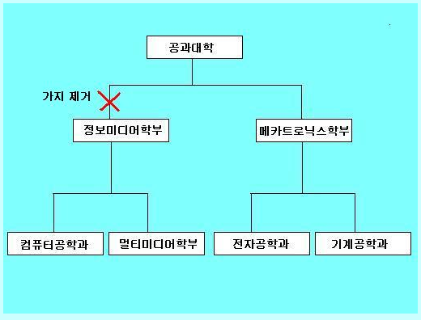

# 11.1

**복습**

-- [피봇 문제] TBL_PIVOT 테이블
3-1. PBL_PIVOT 테이블 생성

제 1 정규화를 잘못한 테이블을 조회하세요.

no     컬럼
name   컬럼
jumsu  컬럼

```sql
CREATE TABLE tbl_pivot (
    no number(38)
    , name varchar2(5 char)
    , jumsu number(3)
);
```

> 이름은 varchar2 가 char 보다 좋다.

3-2. INSERT

```
    1	조영지	90   국어
    2	조영지	89   영어
    3	조영지	99   수학
    
    4	김길환	56   국어
    5	김길환	34   영어
    6	김길환	12   수학
    
    7	임재민	98   국어
    8	임재민	88   영어
    9	임재민	100  수학
```


```sql
insert into tbl_pivot (NO,NAME,JUMSU) values (1, '조영지' ,90);
insert into tbl_pivot values (2, '조영지' ,89);
insert into tbl_pivot values (3, '조영지' ,99);
insert into tbl_pivot values (4, '김길환' ,56);
insert into tbl_pivot values (5, '김길환' ,34);
insert into tbl_pivot values (6, '김길환' ,12);
insert into tbl_pivot values (7, '임재민' ,98);
insert into tbl_pivot values (8, '임재민' ,88);
insert into tbl_pivot values (9, '임재민' ,100);
commit;
```


3-3. 위의 결과가  피봇해서 아래와 같이 결과가 나오게 해 보자 ]

```
 번호 이름 국어 영어 수학
 1   조영지 90  89  99
 2   김길환 56  34  12
 3   임재민 98  88  100
```


```
NAME          국어         영어         수학
----- ---------- ---------- ----------
김길환         56         34         12
임재민         98         88        100
조영지         90         89         99
```


**내코드**

```sql
 SELECT *
 FROM (
    SELECT 
        mod(no, 3) AS subject
        , jumsu, name
    FROM tbl_pivot)
PIVOT (sum(jumsu) FOR subject IN (1 AS 국어, 2 AS 영어, 0 AS 수학));

```


**쌤코드**

```sql
SELECT *
 FROM (
    SELECT
        trunc((no-1) / 3) + 1 no
        , mod(no, 3) AS subject
        , jumsu, name
    FROM tbl_pivot)
PIVOT (sum(jumsu) FOR subject IN (1 AS 국어, 2 AS 영어, 0 AS 수학))
ORDER BY no;
```


---

## **자료형**


**[VARCHAR2]**

1. VAR + CHAR2: 가변길이 문자
2. 4000 byte 까지 저장
3. 데이터를 넣은 후 메모리가 제거된다.

**형식**

```sql
VARCHAR2(SIZE BYTE|CHAR)
```

- `varchar2` 최대치 크기: 4000 byte. char 와 다르게 인자를 넣어주는게 좋다.
- `varchar2(n)` n byte
- `varchar2(10 char)` 

VARCHAR 는 동일 (SYNONYM) 이다.

**[LONG]**

1. 자바와 다르게 문자를 나타내는 자료형
2. 가변길이
3. 2GB 까지 나타낼 수 있다.

**[NUMBER]**

`number([전체 자리수], [소숫점 자리수])` ex) `number(3)` 은 -999 ~ 999 까지 저장

`number` 전체 자리수와 소숫점 자리수를 최대로 지정. `number(38, 127)` 과 같다.

p: precision 전체자리수 1~38

s: scale 소수점이하 자리수 -84~127

체크제약조건으로 0~100 점수를 줄 수 있다.

**저장예시**

0~100 점의 평균은 `number(3, 2)` 가 아니라 `number(5, 2)` 이다. 87.88

`number(6, -2)` 95 반올림되어 100 이 들어간다. 437

`number(4, 5)` 0.01234 가 들어간다. -> 네자리로 인식하기 때문

`number(2, 7)` 0.0000012 가 들어간다. -> 두자리로 인식하기 때문

```
AVG
-------
89.23
999
100
999.99
89.12
89.19
```

number(3, 2)

```sql
INSERT INTO tbl_avg VALUES (89.23);
INSERT INTO tbl_avg VALUES (999);
INSERT INTO tbl_avg VALUES (100.00);
INSERT INTO tbl_avg VALUES (999.99);
INSERT INTO tbl_avg VALUES (89.12345);
INSERT INTO tbl_avg VALUES (89.189345);
```

> 정수는 크면 에러가나고 소수는 반올림되어 들어간다.

Q. 테이블생성과 삭제는 커밋이 필요한가?

A. 

Q. 테이블 칼럼명 한글은 불가능한가?

A. 가능하다.

> 테이블생성은 꼭 콤마를 넣어야 한다.

**[FLOAT]**

내부적으로 NUMBER 를 나타낸다.

BINARY_FLOAT 과 BINARY_DOUBLE 도 있다.

**[DATE]**

세기, 년, 월, 일 + 시, 분, 초를 저장하는 자료형

위의 정보를 고정길이로 7 byte 로 저장한다.

**[TIMESTAMP]**

1. DATE 의 확장된 자료형
2. 최대 9자리의 밀리초까지 나타낼 수 있다.

`timestamp([n])` default n 은 6이다. 

`TIMESTAMP(0)` 95/08/08 00:00:00

`TIMESTAMP[(N)] WITH TIME ZONE` 

`TIMESTAMP[(N)] WITH LOCAL TIME ZONE` 

**[RAW]**

`RAW(SIZE)` 2진데이터값을 저장 2000BYTE

`LONG RAW` 2GB

예) 이미지 파일을 DB 에 저장.

**[BFILE]**

**[BLOB]**

LOB: Large OBject. 큰 객체를 저장하는 자료형

`BLOB` 

`CLOB` 2GB 이상 가변길이 문자

`NCLOB` 

**자료형정리**

1. 숫자: NUMBER, FLOAT
2. 날짜: DATE, TIMESTAMP
3. 문자: CHAR, NCHAR, VARCHAR2, NVARCHAR2, LONG
4. 2진데이터: RAW, LONG RAW
5. LOB, BLOB, CLOB, NCLOB + BFILE

SYSDATE: SYSTEM DATE 시스템의 현재시간

## 테이블

**테이블 생성, 수정, 삭제관련**

요구분석

DB 모델링

-- [테이블 생성]
-- 어떤 데이타를 저장 ( 요구분석 )
-- 모델링( 개념적, 논리적( 정규화 ), 물리적 모델링 )
-- 멤버(회원) 정보를 저장할 테이블 생성
논리적 물리적   데이타타입

아이디 8~20 이내로 설정하세요.

8자리 20자리 


varchar2 메모리 8

char 메모리20

아이디 id         문자/가변길이  varchar2, [nvarchar2], long   
이름   name       문자/가변길이  varchar2, [nvarchar2], long   
나이    age       숫자(정수)    [number(3)] / float
전화번호 tel       문자/고정길이 3-4-4 char (13 byte)        
생일    birthday  날짜          [date] / timestamp
비고     etc      문자/가변길이  nvarchar2(200)          
주소   address    문자/가변길이  nvarchar2(200)

**형식**

```sql
CREATE [GLOBAL TEMPORARY] TABLE 스키마.테이블명(
    컬럼명 데이터타입(크기) [DEFAULT 표현식] [제약조건 ]
    ,컬럼명 데이터타입(크기) [DEFAULT 표현식] [제약조건 ]
    ,컬럼명 데이터타입(크기) [DEFAULT 표현식] [제약조건 ]
    :
);
```


ora_help: create table 검색

**[테이블의 칼럼 변경]**

TBL_MEMBER 테이블에 새로운 (잔화번호 컬럼, 비고 컬럼) 컬럼을 추가.

테이블 수정: ALTER DDL 문

ora_help: alter 테이블

- add
- modify
- drop[constraint] 제약조건: PK (PRIMARY KEY), UK (Unique Key), FK (Forein Key) 등
- drop column

칼럼은 수정이 가능하지만 제약조건은 수정할 수 없다.

형식

칼럼 추가

```sql
ALTER TABLE
ADD (컬럼명 자료형 [default 값],...)
```

제약조건 추가

gender

null

null

null

1. 새로운 칼럼을 추가하기 전에 테이블에 레코드가 있다면 새로 추가된 칼럼의 값은 NULL 로 초기화된다.
2. 한번의 ADD 명령으로 여러 개의 칼럼을 추가 가능하다.
3. 하나의 칼럼만 추가할 경우에는 괄호를 생략가능하다.
4. 추가된 컬럼은 테이블의 마지막부분에 생성되고, 사용자가 컬럼의 위치를 지정할 수 없다.
5. 추가되는 칼럼의 기본값을 지정할 수 있다.

```
kenik	홍길동	20	01/12/23	010-1111-2222		남자
```

**칼럼추가**

```sql
ALTER TABLE tbl_member
ADD (gender varchar2(6) DEFAULT '남자');
```


```sql
INSERT INTO tbl_member (id, name, age, birth, tel, bigo)
VALUES ('kim', '김길동', 20, '2001.12.23', '010-1111-2222', default);
```

> default 라고 작성해서 값을 넣을 수도 있다.

**칼럼변경**

형식

```sql
ALTER TABLE
MODIFY (컬럼명 자료형 [default 값]...)
```

1. 데이터의 type, size, default 값을 변경할 수 있다.
2. 변경 대상 컬럼에 데이터가 없거나 null 값만 존재할 경우에는 size를 줄일 수 있다.
3. 데이터 타입의 변경은 CHAR와 VARCHAR2 상호간의 변경만 가능하다.
4. 컬럼 크기의 변경은 저장된 데이터의 크기보다 같거나 클 경우에만 가능하다.
5. NOT NULL 컬럼인 경우에는 size의 확대만 가능하다.
6. 컬럼이름의 직접적인 변경은 불가능하다.
7. 컬럼이름의 변경은 서브쿼리를 통한 테이블 생성시 alias를 이용하여 변경이 가능하다.

가능: 자료형, 크기, 기본형

불가능: 컬럼이름

```sql
ALTER TABLE tbl_member
MODIFY (bigo varchar2(100));
```

**컬럼명 변경**

```sql
ALTER TABLE tbl_member
RENAME COLUMN bigo TO memo;
```

`RENAME COLUMN A TO B` 

형식

```sql
DROP TABLE 테이블명 [CASCADE CONSTRAINTS][PURGE];
```

`PURGE` 휴지통으로 보내지 않고 바로삭제 (퍼지데이)

**이미 존재하는 테이블로 테이블 생성**

Subquery를 이용한 table 생성

```sql
CREATE TABLE 테이블 [컬럼명...]
AS 서브쿼리
```

1.  컬럼명을 명시할 경우 subquery의 컬럼수와 테이블의 컬럼수를 같게해야 한다.
2. 컬럼을 명시하지 않을 경우, 컬럼명은 subquery의 컬럼명과 같게 된다.
3. subquery를 이용해 테이블을 생성할 때 CREATE TABLE 테이블명 뒤에 컬럼명을 명시해 주는 것이 좋다.

> 서브쿼리로 생성할 때는 괄호가 필요없다.

```sql
CREATE TABLE emp_copy
AS
SELECT *
FROM emp;
```


```sql
CREATE TABLE emp_10 (empno, ename, pay)
AS
SELECT empno, ename, sal + nvl(comm, 0)
FROM emp
WHERE deptno = 10;
```

테이블의 구조, 레코드는 복사되어져 테이블이 생성되지만 제약조건은 복사되지 않는다. (NOT NULL 제약조건은 복사된다.)

**제약조건 확인**

```
SCOTT	PK_EMP	P	EMP	ENABLED	NOT DEFERRABLE	IMMEDIATE	VALIDATED	USER NAME	21/10/19	SCOTT	PK_EMP		
SCOTT	FK_DEPTNO	R	EMP		SCOTT	PK_DEPT	NO ACTION	ENABLED	NOT DEFERRABLE	IMMEDIATE	VALIDATED	USER NAME			21/10/19				
```


```sql
SELECT *
FROM user_constraints
WHERE table_name = 'EMP';
```

테이블명은 대문자로 입력한다.

constraint_type

- `P` PK = NN + UK 널이 아니고 중복이 안된다.
- `R` FK
- `C` NOT NULL
- UK Unique Key 유일성: 중복이 없어야 한다.

```
이름    널? 유형           
----- -- ------------ 
EMPNO    NUMBER(4)    
ENAME    VARCHAR2(10) 
PAY      NUMBER  
```

pay 는 없으므로 시스템이 임의로 자료형을 설정했다.

**테이블구조만 복사**

```sql
CREATE TABLE emp_copy
AS
SELECT *
FROM emp
WHERE 1 = 0; -- false
```


테이블 생성 시 기본값 주기

```sql
CREATE TABLE tbl_member (
    id varchar2(10) NOT NULL CONSTRAINT PK_TBLMEMBER_ID PRIMARY KEY
    , name varchar2(20) NOT NULL
    , age number(3)
    , birth date
    , regdate date default sysdate
    , point number default 10
);
```

CONSTRAINT 와 PRIMARY KEY 사이에 제약조건명을 작성한다.


## **INSERT**

칼럼명을 넣지 않으면 모든 값을 작성해야 한다.

ora_help: subquery_insert 검색

```sql
INSERT INTO 테이블
서브쿼리
```

ora)help: insert_multitable

하나의 INSERT 문으로 하나의 테이블에 하나의 행만을 추가하지 않고 

하나의 INSERT 문으로 여러 개의 테이블에 동시에 하나의 행을 입력하는 것.

4 가지 종류

1. UNCONDITIONAL INSERT ALL
2. CONDITIONAL INSERT ALL
3. CONDITIONAL FIRST INSERT
4. PRIVOTING INSERT

UNCONDITIONAL INSERT ALL

INSERT INTO 테이블 (컬럼) VALUES (컬럼)

```sql
INSERT ALL 
    INTO dept_10 VALUES (deptno, dname, loc)
    INTO dept_20 (deptno, dname) VALUES (deptno, dname)    
    INTO dept_30 VALUES (deptno, dname, loc)
    INTO dept_40 VALUES (deptno, dname, loc)
SELECT deptno, dname, loc
FROM dept;
```

하나의 insert 문으로 하나의 테이블에 하나의 행(row)만을 입력하지 않고 하나의 insert 문으로 여러 개의  테이블에 동시에 하나의 행을 입력하는 것이다.

CONDITIONAL INSERT ALL

```sql
INSERT ALL
	WHEN THEN
		INTO
	ELSE
서브쿼리
```

**부서에따라 테이블 나누기**

```
7782	CLARK	MANAGER	7839	81/06/09	2450		10
7839	KING	PRESIDENT		81/11/17	5000		10
7934	MILLER	CLERK	7782	82/01/23	1300		10
```

```
7369	SMITH	CLERK	7902	80/12/17	800		20
7566	JONES	MANAGER	7839	81/04/02	2975		20
7902	FORD	ANALYST	7566	81/12/03	3000		20
```


```
7499	ALLEN	SALESMAN	7698	81/02/20	1600	300	30
7521	WARD	SALESMAN	7698	81/02/22	1250	500	30
7654	MARTIN	SALESMAN	7698	81/09/28	1250	1400	30
						:
						:
```


```sql
INSERT ALL
    WHEN deptno = 10 THEN
        INTO emp_10 VALUES (empno, ename, job, mgr, hiredate, sal, comm, deptno)
    WHEN deptno = 20 THEN
        INTO emp_20 VALUES (empno, ename, job, mgr, hiredate, sal, comm, deptno)
    WHEN deptno = 30 THEN
        INTO emp_30 VALUES (empno, ename, job, mgr, hiredate, sal, comm, deptno)
    ELSE
        INTO emp_40 VALUES (empno, ename, job, mgr, hiredate, sal, comm, deptno)
SELECT *
FROM emp;
```

> INSERT 는 CREATE TABLE 과 다르게 AS 가 없어야 한다.

**테이블의 전체 레코드삭제**

```sql
TRUNCATE TABLE emp_10;
```

1. 모든 레코드 삭제
2. 자동 커밋
3. 롤백 X

PRIVOTING INSERT

```
1101	4	100
1102	5	300
1101	4	150
1102	5	300
1101	4	80
1102	5	230
1101	4	60
1102	5	120
1101	4	120
1102	5	150
```


```sql
INSERT ALL
    INTO tbl_sales_data VALUES (employee_id, week_id, sales_mon)
    INTO tbl_sales_data VALUES (employee_id, week_id, sales_tue)
    INTO tbl_sales_data VALUES (employee_id, week_id, sales_wed)
    INTO tbl_sales_data VALUES (employee_id, week_id, sales_thu)
    INTO tbl_sales_data VALUES (employee_id, week_id, sales_fri)
SELECT employee_id, week_id, sales_mon, sales_tue, sales_wed,
           sales_thu, sales_fri
FROM tbl_sales;
```

**문제**

INSA 테이블의 컬럼 중 num, name 칼럼만 복사해서 tbl_score 테이블을 생성하되 num 이 1005 이하인 자료만 복사하세요.


```sql
ALTER TABLE tbl_score
ADD (
    kor NUMBER(3) DEFAULT 0
    , eng NUMBER(3) DEFAULT 0
    , mat NUMBER(3) DEFAULT 0
    , tot NUMBER(3) DEFAULT 0
    , avg NUMBER(5, 2) DEFAULT 0
    , grade CHAR(1 CHAR) DEFAULT 0
);
```

## **UPDATE**


```
1001	홍길동	80	36	42
1002	이순신	81	59	18
1003	이순애	48	6	90
1004	김정훈	6	73	53
1005	한석봉	70	5	81
```


```sql
UPDATE tbl_score
SET kor = trunc(dbms_random.value(0, 101))
	, eng = trunc(dbms_random.value(0, 101)) 
    , mat = trunc(dbms_random.value(0, 101));
```

**합계/평균 수정**

```

1001	홍길동	80	36	42	158	52.67
1002	이순신	81	59	18	158	52.67
1003	이순애	48	6	90	144	48
1004	김정훈	6	73	53	132	44
1005	한석봉	70	5	81	156	52
```


```sql
UPDATE tbl_score
SET tot = kor + eng + mat
    , avg = (kor + eng + mat) / 3;
```


**평균에 따라 등급 수정**

```
NUM 	NAME KOR ENG MAT   TOT AVG 		GRADE
----------------------------------------------
1001	홍길동	87	89	50	226	75.33	  미
1002	이순신	49	71	94	214	71.33	  미
1003	이순애	50	64	34	148	49.33	  가
1004	김정훈	21	28	3	52	17.33	  가
1005	한석봉	25	90	49	164	54.67	  가
```


```sql
UPDATE tbl_score
SET grade = CASE 
        WHEN avg >= 90 THEN '수'
        WHEN avg >= 80 THEN '우'
        WHEN avg >= 70 THEN '미'
        WHEN avg >= 60 THEN '양'
        ELSE '가'
    END;
```

```sql
UPDATE tbl_score
SET grade = CASE trunc(avg/10)
        WHEN 9 THEN '수'
        WHEN 8 THEN '우'
        WHEN 7 THEN '미'
        WHEN 6 THEN '양'
        ELSE '가'
    END;
```

**문제**

1005번 학생의 국어, 영어점수를 수정

1001번 학생의 국어, 영어점수를 가져와서 1005번 학생의 국, 영 점수로 수정

```
NUM 	NAME KOR ENG MAT   TOT AVG 		GRADE
----------------------------------------------
1001	홍길동	87	89	50	226	75.33	미
1002	이순신	49	71	94	214	71.33	미
1003	이순애	50	64	34	148	49.33	가
1004	김정훈	21	28	3	52	17.33	가
1005	한석봉	87	89	49	164	54.67	가
```


```sql
UPDATE tbl_score
SET (kor, eng) = (SELECT kor, eng FROM tbl_score WHERE num = 1001)
WHERE num = 1005;
```

**문제**

tbl_score 테이블에서 여학생들만 영어점수를 5점 증가시키는 쿼리를 작성

1. insa, tbl_score 테이블 조인
2. 99점 -> 104점 X, 영어 5점 증가

```sql
UPDATE tbl_score
SET eng = eng + 5
WHERE 여자학생조건절;
```

내일: 제약조건, 조인

테이터베이스 모델링

`CONNECT BY`

`LEVEL` 

**달력**

```sql
select
    nvl(max(decode(to_char(dates,'D'),1, to_char(dates,'dd'))), ' ') 일
  , nvl(min(decode(to_char(dates,'D'),2, to_char(dates,'dd'))), ' ') 월
  , nvl(max(decode(to_char(dates,'D'),3, to_char(dates,'dd'))), ' ') 화
  , nvl(min(decode(to_char(dates,'D'),4, to_char(dates,'dd'))), ' ') 수
  , nvl(max(decode(to_char(dates,'D'),5, to_char(dates,'dd'))), ' ') 목
  , nvl(min(decode(to_char(dates,'D'),6, to_char(dates,'dd'))), ' ') 금
  , nvl(min(decode(to_char(dates,'D'),7, to_char(dates,'dd'))), ' ') 토
from 
(                 -- 202111
   select  to_date( :yyyymm ,'YYYYMM' ) + level -1    dates
   from dual
   connect by level <= extract( day from last_day(to_date(  :yyyymm  , 'YYYYMM')))
) t
group by decode( to_char(dates,'D'), 1, to_char(dates,'IW')+1
                                                  , to_char(dates, 'IW'))
order by decode( to_char(dates,'D'), 1, to_char(dates,'IW')+1
                                      , to_char(dates, 'IW'));
```

# 11.2

**복습**

2-1. 게시글을 저장하는 테이블 생성
   ㄱ.   테이블명 : tbl_test
   ㄴ.   컬럼
         글번호    seq           not null   pk
         작성자    writer        not null
         비밀번호 passwd      not null
         글제목    title          not null
         글내용    content
         작성일    regdate     default sysdate
         

    ㄷ.  글번호, 작성자, 비밀번호, 글 제목은 필수 입력 사항으로 지정
    ㄹ.  글번호가  기본키( PK )로 지정
    ㅁ.  작성일은 현재 시스템의 날짜로 자동 설정

> 제약조건은 쉼표가 필요없고 칼럼사이에는 쉼표가 필요하다.

2-6.  tbl_test  -> tbl_board 테이블명 변경 

형식

```sql
RENAME 기존테이블명 TO 새테이블명;
-- ALTER TABLE 기존테이블명 RENAME TO 새테이블명; 같은 코드
```


```sql
ALTER TABLE tbl_test
RENAME TO tbl_board;
```

Q. ALTER 도 없어도 될까?

A. 없어도 된다.

3-1. insert 문 수행 중 다음과 같은 오류가 발생했다면 이유에 대해 설명하세요
  ㄱ. 00947. 00000 -  "not enough values"
  ㄴ. ORA-00001: unique constraint (SCOTT.SYS_C007770) violated  
  ㄷ. ORA-02291: integrity constraint (SCOTT.FK_DEPTNO) violated - parent key not found

부모테이블에 존재하지 않는 PRIMARY KEY 에 넣을 때 (INSERT)

4-1. 서브쿼리를 사용해서 테이블 생성
ㄱ. deptno, dname, empno, ename, sal+nvl(comm,0) pay, grade 컬럼을 가진 새로운 테이블 생성
  ㄴ. 테이블명 : tbl_empdeptgrade   


**WHERE**

```sql
CREATE TABLE tbl_empdeptgrade (deptno, dname, empno, ename, pay, grade)
AS
SELECT emp.deptno, dname, empno, ename, sal + nvl(comm, 0), grade
FROM emp, dept, salgrade
WHERE emp.deptno = dept.deptno
    AND sal BETWEEN losal AND hisal;
```

**JOIN**

```sql
CREATE TABLE tbl_empdeptgrade (deptno, dname, empno, ename, pay, grade)
AS
SELECT emp.deptno, dname, empno, ename, sal + nvl(comm, 0), grade
FROM emp
    JOIN dept ON emp.deptno = dept.deptno
    JOIN salgrade ON sal BETWEEN losal AND hisal;
```

조인은 2개이상 가능하다.

---

`TRUNC` 모든 레코드를 삭제하고 커밋과 롤백이 불가능하다.

`DELETE` 원하는 것만 WHERE 조건으로 삭제. 커밋과 롤백이 가능하다.

## **LEVEL**

ora_help: level 검색

형식

```sql
SELECT 	
START WITH 조건
CONNECT BY [PRIOR 컬럼 비교연산자 컬럼]
	또는 
	   [컬럼 비교연산자 PRIOR 컬럼]
```

**LEVEL 예시**

```
21/11/01
21/11/02
21/11/03
21/11/04
	:
	:
21/11/27
21/11/28
21/11/29
21/11/30
```

```sql
SELECT to_date('202111', 'YYYYMM') + LEVEL - 1
FROM dual
CONNECT BY LEVEL <= 30;
```

> LEVEL 의 조건은 WHERE 에 작성해도 같지만 트리구성을 먼저 한 후 WHERE 을 실행하므로 CONNECT BY 절에 작성하는 것이 성능이 좋다.

```sql
SELECT to_char(dates, 'DD')
FROM (
    SELECT to_date('202111', 'YYYYMM') + LEVEL - 1 AS dates
    FROM dual
    CONNECT BY LEVEL <= extract(day FROM last_day(to_date('202111', 'YYYYMM')))
    );
```

> ALIAS 로 "dates" 를 하면 조회할 때도 "dates" 를 사용해야 한다.

```sql
SELECT dates, to_char(dates, 'DD'), to_char(dates, 'IW')
    , decode(to_char(dates, 'D')
    , 1, to_char(dates, 'IW') + 1
    , to_char(dates, 'IW'))
FROM (
    SELECT to_date('202111', 'YYYYMM') + LEVEL - 1 AS dates
    FROM dual
    CONNECT BY LEVEL <= extract(day FROM last_day(to_date('202111', 'YYYYMM')))
    );
```

decode 는 일요일을 다음줄로 내리기위한 코드이다.


**달력출력**

```sql
SELECT 
    nvl(min(decode(to_char(dates, 'D'), 1, to_char(dates, 'DD'))), ' ') 일
    , nvl(min(decode(to_char(dates, 'D'), 2, to_char(dates, 'DD'))), ' ') 월
    , nvl(min(decode(to_char(dates, 'D'), 3, to_char(dates, 'DD'))), ' ') 화
    , nvl(min(decode(to_char(dates, 'D'), 4, to_char(dates, 'DD'))), ' ') 수
    , nvl(min(decode(to_char(dates, 'D'), 5, to_char(dates, 'DD'))), ' ') 목
    , nvl(min(decode(to_char(dates, 'D'), 6, to_char(dates, 'DD'))), ' ') 금
    , nvl(min(decode(to_char(dates, 'D'), 7, to_char(dates, 'DD'))), ' ') 토
FROM (
    SELECT to_date('202111', 'YYYYMM') + LEVEL - 1 AS dates
    FROM dual
    CONNECT BY LEVEL <= extract(day FROM last_day(to_date('202111', 'YYYYMM')))
    )
GROUP BY decode(to_char(dates, 'D')
    , 1, to_char(dates, 'IW') + 1
    , to_char(dates, 'IW'))
ORDER BY decode(to_char(dates, 'D')
    , 1, to_char(dates, 'IW') + 1
    , to_char(dates, 'IW'));
```

**[계층적 질의(hierarchical query)]**


```sql
SELECT empno, ename, mgr, deptno, LEVEL    
FROM emp
START WITH mgr IS NULL
CONNECT BY PRIOR empno = mgr;
```


```sql
SELECT 
    lpad(' ', 3 * LEVEL - 3 ) || ename
    , empno
    , mgr, deptno, LEVEL    
    , SYS_CONNECT_BY_PATH(ename, '/') AS path
    , connect_by_root ename AS root_node
FROM emp
START WITH mgr IS NULL
CONNECT BY PRIOR empno = mgr;
```

계층구조 사용 ?

답변형 게시판 구현할 때 계층적인 질의문 사용

태요: http://taeyo.net/ - 닷넷 사이트 중 가장 큰 사이트.


**계층구조 예시: 공과대학**


INSERT

```sql
insert into tbl_level ( deptno, dname, college, loc ) values ( 10,'공과대학', null , null);

    insert into tbl_level ( deptno, dname, college, loc ) values ( 100,'정보미디어학부',10, null );
        insert into tbl_level ( deptno, dname, college, loc ) values ( 101,'컴퓨터공학과',100,'1호관');
        insert into tbl_level ( deptno, dname, college, loc ) values ( 102,'멀티미디어학과',100,'2호관');

    insert into tbl_level ( deptno, dname, college, loc ) values ( 200,'메카트로닉스학부', 10,null);
        insert into tbl_level ( deptno, dname, college, loc ) values ( 201,'전자공학과',200,'3호관');
        insert into tbl_level ( deptno, dname, college, loc ) values ( 202,'기계공학과',200,'4호관');

```


```sql
SELECT deptno, dname, college, level
    , LPAD(' ', (LEVEL-1)*2) || dname 조직도
FROM tbl_level
START WITH dname = '공과대학'
CONNECT BY PRIOR deptno = college;
```

계층구조 세가지 제거방법

1. WHERE 
2. CONNECT BY 



WHERE

```
공과대학
    컴퓨터공학과
    멀티미디어학과
  메카트로닉스학부
    전자공학과
    기계공학과
```


```sql
SELECT 
    LPAD(' ', (LEVEL-1)*2) || dname 조직도
FROM tbl_level
WHERE dname != '정보미디어학부'
START WITH dname = '공과대학'
CONNECT BY PRIOR deptno = college;
```

CONNECT BY

```
공과대학
  메카트로닉스학부
    전자공학과
    기계공학과
```


```sql
SELECT 
    LPAD(' ', (LEVEL-1)*2) || dname 조직도
FROM tbl_level
--WHERE dname != '정보미디어학부'
START WITH dname = '공과대학'
CONNECT BY PRIOR deptno = college
    AND dname != '정보미디어학부';
```

## **MERGE**

통합, 병합문

ora_help: merge 검색

1. 구조가 같은 두 개의 테이블을 비교하여 하나의 테이블로 합치기 위한 데이터 조작이다.

예를 들어, 하루에 수만건씩 발생하는 데이터를 하나의 테이블에 관리할 경우 대량의 데이터로 인해 질의문의 성능이 저하된다.
이런 경우,  지점별로 별도의 테이블에서 관리하다가 년말에 종합 분석을 위해 하나의 테이블로 합칠 때 merge 문을 사용하면 편리하다.

형식

```sql
MERGE INTO 결과테이블
USING 서브쿼리
ON (조건)
[WHEN MATCHED THEN
	UPDATE SET WHERE]
[WHEN NOT MATCHED THEN
	INSERT VALUES]
```


```sql
【형식】
    MERGE [hint] INTO [schema.] {table ¦ view} [t_alias]
      USING {{[schema.] {table ¦ view}} ¦
            subquery} [t_alias]
      ON (condition) 
      [merge_update_clause] 
      [merge_insert_clause] 
      [error_logging_clause];

【merge_update_clause 형식】
   WHEN MATCHED THEN 
   		UPDATE SET {column = {expr ¦ DEFAULT},...}
     [where_clause] [DELETE where_clause]

【merge_insert_clause 형식】
   WHEN NOT MATCHED THEN 
   		INSERT [(column,...)]
    VALUES ({expr,... ¦ DEFAULT}) [where_clause]
   
【where_clause 형식】
   WHERE condition

【error_logging_clause 형식】
   LOG ERROR [INTO [schema.] table] [(simple_expression)]
     [REJECT LIMIT {integer ¦ UNLIMITED}]
```

**병합예제** 

변경 전

```
1001	100
1002	100
1003	100
1004	50
```

변경 후

```
1001	101.5
1002	101.3
1003	101.4
1004	50
```


```sql
MERGE INTO tbl_bonus b
USING (SELECT id, salary FROM tbl_emp) e
ON (e.id = b.id)
WHEN MATCHED THEN 
    UPDATE SET b.bonus = b.bonus + e.salary * 0.01
WHEN NOT MATCHED THEN 
    INSERT (b.id, b.bonus) VALUES(e.id, e.salary * 0.01);
```

> ON 에 괄호가 있어야 한다.
>
> UPDATE 에 테이블명이 필요없다.
>
> INSERT 에 INTO 테이블명이 필요없다.

**예제2**

INSERT 코드

```sql
INSERT INTO tbl_TEST1 (id, name, pay, sudang) VALUES (1, 'a', 100, 10);
INSERT INTO tbl_TEST1 (id, name, pay, sudang) VALUES (2, 'b', 150, 20);
INSERT INTO tbl_TEST1 (id, name, pay, sudang) VALUES (3, 'c', 130, 0);
    
INSERT INTO tbl_TEST2 (id, sudang) VALUES (2,5);
INSERT INTO tbl_TEST2 (id, sudang) VALUES (3,10);
INSERT INTO tbl_TEST2 (id, sudang) VALUES (4,20);

COMMIT;
```

변경 전

```
1	a	100	10
2	b	150	20
3	c	130	0
```

```
2	5
3	10
4	20
```

변경 후

```
2	25
3	10
4	20
1	10
```


```sql
MERGE INTO tbl_test2 t2
USING (SELECT id, sudang FROM tbl_test1) t1
ON (t1.id = t2.id)
WHEN MATCHED THEN
    UPDATE SET t2.sudang = t2.sudang + t1.sudang
WHEN NOT MATCHED THEN
    INSERT (t2.id, t2.sudang) VALUES (t1.id, t1.sudang);
```

## CONSTRAINTS

ora_help: constraints 검색

1. 제약조건확인: user_constraints 뷰
2. 제약조건은 데이터무결성 (Data Intergity) 을 위하여 주로 테이블에 행을 추가, 수정, 삭제할 때 적용되는 규칙

질문) 제약조건이란 ?

테이블 + CRUD 할 때 데이터 무결성을 위한 규칙이다.

데이터무결성 (Data Intergity) ? 

1. 개체 무결성 (Entity Intergrity)
2. 참조 무결성 (Relational ")
3. 도메인 무결성 (Domain ")

개체 무결성

한 개체 (튜플 tuple == 레코드 == 행)

```sql
INSERT INTO dept
VALUES (10, 'QC', 'SEOUL'); -- 에러가 난다.
```

참조 무결성

관계간의 데이터의 일관성을 보장하기위한 제약조건이다.

```sql
INSERT INTO emp
VALUES 
```

도메인 무결성

속성에서 허용 가능한 값의 범위를 지정하기 위한 제약조건이다.

```sql
INSERT INTO tbl_score VALUES (111); -- 에러가 난다.
```

**무결성 제약조건 생성**

1. 컬럼레벨 (Column Level) == IN-LINE constraint 방법
2. 테이블레벨 (Table Level) == OUT-OF-LINE constraint 방법

제약조건 5가지의 종류

1. `PRIMARY KEY` PK = NOT NULL + UNIQUE KEY 고유키.  
2. `REFERENCES` `FOREIGN KEY` FK.  
3. `UNIQUE` UNIQUE KEY: UK
4. `NOT NULL` NN
5. `CHECK(조건)` CK 

**제약조건 작성방법**

```SQL
-- 테이블 생성
CREATE TABLE 테이블명 (
    컬럼명 자료형 CONSTRAINT 제약조건명 제약조건
);

-- 제약조건 추가
ADD CONSTRAINT 제약조건명 제약조건
```

FOREIGN KEY

부모테이블 자식테이블

delt				emp

deptno(PK) 등록되는 사원의 deptno 는 반드시 dept 테이블의 PK 를 참조해야 한다.

UNIQUE KEY

tbl_member 테이블에 ssn 컬럼. 중복될 수 없다.

NOT NULL 반드시 필수입력항목

CHECK 해당 칼럼에 가능한 값의 범위나 조건을 지정

예)

kor number(3) BETWEEN 0 AND 100

> NOT NULL 은 테이블레벨에서 설정할 수 없다.

**칼럼레벨 VS 테이블레벨**

```
CK_TBLEMP_KOR2		C	TBL_EMP	kor BETWEEN 0 AND 100
CK_TBLEMP_KOR		C	TBL_EMP	city IN ('부산', '대구', '서울', '대전', '인천')
PK_TBLEMP_EMPNO2	P	TBL_EMP	
UK_TBLEMP_EMAIL2	U	TBL_EMP	
FK_TBLEMP_DEPTNO	R	TBL_EMP	
SYS_C007135			C	TBL_EMP	"EMPNO" IS NOT NULL
SYS_C007136			C	TBL_EMP	"EMAIL" IS NOT NULL
SYS_C007137			C	TBL_EMP	"ENAME" IS NOT NULL
```

**오류**

```
ORA-02264: name already used by an existing constraint
02264. 00000 -  "name already used by an existing constraint"
*Cause:    The specified constraint name has to be unique.
*Action:   Specify a unique constraint name for the constraint.
```


```sql
CREATE TABLE tbl_emp (
    empno number(4)      NOT NULL CONSTRAINT PK_TBLEMP_EMPNO PRIMARY KEY -- 컬럼레벨
    , email varchar2(50) NOT NULL CONSTRAINT UK_TBLEMP_EMAIL UNIQUE
    , ename varchar2(20) NOT NULL -- 컬럼레벨 NN
    , kor number(3) CONSTRAINT CK_TBLEMP_KOR CHECK(kor BETWEEN 0 AND 100)
    , city varchar2(20) CONSTRAINT CK_TBLEMP_CITY CHECK(city IN ('부산', '대구', '서울', '대전', '인천'))
    , deptno number(4) CONSTRAINT FK_TBLEMP_DEPTNO REFERENCES DEPT(deptno)  
);
```

Q. 제약조건 중복 ?

```sql
CREATE TABLE tbl_emp (
    empno number(4) 
    , email varchar2(50)
    , ename varchar2(20)
    , kor number(3)

    , CONSTRAINT PK_TBLEMP_EMPNO PRIMARY KEY(empno) -- 테이블 레벨 PK
    , CONSTRAINT UK_TBLEMP_EMAIL UNIQUE(email)
    , CONSTRAINT CK_TBLEMP_KOR CHECK(kor BETWEEN 0 AND 100)
    , CONSTRAINT CK_TBLEMP_CITY CHECK(city IN ('부산', '대구', '서울', '대전', '인천'))
    , CONSTRAINT FK_TBLEMP_DEPTNO FOREIGN KEY(deptno) REFERENCES DEPT(deptno)
)
```

**제약조건 에러**

kor

```
check constraint (SCOTT.CK_TBLEMP_KOR2) violated
```


```sql
INSERT INTO tbl_emp (empno, email, ename, kor, city, deptno)
VALUES (1000, 'kir@naver.com', '김길동', 111, '서울', 60);
```

city

```sql
INSERT INTO tbl_emp (empno, email, ename, kor, city, deptno)
VALUES (1000, 'kir@naver.com', '김길동', 90, '안동', 10);
```

제약조건 ?

데이터 무결성 3가지 (객체, 참조, 도메인)

제약조건 5가지 ? PK, NN, FK, CK, UK

tbl_emp 테이블 생성 - 컬럼

**오류**

```
ORA-02292: integrity constraint (SCOTT.FK_DEPTNO) violated - child record found
```

무결성 제약조건 위배

자식에서 사용하고 있어서 삭제할 수 없다.

```sql
DELETE FROM dept
WHERE deptno = 10;
```

**[제약조건제거]**

**형식**

```sql
ALTER TABLE 테이블명
DROP [CONSTRAINT 제약조건명 } PRIMARY KEY | UNIQUE(컬럼명)]
[CASCADE];
```

CASCADE 는 참조하는 FOREIGN KEY 가 있을 때 사용한다.

PK 제거

```sql
ALTER TABLE tbl_emp
DROP PRIMARY KEY;
```

PK 추가

```sql
ALTER TABLE tbl_emp
ADD CONSTRAINT PK_TBLEMP_EMPNO PRIMARY KEY (empno);
```


```sql
ALTER TABLE tbl_emp
DROP CONSTRAINT 제약조건명;
```

제약조건명으로 삭제

```sql
ALTER TABLE tbl_emp
DROP CONSTRAINT CK_TBLEMP_KOR;
```


```sql
ALTER TABLE tbl_emp
ADD CONSTRAINT CK_TBLEMP_KOR CHECK(kor BETWEEN 0 AND 100);
```

**NOT NULL 제약조건 추가**

```sql
ALTER TABLE tbl_emp
ADD CONSTRAINT NN_TBLEMP_GENDER CHECK(gender IS NOT NULL);
```

혹은

```sql
ALTER TABLE tbl_emp
MODIFY gender NOT NULL;
```

**체크 제약조건을 비활성화/활성화**

활성화

```sql
ALTER TABLE tbl_emp
ENABLE CONSTRAINT 제약조건명;
```

비활성화

```sql
ALTER TABLE tbl_emp
DISABLE CONSTRAINT 제약조건명 [CASCADE];
```


`REFERENCES dept(deptno) 옵션` 컬럼레벨: dept 테이블의 deptno 칼럼 참조

`FOREIGN KEY(deptno) REFERENCES dept(deptno) 옵션`

옵션 

- `ON DELETE CASCADE` 10번 부서가 삭제되고 emp 테이블의 10번 부서원들도 모두 삭제가 된다.
- `ON DELETE SET NULL` 10번 부서가 삭제되고 10번 부서원의 deptno 컬럼이 NULL 로 채워진다.

공부: ora_help 에서 constraint 검색

1. 달력 - LEVEL, CONNECT BY
2. MERGE 병합
3. 제약조건
   1. 개념
   2. 데이터 무결성 개념 3가지
   3. 제약조건 5가지
   4. 테이블 제약조건 설정 - tbl_emp 테이블 생성
   5. 컬럼레벨 / 테이블레벨
   6. ALTER 추가 / 삭제
   7. IN / D / U 무결성 위배 에러체크
   8. 제약조건 활성화 / 비활성화

내일: 조인 / DB 모델링

DB 모델링 툴: https://ko.exerd.com/#intro

exerd v2.x 평가판 다운로드

## 정리

1. LEVEL 

계층구조를 나타낸다. (직원과 상사)

형식

SELECT 	
START WITH 조건
CONNECT BY [PRIOR 컬럼 비교연산자 컬럼]
	또는 
	   [컬럼 비교연산자 PRIOR 컬럼]


START WITH: 계층구조를 어디서부터 시작할지를 정한다. (사장이 LEVEL = 1)
CONNECT BY: 계층구조를 어떻게 만들지 조건을 넣는다. LEVEL 조건도 여기 넣는다. (LEVEL <= 30)
PRIOR: 계층구조의 값 앞에 붙여준다. (CONNECT BY PRIOR 사원번호 = 직속상사번호)
	직속상사번호가 사원번호와 같으면 그 사원의 LEVEL 은 직속상사의 LEVEL + 1 이다.

공과대학
    컴퓨터공학과
    멀티미디어학과
  메카트로닉스학부
    전자공학과
    기계공학과

SELECT 
    LPAD(' ', (LEVEL-1)*2) || dname 조직도
FROM tbl_level
WHERE dname != '정보미디어학부'
START WITH dname = '공과대학'
CONNECT BY PRIOR deptno = college;

LPAD 를 사용해 LEVEL 값에 따라 공백을 줘 조회할 수도 있다. (LEVEL 이 1부터 증가하므로)

_________________________________________________
2. MERGE

구조가 같은 두 개의 테이블을 비교하여 하나의 테이블로 합치기 위한 데이터 조작이다.

형식

MERGE INTO 결과테이블
USING 서브쿼리
ON (조건) -- 괄호 없으면 에러남
[WHEN MATCHED THEN
	UPDATE SET] -- UPDATE 뒤 테이블명이 없다.
[WHEN NOT MATCHED THEN
	INSERT VALUES] -- INSERT 뒤 INTO 와 테이블명이 없다.

조건이 참이면 UPDATE 
값이 없다면 INSERT

서브쿼리를 사용해 결과테이블의 값을 변경한다.

_____________________________________________________
3. 제약조건

제약조건 5가지의 종류

1. PRIMARY KEY: PK = NOT NULL + UNIQUE KEY 고유키
2. FOREIGN KEY: FK
3. UNIQUE KEY: UK
4. NOT NULL: NN
5. CHECK: CK

CREATE TABLE tbl_emp (
    empno number(4)      NOT NULL CONSTRAINT PK_TBLEMP_EMPNO PRIMARY KEY -- 컬럼레벨
    , email varchar2(50) NOT NULL CONSTRAINT UK_TBLEMP_EMAIL UNIQUE
    , ename varchar2(20) NOT NULL -- 컬럼레벨 NN
    , kor number(3) CONSTRAINT CK_TBLEMP_KOR CHECK(kor BETWEEN 0 AND 100)
    , city varchar2(20) CONSTRAINT CK_TBLEMP_CITY CHECK(city IN ('부산', '대구', '서울', '대전', '인천'))
    , deptno number(4) CONSTRAINT FK_TBLEMP_DEPTNO REFERENCES DEPT(deptno)  
);

오류
ORA-02292: integrity constraint (SCOTT.FK_DEPTNO) violated - child record found
	      무결성	제약조건			    위반

제약조건 제거

형식

ALTER TABLE 테이블명
DROP [CONSTRAINT 제약조건명 } PRIMARY KEY | UNIQUE(컬럼명)]
[CASCADE];

PK 추가
ALTER TABLE tbl_emp
ADD CONSTRAINT PK_TBLEMP_EMPNO PRIMARY KEY (empno);

PK 제거
ALTER TABLE tbl_emp
DROP PRIMARY KEY;

제약조건명으로 삭제
ALTER TABLE tbl_emp
DROP CONSTRAINT CK_TBLEMP_KOR;

제약조건 추가
ALTER TABLE tbl_emp
ADD CONSTRAINT NN_TBLEMP_GENDER CHECK(gender IS NOT NULL);


제약조건 활성화
ALTER TABLE tbl_emp
ENABLE CONSTRAINT 제약조건명;

제약조건 비활성화
ALTER TABLE tbl_emp
DISABLE CONSTRAINT 제약조건명 [CASCADE];

# 11.3

**복습**

Q. UNIQUE 와 NOT NULL 도 키워드로 삭제가능?

A. UNIQUE(컬럼명) 은 가능한 것 같다.

3.  MERGE : 병합 , 한쪽 테이블의 정보를 다른 테이블에 병합(추가)

CREATE TABLE tbl_merge1
(
   id      number Primary key
   , name  varchar2(20)
   , pay  number
   , sudang number
);

CREATE TABLE tbl_merge2
(
   id      number Primary key 
   , sudang number
);

INSERT INTO tbl_merge1 (id, name, pay, sudang) VALUES (1, 'a', 100, 10);
INSERT INTO tbl_merge1 (id, name, pay, sudang) VALUES (2, 'b', 150, 20);
INSERT INTO tbl_merge1 (id, name, pay, sudang) VALUES (3, 'c', 130, 0);
    
INSERT INTO tbl_merge2 (id, sudang) VALUES (2,5);
INSERT INTO tbl_merge2 (id, sudang) VALUES (3,10);
INSERT INTO tbl_merge2 (id, sudang) VALUES (4,20);

COMMIT;

위의 두 테이블을 병합(merge)해서 아래와 같이 결과가 나오도록 병합하세요.
[ 실행 결과 ]
SELECT * FROM tbl_merge1;

**SELECT * FROM tbl_merge2;**

1	a	100	10
[2]	b	150	25 ( UPDATE )    
[3]	c	130	10 ( UPDATE )
4	        20 ( INSERT )  

```sql
MERGE INTO tbl_merge1 t1
USING tbl_merge2  t2
ON (t1.id = t2.id)
WHEN MATCHED THEN
    UPDATE 
    SET t1.sudang = t1.sudang + t2.sudang
WHEN NOT MATCHED THEN
    INSERT (id, sudang)
    VALUES (t2.id, t2.sudang);
```

>  INSERT 에는 테이블명이 필요없다.


---

```sql
ALTER TABLE 
ADD CONSTRAINT 제약조건명 PRIMARY KEY(컬럼, 컬럼);
```

복합키: 고유키를 여러 개 설정할 수 있다.

**프로젝트**

10:36

1. 사이트참조: 소카, 당근 등
2. DB 모델링. 규모는 적당히.테이블은 20~30개로.

프로시저

트리거

엑셀로 import 가능

크롤링 가능

**[JOIN]**

1. 같거나 서로 다른 두 개 이상의 테이블에서 컬럼을 검색할 때 사용한다.

후보키: 고유키가 될 수 있는 키들

부서번호에 PK 를 주는 것을 역정규화라고 한다.

**종류**

1. EQUI JOIN
2. NON_EQUI JOIN
3. INNER JOIN
4. OUTER JOIN
   - LEFT [OUTER] JOIN
   - RIGHT [OUTER] JOIN
   - FULL [OUTER] JOIN
5. SELF JOIN
6. CROSS JOIN
7. ANTI JOIN
8. SEMI JOIN

## FK

**샘플 테이블 생성 + INSERT**

ㄱ. BOOK 테이블

```sql
CREATE TABLE book(
       b_id     VARCHAR2(10)  NOT NULL PRIMARY KEY  -- 책ID ( PK ) SYS_???
      ,title    VARCHAR2(100) NOT NULL              -- 책제목
      ,c_name   VARCHAR2(100) NOT NULL              -- 지역 ? 
);
```

ㄴ. DANGA 단가 테이블

```sql
CREATE TABLE danga(
      b_id  VARCHAR2(10)  NOT NULL  -- 책ID  ( PK , FK )
      ,price  NUMBER(7) NOT NULL    -- 책가격
      ,CONSTRAINT PK_dangga_id PRIMARY KEY(b_id)
      ,CONSTRAINT FK_dangga_id FOREIGN KEY (b_id)
              REFERENCES book(b_id)
              ON DELETE CASCADE
);
```

INSERT

```
ORA-02291: integrity constraint (SCOTT.FK_DANGGA_ID) violated - parent key not found
```

REFERENCES (부모테이블) 에 키가 없다.

아래 INSERT INTO book 코드를 먼저 실행해야 한다.

```sql
INSERT INTO danga (b_id, price) VALUES ('a-1', 300);
INSERT INTO danga (b_id, price) VALUES ('a-2', 500);
INSERT INTO danga (b_id, price) VALUES ('b-1', 450);
INSERT INTO danga (b_id, price) VALUES ('b-2', 440);
INSERT INTO danga (b_id, price) VALUES ('c-1', 320);
INSERT INTO danga (b_id, price) VALUES ('d-1', 321);
INSERT INTO danga (b_id, price) VALUES ('e-1', 250);
INSERT INTO danga (b_id, price) VALUES ('f-1', 510);
INSERT INTO danga (b_id, price) VALUES ('f-2', 400);

COMMIT;
```


REFERENCES

```sql
INSERT INTO book (b_id, title, c_name) VALUES ('a-1', '데이터베이스', '서울');
INSERT INTO book (b_id, title, c_name) VALUES ('a-2', '데이터베이스', '경기');
INSERT INTO book (b_id, title, c_name) VALUES ('b-1', '운영체제', '부산');
INSERT INTO book (b_id, title, c_name) VALUES ('b-2', '운영체제', '인천');
INSERT INTO book (b_id, title, c_name) VALUES ('c-1', '워드', '경기');
INSERT INTO book (b_id, title, c_name) VALUES ('d-1', '엑셀', '대구');
INSERT INTO book (b_id, title, c_name) VALUES ('e-1', '파워포인트', '부산');
INSERT INTO book (b_id, title, c_name) VALUES ('f-1', '엑세스', '인천');
INSERT INTO book (b_id, title, c_name) VALUES ('f-2', '엑세스', '서울');
```


**에러**

```
ORA-02449: unique/primary keys in table referenced by foreign keys
02449. 00000 -  "unique/primary keys in table referenced by foreign keys"
```

저장순서: book (REFERENCES) 추가 - danga (FOREIGN KEY) 추가

삭제순서: danga (FOREIGN KEY) 삭제 - book (REFERENCES) 삭제

공부: 자식테이블 삭제하면 부모테이블도 삭제되게 할 수 있다. 찾아볼 것.


```sql
CREATE TABLE gogaek (
    g_id number(5) NOT NULL PRIMARY KEY
    , g_name varchar2(20) NOT NULL
    , g_tel varchar2(20)
);
```

```sql
INSERT INTO gogaek (g_id, g_name, g_tel) VALUES (1, '우리서점', '111-1111');
INSERT INTO gogaek (g_id, g_name, g_tel) VALUES (2, '도시서점', '111-1111');
INSERT INTO gogaek (g_id, g_name, g_tel) VALUES (3, '지구서점', '333-3333');
INSERT INTO gogaek (g_id, g_name, g_tel) VALUES (4, '서울서점', '444-4444');
INSERT INTO gogaek (g_id, g_name, g_tel) VALUES (5, '수도서점', '555-5555');
INSERT INTO gogaek (g_id, g_name, g_tel) VALUES (6, '강남서점', '666-6666');
INSERT INTO gogaek (g_id, g_name, g_tel) VALUES (7, '강북서점', '777-7777');

COMMIT;
```


```SQL
CREATE TABLE panmai(
       id         NUMBER(5) NOT NULL PRIMARY KEY         -- 아이디(PK)
      ,g_id       NUMBER(5) NOT NULL CONSTRAINT FK_PANMAI_GID  -- 고객ID(FK)
                     REFERENCES gogaek(g_id) ON DELETE CASCADE  
      ,b_id       VARCHAR2(10)  NOT NULL CONSTRAINT FK_PANMAI_BID-- 책ID(FK)
                     REFERENCES book(b_id) ON DELETE CASCADE
      ,p_date     DATE DEFAULT SYSDATE        -- 판매날짜
      ,p_su       NUMBER(5)  NOT NULL         -- 판매수량
);
```

INSERT

```SQL
INSERT INTO panmai (id, g_id, b_id, p_date, p_su) VALUES (1, 1, 'a-1', '2000-10-10', 10);
INSERT INTO panmai (id, g_id, b_id, p_date, p_su) VALUES (2, 2, 'a-1', '2000-03-04', 20);
INSERT INTO panmai (id, g_id, b_id, p_date, p_su) VALUES (3, 1, 'b-1', DEFAULT, 13);
INSERT INTO panmai (id, g_id, b_id, p_date, p_su) VALUES (4, 4, 'c-1', '2000-07-07', 5);
INSERT INTO panmai (id, g_id, b_id, p_date, p_su) VALUES (5, 4, 'd-1', DEFAULT, 31);
INSERT INTO panmai (id, g_id, b_id, p_date, p_su) VALUES (6, 6, 'f-1', DEFAULT, 21);
INSERT INTO panmai (id, g_id, b_id, p_date, p_su) VALUES (7, 7, 'a-1', DEFAULT, 26);
INSERT INTO panmai (id, g_id, b_id, p_date, p_su) VALUES (8, 6, 'a-1', DEFAULT, 17);
INSERT INTO panmai (id, g_id, b_id, p_date, p_su) VALUES (9, 6, 'b-1', DEFAULT, 5);
INSERT INTO panmai (id, g_id, b_id, p_date, p_su) VALUES (10, 7, 'a-2', '2000-10-10', 15);

COMMIT;
```


```SQL
CREATE TABLE au_book(
       id   number(5)  NOT NULL PRIMARY KEY    -- 저자ID(PK)
      ,b_id VARCHAR2(10)  NOT NULL  CONSTRAINT FK_AUBOOK_BID  -- 책ID( FK )
            REFERENCES book(b_id) ON DELETE CASCADE
      ,name VARCHAR2(20)  NOT NULL      -- 저자 이름
);
```

INSERT

```SQL
INSERT INTO au_book (id, b_id, name) VALUES (1, 'a-1', '저팔개');
INSERT INTO au_book (id, b_id, name) VALUES (2, 'b-1', '손오공');
INSERT INTO au_book (id, b_id, name) VALUES (3, 'a-1', '사오정');
INSERT INTO au_book (id, b_id, name) VALUES (4, 'b-1', '김유신');
INSERT INTO au_book (id, b_id, name) VALUES (5, 'c-1', '유관순');
INSERT INTO au_book (id, b_id, name) VALUES (6, 'd-1', '김하늘');
INSERT INTO au_book (id, b_id, name) VALUES (7, 'a-1', '심심해');
INSERT INTO au_book (id, b_id, name) VALUES (8, 'd-1', '허첨');
INSERT INTO au_book (id, b_id, name) VALUES (9, 'e-1', '이한나');
INSERT INTO au_book (id, b_id, name) VALUES (10, 'f-1', '정말자');
INSERT INTO au_book (id, b_id, name) VALUES (11, 'f-2', '이영애');

COMMIT;
```

eXerd 경로지정: C:\class\OracleClass\eXerd

1. eXerd - 리버스 엔지니어링
2. 대상 DBMS 를 Oracle 을 선택
3. oracleXe 에서 ojdbc6.jar검색
4. JDBC 드라이버 C:\ojdbc6.jar 선택
5. 호스트명: localhost
6. SID: XE (대소문자 상관 X)
7. 사용자 비밀번호 입력 후 연결테스트
8. 다음
9. 완료
10. 다이어그램 생성 마법사
11. 다음
12. 왼쪽으로 원하는 테이블을 옮긴다.

**단축키**

| 단축키 | 기능 |
| ------ | ---- |
| 1      | 선택 |
| 2      | 이동 |

## JOIN

**[EQUI JOIN]** 

1. PK - FK
2. 두 개 이상의 테이블에 관계되는 컬럼들의 값이 일치하는 경우에 사용되는 조인
3. NATURAL JOIN 동일
4. USING 절을 사용

NULL 값은 나오지 않는다. (deptno = null 인 KING)

ㄴ. WHERE 사용

ㄷ. JOIN ON 사용

```sql
SELECT b.b_id, title, c_name, price
FROM book b JOIN danga d ON b.b_id = d.b_id;
```

ㄹ. USING 절 사용 (객체명 X, 별칭 X)

```sql
SELECT b_id, title, c_name, price
FROM book JOIN danga USING(b_id)
```

ㅁ. NATURAL JOIN 문 사용

```sql
SELECT b_id, title, c_name, price
FROM book NATURAL JOIN danga;
```

**문제**

책 ID, 책 제목, 판매수량, 단가, 서점명(고객), 판매금액 (판매수량 * 단가)

**JOIN ON** 

```
a-1	데이터베이스	10	300	우리서점	3000
a-1	데이터베이스	20	300	도시서점	6000
a-1	데이터베이스	26	300	강북서점	7800
a-1	데이터베이스	17	300	강남서점	5100
				:
				:
```


```sql
SELECT b.b_id, title, p_su, price, g_name, p_su * price
FROM book b JOIN panmai p ON b.b_id = p.b_id
            JOIN danga d ON b.b_id = d.b_id
            JOIN gogaek g ON g.g_id = p.g_id;
```

**USING**

```sql
SELECT b_id, title, p_su, price, g_name, p_su * price
FROM book b JOIN panmai p USING(b_id)
            JOIN danga d USING(b_id)
            JOIN gogaek g USING(g_id);
```


-- 문제) 출판된 각각의 책들이 총 몇권 판매가 되었는지 조회

```
a-1	데이터베이스	10	300	우리서점	3000
a-1	데이터베이스	20	300	도시서점	6000
a-1	데이터베이스	26	300	강북서점	7800
a-1	데이터베이스	17	300	강남서점	5100
a-2	데이터베이스	15	500	강북서점	7500
b-1	운영체제	13	450	우리서점	5850
b-1	운영체제	5	450	강남서점	2250
c-1	워드	5	320	서울서점	1600
d-1	엑셀	31	321	서울서점	9951
f-1	엑세스	21	510	강남서점	10710
```


```
a-1	데이터베이스	73	300
b-1	운영체제	18	450
a-2	데이터베이스	15	500
c-1	워드	5	320
d-1	엑셀	31	321
f-1	엑세스	21	510
```


```sql
SELECT b.b_id, title, sum(p_su), price
FROM book b JOIN panmai p ON b.b_id = p.b_id
            JOIN danga d ON b.b_id = d.b_id
GROUP BY b.b_id, title, price;            
```


**NATURAL JOIN**

```
데이터베이스	17	300	우리서점	5100
데이터베이스	26	300	우리서점	7800
데이터베이스	20	300	우리서점	6000
데이터베이스	10	300	우리서점	3000
데이터베이스	17	500	우리서점	8500
데이터베이스	26	500	우리서점	13000
				:
				:
```


```sql
SELECT title, p_su, price, g_name
    , p_su * price AS 판매금액
FROM book NATURAL JOIN panmai, danga, gogaek;
```

**문제**

한 번도 판매가 되지않은 책의 ID, 제목을 출력

```sql
SELECT b_id, title, p_su
FROM book NATURAL JOIN panmai
WHERE p_su = 0;
```


한 번이라도 판매가 된 책의 ID, 제목을 출력

```sql
SELECT b_id, title, p_su
FROM book NATURAL JOIN panmai
WHERE p_su <> 0;
```


**JOIN**

```sql
SELECT b.b_id, title
FROM book b JOIN (SELECT DISTINCT b_id FROM panmai) s ON b.b_id = s.b_id;
```

**WHERE**

```sql
SELECT b_id, title
FROM book
WHERE b_id IN (SELECT DISTINCT b_id FROM panmai);
```

**문제**

가장 많이 판매된 책의 정보 조회 (책ID, 제목, 총판매량, 단가)


판매 순위 TOP -3 책의 정보 조회 (책ID, 제목, 총판매량, 단가)

```
B_ID TITLE	 SUM(P_SU)	PRICE RANK
-----------------------------------
a-1	데이터베이스	73     	300	 1
d-1	엑셀		   31   	321	2
f-1	엑세스		  21	    510	3
```


```sql
SELECT *
FROM (
    SELECT b.b_id, title, sum(p_su), price
        , rank() OVER (ORDER BY sum(p_su) DESC) AS rank
    FROM book b JOIN panmai p ON b.b_id = p.b_id
        JOIN danga d ON b.b_id = d.b_id
    GROUP BY b.b_id, title, price
    )
WHERE rank <= 3;
```

**문제**

10권이상 판매

```
a-1	데이터베이스	 300    73	  21900
b-1	운영체제	  450	 18	    8100
a-2	데이터베이스	 500	15	  7500
d-1	엑셀			321	  31	 9951
f-1	엑세스			510	  21	10710
```


```sql
SELECT b.b_id, title, price
    , sum(p_su) AS qty
    , sum(p_su) * price
FROM book b JOIN danga d ON b.b_id = d.b_id
    JOIN panmai p ON b.b_id = p.b_id
GROUP BY b.b_id, title, price
HAVING sum(p_su) >= 10;
```

**[NON-EQUI JOIN]**

JOIN ON 조인조건

비교연산자를 사용한다.

**[INNER JOIN]**

**simple join**이라고도 하며, 둘 이상의 테이블에서 join condition을 만족하는 행만 반환한다.

EQUI JOIN 과 결과가 같다.

JOIN -> INNER JOIN 으로 변경해도 결과는 같다.

**[SELF JOIN]**

자신의 테이블을 alias를 사용하여 마치 두 개의 테이블인처럼 JOIN하는 형태이다.
오라클에서는 JOIN ∼ ON 문을 이용하여  SELF JOIN과 동일한 역할을 수행한다.

```sql
FROM emp e1 JOIN emp e2
```

왜 사용하는가 ?

문제) 사원번호 사원명 직속상사 사원번호, 직속상사 사원명

```
EMPNO	ENAME	MGR		상사
-------------------------------
7902	FORD	7566	JONES
7900	JAMES	7698	BLAKE
7844	TURNER	7698	BLAKE
7521	WARD	7698	BLAKE
```


```sql
SELECT a.empno, a.ename, a.mgr, b.ename AS 상사
FROM emp a JOIN emp b ON a.mgr = b.empno;
```

**[OUTER JOIN]**

**문제**

각 부서별 사원수를 조회


```sql
FROM 테이블1 [LEFT | RIGHT] [OUTER] JOIN 테이블2
```

LEFT: 테이블1을 모두 찍는다.

RIGHT: 테이블2를 모두 찍는다.

FULL: 테이블1, 2 를 모두 찍는다.

**다른코드**

```sql
FROM dept d JOIN emp e ON d.deptno = e.deptno(+) -- LEFT JOIN
FROM dept d JOIN emp e ON d.deptno(+) = e.deptno -- RIGHT JOIN
```

**판매가 된 적이 없는 책 정보**

```
B_ID TITLE		P_SU
---------------------
b-2	운영체제	
f-2	엑세스	
e-1	파워포인트	
```


```sql
SELECT b.b_id, title, p_su
FROM book b LEFT JOIN panmai p ON b.b_id = p.b_id
WHERE p_su IS NULL;
```

내일: CROSS, ANTI, SEMI

