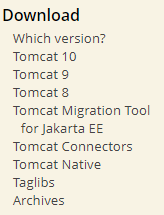
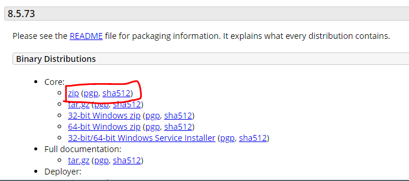
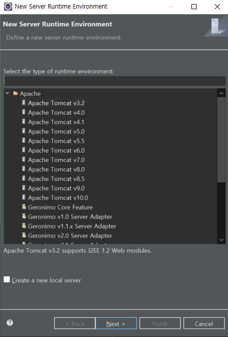
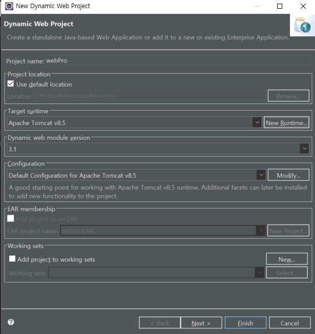
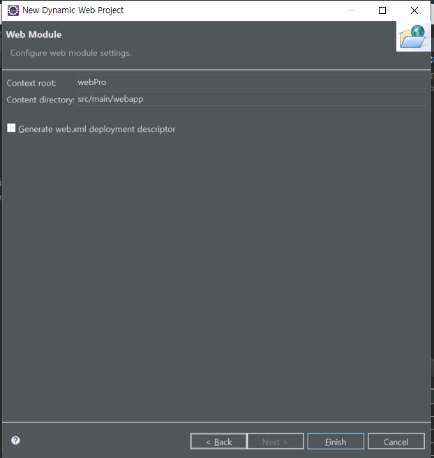
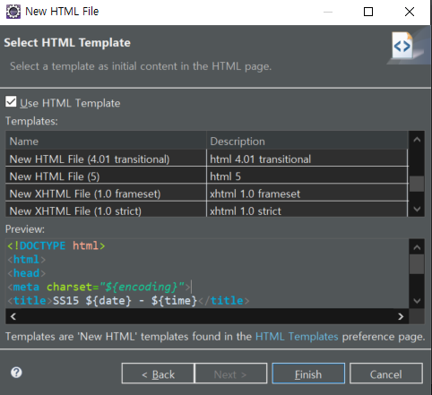
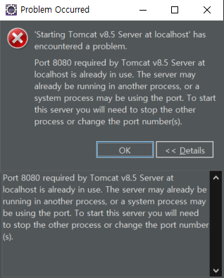

# 11.19

 * 1-1. 아래와 같이 출력되도록 코딩하세요.    
    ㄱ. 각 부서별 정렬 및 부서 소속 사원수 출력
   ㄴ. 각 부서별 소속된 사원 정보 출력
      ( 조건: sal 많이 받는 순으로 정렬해서 번호 붙여서 출력 )

  [실행 결과]

```
deptno(dname) 
10(ACCOUNTING) - 3명
  등수  empno   ename   sal
	1	7698	BLAKE	2850.0
    2	7499	ALLEN	1600.0
    3	7844	TURNER	1500.0
20(RESEARCH) - 3명 
	1	7698	BLAKE	2850.0
    2	7499	ALLEN	1600.0
    3	7844	TURNER	1500.0
30(SALES) - 6명
    1	7698	BLAKE	2850.0
    2	7499	ALLEN	1600.0
    3	7844	TURNER	1500.0
    4	7521	WARD	1250.0
    4	7654	MARTIN	1250.0
    6	7900	JAMES	950.0
40(OPERATIONS) - 0명
     사원이 존재하지 않습니다.
```


---

**[MVC 패턴]**

다음주 월요일 HTML 수업

CSS 수업 12월 1일 ~ 3일. 자바스크립트와 JQuery 를 함께 한다.


12월 6일, 13일 주 JSP

복습과 프로젝트 선정

마지막주 (20~24) DB 모델링

27일부터 순수 코딩

모델 - 뷰 - 컨트롤러

1. tbl_cstvsboard / seq_
2. BoardDTO
3. SQL Developer. DAO 질의/응답 오라클 ->BoardDAOImpl. SELECT(), INSERT() 단위테스트
4. JUnit 단위 테스트 모듈 (라이브러리)
5. BoardService 글쓰기 -> 로그기록/암호화/트랜잭션 처리
   - BoardDAOImpl INSERT (BoardDTO dto)

네이버 지식백과: https://terms.naver.com/entry.naver?docId=5714708&cid=42346&categoryId=42346


MVC 패턴에서 controller 는 중간역할이라 try-catch 하지 않는다.

**주입**

```java
Connection conn = DBConn.getConnection();
BoardDAO boardDao = new BoardDAOImpl(conn);
BoardService service = new BoardService(boardDao );
BoardController boardController = new BoardController(service );
```


**[녹화본]**

BoardService 생성

```java
```


BoardServiceTest 생성

```java
public class BoardServiceTest {
	
	@Test
	public void insertServiceTest() {
		Connection conn = DBConn.getConnection();
		BoardDAO dao = new BoardDAOImpl(conn); // conn DI
		BoardService boardService = new BoardService(dao); // dao DI
		
		// BoardController [게시글 입력 화면 -> BoardDTO dto]
		BoardDTO dto = new BoardDTO();
		dto.setWriter("홍길동");
		dto.setPwd("1234");
		dto.setEmail("hong@naver.com");
		dto.setTitle("두 번째 게시글");
		dto.setTag(0);
		dto.setContent("게시글 추가 내용...");
		
		int rowCount = boardService.insertService(dto);
		
		if (rowCount == 1) {
			System.out.println("> 서비스 -> DAO -> INSERT 성공!!!");
		}
	}
	
	@Test
	public void selectServiceTest() {
		Connection conn = DBConn.getConnection();
		BoardDAO dao = new BoardDAOImpl(conn);
		BoardService boardService = new BoardService(dao);
		
		ArrayList<BoardDTO> list = boardService.selectService();
		
		if (list == null) {
			System.out.println("> 게시글이 존재하지 않습니다.");
		} else {
			Iterator<BoardDTO> ir = list.iterator();
			
			while (ir.hasNext()) {
				BoardDTO boardDTO = ir.next();
				System.out.println(boardDTO);
			}
		}
	}
}
```


days03.board.BoardDAOImpl

```java
public class BoardDAOImpl implements BoardDAO {
	private Connection conn = null;
	private PreparedStatement pstmt = null;
	private ResultSet rs = null;

	// ������
	public BoardDAOImpl() {
	}

	// Connection ��ü�� �����ڸ� ���ؼ� ����. - �����ڸ� ���� ������ ���� (DI: Dependency Injection)
	public BoardDAOImpl(Connection conn) {
		this.conn = conn;
	}

	@Override
	public ArrayList<BoardDTO> select() throws SQLException {
		String sql = "SELECT seq, writer, pwd, email, title, writedate, readed, tag, content " + "FROM tbl_cstvsboard " + "ORDER BY seq DESC";

		pstmt = conn.prepareStatement(sql);
		rs = pstmt.executeQuery();
		ArrayList<BoardDTO> list = null;
		BoardDTO dto;
		int seq, readed, tag;
		String writer, pwd, email, title;
		Date writedate;
		String content;

		if (rs.next()) {
			list = new ArrayList<>();

			do {
				seq = rs.getInt("seq");
				writer = rs.getString("writer");
				pwd = rs.getString("pwd");
				email = rs.getString("email");
				title = rs.getString("title");
				writedate = rs.getDate("writedate");
				readed = rs.getInt("readed");
				tag = rs.getInt("tag");
				content = rs.getString("content");

				dto = new BoardDTO(seq, writer, pwd, email, title, writedate, readed, tag, content);
				list.add(dto);

			} while (rs.next());
		}
		rs.close();
		pstmt.close();

		return list;
	}

	@Override
	public int insert(BoardDTO dto) throws SQLException {
		String sql = "INSERT INTO tbl_cstvsboard (seq, writer, pwd, email, title, tag, content) "
				+ "VALUES (seq_tbl_cstvsBoard.NEXTVAL, ?, ?, ?, ?, ?, ?)";

		pstmt = conn.prepareStatement(sql);
		pstmt.setString(1, dto.getWriter());
		pstmt.setString(2, dto.getPwd());
		pstmt.setString(3, dto.getEmail());
		pstmt.setString(4, dto.getTitle());
		pstmt.setInt(5, dto.getTag());
		pstmt.setString(6, dto.getContent());

		int rowCount = pstmt.executeUpdate();

		return rowCount;
	}

	@Override
	public void increaseReaded(int seq) throws SQLException {
		String sql = "UPDATE TBL_CSTVSBOARD " + "SET readed = readed + 1 " + "WHERE seq = ? ";
		pstmt = conn.prepareStatement(sql);
		pstmt.setInt(1, seq);
		pstmt.executeUpdate();
		pstmt.close();

	}

	@Override
	public BoardDTO view(int seq) throws SQLException {
		String sql = "SELECT seq, writer, title, content, readed, writedate " + " FROM TBL_CSTVSBOARD "
				+ " WHERE seq = ?";
		pstmt = conn.prepareStatement(sql);
		pstmt.setInt(1, seq);
		ResultSet rs = pstmt.executeQuery();

		BoardDTO dto = null;

		if (rs.next()) {
			dto = new BoardDTO();
			dto.setSeq(rs.getInt("seq"));
			dto.setWriter(rs.getString("writer"));
			dto.setTitle(rs.getString("title"));
			dto.setContent(rs.getString("content"));
			dto.setReaded(rs.getInt("readed"));
			dto.setWritedate(rs.getDate("writedate"));
		}

		rs.close();
		pstmt.close();

		return dto;
	}

	@Override
	public int delete(String seq) throws SQLException {
		int rowCount = 0;
		String sql = "DELETE FROM TBL_CSTVSBOARD "
				+ "WHERE seq = ?";
		pstmt = conn.prepareStatement(sql);
		pstmt.setString(1, seq);
		rowCount = pstmt.executeUpdate();
		
		return rowCount;
	}
}
```

BoardDAOImplTest

```java
public class BoardDAOImplTest {

	@Test
	public void select_test() {
		Connection conn = DBConn.getConnection();
		BoardDAOImpl dao = new BoardDAOImpl(conn);
		
		try {			
			ArrayList<BoardDTO> list = dao.select();
			
			if (list == null) {
				System.out.println("> 게시글이 존재하지 않습니다.");
			} else {
				Iterator<BoardDTO> ir = list.iterator();
				
				while (ir.hasNext()) {
					BoardDTO boardDTO = ir.next();
					System.out.println(boardDTO);
				}
			}
		} catch (SQLException e) {
			e.printStackTrace();
		}
	}
}
```

BoardController 생성

```java
public class BoardController {
	private BoardService boardService = null;
	private Scanner scanner = null;
	private int selectedNumber;

	public BoardController() {
		scanner = new Scanner(System.in);
	}

	public BoardController(BoardService service) {
		this();
		this.boardService = service;
	}

	public void start() {
		while (true) {
			메뉴출력();
			메뉴선택();
			메뉴처리();
		}
	}
	
	private void 메뉴처리() {
		switch (selectedNumber) {
		case 1: // 새글
			break;
		case 2: // 목록
			break;
		case 3: // 보기
			break;
		case 4: // 수정
			break;
		case 5: // 삭제
			break;
		case 6: // 검색
			break;
		case 7: // 종료
			exit();
			break;
		default:
			break;
		}
	}
	
	private void exit() {
		DBConn.close();
		System.out.println("\t\t\t 프로그램 종료!!!");
		System.exit(-1);
	}

	private void 일시정지() {
		System.out.println(" \t\t 계속하려면 엔터치세요.");
		
		try {
			System.in.read();
			System.in.skip(System.in.available()); // 13, 10
		} catch (IOException e) {
			e.printStackTrace();
		}
	}

	private void 메뉴선택() {
		System.out.print("> 메뉴 선택하세요 ? ");
		selectedNumber = scanner.nextInt();
	}
	
	private void 메뉴출력() {
		String[] menus = {
				"새글", "목록", "보기", "수정", "삭제", "검색", "종료"
		};
		System.out.println("[ 메뉴 ]");
		
		for (int i = 0; i < menus.length; i++) {
			System.out.printf("%d. %s\t", i + 1, menus[i]);
		}
		System.out.println();
	}
}
```

days04.Ex02

```java
public class Ex02 {
	public static void main(String[] args) {
		Connection conn = DBConn.getConnection();
		BoardDAO boardDao = new BoardDAOImpl(conn);
		BoardService service = new BoardService(boardDao );
		BoardController boardController = new BoardController(service );
		
		boardController.start();
	}
}
```


**새글**

```
[ 메뉴 ]
1. 새글	2. 목록	3. 보기	4. 수정	5. 삭제	6. 검색	7. 종료	
> 메뉴 선택하세요 ? 1
> wrtier, pwd, email, title, tag, content 입력 ? 라이언,1111,lion@naver.com,이거어떻게하나요?,0,이클립스에서에러가났는데...
> 게시글 글쓰기 -> 로그 기록 작업...
> 게시글 글쓰기 -> 작성자의 포인트 1증가 작업...
> 새글 쓰기 완료!!!
 		 계속하려면 엔터치세요.
```

**목록**

```
[ 메뉴 ]
1. 새글	2. 목록	3. 보기	4. 수정	5. 삭제	6. 검색	7. 종료	
> 메뉴 선택하세요 ? 2
> 게시글 목록 조회 -> 로그 기록 작업...
			 게시판
-----------------------------------------------------------
글번호	글제목                                     	글쓴이	작성일       	조회수
-----------------------------------------------------------
7	이거어떻게하나요?                      라이언	2021-11-21	0
6	경록게시글                          문경록	2021-11-21	1
5	두 번째 게시글                       홍길동	2021-11-21	0
4	두 번째 게시글                       홍길동	2021-11-21	0
3	ù ��° �Խñ�                     ȫ�浿	2021-11-21	0
2	첫 번째 게시글                       홍길동	2021-11-19	0
1	첫 번째 게시글                       홍길동	2021-11-18	0
-----------------------------------------------------------
			 [1] 2 3 4 5 6 7 8 9 10 >
-----------------------------------------------------------
 		 계속하려면 엔터치세요.
```


**보기**

```
[ 메뉴 ]
1. 새글	2. 목록	3. 보기	4. 수정	5. 삭제	6. 검색	7. 종료	
> 메뉴 선택하세요 ? 3
> 게시글 번호(seq) 입력 ? 6
> 게시글 상세보기 -> 로그 기록 작업...
ㄱ. 글번호 : 6
ㄴ. 작성자 : 문경록
ㄷ. 조회수 : 1
ㄹ. 글제목 : 경록게시글
ㅁ. 글내용 : 경록게시글내용
ㅂ. 작성일 : 2021-11-21

 [수정] [삭제] [목록]
 		 계속하려면 엔터치세요.
[ 메뉴 ]
```

**[삭제]**

```
[ 메뉴 ]
1. 새글	2. 목록	3. 보기	4. 수정	5. 삭제	6. 검색	7. 종료	
> 메뉴 선택하세요 ? 5
> 삭제할 게시글의 번호 (seq) 입력 ? 3
> 게시글 삭제 -> 로그 기록 작업...
> (3) 삭제 완료!!!
 		 계속하려면 엔터치세요.
```

**Controller**

```java
private void 삭제하기() {

    // 검색 후 삭제할 글번호 (seq) 입력 ? 
    System.out.print("> 삭제할 게시글의 번호 (seq) 입력 ? "); // 1, 2, 3
    String seq = scanner.next();

    int rowCount = boardService.deleteService(seq);

    if (rowCount >= 1) {
        System.out.printf("> (%s) 삭제 완료!!!\n", seq);
    }
    일시정지();
}
```

**Service**

```java
public int deleteService(String seq) {
    int rowCount = 0;

    // 1. 로그 기록
    System.out.println("> 게시글 삭제 -> 로그 기록 작업...");

    // 2. DB DELETE
    BoardDTO dto = null;

    try {
        rowCount = boardDao.delete(seq);

    } catch (SQLException e) {
        e.printStackTrace();
    }
    return rowCount;
}
```

**DAOImpl**

```java
@Override
public int delete(String seq) throws SQLException {
    int rowCount = 0;
    String sql = "DELETE FROM TBL_CSTVSBOARD "
        + "WHERE seq = ?";

    pstmt = conn.prepareStatement(sql);
    pstmt.setString(1, seq);
    rowCount = pstmt.executeUpdate();

    return rowCount;
}
```


**DAO**

```java
public interface BoardDAO {
	
	// 1. 모든 게시글 목록 반환하는 메서드 선언
	ArrayList<BoardDTO> select() throws SQLException;

	// 2. 새로운 게시글 추가하는 메서드 선언
	int insert(BoardDTO dto) throws SQLException;

	// 3-1. 조회수 증가 메서드 선언
	void increaseReaded(int seq) throws SQLException;
	
	// 3-2. 해당 게시글 상세 보기 메서드 선언
	BoardDTO view(int seq) throws SQLException;

	// 4. 해당 게시글 삭제 메서드 선언
	int delete(String seq) throws SQLException;
}
```

# 11.22

1-1. 게시판 글쓰기 - 시퀀스 다이어그램( 객체 간의 상호 작용 )  설명하세요.

| 글목록화면           | 글쓰기화면 |
| -------------------- | ---------- |
| [글쓰기버튼] -> 클릭 | 작성자     |
|                      | 이메일     |
|                      | 내용       |
|                      | 비밀번호   |
|                      | 태그       |
|                      | [저장버튼] |

개발자 Sequence diagram 시퀀스 다이어그램

| days04.Ex01      |      | BoardController            | BoardService                          | BoardDAOImpl |
| ---------------- | ---- | -------------------------- | ------------------------------------- | ------------ |
| main()-> start() |      |                            |                                       |              |
|                  | ->   | 메뉴출력()                 |                                       |              |
|                  | ->   | 메뉴선택()                 |                                       |              |
|                  | ->   | 새글쓰기() ->              | insertService(dto)<br />-> 로그기록() | insert()     |
|                  |      |                            | <-                                    | 1/0          |
|                  |      | 메뉴출력()<br />->메뉴선택 |                                       |              |


2-1. [게시판 글수정 구현]하세요.

BoardController -> BoardService	BoardDAOImpl

[수정버튼]

1. 수정할 게시글의 글번호
2. 작성된 내용 출력.
3. 수정할 내용/이메일/제목/내용


[저장버튼] -> updateService()		update(dto)

**[수정]**

Controller

```java
private void 수정하기() {
    System.out.print(" > 수정할 게시글 seq, email, title, content 입력 ? ");  // 1,2,3
    int  seq =  Integer.parseInt( this.scanner.next() );

    BoardDTO dto = this.boardService.viewService( seq );
    // View(뷰) - 출력
    if ( dto == null) {
        System.out.println(" 해당 게시글은 존재하지 않습니다.");
        return;
    }

    // 해당 게시글 정보 출력
    System.out.println("ㄱ. 글번호 : " + seq );
    System.out.println("ㄴ. 작성자 : " + dto.getWriter() );
    System.out.println("ㄷ. 조회수 : " + dto.getReaded() );
    System.out.println("ㄹ. 글제목 : " + dto.getTitle() );
    System.out.println("ㅁ. 글내용 : " + dto.getContent() );
    System.out.println("ㅂ. 작성일 : " + dto.getWritedate() );

    //일시정지();

    String  email = this.scanner.next();      
    String  title = this.scanner.next();      
    String  content = this.scanner.next();

    dto = new BoardDTO();
    dto.setSeq(seq);
    dto.setEmail(email);
    dto.setTitle(title);
    dto.setContent(content);

    int rowCount = this.boardService.updateService( dto );
    if( rowCount >= 1 ) {
        System.out.printf(">  (%d) 수정 완료!!!\n", seq);
    }
    일시정지();
}
```

BoardDAOImpl

```java
@Override
public int update(BoardDTO dto) throws SQLException {
    String sql = 
        "UPDATE TBL_CSTVSBOARD "
        + "SET email = ?, title = ?, content = ? "
        + "WHERE seq = ? ";

    int rowCount = 0;

    pstmt = conn.prepareStatement(sql);
    pstmt.setString(1, dto.getEmail());
    pstmt.setString(2, dto.getTitle());
    pstmt.setString(3, dto.getContent());
    pstmt.setInt(4, dto.getSeq());
    rowCount = pstmt.executeUpdate();

    pstmt.close();
    return rowCount;
}
```

Service

```java
public int updateService(BoardDTO dto) {
    int rowCount = 0;

    // 1. 로그 기록
    System.out.println("> 게시글 수정 -> 로그 기록 작업...");

    // 2. DB UPDATE
    try {
        rowCount = boardDao.update(dto);

    } catch (SQLException e) {
        e.printStackTrace();
    }
    return rowCount;
}
```

**[검색]**

번째 라고 검색

```
			 게시판
-----------------------------------------------------------
글번호	글제목                                     	글쓴이	작성일       	조회수
-----------------------------------------------------------
5	두 번째 게시글                       홍길동	2021-11-21	0
1	첫 번째 게시글                       홍길동	2021-11-18	0
-----------------------------------------------------------
			 [1] 2 3 4 5 6 7 8 9 10 >
-----------------------------------------------------------
 		 계속하려면 엔터치세요.
```


**DAOImpl**

내코드

```java
@Override
public ArrayList<BoardDTO> search(int searchCondition, String searchWord) throws SQLException {

    // 검색조건: 제목(1), 내용(2), 작성자(3), 제목 + 내용(4)
    String sql = 
        "SELECT seq, writer, pwd, email, title, writedate, readed, tag, content " 
        + "FROM tbl_cstvsboard "
        + "WHERE regexp_like(title, ?, 'i') " 
        + "ORDER BY seq DESC";

    pstmt = conn.prepareStatement(sql);
    pstmt.setString(1, searchWord);
    rs = pstmt.executeQuery();
    ArrayList<BoardDTO> list = null;
    BoardDTO dto;
    int seq, readed, tag;
    String writer, pwd, email, title;
    Date writedate;
    String content;

    if (rs.next()) {
        list = new ArrayList<>();
        do {
            seq = rs.getInt("seq");
            writer = rs.getString("writer");
            pwd = rs.getString("pwd");
            email = rs.getString("email");
            title = rs.getString("title");
            writedate = rs.getDate("writedate");
            readed = rs.getInt("readed");
            tag = rs.getInt("tag");
            content = rs.getString("content");

            dto = new BoardDTO(seq, writer, pwd, email, title, writedate, readed, tag, content);
            list.add(dto);
        } while (rs.next());
    }
    rs.close();
    pstmt.close();

    return list;
}
```

```java
int sc = searchCondition;
sql += sc == 1 ? "title" : sc == 2 ? "content" : "writer";
```


쌤코드

```java
@Override
public ArrayList<BoardDTO> search(int searchCondition, String searchWord) throws SQLException {

    // 검색조건: 제목(1), 내용(2), 작성자(3), 제목 + 내용(4)
    String sql = 
        "SELECT seq, writer, pwd, email, title, writedate, readed, tag, content " 
        + "FROM tbl_cstvsboard ";

    switch (searchCondition) {
        case 1: // 제목
            sql += "WHERE regexp_like(title, ?, 'i') ";
            break;
        case 2: // 내용
            sql += "WHERE regexp_like(content, ?, 'i') ";
            break;
        case 3: // 작성자
            sql += "WHERE regexp_like(writer, ?, 'i') ";
            break;
        case 4: // 제목 + 내용
            sql += "WHERE regexp_like(title, ?, 'i') OR regexp_like(content, ?, 'i') ";
            break;
        default:
            break;
    }
    sql += "ORDER BY seq DESC";

    pstmt = conn.prepareStatement(sql);
    pstmt.setString(1, searchWord);

    if (searchCondition == 4) {
        pstmt.setString(2, searchWord);
    }

    rs = pstmt.executeQuery();
    ArrayList<BoardDTO> list = null;
    BoardDTO dto;
    int seq, readed, tag;
    String writer, pwd, email, title;
    Date writedate;
    String content;

    if (rs.next()) {
        list = new ArrayList<>();
        do {
            seq = rs.getInt("seq");
            writer = rs.getString("writer");
            pwd = rs.getString("pwd");
            email = rs.getString("email");
            title = rs.getString("title");
            writedate = rs.getDate("writedate");
            readed = rs.getInt("readed");
            tag = rs.getInt("tag");
            content = rs.getString("content");

            dto = new BoardDTO(seq, writer, pwd, email, title, writedate, readed, tag, content);
            list.add(dto);
        } while (rs.next());
    }
    rs.close();
    pstmt.close();

    return list;
}
```


**홍길동 게시글 넣기**

```sql
BEGIN 
    FOR i IN 1..357
    LOOP
        INSERT INTO tbl_cstvsboard (seq, writer, pwd, email, title, tag, content) 
        VALUES (seq_tbl_cstvsBoard.NEXTVAL, concat('홍길동', i), '1234', 'hong' || i || '@naver.com', 'TEST', 1, 'TEST CONT');    
    END LOOP;
    COMMIT;
END;
```

페이징처리

```sql
SELECT *
FROM (
    SELECT rownum no, t.*
    FROM (
        SELECT seq, title, writer, writedate, readed 
        FROM tbl_cstvsBoard 
        ORDER BY seq DESC
        ) t
    ) m
WHERE m.no BETWEEN ? AND ?;
```


**페이지 블럭**

```
현재 페이지 - 1 : [1]2 3 4 5 6 7 8 9 10  >
현재 페이지 - 2 : 1 [2]3 4 5 6 7 8 9 10  >
현재 페이지 - 3 : 1 2 [3]4 5 6 7 8 9 10  >
현재 페이지 - 4 : 1 2 3 [4]5 6 7 8 9 10  >
현재 페이지 - 5 : 1 2 3 4 [5]6 7 8 9 10  >
현재 페이지 - 6 : 1 2 3 4 5 [6]7 8 9 10  >
현재 페이지 - 7 : 1 2 3 4 5 6 [7]8 9 10  >
현재 페이지 - 8 : 1 2 3 4 5 6 7 [8]9 10  >
현재 페이지 - 9 : 1 2 3 4 5 6 7 8 [9]10  >
현재 페이지 - 10 : 1 2 3 4 5 6 7 8 9 [10] >
현재 페이지 - 11 : < [11]12 13 14 15 16 17 18 19 20  >
현재 페이지 - 12 : < 11 [12]13 14 15 16 17 18 19 20  >
현재 페이지 - 13 : < 11 12 [13]14 15 16 17 18 19 20  >
현재 페이지 - 14 : < 11 12 13 [14]15 16 17 18 19 20  >
현재 페이지 - 15 : < 11 12 13 14 [15]16 17 18 19 20  >
현재 페이지 - 16 : < 11 12 13 14 15 [16]17 18 19 20  >
현재 페이지 - 17 : < 11 12 13 14 15 16 [17]18 19 20  >
현재 페이지 - 18 : < 11 12 13 14 15 16 17 [18]19 20  >
현재 페이지 - 19 : < 11 12 13 14 15 16 17 18 [19]20  >
현재 페이지 - 20 : < 11 12 13 14 15 16 17 18 19 [20] >
현재 페이지 - 21 : < [21]22 23 24 25 26 27 28 29 30  >
현재 페이지 - 22 : < 21 [22]23 24 25 26 27 28 29 30  >
현재 페이지 - 23 : < 21 22 [23]24 25 26 27 28 29 30  >
현재 페이지 - 24 : < 21 22 23 [24]25 26 27 28 29 30  >
현재 페이지 - 25 : < 21 22 23 24 [25]26 27 28 29 30  >
현재 페이지 - 26 : < 21 22 23 24 25 [26]27 28 29 30  >
현재 페이지 - 27 : < 21 22 23 24 25 26 [27]28 29 30  >
현재 페이지 - 28 : < 21 22 23 24 25 26 27 [28]29 30  >
현재 페이지 - 29 : < 21 22 23 24 25 26 27 28 [29]30  >
현재 페이지 - 30 : < 21 22 23 24 25 26 27 28 29 [30] >
현재 페이지 - 31 : < [31]32 33 34 35 36 
현재 페이지 - 32 : < 31 [32]33 34 35 36 
현재 페이지 - 33 : < 31 32 [33]34 35 36 
현재 페이지 - 34 : < 31 32 33 [34]35 36 
현재 페이지 - 35 : < 31 32 33 34 [35]36 
현재 페이지 - 36 : < 31 32 33 34 35 [36]
```

days05.Ex02

```java
int currentPage = 2; // 현재 페이지 번호
int numberPerPage = 10; // 한 페이지 출력할 게시글 수
int numberOfPageBlock = 10; // 페이징 블럭 수
int totalRecords = 354; // 총 레코드 수
int totalPages = (int) Math.ceil((double) totalRecords/numberPerPage); // 총 페이지 수 

int startOfPageBlock = 1;
int endOfPageBlock = 1;

for (int i = 1; i <= totalPages; i++) {
    startOfPageBlock = (i - 1) / numberOfPageBlock * numberOfPageBlock + 1;
    endOfPageBlock = startOfPageBlock + numberOfPageBlock - 1;

    if (endOfPageBlock > totalPages) endOfPageBlock = totalPages;
    System.out.printf("현재 페이지 - %d : ", i, startOfPageBlock, endOfPageBlock);

    if (startOfPageBlock != 1) System.out.print("< ");

    for (int j = startOfPageBlock; j <= endOfPageBlock; j++) {
        System.out.printf(i==j ? "[%d]" : "%d ", j);
    }

    if (endOfPageBlock != totalPages) System.out.print(" >");

    System.out.println();
```


```java
@Override
public int getTotalRecords() throws SQLException {
    String sql = "SELECT count(*) totalRecords "
        + "FROM tbl_cstvsBoard"; 

    int totalRecords = 0;

    this.pstmt = this.conn.prepareStatement(sql);
    rs = this.pstmt.executeQuery();

    if (rs.next()) totalRecords = rs.getInt(1);

    this.pstmt.close();
    rs.close();

    return totalRecords;
}
```


**[페이지블럭]**

```
[ 메뉴 ]
1. 새글	2. 목록	3. 보기	4. 수정	5. 삭제	6. 검색	7. 종료	
> 메뉴 선택하세요 ? 2
> 현재 페이지 (currentPage) 입력 ? 9
> 게시글 목록 조회 -> 로그 기록 작업...
			 게시판
-----------------------------------------------------------
글번호	글제목                                     	글쓴이	작성일       	조회수
-----------------------------------------------------------
284	TEST                           홍길동277	2021-11-22	0
283	TEST                           홍길동276	2021-11-22	0
282	TEST                           홍길동275	2021-11-22	0
281	TEST                           홍길동274	2021-11-22	0
280	TEST                           홍길동273	2021-11-22	0
279	TEST                           홍길동272	2021-11-22	0
278	TEST                           홍길동271	2021-11-22	0
277	TEST                           홍길동270	2021-11-22	0
276	TEST                           홍길동269	2021-11-22	0
275	TEST                           홍길동268	2021-11-22	0
-----------------------------------------------------------
			1 2 3 4 5 6 7 8 [9]10  >
-----------------------------------------------------------
 		 계속하려면 엔터치세요.
```

```
[ 메뉴 ]
1. 새글	2. 목록	3. 보기	4. 수정	5. 삭제	6. 검색	7. 종료	
> 메뉴 선택하세요 ? 2
> 현재 페이지 (currentPage) 입력 ? 18
> 게시글 목록 조회 -> 로그 기록 작업...
			 게시판
-----------------------------------------------------------
글번호	글제목                                     	글쓴이	작성일       	조회수
-----------------------------------------------------------
194	TEST                           홍길동187	2021-11-22	0
193	TEST                           홍길동186	2021-11-22	0
192	TEST                           홍길동185	2021-11-22	0
191	TEST                           홍길동184	2021-11-22	0
190	TEST                           홍길동183	2021-11-22	0
189	TEST                           홍길동182	2021-11-22	0
188	TEST                           홍길동181	2021-11-22	0
187	TEST                           홍길동180	2021-11-22	0
186	TEST                           홍길동179	2021-11-22	0
185	TEST                           홍길동178	2021-11-22	0
-----------------------------------------------------------
			< 11 12 13 14 15 16 17 [18]19 20  >
-----------------------------------------------------------
 		 계속하려면 엔터치세요.
```

```
[ 메뉴 ]
1. 새글	2. 목록	3. 보기	4. 수정	5. 삭제	6. 검색	7. 종료	
> 메뉴 선택하세요 ? 2
> 현재 페이지 (currentPage) 입력 ? 32
> 게시글 목록 조회 -> 로그 기록 작업...
			 게시판
-----------------------------------------------------------
글번호	글제목                                     	글쓴이	작성일       	조회수
-----------------------------------------------------------
54	TEST                           홍길동47	2021-11-22	0
53	TEST                           홍길동46	2021-11-22	0
52	TEST                           홍길동45	2021-11-22	0
51	TEST                           홍길동44	2021-11-22	0
50	TEST                           홍길동43	2021-11-22	0
49	TEST                           홍길동42	2021-11-22	0
48	TEST                           홍길동41	2021-11-22	0
47	TEST                           홍길동40	2021-11-22	0
46	TEST                           홍길동39	2021-11-22	0
45	TEST                           홍길동38	2021-11-22	0
-----------------------------------------------------------
			< 31 [32]33 34 35 36 37 
-----------------------------------------------------------
 		 계속하려면 엔터치세요.
```


```java
String pagingBlock = boardService.pageService(
    currentPage
    , numberPerPage
    , numberOfPageBlock);
System.out.println(pagingBlock);
```


**검색 페이징블록**

```
[ 메뉴 ]
1. 새글	2. 목록	3. 보기	4. 수정	5. 삭제	6. 검색	7. 종료	
> 메뉴 선택하세요 ? 6
> 검색 현재 페이지 (currentPage) 입력 ? 1
> 검색 조건 : 제목(1), 내용(2), 작성자(3), 제목+내용(4) 선택 ? 1
> 검색어 입력 ? 번째
> 게시글 검색 -> 로그 기록 작업...
			 게시판
-----------------------------------------------------------
글번호	글제목                                     	글쓴이	작성일       	조회수
-----------------------------------------------------------
5	두 번째 게시글                       홍길동	2021-11-21	0
1	첫 번째 게시글                       홍길동	2021-11-18	1
-----------------------------------------------------------
			[1]
-----------------------------------------------------------
 		 계속하려면 엔터치세요.
```


**Controller**

```java
private void 검색하기() {
    System.out.print("> 검색 현재 페이지 (currentPage) 입력 ? ");
    currentPage = scanner.nextInt();

    // 검색조건: 제목(1), 내용(2), 작성자(3), 제목 + 내용(4)
    int searchCondition; // 검색조건
    System.out.print("> 검색 조건 : 제목(1), 내용(2), 작성자(3), 제목+내용(4) 선택 ? ");
    searchCondition = scanner.nextInt();

    //		scanner.skip("\r\n");
    System.out.print("> 검색어 입력 ? ");
    String searchWord = scanner.next();

    ArrayList<BoardDTO> list = boardService.searchService(currentPage, numberPerPage, searchCondition, searchWord);

    // View (뷰) - 출력
    System.out.println("\t\t\t 게시판");
    System.out.println("-----------------------------------------------------------");
    System.out.printf("%s\t%-40s\t%s\t%-10s\t%s\n",
                      "글번호", "글제목", "글쓴이", "작성일", "조회수");
    System.out.println("-----------------------------------------------------------");

    Iterator<BoardDTO> ir = list.iterator();

    while (ir.hasNext()) {
        BoardDTO dto = ir.next();

        System.out.printf("%d\t%-30s %s\t%-10s\t%d\n",
                          dto.getSeq(), dto.getTitle(), dto.getWriter(), dto.getWritedate(), dto.getReaded());
    }

    System.out.println("-----------------------------------------------------------");
    //		System.out.println("\t\t\t [1] 2 3 4 5 6 7 8 9 10 >"); // 페이징블럭

    String pagingBlock = boardService.pageService(
        currentPage
        , numberPerPage
        , numberOfPageBlock
        , searchCondition
        , searchWord);
    System.out.println(pagingBlock);

    System.out.println("-----------------------------------------------------------");

    일시정지();
}
```

**Service**

```java
public String pageService(int currentPage, int numberPerPage, int numberOfPageBlock, int searchCondition,
                          String searchWord) {
    String pagingBlock = "\t\t\t";
    int totalRecords, totalPages = 0;

    try {
        totalRecords = boardDao.getTotalRecords(searchCondition, searchWord);
        totalPages = (int) Math.ceil((double) totalRecords/numberPerPage); // 총 페이지 수 
    } catch (SQLException e) {
        e.printStackTrace();
    } // 총 레코드 수

    int startOfPageBlock = 1;
    int endOfPageBlock = 1;

    startOfPageBlock = (currentPage - 1) / numberOfPageBlock * numberOfPageBlock + 1;
    endOfPageBlock = startOfPageBlock + numberOfPageBlock - 1;

    if (endOfPageBlock > totalPages) endOfPageBlock = totalPages;
    if (startOfPageBlock != 1) pagingBlock += "< ";

    for (int j = startOfPageBlock; j <= endOfPageBlock; j++) {
        pagingBlock += String.format(currentPage == j ? "[%d]" : "%d ", j);
    }

    if (endOfPageBlock != totalPages) pagingBlock += " >";
    return pagingBlock;
}
```

**DAOImpl**

```java
@Override
public int getTotalRecords(int searchCondition, String searchWord) throws SQLException {
    String sql = "SELECT count(*) totalRecords "
        + "FROM tbl_cstvsBoard "; 

    switch (searchCondition) {
        case 1: // 제목
            sql += " WHERE REGEXP_LIKE( title , ?, 'i' ) ";
            break;
        case 2: // 내용
            sql += " WHERE REGEXP_LIKE( content , ?, 'i' ) ";
            break;
        case 3: // 작성자
            sql += " WHERE REGEXP_LIKE( writer , ?, 'i' ) ";
            break;
        case 4: // 제목 + 내용
            sql += " WHERE REGEXP_LIKE( title , ?, 'i' ) OR REGEXP_LIKE( content , ?, 'i' ) ";
            break;
    }


    int totalRecords = 0;

    this.pstmt = this.conn.prepareStatement(sql);

    if (searchCondition == 4) {
        this.pstmt.setString(1, searchWord); //
        this.pstmt.setString(2, searchWord); //
    } else {
        this.pstmt.setString(1, searchWord); //
    }

    rs = this.pstmt.executeQuery();

    if (rs.next()) totalRecords = rs.getInt(1);

    this.pstmt.close();
    rs.close();

    return totalRecords;
}
```


**[CallableStatement]**

시퀀스

```sql
DROP SEQUENCE seq_dept;
CREATE SEQUENCE seq_dept
INCREMENT BY 10
START WITH 60
NOCACHE;
```

부서 테이블 추가 저장 프로시저

```sql
CREATE OR REPLACE PROCEDURE up_insdept (
    pdname dept.dname%type
    , ploc dept.loc%type
)
IS
BEGIN
    INSERT INTO dept VALUES (seq_dept.NEXTVAL, pdname, ploc);
    COMMIT;
END;
```

자바

```
> 1개 부서 추가 성공!!!
```

```java
String sql = "{call UP_INSDEPT(?, ?)}";
String pdname = "XX";
String ploc = "YY";

Connection conn = null;
CallableStatement cstmt = null;
int rowCount = 0;

try {
    conn = DBConn.getConnection();
    cstmt = conn.prepareCall(sql);
    cstmt.setString(1, pdname);
    cstmt.setString(2, ploc);
    rowCount = cstmt.executeUpdate();

    if (rowCount == 1) {
        System.out.println("> 1개 부서 추가 성공!!!");
    }
} catch (SQLException e) {
    e.printStackTrace();
} finally {
    try {
        cstmt.close();
    } catch (SQLException e) {
        e.printStackTrace();
    }
    DBConn.close();
}
```

오전: JDBC

# 11.23

**복습**

1-1. 아래 ( ㄱ,ㄴ,ㄷ ) 조건을 토대로 ArrayList`<BoardDTO>` 를 반환하는 메서드를 구현하세요.
ㄱ. 페이징당 출력 게시글 수 : 15
ㄴ. 총 레코드 수 : 767
ㄷ. 현재 페이지  : 73


```
BoardDTO [seq=64, writer=홍길동57, pwd=, email=, title=TEST, writedate=2021-11-22, readed=0, tag=0, content=TEST CONT]
BoardDTO [seq=63, writer=홍길동56, pwd=, email=, title=TEST, writedate=2021-11-22, readed=0, tag=0, content=TEST CONT]
BoardDTO [seq=62, writer=홍길동55, pwd=, email=, title=TEST, writedate=2021-11-22, readed=0, tag=0, content=TEST CONT]
BoardDTO [seq=61, writer=홍길동54, pwd=, email=, title=TEST, writedate=2021-11-22, readed=0, tag=0, content=TEST CONT]
BoardDTO [seq=60, writer=홍길동53, pwd=, email=, title=TEST, writedate=2021-11-22, readed=0, tag=0, content=TEST CONT]
BoardDTO [seq=59, writer=홍길동52, pwd=, email=, title=TEST, writedate=2021-11-22, readed=0, tag=0, content=TEST CONT]
BoardDTO [seq=58, writer=홍길동51, pwd=, email=, title=TEST, writedate=2021-11-22, readed=0, tag=0, content=TEST CONT]
BoardDTO [seq=57, writer=홍길동50, pwd=, email=, title=TEST, writedate=2021-11-22, readed=0, tag=0, content=TEST CONT]
BoardDTO [seq=56, writer=홍길동49, pwd=, email=, title=TEST, writedate=2021-11-22, readed=0, tag=0, content=TEST CONT]
BoardDTO [seq=55, writer=홍길동48, pwd=, email=, title=TEST, writedate=2021-11-22, readed=0, tag=0, content=TEST CONT]
BoardDTO [seq=54, writer=홍길동47, pwd=, email=, title=TEST, writedate=2021-11-22, readed=0, tag=0, content=TEST CONT]
BoardDTO [seq=53, writer=홍길동46, pwd=, email=, title=TEST, writedate=2021-11-22, readed=0, tag=0, content=TEST CONT]
BoardDTO [seq=52, writer=홍길동45, pwd=, email=, title=TEST, writedate=2021-11-22, readed=0, tag=0, content=TEST CONT]
BoardDTO [seq=51, writer=홍길동44, pwd=, email=, title=TEST, writedate=2021-11-22, readed=0, tag=0, content=TEST CONT]
BoardDTO [seq=50, writer=홍길동43, pwd=, email=, title=TEST, writedate=2021-11-22, readed=0, tag=0, content=TEST CONT]
```


```java
String sql = "SELECT * "
    + "FROM ( "
    + "		SELECT rank() OVER(ORDER BY seq DESC) AS rank, b.* "
    + "		FROM tbl_cstvsBoard b) "
    + "WHERE rank BETWEEN ? AND ? ";

int perPage = 15;
int thisPage = 21;
int start = (thisPage - 1) * perPage + 1;
int end = start + perPage - 1;

Connection conn = DBConn.getConnection();
PreparedStatement st = conn.prepareStatement(sql);
st.setInt(1, start);
st.setInt(2, end);
ResultSet rs = st.executeQuery();
BoardDTO dto;
ArrayList<BoardDTO> list = null;

if (rs.next()) {
    list = new ArrayList<>();

    do {
        int seq = rs.getInt("seq");
        String writer = rs.getString("writer");
        String title = rs.getString("title");
        Date writedate = rs.getDate("writedate");
        int readed = rs.getInt("readed");
        String content = rs.getString("content");
        String pwd = "";
        String email = "";
        int tag = 0;

        dto = new BoardDTO(seq, writer, pwd, email, title, writedate, readed, tag, content);
        list.add(dto);
    } while (rs.next());
}

rs.close();
st.close();
DBConn.close();

for (BoardDTO d : list) {
    System.out.println(d);
}
```

start, end 구하기

```java
int perPage = 15;
int totRec = 767;
int thisPage = 73;

int start = (thisPage - 1) * perPage + 1;
int end = start + perPage - 1;
```

2-1. 위의 문제에 해당하는 페이징 블럭을 처리하는 메서드를 구현하세요.
예) 현재 페이지가 23페이지라고 가정하면 
    페이징 블럭      < 16 17 18 19 20 21 22 [23] 24 25 26 27 28 29 30 >


```
16 17 18 19 20 21 22 [23] 24 25 26 27 28 29 30 
```


```java
int perPage = 15;
int totRec = 767;
int thisPage = 23;

int tab = (thisPage - 1) / perPage + 1;
int start = (tab - 1) * perPage + 1;
int end = start + perPage - 1;

for (int i = start; i <= end; i++) {
    System.out.printf(thisPage == i ? "[%d] " : "%d ", i);
}
```


3-1. emp 테이블에 사원을 추가하는 up_insertemp 저장 프로시저를 작성하고
CallableStatement 를 사용하여 사원을 추가하는 메서드를 구현하세요.

```sql
CREATE OR REPLACE PROCEDURE up_insertEmp (
    pempno      emp.empno%TYPE
    , pename    emp.ename%TYPE
    , pjob      emp.job%TYPE
)
IS
BEGIN
    INSERT INTO emp (empno, ename, job, hiredate, deptno)
    VALUES (pempno, pename, pjob, sysdate, 20);
END;
```

```
1 변경
```


```java
String sql = "{call up_insertEmp(?, ?, ?)}";

Connection conn = DBConn.getConnection();
CallableStatement st = conn.prepareCall(sql);
st.setInt(1, 7777);
st.setString(2, "춘식이");
st.setString(3, "대표");
int rowCount = st.executeUpdate();

System.out.printf("%d 변경", rowCount);
```


Q. 프로시저는 업데이트를 쓰나?

A. 


---

저장 프로시저명 : up_updatedept


```sql
CREATE OR REPLACE PROCEDURE up_updateDept (
    pdeptno dept.deptno%type
    , pdname dept.dname%type := null
    , pLoc dept.loc%type DEFAULT NULL
) 
IS 
BEGIN 
    IF pdname IS NULL THEN
        UPDATE dept
        SET loc = ploc
        WHERE deptno = pdeptno;
    ELSIF ploc IS NULL THEN
        UPDATE dept
        SET dname = pdname
        WHERE deptno = pdeptno;
    ELSE
        UPDATE dept
        SET dname = pdname, loc = ploc
        WHERE deptno = pdeptno;
    END IF;
    COMMIT;
END;
```

> 원래값을 IS 에서 받아서 넣는 것이 더 좋은 코드이다.

복습: 동적쿼리

**문제**

1. 저장 프로시저 작성 
2. CallableStatement

```sql
CREATE OR REPLACE PROCEDURE up_deleteDept (
    pdeptno dept.deptno%TYPE
)
IS
BEGIN
    DELETE FROM dept 
    WHERE deptno = pdeptno;
    COMMIT;
END;
```


```java
String sql = "{call up_deleteDept(?)}";
int deptno = 60;
Connection conn = DBConn.getConnection();
CallableStatement st = null;
try {
    st = conn.prepareCall(sql);
    st.setInt(1, deptno);
    int rowCount = st.executeUpdate();

    if (rowCount == 1) {
        System.out.println("> 부서 삭제 성공!!!");
    }
} catch (SQLException e) {
    e.printStackTrace();
} finally {
    try {
        st.close();
    } catch (SQLException e) {
        e.printStackTrace();
    }
    DBConn.close();
}
```


**[커서로 반환받기]**

**내 코드**

```
ALLEN
WARD
MARTIN
BLAKE
TURNER
JAMES
```

SQL

```sql
CREATE OR REPLACE FUNCTION up_selectEmp (
    pdeptno emp.deptno%TYPE
)
RETURN sys_refCursor
IS
    vcursor SYS_REFCURSOR;
BEGIN
    OPEN vcursor FOR 
    SELECT ename, job 
    FROM emp
    WHERE deptno = pdeptno;
    
    RETURN vcursor;
END;
```

JAVA

```java
String proc_call = "{? = call up_selectEmp(?)}";

Connection conn = DBConn.getConnection();
CallableStatement st = conn.prepareCall(proc_call);
st.registerOutParameter(1, OracleTypes.CURSOR);
st.setInt(2, 30);
st.executeQuery();
ResultSet rs = (ResultSet) st.getObject(1);

while (rs.next()) {
    System.out.println(rs.getString(1));
}
```

**Statement st.**

- `registerOutParameter`
- `getObject` ResultSet 으로 형변환한다.

복습

1. OPEN FOR 구문
2. 동적쿼리
3. OUT
4. SYS_REFCURSOR 타입


**쌤 코드**

```
> 부서번호 입력 ? 30
EmpDTO [empno=7499, mgr=0, deptno=30, ename=ALLEN, job=null, hiredate=1981-02-20, sal=0.0, comm=0.0]
EmpDTO [empno=7521, mgr=0, deptno=30, ename=WARD, job=null, hiredate=1981-02-22, sal=0.0, comm=0.0]
EmpDTO [empno=7654, mgr=0, deptno=30, ename=MARTIN, job=null, hiredate=1981-09-28, sal=0.0, comm=0.0]
EmpDTO [empno=7698, mgr=0, deptno=30, ename=BLAKE, job=null, hiredate=1981-05-01, sal=0.0, comm=0.0]
EmpDTO [empno=7844, mgr=0, deptno=30, ename=TURNER, job=null, hiredate=1981-09-08, sal=0.0, comm=0.0]
EmpDTO [empno=7900, mgr=0, deptno=30, ename=JAMES, job=null, hiredate=1981-12-03, sal=0.0, comm=0.0]
```


SQL

```sql
CREATE OR REPLACE PROCEDURE up_selectEmp (
    pdeptno emp.deptno%TYPE
    , pCursor OUT SYS_REFCURSOR
)
IS
    vsql varchar2(1000);
BEGIN
    vsql := 'SELECT * ';
    vsql := vsql || 'FROM emp ';
    vsql := vsql || 'WHERE deptno = :pdeptno ';
    
    OPEN pCursor FOR vsql
    USING pdeptno;
END;
```

자바 

```java
System.out.print("> 부서번호 입력 ? ");
Scanner scanner = new Scanner(System.in);
int pdeptno = scanner.nextInt();

String sql = "{CALL UP_SELECTEMP(?, ?)}";

Connection conn = null;
CallableStatement cstmt = null;
ResultSet rs = null;
ArrayList<EmpDTO> list = null;
EmpDTO dto = null;

conn = DBConn.getConnection();
try {
    cstmt = conn.prepareCall(sql);
    cstmt.setInt(1, pdeptno);

    // OUT 출력용 매개변수 선언 + 커서 자료형
    cstmt.registerOutParameter(2, OracleTypes.CURSOR);
    cstmt.executeQuery();
    rs = (ResultSet) cstmt.getObject(2);

    if (rs.next()) {
        list = new ArrayList<>();

        do {
            dto = new EmpDTO();
            dto.setEmpno(rs.getInt("empno"));
            dto.setEname(rs.getString("ename"));
            dto.setDeptno(rs.getInt("deptno"));
            dto.setHiredate(rs.getDate("hiredate"));

            list.add(dto);
        } while (rs.next());
    }

} catch (SQLException e) {
    e.printStackTrace();
} finally {
    try {
        cstmt.close();
    } catch (SQLException e) {
        e.printStackTrace();
    }
}

DBConn.close();

if (list == null) {
    System.out.println("> 사원 존재 X");
} else {
    Iterator<EmpDTO> ir = list.iterator();

    while (ir.hasNext()) {
        dto = ir.next();
        System.out.println(dto);
    }
}
```


Q. USING 과 WHERE 의 차이점?

A.


 * ID 중복체크하는 저장프로시저: up_EmpNoCheck
 * ? 파라미터는 체크할 ID (empno) 값
 * ? 출력용 파라미터 사용가능하다면 0, 1
 * CallableStatement
 * ID == empno

SQL

```sql
CREATE OR REPLACE PROCEDURE up_empNoCheck (
    pempno emp.empno%type
    , pempnocheck OUT NUMBER
)
IS
BEGIN
    SELECT count(*) INTO pempnocheck
    FROM emp
    WHERE empno = pempno;
END;
```


**사원번호 사용가능여부 확인**

```
> 중복 체크할 ID (empno) 를 입력 ? 7777
 사용가능한 empno(ID)입니다.
```


```java
Scanner scanner = new Scanner(System.in);

System.out.print("> 중복 체크할 ID (empno) 를 입력 ? ");
int pempno = scanner.nextInt(); // 7369

Connection conn = null;
CallableStatement cstmt = null;
conn = DBConn.getConnection();
String sql = "{CALL UP_EMPNOCHECK(?, ?)}";

try {
    cstmt = conn.prepareCall(sql);
    cstmt.setInt(1, pempno);
    cstmt.registerOutParameter(2, OracleTypes.INTEGER);
    cstmt.executeQuery();
    int empnoCheck = (int) cstmt.getObject(2);

    if (empnoCheck == 0) {
        System.out.println(" 사용가능한 empno(ID)입니다.");
    } else {
        System.out.println(" 이미 존재하는 empno(ID)입니다.");
    }
} catch (SQLException e) {
    e.printStackTrace();
} finally {
    try {
        cstmt.close();
    } catch (SQLException e) {
        e.printStackTrace();
    }
    DBConn.close();
}
```


**로그인**

 * [로그인 화면(페이지)]
 * 아이디 :   [ ] empno
 * 비밀번호 :  [ ] ename
 * [로그인] [회원가입]
 * 
 * up_emplogon (empno, ename, ?)
 * ID/PWD 로그인 성공 = 1
 * ID X		   실패 = 0
 * ID.PWD X	   실패 = -1

SQL

```sql
 CREATE OR REPLACE PROCEDURE up_emplogon (
    pEmpno      emp.empno%TYPE -- ID 
    , pEname    emp.ename%TYPE -- PWD
    , pLogonCheck OUT NUMBER   -- 1 (성공) -1, 0 (실패)
 )
 IS
    vEmpnoExit NUMBER(1);
    vEname      emp.ename%TYPE;
 BEGIN
    SELECT count(*) INTO vEmpnoExit
    FROM emp
    WHERE empno = pEmpno;
    
    IF vEmpnoExit = 0 THEN -- ID (empno) 가 존재하지 않는 경우: 0
        pLogonCheck := 0;
    ELSE -- ID 는 존재한다..
        SELECT ename INTO vEname
        FROM emp
        WHERE empno = pEmpno;
        
        IF vEname = pEname THEN -- 로그인 성공 ID/PWD
            pLogonCheck := 1;
        ELSE -- ID 는 존재하지만 PWD 가 잘못된 경우
            pLogonCheck := -1;
        END IF;
    END IF;
 END;
```

JAVA

```
> 로그인 체크할 ID(empno), PWD(ename) 입력 ? 7369 KENIK
> 로그인 실패 : empno(ID) 는 존재하지만 ename(PWD) 가 잘못되었습니다.
```

```
> 로그인 체크할 ID(empno), PWD(ename) 입력 ? 7369 SMITH
> 로그인 성공!!!
```

```
> 로그인 체크할 ID(empno), PWD(ename) 입력 ? 7777 SMITH
> 로그인 실패 : empno(ID) 가 존재하지 않습니다.
```


```java
System.out.print("> 로그인 체크할 ID(empno), PWD(ename) 입력 ? "); // 7369 SMITH
Scanner scanner = new Scanner(System.in);
int pempno = scanner.nextInt();
String pename = scanner.next();

// Ex05.java 그대로 복사.. 후 수정..
Connection conn = null;
CallableStatement cstmt = null;

int logonCheck = 0;

conn = DBConn.getConnection();
String sql = "{CALL up_emplogon(?, ?, ?)}";

try {
    cstmt = conn.prepareCall(sql);
    cstmt.setInt(1, pempno);
    cstmt.setString(2, pename);
    cstmt.registerOutParameter(3, OracleTypes.INTEGER);
    cstmt.executeQuery();
    logonCheck = (int) cstmt.getObject(3);

    if (logonCheck == 0) {
        System.out.println("> 로그인 실패 : empno(ID) 가 존재하지 않습니다.");
    } else if (logonCheck == -1) {
        System.out.println("> 로그인 실패 : empno(ID) 는 존재하지만 ename(PWD) 가 잘못되었습니다.");
    } else if (logonCheck == 1) {
        System.out.println("> 로그인 성공!!!");
    }
} catch (SQLException e) {
    e.printStackTrace();
} finally {
    try {
        cstmt.close();
    } catch (SQLException e) {
        e.printStackTrace();
    }
    DBConn.close();
}
```


**[트랜잭션 처리]**

모두가 되거나 모두가 안되는 처리.

 * 트랜잭션 처리
 * COMMIT, ROLLBACK, SAVEPOINT
 * 예) 계좌이체
 * 		ㄱ. A 계좌 이체금액 인출 50000 -> 10000 UPDATE 40000
 * 		ㄴ. B 계좌 		   1000 + 10000   UPDATE 11000


**[아파치]**

https://apache.org/

**APACHE PROJECT LIST**

- [Tomcat](http://tomcat.apache.org/)



Tomcat 8 클릭 - 8.5.73

**Binary Distributions**

- Core:
  - [zip](https://dlcdn.apache.org/tomcat/tomcat-8/v8.5.73/bin/apache-tomcat-8.5.73.zip) ([pgp](https://downloads.apache.org/tomcat/tomcat-8/v8.5.73/bin/apache-tomcat-8.5.73.zip.asc), [sha512](https://downloads.apache.org/tomcat/tomcat-8/v8.5.73/bin/apache-tomcat-8.5.73.zip.sha512))

이클립스가 실행될 때 톰캣을 플러그인해서 사용




```sql
CREATE OR REPLACE PROCEDURE UP_INSERTDEPT (
    pDeptno      dept.deptno%TYPE 
    , pDname    dept.dname%TYPE 
    , pLoc      dept.loc%TYPE
 )
 IS
 BEGIN
    INSERT INTO dept VALUES (pDeptno, pDname, pLoc);
 END;
```


트랜잭션 처리 전

```java
String sql = "{CALL UP_INSERTDEPT(?, ?, ?)}";

Connection conn = null;
CallableStatement cstmt = null;
conn = DBConn.getConnection();

try {
    // A
    cstmt = conn.prepareCall(sql);
    cstmt.setInt(1, 70);
    cstmt.setString(2, "A");
    cstmt.setString(3, "B");
    int rowCount = cstmt.executeUpdate();

    if (rowCount == 1) {
        System.out.println("70, A, B 부서 추가 성공!!!");
    }

    // B
    cstmt = conn.prepareCall(sql);
    cstmt.setInt(1, 70);
    cstmt.setString(2, "C");
    cstmt.setString(3, "D");
    rowCount = cstmt.executeUpdate();

    if (rowCount == 1) {
        System.out.println("70, C, D 부서 추가 성공!!!");
    }
} catch (SQLException e) {
    e.printStackTrace();
} finally {
    try {
        cstmt.close();
    } catch (SQLException e) {
        e.printStackTrace();
    }
}
DBConn.close();
```

> C, D 가 들어갈 때 에러가 나도 A, B 는 들어가진다.

트랜잭션 처리 후

```java
String sql = "{CALL UP_INSERTDEPT(?, ?, ?)}";

Connection conn = null;
CallableStatement cstmt = null;
conn = DBConn.getConnection();

try {
    conn.setAutoCommit(false);

    // A
    cstmt = conn.prepareCall(sql);
    cstmt.setInt(1, 70);
    cstmt.setString(2, "A");
    cstmt.setString(3, "B");
    int rowCount = cstmt.executeUpdate();

    if (rowCount == 1) {
        System.out.println("70, A, B 부서 추가 성공!!!");
    }

    // B
    cstmt = conn.prepareCall(sql);
    cstmt.setInt(1, 70);
    cstmt.setString(2, "C");
    cstmt.setString(3, "D");
    rowCount = cstmt.executeUpdate();

    if (rowCount == 1) {
        System.out.println("70, C, D 부서 추가 성공!!!");
    }

    conn.commit();

} catch (SQLException e) {
    try {
        conn.rollback();
    } catch (SQLException e1) {
        e1.printStackTrace();
    }
    e.printStackTrace();
} finally {
    try {
        cstmt.close();
    } catch (SQLException e) {
        e.printStackTrace();
    }
}
DBConn.close();
```

> C, D 를 넣을 때 에러가 나므로 A, B 도 들어가지 않는다.

**[리플렉션]**

ResultSet 결과물에 대한 정보 추출 -> 사용하는 기술...

```
> 테이블을 선택하세요 ? dept
------------------------------------
DEPTNO	DNAME	LOC	
------------------------------------
```


```
> 테이블을 선택하세요 ? emp
------------------------------------
EMPNO	ENAME	JOB	MGR	HIREDATE	SAL	COMM	DEPTNO	
------------------------------------
```


```
NUMBER/VARCHAR2/VARCHAR2/NUMBER/DATE/NUMBER/NUMBER/NUMBER/
```

```java
for (int i = 1; i <= columnCount; i++) {
    System.out.print(rsmd.getColumnTypeName(i) + "/");
}
System.out.println();
```

```
2/12/12/2/93/2/2/2/
```


```java
for (int i = 1; i <= columnCount; i++) {
    System.out.print(rsmd.getColumnType(i) + "/");
}
System.out.println();
```


```
0/0/0/0/0/2/2/0/
```

```java
for (int i = 1; i <= columnCount; i++) {
    System.out.print(rsmd.getScale(i) + "/");
}
System.out.println();
```

**리플렉션 예제** 

```
> 테이블을 선택하세요 ? dept
------------------------------------------------------
DEPTNO	DNAME	LOC	
------------------------------------------------------
10	ACCOUNTING	NEW YORK	
20	RESEARCH	DALLAS	
30	SALES	CHICAGO	
50	yyy	xxx	
40	OPERATIONS	BOSTON	
60	DDD	SEOUL	

------------------------------------------------------
```


```java
System.out.print("> 테이블을 선택하세요 ? ");
Scanner scanner = new Scanner(System.in);
String tableName = scanner.next(); // emp(8), dept(3)

sql = "SELECT * FROM " + tableName;
try {
    pstmt = conn.prepareStatement(sql);
    rs = pstmt.executeQuery();

    // rs 객체 -> 정보 (?)
    ResultSetMetaData rsmd = rs.getMetaData();
    int columnCount = rsmd.getColumnCount();

    // 칼럼명
    System.out.println("------------------------------------------------------");
    for (int i = 1; i <= columnCount; i++) {
        System.out.printf("%s\t", rsmd.getColumnName(i));
    }
    System.out.println("\n------------------------------------------------------");

    while(rs.next()) {
        for (int i = 1; i <= columnCount; i++) {
            int scale = rsmd.getScale(i); // 실수 Double > 0
            int columnType = rsmd.getColumnType(i);

            if (scale == 0 && columnType == 2) { // 정수 rs.getInt()
                System.out.printf("%d\t", rs.getInt(i));
            } else if (scale != 0 && columnType == 2) {
                System.out.printf("%.2f\t", rs.getDouble(i));
            } else if (columnType == 12) {
                System.out.printf("%s\t", rs.getString(i));
            } else if (columnType == 93) {
                System.out.printf("%tF\t", rs.getDate(i));
            }
        }
        System.out.println();
    }
    System.out.println("\n------------------------------------------------------");


} catch (SQLException e) {
    e.printStackTrace();
} finally {
    try {
        pstmt.close();
        rs.close();
    } catch (SQLException e) {
        e.printStackTrace();
    }
}

DBConn.close();
```

**[프론트엔드]**

인코딩: enc 검색 - Workspace, CSS, HTML, JSP Files 를 UTF-8 로 변경

Dynamic Web Project 생성

프로젝트 이름: webPro

new runtime 클릭 - 



v.8.5 클릭 - Next - browse 로 폴더 선택 - 



Next - Default output folder 이름 바꾸지 않는다. - Next



DD (deployment descriptor): 배치 설명서 

DD 체크 - Finish

META-INF

INF (Information)


webapp 에 새폴더 생성: html

만약 web.xml 에서 에러가 난다면

```xml
<web-app 
xmlns:xsi="http://www.w3.org/2001/XMLSchema-instance" 
xmlns="http://xmlns.jcp.org/xml/ns/javaee" 
xsi:schemaLocation="http://xmlns.jcp.org/xml/ns/javaee http://xmlns.jcp.org/xml/ns/javaee/web-app_3_1.xsd" 
id="WebApp_ID" 
version="3.1">
```

이렇게 개행한다.

> 리눅스에서는 확장자를 세글자까지 인식하므로 `.htm` 일 수도 있다.



오른쪽 아래에 HTML Templates 를 눌러 Edit 으로 기본 템플릿을 변경할 수 있다.

`ol>li*5` 

1. HTML: Hyper Text Markup Language 의 약자
2. 웹 페이지를 만들기 위한 표준 마크업 언어이다.
3. 웹 페이지의 구조를 설명
4. 일련의 요소 (Element) 로 구성된다.

우클릭 - Run As - Run on Server -> Servers 폴더가 생긴다.



오라클에서 8080 포트를 쓰고있어서 에러가 난다.

server.xml 에서

63번째 줄 

```xml
<Connector connectionTimeout="20000" port="8080" protocol="HTTP/1.1" redirectPort="8443"/>
```

포트번호를 8090 으로 바꾼다.

```
http://192.168.0.***:8090/webPro/html/days01/ex01.html
```

같은 와이파이를 쓰고 있다면 노트북으로 서버를 열고 휴대폰으로 들어갈 수 있다.


Window - Web Browser - Chrome 으로 바꾼다.

