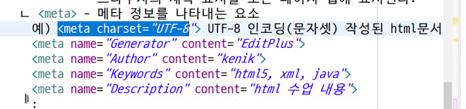
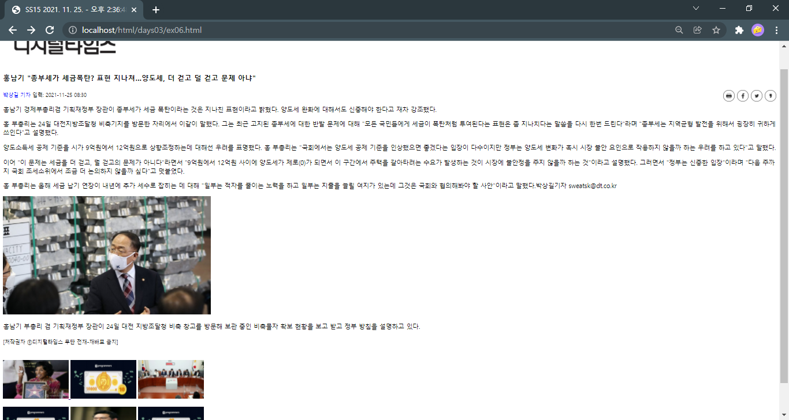
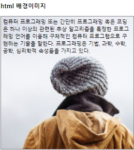

# 11.24

1-1. 인터넷( Internet )
    ㄱ. 세계 최대 규모의 통신망
    ㄴ. ARPA(Advanced Research projects Agency)가 1969년에 웹의 모태가 되는 ARPANET 개발
    ㄷ. 군사용과 민간용으로 구분되었고 민간에서 사용되던 네트워크가 현재의 인터넷이 된다.
    
 1-2. 웹(Web)
    ㄱ. 인터넷에 연결된 컴퓨터를 통해 사람들이 정보(문자, 텍스트, 영상 등등)를 공유할 수 있는 공간
    ㄴ. 1991년에 등장
    ㄷ. 인터넷은 통신망이고 웹은 그 위에서 작동하는 서비스
    ㄹ. 1989년 유럽 공동 원자핵 연구소(CERN)의 "팀 버너스리"가 하이퍼링크를 포함하는 문서의 개념을 제안
    ㅁ. 1991년에 월드 와이드 웹을 개발해 배포
    ㅂ. 1993년 [웹 표준 단체] == "W3C" 창설   : html5, xml, css 등등
 1-3. 월드 와이드 웹(World Wide Web: WWW)
 1-4. W3C
    ㄱ. 국제 웹 표준화 기구(단체)의 하나. 
    ㄴ. WWW의 표준안 제작과 새로운 표준안 제안, 기술의 공유를 통해 WWW 의 기술적
        , 사회적 확산을 위해 구성된 전세계적 단체로 1994년 10월에 설립됐다
    ㄷ. html5 
 1-5. 웹 [브라우저] 전쟁 - IE, [C], S, O 등등
    ㄱ. 인터넷망에서 정보를 검색하는 데 사용하는 응용 프로그램
    ㄴ. 넷 스케이프의 넷 스케이프 웹 브라우저와 마이크로소프트의 인터넷 익스플로러 
       웹 브라우저 사이에서 발생한 기술 전쟁
    ㄷ. 1994년부터 1998년까지 진행
    ㄹ. 웹 발전 계기
  1-6. 플러그인
    ㄱ. W3C 재단이 웹 브라우저 전쟁 때에 발생한 기술을 제대로 표준화 하지 못하여 불만을 느낀 기업들이 개발한 기술
    ㄴ. 웹 브라우저와 연동되는 특정 프로그램을 사용자 PC에 추가로 설치해 웹 브라우저의 기능을 확장하는 방법
    ㄷ. 대표적으로 액티브엑스(ActiveX) 또는 플래시(Flash)가 있음
    
  2. WHATWG
  3. HTML5 표준  - WHATWG( WEB Application 1.0 표준) + W3C => HTML5 표준
     ( MS사 - IE 제외 ) 

    ㄱ. 2009년에 W3C 재단과 마이크로소프트가 함께 제정하던 XHTML 2.0 표준이 붕괴하면서 대체안으로 Web Application 1.0 표준을 사용

  4. HTML ?

    ㄱ. HyperText Markup Language    
    ㄴ. 웹 문서를 제작하는 데 사용되는 가장 기본 프로그래밍 언어.

  5. 마크업 언어( Markup Language ) ?

    ㄱ. 웹 페이지의 서식이나 구조를 표현하는 정보
        흔히  "태그" 또는 "마크업 지시자" 라고 한다. 
  6. <시작태그>내용( Content - 자식태그 들..)</종료태그>
     </종료태그> 종료태그가 없는 태그도 있습니다.

7-1. 요소 (Element) = `<시작태그>` 내용 (Content - 자식태그들..) 

예)head 요소를 삭제하세요.. - DOM

8-1 웹 동작

[웹 서비스] - 로그인, 날씨 등등

9-1.

- 편집기
- 메모장
- 에디터 플러스
- 이클립스
- VS CODE


웹서버 + WAS : 톰캣 8.5.73


단축키

- `ol`
- `ul` 

웹 배포 (게식) -> 웹서버 - IIS / 아파치 -> 브라우저 확인 X

10-1. html5 표준문서의 기본 구조

1. `<!DOCTYPE html>` DOC (Document 문서 + TYPE(타입) = DOCTYPE)
   - html5 선언문. 주석처리도 두번째줄부터 입력하도록 한다.
2. `<html>` 루트요소
3. `<body>` 자식요소 필수
   - 문서의 정보 (본문, 내용) 을 정의하는 요소
   - 모든 가시적인 내용
4. `<head>` 자식요소
   - html 문서에 대한 메타 정보
   - `<title>` html 문서의 제목을 지정하는 태그. 브라우저의 제목 표시줄 또는 페이지 탭에 표시된다.
   - `<meta>` 메타 정보를 나타내는 요소
     - 예) `<meta charset="UTF-8">` UTF-8 인코딩 (문자셋) 으로 작성된 html 문서

팀과제: 메타태그 종류

**메타태그 예시**



11-1. html - 1991

html 4.01 - 1991

xml 1.0 + html 4.0 -> xhtml 1.0 - 2000

html5 - 2014 WHATWG (Web Application 1.0 표준) + W3C 에서 만듬

html 5.1 - 2016

html 5.2 - 2017 W3C 권고안

12-1. html5 새로 추가된 기능

1. 멀티미디어 (음악, 동영상 재생) - 플로그인 X
2. 2차원, 3차원 그래픽 구현 + javascript - 게임
3. 통신 - 기존 단방향 통신 X -> 양방향 통신 node.js
4. 장치 - 배터리, CPU, 카메라, GPS, 진동벨 등등
5. 오프라인 및 저장소
6. 시멘틱 태그 (Semantic Tag) 웹 구현
   - 시멘틱 웹은 검색엔진과 같은 프로그램이 정보의 의미를 분석하고 자료를 검색 및 처리하여 제공하는 "지능형 웹" 을 의미
7. CSS 완벽하게 지원 - MS (IE) CSS3 완벽하게 지원 X, html5 완벽하게 지원 X
8. html5 는 기존의 웹 표준보다 빠르다. - 추가기능을 사용해 웹의 성능을 극대화


`<!DOCTYPE html>` 선언문: 올바르게 웹페이지를 나타내는데 도움. 상단 1번 코딩. 대소문자 구분하지 않는다. (대문자 권장)

4-1. html 요소 = 시작태그 + 콘텐츠(내용) + /종료태그

- 요소들은 중첩이 될 수 있다. (가능)
- 닫기 태그가 잊지말고 닫기태그 선언하자.
- +++ html 태그는 대소문자를 구분하지 않지만 [소문자를 권장]

5-1. html 속성 (Attribute) - 해당 요소의 추가 정보를 제공하기 위한 것

- 속성은 시작태그에 지정한다.
- 속성은 항상 속성명="속성값" 쌍으로 제공된다. (홑따옴표나 따옴표를 안붙이기도 한다.)

```html
<태그 속성="속성값"> 내용 </태그>
```

메타정보: 데이터를 효율적으로 이용하기 위해 설명해 놓은 정보.

```html
<title dir="ltr" lang=""> </title>
```

`ltr` left to right

탭3 -> 렌더링 (태그 -> 표시) -> 스페이스 1개

스페이스 10개 -> 스페이스 1개

엔터(개행) 5개 -> 스페이스 1개

`<br>` line breaker

공부: 젠코딩 플러그인 공부


예약된 문자 표시 -> html 엔티티 (Entity)

- 공백: `&ampersand;` 또는 `&amp` ` &#38;`
  - `&non-breaking space;`  또는 `&nbsp` 
- 형식: &엔티티명; 또는 &#엔티티숫자;

`&lt` less than

`&gt` greater than

**개행태그** 

```html
&lt;br&rt;
```

`&copy;` c 아이콘


koxo.com: http://koxo.com/


팀과제: meta 태그 설명 / 종류 정리해서 팀에서 제출

hn 태그 n(1~6)

1. 머릿글의 텍스트 (== 제목)
2. h1 ~ h6 제목크기
3. (블럭모드) 인라인모드
   - 개행/공백 (여백 margin)
   - 글자 진하게 (Bold)

`h*6>{html 제목 $}` 

[H]eading

HR 태그

1. 수평줄을 표현 / 구분선
2. 블럭모드
3. 종료태그 필요없다.
4. [H]orizantal [R]ule

```html
<hr color="red">
<hr color="#0000FF">
```

빨강, 파랑

**Attribute**

- `color` 
- `width` % 혹은 px (pixel) 을 줄 수 있다. 단위를 생략하면 디폴트는 px 이다. `%` 는 부모요소의 너비의 %
- `align` 


단락 (paragraph) 혹은 p 요소

- 단락 (문단) 앞뒤로 일부 공백 (여백) 이 자동으로 추가
- 종료태그가 필요하다.


**[스타일]**

타이틀 아래에 작성

```html
<style>
p {
	color: gray;
	border: 1px solid black; 
}
</style>
```


블럭모드 / 인라인모드 span 요소

1. 인라인 모드
2. 텍스트 용기를 표현


html pre 요소

> `&lt;` `&gt;` 로 마름모를 작성할 수 있다.

`pre` Pre Formatted Text

1. 공백, 개행 처리
2. 블럭모드
3. 고정너비 글꼴로 표시
4. 미리 형식이 지정된 텍스트를 정의

`xmp` 이 엘레멘트이 사용은 더 이상 추천되지 않고 대신 [PRE](http://koxo.com/lang/js/object/pre.html)나 [SAMP](http://koxo.com/lang/js/object/samp.html) 엘레멘트를 사용하라.

1. html5 X
2. 글자폭이 일정한 글꼴

html 서식요소 - 

- b
- strong
- i
- em
- mark
- small
- del
- ins
- sub
- sup


**b VS strong**

굵게하는 태그

`b` 중요하지 않다.

`strong` 중요하다.

**i VS em**

`i` 강조 X

`em`  강조

`address` 주소


`mark` 형광팬으로 색칠

`small` 

`del` 취소선

`ins` 밑줄

`sub` subscript: 작게 아래로 정렬

`sup` supscript: 작게 위로 정렬


**단축키**

- ALT SHIFT ←→: 태그 블록지정
- ctrl shift ↑↓: 다음태그로 커서이동
- ctrl shift >: 연결된 태그로 커서이동


html 인용 요소 - blockquote, q, abbr, address, cite, bdo

- `blockquote` 
- `cite` 
- `abbr` 

```html
<blockquote cite="http://www.kenik.org/sample.html">
설명하지 마라.
친구라면 설명할 필요가 없고, 
...</blockquote>
```


```html
우리는 <abbr title="HyperText Markup Language">HTML</abbr> 을 배웁니다.
```

글자 뒤집기

```html
<bdo dir="rtl">http://www.naver.com</bdo>
```

**Attribute**

`size` default=3. 1~7 까지 줄 수 있다. 소수를 넣으면 크기가 바뀌지 않는다.

**font 태그**

`face` 글꼴

# 11.25

2-1. 웹 동작 원리에 대해서 설명하세요.

이클립스 + 톰캣(서버) 플러그인

서버를 일반 노트북에 받으면 무거워져서 플러그인으로 사용한다.

이클립스를 닫으면 웹서버도 닫게된다.

5-2. 공백 문자 : `&nbsp;` non-breaking space


---

개인공부

**[젠코딩]**

1. Help - New Install Software...
2. Add...
3. Name: Emmet
4. Location: http://emmet.io/eclipse/updates
5. OK 후 Emmet 체크 후 이클립스 재시작

```html
<div class=""></div> <!-- . -->
<input type="text" name="" id="" /> <!-- input:t -->

<ol>
	<li></li>
	<li></li>
	<li></li>
	<li></li>
	<li></li>
</ol> <!-- ol>li*5 -->

<h>html 제목 1</h>
<h>html 제목 2</h>
<h>html 제목 3</h>
<h>html 제목 4</h>
<h>html 제목 5</h>
<h>html 제목 6</h> <!-- h*6>{html 제목 $} -->
```

`*` 개수

`$` 정수

설치법: https://m.blog.naver.com/PostView.naver?isHttpsRedirect=true&blogId=bluel004&logNo=60205248390

사용법 - 문서: https://docs.emmet.io/cheat-sheet/

사용법 - 구글위키: https://code.google.com/archive/p/zen-coding/wikis/ZenHTMLSelectorsEn.wiki

**[nth-of-type]**

```css
p:nth-of-type(even) {
	color: blue
}
```

CSS 의 가상 클래스라고 한다.

- `nth-of-type(인자)`  인자로는 정수, `even` `odd` 혹은 수식이 올 수 있다.
- nth-of-child

---

**html 링크 (link)**

```html
<a href="http://www.naver.com">naver</a>
```

`a` 

1. html 링크 - 하이퍼링크
2. 링크 - 다른페이지(문서) 로 이동
3. 링크 위에 마우스를 올리면 마우스 화살표가 작은 손모양으로 바뀐다.
4. 링크 - 텍스트, 이미지, 다른 html 요소
5. 가장 중요한 속성 - href (목적지 URL)
6. 방문하지 않은 링크는 밑줄 + 파란색. 
   - 방문하지 않은 링크는 밑줄 + 보라색
   - 활성링크는 밑줄 + 빨강색
7. target 속성 - 어디에서 링크된 문서를 열지 결정하는 속성
   1. _self (기본) 동일한 창/탭에 문서연다.
   2. _blank 문서를 새 창 (window) / 탭에 문서연다.
   3. _parent 부모 (상위) 프레임 (frame) 에 문서연다.
   4. _top 창의 전체 본문에서 문서연다.


URL

1. Uniform Resource Locators
2. 웹에서 문서 (기타 정보, 데이터) 의 주소를 지정하는데 사용.
3. 웹서버에 URL 을 사용해서 웹페이지를 요청
4. URL 구문
   - 인터넷 서비스 유형 정의 (프로토콜)
   - http://
   - https://
   - ftp://
   - file://
   - ip address
   - DNS 서버
   - :8090 포트
   - 포트번호 생략하면 80
   - /webPro - Context Root(=Path)
   - /webPro/html/days03 경로
   - webPro == src/main/webapp


[지현이한테 녹화본 받기]


서버 톰캣 더블클릭

모듈탭 - Edit - / 로 바꾼다.


6-1. /webPro -> / 수정


```html
<a href="http://localhost/html/days03/ex01.html">html 기본 구조 설명</a>
<br>
<a href="ex01.html">html 기본 구조 설명2</a>
```

> 자바의 파일경로 `\\` 웹 `/` 


```html
<a href="http://localhost/html/days02/ex08.html">xmp 태그 설명 - 절대 URL</a><br>
<a href="../days02/ex08.html">xmp 태그 설명 - 상대 URL</a><br>
```


상대경로 앞에 `/` 를 붙인 의미

`/` 가 있으면 webapp 까지의 경로이다.

**이미지**

```html

```


alt 속성: 이미지 대체할 텍스트 지정

src 속성: 이미지 경로(URL)

너비높이 X

**이미지 링크**

```html
<a href="https://www.naver.com/" target="_blank">  </a>
```


`hr` href 단축키

> 자바스크립트는 대소문자를 구분한다.


```html
<a href='javascript:window.alert("경고창 띄움!!!");'>javascript 처리3</a>
```

> 자바스크립트는 문자열을 `"` 에 감싸기 때문에 html 에서 작은따옴표로 감싼다.

> 젠코딩의 a 는 href 가 자동으로 생긴다.

**아이디 링크**

```html
<a href="#Top">Top 링크</a>
<a href="../days02/ex09.html#subsup">sup, sub 태그 설명</a>
```

`#아이디` 

**메일**

```html
<a href="mailto:kor.jturtle.gmail.com">send email</a>
```

js: 버튼 click 이벤트 처리 on이벤트명 속성 설정

클릭의 속성값에는 자바스크립트 코드가 온다.

```html
<button onclick="alert('경고창')">ex01.html 이동5</button>
```

> `window.` 과 세미콜론은 생략가능하다.

BOM: window 내장객체, document 객체

**자바스크립트로 링크**

```html
<button onclick="location='ex01.html'">ex01.html 이동2</button>
```

> `document.` 생략가능

**[이미지 맵]**

map 태그 - 맵을 사용하여 이미지에 클릭 가능한 영역을 만들 수 있다.

1. map 태그: 이미지 맵을 정의하는 태그
2. area 태그: 클릭 가능한 영역

**이미지링크 예제**

```html

<map name="workmap">
<area alt="" href="ex05_computer.html" shape="rect" coords="34,44,270,350">
<area alt="" href="ex05_phone.html" shape="rect" coords="290 , 172 , 333 , 250">
<area alt="" href="ex05_coffee.html" shape="circle" coords="337, 300, 44">
</map>
```

**네이버뉴스**



```html
<!DOCTYPE html>
<html>
<head>
<meta charset="UTF-8">
<title>SS15 2021. 11. 25. - 오후 2:36:48</title>
</head>
<body>


<h3>홍남기 "종부세가 세금폭탄? 표현 지나쳐…양도세, 더 걷고 덜 걷고 문제 아냐"</h3>

<span style="color:blue">박상길 기자</span> 입력: 2021-11-25 08:30 <br>
 
프린트페이스북트위터카카오스토리

<p>
홍남기 경제부총리겸 기획재정부 장관이 종부세가 세금 폭탄이라는 것은 지나친 표현이라고 밝혔다. 양도세 완화에 대해서도 신중해야 한다고 재차 강조했다.
</p>
<p>
홍 부총리는 24일 대전지방조달청 비축기지를 방문한 자리에서 이같이 말했다. 그는 최근 고지된 종부세에 대한 반발 문제에 대해 "모든 국민들에게 세금이 폭탄처럼 투여된다는 표현은 좀 지나치다는 말씀을 다시 한번 드린다"라며 "종부세는 지역균형 발전을 위해서 굉장히 귀하게 쓰인다"고 설명했다.
</p>
<p>
양도소득세 공제 기준을 시가 9억원에서 12억원으로 상향조정하는데 대해선 우려를 표명했다. 홍 부총리는 "국회에서는 양도세 공제 기준을 인상했으면 좋겠다는 입장이 다수이지만 정부는 양도세 변화가 혹시 시장 불안 요인으로 작용하지 않을까 하는 우려를 하고 있다"고 말했다.
</p>
<p>
이어 "이 문제는 세금을 더 걷고, 덜 걷고의 문제가 아니다"라면서 "9억원에서 12억원 사이에 양도세가 제로(0)가 되면서 이 구간에서 주택을 갈아타려는 수요가 발생하는 것이 시장에 불안정을 주지 않을까 하는 것"이라고 설명했다. 그러면서 "정부는 신중한 입장"이라며 "다음 주까지 국회 조세소위에서 조금 더 논의하지 않을까 싶다"고 덧붙였다.
</p>
<p>
홍 부총리는 올해 세금 납기 연장이 내년에 추가 세수로 잡히는 데 대해 "일부는 적자를 줄이는 노력을 하고 일부는 지출을 늘릴 여지가 있는데 그것은 국회와 협의해봐야 할 사안"이라고 말했다.박상길기자 sweatsk@dt.co.kr
</p>

<p>

홍남기 부총리 겸 기획재정부 장관이 24일 대전 지방조달청 비축 창고를 방문해 보관 중인 비축물자 확보 현황을 보고 받고 정부 방침을 설명하고 있다. <!-- <연합뉴스> -->
</p>

<small>[저작권자 ⓒ디지털타임스 무단 전재-재배포 금지]</small>
<br>
<!-- Aiin Feed -->
<br>

<p>
<a href="http://www.dt.co.kr/contents.html?article_no=2021072202109954049001">

</a><a>

</a><a>

</a>
</p>
<p>


</p>
```


```html
<a href="http://www.dt.co.kr/contents.html?article_no=2021112502109932036001&naver=stand\" target="_blank">박상길 기자</a>
```

밑줄과 클릭 시 보라색을 바꿔야 한다.


**오른쪽정렬**

```html
<div style="float:right">
```


**태그출력**

```html
<xmp>
홍남기 부총리 겸 기획재정부 장관이 24일 대전 지방조달청 비축 창고를 방문해 보관 중인 비축물자 확보 현황을 보고 받고 정부 방침을 설명하고 있다. <연합뉴스>
</xmp>
```

**[개발자도구]**

**단축키**

- F12
- Ctrl Shift C: 요소조사


> a 태그에 색을 넣으면 클릭 시 보라색으로 바뀌지 않는다.

`text-d` 텍스트 데코레이션

**커서**

```css
cursor: default;
```

> 커서는 a 와 a:hover 둘 다 적용한다.


**요소조사 예시**

스타일

```css
a {
	color: #0a619c;
	text-decoration: none;
	font-size: 13px;
}
a:hover {
	text-decoration: underline;
}
```

바디

```html
<a href="http://www.dt.co.kr/contents.html?article_no=2021112502109932036001&naver=stand\" 
target="_blank">박상길 기자</a>
```


`b` border

`flo` float. `inherit` 부모의 속성 상속

> CSS 에서는 px 를 생략하면 안되는 것 같다.

**float**

정렬


모든 브라우저 (C, E, F, S, O) 에서 지원하는 일반적인 이미지 파일 형식

1. `.apng`
2. `.gif`
3. `.ico` `.cur` 
4. `.jpeg` `.jpg` `.jfif` `.pjp` 
5. `.png`
6. `.svg` 

`<center>` 태그가 있지만 사용하지 않고 CSS 를 사용한다.

**[picture]**

1. 사진 태그에 source 설정을 여러 개 설정해서 장치마다 가장 맞는 이미지를 선택할 수 있게 하는 태그
2. 웹 개발자에게 이미지의 유연성을 제공
3. 반응형 웹 만들 때 사용

picture 태그 안에서 img 태그는 가장 마지막에 지정

**디바이스 크기에 따라 이미지**

```html
<picture>
<source media="(min-width:650px)" srcset="../images/img_pink_flowers.jpg">
<source media="(min-width:450px)" srcset="../images/img_white_flower.jpg">

</picture>
```


a태그에 title 을 넣으면 풍선도움말을 만들 수 있다.

**[파비콘]**

1. 브라우저 탭의 페이지 제목 옆에 표시되는 작은 아이콘 (이미지)
2. 파비콘 파일형식: ico, png, gif, jpeg, svg 
3. link 태그 사용해서 파비콘 삽입

```html
<link rel="icon" href="../images/SiSt.ico" type="image/x-icon"/>
```

> 파일명은 대소문자를 구분한다.

제작사이트: https://www.favicon.cc/

네이버 우클릭 - 페이지 소스보기 - image/x-icon 을 검색

에러코드

```html
<link rel="shortcut icon" type="image/x-icon" href="/favicon.ico?1"/> 
```

> 상대경로의 favicon 이므로 절대경로로 수정해야 네이버아이콘을 가져올 수 있다.

정상코드

```html
<link rel="shortcut icon" type="image/x-icon" href="https://www.naver.com/favicon.ico?1"/>
```

**배경이미지 넣기**



스타일

```css
p {
	border: 1px solid gray;
	width: 400px;
	height: 400px;
	padding: 5px;
	
	background-image: url('../images/img_girl.jpg')
}
```

바디

```html
<h3>html 배경이미지</h3>

<p>
컴퓨터 프로그래밍 또는 간단히 프로그래밍 혹은 코딩은 하나 이상의 관련된 추상 알고리즘을 특정한 프로그래밍 언어를 이용해 구체적인 컴퓨터 프로그램으로 구현하는 기술을 말한다. 프로그래밍은 기법, 과학, 수학, 공학, 심리학적 속성들을 가지고 있다.
</p>
```

> 배경이미지는 우클릭해서 다운로드할 수 없다.

