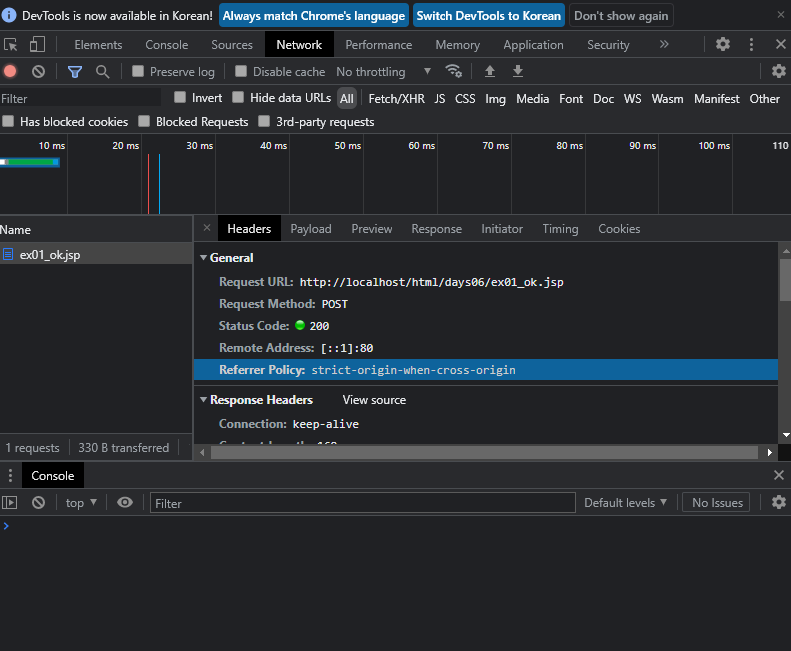
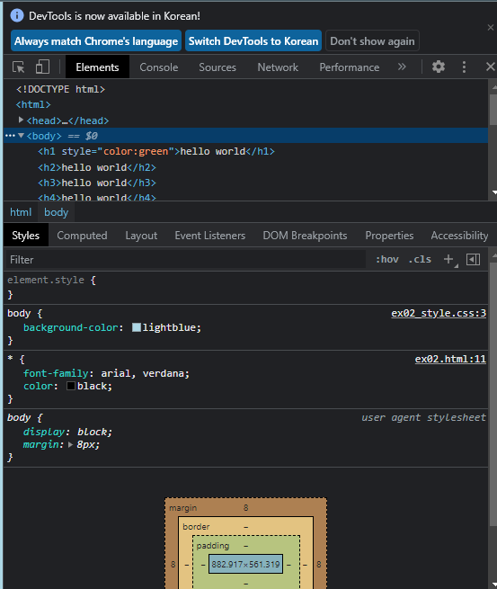
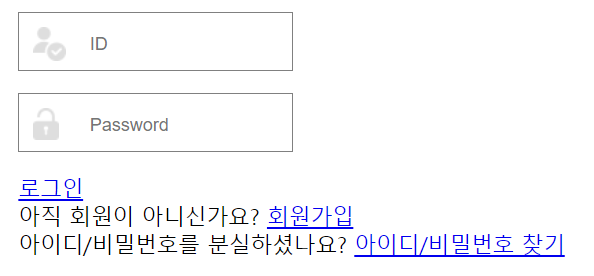
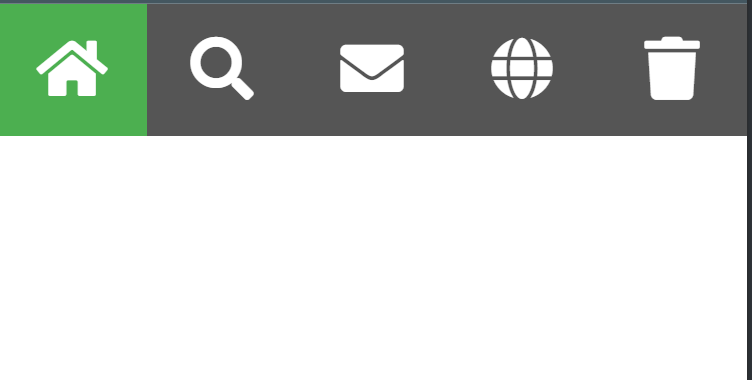

# 11.30

**복습**

라디오 젠코딩

```html
input[type=radio name=fav_language id value]*3
```

type name id value

> value 가 없으면 라디오는 on 이 넘어간다.

**JSP 값 넘기기: 라디오**

```html
<label>좋아하는 웹 언어를 선택하세요 : </label>
<form action="ex01_ok.jsp">
    <input type="radio" name="fav_language" checked value="HTML" />HTML 
    <input type="radio" name="fav_language" value="CSS" />CSS 
    <input type="radio" name="fav_language" value="javascript" />javascript 
    <input type="submit" />
</form>
```

```jsp
<%
String lang = request.getParameter("fav_language"); 
%>
```

```jsp
> 좋아하는 웹 언어 : <%= lang %>
```

form - input - submit

> 값을 넘겨주는 것은 name, 레이블과 연결은 id 이다.

```html
<label>좋아하는 웹 언어를 선택하세요 : </label>
<form action="ex01_ok.jsp">
    <input type="radio" name="fav_language" checked value="HTML" id="HTML"/>
    <label for="HTML">HTML </label>
    <input type="radio" name="fav_language" value="CSS" id="CSS"/>
    <label for="CSS">CSS</label> 
    <input type="radio" name="fav_language" value="javascript" id="javascript"/>
    <label for="javascript">javascript</label>
    <input type="submit" />
</form>
```


Q. form 에 method get 이 필요없나?

A. 디폴트가 get 이므로 필요없다. 


옵션은 selected, 라디오는 checked 이다.

---

## 입력태그

get 방식 외에 post 방식도 있다.

**[get VS post]**

action 속성: 입력을 처리할 페이지 (URL)

**get**

- method="get" 
- ex01_ok.jsp? 이름/값 한쌍으로 요청 URL 추가...
- URL? 길이제한 (2048자)
- 보안취약

**post**

- method="post"
- HTTP 내장전송 - 보안안전
- 크기제한 X (파일 업로드할때 post 방식)

```html
<input type="submit" formaction="ex01_ok.jsp" formmethod="post" value="제출-post" formtarget="_blank"/>
```

> form 태그에 target 속성을 작성해도 된다.

Q. form 태그가 없어도 formaction 사용이 가능할까?

A. form 태그 없이 동작하지 않는다.

포스트방식은 URL 에 정보가 담기지 않아 보안에 유리하다.



F12 - network - Ctrl R - name 클릭 - headers 

`enctype` 인코딩 타입. 양식(form) 데이터를 인코딩하는 방법을 설정

```html
<form action="ex01_ok.jsp" method="get" enctype="application/x-www-form-urlencoded">
    
<input type="submit" formenctype="multipart/form-data" formaction="ex01_ok.jsp" formmethod="post" value="제출-post" formtarget="_blank"/>
```


체크박스 젠코딩

```
input[type=checkbox name=이름 id value]*N
```


```html
<form action="ex01_ok.jsp" method="get" autocomplete="on">
    소유한 차량 : 
    <input type="checkbox" name="vehicle" id="Car" value="Car" checked />Car 
    <input type="checkbox" name="vehicle" id="Boat" value="Boat" />Boat 
    <input type="checkbox" name="vehicle" id="Bike" value="Bike" checked />Bike 
    <input type="submit" />
</form>
```

form 태그

- `autocomplete="on"` 사용자가 이전에 입력한 값을 기반으로 자동완성

```html
<input type="reset" />
```

모든 입력양식의 값을 기본값으로 재설정하는 버튼

```html
<input type="button" value="Click Me!" onclick="alert('입력값에 대한 유효성 검사 후 Submit')"/>
```


```html
<button>버튼</button>
```

버튼또한 input - submit 처럼 값을 넘기는 기능이 포함되어 있다.


input type 속성값

- `color`
- `date` min, max 를 설정할 수 있다.
- `datetime-local` 날짜 선택. 시간 분까지 선택할 수 있다.
- `datetime` 직접 입력
- `email` 기본적으로 입력값에 대한 유효성검사 지원.
- `file` 실제 서버에 파일이 업로드 되지는 않는다. -> 개발자 업로드 컴퍼넌트 사용해서 코딩. `multiple` 속성지원
- `hidden` 입력값을 숨김. 상태관리를 위해 사용.
  - 상태관리: 서버(DB, 세션), 클라이언트(쿠키, hidden)
- `image` 제출되는 이미지. `src` 가 필요
- `month` 년도와 월을 선택
- `number` 숫자만 입력. min, max, step 을 설정할 수 있다.
- `range` min, max 가 필요. value 로 초기값 설정
- `search` 모두지우기 버튼이 있다.
- `tel` pattern, placeholder 속성
- `time` 시간/분 설정
- `url`
- `week` 년도와 주 선택

브라우저 지원에 따라 색상 선택

브라우저에 따라 날짜 선택이 달라진다.

form 속성

`novalidate="novalidate"` 유효성검사를 하지 않는다. (이메일)

**number&range 예제**

```html
<input type="number" id="deptno" name="deptno" min="10" max="90" step="10"/>

<input type="range" id="volumn" name="volumn" min="0" max="100" value="0"/>
```


```html
<input type="tel" name="phone" pattern="[0-9]{3}-[0-9]{3,4}-[0-9]{4}" placeholder="000-0000-0000"/>
```

`placeholder` 힌트

pattern 속성

- 입력값에 대한 정규식 검사지정
- 정규표현식이 들어간다.


```html
<form action="ex01_ok.jsp">
    name : 
    <input type="text" id="name" name="name" autofocus tabindex="1" required /> <br /> title : 
    <input type="text" id="title" name="title" tabindex="2" required /> <br /> content :
    <textarea name="content" id="" cols="40" rows="5" tabindex="3"></textarea>
    <br /> <input list="browsers" />
    <datalist id="browsers">
        <option value="IE"></option>
        <option value="Firefox"></option>
        <option value="Chrome"></option>
        <option value="Safari"></option>
        <option value="Opera"></option>
    </datalist>
    <input type="image" src="../images/img_submit.gif" width="48"
           height="48px" />
</form>
```

datalist 대신 select 로 해도된다.

**input 속성**

- type
- name
- id
- value
- placeholder
- onclick
- tabindex
- pattern
- autofocus
- required

라디오

- checked

폼

- formaction
- formmethod
- formtarget

수

- min
- max
- step

## **그래픽태그**

- `canvas` javascript 를 사용해서 그래픽을 그리는데 사용. 컨테이너 역할. 경로, 상자, 원, 텍스트, 이미지 그리기 (추가)
- `SVG`


```html
<canvas id="myCanvas" width="200" height="100"></canvas>
```


1. 캔버스 요소 (Element) 얻어오기.

```javascript
var c = document.getElementById("myCanvas");
var ctx = c.getContext("2d");

ctx.moveTo(0, 0);
ctx.lineTo(200, 100);
ctx.stroke();
```


```html
<!DOCTYPE html>
<html>
<head>
<meta charset="UTF-8">
<meta name="viewport" content="width=device-width, initial-scale=1.0">
<title>SS15 2021. 11. 30. - 오전 11:16:50</title>
<link rel="icon" href="../images/SiSt.ico" type="image/x-icon" />
<style>
canvas {
	border: 1px solid black;
}
</style>
</head>
<body>

	<h3>html 그래픽 - canvas, SVG</h3>

	<canvas id="myCanvas" width="200" height="100"></canvas>

	<script>
		// 1. 캔버스 요소 (Element) 얻어오기.
		var c = document.getElementById("myCanvas");
		var ctx = c.getContext("2d");

		// 선
		ctx.moveTo(0, 0);
		ctx.lineTo(200, 100);
		ctx.stroke();

		// 원
		ctx.beginPath();
		ctx.arc(95, 50, 40, 0, 2 * Math.PI);
		ctx.stroke();
		
		// 텍스트
		ctx.font = "30px Arial";
		//ctx.fillText("Hello World", 10, 50);
		ctx.fillText("Hello World", 10, 50);
	</script>


</body>
</html>
```


**자바스크립트 함수**

```html


<p>
    <button onclick="drawImage()">캔버스 이미지 그리기</button>
</p>

<canvas id="myCanvas" width="250" height="300"
        style="border: 1px solid black;"></canvas>

<script>
    // 함수 선언 drawImage
    function drawImage() {
        alert('경고창~~~');
    }
</script>
```


**[SVG]**

1. XML 형식의 벡터기반 그래픽을 정의
2. 벡터 기반 ? 확장 가능한 벡터 그래픽
3. 웹용 그래픽을 정의하는데 사용
4. W3C 권장
5. 컨테이너 역할 - 텍스트, 이미지, 원, 박스, 경로 등등


```html
<svg width="100" height="100">
    <circle cx="50" cy="50" r="40" stroke="green" stroke-width="4"
            fill="yellow"></circle>
</svg>

<svg width="400" height="100">
    <rect width="400" height="100"
          style="fill:rgb(0,0,255); stroke-width:10;stroke:rgb(0,0,0)"></rect>
</svg>

<svg height="130" width="500">
    <defs>
        <linearGradient id="grad1" x1="0%" y1="0%" x2="100%" y2="0%">
            <stop offset="0%" style="stop-color:rgb(255,255,0);stop-opacity:1" />
            <stop offset="100%" style="stop-color:rgb(255,0,0);stop-opacity:1" />
        </linearGradient>
    </defs>
    <ellipse cx="100" cy="70" rx="85" ry="55" fill="url(#grad1)" />
    <text fill="#ffffff" font-size="45" font-family="Verdana" x="50"
          y="86">SVG</text>
</svg>
```

## 비디오&오디오태그

**[멀티미디어]**

1. 웹 상에서의 멀티미디어는 사운드, 음악, 비디오, 영화 및 애니메이션.
2. 일반적인 비디오 형식 : .mpg, mpeg, .avi, .wmv, .mov, .swf, .webm, .mp4 등등 (html 표준: mp4, ogg 만 지원한다. +++ )
   - YouTube 에서는 mp4 형식을 권장한다.
3. 일반적인 오디오 형식 : `.wav` `.ogg` `.mp3` `.wma` 등등
   - +++ html 표준 : mp3 ogg wav 만 지원한다. +++


```html
<video src="movie.mp4" width="320" height="240" controls></video>

<!-- 같은코드 -->
<video width="320" height="240" controls>
    <source src="movie.mp4" type="video/mp4"></source>
</video>
```

controls 속성이 꼭 필요하다.

1. video 태그를 사용
2. controls 속성 : 재생, 일시정지, 볼륨, 비디오 컨트롤 추가
3. width="320" height="240" 속성을 설정하지 않으면 동영상이 로드되는 동안 페이지가 깜빡일 수 있다.
4. source 요소는 브라우저에게 선택할 수 있다.
5. autoplay 속성을 추가하면 자동재생된다.
   - 크롬브라우저는 자동재생을 허용하지 않는다.
6. 음소거

**video 속성**

- `autoplay`
- `muted`

**[오디오태그]**

1. audio 요소 - 웹페이지에서 오디오 파일을 재생할때 사용하는 태그


```html
<audio controls>
<source src="horse.mp4" type="audio/mpeg"></source>
</audio>
```


1. html 로 동영상을 재생하는 가장 쉬운방법 ? YouTube 동영상
2. `https://www.youtube.com/watch?v=sobZFf2MxpI` 
   - sobZFf2MxpI ? Youtube 는 동영상을 저장 (재생) 할 때 사용하는 ID 값. 이 ID 값을 사용해서 html 코드에서 동영상을 참조할 수 있다.
3. html 페이지에서 YouTube 동영상 재생
   - YouTube 에 동영상 업로드
   - 비디오 ID 기록 : sobZFf2MxpI
   - iframe 웹페이지에서 요소 정의
     - src 속성 : 동영상의 URL
   - width/height 속성 지정

```html
	<iframe width="420" height="315"
		src="https://www.youtube.com/embed/Al38Z8uu7uA"></iframe>
```

> src 에 embed 가 들어가야 한다.

**[API]**

1. 지리적 위치
2. 드래그/드롭
3. 웹 저장소
4. 웹 작업자
5. SSE


## **CSS**

1. html 문서의 스타일을 지정하는데 사용하는 언어
2. html 요소가 표시되는 방법을 설명
3. Cascading Style Sheets
4. 여러 웹페이지의 스타일을 일괄적으로 관리할 수 있다.
5. CSS 템플릿: 반응형 W3.CSS 템플릿
6. 외부 스타일 시트 (.css)
7. 많은 작업이 절약
8. 다양한 장치 및 화면 크기에 대한 디스플레이의 디자인, 레이아웃 및 변형을 포함하여 웹페이지의 스타일을 정의하는데 사용
9. html 요소가 화면, 종이 또는 기타 미디어에 표시되는 방식

**CSS 에 따른 스타일** 

```html
<!DOCTYPE html>
<html>
<head>
<meta charset="UTF-8">
<meta name="viewport" content="width=device-width, initial-scale=1.0">
<title>SS15 2021. 11. 30. - 오후 2:07:55</title>
<link rel="icon" href="../images/SiSt.ico" type="image/x-icon"/>
<style>/* Stylesheet 1: */
body {
    font: 100% Lucida Sans, Verdana;
    margin: 20px;
    line-height: 26px;
}

.container {
    xmin-width: 900px;
}

.wrapper {
    position: relative;
    overflow: auto;
}

#top, #sidebar, #bottom, .menuitem {
    border-radius: 4px;
    margin: 4px;
}

#top {
    background-color: #4CAF50;
    color: #ffffff;
    padding: 15px;
}

#menubar {
    width: 200px;
    float: left
}

#main {
    padding: 10px;
    margin: 0 210px;
}

#sidebar {
    background-color: #32a4e7;
    color: #ffffff;
    padding: 10px;
    width: 180px;
    bottom: 0;
    top: 0;
    right: 0;
    position: absolute;
}

#bottom {
    border: 1px solid #d4d4d4;
    background-color: #f1f1f1;
    text-align: center;
    padding: 10px;
    font-size: 70%;
    line-height: 14px;
}

#top h1, #top p, #menulist {
    margin: 0;
    padding: 0;
}

.menuitem {
    background-color: #f1f1f1;
    border: 1px solid #d4d4d4;
    list-style-type: none;
    padding: 2px;
    cursor: pointer;
}

.menuitem:hover {
    background-color: #ffffff;
}

.menuitem:first-child {
   background-color:#4CAF50;
   color: white;
   font-weight:bold;
}

a {
    color: #000000;
    text-decoration: underline;
}

a:hover {
    text-decoration: none;
}


@media (max-width: 800px) {
    #sidebar {
        width: auto;
        position: relative;
    } 
    #main {
        margin-right: 0;
    }    
       
}

@media (max-width: 600px) {
    #menubar {
        width: auto;
        float: none;
    }
    #main {
        margin: 0;
    }    
}
</style>
<style disabled="">/* Stylesheet 2: */
body {
    font-family: Arial;
    background-color: #d14836;
    line-height: 20px;
}

.container {
    xmin-width: 900px;
}

.wrapper {
    position: relative;
    overflow: auto;
}

#top {
    color: #ffffff;
    padding: 15px;
    font-size: 30px;
    line-height: 26px;    
}

#top h1 {
    margin:0;
    line-height: 50px;
}

#menubar {
    width: 190px;
    float: right;
}

#main {
    padding: 10px;
    background-color: #ffffff;
    font: 80% Verdana;
}

#main h1, #main h2 {
    color: #d14836;
}

#sidebar {
    background-color: #F6DAD7;
    color: #d14836;
    padding: 10px;
}

#bottom {
    text-align: center;
    padding: 10px;
    font-size: 70%;
    color: #ffffff;
}

#menulist {
    padding:0;
    font: 16px verdana;
}

.menuitem {
    width: 155px;
    background-color: #d14836;
    border: 1px solid #d14836;
    border-radius: 40px;
    color: #ffffff;
    list-style-type: none;
    margin: 10px;
    padding: 5px;
    text-align: center;
    cursor: pointer;
}

.menuitem:nth-child(2) {
   background-color:white;
   color: #d14836;
   font-weight:bold;
}

.menuitem:hover {
    background-color: #ffffff;
    color: #d14836;
}

a {
    color: #d14836;
    text-decoration: none;
}

a:hover {
    text-decoration: underline;
}
</style>
<style disabled="">/* Stylesheet 3: */
body {
    font: 100% Verdana;
    margin: 20px;
    line-height: 26px;
}

.container {
    xmin-width: 900px;
}

.wrapper {
    position: relative;
    overflow: auto;
}

#sidebar {
    background-color: #f1f1f1;
    border: 1px solid #d4d4d4;
    padding-left: 10px;
}

#bottom {
    text-align: center;
    padding: 10px;
    font-size: 70%;
    line-height: 14px;
}

h1, h2, h3 {
    color: #4CAF50;
}

#menulist {
    padding: 0;
    position: relative;
    overflow: auto;
}

.menuitem {
    width: 165px;
    float: left;
    background-color: #555555;
    color: #ffffff;
    list-style-type: none;
    margin: 4px;
    padding: 2px;
    text-align: center;
    cursor: pointer;
}

.menuitem:nth-child(3) {
   background-color:#4CAF50;
}

.menuitem:hover {
    background-color: #999999;
}

a {
    color: #000000;
}

a:hover {
    color: #84c754;
}
</style>
<style disabled="">/* Stylesheet 4: */
body {
    font: 100% Courier New;
    margin: 20px;
    line-height: 26px;
    background-color: #000000;
}

.container {
    xmin-width: 900px;
}

.wrapper {
    position: relative;
    overflow: auto;
}

#top {
    color: #84c754;
    padding: 15px;
}

#main {
    padding: 10px;
    color: #84c754;
}

#sidebar {
    color: #ffffff;
    border: 1px solid #ffffff;
    border-radius: 4px;
    padding: 10px;
    width: 320px;
    top: 0;
    right: 0;
    position: absolute;
    font-size: 80%;
    line-height: 20px;
}

#bottom {
    border: 1px solid #ffffff;
    border-radius: 4px;
    color: #ffffff;
    text-align: center;
    padding: 10px;
    font-size: 70%;
    line-height: 14px;
}

#top h1,#top p {
    margin: 0;
}

.menuitem {
    color: #84c754;
    cursor: pointer;
}

.menuitem:nth-child(4) {
    color:white;
    font-weight:bold;
}

.menuitem:hover {
    color: #ffffff;
}

a {
    color: #ffffff;
}

a:hover {
    color: #84c754;
}
@media (max-width: 600px) {
    #sidebar {
       width: auto;
       margin-bottom:10px;        
       position: relative;
    }    
}

</style>
</head>
<body>

<div class="container wrapper">
  <div id="top">
    <h1>Welcome to My Homepage</h1>
    <p>Use the menu to select different Stylesheets</p>
  </div>
  <div class="wrapper">
   <div id="menubar">
     <ul id="menulist">
       <li class="menuitem" onclick="reStyle(0)">Stylesheet 1
       <li class="menuitem" onclick="reStyle(1)">Stylesheet 2
       <li class="menuitem" onclick="reStyle(2)">Stylesheet 3
       <li class="menuitem" onclick="reStyle(3)">Stylesheet 4
       <li class="menuitem" onclick="noStyles()">No Stylesheet
     </li></ul>
    </div>
    <div id="main">
      <h1>Same Page Different Stylesheets</h1>
      <p>This is a demonstration of how different stylesheets can change the layout of your HTML page. You can change the layout of this page by selecting different stylesheets in the menu, or by selecting one of the following links:<br>
      <a onclick="reStyle(0);return false" href="#">Stylesheet1</a>,
      <a onclick="reStyle(1);return false" href="#">Stylesheet2</a>,
      <a onclick="reStyle(2);return false" href="#">Stylesheet3</a>,
      <a onclick="reStyle(3);return false" href="#">Stylesheet4</a>.
      </p>
       <h2>No Styles</h2>
      <p>This page uses DIV elements to group different sections of the HTML page. Click here to see how the page looks like with no stylesheet:<br><a onclick="noStyles();return false" href="#">No Stylesheet</a>.</p>
   </div>
    <div id="sidebar">
      <h3>Side-Bar</h3>
      <p>Lorem ipsum dolor sit amet, consectetuer adipiscing elit, sed diam nonummy nibh euismod tincidunt ut laoreet dolore magna aliquam erat volutpat.</p>
    </div>
  </div> 
  <div id="bottom">
    Lorem ipsum dolor sit amet, consectetuer adipiscing elit, sed diam nonummy nibh euismod tincidunt ut laoreet dolore magna aliquam erat volutpat. Ut wisi enim ad minim veniam, quis nostrud exerci tation ullamcorper suscipit lobortis nisl ut aliquip ex ea commodo consequat. Duis autem vel eum iriure dolor in hendrerit in vulputate velit esse molestie consequat, vel illum dolore eu feugiat nulla facilisis at vero eros et accumsan et iusto odio dignissim qui blandit praesent luptatum zzril delenit augue duis dolore te feugait nulla facilisi.
  </div>
</div>


<script>
function noStyles() {
    document.styleSheets[0].disabled = true;
    document.styleSheets[1].disabled = true;
    document.styleSheets[2].disabled = true;
    document.styleSheets[3].disabled = true;
}

function reStyle(n) {
    noStyles()
    document.styleSheets[n].disabled = false;
}

function closeBlackdiv() {
    var blackdiv, stylediv;
    blackdiv = document.getElementById("blackdiv")
    blackdiv.parentNode.removeChild(blackdiv);
    stylediv = document.getElementById("stylediv")
    stylediv.parentNode.removeChild(stylediv);
}

function showStyle(n) {
   var div, text, blackdiv;
   blackdiv = document.createElement("DIV");
   blackdiv.setAttribute("style","background-color:#000000;position:absolute;width:100%;height:100%;top:0;opacity:0.5;margin-left:-20px;");
   blackdiv.setAttribute("id","blackdiv");
   blackdiv.setAttribute("onclick","closeBlackdiv()");
   document.body.appendChild(blackdiv);
   div = document.createElement("DIV");
   div.setAttribute("id","stylediv");
   div.setAttribute("style","background-color:#ffffff;padding-left:5px;position:absolute;width:auto;height:auto;top:100px;bottom:50px;left:200px;right:200px;overflow:auto;font-family: monospace; white-space: pre;line-height:16px;");
   text = document.createTextNode(document.getElementsByTagName("STYLE")[n].innerHTML);
   div.appendChild(text);
   document.body.appendChild(div);
   //alert(document.getElementsByTagName("STYLE")[n].innerHTML);
   }
   reStyle(0);
</script>


</body>
</html>
```

**CSS 구문(형식)**

1. 선택자 + 선언블록 구성 (selector)
   - 스타일을 적용할 대상 (html 요소)
2. 선언블록
   - 속성명: 속성값;
3. CSS 적용하는 방법
   - 내부 (internal) CSS 적용방법 - 해당 웹 문서 (페이지) 만 스타일 적용
4. 선택자 (selector)
   - 태그명
   - #ID속성
   - .class속성
   - `*` 범용선택자

> 아이디명은 숫자로 시작할 수 없다.

**그룹화 선택자**

```css
h1, h2, h3, h4, h5, h6, div {
	border: 1px solid gray;
	color: red;
}
```


```css
h1, h2, h3, h4, h5, h6, div {
	border: 1px solid gray;
	color: red;
}

h1 {
	color: blue;
}
```

그룹화 적용 후 h1 이 적용된다.


**CSS 파일분리**



```html
<link rel="stylesheet" href="ex02_style.css" />
```

body 태그의 배경색이 어디파일에서 설정됐는지 보려면 F12 로 확인한다.


CSS 외부내부가 우선순위가 아니라 뒤에 써진코드가 적용된다.

CSS 의 C 는 Cascade - 계단식 순서

1. 브라우저 기본값
2. 외부 또는 내부 스타일 시트
3. 인라인 스타일 (우선순위 가장높다.)

## 색상 및 배경

**[CSS 색상]**

표준색상명 140개, RGB, RGBA

색

- white
- #ffffff
- #fff
- RGB [A] (255, 255, 255)
- HSL [A]

HSL (색조, 채도, 밝기)

색조: 0~360 0 (빨강) 120(녹색) 240(파랑)

채도: 0% (회색음영)~100%

밝기: 0~100%

```css
background-color: hsl(0, 100%, 50%);
```

A (alpha) 투명도: 0.0 (완전 투명) ~ 1.0 (완전 불투명)

**[CSS 배경]**


**속성** 

`opacity` 투명도


```css
div {
	width: 200px;
	padding: 10px;
	border: 1px solid gray;
	background-color: green;
}

div.first {opacity: 0.1}
div.second {opacity: 0.3}
div.third {opacity: 0.6}
```

```html
<div class="first">Lorem ipsum dolor sit.</div>
<div class="second">Eius maxime odio deleniti.</div>
<div class="third">Reprehenderit maxime quae aperiam.</div>
<div style="opacity: 1">Reprehenderit maxime quae aperiam.</div>
```

opacity 투명도를 설정하면 자식 (하위) 요소도 동일한 투명도를 상속한다.

텍스트도 투명도가 동일.

**[CSS 배경 이미지]**

backgound-image 속성

이미지는 전체요소 (body) 를 덮도록 자동반복

배경이미지 사용할때는 텍스트의 색상 방해되지 않도록 이미지 사용한다.

```css
background-image: url('../images/paper.gif');
```

`background-repeat` 반복속성

- `no-repeat` 
- `repeat-x`
- `repeat-y` 
- 등


`background-position: right top;` 배경 위치


`background-attachment: fixed;` 

기본값 scroll


CSS 배경 속기

```css
background: url('../images/img_tree.png') no-repeat right top fixed;
```

color image repeat attachment position

순서가 약간 바뀌어도 문제가 없다.

**스크롤 올리는 함수**

```html
<script>
    function top_click() {
        document.body.scrollTop = 0;
        document.documentElement.scrollTop = 0;
    }
</script>
```

내일시험

**[CSS 테두리]**

border style, width, color 지정

`border-width` 12시부터 시계방향

```css
border-width: 1px 5px 10px 20px;
```

- `border-top`
- `border-right`
- `border-bottom`
- `border-left`

border-style 은 필수속성이다. 없으면 width, color 가 적용되지 않는다.


p.r$*4>lorem5

```html
<p class="r1">Lorem ipsum dolor sit amet.</p>
<p class="r2">Officiis distinctio ipsum quasi aperiam.</p>
<p class="r3">Doloremque dolor veritatis nostrum quaerat.</p>
<p class="r4">Illum quia reprehenderit maiores eaque.</p>
```


CSS 속성

- `border-radius` 둥근 테두리
- `border-top-left-radius` 네 모서리를 각각 줄 수 있다.

과제

1. 쌍용 로그인 페이지 
2. 회원가입
3. 아이디비밀번호찾기


**로그인 복습**


1. dt 를 float 해서 테이블처럼 만든다.
2. 리스트의 type 에 none 을 줘서 ul 을 없앤다.
3. id, password 의 테두리를 없앤다.



```css
form dt {
	float: left;
}

#id {
	border: none;
	width: 100%;
}

#password {
	border: none;
	width: 100%;
}

.linp_wrap dl {
	border: solid gray 1px;
	width: 20%;
	padding: 10px;
}
```


```html
<ul class="loginCon" type="none">
    <li>
        <div class="linp_wrap">
            <dl>
                <dt>
                    <label for="id"></label>
                </dt>
                <dd>
                    <input data-value="아이디를 입력해주세요." type="text" name="id" id="id"
                           placeholder="ID" />
                </dd>
            </dl>
            <dl>
                <dt>
                    <label for="password"></label>
                </dt>
                <dd>
                    <input data-value="비밀번호를 입력해주세요." type="password"
                           name="password" id="password" placeholder="Password" />
                </dd>
            </dl>
            </dl>
    </div> <a class="login_btn" href="javascript:;" id="loginBtn"
              onclick="$('#login').submit()">로그인</a>
</li>
<li class="last">
    <div>
        <span>아직 회원이 아니신가요?</span> <a href="/member/write.jsp">회원가입</a>
    </div>
    <div>
        <span>아이디/비밀번호를 분실하셨나요?</span> <a href="/member/idpwFind.jsp">아이디/비밀번호
        찾기</a>
    </div>
</li>
</ul>
```


# 12.1

**복습**

2-1. CSS 적용 방식에 대해서 설명하세요.
  ㄱ. 인라인
  ㄴ. 내부
  ㄷ.  외부

3-1. selector 종류에 대해서 설명하세요.

1. 태그명
2. #아이디
3. .클래스
4. *
5. 콤마나열


10-1.

```html
<div>둥근 테두리</div>
```

   둥근 테두리를 설정하는 코딩을 하세요.

> 색은 디폴트가 검정이므로 border 로 solid 1px 만 줘도 된다.

---

자바스크립트 자동완성 플러그인 설치

**자바스크립트** 

```html
<script>
    for (var i = 0; i < 50; i++) {
        var newNode = document.createElement("p");
        newNode.appendChild(document.createTextNode("."));
        document.body.appendChild(newNode);
    }
</script>
```

함수 찾아보기

**[CSS 여백]**

1. 테두리 (border) 외부의 요소 주위의 공간을 만들 때 사용.
2. margin 속성 사용.
3. margin-top, margin-right, margin-bottom, margin-left 
4. margin 속성값: auto 브라우저 여백 자동 계산 처리
   - ex) 가운데정렬 margin: 0 auto;
   - px, pt, cm 등등 + % 포함하는 요소 너비의 % 로 여백지정
   - inherit (상속) - 여백이 부모 요소에서 상속
5. 음수 margin: -100px;


**css margin: inherit(상속) 의미**

>  margin-top 과 margin-bottom 의 여백이 동시에 있을땐 가장 큰 여백으로 처리된다.


**[padding]**

1. 테두리내부의 요소 컨텐츠 주위에 공간을 만드는데 사용
2. top right bottom left
3. px pt cm 등 + % + inherit
4. 음수허용 X

**padding & element width**

> 내용물은 width 와 padding 의 합이다.

패딩에 관계없이 너비를 300px 로 유지하는 코딩

```css
box-sizing: border-box;
```

컨텐츠의 공간이 줄어든다.

박스사이징 보더박스

**높이&너비**

1. height/width
2. 높이, 너비속성에는 패딩, 테두리, 여백은 포함되지 않는다.
3. auto, px, cm 등 + % + inherit + initial 기본값 설정


width 와 max-width 차이

- width 100% -> 창의 크기에 따라 이미지 크기 변화
- max-width 100% -> width 와 같지만 원래 이미지 사이즈보다 커지지 않는다.
- 지정 X -> 창의 크기에 관계없이 크기 일정

**상자(box) 모델**

1. 모든 html 요소는 상자(box) 로 간주될 수 있다.
2. 상자모델: 디자인 또는 레이아웃
3. 여백, 테두리, 패딩 + 설제 컨텐츠 = 박스모델


**윤곽선**

Outline

```css
outline: 1px solid blue;
outline-offset: 15px;
```

- `outline` border 바깥선
- `outline-offset` outline 과 border 사이의 공간을 설정

**텍스트**

텍스트 서식과 관련된 속성

- color
- text-align


```css
text-align: justify;
text-align-last: justify;
```

`text-align` 

각 텍스트 라인마다 동일한 폭을 갖도록 설정하는 속성값

설정하지 않으면 단어별로 줄구분을 한다.

`text-align-last` 마지막 행만 


**direction unicode-bidi**

- `direction` 
- `unicode-bidi` 

글자뒤집기

```css
direction: rtl;
unicode-bidi: bidi-override;
```


`vertical-align` baseline 이 디폴트.

- `text-top` 위로 정렬
- `super` 위로 정렬
- `sub` 아래로 정렬
- `text-bottom` 아래로 정렬

**텍스트 장식**

- `a:link` 방문하지 않은 링크
- `a:visited` 사용자가 방문한 링크
- `a:hover` 마우스를 링크에 올려놓을 때
- `a:active` 링크를 클릭할 때

코딩할 때 주의사항은 a:hover 가 a:link 및 a:visited 뒤에와야 한다.

a:active 가 a:hover 뒤에와야 한다.

링크 비짓 호버 액티브

`text-decoration` 

```css
a:link {
	color: black;
	text-decoration: none;
}

a:visited {
	color: green;
}

a:hover {
	color: hotpink;
	text-decoration: underline overline line-through;
}

a:active {
	color: blue;
}
```


**텍스트 변환**

`text-transform` uppercase, capitalize 앞글자만 대문자

`text-indent` 텍스트의 첫번째줄의 들여쓰기를 지정하는 속성. px

`letter-spacing` 문자간 간격

`line-height` 라인간 간격. 0~2 ?

`word-spacing` 단어간 간격. px


**요소 내부의 텍스트 줄바꿈을 비활성화하는 방법**

개행 비활성화

```css
white-space: nowrap;
```

`text-shadow` 텍스트 그림자. 세번째 blur effect

```css
text-shadow: 2px 2px 5px red;
text-shadow: 0 0 3px red, 0 0 5px blue;
```

그림자를 2~3개 줄 수 있다.

```css
color: white;
text-shadow: 1px 1px 2px black, 0 0 25px blue, 0 0 5px darkblue;
```

**글꼴**

font

웹사이트에서 적합한 글꼴 선택은 중요하다.

읽기쉬운 글꼴/색상/크기 선택 중요

```css
font-family: Arial, Verdan, "Times New Roman";
font-style: italic;
font-weight: 500;
font-variant: small-caps;
```

글꼴이 띄어쓰기를 포함하면 따옴표로 감싼다.

- `font-style` 기울임꼴 텍스트 지정
- `font-weight` 글꼴두께
- `font-variant` 글꼴변형 - 텍스트를 [작은] 대문자로 표시할지 여부를 지정하는 속성

소문자 글꼴 -> 모든 소문자는 대문자로 변환 (작은 대문자)

글꼴 크기를 지정하지 않으면 일반 텍스트의 기본크기는 16px (==1em) 이다.

오늘 수업 끝나고 나서 em 글꼴크기설정단위 검색 - 정리


모든 브라우저에서 작동하는 글꼴설정은 body 태그의 글꼴크기를 기준으로 백분율로 설정하는 것이 좋다.

```css
body {
	font-size: 100%;
}

h1 {
	font-size: 2.5em;
}

h2 {
	font-size: 1.8em;
}

p {
	font-size: 0.875em;
}
```


모든 브라우저에서 동일한 텍스트 크기를 표시한다.

```html
<h1 style="font-size: 10vw">Lorem ipsum dolor sit amet.</h1>
```

`vw` 브라우저 창의 크기에 따라 텍스트크기 설정

**구글폰트**

```html
<link rel="stylesheet"
	href="https://fonts.googleapis.com/css?family= Sofia|Trirong|Audiowide" />
```

- 무료 (100개 이상)
- link 태그 설정
- `|` OR 연산자로 여러개의 폰트를 동시에 가져올 수 있다.

Q. 폰트패밀리의 대소문자 구분여부 ? 

A. 

```css
font: italic small-caps bold 12px/30px Verdana, Arial;
```

크기와 글꼴은 필수이다.

**아이콘**

1. 가장 간단한 방법 ? 아이콘 라이브러리 사용
2. 부트스트랩

**(1) Font awesome**

https://fontawesome.com/

코드얻어오는법: https://goodsoook.tistory.com/29

```html
<script src="https://kit.fontawesome.com/코드.js"
        crossorigin="anonymous"></script>

<i class="fas fa-cloud"></i>
<i class="fas fa-heart"></i>
<i class="fas fa-car"></i>
<i class="fas fa-file"></i>
<i class="fas fa-bars"></i>
```


**(2) 부트스트랩 아이콘**

```html
<link rel="stylesheet" href="https://maxcdn.bootstrapcdn.com/bootstrap/3.3.7/css/bootstrap.min.css">

<span class="glyphicon glyphicon-cloud"></span>
<span class="glyphicon glyphicon-remove"></span>
<span class="glyphicon glyphicon-user"></span>
<span class="glyphicon glyphicon-envelope"></span>
<span class="glyphicon glyphicon-thumbs-up"></span>
```

**(3) 구글아이콘**

```html
<link rel="stylesheet"
      href="https://fonts.googleapis.com/icon?family=Material+Icons">

<i class="material-icons">cloud</i>
<i class="material-icons">favorite</i>
<i class="material-icons">attachment</i>
<i class="material-icons">computer</i>
<i class="material-icons">traffic</i>
```


`a[target=_blank]` 

**링크버튼**

```css
a:link, a:visited {
	border: 2px solid green;
	text-decoration: none;
	color: black;
	background-color: white;
	padding: 10px 20px;
}

a:hover, a:active {
	background-color: green;
	color: white;
}
```


```html
<a href="#"><i class="fa fa-home"></i></a>
<a href="#"><i class="fa fa-search"></i></a>
<a href="#"><i class="fa fa-envelope"></i></a>
<a href="#"><i class="fa fa-globe"></i></a>
<a href="#"><i class="fa fa-trash"></i></a>
```

a 태그 안에 i 태그를 넣는다.

>  fa fa 로 작성해도 된다.


```css
body {
	padding: 0;
	margin: 0;
}
```

브라우저마다 여백이 다르므로 0으로 세팅한다.


Q. 클래스명에 공백넣는 젠코딩 ? 

A. 


`.icon-bar>a[href=#]*5>i.[fa fa-]` 

> 인라인모드에서는 width 와 padding 이 적용되지 않는다.
>
> 적용하고 싶다면 float 를 사용해야 하지만 다른 문제가 일어날 수 있다.

`overflow: auto;` 

**아이콘 만들기**



```html
<!DOCTYPE html>
<html>
<head>
<meta charset="UTF-8">
<meta name="viewport" content="width=device-width, initial-scale=1.0">
<link rel="icon" href="../images/SiSt.ico" type="image/x-icon"/>

<link rel="stylesheet"
	href="https://maxcdn.bootstrapcdn.com/bootstrap/3.3.7/css/bootstrap.min.css">
<link rel="stylesheet"
	href="https://fonts.googleapis.com/icon?family=Material+Icons">
<script src="https://kit.fontawesome.com/a076d05399.js"
	crossorigin="anonymous"></script>
	
<style>
body {
	padding: 0;
	margin: 0;
}

.icon-bar {
	background-color: #555;
	width: 100%;
	overflow: auto;
}

.icon-bar a {
	float: left;

	width: 20%;
	padding: 12px 0;
	text-align: center;
	
	color: white;
	font-size: 36px;
}

.icon-bar a:hover {
	background-color: #000;
}

.active {
	background-color: #4caf50;
}

</style>
</head>
<body>

<div class="icon-bar">
	<a href="#" class="active"><i class="fa fa-home"></i></a>
	<a href="#"><i class="fa fa-search"></i></a>
	<a href="#"><i class="fa fa-envelope"></i></a>
	<a href="#"><i class="fa fa-globe"></i></a>
	<a href="#"><i class="fa fa-trash"></i></a>
</div>

</body>
</html>
```


**[버튼클릭 시 색변화]**

```html
<script>
  $(".icon-bar a").click(function(event) {	  
	  $(".icon-bar a").removeClass("active");
	  $(this).addClass("active");
  });
</script>
```

**함수**

- `click`
- `removeClass`
- `addClass` 

**전체코드**

```html
<!DOCTYPE html>
<html>
<head>
<meta charset="UTF-8">
<meta name="viewport" content="width=device-width, initial-scale=1.0">
<script src="https://ajax.googleapis.com/ajax/libs/jquery/3.5.1/jquery.min.js"></script>

<script src="https://kit.fontawesome.com/a076d05399.js" crossorigin="anonymous"></script>
 
<style>
  body{
    padding: 0;
    margin: 0;
  }
  
  .icon-bar{
    background-color: #555;
    width: 100%;
    overflow: auto;
  }
  
  .icon-bar a{
    float:left;
    width: 20%;      /*  inline mode */
    padding: 12px 0; /*  inline mode */
    text-align:center;
        
    color:white;
    font-size: 36px;
  }
  .icon-bar a:hover{
    background-color: #000;
  }
  
  .active{
    background-color: #4caf50;
  }
</style> 
</head>
<body>
<div class="icon-bar">
    <!-- 활성화된 메뉴 : class="active" -->
	<a href="#"><i class="fa fa-home"></i></a>
	<a href="#"><i class="fa fa-search"></i></a>
	<a href="#"  class="active"><i class="fa fa-envelope"></i></a>
	<a href="#"><i class="fa fa-globe"></i></a>
	<a href="#"><i class="fa fa-trash"></i></a>
</div>

<script>
  $(".icon-bar a").click(function(event) {	  
	  $(".icon-bar a").removeClass("active");
	  $(this).addClass("active");
  });
</script>
</body>
</html>
```

