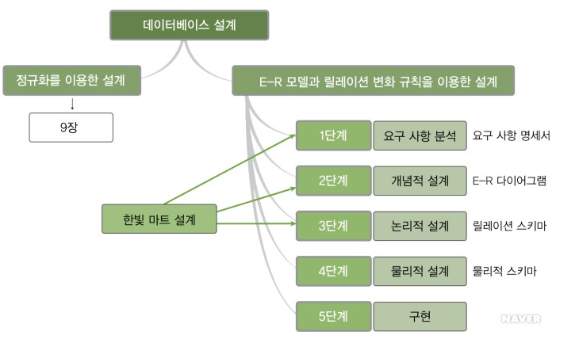
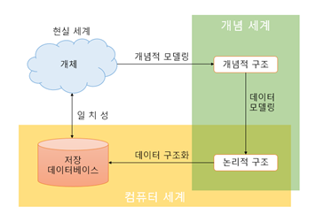
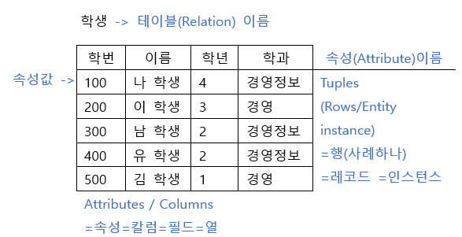

# 11.4

**복습**

2-1. book 테이블, panmai 테이블, gogaek 테이블을 b_id 필드와 g_id 필드를 기준으로 조인하여 다음의 필드 출력 한다. 단, book 테이블의 모든 행은 출력 되도록 한다.(OUTER 조인)
-- b_id, title, g_id, g_name, p_su 필드 출력

```
B_ID TITLE		G_ID  G_NAME	판매수량
-----------------------------------------
b-1	운영체제	  1	  우리서점		13
a-1	데이터베이스	1	 우리서점	   10
a-1	데이터베이스	2	 도시서점	   20
d-1	엑셀		   4	서울서점	 31
c-1	워드		   4	서울서점	  5
f-1	엑세스		  6	   강남서점		 21
b-1	운영체제	  6	  강남서점		 5
a-1	데이터베이스	6	강남서점	   17
a-2	데이터베이스	7	강북서점	   15
a-1	데이터베이스	7	강북서점	   26
f-2	엑세스			
e-1	파워포인트			
b-2	운영체제			
```


```sql
SELECT b_id, title, g_id, g_name   
    , p_su AS 판매수량
FROM book LEFT JOIN panmai USING(b_id)
    LEFT JOIN gogaek USING(g_id)
ORDER BY g_id;
```

> LEFT 조인은 모두 써야한다.

3-1. 년도, 월별 판매 현황 구하기

```
년도	  월	 판매금액
--------------------
2000	3	6000
2000	7	1600
2000	10	10500
2021	11	41661
```


```sql
SELECT 년도, 월, sum(판매금액)
FROM (
    SELECT 
        extract(YEAR FROM p_date) AS 년도
        , extract(MONTH FROM p_date) AS 월
        , p_su * price AS 판매금액
    FROM panmai JOIN danga USING(b_id)
    )
GROUP BY 년도, 월
ORDER BY 월;
```

> 한 단계를 건너서 연결할 수 있다.

5-1. 올해 가장 판매가 많은 책(수량을 기준으로) 

```
책ID	제목		권수
--------------------
a-1	데이터베이스	43
```


```sql
SELECT *
FROM (
    SELECT 
        b_id AS 책ID
        , title AS 제목
        , sum(p_su) AS 권수
    FROM book NATURAL JOIN panmai
    WHERE extract(YEAR FROM p_date) = extract(YEAR FROM sysdate)
    GROUP BY b_id, title
    ORDER BY 권수 DESC
    )
WHERE rownum = 1;
```

> RANK 함수를 쓸 때 ALIAS 로 RANK 를 쓰는 것을 피하자.

---

## **DB 모델링** 

데이터베이스 (Data Base) 모델링 (DB모델링) 정의

1. 현실세계를 물리적으로 데이터베이스화 시키기위한 과정
2. DB 모델링 단계 (과정)

ㄱ. 현실세계를 물리적으로 데이터베이스화 시키기위한 과정

예) 현실세계의 친구정보를 저장

[노트]

번호 이름 주소 연락처...

[앱] 저장 -> 물리적 저장.

예) 주문/결제/배송 현실세계의 업무적인 프로세스를 물리적으로 DB 화시키기 위한 과정.

​		(1)											(2)

업무 프로세스 (현실세계) -> 개념적 모델링 -> 개념적 구조

​			↕ 일치섬 검토											↓ (3) 논리적 모델링 DB 모델링

​	물리적 DB 구현	←	(4) 물리적 모델링 ← 데이터 논리적 구조


ㄴ. DB 모델링 단계 (과정)

2-1. 업무요구분석 @@@@@ 프로젝트 - [요구분석서 == 요구사항 명세서]

1. 관련분야에 대한 기본지식과 상식 필요.
   - 예) 회계프로그램 (대차대조표, 자산, 손실...)
2. 신입사원 입장으로 업무자체와 프로세스 파악, 분석필요
3. 문서 (서류, 장표, 보고서) 를 이용하여 데이터로 관리되어지는 항목을 정확히 파악
4. 담당자와 인터뷰
5. 어떠한 사실이 정의되기위한 백그라운드 프로세스 파악, 하나의 업무에서 다양한 경우의 수 파악 필요
6. 사용자 요구분석


정규화의 개념 지식백과 - Chapter 8 데이터베이스 설계




2-2. 개념적 DB 모델링 (설계) - ER - Diagram 작성

1. 2-1 에의 업무요구분석에서 얻어진 내용을 토대로 
   - 엔티티 (Entity) 를 추출하고, 
   - 엔티티 내의 속성 (Attribute) 를 구성하며, 
   - 엔티티 간의 관계를 정의하여
   - --> ER-Diagram 을 작성 (정의) 하는 단계

데이터 베이스 모델링을 함에 있어 가장 먼저 해야될 일은 사용자가 필요로 하는 데이터가 무엇이며
어떤 데이터를 데이터베이스에 담아야 하는 지에 대한 충분한 분석이다.
이러한 것들은 업무 분석, 사용자 요구 분석 등을 통해 얻어지며 수집된 현실 세계의 정보들을 사람들이 이해할 수 있는 명확한 형태로 표현하는 단계를 '개념적 데이터베이스 모델링' 이라고 한다.

[명확한 형태] == 엔티티 (Entity)

(1) 엔티티 (Entity) == 실체

1. 업무 수행을 위해 데이터로 관리 되어져야 하는 사람, 사물, 장소, 사건 등을 '실체' 라 한다.
   - 이 때 구축하고자 하는 업무의 목적과 범위, 전략에 따라 데이터로 관리 되어져야하는 항목을 파악하는 것이 매우중요.
2. 실체는 학생, 교수 등과 같이 물리적으로 존재하는 유형
   - 과목, 학과 등과 같이 개념적으로 존재하는 대상 (무형) 이 될 수 있다. 
   - 실체는 테이블로 정의된다.
   - 실체는 인스턴스라 불리는 개별적인 객체들의 집합이다.
     - 예) 과목: 자료구조, 데이터베이스, 프로그래밍 등의 인스턴스들의 집합.
     - 학과: 컴퓨터공학과, 전자공학, 국어교육학과 등의 인스턴스들의 집합.
   - 실체를 파악하는 요령
     - 관련 업무에 대한 지식 (가장 중요)

예)

학원에서는 학생들의 출결상태와 성적들을 과목별로 관리하기를 원하고 있다.. (업무 분석한 내용)

실체 ? 

학생 (유형), 출결상태 (무형), 성적, 과목 + 학원 (체인점)

(2) 속성 (Attribute)

1. 속성이란 ? 실체 (E) 에 대한 저장할 필요가 있는 정보.
   - 즉, 속성은 실체의 성질, 분류, 수량, 상태, 특성, 특징 등 세부항목을 의미한다.
   - 관리의 목적과 활용 방향에 맞는 속성 설정 (가장 중요)
   - 예) 학생 실체
     - 속성: 학생명, 주소, 이메일, 연락처 - 증조할머니 정보, 키, 몸무게
   - 속성은 컬럼으로 정의된다.
     - [사원 (emp) 실체]
     - 속성: 사번, 이름, 연락처, 부서, 직급, 주민번호, 나이 등등등
   - 속성의 유형
     1. 기초 속성: 실체가 가지고 있는 원래의 속성
     2. 추출 속성: 기초속성으로 가공처리해서 얻어질 수 있는 속성
        - 주민번호 -> 나이계산
        - 나이속성
     3. 설계 속성: 실제 존재하지 않으나 시스템의 효율성을 위해서 설계자가 임의로 부여하는 속성.
        - 주문상태 (주문, 결제완료, 배송준비중, 배송완료)
   - 속성 도메인 설정.
     - 속성이 가질 수 있는 값들의 범위, '속성의 도메인 설정'
     - 도메인 정의할 때는 속성의 이름, 자료의 형태, 길이, 형식, 허용되는 값의 범위와 같은 제약조건, 유일성, 널 여부, 초기값 등 사항...
     - 도메인 무결성...
   - 식별자 (identifier)
     - 한 실체 내에서 각각의 인스턴스 (레코드, 행) 를 유일하게 구분할 수 있는 단일속성, 속성그룹
     - 실체 (개체) 무결성
     - 식별자가 없으면 수정/삭제 어렵다.
     - 식별자의 종류
       1. 후보키: 실체를 구분할 수 있는 속성
          - 예) 사원번호, 주민번호, 휴대폰번호, 이메일
       2. 기본키(PK): 후보키 중에 가장 적합한 키 - 사원번호
          - 실체를 대표할 수 있나 ? 업무적으로 활용도가 높나 ? 
          - 길이 짧나 ? 등등 이런 조건에 따라 후보키 중에 선정한다.
       3. 대체키: 후보키 - 기본키
          - 성능: 인덱스 (index) 로 활용된다.
       4. 복합키: 둘 이상의 속성 (컬럼) 을 묶어서 식별자로 정의하는 경우
       5. 대리키: 복합키 X -> 인위적으로 식별자 (역정규화)





(3) 관계 (Relational) - 업무상의 연관성

예시

| 부서E  | 소속관계 | 사원E |
| ------ | -------- | ----- |
| 비디오 | 대여관계 | 회원  |
| 학생   | 수강관계 | 과목  |

관계표현

1. 실체 - 실선 - 실체
2. 관계차수표현: 부서 여러명 사원은 1: N 관계
   - 고객 상품은 다대다 관계. N : N 관계
3. 선택성 부여

(4) ER-Diagram

실체 (Entity): 사각형

속성 (Attribute): 타원

식별자: 언더바 ( _ )

관계: 실선, 마름모

네이버검색: ER 다이어그램 

  **[개념적 데이터 베이스 총 정리]** 
예) 사원과 부서간의 소속 관계

1단계) 업무 분석 : 각 사원의 소속 부서에 대한 정의를 내리고자 한다.
2단계) 실체 도출 : 부서, 사원                           직사각형
3단계) 속성 도출 : 부서 - 부서코드,부서명,위치             타원
                사원 - 사원번호,사원명,입사일,주소, 주민번호
4단계) 식별자 도출 : 부서 - 부서코드          언더라인
                 사원 - 사원번호
5단계) 관계 설정 - 소속 관계              마름모
   부서에는 사원이 배치된다.
   사원은 부서에 소속된다.
6단계)  관계 차수   :  1 : 다 관계 ( 부서:사원 )
7단계)  관계 선택성 : 관계 식별 여부 파악
    각 부서에는 하나 이상의 사원이 배치되어질 지도 모른다. (Option 선택)
   각 사원은 반드시 하나의 부서에 소속되어진다. (Mandatory 필수)

□ 실무자와 같이 업무적인 설명을 듣고 모델링을 시작해 보자.

      1. 회원제를 실시하는 비디오 상점.
      2. 회원 관리
         ㄱ) 회원이름, 주민번호, 전화번호, 휴대폰번호, 우편번호, 주소, 등록일 등 .
      3. 비디오 테이프 관리
         ㄱ) 장르별, 등급별로 나누어 관리.
         ㄴ) 고유한 일련번호를 부여해서 비디오 테이프를 관리. 
         ㄷ) 영화제목, 제작자, 제작 국가, 주연배우, 감독, 개봉일자, 비디오 출시일 등 상세 정보 관리.
         ㄹ) 파손 여부와 대여 여부 관리.      
      4. 비디오 테이프 대여
         ㄱ) 회수일이 기본 이틀
         ㄴ) 미납 회원들의 목록을 자동으로 관리.
         ㄷ) 연체되었을 경우에는 연체료를 받는다.
         ㄹ) 대여료 신/구 차등 관리.
      5. 포인터 관리 서비스
         ㄱ) 회원에게 대여 1회당 1점씩 포인트 점수를 부여하여 10점이 되면 무료로 TAPE 하나 대여 서비스
      6. 관리자 관리
         ㄱ) 일별 , 월별, 년별 매출액 손쉽게 파악.
         ㄴ) 비디오 테이프의 대여 회수 파악.
         ㄷ) 연체료 관리
         ㄹ) 미납 회원 관리.
         ㅂ) 직원 관리( 근무 시간, 임금 자동 계산 )
         ㅅ) 체인점을 확장해 운영하고 자 함. 


```
  1. 회원제를 실시하는 비디오 상점.
  2. 회원 관리
     ㄱ) 회원이름, 주민번호, 전화번호, 휴대폰번호, 우편번호, 주소, 등록일 등 .
  3. 비디오 테이프 관리
     ㄱ) 장르별, 등급별로 나누어 관리.
     ㄴ) 고유한 일련번호를 부여해서 비디오 테이프를 관리. 
     ㄷ) 영화제목, 제작자, 제작 국가, 주연배우, 감독, 개봉일자, 비디오 출시일 등 상세 정보 관리.
     ㄹ) 파손 여부와 대여 여부 관리.      
  4. 비디오 테이프 대여
     ㄱ) 회수일이 기본 이틀
     ㄴ) 미납 회원들의 목록을 자동으로 관리.
     ㄷ) 연체되었을 경우에는 연체료를 받는다.
     ㄹ) 대여료 신/구 차등 관리.
  5. 포인터 관리 서비스
     ㄱ) 회원에게 대여 1회당 1점씩 포인트 점수를 부여하여 10점이 되면 무료로 TAPE 하나 대여 서비스
  6. 관리자 관리
     ㄱ) 일별 , 월별, 년별 매출액 손쉽게 파악.
     ㄴ) 비디오 테이프의 대여 회수 파악.
     ㄷ) 연체료 관리
     ㄹ) 미납 회원 관리.
     ㅂ) 직원 관리( 근무 시간, 임금 자동 계산 )
     ㅅ) 체인점을 확장해 운영하고 자 함. 
```

1. Entity 를 찾는다.

2-3 논리적 DB 모델링 (설계)

ER-Diagram 을 [매핑 룰] 을 적용해서 관계형 데이터베이스 이론에 입각한 스키마를 설계하는 단계

(정규화 과정을 수행하는 단계)

- 스키마 (Schema) ? 데이터베이스 전체 구조, DB 객체, 객체들간의 관계, 제약조건 등등에 대한 명세

1. 부모테이블과 자식테이블
   - E - 관계 - E
   - 관계의 주체 여부: 부모(주체) / 자식 테이블
   - 예) emp 사원 - dept 부서 테이블
2. 기본키 (Primary Key) 외 외래키 (Foreign Key)
3. 식별관계와 비식별관계...
   - 식별관계: 부모테이블 PK -> 자식테이블의 PK 그룹으로 전이되면 식별관계
   - 비식별관계: 부모테이블 PK -> 자식테이블의 일반컬럼으로 전이되면 비식별관계
4. Mapping Rule (매핑룰)
   - 개념적 데이터베이스 모델링에서 도출된 개체타입과 관계타입의 테이블정의를 의미하며 이를 '관계스키마' 라 한다.
   - 즉, ER-Diagram 을 이용해 관계스키마를 생성하기 위해 따르는 룰: Mapping Rule
     1. 단순 엔티티
     2. 속성
     3. 식별자
     4. 관계

1. 이상현상

   - 삽입이상
   - 수정이상
   - 삭제이상

2. 종속성

   - 함수적 종속성
   - 완전 함수적 종속성: 모두가 종속
   - 부분 함수적 종속성
     - PK 복합키 [A + B]	->	[X] 특정컬럼 [Y]. X 는 A 와 B, Y 는 B 에게만 종속
     - 급여지급테이블 PK[사원번호 + 지급일] 
     - 지급액은 사원번호와 지급일에 종속. 사원이름은 사원번호에만 종속.
   - 이행 함수적 종속성
     - X -> Y Y -> X
     - 사원번호 사원이름 부서번호 부서명
     - X Y Z K 에서 부서명은 부서번호에 종속 (Z -> K)

3. +++ 정규화 +++

   필요성 ? 이상현상 (삽, 삭, 수) 제거, 부분함수종속, 이행함수종속성 제거, 정보의 중복성 제거

   - 제 1 정규화
   - 제 2 정규화
   - 제 3 정규화
   - 제 4 정규화

   파일 - 새로작성 - eXerd


단축키

- 3: 테이블 생성
- ctrl enter: 다음줄 입력
- delete: 레코드 제거
- 4: 비식별 관계
- 5: 식별 관계
- ctrl shift F: 자동정렬

**이상 현상의 종류**

이벤트참여 릴레이션을 이용해 잘못 설계된 릴레이션에서 발생할 수 있는 이상 현상을 살펴보고, 이를 통해 이상 현상의 개념을 이해해보자.

릴레이션:

튜플: 레코드

| *삽입 이상* | 새 데이터를 삽입하기 위해 불필요한 데이터도 함께 삽입해야 하는 문제 |
| ----------- | ------------------------------------------------------------ |
| *갱신 이상* | 중복 투플 중 일부만 변경하여 데이터가 불일치하게 되는 모순의 문제 |
| *삭제 이상* | 투플을 삭제하면 꼭 필요한 데이터까지 함께 삭제되는 데이터 손실의 문제**[네이버 지식백과]** [이상 현상의 종류](https://terms.naver.com/entry.naver?docId=3431241) (데이터베이스 개론, 2013. 6. 30., 김연희) |

**삽입 이상**

**갱신 이상**

**삭제 이상**

**함수 종속**

예시)

DEPT 테이블

deptno(PK) dname loc

완전 함수 종속(FFD;Full Functional Dependency)

**제 1 정규화** 

[ First Normal Form ]

1NF: 제 1 정규화

릴레이션에 속한 모든 [속성](https://terms.naver.com/entry.nhn?docId=3431117&ref=y)의 [도메인](https://terms.naver.com/entry.nhn?docId=3431138&ref=y)이 원자 값(atomic value)으로만 구성되어 있으면 제1정규형에 속한다.

반복 (중복) 되는 속성의 도메인이 존재하면 제 1 정규화 과정을 거친다.

ERD: ER Diagram

ERD - 매핑툴 -> 관계스키마를 만들다.

Q. 언제 식별관계 비식별관계를 쓸까?

A. 

**제 2 정규화**

- 부분함수종석 제거해서 완전 함수종속으로 만든다.
- 모든 컬럼들은 복합키 전체에 종속적이어야 한다.

**제 3 정규화**

이행적 함수종속 제거

예) 

X -> Y

Y -> Z

```
X (결정자)	 		  Y(종속자)		Z
사원번호 (PK) 사원명	부서번호	부서지역명(loc)
------------------------------------------------
10			홍길동		10			SEOUL
```

emp

사원번호, 사원명, 부서번호 (FK)

dept 

부서번호 (OK), 부서명

**제 3 정규화**

=====================

**제 4 정규화**

다치 종속성 X

**제 5 정규화**

**보이스/코드 정규화**

BCNF (Boyce/Codd Normal Form)

X 	->	 Y

결정자	종속자

Z	<-		Y

PK (복합키) 의 컬럼 Z 가 일반컬럼인 Y 에게 종속적이다.

[X	Y]

[Y	Z]

**역정규화**

혹은 물리적모델링이라고 한다.

식별관계를 제거하고 비식별관계로 만든다.

**트리거**

대여하면 매출액 테이블이 수정되도록 트리거를 걸 수 있다.

eXerd 로 작성한 후 포워드한다.

내일: 시퀀스, PL/SQL

# 11.5

## **뷰**

1. 테이블을 보기 위한 창문
2. 뷰의 의미는 하나의 SELECT 문과 같다.
3. 통해 insert, update, delete가 가능하지만 대개의 경우는 select를 위해 사용한다.
4. 한개 이상의 기본 테이블이나 다른 뷰를 이용하여 생성되는 가상 테이블(virtual table)이다.
5. 전체 데이터 중에서 일부만 접근할 수 있도록 제한하기 위한 기법이다
6. 데이터 딕셔너리 테이블에 뷰에 대한 정의만 저장하고 디스크에 저장 공간이 할당되지 않는다.
7. 사용이유 ? 중요한 데이터를 보호하기 위한 보안(security) 목적과, 사용자에게 편의성(flexibility)를 제공하기 위한 목적을 달성하기  위해서이다.
   • 테이블과 같이 뷰에 대한 DML 연산 즉, 쿼리, update, insert, delete가 가능하며  constraint(제약조건)도 부여할 수 있다.
8. 테이블과 같이 뷰에 대한 DML 연산 즉, 쿼리, update, insert, delete가 가능하며 constraint(제약조건)도 부여할 수  있다.
9. 뷰의 종류
   ㄱ. 심플뷰 (Simple View) - 1개 테이블
   ㄴ. 복합뷰 (Complex View) - 여러개 테이블
10. 뷰의 생성

**형식**

```sql
	CREATE [OR REPLACE] [FORCE | NOFORCE] VIEW 뷰이름
		[(alias[,alias]...]
	AS 서브쿼리
	[WITH CHECK OPTION]
	[WITH READ ONLY];
```


```sql
CREATE VIEW panView
AS
SELECT b.b_id, price, g.g_id, g_name, p_date, p_su
FROM book b JOIN danga d On b.b_id = d.b_id
            JOIN panmai p ON b.b_id = p.b_id
            JOIN gogaek g ON g.g_id = p.g_id;
```

**에러**

```
ORA-01031: insufficient privileges
01031. 00000 -  "insufficient privileges"
*Cause:    An attempt was made to perform a database operation without
           the necessary privileges.
*Action:   Ask your database administrator or designated security
           administrator to grant you the necessary privileges
```

불충분한 권한

뷰 생성 권한부여

```sql
GRANT CREATE VIEW
TO scott;
```

편리성 + 성능 향상 + 보안

```sql
CREATE OR REPLACE VIEW panView
AS
SELECT b.b_id, title, price, g_name, p_date, p_su
FROM book b JOIN danga d On b.b_id = d.b_id
            JOIN panmai p ON b.b_id = p.b_id
            JOIN gogaek g ON g.g_id = p.g_id;
```

**FORCE**

```sql
CREATE OR REPLACE FORCE VIEW forceVIEW
AS
SELECT *
FROM tbl_xxx;
```

`NOFORCE` 가 디폴트이다.

**문제**

년도, 월, 고객코드, 고객명, 판매금액합 (년도별, 월) 조회

```
2000	03	2	도시서점	6000
2000	07	4	서울서점	1600
2000	10	1	우리서점	3000
2000	10	7	강북서점	7500
2021	11	1	우리서점	5850
			:
			:
```


```sql
SELECT to_char(p_date, 'YYYY') year
    , to_char(p_date, 'MM') month
    , g_id
    , g_name
    , sum(p_su * price)
FROM panmai JOIN gogaek USING (g_id)   
    JOIN danga USING (b_id)    
GROUP BY to_char(p_date, 'YYYY') 
    , to_char(p_date, 'MM'), g_id, g_name 
ORDER bY to_char(p_date, 'YYYY') 
    , to_char(p_date, 'MM');
```


**테이블 생성**

```sql
CREATE TABLE testa (
    aid     number      PRIMARY KEY
    , name  varchar2(20) NOT NULL
    , tel   varchar2(20) NOT NULL
    , memo  varchar2(100)
);

CREATE TABLE testb (
    bid     number PRIMARY KEY
    , aid   number CONSTRAINT fk_testb_aid REFERENCES testa(aid)
        ON DELETE CASCADE
    , score number(3)
);

INSERT INTO testa (aid, NAME, tel) VALUES (1, 'a', '1');
INSERT INTO testa (aid, name, tel) VALUES (2, 'b', '2');
INSERT INTO testa (aid, name, tel) VALUES (3, 'c', '3');
INSERT INTO testa (aid, name, tel) VALUES (4, 'd', '4');

INSERT INTO testb (bid, aid, score) VALUES (1, 1, 80);
INSERT INTO testb (bid, aid, score) VALUES (2, 2, 70);
INSERT INTO testb (bid, aid, score) VALUES (3, 3, 90);
INSERT INTO testb (bid, aid, score) VALUES (4, 4, 100);

COMMIT;
```

**[단순 뷰]**

```sql
CREATE OR REPLACE VIEW aView
AS
SELECT aid, name, tel
FROM testa;
```

**[복합 뷰]**

불가능한 코드

```sql
INSERT INTO abView (aid, name, tel, bid, score)
VALUES (10, 'X', '5', 20, 70);
```

**오류**

```
SQL 오류: ORA-01776: cannot modify more than one base table through a join view
01776. 00000 -  "cannot modify more than one base table through a join view"
*Cause:    Columns belonging to more than one underlying table were either
           inserted into or updated.
*Action:   Phrase the statement as two or more separate statements.
```

동시에 두 테이블에 추가 X

**가능한 코드**

```sql
UPDATE abView
SET score = 99
WHERE bid = 1;
```


**[뷰의 생성]**

**형식**

```sql
CREATE [OR REPLACE] [FORCE] VIEW 뷰이름
	[(alias[,alias]...]
AS 서브쿼리
[WITH CHECK OPTION]
[WITH READ ONLY];
```


| 옵션              | 설명     |
| ----------------- | -------- |
| ALIAS             |          |
| WITH CHECK OPTION |          |
| WITH READ ONLY    | 읽기전용 |


**조건**

```sql
CREATE OR REPLACE VIEW bView
AS
SELECT bid, aid, score
FROM testb
WHERE score >= 90;

SELECT * FROM bView;
UPDATE bView
SET score = 70
WHERE bid = 3;
```

> UPDATE 했을 때 조건을 벗어나면 뷰에서 빠진다.

**WITH CHECK OPTION**

```sql
CREATE OR REPLACE VIEW bView
AS
SELECT bid, aid, score
FROM testb
WHERE score >= 90
WITH CHECK OPTION [CONSTRAINT ck_bview];
```

뷰에 의해 access 될 수 있는 행 (row) 만이 삽입, 수정 가능

WITH CHECK OPTION 체크 제약조건 옵션때문에 90 미만의 점수로 수정할 수 없다.

**[물리적 뷰 (Materialized View)]**

실제 데이터를 가지고 있으며, 테이블의 데이터에 I/U/D 등의 작업을 한 경우

물리적 뷰에 반영된다.

사용 ? 

공부: 전공자만 찾아본다. 빅데이터에 사용된다.

SELECT 에서 JOIN 등 코드가 길어지면 VIEW 로 만든다.

ora_help: sequence 검색

**[Sequence]**

1. 은행/식당 - [번호표]
2. 시퀀스 ? 기존의 테이블에 대해 기본키나 유니크 키를 사용하여 부가하는 일종의 새로운 컬럼처럼 사용할 수 있는 일련번호를 매김하기 위한 하나의 컬럼으로  구성된 테이블과 같다.
3. 객체 스스로만 사용할 의미가 없으며, 기존의 테이블과 연계해서 사용하게 된다. 
4. 시퀸스 생성

특징

• 유일한 연속번호를 자동으로 생성
• 기본키값 생성을 위해 사용
• Application Code를 대채
• 메모리에  Cache되어 access 효율성을 증가
• 시퀀스는 여러 테이블에 의해 공유될 수 있다.

**형식**

```sql
CREATE SEQUENCE 시퀀스명
[ INCREMENT BY 정수]
[ START WITH 정수]
[ MAXVALUE n ¦ NOMAXVALUE]
[ MINVALUE n ¦ NOMINVALUE]
[ CYCLE]
[ CACHE n ¦ NOCACHE];
```

increment: 증가

CYCLE 을 돈다면 MINVALUE 부터 시작할 수 있다.

디폴트

```
MIN_VALUE 	MAX_VALUE		INCREMENT_BY 
-------------------------------------------------------
1	9999999999999999999999999999	1	N	N	20	1
```


| 의사칼럼 | 형식             | 설명        |
| -------- | ---------------- | ----------- |
| NEXTVAL  | 시퀸스명.NEXTVAL | 다음값 반환 |
| CURRVAL  | 시퀸스명.CURRVAL | 현재값 반환 |

번호표가 5번이 나와있다면 nextval = 5, currval = 4

+++++ CURRVAL이 참조되기 전에 NEXTVAL이 먼저 사용되어야 한다.

1)**NEXTVAL과 CURRVAL을 사용할 수 있는 경우**
\- subquery가 아닌 SELECT 문
\- INSERT  문의 DML SELECT 문
\- INSERT 문의 DML VALUES 절
\- UPDATE 문의 SET 절 

2)**NEXTVAL과 CURRVAL을 사용할 수 없는 경우**
\- VIEW 문의 SELECT 문
\- DISTINCT  키워드를 사용한 SELECT 문
\- GROUP BY, AVING, ORDER BY를 이용한 SELECT 문
\- SELECT,  DELETE, UPDATE 문에서의 subquery
\- CREATE TABLE, ALTER TABLE 명령문의 DEFAULT 절

**시스 생성 및 삭제**

```sql
CREATE SEQUENCE seq01;
DROP SEQUENCE seq01;
```

**시퀸스 확인**

```sql
SELECT *
FROM user_sequences;
```


```sql
CREATE T/U/S/V
ALTER T/U/S
DROP T/U/S/V
```

- Table

View

DEPT 테이블의 PK (deptno) 로 사용될 시퀸스 생성 + 사용.


```sql
CREATE SEQUENCE seq_dept
INCREMENT BY    10
START WITH      50
MAXVALUE        90
NOCACHE;
```

> ROLLBACK 을 해도 시퀸스는 증가한다.

```sql
INSERT INTO dept(deptno, dname, loc) VALUES (seq_dept.nextval, 'QC', 'SEOUL');
```

**[PL/SQL]**

PL (Procedural Language) + SQL

철자적인 언어 문법이 확장된 SQL

1. 변수 선언
2. 참, 거짓 구별 가능 (제어문)
3. 원하는 곳으로 이동 (제어문)
4. 예외처리 try - catch 문

오라클 DBMS

**PL/SQL 블럭구조**

```sql
   [ DECLARE ]
      -- 선언문(declarations)
   BEGIN
      -- 실행문(statements)
   [ EXCEPTION ]
      -- 예외 처리문(handlers)
   END;
```

PL/SQL 의 블럭 작성 요령

PL/SQL 의 6가지 종류

1. anonymous procedure (익명 프로시저)
2. stored procedure (저장 프로시저)
3. stored function (저장 함수)
4. package (패키지)
5. trigger (트리거)
6. object type

```sql
DECLARE
    vename varchar2(20);
    vsal number(7, 2);
BEGIN
    vename := 'SMITH';
    vsal := 800;
END;
```

PL/SQL 대입연산자는 `=` 이 아니고 `:=` 이다.


**DBMS_OUTPUT.**

이 패키지는 PL/SQL 내에서 처리된 어떤 결과를 사용자의 화면에 출력할 때 사용한다

- `put_line()` 
- 

이 패키지는 C언어의 printf와 유사하며, 이 패키지에 의해 출력되는 결과를 화면에 나타내기 위해서는 SQL*Plus에서 반드시 다음과 같이  환경을 설정해 주어야 한다. 

SQL> **[SET  SERVEROUTPUT ON]**

보기탭 - DBMS 출력 - 플러스 ( + ) 클릭

```
SMITH, 800
```


```sql
DECLARE
    vename varchar2(20);
    vsal number(7, 2);
BEGIN
    vename := 'SMITH';
    vsal := 800;
    dbms_output.put_line(vename || ', ' || vsal);
END;
```

> PL/SQL 에는 항상 세미콜론

```sql
DECLARE
    vename  emp.ename%TYPE;
    vpay    NUMBER;
BEGIN 
    SELECT ename, sal + nvl(comm, 0) AS pay
        INTO vename, vpay
    FROM emp
    WHERE empno = 7369;
    dbms_output.put_line(vename || ', ' || vpay);
END;    
```


```
7839 KING PRESIDENT  81/11/17
```


```sql
DECLARE
    vempno       NUMBER;
    vename       VARCHAR2(20);
    vjob         VARCHAR2(20);
    vmgr         NUMBER;
    vhiredate    DATE;
    vpay    NUMBER;
BEGIN 
    SELECT *
        INTO vempno, vename, vjob, vmgr, vhiredate, vpay
    FROM (
        SELECT empno, ename, job, mgr, hiredate
            , sal + nvl(comm, 0) AS pay
        FROM emp
        ORDER BY pay DESC)
    WHERE rownum = 1;    
    dbms_output.put_line(vempno || ' ' || vename || ' ' || vjob || ' ' || vmgr || ' ' || vhiredate);
END;    
```

**에러**

```sql
DECLARE
    vemprow emp%rowtype;
BEGIN
    SELECT *
        INTO vemprow.vempno, vemprow.vename, vemprow.vjob, vemprow.vmgr, vemprow.vhiredate, vemprow.vpay
    FROM (
        SELECT empno, ename, job, mgr, hiredate
            , sal + nvl(comm, 0) AS pay
        FROM emp
        ORDER BY pay DESC)
    WHERE rownum = 1;    
    dbms_output.put_line(vemprow.vempno || ' ' || vemprow.vename || ' ' || vemprow.vjob || ' ' || vemprow.vmgr || ' ' || vemprow.vhiredate);
END;    
    
    
```

> 서브쿼리가 여러개 들어가도 된다.


**오류**

```sql
ORA-01422: exact fetch returns more than requested number of rows
ORA-06512: at line 5
01422. 00000 -  "exact fetch returns more than requested number of rows"
*Cause:    The number specified in exact fetch is less than the rows returned.
*Action:   Rewrite the query or change number of rows requested
```

> PL/SQL SELECT 결과가 여러개의 행일경우에는 반드시 커서 (CURSOR) 를 사용해야 된다.

```sql
DECLARE
    vename  emp.ename%type;
    vjob    emp.job%type;
BEGIN
    SELECT ename, job
        INTO vename, vjob
    FROM emp;
    dbms_output.put_line(vename || ', ' || vjob);
END;
```

**[PL/SQL 제어문]**

변수를 하나 선언해서 정수를 입력받아서 짝수/홀수라고 출력 (if 문)

**IF**

```sql
IF () THEN
ELSIF () THEN
ELSE
END IF;
```

**CASE**

```sql
CASE
	WHEN THEN
	ELSE
END;
```

**자바**

```java
if () {}
else if () {}
else () {}
```


```
홀수
```

```sql
DECLARE
    vnum    NUMBER(3) := 0;
    vresult VARCHAR(6);
BEGIN 
    vnum := 11;
    IF (mod(vnum, 2) = 2) THEN
        vresult := '짝수';
    ELSE
        vresult := '홀수';
    END IF;
    dbms_output.put_line(vresult);
END;
```


**입력받아 수우미양가**

```sql
DECLARE
    answer  VARCHAR(10) := trunc(:pkor / 10);
BEGIN
    IF (answer IN (9, 10)) THEN
        answer := '수';
    ELSIF (answer = 8) THEN
        answer := '우';
    ELSIF (answer = 7) THEN
        answer := '미';
    ELSIF (answer = 6) THEN
        answer := '양';
    ELSE
        answer := '가';
    END IF;

    dbms_output.put_line(answer);
END;
```

**CASE WHEN THEN**

```sql
DECLARE
  -- 선언부분
  vkor NUMBER(3) := 0;
  vgrade VARCHAR2(3);
BEGIN
  -- 실행부분
  vkor :=   :pkor;
  
  vkor := TRUNC( vkor / 10 );
  
  CASE  vkor
        WHEN 10 THEN vgrade := '수';
        WHEN 9 THEN vgrade := '수';
        WHEN 8 THEN vgrade := '우';
        WHEN 7 THEN vgrade := '미';
        WHEN 6 THEN vgrade := '양';
        ELSE        vgrade := '가';
  END CASE;
   
  DBMS_OUTPUT.PUT_LINE( vgrade );
--EXCEPTION
  -- 예외처리 부분
END;
```

> SQL 과 다르게 END CASE 라고 해야한다.

**[FOR]**

```sql
FOR 변수 IN [REVERSE] 초기값.. 최종값
LOOP
	반복적으로 처리할 코딩;
END LOOP;
```

**[WHILE]**

```sql
WHILE (조건문)
LOOP
	반복적으로 처리할 코딩;
END LOOP;
```

**합 구하기**

```
1+2+3+4+5+6+7+8+9+10 =55
```

**FOR**

```sql
DECLARE
    vi      NUMBER;
    vsum    NUMBER := 0;
BEGIN
    FOR vi IN 1..10
    LOOP
        IF (vi != 10) THEN
            dbms_output.put(vi || '+');
        ELSE
            dbms_output.put(vi);
        END IF;
        vsum := vsum + vi;
    END LOOP;
        dbms_output.put_line(' =' || vsum);
END;
```

**WHILE**

```sql
DECLARE 
    vi      NUMBER := 1;
    vsum    NUMBER := 0;
BEGIN
    WHILE vi <= 10 LOOP

        IF (vi != 10) THEN
            dbms_output.put(vi || '+');
        ELSE
            dbms_output.put(vi);
        END IF;
        vsum := vsum + vi;
        vi := vi + 1;
        
    END LOOP;
    
    dbms_output.put_line(' =' || vsum);
END;
```

**EXIT WHEN**

```sql
DECLARE 
    vi NUMBER := 1;
    vsum NUMbER := 0;
BEGIN 
    LOOP
    EXIT WHEN vi = 11;
    dbms_output.put(vi || '+');
    vsum := vsum + vi;
    vi := vi + 1;
    END LOOP;
    
    dbms_output.put_line(' =' || vsum);
END;
```

> END 에는 항상 세미콜론이 있어야 한다.

**구구단**

2단부터 9단까지 출력

**FOR**

```
[2 단]
2x1=2
2x2=4
2x3=6
2x4=8
2x5=10
2x6=12
2x7=14
2x8=16
2x9=18

[3 단]
3x1=3
3x2=6
3x3=9
3x4=12
  :
  :
8x7=56
8x8=64
8x9=72

[9 단]
9x1=9
9x2=18
9x3=27
9x4=36
9x5=45
9x6=54
9x7=63
9x8=72
9x9=81
```


```sql
BEGIN
    FOR i IN 2..9 LOOP
        dbms_output.put_line('[' || i || ' 단]');
    
        FOR j IN 1..9 LOOP
            dbms_output.put_line(i || 'x' || j || '=' || i * j);
        END LOOP;
        
        dbms_output.put_line('');
    END LOOP;
END;
```

> FOR문에 사용되는 반복변수는 선언 안해도 된다.
>
> DECLARE 또한 없어도 된다.

**WHILE**

```sql
DECLARE
    i NUMBER := 2;
    j NUMBER := 1;
BEGIN
    WHILE i <= 9 LOOP
    j := 1;
        WHILE j <= 9 LOOP
            dbms_output.put_line(i || 'x' || j || '=' || i * j);
            j := j + 1;
        END LOOP;
    i := i + 1;
    END LOOP;
END;
```

> WHILE 은 초기값과 증감값을 입력해야 한다.

**한 줄 띄우기**

```sql
dbms_output.put_line('');
```

> 작은따옴표를 넣어주어야 한다.

# 11.8

1. PL/SQL 블럭 내에서 실행되는 [SELECT 문]을 의미
2. 오라클에서는 하나의 레코드가 아닌 여러 레코드로 구성된 작업영역에서 SQL문을 실행하고 그 과정에 생긴[정보를 저장]하기 위해서 CURSOR를  사용
3. 2가지 종류
   - `implicit cursor` 묵시적 커서 - 자동
   - `explicit cursor` 명시적 커서 - 강제

명시적 커서 사용순서

1. 커서 선언: `CURSOR` == `SELECT` 문 선언
2. 커서 오픈 `OPEN`
3. 커서 레코드 가져오기 `FETCH` 
4. 커서 닫기 `CLOSE` 

LOOP 를 사용해서 FETCH 한다.

**예제**

커서 미사용

```
SMITH, 800, 80/12/17
```


```sql
DECLARE 
    vename      emp.ename%TYPE;
    vsal        emp.sal%TYPE;
    vhiredate   emp.hiredate%TYPE;
BEGIN
    SELECT ename, sal, hiredate
        INTO vename, vsal, vhiredate
    FROM emp
    WHERE empno = 7369;
    
    dbms_output.put_line(vename || ', ' || vsal || ', ' || vhiredate);
END;
```

```
ORA-01422: exact fetch returns more than requested number of rows
ORA-06512: at line 6
01422. 00000 -  "exact fetch returns more than requested number of rows"
*Cause:    The number specified in exact fetch is less than the rows returned.
*Action:   Rewrite the query or change number of rows requested
```


여러개의 레코드를 가져오면 에러가 난다.

**CURSOR**

```sql
CURSOR 커서명 IS (SELECT 문);
```


**속성**

`%ROWCOUNT` 실행된 커서문장에서 읽힌 행의 수 

`%FOUND`  실행된 커서문장에서 검색된 행이 발견되었는지 알 수 있는 속성 

`%NOTFOUND`  실행된 커서문장에서 검색된 행이 발견되지 않았음을 알 수 있는 속성 

`%ISOPEN`  선언된 커서가 현재 OPEN되어 있는지를 반환


오류3

```sql
DECLARE 
    vename      emp.ename%TYPE;
    vsal        emp.sal%TYPE;
    vhiredate   emp.hiredate%TYPE;
    CURSOR emp_cursor IS (SELECT ename, sal, hiredate FROM emp);
BEGIN
    OPEN emp_cursor;
    
    LOOP
        FETCH emp_cursor INTO vename, vsal, vhiredate
        dbms_output.put_line(vename || ', ' || vsal || ', ' || vhiredate);
        EXIT WHEN emp_cursor.NOTFOUND;
            
    END LOOP;
    
    dbms_output.put_line(vename || ', ' || vsal || ', ' || vhiredate);
    CLOSE emp_cursor;
END;
```

**FOR-IN**

> 

```
SMITH, 800, 80/12/17
ALLEN, 1600, 81/02/20
WARD, 1250, 81/02/22
JONES, 2975, 81/04/02
MARTIN, 1250, 81/09/28
BLAKE, 2850, 81/05/01
CLARK, 2450, 81/06/09
KING, 5000, 81/11/17
TURNER, 1500, 81/09/08
JAMES, 950, 81/12/03
FORD, 3000, 81/12/03
MILLER, 1300, 82/01/23
```


```sql
DECLARE 
    CURSOR emp_cursor IS (SELECT ename, sal, hiredate FROM emp);
BEGIN
    FOR vemprow IN emp_cursor
    LOOP
        dbms_output.put_line(vemprow.ename || ', ' || vemprow.sal || ', ' || vemprow.hiredate);
    END LOOP;
END;
```

> FOR-IN에서는 OPEN, CLOSE 가 필요없다.

ora_help: plsql 검색

예제5


```sql
DECLARE 
    vename      emp.ename%TYPE;
    vsal        emp.sal%TYPE;
    vhiredate   emp.hiredate%TYPE;
    CURSOR emp_cursor IS (SELECT ename, sal, hiredate FROM emp WHERE deptno = :pdeptno);
BEGIN
    OPEN emp_cursor;
    LOOP
        FETCH emp_cursor INTO vename, vsal, vhiredate
        dbms_output.put_line(vename || ', ' || vsal || ', ' || vhiredate);
        EXIT WHEN emp_cursor.NOTFOUND OR emp_cursor%ROWCOUNT >= 3;
    END LOOP;
    CLOSE emp_cursor;
END;
```

**[STORED PROCEDURE]**

저장 프로시저

1. PL/SQL 언어 중에서 가장 대표적인 구조
2. 개발자가 자주 실행해야 하는 업무 흐름을 이 문법에 의해 미리 작성하여 데이터베이스 내에 저장해 두었다가 필요할 때마다 호출하여 실행할 수  있다. 성능때문에 사용한다.

**형식**

```sql
CREATE OR REPLACE PROCEDURE 저장프로시저명 (
	파라미터 [MODE] 자료형
	, 파라미터 [MODE] 자료형
)
IS 
	변수선언
	변수명 자료형;
BEGIN 
EXCEPTION
END;
```

실행방법

1. EXECUTE 문
2. 또 다른 저장프로시저 안에서 호출
3. 익명 프로시저 호출

MODE

1. IN(입력용)
2. OUT(출력용)
3. INOUT(입출력용)

저장 프로시저 사용 예제

DEPT 테이블에 부서를 삭제하는 쿼리

1. DELETE FROM WHERE 


```sql
pdeptno     NUMBER
pdeptno     DEPT.DEPTNO%TYPE
```

> 파라미터를 생략하면 IN

**프로시저 생성**

```
Procedure UP_DELDEPT이(가) 컴파일되었습니다.
```


```sql
CREATE OR REPLACE PROCEDURE up_deldept (
--    pdeptno     NUMBER(2) 자료형 크기는 필요없다.
--    pdeptno     NUMBER
    pdeptno     DEPT.DEPTNO%TYPE
)
IS 
BEGIN
    DELETE FROM dept
    WHERE deptno = pdeptno;
    COMMIT;
END up_deldept;
```

> COMMIT 을 넣고 EXCEPTION 에 ROLLBACK 을 넣는다.

**실행**

```sql
EXECUTE up_deldept(40);
```

**예제2**

DEPT 테이블에 새로운 부서를 추가하는 프로시저 선언 -> 실행


시퀀스 생성

```sql
SELECT * FROM user_sequences;
CREATE SEQUENCE seq_dept
INCREMENT BY 10
START WITH 10;
```


```sql
CREATE OR REPLACE PROCEDURE up_insdept (
    pdname      dept.dname%TYPE := NULL
    , ploc      dept.loc%TYPE DEFAULT NULL
)
IS
BEGIN
    INSERT INTO dept (deptno, dname, loc)
    VALUES (seq_dept.NEXTVAL, pdname, ploc);
    COMMIT;
END;
```

> DEFAULT NULL 에는 := 가 없다.

익명 프로시저 실행

```sql
BEGIN
    up_insdept('QC', 'SEOUL');
END;
```

같은코드

```sql
BEGIN
--    up_insdept(pname => 'QC', ploc => 'SEOUL');
    up_insdept(pdname => 'QC');
END;
```

**예제3**

DEPT 테이블에서 부서정보를 수정하는 저장 프로시저 선언 --> 실행

> EXEC 는 EXECUTE 와 같은코드

**업데이트 프로시저 예시**

```sql
CREATE OR REPLACE PROCEDURE up_updDept (
    pdeptno dept.deptno%type
    , pdname dept.dname%type := null
    , ploc dept.loc%type := null
)   
IS
    vdname dept.dname%type;
    vloc dept.loc%type;
BEGIN
    IF (pdname IS NULL OR ploc IS NULL) THEN
    SELECT dname, loc INTO vdname, vloc
    FROM dept
    WHERE deptno = pdeptno;
    END IF;
    
    UPDATE dept
    SET dname = 
            CASE
                WHEN pdname IS NULL THEN vdname
                ELSE pdname
            END
        , loc = nvl(ploc, vloc) 
    WHERE deptno = pdeptno;
    COMMIT;
END;
```


```sql
EXEC up_updDept(40, 'OPERATIONS');
EXEC up_updDept(40, ploc => 'BOSTON');
EXEC up_updDept(40, 'OPERATIONS', 'BOSTON');
```


**SELECT**

```sql
CREATE OR REPLACE PROCEDURE up_seldept 
IS
    CURSOR vcur_dept IS (SELECT * FROM dept);
    vdeptrow dept%ROWTYPE;
BEGIN
    OPEN vcur_dept;
    LOOP
        FETCH vcur_dept INTO vdeptrow;
        EXIT WHEN vcur_dept%NOTFOUND;
        dbms_output.put_line(vdeptrow.deptno || ', ' || vdeptrow.dname || ', ' || vdeptrow.loc);
    END LOOP;
    CLOSE vcur_dept;
END;
```

**실행**

```
10, ACCOUNTING, NEW YORK
20, RESEARCH, DALLAS
30, SALES, CHICAGO
40, OPERATIONS, BOSTON
50, QC, 
```


```sql
EXEC up_seldept;
```


**암시적 커서 사용**

```sql
CREATE OR REPLACE PROCEDURE up_seldept 
IS
BEGIN
    FOR vdeptrow IN (SELECT * FROM dept)
    LOOP
        dbms_output.put_line(vdeptrow.deptno || ', ' || vdeptrow.dname || ', ' || vdeptrow.loc);
    END LOOP;
END;
```


```
10, ACCOUNTING, NEW YORK
20, RESEARCH, DALLAS
30, SALES, CHICAGO
40, OPERATIONS, BOSTON
50, QC, 
```


```sql
EXEC up_seldept;
```

> FOR-IN 은 자동으로 커서가 만들어진다.
>
> EXEC 에 주석을 달면 에러가 난다.

**예제5**

파라미터 모드 IN, OUT, INOUT


```sql
CREATE OR REPLACE PROCEDURE up_rrn6insa (
    pnum insa.num%type
    , prrn6 OUT VARCHAR2
)
IS
    vssn    insa.ssn%type;
BEGIN
    SELECT ssn INTO vssn
    FROM insa
    WHERE num = pnum;
    
    prrn6 := substr(vssn, 0, 6);
    dbms_output.put_line('> PRRN6 : ' || prrn6);
END;
```


```
> PRRN6 : 771212
771212
```


```sql
DECLARE 
    vrrn6   VARCHAR2(6);
BEGIN
    up_rrn6insa(1001, vrrn6);
    dbms_output.put_line(vrrn6);
END;
```

### 복습

tbl_score 테이블 가져오기

```sql
SELECT * FROM tbl_score;
```

    ㄱ. INSERT 프로시저 선언 -> 실행 up_insScore
        p: num, kor, eng, mat
        v: tot, avg, grade
    ㄴ. UPDATE p kor, eng, mat -> up_updScore
        자동으로 총점, 평균, 등급 수정
    ㄷ. DELETE num -> up_delScore
    ㄹ. SELECT -> up_selScore


**SELECT**

```sql
CREATE OR REPLACE PROCEDURE up_selScore
IS
BEGIN
    FOR vdeptrow IN (SELECT * FROM tbl_score)
    LOOP
        dbms_output.put_line(
            vdeptrow.num
            || ', ' || vdeptrow.name
            || ', ' || vdeptrow.kor
            || ', ' || vdeptrow.eng
            || ', ' || vdeptrow.mat
            || ', ' || vdeptrow.tot
            || ', ' || vdeptrow.avg
            || ', ' || vdeptrow.grade
            );
    END LOOP;
END;
```

**UPDATE**

```sql
CREATE OR REPLACE PROCEDURE up_updScore
IS
BEGIN
    UPDATE tbl_score
    SET 
        kor = round(dbms_random.value(0, 100))
        , eng = round(dbms_random.value(0, 100))
        , mat = round(dbms_random.value(0, 100));
    
    UPDATE tbl_score
    SET 
        tot = kor + eng + mat
        , avg = (kor + eng + mat) / 3;
        
    UPDATE tbl_score
    SET 
        grade = CASE trunc(avg / 10)
                    WHEN 10 THEN '수'
                    WHEN 9 THEN '수'
                    WHEN 8 THEN '우'
                    WHEN 7 THEN '미'
                    WHEN 6 THEN '양'
                ELSE '가'
            END;
    COMMIT;
END;
```

> 변수에 담지 않으면 UPDATE 를 세 번 사용해야 한다.

**다니엘의 DELETE**

```sql
CREATE OR REPLACE PROCEDURE up_delscore
(
    pnum tbl_score.num%type
)
IS
BEGIN
    DELETE FROM tbl_score
    WHERE num = pnum;
    COMMIT;
--EXCEPTION
END up_delscore;

EXECUTE up_delscore(1001);
SELECT * FROM tbl_score; 
```

**INSERT**

내 코드

```sql
CREATE OR REPLACE PROCEDURE up_insScore (
    pnum      tbl_score.num%TYPE := NULL
    , pname      tbl_score.name%TYPE := NULL
    , pkor      tbl_score.kor%TYPE := NULL
    , peng      tbl_score.eng%TYPE := NULL
    , pmat      tbl_score.mat%TYPE := NULL
)
IS
    vtot tbl_score.tot%TYPE := pkor + peng + pmat;
    vavg tbl_score.avg%TYPE := (pkor + peng + pmat) / 3;
    vgrade tbl_score.grade%TYPE;       
        
BEGIN
    vgrade := CASE trunc((pkor + peng + pmat)/ 3 / 10)
                WHEN 10 THEN '수'
                WHEN 9 THEN '수'
                WHEN 8 THEN '우'
                WHEN 7 THEN '미'
                WHEN 6 THEN '양'
        ELSE '가'
    END;
    
    INSERT INTO tbl_score (num, name, kor, eng, mat, tot, avg)
    VALUES (pnum, pname, pkor, peng, pmat, vtot, vavg);
    COMMIT;
END;
```


권재희씨 코드

```sql
CREATE OR REPLACE PROCEDURE up_insscore
(
      pnum IN tbl_score.num%TYPE
    , pname tbl_score.name%TYPE
    , pkor tbl_score.kor%TYPE default 0
    , peng tbl_score.eng%TYPE default 0
    , pmat tbl_score.mat%TYPE default 0
)
IS
    vtot tbl_score.tot%TYPE;
    vavg tbl_score.avg%TYPE;
    vgrade tbl_score.grade%TYPE;
BEGIN
    vtot := pkor + peng + pmat;
    vavg := (pkor + peng + pmat)/3;
    vgrade := CASE trunc((pkor + peng + pmat)/3 / 10)
                WHEN 10 THEN '수'
                WHEN 9 THEN '수'
                WHEN 8 THEN '우'
                WHEN 7 THEN '미'
                WHEN 6 THEN '양'
                ELSE '가'
            END;
    INSERT INTO tbl_score( num, name, kor, eng, mat, tot, avg, grade)
    VALUES ( pnum, pname, pkor, peng, pmat, vtot, vavg, vgrade);
    COMMIT;
— EXCEPTION
END;
```

# 11.9

**[저장함수]**

    회원가입할 때 ID 중복체크를 하는 저장 프로시저
    입력받은 ID 대신에 emp 테이블의 empno 사용해서 테스트


```sql
CREATE OR REPLACE PROCEDURE up_empnoCheck (
    pempno              emp.empno%TYPE
    , pempnoCheck OUT   NUMBER -- 0 사용가능, 1 사용불가능
)
IS 
BEGIN 
    SELECT count(*) INTO pempnoCheck
    FROM emp
    WHERE empno = pempno;
END;
```


```
0
```


```sql
DECLARE
    empnoCheck NUMBER(1);
BEGIN
    up_empnoCheck(1111, empnoCheck);
    dbms_output.put_line(empnoCheck);
END;
```


**에러**

```sql
CREATE OR REPLACE PROCEDURE up_logon (
    pempno              emp.empno%TYPE
    , pename              emp.ename%TYPE
    , plogonCheck OUT   NUMBER -- 0 로그인성공, 1 (ID X), 2 (ID O)
)
IS 
    vempno      emp.empno%TYPE;
    vename              emp.ename%TYPE;
BEGIN 
    SELECT count(*) INTO plogonCheck
    FROM emp
    WHERE empno = pempno;
    
    IF empno = 0 THEN 
        plogonCheck := 1;
    ELSE 
        
        SELECT ename INTO vename
        FROM emp
        WHERE empno = pempno;
        
            IF pename = vename THEN
                plogonCheck := 0;
            ELSE
                plogonCheck := 2;
            END IF;
    END IF;
END;
```

쌤코드

```sql
CREATE OR REPLACE PROCEDURE up_logon
(
   pempno   IN emp.empno%TYPE    -- ID
   , pename IN emp.ename%TYPE  -- PWD
   , plogonCheck OUT NUMBER -- 0 (로그인성공), 1(ID X), 2(ID O, PWD X)
)
IS
  vempno emp.empno%TYPE ;
  vename emp.ename%TYPE;
BEGIN
  SELECT COUNT(*) INTO  vempno -- 0, 1
  FROM emp
  WHERE  empno =  pempno;
  
  IF vempno = 0 THEN
    plogonCheck := 1;   -- ID도 존재하지 않는 경우
  ELSE
    -- ID 존재 확인, PWD 맞는지 체크
    SELECT ename  INTO vename
    FROM emp
    WHERE  empno =  pempno; 
    
    IF pename = vename THEN
      plogonCheck := 0;  -- 로그인 성공
    ELSE
      plogonCheck := 2;  -- ID는 존재하지만 PWD가 틀린 경우
    END IF;    
    
  END IF;  
--EXCEPTION
END;
```


```sql
DECLARE 
    empnoCheck      NUMBER(1);
BEGIN
    up_logon(7369, 'SMITH');
    
    IF logonCheck = 0 THEN
        dbms_output.put_line('로그인 성공~');
    ELSIF logonCheck = 1 THEN
        dbms_output.put_line('ID 존재하지 않습니다~');
    ELSE
        dbms_output.put_line('ID 존재하지만 PWD 가 틀렸습니다.');
    END IF;
END;
```

요구분석서 (명세서) 작성

E, A, R -> ERD

관계 스키마 -> 이상, 종속성 -> 정규화 (eXerd)

오라클서버 물리적으로 테이블, 시퀸스, 제약조건 모든 객체 생성

EXERD

테이블 우클릭 - 특성 - 

포워드 엔지니어링


데이터를 엑셀로 작성

오라클 테이블 우클릭 - 데이터임포트

**[STORED_FUNCTION]**

ora_help: stored_function 검색

1. 스토어 프로시저와 개념이 동일하다.
2. 한가지 차이점: 리턴값이 있다.

**형식**

```sql
CREATE OR REPLACE FUNCTION (
	파라미터
)
RETURN 리턴자료형
IS
	변수선언
BEGIN
	RETURN 리턴값;
EXCEPTION
END;
```

**성별반환 함수예시**


```sql
CREATE OR REPLACE FUNCTION uf_gender (
    prrn        VARCHAR2
)
RETURN VARCHAR2
IS
    vgender VARCHAR(6) := '여자';
BEGIN
    IF mod(substr(prrn, 8, 1), 2) = 1 THEN
        vgender := '남자';
    END IF;
    RETURN vgender;
END;
```


```sql
SELECT num, name, ssn
    , uf_gender(ssn) AS gender
FROM insa;
```

> scott.uf_gender(ssn) 이라고 작성해도 된다.

**합구하는 함수예시**

```sql
CREATE OR REPLACE FUNCTION uf_sum (
    pn      NUMBER
)
RETURN NUMBER
IS
    vsum NUMBER := 0;
BEGIN
    FOR i IN 1..pn
    LOOP
        vsum := vsum + i;
    END LOOP;
    RETURN vsum;
END;
```

```
0	55	5050
```


```sql
SELECT 
    uf_sum(-10)
    , uf_sum(10)
    , uf_sum(100)
FROM dual;
```

**생년월일 예제**

```sql
CREATE OR REPLACE FUNCTION uf_birth (
    prrn        VARCHAR2
)
RETURN VARCHAR2
IS
    vbirth VARCHAR2(10);
    vgender NUMBER(1);
    vcentry NUMBER(4);
    vrrn6 VARCHAR2(6);
BEGIN
    vrrn6 := substr(prrn, 0, 6);
    vgender := substr(prrn, 8, 1);
    vcentry := 
        CASE
            WHEN vgender IN (1, 2, 5, 6) THEN 19
            WHEN vgender IN (3, 4, 7, 8) THEN 20
            ELSE 18
        END;
    vbirth := to_char(to_date(concat(vcentry, vrrn6)), 'YYYY.MM.DD');
    RETURN vbirth;
END;
```


**만나이 계산 예**

```SQL
CREATE OR REPLACE FUNCTION uf_age (
    prrn        VARCHAR2
)
RETURN NUMBER
IS
    vbirth DATE;
    vcentry NUMBER(4);
    vgender NUMBER(1);
    age NUMBER(3);
BEGIN
    vgender := substr(prrn, -7, 1);
    vcentry := 
        CASE
            WHEN vgender IN (1, 2, 5, 6) THEN 19
            WHEN vgender IN (3, 4, 7, 8) THEN 20
            ELSE 18
        END;
    vbirth := to_date(substr(prrn, 3, 4), 'MMDD');
    age := extract(year FROM sysdate) - concat(vcentry, substr(prrn, 1, 2));
    age := age + 
        CASE sign(trunc(sysdate) - vbirth)
            WHEN 1 THEN -1
            ELSE 0
        END;
    
    RETURN age;
END;
```

> 생일지남을 확인할 때 trunc 를 사용하지 않으면 당일에 생일지남을 처리하지 못한다.

```
김정훈	790304-1788896	41
한석봉	811112-1566789	40
이기자	780505-2978541	42
장인철	780506-1625148	42
김영년	821011-2362514	38
나윤균	810810-1552147	39
		:
		:
```


```SQL
SELECT name, ssn, uf_age(ssn) AS age
FROM insa;
```

# 11.10

**[트리거]**

ora_help: trigger 검색

1. 트리거 (Trigger) ? 방아쇠 -> 총알
   - 어떤 (작업 전 또는 작업 후) 트리거에 정의한 로직을 실행하는 PL/SQL 의 한 종류이다.
2. [테이블] 에 미리 지정하면 어떤 특정 [이벤트 DML] 가 발생할 때 자동으로 활동하도록 한 객체를 의미.
3. 예) 
   - 구매자가 근무시간 외에 주문 막을 수 있다. 주문테이블 + INSERT -> 사전 트리거 정의
   - 입고테이블 (100) + 입고(INSERT) -> 재고테이블 (100 + 10) + UPDATE 
4. 트리거 예약어
   - `BEFORE ` 작업전에 자동 처리되는 트리거
   - `AFTER` 작업후에 자동 처리되는 트리거
   - `FOR EACH ROW` 행 트리거
     - UPDATE 문 + 트리거: 업데이트 5행 트리거 5번 호출.
   - `REFERENCING` 영향받는 행의 값 참조
   - `:OLD` 참조 전 열의 값
   - `:NEW` 참조 후 열의 값
5. 트리거 사용하는 곳
   - 업무 규칙의 실행
   - 보안 실행
   - 변경 내용을 로그기록
   - DATA 복제
6. 확인: `SELECT * FROM user_triggers` 
7. 트리거의 삭제 및 활성화/비활성화. 재컴파일.
8. 예제

**형식**

```SQL
CREATE OR REPLACE TRIGGER 트리거 
[BEFORE | AFTER]
이벤트 ON 테이블
[FOR EACH ROW [WHEN TRIGGER 조건]]
DECLARE
BEGIN
END;
```

ROW 트리거에서 컬럼의 실제 데이터값을 제어하는데 사용하는 연산자는 :OLD와 :NEW이다. 

예) 컬럼명이 SAL 이라고 가정할 때

UPDATE -> X 트리거를 호출했다면 변경전의 sal 은 :OLD.sal

변경후의 sal 은 :NEW.sal

**예제**

A 테이블 (DML) -> 트리거 -> B 작업


테스트) tbl_exm1(INSERT) 자동으로 트리거에 의해 tbl_exm2 테이블 로그 기록.

```sql
CREATE OR REPLACE TRIGGER ut_exm1
AFTER
INSERT ON tbl_exm1
BEGIN
    INSERT INTO tbl_exm2 (memo) 
    VALUES ('추가');
END;
```

```sql
INSERT INTO tbl_exm1 (id, name)
VALUES (1, 'admin');
```


> ROLLBACK 하면 트리거도 가이 ROLLBACK 된다.

**INSERT or UPDATE**

```sql
CREATE OR REPLACE TRIGGER ut_exm1
AFTER
INSERT OR UPDATE ON tbl_exm1
BEGIN
    IF INSERTING THEN
        INSERT INTO tbl_exm2 (memo) 
        VALUES ('추가');
    ELSIF UPDATING THEN
        INSERT INTO tbl_exm2 (memo) 
        VALUES ('수정');
    END IF;
END;
```

**DELETE**

예제) BEFORE 트리거 생성 -> 테스트

tbl_exm1 테이블에 근무시간 X, 주말 (토, 일) 에 INSERT, UPDATE, DELETE


**에러발생 코드**

```sql
RAISE_APPLICATION_ERROR(-20000, '지금은 근무시간 또는 주말이기에 작업 안됩니다.');
```

**주문제한 트리거 예시**

```sql
ORA-20000: 지금은 근무시간 또는 주말이기에 작업 안됩니다.
ORA-06512: at "SCOTT.UT_EXM2", line 5
ORA-04088: error during execution of trigger 'SCOTT.UT_EXM2'
```


```sql
CREATE OR REPLACE TRIGGER ut_exm2
BEFORE 
INSERT OR UPDATE OR DELETE ON tbl_exm1
BEGIN
    IF to_char(sysdate, 'HH24') < 9 
        OR to_char(sysdate, 'HH24') > 18 
        OR to_char(sysdate, 'day') IN ('토요일', '일요일') THEN
    RAISE_APPLICATION_ERROR(-20000, '지금은 근무시간 또는 주말이기에 작업 안됩니다.');
    END IF;
END;
```

**[행 트리거]**

**테이블 생성 코드**

```sql
create table tbl_trg1 (
  hak varchar2(10) primary key
  , name varchar2(20)
  , kor number(3)
  , eng number(3)
  , mat number(3)
);

create table tbl_trg2 (
  hak varchar2(10) primary key
  , tot number(3)
  , avg number(3)
  , constraint fk_test2_hak foreign key(hak) references tbl_trg1(hak)
);
```

예) 한 학생의 학, 이, 국, 영, 수 -> tbl_trg1 에 INSERT

자동으로 tbl_trg2 테이블에 tot, avg 계산되어 INSERT 되는 트리거생성 -> 테스트

**에러**

```
ORA-04082: NEW or OLD references not allowed in table level triggers
04082. 00000 -  "NEW or OLD references not allowed in table level triggers"
*Cause:    The trigger is accessing "new" or "old" values in a table trigger.
*Action:   Remove any new or old references.
```

NEW 와 OLD 는 테이블 레벨 트리거에서 사용할 수 없다.

FOR EACH ROW 구문을 추가해야 한다.

```sql
CREATE OR REPLACE TRIGGER ut_trg1
AFTER
INSERT ON tbl_trg1
FOR EACH ROW
DECLARE
    vtot NUMBER(3);
    vavg NUMBER(5, 2);
BEGIN
    vtot := :NEW.kor + :NEW.eng + :NEW.mat;
    vavg := vtot / 3;
    INSERT INTO tbl_trg2 (hak, tot, avg) VALUES (:NEW.hak, vtot, vavg);
END;
```


**UPDATE**

```sql
CREATE OR REPLACE TRIGGER ut_trg1
AFTER
INSERT ON tbl_trg1
FOR EACH ROW
DECLARE
    vtot NUMBER(3);
    vavg NUMBER(5, 2);
BEGIN
    vtot := :NEW.kor + :NEW.eng + :NEW.mat;
    vavg := vtot / 3;
    
    IF INSERTING THEN
        INSERT INTO tbl_trg2 (hak, tot, avg) VALUES (:NEW.hak, vtot, vavg);
    ELSIF UPDATING THEN
        UPDATE tbl_trg2
        SET
            tot = vtot
            , avg = vavg
        WHERE hak = :OLD.hak;
    END IF;
END;
```

문제) tbl_trg2 테이블에도 삭제한 학번의 정보는 같이 삭제되는 ut_tbltrg2 트리거 생성

발표 16일로 미룰 수 있다.

**레코드 같이 삭제하기 예제**

```sql
CREATE OR REPLACE TRIGGER ut_tbltrg2
BEFORE DELETE ON tbl_trg1
BEGIN
    DELETE FROM tbl_trg2
    WHERE hak = 1;
END;
```

> tbl_trg2 가 tbl_trg1 을 참조하고 있기 때문에 AFTER 는 에러가 나고 BEFORE 키워드로 삭제해야 한다.

