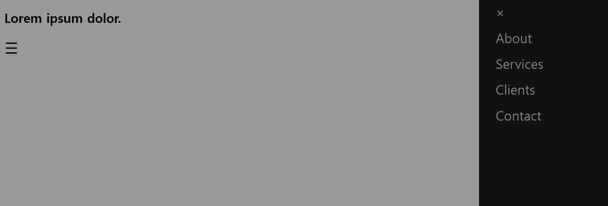
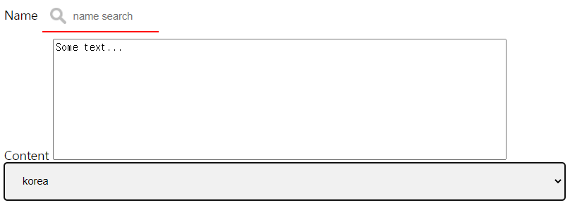
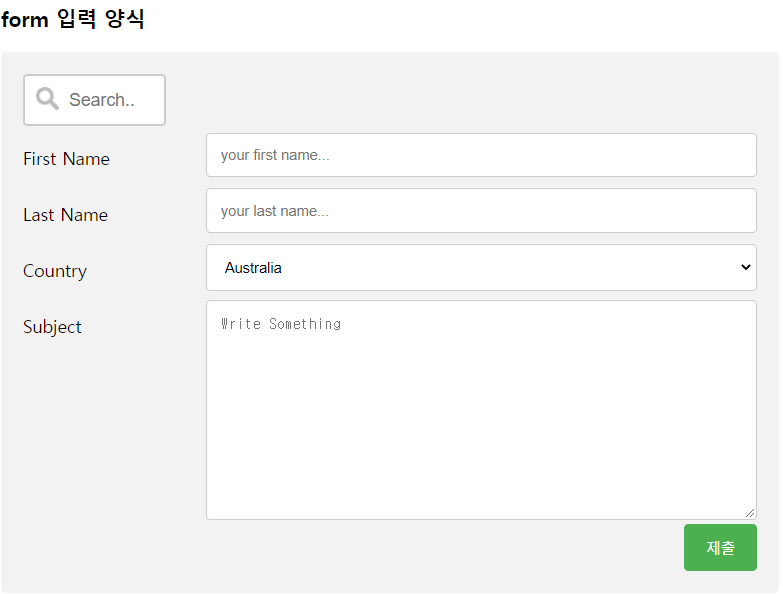
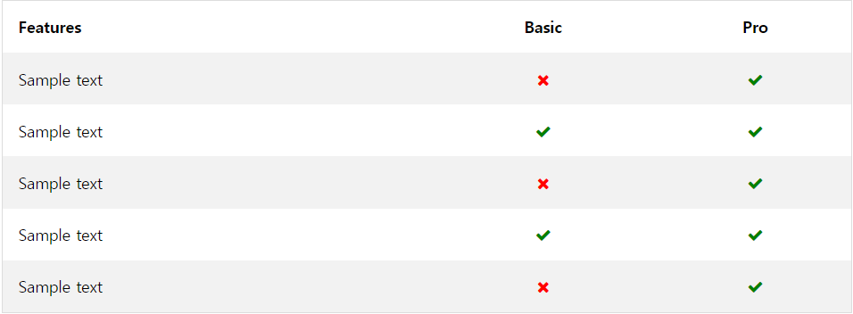
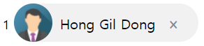
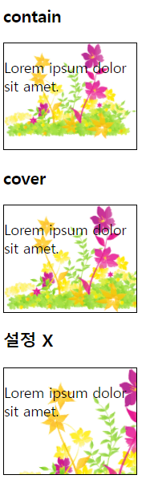
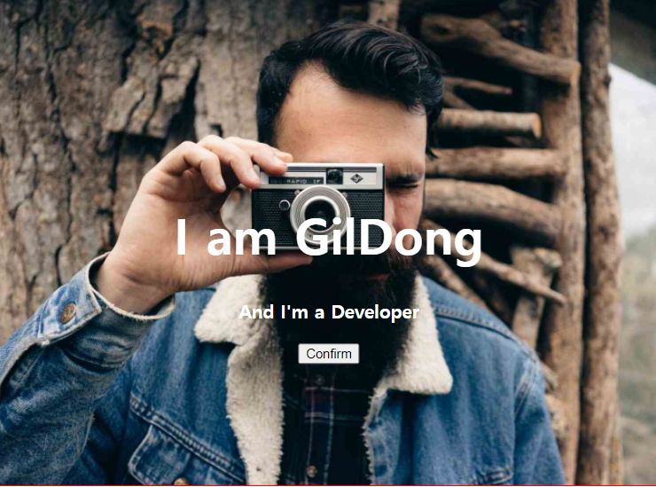
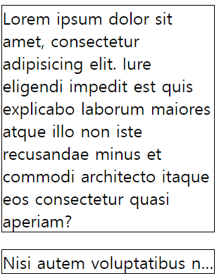
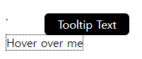
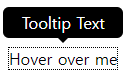

# 12.7

**복습**

1-1. 수직/수평 가운데 정렬되도록 css 추가 코딩하세요.

```css
<style>
  .center{
    border: 3px solid green;
    width:50%;
    height: 200px;
    
    margin: 0 auto;
    position: relative;
  }
  
 .center p{
    margin: 0;
    
    position: absolute;
    top: 50%;
    left: 50%; 
    transform: translate(-50%, -50%);
    -ms-transform: translate(-50%, -50%);
 }
</style>
```

7-1. days05.ex06.html 예제를 참조해서   css 추가와 jquery로 코딩하세요. 



> width 를 조정해서 네비게이션바를 보이게 할 수 있다.
>
> sidenav div 태그에 transition 을 준다.

CSS

```css
div p {
	display: none;
}

.sidenav {
	background-color: #111;
	height: 100%;
	position: fixed;
	right: 0;
	top: 0;
	width: 0;
	transition: 0.5s;
}

.sidenav a {
	display: block;
	color: #818181;
	text-decoration: none;
	font-size: 25px;
	padding: 8px 8px 8px 32px;
}
```

HTML

```html
<div id="mySidenav" class="sidenav">
    <a href="javascript:void(0)" class="closebtn">&times;</a> 
    <a href="#">About</a>
    <a href="#">Services</a> 
    <a href="#">Clients</a> 
    <a href="#">Contact</a>
</div>
<div id="main">
    <h2>Lorem ipsum dolor.</h2>
    <p>Lorem ipsum dolor sit amet, consectetur adipisicing elit. Quo
        dolor reprehenderit sequi consectetur alias numquam voluptas
        necessitatibus repellat beatae iusto.</p>
    <span style="cursor: pointer; font-size: 30px;">&#9776;</span>
</div>

<script>
    $("#main span").click(function() {
        $(".sidenav").width("250px");
        $("body").css("background-color", "rgba(0,0,0, 0.4)");
    });

    $(".closebtn").click(function() {
        $(".sidenav").width("0");
        $("body").css("background-color", "white");
    });
</script>
```

8-1. days05.ex07_04.html 예제를 참조해서 드롭다운 메뉴.


---

**[속성 선택자]**

요소 + 특정속성 또는 속성값을 가지는 요소의 스타일 지정

```css
속성선택자(selector) {
    
}
```

**`[속성명[?]=[속성값]]`**

- `=` 속성을 가지고만 있으면 적용
- `^=` 시작하면 적용
- `$=` 끝나면 적용
- `*=` 포함하면 적용 (더 포괄적인 개념)
- `~=` 특정 단어 포함하면 적용
- `|=` 잘 안쓰인다.

```css
a[title*=flower] {
	text-decoration: none;
	color: red;
}
```

시험문제 1번.


`box-sizing: border-box;` 패딩과 테두리의 속성값이 전체너비와 높이에 영향을 주지않는다. 포함된다.

**검색창에 이미지넣기**

```css
background-image: url('../images/searchicon.png');
background-repeat: no-repeat;
background-position: 10px center;
padding-left: 40px;
```

**검색창크기 늘리기**

```css
input[type=text] {
	width: 150px;
	transition: width 0.5s;
}

input[type=text]:focus {
	width: 80%;
}
```


`cols="30" rows="10"` 보통 CSS 로 이 특성을 준다.

```css
textarea {
	width: 80%;
	height: 150px;	
	resize: none;
}
```

- `resize` 크기수정을 막는다.



```html
<!DOCTYPE html>
<html>
<head>
<meta charset="UTF-8">
<meta name="viewport" content="width=device-width, initial-scale=1.0">
<script
	src="https://ajax.googleapis.com/ajax/libs/jquery/3.6.0/jquery.min.js"></script>
<style>
input[type=text] {
	width: 100%;
	padding: 12px 20px;
	margin: 8px 0;
	
	box-sizing: border-box;
/* 	
	border: 2px solid red;
	border-radius: 4px;
 */	
	border: none;
	border-bottom: 2px solid red;
	
	background-color: #3cbc8d;
	color: white;
	
/* 	아이콘/이미지 추가 */
	background-color: white;
	background-image: url('../images/searchicon.png');
	background-repeat: no-repeat;
	background-position: 10px center;
	padding-left: 40px;
	
	width: 150px;
	transition: width 0.5s;
	
}
	
input[type=text]:focus {
	background-color: lightblue;
	border: 3px solid #555;
	
	width: 80%;
}
</style>
<style>
textarea {
	width: 80%;
	height: 150px;
	
	resize: none;
}
</style>
<style>
select {
	width: 100%;
	padding: 16px 20px;
	border: none;
	border-radius: 4px;
	background: #f1f1f1;
}
</style>
</head>
<body>

	<form action="">
		<label for="name">Name</label>
		<input type="text" id="name" name="name" placeholder="name search"/>
		<br />
		<label for="content">Content</label>
		<textarea name="" id="content">Some text...</textarea>
		<br />
		<select name="country" id="country">
			<option value="ko" selected>korea</option>
			<option value="us">usa</option>
			<option value="ca">canada</option>
		</select>
	</form>
</body>
</html>
```



```html
<!DOCTYPE html>
<html>
<head>
<meta charset="UTF-8">
<meta name="viewport" content="width=device-width, initial-scale=1.0">
<script
	src="https://ajax.googleapis.com/ajax/libs/jquery/3.6.0/jquery.min.js"></script>
<style>
.row:first-child>input {
	width: 130px;
	transition: width 0.4s ease-in-out;
	border: 2px solid #ccc;
	font-size: 16px;
	padding: 12px 20px 12px 40px;
	border-radius: 4px;
	background: white url('../images/searchicon.png') 10px 10px no-repeat;
}

.row:first-child>input:focus {
	width: 100%;
}
</style>
<style>
* {
	box-sizing: border-box;
}

input[type='text'], select, textarea {
	width: 100%;
	padding: 12px;
	border: 1px solid #ccc;
	border-radius: 4px;
	resize: vertical;
}

label {
	display: inline-block;
	padding: 12px 12px 12px 0;
}

input[type=submit] {
	background: #4CAF50;
	color: white;
	padding: 12px 20px;
	border: none;
	border-radius: 4px;
	cursor: pointer;
	float: right;
}

input[type=submit]:hover {
	background: #45A049;
}

.container {
	border-radius: 5px;
	background: #f2f2f2;
	padding: 20px;
}

.col-25 {
	float: left;
	width: 25%;
	margin-top: 6px;
}

.col-75 {
	float: left;
	width: 75%;
	margin-top: 6px;
}

.row::after {
	content: "";
	clear: both;
	display: table;
}
</style>
<style>
@media screen and (max-width:600px) {
	.col-25, .col-75, input[type=submit] {
		width: 100%;
		margin-top: 0;
	}
}
</style>
</head>
<body>
	<h3>form 입력 양식</h3>
	<div class="container">
		<form action="">
			<div class="row">
				<input type="text" name="search" placeholder="Search.." />
			</div>

			<!-- .row>.col-25>label^.col-75>input -->
			<div class="row">
				<div class="col-25">
					<label for="fname">First Name</label>
				</div>
				<div class="col-75">
					<input type="text" placeholder="your first name..." id="fname"
						name="fname" />
				</div>
			</div>

			<div class="row">
				<div class="col-25">
					<label for="lname">Last Name</label>
				</div>
				<div class="col-75">
					<input type="text" placeholder="your last name..." id="lname"
						name="lname" />
				</div>
			</div>

			<div class="row">
				<div class="col-25">
					<label for="country">Country</label>
				</div>
				<div class="col-75">
					<select name="country" id="country">
						<option value="Australia">Australia</option>
						<option value="Canada">Canada</option>
						<option value="Korea">Korea</option>
					</select>
				</div>
			</div>

			<div class="row">
				<div class="col-25">
					<label for="subject">Subject</label>
				</div>
				<div class="col-75">
					<textarea style="height: 200px" id="subject"
						placeholder="Write Something"></textarea>
				</div>
			</div>

			<div class="row">
				<input type="submit" />
			</div>
		</form>
	</div>
</body>
</html>
```

**[특수성]**

- 동일한 요소를 가리키는 두 개 이상의 CSS 규칙이 충돌나는 경우 어떤 규칙에 따라 우선순위가 정해진다.


```css
<style>
#content #hdg {
	background-color: aqua;
}
</style>
<style>
#content h1 {
	background-color: green;
}
</style>
<style>
#hdg {
	background-color: yellow;
}
</style>
<style>
h1 {
	background-color: red;
}
</style>
<style>
h1 {
	background-color: blue;
}
</style>
```

**특수성을 계산하는 방법 (점수)**

- 0 부터 시작
- inline CSS 적용방법: 1000점
- CSS 태그명 1점. 나중이 우선순위
- id 명 100 점
- 클래스명 10점
- 속성, 의사클래스 각각 1점

**!important**

`!important` 

- 이 규칙을 사용하면 해당 요소의 특정 속성에 대한 모든 이전 스타일 지정 규칙을 재정의합니다.

```css
.button {
	background: #8c8c8c !important;
	color: white !important;
	padding: 5px !important;
	border: 1px solid black !important;
}
```




```html
<!DOCTYPE html>
<html>
<head>
<meta charset="UTF-8">
<meta name="viewport" content="width=device-width, initial-scale=1.0">
<script
	src="https://ajax.googleapis.com/ajax/libs/jquery/3.6.0/jquery.min.js"></script>


<link rel="stylesheet"
	href="https://cdnjs.cloudflare.com/ajax/libs/font-awesome/4.7.0/css/font-awesome.min.css">

<style>
table {
	width: 100%;
	border: 1px solid #ddd;
	border-spacing: 0;
	border-collapse: collapse;
}

th, td {
	text-align: center;
	padding: 16px;
}

th:first-child, td:first-child {
	text-align: left;
}

tr:nth-child(even) {
	background: #f2f2f2;
}

.fa-check {
	color: green;
}

.fa-remove {
	color: red;
}
</style>

</head>
<body>
	<table>
		<tr>
			<th style="width: 50%">Features</th>
			<th>Basic</th>
			<th>Pro</th>
		</tr>
		<tr>
			<td>Sample text</td>
			<td><i class="fa fa-remove"></i></td>
			<td><i class="fa fa-check"></i></td>
		</tr>
		<tr>
			<td>Sample text</td>
			<td><i class="fa fa-check"></i></td>
			<td><i class="fa fa-check"></i></td>
		</tr>
		<tr>
			<td>Sample text</td>
			<td><i class="fa fa-remove"></i></td>
			<td><i class="fa fa-check"></i></td>
		</tr>
		<tr>
			<td>Sample text</td>
			<td><i class="fa fa-check"></i></td>
			<td><i class="fa fa-check"></i></td>
		</tr>
		<tr>
			<td>Sample text</td>
			<td><i class="fa fa-remove"></i></td>
			<td><i class="fa fa-check"></i></td>
		</tr>
	</table>
</body>
</html>
```


**평점**

```css
.heading {
	margin-right: 25px;
}

span.fa {
	font-size: 25px;
}

.checked {
	color: orange;
}
```


```html
<hr style="border: 3px solid #f1f1f1" />
<span class="heading">평점 : </span>
<span class="fa fa-star checked"></span>
<span class="fa fa-star checked"></span>
<span class="fa fa-star checked"></span>
<span class="fa fa-star checked"></span>
<span class="fa fa-star"></span>
```


**젠코딩**

> div 내용물에는 div 를 넣는다.

**ex05**


**DOM**

```javascript
this.parentElement.style.display='none'
```

`parentElement` 부모태그


팀장과제: 마우스 올리면 사진 확대


> img 에는 항상 width: 100% 속성이 필요하다.

**그림자**

box-shadow 

- 첫번째 값만 주면 나타나지 않는다.
- 색상의 디폴트는 검정이다.



```css
.chip img {
	width: 50px;
	height: 50px;
	
	border-radius: 25px;
	
	margin-left: -25px;
	margin-right: 10px;
	
	float: left;
}

.chip {
	height: 50px;
	background-color: #f1f1f1;
	line-height: 50px;
	
	display: inline-block;
	padding: 0 25px;
	
	border-radius: 25px;
	
	font-size: 18px;
}

.closebtn {
	color: #888;
	cursor: pointer;
	font-size: 20px;
	font-weight: bold;
	padding-left: 10px;
}
.closebtn:hover {
	color: #000;
}
```

```html
<div class="chip">
    
    Hong Gil Dong
    <span class="closebtn" onclick="this.parentElement.style.display='none'">&times;</span>
</div>
```


```css
.card {
	width: 30%;
	border-radius: 5px;
	box-shadow: 0 4px 8px 0 rgba(0, 0 , 0, 0.2);
}

.card:hover {
	box-shadow: 0 4px 16px 0 rgba(0, 0 , 0, 0.2);
}

.card img {
	width: 100%;
	border-radius: 5px 5px 0 0;
}

.container {
	padding: 2px 16px;
	text-align: center;
}
```

```html
<div class="chip">
    
    Hong Gil Dong
    <span class="closebtn" onclick="this.parentElement.style.display='none'">&times;</span>
</div>

<hr />

<!-- 	.card>img+.container>(h4>b+p) -->
<div class="card">
    
    <div class="container">
        <h4>
            <b>Hong Gil Dong</b>
        </h4>
        <p>Java Developer</p>
    </div>
</div>
```


`border-radius` 왼쪽위부터 시계방향 순서이다.

```css
background: url(../images/paper.gif) left top repeat;
```

url 에 따옴표는 필요없다.


**[CSS 다중 배경 설정]**

- background-image 속성: 여러 배경 이미지를 추가
- 콤마 `,` 구분


```css
background: 
url(../images/img_flwr.gif) right bottom no-repeat
, url(../images/paper.gif) left top repeat;
```


**[배경크기지정]**

background-size 속성

- 크기는 길이, 백분율 지정

Q. 세로작성에서 자동완성 하는 법 ? 

A. 

- `contain` 가능한 크게 배경이미지 확대
- `cover` 컨텐츠 영역이 완전히 배경화상에 포함되는




1. 전체 페이지를 이미지로 채우기
2. 필요에 따라 이미지 크기 조정
3. 페이지 중앙 이미지
4. 스크롤바를 일으키지 않음

> cover 는 화면에 맞게 이미지를 설정한다.

```css
html {
	background: url(../images/img_man.jpg) no-repeat center fixed;
	background-size: cover;
}
```


- `fixed` 속성을 추가하면 아래 공백을 없앨 수 있다.
- `center` 

Q. background-size 는 축약이 불가능한가 ?

A. 



```css
body {
	margin: 0;
	font-family: Aral, sans-serif;
}

.hero-image {
	height: 500px;
	border: 1px solid red;
	
	/* 	전체 배경 이미지 설정 */
	background: url(../images/img_man.jpg) no-repeat center;
	background-size: cover;
}

/* 중앙 정렬 */
.hero-text {
	position: absolute;
	top: 50%;
	left: 50%;
	
	color: white;
	text-align: center;
	transform: translate(-50%, -50%);
	-ms-transform: translate(-50%, -50%);
}
```

```html
<div class="hero-image">
    <div class="hero-text">
        <h1 style="font-size: 50px;">I am GilDong</h1>
        <h3>And I'm a Developer</h3>
        <button>Confirm</button>
    </div>
</div>
```


background-origin 속성: [배경이미지의 위치] 를 지정하는 속성

1. background-position 속성과 차이점

**background-origin 속성**

- `border-box` 테두리의 왼쪽 상단 시작
- `padding-box` 패딩의 가장자리의 왼쪽 상단 모서리에서 시작
- `content-box` 컨텐츠의 왼쪽 상단 시작

**background-clip 속성**

배경색이 그려질 위치를 지정하는 속성

```css
#demo1 {
	background-origin: padding-box; /* 기본값 */
	background-clip: padding-box;
}

#demo2 {
	background-origin: border-box;
	background-clip: border-box; /* 기본값 */
}

#demo3 {
	background-origin: content-box;
	background-clip: content-box;
}
```

테두리가 배경이미지를 가리지 않는다.


**parallax**

시차: 관측 위치에 따른 물체의 위치나 방향의 차이


```css
html, body {
	border: 1px solid red;
	height: 100%;
	
	margin: 0;
	padding: 0;
}
```

height: 100% 를 준 것과 안준 것은 차이가 있다.

**[고정 배경]**

```html
<!DOCTYPE html>
<html>
<head>
<meta charset="UTF-8">
<meta name="viewport" content="width=device-width, initial-scale=1.0">
<script
	src="https://ajax.googleapis.com/ajax/libs/jquery/3.6.0/jquery.min.js"></script>
<style>
html, body {
	border: 1px solid red;
	height: 100%;
	
	margin: 0;
	padding: 0;
}

.parallax {
	border: 1px solid green;
	height: 100%;
	
/* 	스크롤 그 위치 고정 */
	background: url(../images/img_parallax.jpg) no-repeat center fixed;
	background-size: cover;
}
</style>
</head>
<body>
	<p>Lorem ipsum dolor sit amet, consectetur adipisicing elit.
		Ratione autem reiciendis in sit cumque saepe qui labore quidem dolores
		commodi. Totam ullam dolor ipsam saepe quibusdam nihil odit quos eos.</p>
	<!-- parallax -->

	<div class="parallax"></div>
	<div style="height: 500px; background-color: fuchsia; font-size: 20px">Lorem
		ipsum dolor.</div>
	<div class="parallax"></div>
</body>
</html>
```

**[CSS 그라디언트 (gradient) 효과]**

- 두 개이상의 지정된 색상간에 부드러운 전환
- 선형, 방사형, 원추형 그라디언트 유형
- 선형 그라디언트 형식: 


방향의 기본값은 위에서 아래로

선형 그라디언트 형식과 방사형 그라디언트

```css
background-image: linear-gradient(direction, color, color...)
background-image: radial-gradient(position, color, color...)
```

```css
background-image: radial-gradient(red 5%, yellow 15%, green 60%);
```


**[텍스트 그림자효과 (shadow)]**

- `text-shadow`
- `box-shadow` 

```css
text-shadow: 수평 수직 흐림 색상;
text-shadow: 2px 2px 5px red;
```

**다중그림자**

```css
text-shadow: 0 0 3px #ff0000, 0 0 10px #0000ff;
```


```css
					흐림 번짐 색상
box-shadow: 10px 10px 5px 3px grey;
```


**[달력]**

```css
.card {
	width: 250px;
	box-shadow: 0 4px 8px 0 rgba(0,0,0, 0.2)
	, 0 6px 20px 0 rgba(0,0,0, 0.19);
	text-align: center;
}

.header {
	background: #4caf50;
	color: white;
	padding: 10px;
	font-size: 40px;
}

.container {
	padding: 10px;
}
```

```html
<div class="card">
    <div class="header">
        <h1>7</h1>
    </div>
    
    <div class="container">
        <p>2021. 12</p>
    </div>
</div>
```

**[텍스트 효과]**

1. `text-overflow` 문자 넘쳤을 때
2. `word-wrap` 단어 부수기
3. `word-break` 단어 부수기
4. `writing-mode` 쓰기모드 (가로/세로)
5. `white-space` 


```css
white-space: nowrap;
```

이미지처럼 텍스트를 div 태그가 감싸지 않는다.

자동개행이 없다.

**text-overflow**



- `clip` 기본
- `ellipsis` 줄임표

긴 단어가 끊어지지 않고 overflow 발생.

이럴 경우에 강제로 끊어서 

```css
word-wrap: break-word;
```

긴 단어를 끊고 다음줄로 줄바꿈한다.

**word-break**

- `keep-all` 기본값
- `break-all` 단어를 부순다.

```css
word-break: break-all; /* 상위호환 */
word-wrap: break-word;
```

**writing-mode**

- `vertical-rl` 세로로 작성
- `horizontal-tb` 기본값


**[@font-face 규칙]**

- 웹 글꼴 사용: 클라이언트에 설치되지 않은 글꼴을 웹 서버에서 글꼴 파일 자동으로 다운로드 -> 사용자 사용


```css
@font-face {
	font-family: myFirstWebFont;
	src: url(../images/sansation_light.woff);
}

* {
	font-family: myFirstWebFont;
}
```

`font-weight: bold` 를 줄 수도 있다.

# 12.8

**[2D 변환]**

요소를 이동, 회전, 크기조정 및 기울기

transform 속성

2D 변환방법

- `translate()` 요소를 이동
- `rotate()` 요소를 회전
- `scaleX()` 요소의 크기조정 - X축
- `scaleY()` 요소의 크기조정 -Y축
- `scale()` 요소의 크기조정 - X, Y축
- `skewX()` 요소를 기울어지게...  X축
- `skewY()` 요소를 기울어지게... Y축
- `skew()` 요소를 기울어지게
- `matrix()` 이동/회전/크기조정/기울어지게


```css
/* 	1. 요소의 이동 */
	transform: translate(50px, 100px);
	-ms-transform: translate(50px, 100px);
	
/* 	2. 요소의 회전 */
	transform: rotate(20deg);
	-ms-transform: rotate(20deg);
```

`-ms-` 는 마이크로소프트사의 IE 브라우저에서 작동

```css
transform: scale(2, 0.5);
transform: skew(45deg, 20deg);
```

너비를 2배 높이를 1/2 배 	

`skew` 비스듬히 있다. 기울이다.


```css
transform: matrix(scaleX(), scaleY(), skewX(), skewY(), translateX(), translateY());
transform: matrix(2, 0.5, 45, 20, 50, 100);
```

단위를 넣으면 적용이 안되는 듯 하다.


**젠코딩**

`div>lorem` div 에 글귀를 넣을때는 div 라고 작성해야 된다.


**[3D 변환]**

transform 속성

1. `rotateX()` X축으로 회전
2. `rotateY()` Y축으로 회전
3. `rotateZ()` 
4. `rotate3D(x, y, z)` 


- `translateX`
- `scaleX`
- `scale3D(x, y, z)`
- `matrix3d()` 

**회전 함수**

```javascript
<!--
var x, y, n = 0, ny = 0, rotINT, rotYINT
function rotateDIV() {
    x = document.getElementById("rotate2D")
    clearInterval(rotINT)
    rotINT = setInterval("startRotate()", 10)
}
function rotateYDIV() {
    y = document.getElementById("rotate3D")
    clearInterval(rotYINT)
    rotYINT = setInterval("startYRotate()", 10)
}
function startRotate() {
    n = n + 1
    x.style.transform = "rotate(" + n + "deg)"
    x.style.webkitTransform = "rotate(" + n + "deg)"
    x.style.OTransform = "rotate(" + n + "deg)"
    x.style.MozTransform = "rotate(" + n + "deg)"
    if (n == 180 || n == 360) {
        clearInterval(rotINT)
        if (n == 360) {
            n = 0
        }
    }
}
function startYRotate() {
    ny = ny + 1
    y.style.transform = "rotateY(" + ny + "deg)"
    y.style.webkitTransform = "rotateY(" + ny + "deg)"
    y.style.OTransform = "rotateY(" + ny + "deg)"
    y.style.MozTransform = "rotateY(" + ny + "deg)"
    if (ny == 180 || ny >= 360) {
        clearInterval(rotYINT)
        if (ny >= 360) {
            ny = 0
        }
    }
}
//-->
```


함수

- `clearInterval` 
- `setInterval` 

```javascript
x.style.transform = "rotate(" + n + "deg)"
x.style.webkitTransform = "rotate(" + n + "deg)"
x.style.OTransform = "rotate(" + n + "deg)"
x.style.MozTransform = "rotate(" + n + "deg)"
```

브라우저에 따라 rotate 함수를 준다.

**[2D/3D 변환]**

변환: 요소크기 조정/이동/기울기/회전 transform 속성

전환: 주어진 기간동안 속성값을 매끄럽게 변경 transition 속성

- `transition-delay` 전환 연기시간 속성
- `transition-duration` 지속시간 속성
- `transition-property` CSS 속성
- `transition-timing-function` ease 전환속도 곡선 속성
  - ease(기본값) 천천히(시작) -> 빨라 -> 천천히(종료)
  - linear 등속 (시작~종료)
  - ease-in 천천히 (시작)
  - ease-out 천천히 (종료)
  - ease-in-out 등등
- `trainsition` 

CSS 전환효과를 만드려면 2가지 설정이 필요

1. 전환효과를 주고자하는 CSS 속성
2. 효과지속시간 (생략하면 기본값은 0)


width: CSS 속성의 너비가 100px -> 300px 로 변화될 때 매끄럽게(부드럽게) 전환

```css
transition-property: width;
```


`transition-timing-function` 기본값 ease


```css
div {
	width: 100px;
	height: 100px;
	background: red;
	
/* 	width: CSS 속성의 너비가 100px -> 300px 로 변화될 때 매끄럽게(부드럽게) 전환 */
	transition-property: width;
	transition-duration: 2s;
	transition-timing-function: ease;
	
	transition-property: height;
	transition-duration: 4s;
	transition-timing-function: linear;
}

div:hover {
	width: 300px;
	height: 300px;
}
```


**축약형**

```css
transition: width 2s, height 4s linear;
```

딜레이

```css
transition-delay: 1s;
```

**크기 증가하며 회전**

```css
div {
	width: 100px;
	height: 100px;
	background: red;
	
	transition: width 2s, height 2s, transform 2s;
}

div:hover {
	width: 300px;
	height: 300px;
/* 	css 2D/3D 변환 - 이동/회전/기울기/크기 */
	transform: rotate(180deg);
}
```


```css
transition: property duration timing-function delay;
```

**[애니메이션]**

1. CSS
2. JS 애니메이션 효과 X
3. flash

한 스타일에서 다른 스타일로 점차적으로 변환되는 것.

- `@keyframes`
- `animation-name`
- `animation-duration`
- `animation-delay`
- `animation-iteration-count`
- `animation-direction`
- `animation-timing-function`
- `animation-fill-mode`
- `animation`


- 첫 단계: @keyframes 키프레임을 지정 

키프레임 - 특정 시간에 요소가 가지는 스타일

```css
@keyframes 이름 {
	
}

animation-name: 이름;
animation-duration: 4s;
```


```css
@keyframes example {
	from {
		background-color: red;
	}
	to {
		background-color: yellow;
	}
}
```

from 을 0% 로 to 를 100% 바꿔도 같다.

```css
@keyframes example {
	0% {
		background-color: red;
	}
	25% {
		background-color: green;
	}
	50% {
		background-color: blue;
	}
	100% {
		background-color: yellow;
	}
}
```


```css
div {
	width: 100px;
	height: 100px;
	background: red;
	
	animation-name: example;
	animation-duration: 4s;
	animation-timing-function: linear;
	
	animation-iteration-count: infinite;
	animation-direction: alternate;
	position: relative;
	animation-delay: 2s;
}

@keyframes example {
	0% {background-color: red; left:0; top:0;}
	25% {background-color: blue; left:200px; top:0;}
	50% {background-color: green; left:200px; top:200px;}
	75% {background-color: yellow; left:0; top:200px;}
	100% {background-color: red; left:0; top:0;}
}
```


- `alternate` 갔던길 되돌아간다. (교대하다. 대안이되다.)
- `reverse`
- `normal`
- `alternate-reverse`

**[애니메이션 채우기 모드]**

`animation-fill-mode` 속성값

- none: 기본값
- forwards
- backwards
- both


`position: relative` 속성이 없으면 top bottom right 등이 적용되지 않는다.

```css
animation-fill-mode: forwards;
```

끝나고 나서 마지막 키 프레임의 스타일을 유지.

**CSS 로딩창**

```css
.loader {
	width: 120px;
	height: 120px;
	border: 16px solid #f3f3f3;
	border-top-color: red;
	border-radius: 50%;
	
	animation: spin 1.5s linear infinite;
}

@keyframes spin {
	from {transform: rotate(0deg);}
	to {  transform: rotate(360deg);}
}
```


**[툴팁]**

요소 위에 마우스 포인터를 올리면 그 요소의 추가적인 설명 정보를 보이게 하는 것 (기능)


인라인블럭은 width 가 적용되지 않는다.

```css
position: absolute;
```

하지만 position 속성을 주면 width 가 적용된다.



```css
left: 50%; 
bottom: 100%; 
/* 	top: 0; */
```

top: 0 을 주려면 태그의 높이를 알아야한다.

```css
div {
	box-sizing: border-box;
 	width: 40px; 
 	
/* 	border-top: 20px solid red;
	border-right: 20px solid transparent;
	border-bottom: 20px solid transparent;
	border-left: 20px solid transparent;
 */	
 
 	border: 20px solid black;
 	border-color: black transparent transparent transparent;
}
```



```css
.tooltip .tooltiptext::after {
	content: "";
	
	border-width: 5px;
	border-style: solid;
	border-color: black transparent transparent transparent;
	
	position: absolute;
	left: 50%;
	top: 100%;
	margin-left: -5px;
}
```

> top 은 위에서 아래로 내려가고 bottom 은 아래에서 위로 올라간다.

**[미디어타입]**

CSS2 도입 미디어타입 (유형) ? 

다른 미디어 (컴퓨터, 프린터, 스마트폰, TV 등등) 에 서로 다른 스타일 적용 규칙 정의


CSS2 도입 미디어타입 (유형)

CSS2 미디어유형 + 확장 (인쇄)


[미디어 쿼리]

1. 뷰포트의 너비와 높이
2. 장치의 너비와 높이
3. 방향 (가로/세로모드)


**반응형 웹**

[미디어 쿼리] 는 여러장치 (미디어) 에 맞춤형 스타일시트를 제공하기 위해서 사용되는 기술...

[미디어 쿼리 형식]

```css
@media not|only mediatype and (expressions 참, 거짓 - 여러개 표현식) {
    css 코딩;
}
```

mediatype

- `all`
- `print` 
- `screen`
- `speech` 

- `not` 특정 미디어타입만 적용 X
- `only` 특정 미디어타입만 적용 O
- `all` 기본값. 

**외부 스타일시트 파일**

```html
<link rel="stylesheet" href="print.css" media="not|only mediatype and (expressions)"/>
```

이렇게 미디어쿼리를 적용할 수도 있다.

```css
@media screen and (min-width:400px) {
	body {
		background: black;		
	}
}
```

**[뷰포트 (viewport)]**

1. 웹 페이지에서 사용자가 볼 수 있는 영역
2. 표시영역은 장치에 따라 다르며 컴퓨터화면보다 휴대폰에서 더 작다.
3. 태블릿 X, 스마트폰 X -> 컴퓨터 화면용으로만 디자인되어 있었다.
   - (정적인 디자인과 고정된 크기를 갖는 것이 일반적)
   - -> 여러 장치에서의 브라우저를 사용해서 웹페이지를 화면에 맞게 축소/확대...
4. 뷰포트 설정

```html
<meta name="viewport" content="width=device-width, initial-scale=1.0">
```

뷰포트: 웹페이지의 크기와 배율을 장치에 따라 제어하겠다.

- `width=device-width` 장치의 화면 너비를 따라서 웹페이지의 너비 설정.
- `initial-scale=1.0` 브라우저에서 페이지를 처음 로드할 때의 초기 설정 확대/축소.

**[자바스크립트]**

1. 객체 기반의 스크립트 프로그램 언어
2. 목적: 웹페이지에서 사용자로부터 특정 이벤트나 입력값을 받아서 동적인 처리를 목적으로 고안된 언어.
3. html - 웹페이지의 내용정의 (디자인)
   css - 웹페이지의 레이아웃 (스타일) 정의
   javascript - 웹페이지의 동작처리 정의
   - html 내용을 js 로 변경

**전구 불켜기**

```html
<button onclick="bulb_on();">Turn on</button>

<button onclick="bulb_off();">Turn off</button>

<script>
    function bulb_on() {
        var bulb = document.getElementById("imgbulb");
        bulb.src = "../images/pic_bulbon.gif";
    }
    function bulb_off() {
        var bulb = document.getElementById("imgbulb");
        bulb.src = "../images/pic_bulboff.gif";
    }
</script>
```

**전구버튼 비활성화**

```html
<button id="onBtn" onclick="bulb_on();">Turn on</button>

<button id="offBtn" onclick="bulb_off();">Turn off</button>

<script>
    function bulb_on() {
        var bulb = document.getElementById("imgbulb");
        bulb.src = "../images/pic_bulbon.gif";
        document.getElementById("onBtn").disabled = "disabled";
        document.getElementById("offBtn").disabled = "";
    }
    function bulb_off() {
        var bulb = document.getElementById("imgbulb");
        bulb.src = "../images/pic_bulboff.gif";
        document.getElementById("offBtn").disabled = "disabled";
        document.getElementById("onBtn").disabled = "";
    }
</script>
```

> 빈 문자열도 false 이므로 false 라고 넣어도 같은 코드이다.


```javascript


    <script>
    function bulb_on_off() {
    var btn = document.getElementById("btn");
    var bulb = document.getElementById("imgbulb");

    if (btn.innerText == "Turn on") {
        bulb.src = "../images/pic_bulbon.gif";
        btn.innerText = "Turn off";
    } else {
        bulb.src = "../images/pic_bulboff.gif";
        btn.innerText = "Turn on";
    }
}
```


**스위치**

```html
<button id="btn" onclick="bulb_on_off();">Turn on</button>


<script>
    function bulb_on_off() {
        sw = false;
        var btn = document.getElementById("btn");
        var bulb = document.getElementById("imgbulb");

        bulb.src = "../images/pic_bulb" + (sw ? "off" : "on") + ".gif";
        btn.innerText = sw ? "Turn on" : "Turn off";
        sw = !sw;
    }
</script>
```


**[스타일 변경]**

> 자바스크립트에서 우항은 무조건 문자열
>
> `-` 는 없애고 대문자로 바꾼다.

```javascript
document.querySelector("button").onclick = function() {
    var ptag = document.getElementById("demo");
    ptag.style.color = "red";
    ptag.style.fontSize = "35px";
    ptag.style.border = "1px solid gray";
}
```

**jQuery**

```javascript
$("button").click(function() {
    $("#demo").css("color", "red");
    $("#demo").css("font-size", "35px");
    $("#demo").css("border", "1px solid gray");
});
```

**head 태그에 넣기**

```javascript
$(document).ready(function() {
    $("button").click(function() {
        $("#demo").css("color", "red");
        $("#demo").css("font-size", "35px");
        $("#demo").css("border", "1px solid gray");
    });
});
```

**숏코딩**

```javascript
$("button").click(function() {
    $("#demo").css("color", "red")
        .css("font-size", "35px")
        .css("border", "1px solid gray");
});
```

**다른코딩**

```javascript
$("button").click(function() {
    $("#demo").css({
        "color":"red"
        , "font-size":"35px"
        , "border":"1px solid gray"
    });
});
```

(4). 사용자 경험 (UX)/UI 를 향상시키기 위한 방법으로 js 주로 사용

(5). js 는 [주로] 웹브라우저 내에서 사용되는 언어였으나, 서버 측 프로그램 개발에도 사용 (확대)

(6) js 다운로드/설치 X -> 브라우저에 내장... 브라우저 버전/종류 js X

(7) ECMAScript (에크마 스크립트) == 자바스크립트 표준

ECMA-262 는 에크마스크립트 표준의 공식이름

(8) js 는 `<script>` 태그 안에 코딩되어진다.

(9) html 의 기본 스크립팅 언어: javascript

(10) `<script>` 태그는 원하는 수 만큼 원하는 위치에 배치할 수 있다.

일반적으로는 head, body 태그 안에 선언한다.


[여기서 기억해야 될 사항]

브라우저 [ex02.html] -> 요청 (request) -> -< 응답 (response)

디스플레이 속도를 늦추지 않기 위해


(11) 동일한 코드가 반복적으로 사용이 된다면 -> js 함수 처리.

js 함수가 여러 페이지에서 사용이 된다면 외부 자바스크립트 파일을 만들어서 js 함수를 넣어둔다.

(12) 외부 자바스크립트 파일 사용하면 장점

1. html 코딩과 js 코딩 분리 -> 유지, 보수, 확장
2. 캐시된 js 파일 -> 페이지 로드 속도 향상.


개발자도구 - Network - All 이나 JS 의 Status 가 200 이면 정상적으로 불러온 것이다.

Element, Console, Sources, Network

**[JS 출력]**

1. window.alert()
2. console.log()
3. document.write()
4. innerText 또는 innerHTML 속성

**innerHTML vs innerText 속성의 차이점**

```html
<b>aaa</b>
```

innerHTML 은 태그가 적용되며 innerText 는 태그가 적용되지 않고 그대로 출력된다.

```html
<input type="text" id="msg" name="msg" autofocus="" />
<button>js 출력</button>
<p id="demo"></p>

<script>
    document.querySelector("button").onclick = function() {
        var message = document.getElementById("msg").value;
        alert(message);
        console.log(message);
        /* window.document.write(message); */
        document.getElementById("demo").innerText = message;
    }
</script>
```

