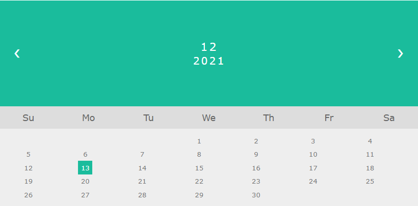

# 12.10

1-1. 좋아하는 동물(animal) 선택
개(dog)
고양이(cat)
돼지(pig)   
위의 세 동물을 체크박스로 만들고 버튼을 클릭할때 체크된 동물을 

`<p id="demo"></p> 에 출력하세요.` 

**JavaScript**

```html
<input type="checkbox" value="개" onchange="print(this);" />개
<input type="checkbox" value="고양이" onchange="print(this);" />고양이
<input type="checkbox" value="돼지" onchange="print(this);" />돼지
<p id="demo"></p>

<script>
    var inputs = document.querySelectorAll("input");

    function print(input) {
        document.querySelector("p").innerText = input.value;
    }
</script>
```

**jQuery**

```html
<input type="checkbox" value="개"/>개
<input type="checkbox" value="고양이" />고양이
<input type="checkbox" value="돼지" />돼지
<p id="demo"></p>

<script>
    $("input").change(function() {
        $("#demo").text($(this).val());
    });
</script>
```


**쌤코드**

```html
<input type="checkbox" value="dog" />강아지
<br />
<input type="checkbox" value="cat" />고양이
<br />
<input type="checkbox" value="pig" />돼지
<br />
<button onclick="exec();">버튼</button>
<br />
<p id="demo"></p>
<br />

<script>
    function exec() {
        var result = "";
        $(":checked").each(function(idx, ckb) {
            result += $(ckb).val() + " ";
        });
        $("#demo").html(result);
    }
</script>
```

> jQuery 에서는 for 문 대신 each 함수를 사용하자!


3-1. 메시지(message) 를 입력하는 텍스트박스를 만들고
메시지를 입력 후 엔터를 치면 
입력한 메시지를     

`<p id="demo"></p> 에 출력하세요.` 

**jQuery**

```html
<input type="text"/>
<p id="demo"></p>

<script>
    $("input[type=text]").keydown(function() {
        if (event.keyCode == 13) {
            $("#demo").text($("input").val());
        }
    });
</script>
```

**쌤코드**

**JavaScript**

```html
message:
<input type="text" id="message" name="message" />
<p id="demo"></p>

<script>
    document.querySelector("input[type=text]").onkeydown = function() {
        if (event.keyCode == 13) {
            document.getElementById("demo").innerHTML = event.srcElement.value;
        }
    }
</script>
```


**jQuery**

```javascript
$(":text").keydown(function(event) {
    if (event.which == 13) {
        $("#demo").html($(":text").val());
    }
});
```

`$(":text").select();` 


4-1.    

```html
<div>
      <input type="checkbox">모두 선택
      <input type="checkbox">
      <input type="checkbox">
      <input type="checkbox">
      <input type="checkbox">
   </div>
```

   모두 선택이라는 체크 박스를 체크하면 나머지 모든 체크 박스를 체크하도록 
   코딩하세요.


**jQuery**

```javascript
$("#check").change(function() {
$("input").prop("checked", $("#check").prop("checked"));
});
```


5-1. 동적으로 버튼`<button>` 을 10개 생성 후 
버튼을 클릭하면 안보이게(숨기기) 처리하세요.

  ㄱ. js 코딩
  ㄴ. jquery 코딩


6-1. js에서 변수를 선언하는 3가지 방법을 적고 설명하세요.
ㄱ.
  ㄴ.
  ㄷ.

7. 아래 ㄱ, ㄴ 코딩의 차이점에 대해서 설명하세요. 
    ㄱ. 
    for (let i = 0; i < 2; i++) { 
    }  
    console.log( i )  

  ㄴ.
  for (var i = 0; i < 2; i++) { 
  }  
  console.log( i )     

---

**[자동완성 플러그인]**

configure - convert to tern project

properties - modules 검색

browser, jQuery 체크

tern 탭에서 최신 6 선택


**jQuery**

`:checkbox:checked` 체크박스이고 체크속성이 있는 선택자.

복습: each 함수

---

**[const]**

변수

1. ES6(2015) 도입
2. 재선언할 수 없다.
3. 상수 (재할당할 수 없다.)
4. 블럭범위


```
Uncaught SyntaxError: Identifier 'PI' has already been declared
```

```javascript
const PI = 3.141592;
const PI = 3.141592653;
console.log(PI);
```

```
Uncaught TypeError: Assignment to constant variable.
```

```javascript
const PI = 3.141592;
PI = 3.14;
console.log(PI);
```


```
ex04.html:15 Uncaught ReferenceError: PI is not defined
```

```javascript
{const PI = 3.141592;}
console.log(PI);
```

let 과 비슷하게 지역변수가 된다.

```
Uncaught ReferenceError: Cannot access 'name' before initialization
```

```javascript
alert(name);
const name = "admin";
```

const 는 호이스팅이 되지 않는다.

**[산술연산자]**

`+` `-` `*` `/` 

```javascript
var x = 5, y = 3;
document.write(x / y); // 1.6666666666666667
document.write(x / 0); // Infinity
document.write(x % 0); // NaN
```

자바와 다르게 나눴을 때 실수가 나온다.

나머지

java `%`, oracle `mod()` 

javaScript `%` 

**[증감연산자]**

```javascript
var i = 10;
document.write(i++ + "<br>"); // 10
document.write(++i + "<br>"); // 12
```

자바와 같다.

```javascript
var i = 10;
i++;
++i;
document.write(i + "<br>"); // 12
```


- 대입연산자 `=`
- 복합 대입 연산자 `+=` `-=` `*=` `%=`  
- `**=` 

```javascript
document.write(2 ** 3 + "<br>"); // 8
```

`**` 제곱

`+` 문자열 연결 연산자

```javascript
let x = 5 + 5;
alert(typeof x); // number
document.write(x + "<br>"); // 10
let y = '5' + 5;
alert(typeof y); // string
document.write(y + "<br>"); // 55
let z = 'hi~' + 5;
alert(typeof z); // string
document.write(z + "<br>");
```

**[js 비교 연산자]**

`>` `<` `>=` `<=` `==` `!=` 

```javascript
document.write((5 > 3) + "<br>");
document.write((5 >= 3) + "<br>");
document.write((5 < 3) + "<br>");
document.write((5 <= 3) + "<br>");
document.write((5 == 3) + "<br>");
document.write((5 != 3) + "<br>");
document.write(5 > 3 + "<br>");
```

`===` 타입도 비교

**[js 논리 연산자]**

1. 일반 논리 연산자: `&&` `||` `!` 
2. 비트 논리 연산자: `&` `|` `~` `^` 

js 쉬프트 연산자

`>>` `<<` `>>>`

instanceof 연산자

연산자 우선 순위...

**js 삼항 연산자**

`?:` 

**[js 자료형 (Data Type)]**

1. number (숫자) - 정수, 실수
2. string
3. boolean - true false
4. undefined
5. function


```javascript
var x = 10;
x = 3.14;
document.write(typeof x + "<br>");

x = "Join";
x = 'admin';
document.write(typeof x + "<br>");
```

동일한 변수 x 를 사용하여 여러 데이터 유형을 보유할 수 있다.

```javascript
var x = 10;
x = 3.14;
x = 123e5; // 123*10000 지수 표기법
document.write(x + "<br>");
document.write(typeof x + "<br>");

x = "I'm Tom";
document.write(x + "<br>");
x = 'I"m Tom';
document.write(x + "<br>");
document.write(typeof x + "<br>");
```


**배열**

```javascript
var cars = ["BMW", "KIA", "VOLVO"];
document.write(cars.length + "<br>");
document.write(cars[0] + "<br>");
document.write(cars[1] + "<br>");
document.write(cars[2] + "<br>");
document.write(typeof cars + "<br>");
```

배열은 중괄호

**객체**

```javascript
var person = {
    name : "hong gil dong"
    , age : 20
}; // 객체

document.write(typeof person + "<br>"); // object
document.write(person.name + "<br>"); // hong gil dong
document.write(person["age"] + "<br>"); // 20
```

**[js 함수]**

특정 작업을 수행하도록 하는 코드블럭이다. -> 함수호출

**형식**

```javascript
function 함수명(파라미터...) {
    [return 리턴값;]
}
```

함수 선언에 사용된 매개변수들은 지역변수로 작동한다.

이벤트 처리 (예: 버튼클릭 호출되는 함수)


변수의 값으로 사용되는 함수

```javascript
var fn = function sum() {
    document.write("> sum()...<br>");
};
fn();
document.write(typeof fn); // function
```

함수도 자료형의 일종이다.


출첵: 2시반

**[undefined 와 null 비교]**

```javascript
// 		[undefined] 와 null 비교
var x;
document.write(typeof x + "<br>");
document.write(typeof null); // object 널객체
document.write(undefined == null); // true
document.write(undefined === null); // false

var y; // undefined
var y = null; // object 형 객체를 참조시켰다.
```


```javascript
const person = {
    name : "hong" // 필드 (속성)	
    ,
    age : 20,
    print : function() { // 메서드s
        return this.name + " " + this.age;
    }
};

var info = person.print();
document.write(info + "<br>");

// 		() 괄호없이 메서드에 액세스하면 함수정의만 반환된다.
var disp = person.print;
alert(disp);
```


```javascript
// new 연산자 Number, String, Boolean 객체 선언... - 코드복잡, 실행속도가 늦다.
var x = 30;
var x2 = new Number();
var y = "admin"; // string
var y2 = new String(); // object

var z = true; // boolean
var z2 = new Boolean(); // object
```

**함수**

```javascript
function sum(n, m) {
    let result = n + m;
    return result;
}
console.log(sum(2, 3)); // 5
```


```javascript
let msg = "AB\"CD\"E";
document.write(msg.length); // 7

let name1 = "hong";
let name2 = new String("hong");

document.write(name1 == name2); // true: 두 문자열 비교
```

**[문자열을 다루는 메서드 + 속성]**

- `length` 문자열 길이 반환

**문자열 일부분 추출**

1. `slice(from, [to])` 
2. `substring(from, to)` 음수를 허용 X 
3. `substr(from, length)`

```javascript
let rrn = "890112-1700001";
let year = rrn.slice(0, 2);
let month = rrn.slice(2, 4);
let day = rrn.slice(4, 6);
document.write(year + "/" + month + "/" + day);
```

```javascript
let year = rrn.substr(0, 2);
let month = rrn.substr(2, 2);
let day = rrn.substr(4, 2);
```


```javascript
name.replace(pattern, replacement);
```

- `replace(attern, replacement)` 


모질라: https://developer.mozilla.org/en-US/docs/Web/JavaScript/Reference/Global_Objects/String/replace


**정규표현식**

```javascript
const regex = /정규표현식/i; // i 는 대소문자를 구분하지 않음.
const regex = /HONG/i;
```


**문자함수**

```javascript
let str1 = "Hello", str2 = "World!";
document.write(str1.concat(str2) + "<br>");

// 4. toUpperCase() / toLowerCase()
let msg = 'Hello World!';
document.write(msg.toUpperCase() + "<br>");
document.write(msg.toLowerCase() + "<br>");
```

- concat
- toUpperCase
- toLowerCase
- trim


```javascript
document.querySelector("input[type=text]").onkeydown = function() {
    if (event.keyCode == 13) {
        var team = event.srcElement.value;
        var members = team.split(",");
        // 				alert(members.length);

        for (var i = 0; i < members.length; i++) {
            document.querySelector("#demo").innerHTML += "["
                + members[i] + "]" + "<br>";
        }
    }
}
```

**입력받아 ol 태그에 넣기**

```javascript
document.querySelector("input[type=text]").onkeydown = function() {
    if (event.keyCode == 13) {
        var team = event.srcElement.value;
        var pattern = /,\s*,\s*/;
        var members = team.split(",");
        // 				alert(members.length);

        var element = "<ol>";

        for (var i = 0; i < members.length; i++) {
            element += "<li>" + members[i] + "</li>";
            document.querySelector("#demo").innerHTML += "["
                + members[i] + "]" + "<br>";
        }
        element += "</ol>";
        document.querySelector("#demo").innerHTML = element;
    }
}
```


**[pad 함수]**

- `padStart()` 
- `padEnd()`

```javascript
let no = 5 + "";
document.write(no.padStart(4, 0) + "<br>"); // 0005
document.write(no.padEnd(4, 0) + "<br>"); // 5000
```


- `charAt(index)` 
- `charCodeAt(index)` 
- `문자열[index]` ES5(2009) 도입 - 속성 액세스 [] 를 허용.

```javascript
var name = "hong gil dong";
var html = "<ol>";

for (var i = 0; i < name.length; i++) {
    html += "<li>" + name.charAt(i) + "</li>";
}
html += "</ol>";

document.getElementById("demo").innerHTML = html;
```

**[13. 문자열 검색]**

- `indexOf()`
- `lastIndexOf()`


```javascript
str.indexOf(char, [from]);
```


**모든 문자위치 찾기**

```javascript
let str = "Please locate where 'locate' occurs!";

while ((pos = str.indexOf("locate")) != -1) {
    alert(pos);
    str = str.substr(pos + 1);
}
```

**[14. 문자열 검색]**

- `search(pattern)`
- `match(pattern)` 배열반환 

search 는 패턴. indexOf 는 문자열이 들어간다.


```javascript
var textArr = text.match(/ain/gi);
```

- `g` 모두 찾는다.
- `i` 대소문자를 구분하지 않는다.

**[16. includes()]**

- `includes()` 문자열 속에 특정 값을 포함하는 경우 true 반환

**17. startsWith()/endWith()**

```javascript
var url ="https://www.naver.com";
document.write(url.startsWith("https://"));
document.write(url.endWith(".com"));
```


```javascript
var a = "100";
var b = "10";
var c = a * b;
document.write(typeof c);
```

모든 숫자연산에서 문자열을 숫자로 변화하려고 시도한다.

덧셈연산자 `+` 를 제외하고 나머지는 문자열을 숫자로 변화하려고 시도한다.


```javascript
document.write(10 / "apple"); // NaN
document.write(isNaN(10 / "apple")); // true
```

NaN + 5 -> NaN

NaN + "5" -> NaN5 문자열

typeof NaN -> number

**진수변환**

```java		let x = 0xFF; // 16진수
let x = 07; // 8진수

let number = 31;
document.write(number.toString(2) + "<br>"); // 11111
document.write(number.toString(8) + "<br>"); // 37
document.write(number.toString(16) + "<br>"); // 1f
```

**더하기 계산기**

```html
<input type="text" autofocus onkeydown="txt1_keydown();" />+
    <input type="text" onkeydown="txt2_keydown();" />
        <button onclick="exec();">실행</button>
<p id="demo"></p>

<script>
    function txt1_keydown() {
    if (event.keyCode == 13) {
        document.querySelector("input:last-of-type").focus();
    }
}
function txt2_keydown() {
    if (event.keyCode == 13) {
        document.querySelector("button").focus();
    }
}

function exec() {
    var sum = $("input:first-of-type").val() + $("input:last-of-type").val(); // 문자열로 인식한다.
    $("#demo").text(sum);
}
</script>
```


1. `Number() `
2. `parseInt()` 정수
3. `parseFloat()` 실수
4. `eval()`

```javascript
function exec() {
    var n1 = Number($("input:first-of-type").val());
    var n2 = Number($("input:last-of-type").val());
    var sum = n1 + n2;
    $("#demo").text(sum);
}
```

# 12.13

13 or 20 일부터 JSP 프로젝트 주제 정하기

20~24 DB 모델링

1.3~1.21 3주 프로젝트

1.17~1.28 스프링 수업

2.4~2.11 AWS 해외카드결제


- `Number()`
- `parseInt()`
- `parseFloat()` 

**Number 함수**

```javascript
document.getElementById("demo").innerHTML = 
    Number(true) + "<br>" // 1
    + Number(false) + "<br>" // 0
    + Number("10") + "<br>" // 10
    + Number("     10") + "<br>" // 10
    + Number("10     ") + "<br>" // 10
    + Number("     10     ") + "<br>" // 10
    + Number("10.33") + "<br>" // 10.33
    + Number("10,33") + "<br>" // NaN
    + Number("10 33") + "<br>" // NaN
    + Number("Hong") + "<br>" // NaN
```


개인: 자동완성 플러그인 설치

**parseInt 함수**

```javascript
parseInt(true) + "<br>" // NaN
    + parseInt(false) + "<br>" // NaN
    + parseInt("10") + "<br>" // 10
    + parseInt("     10") + "<br>" // 10
    + parseInt("10     ") + "<br>" // 10
    + parseInt("     10     ") + "<br>" // 10
    + parseInt("10.33") + "<br>" // 10
    + parseInt("10,33") + "<br>" // 10
    + parseInt("10 33") + "<br>" // 10
    + parseInt("Hong") + "<br>" // NaN
```


**날짜의 숫자변환**

```javascript
alert(Number(new Date("1970-01-02"))); // 86400000
```

1970년 1월 1일 이후 밀리세컨드 값을 반환

1970-01-01 은 0 을 반환한다.


**parseFloat**

```javascript
document.getElementById("demo").innerHTML = 
    parseFloat(true) + "<br>" // NaN
    + parseFloat(false) + "<br>" // NaN
    + parseFloat("10") + "<br>" // 10
    + parseFloat("     10") + "<br>" // 10
    + parseFloat("10     ") + "<br>" // 10
    + parseFloat("     10     ") + "<br>" // 10
    + parseFloat("10.33") + "<br>" // 10.33
    + parseFloat("10,33") + "<br>" // 10
    + parseFloat("10 33") + "<br>" // 10
    + parseFloat("Hong") + "<br>" // NaN
```

숫자를 반환

parseInt 와 10.33 만 다르다.

**숫자와 관련된 함수**

- `toString`
- `toExponetial`
- `toFixed`
- `toPrecision`

**MAX_VALUE**

```javascript
alert(Number.MAX_VALUE); // 1.7976931348623157e+308
```

**[JS 배열]**

**형식**

```javascript
var cars = ["BMW", "KIA", "VOLVO"];

var cars = [];
cars[0] = "BMW";
cars[1] = "KIA";
cars[2] = "VOLVO";

var cars = new Array("BMW", "KIA", "VOLVO");
```

일반적으로 const 사용

세가지방법이 있다.

**배열 출력**

```javascript
var cars = ["BMW", "KIA", "VOLVO"];
document.write(cars); // BMW,KIA,VOLVO
```

배열의 자료형은 object

기본형과 복잡형이 있다.


```javascript
var person = ["hong gil dong", 20, 'A']; // object
document.write(person[0] + "<br>"); // hong gil dong
document.write(person[1] + "<br>"); // 20
```

배열에 여러가지 타입을 넣어도 된다.


```javascript
var person = {name:"hong gil dong", age:20, bloodType:'A'}; // object
document.write(person.name);
document.write(person["age"]);
```


**배열의 함수**

- `length` 
- `sort()` 괄호가 필요

Q. 괄호의 여부 ? 

A. 

오늘복습: 플러그인, JSP 책

```javascript
document.write(cars + "<br>"); // VOLVO,BMW,KIA
cars.sort();
document.write(cars + "<br>"); // BMW,KIA,VOLVO
```


**HTML 리스트 만들기**

1. VOLVO
2. BMW
3. KIA

```javascript
var output = "<ol>";

for (var i = 0; i < cars.length; i++) {
    output += "<li>";
    output += cars[i];
    output += "</li>";
}
output += "</ol>";

document.getElementById("demo").innerHTML = output;
```


**forEach**

```javascript
var output = "<ol>";

cars.forEach(function(elt, i, array) {
    output += "<li>" + elt + "</li>";			
});
output += "</ol>";
```

**람다식**

```javascript
cars.forEach((elt, i, array) => output += "<li>" + elt + "</li>");
```

## 함수

**배열 함수**

- `toString()` 
- `join(구분자)` 
- `push(요소)` 요소추가 후 배열의 크기 반환.
- `pop()` 마지막 요소 제거 후 반환.
- `shift()` 첫번째 요소 제거 후 반환.
- `unshift(요소)` 앞에 요소 추가 후 배열의 크기 반환.
- `splice(위치, 제거갯수, [추가요소...])` 배열에 새 항목을 추가하는 메서드
- `slice(시작, 끝)` 끝 인덱스는 포함하지 않는다. 
- `sort([compare])`
- `reverse()` 
- `forEach()` 
- `map(e, i, arr => 계산)` 각 배열의 요소에 대해 함수를 수행하고 새 배열 생성해서 반환하는 메서드
- `filter(e, i, arr => 조건)`  
- `reduce` 배열을 줄이다.
- `every(e, i, arr => 조건)` 모든 요소가 조건을 만족하는지 여부를 반환하는 메서드. boolean 을 반환한다.
- `some` 
- `indexOf(요소)`  인덱스 반환
- `lastIndexOf(요소)`
- `includes(요소)` 배열에 있는지 boolean 반환
- `find(e, i, arr => 조건)` 찾은 첫번째요소를 반환
- `findIndex()` 

`splice` 연결하다.

**Array 함수**

- `isArray()` boolean 반환. 혹은 instanceof 와 같은 기능

```javascript
alert(cars instanceof Array); // true
```

**연산자**

- `delete` ex) delete cars[1];

**Math 함수**

- `random()` 0~1 사이 실수 반환.
- `max(숫자, 숫자)` 
- `max.apply(객체, 배열)` 
- `PI` 3.141592653589793
- `abs()` 절대값
- `sqrt()` 루트
- `pow()` 제곱, 승수 `2**3`  으로 작성해도 된다.
- `round()` 
- `ceil()` 
- `floor()` 
- `trunc()` ES6 도입
- `sign()` 
- `min(숫자...)` 
- `max(숫자...)` 
- `random()` 

**new Date 함수**

- `toLocaleString()` 2021. 12. 13. 오후 12:13:45
- `toDateString()` Mon Dec 13 2021
- `toTimeString()` 12:14:56 GMT+0900 (한국 표준시)
- `parse()` 날짜객체로 ms 반환. `Number(날짜)` 와 같다.
- `getYear()` getYear + 1900 필요.
- `getFullYear()` 
- `getMonth()` getMonth + 1 필요.
- `getDate()` 
- `getHours()` 
- `getMinutes()` 
- `getSeconds()` 
- `getMilliseconds()` 
- `getDay()` 요일반환.일요일~토요일 (0~6)
- `getTime()` 


---


```javascript
cars[3] = "Saab";
cars[10] = "benz";
document.write(cars); // VOLVO,BMW,KIA,Saab,,,,,,,benz
```


```javascript
document.getElementById("demo").innerHTML = cars.join(" / ");
```

**join 으로 HTML 리스트 만들기**

```javascript
var output = "<ol><li>";
output += cars.join("</li><li>");
output += "</li></ol>";
document.getElementById("demo").innerHTML = output;
```

**push 의 반환**

```javascript
var length = cars.push("benz");
document.getElementById("demo").innerHTML = cars;
alert(length); // 4
```

4글자의 문자 push

**shift**

```javascript
var c = cars.shift();
document.getElementById("demo").innerHTML = cars;
alert(c);
```


**delete**

```javascript
cars[0] = "K9";
delete cars[1];
document.getElementById("demo").innerHTML = cars; // K9,,KIA,BENZ
```

값을 제거하고 공백으로 둔다.


**내림차순 정렬**

```javascript
var fruits = ["Banana", "Orange", "Apple", "Mango"];

fruits.sort();
fruits.reverse();

document.getElementById("demo").innerHTML = fruits;
```


**숫자 정렬**

```javascript
var m = [40, 100, 1, 5, 25, 10];
m.sort(); // 1,10,100,25,40,5
document.getElementById("demo").innerHTML = m;
```

문자열형태로 정렬한다.


```javascript
m.sort((a, b) => a - b); // 오름차순
m.sort((a, b) => 0.5 - Math.random()); // 무작위
```

> 자바의 람다식 `->` 과 다르게 자바스크립트는 `=>` 를 사용한다.


**배열 최댓값 찾기**

```javascript
var m = [ 40, 100, 1, 5, 25, 10 ];
var max = 0;

for (var i = 0; i < m.length; i++) 
    if (max < m[i]) max = m[i];

document.write(max);
```

> 자바처럼 중괄호가 없어도 된다.


```javascript
var max = Math.max.apply(null, m);
```


**[클래스(객체) 배열]**

```javascript
var cars = [
    {type:"Volvo", year:2021}
    , {type:"BMW", year:2020}
    , {type:"Benz", year:2020}
];
```

년식 (year) 을 기준으러 정렬

**객체 정렬**

```javascript
var cars = [
    {type:"Volvo", year:2021}
    , {type:"BMW", year:2020}
    , {type:"Benz", year:2020}
];
cars.sort((a, b) => a.year - b.year);

$("#demo").html(
    cars[0].type + " " + cars[0].year + "<br>"
    + cars[1].type + " " + cars[1].year + "<br>"
    + cars[2].type + " " + cars[2].year + "<br>"
);
```


```javascript
m.forEach(function(elt, i, array) {
    console.log(elt + " / " + i + " / " + array);
});
```

**HTML 리스트 만들기: forEach**

- 45
- 4
- 9
- 16
- 25

```javascript
var m = [45, 4, 9, 16, 25];
var output = "";

m.forEach(function(elt, i, array) {
    output += "<li>" + elt + "</li>";
});
$("#demo").html(output);
```


**map 예제**

```
(5) [90, 8, 18, 32, 50]
```

```javascript
var m = [45, 4, 9, 16, 25];
var n = [];
var n = m.map((e, i, arr) => e * 2);

console.log(n);
```

**[날짜객체: Date]**

새로운 날짜객체를 생성하는 4가지 방법

1. `new Date()`
2. `new Date(y, m, d, h, m, s, ms)` 
3. `new Date(ms)` 
4. `new Date(string date)` 


```
Mon Dec 13 2021 12:04:23 GMT+0900 (한국 표준시)
```

```javascript
var now = new Date();
$("#demo").html(now); 
```


```
Mon Dec 24 2018 10:33:30 GMT+0900 (한국 표준시)
```

```javascript
var d = new Date(2018, 12 - 1, 24, 10, 33, 30, 0);
$("#demo").html(d);
```

> month - 1 을 입력한다.

11보다 큰 월값을 넣으면 년도가 오버플로우 처리

일값도 큰 값을 넣으면 다음달로 오버플로우 처리

new Date 형식

- `공백`
- `year`
- `yy` 한 두자리 년도는 기본 1900년대로 해석
- `year mm`
- `year mm dd`
- `year mm dd hh mi`
- `year mm dd hh mi ss ms` 
- `ms` 
- `string` 

**new Date(ms) 예시**

```javascript
var ms = Number(new Date());
$("#demo").html(ms); // 1639365079502

var d = new Date(ms);
$("#demo").html(d);
```

ms 에 음수를 넣으면 1970년 1월1일 이전이다.

**new Date(string) 예시**

```javascript
var d = new Date("2021-12-15");
$("#demo").html(now.toLocaleString());
```

ISO 8601: 날자 및 시간 표시에 대한 국제 표준

- `2021-12-15`
- `2021-12`
- `2021`

```javascript
var ms = Date.parse(new Date());
$("#demo").html(ms);
```


```javascript
var now = new Date();
$("#demo").html(now.getYear() + "<br>");
```

1900 을 더해야 한다.


**클릭 이벤트**

```javascript
document.querySelector("button").addEventListener("click", function(e) {
	이벤트
}, true);
```

onclick 과 다르게 addEventListener 는 여러개의 이벤트를 등록할 수 있다.


```javascript
document.querySelector("button").addEventListener("click", function(e) {
    var d1 = document.querySelector("input[type=date]").value;
    alert(d1.toLocaleString());
}, true);
```

**날짜선택창과 현재날짜 비교**

```javascript
document.querySelector("button").addEventListener("click", function(e) {
    var d1 = document.querySelector("input[type=date]").value;
    var d1 = new Date(d1);
    // 			alert(d1.toLocaleString());
    var td = new Date();
    td.setHours(9); // 0 ~ 23
    td.setMinutes(0); // 0 ~ 59
    td.setSeconds(0); // 0 ~ 59
    td.setMilliseconds(0); // 0 ~ 999

    if (td > d1) {
        alert("Before");
    } else if (td < d1) {
        alert("After");
    } else {
        alert("Equal");
    }
}, true);
```


```javascript
<select name="" id="" onchange="color_change(this);"><option value="">선택하세요</option>
<option value="red">빨강</option>
<option value="green">녹색</option>
<option value="blue">파랑</option>
<option value="white">흰색</option></select>

    <p id="demo"></p>

<script>
        function color_change(sel) {
        var idx = sel.selectedIndex;
        var text = sel.options[idx].text;
        var value = sel.options[idx].value;
        document.bgColor = value;
    }
</script>
```


```javascript
var $sel = $("<select name='' id='sel'></select>");
$("body").append($sel);
var colors = ["white", "red", "green", "blue"];

colors.forEach(function(elt, i, array) {
    $sel.append('<option value="white">' + elt + '</option>');
});

$sel.change(function(event) {
    document.bgColor = $(this).val();
});
```


오류

```javascript
for (var d = 1; d <= 31; d++) {
    var li_day = document.createElement("li");
    var li_day_text = document.createTextNode(d);

    if (d == 13) {
        // <li>
        var span = document.createElement("span");
        span.setAttribute("class", "active");
        span.appendChild(li_day_text);
        li_day.appendChild(span);
    } else {
        li_day.appendChild(li_day_text);
    }
    document.querySelector("ul.days").appendChild(li_day);
}
```


**마지막일 구하는 함수**

```javascript
var lastDay;

var d = new Date(year, month - 1);
d.setDate(0);
lastDay = d.getDate();
return lastDay;
// 			alert(d.toLocaleString());
}
```

**요일 구하는 함수**

```javascript
for (var d = 1; d <= 31; d++) {
    var li_day = document.createElement("li");
    var li_day_text = document.createTextNode(d);

    if (d == 13) {
        // <li>
        var span = document.createElement("span");
        span.setAttribute("class", "active");
        span.appendChild(li_day_text);
        li_day.appendChild(span);
    } else {
        li_day.appendChild(li_day_text);
    }
    document.querySelector("ul.days").appendChild(li_day);
}
```


**[달력]**



마지막날짜가 안 맞는 것 같긴 하다.

```html
<!DOCTYPE html>
<html>
<head>
<meta charset="UTF-8">
<meta name="viewport" content="width=device-width, initial-scale=1.0">
<script
	src="https://ajax.googleapis.com/ajax/libs/jquery/3.6.0/jquery.min.js"></script>
<style>
select {
	width: 100px;
	text-align: center;
}

* {
	box-sizing: border-box;
}

ul {
	list-style-type: none;
}

body {
	font-family: Verdana, sans-serif;
}

.month {
	padding: 70px 25px;
	width: 100%;
	background: #1abc9c;
	text-align: center;
}

.month ul {
	margin: 0;
	padding: 0;
}

.month ul li {
	color: white;
	font-size: 20px;
	text-transform: uppercase;
	letter-spacing: 3px;
}

.month .prev {
	float: left;
	padding-top: 10px;
}

.month .next {
	float: right;
	padding-top: 10px;
}

.weekdays {
	margin: 0;
	padding: 10px 0;
	background-color: #ddd;
}

.weekdays li {
	display: inline-block;
	width: 13.6%;
	color: #666;
	text-align: center;
}

.days {
	padding: 10px 0;
	background: #eee;
	margin: 0;
}

.days li {
	list-style-type: none;
	display: inline-block;
	width: 13.6%;
	text-align: center;
	margin-bottom: 5px;
	font-size: 12px;
	color: #777;
}

.days li .active {
	padding: 5px;
	background: #1abc9c;
	color: white !important
}
</style>
</head>
<body>

	<br>
	<div class="month">
		<ul>
			<li class="prev" onclick="changeCalendar(-1);">&#10094;</li>
			<li class="next" onclick="changeCalendar(1);">&#10095;</li>
			<li><span id="month">August</span><br> <span id="year"
				style="font-size: 18px">2017</span></li>
		</ul>
	</div>
	<ul class="weekdays">
		<li>Su</li>
		<li>Mo</li>
		<li>Tu</li>
		<li>We</li>
		<li>Th</li>
		<li>Fr</li>
		<li>Sa</li>
	</ul>
	<ul class="days">
	</ul>

	<script>
		var now = new Date();
		var now_year = now.getFullYear();
		var now_month = now.getMonth() + 1;
		var now_date = now.getDate();

		var spn_year = document.getElementById("year");
		var spn_month = document.getElementById("month");
		spn_year.innerText = now_year;
		spn_month.innerText = now_month;

		var ul_days = document.querySelector("ul.days");

		function getLastDay(year, month) {
			var lastDay;

			var d = new Date(year, month - 1);
			d.setDate(0);
			lastDay = d.getDate();
			return lastDay;
		}

		function getDayOfWeek(year, month, day) {
			var d = new Date(year, month - 1, day);
			return d.getDay();
		}

		function printCalendar(year, month) {
			var lastDay = getLastDay(year, month);
			var dayOfWeek = getDayOfWeek(year, month, 1);

			// 1~ lastDay => li => ul.days 추가
			ul_days.innerHTML = "";

			// 1 위치를 잡기위한 li 태그 추가
			for (var i = 0; i < dayOfWeek; i++) {
				var li_day = document.createElement("li");
				ul_days.appendChild(li_day);
			}

			// 1~ lastDay
			for (var d = 1; d <= lastDay; d++) {
				var li_day = document.createElement("li");
				var li_day_text = document.createTextNode(d);

				if (d == now_date) {
					// <li>
					var span = document.createElement("span");
					span.setAttribute("class", "active");
					span.appendChild(li_day_text);
					li_day.appendChild(span);
				} else {
					li_day.appendChild(li_day_text);
				}
				ul_days.appendChild(li_day);
			}
		}
		printCalendar(now_year, now_month);
	</script>
	<script>
		function changeCalendar(value) {
			// 현재년도: now_year, spn_year.innerHTML
			// 현재월: now_month, spn_month.innerHTML
			var year = spn_year.innerHTML;
			var month = parseInt(spn_month.innerHTML) + value;

			if (month == 13) {
				year++;
				month = 1;
			} else if (month == 0) {
				year--;
				month = 12;
			}
			spn_year.innerHTML = year;
			spn_month.innerHTML = month;
			printCalendar(year, month);
		}
	</script>
</body>
</html>
```


**[옵션 객체]**

```javascript
new Option(text, value, defaultSelected, selected);
new Option(y, y, true, true);
```


```javascript
// cmbyear 1970~2050 년도 option 태그로 추가.
var cmbyear = document.querySelector("#cmbyear");
var cmbmonth = document.querySelector("#cmbmonth");
var cmbyear = document.querySelector("#cmbyear");
var now_year = 2021;
var now_month = 12;

for (var y = 1970; y <= 2050; y++) {
    // <option value=""></option>
    if (y == now_year) {
        cmbyear.options[y - 1970] = new Option(y, y, true, true);
    } else {
        cmbyear.options[y - 1970] = new Option(y, y);
    }
}

for (var m = 1; m <= 12; m++) {
    cmbmonth.options[m - 1] = new Option(m, m);
}
cmbmonth.selectedIndex = now_month - 1;
```


**선택창 추가**

```html
<!DOCTYPE html>
<html>
<head>
<meta charset="UTF-8">
<meta name="viewport" content="width=device-width, initial-scale=1.0">
<script
	src="https://ajax.googleapis.com/ajax/libs/jquery/3.6.0/jquery.min.js"></script>
<style>
select {
	width: 100px;
	text-align: center;
}

* {
	box-sizing: border-box;
}

ul {
	list-style-type: none;
}

body {
	font-family: Verdana, sans-serif;
}

.month {
	padding: 70px 25px;
	width: 100%;
	background: #1abc9c;
	text-align: center;
}

.month ul {
	margin: 0;
	padding: 0;
}

.month ul li {
	color: white;
	font-size: 20px;
	text-transform: uppercase;
	letter-spacing: 3px;
}

.month .prev {
	float: left;
	padding-top: 10px;
}

.month .next {
	float: right;
	padding-top: 10px;
}

.weekdays {
	margin: 0;
	padding: 10px 0;
	background-color: #ddd;
}

.weekdays li {
	display: inline-block;
	width: 13.6%;
	color: #666;
	text-align: center;
}

.days {
	padding: 10px 0;
	background: #eee;
	margin: 0;
}

.days li {
	list-style-type: none;
	display: inline-block;
	width: 13.6%;
	text-align: center;
	margin-bottom: 5px;
	font-size: 12px;
	color: #777;
}

.days li .active {
	padding: 5px;
	background: #1abc9c;
	color: white !important
}
</style>
</head>
<body>
	<select name="" id="cmbyear" onchange="changeDate();"></select>
	<select name="" id="cmbmonth" onchange="changeDate();"></select>
	<select name="" id="cmbdate" onchange="changeDate();"></select>

	<br>
	<div class="month">
		<ul>
			<li class="prev" onclick="changeCalendar(-1);">&#10094;</li>
			<li class="next" onclick="changeCalendar(1);">&#10095;</li>
			<li><span id="month">August</span><br> <span id="year"
				style="font-size: 18px">2017</span></li>
		</ul>
	</div>
	<ul class="weekdays">
		<li>Su</li>
		<li>Mo</li>
		<li>Tu</li>
		<li>We</li>
		<li>Th</li>
		<li>Fr</li>
		<li>Sa</li>
	</ul>
	<ul class="days">
	</ul>

	<script>
		var now = new Date();
		var now_year = now.getFullYear();
		var now_month = now.getMonth() + 1;
		var now_date = now.getDate();

		var spn_year = document.getElementById("year");
		var spn_month = document.getElementById("month");
		spn_year.innerText = now_year;
		spn_month.innerText = now_month;

		var ul_days = document.querySelector("ul.days");

		function getLastDay(year, month) {
			var lastDay;

			var d = new Date(year, month - 1);
			d.setDate(0);
			lastDay = d.getDate();
			return lastDay;
		}

		function getDayOfWeek(year, month, day) {
			var d = new Date(year, month - 1, day);
			return d.getDay();
		}

		function printCalendar(year, month) {
			var lastDay = getLastDay(year, month);
			var dayOfWeek = getDayOfWeek(year, month, 1);

			// 1~ lastDay => li => ul.days 추가
			ul_days.innerHTML = "";

			// 1 위치를 잡기위한 li 태그 추가
			for (var i = 0; i < dayOfWeek; i++) {
				var li_day = document.createElement("li");
				ul_days.appendChild(li_day);
			}

			// 1~ lastDay
			for (var d = 1; d <= lastDay; d++) {
				var li_day = document.createElement("li");
				var li_day_text = document.createTextNode(d);

				if (d == now_date) {
					// <li>
					var span = document.createElement("span");
					span.setAttribute("class", "active");
					span.appendChild(li_day_text);
					li_day.appendChild(span);
				} else {
					li_day.appendChild(li_day_text);
				}
				ul_days.appendChild(li_day);
			}
		}
		printCalendar(now_year, now_month);
	</script>
	<script>
		function changeCalendar(value) {
			// 현재년도: now_year, spn_year.innerHTML
			// 현재월: now_month, spn_month.innerHTML
			var year = spn_year.innerHTML;
			var month = parseInt(spn_month.innerHTML) + value;

			if (month == 13) {
				year++;
				month = 1;
			} else if (month == 0) {
				year--;
				month = 12;
			}
			spn_year.innerHTML = year;
			spn_month.innerHTML = month;
			printCalendar(year, month);
		}
	</script>
	<script>
		// cmbyear 1970~2050 년도 option 태그로 추가.
		var cmbyear = document.querySelector("#cmbyear");
		var cmbmonth = document.querySelector("#cmbmonth");
		var cmbdate = document.querySelector("#cmbdate");
		var now_year = 2021;
		var now_month = 12;

		for (var y = 1970; y <= 2050; y++) {
			// <option value=""></option>
			if (y == now_year) {
				cmbyear.options[y - 1970] = new Option(y, y, true, true);
			} else {
				cmbyear.options[y - 1970] = new Option(y, y);
			}
		}

		for (var m = 1; m <= 12; m++) {
			cmbmonth.options[m - 1] = new Option(m, m);
		}
		cmbmonth.selectedIndex = now_month - 1;
		
		function setCmbDate(year, month) {
			var lastDay = getLastDay(year, month);
			
			// 그 전 날짜 option 태그는 삭제
			cmbdate.innerHTML = "";
// 			cmbdate.options.length = 0;
// 			cmbdate.options = null; 작동 X
			
			for (var d = 1; d <= lastDay; d++) {
				cmbdate.options[d - 1] = new Option(d, d);
			}
			cmbdate.selectedIndex = now_date - 1;
		}
		
		setCmbDate(now_year, now_month);
	</script>
	
	<script>
		function changeDate() {
			var year = cmbyear.value;
			var month = cmbmonth.value;
			
			setCmbDate(year, month);
			printCalendar(year, month);
			
			spn_year.innerHTML = year;
			spn_month.innerHTML = month;
		}
	</script>
</body>
</html>
```


**버튼 동적추가**

```javascript
var btn = document.createElement("input");
btn.setAttribute("type", "button");
btn.setAttribute("value", "버튼 1");

document.getElementById("demo").appendChild(btn);
```


**태그뒤에 추가**

```javascript
document.body.insertBefore(cmbbox, demo);
```

`appendChild` 와 다르게 뒤에 추가할 수 있다.

**[선택해서 버튼생성]**

```javascript
// <select name="" id="cnt"></select>
var demo = document.querySelector("#demo");
var cmbbox = document.createElement("select");
cmbbox.setAttribute("id", "cnt");

// body 의 마지막자식으로 추가.
// 		document.body.appendChild(cmbbox);
document.body.insertBefore(cmbbox, demo);

cmbbox.options[0] = new Option("선택하세요");

for (var i = 1; i <= 20; i++) {
    cmbbox.options[i] = new Option(i, i);
}
cmbbox.addEventListener("change", function(e) {
    var cnt = cmbbox.options[cmbbox.selectedIndex].value;
    demo.innerHTML = "";
    for (var i = 0; i < cnt; i++) {
        var btn = document.createElement("input");
        btn.setAttribute("type", "button");
        btn.setAttribute("value", "버튼 1");
        demo.appendChild(btn);
    }
}, true);
```


**[arguments 컬렉션]**

- `length` 

```javascript
function sum() {
    var result = 0;

    for (var i = 0; i < arguments.length; i++) {
        result += arguments[i];
    }
    return result;
}
```

인자에 디폴트값을 줄 수 있다.


**[슬라이드]**

CSS

```css
  *{ box-sizing: border-box;}
  body{
    margin: 0;
    font-family: Verdana, sans-serif;
  }
  .slideshow-container{
     max-width: 1000px;
     position: relative;
     margin: auto;
  }
  
  .text{
    color:#2f2f2f;
    font-size: 15px;
    text-align: center;
    padding: 8px 12px;
    position: absolute;
    bottom: 8px;
    width:100%;    
  }
  .numbertext{
    color:#2f2f2f;
    font-size: 12px;
    padding: 8px 12px;
    position: absolute;
    top:0;
  }
  
  .mySlides{
    display: none;
  }
  img{
     vertical-align: middle;
  }
</style>
<style>
   .prev, .next{
      position: absolute;
      cursor: pointer;
      top:50%;
      color:white;
      width:auto;
      padding: 16px;
      margin-top: -22px;
      font-weight: bold;
      font-size:18px;
      border-radius: 0 3px 3px  0;
     /*  text-decoration: none; */
     
     transition:0.6s ease;
   }
   .next{
      right:0;
      border-radius: 3px 0 0 3px;
   }
   
   .prev:hover, .next:hover{
     background-color: rgba(0,0,0, 0.8);
   }
</style>
<style>
   .dots{
     position: absolute;
     top:10px;
     width:100%;
     text-align: center;
   }
   
   .dot{
     cursor: pointer;
     height: 15px;
     width: 15px;
     margin:0 2px;
     background-color: #bbb;
     border-radius: 50%;
     display: inline-block;
     transition:background-color 0.6s ease;
   }
   
   .active, .dot:hover{
     background-color: #717171;
   }
   
   .fade{
      animation-name:fade;
      animation-duration:1.5s;
      
      -webkit-animation-name:fade;
      -webkit-animation-duration:1.5s;      
   }
</style>
<style>
   /* 애니메이션 효과 */
   @keyframes fade{
     from{ opacity: 0.4 }
     to{ opacity:1}
   }
   @-webkit-keyframes fade{
     from{ opacity: 0.4 }
     to{ opacity:1}
   }
```

HTML

```html
<div class="slideshow-container">
    <div class="mySlides fade">
        <div class="numbertext">1 / 3</div>
        
        <div class="text">Caption One</div>
    </div>
    <div class="mySlides fade">
        <div class="numbertext">2 / 3</div>
        
        <div class="text">Caption Two</div>
    </div>
    <div class="mySlides fade">
        <div class="numbertext">3 / 3</div>
        
        <div class="text">Caption Three</div>
    </div>

    <a class="prev" onclick="changeSlide(-1)">&#10094;</a> <a class="next"
                                                              onclick="changeSlide(1)">&#10095;</a>

    <div class="dots" style="text-align: center">
        <span class="dot" onclick="dotSlide(1)"></span> <span class="dot"
                                                              onclick="dotSlide(2)"></span> <span class="dot"
                                                                                                  onclick="dotSlide(3)"></span>
    </div>
</div>
```


**[슬라이드: javaScript]**

```javascript
var slideIndex = 1;

function showSlides(n) {
    var slides = document.getElementsByClassName("mySlides");
    var dots = document.getElementsByClassName("dot");

    // 모든 slides 숨기기
    for (var i = 0; i < slides.length; i++) {
        slides[i].style.display = "none";
        dots[i].classList.remove("active");
    }
    slides[n - 1].style.display = "block";
    dots[n - 1].classList.remove("active");
}

showSlides(slideIndex);
```


**jQuery**

```javascript
function showSlides(n) {
    $(".mySlides").css("display", "none");
    $(".dot").removeClass("active");

    $(".mySlides").eq(n-1).css("display", "block");
    $(".dot").eq(n-1).addClass("active");
}
```


**[슬라이드 이동: javaScript]**

```javascript
function changeSlide(n) {
    slideIndex += n;

    if (slideIndex == 0) {
        slideIndex = 3;
    } else if (slideIndex == 4) {
        slideIndex = 1;
    }
    showSlides(slideIndex);
}

function dotSlide(n) {
    showSlides(n);
}
```


**[수학 함수]**

Math 객체


20일부터 JSP 수업 2~3주

**범위랜덤값**

```javascript
function getRndInteger(min, max) {
    return Math.floor(math.random() * (max - min + 1) + min);
}
```


**[Boolean]**

- `Boolean(식)` 

```javascript
let x = ""; // false

if (x) {
    alert("true");
} else {
    alert("false");
}
```

- `""` false
- `undefined` false
- `null` false
- `NaN` false
- `2 < "john"` false
- `2 == "john"` false
- `"2" > "12"` true


**[조건문&반복문]**

if, switch, for, while, do-while 문은 자바와 같다.


**for-in 문**

```
name: hong
age: 20
bloodType: A
```


```javascript
for ( var key in person) {
    document.write(key + ": " + person[key] + "<br>");
}
```

**for-of 문**

```
Volvo
BMW
Benz
Saab
```


```javascript
for (let i of cars) {
    document.write(i + "<br>");
}
```

자바의 for-in 문이 자바스크립트의 for-of 문이다.

**문자 for-of**

```javascript
var name = "Hong Gil Dong";

for (let i of name) {
    document.write(i + "<br>");
}
```

문자도 가능하다.


**Map**

```javascript
const fruits = new Map([
    ["apple", 500]
    , ["banana", 300]
    , ["orange", 100]
]);

for (let f of fruits) {
    document.write(f + "<br>");
}
```


**ex12**

CSS

```css
.container {
	width: 500px;
}

/* 버튼 */
.collapsible {
	background-color: #777;
	color: white;
	cursor: pointer;
	padding: 18px;
	width: 100%;
	border: none;
	text-align: left;
	outline: none;
	font-size: 15px;
}

/* 버튼의 + */
.collapsible::after {
	content: '\002B'; /*   +  */
	color: white;
	float: right;
	font-weight: bold;
	margin-left: 5px;
}

.collapsible:hover, .active {
	background-color: #555;
}

/* 내용 숨기기 */
.content {
	padding: 0 18px;
	background-color: #f1f1f1;
	max-height: 0; /* 오버플로우가 발생.. */
	overflow: hidden; /* 숨기기 */
	transition: max-height 0.2s ease-out;
}

.active::after {
	content: '\2212'; /*  -  */
}
```

HTML

```html
<div class="container">
    <button class="collapsible">Section 1</button>
    <div class="content">Lorem ipsum dolor sit amet, consectetur
        adipisicing elit. Nulla iure aliquam soluta minima impedit ratione
        laboriosam autem omnis. Doloribus eius incidunt totam iure deleniti a
        officia blanditiis rem recusandae officiis.</div>

    <button class="collapsible">Section 2</button>
    <div class="content">Lorem ipsum dolor sit amet, consectetur
        adipisicing elit. Nulla iure aliquam soluta minima impedit ratione
        laboriosam autem omnis. Doloribus eius incidunt totam iure deleniti a
        officia blanditiis rem recusandae officiis. Lorem ipsum dolor sit
        amet, consectetur adipisicing elit. Nulla iure aliquam soluta minima
        impedit ratione laboriosam autem omnis. Doloribus eius incidunt totam
        iure deleniti a officia blanditiis rem recusandae officiis. Lorem
        ipsum dolor sit amet, consectetur adipisicing elit. Nulla iure
        aliquam soluta minima impedit ratione laboriosam autem omnis.
        Doloribus eius incidunt totam iure deleniti a officia blanditiis rem
        recusandae officiis.</div>

    <button class="collapsible">Section 3</button>
    <div class="content">Lorem ipsum dolor sit amet, consectetur
        adipisicing elit. Nulla iure aliquam soluta minima impedit ratione
        laboriosam autem omnis. Doloribus eius incidunt totam iure deleniti a
        officia blanditiis rem recusandae officiis.</div>
</div>
```


> 자바스크립트는 0, `""` 등을 false 라고 