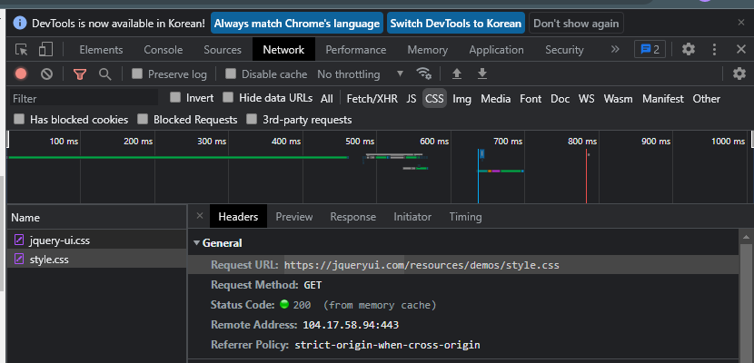

# 12.14

1/17 발표 혹은 1/24 발표

1/29~ 스프링프로젝트

**람다식**

```javascript
lotto.sort((a, b) => a - b);
```

**[로또번호 생성]**

```html
<button>로또 번호 발생기</button>
<div id="demo"></div>

<script>
    var lotto = [];
    document.querySelector("button").onclick = function() {
        var n;

        while (lotto.length < 6) {
            n = getRndRange(1, 45);

            if (isDuplicationLotto(lotto, n)) {
                lotto.push(n);
            }
        }

        lotto.sort(function(a, b) {
            return a - b;
        });


        $("#demo").text(lotto);
    }

    function getRndRange(min, max) {
        return Math.floor(Math.random() * (max - min + 1)) + min;
    }

    function isDuplicationLotto(lotto, n) {
        lotto.every(function(elt, i, array) {
            return elt != n;
        })
    }
</script>
```


녹화본: 9:38 로또생성기


**[자료구조]**


## **함수**

**Set**

- `add(요소)` 
- `delete(요소)` 
- `clear()` 모든요소 제거
- `has(요소)` boolean 반환
- `forEach([value], [key], [set] => )` 
- `size` 괄호없다. 

**Map**

- `set(key, value)`
- `get(key)`
- `delete(key)`
- `has()`
- `forEach((value, key, [map]) => )`
- `entries()`
- `size`

---

**Set**

```javascript
letters.forEach((val) => console.log(val));
```


```javascript
for (let e of letters.values()) {
    console.log(e);
}
```

> values() 가 없어도 동작한다.


문제제시) js Set 을 사용해서 로또번호 발생하는 코딩.

**Map**

- new Map()

  

**forEach**

```
apple: 10
banana: 3
orange: 15
```

```javascript
fruits.forEach((v, k) => console.log(k + ": " + v));
```


```javascript
for (let entry of fruits.entries()) {
    console.log(entry);
}
```

`entries()` 를 생략해도 된다.

**[동적 테이블 생성]**

```javascript
var tbl = document.createElement("table");
tbl.setAttribute("border", 1);
tbl.setAttribute("style", "width:100%");

var tr = tbl.insertRow(tbl.rows.length);

for (var i = 2; i <= 9; i++) {
    var th = tr.insertCell(i - 2);
    th.innerHTML = i + "단";
} // for
document.getElementById("demo").appendChild(tbl);
```


**구구단**

```javascript
for (var i = 1; i <= 9; i++) {
    var tr = tbl.insertRow(tbl.rows.length);

    for (var j = 2; j <= 9; j++) {
        var th = tr.insertCell(j - 2);
        th.innerHTML = j + "x" + i + "=" + i * j;
    } // for
    document.getElementById("demo").appendChild(tbl);
}
```


**국어점수 입력**

```javascript
$("button").click(
    function() {
        var kor = $("#kor").val();

        if (0 <= kor && kor <= 100) {
            var text = 
                kor >= 90 ? "수" 
            : kor >= 80 ? "우"
            : kor >= 70 ? "미" 
            : kor >= 60 ? "양" 
            : "가";

            console.log(text);
        } else {
            console.log("0~100 사이 정수를 입력하세요.")
        }
    });
```

**정규표현식**

**regex.**

- `test(string)` 일치하면 boolean 반환
- `exec()` 패턴 체크 후 일치하면 텍스트 반환. 일치하지 않으면 null 반환


```javascript
$("button").click(
    function() {
        var kor = $("#kor").val();
        var pattern = /^(100|[1-9]?\d)$/;

        if (pattern.test(kor)) {
            alert("수우미약가");
        } else {
            alert("국어 점수 입력 잘못!!!");
            $("#kor").focus().select();
        }
    });
```


```
['is', index: 4, input: '\nIs is th\nis it?', groups: undefined]
```

```javascript
var msg = "\nIs is th\nis it?";
var pattern = /is/;
// var pattern = /is/i; i 는 대소문자를 구분하지 않는다.
var result = msg.match(pattern);

console.log(result);
```

- `i` 대소문자를 구분하지 않는다.
- `g` 일치하는 모든 것을 찾는다.
- `m` 멀티라인 (라인별로 is 로 시작). `/^is/m` 

**[예외처리]**

- `try-catch-finally` 
- `throw` 


**엔터**

```javascript
if (event.keycode == 13) {}
```

**예외처리: kor 입력**

```javascript
$("#kor").keyup(function(event) {
    if (event.keyCode == 13) {
        try {
            var kor = $("#kor").val();

            if (kor.trim().length == 0) {
                throw "kor 필수 입력";
            } else if (isNaN(kor)) {
                throw "kor Not a Number";
            }
            alert("입력 성공!!!");
        } catch (e) {
            $("#demo").html("> 에러 메시지: " + e);
        }
    } // if
}); // enter
```


```javascript
test();

function test() {
    var n = 100;
    document.write("1. " + n + "<br>");
}
document.write("2. " + n + "<br>");
```

`var n` 에서 var 이 없으면 n 은 전역변수가 된다.

전역변수 `n = 100` 으로 선언되면 `window.n` 와 같이 window 의 객체가 된다.


use strict 엄격모드: 반드시 변수를 선언하고 사용하겠다.

ECMAScript5 도입


**[this]**

```javascript
var x = this;
```

전역변수, 브라우저 닫힐 때까지 사용.


js => 화살표 함수, 람다식 ES6 도입

화살표 함수를 사용하면 더 짧은 함수구문을 작성할 수 있다.


일반함수 vs 화살표함수

일반함수: 함수를 호출한 객체

람다식: window 객체


js class 키워드를 사용해서 클래스를 선언할 수 있다.

ECMAScript 2015 == ES6 도입

**객체**

```javascript
class Car {
    // 객체 생성될 때 자동으로 호출되는 함수 (생성자)
    constructor(name, year) {
        this.name = name;
        this.year = year;
    }
    age(year) {
        return year - this.year;
    }
}
var myCar = new Car("BMW", 2019);
console.log(myCar.name + " / " + myCar.year + " / " + myCar.age(2021));
```


**[forms 컬렉션]**

```javascript
<form action="ex10_ok.jsp">
    Name: <input type="text" name="name" autofocus />
        Age: <input type="text"
name="age" /> <input type="submit" />
    </form>
```


**JSP**

```jsp
<%
String name = request.getParameter("name");
int age = Integer.parseInt(request.getParameter("age"));
%>

> 서버로 전송된 Name: <%= name %> <br>
> 서버로 전송된 Age: <%= age %> <br>
```


```javascript
document.forms[name] // 형식
document.forms["form1"]
document.forms[0]
```


js 객체는 기본형을 제외하면 모두 js 객체이다.

js 기본형

- string
- number
- boolean
- null
- undefined

js 객체

- new Number()	
- new Boolean()
- new 키워드로 정의된 경우: string, number, boolean -> 객체
- Date, Math, 정규식, 배열, 함수 (function), object


```javascript
// 1. 새로운 필드 (속성) 추가
// person.새로운속성명 = 속성값;
person.nationality = "Korea";

// 2. 속성을 삭제
delete person.eyecolor;
```


**객체**

```javascript
// js 객체는 기본형을 제외하면 모두 js 객체이다.
var person = {
    firstname: "john"
    , lastname: "Doe"
    , age: 50
    , eyecolor: "blue"
    , fullName: function() {
        return this.firstname + " " + this.lastname;
    }
};

// 1. 새로운 필드 (속성) 추가
// person.새로운속성명 = 속성값;
person.nationality = "Korea";

// 2. 속성을 삭제
delete person.eyecolor;

// 3. 메서드 호출
var name = person.fullName();

// 4. 메서드 추가
// person.메서드명 = function() {}
person.name = function() {
    return this.firstname + " " + this.lastname;
}

// 5-1. 모든 속성(필드)를 출력
for ( var p in person) {
    // 			console.log(person.p);
    // 			console.log(person[p]);
}

// 5-2.
var Arr = Object.values(person);
console.log(Arr.join("<br>"));
```


Q. this 붙여야 하나?

A.


```javascript
var person = {
    firstname: "john"
    , lastname: "Doe"
    , language: "kr"

    // getter
    , get lang() {
        return this.language.toUpperCase();
    }
    , set lang(lang) {
        this.language.toUpperCase();
    }
    , get fullName() {
        return this.firstName + " " + this.lastname;
    }
}

console.log(person.fullName);
person.lang = "en";
// 		getter 호출
console.log(person.lang);
```


**[객체 생성자]**

객체를 만들 때 사용되는 함수 


```javascript
function Car(name, year) {
    this.name = name;
    this.year = year;
}
var myCar = new Car("K9", 2020);
// console.log(myCar.name) K9

function Person(fname, lname, age, eyecolor) {
    this.fname = fname;
    this.lname = lname;
    this.age = age;
    this.eyecolor = eyecolor;

    // 메서드 선언 가능
    this.name = function() {
        return this.fname + " " + this.lname;
    }
    this.changeName = function(name) {
        this.lname = name;
    }
}

// 1. 객체 생성자를 통해서 myFather, myMother 객체 생성...
var myFather = new wPerson("john", "doe", 40, "blue");
var myMother = new wPerson("sally", "doe", 35, "green");

// 객체를 만들 때 사용되는 함수
// 2. 객체생성자 -> 객체 생성
// 생성된 객체를 통해서 속성을 추가할 수 있다.
myFather.nationality = "Korea";
// 		Person.nationality = "Korea"; 객체생성자를 통해서 속성을 추가할 수 없다.

// 3. 객체를 통해서 메서드 추가
myFather.name = function() {
    return this.fname + "/" + this.lname;

    // 4. [객체 생성자] 를 통해서 속성 + 메서드 추가하는 방법
    Person.prototype.bloodType = 'A';
    Person.prototype.getBlood = function() {
        return this.bloodType;
    }
}
```


**[call&apply]**

- `call()`
- `apply()` 

**call 예제**

```javascript
document.write(person.print.call(person1) + "<br>");
```

person1 에 없는 함수를 person 에서 사용


메서드의 매개변수가 없을경우 call 과 apply 는 같은역할이다.


```javascript
document.write(person.print.call(person1, 'a', 'kr') + "<br>");
document.write(person.print.apply(person1, ['a', 'kr']) + "<br>");
```


```javascript
var person1 = {
    name: "hong"
    , age: 20
};

var person2 = {
    name: "admin"
    , age: 45
};

var person = {
    // 매개변수가 있는 print 메서드
    print: function(city, language) {
        return this.name + " / " + this.age 
            + " / " + city + " / " + language;
    }
};

document.write(person.print.call(person1, 'a', 'kr') + "<br>");
document.write(person.print.apply(person1, ['a', 'kr']) + "<br>");
document.write(Math.max.apply(null, [1, 5, 3, 4, 2]) + "<br>");
```


```javascript
window.onload = function() {
    alert("window.load 이벤트 발생~~");
}
```

body 태그에 onload 속성을 줘도 된다.


```javascript
setTimeout(dispTime, 1000); // callback 함수
```

1000ms (1초) 후에 dispTime 함수 호출.

**[시계]**

```javascript
<h1 id="demo"></h1>
<button onclick="timer_start()">setTimeout()</button>
<button onclick="timer_stop()">clearTimeout()</button>

<script>
    var demo;
window.onload = function() {
    // 			alert("window.load 이벤트 발생~~");
    window.demo = document.getElementById("demo");

}

var timer;
function dispTime() {
    var now = new Date();
    demo.innerHTML = now.toLocaleString();
    timer = setTimeout(dispTime, 1000); // callback 함수
}

function timer_start() {
    dispTime(); // 함수호출
}
```


```javascript
var demo;
window.onload = function() {
    // 			alert("window.load 이벤트 발생~~");
    window.demo = document.getElementById("demo");

}

var timer;
function dispTime() {
    var now = new Date();
    demo.innerHTML = now.toLocaleString();
}

function timer_start() {
    // 1초마다 dispTime 콜백함수를 호출하라.
    setInterval(dispTime, 1000);
}

function timer_stop() {
    clearInterval(timer);
}
```

- `setTimeout` 1초후 1번 호출
- `setInterval` 1초마다 호출

`document.documentElement` html 요소


**[글자찍기]**

```html
<button onclick="btn_typeWriter();">TypeWriter</button>
<p id="box"></p>

<script>
    var content;
    var contentLength;
    var box = document.getElementById("box");

    function btn_typeWriter() {
        // <html> 루트엘리먼트
        content = document.documentElement.innerHTML;
        // 			alert(content);
        contentLength = content.length;

        typeWriter();
    }

    var i = 0;
    var timer;

    function typeWriter() {
        if (i <= contentLength) {
            var oneChar = content.charAt(i++);
            box.innerHTML += oneChar == '\n' ? "<br>" : oneChar;

            timer = setTimeout(typeWriter, 50);
        } else {
            clearTimeout(timer);
            alert("출력완료!!!");
        }
    }
</script>
```


**스크롤 간격**

```javascript
document.body.scrollTop = 0;
document.documentElement.scrollTop = 0;
```

브라우저에 따라 body 태그에 줘야되는 브라우저도 있고 html 태그에 줘야되는 브라우저도 있다.


**속성**

- `scrollTop` 
- `scrollHeight`
- `clientHeight` 

```javascript
var scrollTop = document.body.scrollTop || document.documentElement.scrollTop;
```


hH : sT = 100% : x ?

x = (100% * sT) / hH


**[스크롤 예제]**

```html
<!DOCTYPE html>
<html>
<head>
<meta charset="UTF-8">
<meta name="viewport" content="width=device-width, initial-scale=1.0">
<script
	src="https://ajax.googleapis.com/ajax/libs/jquery/3.6.0/jquery.min.js"></script>
<style>
body {
	margin: 0;
	font-size: 28px;
}

.header {
	position: fixed;
	top: 0;
	z-index: 1;
	width: 100%;
	background-color: #f1f1f1;
}

.header h2 {
	text-align: center;
}

.process-container {
	width: 100%;
	height: 8px;
	background: #ccc;
}

.progress-bar {
	height: 8px;
	background-color: red;
	width: 0;
}

.content {
	padding: 100px 0;
	margin: 50px auto 0 auto;
	width: 80%;
}
</style>
<style>
#btnTop {
	position: fixed;
	bottom: 20px;
	right: 30px;
	z-index: 99;
	outline: none;
	background: red;
	color: white;
	padding: 15px;
	border-radius: 10px;
	display: none;
	border: none; /* 버튼은  기본적으로 테두리가 있다.. */
}

#btnTop:hover {
	background: #555;
}
</style>
</head>
<body>
	<div class="header">
		<h2>스크롤 표시하기</h2>
		<div class="process-container">
			<div class="progress-bar" id="myBar"></div>
		</div>
	</div>
	<!-- .content>p*40>lorem8 -->
	<div class="content">
		<p>Lorem ipsum dolor sit amet, consectetur adipisicing elit.</p>
		<p>Repellat praesentium ex animi eos in excepturi quod?</p>
		<p>Quas a commodi labore quidem nihil ipsum reiciendis.</p>
		<p>Eum quisquam laboriosam modi impedit ipsam iste consectetur.</p>
		<p>Minima accusantium architecto minus ex odit exercitationem
			similique.</p>
		<p>Modi dolores quo ipsa voluptate eius ratione eum!</p>
		<p>Rem vel tempora repudiandae quod consequatur fugit sequi.</p>
		<p>Expedita assumenda eius molestias eum quas nisi aliquam!</p>
		<p>Tempora deleniti magnam minus ullam officiis tempore dolor!</p>
		<p>Molestias obcaecati eum impedit facere vel. Dolorem quod.</p>
		<p>Autem mollitia dolores vitae aspernatur consequatur ratione
			quis?</p>
		<p>Neque veritatis ut iste sequi debitis ex iure?</p>
		<p>Aliquam corporis dolore voluptatibus quas dolorum maxime animi.</p>
		<p>Officiis odit temporibus non assumenda laudantium quam labore.</p>
		<p>Id eum explicabo nulla quidem necessitatibus eos sapiente.</p>
		<p>Est quibusdam aliquid doloribus voluptatum iusto quis
			doloremque.</p>
		<p>Doloremque rem non voluptas quaerat rerum veniam odit?</p>
		<p>Dicta libero ab est incidunt accusantium voluptatum
			praesentium.</p>
		<p>Cumque est culpa provident distinctio consectetur voluptatem
			nobis.</p>
		<p>Explicabo ex error similique est magni nihil deleniti!</p>
		<p>Doloribus repellendus quos deleniti debitis delectus
			reprehenderit fuga!</p>
		<p>Consequatur quia architecto impedit aspernatur tempore alias
			dolores.</p>
		<p>Ea temporibus cumque laudantium autem similique distinctio
			omnis.</p>
		<p>Harum eligendi iusto saepe cumque tenetur delectus praesentium.</p>
		<p>Laborum culpa iure aspernatur omnis ipsum unde deserunt?</p>
		<p>Debitis voluptatibus distinctio maiores accusamus nesciunt
			facere voluptate!</p>
		<p>Eum dignissimos ut delectus ab atque tempore quaerat.</p>
		<p>Dicta ipsum esse quam modi eligendi possimus excepturi.</p>
		<p>Nobis velit culpa reprehenderit sit ut unde voluptatibus.</p>
		<p>Hic nostrum natus dolore laudantium odio aut et?</p>
		<p>Officiis autem voluptatem eveniet neque veniam accusantium
			corporis.</p>
		<p>Dolore eius id magni sint a quos ipsum.</p>
		<p>Dignissimos blanditiis aliquid inventore tempora ratione dolore
			ab.</p>
		<p>Officia aut ea cupiditate cumque non quae blanditiis.</p>
		<p>Officiis nemo sit eos dicta necessitatibus incidunt aliquid.</p>
		<p>Qui et libero nesciunt quia dolor quae optio.</p>
		<p>Ipsam itaque reprehenderit blanditiis quam dignissimos magni
			delectus!</p>
		<p>Amet officia dolorum temporibus maiores quos voluptates ea.</p>
		<p>Voluptas omnis soluta culpa fuga cupiditate sunt iure.</p>
		<p>Aut voluptas illo assumenda sed provident quod cupiditate!</p>
	</div>

	<!-- button#btnTop[title="Go  To Top"]>{Top} -->
	<button id="btnTop" title="Go To Top">Top</button>

	<script>
		window.onscroll = function() {
			console.log("window.scroll 이벤트");
			var scrollTop = document.body.scrollTop
					|| document.documentElement.scrollTop;
			var scrollHeight = document.documentElement.scrollHeight;
			var clientHeight = document.documentElement.clientHeight;

			var hiddenHeight = scrollHeight - clientHeight;
			console.log(scrollTop + " / " + clientHeight + " / " + scrollHeight
					+ " / " + hiddenHeight);

			var widthPercent = (100 * scrollTop) / hiddenHeight;

			document.getElementById("myBar").style.width = widthPercent + "%";

			if (scrollTop >= clientHeight) {
				document.getElementById("btnTop").style.display = "block";
			} else {
				document.getElementById("btnTop").style.display = "none";
			}
		}
	</script>


	<script>
		document.getElementById("btnTop").onclick = function() {
			document.body.scrollTop = 0;
			document.documentElement.scrollTop = 0;
		}
	</script>
</body>
</html>
```

**[클릭이벤트]**

1. onclick 속성


**같은코드**

```javascript
document.getElementsByTagName("h1")[0]
document.querySelector("h1")
document.querySelectorAll("h1")[0]
```


```javascript
document.querySelector("h1").onclick = function() {
    alert("hi~~~");
}
// 		document.querySelectorAll("h1")[0]

document.getElementsByTagName("h1")[0].addEventListener("click",
                                                        function(e) {
    console.log("addEventListener ~");
});

function test() {
    console.log("test~~~~");
}

document.getElementsByTagName("h1")[0].addEventListener("click", test);
```

onclick 과 다르게 addEventListener 는 여러개의 이벤트를 등록할 수 있다.


[이벤트의 전파방법]

1. 이벤트버블링: 자식 -> 부모이벤트가 전달 (전파)
2. 이벤트 캡쳐: 부모 -> 자식 이벤트 전달

#in 클릭 -> #out 클릭

자식 p 부모 div 로 클릭이벤트 전파.


**버블링**

```javascript
event.cancelBubble = true;
```

- `addEventListener("click", 함수, [capture])` capture false 이면 기본값.

jQuery 버블링 코딩은 다르다. 검색하면 된다.


1. 함수정리
2. +++ 클로저 +++ (closures) - 폐쇄


```javascript
function sum(a, b = 1) {
    return a + b;
}

var hap = function(a, b) {
    return a + b;
};

var myFunc = new Function("a", "b", "return a * b");
```

함수를 변수에 저장할 때에는 세미콜론이 필요하다.


**[자체호출함수]+++**

```javascript
(function() {
    alert("hello world~");
})();
```


**함수를 문자열로**

```javascript
function sum(a, b) {
    return a + b;
}

var str = sum.toString();
alert(str);
```

**[클로저(closure)]**

전역변수는 다른페이지로 이동하거나 창을 닫을 때와 같이 페이지가 삭제될 때까지 유지된다.

지역변수는 함수가 호출될 때 생성되고, 함수가 완료되면 삭제된다.


**1 더하기 예제**


**클로저 개념**

익명함수 (상위함수) 의 지역변수로 선언된 counter 변수가 보존 (보호) 되며

add() 함수를 통해서만 변경할 수 있더라.

counter 변수는 익명함수 (상위함수) 가 닫힌 후 (폐쇄)에도 상위 counter 변수는 보존 (보호) 되기에 접근가능하더라.


```javascript
// 자체 호출 함수
// return 중첩함수
var add = (function() {
    let counter = 0; // 지역변수 X 전역변수 O
    return function() {
        counter++;
        return counter;
    };
})();

document.write(add()); // 1
document.write(add()); // 2
document.write(add()); // 3
```

# 12.15

**문제**

버튼을 누르면 숫자 증가.

```html
<button>0</button>
<button>0</button>
<button>0</button>
<button>0</button>
<button>0</button>
```

```javascript
var arr = [0, 0, 0, 0, 0];

$("button").click(function() {
    var idx = $(this).index();
    arr[idx]++;
    $(this).html(arr[idx]);
});
```

> `$(this)` this 에 쌍따옴표가 없다.

```javascript
function cnt(btn) {
    var num = parseInt(btn.innerHTML);
    btn.innerHTML = ++num;
}
```

`event.srcElement.value` 

```javascript
var num = parseInt(event.srcElement.innerHTML);
event.srcElement.innerHTML = ++num;
```


**클로저**

```javascript
var btns = document.getElementsByTagName("button");

for (var i = 0; i < btns.length; i++) {
    btns[i].onclick = (function() {
        var counter = 0;

        return function() {
            event.srcElement.innerHTML = ++counter;
        }
    })();
}
```


**[DOM]**

```javascript
var counter = (function() {
    var privateCounter = 0; // 외부 X
    function changeBy(value) { // 외부 X
        privateCounter += value;
    }
    return {
        increment:function() {
            changeBy(1);
        },
        decrement:function() {
            changeBy(-1);
        },
        value:function() {
            return privateCounter;
        }
    };
})();

counter.increment();
counter.increment();
counter.increment();
document.write(counter.value() + "<br>");
counter.decrement();
document.write(counter.value() + "<br>");
```


**중첩함수&클로저 예제**


오류

```javascript
var btns = document.getElementsByTagName("button");

for (var i = 0; i < btns.length; i++) {
    btns[i].onclick = function() {

        var btn = event.srcElement; // 클랙된 버튼
        var width = 1;
        var timer = setTimeout(function() {

            if (width < 100) {
                width++;
                btn.previousElementSibling.style.width = width + "%";
                btn.previousElementSibling.innerHTML = width + "%";

            } else {
                clearInterval(timer);
            }
        }, 30);
    }
}
```


```javascript
var $bar = $(this).prev();
```

`$bar` jQuery 객체변수

**jQuery**

```javascript
$("button").click(function(event) {
    var $bar = $(this).prev();
    var width = 1;
    var timer = setInterval(function() {
        if (width < 100) {
            width++;
            $bar.css("width", width + "%");
            $bar.html(width + "%");
        } else {
            clearInterval(timer);
        }
    }, 30);
});
```


jQuery 사이트 - 왼쪽탭의 Draggable - 아래의 view source

**상대경로 찾기**




**드래그 예제**

```html
<!DOCTYPE html>
<html>
<head>
<meta charset="UTF-8">
<meta name="viewport" content="width=device-width, initial-scale=1.0">
<link rel="stylesheet"
	href="//code.jquery.com/ui/1.13.0/themes/base/jquery-ui.css">
<link rel="stylesheet" href="https://jqueryui.com/resources/demos/style.css">
<style>
.draggable {
	width: 150px;
	height: 150px;
	padding: 0.5em;
	border: solid 1px gray;
}
</style>
<script src="https://code.jquery.com/jquery-3.6.0.js"></script>
<script src="https://code.jquery.com/ui/1.13.0/jquery-ui.js"></script>
<script>
	$(function() {
		$(".draggable").draggable();
	});
</script>
</head>
<body>
	<div class="draggable" class="ui-widget-content">
		<p>냉장고</p>
	</div>
	<div class="draggable" class="ui-widget-content">
		<p>컴퓨터</p>
	</div>
	<div class="draggable" class="ui-widget-content">
		<p>책상</p>
	</div>
	<div class="draggable" class="ui-widget-content">
		<p>침대</p>
	</div>
</body>
</html>
```


```javascript
alert(e.button);
```

- `0` 마우스 왼클릭
- `1` 마우스 휠클릭
- `2` 마우스 우클릭

```javascript
pos3 = e.clientX;
pos4 = e.clientY;
console.log(pos3 + " " + pos4);
```

```javascript
console.log(elem.offsetLeft + " / " + elem.offsetTop);
```

태그위치


**전체코드**

```javascript
function draggable(elem) {
    var pos1 = 0, pos2 = 0; // 이동한 거리 x, y
    var pos3 = 0, pos4 = 0;
    if (document.getElementById(elem.id + "Header")) {
        document.getElementById(elem.id + "Header").onmousedown = dragMouseDown;

    } // if

    // 중첩함수 (클로저)
    function dragMouseDown(e) {
        e = e || window.event;
        // 				alert(e.button);

        pos3 = e.clientX;
        pos4 = e.clientY;
        // 				console.log(pos3 + " " + pos4);

        console.log(elem.offsetLeft + " / " + elem.offsetTop);

        document.onmousemove = elementDrag;
        document.onmouseup = closeDragElement;
    }

    function elementDrag(e) {

    }

    function closeDragElement(e) {

    }

} // function
```


**직접구현**

onmouseup down , offseTop Left, clientX Y 를 사용해서 구현

```javascript
<!DOCTYPE html>
<html>
<head>
<meta charset="UTF-8">
<meta name="viewport" content="width=device-width, initial-scale=1.0">
<title>SS15 2021. 12. 15. - 오전 10:30:46</title>
<link rel="icon" type="image/x-icon" href="../images/SiSt.ico">
<script
	src="https://ajax.googleapis.com/ajax/libs/jquery/3.6.0/jquery.min.js"></script>

<style>
.myDiv {
	background-color: #f1f1f1;
	text-align: center;
	border: 1px solid #d3d3d3;
	position: absolute;
	z-index: 9;
}

.myDivHeader {
	padding: 10px;
	cursor: move;
	z-index: 10;
	background-color: #2396F3;
	color: #fff;
}
</style>

</head>
<body>

	<div id="myDiv1" class="myDiv">
		<div id="myDiv1Header" class="myDivHeader">Click Hear</div>
		<p>DragDrop</p>
		<p>DragOver</p>
		<p>Box</p>
	</div>
	<div id="myDiv2" class="myDiv">
		<div id="myDiv2Header" class="myDivHeader">Click Hear</div>
		<p>DragDrop</p>
		<p>DragOver</p>
		<p>Box</p>
	</div>
	<div id="myDiv3" class="myDiv">
		<div id="myDiv3Header" class="myDivHeader">Click Hear</div>
		<p>DragDrop</p>
		<p>DragOver</p>
		<p>Box</p>
	</div>

	<script>
		// elem.offsetLet, offsetTop
		// e.clientX , e.clientY
		// onmouseup/ onmousemove / onmousedown
		// e.buttn

		function draggable(elem) {
			// 클로저
			var pos1 = 0, pos2 = 0; // 이동한 거리 x, y
			var pos3 = 0, pos4 = 0; //  elem  x, y

			if (document.getElementById(elem.id + "Header")) {
				document.getElementById(elem.id + "Header").onmousedown = dragMouseDown;
			} // if

			// 중첩함수( 클로저 )
			function dragMouseDown(e) {
				e = e || window.event;

				// alert( e.button ); // 마우스 버튼 0 (왼쪽)/ 2(오른쪽) / 휠 (1)

				pos3 = e.clientX;
				pos4 = e.clientY;
				// 마우스 클릭한 좌표
				// console.log( pos3 + " / " + pos4);

				//                let "8px" ->   8
				// console.log( elem.offsetLeft +" / " + elem.offsetTop )

				// 
				document.onmousemove = elementDrag;
				document.onmouseup = closeDragElement;
			}

			function elementDrag(e) {
				e = e || window.event;

				// 이동한 거리
				pos1 = pos3 - e.clientX;
				pos2 = pos4 - e.clientY;
				// 이동한 거리만큼 elem 이동.
				elem.style.left = (elem.offsetLeft - pos1) + "px";
				elem.style.top = (elem.offsetTop - pos2) + "px";

				pos3 = e.clientX;
				pos4 = e.clientY;
			}

			function closeDragElement(e) {
				// 모든 이벤트 제거
				document.onmousemove = null;
				document.onmouseup = null;
			}

		} // function 

		// $( ".draggable" ).draggable();
		draggable(document.getElementById("myDiv1"));
		draggable(document.getElementById("myDiv2"));
		draggable(document.getElementById("myDiv3"));
	</script>
</body>
</html>
```

**[공 예제]**

CSS

```css
#container {
	width: 400px;
	height: 400px;
	position: relative;
	background-color: yellow;
}

#animate {
	width: 50px;
	height: 50px;
	position: absolute;
	background-color: red;
	border-radius: 50%;
}
```

HTML

```html
<p>
    <button onclick="myMove();">Click Me</button>
</p>
<div id="container">
    <div id="animate"></div>
</div>
```


```javascript
function myMove() {
    var elem = document.getElementById("animate");
    var pos = 0; // x, y
    var timer = setInterval(function() {
        if (pos == 350) {
            clearInterval(timer);
        } else {
            pos++;
            elem.style.top = pos + "px";
            elem.style.left = pos + "px";
        }
    }, 5);
}
```


**공 튕기기**

```javascript
function myMove(id) {
    var elem = document.getElementById(id);
    var posX = 0; // x, y
    var posY = 0; // x, y
    var x = 6;
    var y = 9;

    var timer = setInterval(function() {
        if (posY >= 350 || posY <= 0) y *= -1;
        if (posX >= 350 || posX <= 0) x *= -1;

        posX += x;
        posY += y;

        if (posX < 0)
            posX = 0;
        else if (posX > 350)
            posX = 350;
        if (posY < 0)
            posY = 0;
        else if (posY > 350)
            posY = 350;

        elem.style.left = posX + "px";
        elem.style.top = posY + "px";
    }, 10);
}
```


오류

```javascript
var no = 1;
function make() {
    var container = document.getElementById("container");
    var newCircle = document.createElement("div");
    newCircle.className = "animate";
    newCircle.setAttribute("id", "animate" + no);
    container.appendChild(container);
    myMove("animate" + no);

    no++;
}

function myMove(id) {
    var elem = document.getElementById(id);
    var posX = 0; // x, y
    var posY = 0; // x, y
    var x = 6;
    var y = 9;

    var timer = setInterval(function() {
        if (posY >= 350 || posY <= 0) y *= -1;
        if (posX >= 350 || posX <= 0) x *= -1;

        posX += x;
        posY += y;

        if (posX < 0)
            posX = 0;
        else if (posX > 350)
            posX = 350;
        if (posY < 0)
            posY = 0;
        else if (posY > 350)
            posY = 350;

        elem.style.left = posX + "px";
        elem.style.top = posY + "px";
    }, 10);
}
```

animate 를 클래스로 바꾼다.


js 컬렉션: arguments/ forms/ options - [elements] / links/ images 등등

Q. value 가 없을 때 text 가져오는지 확인

A.


**모든 이미지객체 가져오기**

```javascript
var imgLength = document.images.length;

for (var i = 0; i < imgLength; i++) {
    console.log(document.images[i].src);
}
```

**모든 링크태그 가져오기**

```javascript
var linkLength = document.links.length;

for (var i = 0; i < linkLength; i++) {
    var href = document.links[i].href;
    var text = document.links[i].text;

    console.log((i + 1) + ". " + href + " / " + text);
} 
```


**[DOM]**


1. DOM ? 
   - Document Object Model 의 약자
   - 웹페이지가 로드될 때, 브라우저가 DOM (객체) 으로 생성
   - 트리로 구성된 객체
2. DOM 사용처
   - html 요소 변경 (추가, 수정, 삭제)
   - html 속성 변경 (추가, 수정, 삭제)
   - css 스타일 변경
   - html 이벤트 처리 (추가, 수정, 삭제)
3. W3C DOM 종류
   - Core DOM: 모든 문서 유형에 대한 표준 DOM
   - HTML DOM
   - XML DOM


(1) html 요소를 찾는 메서드

**document.**

- `getElementById(id)` 
- `getElementsByTagName` 
- `getElementsByClassName`
- `getElementsByName` 

(2) html 요소변경

**element.**

- `innerHTML`
- `innerText`
- `attribute명`
- `style.property` 
- `setAttribute(속성명, 속성값)`
- `getAttribute(속성명)` 


(3) html 요소 동적 추가, 수정, 삭제

**document.**

- `createElement()`
- `appendChild()`
- `removeChild()`
- `replaceChild()`
- `write()`

(4) 이벤트 처리

**elem.**

- `onclick`
- `onmousemove`

(5) 

**document.**

- `body`
- `documentElement` html 태그
- `doctype` `<!DOCTYPE>`  선언문
- `forms`
- `head` 
- `links` `images` 
- `scripts` 컬렉션 = 모든 script 요소들
- `title` 
- +++++ `referrer` +++++

**[HTML DOM 탐색]**

jQuery method ++++

1. html 문서의 모든 것은 Node (노드)
   - 예) div, id, text, comment, `<!DOCTYPE>` 등
2. 전체문서 = 문서노드
   - 요소노드
   - 속성노드
   - 텍스트노드
   - 주석노드
3. 모든 노드들은 관계
   - html 노드 (요소노드) - 부모노드 / 루트노드
   - 자식노드 증에 첫번째 자식: firstChild
   - 노드의 다음 형제노드: nextSibling, 요소노드: nextElementSibling
   - 노드의 이전형제노드: previoousSibling, previous
4. 노드들 간의 탐색할 때 사용하는 속성
   - parentNode 속성: 부모노드
   - childNodes: 자식노드들 nodeList
   - firstChild
   - lastChild
   - nextSibling
   - previousSibling


```html
<h1 id="id01">My First Page</h1>
<p id="id02"></p>

<script>
    // 		alert(document.getElementById("id01").innerHTML);
    var childList = document.getElementById("id01").childNodes; // nodeList
    alert(childList.length); // 1
</script>
```

자식이 없는데 1이라고 나온다.

Element 에 있는 Text 도 하나의 노드이다.


노드 (node) == 요소 (element) 의미 차이점

```javascript
alert(document.getElementById("id01").firstChild.nodeName); // #text
```

**nodeName 속성**

1. 요소노드: 태그명
2. 텍스트노드: #text
3. 속성노드: 속성명
4. 주석노드: #comment


```javascript
alert(h1.nodeType);
```

1. element node
2. attribute node
3. text node
4. comment node
5. document node. 루트노드
6. document type node. `<!DOCTYPE>` 선언문

**nodeValue 속성**

1. 텍스트노드: 문자열
2. 속성노드: 속성값
3. 요소노드: null

| Node       | nodeName | nodeValue |
| ---------- | -------- | --------- |
| 요소노드   | 태그명   | null      |
| 텍스트노드 | text     | 문자열    |
| 속성노드   | 속성명   | 속성값    |
| 주석노드   | comment  |           |


```javascript
// div1.replaceChild(new, old);
div1.replaceChild(p3, p2);
```

1. `createTextNode`
2. `appendChild`
3. `replaceChild`
4. `insertBefore(삽입할요소, 상대요소)` 요소앞에 요소를 삽입한다.
5. `removeChild(요소)` 

```javascript
p2.parentNode.innerHTML = "XXX";
```

p2 의 부모노드는 div 노드이다.

```javascript
$(":checked");
```


**체크된 값 가져오기**

```javascript
document.getElementById("btn").onclick = function() {
    var ckbList = document.querySelectorAll("table input[type=checkbox]");

    for (let ckb of ckbList) {
        if (ckb.checked) {
            // 					var no = ckb.nextSibling.nodeValue;
            // 					alert(no);
            var name = ckb.parentNode.parentNode.childNodes[3].firstChild.nodeValue;
            alert(name);
        }
    }
}
```

왜 두번째가 아니라 세번째일까...

`firstChild.nodeValue` 대신에 `innerText` `innerHTML` 로 사용해도 된다.


**[공지사항]**

ajax 로 DB 에서 불러온다.

**CSS**

```css
* {
	box-sizing: border-box;
}

.alert {
	padding: 20px;
	background-color: #f44336;
	color: white;
	opacity: 1;
	transition: opacity 0.6s, height 0.6s;
	margin-bottom: 15px;
}

.alert.success {
	background-color: #4caf50;
}

.alert.info {
	background-color: #2196f3;
}

.alert.warning {
	background-color: #ff9800;
}

.closebtn {
	margin-left: 15px;
	color: white;
	font-weight: bold;
	float: right;
	font-size: 22px;
	line-height: 20px;
	cursor: pointer;
	transition: 0.3s;
}

.closebtn:hover {
	color: black;
}
```

**HTML**

```html
<h2>알림(공지사항)</h2>
공지사항 타입 :
<select name="type" id="type">
    <option>type 없음</option>
    <option>success</option>
    <option>warning</option>
    <option>info</option>
</select>
<br> 내용 :
<input type="text" />
<button>공지사항 추가</button>
<hr>

<script>
    // DB 알림내용을 생성 -> 출력.  -> Ajax
    //    Oralce                         js, jquery (Ajax)  화면 출력.
    window.onload = function (){
        var data = [
            {type:"success", message:" Lorem ipsum dolor sit amet, consectetur adipisicing elit. Veniam molestias."},
            {type:"warning", message:" Lorem ipsum dolor sit amet, consectetur adipisicing elit. Veniam molestias."},
            {type:"info", message:" Lorem ipsum dolor sit amet, consectetur adipisicing elit. Veniam molestias."},
            {type:"success", message:" Lorem ipsum dolor sit amet, consectetur adipisicing elit. Veniam molestias."}
        ];

        for (var i = 0; i < data.length; i++) {
            var  alertDiv = document.createElement("div");
            alertDiv.classList.add("alert"); 
            alertDiv.classList.add( data[i].type );    

            var spanbtn = document.createElement("span");
            spanbtn.classList.add("closebtn"); 
            spanbtn.innerHTML = "&times;";
            spanbtn.onclick = function (){
                var div =   this.parentElement;
                div.style.opacity = "0";
                setTimeout(function() {
                    div.style.display = "none";
                }, 600);
            };
            alertDiv.appendChild(spanbtn)

            var strong = document.createElement("strong");
            strong.innerHTML =  data[i].type.toUpperCase() ;
            alertDiv.appendChild(strong);

            var content =  data[i].message;
            var message = document.createTextNode(content);
            alertDiv.appendChild( message ); 

            var hr = document.querySelector("hr"); 
            var before=  hr.nextSibling;
            document.body.insertBefore(alertDiv, before);
        } // for

    } // onload


</script>

<script>
    // <span class="closebtn">&times;</span>
    var closebtns = document.getElementsByClassName("closebtn");
    for (let closebtn of closebtns) {
        closebtn.onclick = function (){
            var div =   this.parentElement;
            div.style.opacity = "0";
            setTimeout(function() {
                div.style.display = "none";
            }, 600);
        }
    } 
</script>

<script>

    $("button").click(function(event) {
        /*
       <div class="alert success">
            <span class="closebtn">&times;</span>
            <strong>Success!</strong>
            Lorem ipsum dolor sit amet, consectetur adipisicing.
    </div>
        */
        var  alertDiv = document.createElement("div");
        alertDiv.classList.add("alert"); 
        alertDiv.classList.add( $("#type").val() );  // warning

        var spanbtn = document.createElement("span");
        spanbtn.classList.add("closebtn");
        // document.createTextNode("&times;")
        spanbtn.innerHTML = "&times;";
        spanbtn.onclick = function (){
            var div =   this.parentElement;
            div.style.opacity = "0";
            setTimeout(function() {
                div.style.display = "none";
            }, 600);
        };
        alertDiv.appendChild(spanbtn)

        var strong = document.createElement("strong");
        strong.innerHTML = $("#type").val();
        alertDiv.appendChild(strong);

        var content =  $("input").val();
        var message = document.createTextNode(content);
        alertDiv.appendChild( message );

        // 마지막 자식으로 추가 : appendChild()
        // document.body.appendChild( alertDiv ); 
        // jquery : $('.alertDiv')[0].before(alertDiv) 

        // var before = document.getElementsByClassName("alertDiv")[0];
        // document.body.insertBefore(alertDiv, before)

        var hr = document.querySelector("hr");
        // alert( hr.nextElementSibling.innerHTML );
        var before=  hr.nextSibling;
        document.body.insertBefore(alertDiv, before);

    });
</script>
```

**[BOM]**

- Browser Object Model 약자
- 브라우저 제공하는 객체의 모델
  1. window 
     - 모든 브라우저가 제공
     - 브라우저의 창을 나타낸다.
     - 최상위 부모 객체
     - 전역변수, 함수 선언하면 자동으로 window 객체의 구성원이 된다.
  2. screen
  3. location
  4. navigator
  5. history 


```javascript
let w = window.innerWidth; // 브라우저의 내부너비 (단위 px)
let h = window.innerHeight; // 브라우저의 내부높이 (단위 px)
alert(w + " / " + h);
```


```javascript
// IE 5, 6, 7, 8
document.documentElement.clientWidth;
document.documentElement.clientHeight;

document.body.clientWidth;
document.body.clientHeight;
```


**window.**

- `open()` 새 창 열기
- `close` 현재 창 닫기
- `moveTo` 현재 창 이동
- `moveBy`현재 창 이동
- `resizeTo` 현재 창 크기조정 (조절)
- `resizeBy`현재 창 크기조정 (조절)


**창 크기**

```javascript
var w = window.innerWidth
|| document.documentElement.clientWidth
|| document.body.clientWidth;

var h = window.innerHeight
|| document.documentElement.clientHeight
|| document.body.clientHeight;
```


**새 창 열기**

```javascript
var newWin;

function window_open() {
    newWin = window.open("ex08_03.html", "",
                         "width=600, heigh=500, top=100, left=200");
}

function window_close() {
    newWin.close();
}
```


**창 이동&크기**

```html
<table border="1" style="width: 100%">
    <tr>
        <td>절대위치</td>
        <td onclick="fn_moveto()">moveTo()</td>
    </tr>
    <tr>
        <td>상대위치</td>
        <td onclick="fn_moveby()">moveBy()</td>
    </tr>
    <tr>
        <td>절대크기</td>
        <td onclick="fn_resizeto()">resizeTo</td>
    </tr>
    <tr>
        <td>상대크기</td>
        <td onclick="fn_resizeby()">resizeBy</td>
    </tr>
    <tr>
        <td><button onclick="win_shake();">창 흔들기</button></td>
        <td><button onclick="win_close();">창 닫기</button></td>
    </tr>
</table>

<script>
    function fn_moveto() {
        window.moveTo(10, 10);
    }

    function fn_moveby() {
        window.moveBy(10, 10);
    }

    function fn_resizeto() {
        window.resizeTo(300, 300);
    }

    function fn_resizeby() {
        window.resizeBy(10, 10);
    }

    function win_shake() {
    }

    function win_close() {
        self.close();
    }
```

- `moveTo` 절대좌표
- `moveBy`  상대좌표
- `resizeTo`  절대이동
- `resizeBy` 상대이동
- `close`

```javascript
function win_load() {

}
function win_unload() {
    opener.zipWin = null;
}
```

**창 하나만 켜기**

1. if (!zipWin) 이면 창 만들기
2. `onunload` 일 때 `opener.zipWin = null;` 
3. zipWin 이 null 이 아니면 `focus()`

```javascript
function search_dong() {
    document.getElementById("searchResult").style.visibility = "visible";
    document.getElementByClassName("box")[1].style.visibility = "visible";
}
```


**[우편주소 값 넘겨주기]**

```html
<!DOCTYPE html>
<html>
<head>
<meta charset="UTF-8">
<meta name="viewport" content="width=device-width, initial-scale=1.0">
<script
	src="https://ajax.googleapis.com/ajax/libs/jquery/3.6.0/jquery.min.js"></script>
<style>
</style>
</head>
<body>
	<table border="1" style="width: 500px; margin: 0 auto">
		<tr>
			<td>우편번호</td>
			<td>
				<!-- 우편번호 input 태그는  zip1/zip2  readonly 속성에 의해 읽기 전용 --> <input
				type="text" id="zip1" name="zip1" size="3" readonly="readonly" />-
				<input type="text" id="zip2" name="zip2" size="3"
				readonly="readonly" /> <input type="button" value="우편번호 검색"
				onclick="search_zipcode();" />
			</td>
		</tr>
		<tr>
			<td>주소</td>
			<td><input type="text" id="addr1" name="addr1"
				style="width: 90%" /></td>
		</tr>
		<tr>
			<td>상세주소</td>
			<td><input type="text" id="addr2" name="addr2"
				style="width: 90%" /></td>
		</tr>
	</table>

	<script>
		var zipWin;

		function search_zipcode() {
			if (!zipWin) {
			zipWin = window.open("ex09_02.html", "",
					"width=600, heigh=500, top=100, left=200");
			} else {
				zipWin.focus();
			}
		}
		
	</script>
</body>
</html>
```

```html
<!DOCTYPE html>
<html>
<head>
<meta charset="UTF-8">
<meta name="viewport" content="width=device-width, initial-scale=1.0">
<script
	src="https://ajax.googleapis.com/ajax/libs/jquery/3.6.0/jquery.min.js"></script>
<style>
</style>
</head>
<body onload="win_load();" onunload="win_unload();">
	<table border="1" style="width: 100%">
		<tr>
			<td>검색할 동 입력 : <input type="text" id="dong" name="dong" /> <input
				type="button" value="검색" onclick="search_dong();" />
			</td>
		</tr>
		<tr>
			<td>
				<div id="searchResult" class="box" style="visibility: hidden;">
					<a href="javascript:sendAddr('123','451','서울 영등포구 당산 1동')">123-451</a>서울
					영등포구 당산 1동<br> <a
						href="javascript:sendAddr('123','452','서울 영등포구 당산 2동')">123-452</a>서울
					영등포구 당산 1동<br> <a
						href="javascript:sendAddr('123','453','서울 영등포구 당산 3동')">123-453</a>서울
					영등포구 당산 1동<br> <a
						href="javascript:sendAddr('123','454','서울 영등포구 당산 4동')">123-454</a>서울
					영등포구 당산 1동<br> <a
						href="javascript:sendAddr('123','455','서울 영등포구 당산 5동')">123-455</a>서울
					영등포구 당산 1동<br> <a
						href="javascript:sendAddr('123','456','서울 영등포구 당산 6동')">123-456</a>서울
					영등포구 당산 1동<br> <a
						href="javascript:sendAddr('123','457','서울 영등포구 당산 7동')">123-457</a>서울
					영등포구 당산 1동<br> <a
						href="javascript:sendAddr('123','458','서울 영등포구 당산 8동')">123-458</a>서울
					영등포구 당산 1동<br> <a
						href="javascript:sendAddr('123','459','서울 영등포구 당산 9동')">123-459</a>서울
					영등포구 당산 1동<br> <a
						href="javascript:sendAddr('123','461','서울 영등포구 당산 10동')">123-461</a>서울
					영등포구 당산 1동<br>
				</div>
			</td>
		</tr>
		<tr>
			<td>
				<div class="box" style="visibility: hidden;">'당산' 검색 결과 10개
					검색되었습니다.</div>
			</td>
		</tr>
	</table>

	<script>
		function win_load() {
			
		}
		function win_unload() {
			opener.zipWin = null;
		}
		
		function search_dong() {
			document.getElementById("searchResult").style.visibility = "visible";
			document.getElementByClassName("box")[1].style.visibility = "visible";
		}
		
		function sendAddr(zip1, zip2, addr1) {
			opener.document.getElementById("zip1").value = zip1;
			opener.document.getElementById("zip2").value = zip2;
			opener.document.getElementById("addr1").value = addr1;
			self.close();
			opener.document.getElementById("addr2").focus();
		}
	</script>

</body>
</html>
```


**[Screen]**

window.screen: 사용자 화면에 대한 정보를 포함하는 객체

**screen.**

- `width` 스크린 너비
- `height` 스크린 높이
- `availWidth`  사용 가능한 스크린 너비
- `availHeight` 사용 가능한 스크린 높이
  - 예) 작업표시줄
- `colorDepth` 색 농도
  - 16비트: 65536 가지
  - 32비트: 42억 가지

등등

```javascript
output += screen.width + " / " + screen.height + "<br>"; // 1366 / 768
output += screen.availWidth + " / " + screen.availHeight + "<br>"; // 1366 / 728
output += screen.colorDepth + "<br>"; // 24
```


**[Location]**

윈도우 (창) 위치 객체

- 현재 페이지의 주소 (URL) 을 얻기위해
- 현재 페이지의 주소 (URL) 을 새로 설정 -> 이동

**location.**

- `href` 새로운 페이지로 브라우저를 리디렉션할 수 있다. 현재주소 url 을 받을 수도 있다.
- `hostname` localhost
- `protocol` http:
- `port` 80
- `assign("URL")` 새 문서를 로드

href 는 속성, assign 은 함수이다. href 를 더 많이 사용한다.

**[history]**

- 브라우저의 역사를 포함하고있는 객체
- 사용자의 개인정보를 보호하기 위해서 접근방법이 제한적이다.

**.history**

- `back()` 이전 사이트로 이동
- `forward()`
- `go(n)`  n 이 -1 이나 1

**[navigator]**

**navigator.**

- `appName` 브라우저의 응용 프로그램 이름. Netscape
- `appCodeName` 브라우저의 응용 프로그램 코드이름. Mozilla
- `product` 브라우저의 엔진이름. Gecko
- `cookieEnabled` 브라우저의 쿠키 사용여부. true/false
- `javaEnabled` 브라우저의 운영체제. Win32


js BOM 객체

- window
- screen
- location
- history
- navigator


**[팝업상자]**

```javascript
// 예, 아니오 버튼을 가지고 있는 대화상자.
var message = "정말 종료할까요 ? ";
var result = confirm(message); // true false

if (result) {
    self.close();
}
```


```javascript
var age = prompt("당신의 나이를 입력하세요 ? ", 20);
if (age) {
    alert(age);
}
```

입력여부에 상관없이 취소버튼을 클릭하면 null


**[클릭 랜덤 아이콘]**

```html
<!DOCTYPE html>
<html>
<head>
<meta charset="UTF-8">
<meta name="viewport" content="width=device-width, initial-scale=1.0">
<script
	src="https://ajax.googleapis.com/ajax/libs/jquery/3.6.0/jquery.min.js"></script>
<style>
.box {
	position: absolute;
}
</style>
</head>
<body>
	

	<script>
		function getRandom(min, max) {
			return Math.floor(Math.random() * (max - min + 1) + min);
		} 
	</script>
	<script>
		document.oncontextmenu = function() {
			return false;
		}
	
		document.onmousedown = function() {

		if (event.button == 0) {
				document.title = event.clientX + ", " + event.clientY + ", "
						+ $("img").width();
				var img = document.createElement("img");
				var no = getRandom(1, 20).toString().padStart(2, 0);
				var imgUrl = "../images/item" + no + ".gif";
				img.setAttribute("src", imgUrl);
				img.classList.add("box");
				var left = event.clientX - ($("img").width() / 2);
				var top = event.clientY - ($("img").height() / 2);
				img.setAttribute("style", "left:" + left + "px; top:" + top
						+ "px");

				document.body.appendChild(img);

			} else if (event.button == 1) {
				// 모든 이미지를 제거하는 코딩을 하세요... (문제)
			} else if (event.button == 2) {
				document.body.removeChild(event.srcElement);
			}
		}
	</script>
</body>
</html>
```


**오른쪽마우스 방지**

```javascript
document.oncontextmenu = function() {
    return false;
}
```


내일 쿠키. 이번주 javaScript 끝내기

