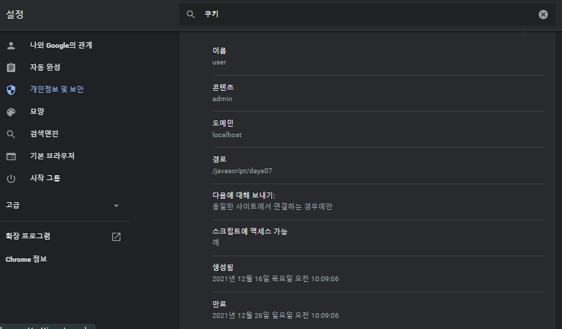

# 12.16

**[모달]**

모달/모달리스 (modal)


CSS

```css
   .modal{
    display:none;   
  
    position: fixed;
    z-index: 1;
    padding-top: 100px;
    left:0;
    top:0;
       width:100%;   
       height:100%;
    overflow: auto;
    background-color: rgb(0,0,0);
    background-color:rgba(0,0,0,0.4);
  }
  
  .modal-content{
    position: relative;
    background-color: #fefefe;
    margin: auto;
    padding:0;
    border:1px solid #888;
    width: 80%;
    box-shadow: 0 4px 9px 0  rgba(0,0,0,0.2), 0 6px 20px 0 rgba(0,0,0,0.19);
    
    animation-name:animatetop;
    animation-duration: 0.4s;
    
    -webkit-animation-name:animatetop;
    -webkit-animation-duration: 0.4s;
  }
  
   
  /* 애니메이션 효과 */
  @keyframes animatetop{
     from{ top:-300px; opacity: 0; }
     to{ top:0; opacity: 1; }
  }
  @-webkit-keyframes animatetop{
     from{ top:-300px; opacity: 0; }
     to{ top:0; opacity: 1; }
  }
  
  .modal-header, .modal-footer{
    background-color: #5CB85C;
    padding: 2px 16px;
    color:white;
  }
  
  .modal-body{
    padding: 2px 16px;
  }
  
 .close{
    color:white;
    float:right;
    font-size: 28px;
    font-weight: bold;
  }
  
  .close:hover, .close:focus{
    color:#000;
    text-decoration: none;
    cursor: pointer;
  }
```

HTML

```html
<button id="myBtn">Open Modal</button>

<div id="myModal" class="modal">
    <div class="modal-content">
        <div class="modal-header">
            <span class="close">&times;</span>
            <h2>Modal Header</h2>
        </div>
        <div class="modal-body">
            <p>Lorem ipsum dolor sit.</p>
            <p>Eum libero ipsum aspernatur.</p>
        </div>
        <div class="modal-footer">
            <h3>Modal Footer</h3>
        </div>
    </div>
</div>

<script>
    var modal = document.getElementById("myModal");

    document.getElementById("myBtn").onclick = function() {
        modal.style.display = "block";
    }

    document.querySelector(".modal-header span.close").onclick = function() {
        modal.style.display = "none";
    }
    
    // 이벤트 버블링
    window.onclick = function(event) {
        if (event.target == modal) {
            modal.style.display = "none";
        }
    }
</script>
```


jQuery

```javascript
$("#myBtn").click(function() {
    $("#myModal").css("display", "block");
});
$(".modal-header span.close").click(function(event) {
    $("#myModal").css("display", "none");
});
$(window).click(function() {
    if ($(event.target).is("#myModal")) {
        $("#myModal").css("display", "none");
    }
});
```

**[쿠키]**

1. 클라이언트 (PC방 []) -> 요청 -> 웹서버 <- 응답 <-
2. 상태관리
   - 서버: DB 서버, 세션 (session)
   - 클라이언트: 컴퓨터 (텍스트 파일 == 쿠키) 또는 브라우저 (저장소 존재)
3. js 쿠키 (클라이언트 (텍스트파일))
   - document.cookie 속성: 쓰기/읽기
   - 형식: `쿠키명=쿠키값; [만료시점="날짜형";]` 
   - `age=20; [expires="날짜형"]` 
   - 만료시점이 없으면 브라우저를 닫을 때 쿠키값 제거(삭제)
   - new Date() 설정 + 10일. toGMTString()
   - 경로=
   - path= /
   - 쿠키 -> 서버요청 naver.com 요청
   - 도메인
   - domain=localhost
   - 보안
   - secure
   - jsp 쿠키 (서버처리 -> 클라이언트 (텍스트파일))



... - 설정 - 쿠키 검색 - 쿠키 및 기타 사이트 데이터 - 모든 쿠키 및 사이트 데이터 - local 검색 - 

```html
쿠키이름:
<input type="text" id="cookiename" autofocus/>
<br /> 쿠키값:
<input type="text" id="cookievalue" />
<br />
<button onclick="getAllCookies();">모든 쿠키 정보 확인</button>
<button onclick="setCookie();">쿠키 생성</button>
<button onclick="getCookie();">쿠키 확인</button>
<button onclick="delCookie();">쿠키 삭제</button>
<p id="demo"></p>
```


**쿠키생성**

```javascript
function setCookie() {
    var cname = $("#cookiename").val();
    var cvalue = escape($("#cookievalue").val());

    // js escape()
    // 홍길동 -> %uD64D%uAE38%uB3D9 -> 홍길동
    // 		escape( 				unescape()
    // 			$("#demo").html(escape(cvalue));
    var now = new Date();
    var day = now.getDate() + 10;
    now.setDate(day);

    document.cookie = cname + "=" + cvalue + "; expires=" + now.toUTCString();
    $("#cookiename").val("");
    $("#cookievalue").val("");
}
```

**쿠키확인**

```javascript
function getAllCookies() {
    var cookies = document.cookie;

    if (cookies) {
        $("#demo").html(cookies);
    } else {
        $("#demo").html("쿠키는 존재하지 않습니다.");
    }
}
```

**쿠키 가져오기**

오류

```javascript
function getCookie() {
    var cname = $("#cookiename").val();
    // "user=admin; age=10"
    var cookies = document.cookie;
    var cookieArray = cookies.split(/;\s/);
    cookieArray.forEach(function(elt, i, array) {
        var cnv = elt.split("=");
        var cn = cnv[0];
        var cv = cnv[1];

        if (cname == cn) {
            $("#demo").html(unescape(cv));
            return;
        }
    });
    $("#demo").html("> 찾는 쿠키값은 존재하지 않습니다.");
}
```

**쿠키삭제**

```javascript
function delCookie() {
    // 삭제할 쿠키의 만료시점을 과거로 값을 설정해서 쿠키 저장.
    var cname = $("#cookiename").val();
    var now = new Date();
    now.setDate(now.getDate() - 1);

    document.cookie = cname + "=; expires=" + now.toUTCString();
}
```


**cookie.js**

```javascript
function getAllCookies() {
	var cookies = document.cookie;
	return cookies;
}

function setCookie(cname, cvalue, exdays) {
	var now = new Date();
	now.setDate(now.getDate() + exdays);
	document.cookie = cname + "=" + cvalue + "; expires=" + now.toUTCString();
}

function getCookie(cname) {

	var cookies = document.cookie;
	var cookieArray = cookies.split(/;\s/);
	for (var i = 0; i < cookieArray.length; i++) {
		var nv = cookieArray[i].split("=");
		if (nv[0] == cname) {
			return unescape(nv[1]);
		}
	}
	return null;
}

function delCookie(cname) {
	if (getCookie(cname)) {
		var now = new Date();
		now.setDate(now.getDate() - 1);
		document.cookie = cname + "=; expires=" + now.toUTCString();
	}
}
```


**ex02_02**

```javascript
function btn_getAllCookies() {
    $("#demo").html(getAllCookies());
}

function btn_setCookie() {
    cname = $("#cookiename").val();
    cvalue = $("#cookievalue").val();
    exdays = 10;
    setCookie(cname, cvalue, exdays);
}

// 쿠키이름을 입력 후 "쿠키확인" 버튼을 클릭 -> 쿠키값
function btn_getCookie() {
    cname = $("#cookiename").val();
    var cvalue = getCookie(cname);
    $("#demo").html(cvalue);
}

function btn_delCookie() {
    cname = $("#cookiename").val();
    delCookie(cname);
}
```

**[선택 시 쿠키저장 및 배경설정]**

HTML

```html
<table border="1"
       style="background-color: white; width: 400px; margin: 0 auto">
    <tr>
        <td></td>
        <td></td>
        <td></td>
    </tr>
    <tr>
        <td><input type="radio" checked="checked" name="bgImages"
                   id="item01" value="item01" />item01</td>
        <td><input type="radio" name="bgImages" id="item02"
                   value="item02" />item02</td>
        <td><input type="radio" name="bgImages" id="item03"
                   value="item03" />item03</td>
    </tr>
</table>
```

javaScript

```javascript
var cname = "bgimg"; // 쿠키이름
var cvalue; // 쿠키값
var exdays = 10; // 만료시점 - 10일 후

window.onload = function() {
    // bgimg 쿠키이름으로 쿠키가 존재 ? 쿠키값 읽어와서
    // 쿠키값을 배경으로 배경이미지를 설정..
    // 기본으로 item01.gif 배경이미지로 설정..
    cvalue = getCookie(cname);

    if (cvalue) {
        document.body.style.backgroundImage = "url(../images/" + cvalue + ".gif)";
        document.getElementById(cvalue).checked = "checked";
    } else {
        document.body.style.backgroundImage = "url(../images/item01.gif)";
    }
    // 라디오 버튼을 클릭하면 
    /* 1. 배경이미지 설정
			   2. 쿠키 저장
			 */
    var rdbs = document.getElementsByName("bgImages");
    rdbs.forEach(function(elt, i, array) {
        elt.onclick = function() {
            document.body.style.backgroundImage = "url(../images/" + elt.value + ".gif)";
            setCookie(cname, elt.value, exdays);
        }
    });
}
```


**window.onload 같은코드**

```javascript
/*
		$(document).ready(function () {
		});
		*/

$(function() {

});
```


jQuery

```javascript
var cname = "bgimg"; // 쿠키이름
var cvalue = "item01"; // 쿠키값
var exdays = 10; // 만료시점 - 10일 후

$(function() {
    cvalue = getCookie(cname);

    if (cvalue) $("#" + cvalue).prop("checked", true);
    $("body").css("background-image", "../images/" + cvalue + ".gif");

    $(":radio").click(function(event) {
        $("body").css("background-image", "../images/" + $(this).val() + ".gif");
        setCookie(cname, $(this).val(), exdays);
    });
});
```


**[jQuery]**

jQuery 는 빠르고 작고 기능이 풍부한 JavaScript 라이브러리

여러 브라우저에서 작동하는 사용하기 쉬운 API 를 사용

1. HTML 문서탐색 및 조작
2. 이벤트 처리
3. 애니메이션
4. Ajax 

와 같은 작업을 훨신 더 간단하게 만듭니다.

jQuery 사용하는 방법

- jQuery 다운로드
  1. 압축 - 대역폭을 절약하고 프로덕션 성능을 향상
  2. 비압축 - 개발 또는 디버깅 중에 가장 잘 사용
- CDN 호스팅 사용하는 방법: 구글 등

CDN: 컨텐츠 전송 네트워크


[Download the compressed, production jQuery 3.6.0](https://code.jquery.com/jquery-3.6.0.min.js) - 우클릭 - 다른이름으로 저장

https://code.jquery.com/jquery-3.6.0.min.js 

min 이 들어가있으면 압축


```
Uncaught ReferenceError: $ is not defined
```

jQuery 라이브러리를 참조해야 한다.


**비압축 다운로드**

```html
<script src="jquery-3.6.0.js"></script>
```


**구글 CDN**

```html
<script src="https://ajax.googleapis.com/ajax/libs/jquery/3.6.0/jquery.min.js"></script>
```

(3) jQuery 구문형식

```javascript
$(jquery 선택자selector).action();

$("#btn").click(function(event) {});
$("#btn").css("속성명", "속성값");
```


(4) jquery selector

action()


(5) 문서가 준비완료~~~~~> 요소


```javascript
$(document).ready(function() {
    $("요소")
    $("button").click(function() {
        alert("text");
    });
});
```

HTML 코드 (버튼 등) 가 script 태그 아래에 있다면 ready 함수안에 클릭 이벤트 등을 넣어야 한다.


```javascript
window.$ // 같은코드
window.jQuery("#btn1")
```


`"use strict";` 구문 엄격하게 사용하겠다.

jQuery - Effects 탭 - basics (세번정도 클릭하면 들어가진다.)

**[jquery Effects]**

1. basics - hide, show, toggle
2. custom
3. fading
4. sliding

Event 에 click 이 있다.


## **jQuery 함수**

- `show([duration], [complete])` 애니메이션 시간 (디폴트400). 
- `show([complete])` 완전히 처리된 후 함수.
- `toggle([speed], [callback])` 시간과 함수.


**[fade]**

카테고리: fading

- `fadeIn`
- `fadeOut`
- `fadeTo`
- `fadeToggle` 


오후: jQuery selector

**[클릭 시 fadeIn]**

```css
span {
	color: red;
	cursor: pointer;
}

div {
	margin: 3px;
	width: 80px;
	display: none;
	height: 80px;
	float: left;
}

#one {
	background: #f00;
}

#two {
	background: #0f0;
}

#three {
	background: #00f;
}
```

HTML

```html
<span>Click here...</span>
<div id="one"></div>
<div id="two"></div>
<div id="three"></div>

<script>
    $(document.body).click(function() {
        $("div:hidden").first().fadeIn("slow");
    });
</script>
```


**[선택자]**

1. `*` 모든요소
2. `#` 아이디
3. `.` 클래스명
4. 클래스명
5. 태그명
6. `:first` `:last`
7. `:even` `:odd` 
8. `:first-child` `:last-child` 
9. `:first-of-type` `:last-of-type` 
10. `:nth-child(n)` `:nth-of-type(n)` 
11. `:only-child` `:only-of-type` 혼자 자식일 경우 적용
12. `parent > child` 직계자식
    - `parent child` 자식
    - `parent + child` 직계 뒤 형제
    - `parent ~ child` 뒤 형제
13. `eq(index)` `gt(index)` `lt(index)` 인덱스이므로 0번부터 시작한다. gt 와 lt 는 index 를 포함하지 않는다.
14. `:not` 
15. `:header` 
16. `:animated` 
17. `:focus`
18. `:has(선택자)`
19. `:contains(문자열)` 
20. `:empty` `:parent` 
21. `:hidden` `:visible` 
22. `[속성명]` ex) `$("[type]")` 
23. `$("input[type=text]")` `$(":input")` 모든 input 요소를 선택자로 사용
24. `$(":text")` 
25. `$(":password")` 
26. `$(":radio")` 
27. `$(":checkbox:checked")`
28. `$(":submit")`
29. `$(":reset")`
30. `$(":button")` 
31. `$(":image")`  `$(":file")` 
32. `disabled` `enabled` 
33. `selected`
34. `checked` 


```javascript
$("p:first-child").css("background-color", "yellow");
$("p:last-child").css("background-color", "red");
```

> 스크립트 태그도 하나의 요소이므로 last-child 가 적용되지 않을 수 있다.


first VS first-child

- `first` 첫번째 태그
- `first-child` 누군가의 자식인 첫번째 태그


- `nth-child(n)`
- `nth-of-type(n)`
- `nth-last-child(n)`
- `nth-last-of-type(n)`

```javascript
$("p:only-child").css("background-color", "yellow");
$("p:only-of-type").css("background-color", "yellow");
```


copy selector ? 


```javascript
$("h1,h2,h3,h4,h5,h6").css("background-color", "yellow");
$(":header").css("background-color", "red"); // 같은코드
```

`:header` h 태그를 나타낸다.


**div 태그에 red/green/blue 배경색 넣기**

```javascript
$("div:nth-of-type(1)").css("background", "red");
$("div:nth-of-type(2)").css("background", "green");
$("div:nth-of-type(3)").css("background", "blue");
```

> eq 가 더 간단한 코드이다.

```javascript
$("div:eq(0)").css("background", "red");
$("div:eq(1)").css("background", "green");
$("div:eq(2)").css("background", "blue");
```


**늘었다 줄었다**

```javascript
function aniDiv() {
    $("div:eq(0)")
        .animate({width: "50%"}, "slow")
        .animate({width: "100%"}, "slow", aniDiv);
}
aniDiv();
```


**텍스트박스 커서**

```javascript
$(":text:eq(2)").focus();
```


**has**

```javascript
$("p:has(span, .box)").css("background", "yellow");
$("p").has("span").css("background", "red");
```

span 태그를 가지거나 box 클래스를 가질 때

`:has` 에는 쌍따옴표가 없으며 `.has` 에는 쌍따옴표가 있다.


```javascript
$("p:contains(is)").css("background", "yellow");
```

- 대소문자를 구분한다.
- 모든 자식에서 찾는다.

**empty**

```javascript
$(":empty").css("background",  "yellow");
```


```javascript
$("td:parent").css("color", "red");
```

텍스트 즉 문자열을 포함한 자식이 있는 모든 td 요소를 선택자.


```javascript
$("p:hidden").show(5000, function() {
    // 보이는 모든 p 태그
    $("p:visible").css("background", "yellow");
});
```


**속성 선택자**

```javascript
$("[type]").css("background", "yellow");
```

- `=` 속성을 가지고만 있으면 적용
- `^=` 시작하면 적용
- `$=` 끝나면 적용
- `*=` 포함하면 적용 (더 포괄적인 개념)
- `~=` 특정 단어 포함하면 적용
- `|=` 잘 안쓰인다.


**disabled & enabled**

```javascript
$("input:disabled").css("background", "yellow");
$("input:enabled").css("background", "red");
```


내일: 34선택자.action()

# 12.17

```javascript
console.log($.fn.jquery); // 3.6.0
```


**[jquery-3.6.0.js]**

```javascript
var version = "3.6.0",
    jQuery = function( selector, context ) {
        return new jQuery.fn.init( selector, context );
    };
```


```javascript
jQuery.fn = jQuery.prototype = {
    jquery: version,
    constructor: jQuery,
    length: 0,
    toArray: function() {
        return slice.call( this );
    },
```

`Person.prototype` 객체 생성자에 맴버를 추가할 때

```javascript
var b = $("body"); // jquery object
alert(b.jquery) // 3.6.0
```

jQuery 객체는 jquery 함수를 가지고 있고 버전을 반환한다.

자바스크립트 객체에는 jquery 함수가 없다.

```javascript
$(function() {
	$("div.foo").click(function(event) {
		// 모든 span 태그가 아니라
		$("span", this).addClass("bar");
	});
});
```

`$(selector, context)` 

Q. context 가 뭐지 ? 

A. 


```javascript
$("a").click(function(event) {
    event.preventDefault(); // 링크기능을 막는다.
    $(this).hide();
});
```


```javascript
$("#hider").click(function(event) {
    $("span:last-child").hide("fast", function() {
        $(this).prev().hide("fast", arguments.callee);
        // callback
    });
});
```

arguments.callee: 자기자신함수를 등록


```javascript
$("button").click(function(event) {
    $("p").remove(); // p 태그 자체를 지운다.
    $("p").empty(); // 내용만 비운다.
});
```

## 함수

- `remove([selector])` 
- `toggle([speed])` 


**remove**

```javascript
$("p.hello").remove();
$("p").remove(":contains('hello')");
$("p").filter(":contains('hello')").remove();
```


```javascript
$("div").append("<p>" + i + "</p>");
$("<p>" + i + "</p>").prependTo($("body"));
```

- append
- appendTo
- prependTo
- prepend

**jQuery vs javaScript**

- `html` innerHTML
- `text` innerText
- `val` value

**[wrap/unwrap]**

```javascript
var pTags = $("p");
$("button").click(function(event) {
    pTags.wrap("<div></div>");
});
```


```javascript
var pTags = $("p");
$("button").click(function(event) {
    // p 태그가 div 태그로 감싸져있냐 ? 
    if (pTags.parent().is("div")) {
        pTags.unwrap();
    } else {
        pTags.wrap("<div></div>");
    }
});
```


```javascript
$("p").css({
    width: "200px"
    , height: "100px"
    , border: "1px solid gray"
    , backgroundColor: "yellow"
});
```


**[on]**

```javascript
$("button").on("click", function() {
    alert("test");
});
```

+++++++ on() jquery ajax 이벤트 등록

click 말고 on 을 써야될 때가 있다.

- `one()` 이벤트가 한번만 발동한다.
- `on()`
- `off()` 

**토글**

```javascript
$("button").on("click", function() {
    $("p").toggle("slow");
});
```

**토글버튼이름 바꾸기**

```javascript
$("button").on("click", function() {
    var text = $(this).text();

    $("p").toggle("slow", function() {
        $("button").html(text == "hide" ? "show" : "hide");
    });
});
```


```javascript
$("div").each(function(i, element) {
    console.log(i + "" + element.id);
});
```

Q. 인자가 두개면 위치가 바뀌나 ? 

A.

`$("div").each` 와 `$.each` 는 다른 함수이다.


```javascript
$("div")
    .click(
    function(event) {
        var styleProps = $(this).css(
            [ "color", "width", "height",
             "background-color" ]);
        var output = [ "결과: " ];

        $.each(styleProps, function(index, value) {
            // 								console.log(index + " / " + value);
            output.push(index + " / " + value);
        });
        $("#result").html(output.join("<br>"));
    });
```


```javascript
$("ul > li").each(function(i, element) {
    console.log(element.innerHTML);
    console.log(element.html()); // 에러
    console.log($(this).html()); // 같은코드
});
```

`element` 는 자바스크립트 객체이므로 innerHTML 을 사용해야 한다.


jQuery UI - Widgets - dialog

**마지막요소 선택**

```java
$("p:last").addClass("selected");
$("p").last().addClass("selected");
```

`p:last` 가 제일 좋은 코딩이다.


```javascript
$("div").addClass(function(index, currentClassName) {
    console.log(index + " / " + currentClassName);
    var className;

    if (currentClassName == "red") {
        className = "green";
    }
    return className;
});
```

> index 와 currentClassName 위치가 바뀌면 안된다.

**첫번째 제출버튼 막기**

```javascript
$(":submit:first").click(function(event) {
    event.preventDefault();
});
```

> `preventDefault()` 괄호가 빠지면 안된다.

입력값에 대한 유효성검사하고 막을 수 있다.

```html
<form>
    name = <input name="name"><br> <input type="submit" />

</form>
<form action="">
    test : <input type="text" /><br> test : <input type="text" /><br>
</form>

<form action="">
    msg : <input type="text" /><br> msg : <input type="text" /><br>
</form>
<button>제출</button>
```

form 태그에 action 이 없으면 자기자신 페이지 URL 이 호출된다.


```javascript
$("button").on("click", function(event) {
    var form1 = $("form")[0];
    form1.reset(); // reset 버튼 클릭한 것처럼
});
```


jQuery UI - Widgets - Accordion

어코디언 악기같은 UI


**slideToggle()**

```javascript
$(".flip").on("click", function(event) {
    $(this).next().slideToggle();
});
```

slideToggle 로 아코디언 UI 를 만들 수 있다.


```javascript
$(".flip").on("click", function(event) {
    $(".panel").slideUp();
    $(this).next().slideToggle();
});
```

열었던 것을 다시 클릭하면 닫혔다 열린다.

카테고리: Attributes - Manipulation - Class Attribute - CSS


```javascript
if ($(this).next().hasClass("panel_open")) {
    $(".panel.panel_open").slideUp().removeClass("panel_open");
} else {
    $(".panel.panel_open").slideUp().removeClass("panel_open");
    $(this).next().slideDown().addClass("panel_open");
}
```

클래스명을 주고 if 문을 안써도 될 것 같다.


**[애니메이션]**

- `animate([property], duration, complete)` 


```javascript
$("button").click(function(event) {
    // 			$("div").animate({left: '250px'});

    $("div").animate({
        left: '250px'
        , opacity: '0.5'
        , height: '150px'
        , width: '150px'
    });
});
```


**라디오로 좌우이동**

```javascript
$("button").click(function(event) {
    var dir = $(":radio[name=direction]:checked").val();

    $("div").animate({
        left: dir + '=150px'
    });
});
```

속성값은 문자열이다.

**애니메이션 대기열**

```javascript
div.animate();
div.animate();
div.animate();
div.animate();
```

animate 를 여러개 호출하면 대기열에 들어간다.


```javascript
$("button").click(function(event) {
    $("div")
        .animate({height:'300px', opacity:'0.4'}, "slow")  // 1
        .animate({width:'300px', opacity:'0.8'}, "slow")
        .animate({height:'100px', opacity:'0.4'}, "slow")
        .animate({width:'100px', opacity:'0.8'}, "slow")   // 4
        .animate({"font-size":'3em' });
});
```


이미지대체 src: https://placeholder.com/

```html

```


```
jquery.min.js:2 Uncaught TypeError: S.easing[this.easing] is not a function
```


**stop**

- `stop()` 애니메이션 효과가 완료되기전에 중지하는데 사용하는 메서드
- `stopAll` 대기열에 기본값 (false). true 주면 모두 중지
- `goToEnd` 


CSS

```css
#panel, #flip {
	padding: 5px;
	font-size: 18px;
	text-align: center;
	background-color: #555;
	color: white;
	border: solid 1px #666;
	border-radius: 3px;
}

#panel {
	padding: 50px;
	display: none;
}
```

HTML

```html
<button id="stop">Stop sliding</button>
<div id="flip">Click to slide down panel</div>
<div id="panel">Hello world!</div>
```

javaScript

```javascript
$("#flip").click(function(event) {
    $("#panel").slideDown(5000);
});

$("#stop").click(function(event) {
    $("#panel").stop();
});
```


