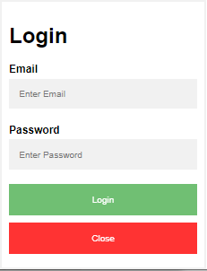

# 12.2

**복습**


**젠코딩** 

네비게이션

```
.nav>a[href=#]*4
```


**CSS**

```css
  body {
    padding: 0;
    margin: 0;
}

.active {
	background-color: green;
}

.nav {
	background-color: black;
	overflow: auto;
}

.nav a {
	color: white;
	float: left;
	width: 10%;
	text-align: center;
	text-decoration: none;
	padding: 1em 0.5em;
}

.nav a:hover {
	background-color: gray;
	color: black;
}

h3, p {
	text-indent: 1em;
}
```

HTML

```html
<div class="nav">
    <a href="#" class="active">Home</a> 
    <a href="#">News</a> 
    <a href="#">Contact</a>
    <a href="#">About</a> 
</div>

<script>
    $(".nav a").click(function(event) {
        $(".nav a").removeClass("active");
        $(this).addClass("active");
    });
</script>


<h3>Top Navigation Example</h3>
<p>Lorem ipsum dolor sit amet.</p>
```

> htef 에 # 이 들어가야 동작한다.
>
> float 에 관계없이 동작한다.

```html
<script src="https://ajax.googleapis.com/ajax/libs/jquery/3.5.1/jquery.min.js"></script>
```

> Jquery 코드를 추가해야 한다.

Q. px 와 em 차이점 ? 

A. 


```html
<script>
    var links = document.querySelectorAll(".topnav a");

    for (var i = 0; i < links.length; i++) {
        links[i].classList.add("active"); 
    }
</script>
```


document

- `getElementById` 
- `querySelectorAll` 리스트 반환.

```html
<script>
    var h2elem = document.getElementById("the");
    h2elem.onclick = p_click;
</script>
```

함수를 등록할 때는 함수의 괄호가 없다.


익명함수

```html
<script>
    var h2elem = document.getElementById("the");
    h2elem.onclick = function() {
        alert("xxx")
    };
</script>
```


**모든 a 태그에 이벤트 등록**

```html
<script>
    var links = document.querySelectorAll(".topnav a");

    for (var i = 0; i < links.length; i++) {
        links[i].onclick = function() {
            for (var i = 0; i < links.length; i++) {
                links[i].classList.remove("active");
            }
            this.classList.add("active");
        }
    }
</script>
```


> 자바스크립트는 i 를 두번 선언할 수 있다.

**[jQuery]**

https://jquery.com/

배포할 때 압축.

download - Google CDN

Google CDN: https://developers.google.com/speed/libraries#jquery

```html
<script src="https://ajax.googleapis.com/ajax/libs/jquery/3.6.0/jquery.min.js"></script>
```

jQuery 는 `$` 을 사용

**jQuery 함수**

- `click(function(event)) {}` 
- `removeClass` 
- `addClass` 

**jQuery 를 import 하지 않은경우**

```
Uncaught ReferenceError: $ is not defined
```


이모티콘 CDN

```html
<link rel="stylesheet" href="https://cdnjs.cloudflare.com/ajax/libs/font-awesome/4.7.0/css/font-awesome.min.css">
```

**겹침현상**

`display: block;` float 대신 사용할 수 있다.

---

**[페이징 처리]**

`&raquo;` >>

**가운데정렬**

- margin 의 가로를 auto
- text-align: center

active 클래스를 가진 a 태그를 제외한 a 태그에 마우스를 올릴 때

```css
.pagination a:hover:not(.active)
```


CSS

```css
* {
	box-sizing: border-box;
}

.pagination {
	/* border: 1px solid red; */
	overflow: auto;
	width: 50%;
	margin: 0 auto;
}

.pagination a {
	color: black;
	text-decoration: none;
	
	float: left;
	width: 8.3%;
	text-align: center;
}

.pagination a:hover:not(.active) {
	background-color: #ddd;
}

.pagination a.active {
	background-color: dodgerblue;
	color: white;
}
```

```html
<h3>페이징 처리</h3>
<div class="pagination">
    <a href="#">1</a> 
    <a href="#">2</a> 
    <a href="#">3</a> 
    <a href="#">4</a>
    <a href="#">5</a> 
    <a href="#">6</a> 
    <a href="#" class="active">7</a> 
    <a
       href="#">8</a> 
    <a href="#">9</a> 
    <a href="#">10</a> 
    <a href="#">&gt;</a>
    <a href="#">&raquo;</a>
</div>
```

**목록**

CSS

- `list-style-type` ul 태그에도 스타일을 주면 ol 태그가 될 수 있다.

**마커의 위치**


`list-style-position: inside;` 마커가 li 태그 안으로 들어간다.

**기본설정제거**

```css
ul, ol {
	list-style-type: none;
	padding: 0;
}
```

padding: 0 으로 마커영역을 제거할 수 있다. 마커가 보이지 않지만 사라진 것은 아니다.


```css
list-style-image: url('../images/arr.gif');
```

**축약형**

```css
list-style: square inside url'../images/arr.gif');
```


**CSS 마지막 자식**

```css
ul li:last-child {
	border-bottom: none;
}
```

**[테이블]**


```css
tr:hover:not(:first-child) {
	background-color: #4caf50;
}
```

**반응형 테이블**

화면이 너무 작아 전체 컨텐츠를 표시할 수 없는 경우

반응형 테이블에 가로 스크롤 막대가 표시된다.

```css
overflow-x: auto;
```

스크롤바가 div 태그로 간다.

**[레이아웃]**

`display` 속성. inline-block width 를 줄 수 있다.

**롤 오버 효과**

```css
a:hover, a:active {
	background-color: green;
	color: white;
}
```


레이아웃을 제어하기 위한 가장 중요한 CSS 속성 : display 속성

inline 모드: 새 줄에서 시작하지 않고 필요한 너비만큼만 차지


```css
#imgbox1 {
	display: none;
}
#imgbox2 {
	visibility: hidden;
}
```

display 와 visibility 의 차이점

hidden 은 영역차지를 하므로 레이아웃 (배치) 영향을 준다.

none <-> block

hidden <-> visible

**display:none 함수**

```html
<script>
    function remove() {
 document.getElementById("imgbox1").style.display="none";
    }
</script>
```


```html
<script>
    $("#imgbox2 button").click(function(event) {
        document.getElementById("imgbox2").style.visibility="hidden"; 
    });
</script>
```

> 자바스크립트는 onclick 에 등호 괄호, jQuery 는 click 괄호이다.

```html
<script>
    document.querySelector("#imgbox3 button").onclick = function() {
        document.getElementById("imgbox1").style.display="block";
        document.getElementById("imgbox2").style.visibility="visible";
    }
</script>
```

> getElementById 에는 # 이 없다.

**jQuery 로 수정**

문법

```javascript
$(jQuery선택자)
```

jQuery선택자는 CSS 선택자를 포함하며 더 많다.


```html
<script>
    $("#imgbox1 button").click(function() {
        $("#imgbox1").css("display","none"); 
        $("#imgbox1").hide(); // 같은 코드
    });
</script>
```


```javascript
$("#imgbox2 button")
$("#imgbox2 > button") // 비슷한 코드
$("button","#imgbox2") // 같은 코드
```


```javascript
$("button","#imgbox3").click(function() {
    $("#imgbox1").show();
    $("#imgbox2").css("visibility","visible"); 
});
```

show 는 `css("display", "block")` 과 같은 코드이다.

**Click to show panel**

```html
<script>
    document.querySelector(".flip").onclick = (function() {
        document.getElementById("panel").style.display="block";
    });
</script>
```

> document 는 없으면 안된다.

쿼리셀렉터.onclick = function

```html
<script>
    $(".flip").click(function() {
        $("#panel").show();
    });
</script>
```


```html
<script>
    document.querySelector(".flip").onclick = (function() {
        var displayValue = document.getElementById("panel").style.display;

        if (displayValue == "none" || displayValue == "") {
            document.getElementById("panel").style.display = "block";
        } else {
            document.getElementById("panel").style.display = "none";
        }
    });
</script>
```


삼항연산자와 스위치변수도 가능하다.

```html
<script>
    var sw = true;

    document.querySelector(".flip").onclick = (function() {
        document.getElementById("panel").style.display = sw ? "block":"none";
        sw = !sw;
    });
</script>
```


API Documentation - Basics 카테고리에 hide, show, toggle 이 있다.

검색이 가능하고 가장 아래부분에는 예제도 있다.

```html
<script>
    $(".flip").click(function() {
        $("#panel").toggle();
    });
</script>
```

`slideToggle()` 

**레이아웃: position**

1. static: 기본값(정적배치) - top/bottom/left/right 속성 X
2. relative: 상대좌표. 다른 요소들의 간격이 조정되지 않는다.
3. fixed +++: 다른 레이아웃에 영향을 준다.
4. absolute: 절대좌표. 가장 가까운 위치에 있는 조상을 기준으로 배치
5. sticky: 사용자의 스크롤 위치에 따라 배치


```css
border-color: red;
```

border 축약형을 쓰려면 solid 도 작성해야 한다.

```css
nth-child(1)
first-child /* 같은코드 */
```


right: 20px 와 left: -20px 는 같지만 쓰는 용도가 다르다.

4:45~4:48

복습: 네이버 검색창


```html
<!DOCTYPE html>
<html>
<head>
<meta charset="UTF-8">
<meta name="viewport" content="width=device-width, initial-scale=1.0">
<script
	src="https://ajax.googleapis.com/ajax/libs/jquery/3.6.0/jquery.min.js"></script>
<style>
.logo_default {
	display: inline-block;
	position: relative;
	height: 52px;
	background-position: 0 -158px;
}

.logo_naver:before {
	display: inline-block;
	width: 222px;
	height: 52px;
	background-position: 0 -158px;
	background-repeat: no-repeat;
	vertical-align: top;
	content: '';
	background-image:
		url("https://s.pstatic.net/static/www/img/uit/2021/sp_main_57f073.png");
	background-size: 444px 439px;
}

.green_window {
	display: inline-block;
	position: relative;
	width: 582px;
	height: 52px;
	border: 2px solid #19ce60;
	-webkit-border-radius: 2px;
	border-radius: 2px;
	margin-left: 20px;
}

#query {
	width: 444px;
	height: 24px;
	padding: 13px 15px;
	margin: 1px;
	background-color: #fff;
	font-size: 18px;
	line-height: 24px;
	color: #000;
	font-weight: 700;
	outline: 0;
	border: 0;
}

#search_btn {
	position: absolute;
	top: 0;
	right: 0;
	bottom: 0;
	width: 56px;
	background-color: #19ce60;
	-webkit-border-radius: 0 2px 2px 0;
	border-radius: 0 2px 2px 0;
	cursor: pointer;
	border: 0;
}

.ico_search_submit {
	display: inline-block;
	width: 22px;
	height: 22px;
	background-position: -420px -208px;
	background-repeat: no-repeat;
	vertical-align: top;
	background-image:
		url("https://s.pstatic.net/static/www/img/uit/2021/sp_main_57f073.png");
	background-size: 444px 439px;
}
</style>
</head>
<body>
	<h1 class="logo_default">
		<a href="" class="logo_naver"></a>
	</h1>

	<div class="green_window">
		<input type="text" id="query" />
		<button id="search_btn">
			<span class="ico_search_submit"></span>
		</button>
	</div>
</body>
</html>
```

# 12.3

**복습**

8-1. document.createElement()
   document.appendChild()
   를 사용해서 (js를 사용) `<button>` 요소를 10개 동적으로 생성하고
   버튼을 클릭하면 숨기도록 코딩하세요..

```html
<button id="hide">숨김</button>

<script>
	for (var i = 0; i < 10; i++) {
		var jbBtn = document.createElement('button');
		var jbBtnText = document.createTextNode('Click');
		jbBtn.appendChild(jbBtnText);
		document.body.appendChild(jbBtn);
		jbBtn.className = "buttons";
	}

	document.querySelector("#hide").onclick = function() {
		for (var i = 0; i < 10; i++) {
			document.getElementsByClassName("buttons")[i].style.display = "none";
		};
	};
</script>
```

> 클래스이름 부여대신에 `querySelectorAll("button")` 으로 가져와도 될 것 같다.
>
> className 을 생성 후 줘도 상관없다.

**쌤코드**

```javascript
for (var i = 1; i <= 10; i++) {
    var btn = document.createElement("button");
    btn.innerHTML = "버튼-" + i;
    document.body.appendChild(btn);
    btn.onclick = function() {
        this.style.visibility="hidden";
    }
}
```

`innerHTML` 글자추가.

9-1. 혹시 8번 문제 해결하신 분은 jquery로 코딩해 보세요...

```html
<button id="hide">숨김</button>

<script>
	for (var i = 0; i < 5; i++) {
		$("body").append("<button class='buttons'>Click</button>");
	};

	$("#hide").click(function() {
		$(".buttons").hide();
	});
</script>
```


**쌤코드**

```javascript
for (var i = 0; i < 10; i++) {
    var btn = $("<button class='buttons'>Click</button>");
    $("body").append(btn);
}

$(".buttons").click(function() {
    $(this).hide();
});
```

> html 코드를 변수에 담을 수 있다.
>
> this 는 `$` 안에 들어가야하며 큰따옴표가 필요없다.

**숏코딩**

```javascript
for (var i = 0; i < 10; i++) {
    $("<button class='buttons'>Click</button>")
        .appendTo($("body"))
        .click(function() {
        $(this).hide();
    });	
}
```

> appendTo 가 this 를 반환하는 것 같다.

[BOM]

window 내장객체 window.alert() -> alert() 최상위객체는 생략할 수 있다.

window.document 내장객체

document.location = "이동 URL";

[DOM]

---

**[sticky]**

`position:sticky` 

- IE 지원하지 않는다.
- Safari: webkit- 접두사를 붙인다.
- left/right/bottom/top 적어도 하나는 지정해야 된다.
  - 예) top: 0 -> 스크롤 위치에 도달하면 페이지 상단에 고정되어진다.

```css
position: sticky;
position: -webkit-sticky;
```

사파리를 위해 두개 다 코딩한다.

```css
div.sticky_test {
	border: 2px solid #4caf50;
	background-color: #cae8ca;
	padding: 3px;
	text-align: center;
	
	position: sticky;
	position: -webkit-sticky;
	top: 0;
}
```

> 배경색이 없다면 글자와 겹치므로 꼭 넣는다.

**전체코드**

```html
<!DOCTYPE html>
<html>
<head>
<meta charset="UTF-8">
<meta name="viewport" content="width=device-width, initial-scale=1.0">
<script
	src="https://ajax.googleapis.com/ajax/libs/jquery/3.6.0/jquery.min.js"></script>
<style>
body {
	margin: 0;
	font-size: 28px;
	font-family: Arial, sans-serif;
}

header {
	background-color: #f1f1f1;
	padding: 30px;
	text-align: center;
}

#navbar {
	background-color: #333;
	position: sticky;
	position: -webkit-sticky;
	top: 0;
	overflow: auto;
}

#navbar a {
	color: #f2f2f2;
	display: block;
	font-size: 17px;
	text-decoration: none;
	padding: 14px 16px;
	text-align: center;
	float: left;
}

#navbar a:hover {
	color: black;
	background-color: #ddd;
}

#navbar a.active {
	background-color: #4caf50;
	color: white;
}
</style>
</head>
<body>

	<header>
		<h3>Top</h3>
		<p>Lorem ipsum dolor sit.</p>
	</header>

	<nav id="navbar">
		<a href="#" class="active">Home</a> <a href="#">News</a> <a href="#">Contact</a>
	</nav>

	<section class="content">
		<h3>Sticky Test</h3>
		<p>Lorem ipsum dolor sit amet, consectetur adipisicing elit. Ad
			sunt sequi cum nihil inventore aperiam quo ullam laudantium
			laboriosam sit quibusdam cupiditate saepe incidunt similique unde
			corporis quidem. Ratione labore.</p>
		<p>Officia voluptatibus necessitatibus tempore officiis eum ab
			placeat praesentium illo a vitae at beatae rerum ipsam doloremque
			reiciendis sunt voluptatem id possimus maxime iure. Temporibus hic
			eveniet sequi dicta facere.</p>
		<p>Quae placeat nesciunt veniam voluptatum aut odio minima!
			Veritatis eum tempora earum consectetur vero ex! Quaerat corporis
			omnis facilis fuga mollitia neque voluptatum quam tempore illo
			maiores dolor impedit atque?</p>
		<p>Reiciendis animi suscipit nihil iusto eaque qui ipsum amet
			possimus cumque laudantium porro soluta magni voluptas eligendi totam
			adipisci ab impedit dolorem dolores numquam ipsam doloremque
			accusantium nam rem quae.</p>
		<p>Voluptatibus temporibus necessitatibus non aspernatur maiores
			assumenda! A ratione reiciendis atque facilis aliquid unde quam sunt
			porro molestias enim quisquam pariatur veniam eum explicabo magnam
			perspiciatis consectetur odit mollitia numquam!</p>
		<p>Totam vero maiores odit tenetur harum aspernatur ducimus enim
			quod facere animi sit amet numquam repellendus obcaecati molestias
			laudantium repudiandae ea laboriosam dolorum error suscipit
			blanditiis voluptates nemo. Illo pariatur.</p>
		<p>Officiis consequuntur eum quia architecto repellendus eligendi
			velit in quidem sequi necessitatibus doloribus nostrum nihil minus
			quae rerum dolores libero magnam. Minima ipsam sit ex nulla ratione
			ab itaque neque?</p>
		<p>Nam mollitia hic nulla optio minima est consequatur quibusdam
			voluptatem soluta nesciunt qui natus obcaecati consectetur
			praesentium ex cumque ea! Quo laudantium alias optio totam nesciunt
			quia eligendi deserunt velit!</p>
		<p>Inventore ut error eos beatae nobis impedit quis excepturi nam
			nesciunt libero perferendis ipsam esse optio hic deserunt est vel
			soluta suscipit ex eaque qui reprehenderit quas aliquid quisquam eum?</p>
		<p>Eos consequatur labore reprehenderit molestias sint earum ullam
			sequi voluptatem id at deleniti officia veniam non accusamus
			dignissimos et nisi magni? Perferendis voluptatibus voluptates
			assumenda natus laboriosam corrupti aliquam architecto!</p>
		<p>Obcaecati mollitia modi officia cum impedit molestiae maiores
			neque natus nam quasi excepturi iusto placeat. Alias impedit id vitae
			repudiandae blanditiis voluptate nam quod accusamus necessitatibus
			perspiciatis asperiores fugiat deleniti.</p>
		<p>Minus velit dolorum aspernatur consequuntur fuga doloribus
			distinctio error quod debitis molestiae non facilis accusantium ad
			porro tenetur veritatis eum perspiciatis recusandae in dolore
			molestias excepturi libero voluptatibus perferendis blanditiis!</p>
		<p>Dolores adipisci consectetur quam aliquid voluptas est.
			Laboriosam eligendi repellendus voluptates voluptatum placeat tenetur
			quia libero fuga? Laudantium voluptatem fugit quae laborum quam
			laboriosam ut aperiam! Impedit modi dolorum autem.</p>
		<p>Nostrum soluta mollitia tenetur aliquid odio perspiciatis ipsa
			laborum ratione rerum neque vel earum sequi. Voluptatem fuga autem in
			libero et a corrupti ipsa ut quod nobis placeat deleniti minima.</p>
		<p>Magni distinctio eligendi iste commodi consequuntur. Modi
			provident id tenetur quo officia beatae veritatis itaque blanditiis a
			consequuntur voluptatum nihil pariatur omnis repellendus quod sint
			reprehenderit. Labore tempore quod eius.</p>
	</section>

	<script>
		$("#navbar a").click(function() {
			$("#navbar a").removeClass("active");
			$(this).addClass("active");
		});
	</script>
</body>
</html>
```


**네비게이션 선택**

```javascript
$("#navbar a").click(function() {
    $("#navbar a").removeClass("active");
    $(this).addClass("active");
});
```


**js 코딩으로 sticky 구현**

```javascript
console.log(navbar.offsetTop); // 258
console.log(window.pageYOffset);
```

- `window.pageYOffset` 가장 위는 0 이다.

오류잡기: ex_01_03

**CSS**

- ` ` 공백. 
- `+` 
- `~`

```css
.sticky + .content {
	padding-top: 60px;
}
```

`.sticky + .content` 요소가 sticky 클래스명을 가지고 있을 때 형제요소 (뒤에요소) 가 content 클래스를 가지는 선택자.


```javascript
var navbar = document.getElementById("navbar");
var nbOtop = navbar.offsetTop;
/* console.log(navbar.offsetTop); */

window.onscroll = function() {
    if (window.pageYOffset >= nbOtop) {

        // navbar 요소고정 + .sticky 클래스속성 추가
        navbar.classList.add("sticky");
    } else {

        // navbar 요소고정 + .sticky 클래스속성 제거
        navbar.classList.remove("sticky");
    }
};
```

작동하지 않는 코드

**[네이버 검색창]**

**가운데정렬**

```css
text-align: center;
margin: 0 auto;
```


CSS

```css
div {
	width: 80%;
	height: 100px;
	border: 1px solid gray;
	text-align: center;
	
	margin: 0 auto;
}

#first {
	border: 1px solid blue;
	width: 50px;
	height: 50px;
	border-radius: 50%;
	
	position: absolute;
	left: -25px;
	top: 25px;
}

#last {
	border: 1px solid red;
	width: 50px;
	height: 50px;
	border-radius: 50%;
	
	position: absolute;
	right: -25px;
	top: 25px;
}
```

> border-radius 는 50% 이면 원이 된다. 
>
> 변의 길이가 50px 이라면 25px 도 가능하다.

HTML

```html
<div></div>
<div style="position: relative;">
    <div id="first">&lt;</div>
    <div id="last">&gt;</div>
</div>
<div></div>
```


awesome 아이콘 필요

```html
<div id="mySidenav" class="sidenav">
    <a href="#" id="home">Home <i class="fa fa-fw fa-home"></i></a> <a
                                                                       href="#" id="services">Service<i class="fa fa-fw fa-wrench"></i></a> <a
                                                                                                                                               href="#" id="clients">Clients<i class="fa fa-fw fa-user"></i></a> <a
			href="#" id="contact">Contact<i class="fa fa-fw fa-envelope"></i></a>
</div>
<div id="content">
    <h2>Lorem ipsum dolor sit amet.</h2>
    <p>Lorem ipsum dolor sit amet, consectetur adipisicing elit.
        Magnam beatae!</p>
</div>
```

Q. border-radius ?

A. 

CSS 속성

- `transition` 상태전환(변환)

```css
transition: 0.5s ease;
```

- `ease` 등속. 이지효과라고 한다.

자바스크립트나 jQuery 로도 작성할 수 있다.


**CSS**

```css
#mySidenav a {
	background-color: #111;
	color: white;
	padding: 13px;
	text-decoration: none;
	font-size: 20px;
	border-radius: 0 5px 5px 0;
	/* 가장 가까운 부모(body 기준) */
	position: absolute;
	width: 100px;
	left: -88px;
	text-align: right;
	transition: 0.5s ease;
}

#mySidenav a:hover {
	left: 0;
}

#home {
	top: 20px;
}

#services {
	top: 80px;
}

#clients {
	top: 140px;
}

#contact {
	top: 200px;
}

#content {
	margin-left: 100px;
}
```

**HTML** 

```html
<div id="mySidenav" class="sidenav">
    <a href="#" id="home">Home <i class="fa fa-fw fa-home"></i></a> <a
                                                                       href="#" id="services">Service<i class="fa fa-fw fa-wrench"></i></a>
    <a href="#" id="clients">Clients<i class="fa fa-fw fa-user"></i></a> <a
                                                                            href="#" id="contact">Contact<i class="fa fa-fw fa-envelope"></i></a>
</div>
<div id="content">
    <h2>Lorem ipsum dolor sit amet.</h2>
    <p>Lorem ipsum dolor sit amet, consectetur adipisicing elit.
        Magnam beatae!</p>
</div>
```


**float 겹침문제**

```css
.row:after {
	content: "";
	clear: both;
	display: table;
}
```


주말개인과제: 블로거 영역만 레이아웃 잡기

**영역예제**

```html
<!DOCTYPE html>
<html>
<head>
<meta charset="UTF-8">
<meta name="viewport" content="width=device-width, initial-scale=1.0">
<script
	src="https://ajax.googleapis.com/ajax/libs/jquery/3.6.0/jquery.min.js"></script>
<style>
* {
	box-sizing: border-box;
}

body {
	font-family: Arial;
	padding: 10px;
	background-color: #f1f1f1;
}

.header h1 {
	font-size: 50px;
}

.header {
	padding: 30px;
	text-align: center;
	background-color: white;
}

.footer {
	padding: 20px;
	text-align: center;
	background-color: #ddd;
	margin-top: 20px;
}

.topnav {
	background-color: #333;
	overflow: auto;
}

.topnav a {
	display: block;
	color: #f2f2f2;
	text-align: center;
	padding: 14px 16px;
	text-decoration: none;
	float: left;
}

.topnav a:hover {
	background-color: #ddd;
	color: black;
}

.leftcolumn {
	float: left;
	width: 66%;
}

.rightcolumn {
	float: left;
	width: 17%;
	
	background-color: #f1f1f1;
	padding-left: 20px;
	
}

.row:after {
	content: "";
	clear: both;
	display: table;
}

.card {
	background-color: white;
	padding: 20px;
	margin-top: 20px;
}

.fakeimg {
	background-color: #aaa;
	width: 100%;
	padding: 20px;
}

</style>
</head>
<body>

	<div class="header">
		<h1>My Website</h1>
		<p>Lorem ipsum dolor sit amet.</p>
	</div>

	<div class="topnav">
		<a href="#">Link</a> 
		<a href="#">Link</a> 
		<a href="#">Link</a> 
		<a href="#">Link</a>
	</div>

	<!-- .row>.rightcolumn+.leftcolumn+.rightcolumn -->
	<div class="row">
		<div class="rightcolumn">
			<div class="card">
				<h2>About Me</h2>
				<div class="fakeimg"></div>
				<p>Lorem ipsum dolor sit.</p>
			</div>

			<div class="card">
				<h3>Popular Post</h3>
				<div class="fakeimg">
					<p>Image</p>
				</div>
				<div class="fakeimg">
					<p>Image</p>
				</div>
				<div class="fakeimg">
					<p>Image</p>
				</div>
			</div>
			<div class="card">
				<h3>Follow Me</h3>
				<p>Some Test...</p>
			</div>
		</div>
		<div class="leftcolumn">
			<div class="card">
				<h2>TITLE HEADING</h2>
				<h5>Title description 2020.12.04</h5>
				<div class="fakeimg" style="height: 200px">Image</div>
				<p>Some Text...</p>
				<p>
					Lorem ipsum dolor sit amet, consectetur adipisicing elit. Pariatur
					obcaecati quas omnis voluptates laboriosam fugit ut veniam
					doloribus minima distinctio nostrum inventore voluptatum expedita
					magni eveniet ducimus consequatur dolorum ea?
					</p>
			</div>
			<div class="card">
				<h2>TITLE HEADING</h2>
				<h5>Title description 2020.12.04</h5>
				<div class="fakeimg" style="height: 200px">Image</div>
				<p>Some Text...</p>
				<p>
					Lorem ipsum dolor sit amet, consectetur adipisicing elit. Pariatur
					obcaecati quas omnis voluptates laboriosam fugit ut veniam
					doloribus minima distinctio nostrum inventore voluptatum expedita
					magni eveniet ducimus consequatur dolorum ea?
					</p>
			</div>
		</div>
		<div class="rightcolumn">
			<div class="card">
				<h2>광고</h2>
				<div class="fakeimg">Image</div>
				<div class="fakeimg">Image</div>
				<div class="fakeimg">Image</div>
				<div class="fakeimg">Image</div>
				<p>Lorem ipsum dolor sit amet.</p>
			</div>
		</div>
	</div>
	
	<div class="footer">
		<h2>Footer</h2>
	</div>
</body>
</html>
```

**[z-index 속성]**

- 요소를 배치하면 다른 요소와 겹칠 수가 있다.
- 요소의 적층순서를 지정하는 속성.
- 양수,  음수

태그에서 width 는 px 생략가능

```css
z-index: -1;
```

텍스트 밑에 이미지 배치

- relative
- absolute
- fixed

이 세가지 속성일 때만 z-index 를 사용할 수 있다.

z-index 를 주지 않으면 순서대로 1 부터 매겨진다.

**overflow**

너무 커서 영역에 맞지 않는 컨텐츠를 제어하는 속성.

속성

- `visible` 디폴트. 
- `hidden` 오버플로가 잘리고, 나머지 내용은 보이지 않는다.
- `scroll` 오버플로가 잘리고 스크롤바가 생긴다.
- `auto` scroll 속성과 동일하다. 차이점: 넘치지 않으면 스크롤 X

이 속성은 높이 (height) 가 지정된 블럭모드의 요소에 대해서만 작동

- `overflow-x` x y 축을 나눠서 지정할 수 있다.
- `overflow-y` 

**float**

- 요소가 어떻게 떠야하는지를 저장하는 속성
- left, right, none (기본값), inherit
- `clear` left, right, both

clear 는 overflow 의 auto 와 동일한 역할이다.

`content: ""` 필수속성

```css
.clearfix::after {
	content: "";
	clear: both;
	display: table;
}
```

`::` 의사 클래스

`:` 의사 요소

**축약**

- `lef` left
- `rig` right
- `bot` bottom
- `to` top


```css
.form-container input[type="text"] {}
.form-container input[type="text"]:focus {}
```

- 속성값으로 확인할 수 있다.
- `focus` 는 커서가 있을 때

**로그인 폼**



CSS

```css
body {
	font-family: Arial, Verdana, sans-serif;
}

* {
	box-sizing: border-box;
}

.open-button {
	background-color: #555;
	color: white;
	padding: 16px 20px;
	border: none;
	cursor: pointer;
	opacity: 0.8;
	position: fixed;
	bottom: 23px;
	right: 28px;
	width: 280px;
}

.form-popup {
	display: none;

	position: fixed;
	bottom: 0;
	right: 15px;
	
	border: 3px solid #f1f1f1;
	z-index: 9;
}

.form-container {
	max-width: 300px;
	padding: 10px;
	background-color: white;
}

.form-container input[type="text"], .form-container input[type="password"]
	{
	width: 100%;
	margin: 5px 0 22px;
	border: none;
	background-color: #f1f1f1;
	padding: 15px;
}

.form-container input[type="text"]:focus, .form-container input[type="password"]:focus
	{
	background-color: #ddd;
	outline: none;
}

.form-container .btn {
	background-color: #4CAF50;
	color: white;
	padding: 16px 20px;
	border: none;
	cursor: pointer;
	width: 100%;
	margin-bottom: 10px;
	opacity: 0.8;
}

.form-container .cancel {
	background-color: red;
}

.form-container .btn:hover, .open-button:hover {
	opacity: 1;
}

```

HTML

```html
<button class="open-button">Open Form</button>

<div class="form-popup" id="myForm">
    <form action="" class="form-container">
        <h1>Login</h1>

        <label for="email"><b>Email</b></label> <input type="text"
                                                       placeholder="Enter Email" name="email" required> <label
                                                                                                               for="psw"><b>Password</b></label> <input type="password"
				placeholder="Enter Password" name="psw" required>

        <button type="submit" class="btn">Login</button>
        <button type="button" class="btn cancel">Close</button>
    </form>
</div>

<script>
    document.querySelector("button.open-button").onclick = function() {
        document.getElementById("myForm").style.display = "block";
    }

    document.querySelector("button.btn.cancel").onclick = function() {
        document.getElementById("myForm").style.display = "none";
    }
</script>
```


주말과제: 네이버 메인페이지 클론코딩. 로그인 전 화면으로 하자.

클론코딩: https://codingbroker.tistory.com/115

**[반응형 폼]**

레이아웃 잡을 때는 div 로 잡는게 테이블보다 좋다.


Q. `box-sizing: border-box;` 왜 붙이더라?

A. 

```css
input[type=submit]
```

> 따옴표를 작성하지 않아도 된다.


```css
@media screen and (max-width:600px) {
	.col-25, .col-75, input[type=submit] {
		width: 100%;
		margin-top: 0;
	}
}
```


CSS

```css
* {
	box-sizing: border-box;
}

input[type='text'], select, textarea {
	width: 100%;
	padding: 12px;
	border: 1px solid #ccc;
	border-radius: 4px;
}

label {
	display: inline-block;
	padding: 12px 12px 12px 0;
}

input[type=submit] {
	background-color: #4CAF50;
	color: white;
	padding: 12px 20px;
	border: none;
	border-radius: 4px;
	cursor: pointer;
	float: right;
}
input[type=submit]:hover {
	background-color: #45A049;	
}

.container {
	border-radius: 5px;
	background-color: #f2f2f2;
	padding: 20px;
}

.col-25 {
	float: left;
	width: 25%;
	margin-top: 6px;
}

.col-75 {
	float: left;
	width: 75%;
	margin-top: 6px;
}

.row::after {
	content: "";
	clear: both;
	display: table;
}
@media screen and (max-width:600px) {
	.col-25, .col-75, input[type=submit] {
		width: 100%;
		margin-top: 0;
	}
}

```

HTML

```html
<div class="container">
    <form action="">
        <div class="row">
            <div class="col-25">
                <label for="fname">First Name</label>
            </div>
            <div class="col-75">
                <input type="text" id="fname" name="firstname"
                       placeholder="Your name..">
            </div>
        </div>
        <div class="row">
            <div class="col-25">
                <label for="lname">Last Name</label>
            </div>
            <div class="col-75">
                <input type="text" id="lname" name="lastname"
                       placeholder="Your last name..">
            </div>
        </div>
        <div class="row">
            <div class="col-25">
                <label for="country">Country</label>
            </div>
            <div class="col-75">
                <select id="country" name="country">
                    <option value="australia">Australia</option>
                    <option value="canada">Canada</option>
                    <option value="usa">USA</option>
                </select>
            </div>
        </div>
        <div class="row">
            <div class="col-25">
                <label for="subject">Subject</label>
            </div>
            <div class="col-75">
                <textarea id="subject" name="subject"
                          placeholder="Write something.." style="height: 200px"></textarea>
            </div>
        </div>
        <div class="row">
            <input type="submit" value="Submit">
        </div>
    </form>
</div>

```

**[Previous&Next 버튼]**

position 속성 사용해서 prev/next 위치 설정


CSS

```css
a {
	text-decoration: none;
	padding: 8px 16px;
	display: inline-block;
}

a:hover {
	background-color: #ddd;
	color: black;
}

.previous {
	background-color: #f1f1f1;
	color: black;
}

.next {
	background-color: #4caf50;
	color: white;
}

.round {
	border-radius: 50%;
}

.next {
	/* position: absolute; */
	float: right;
}
```

HTML

```html
<h3>Previous & Next 버튼</h3>
<a href="#" class="previous">&laquo; Previous</a>
<a href="#" class="next">Next &raquo;</a>
<br />
<a href="#" class="previous round">&#8249;</a>
<a href="#" class="next round">&#8250;</a>
```

