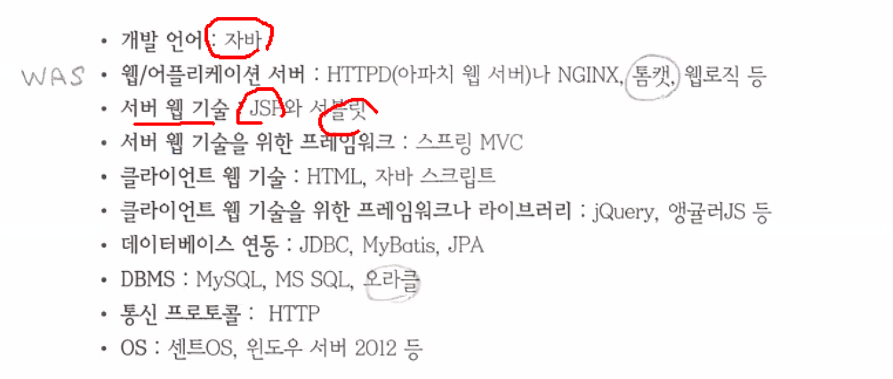
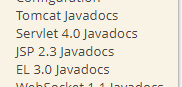

# 12.20

JSP 최범균 



자바를 사용하는 웹 기술: JSP, 서블릿

WAS (Web Application Server): 톰캣

톰캣과 DBMS 의 오라클에 버전도 있으면 좋다.


이클립스에서 플러그인으로 톰캣 안쓰려면 install 버전으로 써야한다.

**템플릿**

```jsp
<%@ page contentType="text/html; charset=UTF-8" pageEncoding="UTF-8"%>
<!DOCTYPE html>
<html>
<head>
<meta charset="UTF-8">
<meta name="viewport" content="width=device-width, initial-scale=1.0">
<script src="https://ajax.googleapis.com/ajax/libs/jquery/3.6.0/jquery.min.js"></script> 
<style>
</style>
<title>Insert title here</title>
</head>
<body>

</body>
</html>
```


**[JSP/Servlet]**

java 언어를 사용하는 서버 웹 기술.

서버 실행 페이지 java + server + page 


- asp
- php ->
- asp.net

`<%-- --%>` JSP 주석처리

JSP의 스크립트 요소 3가지

- `<%@ %>` 지시자 (디렉티브)
- `<% 자바코딩 %>` 스크립트릿
- `<%! %>` 
- `<%= %>` 표현식 (expression)

JAVA HOME 을 꼭 설정해야 한다.

왼쪽 탭 Documentation 8.5



아파치톰캣: https://tomcat.apache.org/tomcat-8.5-doc/index.html

에러

```
Multiple annotations found at this line:
```


```jsp
<%@page import="java.util.Date"%>
<%@page import="java.text.SimpleDateFormat"%>
```

자바코드를 작성할 때 import 를 하지않았거나 환경변수를 세팅하지 않아서 일어나는 문제

---

최범균 책: https://book.naver.com/bookdb/book_detail.nhn?bid=9789206

깃허브: https://github.com/madvirus/jsp23

---

JSP 스크립트 요소 - 스크립트릿


```jsp
<%
	String name = "홍길동";
	int age = 20;
%>
> 이름: <%=name %> <br />
> 나이: <%=age %> <br />
```


> html 에서는 tab 키로 젠코딩이 되지만 jsp 에서는 되지 않는다.


```jsp
<%
	String name = request.getParameter("name");
	int age = Integer.parseInt(request.getParameter("age"));
%>
```


**JSP 페이지의 7가지 구성요소**

1. 디렉티브 (Directive) == 지시자: 3가지
   - `<%@ page 지시자 %>`  
     - `<%@ page contentType="text/html; charset=UTF-8" pageEncoding="UTF-8"%>` 
     - jsp 페이지에 대한 정보를 선언하는 부분
     - jsp 페이지 (WAS) -> 텍스트형식의 html 문서 생성. charset=UTF-8
   - `<%@ include 지시자 %>`
   - `<%@ taglib 지시자 %>`
2. 스크립트 요소 (3가지)
   - jsp 페이지 문서 내용을 동적으로 생성하기 위해서 사용되는 스크립트
   - 스크립트릿 (Scriptlet) `<% 자바코딩 %>` 
   - 표현식 (Expression) `<%= 변수명 %>`
   - 선언부 (Declaration) `<%! 변수선언, 메서드선언 %>` 
3. 표현언어 (Expression Language: EL) != 표현식
4. jsp 기본 내장 객체 - request, response, session, application, page 등등
5. 정적 데이터
6. 표준 액션 태그 (Action Tag)
   - jsp: 접두사가 붙어있는 태그 == [표준] 액션태그
7. 커스텀 태그 + JSTL (자바(J) 표준(S) 태그(T) 라이브러리(L))


`%` 가 붙으면 서버에서 실행된다.

`taglib` tag library

**EL 예시**

```jsp
> 이름: ${ param.name } <br />
> 나이: ${ param.age } <br />
```

변수에 담을 필요가 없다.

EL (표현언어) 이다.


**[out]**

**응답객체: 합**

결과

```
1+2+3+4+5+6+7+8+9+10=55
```

코드

```jsp
<%
	int sum = 0;
	for(int i = 1; i <= 10; i++) {
		sum += i;
		out.append(i != 10 ? i + "+" : i + "");
	}
		out.append("=" + sum);
%>
```


**끊어서 작성**

```
1+2+3+4+5+6+7+8+9+10+ =55
```


```jsp
<%
	int sum = 0;
	for(int i = 1; i <= 10; i++) {
%><%= i %>+<%
		sum += i;
	}
%>
=<%= sum %>
```


**문제**

문제1 (js + jquery) 정수를 입력하고 엔터를 치면 demo 에 출력

```html
정수입력:
<input type="text" name="n" autofocus />
<p id="demo"></p>

<script>
    $(":text").keyup(function(event) {
        if (event.keyCode == 13) {
            var sum = 0;

            for (var i = 0; i <= $(":text").val(); i++) {
                sum += i;
                $("p").append(i + "+");
            }
            $("p").append("=" + sum);
        }
    });
</script>
```

> `keyCode` 의 C 는 대문자.
>
> `keydown` 도 되지만 `keyup` 으로 코딩한다.

문자에 추가해서 `html` 로 해도된다.


```html
<form action="ex100.jsp">
    <input type="text" name="n" autofocus />
    <p id="demo"></p>
</form>
```

submit 버튼이 없어도 엔터를 치면 넘어간다.


에러코드

```html
정수입력:
<form action="">
    <input type="text" name="n" autofocus />
    <br />
    <span></span>
    <p id="demo"></p>
</form>

<script>
    $(function() {
        $(":text:first").focus().select();

        $("form").submit(function(event) {
            var pattern = /^\d+$/
            if (pattern.test(":text:first").val()) {
                // 유효성 검사 성공
                return;
            }
            // 유효성 검사 실패
            $("span", "form")
                .text("Not Valid")
                .css("color", "red")
                .show()
                .fadeOut(3000);

            event.preventDefault();
        });
    });
</script>
```


```jsp
<%	
	String paramN = request.getParameter("n");
	int n = Integer.parseInt(paramN);
%>
```

**암기**

- ?n 파라미터가 넘어오지 않으면 `null`
- ?n 값이 없으면 `""` 이 반환.


**전체코드**

에러

```jsp
<%@ page contentType="text/html; charset=UTF-8" pageEncoding="UTF-8"%>
<%
	String paramN = request.getParameter("n");
	int n = 0;
	
	if (paramN == null || paramN == "") {
		n = Integer.parseInt(paramN);
	}
%>
<!DOCTYPE html>
<html>
<head>
<meta charset="UTF-8">
<meta name="viewport" content="width=device-width, initial-scale=1.0">
<script
	src="https://ajax.googleapis.com/ajax/libs/jquery/3.6.0/jquery.min.js"></script>
<style>
</style>
<title>Insert title here</title>
</head>
<body>
	<h3>ex06.jsp 문제1) 정수를 입력하고 엔터를 치면 demo 에 출력</h3>

	정수입력:
	<form action="">
		<input type="text" name="n" value="<%=paramN == null ? "" : paramN %>" autofocus /> <br /> <span></span>
		<p id="demo">

		<%
			if (! (paramN == null || paramN == "") ) {
		%>
		<%
				int sum = 0;
				
				for(int i = 1; i <= n; i++) {
					sum += i;
					
					if (i == n) {
						%><%=i%><%
					} else {
						%><%=i %>+<%
					} // if
				} // for
				%>=<%=sum %>
		<%
			}
		%>
		</p>
	</form>

	<script>
		$(function() {
			$(":text:first").focus().select();

			$("form").submit(
					function(event) {
						var pattern = /^\d+$/
						if (pattern.test(":text:first").val()) {
							// 유효성 검사 성공
							return;
						}
						// 유효성 검사 실패
						$("span", "form").text("Not Valid").css("color", "red")
								.show().fadeOut(3000);

						event.preventDefault();
					});
		});
	</script>
</body>
</html>
```


**합 출력**

```jsp
<%String password = "java1234"; %>
<%!
    String id = "admin";

public int sum(int n) {
    int result = 0;
    for(int i = 1; i <= n; i++) {
        result += i;
    }
    return result;
}
%>
sum(10) = <%= sum(10) %>

<br />
<%
int hap = sum(100);
out.print("> sum(100) =" + hap);
%>
```


**[서블릿]**

1. Servlet ? java 언어를 사용하는 서버 웹 기술. 후에 jsp 가 보완으로 나왔다.
2. 서블릿 구현 방법
   - 서블릿 규약 -> 자바 클래스
     - 클래스의 접근지정자: public
     - javax.servlet.http.HttpServlet 클래스 상속
     - service() / get() / post() 오버라이딩 해야한다.
   - 자바코딩 -> 컴파일 -> 클래스 파일
   - 클래스 파일을 [WEB_INF/classes] 폴더에 넣어둔다.
     - 이클립스를 사용하면 자동으로 classes 폴더에 넣어둔다.
3. +++ 서블릿 요청 URL 매핑 규칙 +++
4. web.xml (DD파일) 에 서블릿 등록


1. HttpServlet 상속
2. service(HttpServletRequest request, HttpServletResponse response) 오버라이딩


**java**

```java
public class Now extends HttpServlet {
	
	@Override
	protected void service(HttpServletRequest request, HttpServletResponse response)
			throws ServletException, IOException {
		PrintWriter out = response.getWriter();

		out.println("<!DOCTYPE html>");
		out.println("<html>");
		out.println("<head>");
		out.println("<meta charset='UTF-8'>");
		out.println("<title>Insert title here</title>");
		out.println("</head>");
		out.println("<body>");
		
		Date now = new Date();
		SimpleDateFormat sdf = new SimpleDateFormat("yyyy-MM-dd hh:mm:ss");
		String strNow = sdf.format(now);
		
		out.println("> 현재시간: " + strNow);
		out.println("</body>");
		out.println("</html>");
		// Now.java -> 컴파일 -> Now.class -> WEB-INF -> classes 폴더추가
	}
}
```

**web.xml**

xml 파일은 대소문자 공백 구분

```xml
<!-- Now.java 서블릿 등록 -->
<servlet>
    <description>현재 시간을 출력하는 첫 번째 서블릿 예제</description>
    <description>jsp 1일차</description>
    <servlet-name>now</servlet-name>
    <servlet-class>days01.Now</servlet-class>
</servlet>
<servlet-mapping>
    <servlet-name>now</servlet-name>
    <url-pattern>요청 URL 패턴</url-pattern>
</servlet-mapping>
```


URL 패턴

- `/` 로 시작하고 `/*` 로 끝난다.
- `*` 시작 `.` 확장자 끝난다.
- 오직 `/` 만 포함하는 경우 어플리케이션의 기본 서블릿으로 매핑
- 1~3 외는 일치


web.xml 을 수정하면 서버는 재시작한다.


**[서블릿]**

**ex08**

```jsp
<%@ page contentType="text/html; charset=UTF-8" pageEncoding="UTF-8"%>
<!DOCTYPE html>
<html>
<head>
<meta charset="UTF-8">
<meta name="viewport" content="width=device-width, initial-scale=1.0">
<script
	src="https://ajax.googleapis.com/ajax/libs/jquery/3.6.0/jquery.min.js"></script>
<style>
</style>
<title>Insert title here</title>
</head>
<body>
	<h3>ex08.jsp</h3>
	
	서블릿 (Servlet) ? 
	
	<a href="http://localhost/jspPro/days01/now">now</a><br />
	<a href="http://localhost/jspPro/now.do">now.do</a><br />
	<a href="http://localhost/jspPro/days01/today.do">today.do</a><br />
	<a href="http://localhost/jspPro/test/ex01.jsp">/test/ex01.jsp</a><br />
	<a href="http://localhost/jspPro/test/ex02.jsp">/test/ex02.jsp</a><br />
	<a href="http://localhost/jspPro/test/sub/ex01.jsp">/test/sub/ex01.jsp</a><br />

	<script>
		
	</script>
</body>
</html>
```

**java**

```java
package days01;

import java.io.IOException;
import java.io.PrintWriter;
import java.text.SimpleDateFormat;
import java.util.Date;

import javax.servlet.ServletException;
import javax.servlet.http.HttpServlet;
import javax.servlet.http.HttpServletRequest;
import javax.servlet.http.HttpServletResponse;

public class Now extends HttpServlet {
	
	@Override
	protected void service(HttpServletRequest request, HttpServletResponse response)
			throws ServletException, IOException {
		PrintWriter out = response.getWriter();

		out.println("<!DOCTYPE html>");
		out.println("<html>");
		out.println("<head>");
		out.println("<meta charset='UTF-8'>");
		out.println("<title>Insert title here</title>");
		out.println("</head>");
		out.println("<body>");
		
		Date now = new Date();
		SimpleDateFormat sdf = new SimpleDateFormat("yyyy-MM-dd hh:mm:ss");
		String strNow = sdf.format(now);
		
		out.println("> 현재시간: " + strNow);
		out.println("</body>");
		out.println("</html>");
		// Now.java -> 컴파일 -> Now.class -> WEB-INF -> classes 폴더추가
	}
}

```

**xml**

```xml
<?xml version="1.0" encoding="UTF-8"?>
<web-app xmlns:xsi="http://www.w3.org/2001/XMLSchema-instance"
	xmlns="http://xmlns.jcp.org/xml/ns/javaee"
	xsi:schemaLocation="http://xmlns.jcp.org/xml/ns/javaee http://xmlns.jcp.org/xml/ns/javaee/web-app_3_1.xsd"
	id="WebApp_ID" version="3.1">
	<display-name>jspPro</display-name>
	<welcome-file-list>
		<welcome-file>index.html</welcome-file>
		<welcome-file>index.jsp</welcome-file>
		<welcome-file>index.htm</welcome-file>
		<welcome-file>default.html</welcome-file>
		<welcome-file>default.jsp</welcome-file>
		<welcome-file>default.htm</welcome-file>
	</welcome-file-list>

	<!-- Now.java 서블릿 등록 -->
	<servlet>
		<description>현재 시간을 출력하는 첫 번째 서블릿 예제</description>
		<description>jsp 1일차</description>
		<servlet-name>now</servlet-name>
		<servlet-class>days01.Now</servlet-class>
	</servlet>
	<servlet-mapping>
		<servlet-name>now</servlet-name>
		<url-pattern>/days01/now</url-pattern>
		<url-pattern>*.do</url-pattern>
		<url-pattern>/test/*</url-pattern>
	</servlet-mapping>
</web-app>
```


**[page 지시자]**

1. `contentType="text/html; charset=UTF-8" ` 
   - -> 일본어 -> 톰캣 (웹컨테이너) 컴파일 -> UTF-8 인코딩 + 텍스트형식. 문서 만들 때
2. `pageEncoding="UTF-8"`  문서를 읽어들일 때


contentType 서블릿에서 text/html 생성 + 인코딩 (ISO 8859-1)

**인코딩**

```java
response.setContentType("text/html; charset=UTF-8");
PrintWriter out = response.getWriter();
```

> `setContentType` 을 `getWriter` 전에 작성해야 한다.


jQuery - tabs 첫번째 - view source


**[탭]**

```html
<link rel="stylesheet"
      href="//code.jquery.com/ui/1.13.0/themes/base/jquery-ui.css">
<link rel="stylesheet" href="/resources/demos/style.css">
<script src="https://code.jquery.com/jquery-3.6.0.js"></script>
<script src="https://code.jquery.com/ui/1.13.0/jquery-ui.js"></script>
<script>
    $(function() {
        $("#tabs").tabs();
    });
</script>

<!-- 바디 -->
<div id="tabs">
    <ul>
        <li><a href="#tabs-1">GET 방식 요청</a></li>
        <li><a href="#tabs-2">POST 방식 요청</a></li>
    </ul>
    <div id="tabs-1">
        <p>
            정수입력: <input type="text" name="n" id="n"/> <br /> 
            <a
               href="/jspPro/days01/ex09_ok.jsp">ex09_ok.jsp</a>
        </p>
    </div>
    <div id="tabs-2">
        <p>
        <form action="" method="post">
            Name: <input type="text" id="name" name="name" autofocus />
            Age: <input type="text" id="age" name="age" />
        </form>
        </p>
</div>
</div>
```


**javaScript**

```javascript
$("#tabs-1 a").on("click", function(event) {
    $(this).attr("href", "/jspPro/days01/ex09_ok.jsp" + "?n=" + $("#n").val());
});
```


**같은코드**

```javascript
$("#tabs-1 a").on("click", function(event) {
    $(this).attr("href", function(i, val) {
        return val + "?n=" + $("#n").val();
    });
});
```


**JSP**

```
> n = 23
> EL n 23
```


```jsp
<%int n = Integer.parseInt(request.getParameter("n"));%>
> n = <%=n%>
<br /> > EL n ${param.n }
```


**경로**

> 팀프로젝트를 위해 href="/jspPro" 로 설정할 것


동적으로 name, age DB 저장, 동적으로 서블릿 처리


**[서블릿 생성]**

new servlet 생성 - next - 

URL mappings 에 `/days01/info.html` 추가


**ex09**

```jsp
<%@ page contentType="text/html; charset=UTF-8" pageEncoding="UTF-8"%>
<!DOCTYPE html>
<% 
	String contextPath = request.getContextPath();
// 	System.out.println("> contextPath: " + contextPath);
%>
<html>
<head>
<meta charset="UTF-8">
<meta name="viewport" content="width=device-width, initial-scale=1.0">

<link rel="stylesheet"
	href="//code.jquery.com/ui/1.13.0/themes/base/jquery-ui.css">
<link rel="stylesheet" href="/resources/demos/style.css">
<script src="https://code.jquery.com/jquery-3.6.0.js"></script>
<script src="https://code.jquery.com/ui/1.13.0/jquery-ui.js"></script>
<script>
	$(function() {
		$("#tabs").tabs();
	});
</script>

<style>
</style>
<title>Insert title here</title>
</head>
<body>

	<!-- 바디 -->

	<div id="tabs">
		<ul>
			<li><a href="#tabs-1">GET 방식 요청</a></li>
			<li><a href="#tabs-2">POST 방식 요청</a></li>
		</ul>
		<div id="tabs-1">
			<p>
				정수입력: <input type="text" name="n" id="n"/> <br /> 
				<a
					href="<%= contextPath %>/days01/ex09_ok.jsp">ex09_ok.jsp</a>
			</p>
		</div>
		<div id="tabs-2">
			<p>
				<form action="" method="post">
					Name: <input type="text" id="name" name="name" autofocus />
					Age: <input type="text" id="age" name="age" />
					<input type="radio" name="method" value="get" checked/>Get 방식
					<input type="radio" name="method" value="post" />Post 방식
					<br />
					<button type="submit">전송 (submit)</button>
				</form>
				<a href="<%= contextPath%>/Info">Info</a>
			</p>
		</div>
	</div>
	
	
	
	<script>
// 		tabs - 2
		$("form button").on("click", function(event) {
			$("form")
			.attr("action", "<%= contextPath %>/days01/info.html")
			.attr("method", $("#tabs-2 :radio:checked").val())
			.submit();
			
		});
	</script>
	
	<script>
// 		$("form").submit(function(event) {
// 			$(this)
<%-- 			.attr("action", "<%= contextPath %>/days01/info.html") --%>
// 			.attr("method", $("#tab-2 :radio:checked").val());
// 		});
	</script>

	<script>
// 		$("#tabs-1 a").on("click", function(event) {
// 			alert("test");
// 			event.preventDefault();
// 			alert($(this).attr("href")); // /jspPro/days01/ex09_ok.jsp
// 			$(this).attr("href", "/jspPro/days01/ex09_ok.jsp" + "?n=" + $("#n").val());

// 			$(this).attr("href", function(i, val) {
// 				return val + "?n=" + $("#n").val();
// 			});
// 		});
	</script>
</body>
</html>
```

**info.java**

```java
package days01;

import java.io.IOException;
import javax.servlet.ServletException;
import javax.servlet.annotation.WebServlet;
import javax.servlet.http.HttpServlet;
import javax.servlet.http.HttpServletRequest;
import javax.servlet.http.HttpServletResponse;

/**
 * Servlet implementation class Info
 */
@WebServlet(
		description = "두 번째 만드는 서블릿 예제", 
		urlPatterns = { 
				"/Info", 
				"/days01/info.html"
		})
public class Info extends HttpServlet {
	private static final long serialVersionUID = 1L;
       
    /**
     * @see HttpServlet#HttpServlet()
     */
    public Info() {
        super();
        // TODO Auto-generated constructor stub
    }

	/**
	 * @see HttpServlet#doGet(HttpServletRequest request, HttpServletResponse response)
	 */
	protected void doGet(HttpServletRequest request, HttpServletResponse response) throws ServletException, IOException {
		// TODO Auto-generated method stub
		response.setContentType("text/html; charset=UTF-8");
		response.getWriter()
		.append("GET 방식 요청 - Served at: ")
		.append(request.getContextPath());
	}

	/**
	 * @see HttpServlet#doPost(HttpServletRequest request, HttpServletResponse response)
	 */
	protected void doPost(HttpServletRequest request, HttpServletResponse response) throws ServletException, IOException {
		// TODO Auto-generated method stub
//		doGet(request, response);
		response.setContentType("text/html; charset=UTF-8");
		response.getWriter()
		.append("POST 방식 요청 - Served at: ")
		.append(request.getContextPath());
	}

}

```

**ex09_ok**

```jsp
<%@ page contentType="text/html; charset=UTF-8" pageEncoding="UTF-8"%>
<!DOCTYPE html>
<html>
<head>
<meta charset="UTF-8">
<meta name="viewport" content="width=device-width, initial-scale=1.0">
<script
	src="https://ajax.googleapis.com/ajax/libs/jquery/3.6.0/jquery.min.js"></script>
<style>
</style>
<title>Insert title here</title>
</head>
<body>
	<% int n = Integer.parseInt(request.getParameter("n")); %>
	> n = <%=n%>
	<br /> > EL n ${param.n }
	<br />

	<script>
		
	</script>
</body>
</html>
```


**[자바스크립트 자동완성 플러그인]**

wild web developer


16~17시

ajax 에서는 click 이 적용되지 않으므로 on - click 으로 작성하자.

# 12.21

**복습문제**

```jsp
<form method="get">
    <input type="text" id="num1" name="num1" autofocus /> <select
                                                                  id="operator" name="operator">
    <option>+</option>
    <option>-</option>
    <option>*</option>
    <option>/</option>
    </select> <input type="text" id="num2" name="num2" autofocus />
</form>
```


**서버없이 구현**

```javascript
$("#num2").keyup(
    function(event) {
        if (event.keyCode == 13) {
            var n1 = Number($("#num1").val());
            var n2 = Number($("#num2").val());
            var o = $("#operator").val();

            var answer = o == "+" ? n1 + n2 : o == "-" ? n1 - n2
            : o == "*" ? n1 * n2 : n1 / n2;

            $("#demo").html(answer);
        }
    });
```


```javascript
$("form").find(":text").eq(1);
$(":text").eq(1);
```


**쌤코드**


```jsp
<%
String demo_output = "";
double result = 0;
String operator = "+";

try {
	int num1 = Integer.parseInt(request.getParameter("num1"));
	int num2 = Integer.parseInt(request.getParameter("num2"));
	operator = request.getParameter("operator");
	result = 
			  operator.equals("+") ? num1 + num2 
			: operator.equals("-") ? num1 - num2
			: operator.equals("*") ? num1 * num2 
			: num1 / num2;
	
	demo_output = String.format("%d%s%d=%.2f", num1, operator, num2, result);
} catch (Exception e) {}
%>
```


```jsp
<p id="demo">
    <%-- 		<%=num1 %><%=operator %><%=num2 %>=<%=result %> --%>
    <%=demo_output %>
    </p>

<script>
    $(":text").css("text-align", "center");
$(":text").eq(1).on("keyup", function(event) {
    if (event.which == 13) {
        $("form").submit();
    }
});
</script>
```

복습: `<% %>` 가 언제 실행되는지 alert 로 확인


**EL 로 submit 후 값 유지**

```jsp
<form method="get">
    <input type="text" id="num1" name="num1" autofocus value="${param.num1 }"/> 
    <select
            id="operator" name="operator">
        <option <%=operator.equals("+") ? "selected" : "" %>>+</option>
        <option <%=operator.equals("-") ? "selected" : "" %>>-</option>
        <option <%=operator.equals("*") ? "selected" : "" %>>*</option>
        <option <%=operator.equals("/") ? "selected" : "" %>>/</option>
    </select> <input type="text" id="num2" name="num2" autofocus value="${param.num2 }"/>
</form>
```

> 자바에서 문자열비교는 `equals`

이 코드는

```javascript
$("#operator").val("<%= operator %>");
```

자바스크립트코드 한줄로 가능하다.


**[request]**

JSP 페이지 구성요소 중 기본객체

1. 클라이언트 (브라우저) 와 관련된 정보읽기 가능
2. 서버와 관련된 정보읽기 가능
3. 클라이언트가 전송한 [요청] 파라미터읽기 가능
4. 클라이언트가 전송한 요청헤더읽기 가능
5. 클라이언트가 전송한 쿠기정보읽기 가능
   - js 쿠키정보: document.cookie
6. 속성처리가능


## 함수

**request.**

- `getContextPath()` /jspPro
- `getRemoteAddr()` 클라이언트 IP. 8자리
- `getMethod()` 요청 전송방식. GET 또는 POST
- `getRequestURL()` 요청 URL. `http://local/jspPro/days02/ex02.jsp`
- `getRequestURI()` 요청 URI. `/jspPro/days02/ex02.jsp` 
- `getCharacterEncoding()` 요청 인코딩. null
- `getContentType()` 요청 컨텐츠 타입. null
- `getProtocol()` 요청 프로토콜. HTTP/1.1
- `getServerName()` 서버이름. localhost
- `getServerPort()` 서버포트. 80
- `getContentLength()` 요청정보의 길이. 
- `getParameterValues` 배열을 반환


**EL**

```jsp
> 이름: <%=name %> - ${param.name }<br />
> 나이: <%=age %> - ${param.age }<br />
```

EL 은 형번환까지 한다.


**문제**

성별 체크해서 페이지 넘어갔을 때 체크하기

```jsp
<input type="radio" name="gender" value="m" checked/>남자
<input type="radio" name="gender" value="f" <%= gender.equals("f") ? "checked" : "" %>/>여자
```


**javaScript**

```javascript
$(":radio[name=gender]").each(function(i, element) {
    if (element.value == "<%=gender%>") {
        element.checked = true;
    }
});
```

**jQuery**

```javascript
$(":radio[value=<%=gender%>]").attr("checked" ,true);
```


```jsp
> 좋아하는 동물:
<%
    String[] pets = request.getParameterValues("pet");
%>
    <%=Arrays.toString(pets) %>
```

`%=` 에는 세미콜론을 붙이지 않는다.


**문제**

```javascript
for (var i = 0; i < pets.length; i++) {
    $("[name=pet value=<%=pets[i]%>]").attr("checked", true);
}
```

시도해봤는데 해결되지 않는다.

오류

```javascript
for (var i = 0; i < pets.length; i++) {
    $(":checkbox[name=pet]").each(function(i, element) {
        if ('<%=Arrays.toString(pets)%>'.indexOf(element.value) != -1) {
            element.checked = "true";
        }
    });
}
```


**파라미터 값들 확인**

```
name
age
gender
pet
```

```jsp
<%
Enumeration<String> en = request.getParameterNames();
while (en.hasMoreElements()) {
    String pname = en.nextElement();
    out.println("<li>" + pname + "</li>");
}
%>
```


**Map Set Entry Iterator 사용**

```
key=name, value=[홍길동]
key=age, value=[20]
key=gender, value=[m]
key=pet, value=[pig]
```

```jsp
<%
Map<String, String[]> pMap = request.getParameterMap();
Set<Entry<String, String[]>> eSet = pMap.entrySet();
Iterator<Entry<String, String[]>> ir = eSet.iterator();

while (ir.hasNext()) {
    Entry<String, String[]> entry = ir.next();
    out.println(
        String.format("key=%s, value=%s<br>", entry.getKey(), Arrays.toString(entry.getValue()))
    );
}
%>
```


**자바 인코딩**

```java
request.setCharacterEncoding("UTF-8"); 
response.setContentType("text/html; charset=UTF-8");
```

둘의 차이점

`setCharacterEncoding` 는 작동한다. 파라미터 넘어올 때 적용. 

- GET: 디폴트 UTF-8
- POST: 디폴트 ISO-8859-1. UTF-8 로 설정해야 한다.

`setContentType` 응답


JSPClass 탐색기 - ex04.jsp.java 검색

ex04.jsp -> WAS -> ex04_jsp.java 서블릿 자동변환

ojdbc6.jar 를 사용해야 conn 객체를 가져올 수 있다.

Dynamic Web Project 에 WEB-INF 의 lib 폴더에 넣는다.

**[서버에서 옵션버튼 만들기]**

```jsp
<%@page import="java.util.Iterator"%>
<%@page import="days02.DeptDTO"%>
<%@page import="java.util.ArrayList"%>
<%@page import="java.sql.PreparedStatement"%>
<%@page import="java.sql.SQLException"%>
<%@page import="java.sql.ResultSet"%>
<%@page import="java.sql.Statement"%>
<%@page import="com.util.DBConn"%>
<%@page import="java.sql.Connection"%>
<%@ page contentType="text/html; charset=UTF-8" pageEncoding="UTF-8"%>
<%
ArrayList<DeptDTO> list = null;
Connection conn = DBConn.getConnection();

// 3. ÇÊ¿äÇÑ ÀÛ¾÷ - Statement, ResultSet
String sql =  "SELECT deptno, dname, loc " 
             + " FROM dept";  // DQL(SELECT)
int deptno;
String dname, loc;

try {
	PreparedStatement pstmt = conn.prepareStatement(sql);
	ResultSet rs = pstmt.executeQuery();

	if (rs.next()) {
		list = new ArrayList<>();

		do {
			deptno = rs.getInt(1);
			dname = rs.getString(2);
			loc = rs.getString(3);
			
			DeptDTO dto = new DeptDTO(deptno, dname, loc);
			list.add(dto);
		} while (rs.next());
	} // if
	pstmt.close();
	rs.close();
} catch (SQLException e) {
	e.printStackTrace();
}

// 4
DBConn.close();
// System.out.println("END");
%>
<!DOCTYPE html>
<html>
<head>
<meta charset="UTF-8">
<meta name="viewport" content="width=device-width, initial-scale=1.0">
<script
	src="https://ajax.googleapis.com/ajax/libs/jquery/3.6.0/jquery.min.js"></script>
<style>
</style>
<title>Insert title here</title>
</head>
<body>
	<h3>ex04.jsp</h3>

	<select name="cmbDept" id="cmbDept">
	<%
	Iterator<DeptDTO> ir = list.iterator();
	while (ir.hasNext()) {
		DeptDTO dto = ir.next();
		%>
		<option value="<%=dto.getDeptno()%>"><%=dto.getDname() %></option>
		<%
	}
	%>
	</select>
</body>
</html>
```


   HTTP 프로토콜은 헤더 정보에 부가적인 정보. - 웹브라우저 종류, 선호하는 언어 등등
   request 기본 객체를 통해서 헤더 정보를 읽어올 수 있다. 
   -- request 요청 헤더 정보를 읽어오는 메서드 --

   1) String `getHeader(name)` 지정한 이름의 헤더 값을 반환.
   2) Enumeration  `getHeaders(name)` 지정한 이름의 헤더 목록 반환...
   3) Enumeration  `getHeaderNames()` 모든 헤더의 이름 반환
   4) int `getIntHeader(name)`  지정한 헤더의 값을 정수 값으로 반환
   5) long `getDateHeader(name)` 지정한 헤더의 값을 시간값으로 반환 ( 1970.1.1~ ms ) 


**헤더목록**

```
host: localhost
connection: keep-alive
cache-control: max-age=0
sec-ch-ua: " Not A;Brand";v="99", "Chromium";v="96", "Google Chrome";v="96"
sec-ch-ua-mobile: ?0
sec-ch-ua-platform: "Windows"
upgrade-insecure-requests: 1
user-agent: Mozilla/5.0 (Windows NT 10.0; Win64; x64) AppleWebKit/537.36 (KHTML, like Gecko) Chrome/96.0.4664.110 Safari/537.36
accept: text/html,application/xhtml+xml,application/xml;q=0.9,image/avif,image/webp,image/apng,*/*;q=0.8,application/signed-exchange;v=b3;q=0.9
sec-fetch-site: none
sec-fetch-mode: navigate
sec-fetch-user: ?1
sec-fetch-dest: document
accept-encoding: gzip, deflate, br
accept-language: ko-KR,ko;q=0.9,en-US;q=0.8,en;q=0.7,la;q=0.6
cookie: JSESSIONID=DFBAA40BF2CAC5DDC165915BAA32320F
```

java

```java
Enumeration<String> en = request.getHeaderNames();

while (en.hasMoreElements()) {
    String headerName = en.nextElement();
    String headerValue = request.getHeader(headerName);
    out.println("<li>" + headerName + ": " + headerValue + "</li>");
}
```


```jsp
<ol>
    <%
    Enumeration<String> en = request.getHeaderNames();

    while (en.hasMoreElements()) {
        String headerName = en.nextElement();
        String headerValue = request.getHeader(headerName);
        // 		out.println("<li>" + headerName + ": " + headerValue + "</li>");
        // 	}
        %>
    <li><%=headerName%> : <%=headerValue%></li>
    <%
    }
    %>
</ol>
```


**[response 기본객체]**

request: 요청

response: 응답

1. 헤드정보 저장 (입력)
   - `addDateHeader(name, long date)`
   - `addHeader(name, value)`
   - `addIntHeader(name, int value)`
   - `setDateHeader(name, date)` 
   - `setHeader(name, value)`
   - `setIntHeader(name, int value)` 
   - boolean `containsHeader(name)` 
2. 리다이렉트 (Redirect) 하기


1. response 기본객체로 [리다이렉트] 를 이용하여 페이지 이동
   - ? 웹 서버가 웹브라우저에게 다른 페이지로 이동하라고 응답하는 기능
   - response.sendRedirect("다른 페이지 경로");
2. [포워딩] 을 이용하여 페이지 이동


예제) ex07.jsp 와 ex07_ok.jsp 파일 추가

아이디  id/passwd DB

비밀번호 로그인 성공 ex07.jsp?id=admin&ok

[로그인] -> 실패 ex07.jsp?error=1001

<- ex07.jsp 리다이렉트


로그인성공 화면구현

로그인실패 화면구현

**[로그인 리다이렉트]**

**JSP**

1. ex07.jsp
2. 로그인 실패 ex07.jsp?error
3. 로그인 성공 ex07.jsp?id=admin&ok

```jsp
<%
String ok = request.getParameter("ok");
String error = request.getParameter("error");%>

	<!-- 바디 -->	
	<h3>ex07.jsp</h3>
	
	<%
	if (ok != null) { // ex07.jsp?id=admin&ok 로그인 성공
	%>
	<script>
		alert("로그인 성공!!!");
	</script>
	<%
	} else if (error != null) { // ex07.jsp?error
	%>
	<script>
		alert("로그인 실패!!!");
		$(":text").eq(0)
		.focus()
		.select();
	</script>
	<%
	}
	%>

	<form action="ex07_ok.jsp">
		아이디 : 
		<input type="text" name="id" value="admin" /><br> 
		비밀번호 : 
		<input type="password" name="passwd" value="1234" /><br> 
		<input type="submit" />
	</form>
```

ok.jsp

```jsp
<%@ page contentType="text/html; charset=UTF-8" pageEncoding="UTF-8"%>
<%
String id = request.getParameter("id");
String passwd = request.getParameter("passwd");

String location = "ex07.jsp";

// DB id/passwd 체크
if (id.equals("admin") && passwd.equals("1234")) {
	// 로그인 성공
	location += "?id=admin&ok";
} else {
	// 로그인 실패
	location += "?error";
}
response.sendRedirect(location);
%>
```


클라이언트 

브라우저				서버

ex07.jsp 주소 ->

form action="ex07_ok.jsp"

id

passwd

[로그인] -> 


> 리다이렉트할 때 한글 파라미터는 반드시 인코딩해야 한다.


**[로그인창]**

```jsp
<div id="logon">
    <form action="ex08_ok.jsp">
        아이디: <input type="text" name="id" value="홍길동" /><br /> 비밀번호: <input
                                                                            type="password" name="passwd" value="1234" /><br /> <input
                                                                                                                                       type="submit" value="로그인" />
    </form>
</div>
<div id="logout">
    [${param.id}] 님 로그인하셨습니다. <br />
    <button>로그아웃</button>
</div>

<%
// ?ok 로그인 성공
String ok = request.getParameter("ok");
String error = request.getParameter("error");
%>

<%
if (ok == null) {
    %>
<script>
    $("#logout").hide();
</script>
<%
}
if (ok != null) {
    %>
<script>
    alert("로그인 성공!!!");
    $("#logon").hide();
    $("#logout").show();
</script>
<%
} else if (error != null) { // 로그인 실패
    %>
<script>
    alert("로그인 실패!!!");
    $(":text").eq(0).focus().select();
</script>

<%
}
%>
```


```jsp
<%@page import="java.net.URLEncoder"%>
<%@ page contentType="text/html; charset=UTF-8" pageEncoding="UTF-8"%>
<%
String id = request.getParameter("id");
String passwd = request.getParameter("passwd");

String location = "ex08.jsp";

// DB id/passwd 체크
if (id.equals("홍길동") && passwd.equals("1234")) {
	// 로그인 성공
	String pid = URLEncoder.encode(id, "UTF-8");
	location += "?id=" + pid + "&ok";
} else {
	// 로그인 실패
	location += "?error";
}
response.sendRedirect(location);
%>
```


**[리다이렉트와 포워딩]**

**차이점**

a 태그는 GET 방식으로 요청.

ex09

```jsp
<%
String name = "admin";
int age = 20;
%>

<a href="ex09_redirect.jsp">리다이렉트(Redirect)</a> <br />
<a href="ex09_forward.jsp">포워딩(Fprward)</a> <br />

<script>
    $("a").on("click", function(event) {
        $(this).attr("href", function(i, val) {
            return val + "?name=<%=name%>&age=<%=age%>";
        });
    });
</script>
```

**ex09_redirect**

```
http://localhost/jspPro/days02/ex09_finish.jsp?name=admin&age=20
```


```jsp
<%@ page contentType="text/html; charset=UTF-8" pageEncoding="UTF-8"%>
<%
String name = request.getParameter("name");
String age = request.getParameter("age");
String params = String.format("?name=%s&age=%s", name, age);
String location = "ex09_finish.jsp" + params;

response.sendRedirect(location);
%>
```

> `response.sendRedirect(location)` URL 로 값을 넘겨준다.

**ex09_forward**

```
http://localhost/jspPro/days02/ex09_forward.jsp?name=admin&age=20
```


```jsp
<%@ page contentType="text/html; charset=UTF-8" pageEncoding="UTF-8"%>
<%
String path = "ex09_finish.jsp";
RequestDispatcher dispatcher = request.getRequestDispatcher(path);
dispatcher.forward(request, response);
%>
```


ex09_finish.jsp

```jsp
> name: ${param.name } <br />
> age:  ${param.age } <br />
```


ex09 forward.jsp -> 서버에서 서버로 finish.jsp

Q. 리다이렉트와 포워딩 ?

A. 리다이렉트는 새로운페이지로 포워딩은 현재페이지에서 불러온다.

a ex09_redirect.jsp 클릭 -> 리다이렉트 ex09_finish.jsp?name age


**[서블릿 GET방식 호출]**

[부서정보] -> 클릭 -> 서블릿 GET방식 호출 -> ex10_dept.jsp

days02.ScottDept 서블릿클래스 생성

ArrayList list = <>()

request.setAttribute("list", list);

path = ex10_dept.jsp

포워딩 (request, response)


로직처리								출력(뷰)

days02.ScottDept			ex10_dept.jsp

서블릿 GET 방식 호출

ex04 를 두 부분으로 나눈다.


복습: 패턴 ? 3:26

ex10

```jsp
<%@ page contentType="text/html; charset=UTF-8" pageEncoding="UTF-8"%>
<!DOCTYPE html>
<html>
<head>
<meta charset="UTF-8">
<meta name="viewport" content="width=device-width, initial-scale=1.0">
<script
	src="https://ajax.googleapis.com/ajax/libs/jquery/3.6.0/jquery.min.js"></script>
<style>
</style>
<title>Insert title here</title>
</head>
<body>
	<%
	String contextPath = request.getContextPath();
	%>

<%-- 	<a href="<%=contextPath%>/days02/dept"></a> --%>
	<a href="<%=contextPath%>/scott/dept">부서 정보</a>
	
	[부서정보] -> 클릭 -> 서블릿 GET방식 호출
	
	<script>
		
	</script>
</body>
</html>
```


ex10_dept

```jsp
<%@page import="java.util.ArrayList"%>
<%@page import="days02.DeptDTO"%>
<%
ArrayList<DeptDTO> list = (ArrayList<DeptDTO>) request.getAttribute("list");
%>
<%@page import="java.util.Iterator"%>
<%@ page contentType="text/html; charset=UTF-8" pageEncoding="UTF-8"%>
<%
String contextPath = request.getContextPath();
%>
<!DOCTYPE html>
<html>
<head>
<meta charset="UTF-8">
<meta name="viewport" content="width=device-width, initial-scale=1.0">
<script
	src="https://ajax.googleapis.com/ajax/libs/jquery/3.6.0/jquery.min.js"></script>
<style>
</style>
<title>Insert title here</title>
</head>
<body>
	<h3>ex10_dept.jsp</h3>

	<select id="cmbDept" name="cmbDept">
		<option >선택...</option>
		<%
		Iterator<DeptDTO> ir = list.iterator();
		while (ir.hasNext()) {
			DeptDTO dto = ir.next();
		%>
		<option value="<%=dto.getDeptno()%>"><%=dto.getDname()%></option>
		<%
		}
		%>
	</select>


	<script>
		$(function() {
			$("#cmbDept").wrap("<form></form>")
			.change(function(event) {
				if ($(this).val()) {
					$(this).parent()
					.attr({
						action: "<%=contextPath%>/scott/emp"
						, method: "get"
					})
					.submit();
				} else {
					alert("부서를 선택하세요~");
				}
			});
		});
	
	</script>
</body>
</html>
```


ScottDept

```java
package days02;

import java.io.IOException;
import java.sql.Connection;
import java.sql.PreparedStatement;
import java.sql.ResultSet;
import java.sql.SQLException;
import java.util.ArrayList;

import javax.servlet.RequestDispatcher;
import javax.servlet.ServletException;
import javax.servlet.annotation.WebServlet;
import javax.servlet.http.HttpServlet;
import javax.servlet.http.HttpServletRequest;
import javax.servlet.http.HttpServletResponse;

import com.util.DBConn;

/**
 * Servlet implementation class ScottDept
 */
@WebServlet({ "/ScottDept", "/scott/dept" })
public class ScottDept extends HttpServlet {
	private static final long serialVersionUID = 1L;

	/**
	 * @see HttpServlet#HttpServlet()
	 */
	public ScottDept() {
		super();
		// TODO Auto-generated constructor stub
	}

	/**
	 * @see HttpServlet#doGet(HttpServletRequest request, HttpServletResponse
	 *      response)
	 */
	protected void doGet(HttpServletRequest request, HttpServletResponse response)
			throws ServletException, IOException {
		System.out.println("> doGet 호출됨");

		// ex04.jsp 코딩 복사 붙이기
		ArrayList<DeptDTO> list = null;
		Connection conn = DBConn.getConnection();

		String sql = "SELECT deptno, dname, loc " + " FROM dept";

		int deptno;
		String dname, loc;
		try {
			PreparedStatement pstmt = conn.prepareStatement(sql);
			ResultSet rs = pstmt.executeQuery();
			if (rs.next()) {
				list = new ArrayList<>();
				do {
					deptno = rs.getInt(1);
					dname = rs.getString(2);
					loc = rs.getString(3);

					DeptDTO dto = new DeptDTO(deptno, dname, loc);
					list.add(dto);

				} while (rs.next());
			} // if
			pstmt.close();
			rs.close();
		} catch (SQLException e) {
			e.printStackTrace();
		}
		DBConn.close();
		
		// request 객체에 list 저장
		request.setAttribute("list", list);

		String path = "/days02/ex10_dept.jsp";
		RequestDispatcher dispatcher = request.getRequestDispatcher(path);
		dispatcher.forward(request, response);
	}

	/**
	 * @see HttpServlet#doPost(HttpServletRequest request, HttpServletResponse
	 *      response)
	 */
	protected void doPost(HttpServletRequest request, HttpServletResponse response)
			throws ServletException, IOException {
		// TODO Auto-generated method stub
		doGet(request, response);
	}

}

```


**[부서선택]**

select 태그에서 부서를 하나 선택하면 /scott/emp GET 요청 -> ScottEmp.java 서블릿

1. form 추가
2. jquery 코딩: submit()


```javascript
action: "<%=contextPath%>/scott/emp"
```

```java
@WebServlet({"/scott/emp"})
```

> pattern 에는 /jspPro 가 없다.

**ScottEmp**

```java
package days02;


import java.io.IOException;
import java.sql.Connection;
import java.sql.Date;
import java.sql.PreparedStatement;
import java.sql.ResultSet;
import java.sql.SQLException;
import java.sql.Statement;
import java.util.ArrayList;

import javax.servlet.ServletException;
import javax.servlet.annotation.WebServlet;
import javax.servlet.http.HttpServlet;
import javax.servlet.http.HttpServletRequest;
import javax.servlet.http.HttpServletResponse;

import com.util.DBConn;

/**
 * Servlet implementation class ScottEmp
 */
@WebServlet({"/scott/emp"})
public class ScottEmp extends HttpServlet {
	private static final long serialVersionUID = 1L;
       
    /**
     * @see HttpServlet#HttpServlet()
     */
    public ScottEmp() {
        super();
        // TODO Auto-generated constructor stub
    }

	/**
	 * @see HttpServlet#doGet(HttpServletRequest request, HttpServletResponse response)
	 */
	protected void doGet(HttpServletRequest request, HttpServletResponse response) throws ServletException, IOException {
		// TODO Auto-generated method stub
		response.getWriter().append("Served at: ").append(request.getContextPath());
		
		String pdeptno = request.getParameter("cmbDept");

		String sql = "SELECT * ";
		sql += "FROM emp ";
		sql += "WHERE deptno = ? " + pdeptno;
		sql += "ORDER BY ename ASC";
		//
		Connection conn = DBConn.getConnection();
		PreparedStatement pstmt = null;
		ResultSet rs = null;
		int empno;
		String ename;
		String job;
		int mgr;
		Date hiredate;
		double sal;
		double comm;
		int deptno;
		EmpDTO dto = null;
		ArrayList<EmpDTO> list = null;

		try {
			pstmt = conn.prepareStatement(sql);
			pstmt.setInt(1, Integer.parseInt(pdeptno));
			rs = pstmt.executeQuery(); // select DQL

			if (rs.next()) {
				list = new ArrayList<>();
				do {
					empno = rs.getInt("empno");
					ename = rs.getString("ename");
					job = rs.getString("job");
					mgr = rs.getInt("mgr");
					hiredate = rs.getDate("hiredate");
					sal = rs.getDouble("sal");
					comm = rs.getDouble("comm");
					deptno = rs.getInt("deptno");
					dto = new EmpDTO(empno, ename, job, mgr, hiredate, sal, comm, deptno);

					list.add(dto);
				} while (rs.next()); // while
			}
			pstmt.close();
			rs.close(); // ***
		} catch (SQLException e) {
			e.printStackTrace();
		}
		DBConn.close();
	}

	/**
	 * @see HttpServlet#doPost(HttpServletRequest request, HttpServletResponse response)
	 */
	protected void doPost(HttpServletRequest request, HttpServletResponse response) throws ServletException, IOException {
		// TODO Auto-generated method stub
		doGet(request, response);
	}
}
```


**ex10_emp.jsp**

try-catch

```jsp
<%
ArrayList<EmpDTO> list = (ArrayList<EmpDTO>) request.getAttribute("list");
%>

<h3>ex10_emp</h3>

<table border="1" style="width: 100%">
    <thead>
        <tr>
            <th>deptno</th>
            <th>empno</th>
            <th>ename</th>
            <th>job</th>
            <th>hiredate</th>
        </tr>
    </thead>
    <tbody>
        <%
        try {
            Iterator<EmpDTO> ir = list.iterator();

            while (ir.hasNext()) {
                EmpDTO dto = ir.next();
                %>	
        <tr>
            <td><%= dto.getDeptno() %></td>
            <td><%= dto.getEmpno() %></td>
            <td><%= dto.getEname() %></td>
            <td><%= dto.getJob() %></td>	
            <td><%= dto.getHiredate() %></td>	
            <%
            }


            %>
        </tr>
    </tbody>
    <tfoot>
        <tr>
            <td colspan="5">${param.cmbDept }번 부서원은 <%=list.size() %>명입니다.</td>
            <%} catch (Exception e) {
    %> <p>사원이 존재하지 않습니다.</p> <%
            }%>
        </tr>
    </tfoot>
</table>

<a href="http://localhost/jspPro/scott/dept">다시하기</a>
```


**쌤코드**

if-else 처리

```jsp
<%
ArrayList<EmpDTO> list = (ArrayList<EmpDTO>) request.getAttribute("list");
%>

<h3>ex10_emp</h3>

<table border="1" style="width: 100%">
    <thead>
        <tr>
            <th>deptno</th>
            <th>empno</th>
            <th>ename</th>
            <th>job</th>
            <th>hiredate</th>
        </tr>
    </thead>
    <tbody>
        <%
        if (list != null) {
            Iterator<EmpDTO> ir = list.iterator();

            while (ir.hasNext()) {
                EmpDTO dto = ir.next();
                %>	
        <tr>
            <td><%= dto.getDeptno() %></td>
            <td><%= dto.getEmpno() %></td>
            <td><%= dto.getEname() %></td>
            <td><%= dto.getJob() %></td>	
            <td><%= dto.getHiredate() %></td>	
            <%
            } // while
            } else {
                %>
        <tr>
            <td colspan="5" style="height:200px;">사원이 존재하지 않습니다.</td>
        </tr>
        <%
        }
        %>
    </tr>
</tbody>
<tfoot>
    <tr>
        <td colspan="5">${param.cmbDept }번 부서원은 <%=list == null ? 0 : list.size() %>명입니다.</td>
    </tr>
</tfoot>
</table>

<a href="http://localhost/jspPro/scott/dept">다시하기</a>
```


**팀별숙제**

`/days0`

체크한 empno 


ex10.jsp -> ScottDept.java -> ex10_dept.jsp -> ScottEmp.java -> ex10_emp.jsp

