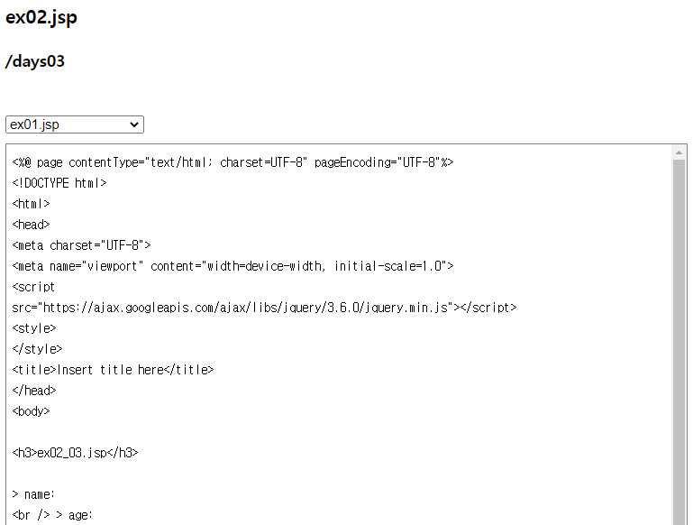
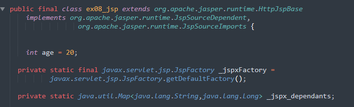
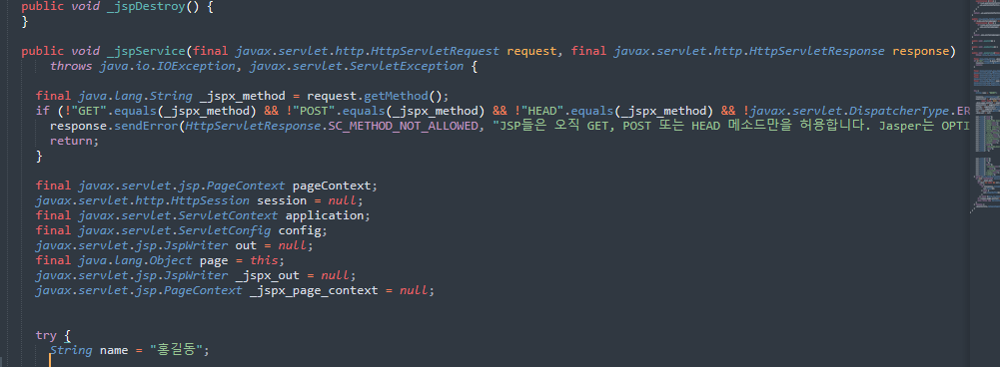
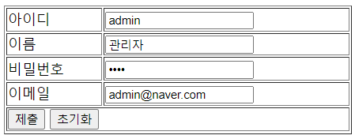
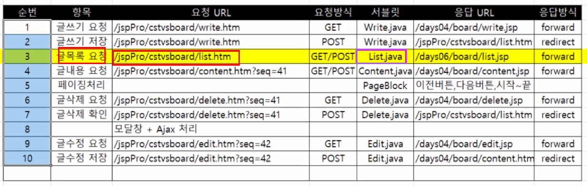
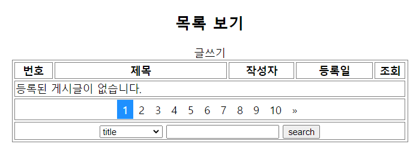

# 12.22

get 방식 -> 서블릿 -> 포워딩

post 방식 -> 서블릿 -> 포워딩

ex01.jsp Ex01.java

입력	?파라미터 request.getAttribute(결과물)

​	로직처리

​	request.setAttribute (결과물)


게시판: webapp 에 board 와 member 폴더를 만든다.


```javascript
$("form:last-of-type :button").on("click", function(event) {
    $(this).parents("form").submit();
});
```


**java**

```java
String location = "/days03/ex01_ok.jsp";
response.sendRedirect(location);
```

servlet 을 수정 후에는 서버를 재실행해야된다.


12/22 오전수업 다시듣기


각 부서원들을 테이블 형식으로 출력.

ex03.jsp -> 서블릿

**[JSTL]**

JSTL: Java Standard Tag Library 

복습: 프로젝트 생성 정리

파일받는 사이트: https://mvnrepository.com/

JSTL 검색 - 제일 많이 사용한 것 - 제일 많이 사용한 버전 - **Files** jars 받기

```jsp
<%@taglib prefix="c" uri="http://java.sun.com/jsp/jstl/core" %>
```

jar 를 uri WEB-INF - lib 에 추가하고 uri 를 자동완성한다.

prefix 에 c 를 넣는다.

템플릿에 추가할 것

getAttribute 가 필요없이 바로 사용할 수 있다.

- `c:if` 


**JSTL: 부서테이블 예시**

```jsp
<%@page import="java.util.Iterator"%>
<%@page import="java.util.ArrayList"%>
<%@page import="days02.EmpDTO"%>
<%@page import="java.sql.PreparedStatement"%>
<%@page import="com.util.DBConn"%>
<%@page import="java.sql.*"%>
<%@ page contentType="text/html; charset=UTF-8" pageEncoding="UTF-8"%>
<%@taglib prefix="c" uri="http://java.sun.com/jsp/jstl/core" %>
<%
String pdeptno = request.getParameter("deptno");

String sql = "SELECT * ";
sql += "FROM emp ";
sql += "WHERE deptno = ? ";
sql += "ORDER BY ename ASC";
//
Connection conn = DBConn.getConnection();

PreparedStatement pstmt = null;
ResultSet rs = null;

int empno;
String ename;
String job;
int mgr;
Date hiredate; // String -> java.sql.Date
double sal;
double comm;
int deptno;

EmpDTO dto = null;

ArrayList<EmpDTO> list = null;
try {
	pstmt = conn.prepareStatement(sql);
	pstmt.setInt(1, Integer.parseInt(pdeptno)); // ?
	rs = pstmt.executeQuery();

	if (rs.next()) {
		list = new ArrayList<>();
		do {

	empno = rs.getInt("empno");
	ename = rs.getString("ename");
	job = rs.getString("job");
	mgr = rs.getInt("mgr");
	// java.sql.Date
	hiredate = rs.getDate("hiredate"); // rs.getString("hiredate")
	sal = rs.getDouble("sal");
	comm = rs.getDouble("comm");
	deptno = rs.getInt("deptno");

	dto = new EmpDTO(empno, ename, job, mgr, hiredate, sal, comm, deptno);

	list.add(dto);
		} while (rs.next());
	} // if

	pstmt.close();
	rs.close(); // ***
} catch (SQLException e) {
	e.printStackTrace();
}

DBConn.close();

// list
request.setAttribute("elist", list);
%>
<!DOCTYPE html>
<html>
<head>
<meta charset="UTF-8">
<meta name="viewport" content="width=device-width, initial-scale=1.0">
<script
	src="https://ajax.googleapis.com/ajax/libs/jquery/3.6.0/jquery.min.js"></script>
<style>
</style>
<title>Insert title here</title>
</head>
<body>
	<%
	// list = (ArrayList<EmpDTO>) request.getAttribute("list");
	%>

	<h3>ex03_jstl.jsp</h3>
	<a href="ex03_jstl.jsp?deptno=30">ex03_jstl.jsp</a>
	<br />

	<table border="1" style="width: 100%">
		<thead>
			<tr>
				<th>deptno</th>
				<th>empno</th>
				<th>ename</th>
				<th>job</th>
				<th>hiredate</th>
			</tr>
		</thead>
		<tbody>
			<c:if test="${not empty elist }">
				<c:forEach items="${elist }" var="dto">
					<tr>
						<td>${dto.deptno}</td>
						<td>${dto.empno}</td>
						<td>${dto.ename}</td>
						<td>${dto.job}</td>
						<td>${dto.hiredate}</td>
					<tr>
				</c:forEach>
			</c:if>
			<c:if test="${empty elist }">
				<tr>
					<td colspan="5" style="height:200px;">사원이 존재하지 않습니다.</td>
				</tr>
			</c:if>
		</tbody>
		<tfoot>
			<tr>
				<td colspan="5">${param.deptno }번 부서원은 ${elist.size() }명입니다.</td>
			</tr>
		</tfoot>
	</table>

	<a href="<%=request.getContextPath()%>/scott/dept">다시하기</a>
	

	<script>
		
	</script></
			body>
</html>
```


**[어제 팀과제]**

test00.html 링크 클릭 -> 서블릿 (Test00.java) urlpattern = "/days03.test00.html"

> 서블릿 후에는 항상 서버 재실행할 것!!

**포워딩**

```java
request.getRequestDispatcher("ex04_test00.jsp").forward(request, response);
```

> java 폴더와 webapp 폴더는 맞추는게 좋다.
>
> 확장자를 꼭 붙여야 한다.

dispacher: 전달자. 

`요청.요청전달자.포워드` 


복습: ex04 

- select option
- `c:if`
- `c:forEach` 


**[ex05.jsp]**

/jspPro/days03/ex05.html -> 서블릿 -> ex05.jsp

```jsp
<%@page import="java.util.Iterator"%>
<%@page import="java.util.Map.Entry"%>
<%@page import="java.util.Set"%>
<%@page import="days02.EmpDTO"%>
<%@page import="java.util.ArrayList"%>
<%@page import="days03.SalgradeDTO"%>
<%@page import="java.util.LinkedHashMap"%>
<%@ page contentType="text/html; charset=UTF-8" pageEncoding="UTF-8"%>
<%@ taglib prefix="c" uri="http://java.sun.com/jsp/jstl/core" %>
<!DOCTYPE html>
<html>
<head>
<meta charset="UTF-8">
<title>Insert title here</title>
<meta name="viewport" content="width=device-width, initial-scale=1.0">
<title>2021. 12. 22. - 오후 2:47:33</title>
<link rel="icon" type="image/x-icon" href="../images/SiSt.ico">

<link rel="stylesheet" href="//code.jquery.com/ui/1.13.0/themes/base/jquery-ui.css">
<link rel="stylesheet" href="/resources/demos/style.css">
<script src="https://code.jquery.com/jquery-3.6.0.js"></script>
<script src="https://code.jquery.com/ui/1.13.0/jquery-ui.js"></script>
<script>
  $( function() {
    $( "#accordion" ).accordion();
    $( "#tabs" ).tabs();
  } );

</script>
 
<style>
</style>
</head>
<body>

<h3>ex05.jsp</h3>
<!-- 
 /jspPro/days03/ex05.html -> Ex05.java 서블릿 ->  ex05.jsp
                             포워딩
 -->
<%
  LinkedHashMap<SalgradeDTO, ArrayList<EmpDTO>> map =
          (LinkedHashMap<SalgradeDTO, ArrayList<EmpDTO>>)request.getAttribute("map");
%> 
<div id="accordion">
  <!-- 
  <h3>Section 1</h3>
  <div>
    <p>
    Mauris mauris ante, blandit et, ultrices a, suscipit eget, quam. Integer
    ut neque. Vivamus nisi metus, molestie vel, gravida in, condimentum sit
    amet, nunc. Nam a nibh. Donec suscipit eros. Nam mi. Proin viverra leo ut
    odio. Curabitur malesuada. Vestibulum a velit eu ante scelerisque vulputate.
    </p>
  </div>
   -->
   <%
   Set<Entry<SalgradeDTO, ArrayList<EmpDTO>>>  set = map.entrySet();
   Iterator<Entry<SalgradeDTO, ArrayList<EmpDTO>>> ir = set.iterator();

   while (ir.hasNext()) {
      Entry<SalgradeDTO, ArrayList<days02.EmpDTO>> entry = ir.next();
      SalgradeDTO dto = entry.getKey();
  %>
           <h3><%= String.format( "%d등급( %d~%d ) - %d명", dto.getGrade(), dto.getLosal(), dto.getHisal(), dto.getCnt() ) %></h3>
           <div>
           <%   
               ArrayList<EmpDTO> empList =  entry.getValue();
               Iterator<EmpDTO> e_ir =  empList.iterator();
               while (e_ir.hasNext()) {
                  EmpDTO edto =  e_ir.next();
            %>
            <p>
            <%=  String.format("\t%d\t%s\t%d\t%s\t%.2f\n",
                        edto.getDeptno(),
                          "" ,
                          edto.getEmpno(),
                          edto.getEname(),
                          edto.getSal()
                          )%> 
            </p>      
            <%                    
               } //  
            %>      
            </div>
   <%   
   } // while
   %>
</div>

	<hr />
	
	<div id="tabs">
<!--   <ul> -->
<!--     <li><a href="#tabs-1">Nunc tincidunt</a></li> -->
<!--     <li><a href="#tabs-2">Proin dolor</a></li> -->
<!--     <li><a href="#tabs-3">Aenean lacinia</a></li> -->
<!--   </ul> -->

	<ul>
  <%
	   set = map.entrySet();
	   ir = set.iterator();
	   int i = 1;

	   while (ir.hasNext()) {
	      Entry<SalgradeDTO, ArrayList<days02.EmpDTO>> entry = ir.next();
	      SalgradeDTO dto = entry.getKey();
  %>
           <li><a href="#tabs-<%=i%>"><%= String.format( "%d등급( %d~%d ) - %d명", dto.getGrade(), dto.getLosal(), dto.getHisal(), dto.getCnt() ) %></a></li>
   <%   
   		i++;
   } // while
   %>
	
	</ul>

<!--   <div id="tabs-1"> -->
<!--     <p>Proin elit arcu, rutrum commodo, vehicula tempus, commodo a, risus. Curabitur nec arcu. Donec sollicitudin mi sit amet mauris. Nam elementum quam ullamcorper ante. Etiam aliquet massa et lorem. Mauris dapibus lacus auctor risus. Aenean tempor ullamcorper leo. Vivamus sed magna quis ligula eleifend adipiscing. Duis orci. Aliquam sodales tortor vitae ipsum. Aliquam nulla. Duis aliquam molestie erat. Ut et mauris vel pede varius sollicitudin. Sed ut dolor nec orci tincidunt interdum. Phasellus ipsum. Nunc tristique tempus lectus.</p> -->
<!--   </div> -->
<!--   <div id="tabs-2"> -->
<!--     <p>Morbi tincidunt, dui sit amet facilisis feugiat, odio metus gravida ante, ut pharetra massa metus id nunc. Duis scelerisque molestie turpis. Sed fringilla, massa eget luctus malesuada, metus eros molestie lectus, ut tempus eros massa ut dolor. Aenean aliquet fringilla sem. Suspendisse sed ligula in ligula suscipit aliquam. Praesent in eros vestibulum mi adipiscing adipiscing. Morbi facilisis. Curabitur ornare consequat nunc. Aenean vel metus. Ut posuere viverra nulla. Aliquam erat volutpat. Pellentesque convallis. Maecenas feugiat, tellus pellentesque pretium posuere, felis lorem euismod felis, eu ornare leo nisi vel felis. Mauris consectetur tortor et purus.</p> -->
<!--   </div> -->
<!--   <div id="tabs-3"> -->
<!--     <p>Mauris eleifend est et turpis. Duis id erat. Suspendisse potenti. Aliquam vulputate, pede vel vehicula accumsan, mi neque rutrum erat, eu congue orci lorem eget lorem. Vestibulum non ante. Class aptent taciti sociosqu ad litora torquent per conubia nostra, per inceptos himenaeos. Fusce sodales. Quisque eu urna vel enim commodo pellentesque. Praesent eu risus hendrerit ligula tempus pretium. Curabitur lorem enim, pretium nec, feugiat nec, luctus a, lacus.</p> -->
<!--     <p>Duis cursus. Maecenas ligula eros, blandit nec, pharetra at, semper at, magna. Nullam ac lacus. Nulla facilisi. Praesent viverra justo vitae neque. Praesent blandit adipiscing velit. Suspendisse potenti. Donec mattis, pede vel pharetra blandit, magna ligula faucibus eros, id euismod lacus dolor eget odio. Nam scelerisque. Donec non libero sed nulla mattis commodo. Ut sagittis. Donec nisi lectus, feugiat porttitor, tempor ac, tempor vitae, pede. Aenean vehicula velit eu tellus interdum rutrum. Maecenas commodo. Pellentesque nec elit. Fusce in lacus. Vivamus a libero vitae lectus hendrerit hendrerit.</p> -->
<!--   </div> -->

   <%
   set = map.entrySet();
   ir = set.iterator();
   i = 1;

   while (ir.hasNext()) {
      Entry<SalgradeDTO, ArrayList<days02.EmpDTO>> entry = ir.next();
      SalgradeDTO dto = entry.getKey();
  %>
           <div id="tabs-<%=i %>">
           <%   
               ArrayList<EmpDTO> empList =  entry.getValue();
               Iterator<EmpDTO> e_ir =  empList.iterator();
               while (e_ir.hasNext()) {
                  EmpDTO edto =  e_ir.next();
            %>
            <p>
            <%=  String.format("\t%d\t%s\t%d\t%s\t%.2f\n",
                        edto.getDeptno(),
                          "" ,
                          edto.getEmpno(),
                          edto.getEname(),
                          edto.getSal()
                          )%> 
            </p>      
            <%                    
               } //  
            %>      
            </div>
   <%   
   			i++;
   } // while
   %>

</div>

<script>
</script>
</body>
</html>
```

**[ex06.jsp]**

[jsp페이지] -> 요청 -> WAS [웹컨테이너]

​									서블릿 객체

​			<- 응답 - 

​			<- 응답 - 

								1) 데이터 전송 성능 향상
								2) 버퍼
								3) 버퍼 전송되기 전 헤드 변경 (조작)

```jsp
<%@ page contentType="text/html; charset=UTF-8" 
pageEncoding="UTF-8"
buffer="8kb"
autoFlush="true"
%>
```

- `buffer` 8kb 가 다 차면 전송
- `autoFlush` 용량이 다 차면 클라이언트로 자동 전송. 디폴트 true
- `import` 
- `isErrorPage`
- `isThreadSafe`
- `language`
- `session`
- `trimDirectiveWhitespaces` 디폴트 false. 전송할때 지시자 공백 제거. 

```
java.io.IOException: 오류: JSP 버퍼 오버플로우
```


```jsp
<%@ page 
buffer="1kb"
autoFlush="false"
%>
```


```jsp
<%
for(int i = 0; i < 1000; i++) {
    if (i % 10 == 0) out.flush();
    out.print(i + " : 1234<br>");
}
%>
```

`out.flush()`  를 하면 에러가 나지 않는다.


**[ex07.jsp]**

웹 애플리케이션 배포


탐색기 - 

```
C:\apache-tomcat-8.5.73\bin\startup.bat
```

파일로 Tomcat 을 실행한다.

권한때문에 되지 않으니 넘어간다.


프로젝트 우클릭 - export - war file

Destination

```
C:\Users\Connor\Desktop\jspPro.war
```

export source files 체크

```
C:\apache-tomcat-8.5.73\webapps
```

폴더에 jspPro.war 파일을 저장하면 배포가 끝난다.

자동으로 jspPro 폴더가 생긴다.

매번 할 수가 없으므로 이클립스에서 플러그인을 사용해서 자동으로 배포한다.

AWS 때 배포해보자.


​    [ JSP페이지의 기본 내장 객체 9가지 ]
​       1. `request`  javax.servlet.http.[HttpServletRequest] : 클라이언트의 요청 정보 저장
​       2. `response`  javax.servlet.http.[HttpServletResponse] : 응답 정보 저장
​       3. `pageContext`  javax.servlet.jsp.PageContext : JSP페이지에 대한 정보 저장
​       4. `session`  javax.servlet.http.HttpSession : HTTP 세션 정보 저장
​       5. `application`  javax.servlet.[ServletContext] : 웹 애플리케이션의 정보 저장
​       6. `out` javax.servlet.jsp.[JspWriter] :  출력 스트림 - > 버퍼
​       7. `config` javax.servlet.ServletConfig : JSP페이지에 대한 설정 정보를 저장
​       8. `page`  java.lang.Object  : JSP페이지를 구현한 자바 클래스 인스턴스
​       9. `exception`  java.lang.Throwable : 예외 객체 , 에러 페이지에서만 사용할 수 있다.    


- `request`
- `response`
- `out`


- `application` application 이 session 보다 범위가 더 크다.
- `session` 해당접속


- `pageContext` JSP 페이지에 대한 정보 저장.
  - JSP 페이지에 대한 기본객체도 얻어올 수 있다.
  - 속성 처리 가능
  - 페이지의 흐름 제어할 수 있다.
  - 에러 데이터를 구할 수 있다.
- `page` JSP 페이지를 구현한 자바클래스 인스턴스


- `config`


- `exception` 

## 함수

**[JSTL]**

**태그**

- `c:forEach` c:f 로 입력. `var` `items` 속성을 준다. `varStatus` 를 status 라고 지정하면 i 를 사용할 수 있다.
  - `begin` `end` `step` 을 줄 수도 있다.
- `c:if` c:i 로 입력. 

**status.**

- `current` var 와 같은 듯 하다.
- `index` i 를 0부터
- `count` i 를 1부터
- `first` for 문의 처음일 때 true. `c:if` 와 함께 사용
- `last` for 문의 마지막일 때 true. `c:if` 와 함께 사용
- `begin`
- `end`
- `step`  


**first & last**

```
first: 1
last: 3
```


```jsp
<c:forEach var="dto" items="${empList }" varStatus="i">
    <c:if test="${i.first }">first: ${i.count }</c:if> <br />
    <c:if test="${i.last }">last: ${i.count }</c:if> <br />
</c:forEach>
```


**$**

- `empty` 비어있으면 true
- `not empty` 비어있지 않으면 true


**[JSP 기본객체]**

**out.**

- `print`
- `println` `\r\n` 이 포함되지만 브라우저에서는  줄바꿈을 위해 `<br>` 태그가 필요하므로 줄바꿈이 되지 않는다. `print` + `newLine`
- `newLine()` `\r\n` 줄바꿈이 역시 되지 않는다.
- `getBufferSize()` 
- `getRemaining`
- `isAutoFlush` 

**request.**

- `setAttribute("속성명", 속성값)`
- `getAttribute("속성명")`

**pageContext.**

- `getRequest` ServletRequest 로 반환. request 의 타입은 `HttpServletRequest` 타입이 다르다. Http 가 자식인 듯.
- `getResponse` response
- `getSession` session
- `getServletContext` application
- `getServletConfig` config
- `getOut` out


```
public interface HttpServletRequest extends ServletRequest
```

Http 가 ServletRequest 의 자식이므로


```java
HttpServletRequest pc_request = (HttpServletRequest) pageContext.getRequest();
```

getRequest 를 Http 에 담으려면 다운캐스팅 해야한다.


```
true
```


```jsp
<%=request == pc_request %>
```


---


```
> 버퍼크기: 8192
> 남은버퍼: 7798
> Auto Flush: true
```


```jsp
> 버퍼크기: <%=out.getBufferSize()%> <br />
> 남은버퍼: <%=out.getRemaining()%> <br />
> Auto Flush: <%=out.isAutoFlush()%> <br />
```


**객체 가져오기**

```java
pageContext.getRequest(); // request
pageContext.getResponse(); // response
pageContext.getSession(); // session
pageContext.getServletContext(); // application
pageContext.getServletConfig(); // config
```

application 과 config 를 주의한다.

내일오전: 이론

내일오후: 게시판

시간이 남으면: jdbcPro\days03\board 쿼리


# 12.23

**[application]**

기본내장객체 -서버정보

       1. 모든 JSP페이지는 하나의 application 기본 객체를 공유한다.
       2. 웹 사이트 전체에 application 기본 객체 ( 1개 )
       웹 사이트의 초기 설정 정보, 서버 정보, 자원 정보 
       DB 연결 정보 , 로깅 설정, 파일 저장 경로, 등등 초기 설정 정보..
       3. 웹 애플리케이션 전체에 걸쳐서 사용할 수 있는 초기화 파라미터를 정의... 
       web.xml


**web.xml**

```xml
<!-- 	days04 application 객체 초기 설정 -->
<!-- 	웹 사이트 전체에 로그인, 디버깅 초기화 설정 -->
<context-param>
    <description>로그인 여부</description>
    <param-name>logEnabled</param-name>
    <param-value>true</param-value>
</context-param>

<context-param>
    <description>디버깅 레벨</description>
    <param-name>debugLevel</param-name>
    <param-value>3</param-value>
</context-param>

<context-param>
    <description>이미지 파일경로</description>
    <param-name>imagePath</param-name>
    <param-value>/images</param-value>
</context-param>
```

## 함수

**application.**

- `getServerInfo()` Apache Tomcat/8.5.63
- `getMajorVersion()` 3 (3.1 을 의미한다.)
- `getMinorVersion()` 1
- `getRealPath`


application 기본객체의 초기화 파라미터 관련 메서드

- `String getInitParameter(name)`
- `Enumeration<String> getInitParameterNames()`


- `setAttribute(name, value)`
- `getAttribute(name)`
- `Enumeration<String> getAttributeNames()`
- `removeAttribute(name)`


---


**application 파라미터 확인**

```
logEnabled : true
imagePath : /images
debugLevel : 3
```

```jsp
<%
Enumeration<String> en = application.getInitParameterNames();

while (en.hasMoreElements()) {
    String paramName = en.nextElement();
    String paramValue = application.getInitParameter(paramName);
    %>
<li><%=paramName %> : <%=paramValue %></li>
<%
}
%>
```


ex02

JSP 페이지에서 서버의 어떤 특정 폴더 (웹 어플리케이션 폴더의 위치한) 의 파일을 사용할 때가 있다.

 URL: `http://localhost:80/jspPro/days03`
 realPath: `tomcat\webapps\days03` 

이클립스 내부에 배포경로 설정

**realPath**

```
C:\class\JSPClass\.metadata\.plugins\org.eclipse.wst.server.core\tmp0\wtpwebapps\jspPro3\
```


**ex02**



```jsp
<%
// URL: http://localhost:80/jspPro/days03
// realPath: 
String filepath = application.getInitParameter("filePath"); // days03
String realPath = application.getRealPath("") + filepath;
out.println("> realpath: " + realPath + "<br>");
%>

<%
File dir = new File(realPath);
File[] fileList = dir.listFiles();
%>

<h3>ex02.jsp</h3>
<h4>/days03</h4>


<form action="" id="form1">
    <label for="/days03"></label><br />
    <select name="file" id="file">
        <%
        for(int i = 0; i < fileList.length; i++) {
            %>
        <option><%=fileList[i].getName() %></option>
        <%
        }
        %>
    </select>
</form>

<%
// 	out.println(fileList[0].getName());
FileReader in = null;
BufferedReader br = null;

// ?file=ex10.jsp
String pFile = request.getParameter("file");
String file = pFile == null ? fileList[0].getName() : pFile;
String fileName = String.format("%s/%s", realPath, file);
StringBuffer sb = new StringBuffer();

try {
    in = new FileReader(fileName);
    br = new BufferedReader(in);
    String line = null;

    while((line = br.readLine()) != null) {
        sb.append(line + "\r\n");
    }

} catch (Exception e) {
    e.printStackTrace();
} finally {
    try {
        in.close();
        br.close();
    } catch (Exception e) {

    }
}

String content = sb.toString();
content = content
    .replaceAll("<", "&lt;")
    .replaceAll(">", "&gt;")
    .replaceAll("\r\n", "<br>");
%>

<div
     style="border: solid 1px gray; padding: 5px; margin-top: 10px; max-height: 500px; overflow: auto">
    <code>
        <%=content %>
    </code>
</div>

<script>
    $("#file").change(function(event) {
        $("form").submit();	
    });
</script>
```

> `option` 태그에는 `value` 속성을 안주는 것이 좋다.


**ex03**

웹 어플리케이션은 4가지 영역 (scope) 이 있다.

1. application scope (영역): 웹 사이트 전체 사용되는 영역
2. session scope: 하나의 브라우저에서 사용되는 영역
3. request scope: 하나의 요청을 처리할 때 사용되는 영역
4. page scope: 하나의 jsp 페이지를 처리할 때 사용되는 영역

ex01.jsp => page scope

ex01.jsp => 포워딩 request scope


- `setAttribute(name, value)`
- `getAttribute(name)`
- `Enumeration<String> getAttributeNames()`
- `removeAttribute(name)`


**[scope]**

**ex03**

```jsp
<%
    application.setAttribute("name", "admin");
    session.setAttribute("age", "20");
    request.setAttribute("addr", "seoul");
    pageContext.setAttribute("color", "red"); // page scope
%>

<br />
<a href="ex04.jsp">ex04.jsp</a>
```

**ex04**

```jsp
a name: <%=application.getAttribute("name") %> <br />
s age: <%=session.getAttribute("age") %> <br />
r addr: <%=request.getAttribute("addr") %> <br />
p color: <%=pageContext.getAttribute("color") %> <br />

<br />
<a href="ex04_02.jsp">ex04_02.jsp</a>

```

**ex04_02**

```jsp
<%@ page contentType="text/html; charset=UTF-8" pageEncoding="UTF-8"%>
<%@taglib prefix="c" uri="http://java.sun.com/jsp/jstl/core"%>

<%
	// ex04_02.jsp 로직처리
	application.setAttribute("name", "admin");
	session.setAttribute("age", "20");
	request.setAttribute("addr", "seoul");
	pageContext.setAttribute("color", "red"); // page scope
	
	// 1. 포워딩
	String path = "ex04_03.jsp";
	RequestDispatcher dispatcher = request.getRequestDispatcher(path);
	dispatcher.forward(request, response);
	
	// 2. 리다이렉트
	response.sendRedirect(path);
%>
```

**ex04_03**

```jsp
<h3>ex04_03.jsp - 포워딩/리다이렉트 비교</h3>

a name: <%=application.getAttribute("name") %> <br />
s age: <%=session.getAttribute("age") %> <br />
r addr: <%=request.getAttribute("addr") %> <br />
p color: <%=pageContext.getAttribute("color") %> <br />
```

r addr 이 포워딩에서는 나오지만 리다이렉트에서는 나오지 않는다.

포워딩은 request 리다이렉트는 response 로 작성한다.


**[JSP 예외처리]**

1. 자바처럼 Exception 처리
2. 에러페이지 생성 후 처리
3. 상태코드(404, 500) 와 예외 타입별로 예외 페이지 지정해서 예외처리

복습: 페이지 h3 템플릿

**상태코드**

- 200 : 요청을 정상적으로 처리했다.
- 404 : 요청 URL 자원이 존재하지 않는 경우
- 500 : 서버 내부 에러 
- 307 : 임시로 페이지를 리다이렉트함.
- 400 : 클라이언트의 요청이 잘못된 구문으로 구성됨.
- 401 : 접근을 허용하지 않음. (권한)
- *** 405 : 요청한 메서드( GET, POST, HEAD, PUT, DELETE 등등 )을 허용하지 않는 경우.
- 503 : 서버의 일시적인 서비스를 제공할 수 없는 경우. 


**Exception**

ex05_02

```java
String name = null;

try {
    name = request.getParameter("name").toUpperCase(); // 대문자
} catch (Exception e) {
    e.printStackTrace();
    name = "guest";
}
```

**[에러페이지]**

**ex05_03**


webapp 에 error 폴더추가

```jsp
<%@ page errorPage="/error/viewErrorMessage.jsp" %>
```


**viewErrorMessage**

```jsp
<%@ page isErrorPage="true" %>

<h3>viewErrorMessage.jsp</h3>
요청 처리 과정에서 에러가 발생했습니다
<br> 빠른 시간 내에 문제를 해결하도록 하겠습니다.

<p>
    에러 타입: <%=exception.getClass().getName() %> <br />
    에러 메시지: <%=exception.getMessage() %> <br />
</p>
```


**[상태코드별 에러처리]**

상태코드 (404, 500 등등) 로 예외페이지 지정해서 예외처리


**web.xml**

```xml
<error-page>
    <error-code>404</error-code>
    <location>/error/error404.jsp</location>
</error-page>

<error-page>
    <exception-type>java.lang.NullPointException</exception-type>
    <location>/error/errorNullPointer.jsp</location>
</error-page>
```


**에러페이지의 우선순위**

1. page 지시자의 `errorPage` 속성
2. exception-type
3. error-code
4. 웹 컨테이너 (톰캣) 가 제공하는 기본 에러페이지


**[레이아웃]**

- 헤더
- 네비게이션
- 푸터 등

공통모듈이라 한다.

페이지 모듈화

- TOP
- LEFT
- RIGHT
- CONTENT
- BOTTOM

**모듈화시킨 것을 페이지에 포함방법**

1. jsp: include 액션태그 (Action Tag)
2. include 지시자


예) 웹사이트 전체 TOP/BOTTOM 공통 - webapp/layout

top.jsp

bottom.jsp

days04 (회원가입/탈퇴/로그인) - 공통모듈


**[jsp:include]**

```jsp
<jsp:include page="/layout/top.jsp"></jsp:include>
```


```jsp
<div style="text-align: center">
  <table width="600" border="1" align="center">
    <tr>
      <td colspan="3">
      	<jsp:include page="/layout/top.jsp"></jsp:include>
         
      </td>
    </tr>
    <tr height="300">
      <td width="150" valign="top" style="background: yellow">
         <jsp:include page="/days04/layout/left.jsp"></jsp:include>
      </td>
      <td>
        회원 관리 Content 부분<br>
        회원 관리 Content 부분<br>
        회원 관리 Content 부분<br>
        회원 관리 Content 부분<br>
        회원 관리 Content 부분<br>
      </td>
      <td valign="top" style="background: red">
         <jsp:include page="/days04/layout/right.jsp"></jsp:include>
      </td>
    </tr>
    <tr>
      <td colspan="3">
         <jsp:include page="/layout/bottom.jsp"></jsp:include>
      </td>
    </tr>
  </table>
</div>
```

**top**

```jsp
<%@ page contentType="text/html; charset=UTF-8" pageEncoding="UTF-8"%>
<%@taglib prefix="c" uri="http://java.sun.com/jsp/jstl/core" %>
<div style="border:solid 1px gray;height:100px;text-align: center">
  <h1>홍길동 웹 사이트 TOP-수정</h1>
</div>
<a href="#">게시판</a> |
<a href="#">회원관리</a> |  
```


**bottom**

```jsp
<%@ page contentType="text/html; charset=UTF-8" pageEncoding="UTF-8"%>
<%@taglib prefix="c" uri="http://java.sun.com/jsp/jstl/core"%>
<div style="border: solid 1px gray; height: 100px; text-align: center">
	<h3>홍길동 웹 사이트 BOTTOM 소개</h3>
</div>

```


**left**

```jsp
<%@ page contentType="text/html; charset=UTF-8" pageEncoding="UTF-8"%>
<%@taglib prefix="c" uri="http://java.sun.com/jsp/jstl/core" %>
<ul>
	<li>로그인</li>
	<li>회원관리</li>
	<li>도움말</li>
</ul>
```


**right**

```jsp
<%@ page contentType="text/html; charset=UTF-8" pageEncoding="UTF-8"%>
<%@taglib prefix="c" uri="http://java.sun.com/jsp/jstl/core" %>
광고1 <br />
광고2 <br />
광고3 <br />
```


`jsp:include` 액션태그를 만나면 서블릿객체가 top, bottom, left, right 를 추가한다.

- `jsp:include` 
- `include` 지시자. 하나의 서블릿 객체가 만들어진다.


```jsp
<%--       	<jsp:include page="/layout/top.jsp"></jsp:include> --%>
<%@include file="/layout/top.jsp" %>
```

같은역할이지만 차이점이 있다.


```jsp
<%!
	String id = "kenik";
%>
```

`!` 를 붙이는 차이점

결론

```jsp
<%@include file="/layout/top.jsp" %>
```

이 코드와 `!` 를 붙여 선언하면 include 에서 파라미터를 사용할 수 있다.


탐색기 - ex08_jsp 검색 - ex08_jsp.java 편집기로 열기



`!` 를 붙이면 필드 혹은 멤버변수가 된다.



`!` 를 붙이지 않으면 `_jspService` 함수에서 선언되서 지역변수가 된다.


전역변수 선언 ex09.jsp -> include 지시자를 사용해야되는 이유 설명


jsp:include 속성

- `flush` 자동전송

태그

- `jsp:param` include 로 값을 넘기고싶을 때

**ex07_template.jsp**

```jsp
<jsp:include page="/layout/bottom.jsp" >
    <jsp:param value="hi~~~" name="msg"/>
</jsp:include>
```

**bottom.jsp**

```jsp
<%
	String msg = request.getParameter("msg");
%>
```

ex07_template -> bottom 으로 값을 넘긴다.


프로젝트때 만드시 모듈화를 할 것.


웹사이트의 모든페이지마다 코딩이 필요하다면 모듈화 -> %@ include 지시자


**[include]**

```jsp
<%@include file="/include.jspf" %>
```


**include.jspf**

```jsp
<%@ page contentType="text/html; charset=UTF-8" pageEncoding="UTF-8"%>
<%@taglib prefix="c" uri="http://java.sun.com/jsp/jstl/core" %>
<%
	// 웹사이트의 모든페이지마다 코딩이 필요하다면 모듈화 -> %@ include 지시자
	String contextPath = request.getContextPath();
	request.setCharacterEncoding("UTF-8");
%>
```


**액션태그로 포워딩**

```jsp
<jsp:forward page="">
    <jsp:param value="" name=""/>
</jsp:forward>
```

같은코드

```java
String path = "";
RequestDispatcher dispatcher = request.getRequestDispatcher(path);
dispatcher.forward(request, response);
```


days04 폴더안의 jsp 페이지들에게만 include 지시자 설정.


**web.xml**

```xml
<jsp-config>
    <jsp-property-group>
        <url-pattern>/days04/*</url-pattern>
        <include-prelude>/common/header.jspf</include-prelude>
        <include-coda>/common/footer.jspf</include-coda>
    </jsp-property-group>
</jsp-config>
```

> 확장자 꼭 jspf 일 필요 없다.

- `include-prelude` jsp 파일앞에 삽입
- `include-coda` jsp 파일뒤에 삽입

**[자바 빈즈 (java beans) 과 jsp:useBean 액션태그]**

1. 자바빈 ? [jsp] 기반 웹애플리케이션에서 정보를 표현하는 객체 (클래스)
   - 객체를 직렬화를 위한 표준
2. POJO ? [spring] 기반 웹애플리케이션에서 정보를 표현하는 객체 (클래스)
3. 자바빈 규약
   - 직렬화
   - private 필드선언
   - getter, setter 선언

DTO 와 비슷한 역할

VO (Value Object) == DTO



```jsp
<form action="ex10.jsp" method="get">
    <table border="1" style="width: 400px">
        <tr>
            <td>아이디</td>
            <td><input type="text" name="id" value="admin" /></td>
        </tr>
        <tr>
            <td>이름</td>
            <td><input type="text" name="name" value="관리자" /></td>
        </tr>
        <tr>
            <td>비밀번호</td>
            <td><input type="password" name="passwd" value="1234" /></td>
        </tr>
        <tr>
            <td>이메일</td>
            <td><input type="text" name="email" value="admin@naver.com " /></td>
        </tr>
        <tr>
            <td colspan="2"><input type="submit" /> <input type="reset" />
            </td>
        </tr>
    </table>
</form>
```


```
http://localhost/jspPro3/days04/ex10_03.jsp?id=admin&name=%EA%B4%80%EB%A6%AC%EC%9E%90&passwd=1234&email=admin%40naver.com+
```


**자바빈즈**

ex10_03

```jsp
<%
String id = request.getParameter("id");
String name = request.getParameter("name");
String passwd = request.getParameter("passwd");
String email = request.getParameter("email");

// 자바빈즈
MemberInfo info = new MemberInfo();
info.setId(id);
info.setName(name);
info.setPasswd(passwd);
// 오늘날짜 + 시간등록
info.setRegisterDate(new Date());
info.setEmail(email);
%>

<h4>MemberInfo 정보출력</h4>
아이디: <%=info.getId() %>
<br />
이름: <%=info.getName() %>
<br />
비번: <%=info.getPasswd() %>
<br />
등록일: <%=info.getRegisterDate() %>
<br />
이메일: <%=info.getEmail()%>
<br />
```


**jsp:useBean**

```jsp
	<jsp:useBean id="info" class="days04.MemberInfo" scope="page"></jsp:useBean>
	<jsp:setProperty property="id" name="info" value="<%=id %>"/>
	<jsp:setProperty property="name" name="info" value="<%=name %>"/>
	<jsp:setProperty property="passwd" name="info" value="<%=passwd %>"/>
	<jsp:setProperty property="registerDate" name="info" value="<%=new Date() %>"/>
	<jsp:setProperty property="email" name="info" value="<%=email %>"/>
	
	<h4>자바빈 정보출력</h4>
	아이디: <jsp:getProperty property="id" name="info"/>
	<br />
	이름: <jsp:getProperty property="name" name="info"/>
	<br />
	비번: <jsp:getProperty property="passwd" name="info"/>
	<br />
	등록일: <jsp:getProperty property="registerDate" name="info"/>
	<br />
	이메일: <jsp:getProperty property="email" name="info"/>
	<br />
```


**숏코딩**

```jsp
<jsp:useBean id="info" class="days04.MemberInfo" scope="page"></jsp:useBean>
<jsp:setProperty property="*" name="info"/>	
```

두 줄의 코딩으로 가져올 수 있다.


C:\Class|JDBCClass\jdbcPro\src\days03\board

TBL_CSTVSBOARD 테이블 생성

SEQ_TBL_CSTVSBOARD 시퀀스 생성


1. 글 목록
   - 요청 URL: \jspPro\cstvsboard\list.html
2. DTO
   - DAO 인터페이스
   - DAOImple 구현 클래스
   - 글목록 List.java
   - request.setAttribute("list", "list")
   - 포워딩 -> list.jsp
3. days03.board 패키지
   - List.java 서블릿 추가 -> `ArrayList<BoardDTO> list = BoardDAOImple.select()`
4. webapp/days04/board 폴더 생성
   - list.jsp 페이지 추가


**포워딩**

```java
String path = "/days04/board/list.jsp";
request.getRequestDispatcher(path).forward(request, response);
```





**[게시글]**

**개요**

ex11.jsp -> List.java -> list.jsp





list.jsp

```jsp
<%@ page contentType="text/html; charset=UTF-8" pageEncoding="UTF-8"%>
<%@taglib prefix="c" uri="http://java.sun.com/jsp/jstl/core"%>
<!DOCTYPE html>
<html>
<head>
<meta charset="UTF-8">
<meta name="viewport" content="width=device-width, initial-scale=1.0">
<script
	src="https://ajax.googleapis.com/ajax/libs/jquery/3.6.0/jquery.min.js"></script>
<style>
table, td, th {
	border: solid 1px gray;
}

table {
	border-spacing: 3px;
	border-collapse: separate;
}

table, tr, td {
	/* border-radius: 3px; */
	/* padding:3px;  */
	
}

tbody tr  td:nth-of-type(2) {
	text-align: left;
}

a {
	text-decoration: none;
	color: black;
}

a:hover {
	color: red;
}
</style>
<!-- 페이징 처리 style -->
<style>
.pagination {
	margin: 0 auto;
	display: flex;
	justify-content: center;
}

.pagination a {
	color: black;
	float: left;
	padding: 4px 8px;
	text-decoration: none;
	transition: background-color .3s;
}

.pagination a.active {
	background-color: dodgerblue;
	color: white;
}

.pagination a:hover:not (.active ) {
	background-color: #ddd;
}
</style>
<style>
.searchWord {
	background-color: yellow;
	color: red;
}
</style>
<style>
.title {
	display: inline-block;
	white-space: nowrap;
	width: 90%;
	overflow: hidden;
	text-overflow: ellipsis;
}
</style>

<title>Insert title here</title>
</head>
<body>
	<div align="center">
  <h2>목록 보기</h2>
  <a href="/jspPro/cstvsboard/write.htm">글쓰기</a>
  <table style="width:600px;">
    <thead>
      <tr>
        <th width="10%">번호</th>
        <th width="45%">제목</th>
        <th width="17%">작성자</th>
        <th width="20%">등록일</th>
        <th width="10%">조회</th>
      </tr>
    </thead>
    <tbody>
     
      <tr>
        <td colspan="5">등록된 게시글이 없습니다.</td>
      </tr>
  
    </tbody>
    <tfoot>
      <tr>
        <td colspan="5" align="center">
           <div class="pagination"> 
             <a href="#" class="active"> 1 </a>
             <a href="#"> 2 </a>
             <a href="#"> 3 </a>
             <a href="#"> 4 </a>
             <a href="#"> 5 </a>
             <a href="#"> 6 </a>
             <a href="#"> 7 </a>
             <a href="#"> 8 </a>
             <a href="#"> 9 </a>
             <a href="#"> 10 </a>
             <a href="#"> &raquo; </a>
         
           </div>
        </td>
      </tr>    
      <tr>
        <td colspan="5" align="center">
          <form>
            <select name="searchCondition" id="searchCondition">
              <option value="1">title</option>
              <option value="2">content</option>
              <option value="3">writer</option>
              <option value="4">title+content</option>
            </select>
            <input type="text" name="searchWord" id="searchWord" />
            <input type="submit" value="search" />
          </form>
        </td>
      </tr> 
    </tfoot>
  </table>
</div>
</body>
</html>
```


```jsp
<c:forEach var="dto" items="${list }" begin="1" end="2">
```

1~2 를 포함핳고 0부터 시작한다.

end 를 1 만 주면 글이 두개가 반환된다.


```javascript
$(".pagination a").click(function() {
    var n = Number($(this).html());

    $(this).prop("href", "<%=contextPath%>/cstvsboard/list.html?currentPage=" + n);
    $(".pagination a").removeClass("active");
    $(this).addClass("active");
});
```

아무리해도 안되네..

서버를 다녀와서 코딩이 안먹는다.

클릭 -> href 바꿈 -> 클래스바꿈 -> 페이지이동

**쌤 코드**

```javascript
$(".pagination a").each(function(i, element) {
    if ($(element).text().trim() == ${empty param.currentPage ? '1' : param.currentPage}) {
        $(this).addClass("active");
    }
});
```


**href 속성주기**

```javascript
$(".pagination a").each(function(i, element) {     
    $(this).removeClass("active");

    if ( $(element).text().trim() == ${ empty param.currentPage ? '1' : param.currentPage } ){
        $(this)
            .addClass("active")
            .attr("href" , "#" );
    }else{
        $(this).attr("href" , "<%=contextPath%>/cstvsboard/list.html?currentPage=" + $(element).text().trim() );
    }  
});
```

클릭 전 href 속성주기


## 게시판

### ex11.jsp

```jsp
<%@ page contentType="text/html; charset=UTF-8" pageEncoding="UTF-8"%>
<%@taglib prefix="c" uri="http://java.sun.com/jsp/jstl/core"%>
<%@include file="/include.jspf" %>
<!DOCTYPE html>
<html>
<head>
<meta charset="UTF-8">
<meta name="viewport" content="width=device-width, initial-scale=1.0">
<script
	src="https://ajax.googleapis.com/ajax/libs/jquery/3.6.0/jquery.min.js"></script>
<style>
</style>
<title>Insert title here</title>
</head>
<body>
	<h3>ex11.jsp</h3>
	
	<a href="<%=contextPath%>/cstvsboard/list.html">글 목록</a>
</body>
</html>
```

### List.java

```java
package days04.board;

import java.io.IOException;
import java.sql.Connection;
import java.sql.SQLException;
import java.util.ArrayList;

import javax.servlet.ServletException;
import javax.servlet.annotation.WebServlet;
import javax.servlet.http.HttpServlet;
import javax.servlet.http.HttpServletRequest;
import javax.servlet.http.HttpServletResponse;

import com.util.DBConn;

@WebServlet("/cstvsboard/list.html")
public class List extends HttpServlet {
	private static final long serialVersionUID = 1L;
       
    public List() {
    	super();
    }
    
	private int currentPage = 1;
	private int numberPerPage = 10;
	private int numberOfPageBlock = 10;

	protected void doGet(HttpServletRequest request, HttpServletResponse response) throws ServletException, IOException {
		System.out.println("> List.doGet() 호출됨...");
		
		// 1. 글목록 로직 처리
		Connection conn = DBConn.getConnection();
		BoardDAOImpl dao = new BoardDAOImpl(conn);
		ArrayList<BoardDTO> list = null;
		
		try {
			try {
				currentPage = Integer.parseInt(request.getParameter("currentPage"));
			} catch (Exception e) {
				e.printStackTrace();
			}
			list = dao.select();
			request.setAttribute("list", list);
		} catch (SQLException e) {
			System.out.println("> List.java doGet() Exception...");
			e.printStackTrace();
		}
		DBConn.close();
		
		// 2. 포워딩
		String path = "/days04/board/list.jsp";
		request.getRequestDispatcher(path).forward(request, response);
	}

	protected void doPost(HttpServletRequest request, HttpServletResponse response) throws ServletException, IOException {
		doGet(request, response);
	}

}

```

### Write.java

```java
package days04.board;

import java.io.IOException;
import java.sql.Connection;
import java.sql.SQLException;
import java.util.ArrayList;

import javax.servlet.ServletException;
import javax.servlet.annotation.WebServlet;
import javax.servlet.http.HttpServlet;
import javax.servlet.http.HttpServletRequest;
import javax.servlet.http.HttpServletResponse;

import com.util.DBConn;

@WebServlet("/cstvsboard/write.html")
public class Write extends HttpServlet {
	private static final long serialVersionUID = 1L;
       
    public Write() {
    	super();
    }
    
	private int currentPage = 1;
	private int numberPerPage = 10;
	private int numberOfPageBlock = 10;

	protected void doGet(HttpServletRequest request, HttpServletResponse response) throws ServletException, IOException {
		System.out.println("> List.doGet() 호출됨...");
		
		// 2. 포워딩
		String path = "/days04/board/write.jsp";
		request.getRequestDispatcher(path).forward(request, response);
	}

	protected void doPost(HttpServletRequest request, HttpServletResponse response) throws ServletException, IOException {
		// 1. 글 저장 로직 처리
		// 2. 포워딩 (글 목록)
	}
}
```

### write.jsp

```jsp
<%@ page contentType="text/html; charset=UTF-8" pageEncoding="UTF-8"%>
<%@taglib prefix="c" uri="http://java.sun.com/jsp/jstl/core"%>
<%@include file="/include.jspf" %>
<!DOCTYPE html>
<html>
<head>
<meta charset="UTF-8">
<meta name="viewport" content="width=device-width, initial-scale=1.0">
<script
	src="https://ajax.googleapis.com/ajax/libs/jquery/3.6.0/jquery.min.js"></script>
<style>
table, td, th {
	border: solid 1px gray;
}

table {
	border-spacing: 3px;
	border-collapse: separate;
}

table, tr, td {
	/* border-radius: 3px; */
	/* padding:3px;  */
	
}
</style>
<title>Insert title here</title>
</head>
<body>

	<h3>write.jsp</h3>

	<div align="center">	
	<h2>글 쓰기</h2>
	<!-- [기억] action 속성 설정 되지 않으면  http://localhost/jspPro/cstvsboard/write.htm 요청 -->
	<form method="post">
		<table style="padding: 2px; width: 600px">
			<tr>
				<td colspan="2" align="center"><b>글을 적어주세요</b></td>
			</tr>
			<tr>
				<td align="center">이름</td>
				<td><input type="text" name="writer" size="15"
					autofocus="autofocus" required="required"></td>
			</tr>
			<tr>
				<td align="center">비밀번호</td>
				<td><input type="password" name="pwd" size="15"
					required="required"></td>
			</tr>
			<tr>
				<td align="center">Email</td>
				<td><input type="email" name="email" size="50"></td>
			</tr>
			<tr>
				<td align="center">제목</td>
				<td><input type="text" name="title" size="50"
					required="required"></td>
			</tr>
			<tr>
				<td align="center">내용</td>
				<td><textarea name="content" cols="50" rows="10"></textarea></td>
			</tr>
			<tr>
				<td align="center">HTML</td>
				<td><input type="radio" name="tag" value="1" checked>적용
					<input type="radio" name="tag" value="0">비적용</td>
			</tr>
			<tr>
				<td colspan="2" align="center"><input type="submit"
					value="작성 완료"> &nbsp;&nbsp;&nbsp; <input type="reset"
					value="다시 작성"> &nbsp;&nbsp;&nbsp; <a
					href="<%=contextPath %>/cstvsboard/list.htm">Home</a></td>
			</tr>
		</table>
	</form>
	</div>
</body>
</html>
```

### list.jsp

```jsp
<%@ page contentType="text/html; charset=UTF-8" pageEncoding="UTF-8"%>
<%@ taglib prefix="c" uri="http://java.sun.com/jsp/jstl/core" %>
<%@ include file="/include.jspf" %>

<!DOCTYPE html>
<html>
<head>
<meta charset="UTF-8">
<title>Insert title here</title>
<meta name="viewport" content="width=device-width, initial-scale=1.0">
<title>2021. 12. 23. - 오후 3:06:20</title>
<link rel="icon" type="image/x-icon" href="../images/SiSt.ico">
<script src="https://ajax.googleapis.com/ajax/libs/jquery/3.6.0/jquery.min.js"></script> 

<style>
table, td, th {
   border: solid 1px gray;
}

table {
   border-spacing: 3px;
   border-collapse: separate;
}

table, tr, td {
   /* border-radius: 3px; */
   /* padding:3px;  */
   
}

tbody tr  td:nth-of-type(2) {
   text-align: left;
}

a {
   text-decoration: none;
   color: black;
}

a:hover {
   color: red;
}
</style>
<!-- 페이징 처리 style -->
<style>
.pagination {
   margin: 0 auto;
   display: flex;
   justify-content: center;
}

.pagination a {
   color: black;
   float: left;
   padding: 4px 8px;
   text-decoration: none;
   transition: background-color .3s;
}

.pagination a.active {
   background-color: dodgerblue;
   color: white;
}

.pagination a:hover:not (.active ) {
   background-color: #ddd;
}
</style>
<style>
.searchWord {
   background-color: yellow;
   color: red;
}
</style>
<style>
.title {
   display: inline-block;
   white-space: nowrap;
   width: 90%;
   overflow: hidden;
   text-overflow: ellipsis;
}
</style>

</head>
<body>

<h3>list.jsp</h3>

<div align="center">
  <h2>목록 보기</h2>
  <a href="<%=contextPath %>/cstvsboard/write.html">글쓰기</a>
  <table style="width:600px;">
    <thead>
      <tr>
        <th width="10%">번호</th>
        <th width="45%">제목</th>
        <th width="17%">작성자</th>
        <th width="20%">등록일</th>
        <th width="10%">조회</th>
      </tr>
    </thead>
    <tbody>     
      <c:if test="${ empty list }">
        <tr>
          <td colspan="5">등록된 게시글이 없습니다.</td>
        </tr>
      </c:if>
      <c:if test="${ not empty list }">
         <c:forEach items="${ list }" var="dto" end="9">
            <tr>
              <td>${ dto.seq }</td>
              <td>${ dto.title }</td>
              <td>${ dto.writer }</td>
              <td>${ dto.writedate }</td>
              <td>${ dto.readed }</td>
            </tr>
         </c:forEach>         
      </c:if>      
  
    </tbody>
    <tfoot>
      <tr>
        <td colspan="5" align="center">
           <div class="pagination"> 
            <!--  <a href="#" class="active"> 1 </a>   -->
             <a href="#"> 1 </a>  
             <a href="#"> 2 </a>
             <a href="#"> 3 </a>
             <a href="#"> 4 </a>
             <a href="#"> 5 </a>
             <a href="#"> 6 </a>
             <a href="#"> 7 </a>
             <a href="#""> 8 </a>
             <a href="#"> 9 </a>
             <a href="#"> 10 </a>
             <a href="#"> &raquo; </a>         
           </div>     
        </td>
      </tr>    
      <tr>
        <td colspan="5" align="center">
          <form>
            <select name="searchCondition" id="searchCondition">
              <option value="1">title</option>
              <option value="2">content</option>
              <option value="3">writer</option>
              <option value="4">title+content</option>
            </select>
            <input type="text" name="searchWord" id="searchWord" />
            <input type="submit" value="search" />
          </form>
        </td>
      </tr> 
    </tfoot>
  </table>
</div>

<script>
  // 모든 a 태그의 active 클래스 제거
  /*
  $(".pagination a").removeClass("active");
  $(".pagination a").each(function(i, element) {
     // ?currentPage=3
       if ( $(element).text().trim() == ${ empty param.currentPage ? '1' : param.currentPage } ){
          $(this).addClass("active");
       }  
  })
  */
  
  $(".pagination a").each(function(i, element) {     
     $(this).removeClass("active");     
       if ( $(element).text().trim() == ${ empty param.currentPage ? '1' : param.currentPage } ){
          $(this)
             .addClass("active")
             .attr("href" , "#" );          
       }else{
        $(this).attr("href" , "<%= contextPath %>/cstvsboard/list.html?currentPage=" + $(element).text().trim() );
       }  
  })
</script>
</body>
</html>
```

