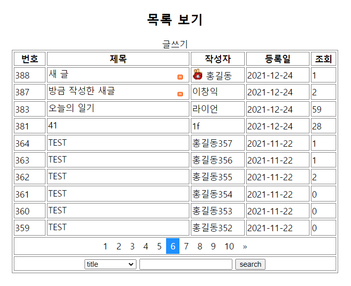

# 12.24

**[게시판]**

글쓰기저장은 왜 POST 에 포워딩이 아니라 redirect 인가?


**Write.java**

1. 글 저장 로직 처리
   - request 이름 비밀번호 이메일 제목 내용 html 적용여부
   - BoardDTO dto
   - int BoardDAOImpl.insert(dto)
   - int 1 이면 리다이렉트
2. 리다이렉트 (글 목록)
   - 1이 아니면 오류처리 (추가)


**List.java**

1. 글  목록 로직처리
   - 현재페이지 (currentPage = 1)
   - BoardDAOImple.select(currentPage, numberPerPage)
   - request.setAttribute("list", list);
2. 포워딩 (list.jsp)


수료생 블로그: https://daspace.tistory.com/255?category=1171381


**문제**

글작성이 성공하면 alert 알람을 띄우자.

1. 글쓰기 성공이라는 경고창은 서버에서 띄울 수 없다. -> 신호는 줄 수 있다.


Q. 리다이렉트는 setAttribute 가 작동하지 않나?

A. 


**Write.java**

```java
if (rowCount == 1) {
    location += "?write=success";
}
```

**list.jsp**

```javascript
if ('${param.write}' == 'success') {
    alert("글 쓰기 완료!!!");
}
```

try-catch 에도 넣어보자.

EL `${param.write}` 는 서버주석처리 해야한다.

문자열인 경우 따옴표에 넣어야한다.


## **글보기**

list.jsp 페이지에서 보고자하는 게시글의 제목을 클릭.

+++ 클릭한 게시글의 글번호 (seq) 를 가지고 글보기 (Content.java) 서블릿 요청

`/jspPro/cstvsboard/content.html` -> Content.java 서블릿 호출


복습: 글 작성 후 페이지색칠, 페이지 선택 시 다음 글 표시


1. 해당 게시글 조회수 증가
2. 해당 게시글 정보 -> dto
3. request.setAttribute("dto", dto)


> 게시글을 못 불러왔을 경우 트랜잭션 처리: Service.java 


**트랜잭션처리 함수**

**conn.**

- `setAutoCommit(false)` 
- `commit` 
- `rollback` 


**Content.java**

```java
package days04.board;

import java.io.IOException;
import java.sql.Connection;
import java.sql.SQLException;
import java.util.ArrayList;

import javax.servlet.ServletException;
import javax.servlet.annotation.WebServlet;
import javax.servlet.http.HttpServlet;
import javax.servlet.http.HttpServletRequest;
import javax.servlet.http.HttpServletResponse;

import com.util.DBConn;

@WebServlet("/cstvsboard/content.html")
public class Content extends HttpServlet {
	private static final long serialVersionUID = 1L;
       
    public Content() {
        super();
    }

	protected void doGet(HttpServletRequest request, HttpServletResponse response) throws ServletException, IOException {
		System.out.println("> Content.doGet() 호출됨...");
		int seq = Integer.parseInt(request.getParameter("seq"));
		
		// 1. ?seq=401 -> BoardDTO dto -> request.setAttribute()
		
		// 
		Connection conn = DBConn.getConnection();
		BoardDAOImpl dao = new BoardDAOImpl(conn);
		BoardDTO dto = null;
		
		try {
			// **** 트랜잭션 처리 + 로그 처리: Service.java ****
//			conn.setAutoCommit(false);
			
			// ㄱ. 해당 게시글 조회수 증가
			dao.increaseReaded(seq);
			
			// ㄴ. 해당 게시글 정보 -> dto
			dto = dao.view(seq);
//			conn.commit();
			
			// ㄷ. request.setAttribute("dto", dto) -> ${dto}
			request.setAttribute("dto", dto);
		} catch (SQLException e) {
			System.out.println("> Content.java doGet() Exception...");
//			conn.rollback();
			e.printStackTrace();
		}
		DBConn.close();

		
		// 2. 포워딩
		String path = "/days04/board/content.jsp";
		request.getRequestDispatcher(path).forward(request, response);
	}

	protected void doPost(HttpServletRequest request, HttpServletResponse response) throws ServletException, IOException {
		doGet(request, response);
	}

}
```


**content.jsp**

```jsp
<%@ page contentType="text/html; charset=UTF-8" pageEncoding="UTF-8"%>
<%@taglib prefix="c" uri="http://java.sun.com/jsp/jstl/core"%>
<%@include file="/include.jspf" %>
<!DOCTYPE html>
<html>
<head>
<meta charset="UTF-8">
<meta name="viewport" content="width=device-width, initial-scale=1.0">
<script
	src="https://ajax.googleapis.com/ajax/libs/jquery/3.6.0/jquery.min.js"></script>
<style>
table {
	border-spacing: 3px;
	border-collapse: separate;
}

table, tr, td {
	border: solid 1px gray;
	/* border-radius: 3px;  
      padding:3px;   */
}

#tblContent {
	width: 600px;
}
</style>
<title>Insert title here</title>
</head>
<body>

	<h3>content.jsp</h3>

	<div align="center">
		<h2>내용보기</h2>
		<!-- <table id="tblContent" class="table"> -->
		<table id="tblContent">
			<tr>
				<td>이름</td>
				<td>${dto.writer }</td>
				<td>등록일</td>
				<td>${dto.writedate }</td>
			</tr>
			<tr>
				<td>Email</td>
				<td><a href="mailto:${dto.email }">${dto.email }</a></td>
				<td>조회</td>
				<td>${dto.readed }</td>
			</tr>
			<tr>
				<td>제목</td>
				<td colspan="3">${dto.title }</td>
			</tr>
			<tr>
				<td colspan="4"
					style="padding: 15px; height: 200px; text-align: left; vertical-align: top">
					${dto.content }
				</td>
			</tr>
			<tr>
				<td colspan="4" align="center">
					<a class="btn btn-secondary" href="<%=contextPath %>/cstvsboard/edit.html?seq=${dto.seq}" id="editLink">수정하기</a> 
					<a class="btn btn-secondary" href="<%=contextPath %>/cstvsboard/delete.html?seq=${dto.seq}" id="deleteLink">삭제하기</a> 
					<a class="btn btn-secondary" href="<%=contextPath %>/cstvsboard/list.html" id="homeLink">Home</a></td>
			</tr>
		</table>
	</div>

	<script>
		if ('${param.edit}' == 'success') {
		    alert("글 수정 완료!!!");
		} else if ('${param.edit}' == 'fail') {
		    alert("글 수정 실패!!!");
		}
	</script>
</body>
</html>
```


## **글수정**

- Edit.java 서블릿
- ?seq=401 dto
- edit.jsp 포워딩


**자바스크립트**

```javascript
history.back();
```


```javascript
$(":radio[name=tag value=${dto.tag}]").attr("checked", true);
```


```javascript
$(":radio[name=tag][value=${dto.tag}]").attr("checked", true);
```

> 다중선택자는 다음과 같이 대괄호를 한개로 쓸 수 없다. `[name=tag value=${dto.tag}]` 


**Edit.java**

```java
package days04.board;

import java.io.IOException;
import java.sql.Connection;
import java.sql.SQLException;

import javax.servlet.ServletException;
import javax.servlet.annotation.WebServlet;
import javax.servlet.http.HttpServlet;
import javax.servlet.http.HttpServletRequest;
import javax.servlet.http.HttpServletResponse;

import com.util.DBConn;

@WebServlet("/cstvsboard/edit.html")
public class Edit extends HttpServlet {
	private static final long serialVersionUID = 1L;
       
    public Edit() {
        super();
    }

	protected void doGet(HttpServletRequest request, HttpServletResponse response) throws ServletException, IOException {
		System.out.println("> Edit.doGet() 호출됨...");
		// 1. ?seq=401 -> BoardDTO dto -> request.setAttribute()
		int seq = Integer.parseInt(request.getParameter("seq"));
		
		// 
		Connection conn = DBConn.getConnection();
		BoardDAOImpl dao = new BoardDAOImpl(conn);
		BoardDTO dto = null;
		
		try {
			// 해당 게시글 번호의 정보를 dto 로 가져오면... view()
			dto = dao.view(seq);
			
			// ㄷ. request.setAttribute("dto", dto) -> ${dto}
			request.setAttribute("dto", dto);
		} catch (SQLException e) {
			System.out.println("> Content.java doGet() Exception...");
//			conn.rollback();
			e.printStackTrace();
		}
		DBConn.close();
		

		String path = "/days04/board/edit.jsp";
		request.getRequestDispatcher(path).forward(request, response);

	}

	// 수정된 게시글 정보를 update -> 글목록/글보기
	protected void doPost(HttpServletRequest request, HttpServletResponse response) throws ServletException, IOException {
		request.setCharacterEncoding("UTF-8");
		System.out.println("> Edit.doGet() 호출됨...");
		int seq = Integer.parseInt(request.getParameter("seq"));
		
		String pwd = request.getParameter("pwd");
		String email = request.getParameter("email");
		String title = request.getParameter("title");
		String content = request.getParameter("content");
		int tag = Integer.parseInt(request.getParameter("tag"));
		
		// BoardDTO dto
		BoardDTO dto = new BoardDTO();
		dto.setPwd(pwd);
		dto.setEmail(email);
		dto.setTitle(title);
		dto.setContent(content);
		dto.setTag(tag);
		dto.setSeq(seq);
		
		//
		Connection conn = DBConn.getConnection();
		BoardDAOImpl dao = new BoardDAOImpl(conn);
		int rowCount = 0;
		
		try {
			rowCount = dao.update(dto);
			request.setAttribute("insert", true);
		} catch (SQLException e) {
			System.out.println("> Edit.java doPost() Exception...");
			e.printStackTrace();
		}
		DBConn.close();

		
		// 2. 리다이렉트 (글 목록)
		String location = "/jspPro3/cstvsboard/content.html?seq=" + seq;
		
		if (rowCount == 1) location += "&edit=success";
		else location += "&edit=fail";
		
		response.sendRedirect(location);
	}
}
```


**edit.jsp**

```jsp
<%@ page contentType="text/html; charset=UTF-8" pageEncoding="UTF-8"%>
<%@taglib prefix="c" uri="http://java.sun.com/jsp/jstl/core"%>
<%@include file="/include.jspf" %>
<!DOCTYPE html>
<html>
<head>
<meta charset="UTF-8">
<meta name="viewport" content="width=device-width, initial-scale=1.0">
<script
	src="https://ajax.googleapis.com/ajax/libs/jquery/3.6.0/jquery.min.js"></script>
<style>
table, td, th {
	border: solid 1px gray;
}

table {
	border-spacing: 3px;
	border-collapse: separate;
}

table, tr, td {
	/* border-radius: 3px; */
	/*  padding:3px;  */
	
}

table {
	width: 600px;
}
</style>
<title>Insert title here</title>
</head>
<body>

	<div align="center">
      <h2>수정하기</h2>
      <!--  http://localhost/jspPro/cstvsboard/edit.htm?seq=146 -->
      <form method="post">
         <table>
            <tr>
               <td colspan="2" align="center"><b>글을 수정합니다</b></td>
            </tr>
            <tr>
               <td align="center">이름</td>
               <td>
                 <input type="text" readonly name="writer" size="15" value="${dto.writer }">
               </td>
            </tr>
            <tr>
               <td align="center">Email</td>
               <td>
                 <input type="email" name="email" size="50" value="${dto.email }">
               </td>
            </tr>
            <tr>
               <td align="center">제목</td>
               <td>
                 <input type="text" name="title" size="50"   value="${dto.title }">
               </td>
            </tr>
            <tr>
               <td align="center">내용</td>
               <td><textarea name="content" cols="50" rows="10">${dto.content }</textarea>
               </td>
            </tr>
            <tr>
               <td align="center">HTML</td>
               <td>
               		tag: ${dto.tag }
                  <input type="radio" name="tag" value="1">적용
                  <input type="radio" name="tag" value="0">비적용
                  <script>
                  	$(":radio[name=tag][value=${dto.tag}]").attr("checked", true);
                  </script>
                   </td>
            </tr>
            <tr>
               <td align="center">비밀번호</td>
               <td><input type="password" name="pwd" size="15"></td>
            </tr>
            <tr>
               <td colspan="2" align="center">
                 <input type="submit" value="작성 완료">
                 &nbsp;&nbsp; 
                 <input type="button" onClick="history.back();" value="이전으로">
               </td>
            </tr>
         </table>
      </form>
   </div>
</body>
</html>
```


```java
request.setCharacterEncoding("UTF-8");
```

UTF-8 이 소문자여도 상관없다.

## 글삭제

1. 삭제버튼 클릭
2. Delete.java 서블릿 doGet() {
3. list.html 요청 -> list.jsp
4. Delete.java -> doPost() {
   - ?seq=890
   - pwd


**Delete.java**

```java
package days04.board;

import java.io.IOException;
import java.sql.Connection;
import java.sql.SQLException;

import javax.servlet.ServletException;
import javax.servlet.annotation.WebServlet;
import javax.servlet.http.HttpServlet;
import javax.servlet.http.HttpServletRequest;
import javax.servlet.http.HttpServletResponse;

import com.util.DBConn;

@WebServlet("/cstvsboard/delete.html")
public class Delete extends HttpServlet {
	private static final long serialVersionUID = 1L;
    public Delete() {}

	protected void doGet(HttpServletRequest request, HttpServletResponse response) throws ServletException, IOException {
		System.out.println("> Delete.doGet() 호출됨...");
		
		int seq = Integer.parseInt(request.getParameter("seq"));
		
		// 포워딩.
		String path = "/days04/board/delete.jsp";
//		String path = "/cstvsboard/content.html";
		request.getRequestDispatcher(path).forward(request, response);
	}

	protected void doPost(HttpServletRequest request, HttpServletResponse response) throws ServletException, IOException {
		request.setCharacterEncoding("utf-8");
		
		// ?seq=890
		// pwd
		int rowCount = 0;
		int seq = Integer.parseInt(request.getParameter("seq"));
		String pwd = request.getParameter("pwd"); // 입력받은 비밀번호
		
		
		Connection conn = DBConn.getConnection();
		BoardDAOImpl dao = new BoardDAOImpl(conn);
		BoardDTO dto = null;
		
		
		try {
			// 해당 게시글 번호의 정보를 dto 로 가져오면... view()
			dto = dao.view(seq);
			String originalPwd = dto.getPwd();
			
			if (!pwd.equals(originalPwd)) {
				request.setAttribute("error", "비밀번호가 틀립니다.");
				doGet(request, response);
				return;
			} 
			
			// 삭제 -> 페이지이동
			rowCount = dao.delete(seq);
		} catch (SQLException e) {
			System.out.println("> Delete.java doPost() Exception...");
//			conn.rollback();
			e.printStackTrace();
		}
		DBConn.close();
		
		// 리다이렉트
		String location = "/jspPro3/cstvsboard/list.html";
		if (rowCount == 1) location += "?delete=success";
		response.sendRedirect(location);

	}
}
```

**delete.jsp**

```jsp
<%@ page contentType="text/html; charset=UTF-8" pageEncoding="UTF-8"%>
<%@taglib prefix="c" uri="http://java.sun.com/jsp/jstl/core"%>
<%@include file="/include.jspf"%>
<!DOCTYPE html>
<html>
<head>
<meta charset="UTF-8">
<meta name="viewport" content="width=device-width, initial-scale=1.0">
<script
	src="https://ajax.googleapis.com/ajax/libs/jquery/3.6.0/jquery.min.js"></script>
<style>
table, td, th {
	border: solid 1px gray;
}

table {
	border-spacing: 3px;
	border-collapse: separate;
}

table, tr, td {
	/* border-radius: 3px; */
	/* padding:3px;  */
	
}

table {
	width: 600px;
}
</style>
<title>Insert title here</title>
</head>
<body>

	<h3>delete.jsp</h3>

	<div align="center">
		<h2>삭제하기</h2>
		<form method="post">
			<table>
				<tr>
					<td colspan="2" align="center"><b>글을 삭제합니다</b></td>
				</tr>
				<tr>
					<td align="center">비밀번호</td>
					<td><input type="password" name="pwd" size="15"
						autofocus="autofocus"></td>
				</tr>
				<tr>
					<td colspan="2" align="center">
					<input type="submit" value="삭제">&nbsp;&nbsp;
						<input type="button" id="cancel" value="취소"></td>
				</tr>
			</table>
		</form>
	</div>
	
	
<%
	// ?error=비밀~~
	String error = (String) request.getAttribute("error");
	if (error != null) {
%>
	<script>
		alert("<%=error%>");
	</script>
<% 
	}
%>

	<script>
		$("#cancel").on("click", function(event) {
			location.href = "${pageContext.request.contextPath}/cstvsboard/content.html?seq=${param.seq}";
		});
	</script>
</body>
</html>
```


**리다이렉트**

```java
String location = "/jspPro/cstvsboard/list.html";
if (rowCount == 1) location += "?delete=success";
response.sendRedirect(location);
```

> 리다이렉트는 프로젝트경로도 추가해야 한다.


> a태그로 넘기면 기본 get 방식으로 넘어간다.


**getParameter vs getAttribute**


**문제**

취소버튼 누르면 돌아오기

**delete.jsp**

```javascript
$("#cancel").click(function() {
    $(location).attr("href", "<%=contextPath%>/cstvsboard/content.html?seq=${param.seq}");
});
```

> URL 에 붙는 것은 파라미터이다.

**쌤코드**

```javascript
$("#cancel").on("click", function(event) {
    location.href = "${pageContext.request.contextPath}/cstvsboard/content.html?seq=${param.seq}";
});
```

- `${pageContext.request.contextPath}`  
- `request.getContextPath();` 같은코드이다.


content.jsp 복사 붙이기 -> content02.jsp

- content.jsp 파일수정
- [삭제하기] 버튼을 클릭하면 삭제하는 모달창을 띄우기.

### 모달창


> 스크립트 태그가 HTML 코드보다 아래에 있어야 한다.


**content.jsp**

```jsp
<%@ page contentType="text/html; charset=UTF-8" pageEncoding="UTF-8"%>
<%@taglib prefix="c" uri="http://java.sun.com/jsp/jstl/core"%>
<%@include file="/include.jspf"%>
<!DOCTYPE html>
<html>
<head>
<meta charset="UTF-8">
<meta name="viewport" content="width=device-width, initial-scale=1.0">

<link rel="stylesheet"
	href="//code.jquery.com/ui/1.12.1/themes/base/jquery-ui.css">
<link rel="stylesheet" href="/resources/demos/style.css">
<script src="https://code.jquery.com/jquery-1.12.4.js"></script>
<script src="https://code.jquery.com/ui/1.12.1/jquery-ui.js"></script>


<style>
table {
	border-spacing: 3px;
	border-collapse: separate;
}

table, tr, td {
	border: solid 1px gray;
	/* border-radius: 3px;  
      padding:3px;   */
}

#tblContent {
	width: 600px;
}
</style>
<title>Insert title here</title>
</head>
<body>

	<h3>content.jsp</h3>

	<div align="center">
		<h2>내용보기</h2>
		<!-- <table id="tblContent" class="table"> -->
		<table id="tblContent">
			<tr>
				<td>이름</td>
				<td>${dto.writer }</td>
				<td>등록일</td>
				<td>${dto.writedate }</td>
			</tr>
			<tr>
				<td>Email</td>
				<td><a href="mailto:${dto.email }">${dto.email }</a></td>
				<td>조회</td>
				<td>${dto.readed }</td>
			</tr>
			<tr>
				<td>제목</td>
				<td colspan="3">${dto.title }</td>
			</tr>
			<tr>
				<td colspan="4"
					style="padding: 15px; height: 200px; text-align: left; vertical-align: top">
					${dto.content }</td>
			</tr>
			<tr>
				<td colspan="4" align="center">
					<a class="btn btn-secondary"
						href="<%=contextPath %>/cstvsboard/edit.html?seq=${dto.seq}"
						id="editLink">수정하기</a> 
					<a class="btn btn-secondary"
						href="<%=contextPath %>/cstvsboard/delete.html?seq=${dto.seq}"
						id="deleteLink">삭제하기</a> 
					<a class="btn btn-secondary"
						href="<%=contextPath%>/cstvsboard/list.html" id="homeLink">Home</a>
					<input type="button" class="btn btn-secondary" 
						id="btnModalDelete" value="모달창으로 글삭제"  />
				</td>
			</tr>
		</table>
	</div>

	<!-- 삭제 모달창 div -->
	<div id="dialog-form" align="center" title="삭제">
		<h2>삭제하기</h2>
		<form method="post" action="<%=contextPath%>/cstvsboard/delete.html">
			<table>
				<tr>
					<td colspan="2" align="center"><b>글을 삭제합니다</b></td>
				</tr>
				<tr>
					<td align="center">비밀번호</td>
					<td>
						<input type="password" name="pwd" size="15" 
							autofocus="autofocus">
					</td>
				</tr>
				<tr>
					<td colspan="2" align="center">
						<input type="submit" value="삭제">&nbsp;&nbsp;
						<input type="button" id="cancel" value="취소">
					</td>
				</tr>
			</table>
			<input type="hidden" name="seq" value="${param.seq }" />
		</form>

	</div>
	
		<script>
		// 1. 
		dialog = $("#dialog-form").dialog({
			autoOpen: false,
		      height: 400,
		      width: 350,
		      modal: true,
		      buttons:{},
		      close: function (){
		         form[0].reset();
		      }
		});
		
		// 2.
		form = dialog.find("form");
	
		// 모달창 관련 스크립트 코딩
		$("#btnModalDelete").on("click", function(event) {
			dialog.dialog("open");
		});
		
		$("#cancel").on("click", function(event) {
			dialog.dialog("close");
		});
	</script>

	<script>
		if ('${param.edit}' == 'success') {
			alert("글 수정 완료!!!");
		} else if ('${param.edit}' == 'fail') {
			alert("글 수정 실패!!!");
		}
	</script>
</body>
</html>
```


**Delete.java**

```java
package days04.board;

import java.io.IOException;
import java.sql.Connection;
import java.sql.SQLException;

import javax.servlet.ServletException;
import javax.servlet.annotation.WebServlet;
import javax.servlet.http.HttpServlet;
import javax.servlet.http.HttpServletRequest;
import javax.servlet.http.HttpServletResponse;

import com.util.DBConn;

@WebServlet("/cstvsboard/delete.html")
public class Delete extends HttpServlet {
	private static final long serialVersionUID = 1L;
    public Delete() {}

	protected void doGet(HttpServletRequest request, HttpServletResponse response) throws ServletException, IOException {
		System.out.println("> Delete.doGet() 호출됨...");
		
		int seq = Integer.parseInt(request.getParameter("seq"));
		
		// 포워딩.
		String path = "/days04/board/delete.jsp";
		request.getRequestDispatcher(path).forward(request, response);
	}

	protected void doPost(HttpServletRequest request, HttpServletResponse response) throws ServletException, IOException {
		request.setCharacterEncoding("utf-8");
		
		// ?seq=890
		// pwd
		int rowCount = 0;
		int seq = Integer.parseInt(request.getParameter("seq"));
		String pwd = request.getParameter("pwd"); // 입력받은 비밀번호
		
		
		Connection conn = DBConn.getConnection();
		BoardDAOImpl dao = new BoardDAOImpl(conn);
		BoardDTO dto = null;
		
		
		try {
			// 해당 게시글 번호의 정보를 dto 로 가져오면... view()
			dto = dao.view(seq);
			String originalPwd = dto.getPwd();
			
			if (!pwd.equals(originalPwd)) {
				request.setAttribute("error", "비밀번호가 틀립니다.");
				doGet(request, response);
				return;
			} 
			
			// 삭제 -> 페이지이동
			rowCount = dao.delete(seq);
		} catch (SQLException e) {
			System.out.println("> Delete.java doPost() Exception...");
//			conn.rollback();
			e.printStackTrace();
		}
		DBConn.close();
		
		// 리다이렉트
		String location = "/jspPro3/cstvsboard/list.html";
		if (rowCount == 1) location += "?delete=success";
		response.sendRedirect(location);

	}
}
```


(6) 게시글 작성한 시간이 한시간이 안지났다면 게시글 앞에 뉴라는 마크 (이미지)

## 새글


**list.jsp**

```jsp
<%@ page contentType="text/html; charset=UTF-8" pageEncoding="UTF-8"%>
<%@ taglib prefix="c" uri="http://java.sun.com/jsp/jstl/core" %>
<%@ include file="/include.jspf" %>

<!DOCTYPE html>
<html>
<head>
<meta charset="UTF-8">
<title>Insert title here</title>
<meta name="viewport" content="width=device-width, initial-scale=1.0">
<title>2021. 12. 23. - 오후 3:06:20</title>
<link rel="icon" type="image/x-icon" href="../images/SiSt.ico">
<script src="https://ajax.googleapis.com/ajax/libs/jquery/3.6.0/jquery.min.js"></script> 

<style>
table, td, th {
   border: solid 1px gray;
}

table {
   border-spacing: 3px;
   border-collapse: separate;
}

table, tr, td {
   /* border-radius: 3px; */
   /* padding:3px;  */
   
}

tbody tr  td:nth-of-type(2) {
   text-align: left;
}

a {
   text-decoration: none;
   color: black;
}

a:hover {
   color: red;
}
</style>
<!-- 페이징 처리 style -->
<style>
.pagination {
   margin: 0 auto;
   display: flex;
   justify-content: center;
}

.pagination a {
   color: black;
   float: left;
   padding: 4px 8px;
   text-decoration: none;
   transition: background-color .3s;
}

.pagination a.active {
   background-color: dodgerblue;
   color: white;
}

.pagination a:hover:not (.active ) {
   background-color: #ddd;
}
</style>
<style>
.searchWord {
   background-color: yellow;
   color: red;
}
</style>
<style>
.title {
   display: inline-block;
   white-space: nowrap;
   width: 90%;
   overflow: hidden;
   text-overflow: ellipsis;
}
</style>

</head>
<body>

<h3>list.jsp</h3>

<div align="center">
  <h2>목록 보기</h2>
  <a href="<%=contextPath %>/cstvsboard/write.html">글쓰기</a>
  <table style="width:600px;">
    <thead>
      <tr>
        <th width="10%">번호</th>
        <th width="45%">제목</th>
        <th width="17%">작성자</th>
        <th width="20%">등록일</th>
        <th width="10%">조회</th>
      </tr>
    </thead>
    <tbody>     
      <c:if test="${ empty list }">
        <tr>
          <td colspan="5">등록된 게시글이 없습니다.</td>
        </tr>
      </c:if>
      <c:if test="${ not empty list }">
         <c:forEach items="${ list }" var="dto" end="9">
            <tr>
              <td>${ dto.seq }</td>
              <td>
              	<a class="title" 
              		href="<%=contextPath %>/cstvsboard/content.html?seq=${dto.seq}">
              		${ dto.title }</a>
              		<c:if test="${dto.newmark }">
              			/days04/board/images/ico-new.gif" alt="" />
              		</c:if>
              </td>
              <td>
              	<c:if test="${dto.writer == '홍길동' }">
              		/days04/board/images/star.gif" alt="" />
              	</c:if>
              <a href="mailto:${dto.email }">${ dto.writer }</a></td>
              <td>${ dto.writedate }</td>
              <td>${ dto.readed }</td>
            </tr>
         </c:forEach>         
      </c:if>      
  
    </tbody>
    <tfoot>
      <tr>
        <td colspan="5" align="center">
           <div class="pagination"> 
            <!--  <a href="#" class="active"> 1 </a>   -->
             <a href="#"> 1 </a>  
             <a href="#"> 2 </a>
             <a href="#"> 3 </a>
             <a href="#"> 4 </a>
             <a href="#"> 5 </a>
             <a href="#"> 6 </a>
             <a href="#"> 7 </a>
             <a href="#""> 8 </a>
             <a href="#"> 9 </a>
             <a href="#"> 10 </a>
             <a href="#"> &raquo; </a>         
           </div>     
        </td>
      </tr>    
      <tr>
        <td colspan="5" align="center">
          <form>
            <select name="searchCondition" id="searchCondition">
              <option value="1">title</option>
              <option value="2">content</option>
              <option value="3">writer</option>
              <option value="4">title+content</option>
            </select>
            <input type="text" name="searchWord" id="searchWord" />
            <input type="submit" value="search" />
          </form>
        </td>
      </tr> 
    </tfoot>
  </table>
</div>

<script>
	if ('${param.delete}' == 'success') {
		alert("글 삭제 완료!!!");
	} 
</script>

<script>
	// ?write=success 
	if ('${param.write}' == 'success') {
		alert("글 쓰기 완료!!!");
	}
</script>

<script>
  $(".pagination a").each(function(i, element) {     
     $(this).removeClass("active");     
       if ( $(element).text().trim() == ${ empty param.currentPage ? '1' : param.currentPage } ){
          $(this)
             .addClass("active")
             .attr("href" , "#" );          
       }else{
        $(this).attr("href" , "<%= contextPath %>/cstvsboard/list.html?currentPage=" + $(element).text().trim() );
       }  
  })
</script>
</body>
</html>
```


## 작성자아이콘



```jsp
<%@ page contentType="text/html; charset=UTF-8" pageEncoding="UTF-8"%>
<%@ taglib prefix="c" uri="http://java.sun.com/jsp/jstl/core" %>
<%@ include file="/include.jspf" %>

<!DOCTYPE html>
<html>
<head>
<meta charset="UTF-8">
<title>Insert title here</title>
<meta name="viewport" content="width=device-width, initial-scale=1.0">
<title>2021. 12. 23. - 오후 3:06:20</title>
<link rel="icon" type="image/x-icon" href="../images/SiSt.ico">
<script src="https://ajax.googleapis.com/ajax/libs/jquery/3.6.0/jquery.min.js"></script> 

<style>
table, td, th {
   border: solid 1px gray;
}

table {
   border-spacing: 3px;
   border-collapse: separate;
}

table, tr, td {
   /* border-radius: 3px; */
   /* padding:3px;  */
   
}

tbody tr  td:nth-of-type(2) {
   text-align: left;
}

a {
   text-decoration: none;
   color: black;
}

a:hover {
   color: red;
}
</style>
<!-- 페이징 처리 style -->
<style>
.pagination {
   margin: 0 auto;
   display: flex;
   justify-content: center;
}

.pagination a {
   color: black;
   float: left;
   padding: 4px 8px;
   text-decoration: none;
   transition: background-color .3s;
}

.pagination a.active {
   background-color: dodgerblue;
   color: white;
}

.pagination a:hover:not (.active ) {
   background-color: #ddd;
}
</style>
<style>
.searchWord {
   background-color: yellow;
   color: red;
}
</style>
<style>
.title {
   display: inline-block;
   white-space: nowrap;
   width: 90%;
   overflow: hidden;
   text-overflow: ellipsis;
}
</style>

</head>
<body>

<h3>list.jsp</h3>

<div align="center">
  <h2>목록 보기</h2>
  <a href="<%=contextPath %>/cstvsboard/write.html">글쓰기</a>
  <table style="width:600px;">
    <thead>
      <tr>
        <th width="10%">번호</th>
        <th width="45%">제목</th>
        <th width="17%">작성자</th>
        <th width="20%">등록일</th>
        <th width="10%">조회</th>
      </tr>
    </thead>
    <tbody>     
      <c:if test="${ empty list }">
        <tr>
          <td colspan="5">등록된 게시글이 없습니다.</td>
        </tr>
      </c:if>
      <c:if test="${ not empty list }">
         <c:forEach items="${ list }" var="dto" end="9">
            <tr>
              <td>${ dto.seq }</td>
              <td>
              	<a class="title" 
              		href="<%=contextPath %>/cstvsboard/content.html?seq=${dto.seq}">
              		${ dto.title }</a>
              		<c:if test="${dto.newmark }">
              			/days04/board/images/ico-new.gif" alt="" />
              		</c:if>
              </td>
              <td>
              	<c:if test="${dto.writer == '홍길동' }">
              		/days04/board/images/star.gif" alt="" />
              	</c:if>
              <a href="mailto:${dto.email }">${ dto.writer }</a></td>
              <td>${ dto.writedate }</td>
              <td>${ dto.readed }</td>
            </tr>
         </c:forEach>         
      </c:if>      
  
    </tbody>
    <tfoot>
      <tr>
        <td colspan="5" align="center">
           <div class="pagination"> 
            <!--  <a href="#" class="active"> 1 </a>   -->
             <a href="#"> 1 </a>  
             <a href="#"> 2 </a>
             <a href="#"> 3 </a>
             <a href="#"> 4 </a>
             <a href="#"> 5 </a>
             <a href="#"> 6 </a>
             <a href="#"> 7 </a>
             <a href="#""> 8 </a>
             <a href="#"> 9 </a>
             <a href="#"> 10 </a>
             <a href="#"> &raquo; </a>         
           </div>     
        </td>
      </tr>    
      <tr>
        <td colspan="5" align="center">
          <form>
            <select name="searchCondition" id="searchCondition">
              <option value="1">title</option>
              <option value="2">content</option>
              <option value="3">writer</option>
              <option value="4">title+content</option>
            </select>
            <input type="text" name="searchWord" id="searchWord" />
            <input type="submit" value="search" />
          </form>
        </td>
      </tr> 
    </tfoot>
  </table>
</div>

<script>
	if ('${param.delete}' == 'success') {
		alert("글 삭제 완료!!!");
	} 
</script>

<script>
	// ?write=success 
	if ('${param.write}' == 'success') {
		alert("글 쓰기 완료!!!");
	}
</script>

<script>
  $(".pagination a").each(function(i, element) {     
     $(this).removeClass("active");     
       if ( $(element).text().trim() == ${ empty param.currentPage ? '1' : param.currentPage } ){
          $(this)
             .addClass("active")
             .attr("href" , "#" );          
       }else{
        $(this).attr("href" , "<%= contextPath %>/cstvsboard/list.html?currentPage=" + $(element).text().trim() );
       }  
  })
</script>
</body>
</html>
```


## 페이징블럭

(7) 페이징블럭 1 2 3 4 5 6 7 8 9 10


1. PageBlock.java

**페이징블럭**

```jsp
<c:if test="${ pageBlock.prev }"> 
    <a href="${  pageContext.request.contextPath }/cstvsboard/list.html?currentPage=${ pageBlock.start -1 }">&laquo;</a> 
</c:if>
<c:forEach begin="${ pageBlock.start }" end="${ pageBlock.end }" step="1" var="i">
    <c:if test="${ i == currentPage }">
        <a href="#">${i}</a>
    </c:if>
    <c:if test="${ i != currentPage }">
        <a href="${  pageContext.request.contextPath }/cstvsboard/list.html?currentPage=${ i }">${ i }</a> 
    </c:if>
</c:forEach>
<c:if test="${ pageBlock.next }"> 
    <a href="${  pageContext.request.contextPath }/cstvsboard/list.html?currentPage=${ pageBlock.end +1 }">&raquo;</a> 
</c:if> 
```


**list.jsp**

```jsp
<%@ page contentType="text/html; charset=UTF-8" pageEncoding="UTF-8"%>
<%@ taglib prefix="c" uri="http://java.sun.com/jsp/jstl/core" %>
<%@ include file="/include.jspf" %>

<!DOCTYPE html>
<html>
<head>
<meta charset="UTF-8">
<title>Insert title here</title>
<meta name="viewport" content="width=device-width, initial-scale=1.0">
<title>2021. 12. 23. - 오후 3:06:20</title>
<link rel="icon" type="image/x-icon" href="../images/SiSt.ico">
<script src="https://ajax.googleapis.com/ajax/libs/jquery/3.6.0/jquery.min.js"></script> 

<style>
table, td, th {
   border: solid 1px gray;
}

table {
   border-spacing: 3px;
   border-collapse: separate;
}

table, tr, td {
   /* border-radius: 3px; */
   /* padding:3px;  */
   
}

tbody tr  td:nth-of-type(2) {
   text-align: left;
}

a {
   text-decoration: none;
   color: black;
}

a:hover {
   color: red;
}
</style>
<!-- 페이징 처리 style -->
<style>
.pagination {
   margin: 0 auto;
   display: flex;
   justify-content: center;
}

.pagination a {
   color: black;
   float: left;
   padding: 4px 8px;
   text-decoration: none;
   transition: background-color .3s;
}

.pagination a.active {
   background-color: dodgerblue;
   color: white;
}

.pagination a:hover:not (.active ) {
   background-color: #ddd;
}
</style>
<style>
.searchWord {
   background-color: yellow;
   color: red;
}
</style>
<style>
.title {
   display: inline-block;
   white-space: nowrap;
   width: 90%;
   overflow: hidden;
   text-overflow: ellipsis;
}
</style>

</head>
<body>

<h3>list.jsp</h3>

<div align="center">
  <h2>목록 보기</h2>
  <a href="<%=contextPath %>/cstvsboard/write.html">글쓰기</a>
  <table style="width:600px;">
    <thead>
      <tr>
        <th width="10%">번호</th>
        <th width="45%">제목</th>
        <th width="17%">작성자</th>
        <th width="20%">등록일</th>
        <th width="10%">조회</th>
      </tr>
    </thead>
    <tbody>     
      <c:if test="${ empty list }">
        <tr>
          <td colspan="5">등록된 게시글이 없습니다.</td>
        </tr>
      </c:if>
      <c:if test="${ not empty list }">
         <c:forEach items="${ list }" var="dto" end="9">
            <tr>
              <td>${ dto.seq }</td>
              <td>
              	<a class="title" 
              		href="<%=contextPath %>/cstvsboard/content.html?seq=${dto.seq}">
              		${ dto.title }</a>
              		<c:if test="${dto.newmark }">
              			/days04/board/images/ico-new.gif" alt="" />
              		</c:if>
              </td>
              <td>
              	<c:if test="${dto.writer == '홍길동' }">
              		/days04/board/images/star.gif" alt="" />
              	</c:if>
              <a href="mailto:${dto.email }">${ dto.writer }</a></td>
              <td>${ dto.writedate }</td>
              <td>${ dto.readed }</td>
            </tr>
         </c:forEach>         
      </c:if>      
  
    </tbody>
    <tfoot>
      <tr>
        <td colspan="5" align="center">
           <div class="pagination"> 
            <!--  <a href="#" class="active"> 1 </a>   -->
            <!-- 
             <a href="#"> 1 </a>  
             <a href="#"> 2 </a>
             <a href="#"> 3 </a>
             <a href="#"> 4 </a>
             <a href="#"> 5 </a>
             <a href="#"> 6 </a>
             <a href="#"> 7 </a>
             <a href="#""> 8 </a>
             <a href="#"> 9 </a>
             <a href="#"> 10 </a>
             <a href="#"> &raquo; </a>         
              -->
              
			<c:if test="${ pageBlock.prev }"> 
               <a href="${  pageContext.request.contextPath }/cstvsboard/list.html?currentPage=${ pageBlock.start -1 }">&laquo;</a> 
            </c:if>
            <c:forEach begin="${ pageBlock.start }" end="${ pageBlock.end }" step="1" var="i">
              <c:if test="${ i == currentPage }">
                <a href="#">${i}</a>
              </c:if>
              <c:if test="${ i != currentPage }">
                 <a href="${  pageContext.request.contextPath }/cstvsboard/list.html?currentPage=${ i }">${ i }</a> 
              </c:if>
            </c:forEach>
            <c:if test="${ pageBlock.next }"> 
               <a href="${  pageContext.request.contextPath }/cstvsboard/list.html?currentPage=${ pageBlock.end +1 }">&raquo;</a> 
            </c:if> 
            
            
                          
           </div>     
        </td>
      </tr>    
      <tr>
        <td colspan="5" align="center">
          <form>
            <select name="searchCondition" id="searchCondition">
              <option value="1">title</option>
              <option value="2">content</option>
              <option value="3">writer</option>
              <option value="4">title+content</option>
            </select>
            <input type="text" name="searchWord" id="searchWord" />
            <input type="submit" value="search" />
          </form>
        </td>
      </tr> 
    </tfoot>
  </table>
</div>

<script>
	if ('${param.delete}' == 'success') {
		alert("글 삭제 완료!!!");
	} 
</script>

<script>
	// ?write=success 
	if ('${param.write}' == 'success') {
		alert("글 쓰기 완료!!!");
	}
</script>

<script>

  $(".pagination a").each(function(i, element) {     
     $(this).removeClass("active");     
       if ( $(element).text().trim() == ${ empty param.currentPage ? '1' : param.currentPage } ){
          $(this).addClass("active")
       } 
  });
</script>
</body>
</html>
```

**PageBlock.java**

```java
package days04.board;

public class PageBlock {
	private int currentPage;
	private int numberPerPage = 10;
	private int numberOfPageBlock = 10;
	private int start, end; // 11 ~ 20 startOfPageBlock, endOfPageBlock
	private boolean prev, next;

	public int getCurrentPage() {
		return currentPage;
	}

	public void setCurrentPage(int currentPage) {
		this.currentPage = currentPage;
	}

	public int getNumberPerPage() {
		return numberPerPage;
	}

	public void setNumberPerPage(int numberPerPage) {
		this.numberPerPage = numberPerPage;
	}

	public int getNumberOfPageBlock() {
		return numberOfPageBlock;
	}

	public void setNumberOfPageBlock(int numberOfPageBlock) {
		this.numberOfPageBlock = numberOfPageBlock;
	}

	public int getStart() {
		return start;
	}

	public void setStart(int start) {
		this.start = start;
	}

	public int getEnd() {
		return end;
	}

	public void setEnd(int end) {
		this.end = end;
	}

	public boolean isPrev() {
		return prev;
	}

	public void setPrev(boolean prev) {
		this.prev = prev;
	}

	public boolean isNext() {
		return next;
	}

	public void setNext(boolean next) {
		this.next = next;
	}

}

```

**List.java**

```java
package days04.board;

import java.io.IOException;
import java.sql.Connection;
import java.sql.SQLException;
import java.util.ArrayList;

import javax.servlet.RequestDispatcher;
import javax.servlet.ServletException;
import javax.servlet.annotation.WebServlet;
import javax.servlet.http.HttpServlet;
import javax.servlet.http.HttpServletRequest;
import javax.servlet.http.HttpServletResponse;

import com.util.DBConn;

@WebServlet("/cstvsboard/list.html")
public class List extends HttpServlet {
   private static final long serialVersionUID = 1L;
   
    public List() {
        super();
    }
     
   // ?currentPage=2
   protected void doGet(HttpServletRequest request, HttpServletResponse response) throws ServletException, IOException {
      int currentPage = 1;     // 현재 페이지 번호
      int numberPerPage = 10;  // 한 페이지 출력할 게시글 수
      int numberOfPageBlock = 10;  // 페이징블럭 수
      
      System.out.println("> List.doGet() 호출됨...");
      // 1. 글목록 로직 처리
      //    ㄱ. 현재페이지 ( currentPage = 1 )
      //    ㄴ. list = BoardDAOImpe.select(currentPage,numberPerPage )
      //    ㄷ. request.setAttribute("list",list);
      // 2.포워딩( list.jsp) 
      Connection conn = DBConn.getConnection();
      BoardDAOImpl dao = new BoardDAOImpl(conn);
      ArrayList<BoardDTO> list  = null;
      
      int totalRecords , totalPages = 0; // [1] 페이징처리
      
      try {
         // list = dao.select();      
         try {             currentPage = Integer.parseInt( request.getParameter("currentPage") );         }
         catch(Exception e) {         }
         
         list = dao.select(currentPage, numberPerPage);
         // 총레코드수  [2] 페이지 처리
         // 총페이지수
         totalRecords = dao.getTotalRecords();
         totalPages =  (int)Math.ceil( (double)totalRecords/numberPerPage );  // 총페이지수
         
         request.setAttribute("list", list);
      } catch (SQLException e) {
         System.out.println("> List.java doGet() Exception ...");
         e.printStackTrace();
      }      
      DBConn.close();      
      
      // [3] 페이징 처리
      PageBlock pageBlock = new PageBlock();
                  pageBlock.setCurrentPage( currentPage );
                  pageBlock.setNumberPerPage( numberPerPage);
                  pageBlock.setNumberOfPageBlock( numberOfPageBlock);                  
                  // start   end
                  int start = (currentPage-1)/numberOfPageBlock*numberOfPageBlock + 1;
                  pageBlock.setStart(start);
                  int end = start + numberOfPageBlock -1;
                  if( end > totalPages ) end = totalPages;
                  pageBlock.setEnd(end);
                  
                  if( start != 1 ) pageBlock.setPrev(true);
                  if( end != totalPages ) pageBlock.setNext(true);
      
      request.setAttribute("pageBlock", pageBlock);
      // 2. 포워딩
      String path = "/days04/board/list.jsp";
      RequestDispatcher dispatcher = request.getRequestDispatcher(path);
      dispatcher.forward(request, response);
   }

   protected void doPost(HttpServletRequest request, HttpServletResponse response) throws ServletException, IOException {
      doGet(request, response);
   }

}
```


- list.html (글목록) -> List.java (서블릿) -> list.jsp 
  - 웹컨테이너 (List.java list.jsp 서블릿객체생성 -인스턴스)
- list.html (글목록 10) -> List.java (서블릿) -> list.jsp


## 검색

```
http://localhost/jspPro/cstvsboard/list.html?searchCondition=1&searchWord=aaa
```

aaa 라고 검색 시

**list.jsp**

```jsp
<div align="center">
  <h2>목록 보기</h2>
  <a href="<%=contextPath %>/cstvsboard/write.html">글쓰기</a>
  <table style="width:600px;">
    <thead>
      <tr>
        <th width="10%">번호</th>
        <th width="45%">제목</th>
        <th width="17%">작성자</th>
        <th width="20%">등록일</th>
        <th width="10%">조회</th>
      </tr>
    </thead>
    <tbody>     
      <c:if test="${ empty list }">
        <tr>
          <td colspan="5">등록된 게시글이 없습니다.</td>
        </tr>
      </c:if>
      <c:if test="${ not empty list }">
         <c:forEach items="${ list }" var="dto" end="9">
            <tr>
              <td>${ dto.seq }</td>
              <td>
              	<a class="title" 
              		href="<%=contextPath %>/cstvsboard/content.html?seq=${dto.seq}">
              		${ dto.title }</a>
              		<c:if test="${dto.newmark }">
              			/days04/board/images/ico-new.gif" alt="" />
              		</c:if>
              </td>
              <td>
              	<c:if test="${dto.writer == '홍길동' }">
              		/days04/board/images/star.gif" alt="" />
              	</c:if>
              <a href="mailto:${dto.email }">${ dto.writer }</a></td>
              <td>${ dto.writedate }</td>
              <td>${ dto.readed }</td>
            </tr>
         </c:forEach>         
      </c:if>      
  
    </tbody>
    <tfoot>
      <tr>
        <td colspan="5" align="center">
           <div class="pagination">            
			<c:if test="${ pageBlock.prev }"> 
               <a href="${  pageContext.request.contextPath }/cstvsboard/list.html?currentPage=${ pageBlock.start -1 }">&laquo;</a> 
            </c:if>
            <c:forEach begin="${ pageBlock.start }" end="${ pageBlock.end }" step="1" var="i">
              <c:if test="${ i == currentPage }">
                <a href="#">${i}</a>
              </c:if>
              <c:if test="${ i != currentPage }">
                 <a href="${  pageContext.request.contextPath }/cstvsboard/list.html?currentPage=${ i }">${ i }</a> 
              </c:if>
            </c:forEach>
            <c:if test="${ pageBlock.next }"> 
               <a href="${  pageContext.request.contextPath }/cstvsboard/list.html?currentPage=${ pageBlock.end +1 }">&raquo;</a> 
            </c:if>               
           </div>     
        </td>
      </tr>    
      <tr>
        <td colspan="5" align="center">
          <form>
            <select name="searchCondition" id="searchCondition">
              <option value="1">title</option>
              <option value="2">content</option>
              <option value="3">writer</option>
              <option value="4">title+content</option>
            </select>
            <input type="text" name="searchWord" id="searchWord" />
            <input type="submit" value="search" />
          </form>
        </td>
      </tr> 
    </tfoot>
  </table>
</div>

<script>
	if ('${param.delete}' == 'success') {
		alert("글 삭제 완료!!!");
	} 
</script>

<script>
	// ?write=success 
	if ('${param.write}' == 'success') {
		alert("글 쓰기 완료!!!");
	}
</script>

<script>

  $(".pagination a").each(function(i, element) {     
     $(this).removeClass("active");     
       if ( $(element).text().trim() == ${ empty param.currentPage ? '1' : param.currentPage } ){
          $(this).addClass("active")
       } 
  });
</script>
```


**List.java**

```java

// ?currentPage=2
// http://localhost/jspPro/cstvsboard/list.html?searchCondition=1&searchWord=aaa
protected void doGet(HttpServletRequest request, HttpServletResponse response) throws ServletException, IOException {
    int currentPage = 1;     // 현재 페이지 번호
    int numberPerPage = 10;  // 한 페이지 출력할 게시글 수
    int numberOfPageBlock = 10;  // 페이징블럭 수

    System.out.println("> List.doGet() 호출됨...");
    // 1. 글목록 로직 처리
    //    ㄱ. 현재페이지 ( currentPage = 1 )
    //    ㄴ. list = BoardDAOImpe.select(currentPage,numberPerPage )
    //    ㄷ. request.setAttribute("list",list);
    // 2.포워딩( list.jsp) 
    Connection conn = DBConn.getConnection();
    BoardDAOImpl dao = new BoardDAOImpl(conn);
    ArrayList<BoardDTO> list  = null;

    int totalRecords , totalPages = 0; // [1] 페이징처리
    int searchCondition = 1; // 1, 2, 3, 4
    String searchWord = request.getParameter("searchWord") == null ? "" : request.getParameter("searchWord");

    try {
        // list = dao.select();      
        try { currentPage = Integer.parseInt( request.getParameter("currentPage")); } catch(Exception e) {}
        try { searchCondition = Integer.parseInt( request.getParameter("searchCondition")); } catch(Exception e) {}

        if (searchWord.equals("")) {
            list = dao.select(currentPage, numberPerPage);
            totalRecords = dao.getTotalRecords();
        } else {
            list = dao.search(currentPage, numberPerPage, searchCondition, searchWord);
            totalRecords = dao.getTotalRecords(searchCondition, searchWord);
        }

        // 총레코드수  [2] 페이지 처리
        // 총페이지수
        totalPages =  (int)Math.ceil( (double)totalRecords/numberPerPage );  // 총페이지수

        request.setAttribute("list", list);
    } catch (SQLException e) {
        System.out.println("> List.java doGet() Exception ...");
        e.printStackTrace();
    }      
    DBConn.close();      

    // [3] 페이징 처리
    PageBlock pageBlock = new PageBlock();
    pageBlock.setCurrentPage( currentPage );
    pageBlock.setNumberPerPage( numberPerPage);
    pageBlock.setNumberOfPageBlock( numberOfPageBlock);                  
    // start   end
    int start = (currentPage-1)/numberOfPageBlock*numberOfPageBlock + 1;
    pageBlock.setStart(start);
    int end = start + numberOfPageBlock -1;
    if( end > totalPages ) end = totalPages;
    pageBlock.setEnd(end);

    if( start != 1 ) pageBlock.setPrev(true);
    if( end != totalPages ) pageBlock.setNext(true);

    request.setAttribute("pageBlock", pageBlock);
    // 2. 포워딩
    String path = "/days04/board/list.jsp";
    RequestDispatcher dispatcher = request.getRequestDispatcher(path);
    dispatcher.forward(request, response);
}

protected void doPost(HttpServletRequest request, HttpServletResponse response) throws ServletException, IOException {
    doGet(request, response);
}
```

검색 후 페이징이 되지않고 있다.

# 12.27

**글쓰기 로직**

글쓰기 로직

1. 서블릿으로 write.jsp 로 포워딩

2. form 태그로 값을 넘긴다.

(1) Write.java

```java
String path = "/days04/board/write.jsp";
request.getRequestDispatcher(path).forward(request, response);
```

**검색 로직**

1. 검색어값이 넘어오는지 여부에 따라 list 와 총 페이지수를 속성으로 준다.
2. 총 페이지수에 따라 페이징처리한다.
3. list.jsp 로 다시 포워딩한다.


1. 검색을 한 후에 검색조건/검색어 상태관리 (유지)
2. 검색을 한 후에 2번 페이지를 클릭하면
3. 검색된 결과의 2번페이지를 보고있다가 2번째 게시글 (310번) 을 클릭했다.
   - Home 버튼을 클릭하면 검색된 2번 페이지를 보여줘야 된다.


---


**[검색 시 형광펜효과]**

BoardDAOImpl.java

```java
title = title.replace(searchWord, "<span class='searchWord'>" + searchWord + "</span>");
```


**[검색어 유지]**

에러

```javascript
  $("input").click(function() {
	  $("#searchCondition").val('${empty param.searchCondition ? 1 : param.searchCondition}');
	  ${"#searchWord"}.val('${param.searchWord}');
  });
```


**[검색 후 2번페이지 클릭 시 검색결과의 2번페이지]**

1. 원인
   - list.jsp 에서 페이징처리의 searchWord 나 searchCondition 없이 list.html 
   - searchWord 검색어가 없으면
2. 해결방법
   - list.html 요청할 때 searchWord 나 searchCondition 파라미터로 전달


**[Home]**

검색된 결과의 2번페이지를 보고있다가 2번째 게시글 (310번) 을 클릭했다.

Home 버튼을 클릭하면 검색된 2번 페이지를 보여줘야 된다.

1. 원인
   - 글보기 -> Content.java -> content.jsp Home 버튼클릭 -> list.html 요청 (검색조건, 검색어, 현재페이지)


**content.jsp**

오류

```javascript
// 12/27 추가: Home 버튼 눌렀을 때 검색상태로 가기 
var currentPage = '${ empty param.currentPage? 1: param.currentPage }';     
var searchCondition =  '${ empty param.searchCondition? 1: param.searchCondition }';
var searchWord = '${param.searchWord}';

$("#homeLink").attr("href"
,"${ pageContext.request.contextPath}/cstvsboard/list.html?currentPage="+currentPage+"&searchCondition="+searchCondition+"&searchWord="+searchWord );
```


**[쿠키]**

1. javaScript - document.cookie 속성
2. 웹 서버 -> 쿠키생성, 수정, 삭제 - 상태관리
   - 장바구니 - 클라이언트 PC 에 텍스트파일로 저장.
3. 클라이언트                       서버
   - ​				요청 ->
   - ​                쿠키
   - ​                                쿠키생성
   - ​                <- 응답
4. 쿠키구성
   - 쿠키이름 (필수)
   - 쿠키값 (필수)
   - 만료시점            -1            브라우저 닫음 쿠키 제거
   - ​                            0            쿠키 삭제
   - ​                            별도의 만료시점을 설정하지 않으면 웹브라우저를 종료할 때
   - 도메인 (domain)   localhost
   - 경로 (path)            /
5. JSP 쿠키생성
   - Cookie 클래스객체 생성
     - `Cookie c = new Cookie(쿠키이름, 쿠키값)`
   - 응답할 때 포함시키라.. 코딩.
     - `response.addCookie(c)`

ex02

**[쿠키생성창]**

ex02_02.jsp


**[쿠키생성]**

ex02_02_ok.jsp

1. JSP 쿠키생성
2. 쿠키응답
3. 리다이렉트


```java
String cookieName = request.getParameter("cookieName");
String cookieValue = request.getParameter("cookieValue");

// 쿠키값이 한글일 경우는 utf-8 인코딩이 필요.
// 1. JSP 쿠키생성
Cookie c = new Cookie(cookieName, URLEncoder.encode(cookieValue, "utf-8")); 
c.setMaxAge(-1); // 만료시점: 웹 브라우저 닫으면 쿠키자동삭제
// c.setDomain(domain);
// c.setPath(uri);

// 2. 쿠키응답
response.addCookie(c);

// 3. 리다이렉트
String location = "ex02.jsp";
response.sendRedirect(location);
```


> 쿠키저장 시 인코딩 사용 시 디코딩


- `$("form").serialize();` 제이쿼리의 직렬화. 쿼리문자열을 자동으로 만들어준다.
  - `ckbCookie=age&ckbCookie=JSESSIONID` 


**쿠키삭제**

```java
String[] del_cnames = request.getParameterValues("ckbCookie");

for (int i = 0; i <= del_cnames.length; i++) {
	// JSP 쿠키를 삭제할 때.. 쿠키의 만료시점을 0으로 설정해서 응답
	String cname = del_cnames[i];
	Cookie c = new Cookie(cname, "");
	c.setMaxAge(0);
	
	response.addCookie(c);
}
```


**[쿠키수정]**

ex02_02.jsp

```jsp
<form action="ex02_02_ok.jsp">
    생성할 쿠키이름: <input type="text" name="cookieName" value="name" /><br />
    생성할 쿠키값: <input type="text" name="cookieValue" value="홍길동" /><br />
    <input type="submit" />
</form>
```

**쿠키수정창** ex02_05.jsp

```jsp
<%!
	public String getCookie(String cname, HttpServletRequest request) throws Exception {
	String cvalue = null;
	Cookie[] cookies = request.getCookies();
	
	for (Cookie c : cookies) {
		if (c.getName().equals(cname)) {
			cvalue = URLDecoder.decode(c.getValue(), "utf-8");
			break;
		}
	}
	return cvalue;
}
%>
	<h3>ex02_05.jsp</h3>
	
	<form action="ex02_05_ok.jsp">
<%
	String[] edit_cnames = request.getParameterValues("ckbCookie");

	for (int i = 0; i < edit_cnames.length; i++) {
		String cname = edit_cnames[i];
%>
	<li><%=cname %> : <input type="text" name="<%=cname%>" value="<%=getCookie(cname, request) %>" /></li>

<%
	}
%>
	<input type="submit" value="쿠키 수정" />
	</form>
```

**쿠키수정** ex02_05_ok.jsp

```jsp
<%
Enumeration<String> en = request.getParameterNames();

while (en.hasMoreElements()) {
	String cname = en.nextElement();
	String cvalue = request.getParameter(cname);

	Cookie c = new Cookie(cname, URLEncoder.encode(cvalue, "utf-8"));
	c.setMaxAge(-1);
	
	response.addCookie(c);
}

String location = "ex02.jsp";
response.sendRedirect(location);
%>
```


- 쿠키삭제: 만료시점 0 쿠키응답
- 쿠키수정: 쿠키값 수정 후 
  - `Cookie c;` `response.addCookie(c);`


**[쿠키예제 - 장바구니]**

1. 인증처리
   - js - cookie.js
   - jsp - com.util.Cookies.java
     - ex03_default.jsp
     - logon
     - logout
     - board

**Cookies.java**

```java
// JSP 에서 쿠키  클래스
public class Cookies {
   
   // 필드 
   //          key     value
   //         쿠키이름 쿠키객체
    public Map<String, Cookie> cookieMap = new HashMap<String, Cookie>();
   
   // 생성자
   public Cookies(HttpServletRequest request) {
      // 모든 쿠키를 얻어와서  cookieMap안에 요소 추가
      Cookie [] cookies = request.getCookies();
      
      if ( cookies != null ) {
         for (int i = 0; i < cookies.length; i++) {
            String cname = cookies[i].getName();
            // String cvalue = cookies[i].getValue();
            this.cookieMap.put(cname, cookies[i]);
         }
      } // if
   } // 
   
   public Cookie getCookie(String cname) {
      return this.cookieMap.get(cname);
   }
   
   public boolean exists(String cname) {
      return this.cookieMap.get(cname) != null;
   }
   
   public static Cookie createCookie(String cname, String cvalue) throws UnsupportedEncodingException {
      Cookie cookie = new Cookie(cname, URLEncoder.encode( cvalue , "UTF-8") );
      return cookie;
   }
   
   public static Cookie createCookie(String cname, String cvalue, String path, int expiry) throws UnsupportedEncodingException {
      Cookie cookie = new Cookie(cname, URLEncoder.encode( cvalue , "UTF-8") );
      cookie.setPath(path);
      cookie.setMaxAge(expiry);
      return cookie;
   }

   public static Cookie createCookie(String cname, String cvalue, String domain , String path, int expiry) throws UnsupportedEncodingException {
      Cookie cookie = new Cookie(cname, URLEncoder.encode( cvalue , "UTF-8") );
      cookie.setDomain(domain);
      cookie.setPath(path);
      cookie.setMaxAge(expiry);
      return cookie;
   }   
   
   // cvalue
   public  String getValue(String cname) throws UnsupportedEncodingException {
      String cvalue = null;
      Cookie cookie = this.cookieMap.get(cname);
      if (cookie != null) {
         cvalue = URLDecoder.decode( cookie.getValue() , "UTF-8" );
      }
      return cvalue;
   }
}
```


**ex03_default.jsp**

```jsp
<%@page import="com.util.Cookies"%>
<%@page import="java.util.HashMap"%>
<%@ page contentType="text/html; charset=UTF-8" pageEncoding="UTF-8"%>
<%@taglib prefix="c" uri="http://java.sun.com/jsp/jstl/core"%>
<%
HashMap<String, String> member = new HashMap<>();
member.put("admin", "1234"); // 관리자
member.put("hong", "1234"); // 일반회원
member.put("park", "1234"); // 일반회원

// id=X&passwd=Y
String id = request.getParameter("id");
String passwd = request.getParameter("passwd");

if (id.equals("admin") && passwd.equals("1234")) {
	Cookie c = Cookies.createCookie("auth", "관리자", "/", -1);
	response.addCookie(c);
	response.sendRedirect("ex03_default.jsp");
} else if (id.equals("hong") && passwd.equals("1234")) {
	Cookie c = Cookies.createCookie("auth", id, "/", -1);
	response.addCookie(c);
	response.sendRedirect("ex03_default.jsp");	
} else if (id.equals("park") && passwd.equals("1234")) {
	Cookie c = Cookies.createCookie("auth", id, "/", -1);
	response.addCookie(c);
	response.sendRedirect("ex03_default.jsp");
} else {
	response.sendRedirect("ex03_default.jsp?error");
}
%>
```


**[쿠키삭제]**

ex03_logout.jsp

```jsp
<%@page import="com.util.Cookies"%>
<%@ page contentType="text/html; charset=UTF-8" pageEncoding="UTF-8"%>
<%@taglib prefix="c" uri="http://java.sun.com/jsp/jstl/core"%>
<%
// 1. auth 쿠키삭제 - com.util.Cookies
// 쿠키삭제코딩
// 2. ex03_default.jsp 리다이렉트
%>
<%@taglib prefix="c" uri="http://java.sun.com/jsp/jstl/core"%>
<%
// 쿠키 auth 생성되어 있다면 로그인 (인증) - 쿠키값
String cname = "auth";
String logonID = null;
Cookies cookies = new Cookies(request);

if (cookies.exists(cname)) {
	logonID = cookies.getValue(cname);
}
%>
<%@ include file="/include.jspf" %>
<%
int expiry = 0;

Cookie c = Cookies.createCookie("auth", "", "/", expiry);
response.addCookie(c);

// response.sendRedirect("ex03_default.jsp"); 이동을 바로하므로 경고창이 뜨지 않는다.
%>
<script>
	alert("[<%=logonID%>]님 로그아웃되었습니다.");
	location.href = "ex03_default.jsp";
</script>
```


**[커넥션 풀]** ex04 +++

- Connection 객체를 풀 (pool) 에 미리 여러 개 생성을 하는 기술.
- 성능 향상
- list.html -> 글목록 페이지 요청 -> [Connection 객체 생성]
- 커넥션 객체를 재사용.
- 톰캣 (WAS) 가 제공하는 DBCP 사용하는 방법
  1. WEB-INF > lib 에 jar 추가


```
C:\apache-tomcat-8.5.73
```

에서 `dbcp.jar` 라고 검색

`tomcat-dbcp` 폴더가 있다.

WEB-INF/lib 에 붙여넣는다.


META-INFO 에 context.xml 생성

https://tomcat.apache.org/ 이동


(10) JDBC Datasources

[Database Connection Pool (DBCP 2) Configurations](https://tomcat.apache.org/tomcat-8.5-doc/jndi-datasource-examples-howto.html#Database_Connection_Pool_(DBCP_2)_Configurations)

1. [Installation](https://tomcat.apache.org/tomcat-8.5-doc/jndi-datasource-examples-howto.html#Installation)
2. [Preventing database connection pool leaks](https://tomcat.apache.org/tomcat-8.5-doc/jndi-datasource-examples-howto.html#Preventing_database_connection_pool_leaks)
3. [MySQL DBCP 2 Example](https://tomcat.apache.org/tomcat-8.5-doc/jndi-datasource-examples-howto.html#MySQL_DBCP_2_Example)
4. [Oracle 8i, 9i & 10g](https://tomcat.apache.org/tomcat-8.5-doc/jndi-datasource-examples-howto.html#Oracle_8i,_9i_&_10g)

4번을 클릭한다.

```xml
<Context>
<Resource name="jdbc/myoracle" auth="Container"
              type="javax.sql.DataSource" driverClassName="oracle.jdbc.OracleDriver"
              url="jdbc:oracle:thin:@127.0.0.1:1521:mysid"
              username="scott" password="tiger" maxTotal="20" maxIdle="10"
              maxWaitMillis="-1"/>
</Context>
```

> xml 은 대소문자를 구분한다.


ㄷ. web.xml

```xml
<resource-ref>
 <description>Oracle Datasource example</description>
 <res-ref-name>jdbc/myoracle</res-ref-name>
 <res-type>javax.sql.DataSource</res-type>
 <res-auth>Container</res-auth>
</resource-ref>
```

ex04.jsp

```jsp
<%@page import="java.sql.Connection"%>
<%@page import="javax.sql.DataSource"%>
<%@page import="javax.naming.InitialContext"%>
<%@page import="javax.naming.Context"%>

<!-- body -->    
<%
	Context initContext = new InitialContext();
	Context envContext  = (Context)initContext.lookup("java:/comp/env");
	DataSource ds = (DataSource)envContext.lookup("jdbc/myoracle");
	Connection conn = ds.getConnection();
	//etc.
%>    
```

com.util.ConnectionProvider.java 추가


**[세션]**

+++ Session

1. 상태관리
2. 쿠키와 다른점은 서버상태관리
3. 인증/권한을 대부분 세션을 사용해서 상태관리
4. [웹 컨테이너] 는 기본적으로 하나의 웹 브라우저마다 하나의 세션 (저장공간) 을 생성
5. 세션생성
6. 세션제거 (종료)
   - 더 이상 요청이 없으면 세션 제거 (일정시간 (20분 후) 지난 후)
   - 메서드를 통해서 강제 세션 제거


예) 홍길동 SS 수강신청 / 수료

- [캐비넷] + 열쇠 (암호키 세션 ID) == 세션 (정보저장)


복습: 2시30분 

page 태그의 `session` 속성의 기본값은 true 이다.


`session` HttpSession 의 기본객체이므로 선언할 필요가 없다.

**세션생성날짜** ex05.jsp

```
session id = E0D297D638C164EE9C9F0A571FF3EC62
session CreationTime = 1640581127002ms
session CreationTime = 2021-12-27 13:58:47
session LastAccessedTime = 2021-12-27 14:57:01
```


```jsp
<%
	String sid = session.getId();
	long ms = session.getCreationTime(); // 1970.1.1 ~ 
	long lastms = session.getLastAccessedTime();
%>
	session id = <%=sid%> <br />
	session CreationTime = <%=ms %>ms <br />
	
<%
	String pattern = "yyyy-MM-dd HH:mm:ss";
	SimpleDateFormat sdf = new SimpleDateFormat(pattern); 
	Date d = new Date();
	d.setTime(ms);
	
%>	
	session CreationTime = <%=sdf.format(d) %> <br />
<%
	d.setTime(lastms);
%>	
	session LastAccessedTime = <%=sdf.format(d) %> <br />
```


```jsp
session deptno: <%=session.getAttribute("deptno") %> <br />
request empno: <%=request.getAttribute("empno") %> <br />
```

session 은 페이지가 바껴도 접근가능

request 는 페이지가 바뀌면 접근 불가능

**Scope**

- `pageContext` 해당페이지
- `session` 
- `request` 
- `application` 


단축키 Alt S 변경


서블릿에서 session 에 저장된 deptno 를 사용

JSP 기본내장객체 session 을 서블릿에서는 사용 X


**request.**

- `getSession([boolean])` 세션이 존재하지 않으면 새로운 세션 객체를 생성해서 반환
  - 파라미터 false: 세션이 존재하지 않으면 null 반환


**[서블릿에서 세션사용]** Ex06.java

```java
protected void doGet(HttpServletRequest request, HttpServletResponse response) throws ServletException, IOException {
    //		System.out.println("> Ex06.doGet() 호출됨...");
    HttpSession session = request.getSession(false);

    if (session != null) {
        int deptno = (int) session.getAttribute("deptno");
        System.out.println(deptno);
    } else {
        System.out.println("X");
    }
}
```


1. 세션을 유지할 필요가 없는 경우: 세션종료
   - session.invalidate() 메서드
   - 캐비넷 삭제 - 세션객체 삭제
2. 세션 유효 시간
   - 기본: 마지막 접속 시간 = session.getLastAccessedTime() / 20분
   - 1번째 방법
   - 세션유효시간을 설정: web.xml -> 단위가 분이다.
   - 2번째 방법
   - `session.setMaxInactiveInterval(interval)` -> 단위가 초이다.


**web.xml**

```xml
<session-config>
    <!-- 단위 : 분 -->
    <session-timeout>50</session-timeout>
</session-config>
```

값이 0 일 경우 세션은 강제로 종료하기 전까지 계속 유효하도록 한다.


**ex07.jsp**

오전에 

- ex03_default.jsp
- ex03_logon.jsp
- ex03_logout.jsp 

생성했었다. 복사해서 ex07 을 만들 것.


**문제**

(인증 + 권한 + 그 외 정보) - 세션 저장


```java
session.setAttribute(String 세션이름, Object value);
```

Ojbect 타입이므로 객체로 받을 수 있다.


**[EL]**

ex07_default.jsp

```jsp
<c:if test="${empty logonID }">
    <div id="logon">
        <form action="ex07_logon.jsp">
            아이디 : <input type="text" name="id" value="admin" /><br>
            비밀번호 : <input type="password" name="passwd" value="1234" /><br>
            <input type="submit" value="로그인" />
            <input type="button" value="회원가입" /> 

            <c:if test="${not empty param.error }">
                <span style="color:red">로그인 실패했습니다.</span> 
            </c:if>
        </form>	
    </div>
</c:if>
<c:if test="${not empty logonID }">
    <div id="logout">
        [<%=logonID %>]님 환영합니다. <br />
        <a href="ex07_logout.jsp">로그아웃</a>
    </div>
</c:if>

<c:if test="${not empty logonID }">
    <!-- 	반드시 로그인을 해야지 사용되는 메뉴 -->
    <a href="#">일정관리</a>
    <br />
    <a href="#">자료실</a>
    <br />
    <c:if test="${logonID eq '관리자' }">
        <a href="#">급여관리</a>
        <br />
        <a href="#">사원관리</a>
        <br />
    </c:if>
</c:if>
```


4:22 녹화


**[세션에 객체저장]**

```jsp
<%
	Member member = new Member("admin", "관리자", 20, "서울시", "010-912-1456");
	session.setAttribute("user", member);
%>	
<%
	Member user = (Member) session.getAttribute("user");
%>
	id = <%=user.getId() %> 
	<br />
	name = <%=user.getName() %> 
	<br />
	age = <%=user.getAge() %> 
	<br />
	addr = ${user.addr } 
	<br />
	tel = ${user.tel } 
	<br />
```

**남은 것**

1. EL (표현언어) 총정리
2. JSTL 총정리
3. MVC 패턴 (모델 2 구조) -> 화
4. MVC 패턴 - 방명록 -> 수
5. MVC 패턴 - 답변형 게시판 -> 수
6. 필터 -> 수
7. jQuery Ajax -> 목
8. JSON -> 목
9. 구글 맵 API: 2시간
10. Chart: 2시간
11. 파일 업로드 + 게시판: 2시간 -> 금
12. 우편번호 Open API

**[EL]**

1. Expression Language 표현언어
   - 또 다른 형태의 스크립트 언어
   - 표현식 `<%= %>` 보다 간결하고 편리하기 때문에 EL 사용
   - 톰캣 8.5.xx 버전에 따라 - JSP / Servlet / EL 의 버전이 정해진다.
   - EL 기능
     1. 쿠키, 기본객체 사용
     2. 람다식 사용
     3. 수치, 관계, 논리 연산자 사용 `==` 와 `eq` 는 같다. `!=` `ne` `empty` `not` 
     4. JSP 4가지 Scope 사용
     5. 자바 클래스의 메서드 호출 가능.
     6. 자바 클래스의  정적 메서드 호출 가능.
   - EL 선언형식
     - `${EL표현식}`
     - `#{EL표현식}` JSP 할 때는 쓸일이 없을 것이다.


**ex09_02.jsp**

(6) EL 자료형과 상수 리터럴

- boolean: true, false
- 정수: long 형으로 잡힌다.
- 실수: double 로 잡힌다.
- 문자열: 쌍따옴표 혹은 홑따옴표로 감싸야한다.
- 널타입


```
String: 홍'길"동
```


```jsp
String: ${"홍'길\"동" } <br />
```

**Null**

```jsp
${param.ename == null }
${param.ename eq null }
${empty param.ename }
```

셋 다 같은코드이다.

