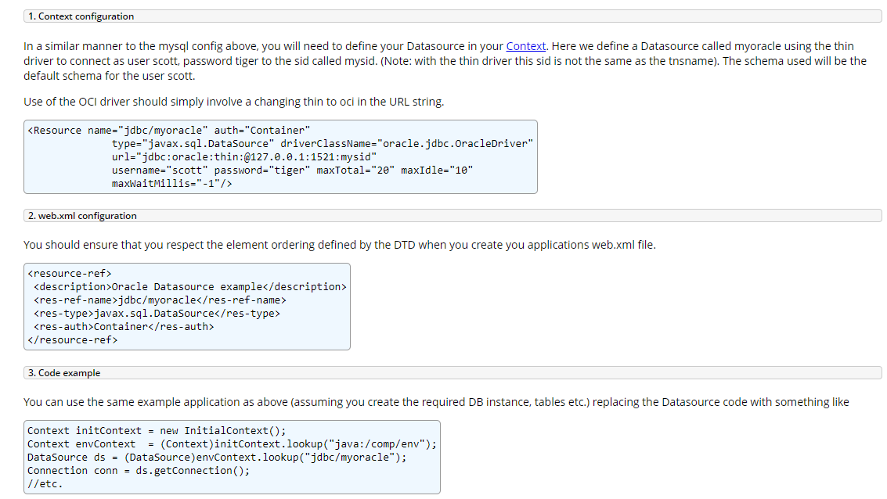
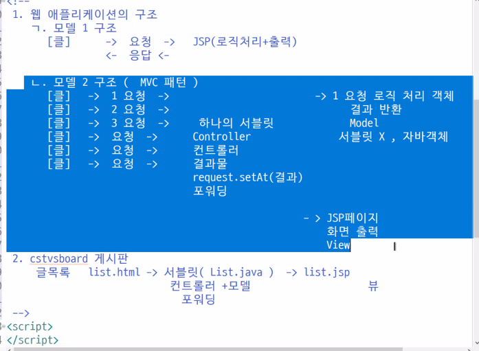

# 12.28

**[EL]**

(7) EL 에서 사용하는 기본 객체

1. pageContext == page${pageContext.request}
2. pageScope/requestScope/sessionScope/applicationScope
3. param == request.getParameter() `${param.name}` 
4. paramValues == request.getParameterValues()
   - `${paramValues.name}` == request.getParameterValues
   - Map 객체를 반환한다.
5. header == request.getHeader()
   - ${header.????}
6. headerValues == request.getHeaderValues()
7. cookie == request.getCookies() `<쿠키이름, Cookie>` Map 객체
8. initParam
   - `${initParam.logEnabled}` web.xml 의 값을 가져온다.

 


**(2) Attribute 의 사용**

```java
session.setAttribute("user", Member);
Member user = (Member) session.getAttribute("user");
```

EL

```jsp
${sessionScope.user}
```


**[Deployment Descriptor]**

- context parameters 등


**URI & URL**

```
요청 URI: /jspPro3/days07/ex01.jsp
요청 URL: http://localhost/jspPro3/days07/ex01.jsp
```

```jsp
${pageContext.request.requestURI }
${pageContext.request.requestURL }
```

**[쿠키]**

쿠키생성

```jsp
<%
	Cookie c = Cookies.createCookie("user", "admin");
	response.addCookie(c);
	c = Cookies.createCookie("id", "hong");
	response.addCookie(c);
	c = Cookies.createCookie("age", "10");
	response.addCookie(c);
%>	
```

**쿠키출력**

```
JSESSIONID - B3909D7B2AD2743E2DAACD6E40026759
id - hong
user - admin
age - 10
```


```jsp
<%
	Cookies cookies = new Cookies(request);
	Set<Entry<String, Cookie>> set = cookies.cookieMap.entrySet();
	Iterator<Entry<String, Cookie>> ir = set.iterator();
	
	while (ir.hasNext()) {
		Entry<String, Cookie> entry = ir.next();
		String cname = entry.getKey();
		String cvalue = cookies.getValue(cname);
%>	
	<li><%=cname %> - <%=cvalue %></li>

<%
	}
%>
```

**EL**

```
EL id: hong
EL user: admin
EL age: 10
```

```jsp
EL id: ${cookie.id.value } <br />
EL user: ${cookie.user.value } <br />
EL age: ${cookie.age.value } <br />
```


```
JSESSIONID - B3909D7B2AD2743E2DAACD6E40026759
id - hong
user - admin
age - 10
```

```jsp
<c:forEach items="${cookie }" var="entry">
    <li>${entry.key } - ${entry.value.value }</li>
</c:forEach>
```

**같은코드**

```jsp
<c:forEach items="${cookie }" var="entry">
    <!-- Cookie c = entry.getValue() -->
    <c:set var="c" value="${entry.value }"> </c:set>
    <li>${entry.key } - ${c.value }</li>
</c:forEach>
```


**Attribute**

```
name: 홍길동
id: admin
age: 10
```

```jsp
	name: ${requestScope.name }<br /> 	
	id: ${sessionScope.id }<br />
	age: ${applicationScope.age }<br />
	name: ${name }<br /> 	
	id: ${id }<br />
	age: ${age }<br />
```

같은코드이다.

page > request > session > application 순으로 찾는다.

**[EL 연산자 - 산술, 비교, 논리]**

- `+`
- `-`
- `*`
- `/` `div`
- `%` `mod` 

**숫자의 합연산**

```
101
1
```

```jsp
${"100" + 1 } <br />
<%-- 	${"백" + 1 } --%> <!-- 에러 -->
${null + 1} <br />
```

null 이면 0 으로 처리된다.


**[비교연산자]**

- `>` `gt`
- `<` `lt`
- `>=` `ge`
- `<=` `le` 
- `==` `eq`
- `!=` `ne` 


**[논리연산자]**

- `&&` `and`
- `||` `or` 
- `!` `not`


**[empty]**

1. 형식: empty 값
2. `null` true
3. `""` true
4. `0` false
5. `배열크기 0` true

삼항연산자도 사용할 수 있다.

```jsp
${name += "님" } <br />
${name }님 <br />
```

`${name + "님"}` 에러가 난다.


**두 개 이상의 연산**

```
20
```


```jsp
${1+1;10+10 } <br />
```

EL 3.0: 두개의 덧셈 연산자는 처리가 되고나서 뒤에 것만 출력된다.

**변수**

```jsp
<%
	request.setAttribute("n", 100);
%>
	<c:set var="m" value="${10 }"></c:set>
	
	${x = 10 }
```


**문제**

세자리마다 콤마찍기

```
123,456,789
```


```jsp
<%
	long price = 123456789;
	String answer = String.format("%,d", price);
%>
	<%=answer %>
```

DecimalFormat 으로 풀어도 된다.

**EL에서 객체의 메서드를 호출하는 방법**


**FormatUtil.java**

```java
public class FormatUtil {
	public String number(long number, String pattern) {
		DecimalFormat df = new DecimalFormat(pattern);
		return df.format(number);
	}
}
```

**ex05_02.jsp**

```
price = 123,456,789
```

```jsp
<%
long price = 123456789;
request.setAttribute("price", price);
FormatUtil f = new FormatUtil();
request.setAttribute("f", f);
%>
price = ${f.number(price, "#,##0") }
```

**static 메서드**

```jsp
price = ${FormatUtil.staticNumber(price, "#,##0") } <br />
```

static 메서드는 EL 에서 바로 사용할 수 있다.

복습: `c:set` 함수란?

**[JSTL]**

JSTL 이란 ? JSP Standard Tag Library

1. 개발자가 필요에 의해서 태그를 만들어서 사용할 수 있다.
2. 커스텀 태그 중에 많이 사용된 것을 모아서 JSTL
3. WEB-INF>lib>jstl-1.2.jar
4. JSTL 기능
   - 변수지원 - `c:set` `c:remove`
   - 흐름제어 - `c:forEach` `c:if` `c:choose` 
   - URL 처리 - `c:url` `c:redirect` 
   - 출력태그 - `c:out` 
   - 데이터베이스 - `sql:`
   - XML 태그 - `xml:`
   - 국제화 
     - 지역
     - 메시지 - `fmt:`
     - 숫자, 날짜형식
   - 함수 - `fn:` 


```jsp
<%@taglib prefix="c" uri="http://java.sun.com/jsp/jstl/core"%>
<%@taglib prefix="fmt" uri="http://java.sun.com/jsp/jstl/fmt"%>
<%@taglib prefix="x" uri="http://java.sun.com/jsp/jstl/xml"%>
<%@taglib prefix="sql" uri="http://java.sun.com/jsp/jstl/sql"%>
<%@taglib prefix="fn" uri="http://java.sun.com/jsp/jstl/functions"%>
```


**[데이터베이스 풀]**




**JSP**

```jsp
<Resource name="jdbc/myoracle" auth="Container"
              type="javax.sql.DataSource" driverClassName="oracle.jdbc.OracleDriver"
              url="jdbc:oracle:thin:@127.0.0.1:1521:mysid"
              username="scott" password="tiger" maxTotal="20" maxIdle="10"
              maxWaitMillis="-1"/>
```

**XML**

```xml
<resource-ref>
 <description>Oracle Datasource example</description>
 <res-ref-name>jdbc/myoracle</res-ref-name>
 <res-type>javax.sql.DataSource</res-type>
 <res-auth>Container</res-auth>
</resource-ref>
```

**JAVA**

```java
Context initContext = new InitialContext();
Context envContext  = (Context)initContext.lookup("java:/comp/env");
DataSource ds = (DataSource)envContext.lookup("jdbc/myoracle");
Connection conn = ds.getConnection();
//etc.
```


**데이터베이스**

오류 - 11:25

```jsp
<sql:query var="rs" dataSource="jdbc/myoracle">
    SELECT deptno, dname, loc
    FROM dept
</sql:query>

<c:forEach var="row" items="${rs.rows}">
    <li>
        ${row.deptno} - 
        ${row.dname} - 
        ${row.loc} - 
    </li>
</c:forEach>	
```


**[변수선언]**

표현식

```jsp
<%
	String name = "홍길동";
	request.setAttribute("name", name);
%>
```

EL

```jsp
<c:set var="name" value="홍길동"></c:set>
```


```jsp
<%
	String name = "홍길동";
// 	request.setAttribute("name", name);
%>

	<!-- JSTL 변수선언 => EL 에서 사용하겠다. -->
	<c:set var="name" value="<%=name %>"></c:set>
	<c:set var="name"><%=name %></c:set>
	
	name = ${name }
```

**c:remove**

```jsp
name = ${name } <br />
<c:remove var="name"/>
name = ${name } <br />
```


속성

- `target` 프로퍼티 값을 설정할 대상객체 지정
  - 자바빈, 웹
  - 표현식, EL 
- `property` 설정할 프로퍼티의 이름 지정
  - target = 자바빈
  - property = "deptno"


```
loc = XXX
```

```jsp
<c:set target="${dto }" property="loc" value="XXX"></c:set>
<!-- 같은코드 -->
<c:set target="${dto }" property="loc">XXX</c:set>
loc = ${dto.loc }
```


**[흐름제어태그]**

정수를 입력받아서 홀수/짝수 출력

```
짝수
```

```jsp
<c:set var="num">${param.num }</c:set>
<c:if test="${num % 2 eq 0 }">짝수</c:if>
<c:if test="${num % 2 ne 0 }">홀수</c:if>
```


**수우미양가**

```jsp
<c:choose>
    <c:when test="">수</c:when>
    <c:when test="">우</c:when>
    <c:when test="">미</c:when>
    <c:when test="">양</c:when>
    <c:otherwise>가</c:otherwise>
</c:choose>
```


**1부터 10까지의 합**

```
1+ 2+ 3+ 4+ 5+ 6+ 7+ 8+ 9+ 10+ =55
```

```jsp
<c:forEach begin="1" end="10" var="i"> 
    ${i }+
    <c:set var="sum" >${sum+i }</c:set>
</c:forEach>
=${sum }
```

`sum` 변수를 선언하지 않아도 디폴트가 0 이므로 더할 수 있다.


```
1+ 2+ 3+ 4+ 5+ 6+ 7+ 8+ 9+ 10 =55
```


```jsp
<c:forEach begin="1" end="10" step="1" var="i"> 
    ${i += (i eq 10 ? "" : "+") }
    <c:set var="sum" >${sum+i }</c:set>
</c:forEach>
=${sum } 
```

Q. 삼항연산자 안에 써도 되나 ? 

A. 

choose 나 if 로 사용해도 된다.

```jsp
<c:forEach begin="1" end="10" step="1" var="i" varStatus="status"> 
    ${i }
    <c:if test="${not status.last }">+</c:if>
    <c:set var="sum" >${sum+i }</c:set>
</c:forEach>
= ${sum } 
```

**status.**

- `count`
- `index`
- `first`
- `last` 

**status 예시**

```
m[0] : 1 - true/false
m[1] : 4 - false/false
m[2] : 5 - false/false
m[3] : 4 - false/false
m[4] : 2 - false/true
```

```jsp
<c:set var="m" value="<%=new int[] {1, 4, 5, 4, 2} %>"></c:set>

<c:forEach items="${m }" var="n" varStatus="status">
    <li>m[${status.index}] : ${n } - ${status.first}/${status.last }</li>
</c:forEach>
```


```jsp
	<!-- 2. Map -->
<%
	Map<String, String> map = new HashMap<>();
	map.put("k1", "v1");
	map.put("k2", "v2");
	map.put("k3", "v3");
	map.put("k4", "v4");
%>
	<ol>
		<c:forEach items="<%=map %>" var="entry">
			<li>${emtry.key } - ${entry.value }</li>
		</c:forEach>
	</ol>
```


```jsp
<!-- c:url -->
<c:url var="url" value="ex08_02.jsp"></c:url>
<c:redirect url="${url }">
    <c:param name="name" value="admin"></c:param>
    <c:param name="age" value="10"></c:param>
</c:redirect>
```


**코드 예제**

```jsp
		실제배포경로 = C:\class\JSPClass\.metadata\.plugins\org.eclipse.wst.server.core\tmp0\wtpwebapps\jspPro3\days07\ex01.jsp 

		<%@ page contentType="text/html; charset=UTF-8" pageEncoding="UTF-8"%>
<%@taglib prefix="c" uri="http://java.sun.com/jsp/jstl/core" %>
<!DOCTYPE html>
<html>
<head>
<meta charset="UTF-8">
<meta name="viewport" content="width=device-width, initial-scale=1.0">
<script src="https://ajax.googleapis.com/ajax/libs/jquery/3.6.0/jquery.min.js"></script> 
<style>
</style>
<title>Insert title here</title>
</head>
<body>
<h3>days07.ex01.jsp</h3>

<%
	request.setAttribute("name", "홍길동");
	session.setAttribute("auth", "admin");
%>

요청 URI: ${pageContext.request.requestURI } <br />
request name 속성: ${requestScope.name } <br />
session auth 속성: ${sessionScope.auth } <br />
code 파라미터: ${param.code } <br />


<script> 
</script>
</body>
</html>
```


```jsp
<%
	FileReader fr = null;

	try {
		String path = "days07/ex01.jsp";
		String realPath = request.getRealPath(path);
		
		fr = new FileReader(realPath);
%>
	<pre>
		실제배포경로 = <%=realPath %> <br />
		<c:out value="<%=fr %>" escapeXml="true"></c:out>
	</pre>
<%
	} catch (Exception e) {
%>
	에러: <%=e.getMessage() %>
<%		
	} finally {
		if (fr != null) {
			try { fr.close(); } catch (IOException ex) {}
		}
	}
%>
```


**try-catch**

```jsp
<c:catch var="ex">
</c:catch>

<c:if test="${ex != null }">
    ${ex }
</c:if>
```


**[숫자, 날짜 포맷팅 처리 태그]**

- 숫자 출력, 파싱: `Number`
- 날짜: `Date`
- 시간대 설정 `timeZone` 


**fmt:**

- `formatNumber`
- `parseNumber`
- `formatDate`
- `parseDate`
- `setTimeZone`
- `timeZone`


```jsp
<%
	int price = 12345;
%>	
	<c:set value="<%=price %>" var="price"></c:set>
	<!-- pattern 출력형식 지정하는 속성 -->
	<fmt:formatNumber 
		type="number"
		value="${price }" 
 		pattern="000000.00" 
 		var="fmt_price"></fmt:formatNumber><br /> 
	price: ${fmt_price } <br />
	
	통화형식 price: <fmt:formatNumber></fmt:formatNumber>
```

2:17 퍼센트


```jsp
<%
	String price = "1,100.12";
	int qty = 5;
	
	price = price.replaceAll(",", "");
	double d_price = Double.parseDouble(price);
%>	
	총판매금액: <%=d_price * qty%> <br />
```


```jsp
<fmt:parseNumber var="d_price" pattern="0,000.00"><%=price %></fmt:parseNumber>
<c:set var="qty"><%=qty %></c:set>
총판매금액: ${d_price * qty }
```


```jsp
<c:set var="now" value="<%=now %>"></c:set>
<li><fmt:formatDate value="${now }" dateStyle="default"/> </li>
<li><fmt:formatDate value="${now }" dateStyle="full"/> </li>
<li><fmt:formatDate value="${now }" dateStyle="short"/> </li>
<li><fmt:formatDate value="${now }" dateStyle="long"/> </li>
<li><fmt:formatDate value="${now }" dateStyle="medium"/> </li>
```

Q. c:set 에는 value 에 넣어야하나?

A.


**문제**

문자열을 날짜로 바꿔 100 일 후 출력

```jsp
<%
	String d1 = "2021년07월05일";
	Date d2 = new Date(2021 - 1900, 7 - 1, 5);
	d2.setDate(d2.getDate() + 100);
%>
	<%=d2.toLocaleString() %>
```


```
d2: 2021. 10. 13 오전 12:00:00
d3: 2021. 7. 5 오전 12:00:00
d4: 2021. 7. 5 오전 12:00:00
d5: Mon Jul 05 00:00:00 KST 2021
```

```jsp
<%
	String d1 = "2021년07월05일";
	Date d2 = new Date(2021 - 1900, 7 - 1, 5);
	d2.setDate(d2.getDate() + 100);
%>
	d2: <%=d2.toLocaleString() %> <br />
	
<%
	String pattern = "yyyy년MM월dd일";
	SimpleDateFormat sdf = new SimpleDateFormat(pattern);
	Date d3 = sdf.parse(d1);
%>
	d3: <%=d3.toLocaleString() %> <br />
	
<%
	DateTimeFormatter f = DateTimeFormatter.ofPattern(pattern);
	LocalDate d4 = LocalDate.parse(d1, f); 
%>
	d4: <%=d3.toLocaleString() %> <br />

	<fmt:parseDate pattern="yyyy년MM월dd일" var="d5"><%=d1 %></fmt:parseDate>
	d5: ${d5 }
```


**[functions]**

```
18
MESSAGE입니다.
message입니다.
```

```jsp
<c:set var="msg"><b>Message</b>입니다.</c:set>
${fn:length(msg) } <br />
${fn:toUpperCase(msg) } <br />
${fn:toLowerCase(msg) } <br />
```


```
1- 2- 3- 4- 5- 6- 7- 8- 9- 10-
```


```jsp
<c:set var="tokens" value="1,2,3,4,5,6,7,8,9,10"></c:set>
<c:set var="array" value="${fn:split(tokens, ',') }"></c:set>
<c:forEach items="${array }" var="n">
    ${n }-
</c:forEach>
```

value 에 담아야 한다.

**join**

```
1-2-3-4-5-6-7-8-9-10
```

```jsp
${fn:join(array, '-') }
```

518p 까지 

**[MVC]**

모델 2 구조기반의 MVC 패턴 구현

모델 1 구조: 로직과 출력을 함께

모델 2 구조: 서블릿에서 로직을 처리한다.



1. 웹 애플리케이션의 구조
   - 모델 1 구조
     - [클]		-> 요청		-> JSP (로직처리 + 출력)
     - ​              <- 응답
   - 모델 2 구조 (MVC 패턴)
     - [클] ->  요청 -> 1. 요청 로직 처리 객체
     - [클] ->  요청 -> 객체반환
     - [클] ->  요청 -> Model
     - [클] ->  요청 -> Controller 서블릿 X, 자바객체
     - [클] ->  요청 -> 컨트롤러
     - [클] ->  요청 -> 결과물
     - ​                         request.setAt(결과) 
     - ​                         포워딩
2. cstvsboard 게시판
   - 글목록 list.html -> 서블릿 (List.java) -> list.jsp
   - ​                            컨트롤러 + 모델            뷰
3. 컨트롤러 서블릿의 내부 동작 방식
   - [클] -> 요청 -> ***[컨트롤러 (서블릿)]
   - ​           list.html          ㄱ. 요청 URL 분석
   - ​           글목록          *** list.html 글목록
   - ​                                     write.html 글쓰기
   - ​                                     content.html 글보기
   - ​                                 ㄴ. list.html 요청을 처리함
   - ​                                     모델 (자바클래스)
   - ​                                     *** List.java 객체
   - ​                                     Write.java
   - ​                                     Content.java
   - ​                                 ㄷ. 해당 모델이 로직을 처리한 후 
   - ​                                     결과물 반환 -> 
   - ​                                     request.setAttribute(결과물)
   - ​                                     session
   - ​                                 ㄹ. 뷰 (View) - 출력
   - ​                                     list.jsp
   - ​                                     write.jsp
   - ​                                     content.jsp
   - ​                                     포워딩 또는 리다이렉트
   - ​                  <- 응답       뷰 (JSP 페이지)
4. 클라이언트에서 웹 브라우저를 띄어서 URL (주소) 입력 후 엔터 -> 요청할 때 명령 전달하는 방법
   - ㄱ. 특정 파라미터를 이용해서 명령어 정보를 전달...
   - `http://localhost/jspPro/board/list.html` 글목록 요청
   - `http://localhost/jspPro/board/write.html` 글쓰기 요청
   - `http://localhost/jspPro/board/content.html?seq=40` 글보기 요청
   - `http://localhost/jspPro/board/delete.html?seq=40` 글삭제 요청
   - 요청 URL + 파라미터 분석
   - ㄴ. 요청 URL 자체에 명령어 정보를 전달. (Spring)


**[MVC 패턴 환경 테스트]**

1. [web.xml 파일] 을 복사해서 web_days06.xml
2. 요청 URL
   - /board/list.do
   - /board/write.do
   - 모든 요청 URL *.do
   - ------------------------------- MV[C] 컨트롤러 서블릿 DispatcherServlet
3. web.xml 서블릿 등록...
4. 각각의 요청마다 로직을 처리하는 클래스 선언 - 핸들러 (Handler)
   - [Model]VC
   - list.do
   - write.do
5. WEB-INF
6. days07/board/list.jsp


**에러**

```
an error has occured. see error log for more details
```


```
C:\class\JSPClass\.metadata\.plugins\org.eclipse.e4.workbench
```

workbench.xmi 파일삭제


파일

- ex13.jsp
- web.xml
- ListHandler class
- WriteHandler class
- NullHandler interface
- `DispatcherServlet` 컨트롤러
- `WEB-INF/commandHandler.properties` 


**클릭된 링크 확인**

```
/jspPro3/board/list.do
/jspPro3/board/write.do
/jspPro3/board/content.do
```


```java
String requestURI = request.getRequestURI();
System.out.println(requestURI);
```


**web.xml: 컨트롤러 서블릿 수정**

```xml
<servlet>
    <servlet-name>dispatcher</servlet-name>
    <servlet-class>days07.mvc.controller.DispatcherServlet</servlet-class>
    <init-param>
        <param-name>path</param-name>
        <param-value>/WEB-INF/commandHandler.properties</param-value>
    </init-param>
    <load-on-startup>1</load-on-startup> <!-- 톰캣 시작과 함께 서블릿 생성 -->
</servlet>
<servlet-mapping>
    <servlet-name>dispatcher</servlet-name>
    <url-pattern>*.do</url-pattern>
</servlet-mapping>
```


List.java 의 doGet 안의 포워딩 전까지 복사

DBConn 을 Connection Pool 로 바꿔야된다.


글보기 & 글쓰기를 MVC 패턴으로 해보기

# 12.29

**복습**

MVC 패턴이란 ? 

모델 2 구조

1. 모델: 자바클래스
2. 뷰: JSP 페이지
3. 컨트롤러: 서블릿클래스

모델 (M) - 자바클래스 / 로직 처리 핸들러 (Handler)

- ListHandler
- WriteHandler
- ContentHandler

컨트롤러 (C) - 서블릿클래스

1. 톰캣 (WAS) 이 시작할 때 자동으로 서블릿 객체 생성 등록


---

**[필터]**

Filter 란 ? 

1. 정의 ? http 요청, 응답할 때 올바른 요청 + 요청 권한 체크
   - 응답할 때 응답데이터를 변경 (암호화) 등등을 할 수 있는 클래스
2. 필터체인 (chain)
3. 필터 구현 방법 (핵심 3가지)
   - javax.servlet.Filter 인터페이스 구현
     1. `init()` 필터 초기화 역할
     2. `destroy()` 필터 웹컨테이너에서 소멸될 때 호출되는 메서드
     3. +++++ doFilter()
        - 필터링 할 작업 (코딩): 인증, 권한 등등
        - 체크된 후에는 다음 필터 또는 자원에게 chain 을 이용해서 전달. chain.doFilter()
   - 요청 - javax.servlet.ServletRequestWrapper 클래스
     - 필터가 요청을 변경한 결과를 저장하는 래퍼 클래스
     - currentPage=1 파라미터를 가공 (변경) 초기화
   - 응답 - javax.servlet.ServletResponseWrapper 클래스
     - 필터가 응답을 변경하기 위해 사용하는 래퍼 클래스
     - 원본데이터 -> 암호화 데이터
4. 필터 클래스를 사용하려면 톰캣\lib\servlet-api.jar 파일을 추가해야 하지만 이클립스로 개발할 경우에는 추가할 필요가 없다.
5. init (FilterConfig 객체 config) 객체의 메서드
   - String getFilterName(): 설정파일에서 `<filter-name>` 필터이름을 반환
   - getInitParameter(name): `<init-param>` 
   - getInitParameterNames(): 
   - ServletContext getServletContext(): 서블릿 컨텍스트 객체
6. 필터를 설정 (등록)
   - web.xml
   - @WebFilter 어노테이션 
7. 필터 사용하는 곳
   - 인증/권한
   - 자원 (jsp, 서블릿, 이미지, 동영상 등) 로깅
   - 응답 데이터 변환 (암호화, )
8. 실습
   - days08
   - admin
   - board
     - ex01_list.jsp
   - member
     - ex01_logon.jsp
     - ex01_logon_ok.jsp
     - ex01_logout.jsp
   - web.xml -> web_days07.xml 복사
     - web.xml
     - com.filter.LoginCheckFilter 클래스 

클 -> 요청 -> [인증확인] -> [권한확인] -> JSP/서블릿		자원 (JSP/서블릿 등) `%@ include file=".jspf"` 

​		응답 <- 필터2 [암호화]	<-	중요한 데이터 (암호화)

**com.filter.LoginCheckFilter.class** 

```java
import javax.servlet.Filter;
```


Q. filter 의 역할 ? 

A. 


**[로그인 확인]**

ex01.jsp

```jsp
<a href="/jspPro3/days08/member/ex01_logon.jsp">로그인</a>
<a href="/jspPro3/days08/board/ex01_list.jsp">글목록</a>
<a href="/jspPro3/days08/board/ex01_write.jsp">글쓰기</a>
```

LoginCheck.java

```java
public class LoginCheckFilter implements Filter {
	@Override
	public void doFilter(ServletRequest request, ServletResponse response, FilterChain chain)
			throws IOException, ServletException {
		System.out.println("> LoginCheckFilter.doFilter() 호출됨...");
		// session - member (LogonID)
		HttpServletRequest httpRequest = (HttpServletRequest) request;
		HttpServletResponse httpResponse = (HttpServletResponse) response;
		
		String logonID = null;
		boolean isLogon = false;
		HttpSession session = httpRequest.getSession(false);
		
		if (session != null) {
			logonID = (String) session.getAttribute("member");
			
			if (logonID != null) {
				isLogon = true;
			}
		}
		
		if (isLogon) {
			chain.doFilter(request, response);
		} else {
			// ex01_logon.jsp 페이지로 이동 - 포워딩 / [리다이렉트]
			String location = "/jspPro3/days08/member/ex01_logon.jsp";
			httpResponse.sendRedirect(location);
		}
	}
}
```

**[로그인 구현]**

**ex01.list.jsp**

```jsp
반드시 로그인을 해야지만 글목록 페이지를 사용할 수 있다.
<br />
<br />
<br />
<br />
<!-- EL 4 Scope -->
로그인 아이디: ${member } <br />
<a href="/jspPro3/days08/member/ex01_logout.jsp">로그 아웃</a>
```

**ex01_logon.jsp**

```jsp
<form action="<%= request.getContextPath() %>/days08/member/ex01_logon_ok.jsp">
    아이디 :  <input type="text" name="id" autofocus/><br>
    비밀번호 : <input type="password" name="passwd"><br>
    <input type="submit" value="로그인" />
</form> 	
```

**ex01_logon_ok.jsp**

```jsp
<%@ page contentType="text/html; charset=UTF-8" pageEncoding="UTF-8"%>
<%@taglib prefix="c" uri="http://java.sun.com/jsp/jstl/core" %>
<%
String id = request.getParameter("id");
String passwd = request.getParameter("passwd");

// id, passwd 로그인 성공, 실패
session.setAttribute("member", id);

String location = "/jspPro3/days08/ex01.jsp";
response.sendRedirect(location);
%>
```

**ex01_logout.jsp**

```jsp
<%@ page contentType="text/html; charset=UTF-8" pageEncoding="UTF-8"%>
<%@taglib prefix="c" uri="http://java.sun.com/jsp/jstl/core" %>
<%
session.invalidate();

String location ="/jspPro3/days08/ex01.jsp";
response.sendRedirect(location);
%>
```

**문제**

글목록 클릭 - 

복습: 로직 확인해보기


원래 가려고한 경로

```java
String referer = httpRequest.getRequestURI();
System.out.println("> referer: " + referer);
```


```xml
<filter>
    <filter-name>LoginCheckFilter</filter-name>
    <filter-class>com.filter.LoginCheckFilter</filter-class>
</filter>
<filter-mapping>
    <filter-name>LoginCheckFilter</filter-name>
    <url-pattern>/days08/board/*</url-pattern>
    <dispatcher></dispatcher>
</filter-mapping>
```

**dispatcher 값** 

- `REQUEST` 디폴트 
- `INCLUDE` include 포함 필터 적용
- `FORWARD` 제어 흐름 이동될 때 필터 적용

**[응답필터]** @WebFilter 어노테이션 사용해서 만들어 보자.

1. com.util.ResponseBufferWriter 클래스
2. com.util.XSLTResponseWrapper 클래스 implements ServletResponseWrapper 클래스 추가
3. com.filter.XSLTFilter implements Filter


**[XML]**

XML 데이터 - 응답필터 (XSLTFilter) -> html 형태로 변환해서 응답


점심 후: ServletContextListener 구현


ServletContextLister 구현

1. 웹 컨테이너 (== 톰캣 == WAS) 가 시작//종료할 때 발생하는 이벤트를 처리할려고 한다면 ServletContextLister 를 구현한 클래스에서 처리를 하면된다.

2. 방법

   - ServletContextLister 인터페이스를 구현한 클래스 작성
     1. contextInitialized() 웹 컨테이너 (==톰캣==WAS) 가 시작
        - 웹 애플리케이션이 시작 (초기화)
     2. contextDestroyed() 웹 컨테이너 (==톰캣==WAS) 가 종료
        - 웹 애플리케이션이 종료
     3. ServletContext sc = getServletContext()
        - ServletContext == JSP 의 application 기본객채
        - web.xml
        - `<context-param>` 태그설정
     4. 실습
        - web.xml
        - DBCPInitListener 등록
     5. @WebListener 어노테이션.. 등록

   

   

   - 위의 클래스를 web.xml 에 등록


**톰캣 서버실행 시**

```
> DBCPInitListener.contextInitializeds() ...
javax.sql.DataSource 
oracle.jdbc.OracleDriver
jdbc:oracle:thin:@127.0.0.1:1521:mysid
scott
```

```java
public class DBCPInitListener implements ServletContextListener {
	@Override
	public void contextInitialized(ServletContextEvent sce) {
		System.out.println("> DBCPInitListener.contextInitializeds() ...");
		
		// web.xml DBCP 설정값을 읽어와서 출력..
		// JSP application 기본 객체
		String poolConfig = sce.getServletContext().getInitParameter("poolConfig");
		StringReader sr = new StringReader(poolConfig);
		Properties prop = new Properties();
		
		try {
			prop.load(sr);
		} catch (IOException e) {
			e.printStackTrace();
		}
		
		System.out.println(prop.getProperty("type"));
		System.out.println(prop.getProperty("driverClassName"));
		System.out.println(prop.getProperty("url"));
		System.out.println(prop.getProperty("username"));
		System.out.println(prop.getProperty("password"));
	}
}
```


Filter 파일과 Listener 파일을 생성할 수 있다.

**리스너 메서드 종류**

- sessionCreated
- attributeRemoved
- onError
- sessionIdChanged
- attributeAdded
- onTimeout
- attributeReplaced
- sessionWillPassivate
- contextInitialized
- attributeAdded
- onComplete
- requestDestroyed
- attributeRemoved
- onStartAsync
- valueBound
- requestInitialized
- 등등


1. days08
   - guestbook 폴더 추가
   - WEB-INF/commandhandler.properties 복사 + 붙이기 -> 수정
2. 컨트롤러 (서블릿) - MV[C]
   - days08.guestbook.controller.DispatcherServlet
3. 컨트롤러 web.xml 등록
4. 모델 [M]VC - 서블릿 X, 로직처리
   - days08.guestbook.command.ListHandler 핸들러 클래스 추가.
5. 방명록 테이블 생성
   - 시퀀스 생성
6. DTO, VO -> domain 패키지명
   - days08.guestbook.domain.Message.java
7. DAO
   - days08.guestbook.persistence.IMessage.java 인터페이스
   - days08.guestbook.persistence.MessageImpl.java 구현된 클래스
8. Service -> service 패키지명 
   - days08.guestbook.service.GetMessageListService.java 클래스
   - days08.guestbook.service.WriteMessageService.java 클래스
   - days08.guestbook.service.ServiceException.java 클래스 - 서비스 발생 예외...
   - days08.guestbook.service.MessageListView.java
9. GetMessageListHandler 모델 (핸들러) 객체 구현...
10. 방명록 글쓰기...
    - MessageImpl.java (DAO) 확인
      - insert(conn, Message)
    - WriteMessageService 확인 X
    - WriteMessageHandler 구현 / 확인 X


```sql
create table guestbook_message
   (
      message_id number not null primary key
      , guest_name varchar2(50) not null
      , password varchar2(10) not null
      , message clob not  null
   ) ;      
   create sequence seq_guestbook_message; 
```


SELECT 는 excuteQuery

나머지는 excuteUpdate


selectList 메서드의 List 반환을 MessageListView 에 담는다.

페이지블럭과 비슷한 역할을 한다.


`process()` 함수의 반환은 이동할 경로이다.


**오류**

Dispatcher 에서 에러가 난다.


**[방명록 로직]**

1. ex03.jsp 에서 a 태그 호출
   - `<a href="/jspPro3/days08/guestbook/list.do">방명록 목록</a>` 
2. DispatcherServlet.doGet() 호출


commandHandlerMap 이란?

`<String, CommandHandler>` 를 담는 HashMap


**[에러해결]**

**GetMessageListHandler.java**

```java
//         conn = ConnectionProvider.getConnection();         
conn = DBConn.getConnection();     
```

**MessageImpl.java - selectCount 메서드**

```java
try {
    pstmt = con.prepareStatement(sql);
    rs = pstmt.executeQuery();
    rs.next();
    return rs.getInt(1);
```

`rs.next()` 빼먹음

**MessageImpl.java**

```java
try {
    pstmt = con.prepareStatement(sql);
    rs = pstmt.executeQuery();
    rs.next();
    int rowCount = rs.getInt(1);
    return rowCount;
```

`int rowCount` 추가해서 반환


```java
//	      String location = "list.do";
//	      response.sendRedirect(location);

return "/days08/guestbook/list.jsp";
```


## 복습


12.28 11시 17분

https://tomcat.apache.org/

1. Documentation 의 Tomcat 8.5
2. [**JDBC DataSource**](https://tomcat.apache.org/tomcat-8.5-doc/jndi-datasource-examples-howto.html)
3. [Oracle 8i, 9i & 10g](https://tomcat.apache.org/tomcat-8.5-doc/jndi-datasource-examples-howto.html#Oracle_8i,_9i_&_10g)


META-INF 의 context.xml

```xml
<Resource name="jdbc/myoracle" auth="Container"
              type="javax.sql.DataSource" driverClassName="oracle.jdbc.OracleDriver"
              url="jdbc:oracle:thin:@127.0.0.1:1521:mysid"
              username="scott" password="tiger" maxTotal="20" maxIdle="10"
              maxWaitMillis="-1"/>
```

WEB-INF 의 web.xml

```xml
<resource-ref>
 <description>Oracle Datasource example</description>
 <res-ref-name>jdbc/myoracle</res-ref-name>
 <res-type>javax.sql.DataSource</res-type>
 <res-auth>Container</res-auth>
</resource-ref>
```

java

```java
Context initContext = new InitialContext();
Context envContext  = (Context)initContext.lookup("java:/comp/env");
DataSource ds = (DataSource)envContext.lookup("jdbc/myoracle");
Connection conn = ds.getConnection();
//etc.
```


**예시코드**

```jsp
<%@ taglib uri="http://java.sun.com/jsp/jstl/sql" prefix="sql" %>
<%@ taglib uri="http://java.sun.com/jsp/jstl/core" prefix="c" %>
<sql:query var="rs" dataSource="jdbc/TestDB">
select id, foo, bar from testdata
</sql:query>

<!-- 바디태그 -->
<c:forEach var="row" items="${rs.rows}">
    Foo ${row.foo}<br/>
    Bar ${row.bar}<br/>
</c:forEach>
```


12.27 14시 8분 ex04

1. WEB-INF 의 lib 에 dbcp.jar 검색해서 tomcat-dbcp.jar 파일을 추가한다. (jar)
2. META-INF 에 context.xml 추가해서 Context 태그 내에 붙이고 mysid 를 xe 로 바꾼다. (context.xml)
3. web.xml
4. java
