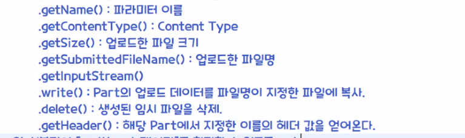

# 12.30

**[방명록 로직]**

1. ex03.jsp
2. servlet-class 와 servlet-mapping 으로 매핑한다.
3. DispatcherServlet - 서블릿 init: HashMap 에 `<url, CommandHandler>` 를 담는다.
4. DispatcherServlet - 서블릿 doGet: CommandHander 를 URL 에 따라 가져온다.
5. WriteMessageHandler - 자바 process: messageService.write(message) 호출


---

**[답변형 (계층형) 게시판]**

1. 로직 이해 (필수)
   - 오라클 DB / replyboard
   - 글번호 (seq: PK) 제목 (subject)
     - 1	첫번째 게시글
     - 2    두번째 게시글
     - 3    세번째 게시글
   - ORDER BY seq DESC
   - 글목록 (list.jsp)
     - 세번째 게시글
     - 두번째 게시글
       - 2-2번째 게시글
         - 2-2-1번째 게시글
       - 2-1번째 게시글
     - 첫번째게시글


2가지 방법

1. 컬럼 3개: 그룹컬럼 (REF)

**[컬럼 3개 추가 구현]**

1. 오라클 DB / replyboard
   - 글번호 (seq: PK) 제목 (subject) 그룹 (REF) 순번 (STEP) 깊이 (DEPTH)
   - 그룹=1 순번=1 깊이=0
2. 글목록 (list.jsp)
   - 글번호 (seq: PK) 제목 (subject)


A. 새글쓰기 (insert)

1. seq: 시퀀스 자동 증가
2. subject
   - 그룹 (REF) == 글번호
   - 순번 (STEP) = 1
   - 깊이 (DEPTH) = 0


ORDER BY ref DESC, step


B. 답글쓰기 (insert)

seq: 시퀀스 자동 증가

1. 그룹 == 부모그룹
2. 같은 그룹에 있는 부모글보다 큰 순번들은 1 증가 UPDATE 쿼리 수행
3. 순번 = 부모순번 (STEP) + 1
4. 깊이 = 0


글목록 (list.jsp)

- 첫번째 게시글    1 1 0
- 두번째 게시글    2 1 0
  - 2-1번째 게시글	2 2 1
  - 2-2번째 게시글    2 2 1 
- 세번째게시글    3 1 0


(2) 컬럼 2개: 

글번호 제목 THEAD (REF + STEP) 깊이 (DEPTH)

1. 첫번째게시글 1000 0
2. 두번재게시글 2000 0
   - 4 / 2-1 답글 1999 1
3. 세번째게시글 3000 0


2-2 답글이 생기면 1999

2-1 답글이 1998 이 된다.

2-2-1 답글이 생기면 1998 2

2-1 답글은 1997 1 이 된다.


1. 1

2. days09 폴더

   - replyboard 폴더
     - images 폴더
     - emoticon 폴더
     - list.jsp
     - write.jsp

3. 패키지 추가

   - days09.replyboard.command 글읽기 글쓰기
     - CommandHandler 인터페이스 복사
     - NullHandler 클래스 복사
   - days09.replyboard.controller 서블릿
   - days09.replyboard.domain - VO, DTO 데이터
   - days09.replyboard.persistence - DAO
   - days09.replyboard.service - 트랜잭션 처리, 로그인 처리

4. days09 폴더

   - replyboard 폴더

5. web.xml -> 복사 web_days08_last.xml

6. 테이블 생성

   - 시퀀스 생성

7. 자바빈 = DTO, VO

8. persistence.IReplyBoard.java 인터페이스 - DAO (Data Access Object)

   - `IReplyBoard` `ReplyBoardDAO` 

9. com.utilJdbcUtil.java 

   - rs.close() 를 try-catch 블럭으로 감싼다.

   - pstmt.close() 또한 감싼다.

10. Service

11. list.jsp

12. 글쓰기 write.do 요청

    - 새글쓰기 - X
    - 답글쓰기 - 부모게시글의 정보가 파라미터로 넘어오면 부모의 그룹 (REF) / 부모의 순번 (STEP) / 부모의 깊이 (DEPTH)


**테이블 생성**

```sql
  CREATE TABLE "SCOTT"."REPLYBOARD" 
   (   "NUM" NUMBER NOT NULL ENABLE, 
   "WRITER" VARCHAR2(12 BYTE) NOT NULL ENABLE, 
   "EMAIL" VARCHAR2(30 BYTE) NOT NULL ENABLE, 
   "SUBJECT" VARCHAR2(50 BYTE) NOT NULL ENABLE, 
   "PASS" VARCHAR2(10 BYTE) NOT NULL ENABLE, 
   "READCOUNT" NUMBER(5,0) DEFAULT 0 NOT NULL ENABLE, 
   "REGDATE" DATE DEFAULT sysdate NOT NULL ENABLE, 
   "CONTENT" CLOB NOT NULL ENABLE, 
   "IP" VARCHAR2(20 BYTE) NOT NULL ENABLE, 
   "REF" NUMBER(5,0) DEFAULT 0 NOT NULL ENABLE, 
   "STEP" NUMBER(3,0) DEFAULT 0 NOT NULL ENABLE, 
   "DEPTH" NUMBER(3,0) DEFAULT 0 NOT NULL ENABLE, 
    PRIMARY KEY ("NUM")
  USING INDEX PCTFREE 10 INITRANS 2 MAXTRANS 255 COMPUTE STATISTICS 
  STORAGE(INITIAL 65536 NEXT 1048576 MINEXTENTS 1 MAXEXTENTS 2147483645
  PCTINCREASE 0 FREELISTS 1 FREELIST GROUPS 1 BUFFER_POOL DEFAULT FLASH_CACHE DEFAULT CELL_FLASH_CACHE DEFAULT)
  TABLESPACE "USERS"  ENABLE
   ) SEGMENT CREATION IMMEDIATE 
  PCTFREE 10 PCTUSED 40 INITRANS 1 MAXTRANS 255 NOCOMPRESS LOGGING
  STORAGE(INITIAL 65536 NEXT 1048576 MINEXTENTS 1 MAXEXTENTS 2147483645
  PCTINCREASE 0 FREELISTS 1 FREELIST GROUPS 1 BUFFER_POOL DEFAULT FLASH_CACHE DEFAULT CELL_FLASH_CACHE DEFAULT)
  TABLESPACE "USERS" 
 LOB ("CONTENT") STORE AS BASICFILE (
  TABLESPACE "USERS" ENABLE STORAGE IN ROW CHUNK 8192 RETENTION 
  NOCACHE LOGGING 
  STORAGE(INITIAL 65536 NEXT 1048576 MINEXTENTS 1 MAXEXTENTS 2147483645
  PCTINCREASE 0 FREELISTS 1 FREELIST GROUPS 1 BUFFER_POOL DEFAULT FLASH_CACHE DEFAULT CELL_FLASH_CACHE DEFAULT)) ;
```

**시퀀스 생성**

```sql
 CREATE SEQUENCE SEQ_REPLYBOARD;
```


`DTO` 자료

`DAO` DBMS


list.do -> DispatcherServlet -> ListHandler.process() -> ListService -> ReplayBoardDAO -> DB 처리

list.do -> 


다음주 월: jQuery ajax 수업


**[오류]**

```xml
		<servlet-name>dispatcher</servlet-name>
		<servlet-class>days09.replyboard.controller.DispatcherServlet</servlet-class>
		<init-param>
			<param-name>path</param-name>
			<param-value>/days09/replyboard/commandHandler.properties</param-value>
		</init-param>
		<load-on-startup>1</load-on-startup> <!-- 톰캣 시작과 함께 서블릿 생성 -->
	</servlet>
	<servlet-mapping>
		<servlet-name>dispatcher</servlet-name>
		<url-pattern>*.do</url-pattern>
	</servlet-mapping>
```

`param-value` days09.replyboard/commandHandler 라고 작성했다.


부모정보가 ref 가 넘어오면 답글이 된다.


write.do -> controller -> Handler -> Service -> DAO 

​	request.setA("list")

​	request.setA("pageBlock")

​	return "list"


Q. 포워딩과 리다이렉트의 차이점 ? 

A. 


content.jsp 완성


[4] 답글쓰기 + 부모글정보

write.do?num=41&ref=41&step=0&depth=0


**답글일 때 이미지**

```jsp
<c:if test="{dto.depth gt 0}">
    
    
</c:if>
```

답글일 때 이미지 및 들여쓰기


[5] 팀작업 - 삭제 기능을 구현


**[POOL]**

복습: 풀 연결 보기

**에러**

**context.xml**

```xml
<?xml version="1.0" encoding="UTF-8"?>
<Context>
<Resource name="jdbc/myoracle" auth="Container"
              type="javax.sql.DataSource" 
              driverClassName="oracle.jdbc.OracleDriver"
              url="jdbc:oracle:thin:@127.0.0.1:1521:xe"
              username="scott" 
              password="tiger" 
              maxTotal="20" 
              maxIdle="10"
              maxWaitMillis="-1"/>
</Context>
```

url 의 xe 가 다른 것으로 되어있었다.


**문제**

게시글 삭제

1. 모달창 - 삭제버튼

   - delete.do ? CommandHandler.properties
   - num=12 POST pass=123

   - 삭제 -> C -> H - 
   - GET
   - 포워딩 delete.jsp


삭제작업은 Ajax 로 처리


팀과제: 글수정


**다른사람코드**


홑따옴표를 빼먹지 말자.

# 1.3 

**[파일 업로드]**

1. 업로드: 클라이언트 -> 서버
   - 다운로드: 클라이언트 <- 서버
2. 게시판 (첨부파일), 자료실, 쇼핑몰 (상품등록) 등등에서 문서파일이나 이미지파일등을 서버에 올리는 작업 (업로드)
3. 실제 파일을 업로드하려면...
   - 스트림 기반의 전송방식인 method="post" 로 설정
   - 인코딩 방식 설정 +++
   - 기본값 `application/x-www-form-urlencoded` 
4. ex02.jsp ex02_ok.jsp
5. request 객체로 파라미터 X
   - 개발자 직접 스트림을 통해서 구현
   - `request.getInputStream` 스트림 객체 얻어와서 -> 파라미터, 첨부파일
   - ex02_ok_02.jsp
   - filename="version.ini" 동일한 파일명으로 내가 저장할 위치에 저장하기 위한 스트림객체를 만들어서 저장 (쓰기)
   - 서블릿 3.0 또는 3.1 이상에서 제공하는 라이브러리 사용
     1. `HttpServletRequest request` 의 [getPart()] 를 이용해서 업로드된 데이터 (파일) 접근할 수 있는 [Part 객체]
     2. 서블릿이 [multipart 데이터] 를 처리할 수 있도록 web.xml 설정
        - `@MultipartConfig` 어노테이션을 사용해서 설정
   - 외부에서 제공하는 라이브러리 사용 (cos file upload library)
     1. http://www.servlets.com
        - COS File Upload Library
     2. [**cos-20.08.zip**](http://www.servlets.com/cos/cos-20.08.zip) 다운로드
        - cos.jar 파일을 WEB-INF/lib 폴더에 저장
     3. request 객체 파라미터 X, 파일 X null, null
        - MultipartRequest 클래스


```java
MultipartRequest mrequest = new MultipartRequest(ㄱ, ㄴ, ㄷ, ㄹ, ㅁ);
```

- `ㄱ` request 객체
- `ㄴ` 서버에 저장될 위치 (경로)
- `ㄷ` 최대 파일 크기
- `ㄹ` 파일의 인코딩 방식
- `ㅁ` 파일 중복 처리위한 인자 (클래스)
  - upload 폴더 a.txt <- a.txt
- 예) ex03.jsp ex03_ok.jsp

**lib**

- `cos.jar`
- `jstl-1.2.jar` EL 사용
- `ojdbc6.jar` DBMS (오라클) 연결
- `tomcat-dbcp.jar` DB pool


## **함수**



---


**파일업로드를 위한 형식**

```jsp
<form action="" method="post" enctype="multipart/form-data">
</form>
```

실제 선택한 파일이 서버에 업로드되는 것은 아니다.

단지 파일명만 서버에 전송되는 것이다.

`request` 객체로 파라미터를 사용할 수가 없다. (문제점)


**헤더정보**

```
host : localhost
connection : keep-alive
content-length : 710008
cache-control : max-age=0
sec-ch-ua : " Not A;Brand";v="99", "Chromium";v="96", "Google Chrome";v="96"
sec-ch-ua-mobile : ?0
sec-ch-ua-platform : "Windows"
upgrade-insecure-requests : 1
origin : http://localhost
content-type : multipart/form-data; boundary=----WebKitFormBoundaryPg6pENMuwXCVLAoq
user-agent : Mozilla/5.0 (Windows NT 10.0; Win64; x64) AppleWebKit/537.36 (KHTML, like Gecko) Chrome/96.0.4664.110 Safari/537.36
accept : text/html,application/xhtml+xml,application/xml;q=0.9,image/avif,image/webp,image/apng,*/*;q=0.8,application/signed-exchange;v=b3;q=0.9
sec-fetch-site : same-origin
sec-fetch-mode : navigate
sec-fetch-user : ?1
sec-fetch-dest : document
referer : http://localhost/jspPro3/days10/ex02.jsp
accept-encoding : gzip, deflate, br
accept-language : ko-KR,ko;q=0.9,en-US;q=0.8,en;q=0.7,la;q=0.6
cookie : JSESSIONID=3713361AD348D9F1E0156A10D084BAF5
```

```jsp
<%
	Enumeration<String> en = request.getHeaderNames();
	out.println("> 전송받은 헤더 정보 출력<br>");
	
	while (en.hasMoreElements()) {
		String key = en.nextElement();
		String value = request.getHeader(key);
		out.println(key + " : " + value + "<br>");
	}
%>
```


**파라미터 받기**

```
------WebKitFormBoundarySItWk3s8TkrW2Y0j
Content-Disposition: form-data; name="name"

홍길동
------WebKitFormBoundarySItWk3s8TkrW2Y0j
Content-Disposition: form-data; name="upload"; filename="jdbc.pdf"
Content-Type: application/pdf
	:
	:
```

```jsp
<%
	// inputStream = 바이트 스트림
	ServletInputStream sis = request.getInputStream();
	DataInputStream dis = new DataInputStream(sis);
	String line = "";
	
	while ((line = dis.readLine()) != null) {
		out.println(new String(line.getBytes("ISO-8859-1"), "UTF-8") + "<br>");
	}
%>	
```


**외부 라이브러리**

**ex03.jsp**

```jsp
<%@ page contentType="text/html; charset=UTF-8" pageEncoding="UTF-8"%>
<%@taglib prefix="c" uri="http://java.sun.com/jsp/jstl/core" %>
<!DOCTYPE html>
<html>
<head>
<meta charset="UTF-8">
<meta name="viewport" content="width=device-width, initial-scale=1.0">
<script 
	src="https://ajax.googleapis.com/ajax/libs/jquery/3.6.0/jquery.min.js"></script> 
<script>
   $(document).ready(function (){     
      $("button").on("click", function(event) {         
             var n = $("#demo :file").length + 1;
             $("#demo").append(  "첨부 파일 "+n+" : <input type='file' name='file"+n+"'><br>");           
      });//  click
      
   }); // ready
</script>
<title>Insert title here</title>
</head>
<body>	
	<h3>ex03.jsp - ㄷ. 외부 라이브러리</h3>
	
 <form 
     action="ex03_ok.jsp" 
     method="post" 
     enctype="multipart/form-data" >
 
    message : <input type="text" name="msg" value="hello world~" /><br>
    
    <button type="button">첨부 파일 추가</button>
    
    <div id="demo">    
        첨부 파일 1 : <input type="file" name="file1" ><br>    
    </div>
    <input type="submit" value="전송" />
 
 </form>
	

</body>
</html>
```


**MultipartRequest** ex03.jsp

**업로드 경로**

```
> 실제 업로드 경로: C:\class\JSPClass\.metadata\.plugins\org.eclipse.wst.server.core\tmp0\wtpwebapps\jspPro3\days10\upload
```

```java
pageContext.getServletContext().getRealPath("/days10/upload");
```


```
> 전송된 메시지: null
> 첨부된 파일명: jdbc1.pdf
> 첨부된 파일크기: 709719 %>
> 첨부된 원래 파일명: jdbc.pdf
> 실제 저장된 파일명: jdbc1.pdf
> 첨부된 파일명: jdbc.pdf
> 첨부된 파일크기: 709719 %>
> 첨부된 원래 파일명: jdbc.pdf
> 실제 저장된 파일명: jdbc.pdf
```


```jsp
<%
	// 실제 WAS 배포경로
	String saveDirectory = pageContext.getServletContext().getRealPath("/days10/upload");
	System.out.println("> 실제 업로드 경로: " + saveDirectory);

	File saveDir = new File(saveDirectory);
	
	if (!saveDir.exists()) 
		saveDir.mkdirs();
		
	int maxPostSize = 5 * 1024 * 1024; // 5MB
	String encoding = "UTF-8";
	
	// cos.jar 파일 중복 -> 클래스 a.txt -> a-(1).txt
	FileRenamePolicy policy = new DefaultFileRenamePolicy();
	
	MultipartRequest mrequest = new MultipartRequest(
			request
			, saveDirectory
			, maxPostSize
			, encoding
			, policy
			);
	// 벌써 파일은 서버에 saveDirectory 경로에 저장 완료한 상태.
%>

<%
	String msg = mrequest.getParameter("name");
%>
	> 전송된 메시지: <%=msg %> <br />
<%
	Enumeration en = mrequest.getFileNames();
	
	while (en.hasMoreElements()) {
		String name = (String) en.nextElement();
		File uploadFile = mrequest.getFile(name);
		
		String fileName = uploadFile.getName();
		long fileLength = uploadFile.length();
		
		// 클 a.txt -> a-(1).txt 저장
		String originalFileName = mrequest.getOriginalFileName(name); // 클라이언트 선택해서 올린 원래 파일명
		String filesystemName = mrequest.getFilesystemName(name); // 중복되어져서 서버에 인덱스가 붙은 파일명
%>	
	> 첨부된 파일명: <%=fileName %><br />
	> 첨부된 파일크기: <%=fileLength %> %><br />
	> 첨부된 원래 파일명: <%=originalFileName %><br />
	> 실제 저장된 파일명: <%=filesystemName %><br />
<%
	}
%>
```


**[서블릿제공 라이브러리]** ex04.jsp

**UploadServlet.java**

```java
package days10;

import java.io.IOException;
import java.io.PrintWriter;
import java.util.Collection;

import javax.servlet.ServletException;
import javax.servlet.annotation.WebServlet;
import javax.servlet.http.HttpServlet;
import javax.servlet.http.HttpServletRequest;
import javax.servlet.http.HttpServletResponse;

import javax.servlet.http.Part;  // 
 
@WebServlet("/days10/upload")
public class UploadServlet extends HttpServlet {
   private static final long serialVersionUID = 1L;
        
    public UploadServlet() {
        super(); 
    }
 
   protected void doGet(HttpServletRequest request, HttpServletResponse response) throws ServletException, IOException {
      response.getWriter().append("Served at: ").append(request.getContextPath());
   }
 
   protected void doPost(HttpServletRequest request, HttpServletResponse response) throws ServletException, IOException {
      // 필터 : request.setCharacterEncoding("utf-8");
            response.setContentType("text/html; charset=UTF-8");

            PrintWriter writer = response.getWriter();
            writer.println("<html><body>");

            String contentType = request.getContentType();
            //  첨부파일 존재
            if (contentType != null && contentType.toLowerCase().startsWith("multipart/")) {
               printPartInfo(request, writer);
            } else {
               writer.println("multipart가 아님");
            }
            
            writer.println("</body></html>");
   }
   
   // 사용자 정의 메서드 
      private void printPartInfo(HttpServletRequest request, PrintWriter writer)
            throws IOException, ServletException {
         // 첨부 파일이 여러 개 일 경우 : request.getParts() 메서드로 Part 객체를 컬렉션으로 얻어온다.
         // Part 객체 
         Collection<Part> parts = request.getParts();
         
         for (Part part : parts) {
            
            writer.println("<br/> name = " + part.getName()); // 파라미터 이름
            String contentType = part.getContentType();           // 컨텐츠 타입
            writer.println("<br/> contentType = " + contentType);
            
            //                                                        첨부된 파일명
            if (part.getHeader("Content-Disposition").contains("filename=")) {
               
               writer.println("<br/> size = " + part.getSize());
               String fileName = part.getSubmittedFileName(); // 업로드 파일 이름
               writer.println("<br/> filename = " + fileName);
               if (part.getSize() > 0) {                               // 업로드 파일 크기
                  part.write("c:\\temp\\" + fileName);             // 업로드한 파일을 지정한 파일에 복사
                  part.delete();                                     // 임시 파일 삭제
               }
               
            } else {
               String value = request.getParameter(part.getName());
               writer.println("<br/> value = " + value);
            }
            writer.println("<hr/>");
         } // for
         
      } // method

}
```


**ex04.jsp**

```jsp
 <form 
     action="/jspPro3/days10/upload" 
     method="post" 
     enctype="multipart/form-data" >
 
    message : <input type="text" name="msg" value="hello world~" /><br>
    <button type="button">첨부 파일 추가</button>
    <div id="demo">    
        첨부 파일 1 : <input type="file" name="file1" ><br>    
    </div>
    <input type="submit" value="전송" />
 </form>
```


**에러**

```
java.lang.illegalStateException: 어떤 multi-part 설정도 제공되지 않았기 때문에, part 들을 처리할 수 없습니다.
```


**web.xml**

```xml
<servlet>
    <servlet-name>UploadServlet</servlet-name>
    <servlet-class>days10.UploadServlet</servlet-class>

    <!-- [multi-part 설정] -->
    <multipart-config>
        <!-- 업로드한 파일이 임시로 저장될 위치 -->
        <location>C:\apache-tomcat-8.5.63\temp</location>
        <!-- 업로드 가능한 최대 파일 크기(byte)   -1 제한없음 -->  
        <max-file-size>-1</max-file-size>
        <!-- 업로드한 파일의 크기가 1024바이트보다
                  작으면 메모리에 파일데이터를  임시로 보관
                  크다면 location  설정 폴더에 임시 파일 생성 보관 --> 
        <file-size-threshold>1024</file-size-threshold>
    </multipart-config>		
</servlet>
<servlet-mapping>
    <servlet-name>UplaodServlet</servlet-name>
    <url-pattern>/days10/upload</url-pattern>
</servlet-mapping>
```


```java
@MultipartConfig(
			location = ""
			, maxFileSize = -1
			,  = 
			,  = 
		)
```


**ex05.jsp**

```jsp
```

days10 폴더

- list.jsp
- write.jsp
- update.jsp
- upload 폴더 확인


**[서버충돌]**

```
Server Tomcat v8.5 Server at localhost failed to start.
```

해결: 마지막으로 web.xml 에 추가한 코드를 지워본다.


**[업로드]**

**테이블 & 시퀀스 생성**

```sql
create table filetest(
          
  num number not null primary key  
  , subject varchar2(50) not null
  
  , filesystemname varchar2(100) -- 실제 저장되는 파일명       a1.txt
  , originalfilename varchar2(100) -- 저장할 때 파일명             a.txt
  , filelength number  -- 파일크기
 );
create sequence seq_filetest;
```

**DTO**

```java
public class FileTestDTO {
	// fileds
	   private int num;                         // 번호
	   private String subject;                 // 제목
	   private String filesystemname;        // 시스템파일명
	   private String originalfilename;        // 오리지널파일명
	   private long filelength;                // 파일크기
	   
	   // constructors
	   public FileTestDTO() {}
	   public FileTestDTO(int num, String subject, String filesystemname, String originalfilename, int filelength) {
	        this.num = num;
	      this.subject = subject;
	      this.filesystemname = filesystemname;
	      this.originalfilename = originalfilename;
	      this.filelength = filelength;
	   }
	   
	   // getter, setter
	   public int getNum() {
	      return num;
	   }
	   public void setNum(int num) {
	      this.num = num;
	   }
	   public String getSubject() {
	      return subject;
	   }
	   public void setSubject(String subject) {
	      this.subject = subject;
	   }
	   public String getFilesystemname() {
	      return filesystemname;
	   }
	   public void setFilesystemname(String filesystemname) {
	      this.filesystemname = filesystemname;
	   }
	   public String getOriginalfilename() {
	      return originalfilename;
	   }
	   public void setOriginalfilename(String originalfilename) {
	      this.originalfilename = originalfilename;
	   }
	   public long getFilelength() {
	      return filelength;
	   }
	   public void setFilelength(long filelength) {
	      this.filelength = filelength;
	   } 
}
```

**DAO**

```java
package days10;

import java.sql.Connection;
import java.sql.PreparedStatement;
import java.sql.ResultSet;
import java.sql.SQLException;
import java.util.ArrayList;

import com.util.JdbcUtil;

public class FileTestDAO {

   // 싱글톤
   private static FileTestDAO dao = null;
   private FileTestDAO() {}
   public static FileTestDAO getInstance() {
      if( dao == null ) {
         dao = new FileTestDAO();
      }
      return dao;
   }
    
   public int insert(Connection conn, FileTestDTO dto){
      int result = 0;
      String sql = "insert into filetest "
            +" (num, subject, filesystemname, originalfilename, filelength ) "
            +" values "
            +" ( seq_filetest.nextval , ?, ? ,? , ?) ";
      PreparedStatement pstmt = null;
      try {
         pstmt = conn.prepareStatement(sql);
            pstmt.setString(1, dto.getSubject());
            pstmt.setString(2, dto.getFilesystemname());
            pstmt.setString(3, dto.getOriginalfilename());
            pstmt.setLong(4, dto.getFilelength());
         result = pstmt.executeUpdate();
      }catch(Exception e) {
         System.out.println("> dao.insert()  : " + e.toString());
      }finally {
         try { pstmt.close(); } catch (SQLException e) {e.printStackTrace();         }
      }
      return result;
   }
   
   public ArrayList<FileTestDTO> selectFileList(Connection conn) {
      
      ArrayList<FileTestDTO> list =  null;
      
      String sql = 
            " select num, subject, filesystemname, originalfilename, filelength  "
            +" from filetest "
            +" order by num desc ";
      
      PreparedStatement pstmt = null;
      ResultSet rs = null;
      
      try {
         pstmt = conn.prepareStatement(sql);
         rs = pstmt.executeQuery();
         
         FileTestDTO dto = null;
         if (rs.next()) {
            list = new ArrayList<FileTestDTO>();
            do {
               dto = new FileTestDTO();
                dto.setNum(rs.getInt("num"));
               dto.setSubject( rs.getString("subject"));
               dto.setFilesystemname(rs.getString("filesystemname"));
               dto.setOriginalfilename(rs.getString("originalfilename"));
               dto.setFilelength(rs.getLong("filelength"));
            list.add(dto);
            } while (rs.next());
         } // 
      }catch(Exception e) {
         System.out.println("> dao.insert()  : " + e.toString());
      }finally {
         try { pstmt.close(); } catch (SQLException e) {e.printStackTrace();         }
      }
      
      return list;
       
   }
   
   public int delete(Connection conn, int num) {
       int result = 0;
          String sql = "delete from filetest where num = ?";
          PreparedStatement pstmt = null;
          try {
            pstmt = conn.prepareStatement(sql);
            pstmt.setInt(1, num);
            result = pstmt.executeUpdate();
         } catch (SQLException e) { 
            e.printStackTrace();
         } finally {
            JdbcUtil.close(pstmt);
         }
         return result;
   }
   
   public FileTestDTO selectOne(Connection con, int num) {
      String sql = 
            " select num, subject, filesystemname, originalfilename, filelength  "
            +" from filetest "
            +" where num = ? ";
      
      PreparedStatement pstmt = null;
      ResultSet rs = null;
      FileTestDTO dto = null;
      
      try {
         pstmt = con.prepareStatement(sql);
            pstmt.setInt(1, num);
         rs = pstmt.executeQuery();
         if( rs.next()) {
            dto = new FileTestDTO();
                dto.setNum(rs.getInt("num"));
               dto.setSubject( rs.getString("subject"));
               dto.setFilesystemname(rs.getString("filesystemname"));
               dto.setOriginalfilename(rs.getString("originalfilename"));
               dto.setFilelength(rs.getLong("filelength"));
         }
      }catch(Exception e) {
         System.out.println("> dao.insert()  : " + e.toString());
      }finally {
         JdbcUtil.close(pstmt);
         JdbcUtil.close(rs);
      }
      return dto;
   }
   
   public int update(Connection conn, FileTestDTO dto) {
      int result = 0;
       String sql = " update filetest "
             + " set subject=?,filesystemname=?,originalfilename=?,filelength=?   "
               + " where num = ?";
       PreparedStatement pstmt = null;
       try {
         pstmt = conn.prepareStatement(sql);
            pstmt.setString(1, dto.getSubject());
            pstmt.setString(2, dto.getFilesystemname());
            pstmt.setString(3, dto.getOriginalfilename() );
            pstmt.setLong(4, dto.getFilelength());
            pstmt.setInt(5, dto.getNum() );
         result = pstmt.executeUpdate();
      } catch (SQLException e) { 
         e.printStackTrace();
      } finally {
         JdbcUtil.close(pstmt);
      }
      return result;
   }

} // class
```


서블릿을 일반클래스로 연결해도 된다.


**ex05_list.jsp**

```jsp
<h3 style="text-align:center">FileList - ex05_list.jsp</h3>
<table style="width:600px" border="1" align="center">
    <tr>
        <td align="right" colspan="4">
            <a href="write.ss">WRITE</a>
        </td>
    </tr>
    <tr>
        <td align="center" width="50">글번호</td>
        <td align="left" >제목</td>
        <td align="center" width="200">첨부파일</td>
        <td align="center" width="50">삭제</td>
    </tr>  
    <c:forEach items="${ list }" var="dto">
        <tr>
            <td align="center" width="50">${ dto.num }</td>
            <td align="left" >${ dto.subject }</td>
            <td align="center" width="200">          
                <a href="/jspPro/days10/upload/${ dto.filesystemname }"> ${ empty dto.originalfilename ? "없음" :  dto.originalfilename}</a>
            </td>
            <td align="center" width="50">
                <a href="delete.do?num=${ dto.num }&filesystemname=${ dto.filesystemname}">삭제</a>
                <a href="update.do?num=${ dto.num }&filesystemname=${ dto.filesystemname}">수정</a>
            </td>
        </tr>
    </c:forEach>
</table>
```

**ex05_write.jsp**

```jsp
<h3 style="text-align: center">ex05_write.jsp</h3>
<form 
      action="write_ok.ss" 
      method="post"
      enctype="multipart/form-data" >
    <table border="1" style="width: 500px;" align="center">
        <tr>
            <td> subject </td>
            <td> <input type="text" name="subject" /></td>
        </tr>
        <tr>
            <td> attach file </td>
            <td><input type="file" name="attachFile" /></td>
        </tr>
        <tr>
            <td colspan="2"><input type="submit" /></td>
        </tr>
    </table>
</form>	
```

